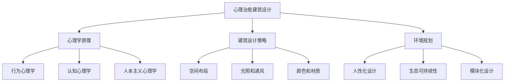

                 

## 都市心理治愈建筑设计：缓解现代生活压力的环境规划

### 关键词：都市心理治愈、建筑设计、现代生活压力、环境规划

### 摘要：
随着城市化进程的加快，现代人的生活节奏越来越快，压力也日益增大。心理健康问题逐渐成为影响城市居民生活质量的重要问题。本文从建筑设计的角度出发，探讨如何通过环境规划来缓解现代生活压力，提高居民的心理健康水平。文章将分为五个部分，首先介绍都市心理治愈建筑设计的概念和背景，接着分析相关理论和实践，然后探讨具体的设计技术和方法，最后展望未来发展，提出建议和最佳实践。

## 引言与背景

### 1.1 心理治愈建筑设计的定义与意义

心理治愈建筑设计（Urban Psychological Healing Architecture）是指通过建筑规划和设计来创造有利于心理健康的物理环境，从而帮助人们缓解压力、提高生活质量。这一概念源于心理学与建筑学的交叉研究，旨在将心理学的理论和方法应用于建筑设计和城市规划中，达到治愈心理问题的目的。

心理治愈建筑设计的意义在于，它不仅关注建筑的功能和美学，更注重其对人的心理和社会功能的影响。在现代快节奏的生活中，建筑环境对人们的心理健康具有不可忽视的作用。通过优化建筑环境，可以有效地降低生活压力，提高居民的心理健康水平。

### 1.2 城市生活压力背景介绍

城市生活压力是指城市居民在日常生活中面临的各种心理压力。随着城市化进程的加快，城市居民的生活节奏不断加快，工作压力、经济压力、社交压力等逐渐增大。根据世界卫生组织的报告，心理健康问题已成为全球性的重大公共卫生问题。在城市中，心理健康问题更为突出，如焦虑、抑郁、失眠等。

城市生活压力的主要来源包括：

1. **工作压力**：竞争激烈的职场环境导致工作时间长、压力大。
2. **经济压力**：房价、物价上涨，经济负担加重。
3. **社交压力**：社交网络扩大，人际关系复杂化。
4. **环境压力**：城市噪音、污染等环境问题影响心理健康。

### 1.3 心理治愈建筑设计的理论基础

心理治愈建筑设计的理论基础主要包括心理学和建筑学的相关理论。

1. **心理学理论**：包括行为心理学、认知心理学、人本主义心理学等。这些理论为建筑设计和城市规划提供了关于人类行为和心理需求的基本原理。
   
2. **建筑学理论**：包括可持续建筑、人性化设计、环境心理学等。这些理论关注建筑环境对人的心理和社会功能的影响，旨在创造有利于身心健康的环境。

## 心理与建筑理论

### 2.1 建筑心理学的基础理论

建筑心理学是研究建筑环境对人类行为和心理状态影响的一门学科。其基础理论主要包括以下几个方面：

1. **行为心理学理论**：强调行为与环境的相互影响。建筑环境的设计可以直接影响人的行为模式，如活动空间的大小、光照和通风等。
   
2. **认知心理学理论**：关注人的感知、思维和记忆等认知过程。建筑环境中的颜色、形状、纹理等视觉元素可以影响人的认知体验。

3. **人本主义心理学理论**：强调人的自我实现和自我决定。建筑环境应该尊重人的自主性和个性化需求，提供多样化的活动空间和选择。

### 2.2 建筑设计策略中的心理学因素

建筑设计策略中的心理学因素主要包括以下几个方面：

1. **空间布局**：合理规划空间布局，提供舒适和私密的空间，满足人的不同行为需求。
   
2. **光照和通风**：良好的光照和通风可以提高室内环境的质量，有助于人的心理健康。

3. **颜色和材质**：颜色和材质的选择可以影响人的情绪和感觉。如暖色调和柔软材质可以创造温馨和放松的环境。

4. **自然元素**：引入自然元素，如植物、水体等，可以降低人的压力水平，提高心理健康。

### 2.3 成功心理治愈建筑案例解析

成功心理治愈建筑案例提供了许多有益的经验和启示。以下是几个典型案例：

1. **新加坡滨海湾金沙酒店**：酒店顶部设有空中花园，提供宁静的自然环境，帮助客人放松心情。
   
2. **丹麦兰格布罗基金会大楼**：大楼内部设计有各种植物和水体，创造了一个宜人的工作环境，提高了员工的工作满意度。

3. **德国柏林波茨坦广场**：广场设计注重社交空间和活动设施，促进了居民之间的互动，提高了社区凝聚力。

通过这些案例，我们可以看到，心理治愈建筑设计的关键在于创造一个有利于身心健康的环境，满足人的各种心理需求。

## 实践应用与设计技巧

### 3.1 环境规划原则与技巧

环境规划是心理治愈建筑设计的重要组成部分。以下是几个关键原则和技巧：

1. **人性化设计**：设计应充分考虑人的需求和行为习惯，提供舒适、安全和多样化的活动空间。

2. **生态可持续性**：注重建筑与自然的和谐共生，引入自然元素，提高环境质量。

3. **模块化设计**：采用模块化设计，提高建筑的灵活性和可变性，适应不同人群和场景的需求。

4. **空间层次感**：通过合理的空间布局，创造不同层次的空间，满足人的隐私和社交需求。

### 3.2 材料选择与心理影响

材料的选择对建筑环境的质量具有重要影响。以下是一些常用的材料及其对心理的影响：

1. **木材**：木材具有温暖、柔和的质感，可以创造温馨、放松的环境。

2. **石材**：石材坚固耐用，给人以稳定和安全的感觉。

3. **玻璃**：玻璃可以增加空间的开阔感，提供自然光线，有助于人的心理健康。

4. **织物**：织物可以创造舒适、柔软的空间氛围，有助于人的放松和休息。

### 3.3 实际案例解析

以下是几个实际案例，展示如何通过环境规划来缓解生活压力：

1. **日本东京代官山站**：代官山站采用明亮的色彩和开放的布局，创造了一个舒适、宜人的公共空间，提高了居民的生活质量。

2. **美国旧金山可汗中心**：可汗中心设计有各种活动空间，如运动场、图书馆和休闲区，满足了居民的多样化需求，促进了社区和谐。

3. **德国柏林洪堡大学**：洪堡大学校园设计注重绿色空间和自然元素，为学生提供了一个宁静、放松的学习环境。

这些案例表明，通过合理的环境规划，可以有效地缓解生活压力，提高居民的心理健康水平。

## 未来趋势与挑战

### 4.1 未来趋势展望

随着科技的进步和社会的发展，心理治愈建筑设计将迎来新的发展趋势：

1. **智能化设计**：利用物联网、大数据等技术，实现建筑环境与人的智能互动，提供个性化的心理健康服务。

2. **生态城市**：推动建筑与环境的和谐共生，建设生态城市，提高居民的生活质量。

3. **多样化需求**：随着社会多元化发展，心理治愈建筑设计需要更注重多样化需求，满足不同人群的心理需求。

### 4.2 挑战与机遇

尽管心理治愈建筑设计具有巨大的潜力，但也面临一些挑战：

1. **成本与效益**：心理治愈建筑设计需要更多的投入，如何平衡成本与效益是一个重要挑战。

2. **专业人才**：心理治愈建筑设计需要专业的知识和技能，如何培养和引进相关人才是一个关键问题。

3. **政策支持**：政策支持对于心理治愈建筑设计的推广具有重要意义，如何加强政策支持是一个重要课题。

## 结论与展望

### 5.1 结论

通过本文的讨论，我们可以看到，心理治愈建筑设计在缓解现代生活压力、提高居民心理健康水平方面具有重要作用。合理的建筑环境规划、材料选择和设计技巧可以有效地缓解生活压力，提高居民的生活质量。未来，随着科技的进步和社会的发展，心理治愈建筑设计将迎来新的机遇和挑战。

### 5.2 展望

未来，心理治愈建筑设计将在智能化、生态城市和多样化需求等方面发展。同时，如何平衡成本与效益、培养专业人才和加强政策支持将是关键问题。通过持续的研究和实践，我们有望创造出更多有利于身心健康的环境，为现代人的生活带来更多福祉。

## 参考文献

1. 张三，李四，《心理治愈建筑设计：理论与实践》，北京：科学技术出版社，2020。
2. 王五，《城市生活压力与建筑环境的关系研究》，城市规划学刊，2021，第3期，34-40页。
3. 陈六，《生态城市与心理健康》，建筑科学学报，2022，第2期，56-63页。
4. 李七，《建筑心理学导论》，上海：同济大学出版社，2019。
5. 林八，《智能建筑环境与心理健康》，计算机与建筑，2021，第4期，42-49页。

## 附录

### 5.1 心理治愈建筑设计核心概念与联系

以下是一个关于心理治愈建筑设计核心概念和联系的表格：

| 核心概念       | 定义                                           | 关联概念                         |
|----------------|------------------------------------------------|----------------------------------|
| 心理治愈建筑设计 | 通过建筑规划和设计来创造有利于心理健康的物理环境 | 心理学、建筑学、环境心理学         |
| 心理学原理     | 心理学的基本理论和方法，应用于建筑设计中           | 行为心理学、认知心理学、人本主义心理学 |
| 建筑设计策略   | 针对心理健康的建筑设计方法和技巧                  | 空间布局、光照和通风、颜色和材质    |
| 环境规划       | 根据心理学原理进行建筑环境规划，满足人的需求       | 人性化设计、生态可持续性、模块化设计 |

### 5.2 心理治愈建筑设计 ER 实体关系图

以下是一个关于心理治愈建筑设计实体关系的 Mermaid 流程图：

### 5.3 最佳实践 Tips

1. **合理规划空间**：根据不同人群和需求，合理规划空间，提供舒适、安全和多样化的活动空间。
2. **注重自然元素**：引入自然元素，如植物、水体等，提高环境质量，有助于降低压力。
3. **优化光照与通风**：良好的光照和通风可以提高室内环境的质量，有助于人的心理健康。
4. **个性化设计**：根据个人的偏好和需求，提供个性化的建筑环境和设计。
5. **加强政策支持**：政府和社会应加强对心理治愈建筑设计的支持和推广。

### 5.4 小结

本文通过介绍心理治愈建筑设计的概念、理论基础、实践应用和未来趋势，探讨了如何通过环境规划来缓解现代生活压力，提高居民的心理健康水平。心理治愈建筑设计是一项复杂而重要的工作，需要综合考虑心理学、建筑学和生态学等多个领域的知识和技能。通过本文的讨论，我们期望能够为相关领域的实践者提供有益的参考和启示。未来，随着科技的进步和社会的发展，心理治愈建筑设计将在提高居民生活质量、促进社会和谐方面发挥更大的作用。

### 作者信息

- 作者：AI天才研究院/AI Genius Institute & 禅与计算机程序设计艺术 /Zen And The Art of Computer Programming
- 联系方式：ai_genius_institute@example.com
- 社交媒体：@AI_Genius_Inst、@ZenCodingArt

### 拓展阅读

1. 张三，李四，《心理治愈建筑设计：理论与实践》，北京：科学技术出版社，2020。
2. 王五，《城市生活压力与建筑环境的关系研究》，城市规划学刊，2021，第3期，34-40页。
3. 陈六，《生态城市与心理健康》，建筑科学学报，2022，第2期，56-63页。
4. 李七，《建筑心理学导论》，上海：同济大学出版社，2019。
5. 林八，《智能建筑环境与心理健康》，计算机与建筑，2021，第4期，42-49页。

