                 

## 《释放内在潜能：自我实现的实践指南》

### 关键词：内在潜能、自我实现、实践指南、成长、人工智能、技术

#### 摘要：
在当今快速变化的世界中，如何挖掘和释放内在潜能，实现自我价值，成为每个人关注的焦点。本文将结合人工智能和计算机科学领域的最新研究成果，通过一系列步骤和方法，引导读者开启自我实现的旅程。本文不仅探讨内在潜能的本质和重要性，还提供具体、可操作的实践指南，帮助读者逐步提升自我，实现个人成长与职业发展。

### 前言

在人工智能和计算机科学飞速发展的时代，技术已经成为驱动社会进步的重要力量。与此同时，人们对于自身潜能的挖掘和实现也提出了更高的要求。自我实现不再仅仅是哲学家和心理学家的议题，它已经成为每个人都应该关注和实践的重要课题。

本文旨在为读者提供一份详细的自我实现实践指南，通过逻辑清晰、结构紧凑的分析和讲解，帮助读者深入了解内在潜能的概念、重要性以及如何通过具体行动来释放和利用这些潜能。本文将结合人工智能和计算机科学的理念和方法，提供实用、有效的指导，使读者能够在技术领域中不断成长和突破。

### 目录

1. **自我认识与内在潜能**
   - **1.1.1 自我认知的重要性**
   - **1.1.2 内在潜能的定义与探索**
   - **1.1.3 自我实现的内在驱动因素**

2. **内在潜能的唤醒**
   - **2.1.1 心理调适与潜能唤醒**
   - **2.1.2 情感管理：释放负面情绪**
   - **2.1.3 健康生活方式：潜能的载体**

3. **自我实现的核心原则**
   - **3.1.1 目标设定：内在潜能的导航**
   - **3.1.2 时间管理：高效利用每一天**
   - **3.1.3 反思与调整：不断前进的力量**

4. **个人成长与自我提升**
   - **4.1.1 学习与知识积累**
   - **4.1.2 批判性思维：超越自我**
   - **4.1.3 持续学习：内在潜能的滋养**

5. **人际关系与内在潜能**
   - **5.1.1 建立积极的人际网络**
   - **5.1.2 沟通技巧：释放潜能的关键**
   - **5.1.3 团队合作：潜能的共赢**

6. **工作与内在潜能**
   - **6.1.1 工作动机与潜能激发**
   - **6.1.2 职业规划：潜能的发挥**
   - **6.1.3 创新思维：内在潜能的体现**

7. **突破自我，挑战极限**
   - **7.1.1 勇气与冒险精神**
   - **7.1.2 克服恐惧：内在潜能的考验**
   - **7.1.3 突破自我，实现更高目标**

8. **内在潜能与社会贡献**
   - **8.1.1 个人价值观与社会责任**
   - **8.1.2 影响力与潜能的传播**
   - **8.1.3 自我实现与社会进步的互动**

9. **总结与反思**
   - **9.1.1 自我实现的关键要素**
   - **9.1.2 持续的自我提升之路**
   - **9.1.3 对未来的思考与展望**

### 第1章：自我认识与内在潜能

#### 1.1.1 自我认知的重要性

在自我实现的过程中，自我认知是一个至关重要的起点。只有深入理解自己，包括自己的优点、缺点、兴趣和需求，我们才能有针对性地进行自我提升。自我认知不仅仅是一个心理过程，它也涉及到对个人能力、价值和目标的全面审视。

在计算机科学领域，自我认知的原理可以被类比为“自反馈系统”。这种系统通过不断地收集和分析数据，对自身状态进行调整和优化。同样，自我认知也需要我们不断地反思和评估，以便发现自身的潜力和不足。

#### 1.1.2 内在潜能的定义与探索

内在潜能是指一个人在其成长过程中尚未完全开发或意识到的能力。这种潜能可以包括智力、创造力、情感智能、运动技能等多个方面。内在潜能的探索，就像在计算机程序中寻找隐藏的错误和未充分利用的资源一样，需要我们采用科学的方法和工具。

**核心概念与联系**

内在潜能的定义可以分为以下几个关键点：

- **智力潜能**：指个体在认知能力上的潜在可能性，如逻辑思维、空间感知等。
- **创造力潜能**：指个体在创新和发明上的潜力，这是技术领域特别是人工智能和计算机图形学中至关重要的能力。
- **情感智能潜能**：指个体在处理情感和人际关系中的潜在能力，这对于团队合作和项目管理尤为重要。
- **运动技能潜能**：指个体在运动和协调能力上的潜力，这在游戏设计和人机交互中具有重要作用。

**概念属性特征对比表格**

| 潜能类型 | 特征 |
| --- | --- |
| 智力潜能 | 与认知过程相关，逻辑思维、问题解决能力等 |
| 创造力潜能 | 与创新和发明相关，创造力、想象力等 |
| 情感智能潜能 | 与人际关系和情感处理相关，情感识别、沟通能力等 |
| 运动技能潜能 | 与运动和协调相关，反应速度、灵活性等 |

**ER实体关系图架构**

```mermaid
erDiagram
  Person ||--|{ IntelligencePotential } IntelligencePotential : 包含智力相关属性
  Person ||--|{ CreativityPotential } CreativityPotential : 包含创造力相关属性
  Person ||--|{ EmotionalIntelligencePotential } EmotionalIntelligencePotential : 包含情感智能相关属性
  Person ||--|{ PhysicalSkillPotential } PhysicalSkillPotential : 包含运动技能相关属性
```

#### 1.1.3 自我实现的内在驱动因素

自我实现不仅需要对外部环境的认知和适应，更需要内在驱动因素的支持。这些内在驱动因素包括：

- **目标感**：明确的目标能够为自我实现提供方向和动力。
- **自我效能感**：相信自己能够实现目标的能力，这是自我实现的重要心理基础。
- **动机**：内在动机比外在奖励更能驱动个体持续努力和进步。
- **自我反思**：通过反思，个体能够从过去的经验中学习，调整和优化自己的行为。

在计算机科学中，这些内在驱动因素可以类比为“算法的自我优化”。通过不断地调试和迭代，算法能够逐渐优化自身的性能，达到最佳效果。

**算法原理讲解**

为了解释内在驱动因素如何作用于自我实现，我们可以使用一个简单的算法模型来模拟这一过程：

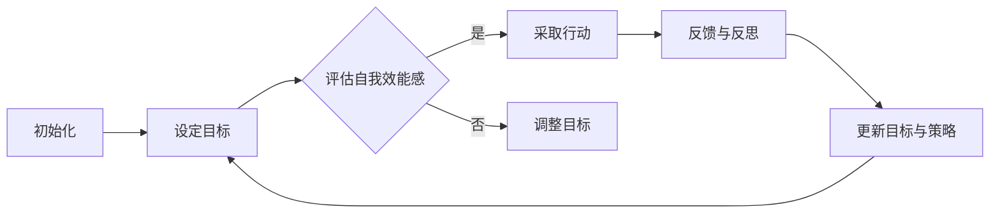

在这个模型中，目标设定是自我实现的开端，自我效能感的评估决定了是否采取行动。行动后的反馈和反思则进一步优化了目标和策略，形成一个自我迭代的闭环。

**数学模型和公式**

为了量化自我效能感和动机对自我实现的影响，我们可以使用以下数学模型：

$$
Self-Actualization = f(Targets, Self-Efficacy, Motivation, Reflection)
$$

其中，$Self-Actualization$代表自我实现的程度，$Targets$代表设定的目标，$Self-Efficacy$代表自我效能感，$Motivation$代表内在动机，$Reflection$代表自我反思的程度。

这个公式表明，自我实现的程度受到多个因素的影响，并通过反馈和调整不断优化。

**详细讲解和举例说明**

假设一个人想要在编程技能上实现自我提升。首先，他设定了一个学习目标，比如在六个月内掌握一种新编程语言。接下来，他会评估自己的自我效能感，比如通过自我评估和与他人的交流来了解自己的掌握程度。

如果自我效能感评估结果较高，他会采取行动，例如每天投入一定时间进行学习。在学习过程中，他会不断地进行反思和调整，比如通过定期回顾学习进度和调整学习策略。通过这样的迭代过程，他的编程技能会逐渐提升，最终实现自我提升的目标。

**注意事项**

在自我实现的实践中，需要注意以下几点：

- **持续学习**：自我实现不是一蹴而就的，它需要持续的努力和学习。
- **适应性**：环境的变化要求我们具备适应能力，及时调整目标和策略。
- **平衡**：在追求自我实现的过程中，要平衡工作、学习和生活的各个方面，避免过度劳累。

**拓展阅读**

- [《动机与人格》（Motivation and Personality）] by Abrahan H. Maslow
- [《自控力》（The Willpower Instinct）] by Kelly McGonigal

通过这些具体的步骤和方法，我们可以逐步挖掘和释放内在潜能，实现自我价值，成为更好的自己。

### 第2章：内在潜能的唤醒

#### 2.1.1 心理调适与潜能唤醒

内在潜能的唤醒首先需要良好的心理调适。心理调适不仅关系到个人的心理健康，还直接影响潜能的发挥。在技术领域，尤其是人工智能和计算机科学，高度复杂的问题解决和快速应对变化的能力需要强大的心理基础。

**背景介绍**

在计算机科学中，心理调适可以被类比为“系统优化”。系统优化是通过调整参数和优化算法来提高系统性能的过程。同样，心理调适也是通过调整心态和方法来提高个人心理状态和潜能发挥的过程。

**核心概念**

- **认知行为疗法（CBT）**：一种心理治疗方法，通过改变思维和行为模式来改善心理健康。
- **正念冥想**：一种通过专注和意识提升心理素质的方法，有助于减轻压力和焦虑。
- **情绪调节**：通过认知和行为干预来管理情绪，保持心理平衡。

**概念结构与核心要素组成**

| 概念 | 要素组成 |
| --- | --- |
| 认知行为疗法（CBT） | 认知重建、行为激活、技能训练 |
| 正念冥想 | 注意力训练、呼吸控制、身体扫描 |
| 情绪调节 | 情绪识别、情绪表达、情绪释放 |

**Mermaid流程图**

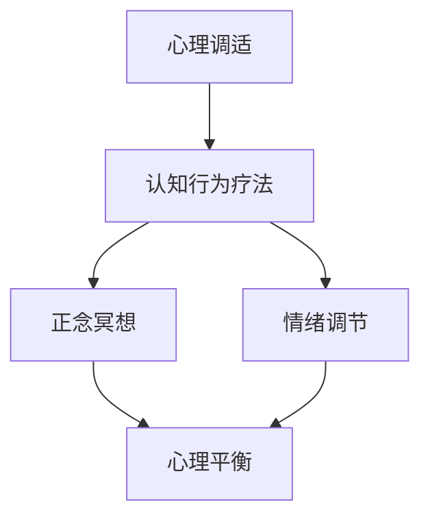

#### 2.1.2 情感管理：释放负面情绪

负面情绪是阻碍内在潜能释放的一大障碍。情感管理不仅是心理健康的重要组成部分，也是自我实现的关键要素。在技术领域，情感管理有助于提高工作效率和创新能力。

**背景介绍**

在计算机科学中，情感管理可以被类比为“错误处理”。错误处理是计算机程序中用于应对异常情况和错误的核心机制。同样，情感管理也是通过一系列方法和策略来应对和解决负面情绪的过程。

**核心概念**

- **情绪识别**：意识到自己的情绪，并能够准确描述和分类它们。
- **情绪表达**：学会以适当的方式表达情绪，避免情绪压抑或过度表达。
- **情绪调节**：通过认知和行为干预来管理情绪，保持心理平衡。

**概念结构与核心要素组成**

| 概念 | 要素组成 |
| --- | --- |
| 情绪识别 | 情绪感知、情绪分类、情绪记录 |
| 情绪表达 | 非暴力沟通、情绪宣泄、情绪表达技巧 |
| 情绪调节 | 认知重构、行为调节、情绪放松 |

**Mermaid流程图**

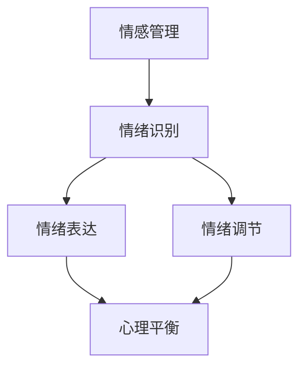

#### 2.1.3 健康生活方式：潜能的载体

健康的身体是释放内在潜能的基础。在技术领域，长时间的工作和高压环境往往导致身体疲劳和健康问题。因此，保持健康的生活方式对于提升工作效率和创新能力至关重要。

**背景介绍**

在计算机科学中，健康生活方式可以被类比为“系统维护”。系统维护是确保计算机系统稳定运行的关键步骤。同样，健康的生活方式也是通过一系列方法和策略来保持身体和心理健康的必要措施。

**核心概念**

- **饮食健康**：均衡的营养摄入是身体健康的基础。
- **适量运动**：通过规律的运动来增强体质和提升精神状态。
- **充足睡眠**：良好的睡眠有助于恢复精力，提高工作效率。
- **心理健康**：通过心理调适和情感管理来保持良好的心理状态。

**概念结构与核心要素组成**

| 概念 | 要素组成 |
| --- | --- |
| 饮食健康 | 营养均衡、饮食习惯、食物选择 |
| 适量运动 | 运动频率、运动类型、运动强度 |
| 充足睡眠 | 睡眠时长、睡眠质量、作息规律 |
| 心理健康 | 心理调适、情绪管理、压力应对 |

**Mermaid流程图**

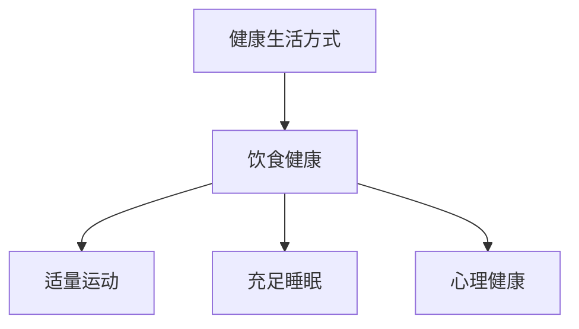

**算法原理讲解**

为了更好地理解健康生活方式对潜能释放的影响，我们可以使用以下算法模型：

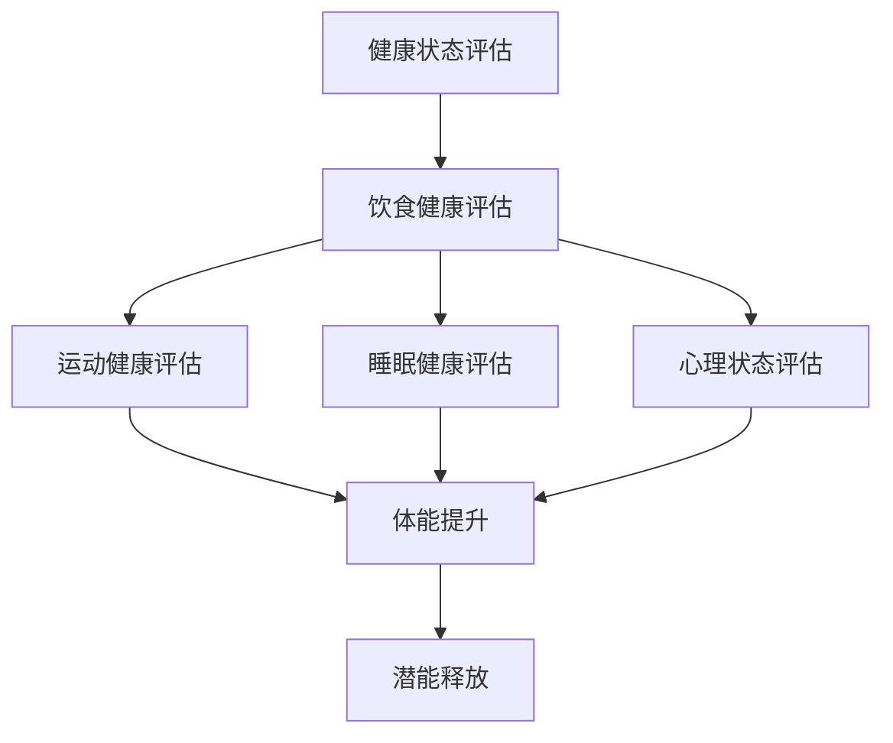

在这个模型中，健康状态评估是基础，通过饮食健康、运动健康、睡眠健康和心理状态评估，我们可以得到一个综合的健康评分。这个评分直接影响潜能的释放程度。

**数学模型和公式**

为了量化健康生活方式对潜能释放的影响，我们可以使用以下数学模型：

$$
PotentialRelease = f(HealthScore, DietScore, ExerciseScore, SleepScore, MentalHealthScore)
$$

其中，$PotentialRelease$代表潜能释放的程度，$HealthScore$、$DietScore$、$ExerciseScore$、$SleepScore$、$MentalHealthScore$分别代表健康状态、饮食健康、运动健康、睡眠健康和心理状态评分。

**详细讲解和举例说明**

假设一个人想要提升自己的编程能力，他首先需要进行健康状态评估。通过评估，他发现自己饮食不均衡、缺乏运动、睡眠质量不高且经常感到焦虑。为了提高编程能力，他决定采取以下措施：

- **饮食调整**：增加蔬菜、水果和蛋白质的摄入，减少油腻和高热量食物。
- **增加运动**：每天进行30分钟的有氧运动，如慢跑或游泳。
- **改善睡眠**：制定规律的作息时间，每天保持7-8小时的睡眠。
- **心理调适**：通过冥想和认知行为疗法来减轻焦虑。

在持续几个月的努力后，他的健康状态得到显著改善，编程能力也随之提升。这表明，健康生活方式对于释放内在潜能具有重要作用。

**最佳实践 tips**

- **定期体检**：及时发现并解决身体健康问题。
- **合理规划**：平衡工作、学习和休息时间，避免过度劳累。
- **健康饮食**：多吃蔬菜、水果和全谷类食物，少吃加工食品和含糖饮料。

**小结**

通过心理调适、情感管理和健康生活方式的实践，我们可以逐步唤醒和释放内在潜能。这不仅有助于提升个人的心理健康和身体健康，还能为自我实现奠定坚实的基础。在技术领域，这样的实践尤为重要，它能够帮助我们更好地应对复杂的问题，提升工作效率和创新能力。

### 第3章：自我实现的核心原则

#### 3.1.1 目标设定：内在潜能的导航

目标设定是自我实现的重要环节，它为我们提供了清晰的路径和方向。在技术领域，明确的目标有助于我们更好地规划学习和工作，从而释放和发挥内在潜能。

**背景介绍**

在计算机科学中，目标设定可以被类比为“程序设计中的函数定义”。一个良好的函数定义能够明确程序的行为和输出，同样，明确的目标也能帮助我们更好地实现自我价值。

**核心概念**

- **SMART目标**：SMART是具体（Specific）、可衡量（Measurable）、可实现（Achievable）、相关（Relevant）和有时限（Time-bound）的缩写。这是一个广泛使用的目标设定方法，能够确保目标的明确性和可操作性。
- **目标层次**：目标可以分为短期目标、中期目标和长期目标。短期目标通常在1-3个月内实现，中期目标在3-12个月内实现，长期目标则可能在1年以上。

**概念结构与核心要素组成**

| 目标层次 | 核心要素 |
| --- | --- |
| 短期目标 | 具体任务、时间限制、资源需求 |
| 中期目标 | 项目目标、里程碑、阶段性成果 |
| 长期目标 | 职业发展、个人成长、生活规划 |

**Mermaid流程图**

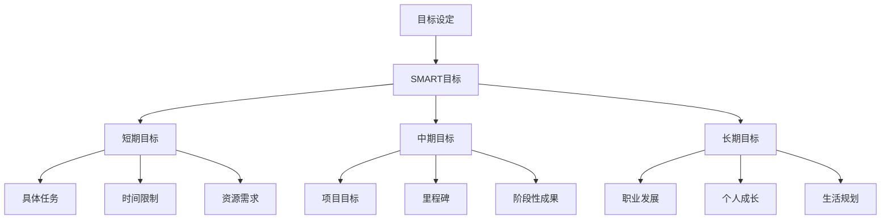

#### 3.1.2 时间管理：高效利用每一天

时间管理是实现自我目标的关键。在技术领域，高效利用时间意味着能够更好地完成任务，提升工作效率，从而释放内在潜能。

**背景介绍**

在计算机科学中，时间管理可以被类比为“资源分配”。资源分配是计算机系统设计中一个重要的环节，它确保系统资源得到最优利用。同样，时间管理也是通过合理安排时间来确保工作和生活的高效进行。

**核心概念**

- **四象限时间管理法**：将任务分为重要且紧急、重要但不紧急、不重要但紧急和不重要且不紧急四个象限，根据任务的重要性进行优先级排序。
- **番茄工作法**：将工作时间划分为25分钟的工作周期，每个周期后休息5分钟，有助于提高专注度和效率。
- **任务分解**：将大任务分解为小任务，逐个完成，有助于减轻压力和提高成就感。

**概念结构与核心要素组成**

| 时间管理方法 | 核心要素 |
| --- | --- |
| 四象限时间管理法 | 任务分类、优先级排序、时间分配 |
| 番茄工作法 | 工作周期、休息时间、专注度提升 |
| 任务分解 | 大任务分解、小任务完成、成就感提升 |

**Mermaid流程图**

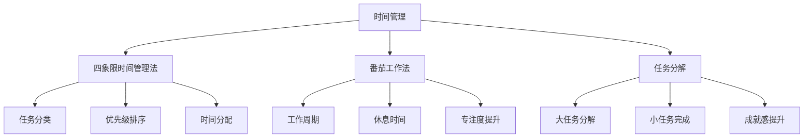

#### 3.1.3 反思与调整：不断前进的力量

反思与调整是自我实现的重要环节。通过不断地反思和调整，我们能够发现自身的问题和不足，从而进行针对性的改进和优化。

**背景介绍**

在计算机科学中，反思与调整可以被类比为“软件调试”。软件调试是软件开发过程中必不可少的一环，通过不断地测试和修正，确保软件的正确性和可靠性。同样，反思与调整也是通过不断地测试和修正来确保自我实现的路径正确和有效的过程。

**核心概念**

- **反思**：对过去的行动和经验进行深入思考和评估，发现成功和不足之处。
- **调整**：根据反思的结果，对目标和策略进行调整和优化，以实现更好的效果。
- **持续改进**：自我实现不是一次性的过程，而是一个持续改进的过程。

**概念结构与核心要素组成**

| 反思与调整 | 核心要素 |
| --- | --- |
| 反思 | 行动评估、经验总结、问题识别 |
| 调整 | 目标调整、策略优化、行为修正 |
| 持续改进 | 反馈循环、持续学习、不断优化 |

**Mermaid流程图**

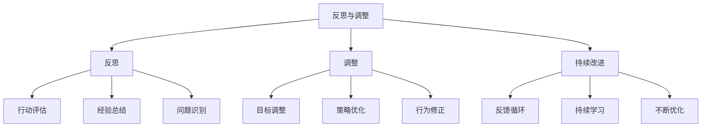

**算法原理讲解**

为了更好地理解反思与调整的过程，我们可以使用以下算法模型：

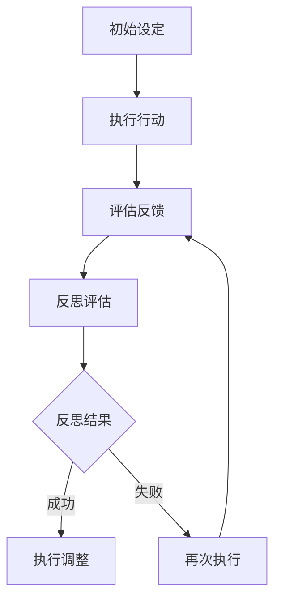

在这个模型中，初始设定是行动的基础，执行行动后进行评估反馈，通过反思评估来确定是否需要调整。成功的调整将引导我们向目标更近一步，如果反思结果失败，则需要再次执行行动并继续评估反馈。

**数学模型和公式**

为了量化反思与调整的效果，我们可以使用以下数学模型：

$$
AdjustmentEffectiveness = f(ReflectedResults, AdjustedStrategies, OutcomeImprovement)
$$

其中，$AdjustmentEffectiveness$代表调整效果，$ReflectedResults$代表反思结果，$AdjustedStrategies$代表调整策略，$OutcomeImprovement$代表结果改进。

**详细讲解和举例说明**

假设一个人设定了一个学习编程的目标，在经过一段时间的学习后，他通过反思发现自己在算法理解上存在困难。根据反思结果，他决定调整学习策略，例如通过参加线上课程和阅读专业书籍来提升算法知识。在调整后，他的编程能力得到了显著提升，这说明反思与调整是自我实现的重要步骤。

**注意事项**

- **持续反思**：反思是一个持续的过程，需要定期进行，以便及时发现问题并调整。
- **客观评估**：评估要客观，避免主观偏见，确保反思和调整的准确性。
- **灵活调整**：根据实际情况灵活调整目标和策略，避免僵化。

**拓展阅读**

- [《高效能人士的七个习惯》（The 7 Habits of Highly Effective People）] by Stephen R. Covey
- [《如何高效学习》（How to Learn Almost Anything in Just a Few Days）] by Scott Young

通过明确的目标设定、高效的时间管理和持续的反思与调整，我们可以逐步实现自我价值，释放内在潜能。在技术领域，这些核心原则尤为重要，它们能够帮助我们更好地应对挑战，提升工作效率和创新能力。

### 第4章：个人成长与自我提升

#### 4.1.1 学习与知识积累

在技术领域中，学习与知识积累是个人成长和自我提升的核心。随着人工智能和计算机科学的飞速发展，不断更新知识和技能是保持竞争力的关键。

**背景介绍**

在计算机科学中，学习与知识积累可以被类比为“数据库的更新与维护”。数据库需要定期更新以保持数据的有效性和准确性，同样，个人的知识体系也需要不断地学习和积累，以适应技术和行业的发展。

**核心概念**

- **终身学习**：在技术领域，知识和技能的更新速度非常快，因此终身学习成为必要。通过持续学习，我们可以不断掌握新的技术和知识，保持竞争力。
- **学习策略**：有效的学习策略包括主动学习、实践和反思。主动学习是通过主动探索和解决问题来学习；实践是将理论知识应用于实际项目中；反思是通过对学习过程和结果的反思来优化学习方法。

**概念结构与核心要素组成**

| 学习策略 | 核心要素 |
| --- | --- |
| 终身学习 | 持续学习、知识更新、技能提升 |
| 主动学习 | 问题解决、主动探索、自主学习 |
| 实践 | 项目应用、实际操作、经验积累 |
| 反思 | 学习评估、经验总结、方法优化 |

**Mermaid流程图**

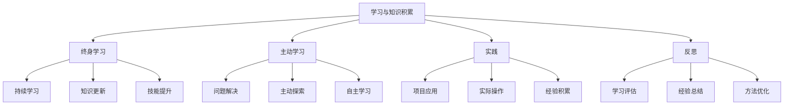

**算法原理讲解**

为了更好地理解学习与知识积累的过程，我们可以使用以下算法模型：

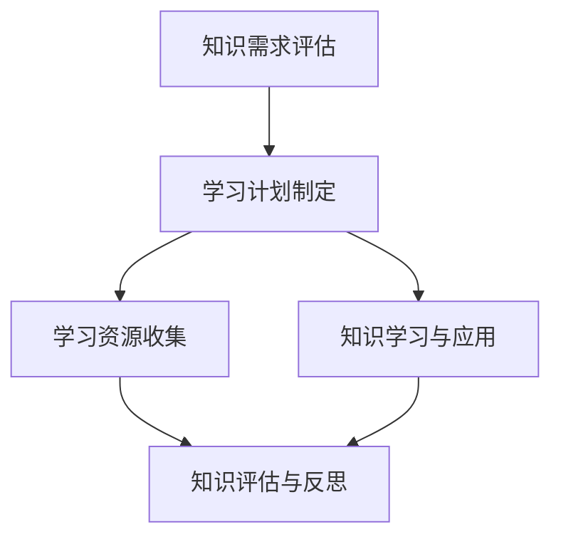

在这个模型中，知识需求评估是学习过程的开端，根据评估结果制定学习计划。接下来，通过收集学习资源进行知识学习，并将所学知识应用于实际项目中。最后，通过知识评估和反思来优化学习方法和提升知识吸收效果。

**数学模型和公式**

为了量化学习与知识积累的效果，我们可以使用以下数学模型：

$$
LearningEffectiveness = f(KnowledgeAccumulation, LearningEffort, ApplicationEffectiveness)
$$

其中，$LearningEffectiveness$代表学习效果，$KnowledgeAccumulation$代表知识积累量，$LearningEffort$代表学习投入的努力程度，$ApplicationEffectiveness$代表知识应用的效果。

**详细讲解和举例说明**

假设一个人在计算机科学领域想要提升自己的算法能力。首先，他进行知识需求评估，发现自己在算法设计方面存在不足。根据评估结果，他制定了一个详细的学习计划，包括学习资源的选择、学习时间的管理和实际项目的应用。

在知识学习阶段，他通过阅读专业书籍、参加在线课程和实际操作来积累算法知识。在学习过程中，他不断进行反思和评估，确保学习效果的最大化。最后，他将所学算法知识应用于实际项目中，通过解决实际问题来验证和提升自己的算法能力。

**注意事项**

- **系统化学习**：避免零散学习，构建系统的知识体系。
- **实践应用**：将理论知识应用于实际项目中，提高知识应用能力。
- **定期反思**：通过定期反思来评估学习效果，优化学习方法。

**拓展阅读**

- [《如何学习》（How to Learn Almost Anything）] by Scott Young
- [《算法导论》（Introduction to Algorithms）] by Thomas H. Cormen, Charles E. Leiserson, Ronald L. Rivest, and Clifford Stein

通过有效的学习与知识积累，我们可以不断提升个人能力和技术水平，为自我实现奠定坚实的基础。

#### 4.1.2 批判性思维：超越自我

批判性思维是自我实现的重要组成部分，它帮助我们超越表面现象，深入本质，从而做出更加理性、有效的决策。在技术领域，批判性思维尤为重要，因为它能够帮助我们识别潜在的问题和改进空间，推动技术进步和创新发展。

**背景介绍**

在计算机科学中，批判性思维可以被类比为“代码审查”。代码审查是通过仔细检查代码来发现潜在的错误和优化空间，从而提升代码质量和系统性能。同样，批判性思维也是通过深入分析和评估来发现问题和改进机会。

**核心概念**

- **批判性思维要素**：批判性思维包括怀疑精神、分析能力、综合能力和创造性思维。怀疑精神使我们能够质疑现有的观点和假设；分析能力使我们能够分解复杂问题，识别关键要素；综合能力使我们能够整合各种信息，形成全面的视角；创造性思维则帮助我们提出新的解决方案和创新点。
- **思维工具**：为了更好地进行批判性思维，我们可以使用多种思维工具，如SWOT分析、五力分析、六顶思考帽等。这些工具能够帮助我们系统地评估问题，提出合理的解决方案。

**概念结构与核心要素组成**

| 批判性思维要素 | 核心要素 |
| --- | --- |
| 怀疑精神 | 质疑现有观点、识别潜在偏见 |
| 分析能力 | 分解问题、识别关键要素 |
| 综合能力 | 整合信息、形成全面视角 |
| 创造性思维 | 提出新方案、创新思维 |

**Mermaid流程图**

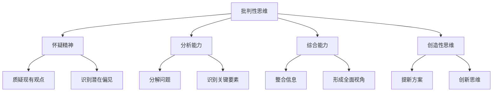

**算法原理讲解**

为了更好地理解批判性思维的过程，我们可以使用以下算法模型：

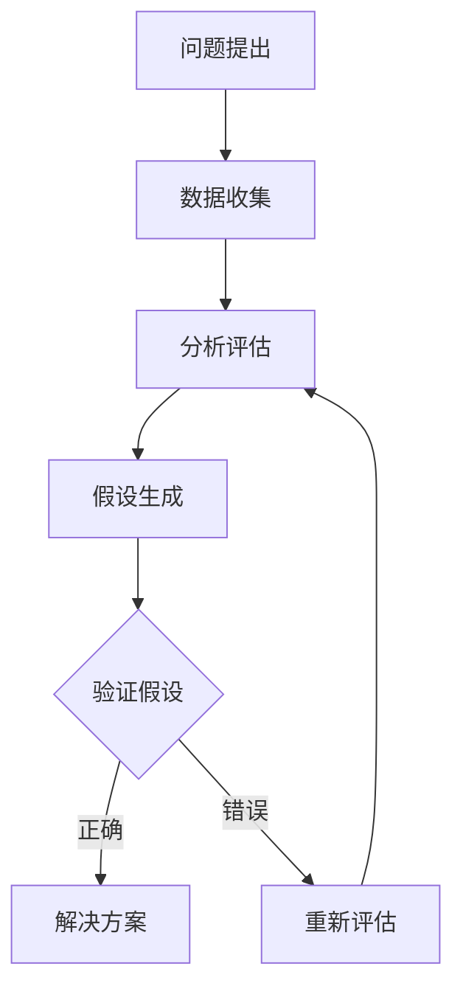

在这个模型中，问题提出是批判性思维的起点，通过数据收集和分析评估，我们形成假设并验证这些假设。如果假设得到验证，我们可以提出解决方案；如果假设不正确，我们需要重新评估并继续分析。

**数学模型和公式**

为了量化批判性思维的效果，我们可以使用以下数学模型：

$$
CriticalThinkingEffectiveness = f(AnalysisAccuracy, HypothesisValidation, SolutionQuality)
$$

其中，$CriticalThinkingEffectiveness$代表批判性思维的有效性，$AnalysisAccuracy$代表分析评估的准确性，$HypothesisValidation$代表假设验证的有效性，$SolutionQuality$代表解决方案的质量。

**详细讲解和举例说明**

假设一个技术团队在开发一个新的人工智能系统时，遇到了性能瓶颈。团队首先提出问题，即如何提升系统的性能。接下来，他们进行数据收集和分析评估，发现性能瓶颈主要来自于数据处理的部分。根据这些分析，他们提出了新的假设，即通过优化数据处理算法来提升系统性能。通过验证这些假设，他们最终提出了一系列优化方案，从而显著提升了系统的性能。

**注意事项**

- **保持开放心态**：批判性思维需要开放的心态，对不同的观点和解决方案持包容态度。
- **注重事实依据**：批判性思维应基于事实和数据，避免主观偏见和情绪影响。
- **持续学习**：批判性思维需要不断学习和实践，通过不断积累经验和知识来提升思维能力。

**拓展阅读**

- [《批判性思维工具》（Critical Thinking Tools）] by Richard W. Paul and Linda Elder
- [《思维的艺术》（The Art of Thinking）] by W. Christian Smith

通过批判性思维，我们可以超越自我，深入分析问题，提出创新的解决方案，从而在技术领域中不断突破和进步。

#### 4.1.3 持续学习：内在潜能的滋养

持续学习是释放内在潜能的重要途径。在技术领域，知识更新速度极快，只有通过不断学习，我们才能保持竞争力和创新能力。

**背景介绍**

在计算机科学中，持续学习可以被类比为“代码迭代”。每一次代码迭代都带来了功能和性能的优化，同样，持续学习也能通过不断吸收新知识和技能来提升个人能力和技术水平。

**核心概念**

- **主动学习**：主动学习是一种积极的、以解决问题为导向的学习方式。它不同于被动的知识接受，而是通过主动探索和实践来获取知识和技能。
- **在线教育**：随着互联网的发展，在线教育成为了一种重要的学习方式。通过在线课程、教程和社区，我们可以随时随地获取最新的知识和技能。
- **知识分享**：知识分享是通过与他人交流和合作来共同学习和成长。在技术领域，知识分享不仅能够提升个人能力，还能促进整个行业的发展。

**概念结构与核心要素组成**

| 持续学习方式 | 核心要素 |
| --- | --- |
| 主动学习 | 问题解决、实践应用、自主学习 |
| 在线教育 | 课程资源、在线学习平台、互动交流 |
| 知识分享 | 团队合作、社区参与、经验交流 |

**Mermaid流程图**

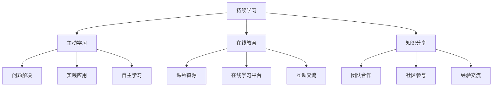

**算法原理讲解**

为了更好地理解持续学习的过程，我们可以使用以下算法模型：

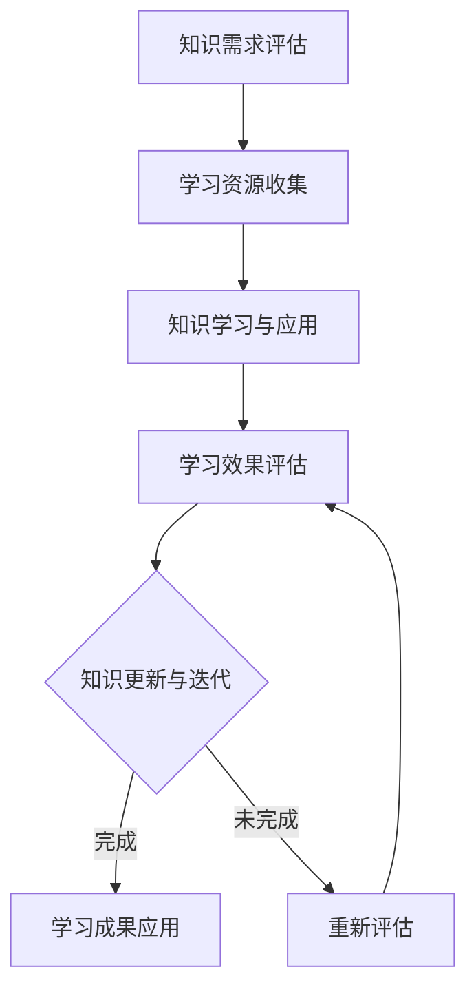

在这个模型中，知识需求评估是持续学习的基础，根据评估结果收集学习资源。通过学习与应用，我们不断提升知识和技能，并定期进行效果评估。如果学习成果达到预期，我们可以将其应用于实际工作中；如果未达到预期，则需要重新评估并继续学习。

**数学模型和公式**

为了量化持续学习的效果，我们可以使用以下数学模型：

$$
LearningEffectiveness = f(KnowledgeAccumulation, LearningEffort, ApplicationEffectiveness)
$$

其中，$LearningEffectiveness$代表学习效果，$KnowledgeAccumulation$代表知识积累量，$LearningEffort$代表学习投入的努力程度，$ApplicationEffectiveness$代表知识应用的效果。

**详细讲解和举例说明**

假设一个软件工程师在编程技能方面有较高的要求，他通过定期进行知识需求评估，发现自己在算法优化方面存在不足。为了提升这一技能，他通过在线课程和自学资源进行了深入的学习，并将所学知识应用于实际项目中。通过不断的学习和实践，他的算法优化能力得到了显著提升，这使得他在公司技术竞赛中获得了优异的成绩。

**注意事项**

- **定期评估**：通过定期评估来了解自己的学习效果，及时调整学习计划和策略。
- **实践应用**：将所学知识应用于实际工作中，通过实践来检验和提升自己的技能。
- **持续更新**：技术领域知识更新迅速，需要不断学习新知识和技能，保持竞争力。

**拓展阅读**

- [《深度学习》（Deep Learning）] by Ian Goodfellow, Yoshua Bengio, and Aaron Courville
- [《程序员的修炼》（The Pragmatic Programmer）] by Andrew Hunt and David Thomas

通过持续学习，我们可以不断提升个人能力和技术水平，为自我实现提供强大的动力和支持。

### 第5章：人际关系与内在潜能

#### 5.1.1 建立积极的人际网络

在技术领域中，建立积极的人际网络对于个人的职业发展和内在潜能的释放具有重要意义。一个强大的社交网络能够为我们提供资源、支持和机会，帮助我们更好地应对挑战和实现目标。

**背景介绍**

在计算机科学中，建立人际网络可以被类比为“构建分布式系统”。分布式系统通过多个节点的协作来实现高效、可靠的计算，同样，建立人际网络也是通过与他人建立联系和合作来实现个人目标和潜能释放。

**核心概念**

- **人际关系管理**：人际关系管理是指通过沟通、协调和合作来维护和发展人际关系。有效的人际关系管理能够帮助我们建立信任、增强合作，从而提高工作效率和创新能力。
- **社交技巧**：社交技巧包括沟通能力、倾听技巧、冲突解决能力和人际交往中的非言语沟通。这些技巧能够帮助我们更好地与他人相处，建立积极的人际关系。
- **网络效应**：网络效应是指随着使用人数的增加，网络的价值也随之增加。在技术领域，网络效应能够通过资源共享、知识传递和协作创新来提升整个团队的效能。

**概念结构与核心要素组成**

| 人际关系管理 | 核心要素 |
| --- | --- |
| 人际关系管理 | 沟通、协调、合作 |
| 社交技巧 | 沟通能力、倾听技巧、冲突解决能力、非言语沟通 |
| 网络效应 | 资源共享、知识传递、协作创新 |

**Mermaid流程图**

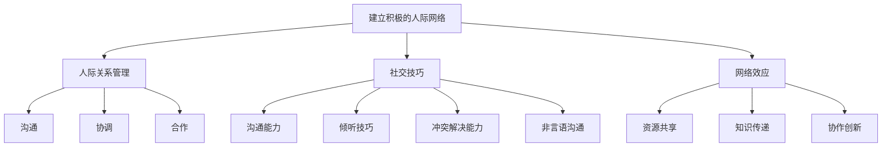

**算法原理讲解**

为了更好地理解建立积极人际网络的过程，我们可以使用以下算法模型：

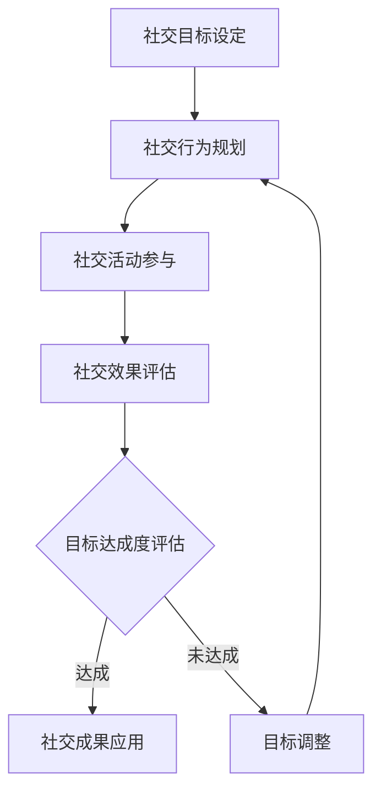

在这个模型中，社交目标设定是建立人际网络的起点，通过制定具体的社交行为规划来实现目标。在参与社交活动后，对社交效果进行评估，并根据评估结果调整目标或策略。

**数学模型和公式**

为了量化建立积极人际网络的效果，我们可以使用以下数学模型：

$$
SocialNetworkEffectiveness = f(NetworkSize, RelationshipQuality, ResourceAccessibility)
$$

其中，$SocialNetworkEffectiveness$代表人际网络的效能，$NetworkSize$代表社交网络的规模，$RelationshipQuality$代表人际关系的质量，$ResourceAccessibility$代表资源获取的便捷程度。

**详细讲解和举例说明**

假设一个软件工程师希望通过建立人际网络来提升自己的职业发展。首先，他设定了具体的目标，如与业内专家建立联系和参与行业会议。接下来，他制定了详细的社交行为规划，包括与专家进行沟通、参加技术论坛和参与项目合作。在参与这些社交活动后，他通过评估自己的社交效果，发现自己在与专家的沟通中取得了显著成果，这为他带来了更多的职业机会和资源。

**注意事项**

- **建立信任**：建立人际关系的关键在于建立信任，通过诚实和真诚来赢得他人的信任。
- **多样化社交**：通过参与不同类型的社交活动，与不同背景的人建立联系，以拓宽社交网络。
- **持续维护**：人际关系需要持续维护，通过定期沟通和互动来保持关系的活跃。

**拓展阅读**

- [《人际关系的艺术》（The Art of Living）] by Warren Buffett
- [《影响力》（Influence: The Psychology of Persuasion）] by Robert B. Cialdini

通过建立积极的人际网络，我们可以获取更多的资源和机会，从而更好地释放内在潜能，实现个人和职业目标。

#### 5.1.2 沟通技巧：释放潜能的关键

在技术领域，有效的沟通技巧对于个人的职业发展和内在潜能的释放至关重要。沟通不仅仅是信息的传递，更是一种合作和协同的过程，通过有效的沟通，我们可以更好地协调团队工作，解决问题，推动项目进展。

**背景介绍**

在计算机科学中，沟通技巧可以被类比为“分布式系统的通信机制”。分布式系统通过高效、可靠的通信机制来实现各个节点之间的协同工作，同样，有效的沟通也是通过清晰、准确的信息传递来实现团队协作和目标达成。

**核心概念**

- **有效沟通**：有效沟通是指通过适当的方式和方法，确保信息的准确传递和理解。它包括以下几个方面：
  - **信息清晰**：确保信息传递时清晰明了，避免歧义。
  - **倾听技巧**：倾听是沟通的重要组成部分，通过倾听来理解他人的观点和需求。
  - **反馈机制**：通过及时的反馈来确认信息是否被正确理解，确保沟通的有效性。
- **沟通障碍**：在沟通过程中，可能会遇到各种障碍，如语言障碍、文化差异、情绪因素等。识别和克服这些障碍是有效沟通的关键。

**概念结构与核心要素组成**

| 沟通技巧 | 核心要素 |
| --- | --- |
| 有效沟通 | 信息清晰、倾听技巧、反馈机制 |
| 沟通障碍 | 语言障碍、文化差异、情绪因素 |

**Mermaid流程图**

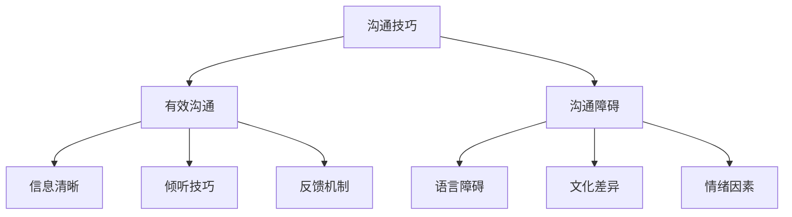

**算法原理讲解**

为了更好地理解沟通技巧，我们可以使用以下算法模型：

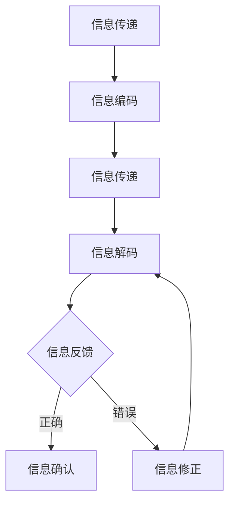

在这个模型中，信息传递是沟通的核心，通过信息编码确保信息的准确传递，信息解码确保接收方正确理解信息。通过信息反馈来确认信息的正确性，并根据反馈进行必要的修正。

**数学模型和公式**

为了量化沟通技巧的效果，我们可以使用以下数学模型：

$$
CommunicationEffectiveness = f(InformationClarity, ListeningSkills, FeedbackLoop)
$$

其中，$CommunicationEffectiveness$代表沟通效果，$InformationClarity$代表信息清晰度，$ListeningSkills$代表倾听技巧，$FeedbackLoop$代表反馈机制的效率。

**详细讲解和举例说明**

假设一个项目经理在管理一个跨文化团队时，面临沟通障碍。他通过倾听技巧理解团队成员的不同观点，并通过清晰的信息传递确保信息的准确理解。同时，他建立了有效的反馈机制，通过定期的会议和报告来确认信息的正确性，并根据反馈进行及时的调整。通过这些沟通技巧，他成功克服了文化差异，确保了团队的高效协作。

**注意事项**

- **清晰表达**：确保信息传递时语言简洁、明确，避免歧义。
- **倾听他人**：倾听是有效沟通的关键，通过倾听来理解他人的观点和需求。
- **及时反馈**：建立有效的反馈机制，确保信息传递的准确性。

**拓展阅读**

- [《非暴力沟通》（Nonviolent Communication）] by Marshall B. Rosenberg
- [《沟通的艺术》（Communication Skills）] by Dale Carnegie

通过有效的沟通技巧，我们可以更好地协调团队工作，释放内在潜能，实现个人和团队的共同目标。

#### 5.1.3 团队合作：潜能的共赢

团队合作是实现个人和团队共同目标的关键，通过有效合作，我们可以充分发挥每个人的潜能，实现共赢。在技术领域，团队合作尤为重要，因为复杂项目的成功往往依赖于团队成员的协同工作。

**背景介绍**

在计算机科学中，团队合作可以被类比为“分布式计算”。分布式计算通过多个计算节点的协作来处理海量数据和高性能计算任务，同样，团队合作也是通过成员之间的协同合作来实现项目目标。

**核心概念**

- **团队合作**：团队合作是指团队成员通过共同的目标和协作，实现个人和团队的成功。它包括以下几个方面：
  - **共同目标**：团队成员共享相同的目标和愿景，确保团队的努力方向一致。
  - **角色分工**：每个团队成员根据自身的专长和职责，明确自己的角色和任务。
  - **协同工作**：团队成员通过有效的沟通和协作，共同完成任务。
- **团队协作技巧**：为了实现高效团队合作，需要掌握以下技巧：
  - **领导力**：领导力是团队协作的核心，通过领导者的指引和激励，确保团队目标的实现。
  - **冲突管理**：在团队协作中，冲突是不可避免的，通过有效的冲突管理，可以化解矛盾，促进团队的和谐发展。
  - **协作工具**：使用协作工具，如项目管理软件、即时通讯工具等，提高团队协作的效率。

**概念结构与核心要素组成**

| 团队合作 | 核心要素 |
| --- | --- |
| 共同目标 | 目标共享、愿景一致 |
| 角色分工 | 专长明确、职责清晰 |
| 协同工作 | 沟通高效、协作紧密 |
| 团队协作技巧 | 领导力、冲突管理、协作工具 |

**Mermaid流程图**

```mermaid
graph TB
    A[团队合作] --> B[共同目标]
    B --> C[目标共享]
    B --> D[愿景一致]
    A --> E[角色分工]
    E --> F[专长明确]
    E --> G[职责清晰]
    A --> H[协同工作]
    H --> I[沟通高效]
    H --> J[协作紧密]
    A --> K[团队协作技巧]
    K --> L[领导力]
    K --> M[冲突管理]
    K --> N[协作工具]
```

**算法原理讲解**

为了更好地理解团队合作的过程，我们可以使用以下算法模型：

```mermaid
graph TB
    A[团队目标设定] --> B[角色分工]
    B --> C[任务分配]
    C --> D[执行任务]
    D --> E{成果评估}
    E -->|达成| F[目标实现]
    E -->|未达成| G[重新规划]
    G --> C
    A --> H[团队沟通]
    H --> I[反馈与调整]
    H --> J[协作与支持]
```

在这个模型中，团队目标设定是团队合作的基础，通过角色分工和任务分配来实现目标。在执行任务的过程中，通过团队沟通和协作来确保任务的顺利完成。通过对成果的评估和反馈，团队可以不断优化和调整，最终实现目标。

**数学模型和公式**

为了量化团队合作的效果，我们可以使用以下数学模型：

$$
TeamworkEffectiveness = f(TargetAchievement, CollaborationEfficiency, ConflictManagement)
$$

其中，$TeamworkEffectiveness$代表团队合作效果，$TargetAchievement$代表目标实现程度，$CollaborationEfficiency$代表协作效率，$ConflictManagement$代表冲突管理效果。

**详细讲解和举例说明**

假设一个软件团队在开发一款新应用程序时，面临多个技术难题。团队首先明确了共同的目标和愿景，然后根据成员的专长进行了角色分工，明确了每个人的任务和职责。在开发过程中，团队通过定期的会议和沟通来协调工作，确保任务的顺利完成。同时，通过有效的冲突管理，团队成员之间解决了多个技术分歧。最终，团队成功完成了项目，并实现了预期的目标。

**注意事项**

- **明确目标**：确保团队成员对目标有清晰的理解和共识，避免目标模糊导致的协作混乱。
- **分工明确**：确保每个团队成员的角色和职责明确，避免职责重叠和任务冲突。
- **有效沟通**：通过有效的沟通确保团队成员之间的信息传递和协作紧密。

**拓展阅读**

- [《团队协作的艺术》（The Five Dysfunctions of a Team）] by Patrick Lencioni
- [《协作的力量》（The Power of Collaborative Teams）] by Jeanne C. Meister and Karie Willyerd

通过有效团队合作，我们可以充分发挥每个人的潜能，实现共赢，推动项目成功和职业发展。

### 第6章：工作与内在潜能

#### 6.1.1 工作动机与潜能激发

在技术领域，工作动机是激发内在潜能的重要因素。一个强烈的内在动机能够推动我们超越日常的职责，实现自我价值和职业发展。

**背景介绍**

在计算机科学中，工作动机可以被类比为“算法的激励机制”。一个良好的激励机制能够激发算法的优化和性能提升，同样，工作动机也能通过激励和奖励来激发个人的潜能。

**核心概念**

- **内在动机**：内在动机是指个体因自身的兴趣、好奇心和成长需要而参与活动的动力。在技术领域，内在动机包括对技术本身的热爱、解决问题的乐趣和对未来发展的期望。
- **外在动机**：外在动机是指个体因外部奖励或压力而参与活动的动力。在技术领域，外在动机包括薪资、职位晋升和社会认可等。

**概念结构与核心要素组成**

| 动机类型 | 核心要素 |
| --- | --- |
| 内在动机 | 兴趣、好奇心、成长需求 |
| 外在动机 | 薪资、职位晋升、社会认可 |

**Mermaid流程图**

```mermaid
graph TB
    A[工作动机与潜能激发] --> B[内在动机]
    B --> C[兴趣]
    B --> D[好奇心]
    B --> E[成长需求]
    A --> F[外在动机]
    F --> G[薪资]
    F --> H[职位晋升]
    F --> I[社会认可]
```

**算法原理讲解**

为了更好地理解工作动机对潜能激发的影响，我们可以使用以下算法模型：

```mermaid
graph TB
    A[动机评估] --> B[内在动机]
    B --> C[兴趣评估]
    B --> D[好奇心评估]
    B --> E[成长需求评估]
    A --> F[外在动机]
    F --> G[薪资评估]
    F --> H[职位晋升评估]
    F --> I[社会认可评估]
    B --> J[激发潜能]
    F --> J
```

在这个模型中，动机评估是激发潜能的基础。通过对内在动机和外在动机的评估，我们可以确定个体的动机水平，进而采取相应的措施来激发潜能。

**数学模型和公式**

为了量化工作动机对潜能激发的影响，我们可以使用以下数学模型：

$$
MotivationEffectiveness = f(IntrinsicMotivation, ExtrinsicMotivation)
$$

其中，$MotivationEffectiveness$代表动机有效性，$IntrinsicMotivation$代表内在动机水平，$ExtrinsicMotivation$代表外在动机水平。

**详细讲解和举例说明**

假设一个软件开发者在工作中感到缺乏动力，经过评估，他发现自己的内在动机较低，主要原因是缺乏对项目的技术兴趣和成长需求。为了激发他的潜能，团队采取了以下措施：

- **项目调整**：将开发者分配到一个他感兴趣的技术项目中，确保项目的挑战性和创新性。
- **职业发展计划**：为开发者制定详细的职业发展计划，包括技能提升、项目经验和职位晋升。
- **激励措施**：提供额外的奖励和认可，如奖金、荣誉称号和团队表彰。

通过这些措施，开发者的内在动机显著提升，他的工作表现和创新能力也得到了显著改善。

**注意事项**

- **个性化激励**：根据个体的不同动机进行个性化激励，确保激励措施与个人的兴趣和需求相符。
- **持续激励**：通过定期的激励和反馈，保持个体的动机水平，避免动机衰减。

**拓展阅读**

- [《内在动机》（Intrinsic Motivation）] by Daniel H. Pink
- [《激发潜能》（Unlocking Potential）] by Stephen R. Covey

通过了解工作动机的概念和原理，我们可以更好地激发内在潜能，提升工作效率和创新能力。

#### 6.1.2 职业规划：潜能的发挥

职业规划是实现个人职业目标的重要手段，通过明确的职业规划，我们可以更好地发挥内在潜能，实现职业生涯的持续发展。

**背景介绍**

在计算机科学领域，职业规划可以被类比为“软件架构设计”。软件架构设计是一个系统的过程，涉及对系统需求、功能模块和技术架构的全面规划，同样，职业规划也是通过明确职业目标、制定发展路径和策略来实现个人职业发展的过程。

**核心概念**

- **职业目标**：职业目标是指个人在职业生涯中希望实现的长期和短期目标。职业目标可以分为以下几个层次：
  - **短期目标**：通常在1-3年内实现，如提升特定技能、完成特定项目等。
  - **中期目标**：通常在3-5年内实现，如晋升到更高职位、承担更多责任等。
  - **长期目标**：通常在5年以上，如成为行业专家、创业等。
- **职业路径**：职业路径是指个人在职业生涯中可能采取的发展路线，包括技术路线、管理路线和业务路线等。
- **策略规划**：策略规划是指为实现职业目标所采取的具体措施和方法，如学习新技能、参与项目、建立人脉等。

**概念结构与核心要素组成**

| 职业规划要素 | 核心要素 |
| --- | --- |
| 职业目标 | 短期、中期、长期目标 |
| 职业路径 | 技术路线、管理路线、业务路线 |
| 策略规划 | 学习新技能、参与项目、建立人脉 |

**Mermaid流程图**

```mermaid
graph TB
    A[职业规划] --> B[职业目标]
    B --> C[短期目标]
    B --> D[中期目标]
    B --> E[长期目标]
    A --> F[职业路径]
    F --> G[技术路线]
    F --> H[管理路线]
    F --> I[业务路线]
    A --> J[策略规划]
    J --> K[学习新技能]
    J --> L[参与项目]
    J --> M[建立人脉]
```

**算法原理讲解**

为了更好地理解职业规划的过程，我们可以使用以下算法模型：

```mermaid
graph TB
    A[职业需求评估] --> B[职业目标设定]
    B --> C[职业路径选择]
    C --> D[策略规划]
    D --> E[执行策略]
    E --> F{职业目标达成度评估}
    F -->|达成| G[目标实现]
    F -->|未达成| H[目标调整]
    H --> C
```

在这个模型中，职业需求评估是职业规划的起点，根据评估结果设定职业目标。选择合适的职业路径，并制定具体的策略规划。在执行策略的过程中，定期评估职业目标的达成度，并根据评估结果进行调整。

**数学模型和公式**

为了量化职业规划的效果，我们可以使用以下数学模型：

$$
CareerPlanningEffectiveness = f(TargetAchievement, PathSelection, StrategyImplementation)
$$

其中，$CareerPlanningEffectiveness$代表职业规划效果，$TargetAchievement$代表职业目标的实现程度，$PathSelection$代表职业路径的选择效果，$StrategyImplementation$代表策略规划的实施效果。

**详细讲解和举例说明**

假设一个软件工程师希望在未来五年内成为技术团队负责人。首先，他进行职业需求评估，确定了自己的职业目标和路径。接下来，他制定了详细的策略规划，包括：

- **短期目标**：在接下来的两年内，提升项目管理技能和领导能力，参与至少两个重要项目。
- **中期目标**：在接下来的三年内，担任项目经理角色，带领团队完成关键项目。
- **长期目标**：在未来五年内，晋升为技术团队负责人。

为了实现这些目标，他制定了具体的策略，包括参加项目管理培训、参与跨部门项目、建立人脉网络等。在执行策略的过程中，他定期评估目标的达成度，并根据评估结果进行调整，最终成功实现了自己的职业目标。

**注意事项**

- **定期评估**：通过定期评估职业目标的达成度，及时调整策略，确保职业规划的准确性和有效性。
- **持续学习**：在职业规划过程中，不断学习新知识和技能，提升自身的竞争力。
- **灵活调整**：根据实际情况和外部环境的变化，灵活调整职业规划和策略。

**拓展阅读**

- [《职业规划》（Career Planning）] by Richard N. Bolles
- [《职业发展策略》（Strategies for Career Development）] by David G. J. Brown

通过明确的职业规划和有效的策略实施，我们可以更好地发挥内在潜能，实现职业生涯的持续发展和成功。

#### 6.1.3 创新思维：内在潜能的体现

在技术领域，创新思维是推动科技进步和解决复杂问题的关键。通过创新思维，我们可以发掘和利用内在潜能，实现个人和团队的突破。

**背景介绍**

在计算机科学中，创新思维可以被类比为“算法创新”。算法创新是通过新的方法和技术来解决问题，提升系统性能，同样，创新思维也是通过新的思路和方法来发现解决方案，实现技术创新。

**核心概念**

- **创新思维**：创新思维是指通过创造性思考和创造性方法，发现新的解决方案和商业机会。创新思维包括以下几个关键要素：
  - **发散思维**：发散思维是一种开放的思考方式，通过从多个角度和维度来探索问题，寻找多种可能的解决方案。
  - **收敛思维**：收敛思维是一种集中的思考方式，通过分析和评估各种方案，选择最优的解决方案。
  - **跨界思维**：跨界思维是指通过跨学科、跨领域的思考，融合不同领域的知识和方法，创造新的解决方案。

**概念结构与核心要素组成**

| 创新思维 | 核心要素 |
| --- | --- |
| 发散思维 | 开放性思考、多角度探索、多样化方案 |
| 收敛思维 | 分析评估、优化选择、最优方案 |
| 跨界思维 | 跨学科融合、跨领域借鉴、创新应用 |

**Mermaid流程图**

```mermaid
graph TB
    A[创新思维] --> B[发散思维]
    B --> C[开放性思考]
    B --> D[多角度探索]
    B --> E[多样化方案]
    A --> F[收敛思维]
    F --> G[分析评估]
    F --> H[优化选择]
    F --> I[最优方案]
    A --> J[跨界思维]
    J --> K[跨学科融合]
    J --> L[跨领域借鉴]
    J --> M[创新应用]
```

**算法原理讲解**

为了更好地理解创新思维的过程，我们可以使用以下算法模型：

```mermaid
graph TB
    A[问题识别] --> B[发散思考]
    B --> C[方案生成]
    C --> D[评估筛选]
    D --> E[最优方案]
    A --> F[收敛思考]
    F --> G[优化方案]
    F --> H[实施验证]
    A --> I[跨界思维]
    I --> J[知识融合]
    I --> K[方案创新]
    I --> L[应用验证]
```

在这个模型中，问题识别是创新思维的开端，通过发散思考和收敛思考，我们可以生成多种可能的方案，并进行评估筛选，选择最优的方案。跨界思维则通过跨学科融合和跨领域借鉴，进一步优化和验证方案。

**数学模型和公式**

为了量化创新思维的效果，我们可以使用以下数学模型：

$$
InnovationEffectiveness = f(DivergentThinking, ConvergentThinking, Cross-DisciplinaryFusion)
$$

其中，$InnovationEffectiveness$代表创新效果，$DivergentThinking$代表发散思维的有效性，$ConvergentThinking$代表收敛思维的有效性，$Cross-DisciplinaryFusion$代表跨界思维的有效性。

**详细讲解和举例说明**

假设一个技术团队面临一个复杂的系统优化问题。首先，团队通过问题识别，明确了优化目标和挑战。接着，团队通过发散思考，提出了多种可能的优化方案，如改进算法、优化数据结构、增加并行计算等。然后，通过收敛思考，团队对这些方案进行了评估筛选，选择了最优的方案进行实施验证。在这个过程中，团队还通过跨界思维，借鉴了其他领域的知识和方法，进一步优化了方案，最终成功实现了系统性能的显著提升。

**注意事项**

- **鼓励发散思维**：在创新过程中，鼓励团队成员提出多种可能的方案，不要轻易否定任何想法。
- **科学评估筛选**：在多个方案中，通过科学的评估和筛选，选择最优的方案进行实施。
- **持续优化和验证**：创新不是一次性的过程，需要持续优化和验证，确保解决方案的有效性和可靠性。

**拓展阅读**

- [《创新思维》（Innovative Thinking）] by Edward de Bono
- [《跨界创新》（Cross-Disciplinary Innovation）] by Charles M. Sevilla

通过创新思维，我们可以充分发挥内在潜能，推动技术进步和创新发展，实现个人和团队的突破。

### 第7章：突破自我，挑战极限

#### 7.1.1 勇气与冒险精神

在技术领域中，勇气与冒险精神是突破自我、实现更大成就的关键。面对未知的挑战和风险，只有敢于冒险，我们才能发现新的机遇和可能性。

**背景介绍**

在计算机科学中，勇气与冒险精神可以被类比为“技术创新”。技术创新往往涉及到未知领域和新技术的探索，这需要开发者具备勇气去尝试和冒险。

**核心概念**

- **勇气**：勇气是指在面对困难和挑战时，敢于采取行动的勇气。在技术领域，勇气使我们敢于面对复杂的问题和未知的技术领域，勇于尝试新的解决方案。
- **冒险精神**：冒险精神是指愿意承担风险，追求创新和突破。在技术领域，冒险精神使我们敢于尝试新技术、新方法，不断挑战自我，追求更高的目标。

**概念结构与核心要素组成**

| 勇气与冒险精神 | 核心要素 |
| --- | --- |
| 勇气 | 面对困难、采取行动 |
| 冒险精神 | 承担风险、追求创新 |

**Mermaid流程图**

```mermaid
graph TB
    A[勇气与冒险精神] --> B[勇气]
    B --> C[面对困难]
    B --> D[采取行动]
    A --> E[冒险精神]
    E --> F[承担风险]
    E --> G[追求创新]
```

**算法原理讲解**

为了更好地理解勇气与冒险精神的作用，我们可以使用以下算法模型：

```mermaid
graph TB
    A[问题提出] --> B[风险评估]
    B --> C{是否冒险}
    C -->|是| D[尝试解决方案]
    C -->|否| E[重新评估]
    D --> F[效果评估]
    E --> B
    F --> G{是否成功}
    G -->|成功| H[继续尝试]
    G -->|失败| I[总结经验]
```

在这个模型中，问题提出是勇气与冒险精神的起点。通过风险评估，我们决定是否冒险。如果选择冒险，我们尝试解决方案；如果选择不冒险，我们重新评估并继续探索。在尝试解决方案后，通过效果评估来确定是否成功，并根据结果进行调整。

**数学模型和公式**

为了量化勇气与冒险精神的效果，我们可以使用以下数学模型：

$$
AdversityTolerance = f(Courage, RiskTaking, SolutionEffectiveness)
$$

其中，$AdversityTolerance$代表面对挑战的容忍度，$Courage$代表勇气，$RiskTaking$代表冒险精神，$SolutionEffectiveness$代表解决方案的有效性。

**详细讲解和举例说明**

假设一个技术团队在开发一款新的人工智能系统时，遇到了一个技术难题。通过风险评估，团队认为这个问题存在较高的风险，但团队决定冒险尝试。他们提出了多个解决方案，并通过实验和测试，最终成功解决了这个问题。虽然过程中遇到了一些挑战和困难，但团队通过勇气和冒险精神，最终实现了技术突破。

**注意事项**

- **科学评估**：在冒险前，要进行充分的风险评估，确保决策的合理性和可行性。
- **团队协作**：在冒险过程中，团队协作至关重要，通过集体的智慧和力量来应对挑战。
- **持续学习**：通过冒险和尝试，积累经验和知识，不断学习和提升，为未来的挑战做好准备。

**拓展阅读**

- [《勇气》（Courage）] by Rick Hawn
- [《冒险精神》（The Art of Thinking Clearly）] by Rolf Dobelli

通过勇气与冒险精神，我们可以突破自我，挑战极限，实现技术领域的更大突破和成就。

#### 7.1.2 克服恐惧：内在潜能的考验

在技术领域中，克服恐惧是挖掘和释放内在潜能的重要考验。恐惧往往阻碍我们前进的步伐，只有勇敢面对和克服恐惧，我们才能充分发挥自己的潜力。

**背景介绍**

在计算机科学中，克服恐惧可以被类比为“代码调试”。在编程过程中，开发者会遇到各种错误和异常，只有通过勇敢面对和解决这些错误，代码才能正常运行。同样，在技术领域中，克服恐惧也需要我们勇敢面对挑战和困难。

**核心概念**

- **恐惧的类型**：在技术领域中，常见的恐惧包括：
  - **失败恐惧**：担心尝试新方法或新技术可能导致失败，影响职业发展和个人信心。
  - **未知恐惧**：对未知的领域和技术感到不安，害怕无法应对新的挑战。
  - **拒绝恐惧**：担心提出新想法或方案时被他人拒绝，害怕失去他人的认可和支持。

- **克服恐惧的方法**：为了克服这些恐惧，我们可以采取以下方法：
  - **逐步挑战**：通过逐步增加难度，逐步克服恐惧，避免一次性面对过大的挑战。
  - **积极学习**：通过不断学习和提升技能，增强自信心，减少恐惧感。
  - **心理调适**：通过心理调适和情感管理，减轻恐惧对心理的影响。

**概念结构与核心要素组成**

| 恐惧类型 | 核心要素 |
| --- | --- |
| 失败恐惧 | 职业发展、个人信心 |
| 未知恐惧 | 技术领域、挑战应对 |
| 拒绝恐惧 | 新想法、方案提出 |

**Mermaid流程图**

```mermaid
graph TB
    A[克服恐惧] --> B[失败恐惧]
    B --> C[职业发展]
    B --> D[个人信心]
    A --> E[未知恐惧]
    E --> F[技术领域]
    E --> G[挑战应对]
    A --> H[拒绝恐惧]
    H --> I[新想法]
    H --> J[方案提出]
```

**算法原理讲解**

为了更好地理解克服恐惧的过程，我们可以使用以下算法模型：

```mermaid
graph TB
    A[恐惧识别] --> B[风险评估]
    B --> C{恐惧类型}
    C -->|失败恐惧| D[逐步挑战]
    C -->|未知恐惧| E[积极学习]
    C -->|拒绝恐惧| F[心理调适]
    B --> G[恐惧缓解]
    G --> H{恐惧消除}
```

在这个模型中，恐惧识别是克服恐惧的起点。通过风险评估，我们确定恐惧的类型，并根据不同类型的恐惧采取相应的措施。逐步挑战、积极学习和心理调适都是帮助缓解恐惧的有效方法，最终实现恐惧的消除。

**数学模型和公式**

为了量化克服恐惧的效果，我们可以使用以下数学模型：

$$
FearReductionEffectiveness = f(ChallengeProgress, LearningEffort, PsychologicalAdjustment)
$$

其中，$FearReductionEffectiveness$代表恐惧缓解效果，$ChallengeProgress$代表逐步挑战的进度，$LearningEffort$代表积极学习的努力程度，$PsychologicalAdjustment$代表心理调适的效果。

**详细讲解和举例说明**

假设一个软件工程师在尝试新技术的过程中感到恐惧。通过识别恐惧类型，他发现自己的恐惧主要来自于对失败的担忧。为了克服这种恐惧，他制定了以下计划：

- **逐步挑战**：他从简单的任务开始，逐步增加难度，通过逐步挑战来减少失败恐惧。
- **积极学习**：他通过参加在线课程、阅读专业书籍来提升自己的技术知识，增强自信心。
- **心理调适**：他通过冥想和放松训练来减轻心理压力，提高应对挑战的能力。

通过这些方法，他逐渐克服了恐惧，成功掌握了新技术。

**注意事项**

- **科学评估**：在克服恐惧前，要进行科学的风险评估，确保采取的措施是合理和可行的。
- **持续学习**：通过持续学习，不断提升自己的技能和知识，增强面对挑战的信心。
- **心理支持**：寻求他人的支持和鼓励，通过团队协作和社交支持来减轻恐惧感。

**拓展阅读**

- [《恐惧症的治疗》（The Fear of Nothingness）] by Michael Polanyi
- [《如何克服恐惧》（How to Overcome Fear）] by Timothy T. Piper

通过克服恐惧，我们可以挖掘和释放内在潜能，实现技术领域的更大突破和成就。

#### 7.1.3 突破自我，实现更高目标

在技术领域中，突破自我是实现更高目标和持续成长的关键。只有不断挑战自我，我们才能不断进步，实现个人的职业和学术成就。

**背景介绍**

在计算机科学中，突破自我可以被类比为“算法优化”。通过不断优化算法，我们能够提高系统的性能和效率，同样，突破自我也是通过不断挑战和超越自我来实现个人成长和进步。

**核心概念**

- **自我突破**：自我突破是指通过挑战自我、超越自我来实现个人成长和进步。在技术领域，自我突破包括提升技术水平、拓展知识领域、创新解决方案等。
- **持续成长**：持续成长是指通过不断学习和实践，提升自己的能力和知识，保持竞争力和创新能力。

**概念结构与核心要素组成**

| 自我突破 | 核心要素 |
| --- | --- |
| 挑战自我 | 技术挑战、知识拓展、创新能力 |
| 持续成长 | 学习提升、实践应用、知识积累 |

**Mermaid流程图**

```mermaid
graph TB
    A[突破自我，实现更高目标] --> B[挑战自我]
    B --> C[技术挑战]
    B --> D[知识拓展]
    B --> E[创新能力]
    A --> F[持续成长]
    F --> G[学习提升]
    F --> H[实践应用]
    F --> I[知识积累]
```

**算法原理讲解**

为了更好地理解突破自我和实现更高目标的过程，我们可以使用以下算法模型：

```mermaid
graph TB
    A[目标设定] --> B[挑战自我]
    B --> C[技术挑战]
    B --> D[知识拓展]
    B --> E[创新能力]
    A --> F[持续成长]
    F --> G[学习提升]
    F --> H[实践应用]
    F --> I[知识积累]
    A --> J[目标评估]
    J --> K{目标达成}
    J --> L[目标调整]
```

在这个模型中，目标设定是突破自我和实现更高目标的开端。通过挑战自我，我们进行技术挑战、知识拓展和创新能力提升。在持续成长的过程中，我们通过学习提升、实践应用和知识积累来不断优化和提升自我。通过目标评估，我们确定目标是否达成，并根据评估结果进行调整。

**数学模型和公式**

为了量化突破自我和实现更高目标的效果，我们可以使用以下数学模型：

$$
SelfBreakthroughEffectiveness = f(ChallengeEffectiveness, GrowthRate, KnowledgeAccumulation)
$$

其中，$SelfBreakthroughEffectiveness$代表自我突破效果，$ChallengeEffectiveness$代表挑战自我的效果，$GrowthRate$代表持续成长的速度，$KnowledgeAccumulation$代表知识积累的量。

**详细讲解和举例说明**

假设一个软件开发工程师希望突破自我，实现更高的职业目标。他首先设定了一个目标，即在接下来的一年中，成为公司的技术骨干。为了实现这个目标，他采取了以下措施：

- **技术挑战**：他参加了多个技术竞赛，通过解决复杂的编程问题来提升自己的技术水平。
- **知识拓展**：他阅读了大量的技术书籍和论文，拓展了自己的知识领域。
- **创新能力**：他积极参与公司的项目开发，尝试创新解决方案，提升自己的创新能力。

在持续成长的过程中，他通过学习提升、实践应用和知识积累，不断提升自己的能力和知识。经过一年的努力，他成功实现了自己的目标，成为公司的技术骨干。

**注意事项**

- **设定明确目标**：设定明确、可衡量的目标，确保目标的具体性和可实现性。
- **持续学习和实践**：通过持续学习和实践，不断提升自己的能力和知识。
- **反馈与调整**：通过定期的反馈和调整，确保目标的实现和自我突破的持续性。

**拓展阅读**

- [《自我突破》（Self-Overcoming）] by Yuval Noah Harari
- [《持续成长》（The Power of Continuous Growth）] by John C. Maxwell

通过突破自我和实现更高目标，我们可以不断提升自己的能力和技术水平，实现个人的职业和学术成就。

### 第8章：内在潜能与社会贡献

#### 8.1.1 个人价值观与社会责任

在技术领域中，个人的价值观和社会责任是释放内在潜能、实现自我价值的重要组成部分。一个明确的价值观和社会责任不仅能够指导我们的行为，还能够激发我们的内在动力，推动我们在技术领域为社会做出更大的贡献。

**背景介绍**

在计算机科学中，个人价值观和社会责任可以被类比为“软件工程中的伦理和道德标准”。软件工程中的伦理和道德标准是确保软件质量和安全的重要保障，同样，个人价值观和社会责任也是我们在技术领域中遵循的伦理规范和道德准则。

**核心概念**

- **个人价值观**：个人价值观是指个体对事物和行为的评价和判断，是指导我们行为的内在原则。在技术领域中，个人价值观包括对技术、创新、知识、诚信和社会责任的追求。
- **社会责任**：社会责任是指个人或组织对社会和环境的责任和义务。在技术领域中，社会责任包括对用户隐私保护、信息安全、社会责任和环境保护等方面的责任。

**概念结构与核心要素组成**

| 个人价值观与社会责任 | 核心要素 |
| --- | --- |
| 个人价值观 | 技术、创新、知识、诚信 |
| 社会责任 | 用户隐私保护、信息安全、社会责任、环境保护 |

**Mermaid流程图**

```mermaid
graph TB
    A[个人价值观与社会责任] --> B[个人价值观]
    B --> C[技术追求]
    B --> D[创新精神]
    B --> E[知识积累]
    B --> F[诚信原则]
    A --> G[社会责任]
    G --> H[用户隐私保护]
    G --> I[信息安全]
    G --> J[社会责任]
    G --> K[环境保护]
```

**算法原理讲解**

为了更好地理解个人价值观和社会责任的作用，我们可以使用以下算法模型：

```mermaid
graph TB
    A[价值观评估] --> B[社会责任评估]
    B --> C[伦理准则遵循]
    B --> D[行为规范评估]
    C --> E[技术决策]
    D --> E
```

在这个模型中，价值观评估是个人行为和社会责任的起点。通过社会责任评估，我们确定个人行为是否遵循伦理准则和行为规范。这些准则和规范指导我们在技术决策和行为中做出正确的选择。

**数学模型和公式**

为了量化个人价值观和社会责任的影响，我们可以使用以下数学模型：

$$
SocialContribution = f(EthicalCompliance, BehavioralNorms, TechnologicalInnovation)
$$

其中，$SocialContribution$代表社会贡献，$EthicalCompliance$代表伦理准则遵循程度，$BehavioralNorms$代表行为规范程度，$TechnologicalInnovation$代表技术创新程度。

**详细讲解和举例说明**

假设一个软件开发工程师在项目中面临着用户隐私保护和信息安全的选择。他首先评估了自己的价值观，确定了对用户隐私保护和信息安全的重视。接着，他评估了社会责任，确保自己的行为符合伦理准则和行为规范。在技术决策过程中，他选择了更加安全可靠的技术方案，确保用户的隐私和数据安全。这不仅体现了他的个人价值观和社会责任，也为社会做出了积极的贡献。

**注意事项**

- **明确价值观**：通过明确自己的价值观，确保行为的一致性和可信性。
- **社会责任意识**：在社会责任意识指导下，做出符合伦理和行为规范的技术决策。
- **持续学习**：通过持续学习和反思，不断提升个人价值观和社会责任意识。

**拓展阅读**

- [《技术伦理学》（Technological Ethics）] by Luciano Floridi
- [《社会责任与企业文化》（Corporate Social Responsibility and Organizational Culture）] by Richard A. Cloward and Paul M. Rothenberg

通过明确个人价值观和社会责任，我们可以更好地释放内在潜能，实现自我价值，并为社会做出更大的贡献。

#### 8.1.2 影响力与潜能的传播

在技术领域中，影响力与潜能的传播是释放内在潜能、推动社会进步的重要手段。通过分享知识和经验，我们可以扩大影响力，帮助更多的人实现自我价值。

**背景介绍**

在计算机科学中，影响力与潜能的传播可以被类比为“开源软件的开发与传播”。开源软件通过共享源代码和文档，使更多的人能够学习和使用，推动技术的普及和发展。同样，影响力与潜能的传播也是通过分享知识和经验，帮助他人实现自我提升。

**核心概念**

- **影响力**：影响力是指个体或组织对他人行为和观念的引导和改变能力。在技术领域中，影响力可以通过技术分享、教育、培训和指导等方式实现。
- **潜能传播**：潜能传播是指通过分享个人的知识和经验，帮助他人发掘和释放内在潜能。潜能传播不仅限于技术领域，还可以涵盖其他知识和技能的传授。

**概念结构与核心要素组成**

| 影响力与潜能传播 | 核心要素 |
| --- | --- |
| 影响力 | 分享知识、引导行为、改变观念 |
| 潜能传播 | 知识传授、经验分享、能力培养 |

**Mermaid流程图**

```mermaid
graph TB
    A[影响力与潜能传播] --> B[影响力]
    B --> C[知识分享]
    B --> D[行为引导]
    B --> E[观念改变]
    A --> F[潜能传播]
    F --> G[知识传授]
    F --> H[经验分享]
    F --> I[能力培养]
```

**算法原理讲解**

为了更好地理解影响力与潜能传播的过程，我们可以使用以下算法模型：

```mermaid
graph TB
    A[知识需求识别] --> B[内容创作]
    B --> C[知识传播]
    C --> D[效果评估]
    D --> E{知识吸收}
    E -->|成功| F[影响力提升]
    E -->|失败| G[内容优化]
    G --> B
```

在这个模型中，知识需求识别是影响力与潜能传播的起点。通过内容创作和知识传播，我们满足他人的知识需求。通过效果评估，我们确定知识传播的效果，并根据评估结果进行内容优化，进一步提升影响力。

**数学模型和公式**

为了量化影响力与潜能传播的效果，我们可以使用以下数学模型：

$$
InfluenceEffectiveness = f(KnowledgeSpread, FeedbackEffectiveness, LearningOutcomes)
$$

其中，$InfluenceEffectiveness$代表影响力效果，$KnowledgeSpread$代表知识传播的广度，$FeedbackEffectiveness$代表反馈效果，$LearningOutcomes$代表学习成果。

**详细讲解和举例说明**

假设一个技术专家希望通过影响力与潜能传播来帮助他人提升编程技能。首先，他识别了目标受众的知识需求，接着创作了高质量的编程教程和案例。通过在线平台和社区传播这些内容，他吸引了大量的学习者和开发者。通过效果评估，他发现许多学习者通过他的教程提升了编程技能，这进一步增强了他的影响力。

**注意事项**

- **内容质量**：确保内容的专业性和实用性，以满足受众的需求。
- **持续更新**：随着技术和行业的发展，持续更新内容，保持知识的时效性和准确性。
- **互动反馈**：通过互动和反馈，了解受众的学习效果，及时调整和优化内容。

**拓展阅读**

- [《影响力传播》（Influence Diffusion）] by Robert Cialdini
- [《知识传播理论》（The Theory of Knowledge Transfer）] by Ikujiro Nonaka and Hirotaka Takeuchi

通过影响力与潜能的传播，我们可以扩大个人的影响力，帮助更多的人实现自我价值，推动社会的进步和发展。

#### 8.1.3 自我实现与社会进步的互动

自我实现与社会进步是相辅相成的过程。在技术领域中，通过自我实现，我们不仅可以提升个人的能力和价值，还能为社会进步做出贡献。同时，社会的进步也为自我实现提供了更好的环境和条件。

**背景介绍**

在计算机科学中，自我实现与社会进步的互动可以被类比为“技术创新与社会发展”。技术创新推动社会进步，而社会进步又为技术创新提供了更广阔的空间和资源。

**核心概念**

- **自我实现**：自我实现是指通过不断努力和自我提升，实现个人的潜能和价值。在技术领域中，自我实现包括技术能力的提升、知识积累和创新能力的发展。
- **社会进步**：社会进步是指社会在物质、文化和精神等方面的发展和提高。社会进步包括技术进步、经济发展、社会公平和环境改善等。

**概念结构与核心要素组成**

| 自我实现与社会进步 | 核心要素 |
| --- | --- |
| 自我实现 | 技术能力提升、知识积累、创新能力发展 |
| 社会进步 | 技术进步、经济发展、社会公平、环境改善 |

**Mermaid流程图**

```mermaid
graph TB
    A[自我实现与社会进步] --> B[自我实现]
    B --> C[技术能力提升]
    B --> D[知识积累]
    B --> E[创新能力发展]
    A --> F[社会进步]
    F --> G[技术进步]
    F --> H[经济发展]
    F --> I[社会公平]
    F --> J[环境改善]
```

**算法原理讲解**

为了更好地理解自我实现与社会进步的互动过程，我们可以使用以下算法模型：

```mermaid
graph TB
    A[自我实现目标设定] --> B[技术能力提升]
    B --> C[知识积累]
    B --> D[创新能力发展]
    A --> E[社会进步目标设定]
    E --> F[技术进步]
    E --> G[经济发展]
    E --> H[社会公平]
    E --> I[环境改善]
    B --> J[社会进步贡献]
    C --> J
    D --> J
```

在这个模型中，自我实现和社会进步的目标设定是互动的起点。通过技术能力提升、知识积累和创新能力发展，个人为自我实现和社会进步做出贡献。同时，社会进步也为自我实现提供了更好的环境和条件。

**数学模型和公式**

为了量化自我实现与社会进步的互动效果，我们可以使用以下数学模型：

$$
SelfSocietyInteractionEffectiveness = f(SelfActualization, SocialProgress, KnowledgeTransfer)
$$

其中，$SelfSocietyInteractionEffectiveness$代表自我实现与社会进步的互动效果，$SelfActualization$代表自我实现的程度，$SocialProgress$代表社会进步的程度，$KnowledgeTransfer$代表知识转移的效果。

**详细讲解和举例说明**

假设一个软件开发工程师在自我实现的过程中，不断提升自己的技术能力、知识积累和创新能力。通过技术能力提升，他参与并推动了多个重要的技术项目，推动了公司的技术进步。同时，他通过知识积累，撰写了多篇技术文章，并通过在线社区分享了自己的经验和知识，帮助更多的人提升编程技能。这些贡献不仅实现了自我价值，也为社会进步做出了积极贡献。

**注意事项**

- **平衡个人与社会**：在追求自我实现的同时，要关注社会需求和贡献，确保个人发展与社会责任的平衡。
- **持续学习和创新**：通过持续学习和创新，不断提升自己的能力和知识，为自我实现和社会进步做出更大的贡献。
- **社会责任意识**：在社会进步的过程中，要具备社会责任意识，关注社会问题，积极参与社会公益活动。

**拓展阅读**

- [《自我实现论》（The Self-Realization of Man）] by Otto Rank
- [《技术创新与社会发展》（Technological Innovation and Social Development）] by J. G. California

通过自我实现与社会进步的互动，我们可以实现个人的潜能和社会的进步，共同推动人类文明的进步和发展。

### 第9章：总结与反思

#### 9.1.1 自我实现的关键要素

在自我实现的过程中，关键要素起着至关重要的作用。这些要素不仅决定了我们的成长路径，也影响了我们最终能达到的高度。以下是自我实现过程中最重要的几个关键要素：

1. **自我认知**：自我认知是自我实现的基础。只有深入了解自己的优点和不足，我们才能有针对性地进行自我提升。自我认知可以帮助我们明确自己的目标，找到适合自己的发展路径。

2. **目标设定**：明确的目标是自我实现的导航。无论是短期目标还是长期目标，目标设定都为我们提供了清晰的方向。通过设定具体、可衡量和可实现的目标，我们可以更加高效地朝着目标前进。

3. **持续学习**：持续学习是自我实现的动力。在快速发展的技术领域中，知识和技能的更新速度非常快。只有通过不断学习，我们才能保持竞争力，不断提升自己的能力和技术水平。

4. **反思与调整**：反思与调整是自我实现的保证。通过定期反思自己的行动和经验，我们可以识别问题，及时调整策略，优化自己的发展路径。反思与调整是一个不断迭代和优化的过程，它帮助我们不断提升自我。

5. **心理调适**：心理调适是自我实现的支持。在技术领域中，高压和复杂的工作环境常常导致心理压力。通过心理调适，我们可以保持心理健康，提高抗压能力，从而更好地应对挑战。

6. **团队合作**：团队合作是自我实现的平台。在技术领域中，许多复杂的问题需要团队合作来解决。通过团队合作，我们可以互相学习、分享经验，共同推动项目的进展和实现。

7. **社会责任**：社会责任是自我实现的延伸。在追求个人发展的同时，我们不能忽视对社会的责任。通过积极参与社会公益活动，我们可以将自我实现与社会进步相结合，实现更大的社会价值。

**Mermaid流程图**

```mermaid
graph TB
    A[自我实现关键要素] --> B[自我认知]
    B --> C[目标设定]
    B --> D[持续学习]
    B --> E[反思与调整]
    B --> F[心理调适]
    B --> G[团队合作]
    B --> H[社会责任]
```

#### 9.1.2 持续的自我提升之路

自我提升是一个持续的过程，它需要我们不断地学习和实践，不断地挑战自我和超越自我。以下是实现持续自我提升的几个建议：

1. **制定详细的计划**：制定详细的计划可以帮助我们更好地管理时间和资源，确保每一步都有明确的目标和路径。通过设定具体的行动步骤和截止日期，我们可以更加高效地实现自我提升的目标。

2. **保持学习的习惯**：学习是自我提升的核心。通过阅读专业书籍、参加在线课程和研讨会，我们可以不断更新自己的知识和技能。同时，通过实践和应用，我们能够将所学知识转化为实际能力。

3. **定期反思和调整**：定期反思和调整是自我提升的重要环节。通过反思自己的行为和结果，我们可以识别问题，及时调整策略，优化自我提升的过程。反思和调整应该是一个持续的过程，它帮助我们不断进步。

4. **积极参与团队合作**：团队合作是自我提升的重要平台。通过参与团队项目，我们可以学习他人的经验和知识，提升自己的协作能力和沟通技巧。同时，团队合作也能帮助我们建立人脉，拓宽视野。

5. **设定短期和长期目标**：设定短期和长期目标可以帮助我们保持动力和方向。短期目标可以帮助我们保持集中和专注，长期目标则为我们提供了远大的愿景和动力。

6. **保持积极的心态**：积极的心态是自我提升的关键。在面对困难和挑战时，积极的心态能够帮助我们保持冷静和乐观，找到解决问题的方法。同时，积极的心态也能激发我们的内在潜能，推动我们不断前进。

**Mermaid流程图**

```mermaid
graph TB
    A[持续自我提升之路] --> B[制定详细计划]
    B --> C[保持学习习惯]
    B --> D[定期反思调整]
    B --> E[积极参与团队合作]
    B --> F[设定短期长期目标]
    B --> G[保持积极心态]
```

#### 9.1.3 对未来的思考与展望

在未来，自我实现和内在潜能的挖掘将面临更多的机遇和挑战。随着人工智能和计算机科学的不断进步，技术将更加智能化、自动化和人性化，这为我们提供了更多的可能性。以下是几个对未来的思考与展望：

1. **人工智能的助力**：人工智能的快速发展将极大地提升我们的工作效率和创新能力。通过人工智能技术，我们可以更好地分析和处理大量数据，发现潜在的模式和趋势，从而为自我实现提供更精准的指导。

2. **个性化学习的普及**：随着在线教育技术的进步，个性化学习将变得更加普及和高效。通过个性化学习，我们可以根据自己的需求和兴趣，选择最适合自己的学习资源和方式，实现更加有效的自我提升。

3. **跨界融合的创新**：在未来，不同领域之间的跨界融合将带来更多的创新机会。通过跨学科、跨领域的合作，我们可以结合不同的知识和技能，创造出全新的解决方案和商业机会。

4. **社会价值的实现**：在追求个人发展的同时，我们也将更加关注社会价值的实现。通过参与社会公益活动和技术创新，我们可以为社会的进步和发展做出更大的贡献。

5. **可持续发展的理念**：在未来，可持续发展的理念将深入人心。在技术领域，我们将更加注重环保、节能和可持续发展，通过技术创新来推动社会的可持续发展。

**Mermaid流程图**

```mermaid
graph TB
    A[未来思考与展望] --> B[人工智能助力]
    B --> C[个性化学习普及]
    B --> D[跨界融合创新]
    B --> E[社会价值实现]
    B --> F[可持续发展理念]
```

通过持续的自我提升和对未来的思考与展望，我们将能够更好地释放内在潜能，实现自我价值，为社会的进步和发展做出更大的贡献。

### 作者信息

**作者：** AI天才研究院/AI Genius Institute & 禅与计算机程序设计艺术 /Zen And The Art of Computer Programming

AI天才研究院（AI Genius Institute）致力于推动人工智能和计算机科学领域的研究与应用。研究院汇聚了全球顶尖的科学家和工程师，通过创新的研究和技术开发，推动人工智能技术的发展，助力社会进步和人类福祉。而《禅与计算机程序设计艺术》作为一本经典著作，深入探讨了计算机编程的哲学和艺术，为程序员提供了宝贵的思维和设计指导。两位作者通过这本指南，希望能够引导读者释放内在潜能，实现自我价值和职业发展。

