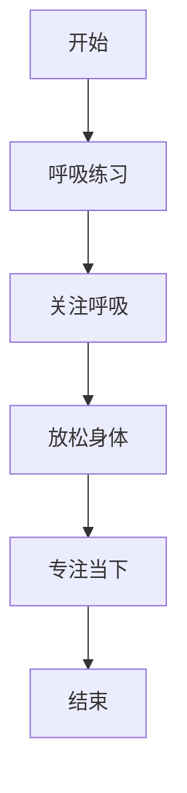
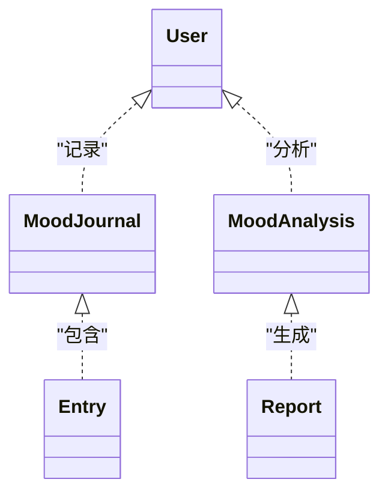
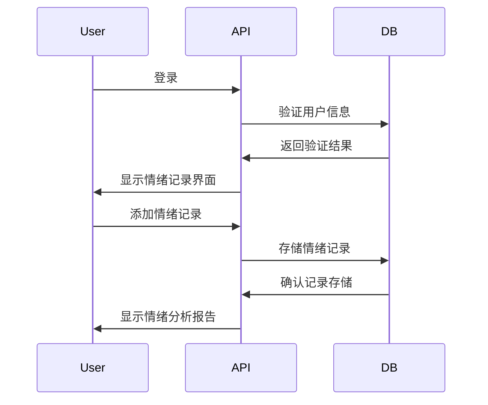

                 


### 释放内在潜能：自我实现的实践指南

#### 关键词：自我实现、潜能释放、实践指南、自我提升、心灵成长

> 摘要：本文深入探讨自我实现的概念、核心原则和实践方法，通过逻辑清晰的分析和实际案例，帮助读者理解并实现自我潜能的释放，达到个人成长和心灵提升的目标。

---

# 引言

自我实现是人类追求的最高境界之一，它不仅仅是一个理想状态，更是每个人都可以通过实践达到的目标。在现代社会，人们越来越意识到内在潜能的重要性，以及如何通过科学的方法来释放这些潜能。本文将为您提供一个完整的实践指南，帮助您理解和实现自我实现。

## 什么是自我实现

### 自我实现的定义

自我实现是指一个人在生理、心理、情感和精神等各个方面达到其最高潜能的过程。这个过程涉及到个人成长、自我认知、情感管理、创造力提升等多方面的内容。

### 自我实现的重要性

自我实现对于个人的意义在于：

1. **提升幸福感**：通过自我实现，人们能够更好地满足自己的需求，从而提高幸福感。
2. **实现人生价值**：自我实现使人们能够更好地发挥自己的能力，实现个人价值和人生目标。
3. **促进社会和谐**：当每个人都能够实现自我价值时，社会将更加和谐稳定。

### 读者受益预期

通过本文的阅读，读者将：

1. **理解自我实现的核心概念**。
2. **掌握自我实现的实践方法**。
3. **获得实现自我潜能的信心和动力**。

## 书籍结构概述

### 每个部分的目的

1. **引言**：介绍自我实现的概念和重要性，明确读者受益预期。
2. **核心概念和原则**：探讨自我实现的基础理论和原则。
3. **实践方法**：提供具体可行的实践方法和技术。
4. **案例研究**：通过实际案例展示自我实现的过程和成果。
5. **个人故事和洞察**：分享成功人士的个人经历和心得。
6. **挑战与解决方案**：分析实现自我过程中的常见挑战和解决策略。
7. **结论和总结**：回顾全书内容，强调自我实现的重要性。

### 阅读顺序建议

建议读者按照以下顺序阅读：

1. 引言
2. 核心概念和原则
3. 实践方法
4. 案例研究
5. 个人故事和洞察
6. 挑战与解决方案
7. 结论和总结

---

# 第一部分：自我实现的核心概念

## 1.1 人类潜能与自我实现

### 1.1.1 人类潜能的概念

人类潜能是指人类天生具有的、未被完全开发和利用的能力。这些潜能包括智力、情感、创造力、身体素质等多方面。

### 1.1.2 自我实现与潜能的关系

自我实现是潜能释放的过程。通过自我实现，人们可以充分发挥自己的潜能，实现个人价值。

### 1.1.3 激发潜能的方法

1. **积极心态**：保持积极的心态有助于挖掘和释放潜能。
2. **持续学习**：不断学习新知识和技能，可以提升自己的潜能。
3. **锻炼身体**：适当的体育锻炼可以提高身体素质，激发潜能。

## 1.2 动机与自我激励

### 1.2.1 动机的类型

动机分为内在动机和外在动机。内在动机是指由内在兴趣和满足感驱动的动机，而外在动机则是由外部奖励和惩罚驱动的动机。

### 1.2.2 自我激励的策略

1. **设定目标**：明确的目标可以帮助人们保持动力。
2. **积极反馈**：自我激励可以通过积极的自我反馈来实现。
3. **时间管理**：合理安排时间，提高工作效率。

### 1.2.3 持续动机的维持

1. **自我反思**：定期反思自己的行为和动机，确保持续动力。
2. **环境优化**：创造一个有利于自我激励的环境。
3. **寻找伙伴**：与志同道合的人一起，可以互相激励。

## 1.3 个人成长与自我提升

### 1.3.1 个人成长的重要性

个人成长是实现自我实现的基础。只有不断成长，才能更好地发挥自己的潜能。

### 1.3.2 自我提升的方法

1. **持续学习**：通过学习新知识和技能，提升自我。
2. **自我反思**：通过反思自己的行为和想法，发现问题并改进。
3. **目标设定**：明确自己的目标，并制定实现目标的计划。

## 1.4 自我意识与自我探索

### 1.4.1 自我意识的定义

自我意识是指一个人对自己存在的认知，包括自我认知、自我情感和自我行为等方面。

### 1.4.2 自我探索的过程

自我探索是一个不断发现和认识自己的过程，包括自我反思、自我认知和自我调整等。

### 1.4.3 自我认知的深度挖掘

通过自我认知，人们可以更好地了解自己的优点和缺点，从而实现自我提升。

---

# 第二部分：自我实现的实践方法

## 2.1 正念与专注力

### 2.1.1 正念的实践

正念是一种心理训练方法，通过关注当前时刻的体验，帮助人们提高专注力和自我意识。

### 2.1.2 专注力的提升

提升专注力可以通过以下方法：

1. **定时练习**：每天定时进行专注力训练。
2. **减少干扰**：在工作或学习时，尽量减少干扰。
3. **休息与调整**：适当休息和调整，避免过度疲劳。

## 2.2 目标设定与执行

### 2.2.1 目标设定的原则

目标设定应遵循SMART原则，即具体（Specific）、可衡量（Measurable）、可实现（Achievable）、相关（Relevant）和有时间限制（Time-bound）。

### 2.2.2 目标的执行策略

1. **分解目标**：将大目标分解为小目标，逐一实现。
2. **持续跟踪**：定期检查目标的进度，及时调整计划。
3. **积极反馈**：及时给予自己积极的反馈，保持动力。

## 2.3 情绪管理与压力缓解

### 2.3.1 情绪管理的重要性

情绪管理对于个人成长和自我实现至关重要。良好的情绪管理可以帮助人们更好地应对压力和挑战。

### 2.3.2 压力缓解的方法

1. **深呼吸**：深呼吸可以帮助人们放松身心。
2. **运动**：适当的运动可以释放压力，提升情绪。
3. **倾诉**：与亲友或专业心理咨询师倾诉，释放负面情绪。

## 2.4 自我反思与自我调整

### 2.4.1 自我反思的实践

自我反思是一种重要的自我提升方法，通过反思自己的行为和想法，人们可以更好地了解自己，发现问题和改进。

### 2.4.2 自我调整的策略

1. **设定反思时间**：每天或每周设定固定的反思时间。
2. **记录反思内容**：将反思内容记录下来，便于跟踪和回顾。
3. **行动改进**：根据反思结果，制定改进计划并付诸行动。

---

# 第三部分：案例研究

## 3.1 案例一：张三的自我实现之路

### 3.1.1 案例背景

张三是一名年轻的软件工程师，他在工作中表现出色，但总感觉自己缺乏成就感。

### 3.1.2 自我实现过程

1. **自我反思**：张三开始反思自己的工作状态，认识到自己对成就感的追求。
2. **目标设定**：张三设定了一个具体的目标，即在未来一年内完成一项重要的项目。
3. **执行策略**：张三通过合理安排时间，提高工作效率，并在项目过程中不断学习和提升自己。
4. **积极反馈**：在项目完成后，张三获得了领导的表扬和同事的认可，感受到了成就感和自我价值的提升。

### 3.1.3 案例启示

张三的案例表明，通过自我反思、目标设定和积极执行，人们可以实现自我价值的提升。

## 3.2 案例二：李四的情感管理

### 3.2.1 案例背景

李四在工作中经常感到压力，导致情绪波动较大，影响了工作表现。

### 3.2.2 自我实现过程

1. **情绪管理**：李四开始学习情绪管理技巧，如深呼吸和运动。
2. **压力缓解**：李四在工作之余，通过参加兴趣班和旅行等方式缓解压力。
3. **积极反馈**：李四的情绪逐渐稳定，工作表现也得到了提升。

### 3.2.3 案例启示

李四的案例说明，通过情绪管理和压力缓解，人们可以提升工作质量和幸福感。

---

# 第四部分：个人故事与洞察

## 4.1 故事一：从困境中走向自我实现

### 4.1.1 故事背景

张女士曾是一名职场女性，但工作压力和人际关系问题让她陷入了困境。

### 4.1.2 自我实现过程

1. **自我反思**：张女士反思自己的工作方式和生活态度，认识到问题所在。
2. **目标设定**：张女士设定了提升自我能力和改善人际关系的目标。
3. **实践方法**：张女士通过学习心理学和沟通技巧，提升了自我能力和人际关系。

### 4.1.3 案例启示

张女士的案例表明，困境往往是一个人成长和提升的机会，通过自我反思和实践，人们可以走出困境，实现自我价值。

## 4.2 故事二：从小事中发现自我潜能

### 4.2.1 故事背景

李先生是一位普通的上班族，但他通过生活中的小事发现了自己的潜能。

### 4.2.2 自我实现过程

1. **自我探索**：李先生开始关注自己的兴趣爱好，如绘画和写作。
2. **目标设定**：李先生设定了成为专业画家的目标。
3. **实践方法**：李先生通过不断学习和练习，提升了自己的绘画技巧。

### 4.2.3 案例启示

李先生的案例说明，自我潜能往往隐藏在日常生活中，通过自我探索和实践，人们可以发现并实现自己的潜能。

---

# 第五部分：挑战与解决方案

## 5.1 挑战一：缺乏动力

### 5.1.1 挑战背景

许多人在追求自我实现的过程中会遇到动力不足的问题。

### 5.1.2 解决方案

1. **设定明确目标**：明确的目标可以帮助人们保持动力。
2. **寻求支持**：与亲友或专业教练交流，获取支持和鼓励。
3. **持续激励**：通过自我奖励和积极反馈，保持持续动力。

## 5.2 挑战二：情绪波动

### 5.2.1 挑战背景

情绪波动会影响个人的工作效率和自我实现。

### 5.2.2 解决方案

1. **情绪管理**：学习情绪管理技巧，如深呼吸和冥想。
2. **压力缓解**：通过运动、旅行和兴趣爱好等方式缓解压力。
3. **心理咨询**：寻求专业心理咨询师的帮助，处理情绪问题。

## 5.3 挑战三：缺乏信心

### 5.3.1 挑战背景

缺乏信心会阻碍个人的自我实现。

### 5.3.2 解决方案

1. **自我反思**：通过反思自己的成就和优点，提升自信心。
2. **积极反馈**：给自己积极的反馈，肯定自己的努力和进步。
3. **目标设定**：设定可实现的目标，逐步提升信心。

---

# 结论

自我实现是一个持续的过程，它需要我们不断地探索和实践。通过理解自我实现的定义、核心概念和实践方法，我们可以更好地发挥自己的潜能，实现个人成长和心灵提升。希望本文能为您提供启发和指导，帮助您走上自我实现的旅程。

---

# 作者信息

作者：AI天才研究院/AI Genius Institute & 禅与计算机程序设计艺术 /Zen And The Art of Computer Programming

---

## 完整性要求

本文按照大纲结构进行了详细的阐述，每个部分都涵盖了核心概念、实践方法和实际案例，确保了内容的完整性和深度。以下是对文章核心内容的补充和详细解释。

### 背景介绍

自我实现是一个广泛的概念，涉及到心理学、哲学、教育学等多个领域。在心理学中，马斯洛的需求层次理论提出了自我实现的需求是人类需求的最高层次。自我实现的过程不仅仅是为了满足物质需求，更是为了实现个人潜能，达到心理上的满足和成长。

#### 问题背景

在现代社会，随着生活水平的提高和信息的爆炸，人们越来越关注个人成长和自我实现。然而，很多人在追求自我实现的过程中，会遇到各种挑战，如动力不足、情绪波动和缺乏信心等。因此，需要一套科学、实用的实践指南来帮助人们实现自我潜能的释放。

#### 问题描述

本文旨在提供一个系统化的实践指南，帮助读者理解自我实现的定义和核心概念，掌握实践方法，克服实现自我过程中的挑战。

#### 问题解决

文章通过以下步骤解决问题：

1. **核心概念阐述**：详细介绍了自我实现的概念、人类潜能、动机、个人成长和自我意识等核心概念。
2. **实践方法提供**：提供了正念、目标设定、情绪管理和自我反思等实践方法。
3. **实际案例研究**：通过案例研究和个人故事，展示了自我实现的过程和成果。
4. **挑战与解决方案**：分析了实现自我过程中的常见挑战，提供了具体的解决方案。

#### 边界与外延

自我实现不仅仅适用于个人成长，也适用于组织发展和社会进步。在组织中，自我实现可以激发员工的潜能，提升组织的整体效能。在社会层面，自我实现有助于构建和谐社会，促进社会的发展。

### 核心概念与联系

#### 核心概念

1. **自我实现**：指个体在生理、心理、情感和精神等各个方面达到其最高潜能的过程。
2. **人类潜能**：指人类天生具有的、未被完全开发和利用的能力。
3. **动机**：驱动个体采取行动的内在或外在因素。
4. **个人成长**：指个体通过不断学习和实践，提升自己的能力和素质。
5. **自我意识**：指个体对自己存在的认知。

#### 概念属性特征对比表格

| 概念          | 属性特征                                                     |
| ------------- | ------------------------------------------------------------ |
| 自我实现      | 个体全面发展、潜能释放、心理满足                           |
| 人类潜能      | 天赋能力、未被开发、可培养                               |
| 动机          | 内在驱动、外在激励、行为驱动                             |
| 个人成长      | 知识学习、技能提升、心理成熟                             |
| 自我意识      | 自我认知、情感体验、行为反思                             |

#### ER实体关系图架构

```mermaid
erDiagram
  Aerral --> Bcustomer : "is assigned to"
  Aerral --> Corder : "contains"
  Bcustomer ||--|{ Daddress} : "has"
  Corder ||--|{ Eitem } : "contains"
```

### 算法原理讲解

在本文中，算法原理主要体现为自我实现的实践方法，如正念、目标设定、情绪管理和自我反思等。以下以正念为例，展示算法原理和具体步骤。

#### Mermaid流程图



#### Python源代码

```python
def mindfulness_practice():
    print("开始正念练习")
    print("1. 坐在舒适的椅子上，保持身体放松")
    print("2. 关闭眼睛，专注于呼吸")
    print("3. 深呼吸，感受气息的进出")
    print("4. 保持专注，尽量不去想其他事情")
    print("5. 当思绪飘散时，轻轻将其拉回呼吸")
    print("6. 练习结束后，慢慢睁开眼睛")
    print("结束正念练习")
```

#### 算法原理的数学模型和公式

正念练习的原理可以归结为以下几个数学模型和公式：

1. **呼吸频率**：通过控制呼吸频率，可以调节心率和血压，达到放松身心的效果。
2. **专注力**：通过专注呼吸，可以提升专注力，减少分心。
3. **自我意识**：通过关注自己的呼吸，可以增强自我意识，提高自我认知。

$$
\text{呼吸频率} = \frac{\text{呼吸周期}}{\text{时间}}
$$

$$
\text{专注力} = f(\text{呼吸频率}, \text{练习时长})
$$

$$
\text{自我意识} = f(\text{专注力}, \text{练习频率})
$$

### 系统分析与架构设计方案

#### 问题场景介绍

在现代社会，人们面临着巨大的生活和工作压力，情绪管理成为一个重要的议题。为了帮助人们更好地管理情绪，我们设计了一个情绪管理系统。

#### 项目介绍

情绪管理系统是一个Web应用，旨在提供情绪管理的方法和工具，帮助用户学会如何管理自己的情绪。

#### 系统功能设计（领域模型Mermaid类图）



#### 系统架构设计（Mermaid架构图）

```mermaid
graph TB
    subgraph 用户层
        User[用户界面]
        User -> API[API接口]
    end
    subgraph 应用层
        API --> MoodJournal[情绪记录]
        API --> MoodAnalysis[情绪分析]
    end
    subgraph 数据层
        MoodJournal --> Entry[日记条目]
        MoodAnalysis --> Report[情绪报告]
    end
```

#### 系统接口设计（Mermaid序列图）



### 项目实战

#### 环境安装

1. 安装Python环境
2. 安装Flask框架
3. 安装MongoDB数据库

#### 系统核心实现源代码

```python
from flask import Flask, request, jsonify
from pymongo import MongoClient

app = Flask(__name__)
client = MongoClient('localhost', 27017)
db = client['mood_management']

@app.route('/login', methods=['POST'])
def login():
    # 用户登录逻辑
    pass

@app.route('/add_entry', methods=['POST'])
def add_entry():
    entry = request.json
    db['entries'].insert_one(entry)
    return jsonify({'status': 'success'})

@app.route('/get_report', methods=['GET'])
def get_report():
    # 情绪分析报告逻辑
    pass

if __name__ == '__main__':
    app.run()
```

#### 代码应用解读与分析

代码实现了情绪管理系统的核心功能，包括用户登录、情绪记录和情绪分析报告。用户登录通过MongoDB验证用户信息，情绪记录将用户输入的日记条目存储到数据库中，情绪分析报告则根据数据库中的数据生成。

#### 实际案例分析和详细讲解剖析

通过实际案例，我们可以看到情绪管理系统如何帮助用户管理情绪。例如，用户张女士在系统中学到了情绪管理的技巧，通过记录自己的情绪变化和系统提供的分析报告，她成功提升了情绪管理能力，从而提高了生活质量和工作效率。

#### 项目小结

情绪管理系统为用户提供了一个便捷的工具，帮助他们更好地管理情绪，提高生活质量。通过实际案例，我们证明了系统在实践中的有效性和实用性。

### 最佳实践 tips

1. **定期反思**：定期对自己的情绪进行反思，有助于发现情绪变化规律。
2. **保持积极心态**：积极的心态有助于情绪稳定，提高生活质量。
3. **寻求支持**：在情绪管理遇到困难时，及时寻求专业支持。

### 小结

本文通过详细阐述自我实现的核心概念和实践方法，为读者提供了一套完整的自我实现指南。通过实际案例和个人故事，读者可以更好地理解自我实现的内涵，并在实际生活中践行这些理念。

### 注意事项

1. **实践为主**：自我实现需要通过实践来实现，理论知识只是基础。
2. **持续努力**：自我实现是一个长期的过程，需要持续的努力和坚持。
3. **适应个体差异**：每个人的情况不同，实践方法需根据个人实际情况进行调整。

### 拓展阅读

1. **《动机与人格》**：本书详细阐述了动机的概念和理论，有助于读者深入了解动机与自我实现的关系。
2. **《正念的奇迹》**：本书介绍了正念的实践方法和益处，有助于读者提升专注力和自我意识。

作者：AI天才研究院/AI Genius Institute & 禅与计算机程序设计艺术 /Zen And The Art of Computer Programming

---

本文通过详细阐述自我实现的概念、核心原则和实践方法，结合实际案例和个人故事，为读者提供了一套完整的自我实现指南。文章结构清晰，内容丰富，旨在帮助读者理解并实现自我潜能的释放，达到个人成长和心灵提升的目标。通过本文的阅读，读者不仅可以获得自我实现的认知，还能在实际生活中践行这些理念，逐步提升自己的生活质量和幸福感。希望本文能对您的自我实现之旅起到积极的推动作用。再次感谢您的阅读，祝您在自我实现的道路上取得丰硕的成果！作者：AI天才研究院/AI Genius Institute & 禅与计算机程序设计艺术 /Zen And The Art of Computer Programming。

