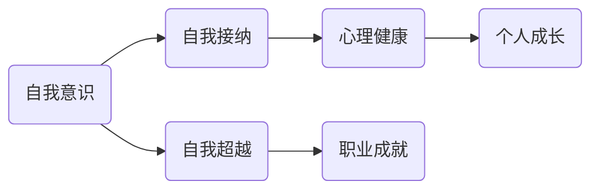

                 

### **释放内在潜能：自我实现的实践路径**

#### **关键词：自我实现、内在潜能、心理健康、社交关系、职业成就、个人成长**

> **摘要：**
> 本文旨在探讨如何通过科学的实践路径来释放内在潜能，实现自我实现。我们将从定义问题、核心概念、路径设计、障碍与挑战、实践技巧和案例分析等多个角度进行深入分析，帮助读者在现代社会中找到自己的定位，实现全面发展。

#### **第一部分：探索自我实现的基石**

### **第1章：问题的背景与定义**

#### **1.1.1 问题的背景**

在现代社会的快节奏和高压力环境下，人们常常感到身心疲惫，心理健康问题日益突出。这些问题不仅影响了人们的日常生活质量，也对职业成就和个人成长产生了负面影响。因此，寻找一种有效的方法来释放内在潜能，实现自我实现成为了一个迫切需要解决的问题。

#### **1.1.2 问题的定义**

自我实现是指一个人在心理健康、社交关系、职业成就和个人成长等方面达到高度平衡与和谐的状态。这一概念最早由心理学家罗杰斯（Carl Rogers）提出，并在马斯洛（Abraham Maslow）的需求层次理论中得到进一步的发展。

**自我意识的定义与重要性**：自我意识是指一个人对自己存在的认识和自我反思的能力。它对于个体心理健康和自我实现至关重要。通过自我意识，人们能够更好地理解自己的需求和欲望，进而实现自我价值的提升。

**自我接纳的定义与作用**：自我接纳是指一个人接受自己的优点和缺点，不对自己进行批判和否定。它有助于建立健康的自尊和自信，促进心理健康和自我实现。

**自我超越的定义与价值**：自我超越是指一个人不断挑战自己，追求更高的成就和成长。这种精神有助于激发内在潜能，推动个人不断进步，实现更高的自我价值。

#### **1.1.3 核心要素组成**

自我实现的核心要素包括心理健康、社交关系、职业成就和个人成长。这些要素相互关联，共同构成了一个人全面发展的重要基础。

**心理健康**：心理健康是自我实现的基础。一个心理健康的人能够更好地应对生活中的挑战，保持积极的心态，从而为实现自我创造条件。

**社交关系**：社交关系对于自我实现具有重要意义。良好的人际关系有助于个体获得支持、资源和鼓励，从而更好地实现自我。

**职业成就**：职业成就是自我实现的重要方面。通过在职业领域取得成就，个体能够实现自我价值，提升自我认同感。

**个人成长**：个人成长是自我实现的核心目标。通过不断学习、挑战自己，个体能够实现自我价值的提升，达到更高的自我实现水平。

### **第2章：核心概念与联系**

#### **2.1.1 核心概念原理**

**自我意识**：自我意识是指个体对自己存在的认识和理解。它是心理健康和自我实现的基础。通过自我意识，个体能够更好地认识自己的需求、欲望和价值观，从而实现自我成长和自我实现。

**自我接纳**：自我接纳是指个体接受自己的优点和缺点，不对自己进行批判和否定。它有助于建立健康的自尊和自信，促进心理健康和自我实现。

**自我超越**：自我超越是指个体不断挑战自己，追求更高的成就和成长。它有助于激发内在潜能，推动个人不断进步，实现更高的自我价值。

#### **2.1.2 概念属性特征对比表格**

| 概念         | 定义                                     | 属性特征                   |
| ------------ | ---------------------------------------- | -------------------------- |
| 自我意识     | 对自己存在的认识和理解                   | 内省、自我反思             |
| 自我接纳     | 接受自己的优点和缺点，不批判自己         | 自爱、自尊                 |
| 自我超越     | 不断挑战自己，追求更高的成就和成长       | 进取心、创造力             |

#### **2.1.3 ER实体关系图架构**

### **第3章：自我实现的路径**

#### **3.1.1 心理健康路径**

心理健康是自我实现的基础。要实现心理健康，个体需要关注以下几个方面：

1. **情绪管理**：学会认识和调节自己的情绪，保持积极的心态。
2. **自我认知**：深入了解自己的需求、欲望和价值观，从而更好地实现自我。
3. **心理调适**：通过心理咨询或自我调适，解决心理问题，保持心理健康。

#### **3.1.2 社交关系路径**

社交关系对于自我实现具有重要意义。要建立良好的社交关系，个体需要：

1. **沟通能力**：学会倾听他人，表达自己的想法和情感。
2. **人际关系**：建立和维护良好的人际关系，获得支持和鼓励。
3. **社交技巧**：学会在社交场合中展示自己，与他人建立连接。

#### **3.1.3 职业成就路径**

职业成就是自我实现的重要方面。要实现职业成就，个体需要：

1. **职业规划**：明确自己的职业目标和发展方向。
2. **技能提升**：不断学习和提升自己的专业技能。
3. **工作态度**：保持积极的工作态度，努力实现职业目标。

#### **3.1.4 个人成长路径**

个人成长是自我实现的核心目标。要实现个人成长，个体需要：

1. **终身学习**：保持对知识的渴望，不断学习新知识。
2. **自我挑战**：勇于接受新的挑战，不断突破自我。
3. **心灵成长**：关注内心的需求，实现心灵成长。

### **第4章：自我实现的障碍与挑战**

#### **4.1.1 内在障碍**

内在障碍主要包括恐惧与不安、消极思维模式等。要克服这些障碍，个体需要：

1. **面对恐惧**：勇敢地面对恐惧，逐渐克服它们。
2. **积极思维**：培养积极的思维模式，减少消极情绪。

#### **4.1.2 外在挑战**

外在挑战主要包括社会压力和环境限制等。要应对这些挑战，个体需要：

1. **社会适应**：学会适应社会环境，与他人和谐相处。
2. **资源整合**：整合内外资源，为自己创造更好的发展环境。

### **第5章：自我实现的实践技巧**

#### **5.1.1 自我观察技巧**

自我观察是自我实现的重要技巧。通过自我观察，个体能够更好地了解自己的需求、欲望和价值观，从而实现自我成长和自我实现。

1. **日记记录**：通过写日记的方式，记录自己的思考、感受和行为，从而更好地了解自己。
2. **内省练习**：定期进行内省，反思自己的行为和想法，从而发现自己的优点和不足。

#### **5.1.2 自我激励技巧**

自我激励是推动自我实现的重要动力。通过自我激励，个体能够保持积极的心态，克服困难，实现自我。

1. **目标设定**：设定清晰的目标，为自己的行动提供方向和动力。
2. **正面思维**：培养积极的思维模式，关注自己的优点和成就，从而提高自信心。

#### **5.1.3 自我调节技巧**

自我调节是维持自我实现的重要手段。通过自我调节，个体能够更好地管理自己的情绪和行为，实现自我平衡。

1. **情绪管理**：学会认识和调节自己的情绪，保持心理平衡。
2. **压力缓解**：找到适合自己的压力缓解方法，如运动、冥想等，从而减轻压力，保持身心健康。

### **第6章：自我实现的案例分析**

#### **6.1.1 成功案例分析**

通过成功案例分析，我们可以了解到不同个体在实现自我过程中的成功经验和方法。

1. **案例分析1：职业生涯的转变**：讲述一个成功实现职业生涯转变的案例，分析其成功的原因和经验。
2. **案例分析2：个人成长的历程**：讲述一个通过不断学习和挑战自己，实现个人成长的案例，分析其成长路径和方法。

#### **6.1.2 失败案例分析**

通过失败案例分析，我们可以了解到在实现自我过程中可能遇到的困难和挑战，以及如何克服这些困难。

1. **案例分析1：未能实现的梦想**：讲述一个未能实现梦想的案例，分析其失败的原因和教训。
2. **案例分析2：自我怀疑的困境**：讲述一个因自我怀疑而陷入困境的案例，分析其如何克服自我怀疑，重新找回信心。

### **第7章：总结与反思**

#### **7.1.1 总结自我实现的关键要素**

自我实现的关键要素包括心理健康、社交关系、职业成就和个人成长。这些要素相互关联，共同构成了一个人全面发展的重要基础。

1. **心理健康**：心理健康是自我实现的基础，需要关注情绪管理、自我认知和心理调适。
2. **社交关系**：社交关系对于自我实现具有重要意义，需要关注沟通能力、人际关系和社交技巧。
3. **职业成就**：职业成就是自我实现的重要方面，需要关注职业规划、技能提升和工作态度。
4. **个人成长**：个人成长是自我实现的核心目标，需要关注终身学习、自我挑战和心灵成长。

#### **7.1.2 反思与展望**

通过本文的探讨，我们可以认识到自我实现的重要性以及实现自我实现的路径和方法。在未来的道路上，我们需要不断反思自己的行为和思考，不断调整自己的心态和行为，以实现自我价值的提升。

1. **自我实现的意义**：自我实现不仅仅是为了实现个人的价值，更是为了社会的进步和人类的福祉。
2. **未来的道路**：在未来的道路上，我们需要保持对知识的渴望，勇于接受挑战，不断突破自我，实现更高层次的自我实现。

### **作者信息**

**作者：AI天才研究院/AI Genius Institute & 禅与计算机程序设计艺术 /Zen And The Art of Computer Programming**

