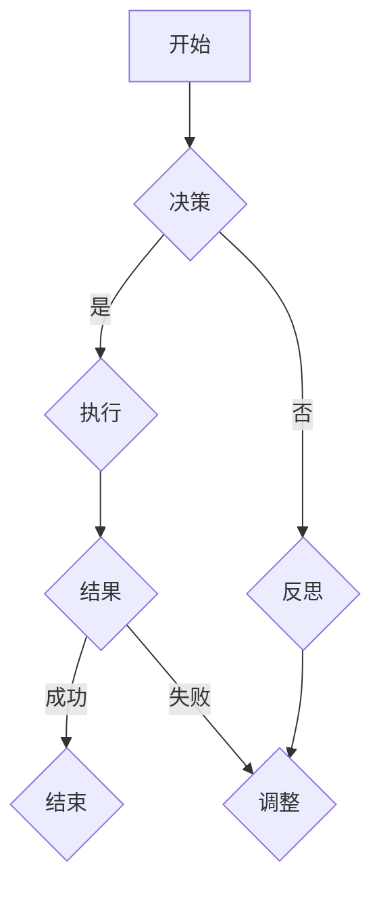

                 

# 释放潜能：自我实现的实践路径

> 关键词：自我实现、潜能释放、实践路径、成长策略

> 摘要：本文深入探讨了自我实现的概念、理论基础和实践路径。通过分析自我实现的心理模型、历史发展、核心要素以及成功案例，提供了一套完整的自我实现策略，旨在帮助读者了解自我实现的重要性，并掌握实践自我实现的路径和方法。

## 引言

### 1. 引言

自我实现是个人成长和发展的终极目标，它不仅关乎个人的幸福感和成就感，还对社会进步和个人成就有着深远的影响。在信息技术快速发展的今天，如何实现自我价值，发挥个人潜能，成为每个人都需要思考和探索的问题。本文将从以下几个方面展开讨论：

1. **自我实现的意义**：探讨自我实现对个人和社会的意义，以及为什么它成为现代社会关注的焦点。
2. **问题的提出**：分析当前社会中人们在自我实现过程中面临的挑战和困境。
3. **目标与价值**：明确文章的目标和价值，即如何帮助读者理解和实践自我实现。

### 1.2 自我实现的意义

自我实现是人类追求的最高境界之一，它不仅仅是个人成就的体现，更是个人价值和社会价值的统一。自我实现的意义可以从以下几个方面进行阐述：

- **个体层面**：自我实现使个体能够充分发挥自己的潜能，实现个人的全面发展，从而获得内心的满足感和成就感。
- **社会层面**：自我实现能够激发社会的创新活力，推动社会的进步和发展。当每个人都能够实现自我价值时，整个社会的活力和创造力都将大大提升。
- **文化层面**：自我实现体现了人类对自由、平等、正义等价值观的追求，有助于构建更加和谐、包容和进步的社会。

### 1.3 问题的提出

尽管自我实现的重要性不言而喻，但在实际过程中，许多人面临着诸多挑战：

- **内在因素**：缺乏自我认知，不知道自己的兴趣和潜力所在，容易迷失方向。
- **外部因素**：社会环境的压力、家庭责任、职业规划等外部因素，常常让个人在追求自我实现的过程中感到迷茫和无力。
- **认知局限**：传统的教育体系和价值观往往强调对知识的掌握和技能的培养，而忽视了自我实现这一重要方面。

这些问题不仅阻碍了个人的成长和发展，也对社会进步产生了一定的负面影响。因此，如何应对这些挑战，找到自我实现的路径，成为当务之急。

### 1.4 目标与价值

本文的目标是帮助读者：

1. 理解自我实现的本质和意义；
2. 掌握自我实现的理论基础和实践路径；
3. 通过成功案例的分析，提供实际操作的指导。

通过本文的阅读，读者将能够：

- 明确自己的兴趣和潜力，找到自我实现的正确方向；
- 制定可行的自我实现计划，并付诸实践；
- 在自我实现的过程中，获得更多的成就感和满足感，实现个人价值。

### 1.5 文章结构

本文将分为三大部分进行论述：

1. **第一部分：理解自我实现**：介绍自我实现的理论基础和历史发展，分析自我实现的核心要素。
2. **第二部分：实践自我实现**：提供具体的自我实现实践策略，包括目标设定、持续行动和反馈调整等。
3. **第三部分：成功案例与实践心得**：通过实际案例分享和实践心得，帮助读者更好地理解自我实现的方法和技巧。

通过这样的结构安排，读者可以逐步深入理解自我实现的概念，并掌握实践自我实现的路径。

### 1.6 小结

自我实现是一个复杂而又充满挑战的过程，它不仅仅关乎个人的成长和发展，也对社会进步和个人成就有着深远的影响。本文将带领读者一起探索自我实现的路径，通过理论分析和实践指导，帮助读者找到实现自我价值的正确方法。接下来的章节将深入探讨自我实现的理论基础和实践策略，为读者提供有价值的参考和指导。

## 第一部分：理解自我实现

### 2. 自我实现的理论基础

自我实现是一个多层次、多维度的复杂概念，涉及心理学、哲学、社会学等多个领域。理解自我实现的理论基础，有助于我们更好地把握其本质和内涵。

#### 2.1 自我实现的心理模型

自我实现的心理模型是心理学领域对自我实现现象的描述和解释。该模型通常包括以下几个关键要素：

- **自我决定**：自我决定是自我实现的核心要素之一，指的是个体在行为和决策中表现出自主性、选择性和目的性。自我决定的五大要素包括自主性、能力感、选择权、价值观和意义感。
  
- **自我效能感**：自我效能感是指个体对自己能否成功从事某一成就行为的主观判断。高自我效能感的个体通常更愿意接受挑战，更能够坚持不懈地追求目标。

- **内在动机**：内在动机是指个体出于自身的兴趣、喜好和愿望而从事某一活动的动力。与外在动机（如奖励、惩罚）不同，内在动机更能激发个体的持久行为。

- **情感管理**：情感管理是指个体在情感产生、表达和调节过程中所表现出的能力。良好的情感管理有助于个体更好地应对生活中的压力和挑战，促进自我实现。

- **积极心理学**：积极心理学关注个体的积极品质和积极体验，强调如何通过培养乐观态度、提高幸福感来促进自我实现。

#### 2.1.1 自我决定的五大要素

自我决定的五大要素分别是自主性、能力感、选择权、价值观和意义感。下面分别进行解释：

- **自主性**：自主性是指个体在行为和决策中具有独立性和自主性，不受外界强制和约束。高自主性的个体能够更自由地表达自己的想法和意愿，从而更好地实现自我价值。

- **能力感**：能力感是指个体对自己能力和能力的自信和认可。拥有强烈能力感的个体更愿意尝试新事物，更有可能成功实现自我目标。

- **选择权**：选择权是指个体在决策过程中具有选择和决定的权利。选择权有助于个体更好地满足自己的需求和愿望，从而实现自我价值。

- **价值观**：价值观是指个体对什么是有意义和重要的认识。不同的价值观会导致不同的行为和决策，从而影响个体的自我实现程度。

- **意义感**：意义感是指个体对生活、工作和事业的认知和体验。拥有强烈意义感的个体通常更能够感受到生活的意义和价值，从而更加积极地追求自我实现。

#### 2.1.2 自我实现的动机

自我实现的动机是指推动个体追求自我实现的心理动力。自我实现的动机通常包括以下几个方面：

- **内在动机**：内在动机主要源于个体对自我实现本身的兴趣和热爱。这种动机往往更具有持久性和稳定性，能够更好地推动个体实现自我价值。

- **外在动机**：外在动机主要源于外界的奖励和惩罚。尽管外在动机可能对个体的行为产生一定影响，但通常不如内在动机稳定和持久。

- **双重动机**：在某些情况下，个体可能会同时受到内在动机和外在动机的影响。这种双重动机有助于个体在追求自我实现的过程中，更好地平衡内在需求和外在需求。

#### 2.1.3 自我效能感

自我效能感是指个体对自己在特定领域内完成任务的能力的信念和信心。自我效能感对个体的行为、情绪和成就有重要影响：

- **高自我效能感**：高自我效能感的个体通常更有信心和勇气去尝试新事物，更能够在面对困难和挑战时保持积极态度，从而更容易实现自我目标。

- **低自我效能感**：低自我效能感的个体则可能因为缺乏信心而放弃尝试，或者在面对困难时更容易产生焦虑和沮丧情绪，从而阻碍自我实现。

#### 2.2 自我实现的历史与发展

自我实现的概念源于20世纪中叶的心理学家马斯洛（Abraham Maslow）提出的需求层次理论。马斯洛将人的需求分为五个层次，其中最高层次是自我实现需求。自我实现需求是指个体追求自我价值、实现自我潜能的需求。

- **早期发展**：马斯洛的需求层次理论首次提出了自我实现的概念，并将其作为人类需求的最高层次。这一理论对后来的心理学研究产生了深远的影响。

- **现代发展**：随着心理学、社会学和哲学等领域的不断发展，自我实现的理论得到了进一步丰富和完善。现代心理学研究者如卡尔·罗杰斯（Carl Rogers）和梅拉妮·莱文（Melanie Levin）等，对自我实现的理论和实践进行了深入研究，提出了新的观点和理论。

#### 2.2.1 自我实现的概念演变

自我实现的概念在不同的历史时期和不同的学科领域有不同的理解和解释：

- **心理学视角**：在心理学领域，自我实现通常指的是个体在心理上的成长和发展，达到一种高度整合和自我满足的状态。

- **哲学视角**：在哲学领域，自我实现更多地关注个体在人生意义和价值观上的追求和实现。

- **社会学视角**：在社会学领域，自我实现关注的是个体在社会中的角色、地位和贡献。

#### 2.2.2 自我实现的重要理论

自我实现的重要理论包括马斯洛的需求层次理论、罗杰斯的自我实现理论、莱文的成长心理学理论等。这些理论从不同角度对自我实现进行了深入探讨：

- **马斯洛的需求层次理论**：马斯洛认为，个体的需求可以分为五个层次，自我实现需求是最高层次的需求。自我实现需求的满足能够带来个体的全面发展和幸福感。

- **罗杰斯的自我实现理论**：罗杰斯认为，个体具有自我实现的本能，通过自我表达和自我探索，个体能够实现自我价值和自我实现。

- **莱文的成长心理学理论**：莱文强调个体在成长过程中需要不断地探索和挑战自我，通过自我发现和自我实现，个体能够达到一种高度整合和自我满足的状态。

#### 2.2.3 自我实现在社会发展中的作用

自我实现在社会发展中的作用不可忽视。首先，自我实现能够激发个体的创新和创造力，推动社会的科技进步和经济发展。其次，自我实现有助于提高个体的幸福感和社会责任感，促进社会的和谐与进步。此外，自我实现还能够帮助个体实现自我价值，提高个体的自尊和自信，从而更好地适应社会。

### 3. 自我实现的核心要素

自我实现的核心要素包括知识与技能的提升、情感与心理的成长以及自我探索和自我塑造。下面将分别进行详细探讨。

#### 3.1 知识与技能的提升

知识与技能的提升是自我实现的基础。在现代社会，知识的更新速度非常快，个体需要不断地学习新的知识和技能，以适应社会的发展和变化。

- **自我学习的实践路径**：个体可以通过以下途径进行自我学习：
  - 制定学习计划：根据个人兴趣和职业需求，制定合理的学习计划。
  - 多渠道学习：通过在线课程、图书、研讨会等多种渠道获取知识。
  - 实践应用：将所学知识应用于实际工作中，通过实践来巩固和提高技能。

- **知识体系的构建**：建立系统化的知识体系，有助于个体更好地理解和应用知识。知识体系的构建可以包括以下几个方面：
  - 基础知识：掌握所在领域的基础知识和核心概念。
  - 深度知识：深入研究某一领域的前沿理论和研究成果。
  - 广泛知识：拓宽知识面，了解不同领域的知识和发展动态。

- **技能发展的关键点**：技能的发展需要不断地学习和实践，以下是一些关键点：
  - 技能分类：明确所需技能的类型和层次，如专业技能、管理技能、沟通技能等。
  - 技能训练：通过培训、练习和模拟等手段，提高技能水平。
  - 技能应用：将所学技能应用于实际工作中，通过实践来提高技能的熟练度和应用能力。

#### 3.2 情感与心理的成长

情感与心理的成长是自我实现的重要组成部分。一个健康的心理状态有助于个体更好地应对生活中的挑战，实现自我价值。

- **情感管理**：情感管理是指个体在情感产生、表达和调节过程中所表现出的能力。有效的情感管理有助于个体保持积极的心态，提高生活质量。以下是一些情感管理的技巧：

  - 情感识别：学会识别和理解自己的情感，如喜悦、愤怒、悲伤等。
  - 情感表达：学会以适当的方式表达自己的情感，避免压抑或过度表达。
  - 情感调节：学会调节自己的情感，如通过冥想、运动、放松等方法来缓解压力和焦虑。

- **心理韧性的培养**：心理韧性是指个体在面对压力、挑战和逆境时，能够保持积极心态，快速恢复和适应的能力。培养心理韧性有助于个体更好地实现自我价值。以下是一些培养心理韧性的方法：

  - 建立支持系统：与家人、朋友和同事建立良好的关系，形成支持系统。
  - 积极心态：培养积极的心态，学会从困难和挫折中找到成长的机会。
  - 自我激励：学会自我激励，保持对目标的追求和热情。

- **积极心理学的应用**：积极心理学关注个体的积极品质和积极体验，通过培养乐观态度、提高幸福感来促进自我实现。以下是一些积极心理学的应用方法：

  - 正念练习：通过冥想、呼吸练习等方式，提高对当前时刻的专注和觉察。
  - 感恩练习：每天记录感恩的事项，培养感恩的心态。
  - 积极行为习惯：培养积极的行为习惯，如定期锻炼、保持健康的饮食习惯等。

#### 3.3 自我探索和自我塑造

自我探索和自我塑造是自我实现的重要环节。通过自我探索，个体可以更清楚地了解自己的兴趣、优势和潜力，从而更好地规划自己的人生道路。

- **自我认知的方法**：自我认知是自我探索的第一步，以下是一些自我认知的方法：

  - 自我反思：定期进行自我反思，思考自己的行为、情感和思维模式，了解自己的优点和不足。
  - 他人反馈：通过他人的反馈来了解自己的行为和表现，从而进行自我认知。
  - 量表和测试：使用一些专业的量表和测试，如MBTI、DISC等，了解自己的性格和偏好。

- **兴趣与潜能的发现**：通过自我认知，个体可以更好地了解自己的兴趣和潜能。以下是一些发现兴趣和潜能的方法：

  - 尝试新事物：勇于尝试不同的事物，通过实践来发现自己的兴趣和潜能。
  - 倾听内心声音：倾听自己内心的声音，了解自己真正感兴趣的事情。
  - 咨询专业人士：寻求专业人士的意见和建议，帮助自己发现和挖掘潜能。

- **职业生涯规划**：职业生涯规划是自我实现的重要部分。以下是一些职业生涯规划的方法：

  - 职业定位：明确自己的职业目标和定位，为自己制定一个清晰的职业发展路径。
  - 职业发展策略：制定职业发展策略，包括技能提升、人际关系建立、职业机会寻找等。
  - 职业规划调整：根据实际情况，定期调整职业规划，以确保目标的实现。

#### 3.4 自我实现的路径规划

自我实现的路径规划是确保个体能够实现自我价值的重要步骤。以下是一些路径规划的方法：

- **设定目标**：设定明确、具体和可衡量的目标，为自我实现提供清晰的指引。
- **制定计划**：根据目标，制定详细的行动计划，包括学习计划、工作计划、时间管理计划等。
- **执行计划**：按照计划执行，确保目标的实现。
- **反馈与调整**：定期进行自我评估和反馈，根据实际情况调整计划和策略，确保目标的实现。

#### 3.5 健康的生活方式

健康的生活方式是实现自我价值的基石。以下是一些健康的生活方式：

- **合理饮食**：保持健康的饮食习惯，多吃蔬菜、水果和全谷物，少吃高热量、高脂肪的食物。
- **定期锻炼**：定期进行体育锻炼，如跑步、游泳、瑜伽等，提高身体素质和心理健康。
- **充足睡眠**：保持充足的睡眠，有助于身体和大脑的恢复和成长。
- **心理健康**：关注心理健康，通过心理咨询、正念练习等方法，保持良好的心理状态。

#### 3.6 人际关系的维护

人际关系是实现自我价值的重要支持。以下是一些维护人际关系的方法：

- **沟通技巧**：学习有效的沟通技巧，如倾听、表达、非暴力沟通等，改善人际关系。
- **建立支持系统**：与家人、朋友和同事建立良好的关系，形成支持系统。
- **同理心**：培养同理心，理解他人的需求和感受，与他人建立真诚的关系。
- **积极互动**：积极参与社交活动，与他人保持良好的互动和交流。

### 4. 小结

自我实现是一个复杂而多层次的过程，涉及心理、知识、情感、人际关系等多个方面。理解自我实现的理论基础，有助于我们更好地把握自我实现的本质和内涵。通过自我探索和自我塑造，个体可以明确自己的兴趣、优势和潜力，从而更好地规划自己的人生道路。在实现自我价值的过程中，我们需要不断学习和成长，保持积极的心态，面对挑战和困难，最终实现自我价值的最大化。

## 第二部分：实践自我实现

### 5. 自我实现的实践策略

在理解了自我实现的理论基础后，下一步是将其付诸实践。实践自我实现不仅需要明确的策略，还需要坚定的决心和持续的努力。以下是一些具体的实践策略：

#### 5.1 建立目标

自我实现的第一步是设定明确的目标。目标应遵循SMART原则，即具体（Specific）、可衡量（Measurable）、可实现（Achievable）、相关（Relevant）和时限性（Time-bound）。

- **具体**：目标应明确具体，而非模糊。例如，“提高编程能力”不如“在接下来的六个月内通过完成X个在线编程课程并完成相应的项目实践”具体。
  
- **可衡量**：目标应具有可衡量的标准，以便能够评估进度和成果。例如，“增强身体素质”不如“每周跑步三次，每次45分钟，心率保持在每分钟150次以下”具体。

- **可实现**：目标应切合实际，避免设定过高或过低的目标。例如，“在一个月内减掉20斤体重”可能过于激进，而“在三个月内每周减少1斤体重”则更加可行。

- **相关**：目标应与个人的兴趣、价值观和长期规划相一致。例如，如果目标是“成为一名数据科学家”，那么相关的短期目标可能是“学习Python编程和数据结构课程”。

- **时限性**：目标应设定一个明确的截止时间。例如，“在未来的五年内实现财务自由”不如“在接下来的五年内，通过投资和创业实现月收入超过10万元”具体。

#### 5.1.1 目标分解与任务管理

在设定了明确的目标之后，下一步是将这些目标分解为具体的任务，并制定详细的计划。以下是一些建议：

- **任务分解**：将大目标分解为一系列小任务。例如，如果目标是“学习Python编程”，可以分解为“学习Python基础语法”、“完成Python基础练习”、“学习数据结构”等小任务。

- **制定计划**：为每个任务制定一个详细的计划，包括所需的资源、时间表和步骤。例如，为“学习Python基础语法”可以制定一个计划，包括每天学习2小时、使用在线教程和书籍、每周完成一个小项目等。

- **优先级排序**：根据任务的紧急程度和重要性，对任务进行优先级排序。重要且紧急的任务应优先处理，而重要但不紧急的任务则可以稍后处理。

- **定期回顾**：定期回顾任务的进度，并根据实际情况进行调整。这有助于确保任务按时完成，并能够在遇到问题时及时采取措施。

#### 5.1.2 目标实现的激励机制

为了确保目标能够被实现，激励机制是非常关键的。以下是一些激励机制的建议：

- **奖励机制**：为自己设定奖励机制，如完成任务后给自己买一件心仪的衣服、看一场电影等。这有助于增加完成任务的积极性。

- **同伴监督**：寻找志同道合的同伴，共同设定目标并进行监督。同伴的支持和鼓励有助于提高完成目标的动力。

- **正面反馈**：定期给自己正面反馈，如写日记记录自己的进步、与他人分享自己的成就等。这有助于保持积极的心态和持续的努力。

- **调整策略**：如果发现某些策略并不奏效，及时调整策略。例如，如果发现自学效果不佳，可以考虑参加线下课程或请导师指导。

#### 5.2 持续行动

自我实现是一个持续的过程，需要长期的努力和坚持。以下是一些建议，帮助个体持续行动：

- **成长型思维模式**：培养成长型思维模式，即相信自己的能力可以通过努力和学习得到提升。与固定型思维模式相比，成长型思维模式更能促进自我实现。

- **克服拖延和焦虑**：拖延和焦虑是自我实现过程中的常见障碍。以下是一些建议来克服这些障碍：

  - **分解任务**：将大任务分解为小任务，每完成一个小任务就能获得成就感，从而减少拖延和焦虑。
  
  - **时间管理**：合理安排时间，确保有足够的时间来完成每个任务。可以使用时间管理工具，如番茄工作法，来提高工作效率。

  - **自我激励**：找到激励自己的方法，如设定小目标、给自己奖励等，从而提高完成任务的积极性。

- **适应变化与持续学习**：在快速变化的世界中，适应变化和持续学习是至关重要的。以下是一些建议：

  - **保持好奇心**：保持好奇心，不断探索新的领域和知识。这有助于保持对学习的热情和动力。

  - **终身学习**：树立终身学习的理念，不断学习新的技能和知识。可以利用在线课程、读书、参加研讨会等方式来提升自己的能力。

  - **实践应用**：将所学知识应用于实际工作中，通过实践来巩固和提高技能。实践是检验知识的最佳方式，也是实现自我价值的有效途径。

#### 5.3 反馈与调整

反馈和调整是实现自我目标的重要环节。以下是一些建议：

- **自我监控与评估**：定期进行自我监控和评估，了解自己的进度和成果。这有助于发现问题和不足，并采取措施进行改进。

- **反馈机制的重要性**：建立有效的反馈机制，如定期与导师或同伴交流，获取他们的反馈和建议。外部的反馈有助于从不同的角度看待自己的表现，发现自己的盲点。

- **调整策略与应对变化**：根据反馈结果，及时调整策略和计划。如果发现某些方法不奏效，可以尝试新的方法。同时，要适应外部环境的变化，灵活调整自己的目标和行动方案。

### 6. 实践自我实现的策略总结

- **建立目标**：设定明确、具体和可衡量的目标，遵循SMART原则。
- **目标分解与任务管理**：将大目标分解为小任务，制定详细的计划，并按照优先级执行。
- **激励机制**：设定奖励机制，寻找同伴监督，获得正面反馈。
- **持续行动**：培养成长型思维模式，克服拖延和焦虑，适应变化与持续学习。
- **反馈与调整**：自我监控与评估，建立反馈机制，及时调整策略和应对变化。

通过这些策略，个体可以更好地实践自我实现，实现个人潜能的释放和自我价值的最大化。

### 6. 小结

自我实现是一个需要长期坚持和不断努力的过程。通过建立明确的目标、分解任务、设定激励机制，以及持续行动和反馈调整，个体可以更好地实践自我实现，释放个人潜能。理解并应用这些实践策略，不仅有助于实现个人目标，还能提高生活质量，实现个人价值。在接下来的章节中，我们将通过成功案例的分享，进一步探讨自我实现的具体方法和实践经验。

## 第三部分：成功案例与实践心得

### 7. 成功案例分享

在自我实现的旅程中，许多人通过坚定的信念和不懈的努力，成功地实现了自己的目标。以下将分享两个具体案例，并分析其成功的原因和经验。

#### 7.1 案例一：如何从零开始实现职业转型

**案例背景**：

李明是一名大学毕业生，专业是市场营销。毕业后，他在一家小型广告公司工作，但由于公司规模小，工作内容单一，李明逐渐感到工作缺乏挑战和成长空间。他决定转行，进入人工智能领域。

**实践过程**：

1. **明确目标**：李明设定了明确的职业转型目标，即在未来两年内成为一名人工智能工程师。

2. **自我学习**：他通过在线课程和自学，学习了Python编程、机器学习和深度学习等基础知识。

3. **项目实践**：为了提升实际能力，李明参加了多个开源项目，并在GitHub上贡献了代码。他还主动参与了一些人工智能比赛，通过实战来提高自己的技能。

4. **职业规划**：在转型过程中，李明制定了详细的职业规划，包括短期目标（如通过在线课程学习）和长期目标（如找到一份理想的人工智能工作）。

**结果与反思**：

- **成功原因**：李明的成功在于他明确的职业目标、坚定的决心和持续的学习和实践。他在转型过程中保持了积极的心态，勇于接受挑战，并通过不断的努力和反思，逐渐实现了自己的目标。

- **经验分享**：李明的经验表明，明确的职业目标、系统的学习计划和持续的努力是实现职业转型的关键。他还强调，项目实践和参与社区活动对于提升实际能力和建立人际关系非常重要。

#### 7.2 案例二：如何通过兴趣爱好实现自我成长

**案例背景**：

张丽是一名全职妈妈，她在抚养孩子的过程中，发现自己对编程非常感兴趣。由于没有接受过正式的编程教育，张丽决定自学编程，并将其发展为个人兴趣爱好。

**实践过程**：

1. **兴趣驱动**：张丽通过观看编程相关的视频教程和参加编程社区，逐渐培养了对编程的浓厚兴趣。

2. **自主学习**：她利用业余时间自学Python编程，并通过在线教程和编程网站来巩固和提升自己的技能。

3. **实践应用**：张丽将自己的编程知识应用到家庭生活中，如开发一个日程管理工具和一个小游戏，这不仅提升了她的编程技能，还增加了家庭的乐趣。

4. **分享经验**：张丽通过博客和社交媒体分享自己的编程经验和学习心得，帮助其他对编程感兴趣的人。

**结果与反思**：

- **成功原因**：张丽的成功在于她对编程的浓厚兴趣和自主学习能力。她在自我成长的过程中，保持了积极的心态，不断挑战自己，并通过实践和分享，实现了自我价值的提升。

- **经验分享**：张丽的经验表明，兴趣是驱动自我成长的强大动力。通过自主学习、实践应用和分享经验，个体可以在兴趣爱好中实现自我成长，获得成就感和满足感。

### 8. 实践心得与反思

通过以上两个成功案例的分析，我们可以总结出一些实践心得和反思：

#### 8.1 成功的关键因素

1. **明确的目标**：明确的职业目标或兴趣爱好目标能够为个体提供清晰的方向和动力。
2. **持续的学习和实践**：通过自主学习、项目实践和参与社区活动，个体能够不断提升自己的能力和技能。
3. **积极的心态**：保持积极的心态，勇于面对挑战和失败，是自我实现的重要前提。
4. **反馈与调整**：定期进行自我监控和评估，获取反馈，并根据实际情况进行调整，有助于确保目标的实现。

#### 8.2 面临的挑战与解决方法

在自我实现的过程中，个体可能会面临以下挑战：

- **时间和资源限制**：解决方法是通过有效的时间管理和资源整合，合理安排学习和实践时间。
- **外部压力和干扰**：解决方法是建立支持系统，如与志同道合的人交流、寻求家人和朋友的理解和支持。
- **自我怀疑和挫折**：解决方法是保持积极的心态，通过自我激励和正念练习来缓解压力和焦虑。

#### 8.3 持续进步的动力

1. **内在动机**：通过培养内在动机，如对目标的热爱和兴趣，个体能够更好地保持持续进步的动力。
2. **成就感**：通过实现小目标和取得进步，个体能够获得成就感和满足感，从而进一步激发前进的动力。
3. **自我反思**：定期进行自我反思，总结经验教训，调整策略，有助于保持持续进步的动力。

### 9. 小结

成功案例的分享和实践心得的总结，为我们提供了宝贵的经验和启示。明确的目标、持续的学习和实践、积极的心态以及反馈与调整，是自我实现的关键因素。面对挑战和困难，保持积极的心态和灵活的策略，是克服障碍、实现自我价值的重要途径。通过自我实现，个体不仅能够实现个人潜能的释放，还能为社会进步和自我价值的实现做出贡献。

### 9. 反思与总结

通过本文的讨论，我们可以看到自我实现是一个复杂而多维的过程，它不仅关乎个人的成长和发展，也对社会进步和个人成就有着深远的影响。自我实现的理论基础为我们提供了深入理解这一概念的工具，而实践策略和成功案例则为我们展示了如何在现实生活中实现自我价值。

#### 9.1 对自我实现的重新理解

自我实现不仅是个人追求幸福感和成就感的过程，更是一种社会责任和使命感。通过自我实现，个体不仅能够充分发挥自己的潜能，实现个人价值，还能为社会做出贡献，推动社会的进步和发展。

#### 9.2 对未来发展的思考

在未来，自我实现将更加依赖于科技创新和知识更新。随着人工智能、大数据、区块链等新兴技术的快速发展，个体需要不断学习和适应新技术，以保持竞争力和创新能力。同时，社会也将更加关注个体的心理健康和情感需求，自我实现的概念将更加全面和深入。

#### 9.3 对他人的启示与帮助

本文旨在帮助读者理解和实践自我实现，为他们的成长和发展提供指导和帮助。通过明确目标、持续学习、积极实践和反馈调整，每个人都可以找到自我实现的路径，实现个人潜能的最大化。同时，通过分享经验和互相支持，我们可以共同推动社会的进步和发展。

### 10. 结语

自我实现是每个人都需要追求的目标，它不仅关乎个人的成长和发展，也对社会进步和个人成就有着深远的影响。通过本文的讨论，我们深入探讨了自我实现的本质、理论基础和实践路径。希望读者能够在理解和实践自我实现的过程中，找到自己的方向，实现个人潜能的最大化，为社会进步和自我价值的实现做出贡献。

### 参考文献

1. 马斯洛，《需求层次理论》。
2. 罗杰斯，《自我实现的人》。
3. 莱文，《成长心理学》。
4. 《心理学与生活》，理查德·格里格斯著。
5. 《成功心理学》，马丁·塞利格曼著。
6. 《终身学习》，乔治·西蒙诺斯基著。

### 附录

本文中使用的Mermaid流程图和LaTeX公式如下：

#### Mermaid流程图示例：



#### LaTeX公式示例：

```latex
$$
E = mc^2
$$

$$
f(x) = x^2 + 2x + 1
$$
```

作者：AI天才研究院/AI Genius Institute & 禅与计算机程序设计艺术 /Zen And The Art of Computer Programming

