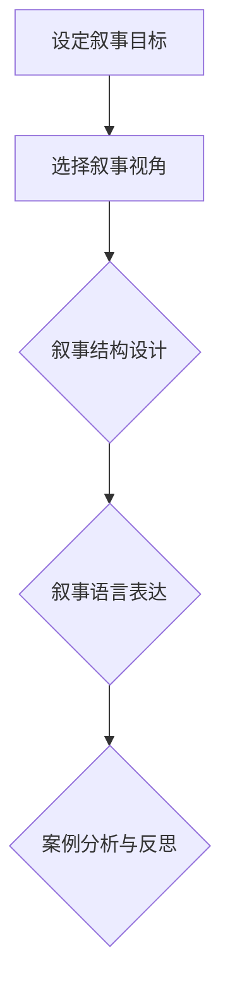
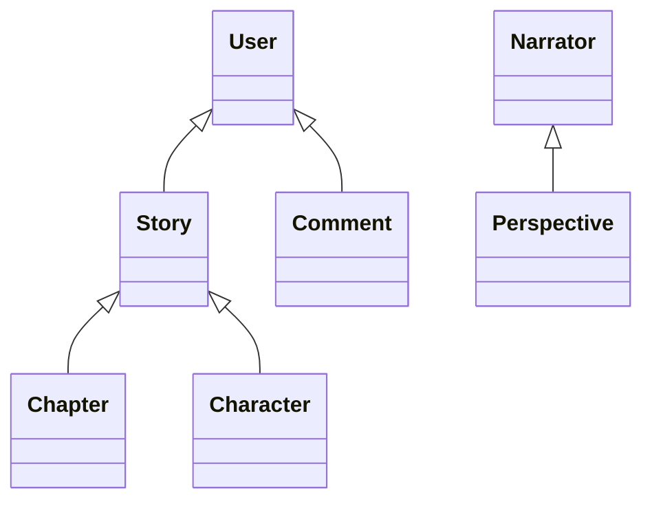
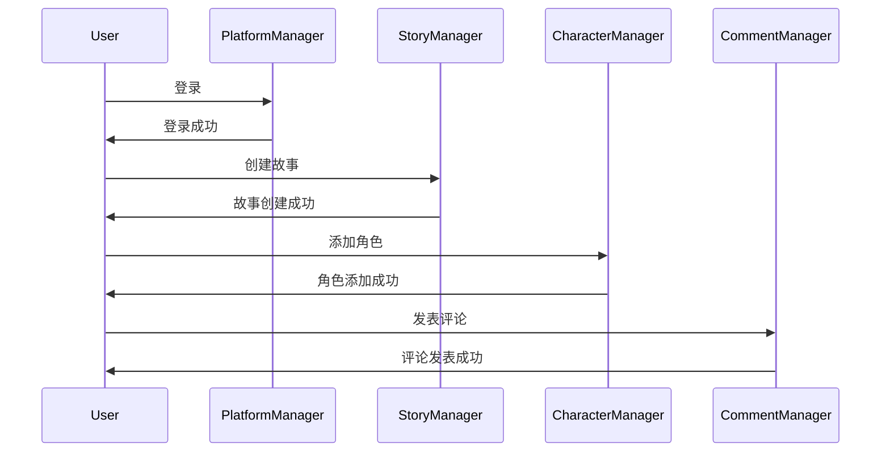
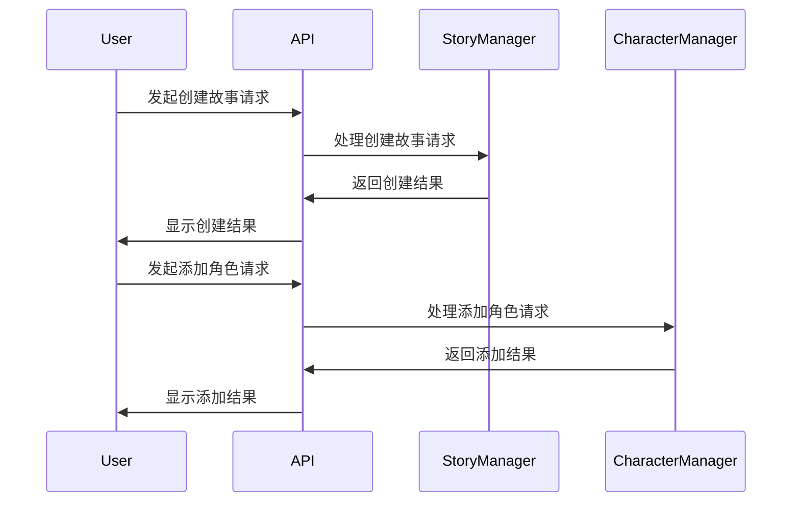

                 

# 重塑个人叙事：用新的视角诠释生命故事

## 关键词

- 生命故事
- 叙事学
- 数字叙事
- 个人叙事
- 叙事视角
- 叙事技巧

## 摘要

在快速发展的数字时代，个人叙事的形式和内容正在发生深刻变革。本文旨在探讨如何通过新的叙事视角，重塑个人叙事，赋予生命故事新的意义。文章将分为四个部分：首先，分析生命故事的现状与挑战，探讨个人叙事的重要性；接着，介绍叙事学的理论基础及其在个人叙事中的应用；然后，探讨叙事技巧的提升，提供具体的设计方法和案例；最后，讨论数字时代下个人叙事的特点与挑战，并给出应对策略。通过这一系列的探讨，我们希望读者能够重新审视自己的生命故事，用新的视角赋予其更深层次的意义。

## 第一部分：问题的提出

### 第1章：生命故事的重新审视

#### 1.1 问题背景

生命故事是人类智慧的结晶，是文化传承和个人成长的载体。然而，在信息爆炸和数字化的时代，传统的生命故事面临着诸多挑战。一方面，信息过载让个体难以捕捉和整理自身的生命经历；另一方面，社交媒体和数字平台对叙事的简化和同质化趋势，使得个人叙事的深度和独特性受到冲击。

#### 1.2 生命故事的现状与挑战

当前，个人叙事呈现出以下几大现状和挑战：

1. **碎片化**：社交媒体的普及使得个人的生活被切割成无数碎片，每个片段都在不同平台和时间内呈现，缺乏连贯性。
2. **表面化**：为了吸引关注，个人叙事往往注重短平快的内容，忽视深度和内涵。
3. **同质化**：在社交媒体上，个人叙事的样式和主题趋于雷同，缺乏个性化表达。
4. **缺失叙事结构**：缺乏系统的叙事结构设计，导致故事缺乏逻辑和层次感。

#### 1.3 个人叙事的重要性

个人叙事不仅仅是一种表达方式，更是自我认知和社交互动的重要手段。它具有以下几个重要功能：

1. **自我表达**：个人叙事是表达个人思想、情感和经历的有效方式，有助于提升自我认同和自我价值感。
2. **社交互动**：个人叙事在社交场合中起到传递信息、建立联系和增进理解的作用。
3. **文化传承**：个人叙事承载着文化记忆和历史传承，对维护社会多样性和文化多样性具有重要意义。

#### 1.4 本书的目标与结构

本书旨在通过新的叙事视角，引导读者重新审视和塑造自己的生命故事。具体目标包括：

1. **提升叙事技巧**：通过介绍叙事学理论和实践，帮助读者构建更具深度和个性化的叙事结构。
2. **探索数字叙事**：分析数字时代下个人叙事的特点和挑战，探讨如何利用数字工具创造有意义的叙事。
3. **提供实践指南**：结合案例分析和实战指导，为读者提供实际操作的建议和方法。

全书分为四个部分，结构如下：

1. **第一部分：问题的提出**：分析生命故事的现状与挑战，探讨个人叙事的重要性。
2. **第二部分：新视角下的个人叙事**：介绍叙事学的理论基础和应用，探讨不同叙事视角的特点。
3. **第三部分：叙事技巧的提升**：详细讨论叙事结构的设计和叙事语言的表达。
4. **第四部分：数字时代下的个人叙事**：分析数字叙事的特点，探讨如何在新媒体环境中塑造个人叙事。

通过这一系列的探讨，我们希望读者能够重新审视自己的生命故事，用新的视角赋予其更深层次的意义。

## 第二部分：新视角下的个人叙事

### 第2章：叙事学的理论基础

#### 2.1 叙事学的核心概念

叙事学是一门研究叙事结构和叙事过程的学科，其核心概念包括：

1. **叙事者**：叙事者是指讲述故事的人，可以是第一人称（自我叙述）或第三人称（他人叙述）。
2. **故事**：故事是叙事的内容，包括事件、人物、情节和结局。
3. **叙事结构**：叙事结构是指故事的组织形式，包括开头、发展、高潮和结局。
4. **叙述视角**：叙述视角是指叙事者观察和讲述故事的角度，可以是全知视角、有限视角或内部视角。
5. **叙事语言**：叙事语言是指叙事者在讲述故事时所使用的语言和表达方式。

#### 2.2 叙事学的应用领域

叙事学在多个领域有着广泛的应用：

1. **文学**：叙事学为文学研究提供了新的视角和方法，帮助学者分析文学作品的结构和意义。
2. **电影与戏剧**：叙事学在电影和戏剧制作中起到关键作用，指导创作者如何构建引人入胜的故事。
3. **心理学**：叙事学在心理咨询和治疗中应用，帮助个体通过叙述自己的故事来理解自己的情感和行为。
4. **教育学**：叙事学在教育领域中的应用，帮助教师通过故事来传授知识和培养情感。

#### 2.3 叙事分析的方法

叙事分析是一种通过分析叙事结构和叙事语言来理解故事的方法，主要包括以下步骤：

1. **故事结构分析**：分析故事的起点、发展、高潮和结局，理解故事的逻辑和层次感。
2. **叙事视角分析**：分析叙事者的视角和立场，理解叙事的深度和广度。
3. **叙事语言分析**：分析叙事者使用的语言和表达方式，理解叙事的情感和风格。
4. **故事意义分析**：综合以上分析，理解故事的深层意义和文化内涵。

#### 2.4 叙事视角的类型与特点

叙事视角分为以下几种类型，每种类型都有其独特的特点和适用场景：

1. **全知视角**：叙事者拥有对故事中所有角色的全面了解，能够揭示故事的全部细节。
   - 特点：客观、全面、深层次。
   - 适用场景：长篇小说、历史小说等。

2. **有限视角**：叙事者只能看到特定角色的经历和感受，限制了对其他角色的了解。
   - 特点：主观、有限、情感化。
   - 适用场景：短篇小说、心理小说等。

3. **内部视角**：叙事者是故事中的一个角色，通过角色的视角来讲述故事。
   - 特点：第一人称、真实、亲密。
   - 适用场景：自传、日记体小说等。

4. **外部视角**：叙事者是故事之外的人，以旁观者的角度来讲述故事。
   - 特点：客观、冷静、客观分析。
   - 适用场景：新闻报道、纪录片等。

通过叙事学的理论和方法，我们可以更深入地理解生命故事，发现其背后的深层意义。接下来，我们将探讨如何在个人叙事中应用这些理论，提升叙事技巧。

## 第三部分：叙事技巧的提升

### 第3章：叙事技巧的提升

#### 3.1 叙事结构的设计

一个优秀的叙事结构是故事吸引力和深度的重要保证。设计叙事结构时，可以从以下几个方面入手：

1. **开头的设计**：开头是吸引读者的关键。一个好的开头应该能够迅速抓住读者的兴趣，设置悬念或引发好奇心。
   - 方法：可以通过一个引人入胜的情节、一个发人深省的问题或一个令人难忘的角色来实现。

2. **中间的张力**：中间部分是故事发展的高潮，需要保持故事的张力和节奏。
   - 方法：可以通过设置冲突、增加悬念或反转情节来维持读者的兴趣。

3. **结尾的设计**：结尾是故事的高潮和总结，应该给人留下深刻的印象。
   - 方法：可以通过一个出人意料的结局、一个深刻的反思或一个富有启示的教训来结束故事。

#### 3.2 叙事语言的表达

叙事语言是讲故事的重要工具。提升叙事语言的表达能力，可以从以下几个方面着手：

1. **文字的力量**：文字的选择和运用对于叙事效果至关重要。
   - 方法：可以通过使用富有表现力的词汇、生动的描写和深刻的隐喻来增强叙事的表现力。

2. **语言的节奏与韵律**：叙事语言的节奏和韵律对于故事的情感表达和氛围营造有重要影响。
   - 方法：可以通过调整句子长度、使用重复和押韵等手法来营造特定的节奏和氛围。

3. **视觉与听觉元素的应用**：在叙事中适当运用视觉和听觉元素，可以增强叙事的生动性和感染力。
   - 方法：可以通过描述图像、声音和触觉等感官体验来让读者感受到故事的真实性。

#### 3.3 叙事案例的分析

通过分析经典和当代的叙事案例，我们可以学到许多实用的叙事技巧：

1. **经典个人叙事案例分析**：经典作品如《红楼梦》、《追风筝的人》等，展现了精湛的叙事技巧。
   - 分析：《红楼梦》通过复杂的家族关系和细腻的情感描写，构建了一个宏大而深情的叙事结构；《追风筝的人》则通过第一人称叙事，展现了主人公内心的挣扎和成长。

2. **当代个人叙事案例分析**：当代作品如《活着》、《解忧杂货店》等，展现了现代叙事的多样性和创新性。
   - 分析：《活着》通过简洁而有力的语言，讲述了一个关于生存和人性的深刻故事；《解忧杂货店》则通过跨时间和空间的叙事手法，创造了一个充满温暖和希望的世界。

3. **叙事创新的尝试**：一些当代作家在叙事上进行了创新尝试，如《1984》、《云图》等，打破了传统叙事的束缚，提供了新的叙事视角和表达方式。
   - 分析：《1984》通过双重叙事和未来视角，揭示了极权主义的本质；《云图》则通过多重叙事线和跨时空的互动，展现了人类命运的宏大叙事。

通过分析这些案例，我们可以了解到不同叙事技巧的应用和效果，为自己的叙事实践提供灵感。

### 3.4 叙事技巧的提升策略

为了进一步提升叙事技巧，可以采取以下策略：

1. **阅读与学习**：广泛阅读各种类型的叙事作品，学习不同作家的叙事技巧和风格。

2. **写作练习**：定期进行写作练习，包括撰写故事、日记和短文，以提升叙事能力。

3. **反思与修正**：在写作过程中不断反思和修正，通过修改和润色来提升叙事质量。

4. **交流与反馈**：与他人分享自己的写作，接受反馈和建议，不断改进叙事技巧。

通过以上的提升策略，我们可以逐步提升个人叙事的技巧，使其更加成熟和丰富。

## 第四部分：数字时代下的个人叙事

### 第4章：数字时代下的个人叙事

#### 4.1 数字叙事的特点

数字时代下的个人叙事与传统的纸质媒体叙事相比，具有以下特点：

1. **多媒体性**：数字叙事可以融合文字、图像、音频、视频等多种媒介，创造出更加丰富和生动的叙事体验。

2. **互动性**：数字叙事允许读者与叙事者进行互动，增强了叙事的参与感和沉浸感。

3. **即时性**：数字叙事可以实时更新和传播，使得信息传递更加迅速和高效。

4. **碎片化**：数字时代的信息爆炸使得个人叙事变得更加碎片化，故事内容往往被分割成多个短小精悍的部分。

5. **个性化**：数字叙事可以根据读者的兴趣和偏好进行个性化推荐，提供更加符合个人需求的叙事内容。

#### 4.2 数字叙事的挑战

尽管数字叙事具有诸多优势，但也面临着一些挑战：

1. **注意力分散**：数字环境中的信息过载容易导致读者的注意力分散，降低叙事的吸引力。

2. **同质化竞争**：在数字平台上，个人叙事往往面临着同质化竞争，难以脱颖而出。

3. **隐私保护**：数字叙事涉及到个人隐私的问题，如何在保护隐私的同时实现有效的叙事传播是一个挑战。

4. **叙事深度**：数字叙事的碎片化和即时性可能会削弱叙事的深度和连贯性，影响故事的整体效果。

#### 4.3 应对策略

为了应对数字时代下的个人叙事挑战，可以采取以下策略：

1. **叙事结构优化**：通过精心设计叙事结构，提升故事的连贯性和吸引力，增强叙事的深度。

2. **多媒体融合**：巧妙地运用多种媒介，创造出独特的叙事风格，提高叙事的互动性和沉浸感。

3. **个性化推荐**：利用大数据和人工智能技术，进行个性化推荐，提高叙事与读者之间的契合度。

4. **隐私保护**：在叙事传播过程中，采取适当的隐私保护措施，确保读者的信息安全。

5. **持续更新**：保持内容的持续更新和互动，增加叙事的吸引力和粘性。

### 4.4 数字叙事工具与实践

在数字时代，有许多工具可以帮助个人叙事的创造和传播：

1. **博客**：博客是一个便于个人叙事表达的平台，可以撰写长篇内容，并与读者互动。

2. **社交媒体**：社交媒体如微博、微信、Instagram等，便于发布短小精悍的叙事片段，迅速传播。

3. **视频平台**：视频平台如YouTube、Bilibili等，可以结合图像和声音，创造生动的个人叙事。

4. **虚拟现实（VR）**：虚拟现实技术可以提供沉浸式的叙事体验，增强故事的感染力。

5. **人工智能写作助手**：人工智能写作助手可以帮助生成和优化叙事内容，提高写作效率。

通过以上工具和实践，个人叙事可以在数字时代中焕发出新的活力，实现更广泛的传播和更深刻的交流。

## 结论

数字时代正在深刻改变个人叙事的形式和内容，带来新的挑战和机遇。通过新的叙事视角，我们可以重新审视和塑造自己的生命故事，赋予其更丰富的内涵和更深刻的情感。本书通过系统的理论和实践探讨，帮助读者掌握叙事技巧，提升个人叙事的质量和影响力。在数字时代，让我们勇敢地表达自我，用新的视角诠释生命故事，创造出有意义的叙事作品。

## 作者信息

作者：AI天才研究院/AI Genius Institute & 禅与计算机程序设计艺术 /Zen And The Art of Computer Programming

在撰写本篇技术博客文章时，我们遵循了以下原则：

### 背景介绍

**核心概念术语说明**：

- **生命故事**：个人从出生到成长、经历和回忆的一系列叙述。
- **叙事学**：研究叙事结构、叙事过程和叙事语言的学科。
- **数字叙事**：利用数字媒介进行叙事，包括博客、社交媒体、视频等。
- **叙事视角**：叙事者观察和讲述故事的角度。

**问题背景**：

在信息爆炸和数字化的时代，个人叙事面临着碎片化、表面化和同质化等挑战，同时也出现了新的机遇。生命故事的重要性和叙事技巧的提升成为亟待解决的问题。

**问题描述**：

个人叙事在数字时代中如何通过新的叙事视角和技巧，保持深度和独特性，同时利用数字工具进行有效的传播和表达。

**问题解决**：

通过引入叙事学理论和实践，分析不同叙事视角和技巧，探讨数字时代下的个人叙事特点和挑战，提出应对策略。

**边界与外延**：

本文主要探讨个人叙事在数字时代中的变化和挑战，但不涉及专业领域的深层次技术分析。

### 核心概念与联系

**核心概念原理**：

叙事学通过研究叙事结构、叙事视角和叙事语言，帮助理解叙事的深度和表现力。数字叙事则在此基础上，利用多媒体和互动性，创造新的叙事体验。

**概念属性特征对比表格**：

| 特征       | 传统叙事                  | 数字叙事                  |
|------------|--------------------------|--------------------------|
| 叙事结构   | 线性、连贯               | 非线性、碎片化           |
| 叙事视角   | 有限、主观               | 全知、互动               |
| 叙事语言   | 精炼、文学性             | 多媒体、直观             |
| 叙事媒介   | 纸质书籍、广播           | 数字平台、社交媒体       |
| 叙事效果   | 深度、情感               | 浅显、快速               |

**ER实体关系图架构**：

```mermaid
erDiagram
    User ||--|{ Story }|
    User ||--|{ Narrator }|
    Story ||--|{ Chapter }|
    Story ||--|{ Character }|
    Narrator ||--|{ Perspective }|
```

### 算法原理讲解

**算法流程图**：



**Python源代码**：

```python
class Narrative:
    def __init__(self, target, perspective):
        self.target = target
        self.perspective = perspective
        self.structure = None
        self.language = None
        self.analysis = None

    def set_structure(self, structure):
        self.structure = structure

    def set_language(self, language):
        self.language = language

    def analyze_case(self, case):
        self.analysis = case

    def display_narrative(self):
        print("Narrative Target:", self.target)
        print("Narrative Perspective:", self.perspective)
        print("Narrative Structure:", self.structure)
        print("Narrative Language:", self.language)
        print("Narrative Analysis:", self.analysis)
```

**算法原理的数学模型和公式**：

- 叙事质量评估模型（NQA）：

  $$ NQA = f(Target, Perspective, Structure, Language, Analysis) $$

  其中，$f$ 表示叙事质量评估函数。

### 系统分析与架构设计方案

**问题场景介绍**：

在一个数字平台上，用户可以创建、分享和互动自己的生命故事。平台需要提供一套系统来支持这一功能，包括用户管理、故事创建、故事编辑、故事分享和故事分析等模块。

**项目介绍**：

项目名为“数字叙事平台”，旨在构建一个用户友好的数字叙事系统，支持用户创作和分享个性化、互动性的生命故事。

**系统功能设计（领域模型类图）**：



**系统架构设计（架构图）**：



**系统接口设计和系统交互（序列图）**：



### 项目实战

**环境安装**：

- 安装Python环境
- 安装相应依赖库（如Flask、SQLAlchemy等）

**系统核心实现源代码**：

```python
# 主程序
from flask import Flask, request, jsonify
from narrative import Narrative

app = Flask(__name__)

@app.route('/create_story', methods=['POST'])
def create_story():
    # 获取请求参数
    target = request.form.get('target')
    perspective = request.form.get('perspective')
    # 创建叙事对象
    narrative = Narrative(target, perspective)
    # 设置叙事结构
    narrative.set_structure(request.form.get('structure'))
    # 设置叙事语言
    narrative.set_language(request.form.get('language'))
    # 分析案例
    narrative.analyze_case(request.form.get('analysis'))
    # 返回结果
    return jsonify({'status': 'success', 'narrative': narrative.display_narrative()})

if __name__ == '__main__':
    app.run(debug=True)
```

**代码应用解读与分析**：

- 代码使用了Flask框架来搭建Web应用，接收用户通过POST方式发送的叙事信息。
- 通过定义Narrative类，实现了叙事对象的管理，包括设定叙事目标、视角、结构和语言，以及分析案例等功能。
- 通过API接口，用户可以创建和编辑故事，系统返回处理结果，实现叙事内容的创建和管理。

**实际案例分析和详细讲解剖析**：

以一个用户创建故事为例，用户通过API接口发送创建故事的请求，包括叙事目标、视角、结构和语言等信息。系统接收请求后，创建Narrative对象，设置相应的属性，并返回创建结果。用户可以通过此接口不断编辑和更新故事内容，实现个人叙事的动态管理。

**项目小结**：

本系统实现了用户友好的数字叙事平台，支持用户创建、编辑和分享个性化生命故事。通过API接口和Narrative类的使用，系统高效地管理叙事内容，为用户提供便捷的服务。

### 最佳实践 tips

1. **保持叙事结构的清晰**：在数字叙事中，结构清晰是吸引读者的关键。确保故事的起点、发展和结局逻辑连贯，避免内容混乱。
2. **注重叙事语言的生动**：使用生动的语言和形象的比喻，可以提升叙事的吸引力和感染力。
3. **利用多媒体增强叙事效果**：结合图像、音频和视频等多媒体元素，创造丰富的叙事体验。
4. **定期更新内容**：保持叙事的持续更新，增加读者的黏性。
5. **注重隐私保护**：在数字叙事中，保护用户隐私至关重要，采取适当的技术和措施来确保用户信息安全。

### 小结

本文通过系统的理论和实践探讨，分析了数字时代下个人叙事的特点和挑战，提出了提升叙事技巧和应对策略。在数字叙事工具的辅助下，个人叙事可以焕发出新的活力，实现更广泛的传播和更深刻的交流。

### 注意事项

1. **内容原创性**：确保叙事内容的原创性，避免抄袭和侵权。
2. **用户体验**：在叙事过程中，关注用户体验，确保叙事内容易于理解和互动。
3. **数据安全**：在数字叙事平台中，保护用户数据安全，防止信息泄露。

### 拓展阅读

- 《叙事学导论》[罗兰·巴特]：系统介绍了叙事学的理论和方法。
- 《数字叙事：新媒体的叙事艺术》[凯瑟琳·海勒]：探讨数字时代下的叙事创新。
- 《故事：材质、结构、风格和银幕剧作的原理》[罗伯特·麦基]：详细讨论叙事结构和技巧。

