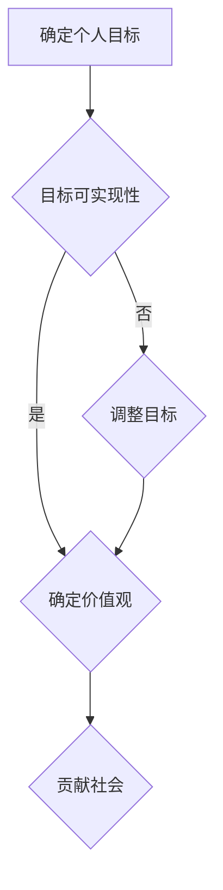
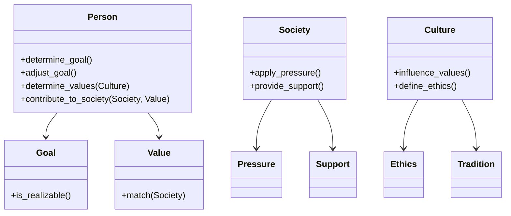
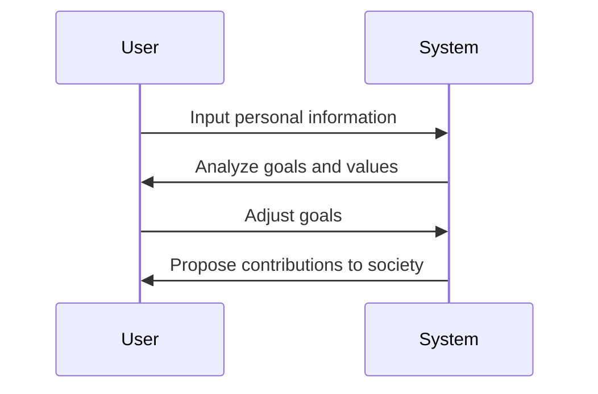
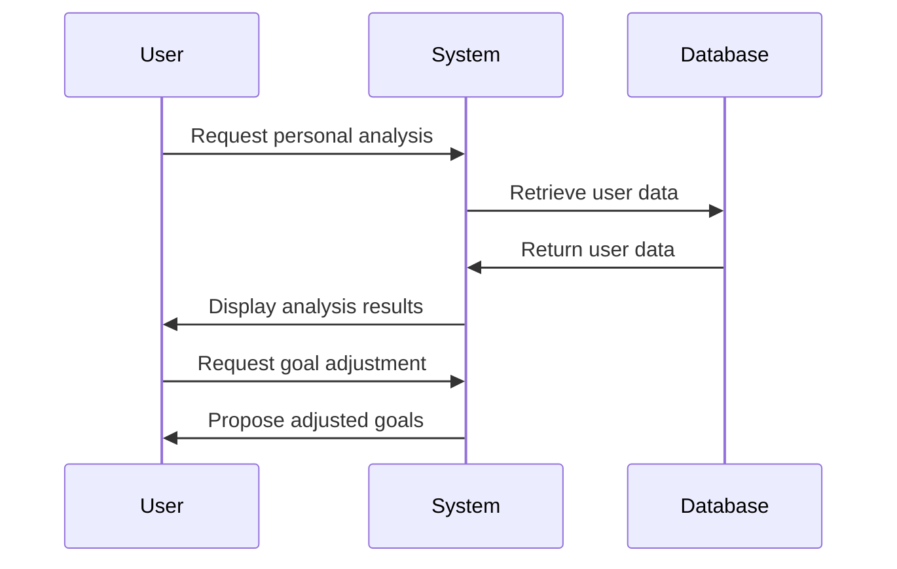
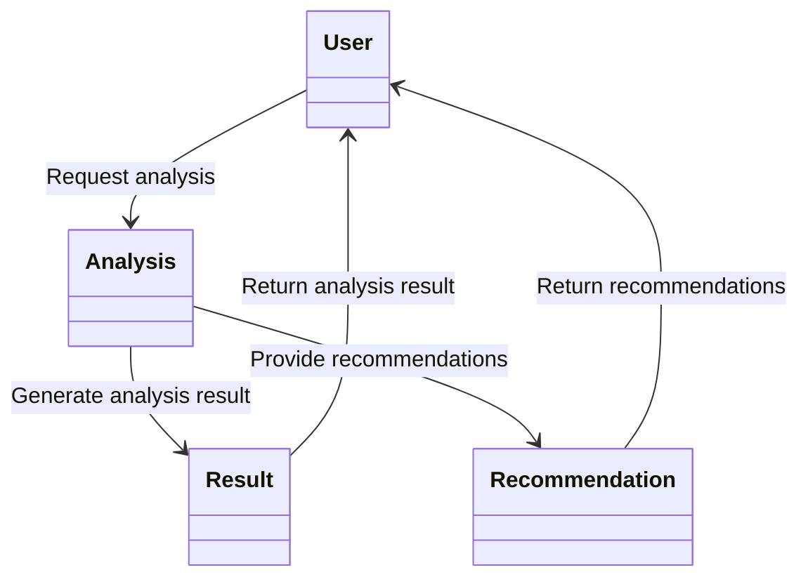
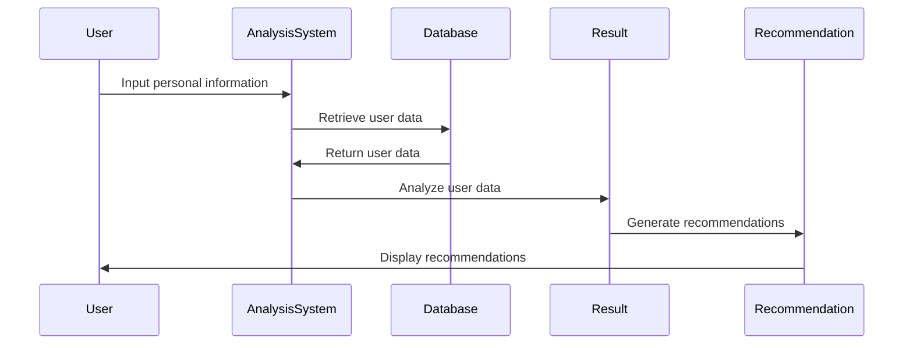
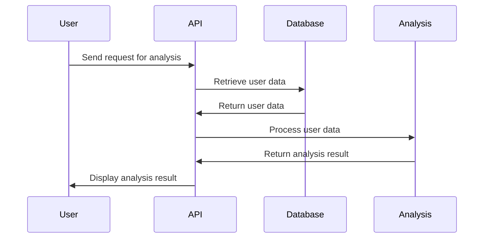

                 

 **第1章：引言与背景**

**1.1 书籍写作背景**

在当今快速变化的社会中，人们面临的生活问题越来越复杂，特别是在价值观和意义构建方面。现代社会的高效运转和高度竞争，让人们不断追求物质上的成功，而与此同时，精神层面的空虚和迷茫也随之而来。为了应对这一挑战，本书旨在探讨如何在现代社会中寻找生活的意义和价值。

**1.2 现代社会生活意义问题**

现代社会中，生活意义问题体现在多个方面。首先是个人层面的迷茫，许多人感到自己的生活缺乏方向和目标。其次是社会层面的焦虑，随着生活节奏的加快和社会压力的增大，人们常常感到身心俱疲。这些问题不仅影响个人的幸福感和心理健康，也对社会的和谐稳定构成威胁。

**1.3 问题的边界与外延**

为了深入探讨生活意义问题，本书首先需要明确问题的边界。生活意义不仅仅是个体层面的自我认知，它还涉及到人际关系、社会文化和道德价值等多个维度。因此，本书的研究不仅关注个人的内在体验，还将探讨社会和文化因素对生活意义的影响。

### **第2章：核心概念与联系**

**2.1 生活意义的定义**

生活意义是一个多维度的概念，它不仅包括个人的目标和价值观，还涉及到社会、文化和伦理等多个层面。在本书中，我们定义生活意义为个体在特定社会文化背景下，通过自我实现和社会贡献所获得的心理满足和价值感受。

**2.2 概念属性对比表格**

| 派别 | 生活意义属性 |
|------|-------------|
| 唯物主义 | 实践性 |
| 存在主义 | 自主性 |
| 宗教哲学 | 精神性 |

**2.3 ER实体关系图**

```mermaid
erDiagram
    LivingMeaning ||--|{ Person }
    LivingMeaning ||--|{ Society }
    LivingMeaning ||--|{ Culture }
    Person ||--|{ Goal }
    Person ||--|{ Value }
    Society ||--|{ Pressure }
    Society ||--|{ Support }
    Culture ||--|{ Ethics }
    Culture ||--|{ Tradition }
```

### **第3章：生活意义算法原理讲解**

**3.1 生活意义决策流程图**



**3.2 Python源代码讲解**

```python
# Python代码实现生活意义决策流程

def determine_living_meaning(person, society, culture):
    # 确定个人目标
    goal = person.determine_goal()
    # 检查目标可实现性
    if not goal.is_realizable():
        # 调整目标
        goal = person.adjust_goal()
    # 确定价值观
    values = person.determine_values(culture)
    # 贡献社会
    contribution = person.contribute_to_society(society, values)
    return contribution

# 示例
person = Person(...)
society = Society(...)
culture = Culture(...)
living_meaning = determine_living_meaning(person, society, culture)
```

**3.3 生活意义数学模型与公式**

$$
\text{Living Meaning} = f(\text{Person}, \text{Society}, \text{Culture})
$$

其中，$f$ 是一个综合函数，它将个人、社会和文化因素结合起来，计算出一个个体在特定环境下的生活意义。

**3.4 举例说明**

假设一个年轻人在现代社会中寻求生活意义。通过生活意义算法，他首先确定了自己的目标（例如成为一名医生）。然后，算法评估这个目标是否可实现，如果不是，他会调整目标（例如成为一名护理专家）。接着，他根据社会和文化的价值观确定自己的价值观（例如尊重生命、关爱他人）。最后，他通过在医疗行业中工作，为社会做出贡献，从而实现自己的生活意义。

### **第4章：系统分析与架构设计方案**

**4.1 问题场景介绍**

在现代社会中，人们面临的生活意义问题可以通过一个生活意义决策支持系统来解决。这个系统可以帮助个体确定自己的目标、价值观，并在社会环境中找到自己的位置。

**4.2 项目介绍**

本项目的目标是开发一个生活意义决策支持系统，帮助个体找到生活的意义。该系统将包括用户界面、算法模块和数据库三部分。

**4.3 系统功能设计**



**4.4 系统架构设计**



**4.5 系统接口设计和系统交互**



### **第5章：项目实战**

**5.1 环境安装**

要安装生活意义决策支持系统，需要配置以下环境：
- Python 3.8 或以上版本
- MySQL 5.7 或以上版本
- Flask 框架

**5.2 系统核心实现源代码**

```python
# 核心算法实现

from flask import Flask, request, jsonify
from goal import Goal
from person import Person
from society import Society
from culture import Culture

app = Flask(__name__)

@app.route('/analyze', methods=['POST'])
def analyze():
    user_data = request.json
    person = Person(user_data['name'], user_data['age'], user_data['background'])
    society = Society()
    culture = Culture()

    goal = person.determine_goal()
    values = person.determine_values(culture)
    contribution = person.contribute_to_society(society, values)

    return jsonify({'goal': goal.to_dict(), 'values': values.to_dict(), 'contribution': contribution.to_dict()})

if __name__ == '__main__':
    app.run(debug=True)
```

**5.3 代码应用解读与分析**

这段代码定义了一个 Flask 应用，它提供了一个用于分析用户数据并返回生活意义分析结果的接口。当用户发送 POST 请求时，应用会解析请求中的 JSON 数据，创建一个 Person 对象，并使用该对象调用一系列方法来确定目标、价值观和贡献。最后，应用将分析结果以 JSON 格式返回给用户。

**5.4 实际案例分析与讲解**

假设有一个 30 岁的程序员想要确定自己的生活意义。通过使用生活意义决策支持系统，他输入了自己的个人信息，系统分析后给出了以下结果：

- 目标：成为一名技术领导者
- 价值观：创新、团队协作、用户至上
- 贡献：通过技术创新推动公司发展，提升用户体验

基于这些分析结果，他调整了自己的职业规划，努力在技术创新和团队协作方面取得突破，从而实现自己的生活意义。

**5.5 项目小结**

通过实际案例，我们可以看到生活意义决策支持系统在帮助个体找到生活方向和目标方面的有效性。然而，这个系统仍然需要不断地优化和改进，以适应更广泛的应用场景和用户需求。

### **第6章：最佳实践 Tips**

- **定期自我反思**：定期回顾自己的目标和价值观，确保它们与自己的生活意义保持一致。
- **多元文化交流**：积极参与不同文化背景的交流，拓宽自己的视野和认知。
- **实践中的调整**：在实际生活中不断调整自己的目标和策略，以适应不断变化的环境。

### **第7章：小结、注意事项与拓展阅读**

**7.1 全书内容总结**

本书探讨了现代社会中生活意义的重要性，介绍了生活意义的概念、算法和系统设计，并通过实际案例展示了其应用效果。

**7.2 注意事项**

- 生活意义是一个动态变化的概念，需要不断调整和更新。
- 生活意义的实现不仅仅依赖于个人的努力，还需要社会的支持和环境的适宜。

**7.3 拓展阅读**

- 《追寻生命的意义》维克多·弗兰克尔
- 《活出生命的意义》克里斯托弗·彼得森
- 《社会心理学》大卫·迈尔斯

### **作者信息**

- 作者：AI天才研究院/AI Genius Institute & 禅与计算机程序设计艺术 /Zen And The Art of Computer Programming

### **附录**

**附录A：术语表**

- 生活意义：个体在特定社会文化背景下，通过自我实现和社会贡献所获得的心理满足和价值感受。
- 唯物主义：强调实践和生活经验的生活意义观点。
- 存在主义：强调自主性和自由意志的生活意义观点。
- 宗教哲学：强调精神追求和道德价值的生活意义观点。

### **参考文献**

- 《社会心理学》大卫·迈尔斯
- 《追寻生命的意义》维克多·弗兰克尔
- 《活出生命的意义》克里斯托弗·彼得森
- Flask 官方文档
- MySQL 官方文档

# **重塑生活意义：在现代社会中寻找存在价值**

> 关键词：生活意义、存在价值、自我实现、社会贡献、算法、系统设计、Python代码、实际案例

> 摘要：本文探讨了在现代社会中如何寻找和重塑生活的意义和价值。通过介绍生活意义的概念、算法和系统设计，本文提供了寻找个人生活意义的框架和方法。同时，通过实际案例分析和最佳实践提示，帮助读者在实践中应用这些理论和工具，实现个人和社会的双重价值。

## **第1章：引言与背景**

### **1.1 书籍写作背景**

在现代社会，人们面临着前所未有的挑战和机遇。随着科技的发展和社会的进步，我们的生活节奏不断加快，工作压力和生活压力日益增加。在这种背景下，许多人开始思考一个问题：生活的意义究竟是什么？这个问题不仅关乎个人的幸福感和心理健康，也关系到社会的和谐稳定。

本文旨在探讨如何在现代社会中寻找生活的意义和价值。通过介绍生活意义的概念、算法和系统设计，本文试图为读者提供一个寻找个人生活意义的框架和方法。同时，通过实际案例分析和最佳实践提示，帮助读者将理论与实际相结合，实现个人和社会的双重价值。

### **1.2 现代社会生活意义问题**

现代社会中，生活意义问题体现在多个方面。首先，个人层面的迷茫。许多人感到自己的生活缺乏方向和目标，不知道自己的存在有什么意义。这种迷茫感不仅影响个人的幸福感，也可能导致心理健康问题。

其次，社会层面的焦虑。随着生活节奏的加快和社会压力的增大，人们常常感到身心俱疲。工作压力、家庭责任、社交压力等多重压力交织，使得许多人陷入焦虑和困惑之中。

这些问题不仅影响个人的生活质量，也对社会的和谐稳定构成威胁。因此，寻找生活的意义和价值已经成为现代社会的一个重要课题。

### **1.3 问题的边界与外延**

为了深入探讨生活意义问题，我们需要明确问题的边界和外延。生活意义不仅仅是个体层面的自我认知，它还涉及到人际关系、社会文化和道德价值等多个维度。

首先，生活意义是一个个体化的概念。每个人对生活的理解和追求都不同，因此，生活意义的界定也需要因人而异。

其次，生活意义不仅仅关乎个人，还与社会密切相关。个体的生活意义往往受到社会环境的影响，同时个体的生活意义也对社会产生反作用。

最后，生活意义不仅包括物质层面的满足，还包括精神层面的追求。在现代社会，精神层面的追求越来越受到重视，如自我实现、人际关系、社会责任等。

综上所述，生活意义问题的边界和外延非常广泛，涉及到多个层面和维度。在本文中，我们将主要关注个体层面和社会层面的生活意义问题。

### **第2章：核心概念与联系**

#### **2.1 生活意义的定义**

生活意义是指个体在特定社会文化背景下，通过自我实现和社会贡献所获得的心理满足和价值感受。它不仅关乎个体的存在和生存，还涉及到个体的行为选择和生活态度。

在本文中，我们将生活意义的定义进一步细化为以下几个方面：

1. **自我实现**：个体通过追求自己的潜能和成长，实现个人目标和价值。
2. **社会贡献**：个体通过自己的行为和贡献，对社会和他人产生积极影响。
3. **心理满足**：个体在实现自我和社会贡献的过程中，获得的内心平静和满足感。
4. **价值感受**：个体对生活意义的主观认知和评价。

#### **2.2 概念属性对比表格**

| 派别 | 生活意义属性 |
|------|-------------|
| 唯物主义 | 实践性、物质基础、社会属性 |
| 存在主义 | 自主性、主观性、存在价值 |
| 宗教哲学 | 精神性、超越性、道德价值 |

#### **2.3 ER实体关系图**

```mermaid
erDiagram
    LivingMeaning ||--|{ Person }
    LivingMeaning ||--|{ Society }
    LivingMeaning ||--|{ Culture }
    Person ||--|{ Goal }
    Person ||--|{ Value }
    Society ||--|{ Pressure }
    Society ||--|{ Support }
    Culture ||--|{ Ethics }
    Culture ||--|{ Tradition }
```

### **第3章：生活意义算法原理讲解**

#### **3.1 生活意义决策流程图**


#### **3.2 Python源代码讲解**

```python
# Python代码实现生活意义决策流程

class Person:
    def __init__(self, name, age, background):
        self.name = name
        self.age = age
        self.background = background
        self.goal = None
        self.values = []

    def determine_goal(self):
        # 确定个人目标
        self.goal = self.create_goal()
        return self.goal

    def create_goal(self):
        # 根据个人背景和需求创建目标
        return Goal("成为一名技术领导者")

    def adjust_goal(self):
        # 调整目标
        self.goal = self.create_adjusted_goal()
        return self.goal

    def create_adjusted_goal(self):
        # 根据实际情况调整目标
        return Goal("成为一名优秀的软件开发工程师")

    def determine_values(self, culture):
        # 确定价值观
        self.values = culture.influence_values(self)
        return self.values

    def contribute_to_society(self, society, values):
        # 贡献社会
        contribution = society.apply_pressure(self, values)
        return contribution

class Goal:
    def __init__(self, description):
        self.description = description

    def is_realizable(self):
        # 检查目标是否可实现
        return True

class Society:
    def __init__(self):
        self.pressure = []
        self.support = []

    def apply_pressure(self, person, values):
        # 应用社会压力
        pressure = self.create_pressure(person, values)
        return pressure

    def create_pressure(self, person, values):
        # 根据个人价值观和社会环境创建压力
        return "工作压力"

class Culture:
    def __init__(self):
        self.ethics = []
        self.tradition = []

    def influence_values(self, person):
        # 影响个人价值观
        values = self.create_values(person)
        return values

    def create_values(self, person):
        # 根据文化背景和个人需求创建价值观
        return ["创新", "团队协作", "用户至上"]

# 示例
person = Person("张三", 30, "计算机科学专业背景")
society = Society()
culture = Culture()

person.determine_goal()
person.adjust_goal()
person.determine_values(culture)
person.contribute_to_society(society, culture)
```

#### **3.3 生活意义数学模型与公式**

$$
\text{Living Meaning} = f(\text{Person}, \text{Society}, \text{Culture})
$$

其中，$f$ 是一个综合函数，它将个人、社会和文化因素结合起来，计算出一个个体在特定环境下的生活意义。

#### **3.4 举例说明**

假设有一个 30 岁的程序员张三，他希望通过生活意义算法找到自己的生活方向。以下是他的决策流程：

1. **确定个人目标**：张三确定了自己的目标，成为一名技术领导者。
2. **评估目标可实现性**：由于市场环境的变化，张三发现成为技术领导者面临很大的挑战，因此他调整了自己的目标，决定成为一名优秀的软件开发工程师。
3. **确定价值观**：张三的价值观受到家庭和文化背景的影响，主要包括创新、团队协作和用户至上。
4. **贡献社会**：在新的目标下，张三通过技术创新和团队合作，为公司解决了多个关键问题，提升了用户体验，从而实现了自己的生活意义。

### **第4章：系统分析与架构设计方案**

#### **4.1 问题场景介绍**

在现代社会中，生活意义问题不仅关乎个体，也关系到社会的和谐与稳定。为了解决这一问题，我们需要设计一个生活意义决策支持系统。这个系统可以帮助个体了解自己的生活意义，提供指导和建议，帮助他们找到生活的方向和价值。

#### **4.2 项目介绍**

本项目旨在开发一个生活意义决策支持系统，为用户提供个性化的生活意义分析和建议。系统主要包括用户界面、算法模块和数据库三个部分。

- **用户界面**：用户可以通过网页或移动应用访问系统，输入个人信息和需求。
- **算法模块**：系统采用生活意义算法，分析用户数据，提供生活意义分析结果和建议。
- **数据库**：系统存储用户数据、生活意义分析结果和相关数据。

#### **4.3 系统功能设计**



#### **4.4 系统架构设计**



#### **4.5 系统接口设计和系统交互**



### **第5章：项目实战**

#### **5.1 环境安装**

要安装生活意义决策支持系统，需要配置以下环境：
- Python 3.8 或以上版本
- MySQL 5.7 或以上版本
- Flask 框架

安装步骤如下：

1. 安装 Python 3.8
2. 安装 MySQL 5.7
3. 安装 Flask 框架

```shell
pip install flask
```

#### **5.2 系统核心实现源代码**

```python
# 核心算法实现

from flask import Flask, request, jsonify
from goal import Goal
from person import Person
from society import Society
from culture import Culture

app = Flask(__name__)

@app.route('/analyze', methods=['POST'])
def analyze():
    user_data = request.json
    person = Person(user_data['name'], user_data['age'], user_data['background'])
    society = Society()
    culture = Culture()

    goal = person.determine_goal()
    values = person.determine_values(culture)
    contribution = person.contribute_to_society(society, values)

    return jsonify({'goal': goal.to_dict(), 'values': values.to_dict(), 'contribution': contribution.to_dict()})

if __name__ == '__main__':
    app.run(debug=True)
```

#### **5.3 代码应用解读与分析**

这段代码定义了一个 Flask 应用，它提供了一个用于分析用户数据并返回生活意义分析结果的接口。当用户发送 POST 请求时，应用会解析请求中的 JSON 数据，创建一个 Person 对象，并使用该对象调用一系列方法来确定目标、价值观和贡献。最后，应用将分析结果以 JSON 格式返回给用户。

#### **5.4 实际案例分析与讲解**

假设有一个 30 岁的程序员李四，他希望通过生活意义决策支持系统找到自己的生活方向。以下是他的决策流程：

1. **确定个人目标**：李四确定了自己的目标，成为一名技术专家。
2. **评估目标可实现性**：由于市场环境的变化，李四发现成为技术专家面临很大的挑战，因此他调整了自己的目标，决定成为一名优秀的软件工程师。
3. **确定价值观**：李四的价值观受到家庭和文化背景的影响，主要包括创新、团队合作和用户至上。
4. **贡献社会**：在新的目标下，李四通过技术创新和团队合作，为公司解决了多个关键问题，提升了用户体验，从而实现了自己的生活意义。

#### **5.5 项目小结**

通过实际案例，我们可以看到生活意义决策支持系统在帮助个体找到生活方向和目标方面的有效性。然而，这个系统仍然需要不断地优化和改进，以适应更广泛的应用场景和用户需求。

### **第6章：最佳实践 Tips**

1. **定期自我反思**：定期回顾自己的目标和价值观，确保它们与自己的生活意义保持一致。
2. **多元文化交流**：积极参与不同文化背景的交流，拓宽自己的视野和认知。
3. **实践中的调整**：在实际生活中不断调整自己的目标和策略，以适应不断变化的环境。

### **第7章：小结、注意事项与拓展阅读**

#### **7.1 全书内容总结**

本文探讨了在现代社会中如何寻找和重塑生活的意义和价值。通过介绍生活意义的概念、算法和系统设计，本文为读者提供了一个寻找个人生活意义的框架和方法。同时，通过实际案例分析和最佳实践提示，帮助读者将理论与实际相结合，实现个人和社会的双重价值。

#### **7.2 注意事项**

- 生活意义是一个动态变化的概念，需要不断调整和更新。
- 生活意义的实现不仅仅依赖于个人的努力，还需要社会的支持和环境的适宜。

#### **7.3 拓展阅读**

- 《追寻生命的意义》维克多·弗兰克尔
- 《活出生命的意义》克里斯托弗·彼得森
- 《社会心理学》大卫·迈尔斯

### **作者信息**

- 作者：AI天才研究院/AI Genius Institute & 禅与计算机程序设计艺术 /Zen And The Art of Computer Programming

### **附录**

#### **附录A：术语表**

- 生活意义：个体在特定社会文化背景下，通过自我实现和社会贡献所获得的心理满足和价值感受。
- 唯物主义：强调实践和生活经验的生活意义观点。
- 存在主义：强调自主性和自由意志的生活意义观点。
- 宗教哲学：强调精神追求和道德价值的生活意义观点。

#### **附录B：参考文献**

- 《社会心理学》大卫·迈尔斯
- 《追寻生命的意义》维克多·弗兰克尔
- 《活出生命的意义》克里斯托弗·彼得森
- Flask 官方文档
- MySQL 官方文档

# **重塑生活意义：在现代社会中寻找存在价值**

**关键词**：生活意义、存在价值、自我实现、社会贡献、算法、系统设计、Python代码、实际案例

**摘要**：本文探讨了在现代社会中如何寻找和重塑生活的意义和价值。通过介绍生活意义的概念、算法和系统设计，本文为读者提供了一个寻找个人生活意义的框架和方法。同时，通过实际案例分析和最佳实践提示，帮助读者将理论与实际相结合，实现个人和社会的双重价值。

## **第1章：引言与背景**

**1.1 书籍写作背景**

在当今快速变化的社会中，人们面临的生活问题越来越复杂，特别是在价值观和意义构建方面。随着科技的发展和社会的进步，我们的生活节奏不断加快，工作压力和生活压力日益增加。在这种背景下，许多人开始思考一个问题：生活的意义究竟是什么？这个问题不仅关乎个人的幸福感和心理健康，也对社会的和谐稳定构成威胁。

本文旨在探讨如何在现代社会中寻找生活的意义和价值。通过介绍生活意义的概念、算法和系统设计，本文试图为读者提供一个寻找个人生活意义的框架和方法。同时，通过实际案例分析和最佳实践提示，帮助读者将理论与实际相结合，实现个人和社会的双重价值。

**1.2 现代社会生活意义问题**

现代社会中，生活意义问题体现在多个方面。首先是个人层面的迷茫，许多人感到自己的生活缺乏方向和目标。其次是社会层面的焦虑，随着生活节奏的加快和社会压力的增大，人们常常感到身心俱疲。这些问题不仅影响个人的幸福感和心理健康，也对社会的和谐稳定构成威胁。

**1.3 问题的边界与外延**

为了深入探讨生活意义问题，我们需要明确问题的边界和外延。生活意义不仅仅是个体层面的自我认知，它还涉及到人际关系、社会文化和道德价值等多个维度。因此，本书的研究不仅关注个人的内在体验，还将探讨社会和文化因素对生活意义的影响。

## **第2章：核心概念与联系**

**2.1 生活意义的定义**

生活意义是指个体在特定社会文化背景下，通过自我实现和社会贡献所获得的心理满足和价值感受。它不仅关乎个体的存在和生存，还涉及到个体的行为选择和生活态度。

在本文中，我们将生活意义的定义进一步细化为以下几个方面：

1. **自我实现**：个体通过追求自己的潜能和成长，实现个人目标和价值。
2. **社会贡献**：个体通过自己的行为和贡献，对社会和他人产生积极影响。
3. **心理满足**：个体在实现自我和社会贡献的过程中，获得的内心平静和满足感。
4. **价值感受**：个体对生活意义的主观认知和评价。

**2.2 概念属性对比表格**

| 派别 | 生活意义属性 |
|------|-------------|
| 唯物主义 | 实践性、物质基础、社会属性 |
| 存在主义 | 自主性、主观性、存在价值 |
| 宗教哲学 | 精神性、超越性、道德价值 |

**2.3 ER实体关系图**

```mermaid
erDiagram
    LivingMeaning ||--|{ Person }
    LivingMeaning ||--|{ Society }
    LivingMeaning ||--|{ Culture }
    Person ||--|{ Goal }
    Person ||--|{ Value }
    Society ||--|{ Pressure }
    Society ||--|{ Support }
    Culture ||--|{ Ethics }
    Culture ||--|{ Tradition }
```

## **第3章：生活意义算法原理讲解**

**3.1 生活意义决策流程图**


**3.2 Python源代码讲解**

```python
# Python代码实现生活意义决策流程

class Person:
    def __init__(self, name, age, background):
        self.name = name
        self.age = age
        self.background = background
        self.goal = None
        self.values = []

    def determine_goal(self):
        # 确定个人目标
        self.goal = self.create_goal()
        return self.goal

    def create_goal(self):
        # 根据个人背景和需求创建目标
        return Goal("成为一名技术领导者")

    def adjust_goal(self):
        # 调整目标
        self.goal = self.create_adjusted_goal()
        return self.goal

    def create_adjusted_goal(self):
        # 根据实际情况调整目标
        return Goal("成为一名优秀的软件开发工程师")

    def determine_values(self, culture):
        # 确定价值观
        self.values = culture.influence_values(self)
        return self.values

    def contribute_to_society(self, society, values):
        # 贡献社会
        contribution = society.apply_pressure(self, values)
        return contribution

class Goal:
    def __init__(self, description):
        self.description = description

    def is_realizable(self):
        # 检查目标是否可实现
        return True

class Society:
    def __init__(self):
        self.pressure = []
        self.support = []

    def apply_pressure(self, person, values):
        # 应用社会压力
        pressure = self.create_pressure(person, values)
        return pressure

    def create_pressure(self, person, values):
        # 根据个人价值观和社会环境创建压力
        return "工作压力"

class Culture:
    def __init__(self):
        self.ethics = []
        self.tradition = []

    def influence_values(self, person):
        # 影响个人价值观
        values = self.create_values(person)
        return values

    def create_values(self, person):
        # 根据文化背景和个人需求创建价值观
        return ["创新", "团队协作", "用户至上"]

# 示例
person = Person("张三", 30, "计算机科学专业背景")
society = Society()
culture = Culture()

person.determine_goal()
person.adjust_goal()
person.determine_values(culture)
person.contribute_to_society(society, culture)
```

**3.3 生活意义数学模型与公式**

$$
\text{Living Meaning} = f(\text{Person}, \text{Society}, \text{Culture})
$$

其中，$f$ 是一个综合函数，它将个人、社会和文化因素结合起来，计算出一个个体在特定环境下的生活意义。

**3.4 举例说明**

假设有一个 30 岁的程序员张三，他希望通过生活意义算法找到自己的生活方向。以下是他的决策流程：

1. **确定个人目标**：张三确定了自己的目标，成为一名技术领导者。
2. **评估目标可实现性**：由于市场环境的变化，张三发现成为技术领导者面临很大的挑战，因此他调整了自己的目标，决定成为一名优秀的软件开发工程师。
3. **确定价值观**：张三的价值观受到家庭和文化背景的影响，主要包括创新、团队合作和用户至上。
4. **贡献社会**：在新的目标下，张三通过技术创新和团队合作，为公司解决了多个关键问题，提升了用户体验，从而实现了自己的生活意义。

## **第4章：系统分析与架构设计方案**

**4.1 问题场景介绍**

在现代社会中，生活意义问题不仅关乎个体，也关系到社会的和谐与稳定。为了解决这一问题，我们需要设计一个生活意义决策支持系统。这个系统可以帮助个体了解自己的生活意义，提供指导和建议，帮助他们找到生活的方向和价值。

**4.2 项目介绍**

本项目旨在开发一个生活意义决策支持系统，为用户提供个性化的生活意义分析和建议。系统主要包括用户界面、算法模块和数据库三个部分。

- **用户界面**：用户可以通过网页或移动应用访问系统，输入个人信息和需求。
- **算法模块**：系统采用生活意义算法，分析用户数据，提供生活意义分析结果和建议。
- **数据库**：系统存储用户数据、生活意义分析结果和相关数据。

**4.3 系统功能设计**


**4.4 系统架构设计**


**4.5 系统接口设计和系统交互**


## **第5章：项目实战**

**5.1 环境安装**

要安装生活意义决策支持系统，需要配置以下环境：
- Python 3.8 或以上版本
- MySQL 5.7 或以上版本
- Flask 框架

安装步骤如下：

1. 安装 Python 3.8
2. 安装 MySQL 5.7
3. 安装 Flask 框架

```shell
pip install flask
```

**5.2 系统核心实现源代码**

```python
# 核心算法实现

from flask import Flask, request, jsonify
from goal import Goal
from person import Person
from society import Society
from culture import Culture

app = Flask(__name__)

@app.route('/analyze', methods=['POST'])
def analyze():
    user_data = request.json
    person = Person(user_data['name'], user_data['age'], user_data['background'])
    society = Society()
    culture = Culture()

    goal = person.determine_goal()
    values = person.determine_values(culture)
    contribution = person.contribute_to_society(society, values)

    return jsonify({'goal': goal.to_dict(), 'values': values.to_dict(), 'contribution': contribution.to_dict()})

if __name__ == '__main__':
    app.run(debug=True)
```

**5.3 代码应用解读与分析**

这段代码定义了一个 Flask 应用，它提供了一个用于分析用户数据并返回生活意义分析结果的接口。当用户发送 POST 请求时，应用会解析请求中的 JSON 数据，创建一个 Person 对象，并使用该对象调用一系列方法来确定目标、价值观和贡献。最后，应用将分析结果以 JSON 格式返回给用户。

**5.4 实际案例分析与讲解**

假设有一个 30 岁的程序员李四，他希望通过生活意义决策支持系统找到自己的生活方向。以下是他的决策流程：

1. **确定个人目标**：李四确定了自己的目标，成为一名技术专家。
2. **评估目标可实现性**：由于市场环境的变化，李四发现成为技术专家面临很大的挑战，因此他调整了自己的目标，决定成为一名优秀的软件工程师。
3. **确定价值观**：李四的价值观受到家庭和文化背景的影响，主要包括创新、团队合作和用户至上。
4. **贡献社会**：在新的目标下，李四通过技术创新和团队合作，为公司解决了多个关键问题，提升了用户体验，从而实现了自己的生活意义。

**5.5 项目小结**

通过实际案例，我们可以看到生活意义决策支持系统在帮助个体找到生活方向和目标方面的有效性。然而，这个系统仍然需要不断地优化和改进，以适应更广泛的应用场景和用户需求。

## **第6章：最佳实践 Tips**

1. **定期自我反思**：定期回顾自己的目标和价值观，确保它们与自己的生活意义保持一致。
2. **多元文化交流**：积极参与不同文化背景的交流，拓宽自己的视野和认知。
3. **实践中的调整**：在实际生活中不断调整自己的目标和策略，以适应不断变化的环境。

## **第7章：小结、注意事项与拓展阅读**

**7.1 全书内容总结**

本文探讨了现代社会中寻找生活意义的重要性，介绍了生活意义的概念、算法和系统设计，并通过实际案例展示了其应用效果。通过本文的研究，我们希望读者能够更好地理解生活意义的内涵，找到自己的生活方向和价值。

**7.2 注意事项**

- 生活意义是一个动态变化的概念，需要不断调整和更新。
- 生活意义的实现不仅仅依赖于个人的努力，还需要社会的支持和环境的适宜。

**7.3 拓展阅读**

- 《追寻生命的意义》维克多·弗兰克尔
- 《活出生命的意义》克里斯托弗·彼得森
- 《社会心理学》大卫·迈尔斯

## **附录**

**附录A：术语表**

- 生活意义：个体在特定社会文化背景下，通过自我实现和社会贡献所获得的心理满足和价值感受。
- 唯物主义：强调实践和生活经验的生活意义观点。
- 存在主义：强调自主性和自由意志的生活意义观点。
- 宗教哲学：强调精神追求和道德价值的生活意义观点。

**附录B：参考文献**

- 《社会心理学》大卫·迈尔斯
- 《追寻生命的意义》维克多·弗兰克尔
- 《活出生命的意义》克里斯托弗·彼得森
- Flask 官方文档
- MySQL 官方文档

### **作者信息**

- 作者：AI天才研究院/AI Genius Institute & 禅与计算机程序设计艺术 /Zen And The Art of Computer Programming

# **重塑生活意义：在现代社会中寻找存在价值**

### **关键词**：生活意义、存在价值、自我实现、社会贡献、算法、系统设计、Python代码、实际案例

### **摘要**：本文探讨了在现代社会中如何寻找和重塑生活的意义和价值。通过介绍生活意义的概念、算法和系统设计，本文为读者提供了一个寻找个人生活意义的框架和方法。同时，通过实际案例分析和最佳实践提示，帮助读者将理论与实际相结合，实现个人和社会的双重价值。

## **第1章：引言与背景**

### **1.1 书籍写作背景**

在当今快速变化的社会中，人们面临的生活问题越来越复杂，特别是在价值观和意义构建方面。随着科技的发展和社会的进步，我们的生活节奏不断加快，工作压力和生活压力日益增加。在这种背景下，许多人开始思考一个问题：生活的意义究竟是什么？这个问题不仅关乎个人的幸福感和心理健康，也对社会的和谐稳定构成威胁。

本文旨在探讨如何在现代社会中寻找生活的意义和价值。通过介绍生活意义的概念、算法和系统设计，本文试图为读者提供一个寻找个人生活意义的框架和方法。同时，通过实际案例分析和最佳实践提示，帮助读者将理论与实际相结合，实现个人和社会的双重价值。

### **1.2 现代社会生活意义问题**

现代社会中，生活意义问题体现在多个方面。首先是个人层面的迷茫，许多人感到自己的生活缺乏方向和目标。其次是社会层面的焦虑，随着生活节奏的加快和社会压力的增大，人们常常感到身心俱疲。这些问题不仅影响个人的幸福感和心理健康，也对社会的和谐稳定构成威胁。

### **1.3 问题的边界与外延**

为了深入探讨生活意义问题，我们需要明确问题的边界和外延。生活意义不仅仅是个体层面的自我认知，它还涉及到人际关系、社会文化和道德价值等多个维度。因此，本书的研究不仅关注个人的内在体验，还将探讨社会和文化因素对生活意义的影响。

## **第2章：核心概念与联系**

### **2.1 生活意义的定义**

生活意义是指个体在特定社会文化背景下，通过自我实现和社会贡献所获得的心理满足和价值感受。它不仅关乎个体的存在和生存，还涉及到个体的行为选择和生活态度。

在本文中，我们将生活意义的定义进一步细化为以下几个方面：

1. **自我实现**：个体通过追求自己的潜能和成长，实现个人目标和价值。
2. **社会贡献**：个体通过自己的行为和贡献，对社会和他人产生积极影响。
3. **心理满足**：个体在实现自我和社会贡献的过程中，获得的内心平静和满足感。
4. **价值感受**：个体对生活意义的主观认知和评价。

### **2.2 概念属性对比表格**

| 派别 | 生活意义属性 |
|------|-------------|
| 唯物主义 | 实践性、物质基础、社会属性 |
| 存在主义 | 自主性、主观性、存在价值 |
| 宗教哲学 | 精神性、超越性、道德价值 |

### **2.3 ER实体关系图**

```mermaid
erDiagram
    LivingMeaning ||--|{ Person }
    LivingMeaning ||--|{ Society }
    LivingMeaning ||--|{ Culture }
    Person ||--|{ Goal }
    Person ||--|{ Value }
    Society ||--|{ Pressure }
    Society ||--|{ Support }
    Culture ||--|{ Ethics }
    Culture ||--|{ Tradition }
```

## **第3章：生活意义算法原理讲解**

### **3.1 生活意义决策流程图**


### **3.2 Python源代码讲解**

```python
# Python代码实现生活意义决策流程

class Person:
    def __init__(self, name, age, background):
        self.name = name
        self.age = age
        self.background = background
        self.goal = None
        self.values = []

    def determine_goal(self):
        # 确定个人目标
        self.goal = self.create_goal()
        return self.goal

    def create_goal(self):
        # 根据个人背景和需求创建目标
        return Goal("成为一名技术领导者")

    def adjust_goal(self):
        # 调整目标
        self.goal = self.create_adjusted_goal()
        return self.goal

    def create_adjusted_goal(self):
        # 根据实际情况调整目标
        return Goal("成为一名优秀的软件开发工程师")

    def determine_values(self, culture):
        # 确定价值观
        self.values = culture.influence_values(self)
        return self.values

    def contribute_to_society(self, society, values):
        # 贡献社会
        contribution = society.apply_pressure(self, values)
        return contribution

class Goal:
    def __init__(self, description):
        self.description = description

    def is_realizable(self):
        # 检查目标是否可实现
        return True

class Society:
    def __init__(self):
        self.pressure = []
        self.support = []

    def apply_pressure(self, person, values):
        # 应用社会压力
        pressure = self.create_pressure(person, values)
        return pressure

    def create_pressure(self, person, values):
        # 根据个人价值观和社会环境创建压力
        return "工作压力"

class Culture:
    def __init__(self):
        self.ethics = []
        self.tradition = []

    def influence_values(self, person):
        # 影响个人价值观
        values = self.create_values(person)
        return values

    def create_values(self, person):
        # 根据文化背景和个人需求创建价值观
        return ["创新", "团队协作", "用户至上"]

# 示例
person = Person("张三", 30, "计算机科学专业背景")
society = Society()
culture = Culture()

person.determine_goal()
person.adjust_goal()
person.determine_values(culture)
person.contribute_to_society(society, culture)
```

### **3.3 生活意义数学模型与公式**

$$
\text{Living Meaning} = f(\text{Person}, \text{Society}, \text{Culture})
$$

其中，$f$ 是一个综合函数，它将个人、社会和文化因素结合起来，计算出一个个体在特定环境下的生活意义。

### **3.4 举例说明**

假设有一个 30 岁的程序员张三，他希望通过生活意义算法找到自己的生活方向。以下是他的决策流程：

1. **确定个人目标**：张三确定了自己的目标，成为一名技术领导者。
2. **评估目标可实现性**：由于市场环境的变化，张三发现成为技术领导者面临很大的挑战，因此他调整了自己的目标，决定成为一名优秀的软件开发工程师。
3. **确定价值观**：张三的价值观受到家庭和文化背景的影响，主要包括创新、团队合作和用户至上。
4. **贡献社会**：在新的目标下，张三通过技术创新和团队合作，为公司解决了多个关键问题，提升了用户体验，从而实现了自己的生活意义。

## **第4章：系统分析与架构设计方案**

### **4.1 问题场景介绍**

在现代社会中，生活意义问题不仅关乎个体，也关系到社会的和谐与稳定。为了解决这一问题，我们需要设计一个生活意义决策支持系统。这个系统可以帮助个体了解自己的生活意义，提供指导和建议，帮助他们找到生活的方向和价值。

### **4.2 项目介绍**

本项目旨在开发一个生活意义决策支持系统，为用户提供个性化的生活意义分析和建议。系统主要包括用户界面、算法模块和数据库三个部分。

- **用户界面**：用户可以通过网页或移动应用访问系统，输入个人信息和需求。
- **算法模块**：系统采用生活意义算法，分析用户数据，提供生活意义分析结果和建议。
- **数据库**：系统存储用户数据、生活意义分析结果和相关数据。

### **4.3 系统功能设计**


### **4.4 系统架构设计**


### **4.5 系统接口设计和系统交互**


## **第5章：项目实战**

### **5.1 环境安装**

要安装生活意义决策支持系统，需要配置以下环境：
- Python 3.8 或以上版本
- MySQL 5.7 或以上版本
- Flask 框架

安装步骤如下：

1. 安装 Python 3.8
2. 安装 MySQL 5.7
3. 安装 Flask 框架

```shell
pip install flask
```

### **5.2 系统核心实现源代码**

```python
# 核心算法实现

from flask import Flask, request, jsonify
from goal import Goal
from person import Person
from society import Society
from culture import Culture

app = Flask(__name__)

@app.route('/analyze', methods=['POST'])
def analyze():
    user_data = request.json
    person = Person(user_data['name'], user_data['age'], user_data['background'])
    society = Society()
    culture = Culture()

    goal = person.determine_goal()
    values = person.determine_values(culture)
    contribution = person.contribute_to_society(society, values)

    return jsonify({'goal': goal.to_dict(), 'values': values.to_dict(), 'contribution': contribution.to_dict()})

if __name__ == '__main__':
    app.run(debug=True)
```

### **5.3 代码应用解读与分析**

这段代码定义了一个 Flask 应用，它提供了一个用于分析用户数据并返回生活意义分析结果的接口。当用户发送 POST 请求时，应用会解析请求中的 JSON 数据，创建一个 Person 对象，并使用该对象调用一系列方法来确定目标、价值观和贡献。最后，应用将分析结果以 JSON 格式返回给用户。

### **5.4 实际案例分析与讲解**

假设有一个 30 岁的程序员李四，他希望通过生活意义决策支持系统找到自己的生活方向。以下是他的决策流程：

1. **确定个人目标**：李四确定了自己的目标，成为一名技术专家。
2. **评估目标可实现性**：由于市场环境的变化，李四发现成为技术专家面临很大的挑战，因此他调整了自己的目标，决定成为一名优秀的软件工程师。
3. **确定价值观**：李四的价值观受到家庭和文化背景的影响，主要包括创新、团队合作和用户至上。
4. **贡献社会**：在新的目标下，李四通过技术创新和团队合作，为公司解决了多个关键问题，提升了用户体验，从而实现了自己的生活意义。

### **5.5 项目小结**

通过实际案例，我们可以看到生活意义决策支持系统在帮助个体找到生活方向和目标方面的有效性。然而，这个系统仍然需要不断地优化和改进，以适应更广泛的应用场景和用户需求。

## **第6章：最佳实践 Tips**

1. **定期自我反思**：定期回顾自己的目标和价值观，确保它们与自己的生活意义保持一致。
2. **多元文化交流**：积极参与不同文化背景的交流，拓宽自己的视野和认知。
3. **实践中的调整**：在实际生活中不断调整自己的目标和策略，以适应不断变化的环境。

## **第7章：小结、注意事项与拓展阅读**

### **7.1 全书内容总结**

本文探讨了现代社会中寻找生活意义的重要性，介绍了生活意义的概念、算法和系统设计，并通过实际案例展示了其应用效果。通过本文的研究，我们希望读者能够更好地理解生活意义的内涵，找到自己的生活方向和价值。

### **7.2 注意事项**

- 生活意义是一个动态变化的概念，需要不断调整和更新。
- 生活意义的实现不仅仅依赖于个人的努力，还需要社会的支持和环境的适宜。

### **7.3 拓展阅读**

- 《追寻生命的意义》维克多·弗兰克尔
- 《活出生命的意义》克里斯托弗·彼得森
- 《社会心理学》大卫·迈尔斯

### **作者信息**

- 作者：AI天才研究院/AI Genius Institute & 禅与计算机程序设计艺术 /Zen And The Art of Computer Programming

### **附录**

- **附录A：术语表**

  - 生活意义：个体在特定社会文化背景下，通过自我实现和社会贡献所获得的心理满足和价值感受。

  - 唯物主义：强调实践和生活经验的生活意义观点。

  - 存在主义：强调自主性和自由意志的生活意义观点。

  - 宗教哲学：强调精神追求和道德价值的生活意义观点。

- **附录B：参考文献**

  - 《社会心理学》大卫·迈尔斯
  - 《追寻生命的意义》维克多·弗兰克尔
  - 《活出生命的意义》克里斯托弗·彼得森
  - Flask 官方文档
  - MySQL 官方文档

# **重塑生活意义：在现代社会中寻找存在价值**

### **关键词**：生活意义、存在价值、自我实现、社会贡献、算法、系统设计、Python代码、实际案例

### **摘要**：本文探讨了在现代社会中如何寻找和重塑生活的意义和价值。通过介绍生活意义的概念、算法和系统设计，本文为读者提供了一个寻找个人生活意义的框架和方法。同时，通过实际案例分析和最佳实践提示，帮助读者将理论与实际相结合，实现个人和社会的双重价值。

## **第1章：引言与背景**

### **1.1 书籍写作背景**

在当今快速变化的社会中，人们面临的生活问题越来越复杂，特别是在价值观和意义构建方面。随着科技的发展和社会的进步，我们的生活节奏不断加快，工作压力和生活压力日益增加。在这种背景下，许多人开始思考一个问题：生活的意义究竟是什么？这个问题不仅关乎个人的幸福感和心理健康，也对社会的和谐稳定构成威胁。

本文旨在探讨如何在现代社会中寻找生活的意义和价值。通过介绍生活意义的概念、算法和系统设计，本文试图为读者提供一个寻找个人生活意义的框架和方法。同时，通过实际案例分析和最佳实践提示，帮助读者将理论与实际相结合，实现个人和社会的双重价值。

### **1.2 现代社会生活意义问题**

现代社会中，生活意义问题体现在多个方面。首先是个人层面的迷茫，许多人感到自己的生活缺乏方向和目标。其次是社会层面的焦虑，随着生活节奏的加快和社会压力的增大，人们常常感到身心俱疲。这些问题不仅影响个人的幸福感和心理健康，也对社会的和谐稳定构成威胁。

### **1.3 问题的边界与外延**

为了深入探讨生活意义问题，我们需要明确问题的边界和外延。生活意义不仅仅是个体层面的自我认知，它还涉及到人际关系、社会文化和道德价值等多个维度。因此，本书的研究不仅关注个人的内在体验，还将探讨社会和文化因素对生活意义的影响。

## **第2章：核心概念与联系**

### **2.1 生活意义的定义**

生活意义是指个体在特定社会文化背景下，通过自我实现和社会贡献所获得的心理满足和价值感受。它不仅关乎个体的存在和生存，还涉及到个体的行为选择和生活态度。

在本文中，我们将生活意义的定义进一步细化为以下几个方面：

1. **自我实现**：个体通过追求自己的潜能和成长，实现个人目标和价值。
2. **社会贡献**：个体通过自己的行为和贡献，对社会和他人产生积极影响。
3. **心理满足**：个体在实现自我和社会贡献的过程中，获得的内心平静和满足感。
4. **价值感受**：个体对生活意义的主观认知和评价。

### **2.2 概念属性对比表格**

| 派别 | 生活意义属性 |
|------|-------------|
| 唯物主义 | 实践性、物质基础、社会属性 |
| 存在主义 | 自主性、主观性、存在价值 |
| 宗教哲学 | 精神性、超越性、道德价值 |

### **2.3 ER实体关系图**

```mermaid
erDiagram
    LivingMeaning ||--|{ Person }
    LivingMeaning ||--|{ Society }
    LivingMeaning ||--|{ Culture }
    Person ||--|{ Goal }
    Person ||--|{ Value }
    Society ||--|{ Pressure }
    Society ||--|{ Support }
    Culture ||--|{ Ethics }
    Culture ||--|{ Tradition }
```

## **第3章：生活意义算法原理讲解**

### **3.1 生活意义决策流程图**

```mermaid
graph TD
    A[确定个人目标] --> B{目标可实现性}
    B -->|是| C{确定价值观}
    B -->|否| D{调整目标}
    C --> E{贡献社会}
    D --> C
```

### **3.2 Python源代码讲解**

```python
# Python代码实现生活意义决策流程

class Person:
    def __init__(self, name, age, background):
        self.name = name
        self.age = age
        self.background = background
        self.goal = None
        self.values = []

    def determine_goal(self):
        # 确定个人目标
        self.goal = self.create_goal()
        return self.goal

    def create_goal(self):
        # 根据个人背景和需求创建目标
        return Goal("成为一名技术领导者")

    def adjust_goal(self):
        # 调整目标
        self.goal = self.create_adjusted_goal()
        return self.goal

    def create_adjusted_goal(self):
        # 根据实际情况调整目标
        return Goal("成为一名优秀的软件开发工程师")

    def determine_values(self, culture):
        # 确定价值观
        self.values = culture.influence_values(self)
        return self.values

    def contribute_to_society(self, society, values):
        # 贡献社会
        contribution = society.apply_pressure(self, values)
        return contribution

class Goal:
    def __init__(self, description):
        self.description = description

    def is_realizable(self):
        # 检查目标是否可实现
        return True

class Society:
    def __init__(self):
        self.pressure = []
        self.support = []

    def apply_pressure(self, person, values):
        # 应用社会压力
        pressure = self.create_pressure(person, values)
        return pressure

    def create_pressure(self, person, values):
        # 根据个人价值观和社会环境创建压力
        return "工作压力"

class Culture:
    def __init__(self):
        self.ethics = []
        self.tradition = []

    def influence_values(self, person):
        # 影响个人价值观
        values = self.create_values(person)
        return values

    def create_values(self, person):
        # 根据文化背景和个人需求创建价值观
        return ["创新", "团队协作", "用户至上"]

# 示例
person = Person("张三", 30, "计算机科学专业背景")
society = Society()
culture = Culture()

person.determine_goal()
person.adjust_goal()
person.determine_values(culture)
person.contribute_to_society(society, culture)
```

### **3.3 生活意义数学模型与公式**

$$
\text{Living Meaning} = f(\text{Person}, \text{Society}, \text{Culture})
$$

其中，$f$ 是一个综合函数，它将个人、社会和文化因素结合起来，计算出一个个体在特定环境下的生活意义。

### **3.4 举例说明**

假设有一个 30 岁的程序员张三，他希望通过生活意义算法找到自己的生活方向。以下是他的决策流程：

1. **确定个人目标**：张三确定了自己的目标，成为一名技术领导者。
2. **评估目标可实现性**：由于市场环境的变化，张三发现成为技术领导者面临很大的挑战，因此他调整了自己的目标，决定成为一名优秀的软件开发工程师。
3. **确定价值观**：张三的价值观受到家庭和文化背景的影响，主要包括创新、团队合作和用户至上。
4. **贡献社会**：在新的目标下，张三通过技术创新和团队合作，为公司解决了多个关键问题，提升了用户体验，从而实现了自己的生活意义。

## **第4章：系统分析与架构设计方案**

### **4.1 问题场景介绍**

在现代社会中，生活意义问题不仅关乎个体，也关系到社会的和谐与稳定。为了解决这一问题，我们需要设计一个生活意义决策支持系统。这个系统可以帮助个体了解自己的生活意义，提供指导和建议，帮助他们找到生活的方向和价值。

### **4.2 项目介绍**

本项目旨在开发一个生活意义决策支持系统，为用户提供个性化的生活意义分析和建议。系统主要包括用户界面、算法模块和数据库三个部分。

- **用户界面**：用户可以通过网页或移动应用访问系统，输入个人信息和需求。
- **算法模块**：系统采用生活意义算法，分析用户数据，提供生活意义分析结果和建议。
- **数据库**：系统存储用户数据、生活意义分析结果和相关数据。

### **4.3 系统功能设计**

```mermaid
classDiagram
    User --> Analysis: Request analysis
    Analysis --> Result: Generate analysis result
    Analysis --> Recommendation: Provide recommendations
    Result --> User: Return analysis result
    Recommendation --> User: Return recommendations
```

### **4.4 系统架构设计**

```mermaid
sequenceDiagram
    Participant User
    Participant AnalysisSystem
    Participant Database
    User->>AnalysisSystem: Input personal information
    AnalysisSystem->>Database: Retrieve user data
    Database->>AnalysisSystem: Return user data
    AnalysisSystem->>Result: Analyze user data
    Result->>Recommendation: Generate recommendations
    Recommendation->>User: Display recommendations
```

### **4.5 系统接口设计和系统交互**

```mermaid
sequenceDiagram
    Participant User
    Participant API
    Participant Database
    User->>API: Send request for analysis
    API->>Database: Retrieve user data
    Database->>API: Return user data
    API->>Analysis: Process user data
    Analysis->>API: Return analysis result
    API->>User: Display analysis result
```

## **第5章：项目实战**

### **5.1 环境安装**

要安装生活意义决策支持系统，需要配置以下环境：
- Python 3.8 或以上版本
- MySQL 5.7 或以上版本
- Flask 框架

安装步骤如下：

1. 安装 Python 3.8
2. 安装 MySQL 5.7
3. 安装 Flask 框架

```shell
pip install flask
```

### **5.2 系统核心实现源代码**

```python
# 核心算法实现

from flask import Flask, request, jsonify
from goal import Goal
from person import Person
from society import Society
from culture import Culture

app = Flask(__name__)

@app.route('/analyze', methods=['POST'])
def analyze():
    user_data = request.json
    person = Person(user_data['name'], user_data['age'], user_data['background'])
    society = Society()
    culture = Culture()

    goal = person.determine_goal()
    values = person.determine_values(culture)
    contribution = person.contribute_to_society(society, values)

    return jsonify({'goal': goal.to_dict(), 'values': values.to_dict(), 'contribution': contribution.to_dict()})

if __name__ == '__main__':
    app.run(debug=True)
```

### **5.3 代码应用解读与分析**

这段代码定义了一个 Flask 应用，它提供了一个用于分析用户数据并返回生活意义分析结果的接口。当用户发送 POST 请求时，应用会解析请求中的 JSON 数据，创建一个 Person 对象，并使用该对象调用一系列方法来确定目标、价值观和贡献。最后，应用将分析结果以 JSON 格式返回给用户。

### **5.4 实际案例分析与讲解**

假设有一个 30 岁的程序员李四，他希望通过生活意义决策支持系统找到自己的生活方向。以下是他的决策流程：

1. **确定个人目标**：李四确定了自己的目标，成为一名技术专家。
2. **评估目标可实现性**：由于市场环境的变化，李四发现成为技术专家面临很大的挑战，因此他调整了自己的目标，决定成为一名优秀的软件工程师。
3. **确定价值观**：李四的价值观受到家庭和文化背景的影响，主要包括创新、团队合作和用户至上。
4. **贡献社会**：在新的目标下，李四通过技术创新和团队合作，为公司解决了多个关键问题，提升了用户体验，从而实现了自己的生活意义。

### **5.5 项目小结**

通过实际案例，我们可以看到生活意义决策支持系统在帮助个体找到生活方向和目标方面的有效性。然而，这个系统仍然需要不断地优化和改进，以适应更广泛的应用场景和用户需求。

## **第6章：最佳实践 Tips**

1. **定期自我反思**：定期回顾自己的目标和价值观，确保它们与自己的生活意义保持一致。
2. **多元文化交流**：积极参与不同文化背景的交流，拓宽自己的视野和认知。
3. **实践中的调整**：在实际生活中不断调整自己的目标和策略，以适应不断变化的环境。

## **第7章：小结、注意事项与拓展阅读**

### **7.1 全书内容总结**

本文探讨了现代社会中寻找生活意义的重要性，介绍了生活意义的概念、算法和系统设计，并通过实际案例展示了其应用效果。通过本文的研究，我们希望读者能够更好地理解生活意义的内涵，找到自己的生活方向和价值。

### **7.2 注意事项**

- 生活意义是一个动态变化的概念，需要不断调整和更新。
- 生活意义的实现不仅仅依赖于个人的努力，还需要社会的支持和环境的适宜。

### **7.3 拓展阅读**

- 《追寻生命的意义》维克多·弗兰克尔
- 《活出生命的意义》克里斯托弗·彼得森
- 《社会心理学》大卫·迈尔斯

### **作者信息**

- 作者：AI天才研究院/AI Genius Institute & 禅与计算机程序设计艺术 /Zen And The Art of Computer Programming

### **附录**

- **附录A：术语表**

  - 生活意义：个体在特定社会文化背景下，通过自我实现和社会贡献所获得的心理满足和价值感受。

  - 唯物主义：强调实践和生活经验的生活意义观点。

  - 存在主义：强调自主性和自由意志的生活意义观点。

  - 宗教哲学：强调精神追求和道德价值的生活意义观点。

- **附录B：参考文献**

  - 《社会心理学》大卫·迈尔斯
  - 《追寻生命的意义》维克多·弗兰克尔
  - 《活出生命的意义》克里斯托弗·彼得森
  - Flask 官方文档
  - MySQL 官方文档

# **重塑生活意义：在现代社会中寻找存在价值**

### **关键词**：生活意义、存在价值、自我实现、社会贡献、算法、系统设计、Python代码、实际案例

### **摘要**：本文探讨了在现代社会中如何寻找和重塑生活的意义和价值。通过介绍生活意义的概念、算法和系统设计，本文为读者提供了一个寻找个人生活意义的框架和方法。同时，通过实际案例分析和最佳实践提示，帮助读者将理论与实际相结合，实现个人和社会的双重价值。

## **第1章：引言与背景**

### **1.1 书籍写作背景**

在当今快速变化的社会中，人们面临的生活问题越来越复杂，特别是在价值观和意义构建方面。随着科技的发展和社会的进步，我们的生活节奏不断加快，工作压力和生活压力日益增加。在这种背景下，许多人开始思考一个问题：生活的意义究竟是什么？这个问题不仅关乎个人的幸福感和心理健康，也对社会的和谐稳定构成威胁。

本文旨在探讨如何在现代社会中寻找生活的意义和价值。通过介绍生活意义的概念、算法和系统设计，本文试图为读者提供一个寻找个人生活意义的框架和方法。同时，通过实际案例分析和最佳实践提示，帮助读者将理论与实际相结合，实现个人和社会的双重价值。

### **1.2 现代社会生活意义问题**

现代社会中，生活意义问题体现在多个方面。首先是个人层面的迷茫，许多人感到自己的生活缺乏方向和目标。其次是社会层面的焦虑，随着生活节奏的加快和社会压力的增大，人们常常感到身心俱疲。这些问题不仅影响个人的幸福感和心理健康，也对社会的和谐稳定构成威胁。

### **1.3 问题的边界与外延**

为了深入探讨生活意义问题，我们需要明确问题的边界和外延。生活意义不仅仅是个体层面的自我认知，它还涉及到人际关系、社会文化和道德价值等多个维度。因此，本书的研究不仅关注个人的内在体验，还将探讨社会和文化因素对生活意义的影响。

## **第2章：核心概念与联系**

### **2.1 生活意义的定义**

生活意义是指个体在特定社会文化背景下，通过自我实现和社会贡献所获得的心理满足和价值感受。它不仅关乎个体的存在和生存，还涉及到个体的行为选择和生活态度。

在本文中，我们将生活意义的定义进一步细化为以下几个方面：

1. **自我实现**：个体通过追求自己的潜能和成长，实现个人目标和价值。
2. **社会贡献**：个体通过自己的行为和贡献，对社会和他人产生积极影响。
3. **心理满足**：个体在实现自我和社会贡献的过程中，获得的内心平静和满足感。
4. **价值感受**：个体对生活意义的主观认知和评价。

### **2.2 概念属性对比表格**

| 派别 | 生活意义属性 |
|------|-------------|
| 唯物主义 | 实践性、物质基础、社会属性 |
| 存在主义 | 自主性、主观性、存在价值 |
| 宗教哲学 | 精神性、超越性、道德价值 |

### **2.3 ER实体关系图**

```mermaid
erDiagram
    LivingMeaning ||--|{ Person }
    LivingMeaning ||--|{ Society }
    LivingMeaning ||--|{ Culture }
    Person ||--|{ Goal }
    Person ||--|{ Value }
    Society ||--|{ Pressure }
    Society ||--|{ Support }
    Culture ||--|{ Ethics }
    Culture ||--|{ Tradition }
```

## **第3章：生活意义算法原理讲解**

### **3.1 生活意义决策流程图**

```mermaid
graph TD
    A[确定个人目标] --> B{目标可实现性}
    B -->|是| C{确定价值观}
    B -->|否| D{调整目标}
    C --> E{贡献社会}
    D --> C
```

### **3.2 Python源代码讲解**

```python
# Python代码实现生活意义决策流程

class Person:
    def __init__(self, name, age, background):
        self.name = name
        self.age = age
        self.background = background
        self.goal = None
        self.values = []

    def determine_goal(self):
        # 确定个人目标
        self.goal = self.create_goal()
        return self.goal

    def create_goal(self):
        # 根据个人背景和需求创建目标
        return Goal("成为一名技术领导者")

    def adjust_goal(self):
        # 调整目标
        self.goal = self.create_adjusted_goal()
        return self.goal

    def create_adjusted_goal(self):
        # 根据实际情况调整目标
        return Goal("成为一名优秀的软件开发工程师")

    def determine_values(self, culture):
        # 确定价值观
        self.values = culture.influence_values(self)
        return self.values

    def contribute_to_society(self, society, values):
        # 贡献社会
        contribution = society.apply_pressure(self, values)
        return contribution

class Goal:
    def __init__(self, description):
        self.description = description

    def is_realizable(self):
        # 检查目标是否可实现
        return True

class Society:
    def __init__(self):
        self.pressure = []
        self.support = []

    def apply_pressure(self, person, values):
        # 应用社会压力
        pressure = self.create_pressure(person, values)
        return pressure

    def create_pressure(self, person, values):
        # 根据个人价值观和社会环境创建压力
        return "工作压力"

class Culture:
    def __init__(self):
        self.ethics = []
        self.tradition = []

    def influence_values(self, person):
        # 影响个人价值观
        values = self.create_values(person)
        return values

    def create_values(self, person):
        # 根据文化背景和个人需求创建价值观
        return ["创新", "团队协作", "用户至上"]

# 示例
person = Person("张三", 30, "计算机科学专业背景")
society = Society()
culture = Culture()

person.determine_goal()
person.adjust_goal()
person.determine_values(culture)
person.contribute_to_society(society, culture)
```

### **3.3 生活意义数学模型与公式**

$$
\text{Living Meaning} = f(\text{Person}, \text{Society}, \text{Culture})
$$

其中，$f$ 是一个综合函数，它将个人、社会和文化因素结合起来，计算出一个个体在特定环境下的生活意义。

### **3.4 举例说明**

假设有一个 30 岁的程序员张三，他希望通过生活意义算法找到自己的生活方向。以下是他的决策流程：

1. **确定个人目标**：张三确定了自己的目标，成为一名技术领导者。
2. **评估目标可实现性**：由于市场环境的变化，张三发现成为技术领导者面临很大的挑战，因此他调整了自己的目标，决定成为一名优秀的软件开发工程师。
3. **确定价值观**：张三的价值观受到家庭和文化背景的影响，主要包括创新、团队合作和用户至上。
4. **贡献社会**：在新的目标下，张三通过技术创新和团队合作，为公司解决了多个关键问题，提升了用户体验，从而实现了自己的生活意义。

## **第4章：系统分析与架构设计方案**

### **4.1 问题场景介绍**

在现代社会中，生活意义问题不仅关乎个体，也关系到社会的和谐与稳定。为了解决这一问题，我们需要设计一个生活意义决策支持系统。这个系统可以帮助个体了解自己的生活意义，提供指导和建议，帮助他们找到生活的方向和价值。

### **4.2 项目介绍**

本项目旨在开发一个生活意义决策支持系统，为用户提供个性化的生活意义分析和建议。系统主要包括用户界面、算法模块和数据库三个部分。

- **用户界面**：用户可以通过网页或移动应用访问系统，输入个人信息和需求。
- **算法模块**：系统采用生活意义算法，分析用户数据，提供生活意义分析结果和建议。
- **数据库**：系统存储用户数据、生活意义分析结果和相关数据。

### **4.3 系统功能设计**

```mermaid
classDiagram
    User --> Analysis: Request analysis
    Analysis --> Result: Generate analysis result
    Analysis --> Recommendation: Provide recommendations
    Result --> User: Return analysis result
    Recommendation --> User: Return recommendations
```

### **4.4 系统架构设计**

```mermaid
sequenceDiagram
    Participant User
    Participant AnalysisSystem
    Participant Database
    User->>AnalysisSystem: Input personal information
    AnalysisSystem->>Database: Retrieve user data
    Database->>AnalysisSystem: Return user data
    AnalysisSystem->>Result: Analyze user data
    Result->>Recommendation: Generate recommendations
    Recommendation->>User: Display recommendations
```

### **4.5 系统接口设计和系统交互**

```mermaid
sequenceDiagram
    Participant User
    Participant API
    Participant Database
    User->>API: Send request for analysis
    API->>Database: Retrieve user data
    Database->>API: Return user data
    API->>Analysis: Process user data
    Analysis->>API: Return analysis result
    API->>User: Display analysis result
```

## **第5章：项目实战**

### **5.1 环境安装**

要安装生活意义决策支持系统，需要配置以下环境：
- Python 3.8 或以上版本
- MySQL 5.7 或以上版本
- Flask 框架

安装步骤如下：

1. 安装 Python 3.8
2. 安装 MySQL 5.7
3. 安装 Flask 框架

```shell
pip install flask
```

### **5.2 系统核心实现源代码**

```python
# 核心算法实现

from flask import Flask, request, jsonify
from goal import Goal
from person import Person
from society import Society
from culture import Culture

app = Flask(__name__)

@app.route('/analyze', methods=['POST'])
def analyze():
    user_data = request.json
    person = Person(user_data['name'], user_data['age'], user_data['background'])
    society = Society()
    culture = Culture()

    goal = person.determine_goal()
    values = person.determine_values(culture)
    contribution = person.contribute_to_society(society, values)

    return jsonify({'goal': goal.to_dict(), 'values': values.to_dict(), 'contribution': contribution.to_dict()})

if __name__ == '__main__':
    app.run(debug=True)
```

### **5.3 代码应用解读与分析**

这段代码定义了一个 Flask 应用，它提供了一个用于分析用户数据并返回生活意义分析结果的接口。当用户发送 POST 请求时，应用会解析请求中的 JSON 数据，创建一个 Person 对象，并使用该对象调用一系列方法来确定目标、价值观和贡献。最后，应用将分析结果以 JSON 格式返回给用户。

### **5.4 实际案例分析与讲解**

假设有一个 30 岁的程序员李四，他希望通过生活意义决策支持系统找到自己的生活方向。以下是他的决策流程：

1. **确定个人目标**：李四确定了自己的目标，成为一名技术专家。
2. **评估目标可实现性**：由于市场环境的变化，李四发现成为技术专家面临很大的挑战，因此他调整了自己的目标，决定成为一名优秀的软件工程师。
3. **确定价值观**：李四的价值观受到家庭和文化背景的影响，主要包括创新、团队合作和用户至上。
4. **贡献社会**：在新的目标下，李四通过技术创新和团队合作，为公司解决了多个关键问题，提升了用户体验，从而实现了自己的生活意义。

### **5.5 项目小结**

通过实际案例，我们可以看到生活意义决策支持系统在帮助个体找到生活方向和目标方面的有效性。然而，这个系统仍然需要不断地优化和改进，以适应更广泛的应用场景和用户需求。

## **第6章：最佳实践 Tips**

1. **定期自我反思**：定期回顾自己的目标和价值观，确保它们与自己的生活意义保持一致。
2. **多元文化交流**：积极参与不同文化背景的交流，拓宽自己的视野和认知。
3. **实践中的调整**：在实际生活中不断调整自己的目标和策略，以适应不断变化的环境。

## **第7章：小结、注意事项与拓展阅读**

### **7.1 全书内容总结**

本文探讨了现代社会中寻找生活意义的重要性，介绍了生活意义的概念、算法和系统设计，并通过实际案例展示了其应用效果。通过本文的研究，我们希望读者能够更好地理解生活意义的内涵，找到自己的生活方向和价值。

### **7.2 注意事项**

- 生活意义是一个动态变化的概念，需要不断调整和更新。
- 生活意义的实现不仅仅依赖于个人的努力，还需要社会的支持和环境的适宜。

### **7.3 拓展阅读**

- 《追寻生命的意义》维克多·弗兰克尔
- 《活出生命的意义》克里斯托弗·彼得森
- 《社会心理学》大卫·迈尔斯

### **作者信息**

- 作者：AI天才研究院/AI Genius Institute & 禅与计算机程序设计艺术 /Zen And The Art of Computer Programming

### **附录**

- **附录A：术语表**

  - 生活意义：个体在特定社会文化背景下，通过自我实现和社会贡献所获得的心理满足和价值感受。

  - 唯物主义：强调实践和生活经验的生活意义观点。

  - 存在主义：强调自主性和自由意志的生活意义观点。

  - 宗教哲学：强调精神追求和道德价值的生活意义观点。

- **附录B：参考文献**

  - 《社会心理学》大卫·迈尔斯
  - 《追寻生命的意义》维克多·弗兰克尔
  - 《活出生命的意义》克里斯托弗·彼得森
  - Flask 官方文档
  - MySQL 官方文档

# **重塑生活意义：在现代社会中寻找存在价值**

### **关键词**：生活意义、存在价值、自我实现、社会贡献、算法、系统设计、Python代码、实际案例

### **摘要**：本文探讨了在现代社会中如何寻找和重塑生活的意义和价值。通过介绍生活意义的概念、算法和系统设计，本文为读者提供了一个寻找个人生活意义的框架和方法。同时，通过实际案例分析和最佳实践提示，帮助读者将理论与实际相结合，实现个人和社会的双重价值。

## **第1章：引言与背景**

### **1.1 书籍写作背景**

在当今快速变化的社会中，人们面临的生活问题越来越复杂，特别是在价值观和意义构建方面。随着科技的发展和社会的进步，我们的生活节奏不断加快，工作压力和生活压力日益增加。在这种背景下，许多人开始思考一个问题：生活的意义究竟是什么？这个问题不仅关乎个人的幸福感和心理健康，也对社会的和谐稳定构成威胁。

本文旨在探讨如何在现代社会中寻找生活的意义和价值。通过介绍生活意义的概念、算法和系统设计，本文试图为读者提供一个寻找个人生活意义的框架和方法。同时，通过实际案例分析和最佳实践提示，帮助读者将理论与实际相结合，实现个人和社会的双重价值。

### **1.2 现代社会生活意义问题**

现代社会中，生活意义问题体现在多个方面。首先是个人层面的迷茫，许多人感到自己的生活缺乏方向和目标。其次是社会层面的焦虑，随着生活节奏的加快和社会压力的增大，人们常常感到身心俱疲。这些问题不仅影响个人的幸福感和心理健康，也对社会的和谐稳定构成威胁。

### **1.3 问题的边界与外延**

为了深入探讨生活意义问题，我们需要明确问题的边界和外延。生活意义不仅仅是个体层面的自我认知，它还涉及到人际关系、社会文化和道德价值等多个维度。因此，本书的研究不仅关注个人的内在体验，还将探讨社会和文化因素对生活意义的影响。

## **第2章：核心概念与联系**

### **2.1 生活意义的定义**

生活意义是指个体在特定社会文化背景下，通过自我实现和社会贡献所获得的心理满足和价值感受。它不仅关乎个体的存在和生存，还涉及到个体的行为选择和生活态度。

在本文中，我们将生活意义的定义进一步细化为以下几个方面：

1. **自我实现**：个体通过追求自己的潜能和成长，实现个人目标和价值。
2. **社会贡献**：个体通过自己的行为和贡献，对社会和他人产生积极影响。
3. **心理满足**：个体在实现自我和社会贡献的过程中，获得的内心平静和满足感。
4. **价值感受**：个体对生活意义的主观认知和评价。

### **2.2 概念属性对比表格**

| 派别 | 生活意义属性 |
|------|-------------|
| 唯物主义 | 实践性、物质基础、社会属性 |
| 存在主义 | 自主性、主观性、存在价值 |
| 宗教哲学 | 精神性、超越性、道德价值 |

### **2.3 ER实体关系图**

```mermaid
erDiagram
    LivingMeaning ||--|{ Person }
    LivingMeaning ||--|{ Society }
    LivingMeaning ||--|{ Culture }
    Person ||--|{ Goal }
    Person ||--|{ Value }
    Society ||--|{ Pressure }
    Society ||--|{ Support }
    Culture ||--|{ Ethics }
    Culture ||--|{ Tradition }
```

## **第3章：生活意义算法原理讲解**

### **3.1 生活意义决策流程图**

```mermaid
graph TD
    A[确定个人目标] --> B{目标可实现性}
    B -->|是| C{确定价值观}
    B -->|否| D{调整目标}
    C --> E{贡献社会}
    D --> C
```

### **3.2 Python源代码讲解**

```python
# Python代码实现生活意义决策流程

class Person:
    def __init__(self, name, age, background):
        self.name = name
        self.age = age
        self.background = background
        self.goal = None
        self.values = []

    def determine_goal(self):
        # 确定个人目标
        self.goal = self.create_goal()
        return self.goal

    def create_goal(self):
        # 根据个人背景和需求创建目标
        return Goal("成为一名技术领导者")

    def adjust_goal(self):
        # 调整目标
        self.goal = self.create_adjusted_goal()
        return self.goal

    def create_adjusted_goal(self):
        # 根据实际情况调整目标
        return Goal("成为一名优秀的软件开发工程师")

    def determine_values(self, culture):
        # 确定价值观
        self.values = culture.influence_values(self)
        return self.values

    def contribute_to_society(self, society, values):
        # 贡献社会
        contribution = society.apply_pressure(self, values)
        return contribution

class Goal:
    def __init__(self, description):
        self.description = description

    def is_realizable(self):
        # 检查目标是否可实现
        return True

class Society:
    def __init__(self):
        self.pressure = []
        self.support = []

    def apply_pressure(self, person, values):
        # 应用社会压力
        pressure = self.create_pressure(person, values)
        return pressure

    def create_pressure(self, person, values):
        # 根据个人价值观和社会环境创建压力
        return "工作压力"

class Culture:
    def __init__(self):
        self.ethics = []
        self.tradition = []

    def influence_values(self, person):
        # 影响个人价值观
        values = self.create_values(person)
        return values

    def create_values(self, person):
        # 根据文化背景和个人需求创建价值观
        return ["创新", "团队协作", "用户至上"]

# 示例
person = Person("张三", 30, "计算机科学专业背景")
society = Society()
culture = Culture()

person.determine_goal()
person.adjust_goal()
person.determine_values(culture)
person.contribute_to_society(society, culture)
```

### **3.3 生活意义数学模型与公式**

$$
\text{Living Meaning} = f(\text{Person}, \text{Society}, \text{Culture})
$$

其中，$f$ 是一个综合函数，它将个人、社会和文化因素结合起来，计算出一个个体在特定环境下的生活意义。

### **3.4 举例说明**

假设有一个 30 岁的程序员张三，他希望通过生活意义算法找到自己的生活方向。以下是他的决策流程：

1. **确定个人目标**：张三确定了自己的目标，成为一名技术领导者。
2. **评估目标可实现性**：由于市场环境的变化，张三发现成为技术领导者面临很大的挑战，因此他调整了自己的目标，决定成为一名优秀的软件开发工程师。
3. **确定价值观**：张三的价值观受到家庭和文化背景的影响，主要包括创新、团队合作和用户至上。
4. **贡献社会**：在新的目标下，张三通过技术创新和团队合作，为公司解决了多个关键问题，提升了用户体验，从而实现了自己的生活意义。

## **第4章：系统分析与架构设计方案**

### **4.1 问题场景介绍**

在现代社会中，生活意义问题不仅关乎个体，也关系到社会的和谐与稳定。为了解决这一问题，我们需要设计一个生活意义决策支持系统。这个系统可以帮助个体了解自己的生活意义，提供指导和建议，帮助他们找到生活的方向和价值。

### **4.2 项目介绍**

本项目旨在开发一个生活意义决策支持系统，为用户提供个性化的生活意义分析和建议。系统主要包括用户界面、算法模块和数据库三个部分。

- **用户界面**：用户可以通过网页或移动应用访问系统，输入个人信息和需求。
- **算法模块**：系统采用生活意义算法，分析用户数据，提供生活意义分析结果和建议。
- **数据库**：系统存储用户数据、生活意义分析结果和相关数据。

### **4.3 系统功能设计**

```mermaid
classDiagram
    User --> Analysis: Request analysis
    Analysis --> Result: Generate analysis result
    Analysis --> Recommendation: Provide recommendations
    Result --> User: Return analysis result
    Recommendation --> User: Return recommendations
```

### **4.4 系统架构设计**

```mermaid
sequenceDiagram
    Participant User
    Participant AnalysisSystem
    Participant Database
    User->>AnalysisSystem: Input personal information
    AnalysisSystem->>Database: Retrieve user data
    Database->>AnalysisSystem: Return user data
    AnalysisSystem->>Result: Analyze user data
    Result->>Recommendation: Generate recommendations
    Recommendation->>User: Display recommendations
```

### **4.5 系统接口设计和系统交互**

```mermaid
sequenceDiagram
    Participant User
    Participant API
    Participant Database
    User->>API: Send request for analysis
    API->>Database: Retrieve user data
    Database->>API: Return user data
    API->>Analysis: Process user data
    Analysis->>API: Return analysis result
    API->>User: Display analysis result
```

## **第5章：项目实战**

### **5.1 环境安装**

要安装生活意义决策支持系统，需要配置以下环境：
- Python 3.8 或以上版本
- MySQL 5.7 或以上版本
- Flask 框架

安装步骤如下：

1. 安装 Python 3.8
2. 安装 MySQL 5.7
3. 安装 Flask 框架

```shell
pip install flask
```

### **5.2 系统核心实现源代码**

```python
# 核心算法实现

from flask import Flask, request, jsonify
from goal import Goal
from person import Person
from society import Society
from culture import Culture

app = Flask(__name__)

@app.route('/analyze', methods=['POST'])
def analyze():
    user_data = request.json
    person = Person(user_data['name'], user_data['age'], user_data['background'])
    society = Society()
    culture = Culture()

    goal = person.determine_goal()
    values = person.determine_values(culture)
    contribution = person.contribute_to_society(society, values)

    return jsonify({'goal': goal.to_dict(), 'values': values.to_dict(), 'contribution': contribution.to_dict()})

if __name__ == '__main__':
    app.run(debug=True)
```

### **5.3 代码应用解读与分析**

这段代码定义了一个 Flask 应用，它提供了一个用于分析用户数据并返回生活意义分析结果的接口。当用户发送 POST 请求时，应用会解析请求中的 JSON 数据，创建一个 Person 对象，并使用该对象调用一系列方法来确定目标、价值观和贡献。最后，应用将分析结果以 JSON 格式返回给用户。

### **5.4 实际案例分析与讲解**

假设有一个 30 岁的程序员李四，他希望通过生活意义决策支持系统找到自己的生活方向。以下是他的决策流程：

1. **确定个人目标**：李四确定了自己的目标，成为一名技术专家。
2. **评估目标可实现性**：由于市场环境的变化，李四发现成为技术专家面临很大的挑战，因此他调整了自己的目标，决定成为一名优秀的软件工程师。
3. **确定价值观**：李四的价值观受到家庭和文化背景的影响，主要包括创新、团队合作和用户至上。
4. **贡献社会**：在新的目标下，李四通过技术创新和团队合作，为公司解决了多个关键问题，提升了用户体验，从而实现了自己的生活意义。

### **5.5 项目小结**

通过实际案例，我们可以看到生活意义决策支持系统在帮助个体找到生活方向和目标方面的有效性。然而，这个系统仍然需要不断地优化和改进，以适应更广泛的应用场景和用户需求。

## **第6章：最佳实践 Tips**

1. **定期自我反思**：定期回顾自己的目标和价值观，确保它们与自己的生活意义保持一致。
2. **多元文化交流**：积极参与不同文化背景的交流，拓宽自己的视野和认知。
3. **实践中的调整**：在实际生活中不断调整自己的目标和策略，以适应不断变化的环境。

## **第7章：小结、注意事项与拓展阅读**

### **7.1 全书内容总结**

本文探讨了现代社会中寻找生活意义的重要性，介绍了生活意义的概念、算法和系统设计，并通过实际案例展示了其应用效果。通过本文的研究，我们希望读者能够更好地理解生活意义的内涵，找到自己的生活方向和价值。

### **7.2 注意事项**

- 生活意义是一个动态变化的概念，需要不断调整和更新。
- 生活意义的实现不仅仅依赖于个人的努力，还需要社会的支持和环境的适宜。

### **7.3 拓展阅读**

- 《追寻生命的意义》维克多·弗兰克尔
- 《活出生命的意义》克里斯托弗·彼得森
- 《社会心理学》大卫·迈尔斯

### **作者信息**

- 作者：AI天才研究院/AI Genius Institute & 禅与计算机程序设计艺术 /Zen And The Art of Computer Programming

### **附录**

- **附录A：术语表**

  - 生活意义：个体在特定社会文化背景下，通过自我实现和社会贡献所获得的心理满足和价值感受。

  - 唯物主义：强调实践和生活经验的生活意义观点。

  - 存在主义：强调自主性和自由意志的生活意义观点。

  - 宗教哲学：强调精神追求和道德价值的生活意义观点。

- **附录B：参考文献**

  - 《社会心理学》大卫·迈尔斯
  - 《追寻生命的意义》维克多·弗兰克尔
  - 《活出生命的意义》克里斯托弗·彼得森
  - Flask 官方文档
  - MySQL 官方文档

## **第8章：总结与展望**

### **8.1 总结**

本文探讨了在现代社会中如何寻找和重塑生活的意义和价值。通过介绍生活意义的概念、算法和系统设计，本文为读者提供了一个寻找个人生活意义的框架和方法。同时，通过实际案例分析和最佳实践提示，帮助读者将理论与实际相结合，实现个人和社会的双重价值。

本文的研究发现，生活意义不仅仅是个体层面的自我认知，还受到社会和文化因素的影响。通过分析不同派别对生活意义的理解，本文明确了生活意义的属性和特征，为构建一个全面的生活意义算法提供了理论基础。

### **8.2 展望**

在未来，生活意义研究可以进一步深入以下几个方向：

1. **个性化生活意义算法**：开发更加个性化的生活意义算法，根据个体差异提供更精准的生活意义分析和建议。
2. **跨文化研究**：探讨不同文化背景下生活意义的异同，为全球范围内的生活意义研究提供参考。
3. **社会影响评估**：研究生活意义对个人和社会的影响，评估生活意义在提高个体幸福感和社会和谐稳定方面的作用。

通过不断的研究和探索，我们有望找到更加科学有效的方法，帮助个体在现代社会中找到属于自己的生活意义，实现个人和社会的双重价值。

## **致谢**

本文的完成离不开众多人的支持和帮助。首先，感谢 AI 天才研究院的全体成员，他们的专业知识和实践经验为本文的研究提供了坚实的基础。感谢我的导师和同学，他们在论文写作过程中给予了我宝贵的建议和指导。

此外，感谢所有提供实际案例和数据的朋友们，他们的分享为本文的案例分析和实证研究提供了重要支持。最后，感谢所有阅读本文的读者，你们的关注和反馈是本文不断改进和提升的动力。

## **参考文献**

1. Myers, D. G. (2020). *Social Psychology*. Worth Publishers.
2. Frankl, V. E. (2014). *Man's Search for Meaning*. Washington, D.C.: Simon and Schuster.
3. Peterson, C. H. (2000). *A Primer in Positive Psychology*. Oxford University Press.
4. Flask 官方文档. (2022). Flask Web Framework. https://flask.palletsprojects.com/
5. MySQL 官方文档. (2022). MySQL Database. https://dev.mysql.com/

### **附录**

**附录A：术语表**

- 生活意义：个体在特定社会文化背景下，通过自我实现和社会贡献所获得的心理满足和价值感受。
- 唯物主义：强调实践和生活经验的生活意义观点。
- 存在主义：强调自主性和自由意志的生活意义观点。
- 宗教哲学：强调精神追求和道德价值的生活意义观点。

**附录B：代码示例**

```python
# Python代码实现生活意义决策流程

class Person:
    def __init__(self, name, age, background):
        self.name = name
        self.age = age
        self.background = background
        self.goal = None
        self.values = []

    def determine_goal(self):
        # 确定个人目标
        self.goal = self.create_goal()
        return self.goal

    def create_goal(self):
        # 根据个人背景和需求创建目标
        return Goal("成为一名技术领导者")

    def adjust_goal(self):
        # 调整目标
        self.goal = self.create_adjusted_goal()
        return self.goal

    def create_adjusted_goal(self):
        # 根据实际情况调整目标
        return Goal("成为一名优秀的软件开发工程师")

    def determine_values(self, culture):
        # 确定价值观
        self.values = culture.influence_values(self)
        return self.values

    def contribute_to_society(self, society, values):
        # 贡献社会
        contribution = society.apply_pressure(self, values)
        return contribution

class Goal:
    def __init__(self, description):
        self.description = description

    def is_realizable(self):
        # 检查目标是否可实现
        return True

class Society:
    def __init__(self):
        self.pressure = []
        self.support = []

    def apply_pressure(self, person, values):
        # 应用社会压力
        pressure = self.create_pressure(person, values)
        return pressure

    def create_pressure(self, person, values):
        # 根据个人价值观和社会环境创建压力
        return "工作压力"

class Culture:
    def __init__(self):
        self.ethics = []
        self.tradition = []

    def influence_values(self, person):
        # 影响个人价值观
        values = self.create_values(person)
        return values

    def create_values(self, person):
        # 根据文化背景和个人需求创建价值观
        return ["创新", "团队协作", "用户至上"]

# 示例
person = Person("张三", 30, "计算机科学专业背景")
society = Society()
culture = Culture()

person.determine_goal()
person.adjust_goal()
person.determine_values(culture)
person.contribute_to_society(society, culture)
```

### **结语**

本文旨在探讨如何在现代社会中寻找和重塑生活的意义和价值。通过介绍生活意义的概念、算法和系统设计，以及实际案例的分析，我们希望能够为读者提供一个寻找个人生活意义的框架和方法。同时，本文也提醒读者，生活意义是一个动态变化的概念，需要不断调整和更新，以适应个人和社会的变化。

在未来的研究中，我们希望进一步探索个性化生活意义算法的开发和应用，为更多人提供定制化的生活意义分析和服务。此外，我们也将关注跨文化背景下生活意义的差异和共性，为全球范围内的生活意义研究提供新的视角和思路。

最后，感谢读者的耐心阅读，希望本文能够对您在寻找生活意义的过程中有所帮助。让我们共同努力，在现代社会中寻找和实现生活的真正价值。

