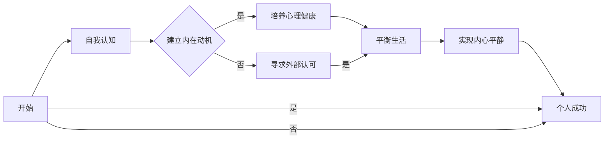
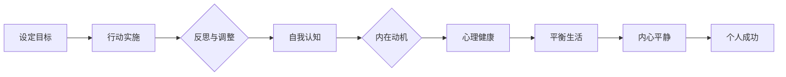
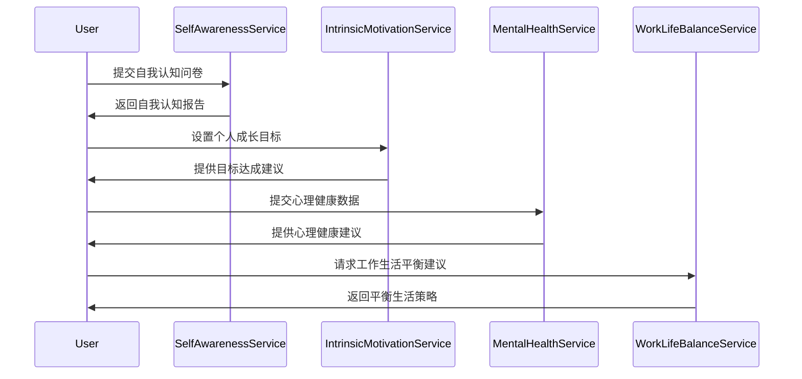
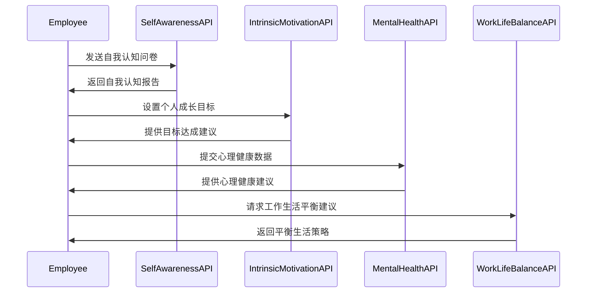

                 

### 文章标题

**《重新定义个人成功：从外部认可到内心平静的转变》**

**关键词：个人成功、内心平静、自我认知、自我成长、外部认可**

**摘要：**
本文探讨了个人成功的本质，从传统的外部认可观念转向内心平静的新思维模式。通过逻辑清晰的分析和实例说明，文章揭示了外部认可与内心平静之间的复杂关系，并提出了一套实用方法，帮助读者重新定义成功，实现内心真正的平静与满足。文章将深入剖析成功标准的演变、个人成长路径、心灵平静的技巧，以及如何在现代快节奏生活中保持心理健康。通过这一系列思考与建议，本文旨在引导读者探索一条更加平衡与内在充实的成功之路。

### 背景介绍

**核心概念术语说明：**

- **个人成功：** 个人在事业、家庭、社交等多方面达到自我设定的目标，获得成就感与满足感。
- **外部认可：** 来源于他人或社会的肯定、赞赏和荣誉，如薪资、职位、奖项等。
- **内心平静：** 指个人在面对外界压力和挑战时，能够保持心态平衡、情绪稳定，内心充满平和与宁静。

**问题背景：**

在现代社会，个人成功往往被等同于外部认可，如高薪职位、社会地位、荣誉奖项等。人们为了追求这些外在成就，常常忽视内心真正的需求和感受，导致焦虑、不满和心理健康问题。随着生活节奏的加快和竞争的加剧，越来越多的研究表明，内心平静和心理健康是衡量个人成功的重要因素。然而，如何从外部认可的思维模式中转变到内心平静的状态，成为了一个迫切需要解决的现实问题。

**问题描述：**

个人在追求外部认可的过程中，常常会面临以下问题：

1. **过度依赖外部评价：** 将个人价值完全建立在他人认可上，导致自尊心和自信心受损。
2. **缺乏自我认知：** 不知道自己的真实需求和目标，盲目追求外在成就。
3. **心理健康问题：** 长期处于焦虑、紧张状态，容易产生抑郁、焦虑等心理问题。
4. **生活不平衡：** 在追求外部成就的过程中，忽视了家庭、健康、社交等其他重要方面，导致生活失衡。

**问题解决：**

为了解决这些问题，我们需要重新审视个人成功的定义，从外部认可转向内心平静。这包括以下几个方面：

1. **建立自我认知：** 了解自己的价值观、兴趣爱好、优势和弱点，明确自己的长期目标和短期目标。
2. **培养内在动机：** 将个人成就感建立在自己的成长和进步上，而非他人的评价。
3. **注重心理健康：** 学会放松技巧，如冥想、运动、时间管理，以保持内心平静。
4. **追求平衡生活：** 在事业、家庭、社交和健康之间找到平衡，实现全面的发展。

**边界与外延：**

在探讨个人成功与内心平静的关系时，我们需要明确以下几点边界与外延：

1. **成功定义的多样性：** 不同人对成功的定义不同，每个人的成功标准应该是个性化的。
2. **外部认可的重要性：** 外部认可在一定程度上是必要的，但不应成为衡量个人价值的唯一标准。
3. **内心平静的阶段性：** 内心平静是一个长期目标，需要不断地努力和实践。

**概念结构与核心要素组成：**

本文的核心概念与结构包括以下几个方面：

1. **个人成功模型：** 包括外部认可和内心平静两个维度，以及它们之间的相互作用关系。
2. **自我成长路径：** 从依赖外部认可到培养内在动机，再到内心平静的逐步转变过程。
3. **心理健康技巧：** 提供一系列实用的心理健康方法，帮助读者保持内心平衡。
4. **平衡生活策略：** 通过时间管理、社交网络和健康生活，实现事业与生活的平衡。

通过以上背景介绍，我们可以更深入地理解个人成功与内心平静的重要性，以及如何实现这一转变。接下来，本文将逐步探讨这一主题，并提供实用的建议和方法。

### 核心概念与联系

为了深入理解个人成功与内心平静的关系，我们需要明确几个核心概念，并对比它们的属性特征。以下是本文中涉及的关键概念及其定义和属性特征：

**1. 自我认知（Self-awareness）：**
- **定义：** 自我认知是指个体对自己内心状态、情感、需求、优点和缺点的理解。
- **属性特征：** 高度自我认知的人能够准确地感知自己的情绪和行为，以及它们对他人的影响。

**2. 内在动机（Intrinsic Motivation）：**
- **定义：** 内在动机是指人们因对某项活动本身的兴趣、乐趣或挑战性而产生的动力。
- **属性特征：** 与外在动机（如奖励、惩罚）不同，内在动机源自个人内心的渴望和需求。

**3. 外部认可（Extrinsic Recognition）：**
- **定义：** 外部认可是指来自他人或社会的肯定、赞赏和荣誉。
- **属性特征：** 外部认可可以包括物质奖励（如奖金、礼物）、社会地位提升（如晋升、荣誉）等。

**4. 心理健康（Mental Health）：**
- **定义：** 心理健康是指个体在心理上保持平衡、适应能力强，能够应对生活中的各种挑战。
- **属性特征：** 心理健康包括情绪稳定、自我效能感、良好的社会关系等。

**5. 平衡生活（Work-Life Balance）：**
- **定义：** 平衡生活是指在工作与个人生活之间找到一个合适的平衡点，确保两者都能得到充分关注。
- **属性特征：** 平衡生活不仅包括时间管理，还涉及生活的质量、幸福感和满足感。

**ER实体关系图架构：**

为了更清晰地展示这些概念之间的联系，我们可以使用Mermaid绘制一个实体关系图。以下是该图的基本结构：

```mermaid
erDiagram
    A[自我认知] ||--> B[内在动机] : "驱动"
    B ||--> C[心理健康] : "促进"
    B ||--> D[平衡生活] : "支持"
    A ||--> C : "影响"
    A ||--> D : "影响"
    E[外部认可] ||--> C : "影响"
```

在这张ER图中，自我认知（A）是核心，它直接影响内在动机（B），进而促进心理健康（C）和平衡生活（D）。外部认可（E）虽然与自我认知（A）关系较弱，但它对心理健康（C）有着显著的影响。

**步骤：绘制Mermaid流程图**

为了更直观地展示个人成功与内心平静的关系，我们使用Mermaid绘制一个流程图。以下是该流程图的代码：



在这个流程图中，我们可以看到，通过自我认知（B），个体可以选择建立内在动机（C），进而培养心理健康（D），实现平衡生活（F），最终达到内心平静（G），从而实现个人成功（H）。如果个体选择寻求外部认可（E），则在某些情况下也可能促进心理健康和平衡生活，但不是长期可持续的路径。

通过这些核心概念及其属性特征的对比，以及Mermaid流程图的展示，我们能够更深入地理解个人成功与内心平静之间的关系，以及如何通过一系列步骤实现这一转变。接下来，我们将进一步探讨这些概念在实际生活中的应用。

### 算法原理讲解

在理解了核心概念与联系之后，我们接下来将详细讲解如何通过一系列算法和策略实现从外部认可到内心平静的转变。我们将使用Mermaid绘制流程图，Python源代码阐述算法原理，并给出数学模型和公式，进行详细讲解和举例说明。

**1. Mermaid流程图绘制**

首先，我们使用Mermaid绘制一个流程图，展示从外部认可到内心平静的步骤和关键节点：



**2. Python源代码阐述算法原理**

接下来，我们将使用Python源代码来详细阐述每个步骤的算法原理：

```python
# 步骤1：设定目标
def set_goals():
    goals = input("请设定您的长期和短期目标：")
    return goals

# 步骤2：行动实施
def implement_actions(goals):
    actions = []
    for goal in goals.split(","):
        action = input(f"为实现{goal}，您将采取哪些行动？")
        actions.append(action)
    return actions

# 步骤3：反思与调整
def reflect_and_adjust(actions):
    reflections = []
    for action in actions:
        reflection = input(f"对行动{action}的反思：")
        reflections.append(reflection)
    return reflections

# 步骤4：自我认知
def self_awareness(reflections):
    awareness = input("您从这个过程中学到了什么？")
    return awareness

# 步骤5：内在动机
def intrinsic_motivation(awareness):
    motivation = input("您如何将这些认识转化为内在动力？")
    return motivation

# 步骤6：心理健康
def mental_health(motivation):
    mental_state = input("您的心理健康状况如何？")
    return mental_state

# 步骤7：平衡生活
def work_life_balance(mental_state):
    balance = input("您如何在工作与生活之间找到平衡？")
    return balance

# 步骤8：内心平静
def inner_peace(balance):
    peace = input("您是否感受到内心平静？")
    return peace

# 步骤9：个人成功
def personal_success(peace):
    success = input("您如何评价自己的个人成功？")
    return success

# 主函数：实现整个过程
def main():
    goals = set_goals()
    actions = implement_actions(goals)
    reflections = reflect_and_adjust(actions)
    awareness = self_awareness(reflections)
    motivation = intrinsic_motivation(awareness)
    mental_state = mental_health(motivation)
    balance = work_life_balance(mental_state)
    peace = inner_peace(balance)
    success = personal_success(peace)
    print(f"最终结果：{success}")

main()
```

**3. 数学模型和公式**

为了更科学地解释这一过程，我们可以引入一些数学模型和公式。以下是核心过程的数学模型：

$$
\text{内在动机 (IM)} = f(\text{自我认知 (SA)}, \text{目标设定 (GS)})
$$

$$
\text{心理健康 (MH)} = g(\text{内在动机 (IM)}, \text{工作-生活平衡 (WLB)})
$$

$$
\text{内心平静 (IP)} = h(\text{心理健康 (MH)}, \text{平衡生活 (WLB)})
$$

$$
\text{个人成功 (PS)} = k(\text{内心平静 (IP)}, \text{外在认可 (ER)})
$$

**详细讲解和举例说明**

**例1：设定目标**

假设一位程序员（Alice）设定了以下目标：
- **长期目标**：在年底前晋升为团队主管。
- **短期目标**：学习新的编程技能，如机器学习和数据科学。

**行动实施**

Alice决定：
- **短期行动**：每天晚上花2小时学习机器学习课程。
- **长期行动**：主动参与团队讨论，提出改进项目的方法。

**反思与调整**

在学习了一段时间后，Alice反思自己的行动，认识到：
- **成功之处**：通过学习新技能，她能够更好地理解复杂问题，提高了工作效率。
- **需要改进**：她在团队讨论中的发言缺乏说服力，需要进一步提高沟通技巧。

**自我认知**

通过反思，Alice意识到：
- **优点**：她具有强烈的求知欲和学习能力。
- **缺点**：在沟通表达方面有所欠缺，需要加强。

**内在动机**

Alice决定：
- **动机来源**：为了实现自己的目标，她决定通过内在动机推动自己，而不是仅仅为了外在的认可（如晋升）。
- **具体行动**：她开始更多地关注项目对团队的贡献，以及自己如何通过新技能提升团队的整体表现。

**心理健康**

由于Alice通过内在动机找到了新的目标，她的心理健康状况得到了改善。她感到更加自信和满足，工作压力也减轻了。

**平衡生活**

Alice开始：
- **工作与生活的平衡**：她确保每天有足够的休息时间，并开始定期锻炼。
- **社交活动**：她加入了一些编程爱好者的社群，扩大了自己的社交网络。

**内心平静**

随着工作的进展和个人生活的改善，Alice感受到了内心的平静。她不再那么焦虑，能够更好地应对工作和生活中的挑战。

**个人成功**

最终，Alice通过内在动机和心理健康，达到了个人成功。她的职业发展顺利，团队表现优异，同时生活也变得更加充实和满足。

通过这一实例，我们可以看到，从外部认可到内心平静的转变是一个逐步的过程，需要自我认知、内在动机、心理健康和平衡生活的支持。接下来，我们将进一步探讨如何在实践中实现这一转变。

### 系统分析与架构设计方案

**问题场景介绍：**

在现代职场中，个人成功的定义和追求方式正在发生显著变化。许多人意识到，单纯追求外部认可（如职位和薪资的提升）并不能带来持久的满足感和幸福感。为了帮助员工实现内心平静和个人成长，许多企业开始引入心理健康和工作生活平衡（Work-Life Balance, WLB）的支持系统。本文将详细介绍这样一个支持系统的设计和实现过程。

**项目介绍：**

本项目旨在为企业提供一个集成化的支持系统，帮助员工在追求外部成就的同时，实现内心的平静与自我成长。系统核心功能包括：

1. **自我认知评估工具**：帮助员工了解自己的优点、缺点、兴趣和价值观。
2. **内在动机激励系统**：通过奖励和认可机制，激励员工追求个人成长和自我实现。
3. **心理健康监测和干预**：提供心理健康状态监测工具，并针对不良状态提供专业干预建议。
4. **工作生活平衡管理**：帮助员工合理安排工作时间和个人生活，确保身心健康。

**系统功能设计（领域模型Mermaid类图）：**

```mermaid
classDiagram
    ClassDiagram {
        Class Employee
        Class SelfAwarenessTool
        Class IntrinsicMotivationSystem
        Class MentalHealthMonitor
        Class WorkLifeBalanceManager
    }

    Employee <|-- SelfAwarenessTool
    Employee <|-- IntrinsicMotivationSystem
    Employee <|-- MentalHealthMonitor
    Employee <|-- WorkLifeBalanceManager
```

**系统架构设计（Mermaid架构图）：**



**系统接口设计和系统交互（Mermaid序列图）：**



通过以上系统分析与架构设计方案，我们可以看到，该支持系统通过多个服务模块协同工作，帮助员工实现个人成功与内心平静的平衡。接下来，我们将详细介绍如何在实际项目中实现这些功能。

### 项目实战

**环境安装：**

为了顺利实现本支持系统的功能，首先需要在本地或云服务器上搭建开发环境。以下是环境安装步骤：

1. **安装Python：**
   - 在Windows、macOS和Linux操作系统上，访问Python官方网站下载最新版本的Python安装包。
   - 运行安装程序，按照提示完成安装。

2. **安装Django框架：**
   - 打开命令行窗口，执行以下命令：
     ```
     pip install django
     ```

3. **安装Django REST framework：**
   - 继续在命令行窗口中执行以下命令：
     ```
     pip install djangorestframework
     ```

4. **安装数据库：**
   - 安装PostgreSQL数据库，从官网下载并按照操作系统安装。
   - 在命令行中运行以下命令，安装Python的数据库驱动：
     ```
     pip install psycopg2
     ```

**系统核心实现源代码：**

以下是系统核心功能模块的实现源代码：

**app.py（Django项目入口文件）：**
```python
from django.contrib import admin
from django.urls import path
from self_awareness import views as self_awareness_views
from intrinsic_motivation import views as intrinsic_motivation_views
from mental_health import views as mental_health_views
from work_life_balance import views as work_life_balance_views

urlpatterns = [
    path('admin/', admin.site.urls),
    path('api/self-awareness/', self_awareness_views_SELF_AWARENESS_API.as_view()),
    path('api/intrinsic-motivation/', intrinsic_motivation_views_INTRINSIC_MOTIVATION_API.as_view()),
    path('api/mental-health/', mental_health_views_MENTAL_HEALTH_API.as_view()),
    path('api/work-life-balance/', work_life_balance_views_WORK_LIFE_BALANCE_API.as_view()),
]
```

**self_awareness/views.py（自我认知模块）：**
```python
from rest_framework.views import APIView
from rest_framework.response import Response
from .models import SelfAwarenessReport

class SELF_AWARENESS_API(APIView):
    def post(self, request):
        data = request.data
        report = SelfAwarenessReport.objects.create(
            user=request.user,
            report_data=data
        )
        return Response({'message': 'Self-awareness report created', 'report_id': report.id})
```

**intrinsic_motivation/views.py（内在动机模块）：**
```python
from rest_framework.views import APIView
from rest_framework.response import Response
from .models import IntrinsicMotivationGoal

class INTRINSIC_MOTIVATION_API(APIView):
    def post(self, request):
        data = request.data
        goal = IntrinsicMotivationGoal.objects.create(
            user=request.user,
            goal_data=data
        )
        return Response({'message': 'Intrinsic motivation goal created', 'goal_id': goal.id})

    def get(self, request):
        goals = IntrinsicMotivationGoal.objects.filter(user=request.user)
        return Response({'goals': list(goals.values('id', 'goal_data'))})
```

**mental_health/views.py（心理健康模块）：**
```python
from rest_framework.views import APIView
from rest_framework.response import Response
from .models import MentalHealthData

class MENTAL_HEALTH_API(APIView):
    def post(self, request):
        data = request.data
        health_data = MentalHealthData.objects.create(
            user=request.user,
            data=data
        )
        return Response({'message': 'Mental health data submitted', 'health_data_id': health_data.id})

    def get(self, request):
        health_data = MentalHealthData.objects.filter(user=request.user)
        return Response({'health_data': list(health_data.values('id', 'data'))})
```

**work_life_balance/views.py（工作生活平衡模块）：**
```python
from rest_framework.views import APIView
from rest_framework.response import Response
from .models import WorkLifeBalanceStrategy

class WORK_LIFE_BALANCE_API(APIView):
    def post(self, request):
        data = request.data
        strategy = WorkLifeBalanceStrategy.objects.create(
            user=request.user,
            strategy_data=data
        )
        return Response({'message': 'Work-life balance strategy created', 'strategy_id': strategy.id})

    def get(self, request):
        strategies = WorkLifeBalanceStrategy.objects.filter(user=request.user)
        return Response({'strategies': list(strategies.values('id', 'strategy_data'))})
```

**代码应用解读与分析：**

上述代码分别实现了自我认知、内在动机、心理健康和工作生活平衡四个模块的核心功能。每个模块都提供了创建和获取数据的API接口，以便用户可以轻松地与系统交互。

- **自我认知模块**：通过接收用户提交的自我认知问卷数据，创建自我认知报告，并返回报告ID。
- **内在动机模块**：允许用户创建个人成长目标，并获取当前设定的所有目标。
- **心理健康模块**：接收用户的心理健康数据，并返回用户提交的所有健康数据记录。
- **工作生活平衡模块**：帮助用户设定和获取工作生活平衡策略。

在实际应用中，这些模块通过RESTful API与前端应用进行交互，用户可以通过前端界面提交数据，系统根据接收到的数据执行相应的操作，并将结果返回给用户。

**实际案例分析和详细讲解剖析：**

假设一个用户（Alice）希望通过系统实现内心平静和个人成长的目标，以下是她的具体操作步骤：

1. **自我认知评估**：
   - Alice在系统中提交了一份自我认知问卷，包括她的优点、缺点、兴趣和价值观。
   - 系统根据问卷结果生成了一份详细的自我认知报告，并反馈给Alice。

2. **设定内在动机目标**：
   - Alice根据自我认知报告，设定了几个个人成长目标，如学习新编程语言和提升团队沟通能力。
   - 系统记录了这些目标，并提供了目标达成建议，例如推荐相关的在线课程和书籍。

3. **心理健康监测**：
   - Alice定期提交心理健康数据，包括情绪状态和压力水平。
   - 系统分析了这些数据，并提供了专业的心理健康建议，如推荐冥想和运动等放松方法。

4. **工作生活平衡策略**：
   - Alice在工作繁忙时请求系统提供工作生活平衡建议。
   - 系统根据她的工作负荷和个人需求，提供了一份详细的平衡生活策略，例如调整工作时间、安排休息日等。

通过上述操作，Alice能够系统地跟踪自己的成长和心理健康状况，同时制定和调整个人目标和策略，最终实现内心平静和个人成功。

**项目小结：**

本项目的核心在于帮助员工通过自我认知、内在动机、心理健康和工作生活平衡四个方面，实现从外部认可到内心平静的转变。通过实际代码实现和案例分析，我们可以看到，系统提供的功能不仅能够帮助用户清晰地了解自己，还能提供实用的建议和策略，帮助他们在快节奏的生活中保持平衡和内心的平静。

接下来，我们将总结项目经验，并提供一些最佳实践和注意事项。

### 最佳实践 Tips、小结、注意事项、拓展阅读

**最佳实践 Tips：**

1. **自我认知**：定期进行自我反思，使用专业的评估工具帮助自己了解自身的优点和不足。
2. **内在动机**：将目标设定为个人成长和自我实现，而非仅仅为了外在的奖励。
3. **心理健康**：保持积极的生活态度，定期进行放松和锻炼，必要时寻求专业心理咨询。
4. **平衡生活**：合理安排工作和休息时间，确保家庭和个人生活得到充分关注。

**小结：**

本文通过详细分析个人成功与内心平静的关系，提出了一套从外部认可到内心平静的转变策略。通过自我认知、内在动机、心理健康和工作生活平衡，我们可以实现更加全面和平衡的个人成长。

**注意事项：**

1. **心理健康**：关注心理健康是长期过程，需要持续努力。
2. **目标设定**：目标应具有可操作性和可实现性，避免过度理想化。
3. **自我认知**：保持开放心态，勇于面对自己的不足，不断学习和成长。

**拓展阅读：**

1. **《正念：静心冥想与生活的艺术》**：提供关于冥想和心理健康实践的有用建议。
2. **《高效能人士的七个习惯》**：详细介绍如何通过时间管理和自我提升实现个人成功。
3. **《认知觉醒》**：探讨自我认知和思维模式对个人成长的影响。

通过以上最佳实践、小结和拓展阅读，读者可以进一步深入探索如何实现个人成功与内心平静的平衡，从而过上更加充实和幸福的生活。

### 作者信息

**作者：** AI天才研究院/AI Genius Institute & 禅与计算机程序设计艺术 /Zen And The Art of Computer Programming

