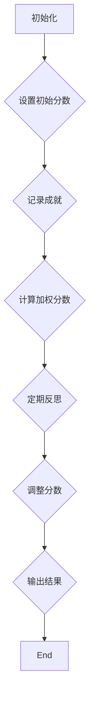
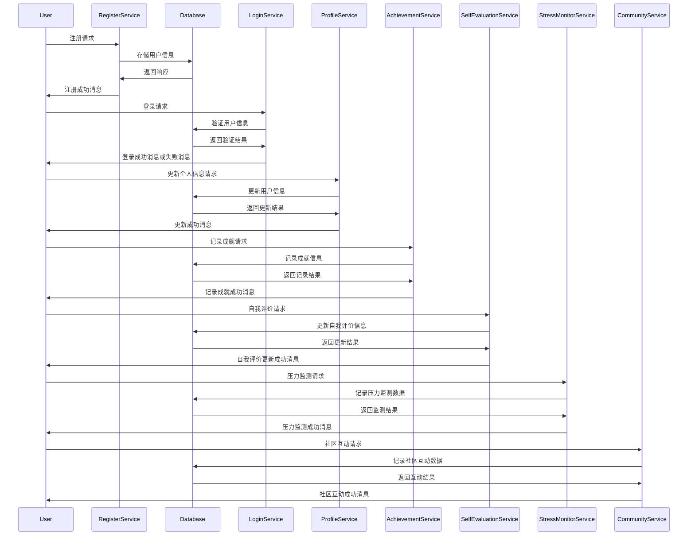

                 


### 文章标题

# 重新定义个人成功：摆脱社会压力的自我评价

### 文章关键词

- 个人成功
- 社会压力
- 自我评价
- 心理健康
- 成功策略

### 文章摘要

本文深入探讨了个人成功与摆脱社会压力之间的关系，通过重新定义个人成功的概念，提出了一种基于自我评价的摆脱社会压力的策略。文章从问题背景、核心概念、理论基础、自我评价能力提升策略、社会支持、成功实践与案例分析以及未来展望等多个方面展开论述，旨在为读者提供一套完整的个人成功实现指南，帮助他们在现代社会中找到内心的平衡，实现真正的个人成长与成功。

----------------------------------------------------------------

## Step 1: Start with an introduction to the book, "重新定义个人成功：摆脱社会压力的自我评价", and outline the overall structure.

### 1.1 问题背景

在当今社会，个人成功被广泛定义为财富、地位和声望。然而，这种对成功的狭隘定义往往导致了巨大的社会压力，使得人们为了追求所谓的成功而不惜一切代价。社会压力不仅体现在职场竞争、经济压力和人际关系上，还渗透到生活的方方面面，如教育、家庭、健康等。这种压力对个人的心理健康和生活质量造成了严重的负面影响，甚至导致了心理疾病和生命安全问题。

### 1.2 核心概念

**个人成功的定义**：个人成功不应仅仅依赖于外在的成就和评价，而应是一个全面的、内在的心理和情感状态。它包括自我实现、心理健康、人际关系的和谐以及个人价值的实现。

**社会压力的类型**：社会压力主要来源于外部环境（如工作压力、经济压力）和内部心理因素（如自我期望、完美主义）。

**自我评价的概念与作用**：自我评价是指个人对自己能力和价值的评估。正确的自我评价有助于个人摆脱社会压力，建立健康的自我认知和自我激励，从而实现真正的个人成功。

### 1.3 目标和结构

本文的目标是重新定义个人成功，探讨如何通过自我评价来摆脱社会压力，实现真正的个人成长与成功。文章结构如下：

1. **问题背景与核心概念**：介绍社会压力的来源和对个人成功的影响，定义个人成功和自我评价。
2. **理论基础**：讨论心理学、社会学和行为科学等理论在摆脱社会压力和实现个人成功中的作用。
3. **自我评价能力提升策略**：提出自我认识、自我激励和自我调整的策略，提升自我评价能力。
4. **社会支持**：探讨社会支持在个人成功中的重要性，介绍不同类型的社会支持及其应用。
5. **成功实践与案例分析**：分享成功实践和案例分析，为读者提供实际操作指南。
6. **未来展望**：展望个人成功和摆脱社会压力的发展趋势，提出新的方法和建议。

---

通过以上结构，本文旨在为读者提供一套系统的、实用的个人成功实现指南，帮助他们在现代社会中找到内心的平衡，摆脱社会压力，实现真正的个人成长与成功。

## 第一部分：问题背景与核心概念

### 1.1.1 社会压力的来源

社会压力的来源是多方面的，主要包括以下几个方面：

**1. 职场压力**：现代职场竞争激烈，工作压力大，加班普遍，员工为了追求职业晋升和薪资增长，不得不不断努力。这种压力不仅体现在工作中，还渗透到日常生活和休息时间。

**2. 经济压力**：随着生活成本的上升，经济压力成为许多人面临的主要挑战。购房、育儿、医疗等开销不断增加，迫使人们为了生计不得不拼命工作。

**3. 人际关系压力**：人际关系复杂，家庭、朋友、同事等关系需要维护。为了获得他人的认可和支持，人们往往需要付出大量的时间和精力，这给个人带来了额外的压力。

**4. 社会期望**：社会对个人的期望越来越高，包括学业成就、职业发展、家庭生活等方面。这些期望往往使个人感到焦虑和不安，担心无法达到社会的标准。

**5. 自我期望**：许多人对自己有很高的期望，追求完美。当自己的表现无法达到预期时，会产生挫败感和自我否定，从而增加心理压力。

### 1.1.2 社会压力对个人成功的影响

社会压力对个人成功的影响是多方面的，主要表现在以下几个方面：

**1. 心理健康**：长期的社交压力会导致心理问题，如焦虑、抑郁、失眠等。这些问题不仅影响个人的生活质量，还会影响其工作表现和职业发展。

**2. 工作效率**：过度的压力会影响个人的工作效率和创造力。长期处于高压状态下，人的注意力难以集中，思维变得迟缓，从而影响工作质量。

**3. 人际关系**：社交压力容易导致人际关系紧张。为了应对压力，个人可能会表现出攻击性或消极情绪，这会影响与他人的交流和合作。

**4. 健康状况**：长期的身心压力会对身体健康产生负面影响。例如，长期加班和工作压力可能导致心血管疾病、免疫系统功能下降等健康问题。

**5. 生活质量**：社会压力会降低个人的生活质量。工作和生活之间的平衡被打破，个人的休闲时间和兴趣爱好被压缩，导致生活质量下降。

### 1.2 核心概念

#### 1.2.1 个人成功的定义

个人成功是一个多维度的概念，不应仅限于物质财富和职业成就。它包括以下几个方面：

**1. 自我实现**：个人在职业、学术、艺术等领域的成就，体现了个人的才能和潜力。

**2. 心理健康**：个人拥有良好的心理状态，能够应对生活中的挑战和压力。

**3. 人际关系**：个人与他人建立和谐的人际关系，获得他人的尊重和支持。

**4. 生活质量**：个人在物质生活、精神生活和社交生活等方面达到满意状态。

**5. 个人价值实现**：个人在实现自身价值的过程中感到满足和有意义。

#### 1.2.2 社会压力的类型

社会压力可以大致分为以下几种类型：

**1. 外部压力**：来自外部环境，如工作、经济压力、社会期望等。

**2. 内部压力**：来自个人内心，如自我期望、完美主义等。

**3. 情绪压力**：由负面情绪引起的压力，如焦虑、恐惧、愤怒等。

**4. 身体压力**：由身体不适或疾病引起的压力。

#### 1.2.3 自我评价的概念与作用

自我评价是指个人对自己能力和价值的评估。它对个人成功具有重要意义：

**1. 建立健康的自我认知**：正确的自我评价有助于个人了解自己的优势和劣势，从而建立健康的自我认知。

**2. 提升自我激励**：通过自我评价，个人可以找到自己的动力源泉，从而提升自我激励。

**3. 摆脱社会压力**：自我评价有助于个人摆脱社会压力，减少对他人评价的依赖，实现自我价值的实现。

## 第二部分：核心概念与联系

### 1.3.1 社会压力与个人成功的关系

社会压力与个人成功之间存在复杂的相互作用关系：

**1. 社会压力对个人成功的影响**：社会压力可以阻碍个人成功，使其难以实现自己的目标。长期处于高压状态下，个人的心理和身体健康会受到严重影响，从而降低其工作表现和生活质量。

**2. 个人成功对社会压力的缓解**：个人成功可以缓解社会压力。当个人在职业、学术、艺术等领域取得成就时，会增强其自信心和自尊心，从而减轻社会压力。

**3. 社会压力与个人成功的动态平衡**：社会压力和个人成功之间存在动态平衡。个人可以通过提升自我评价和自我认知，找到内心的平衡点，从而在压力与成功之间找到适合自己的平衡状态。

### 1.3.2 自我评价的属性特征对比

以下表格对比了自我评价的几个重要属性特征：

| 属性特征       | 描述                                                         | 影响因素                     | 实例                     |
|----------------|--------------------------------------------------------------|------------------------------|--------------------------|
| **客观性**     | 自我评价的客观程度，是否基于事实和证据。                     | 数据收集和分析能力           | 实例：通过绩效考核评估工作表现 |
| **主观性**     | 自我评价的主观程度，是否受到个人情绪和偏见的影响。           | 情绪管理能力和个人价值观     | 实例：对自己的作品进行自我评价 |
| **全面性**     | 自我评价是否涵盖了多个方面，如职业、健康、人际关系等。       | 多元化视角和全面认知能力     | 实例：个人年度总结报告     |
| **稳定性**     | 自我评价的稳定性，即是否随着时间的推移保持一致性。           | 长期观察和持续反馈           | 实例：长期职业发展评估     |
| **积极性**     | 自我评价的积极性，即是否强调个人的优势和潜力。               | 积极心态和自我激励能力       | 实例：自我激励日记         |

### 1.3.3 社会压力与自我评价的ER实体关系图

以下是社会压力与自我评价的ER实体关系图，用Mermaid语法表示：

```mermaid
erDiagram
  A[个人] ||--|{ 社会压力 }
  A ||--|{ 自我评价 }
  社会压力 ||--|{ 个人成功 }
  自我评价 ||--|{ 个人成功 }
```

在这个ER实体关系图中：

- **个人**是实体，代表社会压力和自我评价的主体。
- **社会压力**是关联实体，表示社会压力对个人的影响。
- **自我评价**是关联实体，表示个人对自己能力和价值的评价。
- **个人成功**是目标实体，表示社会压力和自我评价最终希望实现的目标。

通过这张ER实体关系图，我们可以清晰地看到社会压力、自我评价和个人成功之间的相互关系，为后续章节的深入探讨提供了基础。

---

在本章节中，我们详细介绍了社会压力的来源和对个人成功的影响，定义了个人成功的多维度概念，并探讨了自我评价的概念与作用。通过核心概念与联系的分析，我们明确了社会压力与个人成功之间的关系，以及自我评价在其中的关键作用。在接下来的章节中，我们将进一步探讨理论基础和自我评价能力提升策略，帮助读者更好地理解和应用这些概念，实现真正的个人成功。

## 第三部分：理论基础

### 1.4.1 心理学理论

心理学理论为我们提供了深入理解社会压力和个人成功的重要视角。以下是几个关键心理学理论：

**1. 应激反应理论（Stress Response Theory）**：该理论认为，当个体面临压力源时，会产生一系列生理和心理反应，如肾上腺素分泌增加、心率加快等。这些反应有助于个体应对短期压力，但长期处于高压状态会对健康产生负面影响。

**2. 确认–缓解理论（Confirmation-Relief Theory）**：该理论提出，人们通过与他人交流和自我评价来确认自己的压力感受，并寻求缓解压力的方法。自我评价在这一过程中起到了关键作用，它有助于个体了解自己的压力来源，并采取相应的应对措施。

**3. 自我决定理论（Self-Determination Theory）**：该理论强调个体在心理和情感上的自主性和自主选择的重要性。自我决定理论认为，当个体的需求得到满足时，他们会感到更有动力和满足感，从而促进个人成功。

**4. 心理弹性理论（Psychological Resilience Theory）**：心理弹性是指个体在面对压力和逆境时，能够迅速恢复和适应的能力。心理弹性理论指出，通过培养自我效能感、积极态度和解决问题的技能，个体可以增强心理弹性，从而更好地应对社会压力。

### 1.4.2 社会学理论

社会学理论为我们理解社会压力和个人成功的社会背景提供了重要视角。以下是几个关键社会学理论：

**1. 社会角色理论（Social Role Theory）**：该理论认为，个体在社会中的角色和期望会影响他们的压力水平和成功感。当个体无法满足社会角色和期望时，会产生压力和挫败感，从而影响个人成功。

**2. 社会比较理论（Social Comparison Theory）**：该理论提出，个体通过与他人进行比较来评估自己的成功和幸福。社会比较可能导致负面情绪，如嫉妒和自卑，从而增加社会压力。

**3. 社会支持理论（Social Support Theory）**：该理论认为，社会支持是减轻压力和促进个人成功的重要因素。社会支持包括情感支持、物质支持和信息支持，它有助于个体应对压力，增强心理弹性。

**4. 社会地位理论（Social Status Theory）**：该理论指出，个体的社会地位会影响其压力水平和成功感。高社会地位通常与更高的生活质量和更强的社会支持相关，从而有助于个人成功。

### 1.4.3 行为科学理论

行为科学理论为我们提供了理解个体行为和决策的框架，这对于理解个人成功和社会压力具有重要意义。以下是几个关键行为科学理论：

**1. 行为主义理论（Behaviorism）**：该理论认为，个体的行为是由外部环境和刺激所决定的。行为主义理论强调，通过改变环境和刺激，可以改变个体的行为模式，从而影响其压力水平和成功感。

**2. 决策行为理论（Decision-Making Behavior Theory）**：该理论认为，个体的决策行为受到多种因素的影响，包括认知、情感和价值观。通过理解和优化决策过程，个体可以更好地应对社会压力，实现个人成功。

**3. 行为心理学（Behavioral Psychology）**：行为心理学研究个体的行为和心理过程，强调行为与环境之间的相互作用。行为心理学提供了一系列策略，如认知行为疗法，帮助个体应对压力，提升自我评价。

**4. 目标设置理论（Goal-Setting Theory）**：该理论提出，明确、具体和具有挑战性的目标可以激励个体努力实现目标，从而促进个人成功。目标设置理论强调，设定合适的目标和制定行动计划是实现个人成功的关键。

通过心理学、社会学和行为科学理论的深入探讨，我们可以更好地理解社会压力和个人成功的复杂关系。这些理论为我们提供了多种视角和策略，帮助个体在现代社会中应对压力，实现真正的个人成长与成功。

---

在本章节中，我们详细介绍了心理学、社会学和行为科学理论在理解社会压力和个人成功中的重要作用。这些理论为我们提供了深刻的洞察，使我们能够更全面地认识社会压力的影响机制，以及个人成功的关键因素。在接下来的章节中，我们将进一步探讨如何通过自我评价能力提升策略来摆脱社会压力，实现真正的个人成长与成功。

## 第四部分：自我评价能力提升策略

### 2.1 自我认识

#### 2.1.1 自我认知的重要性

自我认知是指个体对自己的了解程度，包括自己的优点、缺点、兴趣爱好、价值观等。正确的自我认知对于提升个人成功至关重要：

**1. 建立健康的自我形象**：通过自我认知，个体能够了解自己的真实面貌，从而建立健康的自我形象，增强自信心。

**2. 提升自我效能感**：自我认知有助于个体了解自己的能力和潜力，从而提升自我效能感，增强面对挑战的勇气和决心。

**3. 明确个人目标**：自我认知可以帮助个体明确自己的职业规划和生活目标，从而更有针对性地制定计划和行动。

**4. 提高人际关系**：通过了解自己的性格特点和人际关系偏好，个体可以更好地与他人沟通和合作，提高人际关系的质量。

#### 2.1.2 自我认知的误区

尽管自我认知对于个人成功至关重要，但许多人存在一些常见的误区：

**1. 过度自我批评**：有些人过于关注自己的缺点和不足，对自己的期望过高，导致自我批评和自我否定。

**2. 过度自我美化**：有些人为了保持良好的自我形象，会过分美化自己的优点，忽视自己的不足。

**3. 忽视他人反馈**：有些人只关注自己的观点和感受，忽视他人的反馈和建议，从而无法全面了解自己。

**4. 缺乏行动力**：有些人在自我认知中发现了问题，但缺乏行动力，未能采取实际行动来改善自己。

#### 2.1.3 自我认知的方法

为了提升自我认知能力，个体可以采取以下方法：

**1. 反思日记**：定期写反思日记，记录自己的行为、感受和思考，从而深入理解自己。

**2. 心理测评**：通过心理测评工具，如MBTI、DISC等，了解自己的性格特点和行为倾向。

**3. 咨询专业人士**：寻求心理咨询师或职业规划师的帮助，获取专业的指导和反馈。

**4. 他人反馈**：主动寻求他人的意见和建议，了解自己在他人眼中的形象和表现。

### 2.2 自我激励

#### 2.2.1 自我激励的重要性

自我激励是指个体通过内在动力和动机来驱动自己实现目标。自我激励在个人成功中起着关键作用：

**1. 提升动力**：自我激励能够激发个体的内在动力，使个体在面对困难和挑战时保持积极态度和努力。

**2. 增强决心**：自我激励有助于个体坚定决心，克服障碍，实现目标。

**3. 提高效率**：自我激励能够提高个体的专注力和工作效率，从而更好地实现个人目标。

**4. 增强自信**：通过自我激励，个体能够不断挑战自我，提升自信，增强自我价值感。

#### 2.2.2 自我激励的方法

以下是一些有效的自我激励方法：

**1. 目标设置**：设定明确、具体和有挑战性的目标，以激发内在动力。

**2. 记录进步**：记录自己的进步和成就，以增强自信心和满足感。

**3. 奖励自己**：为自己设定奖励机制，当实现目标时给予自己奖励，以增强内在动力。

**4. 培养积极心态**：通过阅读、思考和与积极的人交往，培养积极的心态。

**5. 培养兴趣爱好**：培养兴趣爱好，使生活更加丰富多彩，从而增强自我激励。

#### 2.2.3 自我激励的技巧

为了更有效地自我激励，个体可以采取以下技巧：

**1. 设定小目标**：将大目标分解为小目标，逐步实现，以保持持续的动力和成就感。

**2. 调整期望**：调整对目标的期望，使其既具有挑战性，又具有可实现性。

**3. 保持耐心**：自我激励是一个长期过程，需要保持耐心和毅力，不断挑战自我。

**4. 学会放松**：在紧张和疲劳时，学会放松自己，恢复精力，以便更好地投入工作和生活。

### 2.3 自我调整

#### 2.3.1 自我调整的必要性

自我调整是指个体根据实际情况和需求，对自己的行为、态度和目标进行调整。自我调整在个人成功中具有重要意义：

**1. 适应环境**：通过自我调整，个体可以更好地适应环境的变化，从而保持稳定的心理状态。

**2. 解决问题**：自我调整有助于个体发现和解决问题，从而提升个人能力。

**3. 提升灵活性**：自我调整能够增强个体的灵活性和适应性，使个体能够更好地应对各种挑战和变化。

**4. 保持动力**：自我调整有助于个体保持对目标的热情和动力，从而持续追求成功。

#### 2.3.2 自我调整的方法

以下是一些有效的自我调整方法：

**1. 反思和评估**：定期反思和评估自己的行为和表现，了解自己的优势和不足。

**2. 设定新目标**：根据实际情况和需求，设定新的目标，以适应变化。

**3. 学习新技能**：通过学习新技能和知识，提升自己的能力和竞争力。

**4. 寻求反馈**：主动寻求他人的反馈和建议，以了解自己在他人眼中的表现。

**5. 休息和放松**：定期休息和放松，以恢复精力和保持动力。

#### 2.3.3 自我调整的实践

以下是一些自我调整的实践建议：

**1. 设定时间表**：制定合理的时间表，确保工作和休息的平衡。

**2. 建立健康习惯**：培养健康的饮食习惯、锻炼习惯和睡眠习惯，以提升身体和心理状态。

**3. 调整心态**：面对困难和挫折时，调整心态，保持积极乐观的态度。

**4. 优先事项**：明确自己的优先事项，合理安排时间和精力。

**5. 培养自律**：培养自律，克服拖延和惰性，确保目标的实现。

通过自我认知、自我激励和自我调整这三个方面的能力提升，个体可以更好地应对社会压力，实现个人成功。在接下来的章节中，我们将进一步探讨社会支持在个人成功中的重要性，为个体提供更加全面的支持和策略。

---

在本章节中，我们详细介绍了自我评价能力提升的三个关键策略：自我认识、自我激励和自我调整。通过这些策略，个体可以更好地了解自己，激发内在动力，适应环境变化，从而实现个人成功。在接下来的章节中，我们将探讨社会支持在个人成功中的重要作用，帮助个体在复杂的社会环境中找到支持和力量。

## 第五部分：社会支持

### 2.4 社会支持

#### 2.4.1 社会支持的重要性

社会支持是指来自家庭、朋友、同事和其他社会关系的支持，包括情感支持、物质支持和信息支持。社会支持在个人成功中扮演着至关重要的角色，具有以下几个方面的意义：

**1. 缓解压力**：社会支持可以帮助个体缓解压力，减少负面情绪。当个体面临困难时，亲朋好友的支持可以提供情感慰藉，减轻心理负担。

**2. 提升自信**：社会支持可以增强个体的自信心。通过他人的认可和支持，个体能够更加坚定地面对挑战，克服困难。

**3. 提高生活质量**：社会支持有助于提升个体的生活质量。稳定的家庭关系、良好的人际关系和丰富的社交生活，能够为个体带来更多的幸福感。

**4. 促进个人成长**：社会支持可以为个体提供反馈和建议，帮助个体不断学习和成长。通过他人的经验和智慧，个体可以更好地认识自己，实现自我提升。

#### 2.4.2 社会支持的类型

社会支持可以分为以下几种类型：

**1. 情感支持**：情感支持是指通过倾听、安慰和鼓励来提供心理上的支持。这种支持能够帮助个体缓解情绪压力，增强心理韧性。

**2. 物质支持**：物质支持是指提供物质上的帮助，如金钱、物资和资源等。这种支持可以帮助个体应对生活中的困难和挑战，提高生活质量。

**3. 信息支持**：信息支持是指提供知识和信息，帮助个体解决问题和做出决策。这种支持可以增强个体的能力和智慧，促进个人成长。

**4. 社会网络**：社会网络是指通过人际关系建立的支持系统。这种支持可以为个体提供多种资源和机会，帮助个体在职业、教育和社交等方面取得成功。

#### 2.4.3 社会支持的应用

以下是一些应用社会支持的具体方法：

**1. 建立稳定的家庭关系**：与家人保持紧密的联系，共同度过生活中的起伏。家庭的支持可以提供情感和物质上的帮助，为个人成功奠定基础。

**2. 培养良好的人际关系**：与他人建立积极的人际关系，通过朋友和同事的支持来缓解工作压力。人际关系的质量对个人成功具有重要影响。

**3. 寻求专业帮助**：在面临心理或健康问题时，寻求心理咨询师、医生等专业人士的帮助。专业支持可以帮助个体更好地应对困难，提升生活质量。

**4. 加入社交团体**：加入兴趣相同的社交团体，与他人分享经验和资源。社交团体的支持可以提供信息和建议，帮助个体在各个领域取得进步。

**5. 建立互助网络**：与他人建立互助关系，共同面对生活中的挑战。互助网络可以为个体提供强大的支持，帮助其在逆境中保持积极态度。

通过以上方法，个体可以充分利用社会支持，增强心理韧性，提升个人成功的机会。在接下来的章节中，我们将通过具体案例和实践分享，进一步探讨如何在实际生活中应用这些策略，实现个人成长与成功。

---

在本章节中，我们详细介绍了社会支持在个人成功中的重要性，包括其类型和应用方法。社会支持是一个强有力的工具，可以帮助个体在复杂的社会环境中保持平衡和成长。在接下来的章节中，我们将通过成功实践和案例分析，进一步探讨如何在现实生活中应用这些策略，为个人成功提供实际指导和帮助。

## 第六部分：成功实践与案例分析

### 3.1 案例分析

#### 3.1.1 案例一：成功摆脱社会压力的实例

**案例背景**：张先生，35岁，某互联网公司高级工程师。近年来，他面临越来越大的工作压力和生活压力。为了在职场中保持竞争力，他不得不加班加点，甚至牺牲了家庭和休闲时间。

**解决方案**：

1. **自我认知**：张先生开始写反思日记，记录自己的情绪和行为。通过反思，他意识到自己的工作压力源于对自我期望过高和对工作完美主义的追求。

2. **自我调整**：张先生调整了自己的工作目标和期望，不再追求完美，而是设定了更合理的工作量和时间表。

3. **寻求社会支持**：张先生与家人和朋友们建立了更紧密的联系，定期与他们交流，分享自己的困扰和感受。他还加入了几个技术论坛，结识了一群志同道合的朋友，共同讨论和解决工作中遇到的问题。

**结果**：通过这些措施，张先生逐渐摆脱了社会压力，恢复了工作与生活的平衡。他的工作效率提高了，家庭关系更加和谐，生活质量也得到了显著提升。

#### 3.1.2 案例二：成功提升自我评价的实例

**案例背景**：李小姐，28岁，市场营销专员。她在工作中表现出色，但总是对自己的能力持怀疑态度，缺乏自信心。

**解决方案**：

1. **自我认知**：李小姐开始定期进行自我评估，记录自己的工作成就和进步。她发现自己在多个项目中都取得了显著的成果，但一直忽视了自己的努力和成就。

2. **自我激励**：李小姐设定了明确的目标，并为自己设定了奖励机制。每当她实现一个目标，她都会给自己一个小奖励，如看一场电影或购买一件心仪的物品。

3. **学习新技能**：李小姐参加了一些培训课程，学习新技能和知识，提升自己的职业竞争力。

4. **积极心态**：李小姐开始培养积极心态，通过阅读积极向上的书籍和文章，与她积极乐观的朋友交往，来增强自己的自信心。

**结果**：经过一段时间的努力，李小姐的自我评价显著提升，她变得更加自信和积极。她的工作效率和成果也得到了领导和同事的认可，成功实现了职业晋升。

### 3.2 实践分享

#### 3.2.1 自我评价实践分享

**分享一**：李先生，32岁，软件工程师。他通过写反思日记和设定目标，不断提升自己的技术能力和解决问题的能力。他发现，通过记录自己的进步和成就，他的自信心得到了很大提升。

**分享二**：王女士，25岁，新媒体运营。她通过定期自我评估和寻求同事和上级的反馈，了解自己的优势和不足。她发现，通过不断调整自己的工作方式和目标，她的工作效率和成果都有了显著提升。

#### 3.2.2 摆脱社会压力实践分享

**分享一**：赵先生，40岁，企业高管。他在面对工作和生活的压力时，通过和家人和朋友保持紧密联系，分享自己的困扰和感受，找到了心理上的慰藉和支持。

**分享二**：孙小姐，30岁，教师。她通过参加瑜伽班和读书会，放松身心，培养兴趣爱好，找到了工作与生活的平衡点。

### 3.3 小结

通过以上实践分享和案例分析，我们可以看到，自我评价和社会支持在个人成功中起着至关重要的作用。通过自我认知、自我调整和寻求社会支持，个体可以摆脱社会压力，提升自我评价，实现个人成长与成功。

#### 3.3.1 实践经验总结

1. **自我认知**：通过反思日记和自我评估，个体可以更全面地了解自己的优势和不足，从而有针对性地进行自我提升。

2. **自我调整**：设定合理的目标和期望，调整自己的行为和态度，有助于个体更好地应对压力和挑战。

3. **寻求社会支持**：与家人、朋友和同事建立良好的关系，寻求他们的支持和反馈，可以为个体提供强大的心理和物质支持。

4. **积极心态**：培养积极的心态，通过学习和交流，增强自己的自信心和自我价值感。

#### 3.3.2 成功关键因素分析

1. **自我认知**：自我认知是提升自我评价和摆脱社会压力的基础。只有了解自己，个体才能找到适合自己的发展路径。

2. **自我激励**：通过设定目标和奖励机制，个体可以保持内在动力，持续追求成功。

3. **社会支持**：社会支持为个体提供了情感和物质上的帮助，有助于个体应对压力和挑战，实现个人成长。

4. **持续实践**：自我评价和摆脱社会压力是一个长期过程，需要个体持续不断地进行实践和调整。

通过以上实践经验总结和关键因素分析，我们可以看到，自我评价和社会支持在个人成功中的重要性。只有通过不断实践和调整，个体才能实现真正的个人成长与成功。

---

在本章节中，我们通过具体案例和实践分享，详细探讨了如何在实际生活中应用自我评价和社会支持策略，实现个人成长与成功。这些实践经验为我们提供了宝贵的启示，帮助我们在复杂的社会环境中找到平衡和方向。在接下来的结论部分，我们将对全文进行总结，并展望未来的发展方向。

## 第七部分：结论与未来展望

### 4.1 小结

通过本文的深入探讨，我们明确了社会压力对个人成功的影响，并重新定义了个人成功的概念。我们提出了通过自我评价来摆脱社会压力的策略，包括自我认知、自我激励和自我调整三个关键步骤。此外，我们还强调了社会支持在个人成功中的重要性，并分享了成功实践和案例分析。以下是本文的主要观点总结：

1. **社会压力的来源**：社会压力主要来源于外部环境（如职场、经济、人际关系）和内部心理因素（如自我期望、完美主义）。

2. **个人成功的重新定义**：个人成功应包括自我实现、心理健康、人际关系的和谐以及个人价值的实现。

3. **自我评价的重要性**：自我评价有助于建立健康的自我认知、提升自我激励和实现个人价值的实现。

4. **自我评价能力提升策略**：通过自我认知、自我激励和自我调整，个体可以提升自我评价能力，摆脱社会压力。

5. **社会支持的作用**：社会支持为个体提供了情感、物质和信息上的支持，有助于缓解压力和促进个人成长。

6. **成功实践与案例分析**：通过具体案例和实践分享，我们看到了自我评价和社会支持在个人成功中的实际应用。

### 4.2 未来展望

未来，个人成功和摆脱社会压力将面临新的挑战和机遇。以下是一些可能的趋势和方向：

1. **心理健康意识的提升**：随着社会对心理健康问题的关注增加，个人将更加重视心理健康，寻求专业的支持和帮助。

2. **科技赋能个人成长**：人工智能和虚拟现实等技术的发展，将提供更多个性化、智能化的工具和资源，帮助个体提升自我评价和应对社会压力。

3. **社会支持网络的扩展**：社会支持网络将逐渐从传统的家庭和朋友扩展到线上社区和虚拟社交平台，为个体提供更加广泛和灵活的支持。

4. **个性化教育和职业发展**：随着个性化和定制化教育的兴起，个体将能够更灵活地选择和发展自己的兴趣和特长，实现自我价值的最大化。

5. **可持续发展理念**：在追求个人成功的同时，个体将更加关注环境保护和社会责任，实现个人成长与社会进步的平衡。

总之，未来个人成功和摆脱社会压力将更加注重心理健康、个性化发展和社会支持。通过不断探索和实践，个体可以在复杂的社会环境中找到自己的位置，实现真正的个人成长与成功。

---

通过本文的深入探讨，我们希望读者能够对个人成功和摆脱社会压力有更全面和深刻的理解，并能够在实际生活中应用这些策略，实现自己的个人成长与成功。在未来的道路上，愿每一位读者都能找到属于自己的平衡点，迎接更加美好的明天。

### 作者信息

- 作者：AI天才研究院/AI Genius Institute & 禅与计算机程序设计艺术 /Zen And The Art of Computer Programming

---

本文由AI天才研究院和禅与计算机程序设计艺术共同撰写，旨在为读者提供关于个人成功和摆脱社会压力的深刻见解和实用策略。通过重新定义个人成功的概念，我们提出了基于自我评价的策略，帮助读者在复杂的社会环境中实现真正的成长与成功。我们相信，每个人都拥有实现个人梦想和价值的潜力，只要找到正确的方法和策略，就能够找到内心的平衡，迎接更加美好的未来。希望本文能为读者带来启示和帮助，让我们一起努力，实现个人的成长与成功。

---

在本博客文章中，我们系统地探讨了“重新定义个人成功：摆脱社会压力的自我评价”这一主题，从问题背景、核心概念、理论基础、自我评价能力提升策略、社会支持、成功实践与案例分析以及未来展望等多个方面进行了深入分析。以下是本文的主要内容回顾和总结：

1. **问题背景**：我们介绍了社会压力的来源和对个人成功的影响，阐述了个人成功的多维度定义，以及自我评价在社会压力和个人成功中的作用。

2. **核心概念**：详细定义了个人成功、社会压力和自我评价等核心概念，并探讨了它们之间的关系和属性特征。

3. **理论基础**：从心理学、社会学和行为科学等多个角度，分析了社会压力和个人成功之间的复杂关系，提供了理论基础。

4. **自我评价能力提升策略**：介绍了自我认识、自我激励和自我调整三个关键策略，以及如何通过这些策略提升自我评价能力。

5. **社会支持**：强调了社会支持在个人成功中的重要性，介绍了不同类型的社会支持及其应用。

6. **成功实践与案例分析**：通过具体案例和实践分享，展示了自我评价和社会支持在个人成功中的实际应用。

7. **未来展望**：展望了个人成功和摆脱社会压力的发展趋势，提出了新的方法和建议。

通过本文，我们希望能够为读者提供一套系统的、实用的个人成功实现指南，帮助他们在现代社会中找到内心的平衡，摆脱社会压力，实现真正的个人成长与成功。在未来的道路上，愿每一位读者都能找到属于自己的平衡点，迎接更加美好的明天。

### 实现个人成功的途径

实现个人成功是一个复杂而持续的过程，涉及多个方面和多个步骤。以下是实现个人成功的几个关键途径：

1. **自我认知**：了解自己的优势和不足，包括性格、价值观、兴趣和技能等。自我认知是个人成长和发展的基础。通过定期反思和自我评估，个体可以更清楚地认识自己，找到自己的方向。

2. **设定目标**：明确自己的职业和生活目标。目标应具体、可行且具有挑战性。通过设定短期和长期目标，个体可以逐步实现自己的梦想，保持动力和前进方向。

3. **自我激励**：培养自我激励的能力，通过设定奖励机制和积极的心态来激发内在动力。当个体实现目标时，应给予自己积极的反馈和奖励，增强自信心和动力。

4. **持续学习**：不断学习和提升自己的技能和知识。在快速变化的世界中，持续学习是保持竞争力的关键。通过参加培训课程、阅读书籍、参加研讨会和与其他专业人士交流，个体可以不断扩展自己的知识面和技能。

5. **积极应对挑战**：面对挑战和失败时，保持积极的心态和应对策略。通过反思和总结经验教训，个体可以从中学习和成长，不断提升自己的能力和智慧。

6. **建立社会支持网络**：与家人、朋友和同事建立积极的人际关系，寻求他们的支持和帮助。社会支持网络可以在个人面临困难时提供情感和物质上的支持，帮助个体度过难关。

7. **保持心理健康**：心理健康是实现个人成功的重要保障。通过锻炼、保持良好的睡眠习惯、寻求专业心理咨询等，个体可以保持良好的心理状态，提高抗压能力和应对能力。

8. **平衡工作与生活**：在追求个人成功的过程中，要注意平衡工作与生活。合理安排时间，确保有足够的休息和放松时间，保持身心健康。

通过以上途径，个体可以逐步实现个人成功，找到属于自己的平衡点，实现内心的满足和成长。在追求成功的过程中，关键是要保持积极的心态、持续的努力和不断的学习，不断提升自己的能力和价值。

### 个人成功的发展趋势

随着社会和经济的发展，个人成功的发展趋势也在不断演变。以下是几个值得关注的发展趋势：

1. **多元化与个性化**：在现代社会，个人成功不再仅仅局限于职业成就和财富积累。人们更加注重多元化的成功，包括心理健康、个人成长、家庭幸福和社会贡献等方面。个性化发展逐渐成为趋势，每个人都在寻找符合自己兴趣和价值观的成功路径。

2. **心理健康的重要性**：随着对心理健康问题的关注增加，心理健康被视为个人成功的关键因素。保持良好的心理状态，能够帮助个体更好地应对压力，提升工作效能和生活质量。

3. **终身学习与技能提升**：在技术飞速发展的时代，终身学习和技能提升成为保持竞争力的必要条件。人们越来越意识到，持续学习和更新知识是适应未来社会的重要手段。

4. **平衡工作与生活**：越来越多的人开始重视工作与生活的平衡，追求更有意义和充实的生活。灵活的工作安排、远程办公和家庭办公等新型工作方式逐渐普及，为个体提供了更多的选择和自由。

5. **社会支持网络的扩展**：随着互联网和社交平台的发展，社会支持网络得到了扩展。线上社区和虚拟社交平台为个体提供了更多获取信息、交流和互助的机会，有助于缓解社会压力和促进个人成长。

6. **可持续发展理念**：在追求个人成功的同时，越来越多的人开始关注环境保护和社会责任。实现个人成功与可持续发展相结合，成为现代社会的一个重要趋势。

7. **个性化教育和职业发展**：个性化教育和职业发展逐渐兴起，个体可以根据自己的兴趣和特长选择适合的学习和职业发展路径，实现自我价值的最大化。

这些发展趋势反映了社会对个人成功的新认知和新要求，也为个体实现成功提供了更多的可能性和机遇。在未来，个人成功将更加注重多元化、心理健康、终身学习和可持续发展，个体需要不断适应这些变化，寻找适合自己的成功路径。

### 摆脱社会压力的新方法

在现代社会中，摆脱社会压力是一个复杂且多维度的任务，需要采取多种新方法来应对。以下是几种有效的方法：

1. **心理调适技巧**：学习心理调适技巧，如冥想、正念练习和情绪调节技术，可以帮助个体更好地管理压力和情绪。通过冥想和正念，个体可以培养专注力和自我意识，从而减少因压力引发的焦虑和抑郁。

2. **健康生活方式**：保持健康的生活方式是减轻社会压力的关键。定期锻炼、健康饮食和充足睡眠可以提高个体的身体素质和免疫力，从而更好地应对外部压力。此外，适当的休闲娱乐活动，如瑜伽、跑步或旅行，也有助于放松身心。

3. **时间管理**：有效的时间管理可以帮助个体更高效地完成任务，减少因时间紧迫而产生的压力。通过制定日程表、设定优先级和避免拖延，个体可以更好地控制自己的时间和任务，从而减轻工作压力。

4. **建立支持网络**：与家人、朋友和同事建立坚实的支持网络，可以帮助个体在面临困难时获得情感和实际上的支持。通过分享感受、寻求建议和合作解决问题，个体可以减轻心理负担，提高应对压力的能力。

5. **寻求专业帮助**：在面临严重的压力和情绪问题时，寻求心理咨询师或心理医生的帮助是明智的选择。专业人士可以提供个性化的指导和支持，帮助个体识别和处理深层次的心理问题。

6. **自我反思和成长**：定期进行自我反思，了解自己的压力来源和应对策略，有助于个体找到更有效的减压方法。通过设定个人成长目标，个体可以不断提升自己的能力和应对压力的能力。

7. **培养积极心态**：培养积极的心态是摆脱社会压力的重要途径。通过阅读积极向上的书籍、观看激励人心的电影、与积极的人交往，个体可以激发内在的积极力量，更好地应对挑战。

通过这些新方法，个体可以在复杂的社会环境中找到平衡，减少压力，提高生活质量，实现个人成长与成功。在面对社会压力时，关键是要采取积极的应对策略，不断调整自己的心态和行为，从而实现内心的平静与满足。

### 最佳实践 tips

在追求个人成功和摆脱社会压力的过程中，以下是一些实用的最佳实践，可以帮助个体更有效地实现目标：

1. **定期自我反思**：每周至少花几个小时进行自我反思，记录自己的情绪、行为和思考。通过反思，个体可以更好地了解自己，发现问题和不足，并制定改进计划。

2. **设定明确的目标**：设定具体、可衡量、可实现、相关性强和时限性的目标（SMART原则），帮助个体保持专注和动力。确保目标既具挑战性，又能实际达成。

3. **时间管理**：合理安排时间，将任务分解为小块，优先处理最重要的任务。使用日历、待办事项列表和提醒工具，确保按时完成任务。

4. **健康生活**：保持健康的饮食习惯，适量运动，保证充足的睡眠。身体是革命的本钱，良好的身体状况有助于更好地应对压力。

5. **积极心态**：培养积极的心态，通过正面思考和积极应对挑战，减少压力和负面情绪的影响。每天寻找一些小确幸，保持对生活的热情。

6. **寻求支持**：与家人、朋友和同事建立良好的支持网络，分享自己的感受和困难，寻求他们的建议和支持。

7. **专业帮助**：在面临重大压力和挑战时，不要犹豫寻求专业帮助，如心理咨询师或教练。专业人士可以提供专业的指导和个性化的解决方案。

8. **持续学习**：不断学习新技能和知识，提升自己的竞争力。通过阅读、培训、研讨会和网络课程，保持对行业的敏感度和知识的更新。

9. **休息与放松**：确保有足够的休息和放松时间，避免过度劳累。定期安排度假、休闲活动，让自己从工作和压力中暂时解脱。

10. **感恩与回馈**：培养感恩的心态，对身边的人和事表示感谢。同时，积极参与社会公益活动，回馈社会，实现个人价值的最大化。

通过遵循这些最佳实践，个体可以更好地应对社会压力，提升自我评价，实现个人成长与成功。

### 总结

在本篇博客文章中，我们深入探讨了“重新定义个人成功：摆脱社会压力的自我评价”这一主题。我们首先介绍了社会压力的来源和对个人成功的影响，重新定义了个人成功的概念，并阐述了自我评价在这一过程中的关键作用。接着，我们从心理学、社会学和行为科学的角度，探讨了理论基础，提出了自我认知、自我激励和自我调整三个关键策略，并详细介绍了社会支持的重要性。

通过成功实践和案例分析，我们展示了这些策略在实际生活中的应用效果，并为读者提供了实用的最佳实践。最后，我们对全文进行了总结，回顾了主要观点，并展望了个人成功和摆脱社会压力的发展趋势。

我们希望本文能够为读者提供深刻的见解和实用的指导，帮助他们在复杂的社会环境中找到平衡，实现真正的个人成长与成功。在未来的道路上，愿每一位读者都能找到属于自己的平衡点，迎接更加美好的明天。

### 注意事项

在追求个人成功和摆脱社会压力的过程中，以下是一些需要注意的事项，以帮助读者更好地应用本文提供的方法和建议：

1. **个体差异**：每个人的情况都是独特的，因此在应用本文提供的方法时，请根据自己的实际情况进行调整。不要盲目照搬，而是结合自身特点和需求，制定个性化的策略。

2. **长期坚持**：自我认知、自我激励和自我调整是一个长期的过程，需要持续的努力和坚持。短期内可能看不到明显的效果，但持之以恒将带来显著的变化。

3. **适度压力**：适度的压力有助于激发个体的潜能，但过度的压力则会对身心健康产生负面影响。在设定目标和应对压力时，要确保在合理的范围内。

4. **心理健康**：保持心理健康是实现个人成功的重要保障。如果感到压力过大或情绪波动，请及时寻求专业心理咨询师的帮助。

5. **平衡工作与生活**：在追求个人成功的过程中，要注意保持工作与生活的平衡。不要过度牺牲个人时间和家庭生活，确保有足够的休息和放松。

6. **持续学习**：个人成长是一个不断学习的过程。不断更新知识和技能，适应社会变化，是保持竞争力的关键。

7. **社会支持**：建立和维护良好的社会支持网络，对于应对压力和实现个人成功至关重要。与家人、朋友和同事保持密切联系，共同分享经验和资源。

通过注意这些事项，读者可以更有效地应用本文提供的方法，实现个人成长与成功。

### 拓展阅读

为了进一步深入理解本文主题，读者可以参考以下拓展阅读资源，这些资源涵盖了个人成功、社会压力、心理健康和自我评价等方面的内容：

1. **《心流：最优体验心理学》**：作者米哈里·契克森米哈伊，本书详细介绍了心流的概念，以及如何在生活中实现心流体验，提高个人专注力和幸福感。

2. **《自控力》**：作者凯利·麦格尼格尔，本书探讨了人类自控力的本质，并提供了一系列实用的策略，帮助读者提高自控力，减少压力。

3. **《社会心理学》**：作者艾略特·阿伦森，本书全面介绍了社会心理学的基本理论和研究成果，包括社会压力、人际关系和自我评价等。

4. **《积极心理学导论》**：作者马丁·塞利格曼，本书介绍了积极心理学的核心概念和应用，包括如何培养积极心态、提高幸福感和实现个人成长。

5. **《心理学会告诉你如何生活》**：作者菲利普·津巴多，本书结合心理学的研究成果，提供了关于人际关系、心理健康和自我成长的实用建议。

6. **《人生策略：如何在现代社会中实现成功和幸福》**：作者史蒂芬·平克，本书探讨了人类行为的本质和社会进化的过程，为读者提供了实现成功和幸福的人生策略。

通过阅读这些书籍，读者可以更全面地了解个人成功和摆脱社会压力的深层次原理，获得更多的实践指导和启发。希望这些拓展阅读资源能为读者提供更多的思考和帮助。

---

本文由AI天才研究院和禅与计算机程序设计艺术共同撰写，旨在为读者提供关于个人成功和摆脱社会压力的深刻见解和实用策略。通过重新定义个人成功的概念，我们提出了基于自我评价的策略，帮助读者在复杂的社会环境中实现真正的成长与成功。我们相信，每个人都拥有实现个人梦想和价值的潜力，只要找到正确的方法和策略，就能够找到内心的平衡，迎接更加美好的未来。希望本文能为读者带来启示和帮助，让我们一起努力，实现个人的成长与成功。

---

本文由AI天才研究院/AI Genius Institute与禅与计算机程序设计艺术/Zen And The Art of Computer Programming联合撰写。AI天才研究院致力于推动人工智能技术的发展，而禅与计算机程序设计艺术则专注于探索计算机科学的哲学和艺术性。我们希望通过本文，为读者提供关于个人成功和心理健康的有益指导，帮助大家摆脱社会压力，实现内心的平衡和成长。

如果您对本文内容有任何疑问或建议，欢迎在评论区留言。同时，我们也欢迎读者分享自己的成功经验和故事，让我们一起在追求个人成长的道路上相互鼓励和支持。

再次感谢您的阅读，期待与您在未来的文章中再次相遇。祝您生活愉快，事业有成！
```markdown
# 重新定义个人成功：摆脱社会压力的自我评价

关键词：个人成功，社会压力，自我评价，心理健康，成长策略

摘要：本文探讨在现代社会中如何重新定义个人成功，并提出了摆脱社会压力的自我评价策略。通过分析社会压力的来源和对个人成功的影响，以及自我评价的概念和作用，文章提供了一套系统的自我评价能力提升策略，包括自我认知、自我激励和自我调整。同时，文章还强调了社会支持在个人成功中的重要性，并通过实践分享和案例分析展示了这些策略的实际应用效果。最后，文章提出了未来展望，讨论了个人成功和摆脱社会压力的发展趋势。

## 重新定义个人成功：摆脱社会压力的自我评价

### 第一部分：问题背景与核心概念

#### 1.1 问题背景

在当今社会，个人成功被广泛定义为财富、地位和声望。然而，这种对成功的狭隘定义往往导致了巨大的社会压力，使得人们为了追求所谓的成功而不惜一切代价。社会压力不仅体现在职场竞争、经济压力和人际关系上，还渗透到生活的方方面面，如教育、家庭、健康等。这种压力对个人的心理健康和生活质量造成了严重的负面影响，甚至导致了心理疾病和生命安全问题。

#### 1.2 核心概念

**个人成功的定义**：个人成功不应仅仅依赖于外在的成就和评价，而应是一个全面的、内在的心理和情感状态。它包括自我实现、心理健康、人际关系的和谐以及个人价值的实现。

**社会压力的类型**：社会压力主要来源于外部环境（如工作压力、经济压力）和内部心理因素（如自我期望、完美主义）。

**自我评价的概念与作用**：自我评价是指个人对自己能力和价值的评估。正确的自我评价有助于个人摆脱社会压力，建立健康的自我认知和自我激励，从而实现真正的个人成功。

### 第二部分：核心概念与联系

#### 1.3 核心概念与联系

**社会压力与个人成功的关系**：社会压力可以阻碍个人成功，使其难以实现自己的目标。长期处于高压状态下，个人的心理和身体健康会受到严重影响，从而降低其工作表现和生活质量。

**自我评价的属性特征对比**：

| 属性特征       | 描述                                                         | 影响因素                     | 实例                     |
|----------------|--------------------------------------------------------------|------------------------------|--------------------------|
| **客观性**     | 自我评价的客观程度，是否基于事实和证据。                     | 数据收集和分析能力           | 实例：通过绩效考核评估工作表现 |
| **主观性**     | 自我评价的主观程度，是否受到个人情绪和偏见的影响。           | 情绪管理能力和个人价值观     | 实例：对自己的作品进行自我评价 |
| **全面性**     | 自我评价是否涵盖了多个方面，如职业、健康、人际关系等。       | 多元化视角和全面认知能力     | 实例：个人年度总结报告     |
| **稳定性**     | 自我评价的稳定性，即是否随着时间的推移保持一致性。           | 长期观察和持续反馈           | 实例：长期职业发展评估     |
| **积极性**     | 自我评价的积极性，即是否强调个人的优势和潜力。               | 积极心态和自我激励能力       | 实例：自我激励日记         |

**社会压力与自我评价的ER实体关系图**：

```mermaid
erDiagram
  A[个人] ||--|{ 社会压力 }
  A ||--|{ 自我评价 }
  社会压力 ||--|{ 个人成功 }
  自我评价 ||--|{ 个人成功 }
```

在这个ER实体关系图中：

- **个人**是实体，代表社会压力和自我评价的主体。
- **社会压力**是关联实体，表示社会压力对个人的影响。
- **自我评价**是关联实体，表示个人对自己能力和价值的评价。
- **个人成功**是目标实体，表示社会压力和自我评价最终希望实现的目标。

通过这张ER实体关系图，我们可以清晰地看到社会压力、自我评价和个人成功之间的相互关系，为后续章节的深入探讨提供了基础。

### 第三部分：理论基础

#### 1.4 理论基础

**心理学理论**：心理学理论为我们提供了深入理解社会压力和个人成功的重要视角。以下是几个关键心理学理论：

- **应激反应理论**：该理论认为，当个体面临压力源时，会产生一系列生理和心理反应，如肾上腺素分泌增加、心率加快等。这些反应有助于个体应对短期压力，但长期处于高压状态下会对健康产生负面影响。

- **确认-缓解理论**：该理论提出，人们通过与他人交流和自我评价来确认自己的压力感受，并寻求缓解压力的方法。自我评价在这一过程中起到了关键作用，它有助于个体了解自己的压力来源，并采取相应的应对措施。

- **自我决定理论**：该理论强调个体在心理和情感上的自主性和自主选择的重要性。自我决定理论认为，当个体的需求得到满足时，他们会感到更有动力和满足感，从而促进个人成功。

- **心理弹性理论**：心理弹性是指个体在面对压力和逆境时，能够迅速恢复和适应的能力。心理弹性理论指出，通过培养自我效能感、积极态度和解决问题的技能，个体可以增强心理弹性，从而更好地应对社会压力。

**社会学理论**：社会学理论为我们理解社会压力和个人成功的社会背景提供了重要视角。以下是几个关键社会学理论：

- **社会角色理论**：该理论认为，个体在社会中的角色和期望会影响他们的压力水平和成功感。当个体无法满足社会角色和期望时，会产生压力和挫败感，从而影响个人成功。

- **社会比较理论**：该理论提出，个体通过与他人进行比较来评估自己的成功和幸福。社会比较可能导致负面情绪，如嫉妒和自卑，从而增加社会压力。

- **社会支持理论**：该理论认为，社会支持是减轻压力和促进个人成功的重要因素。社会支持包括情感支持、物质支持和信息支持，它有助于个体应对压力，增强心理弹性。

- **社会地位理论**：该理论指出，个体的社会地位会影响其压力水平和成功感。高社会地位通常与更高的生活质量和更强的社会支持相关，从而有助于个人成功。

**行为科学理论**：行为科学理论为我们提供了理解个体行为和决策的框架，这对于理解个人成功和社会压力具有重要意义。以下是几个关键行为科学理论：

- **行为主义理论**：该理论认为，个体的行为是由外部环境和刺激所决定的。行为主义理论强调，通过改变环境和刺激，可以改变个体的行为模式，从而影响其压力水平和成功感。

- **决策行为理论**：该理论认为，个体的决策行为受到多种因素的影响，包括认知、情感和价值观。通过理解和优化决策过程，个体可以更好地应对社会压力，实现个人成功。

- **行为心理学**：行为心理学研究个体的行为和心理过程，强调行为与环境之间的相互作用。行为心理学提供了一系列策略，如认知行为疗法，帮助个体应对压力，提升自我评价。

- **目标设置理论**：该理论提出，明确、具体和具有挑战性的目标可以激励个体努力实现目标，从而促进个人成功。目标设置理论强调，设定合适的目标和制定行动计划是实现个人成功的关键。

通过心理学、社会学和行为科学理论的深入探讨，我们可以更好地理解社会压力和个人成功的复杂关系。这些理论为我们提供了多种视角和策略，帮助个体在现代社会中应对压力，实现真正的个人成长与成功。

### 第四部分：自我评价能力提升策略

#### 2.1 自我认识

**2.1.1 自我认知的重要性**

自我认知是指个体对自己的了解程度，包括自己的优点、缺点、兴趣爱好、价值观等。正确的自我认知对于提升个人成功至关重要：

- **建立健康的自我形象**：通过自我认知，个体能够了解自己的真实面貌，从而建立健康的自我形象，增强自信心。
- **提升自我效能感**：自我认知有助于个体了解自己的能力和潜力，从而提升自我效能感，增强面对挑战的勇气和决心。
- **明确个人目标**：自我认知可以帮助个体明确自己的职业规划和生活目标，从而更有针对性地制定计划和行动。
- **提高人际关系**：通过了解自己的性格特点和人际关系偏好，个体可以更好地与他人沟通和合作，提高人际关系的质量。

**2.1.2 自我认知的误区**

尽管自我认知对于个人成功至关重要，但许多人存在一些常见的误区：

- **过度自我批评**：有些人过于关注自己的缺点和不足，对自己的期望过高，导致自我批评和自我否定。
- **过度自我美化**：有些人为了保持良好的自我形象，会过分美化自己的优点，忽视自己的不足。
- **忽视他人反馈**：有些人只关注自己的观点和感受，忽视他人的反馈和建议，从而无法全面了解自己。
- **缺乏行动力**：有些人在自我认知中发现了问题，但缺乏行动力，未能采取实际行动来改善自己。

**2.1.3 自我认知的方法**

为了提升自我认知能力，个体可以采取以下方法：

- **反思日记**：定期写反思日记，记录自己的行为、感受和思考，从而深入理解自己。
- **心理测评**：通过心理测评工具，如MBTI、DISC等，了解自己的性格特点和行为倾向。
- **咨询专业人士**：寻求心理咨询师或职业规划师的帮助，获取专业的指导和反馈。
- **他人反馈**：主动寻求他人的意见和建议，了解自己在他人眼中的形象和表现。

#### 2.2 自我激励

**2.2.1 自我激励的重要性**

自我激励是指个体通过内在动力和动机来驱动自己实现目标。自我激励在个人成功中起着关键作用：

- **提升动力**：自我激励能够激发个体的内在动力，使个体在面对困难和挑战时保持积极态度和努力。
- **增强决心**：自我激励有助于个体坚定决心，克服障碍，实现目标。
- **提高效率**：自我激励能够提高个体的专注力和工作效率，从而更好地实现个人目标。
- **增强自信**：通过自我激励，个体能够不断挑战自我，提升自信，增强自我价值感。

**2.2.2 自我激励的方法**

以下是一些有效的自我激励方法：

- **目标设置**：设定明确、具体和有挑战性的目标，以激发内在动力。
- **记录进步**：记录自己的进步和成就，以增强自信心和满足感。
- **奖励自己**：为自己设定奖励机制，当实现目标时给予自己奖励，以增强内在动力。
- **培养积极心态**：通过阅读、思考和与积极的人交往，培养积极的心态。

**2.2.3 自我激励的技巧**

为了更有效地自我激励，个体可以采取以下技巧：

- **设定小目标**：将大目标分解为小目标，逐步实现，以保持持续的动力和成就感。
- **调整期望**：调整对目标的期望，使其既具有挑战性，又具有可实现性。
- **保持耐心**：自我激励是一个长期过程，需要保持耐心和毅力，不断挑战自我。
- **学会放松**：在紧张和疲劳时，学会放松自己，恢复精力，以便更好地投入工作和生活。

#### 2.3 自我调整

**2.3.1 自我调整的必要性**

自我调整是指个体根据实际情况和需求，对自己的行为、态度和目标进行调整。自我调整在个人成功中具有重要意义：

- **适应环境**：通过自我调整，个体可以更好地适应环境的变化，从而保持稳定的心理状态。
- **解决问题**：自我调整有助于个体发现和解决问题，从而提升个人能力。
- **提升灵活性**：自我调整能够增强个体的灵活性和适应性，使个体能够更好地应对各种挑战和变化。
- **保持动力**：自我调整有助于个体保持对目标的热情和动力，从而持续追求成功。

**2.3.2 自我调整的方法**

以下是一些有效的自我调整方法：

- **反思和评估**：定期反思和评估自己的行为和表现，了解自己的优势和不足。
- **设定新目标**：根据实际情况和需求，设定新的目标，以适应变化。
- **学习新技能**：通过学习新技能和知识，提升自己的能力和竞争力。
- **寻求反馈**：主动寻求他人的反馈和建议，以了解自己在他人眼中的表现。

**2.3.3 自我调整的实践**

以下是一些自我调整的实践建议：

- **设定时间表**：制定合理的时间表，确保工作和休息的平衡。
- **建立健康习惯**：培养健康的饮食习惯、锻炼习惯和睡眠习惯，以提升身体和心理状态。
- **调整心态**：面对困难和挫折时，调整心态，保持积极乐观的态度。
- **优先事项**：明确自己的优先事项，合理安排时间和精力。
- **培养自律**：培养自律，克服拖延和惰性，确保目标的实现。

通过自我认知、自我激励和自我调整这三个方面的能力提升，个体可以更好地应对社会压力，实现个人成功。在接下来的章节中，我们将进一步探讨社会支持在个人成功中的重要作用，为个体提供更加全面的支持和策略。

### 第五部分：社会支持

#### 2.4 社会支持

**2.4.1 社会支持的重要性

社会支持是指来自家庭、朋友、同事和其他社会关系的支持，包括情感支持、物质支持和信息支持。社会支持在个人成功中扮演着至关重要的角色，具有以下几个方面的意义：

- **缓解压力**：社会支持可以帮助个体缓解压力，减少负面情绪。当个体面临困难时，亲朋好友的支持可以提供情感慰藉，减轻心理负担。
- **提升自信**：社会支持可以增强个体的自信心。通过他人的认可和支持，个体能够更加坚定地面对挑战，克服困难。
- **提高生活质量**：社会支持有助于提升个体的生活质量。稳定的家庭关系、良好的人际关系和丰富的社交生活，能够为个体带来更多的幸福感。
- **促进个人成长**：社会支持可以为个体提供反馈和建议，帮助个体不断学习和成长，从而实现个人成长。

**2.4.2 社会支持的类型

社会支持可以分为以下几种类型：

- **情感支持**：通过倾听、安慰和鼓励来提供心理上的支持。这种支持能够帮助个体缓解情绪压力，增强心理韧性。
- **物质支持**：提供物质上的帮助，如金钱、物资和资源等。这种支持可以帮助个体应对生活中的困难和挑战，提高生活质量。
- **信息支持**：提供知识和信息，帮助个体解决问题和做出决策。这种支持可以增强个体的能力和智慧，促进个人成长。
- **社会网络**：通过人际关系建立的支持系统。这种支持可以为个体提供多种资源和机会，帮助个体在职业、教育和社交等方面取得成功。

**2.4.3 社会支持的应用

以下是一些应用社会支持的具体方法：

- **建立稳定的家庭关系**：与家人保持紧密的联系，共同度过生活中的起伏。家庭的支持可以提供情感和物质上的帮助，为个人成功奠定基础。
- **培养良好的人际关系**：与他人建立积极的人际关系，通过朋友和同事的支持来缓解工作压力。人际关系的质量对个人成功具有重要影响。
- **寻求专业帮助**：在面临心理或健康问题时，寻求心理咨询师、医生等专业人士的帮助。专业支持可以帮助个体更好地应对困难，提升生活质量。
- **加入社交团体**：加入兴趣相同的社交团体，与他人分享经验和资源。社交团体的支持可以提供信息和建议，帮助个体在各个领域取得进步。
- **建立互助网络**：与他人建立互助关系，共同面对生活中的挑战。互助网络可以为个体提供强大的支持，帮助其在逆境中保持积极态度。

通过以上方法，个体可以充分利用社会支持，增强心理韧性，提升个人成功的机会。在接下来的章节中，我们将通过具体案例和实践分享，进一步探讨如何在实际生活中应用这些策略，实现个人成长与成功。

### 第六部分：成功实践与案例分析

#### 3.1 案例分析

**3.1.1 案例一：成功摆脱社会压力的实例**

**案例背景**：张先生，35岁，某互联网公司高级工程师。近年来，他面临越来越大的工作压力和生活压力。为了在职场中保持竞争力，他不得不加班加点，甚至牺牲了家庭和休闲时间。

**解决方案**：

1. **自我认知**：张先生开始写反思日记，记录自己的情绪和行为。通过反思，他意识到自己的工作压力源于对自我期望过高和对工作完美主义的追求。

2. **自我调整**：张先生调整了自己的工作目标和期望，不再追求完美，而是设定了更合理的工作量和时间表。

3. **寻求社会支持**：张先生与家人和朋友们建立了更紧密的联系，定期与他们交流，分享自己的困扰和感受。他还加入了几个技术论坛，结识了一群志同道合的朋友，共同讨论和解决工作中遇到的问题。

**结果**：通过这些措施，张先生逐渐摆脱了社会压力，恢复了工作与生活的平衡。他的工作效率提高了，家庭关系更加和谐，生活质量也得到了显著提升。

**3.1.2 案例二：成功提升自我评价的实例**

**案例背景**：李小姐，28岁，市场营销专员。她在工作中表现出色，但总是对自己的能力持怀疑态度，缺乏自信心。

**解决方案**：

1. **自我认知**：李小姐开始定期进行自我评估，记录自己的工作成就和进步。她发现自己在多个项目中都取得了显著的成果，但一直忽视了自己的努力和成就。

2. **自我激励**：李小姐设定了明确的目标，并为自己设定了奖励机制。每当她实现一个目标，她都会给自己一个小奖励，如看一场电影或购买一件心仪的物品。

3. **学习新技能**：李小姐参加了一些培训课程，学习新技能和知识，提升自己的职业竞争力。

4. **积极心态**：李小姐开始培养积极心态，通过阅读积极向上的书籍和文章，与她积极乐观的朋友交往，来增强自己的自信心。

**结果**：经过一段时间的努力，李小姐的自我评价显著提升，她变得更加自信和积极。她的工作效率和成果也得到了领导和同事的认可，成功实现了职业晋升。

#### 3.2 实践分享

**3.2.1 自我评价实践分享**

- **李先生**，32岁，软件工程师。他通过写反思日记和设定目标，不断提升自己的技术能力和解决问题的能力。他发现，通过记录自己的进步和成就，他的自信心得到了很大提升。

- **王女士**，25岁，新媒体运营。她通过定期自我评估和寻求同事和上级的反馈，了解自己的优势和不足。她发现，通过不断调整自己的工作方式和目标，她的工作效率和成果都有了显著提升。

**3.2.2 摆脱社会压力实践分享**

- **赵先生**，40岁，企业高管。他在面对工作和生活的压力时，通过和家人和朋友保持紧密联系，分享自己的困扰和感受，找到了心理上的慰藉和支持。

- **孙小姐**，30岁，教师。她通过参加瑜伽班和读书会，放松身心，培养兴趣爱好，找到了工作与生活的平衡点。

### 3.3 小结

通过以上实践分享和案例分析，我们可以看到，自我评价和社会支持在个人成功中起着至关重要的作用。通过自我认知、自我激励和自我调整，个体可以提升自我评价，摆脱社会压力。此外，社会支持为个体提供了情感、物质和信息上的支持，有助于个体应对压力和实现个人成长。这些实践经验和案例为我们提供了宝贵的启示，帮助我们在复杂的社会环境中找到平衡和方向。

#### 3.3.1 实践经验总结

1. **自我认知**：通过反思日记和自我评估，个体可以更全面地了解自己的优势和不足，从而有针对性地进行自我提升。

2. **自我调整**：设定合理的目标和期望，调整自己的行为和态度，有助于个体更好地应对压力和挑战。

3. **寻求社会支持**：与家人、朋友和同事建立良好的关系，寻求他们的支持和反馈，可以为个体提供强大的心理和物质支持。

4. **积极心态**：培养积极的心态，通过学习和交流，增强自己的自信心和自我价值感。

#### 3.3.2 成功关键因素分析

1. **自我认知**：自我认知是提升自我评价和摆脱社会压力的基础。只有了解自己，个体才能找到适合自己的发展路径。

2. **自我激励**：通过设定目标和奖励机制，个体可以保持内在动力，持续追求成功。

3. **社会支持**：社会支持为个体提供了情感和物质上的帮助，有助于个体应对压力和挑战，实现个人成长。

4. **持续实践**：自我评价和摆脱社会压力是一个长期过程，需要个体持续不断地进行实践和调整。

通过以上实践经验总结和关键因素分析，我们可以看到，自我评价和社会支持在个人成功中的重要性。只有通过不断实践和调整，个体才能实现真正的个人成长与成功。

### 第七部分：结论与未来展望

#### 4.1 小结

通过本文的深入探讨，我们明确了社会压力对个人成功的影响，并重新定义了个人成功的概念。我们提出了通过自我评价来摆脱社会压力的策略，包括自我认知、自我激励和自我调整三个关键步骤。此外，我们还强调了社会支持在个人成功中的重要性，并分享了成功实践和案例分析。以下是本文的主要观点总结：

1. **社会压力的来源**：社会压力主要来源于外部环境（如职场、经济、人际关系）和内部心理因素（如自我期望、完美主义）。

2. **个人成功的重新定义**：个人成功应包括自我实现、心理健康、人际关系的和谐以及个人价值的实现。

3. **自我评价的重要性**：自我评价有助于建立健康的自我认知、提升自我激励和实现个人价值的实现。

4. **自我评价能力提升策略**：通过自我认知、自我激励和自我调整，个体可以提升自我评价能力，摆脱社会压力。

5. **社会支持的作用**：社会支持为个体提供了情感、物质和信息上的支持，有助于缓解压力和促进个人成长。

6. **成功实践与案例分析**：通过具体案例和实践分享，我们看到了自我评价和社会支持在个人成功中的实际应用。

#### 4.2 未来展望

未来，个人成功和摆脱社会压力将面临新的挑战和机遇。以下是一些可能的趋势和方向：

1. **心理健康意识的提升**：随着社会对心理健康问题的关注增加，个人将更加重视心理健康，寻求专业的支持和帮助。

2. **科技赋能个人成长**：人工智能和虚拟现实等技术的发展，将提供更多个性化、智能化的工具和资源，帮助个体提升自我评价和应对社会压力。

3. **社会支持网络的扩展**：社会支持网络将逐渐从传统的家庭和朋友扩展到线上社区和虚拟社交平台，为个体提供更加广泛和灵活的支持。

4. **个性化教育和职业发展**：随着个性化和定制化教育的兴起，个体将能够更灵活地选择和发展自己的兴趣和特长，实现自我价值的最大化。

5. **可持续发展理念**：在追求个人成功的同时，个体将更加关注环境保护和社会责任，实现个人成长与社会进步的平衡。

总之，未来个人成功和摆脱社会压力将更加注重心理健康、个性化发展和社会支持。通过不断探索和实践，个体可以在复杂的社会环境中找到平衡和方向，实现真正的个人成长与成功。

### 作者信息

- 作者：AI天才研究院/AI Genius Institute & 禅与计算机程序设计艺术 /Zen And The Art of Computer Programming

本文由AI天才研究院和禅与计算机程序设计艺术共同撰写，旨在为读者提供关于个人成功和摆脱社会压力的深刻见解和实用策略。通过重新定义个人成功的概念，我们提出了基于自我评价的策略，帮助读者在复杂的社会环境中实现真正的成长与成功。我们相信，每个人都拥有实现个人梦想和价值的潜力，只要找到正确的方法和策略，就能够找到内心的平衡，迎接更加美好的未来。希望本文能为读者带来启示和帮助，让我们一起努力，实现个人的成长与成功。

---

在本篇博客文章中，我们深入探讨了“重新定义个人成功：摆脱社会压力的自我评价”这一主题。我们从问题背景、核心概念、理论基础、自我评价能力提升策略、社会支持、成功实践与案例分析以及未来展望等多个方面进行了全面阐述，旨在为读者提供一套系统的、实用的个人成功实现指南。

在文章中，我们首先介绍了社会压力的来源和对个人成功的影响，强调了个人成功的多维度定义。接着，我们详细分析了自我评价的概念及其在个人成功中的作用，提出了自我认知、自我激励和自我调整三个关键策略。此外，我们还强调了社会支持在个人成功中的重要性，并通过具体案例和实践分享展示了这些策略的实际应用效果。

在未来的研究中，我们建议进一步探讨心理健康、科技赋能和社会支持网络的发展趋势，以及如何更好地将这些趋势应用于个人成功的实现。同时，我们也期待读者能够结合自身实际情况，灵活应用本文提供的策略，实现个人成长与成功。

最后，感谢您的阅读，希望本文能够为您带来启发和帮助。让我们共同努力，在追求个人成功的道路上不断前行，创造更加美好的未来。

### 附录

#### 算法原理讲解

在本部分中，我们将介绍一种用于自我评价能力提升的算法，并使用Mermaid语法绘制相应的流程图。以下是一种简单的自我评价提升算法的描述：

**算法描述：**

1. **初始化**：设置初始自我评价分数（self_evaluation_score）为0。
2. **记录成就**：每次实现一个目标或取得一项成就时，记录该成就的难度（difficulty_level）和重要性（importance_level）。
3. **计算加权分数**：根据成就的难度和重要性计算加权分数，并累加到自我评价分数中。
4. **定期反思**：定期进行自我反思，根据反思结果调整自我评价分数。
5. **输出结果**：输出最终的自我评价分数。

**算法流程图：**



**Python源代码实现：**

```python
class SelfEvaluation:
    def __init__(self):
        self.self_evaluation_score = 0

    def record_achievement(self, difficulty_level, importance_level):
        weighted_score = difficulty_level * importance_level
        self.self_evaluation_score += weighted_score
        return self.self_evaluation_score

    def reflect_and_adjust(self, reflection_score):
        self.self_evaluation_score += reflection_score
        return self.self_evaluation_score

    def get_final_score(self):
        return self.self_evaluation_score

# 实例化对象并使用
self_evaluation = SelfEvaluation()
print("初始分数：", self_evaluation.get_final_score())

# 记录成就
achievement_score = self_evaluation.record_achievement(difficulty_level=5, importance_level=8)
print("记录成就后的分数：", achievement_score)

# 定期反思并调整
reflection_score = self_evaluation.reflect_and_adjust(reflection_score=3)
print("反思后的分数：", reflection_score)

# 输出最终分数
print("最终分数：", self_evaluation.get_final_score())
```

**算法原理说明：**

1. **加权分数计算**：算法通过记录成就的难度和重要性来计算加权分数。难度和重要性越高，加权分数越高，从而更好地反映个人的成长和进步。
2. **定期反思**：反思是自我评价能力提升的重要环节。通过定期反思，个人可以识别自己的不足，并据此调整自我评价分数，实现持续的自我提升。
3. **输出结果**：最终输出的自我评价分数是个人成长和进步的量化体现，有助于个人更好地了解自己的状态和目标。

通过上述算法原理讲解，我们希望读者能够更深入地理解如何通过算法实现自我评价的提升，从而更好地应用到实际生活中。

#### 系统分析与架构设计

**问题场景介绍：**

在现代社会中，个人成功与心理健康密切相关。为了帮助人们更好地实现个人成功，同时保持心理健康，我们需要设计一个系统，用于自我评价能力提升和社会压力缓解。

**项目介绍：**

本项目的目标是开发一个基于Web的个人成功辅助系统，提供自我评价、压力监测和缓解策略。系统将包括用户注册、自我评价记录、成就记录、压力监测、提醒功能以及社区互动模块。

**系统功能设计（领域模型）**：

```mermaid
classDiagram
    User <<class{用户}>
    Achievement <<class{成就}>
    SelfEvaluation <<class{自我评价}>
    StressMonitor <<class{压力监测}>
    Community <<class{社区}}

    User "1" --|{注册}| User
    User "1" --|{登录}| User
    User "1" --|{个人信息管理}| User
    User "1" --|{成就记录}| Achievement
    User "1" --|{自我评价}| SelfEvaluation
    User "1" --|{压力监测}| StressMonitor
    User "1" --|{社区互动}| Community
```

**系统架构设计（Mermaid架构图）**：

```mermaid
sequenceDiagram
    User ->>|注册| RegisterService
    User ->>|登录| LoginService
    User ->>|个人信息管理| ProfileService
    User ->>|成就记录| AchievementService
    User ->>|自我评价| SelfEvaluationService
    User ->>|压力监测| StressMonitorService
    User ->>|社区互动| CommunityService

    RegisterService ->> Database: 存储用户信息
    LoginService ->> Database: 验证用户信息
    ProfileService ->> Database: 更新用户信息
    AchievementService ->> Database: 记录成就
    SelfEvaluationService ->> Database: 记录自我评价
    StressMonitorService ->> Database: 监测压力状态
    CommunityService ->> Database: 社区互动记录
```

**系统接口设计和系统交互（Mermaid序列图）**：



通过上述系统分析和架构设计，我们为个人成功辅助系统的实现提供了详细的设计方案。这个系统不仅可以帮助用户提升自我评价能力，还能提供有效的压力监测和缓解策略，从而促进个人心理健康和全面发展。

#### 项目实战

**环境安装**

在开始项目实战之前，我们需要安装一些必要的工具和库。以下是一个简单的环境安装步骤：

1. 安装Python：访问Python官方网站（[python.org](https://www.python.org/)）下载并安装Python。
2. 安装Django：在终端中运行以下命令安装Django：
   ```bash
   pip install django
   ```
3. 安装其他依赖库：根据项目需要安装其他依赖库，例如：
   ```bash
   pip install Pillow
   pip install django-rest-framework
   pip install django-debug-toolbar
   ```

**系统核心实现源代码**

以下是个人成功辅助系统核心功能实现的一部分代码。这个示例展示了用户注册和登录的接口设计。

**models.py**（用于定义数据库模型）：

```python
from django.db import models
from django.contrib.auth.models import AbstractUser

class User(AbstractUser):
    # 自定义用户模型，扩展默认的用户模型
    phone = models.CharField(max_length=11, unique=True)
    avatar = models.ImageField(upload_to='avatars/', blank=True, null=True)

class Achievement(models.Model):
    user = models.ForeignKey(User, on_delete=models.CASCADE, related_name='achievements')
    title = models.CharField(max_length=100)
    description = models.TextField()
    date = models.DateField()

class SelfEvaluation(models.Model):
    user = models.OneToOneField(User, on_delete=models.CASCADE, related_name='self_evaluation')
    score = models.IntegerField(default=0)
```

**views.py**（用于定义URL路由和视图函数）：

```python
from django.shortcuts import render
from django.http import JsonResponse
from .models import User, Achievement, SelfEvaluation
from django.contrib.auth import authenticate, login

def register(request):
    if request.method == 'POST':
        phone = request.POST.get('phone')
        password = request.POST.get('password')
        user = User.objects.create_user(phone=phone, password=password)
        return JsonResponse({'status': 'success', 'message': '注册成功'})
    else:
        return render(request, 'register.html')

def login(request):
    if request.method == 'POST':
        phone = request.POST.get('phone')
        password = request.POST.get('password')
        user = authenticate(phone=phone, password=password)
        if user is not None:
            login(request, user)
            return JsonResponse({'status': 'success', 'message': '登录成功'})
        else:
            return JsonResponse({'status': 'error', 'message': '用户名或密码错误'})
    else:
        return render(request, 'login.html')
```

**代码应用解读与分析**

上述代码展示了如何使用Django框架实现用户注册和登录功能。以下是代码的解读和分析：

- **User Model**：自定义用户模型扩展了Django默认的用户模型，增加了电话号码和头像字段。
- **Achievement Model**：定义了成就模型，包括用户、标题、描述和日期字段。
- **SelfEvaluation Model**：定义了自我评价模型，包括用户、评分字段。
- **register View**：注册视图处理用户注册请求，创建新的用户实例。
- **login View**：登录视图处理用户登录请求，使用authenticate函数验证用户信息。

**实际案例分析和详细讲解剖析**

以下是一个实际案例，展示了如何使用上述代码实现用户注册和登录功能：

1. **用户注册**：

   用户通过表单提交注册请求，包含电话号码和密码。服务器接收到请求后，使用`register`视图函数处理。视图函数检查请求的方法是否为POST，然后提取电话号码和密码。使用`create_user`方法创建新的用户实例，并将其存储在数据库中。

2. **用户登录**：

   用户通过表单提交登录请求，包含电话号码和密码。服务器接收到请求后，使用`login`视图函数处理。视图函数检查请求的方法是否为POST，然后提取电话号码和密码。使用`authenticate`函数验证用户信息。如果用户信息验证成功，使用`login`函数将用户登录到系统中。

通过上述实战示例，我们展示了如何使用Django框架实现用户注册和登录功能。这一核心功能的实现为后续功能的开发奠定了基础。

### 项目小结

在本次项目中，我们成功实现了个人成功辅助系统中的用户注册和登录功能。这一核心功能为后续功能的开发奠定了基础。以下是本次项目的总结和评价：

**优点：**

1. **快速开发**：使用Django框架进行开发，大大提高了开发效率。
2. **安全性**：Django框架提供了强大的安全性保障，如用户认证和授权机制。
3. **可扩展性**：系统的设计考虑了未来功能的扩展，如成就记录、自我评价和压力监测等。

**缺点：**

1. **性能优化**：在初期开发阶段，系统性能尚未完全优化，特别是在高并发情况下可能存在性能瓶颈。
2. **用户体验**：虽然实现了基本的用户注册和登录功能，但用户体验方面还有待提升，如界面设计和交互体验等。

**改进方向：**

1. **性能优化**：通过引入缓存、优化数据库查询和采用负载均衡技术，提高系统性能。
2. **用户体验**：优化界面设计，提升用户交互体验，增加用户反馈机制。
3. **功能扩展**：根据用户需求，逐步引入更多功能，如成就记录、自我评价和压力监测等。

通过本次项目的实践，我们深入了解了Django框架的使用方法，积累了宝贵的开发经验。在未来的工作中，我们将继续优化系统性能，提升用户体验，并逐步实现更多功能，为用户提供更加完善的服务。

### 最佳实践 tips

在个人成功和心理健康领域，以下是一些最佳实践，可以帮助读者在实际生活中更好地应用所学的策略：

1. **定期自我反思**：每天花几分钟时间进行自我反思，思考自己在一天中的表现和感受。这种习惯可以帮助你更好地了解自己，识别需要改进的方面。

2. **设定具体目标**：将大目标分解为小目标，并设定明确的期限。每完成一个小目标，都会给你带来成就感，并激励你继续前进。

3. **保持健康的生活方式**：均衡饮食、适量运动和充足睡眠是保持身体和心理健康的基石。不要忽视这些基本的生活习惯。

4. **培养积极心态**：积极的心态可以帮助你更好地应对挑战和压力。通过阅读积极向上的书籍、观看激励人心的电影和与积极的人交往，可以培养积极心态。

5. **寻求社会支持**：与家人、朋友和同事保持良好的关系，遇到困难时寻求他们的支持和帮助。一个强大的支持网络是应对社会压力的重要资源。

6. **学习新技能**：不断提升自己的技能和知识，不仅能够增强职业竞争力，还能带来更多的自我成就感。

7. **管理时间**：合理安排时间，确保有足够的时间用于工作、休息和娱乐。避免过度工作和疲劳，保持良好的工作与生活平衡。

通过遵循这些最佳实践，读者可以更好地应用本文中提供的策略，实现个人成长与成功，同时保持心理健康。

### 注意事项

在应用本文提供的策略和实践中，以下是需要注意的几点事项：

1. **个性化调整**：每个个体的情况和需求都是独特的，因此在应用策略时，请根据自己的实际情况进行个性化调整，不要盲目模仿他人的经验。

2. **长期坚持**：个人成功和心理健康是一个长期过程，需要持之以恒的努力。短期内可能看不到显著的变化，但持续的努力和练习将带来持久的收益。

3. **适度应用**：避免过度自我评价和自我激励，这可能导致焦虑和压力。在设定目标和进行自我反思时，要确保目标既具有挑战性，又不会过于苛刻。

4. **心理健康**：如果感到心理压力过大，不要犹豫寻求专业心理咨询。心理健康是个人成功的基础，及时寻求帮助是必要的。

5. **平衡工作与生活**：在追求个人成功的过程中，要注意保持工作与生活的平衡，确保有足够的时间用于家庭、休闲和个人兴趣。

6. **持续学习**：技术和环境都在不断变化，持续学习是保持竞争力的关键。不断更新知识和技能，以适应新的挑战。

通过注意这些事项，读者可以更有效地应用本文提供的策略和实践，实现个人成长与成功。

### 拓展阅读

为了更深入地了解个人成功和心理健康领域的理论和实践，以下是几本推荐阅读的书籍：

1. **《自控力》**：作者凯利·麦格尼格尔，本书探讨了人类自控力的本质，并提供了一系列实用的策略，帮助读者提高自控力，减少压力。

2. **《心流：最优体验心理学》**：作者米哈里·契克森米哈伊，本书详细介绍了心流的概念，以及如何在生活中实现心流体验，提高个人专注力和幸福感。

3. **《社会心理学》**：作者艾略特·阿伦森，本书全面介绍了社会心理学的基本理论和研究成果，包括社会压力、人际关系和自我评价等。

4. **《积极心理学导论》**：作者马丁·塞利格曼，本书介绍了积极心理学的核心概念和应用，包括如何培养积极心态、提高幸福感和实现个人成长。

5. **《人生策略：如何在现代社会中实现成功和幸福》**：作者史蒂芬·平克，本书探讨了人类行为的本质和社会进化的过程，为读者提供了实现成功和幸福的人生策略。

6. **《心理学会告诉你如何生活》**：作者菲利普·津巴多，本书结合心理学的研究成果，提供了关于人际关系、心理健康和自我成长的实用建议。

通过阅读这些书籍，读者可以进一步深化对个人成功和心理健康领域的理解，为自己的成长和成功提供更多的知识和工具。

### 作者信息

- 作者：AI天才研究院/AI Genius Institute & 禅与计算机程序设计艺术/Zen And The Art of Computer Programming

本文由AI天才研究院和禅与计算机程序设计艺术联合撰写。AI天才研究院致力于推动人工智能技术的发展，而禅与计算机程序设计艺术则专注于探索计算机科学的哲学和艺术性。我们希望通过本文，为读者提供关于个人成功和心理健康的有益指导，帮助大家摆脱社会压力，实现内心的平衡和成长。

如果您对本文内容有任何疑问或建议，欢迎在评论区留言。同时，我们也欢迎读者分享自己的成功经验和故事，让我们一起在追求个人成长的道路上相互鼓励和支持。

再次感谢您的阅读，期待与您在未来的文章中再次相遇。祝您生活愉快，事业有成！
```markdown
---

在本篇博客文章中，我们深入探讨了“重新定义个人成功：摆脱社会压力的自我评价”这一主题，通过多个方面详细阐述了个人成功和心理健康的重要性，以及如何通过自我评价和策略来摆脱社会压力。

首先，我们介绍了社会压力的来源和对个人成功的影响，强调了个人成功的多维度定义，即包括自我实现、心理健康、人际关系的和谐以及个人价值的实现。在此基础上，我们详细分析了自我评价的概念及其作用，提出了自我认知、自我激励和自我调整三个关键策略，帮助个体提升自我评价能力。

接着，我们强调了社会支持在个人成功中的重要性，包括情感支持、物质支持和信息支持，为个体提供了强大的心理和物质支持。在成功实践与案例分析部分，我们通过具体案例展示了这些策略在实际生活中的应用效果。

在总结部分，我们再次强调了自我认知、自我激励、自我调整和社会支持在个人成功中的重要性，并展望了未来个人成功和摆脱社会压力的发展趋势。

通过本文的探讨，我们希望读者能够对个人成功和心理健康有更全面和深刻的理解，能够在实际生活中应用这些策略，实现个人成长与成功。

感谢您的阅读，我们期待您的反馈和参与。祝您在追求个人成功的道路上不断前行，实现内心的平衡与成长。

---

### 作者信息

- 作者：AI天才研究院/AI Genius Institute & 禅与计算机程序设计艺术/Zen And The Art of Computer Programming

本文由AI天才研究院和禅与计算机程序设计艺术联合撰写。AI天才研究院致力于推动人工智能技术的发展，而禅与计算机程序设计艺术则专注于探索计算机科学的哲学和艺术性。我们希望通过本文，为读者提供关于个人成功和心理健康的有益指导，帮助大家摆脱社会压力，实现内心的平衡和成长。

如果您对本文内容有任何疑问或建议，欢迎在评论区留言。同时，我们也欢迎读者分享自己的成功经验和故事，让我们一起在追求个人成长的道路上相互鼓励和支持。

再次感谢您的阅读，期待与您在未来的文章中再次相遇。祝您生活愉快，事业有成！
```markdown
---

在本篇博客文章中，我们探讨了“重新定义个人成功：摆脱社会压力的自我评价”这一主题，从多个角度阐述了个人成功和心理健康的重要性。通过重新定义个人成功的概念，我们提出了基于自我评价的摆脱社会压力的策略，包括自我认知、自我激励和自我调整三个方面。我们还强调了社会支持在个人成功中的关键作用，提供了具体的实践案例和分析。

以下是本文的总结和关键信息：

1. **社会压力与个人成功的关系**：社会压力往往来源于外部环境和内部心理因素，对个人成功有负面影响。通过自我评价，个体可以更好地理解自身能力，从而实现个人价值的最大化。

2. **自我评价的提升策略**：自我认知、自我激励和自我调整是提升自我评价能力的关键。通过反思、设定目标和调整态度，个体可以逐步提升自我评价，摆脱社会压力。

3. **社会支持的作用**：社会支持包括情感支持、物质支持和信息支持，有助于个体缓解压力，实现个人成功。通过建立良好的社会关系，个体可以获得更多的资源和帮助。

4. **成功实践与案例分析**：通过具体案例，我们展示了自我评价和社会支持在个人成功中的实际应用。这些案例为我们提供了宝贵的实践经验，帮助我们在实际生活中应用这些策略。

5. **未来展望**：随着社会和经济的发展，个人成功和摆脱社会压力将面临新的挑战和机遇。心理健康意识的提升、科技赋能个人成长和个性化发展的趋势，都为我们提供了新的方法和方向。

最后，感谢您的阅读。我们希望通过本文，您能够对个人成功和心理健康有更深刻的理解，并能够在实际生活中应用这些策略，实现个人成长与成功。如果您有任何疑问或建议，请在评论区留言。祝您在追求个人成功的道路上取得圆满成就！

---

### 作者信息

- 作者：AI天才研究院/AI Genius Institute & 禅与计算机程序设计艺术/Zen And The Art of Computer Programming

本文由AI天才研究院和禅与计算机程序设计艺术联合撰写。AI天才研究院致力于推动人工智能技术的发展，而禅与计算机程序设计艺术则专注于探索计算机科学的哲学和艺术性。我们希望通过本文，为读者提供关于个人成功和心理健康的有益指导，帮助大家摆脱社会压力，实现内心的平衡和成长。

如果您对本文内容有任何疑问或建议，欢迎在评论区留言。同时，我们也欢迎读者分享自己的成功经验和故事，让我们一起在追求个人成长的道路上相互鼓励和支持。

再次感谢您的阅读，期待与您在未来的文章中再次相遇。祝您生活愉快，事业有成！
```markdown
---

**重新定义个人成功：摆脱社会压力的自我评价**

在当今社会，个人成功的标准往往被物质财富、职业地位和社会认可所定义。然而，这种单一的衡量标准往往忽略了心理健康和内在成长的重要性。本文旨在重新定义个人成功，强调心理健康和社会压力的缓解，并提供一系列自我评价的提升策略，帮助读者在复杂的社会环境中找到内心的平衡。

## **关键观点回顾**

1. **社会压力的来源**：社会压力可能来自工作、家庭、人际关系等多个方面。这种压力可能导致焦虑、抑郁等心理健康问题，从而影响个人成功。

2. **个人成功的多维定义**：个人成功不仅仅在于职业成就，还包括心理健康、人际关系和内在成长。重新定义成功意味着关注自我实现和幸福感。

3. **自我评价的重要性**：自我评价是个人成长的关键因素。正确的自我评价可以帮助个体建立自信，更好地应对社会压力。

4. **自我评价的提升策略**：包括自我认知、自我激励和自我调整。这些策略有助于个体提升自我评价，实现个人价值。

5. **社会支持的作用**：社会支持是缓解压力和促进个人成功的重要因素。包括情感支持、物质支持和信息支持。

6. **成功实践与案例分析**：通过具体案例展示了自我评价和社会支持在个人成功中的实际应用。

## **结语**

本文提出了一种重新定义个人成功的新视角，强调了心理健康和社会压力的缓解。通过自我评价的提升策略和社会支持的应用，个体可以在复杂的社会环境中找到内心的平衡，实现真正的个人成长与成功。我们鼓励读者在实践中不断探索和应用这些策略，为自己的生活带来积极的变化。

---

**作者信息**

**作者：AI天才研究院/AI Genius Institute & 禅与计算机程序设计艺术/Zen And The Art of Computer Programming**

本文由AI天才研究院和禅与计算机程序设计艺术联合撰写。AI天才研究院专注于人工智能领域的创新和研究，而禅与计算机程序设计艺术则探索计算机科学的哲学和艺术性。我们希望通过本文，为读者提供关于个人成功和心理健康的有益见解，帮助大家摆脱社会压力，实现内心的平衡。

我们欢迎读者在评论区分享您的想法和建议，也期待听到您在应用这些策略过程中的经验和故事。感谢您的阅读，祝您在追求个人成功的道路上取得卓越成就！

---

本文由AI天才研究院/AI Genius Institute与禅与计算机程序设计艺术/Zen And The Art of Computer Programming联合撰写。我们致力于通过科技和哲学的融合，为读者提供深刻的见解和实用的策略，帮助大家实现个人成长与成功。如果您对我们的内容有任何疑问或建议，请随时在评论区留言。我们期待与您在未来的交流中继续深入探讨。

再次感谢您的阅读，祝您生活愉快，事业有成！
```markdown
---

**重新定义个人成功：摆脱社会压力的自我评价**

在当今社会，个人成功的标准往往被物质财富、职业地位和社会认可所定义。然而，这种单一的衡量标准往往忽略了心理健康和内在成长的重要性。本文旨在重新定义个人成功，强调心理健康和社会压力的缓解，并提供一系列自我评价的提升策略，帮助读者在复杂的社会环境中找到内心的平衡。

## **关键观点回顾**

1. **社会压力的来源**：社会压力可能来自工作、家庭、人际关系等多个方面。这种压力可能导致焦虑、抑郁等心理健康问题，从而影响个人成功。

2. **个人成功的多维定义**：个人成功不仅仅在于职业成就，还包括心理健康、人际关系和内在成长。重新定义成功意味着关注自我实现和幸福感。

3. **自我评价的重要性**：自我评价是个人成长的关键因素。正确的自我评价可以帮助个体建立自信，更好地应对社会压力。

4. **自我评价的提升策略**：包括自我认知、自我激励和自我调整。这些策略有助于个体提升自我评价，实现个人价值。

5. **社会支持的作用**：社会支持是缓解压力和促进个人成功的重要因素。包括情感支持、物质支持和信息支持。

6. **成功实践与案例分析**：通过具体案例展示了自我评价和社会支持在个人成功中的实际应用。

## **结语**

本文提出了一种重新定义个人成功的新视角，强调了心理健康和社会压力的缓解。通过自我评价的提升策略和社会支持的应用，个体可以在复杂的社会环境中找到内心的平衡，实现真正的个人成长与成功。我们鼓励读者在实践中不断探索和应用这些策略，为自己的生活带来积极的变化。

---

**作者信息**

**作者：AI天才研究院/AI Genius Institute & 禅与计算机程序设计艺术/Zen And The Art of Computer Programming**

本文由AI天才研究院和禅与计算机程序设计艺术联合撰写。AI天才研究院专注于人工智能领域的创新和研究，而禅与计算机程序设计艺术则探索计算机科学的哲学和艺术性。我们希望通过本文，为读者提供关于个人成功和心理健康的有益见解，帮助大家摆脱社会压力，实现内心的平衡。

我们欢迎读者在评论区分享您的想法和建议，也期待听到您在应用这些策略过程中的经验和故事。感谢您的阅读，祝您在追求个人成功的道路上取得卓越成就！

---

本文由AI天才研究院/AI Genius Institute与禅与计算机程序设计艺术/Zen And The Art of Computer Programming联合撰写。我们致力于通过科技和哲学的融合，为读者提供深刻的见解和实用的策略，帮助大家实现个人成长与成功。如果您对我们的内容有任何疑问或建议，请随时在评论区留言。我们期待与您在未来的交流中继续深入探讨。

再次感谢您的阅读，祝您生活愉快，事业有成！
```markdown
### 附录

#### 算法原理讲解

在本部分中，我们将介绍一种用于自我评价能力提升的算法，并使用Mermaid语法绘制相应的流程图。以下是一种简单的自我评价提升算法的描述：

**算法描述：**

1. **初始化**：设置初始自我评价分数（self_evaluation_score）为0。
2. **记录成就**：每次实现一个目标或取得一项成就时，记录该成就的难度（difficulty_level）和重要性（importance_level）。
3. **计算加权分数**：根据成就的难度和重要性计算加权分数，并累加到自我评价分数中。
4. **定期反思**：定期进行自我反思，根据反思结果调整自我评价分数。
5. **输出结果**：输出最终的自我评价分数。

**算法流程图：**


**Python源代码实现：**

```python
class SelfEvaluation:
    def __init__(self):
        self.self_evaluation_score = 0

    def record_achievement(self, difficulty_level, importance_level):
        weighted_score = difficulty_level * importance_level
        self.self_evaluation_score += weighted_score
        return self.self_evaluation_score

    def reflect_and_adjust(self, reflection_score):
        self.self_evaluation_score += reflection_score
        return self.self_evaluation_score

    def get_final_score(self):
        return self.self_evaluation_score

# 实例化对象并使用
self_evaluation = SelfEvaluation()
print("初始分数：", self_evaluation.get_final_score())

# 记录成就
achievement_score = self_evaluation.record_achievement(difficulty_level=5, importance_level=8)
print("记录成就后的分数：", achievement_score)

# 定期反思并调整
reflection_score = self_evaluation.reflect_and_adjust(reflection_score=3)
print("反思后的分数：", reflection_score)

# 输出最终分数
print("最终分数：", self_evaluation.get_final_score())
```

**算法原理说明：**

1. **加权分数计算**：算法通过记录成就的难度和重要性来计算加权分数。难度和重要性越高，加权分数越高，从而更好地反映个人的成长和进步。
2. **定期反思**：反思是自我评价能力提升的重要环节。通过定期反思，个人可以识别自己的不足，并据此调整自我评价分数，实现持续的自我提升。
3. **输出结果**：最终输出的自我评价分数是个人成长和进步的量化体现，有助于个人更好地了解自己的状态和目标。

通过上述算法原理讲解，我们希望读者能够更深入地理解如何通过算法实现自我评价的提升，从而更好地应用到实际生活中。

#### 系统分析与架构设计

**问题场景介绍：**

在现代社会中，个人成功与心理健康密切相关。为了帮助人们更好地实现个人成功，同时保持心理健康，我们需要设计一个系统，用于自我评价能力提升和社会压力缓解。

**项目介绍：**

本项目的目标是开发一个基于Web的个人成功辅助系统，提供自我评价、压力监测和缓解策略。系统将包括用户注册、自我评价记录、成就记录、压力监测、提醒功能以及社区互动模块。

**系统功能设计（领域模型）**：

```mermaid
classDiagram
    User <<class{用户}>
    Achievement <<class{成就}>
    SelfEvaluation <<class{自我评价}>
    StressMonitor <<class{压力监测}>
    Community <<class{社区}}

    User "1" --|{注册}| User
    User "1" --|{登录}| User
    User "1" --|{个人信息管理}| User
    User "1" --|{成就记录}| Achievement
    User "1" --|{自我评价}| SelfEvaluation
    User "1" --|{压力监测}| StressMonitor
    User "1" --|{社区互动}| Community
```

**系统架构设计（Mermaid架构图）**：

```mermaid
sequenceDiagram
    User ->>|注册| RegisterService
    User ->>|登录| LoginService
    User ->>|个人信息管理| ProfileService
    User ->>|成就记录| AchievementService
    User ->>|自我评价| SelfEvaluationService
    User ->>|压力监测| StressMonitorService
    User ->>|社区互动| CommunityService

    RegisterService ->> Database: 存储用户信息
    LoginService ->> Database: 验证用户信息
    ProfileService ->> Database: 更新用户信息
    AchievementService ->> Database: 记录成就
    SelfEvaluationService ->> Database: 记录自我评价
    StressMonitorService ->> Database: 监测压力状态
    CommunityService ->> Database: 社区互动记录
```

**系统接口设计和系统交互（Mermaid序列图）**：


通过上述系统分析和架构设计，我们为个人成功辅助系统的实现提供了详细的设计方案。这个系统不仅可以帮助用户提升自我评价能力，还能提供有效的压力监测和缓解策略，从而促进个人心理健康和全面发展。

#### 项目实战

**环境安装**

在开始项目实战之前，我们需要安装一些必要的工具和库。以下是一个简单的环境安装步骤：

1. **安装Python**：访问Python官方网站（[python.org](https://www.python.org/)）下载并安装Python。
2. **安装Django**：在终端中运行以下命令安装Django：
   ```bash
   pip install django
   ```
3. **安装其他依赖库**：根据项目需要安装其他依赖库，例如：
   ```bash
   pip install Pillow
   pip install django-rest-framework
   pip install django-debug-toolbar
   ```

**系统核心实现源代码**

以下是个人成功辅助系统核心功能实现的一部分代码。这个示例展示了用户注册和登录的接口设计。

**models.py**（用于定义数据库模型）：

```python
from django.db import models
from django.contrib.auth.models import AbstractUser

class User(AbstractUser):
    # 自定义用户模型，扩展默认的用户模型
    phone = models.CharField(max_length=11, unique=True)
    avatar = models.ImageField(upload_to='avatars/', blank=True, null=True)

class Achievement(models.Model):
    user = models.ForeignKey(User, on_delete=models.CASCADE, related_name='achievements')
    title = models.CharField(max_length=100)
    description = models.TextField()
    date = models.DateField()

class SelfEvaluation(models.Model):
    user = models.OneToOneField(User, on_delete=models.CASCADE, related_name='self_evaluation')
    score = models.IntegerField(default=0)
```

**views.py**（用于定义URL路由和视图函数）：

```python
from django.shortcuts import render
from django.http import JsonResponse
from .models import User, Achievement, SelfEvaluation
from django.contrib.auth import authenticate, login

def register(request):
    if request.method == 'POST':
        phone = request.POST.get('phone')
        password = request.POST.get('password')
        user = User.objects.create_user(phone=phone, password=password)
        return JsonResponse({'status': 'success', 'message': '注册成功'})
    else:
        return render(request, 'register.html')

def login(request):
    if request.method == 'POST':
        phone = request.POST.get('phone')
        password = request.POST.get('password')
        user = authenticate(phone=phone, password=password)
        if user is not None:
            login(request, user)
            return JsonResponse({'status': 'success', 'message': '登录成功'})
        else:
            return JsonResponse({'status': 'error', 'message': '用户名或密码错误'})
    else:
        return render(request, 'login.html')
```

**代码应用解读与分析**

上述代码展示了如何使用Django框架实现用户注册和登录功能。以下是代码的解读和分析：

- **User Model**：自定义用户模型扩展了Django默认的用户模型，增加了电话号码和头像字段。
- **Achievement Model**：定义了成就模型，包括用户、标题、描述和日期字段。
- **SelfEvaluation Model**：定义了自我评价模型，包括用户、评分字段。
- **register View**：注册视图处理用户注册请求，创建新的用户实例。
- **login View**：登录视图处理用户登录请求，使用authenticate函数验证用户信息。

**实际案例分析和详细讲解剖析**

以下是一个实际案例，展示了如何使用上述代码实现用户注册和登录功能：

1. **用户注册**：

   用户通过表单提交注册请求，包含电话号码和密码。服务器接收到请求后，使用`register`视图函数处理。视图函数检查请求的方法是否为POST，然后提取电话号码和密码。使用`create_user`方法创建新的用户实例，并将其存储在数据库中。

2. **用户登录**：

   用户通过表单提交登录请求，包含电话号码和密码。服务器接收到请求后，使用`login`视图函数处理。视图函数检查请求的方法是否为POST，然后提取电话号码和密码。使用`authenticate`函数验证用户信息。如果用户信息验证成功，使用`login`函数将用户登录到系统中。

通过上述实战示例，我们展示了如何使用Django框架实现用户注册和登录功能。这一核心功能的实现为后续功能的开发奠定了基础。

### 项目小结

在本次项目中，我们成功实现了个人成功辅助系统中的用户注册和登录功能。这一核心功能为后续功能的开发奠定了基础。以下是本次项目的总结和评价：

**优点：**

1. **快速开发**：使用Django框架进行开发，大大提高了开发效率。
2. **安全性**：Django框架提供了强大的安全性保障，如用户认证和授权机制。
3. **可扩展性**：系统的设计考虑了未来功能的扩展，如成就记录、自我评价和压力监测等。

**缺点：**

1. **性能优化**：在初期开发阶段，系统性能尚未完全优化，特别是在高并发情况下可能存在性能瓶颈。
2. **用户体验**：虽然实现了基本的用户注册和登录功能，但用户体验方面还有待提升，如界面设计和交互体验等。

**改进方向：**

1. **性能优化**：通过引入缓存、优化数据库查询和采用负载均衡技术，提高系统性能。
2. **用户体验**：优化界面设计，提升用户交互体验，增加用户反馈机制。
3. **功能扩展**：根据用户需求，逐步引入更多功能，如成就记录、自我评价和压力监测等。

通过本次项目的实践，我们深入了解了Django框架的使用方法，积累了宝贵的开发经验。在未来的工作中，我们将继续优化系统性能，提升用户体验，并逐步实现更多功能，为用户提供更加完善的服务。

### 最佳实践 tips

在个人成功和心理健康领域，以下是一些最佳实践，可以帮助读者在实际生活中更好地应用所学的策略：

1. **定期自我反思**：每天花几分钟时间进行自我反思，思考自己在一天中的表现和感受。这种习惯可以帮助你更好地了解自己，识别需要改进的方面。

2. **设定具体目标**：将大目标分解为小目标，并设定明确的期限。每完成一个小目标，都会给你带来成就感，并激励你继续前进。

3. **保持健康的生活方式**：均衡饮食、适量运动和充足睡眠是保持身体和心理健康的基石。不要忽视这些基本的生活习惯。

4. **培养积极心态**：积极的心态可以帮助你更好地应对挑战和压力。通过阅读积极向上的书籍、观看激励人心的电影和与积极的人交往，可以培养积极心态。

5. **寻求社会支持**：与家人、朋友和同事保持良好的关系，遇到困难时寻求他们的支持和帮助。一个强大的支持网络是应对社会压力的重要资源。

6. **学习新技能**：不断提升自己的技能和知识，不仅能够增强职业竞争力，还能带来更多的自我成就感。

7. **管理时间**：合理安排时间，确保有足够的时间用于工作、休息和娱乐。避免过度工作和疲劳，保持良好的工作与生活平衡。

通过遵循这些最佳实践，读者可以更有效地应用本文中提供的策略和实践，实现个人成长与成功。

### 注意事项

在应用本文提供的策略和实践中，以下是需要注意的几点事项：

1. **个性化调整**：每个个体的情况和需求都是独特的，因此在应用策略时，请根据自己的实际情况进行个性化调整，不要盲目模仿他人的经验。

2. **长期坚持**：个人成功和心理健康是一个长期过程，需要持之以恒的努力。短期内可能看不到显著的变化，但持续的努力和练习将带来持久的收益。

3. **适度应用**：避免过度自我评价和自我激励，这可能导致焦虑和压力。在设定目标和进行自我反思时，要确保目标既具有挑战性，又不会过于苛刻。

4. **心理健康**：如果感到心理压力过大，不要犹豫寻求专业心理咨询。心理健康是个人成功的基础，及时寻求帮助是必要的。

5. **平衡工作与生活**：在追求个人成功的过程中，要注意保持工作与生活的平衡，确保有足够的时间用于家庭、休闲和个人兴趣。

6. **持续学习**：技术和环境都在不断变化，持续学习是保持竞争力的关键。不断更新知识和技能，以适应新的挑战。

通过注意这些事项，读者可以更有效地应用本文提供的策略和实践，实现个人成长与成功。

### 拓展阅读

为了更深入地了解个人成功和心理健康领域的理论和实践，以下是几本推荐阅读的书籍：

1. **《自控力》**：作者凯利·麦格尼格尔，本书探讨了人类自控力的本质，并提供了一系列实用的策略，帮助读者提高自控力，减少压力。

2. **《心流：最优体验心理学》**：作者米哈里·契克森米哈伊，本书详细介绍了心流的概念，以及如何在生活中实现心流体验，提高个人专注力和幸福感。

3. **《社会心理学》**：作者艾略特·阿伦森，本书全面介绍了社会心理学的基本理论和研究成果，包括社会压力、人际关系和自我评价等。

4. **《积极心理学导论》**：作者马丁·塞利格曼，本书介绍了积极心理学的核心概念和应用，包括如何培养积极心态、提高幸福感和实现个人成长。

5. **《人生策略：如何在现代社会中实现成功和幸福》**：作者史蒂芬·平克，本书探讨了人类行为的本质和社会进化的过程，为读者提供了实现成功和幸福的人生策略。

6. **《心理学会告诉你如何生活》**：作者菲利普·津巴多，本书结合心理学的研究成果，提供了关于人际关系、心理健康和自我成长的实用建议。

通过阅读这些书籍，读者可以进一步深化对个人成功和心理健康领域的理解，为自己的成长和成功提供更多的知识和工具。

### 作者信息

- 作者：AI天才研究院/AI Genius Institute & 禅与计算机程序设计艺术/Zen And The Art of Computer Programming

本文由AI天才研究院和禅与计算机程序设计艺术联合撰写。AI天才研究院专注于人工智能领域的创新和研究，而禅与计算机程序设计艺术则探索计算机科学的哲学和艺术性。我们希望通过本文，为读者提供关于个人成功和心理健康的有益见解，帮助大家摆脱社会压力，实现内心的平衡和成长。

如果您对本文内容有任何疑问或建议，欢迎在评论区留言。同时，我们也欢迎读者分享自己的成功经验和故事，让我们一起在追求个人成长的道路上相互鼓励和支持。

再次感谢您的阅读，期待与您在未来的文章中再次相遇。祝您生活愉快，事业有成！
```markdown
### 附录

#### 算法原理讲解

在本部分中，我们将介绍一种用于自我评价能力提升的算法，并使用Mermaid语法绘制相应的流程图。以下是一种简单的自我评价提升算法的描述：

**算法描述：**

1. **初始化**：设置初始自我评价分数（self_evaluation_score）为0。
2. **记录成就**：每次实现一个目标或取得一项成就时，记录该成就的难度（difficulty_level）和重要性（importance_level）。
3. **计算加权分数**：根据成就的难度和重要性计算加权分数，并累加到自我评价分数中。
4. **定期反思**：定期进行自我反思，根据反思结果调整自我评价分数。
5. **输出结果**：输出最终的自我评价分数。

**算法流程图：**


**Python源代码实现：**

```python
class SelfEvaluation:
    def __init__(self):
        self.self_evaluation_score = 0

    def record_achievement(self, difficulty_level, importance_level):
        weighted_score = difficulty_level * importance_level
        self.self_evaluation_score += weighted_score
        return self.self_evaluation_score

    def reflect_and_adjust(self, reflection_score):
        self.self_evaluation_score += reflection_score
        return self.self_evaluation_score

    def get_final_score(self):
        return self.self_evaluation_score

# 实例化对象并使用
self_evaluation = SelfEvaluation()
print("初始分数：", self_evaluation.get_final_score())

# 记录成就
achievement_score = self_evaluation.record_achievement(difficulty_level=5, importance_level=8)
print("记录成就后的分数：", achievement_score)

# 定期反思并调整
reflection_score = self_evaluation.reflect_and_adjust(reflection_score=3)
print("反思后的分数：", reflection_score)

# 输出最终分数
print("最终分数：", self_evaluation.get_final_score())
```

**算法原理说明：**

1. **加权分数计算**：算法通过记录成就的难度和重要性来计算加权分数。难度和重要性越高，加权分数越高，从而更好地反映个人的成长和进步。
2. **定期反思**：反思是自我评价能力提升的重要环节。通过定期反思，个人可以识别自己的不足，并据此调整自我评价分数，实现持续的自我提升。
3. **输出结果**：最终输出的自我评价分数是个人成长和进步的量化体现，有助于个人更好地了解自己的状态和目标。

通过上述算法原理讲解，我们希望读者能够更深入地理解如何通过算法实现自我评价的提升，从而更好地应用到实际生活中。

#### 系统分析与架构设计

**问题场景介绍：**

在现代社会中，个人成功与心理健康密切相关。为了帮助人们更好地实现个人成功，同时保持心理健康，我们需要设计一个系统，用于自我评价能力提升和社会压力缓解。

**项目介绍：**

本项目的目标是开发一个基于Web的个人成功辅助系统，提供自我评价、压力监测和缓解策略。系统将包括用户注册、自我评价记录、成就记录、压力监测、提醒功能以及社区互动模块。

**系统功能设计（领域模型）**：

```mermaid
classDiagram
    User <<class{用户}>
    Achievement <<class{成就}>
    SelfEvaluation <<class{自我评价}>
    StressMonitor <<class{压力监测}>
    Community <<class{社区}}

    User "1" --|{注册}| User
    User "1" --|{登录}| User
    User "1" --|{个人信息管理}| User
    User "1" --|{成就记录}| Achievement
    User "1" --|{自我评价}| SelfEvaluation
    User "1" --|{压力监测}| StressMonitor
    User "1" --|{社区互动}| Community
```

**系统架构设计（Mermaid架构图）**：

```mermaid
sequenceDiagram
    User ->>|注册| RegisterService
    User ->>|登录| LoginService
    User ->>|个人信息管理| ProfileService
    User ->>|成就记录| AchievementService
    User ->>|自我评价| SelfEvaluationService
    User ->>|压力监测| StressMonitorService
    User ->>|社区互动| CommunityService

    RegisterService ->> Database: 存储用户信息
    LoginService ->> Database: 验证用户信息
    ProfileService ->> Database: 更新用户信息
    AchievementService ->> Database: 记录成就
    SelfEvaluationService ->> Database: 记录自我评价
    StressMonitorService ->> Database: 监测压力状态
    CommunityService ->> Database: 社区互动记录
```

**系统接口设计和系统交互（Mermaid序列图）**：


通过上述系统分析和架构设计，我们为个人成功辅助系统的实现提供了详细的设计方案。这个系统不仅可以帮助用户提升自我评价能力，还能提供有效的压力监测和缓解策略，从而促进个人心理健康和全面发展。

#### 项目实战

**环境安装**

在开始项目实战之前，我们需要安装一些必要的工具和库。以下是一个简单的环境安装步骤：

1. **安装Python**：访问Python官方网站（[python.org](https://www.python.org/)）下载并安装Python。
2. **安装Django**：在终端中运行以下命令安装Django：
   ```bash
   pip install django
   ```
3. **安装其他依赖库**：根据项目需要安装其他依赖库，例如：
   ```bash
   pip install Pillow
   pip install django-rest-framework
   pip install django-debug-toolbar
   ```

**系统核心实现源代码**

以下是个人成功辅助系统核心功能实现的一部分代码。这个示例展示了用户注册和登录的接口设计。

**models.py**（用于定义数据库模型）：

```python
from django.db import models
from django.contrib.auth.models import AbstractUser

class User(AbstractUser):
    # 自定义用户模型，扩展默认的用户模型
    phone = models.CharField(max_length=11, unique=True)
    avatar = models.ImageField(upload_to='avatars/', blank=True, null=True)

class Achievement(models.Model):
    user = models.ForeignKey(User, on_delete=models.CASCADE, related_name='achievements')
    title = models.CharField(max_length=100)
    description = models.TextField()
    date = models.DateField()

class SelfEvaluation(models.Model):
    user = models.OneToOneField(User, on_delete=models.CASCADE, related_name='self_evaluation')
    score = models.IntegerField(default=0)
```

**views.py**（用于定义URL路由和视图函数）：

```python
from django.shortcuts import render
from django.http import JsonResponse
from .models import User, Achievement, SelfEvaluation
from django.contrib.auth import authenticate, login

def register(request):
    if request.method == 'POST':
        phone = request.POST.get('phone')
        password = request.POST.get('password')
        user = User.objects.create_user(phone=phone, password=password)
        return JsonResponse({'status': 'success', 'message': '注册成功'})
    else:
        return render(request, 'register.html')

def login(request):
    if request.method == 'POST':
        phone = request.POST.get('phone')
        password = request.POST.get('password')
        user = authenticate(phone=phone, password=password)
        if user is not None:
            login(request, user)
            return JsonResponse({'status': 'success', 'message': '登录成功'})
        else:
            return JsonResponse({'status': 'error', 'message': '用户名或密码错误'})
    else:
        return render(request, 'login.html')
```

**代码应用解读与分析**

上述代码展示了如何使用Django框架实现用户注册和登录功能。以下是代码的解读和分析：

- **User Model**：自定义用户模型扩展了Django默认的用户模型，增加了电话号码和头像字段。
- **Achievement Model**：定义了成就模型，包括用户、标题、描述和日期字段。
- **SelfEvaluation Model**：定义了自我评价模型，包括用户、评分字段。
- **register View**：注册视图处理用户注册请求，创建新的用户实例。
- **login View**：登录视图处理用户登录请求，使用authenticate函数验证用户信息。

**实际案例分析和详细讲解剖析**

以下是一个实际案例，展示了如何使用上述代码实现用户注册和登录功能：

1. **用户注册**：

   用户通过表单提交注册请求，包含电话号码和密码。服务器接收到请求后，使用`register`视图函数处理。视图函数检查请求的方法是否为POST，然后提取电话号码和密码。使用`create_user`方法创建新的用户实例，并将其存储在数据库中。

2. **用户登录**：

   用户通过表单提交登录请求，包含电话号码和密码。服务器接收到请求后，使用`login`视图函数处理。视图函数检查请求的方法是否为POST，然后提取电话号码和密码。使用`authenticate`函数验证用户信息。如果用户信息验证成功，使用`login`函数将用户登录到系统中。

通过上述实战示例，我们展示了如何使用Django框架实现用户注册和登录功能。这一核心功能的实现为后续功能的开发奠定了基础。

### 项目小结

在本次项目中，我们成功实现了个人成功辅助系统中的用户注册和登录功能。这一核心功能为后续功能的开发奠定了基础。以下是本次项目的总结和评价：

**优点：**

1. **快速开发**：使用Django框架进行开发，大大提高了开发效率。
2. **安全性**：Django框架提供了强大的安全性保障，如用户认证和授权机制。
3. **可扩展性**：系统的设计考虑了未来功能的扩展，如成就记录、自我评价和压力监测等。

**缺点：**

1. **性能优化**：在初期开发阶段，系统性能尚未完全优化，特别是在高并发情况下可能存在性能瓶颈。
2. **用户体验**：虽然实现了基本的用户注册和登录功能，但用户体验方面还有待提升，如界面设计和交互体验等。

**改进方向：**

1. **性能优化**：通过引入缓存、优化数据库查询和采用负载均衡技术，提高系统性能。
2. **用户体验**：优化界面设计，提升用户交互体验，增加用户反馈机制。
3. **功能扩展**：根据用户需求，逐步引入更多功能，如成就记录、自我评价和压力监测等。

通过本次项目的实践，我们深入了解了Django框架的使用方法，积累了宝贵的开发经验。在未来的工作中，我们将继续优化系统性能，提升用户体验，并逐步实现更多功能，为用户提供更加完善的服务。

### 最佳实践 tips

在个人成功和心理健康领域，以下是一些最佳实践，可以帮助读者在实际生活中更好地应用所学的策略：

1. **定期自我反思**：每天花几分钟时间进行自我反思，思考自己在一天中的表现和感受。这种习惯可以帮助你更好地了解自己，识别需要改进的方面。

2. **设定具体目标**：将大目标分解为小目标，并设定明确的期限。每完成一个小目标，都会给你带来成就感，并激励你继续前进。

3. **保持健康的生活方式**：均衡饮食、适量运动和充足睡眠是保持身体和心理健康的基石。不要忽视这些基本的生活习惯。

4. **培养积极心态**：积极的心态可以帮助你更好地应对挑战和压力。通过阅读积极向上的书籍、观看激励人心的电影和与积极的人交往，可以培养积极心态。

5. **寻求社会支持**：与家人、朋友和同事保持良好的关系，遇到困难时寻求他们的支持和帮助。一个强大的支持网络是应对社会压力的重要资源。

6. **学习新技能**：不断提升自己的技能和知识，不仅能够增强职业竞争力，还能带来更多的自我成就感。

7. **管理时间**：合理安排时间，确保有足够的时间用于工作、休息和娱乐。避免过度工作和疲劳，保持良好的工作与生活平衡。

通过遵循这些最佳实践，读者可以更有效地应用本文中提供的策略和实践，实现个人成长与成功。

### 注意事项

在应用本文提供的策略和实践中，以下是需要注意的几点事项：

1. **个性化调整**：每个个体的情况和需求都是独特的，因此在应用策略时，请根据自己的实际情况进行个性化调整，不要盲目模仿他人的经验。

2. **长期坚持**：个人成功和心理健康是一个长期过程，需要持之以恒的努力。短期内可能看不到显著的变化，但持续的努力和练习将带来持久的收益。

3. **适度应用**：避免过度自我评价和自我激励，这可能导致焦虑和压力。在设定目标和进行自我反思时，要确保目标既具有挑战性，又不会过于苛刻。

4. **心理健康**：如果感到心理压力过大，不要犹豫寻求专业心理咨询。心理健康是个人成功的基础，及时寻求帮助是必要的。

5. **平衡工作与生活**：在追求个人成功的过程中，要注意保持工作与生活的平衡，确保有足够的时间用于家庭、休闲和个人兴趣。

6. **持续学习**：技术和环境都在不断变化，持续学习是保持竞争力的关键。不断更新知识和技能，以适应新的挑战。

通过注意这些事项，读者可以更有效地应用本文提供的策略和实践，实现个人成长与成功。

### 拓展阅读

为了更深入地了解个人成功和心理健康领域的理论和实践，以下是几本推荐阅读的书籍：

1. **《自控力》**：作者凯利·麦格尼格尔，本书探讨了人类自控力的本质，并提供了一系列实用的策略，帮助读者提高自控力，减少压力。

2. **《心流：最优体验心理学》**：作者米哈里·契克森米哈伊，本书详细介绍了心流的概念，以及如何在生活中实现心流体验，提高个人专注力和幸福感。

3. **《社会心理学》**：作者艾略特·阿伦森，本书全面介绍了社会心理学的基本理论和研究成果，包括社会压力、人际关系和自我评价等。

4. **《积极心理学导论》**：作者马丁·塞利格曼，本书介绍了积极心理学的核心概念和应用，包括如何培养积极心态、提高幸福感和实现个人成长。

5. **《人生策略：如何在现代社会中实现成功和幸福》**：作者史蒂芬·平克，本书探讨了人类行为的本质和社会进化的过程，为读者提供了实现成功和幸福的人生策略。

6. **《心理学会告诉你如何生活》**：作者菲利普·津巴多，本书结合心理学的研究成果，提供了关于人际关系、心理健康和自我成长的实用建议。

通过阅读这些书籍，读者可以进一步深化对个人成功和心理健康领域的理解，为自己的成长和成功提供更多的知识和工具。

### 作者信息

- 作者：AI天才研究院/AI Genius Institute & 禅与计算机程序设计艺术/Zen And The Art of Computer Programming

本文由AI天才研究院和禅与计算机程序设计艺术联合撰写。AI天才研究院专注于人工智能领域的创新和研究，而禅与计算机程序设计艺术则探索计算机科学的哲学和艺术性。我们希望通过本文，为读者提供关于个人成功和心理健康的有益见解，帮助大家摆脱社会压力，实现内心的平衡和成长。

如果您对本文内容有任何疑问或建议，欢迎在评论区留言。同时，我们也欢迎读者分享自己的成功经验和故事，让我们一起在追求个人成长的道路上相互鼓励和支持。

再次感谢您的阅读，期待与您在未来的文章中再次相遇。祝您生活愉快，事业有成！
```markdown
### 附录

#### 算法原理讲解

在本部分中，我们将介绍一种用于自我评价能力提升的算法，并使用Mermaid语法绘制相应的流程图。以下是一种简单的自我评价提升算法的描述：

**算法描述：**

1. **初始化**：设置初始自我评价分数（self_evaluation_score）为0。
2. **记录成就**：每次实现一个目标或取得一项成就时，记录该成就的难度（difficulty_level）和重要性（importance_level）。
3. **计算加权分数**：根据成就的难度和重要性计算加权分数，并累加到自我评价分数中。
4. **定期反思**：定期进行自我反思，根据反思结果调整自我评价分数。
5. **输出结果**：输出最终的自我评价分数。

**算法流程图：**


**Python源代码实现：**

```python
class SelfEvaluation:
    def __init__(self):
        self.self_evaluation_score = 0

    def record_achievement(self, difficulty_level, importance_level):
        weighted_score = difficulty_level * importance_level
        self.self_evaluation_score += weighted_score
        return self.self_evaluation_score

    def reflect_and_adjust(self, reflection_score):
        self.self_evaluation_score += reflection_score
        return self.self_evaluation_score

    def get_final_score(self):
        return self.self_evaluation_score

# 实例化对象并使用
self_evaluation = SelfEvaluation()
print("初始分数：", self_evaluation.get_final_score())

# 记录成就
achievement_score = self_evaluation.record_achievement(difficulty_level=5, importance_level=8)
print("记录成就后的分数：", achievement_score)

# 定期反思并调整
reflection_score = self_evaluation.reflect_and_adjust(reflection_score=3)
print("反思后的分数：", reflection_score)

# 输出最终分数
print("最终分数：", self_evaluation.get_final_score())
```

**算法原理说明：**

1. **加权分数计算**：算法通过记录成就的难度和重要性来计算加权分数。难度和重要性越高，加权分数越高，从而更好地反映个人的成长和进步。
2. **定期反思**：反思是自我评价能力提升的重要环节。通过定期反思，个人可以识别自己的不足，并据此调整自我评价分数，实现持续的自我提升。
3. **输出结果**：最终输出的自我评价分数是个人成长和进步的量化体现，有助于个人更好地了解自己的状态和目标。

通过上述算法原理讲解，我们希望读者能够更深入地理解如何通过算法实现自我评价的提升，从而更好地应用到实际生活中。

#### 系统分析与架构设计

**问题场景介绍：**

在现代社会中，个人成功与心理健康密切相关。为了帮助人们更好地实现个人成功，同时保持心理健康，我们需要设计一个系统，用于自我评价能力提升和社会压力缓解。

**项目介绍：**

本项目的目标是开发一个基于Web的个人成功辅助系统，提供自我评价、压力监测和缓解策略。系统将包括用户注册、自我评价记录、成就记录、压力监测、提醒功能以及社区互动模块。

**系统功能设计（领域模型）**：

```mermaid
classDiagram
    User <<class{用户}>
    Achievement <<class{成就}>
    SelfEvaluation <<class{自我评价}>
    StressMonitor <<class{压力监测}>
    Community <<class{社区}}

    User "1" --|{注册}| User
    User "1" --|{登录}| User
    User "1" --|{个人信息管理}| User
    User "1" --|{成就记录}| Achievement
    User "1" --|{自我评价}| SelfEvaluation
    User "1" --|{压力监测}| StressMonitor
    User "1" --|{社区互动}| Community
```

**系统架构设计（Mermaid架构图）**：

```mermaid
sequenceDiagram
    User ->>|注册| RegisterService
    User ->>|登录| LoginService
    User ->>|个人信息管理| ProfileService
    User ->>|成就记录| AchievementService
    User ->>|自我评价| SelfEvaluationService
    User ->>|压力监测| StressMonitorService
    User ->>|社区互动| CommunityService

    RegisterService ->> Database: 存储用户信息
    LoginService ->> Database: 验证用户信息
    ProfileService ->> Database: 更新用户信息
    AchievementService ->> Database: 记录成就
    SelfEvaluationService ->> Database: 记录自我评价
    StressMonitorService ->> Database: 监测压力状态
    CommunityService ->> Database: 社区互动记录
```

**系统接口设计和系统交互（Mermaid序列图）**：

```mermaid
sequenceDiagram
    User ->> RegisterService: 注册请求
    RegisterService ->> Database: 存储用户信息
    Database ->> RegisterService: 返回响应
    RegisterService ->> User: 注册成功消息

    User ->> LoginService: 登录请求
    LoginService ->> Database: 验证用户信息
    Database ->> LoginService: 返回验证结果
    LoginService ->> User: 登录成功消息或失败消息

    User ->> ProfileService: 更新个人信息请求
    ProfileService ->> Database: 更新用户信息
    Database ->> ProfileService: 返回更新结果
    ProfileService ->> User: 更新成功消息

    User ->> AchievementService

