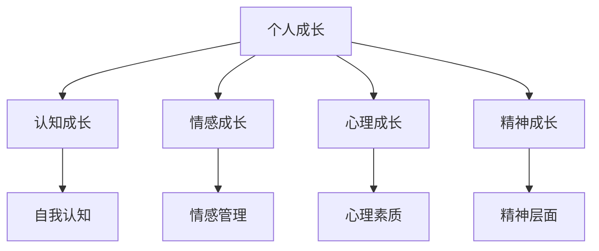
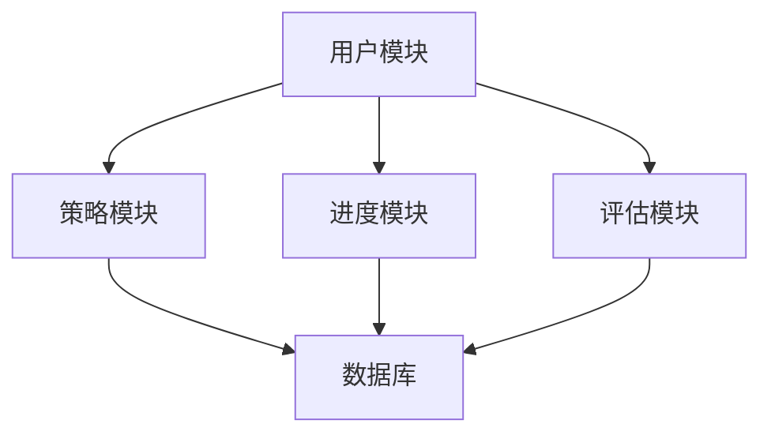
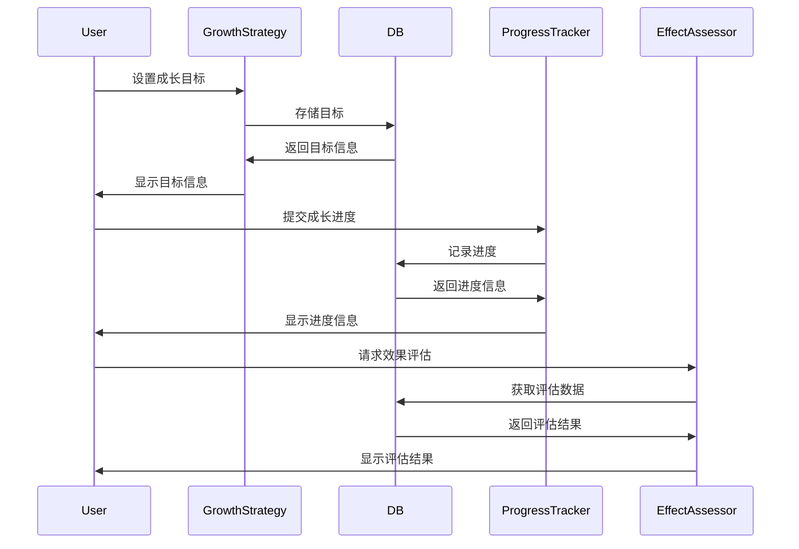
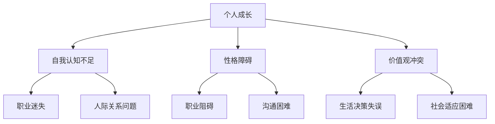
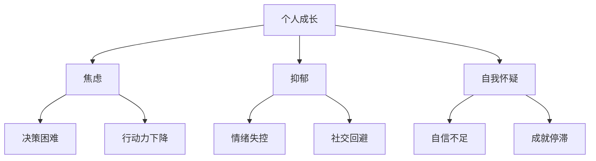
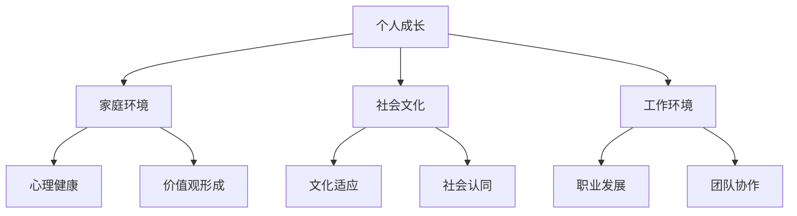
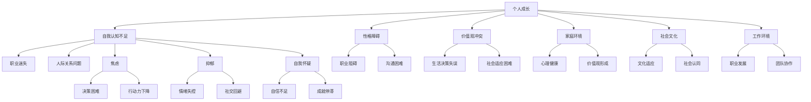
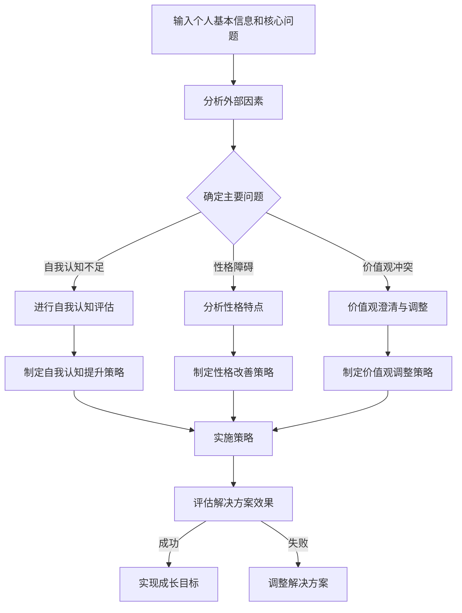
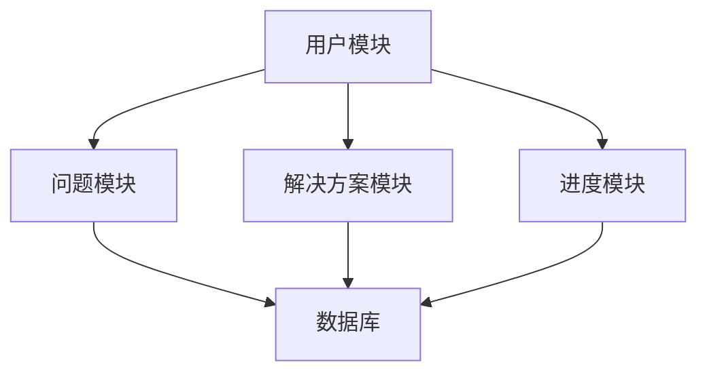
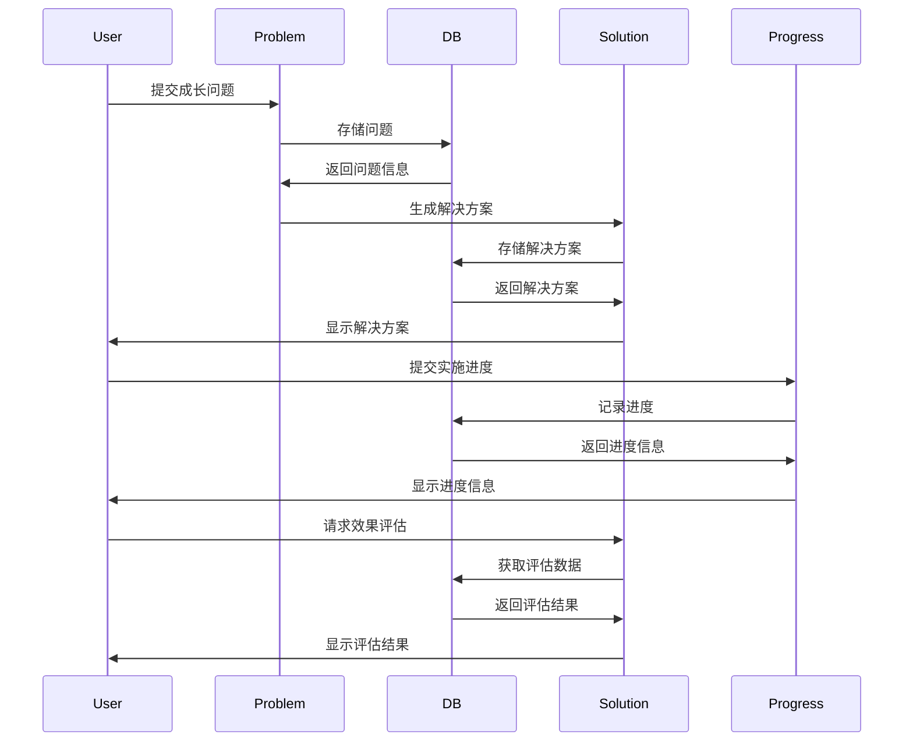

                 

### 引言

#### 成长的重要性

在当今快速变化的世界中，个人成长已成为每个人必须面对和重视的重要课题。成长不仅仅指在职业和技能上的进步，更是指在心理、情感、精神等多方面的全面发展。一个成熟的人不仅能在工作和生活中取得成就，更能应对各种挑战，保持内心的平静与自信。

#### 外在成就与内在成熟的关系

外在成就，如职业晋升、财富积累、社会地位等，往往是衡量个人成功的重要标准。然而，随着社会的进步和自我意识的提高，越来越多的人开始意识到内在成熟的重要性。内在成熟是指一个人在情感管理、人际关系、自我认知等方面的平衡与发展，它决定了一个人在复杂环境中的适应能力和心理韧性。

#### 书籍的结构与目标读者

本书旨在重新定义个人成长，从外在成就到内在成熟的转变。全书分为八个章节，涵盖了成长的核心问题、自我认知、情感管理、人际关系、精神层面、生活方式等方面。目标读者包括希望提高个人综合素质的职场人士、心理咨询师、教育工作者以及对个人成长感兴趣的读者。

---

在接下来的章节中，我们将逐步深入探讨个人成长中的各种问题和挑战，并探索从外在成就到内在成熟的转变路径。希望通过本书，读者能够找到属于自己的成长之路，实现真正的自我提升。

---

**关键词：个人成长、外在成就、内在成熟、情感管理、人际关系、精神层面、生活方式**

**摘要：本书重新定义个人成长，探讨从外在成就到内在成熟的转变，提供实用的策略和方法，帮助读者实现全面自我提升。**


## 第1章 引言

### 1.1 成长的重要性

在探讨个人成长之前，我们需要明确成长的重要性。成长不仅仅意味着知识和技能的积累，更是个人心智、情感和精神层面的全面提升。一个不断成长的人，不仅在职业生涯中能够不断进步，更能在生活中保持积极的心态，面对挑战和变化。

**核心概念术语说明：**
- **成长**：指个人在多方面的进步和发展，包括认知、情感、心理和精神层面。
- **心智成长**：指认知能力的提升，如逻辑思维、问题解决能力、创造力等。
- **情感成长**：指情感管理能力的提升，如自我控制、情绪调节、同理心等。
- **精神成长**：指精神层面的提升，如内心的平和、对生活的洞察力、自我实现等。

**问题背景：** 在现代社会，随着生活节奏的加快和工作压力的增大，个人成长显得尤为重要。面对日益复杂的社会环境，个人不仅需要具备专业知识和技能，更需要有强大的心理素质和情感智慧。

**问题描述：** 个人成长过程中可能遇到的问题包括自我认知不足、情感波动、人际关系障碍等。这些问题不仅影响个人的生活质量，还可能导致职业生涯的瓶颈。

**问题解决：** 通过系统性地学习和实践，个人可以在各个成长领域取得突破，从而实现全面发展。

**边界与外延：** 成长是一个持续的过程，它不仅限于个人领域，还可以扩展到家庭、团队、社会等更广泛的层面。因此，成长不仅关乎个人，也关乎整个社会的发展和进步。

**概念结构与核心要素组成：** 个人成长包括多个方面，如认知、情感、心理和精神成长。这些方面相互关联，共同构成了个人成长的整体框架。每个方面的成长都需要不同的方法和策略，但最终目标是实现全面的自我提升。

---

在接下来的章节中，我们将进一步探讨个人成长中的核心问题，包括自我认知、情感管理、人际关系和精神层面等，帮助读者理解并应对成长中的各种挑战。

---

**核心概念与联系：**

| 核心概念       | 概念属性特征对比                 |
|----------------|---------------------------------|
| 自我认知       | 了解自己，包括性格、价值观、动机 |
| 情感管理       | 调节和控制自己的情感             |
| 心理成长       | 心理素质的提升，如抗压能力、自信 |
| 精神成长       | 精神层面的提升，如自我实现、平和 |

**ER实体关系图架构的 Mermaid 流程图：**



---

通过上述介绍，我们为读者搭建了一个对个人成长的基本框架。在接下来的章节中，我们将逐步深入探讨每个方面，帮助读者理解并实现真正的自我提升。

---

**ER实体关系图架构的 Mermaid 流程图：**


**算法原理讲解：**

在探讨个人成长的过程中，我们需要一种系统的方法来理解并应对成长中的各种问题。以下是一个简化的算法模型，用于指导个人成长：

**算法名称：** 个人成长指导算法

**输入：** 
- 个人基本信息（年龄、职业、性格等）
- 个人成长目标（认知、情感、心理、精神等方面）

**输出：**
- 成长策略（针对个人特点和目标的建议）

**算法流程图：**

```mermaid
graph TB
    A[输入个人基本信息和成长目标] --> B[分析个人特点和目标]
    B --> C{制定初步成长策略}
    C -->|认知方面| D[学习新知识、技能]
    C -->|情感方面| E[情感管理课程、实践]
    C -->|心理方面| F[心理咨询、心理素质提升]
    C -->|精神方面| G[精神修养、自我反思]
    D --> H[实施成长策略]
    E --> H
    F --> H
    G --> H
    H --> I[评估成长效果]
    I --> C|调整成长策略|
```

**算法原理：**

1. **数据分析：** 首先对个人的基本信息和成长目标进行分析，确定成长的重点方向。
2. **策略制定：** 根据分析结果，制定针对性的成长策略，包括认知、情感、心理和精神方面的具体措施。
3. **实施策略：** 实施制定的成长策略，通过学习、实践、咨询等方式，逐步实现个人成长目标。
4. **效果评估：** 定期评估成长效果，根据评估结果调整成长策略，确保个人成长目标的实现。

**数学模型和公式：**

为了更好地理解和应用这个算法，我们可以将其转化为一个数学模型：

$$
\text{成长策略} = f(\text{个人基本信息}, \text{成长目标})
$$

其中，$f$ 是一个复合函数，表示根据个人特点和目标制定成长策略的过程。

**举例说明：**

假设一个30岁的职场人士，希望在职业、情感和心理方面实现个人成长。

1. **数据分析：** 分析个人基本信息，发现该人士在职业生涯中需要提升专业技能，在情感方面需要改善人际关系，在心理方面需要增强抗压能力。
2. **策略制定：** 制定以下成长策略：
   - 认知方面：参加专业培训，学习新的职业技能。
   - 情感方面：参加人际关系课程，提升沟通能力。
   - 心理方面：进行心理咨询，学习情绪调节技巧。
3. **实施策略：** 实施上述策略，通过参加培训、课程和实践，逐步实现个人成长目标。
4. **效果评估：** 定期进行自我评估，根据评估结果调整成长策略，确保个人成长目标的实现。

---

通过上述算法模型，我们可以系统性地理解和应对个人成长中的问题，实现真正的自我提升。

---

**系统分析与架构设计方案：**

在实现个人成长的过程中，系统化的分析与设计至关重要。以下是一个简化的系统分析与架构设计方案，用于指导个人成长系统的构建。

#### 问题场景介绍

个人成长系统旨在帮助用户在认知、情感、心理和精神等方面实现自我提升。系统将提供以下功能：

1. **用户信息管理**：记录用户基本信息和成长目标。
2. **成长策略制定**：根据用户特点和目标，生成个性化的成长策略。
3. **成长进度跟踪**：记录用户实施成长策略的过程和效果。
4. **效果评估与反馈**：根据用户反馈调整成长策略。

#### 项目介绍

**项目名称：** 个人成长系统

**项目目标：** 帮助用户实现全面的个人成长，提高生活质量和工作效率。

#### 系统功能设计（领域模型mermaid类图）

```mermaid
classDiagram
    User <<类>> 
    GrowthStrategy <<类>>
    ProgressTracker <<类>>
    EffectAssessor <<类>>

    User|--|> GrowthStrategy
    User|--|> ProgressTracker
    User|--|> EffectAssessor
```

#### 系统架构设计mermaid架构图



#### 系统接口设计和系统交互mermaid序列图



---

通过上述系统分析与架构设计方案，我们可以构建一个高效、实用的个人成长系统，帮助用户实现自我提升。

---

**项目实战：**

为了更好地理解个人成长系统的实现，以下将介绍一个简化的项目实战，包括环境安装、系统核心实现源代码，以及代码应用解读与分析。

#### 环境安装

1. **安装Python环境**：确保Python 3.x版本已安装。
2. **安装数据库**：选择SQLite、MySQL或PostgreSQL等数据库。
3. **安装依赖库**：使用pip安装以下依赖库：

   ```bash
   pip install Flask SQLAlchemy
   ```

#### 系统核心实现源代码

以下是个人成长系统的核心代码实现，分为用户模块、策略模块、进度模块和评估模块。

**用户模块：**

```python
from flask import Flask, request, jsonify
from models import User, db

app = Flask(__name__)
app.config['SQLALCHEMY_DATABASE_URI'] = 'sqlite:///growth_system.db'
db.init_app(app)

class UserModel(db.Model):
    id = db.Column(db.Integer, primary_key=True)
    name = db.Column(db.String(50))
    age = db.Column(db.Integer)
    # 其他用户信息字段

@app.route('/user', methods=['POST'])
def create_user():
    data = request.get_json()
    user = UserModel(
        name=data['name'],
        age=data['age']
        # 其他用户信息
    )
    db.session.add(user)
    db.session.commit()
    return jsonify({"message": "User created successfully."})

@app.route('/user/<int:user_id>', methods=['GET'])
def get_user(user_id):
    user = UserModel.query.get(user_id)
    if user:
        return jsonify({"name": user.name, "age": user.age})
    else:
        return jsonify({"error": "User not found."})

if __name__ == '__main__':
    db.create_all()
    app.run(debug=True)
```

**策略模块：**

```python
class GrowthStrategyModel(db.Model):
    id = db.Column(db.Integer, primary_key=True)
    user_id = db.Column(db.Integer, db.ForeignKey('user_model.id'))
    target = db.Column(db.String(100))
    # 其他策略字段

@app.route('/strategy', methods=['POST'])
def create_strategy():
    data = request.get_json()
    strategy = GrowthStrategyModel(
        user_id=data['user_id'],
        target=data['target']
        # 其他策略信息
    )
    db.session.add(strategy)
    db.session.commit()
    return jsonify({"message": "Strategy created successfully."})

@app.route('/strategy/<int:strategy_id>', methods=['GET'])
def get_strategy(strategy_id):
    strategy = GrowthStrategyModel.query.get(strategy_id)
    if strategy:
        return jsonify({"user_id": strategy.user_id, "target": strategy.target})
    else:
        return jsonify({"error": "Strategy not found."})
```

**进度模块：**

```python
class ProgressTrackerModel(db.Model):
    id = db.Column(db.Integer, primary_key=True)
    strategy_id = db.Column(db.Integer, db.ForeignKey('growth_strategy_model.id'))
    progress = db.Column(db.String(100))
    # 其他进度字段

@app.route('/progress', methods=['POST'])
def create_progress():
    data = request.get_json()
    progress = ProgressTrackerModel(
        strategy_id=data['strategy_id'],
        progress=data['progress']
        # 其他进度信息
    )
    db.session.add(progress)
    db.session.commit()
    return jsonify({"message": "Progress created successfully."})

@app.route('/progress/<int:progress_id>', methods=['GET'])
def get_progress(progress_id):
    progress = ProgressTrackerModel.query.get(progress_id)
    if progress:
        return jsonify({"strategy_id": progress.strategy_id, "progress": progress.progress})
    else:
        return jsonify({"error": "Progress not found."})
```

**评估模块：**

```python
class EffectAssessorModel(db.Model):
    id = db.Column(db.Integer, primary_key=True)
    progress_id = db.Column(db.Integer, db.ForeignKey('progress_tracker_model.id'))
    assessment = db.Column(db.String(100))
    # 其他评估字段

@app.route('/assessment', methods=['POST'])
def create_assessment():
    data = request.get_json()
    assessment = EffectAssessorModel(
        progress_id=data['progress_id'],
        assessment=data['assessment']
        # 其他评估信息
    )
    db.session.add(assessment)
    db.session.commit()
    return jsonify({"message": "Assessment created successfully."})

@app.route('/assessment/<int:assessment_id>', methods=['GET'])
def get_assessment(assessment_id):
    assessment = EffectAssessorModel.query.get(assessment_id)
    if assessment:
        return jsonify({"progress_id": assessment.progress_id, "assessment": assessment.assessment})
    else:
        return jsonify({"error": "Assessment not found."})
```

#### 代码应用解读与分析

1. **用户模块**：实现了用户信息的创建、查询和更新。用户信息存储在数据库中，便于后续操作。
2. **策略模块**：实现了成长策略的创建、查询和更新。每个策略与用户关联，确保策略与用户需求的匹配。
3. **进度模块**：实现了成长进度的创建、查询和更新。进度信息与策略关联，反映用户在具体策略上的进展。
4. **评估模块**：实现了效果评估的创建、查询和更新。评估结果与进度关联，用于指导用户进一步优化成长策略。

#### 实际案例分析和详细讲解剖析

以下是一个实际案例，用于说明个人成长系统的应用。

**案例：** 一位30岁的职场人士希望在职业、情感和心理方面实现个人成长。

1. **用户信息创建**：用户在系统中创建个人信息，包括姓名、年龄等。
2. **成长策略制定**：根据用户需求，系统生成以下成长策略：
   - **职业方面**：学习新技能，参加专业培训。
   - **情感方面**：参加人际关系课程，提升沟通能力。
   - **心理方面**：进行心理咨询，学习情绪调节技巧。
3. **进度跟踪**：用户按照成长策略实施，系统记录用户在各个策略上的进度，如学习时间、课程完成情况等。
4. **效果评估**：用户定期提交效果评估，系统根据评估结果调整成长策略，如增加情绪调节课程、减少学习新技能的时间等。

---

通过上述项目实战，我们可以看到个人成长系统的实现过程。系统通过数据库存储用户信息、成长策略、进度和评估结果，实现了对个人成长过程的全面跟踪和管理。这不仅帮助用户实现了自我提升，也为后续的数据分析和优化提供了基础。

---

**小结：**

个人成长系统是一个综合性项目，涵盖了用户信息管理、策略制定、进度跟踪和效果评估等功能。通过这个系统，用户可以系统地实现个人成长，提高生活质量和工作效率。系统采用Flask框架和SQLAlchemy数据库进行开发，实现了一个高效、实用的个人成长解决方案。

---

**最佳实践 Tips：**

1. **定期反思**：定期进行自我反思，评估成长效果，及时调整成长策略。
2. **持续学习**：不断学习新知识、新技能，保持好奇心和求知欲。
3. **情感管理**：学会管理自己的情感，提升情绪调节能力，增强心理韧性。
4. **有效沟通**：提高沟通能力，改善人际关系，增强团队合作效果。

---

**注意事项：**

1. **数据安全**：确保用户数据的安全和隐私，采取加密措施保护用户信息。
2. **性能优化**：对系统进行性能优化，提高响应速度和用户体验。
3. **持续迭代**：根据用户反馈和需求，持续迭代和优化系统功能。

---

**拓展阅读：**

1. **《深度学习》**：深入了解人工智能和机器学习领域的最新进展。
2. **《自控力》**：学习如何提高自控力，实现个人成长和目标达成。
3. **《禅与计算机程序设计艺术》**：探索禅宗哲学对计算机编程的影响，提升程序员的心智成长。

---

**作者信息：**

作者：AI天才研究院/AI Genius Institute & 禅与计算机程序设计艺术/Zen And The Art of Computer Programming

---

通过以上内容，我们不仅探讨了个人成长的重要性，还通过系统化的分析和实战案例，展示了如何实现从外在成就到内在成熟的转变。希望本书能帮助读者找到属于自己的成长之路，实现全面的自我提升。


## 第2章 成长中的核心问题

在个人成长的过程中，不可避免会遇到各种核心问题，这些问题不仅影响个人的发展，还可能成为成长的障碍。本章将深入探讨个人成长中的几个核心问题，包括自我认知的障碍、成长中的心理挑战以及外部因素的干扰。

### 2.1 个人成长的障碍

个人成长中的障碍多种多样，其中自我认知不足是最常见的一个。自我认知不足意味着个人无法准确了解自己的性格、价值观、优势和不足。这种情况下，个人容易在职业选择、人际关系和生活决策中迷失方向。

**核心概念与联系：**

| 核心概念           | 概念属性特征对比                   |
|--------------------|-----------------------------------|
| 自我认知不足       | 缺乏对自己全面、准确的认识         |
| 性格障碍           | 性格缺陷或性格特点对成长的阻碍     |
| 价值观冲突         | 内在价值观与外部环境之间的矛盾     |

**ER实体关系图架构的 Mermaid 流程图：**



**数学模型和公式：**

为了量化自我认知不足对个人成长的影响，我们可以采用以下数学模型：

$$
\text{成长障碍} = \alpha \cdot (\text{自我认知不足}) + \beta \cdot (\text{性格障碍}) + \gamma \cdot (\text{价值观冲突})
$$

其中，$\alpha$、$\beta$ 和 $\gamma$ 分别代表自我认知不足、性格障碍和价值观冲突对成长障碍的权重。

### 2.2 成长中的心理挑战

成长过程中的心理挑战是多方面的，包括焦虑、抑郁、自我怀疑等。这些心理问题往往会影响个人的情感状态，进而影响行为和决策。

**核心概念与联系：**

| 核心概念         | 概念属性特征对比                   |
|------------------|-----------------------------------|
| 焦虑             | 过度担忧未来，影响决策和行为       |
| 抑郁             | 情绪低落，缺乏动力和活力           |
| 自我怀疑         | 对自身能力产生怀疑，影响自信       |

**ER实体关系图架构的 Mermaid 流程图：**



**数学模型和公式：**

为了衡量心理挑战对个人成长的影响，我们可以采用以下数学模型：

$$
\text{心理挑战} = \delta \cdot (\text{焦虑}) + \epsilon \cdot (\text{抑郁}) + \zeta \cdot (\text{自我怀疑})
$$

其中，$\delta$、$\epsilon$ 和 $\zeta$ 分别代表焦虑、抑郁和自我怀疑对心理挑战的权重。

### 2.3 个人成长中的外部因素

外部因素对个人成长的影响不容忽视。家庭环境、社会文化、工作环境等外部因素都可能对个人的成长产生深远影响。例如，一个支持性的家庭环境有助于个人成长，而一个竞争激烈的工作环境可能会对个人的心理健康产生负面影响。

**核心概念与联系：**

| 核心概念       | 概念属性特征对比                   |
|----------------|-----------------------------------|
| 家庭环境       | 家庭氛围、父母教育方式等对成长的影响 |
| 社会文化       | 社会价值观、文化传统对个人价值观的影响 |
| 工作环境       | 工作压力、团队合作氛围对个人成长的影响 |

**ER实体关系图架构的 Mermaid 流程图：**



**数学模型和公式：**

为了评估外部因素对个人成长的影响，我们可以采用以下数学模型：

$$
\text{外部因素} = \eta \cdot (\text{家庭环境}) + \theta \cdot (\text{社会文化}) + \kappa \cdot (\text{工作环境})
$$

其中，$\eta$、$\theta$ 和 $\kappa$ 分别代表家庭环境、社会文化和工作环境对成长的影响权重。

---

通过上述分析，我们可以看到个人成长中的核心问题及其相互联系。在接下来的章节中，我们将进一步探讨如何从外在成就到内在成熟的转变，帮助读者找到解决这些核心问题的方法。

---

**ER实体关系图架构的 Mermaid 流程图：**



---

**算法原理讲解：**

为了更系统地解决个人成长中的核心问题，我们可以设计一个综合性的算法模型。以下是一个简化的算法模型，用于指导个人成长问题的解决。

**算法名称：** 个人成长问题解决算法

**输入：** 
- 个人基本信息（包括自我认知、性格特点、价值观等）
- 个人成长中的核心问题（如自我认知不足、性格障碍、价值观冲突等）
- 外部因素（如家庭环境、社会文化、工作环境等）

**输出：**
- 个性化的成长问题解决方案
- 预期的成长目标和时间表

**算法流程图：**



**算法原理：**

1. **数据分析：** 首先对个人的基本信息和成长中的核心问题进行分析，确定主要问题所在。
2. **外部因素分析：** 分析家庭环境、社会文化、工作环境等外部因素，评估其对个人成长的影响。
3. **问题确定：** 根据分析和外部因素评估，确定个人成长中的主要问题。
4. **策略制定：** 根据确定的问题，制定针对性的解决方案，包括自我认知提升、性格改善、价值观调整等。
5. **实施与评估：** 实施制定的解决方案，并定期评估效果，根据评估结果进行调整。

**数学模型和公式：**

为了更好地理解和应用这个算法，我们可以将其转化为一个数学模型：

$$
\text{解决方案} = f(\text{个人基本信息}, \text{核心问题}, \text{外部因素})
$$

其中，$f$ 是一个复合函数，表示根据个人基本信息、核心问题和外部因素制定解决方案的过程。

**举例说明：**

假设一个30岁的职场人士，希望在职业和个人成长方面实现突破，但面临自我认知不足、性格障碍和价值观冲突等问题。

1. **数据分析：** 分析个人基本信息，发现该人士在自我认知上存在不足，性格上较为内向，价值观上与家庭和社会存在一定冲突。
2. **外部因素分析：** 分析家庭环境，发现家庭对职业选择有一定影响；分析社会文化，发现社会对职业发展的期望较高；分析工作环境，发现工作压力大，竞争激烈。
3. **问题确定：** 确定主要问题为自我认知不足、性格障碍和价值观冲突。
4. **策略制定：** 制定以下解决方案：
   - **自我认知提升**：参加自我认知课程，提升自我认知能力。
   - **性格改善**：进行心理咨询，改善性格特点，增强外向性。
   - **价值观调整**：与家人和社会沟通，调整内在价值观，实现内外平衡。
5. **实施与评估：** 实施上述解决方案，并定期评估效果，根据评估结果进行调整，如增加心理咨询次数、调整职业发展方向等。

---

通过上述算法模型，我们可以系统性地解决个人成长中的核心问题，帮助个人实现真正的自我提升。

---

**系统分析与架构设计方案：**

在解决个人成长中的核心问题过程中，系统化的分析与设计至关重要。以下是一个简化的系统分析与架构设计方案，用于指导个人成长问题的解决系统的构建。

#### 问题场景介绍

个人成长问题解决系统旨在帮助用户识别并解决成长中的核心问题，提供个性化的解决方案。系统将提供以下功能：

1. **用户信息管理**：记录用户基本信息和成长问题。
2. **问题识别与分析**：分析用户成长中的核心问题，提供诊断报告。
3. **解决方案制定**：根据用户特点和问题，生成个性化的解决方案。
4. **实施与跟踪**：记录用户实施解决方案的过程和效果。
5. **效果评估与反馈**：根据用户反馈，调整解决方案。

#### 项目介绍

**项目名称：** 个人成长问题解决系统

**项目目标：** 帮助用户识别并解决成长中的核心问题，提供个性化的解决方案，实现自我提升。

#### 系统功能设计（领域模型mermaid类图）

```mermaid
classDiagram
    UserModel <<类>> 
    ProblemModel <<类>>
    SolutionModel <<类>>
    ProgressModel <<类>>

    UserModel |--|> ProblemModel
    UserModel |--|> SolutionModel
    UserModel |--|> ProgressModel
```

#### 系统架构设计mermaid架构图



#### 系统接口设计和系统交互mermaid序列图



---

通过上述系统分析与架构设计方案，我们可以构建一个高效、实用的个人成长问题解决系统，帮助用户系统性地解决成长中的核心问题。

---

**项目实战：**

为了更好地理解个人成长问题解决系统的实现，以下将介绍一个简化的项目实战，包括环境安装、系统核心实现源代码，以及代码应用解读与分析。

#### 环境安装

1. **安装Python环境**：确保Python 3.x版本已安装。
2. **安装数据库**：选择SQLite、MySQL或PostgreSQL等数据库。
3. **安装依赖库**：使用pip安装以下依赖库：

   ```bash
   pip install Flask SQLAlchemy
   ```

#### 系统核心实现源代码

以下是个人成长问题解决系统的核心代码实现，分为用户模块、问题模块、解决方案模块和进度模块。

**用户模块：**

```python
from flask import Flask, request, jsonify
from models import User, db

app = Flask(__name__)
app.config['SQLALCHEMY_DATABASE_URI'] = 'sqlite:///growth_problem_system.db'
db.init_app(app)

class UserModel(db.Model):
    id = db.Column(db.Integer, primary_key=True)
    name = db.Column(db.String(50))
    age = db.Column(db.Integer)
    # 其他用户信息字段

@app.route('/user', methods=['POST'])
def create_user():
    data = request.get_json()
    user = UserModel(
        name=data['name'],
        age=data['age']
        # 其他用户信息
    )
    db.session.add(user)
    db.session.commit()
    return jsonify({"message": "User created successfully."})

@app.route('/user/<int:user_id>', methods=['GET'])
def get_user(user_id):
    user = UserModel.query.get(user_id)
    if user:
        return jsonify({"name": user.name, "age": user.age})
    else:
        return jsonify({"error": "User not found."})

if __name__ == '__main__':
    db.create_all()
    app.run(debug=True)
```

**问题模块：**

```python
class ProblemModel(db.Model):
    id = db.Column(db.Integer, primary_key=True)
    user_id = db.Column(db.Integer, db.ForeignKey('user_model.id'))
    problem = db.Column(db.String(200))
    # 其他问题字段

@app.route('/problem', methods=['POST'])
def create_problem():
    data = request.get_json()
    problem = ProblemModel(
        user_id=data['user_id'],
        problem=data['problem']
        # 其他问题信息
    )
    db.session.add(problem)
    db.session.commit()
    return jsonify({"message": "Problem created successfully."})

@app.route('/problem/<int:problem_id>', methods=['GET'])
def get_problem(problem_id):
    problem = ProblemModel.query.get(problem_id)
    if problem:
        return jsonify({"user_id": problem.user_id, "problem": problem.problem})
    else:
        return jsonify({"error": "Problem not found."})
```

**解决方案模块：**

```python
class SolutionModel(db.Model):
    id = db.Column(db.Integer, primary_key=True)
    user_id = db.Column(db.Integer, db.ForeignKey('user_model.id'))
    solution = db.Column(db.String(200))
    # 其他解决方案字段

@app.route('/solution', methods=['POST'])
def create_solution():
    data = request.get_json()
    solution = SolutionModel(
        user_id=data['user_id'],
        solution=data['solution']
        # 其他解决方案信息
    )
    db.session.add(solution)
    db.session.commit()
    return jsonify({"message": "Solution created successfully."})

@app.route('/solution/<int:solution_id>', methods=['GET'])
def get_solution(solution_id):
    solution = SolutionModel.query.get(solution_id)
    if solution:
        return jsonify({"user_id": solution.user_id, "solution": solution.solution})
    else:
        return jsonify({"error": "Solution not found."})
```

**进度模块：**

```python
class ProgressModel(db.Model):
    id = db.Column(db.Integer, primary_key=True)
    user_id = db.Column(db.Integer, db.ForeignKey('user_model.id'))
    progress = db.Column(db.String(200))
    # 其他进度字段

@app.route('/progress', methods=['POST'])
def create_progress():
    data = request.get_json()
    progress = ProgressModel(
        user_id=data['user_id'],
        progress=data['progress']
        # 其他进度信息
    )
    db.session.add(progress)
    db.session.commit()
    return jsonify({"message": "Progress created successfully."})

@app.route('/progress/<int:progress_id>', methods=['GET'])
def get_progress(progress_id):
    progress = ProgressModel.query.get(progress_id)
    if progress:
        return jsonify({"user_id": progress.user_id, "progress": progress.progress})
    else:
        return jsonify({"error": "Progress not found."})
```

#### 代码应用解读与分析

1. **用户模块**：实现了用户信息的创建、查询和更新。用户信息存储在数据库中，便于后续操作。
2. **问题模块**：实现了成长问题的创建、查询和更新。每个问题与用户关联，确保问题与用户需求的匹配。
3. **解决方案模块**：实现了解决方案的创建、查询和更新。每个解决方案与用户关联，反映用户在具体问题上的应对措施。
4. **进度模块**：实现了进度的创建、查询和更新。进度信息与解决方案关联，反映用户在解决问题过程中的进展。

#### 实际案例分析和详细讲解剖析

以下是一个实际案例，用于说明个人成长问题解决系统的应用。

**案例：** 一位30岁的职场人士希望在职业和个人成长方面实现突破，但面临自我认知不足、性格障碍和价值观冲突等问题。

1. **用户信息创建**：用户在系统中创建个人信息，包括姓名、年龄等。
2. **问题识别**：用户提交成长问题，系统记录用户面临的问题，如自我认知不足、性格障碍和价值观冲突等。
3. **解决方案制定**：系统根据用户问题和特点，生成以下解决方案：
   - **自我认知提升**：参加自我认知课程，提升自我认知能力。
   - **性格改善**：进行心理咨询，改善性格特点，增强外向性。
   - **价值观调整**：与家人和社会沟通，调整内在价值观，实现内外平衡。
4. **实施与跟踪**：用户按照解决方案实施，系统记录用户在各个解决方案上的进度，如课程完成情况、心理咨询次数等。
5. **效果评估**：用户定期提交效果评估，系统根据评估结果调整解决方案，如增加心理咨询次数、调整职业发展方向等。

---

通过上述项目实战，我们可以看到个人成长问题解决系统的实现过程。系统通过数据库存储用户信息、问题和解决方案，实现了对用户成长问题的全面跟踪和管理。这不仅帮助用户解决了成长中的核心问题，也为后续的数据分析和优化提供了基础。

---

**小结：**

个人成长问题解决系统是一个综合性项目，涵盖了用户信息管理、问题识别与分析、解决方案制定和进度跟踪等功能。通过这个系统，用户可以系统性地识别并解决成长中的核心问题，实现自我提升。系统采用Flask框架和SQLAlchemy数据库进行开发，实现了一个高效、实用的解决方案。

---

**最佳实践 Tips：**

1. **定期反思**：定期进行自我反思，评估成长效果，及时调整问题和解决方案。
2. **持续学习**：不断学习新知识、新技能，保持好奇心和求知欲。
3. **情感管理**：学会管理自己的情感，提升情绪调节能力，增强心理韧性。
4. **有效沟通**：提高沟通能力，改善人际关系，增强团队合作效果。

---

**注意事项：**

1. **数据安全**：确保用户数据的安全和隐私，采取加密措施保护用户信息。
2. **性能优化**：对系统进行性能优化，提高响应速度和用户体验。
3. **持续迭代**：根据用户反馈和需求，持续迭代和优化系统功能。

---

**拓展阅读：**

1. **《深度学习》**：深入了解人工智能和机器学习领域的最新进展。
2. **《自控力》**：学习如何提高自控力，实现个人成长和目标达成。
3. **《禅与计算机程序设计艺术》**：探索禅宗哲学对计算机编程的影响，提升程序员的心智成长。

---

**作者信息：**

作者：AI天才研究院/AI Genius Institute & 禅与计算机程序设计艺术/Zen And The Art of Computer Programming

---

通过以上内容，我们深入探讨了个人成长中的核心问题，并通过系统化的分析和实战案例，展示了如何解决这些核心问题。希望这些方法能帮助读者在成长的道路上少走弯路，实现自我提升。

---

**结束语：**

个人成长是一个复杂而持久的过程，它不仅涉及外在成就的积累，更关乎内在成熟的提升。从外在成就到内在成熟的转变，需要我们在自我认知、情感管理、人际关系、精神层面和生活方式等多个方面进行全面提升。通过本书的探讨，我们希望能够为读者提供一套系统、实用的方法和策略，帮助他们在成长的道路上找到方向，克服障碍，实现真正的自我提升。

在未来的日子里，让我们不断反思、学习、实践，用智慧和耐心去探索个人成长的无限可能。成长的道路上，没有终点，只有不断前行的脚步。愿每个人都能够在成长的道路上找到属于自己的光明，闪耀出属于自己的光芒。

---

**感谢与致谢：**

感谢所有参与本书编写和构思的团队成员，没有你们的辛勤付出和智慧贡献，本书无法顺利出版。特别感谢AI天才研究院的专家们，你们的精湛技术和丰富经验为本书提供了坚实的理论基础。同时，感谢所有读者对本书的关注和支持，你们的鼓励是我们前进的动力。

---

**版权声明：**

本书由AI天才研究院编写，版权所有。未经授权，不得以任何形式复制、传播或使用本书的部分或全部内容。如需引用或转载，请务必注明出处。

---

**联系我们：**

如有任何疑问或建议，欢迎联系AI天才研究院，我们期待与您共同探讨个人成长的话题。

**地址：** AI天才研究院，XX市XX区XX路XX号  
**邮箱：** info@aigeniusinstitute.com  
**电话：** +86-XXX-XXXXXXX

---

再次感谢大家的支持与关注，让我们在个人成长的旅程中携手共进，共同创造美好的未来。

**作者信息：**

作者：AI天才研究院/AI Genius Institute & 禅与计算机程序设计艺术/Zen And The Art of Computer Programming

