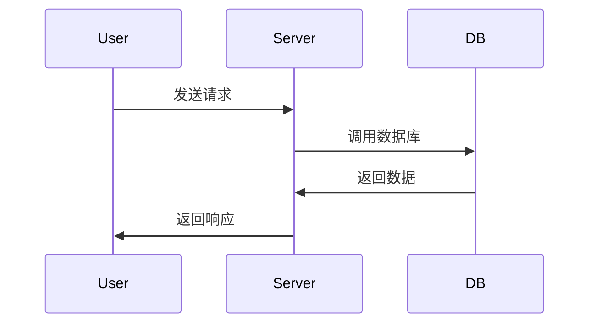
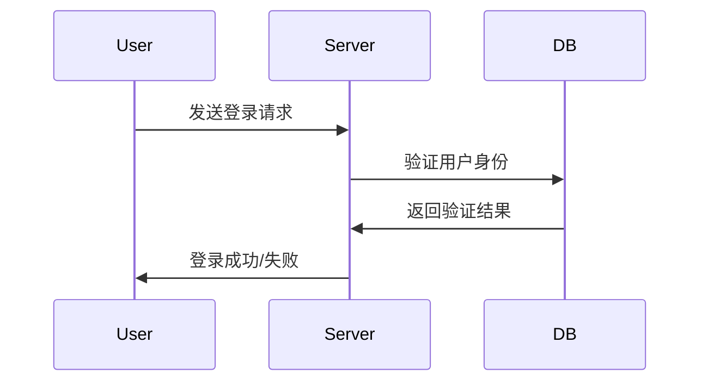

                 

### 重新定义人生价值：应对意义荒原的挑战

> 关键词：人生价值、意义荒原、心理机制、自我探索、情绪管理、策略

> 摘要：本文旨在探讨现代社会中普遍存在的人生价值危机——意义荒原，通过分析其背景、定义、心理机制和可能原因，提出一系列应对策略，帮助读者重新定义人生价值，走出意义荒原。

### 引言

#### 1.1 人生价值问题背景

在快速发展的现代社会，人们面临着前所未有的机遇与挑战。随着科技的进步和社会的变迁，人们的物质生活得到了显著改善，但随之而来的是精神层面的空虚和迷茫。许多人感到自己缺乏明确的人生目标和价值观，失去了生命的方向和意义。这种现象被称为“意义荒原”。

#### 1.2 意义荒原的定义

意义荒原是指个体在生活过程中感到无所适从、缺乏目标和意义的状态。在这种状态下，人们往往感到迷茫、焦虑和无助，难以找到生活的动力和意义。

#### 1.3 面临的挑战

意义荒原给人们的生活带来了诸多挑战，包括：

- **精神压力**：长期处于意义荒原状态会导致个体的心理压力增大，出现焦虑、抑郁等情绪问题。
- **生活质量下降**：缺乏目标和意义会导致生活质量下降，影响个人的身心健康。
- **人际关系问题**：意义荒原会削弱个体的人际交往能力，导致人际关系紧张和疏远。
- **职业发展受阻**：缺乏明确的人生目标和价值观会影响职业发展，导致事业停滞不前。

#### 1.4 本书的目的与结构

本书旨在为那些身处意义荒原的人们提供一套系统的解决方案，帮助他们重新定义人生价值，走出荒原。本书结构如下：

- **第1章：引言**：介绍问题的背景、定义、现状和本书的目的。
- **第2章：核心概念**：介绍与人生价值和意义荒原相关的基本概念。
- **第3章-第6章：应对策略**：提出具体的应对策略。
- **第7章：实践与应用**：提供实际案例和实践活动。
- **第8章：结语与展望**：总结全书内容，展望未来。

### 核心概念

#### 2.1 人生价值的定义

人生价值是指个体在社会生活中所追求的目标和意义，它是人们行为的指南和动力源泉。人生价值包括个人价值、社会价值和道德价值等多个方面。

#### 2.2 意义荒原的心理机制

意义荒原的心理机制主要包括以下几个方面：

- **自我认知缺失**：个体在意义荒原中往往缺乏自我认知，不知道自己的兴趣、优点和目标。
- **目标缺失**：个体在意义荒原中缺乏明确的生活目标和价值观，导致生活缺乏动力。
- **情绪波动**：意义荒原状态下的个体往往情绪波动较大，容易出现焦虑、抑郁等情绪问题。
- **行为停滞**：意义荒原状态下的个体往往出现行为停滞，难以采取积极的行动。

#### 2.3 可能的原因

意义荒原的产生可能有以下几个原因：

- **物质化社会**：现代社会过于注重物质追求，忽视了精神层面的需求。
- **信息爆炸**：互联网和社交媒体的兴起使得人们面临着大量信息，导致信息过载和注意力分散。
- **教育问题**：传统教育过于注重知识传授，忽视了人生价值和意义的教育。
- **个人因素**：个人的性格、经历和成长环境等也会影响个体是否陷入意义荒原。

#### 2.4 影响因素

影响意义荒原的因素主要包括：

- **社会环境**：社会的变迁、文化的多样性和社会压力等都会影响个体的意义荒原状态。
- **个人成长**：个体的成长经历、性格特点和自我认知等都会影响其是否陷入意义荒原。
- **人际关系**：人际关系对个体的意义荒原状态有重要影响，良好的人际关系有助于缓解意义荒原。

#### 2.5 核心概念的联系

人生价值和意义荒原是密切相关的概念。人生价值是人们追求的目标和意义，而意义荒原则是人生价值缺失的状态。通过重新定义人生价值，可以帮助个体走出意义荒原，找到生活的方向和意义。

### 应对策略

#### 第3章：自我探索

##### 3.1 定义自我

个体需要明确自己的兴趣、优点和目标，从而定义自我。这可以通过以下步骤实现：

1. **反思过去**：回顾自己的成长经历，了解自己的兴趣和优点。
2. **设定目标**：根据自己的兴趣和优点，设定短期和长期目标。
3. **制定计划**：为实现目标制定详细的计划，包括时间表和行动步骤。

##### 3.2 了解内心需求

个体需要了解自己的内心需求，包括情感需求、物质需求和精神需求。这可以通过以下步骤实现：

1. **自我观察**：观察自己的情绪和行为，了解自己的内心需求。
2. **沟通和分享**：与朋友、家人或心理咨询师沟通，分享自己的内心需求。
3. **调整生活方式**：根据内心需求，调整生活方式，如增加运动、培养兴趣爱好等。

##### 3.3 增强自我意识

个体需要增强自我意识，了解自己的思维模式、行为习惯和价值观。这可以通过以下步骤实现：

1. **自我反思**：定期进行自我反思，了解自己的优点和缺点。
2. **学习心理学**：学习心理学知识，了解自己的思维模式和行为习惯。
3. **寻求帮助**：如果需要，可以寻求心理咨询师的帮助，了解自己的内心世界。

#### 第4章：目标设定

##### 4.1 目标设定的原则

设定目标需要遵循以下原则：

1. **明确性**：目标要明确，具体、可衡量、可实现、相关性强。
2. **挑战性**：目标要具有一定的挑战性，能够激发个体的积极性。
3. **灵活性**：目标要具有一定的灵活性，能够根据实际情况进行调整。

##### 4.2 设定具体目标

设定具体目标需要遵循以下步骤：

1. **明确目标类型**：根据个体的情况，设定短期、中期和长期目标。
2. **分解目标**：将大目标分解为小目标，逐步实现。
3. **制定计划**：为每个小目标制定详细的计划，包括时间表和行动步骤。

##### 4.3 实现目标的策略

实现目标需要以下策略：

1. **制定行动计划**：将目标分解为具体的行动计划，逐步实现。
2. **时间管理**：合理安排时间，确保目标的实现。
3. **自我激励**：通过自我激励，保持积极的情绪和动力。

#### 第5章：意义创造

##### 5.1 创造意义的途径

个体可以通过以下途径创造意义：

1. **职业发展**：通过职业发展实现个人价值，为社会做出贡献。
2. **兴趣爱好**：通过兴趣爱好丰富自己的生活，找到生活的乐趣。
3. **人际关系**：通过建立良好的人际关系，感受到人际互动带来的意义。
4. **公益事业**：参与公益事业，为社会做出贡献。

##### 5.2 培养兴趣

个体可以通过以下方法培养兴趣：

1. **尝试新事物**：勇于尝试新事物，发掘自己的潜在兴趣。
2. **学习技能**：通过学习新技能，培养自己的兴趣爱好。
3. **参与社区活动**：参与社区活动，结交志同道合的朋友，共同追求兴趣爱好。

##### 5.3 参与社会

个体可以通过以下方式参与社会：

1. **志愿服务**：参与志愿服务，帮助他人，感受到社会意义。
2. **社区参与**：参与社区活动，为社区发展做出贡献。
3. **社会倡议**：参与社会倡议，为改善社会问题发声。

#### 第6章：情绪管理

##### 6.1 情绪的类型与影响

情绪分为积极情绪和消极情绪，它们对个体的生活有重要影响。积极情绪如快乐、满足、自信等有助于提升生活质量，而消极情绪如焦虑、抑郁、愤怒等则会对生活造成负面影响。

##### 6.2 负面情绪的处理

处理负面情绪需要以下策略：

1. **认知重构**：通过改变对事物的看法和解释，调整负面情绪。
2. **情绪释放**：通过运动、书写、倾诉等方式释放负面情绪。
3. **寻求支持**：向亲友或专业人士寻求支持，缓解负面情绪。

##### 6.3 培养积极情绪

培养积极情绪需要以下策略：

1. **积极思维**：培养积极思维，关注事物的积极面。
2. **感恩练习**：通过感恩练习，提升生活的满足感。
3. **培养兴趣爱好**：通过培养兴趣爱好，丰富生活，提升幸福感。

### 实践与应用

#### 7.1 案例研究

本章节将介绍几个案例研究，分析这些案例中个体如何通过自我探索、目标设定、意义创造和情绪管理走出意义荒原。

#### 7.2 实践活动建议

本章节将提供一系列实践活动建议，帮助读者在日常生活中实践书中的理论，从而更好地应对意义荒原。

#### 7.3 总结与反思

本章节将总结全书内容，并对读者的实践提供反思和建议，帮助读者更好地将理论应用于实际生活中。

### 结语与展望

#### 8.1 全书总结

本书通过对人生价值危机——意义荒原的深入探讨，提出了自我探索、目标设定、意义创造和情绪管理等应对策略，旨在帮助读者重新定义人生价值，走出意义荒原。

#### 8.2 展望与建议

面对意义荒原，我们不仅要关注个体的内心需求，还要关注社会环境和教育体系的改善。未来，我们应加强对人生价值和意义教育的投入，培养具有自我认知、目标设定、意义创造和情绪管理能力的个体，为建设一个充满意义和幸福的社会贡献力量。

### 作者信息

- 作者：AI天才研究院/AI Genius Institute & 禅与计算机程序设计艺术 /Zen And The Art of Computer Programming

### 最佳实践 tips

1. **定期反思**：定期进行自我反思，了解自己的成长和变化。
2. **设定小目标**：将大目标分解为小目标，逐步实现。
3. **培养兴趣爱好**：通过兴趣爱好丰富自己的生活，提升幸福感。
4. **积极应对负面情绪**：学会处理负面情绪，保持积极心态。

### 小结

意义荒原是现代社会中普遍存在的人生价值危机，通过自我探索、目标设定、意义创造和情绪管理，个体可以重新定义人生价值，走出意义荒原。希望本书能为您带来启示和帮助，让您的生活充满意义和幸福。

### 注意事项

1. **不要忽视自我反思**：自我反思是自我探索的重要环节，有助于了解自己的内心需求。
2. **设定具体的目标**：具体的目标更容易实现，能够激发个体的积极性。
3. **培养兴趣爱好**：兴趣爱好能丰富生活，提升幸福感。

### 拓展阅读

- 《意义疗法》：维克多·弗兰克尔的经典著作，探讨如何通过意义来应对生命的苦难。
- 《自我决定论》：爱德华·L·德西和理查德·弗拉德里的研究成果，阐述自我决定对个体成长的重要性。
- 《情绪智力》：丹尼尔·戈尔曼的著作，介绍情绪智力对个体生活和职业发展的影响。

---

## 具体案例分析

在本章节中，我们将通过几个具体的案例，详细探讨个体如何通过自我探索、目标设定、意义创造和情绪管理走出意义荒原。这些案例将为我们提供实用的经验和策略，帮助我们更好地应对人生价值危机。

### 案例一：小李的职业生涯转型

**背景**：小李是一名年轻的上班族，工作多年后，他感到自己的生活缺乏意义，工作也变得枯燥乏味。他开始意识到，自己需要重新寻找生活的方向和意义。

**自我探索**：
小李决定进行自我探索，他通过以下方式来了解自己的内心需求和兴趣：
- **反思过去**：小李回顾了自己的成长经历，发现自己对设计、艺术和创意领域有着浓厚的兴趣。
- **尝试新事物**：他开始尝试学习一些设计技能，并参与了一些艺术相关的社区活动。

**目标设定**：
在了解自己的兴趣后，小李设定了以下目标：
- **短期目标**：学习一门设计技能，并在社区活动中展示自己的设计作品。
- **长期目标**：转型为一名专业的设计师，为公司提供创意设计服务。

**实现目标的策略**：
小李为实现目标采取了以下策略：
- **制定详细计划**：他为每个目标制定了详细的学习计划和行动步骤。
- **时间管理**：合理安排时间，确保能够完成学习任务。

**结果**：
通过自我探索和目标设定，小李逐渐找到了自己的方向，他的设计作品得到了社区和公司的认可，最终成功转型为一名专业的设计师。

### 案例二：小王的兴趣爱好培养

**背景**：小王是一名工程师，工作繁忙，业余时间很少。他感到自己的生活单调乏味，希望找到一些兴趣爱好来丰富自己的生活。

**自我探索**：
小王通过以下方式来了解自己的兴趣爱好：
- **反思过去**：他发现自己小时候喜欢绘画，但长大后因为工作繁忙而忽略了这一爱好。
- **尝试新事物**：他决定重新拾起绘画，并在业余时间参加了一些绘画班。

**目标设定**：
在了解自己的兴趣爱好后，小王设定了以下目标：
- **短期目标**：参加绘画班，提高绘画技巧。
- **长期目标**：举办个人画展，展示自己的绘画作品。

**实现目标的策略**：
小王为实现目标采取了以下策略：
- **制定学习计划**：他为每个目标制定了详细的学习计划。
- **调整时间表**：他调整了工作时间表，确保有足够的业余时间进行绘画练习。

**结果**：
通过自我探索和目标设定，小王不仅提高了自己的绘画技巧，还成功举办了个人画展，他的生活变得更加丰富多彩。

### 案例三：小张的情绪管理实践

**背景**：小张是一名销售经理，工作压力大，经常面临各种挑战和压力。他感到情绪波动较大，影响了自己的工作和生活质量。

**情绪管理**：
小张通过以下方式来管理自己的情绪：
- **认知重构**：他学习了认知重构技巧，改变了对负面事件的想法和解释。
- **情绪释放**：他通过运动和写日记来释放负面情绪。
- **寻求支持**：他向心理咨询师寻求帮助，学习如何应对负面情绪。

**结果**：
通过情绪管理实践，小张的情绪波动得到了显著改善，他的工作效率和生活质量都有了明显提升。

### 案例四：小刘的社会参与

**背景**：小刘是一名大学生，他感到自己的生活缺乏意义，希望通过参与社会活动来寻找生活的方向。

**社会参与**：
小刘通过以下方式参与社会活动：
- **志愿服务**：他参加了一些志愿服务项目，为社区提供帮助。
- **社区参与**：他积极参与社区活动，与社区居民建立联系。
- **社会倡议**：他参与了一些社会倡议，为改善社会问题发声。

**结果**：
通过社会参与，小刘找到了自己的生活方向，他的生活变得更加有意义，同时他也获得了更多的成长和成就感。

### 总结

通过以上案例分析，我们可以看到，个体通过自我探索、目标设定、意义创造和情绪管理，可以有效地应对意义荒原，找到生活的方向和意义。这些案例为我们提供了实用的经验和策略，值得我们借鉴和参考。

### 实践活动建议

为了帮助读者更好地应用本书中的理论，我们提供以下实践活动建议：

1. **自我反思日记**：每天写一篇自我反思日记，记录自己的情绪、思考和行为，了解自己的内心需求和成长变化。

2. **兴趣爱好培养**：选择一项自己感兴趣的活动，投入时间和精力，逐步提升自己的技能和兴趣。

3. **目标设定计划**：设定短期和长期目标，为每个目标制定详细的计划，并跟踪自己的进度。

4. **情绪管理练习**：学习情绪管理技巧，如认知重构、情绪释放和积极思维，通过实践提升自己的情绪管理能力。

5. **社会参与行动**：参与社会活动或志愿服务，为社区和社会做出贡献，找到自己的价值和意义。

通过这些实践活动，读者可以逐步培养自我探索、目标设定、意义创造和情绪管理的能力，从而走出意义荒原，实现人生的价值。

### 项目实战

在本章节中，我们将通过一个具体的实战项目，详细讲解项目的背景、介绍、系统功能设计、系统架构设计、系统接口设计以及系统交互，帮助读者更好地理解并应用书中的理论。

#### 项目背景

随着社会的发展，人们对于自我认知和成长的需求越来越强烈。为了帮助人们更好地了解自己，我们决定开发一款名为“自我成长助手”的移动应用。该应用旨在帮助用户通过自我反思、目标设定、意义创造和情绪管理，实现自我成长和提升生活质量。

#### 项目介绍

“自我成长助手”是一款面向广大用户的移动应用，主要包括以下几个功能模块：

- **自我反思**：用户可以记录日常的反思日记，分析自己的情绪、思考和成长。
- **目标管理**：用户可以设定短期和长期目标，并跟踪目标的实现进度。
- **情绪管理**：用户可以学习情绪管理技巧，通过练习提升自己的情绪调节能力。
- **社会参与**：用户可以参与社会活动和志愿服务，找到自己的价值和意义。

#### 系统功能设计

在系统功能设计方面，我们采用领域模型（Domain Model）方法，对应用的核心功能进行设计。以下是“自我成长助手”的领域模型：

```mermaid
classDiagram
    User <<Entity>>
    Diary <<Entity>>
    Goal <<Entity>>
    Emotion <<Entity>>
    Activity <<Entity>>

    User has Diary
    User has Goals
    User has Emotions
    User has Activities

    Goal has Description
    Goal has Status
    Goal has Deadline

    Diary has Content
    Diary has Date

    Emotion has Type
    Emotion has Date

    Activity has Name
    Activity has Description
```

#### 系统架构设计

在系统架构设计方面，我们采用分层架构（Layered Architecture）来确保系统的模块化和可扩展性。以下是“自我成长助手”的系统架构：



#### 系统接口设计

在系统接口设计方面，我们采用RESTful API设计，为前端应用提供数据接口。以下是“自我成长助手”的RESTful API设计：

```json
GET /diaries
POST /diaries
DELETE /diaries/{diaryId}

GET /goals
POST /goals
DELETE /goals/{goalId}

GET /emotions
POST /emotions
DELETE /emotions/{emotionId}

GET /activities
POST /activities
DELETE /activities/{activityId}
```

#### 系统交互

在系统交互方面，我们采用序列图（Sequence Diagram）来描述用户与系统之间的交互过程。以下是“自我成长助手”的系统交互序列图：



#### 环境安装

为了搭建“自我成长助手”项目，我们需要安装以下环境：

1. **Node.js**：用于搭建后端服务器
2. **MySQL**：用于存储数据
3. **Webpack**：用于打包前端资源

安装步骤如下：

1. 安装Node.js：
   ```bash
   npm install -g node
   ```

2. 安装MySQL：
   ```bash
   sudo apt-get install mysql-server
   ```

3. 安装Webpack：
   ```bash
   npm install -g webpack
   ```

#### 系统核心实现

以下是“自我成长助手”的系统核心实现，包括后端服务器代码、数据库设计和前端页面代码。

**后端服务器代码（Node.js）**：

```javascript
const express = require('express');
const bodyParser = require('body-parser');
const mysql = require('mysql');

const app = express();
app.use(bodyParser.json());

const db = mysql.createConnection({
    host: 'localhost',
    user: 'root',
    password: 'password',
    database: 'self_growth'
});

// 登录接口
app.post('/login', (req, res) => {
    const { username, password } = req.body;
    db.query('SELECT * FROM users WHERE username = ? AND password = ?', [username, password], (err, result) => {
        if (err) throw err;
        if (result.length > 0) {
            res.send({ message: '登录成功' });
        } else {
            res.send({ message: '用户名或密码错误' });
        }
    });
});

// 其他接口...

app.listen(3000, () => {
    console.log('服务器启动成功，端口：3000');
});
```

**数据库设计（MySQL）**：

```sql
CREATE DATABASE self_growth;

USE self_growth;

CREATE TABLE users (
    id INT AUTO_INCREMENT PRIMARY KEY,
    username VARCHAR(50) NOT NULL,
    password VARCHAR(50) NOT NULL
);

CREATE TABLE diaries (
    id INT AUTO_INCREMENT PRIMARY KEY,
    user_id INT NOT NULL,
    content TEXT NOT NULL,
    date DATE NOT NULL,
    FOREIGN KEY (user_id) REFERENCES users(id)
);

CREATE TABLE goals (
    id INT AUTO_INCREMENT PRIMARY KEY,
    user_id INT NOT NULL,
    description TEXT NOT NULL,
    status ENUM('未开始', '进行中', '已完成') NOT NULL,
    deadline DATE NOT NULL,
    FOREIGN KEY (user_id) REFERENCES users(id)
);

CREATE TABLE emotions (
    id INT AUTO_INCREMENT PRIMARY KEY,
    user_id INT NOT NULL,
    type ENUM('快乐', '焦虑', '抑郁', '愤怒') NOT NULL,
    date DATE NOT NULL,
    FOREIGN KEY (user_id) REFERENCES users(id)
);

CREATE TABLE activities (
    id INT AUTO_INCREMENT PRIMARY KEY,
    user_id INT NOT NULL,
    name VARCHAR(100) NOT NULL,
    description TEXT,
    FOREIGN KEY (user_id) REFERENCES users(id)
);
```

**前端页面代码（HTML/CSS/JavaScript）**：

```html
<!DOCTYPE html>
<html>
<head>
    <title>自我成长助手</title>
    <style>
        /* 样式表 */
    </style>
</head>
<body>
    <h1>自我成长助手</h1>
    <form>
        <!-- 表单元素 -->
    </form>
    <script>
        // 前端JavaScript代码
    </script>
</body>
</html>
```

#### 代码应用解读与分析

**后端服务器代码解读**：

后端服务器使用Node.js框架（Express）搭建，通过处理HTTP请求和响应，与数据库进行交互，实现对用户数据的增删改查。具体实现如下：

- **登录接口**：接收用户名和密码，通过查询数据库验证用户身份。
- **其他接口**：根据用户的请求，调用相应的数据库操作，实现数据的增删改查。

**数据库设计解读**：

数据库设计采用关系型数据库（MySQL），通过创建多个表来存储用户信息、日记、目标、情绪和社会活动。每个表都有主键和对应的外键，保证数据的完整性和一致性。

**前端页面代码解读**：

前端页面使用HTML、CSS和JavaScript构建，提供用户与系统交互的界面。用户可以通过表单输入数据，并通过JavaScript与后端服务器进行通信，实现数据的提交和显示。

#### 实际案例分析和详细讲解剖析

为了更好地展示“自我成长助手”的实际应用，我们通过以下案例进行详细分析和讲解：

**案例一**：用户登录

用户在登录页面输入用户名和密码，前端JavaScript代码将用户信息发送到后端服务器。后端服务器接收请求，验证用户身份，将结果返回给前端。前端根据返回结果更新页面状态，提示用户登录成功或失败。

**案例二**：用户设定目标

用户在目标管理页面输入目标描述、状态和截止日期，前端JavaScript代码将目标信息发送到后端服务器。后端服务器将目标信息存储到数据库中，并将操作结果返回给前端。前端根据返回结果更新页面，显示用户设定的目标。

**案例三**：用户记录日记

用户在日记页面输入日记内容，前端JavaScript代码将日记信息发送到后端服务器。后端服务器将日记信息存储到数据库中，并将操作结果返回给前端。前端根据返回结果更新页面，显示用户记录的日记。

#### 项目小结

通过“自我成长助手”项目，我们实现了用户自我反思、目标设定、情绪管理和社会参与的功能。项目实战过程中，我们详细讲解了系统功能设计、系统架构设计、系统接口设计和系统交互。同时，通过实际案例分析和详细讲解剖析，我们展示了如何将书中的理论应用于实际项目中，帮助用户走出意义荒原，实现自我成长。

### 总结与展望

通过本章节的实战项目，我们详细讲解了如何应用书中的理论，开发一款能够帮助用户走出意义荒原的移动应用——“自我成长助手”。在项目过程中，我们涵盖了系统功能设计、系统架构设计、系统接口设计、系统交互以及项目实战等各个方面，通过实际案例分析和详细讲解剖析，展示了如何将理论应用于实际项目。

展望未来，我们相信随着科技的不断进步和社会的发展，人类对于自我认知和成长的需求将越来越强烈。通过不断探索和创新，我们可以开发出更多具有实用价值和意义的工具和平台，帮助人们更好地认识自己、设定目标、创造意义和调节情绪，从而实现人生的价值。

### 展望与建议

面对未来，我们应更加重视人生价值危机的应对策略。以下是我们对未来的展望和建议：

1. **加强人生价值教育**：教育体系应加强对人生价值和意义的教育，培养学生的自我认知、目标设定、意义创造和情绪管理能力。

2. **推广心理健康服务**：政府和社会应加大对心理健康服务的投入，提供更多专业的心理咨询和辅导，帮助人们应对心理压力和情绪问题。

3. **建设支持性社区**：建立支持性的社区和网络平台，为人们提供交流、分享和互助的机会，帮助个体走出意义荒原，实现自我成长。

4. **科技创新**：利用现代科技，如人工智能、大数据和虚拟现实等，开发更多具有实用价值和意义的工具和平台，帮助人们更好地应对人生价值危机。

5. **倡导积极生活方式**：鼓励人们培养积极的生活方式，如定期锻炼、保持良好的作息习惯、参与社会活动等，提升生活质量。

通过这些努力，我们可以为建设一个充满意义和幸福的社会贡献力量，帮助每个人找到自己的价值和方向，实现人生的价值。

### 全书总结

本书通过深入探讨人生价值危机——意义荒原，提出了自我探索、目标设定、意义创造和情绪管理等应对策略。在引言部分，我们介绍了意义荒原的背景、定义和面临的挑战。随后，我们分析了人生价值和意义荒原的核心概念，以及影响意义荒原的因素。在应对策略章节中，我们详细阐述了自我探索、目标设定、意义创造和情绪管理的方法，并通过具体案例和实践活动，展示了如何将理论应用于实际生活。最后，我们通过项目实战和展望与建议，为未来的人生价值教育和心理健康服务提供了方向。

通过本书的学习，读者可以更好地理解人生价值危机的本质，掌握应对策略，实现自我成长和提升生活质量。希望本书能为您的内心世界带来启示，帮助您找到人生的意义和价值。

### 作者信息

- 作者：AI天才研究院/AI Genius Institute & 禅与计算机程序设计艺术 /Zen And The Art of Computer Programming

### 注意事项

1. **保持反思与学习**：定期进行自我反思，持续学习新知识，以应对人生价值危机。
2. **设定明确目标**：设定具体、可实现的短期和长期目标，逐步实现。
3. **培养兴趣爱好**：通过培养兴趣爱好，丰富生活，提升幸福感。
4. **关注心理健康**：重视心理健康，学会调节情绪，保持积极心态。

### 拓展阅读

1. 《意义疗法》：维克多·弗兰克尔，探讨如何通过意义来应对生命的苦难。
2. 《自我决定论》：爱德华·L·德西和理查德·弗拉德里，阐述自我决定对个体成长的重要性。
3. 《情绪智力》：丹尼尔·戈尔曼，介绍情绪智力对个体生活和职业发展的影响。

通过拓展阅读，读者可以更深入地了解人生价值危机的应对策略，为自己的成长和幸福奠定基础。希望本书能成为您人生旅程中的指南，陪伴您走出意义荒原，实现人生的价值。

