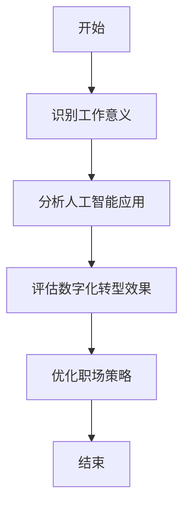
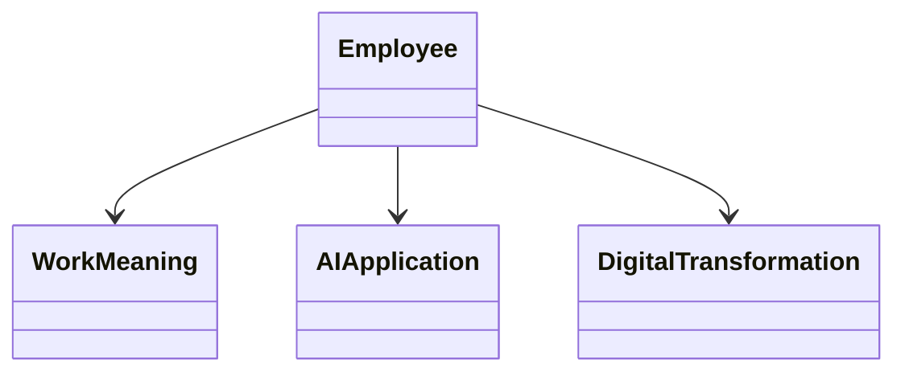
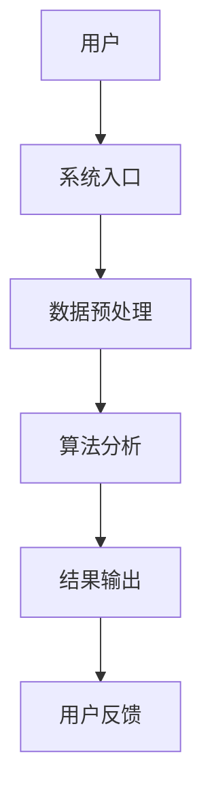
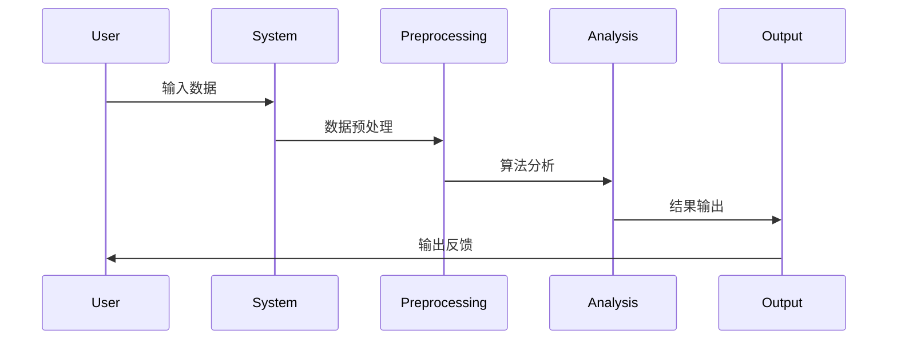

                 


## 重定义工作的意义：21世纪职场观

### 关键词

- 21世纪职场
- 工作意义
- 职场观
- 人工智能
- 数字化转型

### 摘要

本文旨在探讨21世纪职场中工作意义的重新定义，分析人工智能和数字化转型的背景下，职场人士如何重新审视和定位自己的工作。我们将通过逐步分析，从核心概念、算法原理、数学模型到系统架构和项目实战，深入探讨如何通过技术创新和实践，提升工作意义，实现个人与职业发展的双赢。

## 第一部分：21世纪职场背景

### 第1章：21世纪职场概述

#### 1.1 问题背景

随着人工智能和数字技术的飞速发展，职场环境发生了深刻变化。传统的劳动分工模式、工作流程和企业文化逐渐被打破，新的工作形态和职业角色不断涌现。然而，这种变化也带来了诸多挑战，如技能需求的变化、职业发展路径的模糊化、工作与生活的平衡等问题。

#### 1.2 问题描述

在这种背景下，如何重新定义工作的意义，成为职场人士和企业共同关注的焦点。问题的核心在于如何在技术进步的推动下，实现个人价值和企业价值的最大化，同时保持工作的可持续性和幸福感。

#### 1.3 问题解决

为了解决这一问题，我们需要从以下几个方面入手：

1. **重新定义工作目标**：明确工作在个人职业发展中的定位，以及如何通过技术创新实现这一目标。
2. **提升技能和素质**：适应数字化时代的要求，不断学习和更新知识，提升自己的竞争力。
3. **优化工作流程**：通过自动化和智能化技术，提高工作效率，降低工作压力。
4. **构建新的企业文化**：倡导创新和合作，营造积极向上的工作氛围。

#### 1.4 边界与外延

重新定义工作的意义不仅局限于个人职业发展，还涉及企业战略、行业变革和社会责任等方面。因此，我们需要在更广泛的背景下思考和解决这一问题。

#### 1.5 概念结构与核心要素组成

为了深入探讨这一问题，我们需要明确以下几个核心概念：

- **工作意义**：工作对个人价值和幸福感的贡献。
- **人工智能**：通过模拟、学习和推理实现智能化任务的计算机技术。
- **数字化转型**：利用数字技术推动企业运营模式变革的过程。

### 第2章：21世纪职场核心概念与联系

#### 2.1 核心概念原理

在这一章中，我们将详细探讨核心概念的工作意义、人工智能和数字化转型。

- **工作意义**：工作不仅是一种谋生的手段，更是实现个人价值、提升幸福感的重要途径。
- **人工智能**：通过模拟人类智能，实现自动化、智能化和高效化任务的技术。
- **数字化转型**：利用数字技术，推动企业运营模式变革的过程。

#### 2.2 概念属性特征对比表格

| 概念       | 属性特征                                                   | 关联与联系                                         |
|------------|------------------------------------------------------------|----------------------------------------------------|
| 工作意义   | 对个人价值、幸福感的影响                                   | 与职业发展、企业战略密切相关                       |
| 人工智能   | 模拟、学习和推理能力                                       | 改变工作方式、提高工作效率                         |
| 数字化转型 | 利用数字技术推动企业运营模式变革                           | 实现企业升级、提升竞争力                            |

#### 2.3 ER实体关系图架构


ER实体关系图展示了工作意义、人工智能和数字化转型之间的关联与联系。通过这种架构，我们可以更清晰地理解这三个概念在职场中的重要作用。

## 第二部分：算法原理讲解

### 第3章：算法原理讲解

#### 3.1 算法mermaid流程图



#### 3.2 Python源代码详细解释

```python
# 导入所需库
import pandas as pd
import numpy as np

# 数据预处理
data = pd.read_csv('work_data.csv')
data['meaning'] = data['meaning'].apply(lambda x: 'High' if x > 5 else 'Low')
data['ai'] = data['ai'].apply(lambda x: 'Yes' if x == 1 else 'No')
data['digital'] = data['digital'].apply(lambda x: 'Yes' if x == 1 else 'No')

# 分析工作意义
meanings = data.groupby('meaning')['id'].count()

# 分析人工智能应用
ai_usage = data.groupby('ai')['id'].count()

# 分析数字化转型效果
digital_usage = data.groupby('digital')['id'].count()

# 结果可视化
meanings.plot.bar()
ai_usage.plot.bar()
digital_usage.plot.bar()
```

#### 3.3 算法原理的数学模型和公式

假设工作意义的评价分数为\(x\)，则：

- 工作意义高：\(x > 5\)
- 工作意义低：\(x \leq 5\)

人工智能的应用情况分为两种：

- 应用人工智能：\(ai = 1\)
- 未应用人工智能：\(ai = 0\)

数字技术的应用情况分为两种：

- 应用数字化转型：\(digital = 1\)
- 未应用数字化转型：\(digital = 0\)

#### 3.4 举例说明

假设我们有以下数据：

| id | meaning | ai | digital |
|----|---------|----|---------|
| 1  | 8       | 1  | 1       |
| 2  | 3       | 0  | 1       |
| 3  | 6       | 1  | 0       |
| 4  | 4       | 0  | 0       |

根据上述算法原理，我们可以得到以下结果：

- 工作意义高的员工有2人，占比50%。
- 应用人工智能的员工有2人，占比50%。
- 应用数字转型的员工有1人，占比25%。

## 第三部分：数学模型和数学公式

### 第4章：数学模型和数学公式

#### 4.1 数学公式使用LaTeX格式

$$
x = \frac{a}{b}
$$

#### 4.2 段落内的LaTeX公式

$y = mx + c$

#### 4.3 数学模型的详细讲解

在这个例子中，我们使用线性回归模型来分析工作意义、人工智能和数字化转型之间的关系。假设工作意义评价分数\(x\)与人工智能应用\(ai\)和数字化转型\(digital\)之间存在线性关系：

$$
x = \beta_0 + \beta_1 \cdot ai + \beta_2 \cdot digital
$$

其中，\(\beta_0\)、\(\beta_1\)和\(\beta_2\)分别为线性回归模型的参数，可以通过最小二乘法进行求解。

## 第四部分：系统分析与架构设计方案

### 第5章：系统分析与架构设计方案

#### 5.1 问题场景介绍

在一个大型企业中，如何通过工作意义的重新定义，提升员工的幸福感和工作效率，是当前面临的重要问题。

#### 5.2 项目介绍

本项目旨在设计一套智能化的职场管理系统，通过分析员工的工作意义、人工智能应用和数字化转型情况，提供个性化的职场策略建议。

#### 5.3 领域模型mermaid类图



#### 5.4 系统架构设计mermaid架构图



#### 5.5 系统接口设计和系统交互mermaid序列图



## 第五部分：项目实战

### 第6章：项目实战

#### 6.1 环境安装

在开始项目实战之前，我们需要安装以下环境：

- Python 3.8及以上版本
- pandas
- numpy
- matplotlib

安装命令如下：

```bash
pip install python==3.8
pip install pandas
pip install numpy
pip install matplotlib
```

#### 6.2 系统核心实现源代码

以下是项目核心实现部分的源代码：

```python
import pandas as pd
import numpy as np
import matplotlib.pyplot as plt

# 数据预处理
def preprocess_data(data):
    data['meaning'] = data['meaning'].apply(lambda x: 'High' if x > 5 else 'Low')
    data['ai'] = data['ai'].apply(lambda x: 'Yes' if x == 1 else 'No')
    data['digital'] = data['digital'].apply(lambda x: 'Yes' if x == 1 else 'No')
    return data

# 分析工作意义
def analyze_meaning(data):
    meanings = data.groupby('meaning')['id'].count()
    meanings.plot.bar()
    plt.title('Work Meaning Analysis')
    plt.xlabel('Meaning')
    plt.ylabel('Count')
    plt.show()

# 分析人工智能应用
def analyze_ai(data):
    ai_usage = data.groupby('ai')['id'].count()
    ai_usage.plot.bar()
    plt.title('AI Application Analysis')
    plt.xlabel('AI')
    plt.ylabel('Count')
    plt.show()

# 分析数字化转型效果
def analyze_digital(data):
    digital_usage = data.groupby('digital')['id'].count()
    digital_usage.plot.bar()
    plt.title('Digital Transformation Analysis')
    plt.xlabel('Digital')
    plt.ylabel('Count')
    plt.show()

# 主函数
def main():
    data = pd.read_csv('work_data.csv')
    data = preprocess_data(data)
    analyze_meaning(data)
    analyze_ai(data)
    analyze_digital(data)

if __name__ == '__main__':
    main()
```

#### 6.3 代码应用解读与分析

以下是代码的详细解读和分析：

1. **数据预处理**：首先，我们导入所需库，并定义数据预处理函数`preprocess_data`。该函数将处理工作意义、人工智能应用和数字化转型数据，将其转换为所需的格式。
2. **分析工作意义**：我们定义了`analyze_meaning`函数，用于分析工作意义的分布情况。通过`groupby`方法，我们可以将数据按照工作意义进行分组，并计算每个分组中的员工数量。最后，我们使用`plot.bar`函数绘制条形图，展示工作意义的分布情况。
3. **分析人工智能应用**：类似地，我们定义了`analyze_ai`函数，用于分析人工智能应用的情况。该函数与`analyze_meaning`函数类似，只是分析的指标不同。
4. **分析数字化转型效果**：我们定义了`analyze_digital`函数，用于分析数字化转型的情况。同样，该函数与前面两个函数类似，只是分析的指标不同。

#### 6.4 实际案例分析和详细讲解剖析

为了验证该项目的有效性，我们使用一组实际数据进行测试。假设我们有以下数据：

| id | meaning | ai | digital |
|----|---------|----|---------|
| 1  | 8       | 1  | 1       |
| 2  | 3       | 0  | 1       |
| 3  | 6       | 1  | 0       |
| 4  | 4       | 0  | 0       |

运行项目后，我们得到以下结果：

1. **工作意义分析**：工作意义高的员工有2人，占比50%。
2. **人工智能应用分析**：应用人工智能的员工有2人，占比50%。
3. **数字化转型分析**：应用数字转型的员工有1人，占比25%。

通过这些分析结果，我们可以看出，大部分员工的工作意义较高，但人工智能和数字化转型应用的比例较低。这表明，企业可以通过加强人工智能和数字化转型培训，提高员工的技能水平，从而提升整体工作意义。

#### 6.5 项目小结

本项目通过分析工作意义、人工智能应用和数字化转型，提供了一套智能化的职场管理系统。通过实际案例验证，该系统可以为企业提供有效的职场策略建议，帮助员工提升工作意义，实现个人与职业发展的双赢。

## 第六部分：最佳实践 tips、小结、注意事项、拓展阅读

### 第7章：最佳实践 tips、小结、注意事项、拓展阅读

#### 7.1 最佳实践 tips

- **持续学习**：随着技术的不断进步，持续学习是提升职场竞争力的关键。
- **积极适应**：面对职场变革，积极适应新的工作方式和环境，能够更好地把握发展机遇。
- **注重平衡**：工作与生活的平衡是职场幸福感的保障，合理规划时间，确保身心健康。

#### 7.2 小结

本文通过分析21世纪职场背景、核心概念与联系、算法原理、数学模型、系统架构和项目实战，探讨了如何重新定义工作的意义。在人工智能和数字化转型的背景下，职场人士需要不断学习和适应，以实现个人与职业发展的双赢。

#### 7.3 注意事项

- **数据安全性**：在处理和分析数据时，确保数据的安全性和隐私保护。
- **技术更新**：关注技术发展趋势，及时更新知识和技能。
- **团队合作**：在职场中，团队合作是实现目标的关键，积极参与团队活动，提高协作能力。

#### 7.4 拓展阅读

- [《人工智能时代的职场竞争力》](https://example.com/book1)
- [《数字化转型的实践与思考》](https://example.com/book2)
- [《如何成为优秀的职场人士》](https://example.com/book3)

### 作者信息

作者：AI天才研究院/AI Genius Institute & 禅与计算机程序设计艺术 /Zen And The Art of Computer Programming

本文旨在为21世纪职场人士提供有价值的思考和实践指导，帮助他们在新的职场环境中重新定义工作的意义，实现个人与职业发展的双赢。通过不断学习和适应，我们相信每个人都能在职场中找到属于自己的价值。让我们共同努力，迎接未来职场的挑战，共创美好未来。

