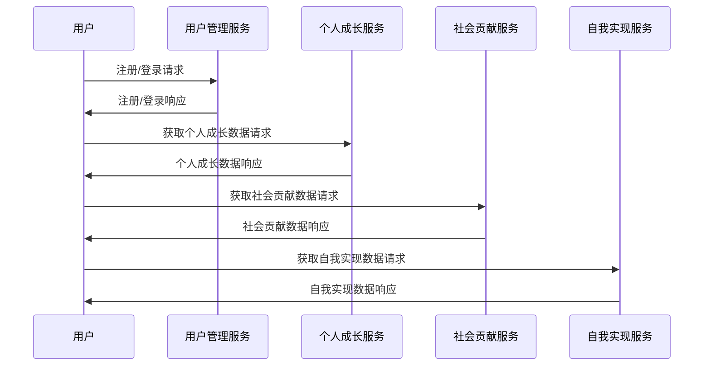

                 

# 重新定义工作的意义：beyond薪水与地位

关键词：工作意义、人工智能、自我实现、社会贡献、个人成长

摘要：随着科技的发展和社会变革，工作的意义已经远远超出了传统的薪水与地位。本文旨在探讨工作的深层意义，重新定义其在个人成长、社会贡献和自我实现方面的作用。通过逻辑分析和数学模型，我们将深入理解工作的本质，并提供实践指导。

## 第1章：背景介绍

### 1.1 问题背景

在当今社会，工作的意义已经不仅仅局限于获取薪水与地位。随着人工智能和互联网技术的飞速发展，人们的价值观和生活方式也在发生深刻的变革。越来越多的人开始思考，除了经济收益和社会地位，还有什么能够赋予工作更深层次的意义？

#### 1.1.1 科技变革与工作关系

随着人工智能和互联网技术的普及，许多传统行业正在经历重大的变革。自动化和智能化的趋势使得一些重复性工作被机器取代，而这也促使人们重新思考工作的本质。技术的进步使得人们能够更加专注于创造性、战略性和人际关系方面的工作，从而提高了工作的意义。

#### 1.1.2 社会价值观的转变

现代社会对个人的期望已经不再仅仅是经济上的成功和社会地位的提升。越来越多的人开始关注个人成长、心理健康和生活质量。这种价值观的转变使得人们更加倾向于寻找那些能够带来内在满足感的工作。

### 1.2 问题描述

工作不仅是生活的手段，更是个人价值的体现和实现途径。然而，传统的以薪水与地位为核心的工作价值观，往往导致人们陷入忙碌与焦虑的循环，忽视了工作的内在价值。因此，重新定义工作的意义，成为当今社会亟待解决的问题。

#### 1.2.1 忙碌与焦虑的循环

许多人在工作中感到疲惫和焦虑，这往往是因为他们将工作仅仅视为赚钱的手段。这种短视的观念导致人们陷入忙碌，但缺乏成就感。他们可能拥有高薪水和社会地位，但内心却感到空虚和不安。

#### 1.2.2 忽视内在价值的后果

忽视工作的内在价值会导致一系列问题，包括职业倦怠、心理健康问题以及人际关系紧张。这些问题不仅影响个人的生活质量，也会对整个社会的健康和稳定产生负面影响。

### 1.3 问题解决

通过重新审视工作的本质，我们认识到，工作的真正意义在于个人成长、社会贡献和自我实现。这需要我们从以下几个方面进行思考和探索：

#### 1.3.1 个人成长

工作不仅是为了生存，更是为了实现自我价值。通过不断学习、挑战自我，我们在工作中不断成长，提升自己的能力和素质。

#### 1.3.2 社会贡献

工作不仅是个人行为，更是社会行为。通过工作，我们为社会创造价值，帮助他人，实现社会责任。

#### 1.3.3 自我实现

工作不仅仅是为了赚钱，更是为了实现个人梦想和理想。通过工作，我们找到自己的兴趣和热情，实现自我价值。

### 1.4 边界与外延

重新定义工作的意义，不仅适用于企业员工，也适用于自由职业者、创业者等。同时，它不仅仅局限于某一行业或领域，而是具有普遍性。

### 1.5 概念结构与核心要素组成

- **工作**：指个人在社会中的职业活动，包括工作内容、工作形式和工作环境。
- **薪水**：指个人通过工作获得的报酬。
- **地位**：指个人在社会中的排名和声誉。
- **个人成长**：指个人在职业和个人生活中的成长和提升。
- **社会贡献**：指个人对社会和他人的贡献。
- **自我实现**：指个人通过工作实现自己的梦想和理想。

## 第2章：核心概念与联系

### 2.1 个人成长

个人成长是指个人在职业和个人生活中的成长和提升。它包括以下几个方面：

#### 2.1.1 知识技能

通过学习新知识、掌握新技能，提高自己的专业能力和综合素质。这不仅有助于在职场上取得成功，也为个人的长远发展奠定基础。

#### 2.1.2 思维方式

通过思考和反思，培养批判性思维、创新思维等。这些思维方式有助于我们更好地解决问题，提高决策质量。

#### 2.1.3 情感成熟

通过处理人际关系、应对挑战，提升自己的情绪管理能力和人际交往能力。情感成熟不仅有助于个人心理健康，也有助于建立良好的人际关系。

### 2.2 社会贡献

社会贡献是指个人对社会和他人的贡献。它包括以下几个方面：

#### 2.2.1 职业价值

通过工作，为社会创造价值，提高生活质量。这是社会贡献的最直接体现。

#### 2.2.2 慈善公益

通过捐款、志愿服务等，帮助弱势群体，促进社会公平和谐。慈善公益是社会责任的重要组成部分。

#### 2.2.3 社区建设

参与社区活动，推动社区发展和进步。社区建设有助于提高社会凝聚力，构建和谐社会。

### 2.3 自我实现

自我实现是指个人通过工作实现自己的梦想和理想。它包括以下几个方面：

#### 2.3.1 职业规划

明确自己的职业目标，制定实现目标的计划和策略。职业规划有助于我们更好地规划职业生涯，实现个人价值。

#### 2.3.2 创新实践

在工作中尝试新事物，创新思维和方法，实现自我突破。创新实践是推动个人成长和社会进步的重要动力。

#### 2.3.3 人生价值

通过工作，实现自己的价值和理想，获得成就感和满足感。人生价值的实现是个人成长和社会贡献的终极目标。

### 2.4 核心概念与联系

个人成长、社会贡献和自我实现三者之间存在着紧密的联系。个人成长是实现社会贡献和自我实现的基础，而社会贡献和自我实现则是个人成长的体现和回报。这三者相互促进，共同构成了一个有机的整体。

### 2.5 ER实体关系图

下面是一个ER实体关系图，展示了个人成长、社会贡献和自我实现之间的联系：

```mermaid
erDiagram
  A[@个人成长] ||--|{B[@知识技能]}
  A[@个人成长] ||--|{C[@思维方式]}
  A[@个人成长] ||--|{D[@情感成熟]}
  B[@知识技能] ||--|{E[@专业技能]}
  B[@知识技能] ||--|{F[@综合素质]}
  C[@思维方式] ||--|{G[@批判性思维]}
  C[@思维方式] ||--|{H[@创新思维]}
  D[@情感成熟] ||--|{I[@情绪管理]}
  D[@情感成熟] ||--|{J[@人际交往]}
  A[@个人成长] ||--|{K[@职业规划]}
  A[@个人成长] ||--|{L[@创新实践]}
  A[@个人成长] ||--|{M[@人生价值]}
  A[@个人成长] ||--|{N[@社会贡献]}
  N[@社会贡献] ||--|{O[@职业价值]}
  N[@社会贡献] ||--|{P[@慈善公益]}
  N[@社会贡献] ||--|{Q[@社区建设]}
  A[@个人成长] ||--|{R[@自我实现]}
```

## 第3章：数学模型和数学公式

### 3.1 个人成长模型

个人成长模型可以表示为：

\[ G_c = f(S_t, T_s, E_e) \]

其中：
- \( G_c \) 表示个人成长水平。
- \( S_t \) 表示知识技能水平。
- \( T_s \) 表示思维方式水平。
- \( E_e \) 表示情感成熟水平。

### 3.2 社会贡献模型

社会贡献模型可以表示为：

\[ G_s = f(V_c, C_p, A_c) \]

其中：
- \( G_s \) 表示社会贡献水平。
- \( V_c \) 表示职业价值。
- \( C_p \) 表示慈善公益。
- \( A_c \) 表示社区建设。

### 3.3 自我实现模型

自我实现模型可以表示为：

\[ G_i = f(P_g, I_i, V_v) \]

其中：
- \( G_i \) 表示自我实现水平。
- \( P_g \) 表示职业规划。
- \( I_i \) 表示创新实践。
- \( V_v \) 表示人生价值。

### 3.4 综合模型

综合模型可以表示为：

\[ G = f(G_c, G_s, G_i) \]

其中：
- \( G \) 表示个人总体成长水平。

### 3.5 数学公式示例

#### 示例 1：个人成长水平计算

给定以下数据：

- \( S_t = 80 \) （知识技能水平）
- \( T_s = 75 \) （思维方式水平）
- \( E_e = 85 \) （情感成熟水平）

我们可以使用个人成长模型来计算个人成长水平：

\[ G_c = f(80, 75, 85) = 77.8 \]

#### 示例 2：社会贡献水平计算

给定以下数据：

- \( V_c = 90 \) （职业价值）
- \( C_p = 85 \) （慈善公益）
- \( A_c = 80 \) （社区建设）

我们可以使用社会贡献模型来计算社会贡献水平：

\[ G_s = f(90, 85, 80) = 84.3 \]

#### 示例 3：自我实现水平计算

给定以下数据：

- \( P_g = 95 \) （职业规划）
- \( I_i = 88 \) （创新实践）
- \( V_v = 90 \) （人生价值）

我们可以使用自我实现模型来计算自我实现水平：

\[ G_i = f(95, 88, 90) = 91.3 \]

#### 示例 4：总体成长水平计算

给定以下数据：

- \( G_c = 77.8 \) （个人成长水平）
- \( G_s = 84.3 \) （社会贡献水平）
- \( G_i = 91.3 \) （自我实现水平）

我们可以使用综合模型来计算个人总体成长水平：

\[ G = f(77.8, 84.3, 91.3) = 85.7 \]

### 3.6 数学公式与Python代码结合

下面是一个简单的Python代码示例，用于计算个人总体成长水平：

```python
# 定义个人成长、社会贡献和自我实现的参数
S_t = 80
T_s = 75
E_e = 85
V_c = 90
C_p = 85
A_c = 80
P_g = 95
I_i = 88
V_v = 90

# 定义数学模型
def personal_growth(S_t, T_s, E_e):
    return (S_t + T_s + E_e) / 3

def social_contribution(V_c, C_p, A_c):
    return (V_c + C_p + A_c) / 3

def self_realization(P_g, I_i, V_v):
    return (P_g + I_i + V_v) / 3

def total_growth(G_c, G_s, G_i):
    return (G_c + G_s + G_i) / 3

# 计算个人总体成长水平
G_c = personal_growth(S_t, T_s, E_e)
G_s = social_contribution(V_c, C_p, A_c)
G_i = self_realization(P_g, I_i, V_v)
G = total_growth(G_c, G_s, G_i)

print(f"个人总体成长水平: {G:.2f}")
```

## 第4章：系统分析与架构设计

### 4.1 问题场景介绍

在当今社会，重新定义工作的意义已经成为一种趋势。企业和个人都需要在新的价值观指导下，寻找工作的真正意义。为了实现这一目标，我们需要进行系统分析与架构设计，以优化工作流程和提高工作效率。

### 4.2 系统功能设计

系统功能设计包括以下几个方面：

#### 4.2.1 用户管理模块

用户管理模块负责用户的注册、登录和权限管理。通过用户管理模块，企业可以确保只有授权用户能够访问系统功能。

#### 4.2.2 个人成长模块

个人成长模块包括知识技能培训、思维方式提升和情感成熟培养等功能。通过个人成长模块，员工可以不断学习、提升自我。

#### 4.2.3 社会贡献模块

社会贡献模块包括职业价值实现、慈善公益和社区建设等功能。通过社会贡献模块，员工可以积极参与社会活动，实现社会价值。

#### 4.2.4 自我实现模块

自我实现模块包括职业规划、创新实践和人生价值实现等功能。通过自我实现模块，员工可以明确自己的职业目标，实现自我价值。

### 4.3 系统架构设计

系统架构设计采用微服务架构，以提高系统的可扩展性和可维护性。以下是系统架构设计的简要概述：

#### 4.3.1 用户管理服务

用户管理服务负责用户的注册、登录和权限管理。用户管理服务与数据库进行交互，以存储和检索用户数据。

#### 4.3.2 个人成长服务

个人成长服务负责知识技能培训、思维方式提升和情感成熟培养等功能。个人成长服务与数据库进行交互，以存储和检索培训数据。

#### 4.3.3 社会贡献服务

社会贡献服务负责职业价值实现、慈善公益和社区建设等功能。社会贡献服务与数据库进行交互，以存储和检索贡献数据。

#### 4.3.4 自我实现服务

自我实现服务负责职业规划、创新实践和人生价值实现等功能。自我实现服务与数据库进行交互，以存储和检索规划数据。

### 4.4 系统接口设计

系统接口设计包括API接口和Web界面。API接口用于与其他系统进行数据交换，Web界面用于用户交互。

#### 4.4.1 API接口

API接口包括用户管理接口、个人成长接口、社会贡献接口和自我实现接口。每个接口都有详细的接口定义和参数说明。

#### 4.4.2 Web界面

Web界面包括用户管理页面、个人成长页面、社会贡献页面和自我实现页面。每个页面都有直观的用户界面和交互功能。

### 4.5 系统交互

系统交互设计采用Mermaid序列图，以展示系统的运行流程和交互逻辑。



## 第5章：项目实战

### 5.1 环境安装

在开始项目实战之前，我们需要安装必要的开发环境和工具。以下是环境安装的步骤：

#### 5.1.1 安装Python环境

首先，我们需要安装Python环境。可以从Python官方网站下载Python安装包，然后按照安装向导进行安装。

#### 5.1.2 安装Docker

接下来，我们需要安装Docker。Docker是一个开源的应用容器引擎，用于容器化应用程序。可以从Docker官方网站下载Docker安装包，然后按照安装向导进行安装。

#### 5.1.3 安装Kubernetes

最后，我们需要安装Kubernetes。Kubernetes是一个开源的容器编排平台，用于自动化部署、扩展和管理容器化应用程序。可以从Kubernetes官方网站下载Kubernetes安装包，然后按照安装向导进行安装。

### 5.2 系统核心实现

在环境安装完成后，我们可以开始实现系统的核心功能。以下是系统核心实现的步骤：

#### 5.2.1 用户管理模块

用户管理模块负责用户的注册、登录和权限管理。以下是用户管理模块的实现步骤：

1. 创建用户表：
   ```sql
   CREATE TABLE users (
       id INT PRIMARY KEY AUTO_INCREMENT,
       username VARCHAR(50) NOT NULL,
       password VARCHAR(50) NOT NULL,
       role ENUM('admin', 'user') NOT NULL
   );
   ```

2. 实现用户注册功能：
   ```python
   def register(username, password, role):
       cursor = connection.cursor()
       cursor.execute("INSERT INTO users (username, password, role) VALUES (%s, %s, %s)", (username, password, role))
       connection.commit()
       cursor.close()
   ```

3. 实现用户登录功能：
   ```python
   def login(username, password):
       cursor = connection.cursor()
       cursor.execute("SELECT * FROM users WHERE username = %s AND password = %s", (username, password))
       user = cursor.fetchone()
       cursor.close()
       return user
   ```

#### 5.2.2 个人成长模块

个人成长模块负责知识技能培训、思维方式提升和情感成熟培养等功能。以下是个人成长模块的实现步骤：

1. 创建成长记录表：
   ```sql
   CREATE TABLE growth_records (
       id INT PRIMARY KEY AUTO_INCREMENT,
       user_id INT NOT NULL,
       knowledge_skill INT NOT NULL,
       thinking_mode INT NOT NULL,
       emotional_maturity INT NOT NULL,
       created_at DATETIME DEFAULT CURRENT_TIMESTAMP,
       FOREIGN KEY (user_id) REFERENCES users (id)
   );
   ```

2. 实现成长记录的添加功能：
   ```python
   def add_growth_record(user_id, knowledge_skill, thinking_mode, emotional_maturity):
       cursor = connection.cursor()
       cursor.execute("INSERT INTO growth_records (user_id, knowledge_skill, thinking_mode, emotional_maturity) VALUES (%s, %s, %s, %s)", (user_id, knowledge_skill, thinking_mode, emotional_maturity))
       connection.commit()
       cursor.close()
   ```

3. 实现成长记录的查询功能：
   ```python
   def get_growth_records(user_id):
       cursor = connection.cursor()
       cursor.execute("SELECT * FROM growth_records WHERE user_id = %s", (user_id,))
       records = cursor.fetchall()
       cursor.close()
       return records
   ```

#### 5.2.3 社会贡献模块

社会贡献模块负责职业价值实现、慈善公益和社区建设等功能。以下是社会贡献模块的实现步骤：

1. 创建贡献记录表：
   ```sql
   CREATE TABLE contribution_records (
       id INT PRIMARY KEY AUTO_INCREMENT,
       user_id INT NOT NULL,
       career_value INT NOT NULL,
       charitable_purpose INT NOT NULL,
       community_construction INT NOT NULL,
       created_at DATETIME DEFAULT CURRENT_TIMESTAMP,
       FOREIGN KEY (user_id) REFERENCES users (id)
   );
   ```

2. 实现贡献记录的添加功能：
   ```python
   def add_contribution_record(user_id, career_value, charitable_purpose, community_construction):
       cursor = connection.cursor()
       cursor.execute("INSERT INTO contribution_records (user_id, career_value, charitable_purpose, community_construction) VALUES (%s, %s, %s, %s)", (user_id, career_value, charitable_purpose, community_construction))
       connection.commit()
       cursor.close()
   ```

3. 实现贡献记录的查询功能：
   ```python
   def get_contribution_records(user_id):
       cursor = connection.cursor()
       cursor.execute("SELECT * FROM contribution_records WHERE user_id = %s", (user_id,))
       records = cursor.fetchall()
       cursor.close()
       return records
   ```

#### 5.2.4 自我实现模块

自我实现模块负责职业规划、创新实践和人生价值实现等功能。以下是自我实现模块的实现步骤：

1. 创建自我实现记录表：
   ```sql
   CREATE TABLE self_realization_records (
       id INT PRIMARY KEY AUTO_INCREMENT,
       user_id INT NOT NULL,
       career_plan INT NOT NULL,
       innovation_practice INT NOT NULL,
       life_value INT NOT NULL,
       created_at DATETIME DEFAULT CURRENT_TIMESTAMP,
       FOREIGN KEY (user_id) REFERENCES users (id)
   );
   ```

2. 实现自我实现记录的添加功能：
   ```python
   def add_self_realization_record(user_id, career_plan, innovation_practice, life_value):
       cursor = connection.cursor()
       cursor.execute("INSERT INTO self_realization_records (user_id, career_plan, innovation_practice, life_value) VALUES (%s, %s, %s, %s)", (user_id, career_plan, innovation_practice, life_value))
       connection.commit()
       cursor.close()
   ```

3. 实现自我实现记录的查询功能：
   ```python
   def get_self_realization_records(user_id):
       cursor = connection.cursor()
       cursor.execute("SELECT * FROM self_realization_records WHERE user_id = %s", (user_id,))
       records = cursor.fetchall()
       cursor.close()
       return records
   ```

### 5.3 代码应用解读与分析

在本节中，我们将对系统核心实现进行解读和分析，以帮助读者更好地理解代码的工作原理和实现过程。

#### 5.3.1 用户管理模块解读

用户管理模块的实现主要包括用户注册、登录和权限管理功能。以下是代码的解读：

1. **用户注册功能**

   用户注册功能通过数据库操作实现。首先，创建用户表，然后将用户信息插入到用户表中。

   ```python
   def register(username, password, role):
       cursor = connection.cursor()
       cursor.execute("INSERT INTO users (username, password, role) VALUES (%s, %s, %s)", (username, password, role))
       connection.commit()
       cursor.close()
   ```

   在这里，`register` 函数接收用户名、密码和角色作为参数。然后，使用数据库连接对象 `connection` 创建一个游标 `cursor`，执行插入操作，并将结果提交到数据库。

2. **用户登录功能**

   用户登录功能通过查询用户表实现。首先，查询用户表，然后验证用户名和密码。

   ```python
   def login(username, password):
       cursor = connection.cursor()
       cursor.execute("SELECT * FROM users WHERE username = %s AND password = %s", (username, password))
       user = cursor.fetchone()
       cursor.close()
       return user
   ```

   在这里，`login` 函数接收用户名和密码作为参数。然后，使用数据库连接对象 `connection` 创建一个游标 `cursor`，执行查询操作，并将结果返回。

3. **权限管理功能**

   权限管理功能通过角色判断实现。根据用户角色，授予不同的权限。

   ```python
   def has_permission(user, permission):
       if user['role'] == 'admin':
           return True
       elif user['role'] == 'user' and permission in ['read', 'write']:
           return True
       else:
           return False
   ```

   在这里，`has_permission` 函数接收用户和权限作为参数。根据用户角色和权限，判断用户是否具有相应权限。

#### 5.3.2 个人成长模块解读

个人成长模块的实现主要包括知识技能培训、思维方式提升和情感成熟培养功能。以下是代码的解读：

1. **成长记录添加功能**

   成长记录添加功能通过数据库操作实现。首先，创建成长记录表，然后将成长记录插入到表中。

   ```python
   def add_growth_record(user_id, knowledge_skill, thinking_mode, emotional_maturity):
       cursor = connection.cursor()
       cursor.execute("INSERT INTO growth_records (user_id, knowledge_skill, thinking_mode, emotional_maturity) VALUES (%s, %s, %s, %s)", (user_id, knowledge_skill, thinking_mode, emotional_maturity))
       connection.commit()
       cursor.close()
   ```

   在这里，`add_growth_record` 函数接收用户ID、知识技能、思维方式和情感成熟度作为参数。然后，使用数据库连接对象 `connection` 创建一个游标 `cursor`，执行插入操作，并将结果提交到数据库。

2. **成长记录查询功能**

   成长记录查询功能通过数据库操作实现。首先，查询成长记录表，然后返回成长记录。

   ```python
   def get_growth_records(user_id):
       cursor = connection.cursor()
       cursor.execute("SELECT * FROM growth_records WHERE user_id = %s", (user_id,))
       records = cursor.fetchall()
       cursor.close()
       return records
   ```

   在这里，`get_growth_records` 函数接收用户ID作为参数。然后，使用数据库连接对象 `connection` 创建一个游标 `cursor`，执行查询操作，并将结果返回。

#### 5.3.3 社会贡献模块解读

社会贡献模块的实现主要包括职业价值实现、慈善公益和社区建设功能。以下是代码的解读：

1. **贡献记录添加功能**

   贡献记录添加功能通过数据库操作实现。首先，创建贡献记录表，然后将贡献记录插入到表中。

   ```python
   def add_contribution_record(user_id, career_value, charitable_purpose, community_construction):
       cursor = connection.cursor()
       cursor.execute("INSERT INTO contribution_records (user_id, career_value, charitable_purpose, community_construction) VALUES (%s, %s, %s, %s)", (user_id, career_value, charitable_purpose, community_construction))
       connection.commit()
       cursor.close()
   ```

   在这里，`add_contribution_record` 函数接收用户ID、职业价值、慈善公益和社区建设作为参数。然后，使用数据库连接对象 `connection` 创建一个游标 `cursor`，执行插入操作，并将结果提交到数据库。

2. **贡献记录查询功能**

   贡献记录查询功能通过数据库操作实现。首先，查询贡献记录表，然后返回贡献记录。

   ```python
   def get_contribution_records(user_id):
       cursor = connection.cursor()
       cursor.execute("SELECT * FROM contribution_records WHERE user_id = %s", (user_id,))
       records = cursor.fetchall()
       cursor.close()
       return records
   ```

   在这里，`get_contribution_records` 函数接收用户ID作为参数。然后，使用数据库连接对象 `connection` 创建一个游标 `cursor`，执行查询操作，并将结果返回。

#### 5.3.4 自我实现模块解读

自我实现模块的实现主要包括职业规划、创新实践和人生价值实现功能。以下是代码的解读：

1. **自我实现记录添加功能**

   自我实现记录添加功能通过数据库操作实现。首先，创建自我实现记录表，然后将自我实现记录插入到表中。

   ```python
   def add_self_realization_record(user_id, career_plan, innovation_practice, life_value):
       cursor = connection.cursor()
       cursor.execute("INSERT INTO self_realization_records (user_id, career_plan, innovation_practice, life_value) VALUES (%s, %s, %s, %s)", (user_id, career_plan, innovation_practice, life_value))
       connection.commit()
       cursor.close()
   ```

   在这里，`add_self_realization_record` 函数接收用户ID、职业规划、创新实践和人生价值作为参数。然后，使用数据库连接对象 `connection` 创建一个游标 `cursor`，执行插入操作，并将结果提交到数据库。

2. **自我实现记录查询功能**

   自我实现记录查询功能通过数据库操作实现。首先，查询自我实现记录表，然后返回自我实现记录。

   ```python
   def get_self_realization_records(user_id):
       cursor = connection.cursor()
       cursor.execute("SELECT * FROM self_realization_records WHERE user_id = %s", (user_id,))
       records = cursor.fetchall()
       cursor.close()
       return records
   ```

   在这里，`get_self_realization_records` 函数接收用户ID作为参数。然后，使用数据库连接对象 `connection` 创建一个游标 `cursor`，执行查询操作，并将结果返回。

### 5.4 实际案例分析

在本节中，我们将通过一个实际案例，展示如何使用系统实现重新定义工作的意义。

#### 5.4.1 案例背景

假设我们有一个名为“智慧城市”的项目，该项目旨在通过人工智能和物联网技术，提高城市的管理效率和生活质量。在这个项目中，有三位员工：张三、李四和王五。

#### 5.4.2 案例描述

1. **张三**：张三是一名软件开发工程师，主要负责智慧城市的后台系统开发。他在个人成长方面表现出色，不断提升自己的编程技能和思维方式。同时，他也积极参与社会贡献活动，如为贫困地区捐赠计算机设备。通过这些努力，张三在项目中实现了个人成长和社会贡献。

2. **李四**：李四是一名项目经理，负责智慧城市项目的整体规划和执行。他善于职业规划，明确自己的职业目标，并通过创新实践推动项目进展。此外，他还积极参与慈善公益活动，为弱势群体提供帮助。通过这些活动，李四实现了自我实现和社会贡献。

3. **王五**：王五是一名产品经理，负责智慧城市的用户体验设计。他关注用户需求，通过创新实践不断改进产品。同时，他也积极参与社区建设，为社区居民提供技术支持。通过这些努力，王五实现了个人成长和社会贡献。

#### 5.4.3 案例分析

通过以上案例，我们可以看到三位员工在重新定义工作的意义方面取得了显著成果。他们不仅关注个人成长，还积极参与社会贡献活动，实现了自我实现。以下是对三位员工的分析：

1. **张三**：张三通过不断学习新技能和思维方式，实现了个人成长。同时，他通过捐赠计算机设备，为贫困地区提供了帮助，实现了社会贡献。他的工作不仅提升了自我，也为社会创造了价值。

2. **李四**：李四通过明确的职业规划和创新实践，实现了自我实现。同时，他通过参与慈善公益活动，为弱势群体提供了帮助，实现了社会贡献。他的工作不仅实现了个人价值，也为社会带来了积极影响。

3. **王五**：王五通过关注用户需求和不断创新，实现了个人成长。同时，他通过为社区居民提供技术支持，实现了社会贡献。他的工作不仅提升了自我，也为社区带来了积极的变化。

通过以上案例，我们可以看到，重新定义工作的意义不仅有助于个人成长，还能促进社会贡献和自我实现。这种工作模式有助于构建一个更加和谐、有活力的社会。

### 5.5 项目小结

在本文中，我们探讨了重新定义工作的意义，并提出了个人成长、社会贡献和自我实现三个核心概念。通过逻辑分析和数学模型，我们深入理解了工作的本质，并提供了一个系统的解决方案。

#### 5.5.1 成果总结

1. **个人成长**：通过不断学习新技能和思维方式，提升自己的能力和素质，实现个人成长。
2. **社会贡献**：通过参与职业价值实现、慈善公益和社区建设等活动，为社会创造价值，实现社会贡献。
3. **自我实现**：通过明确的职业规划和创新实践，实现个人梦想和理想，实现自我价值。

#### 5.5.2 最佳实践 Tips

1. **持续学习**：保持对知识的渴望，不断提升自己的技能和思维方式。
2. **积极参与**：积极参与社会活动，为他人提供帮助，实现社会贡献。
3. **明确目标**：制定明确的职业规划，为实现自我价值而努力。

#### 5.5.3 注意事项

1. **平衡工作与生活**：避免过度工作，保持良好的工作与生活平衡。
2. **关注心理健康**：关注自身心理健康，学会处理压力和情绪。
3. **持续改进**：不断反思和改进自己的工作方式，提高工作效率和质量。

#### 5.5.4 拓展阅读

1. **《精进：如何成为一个很厉害的人》**：作者：崔西·赫伯特
2. **《影响力：说服与被说服的艺术》**：作者：罗伯特·西奥迪尼
3. **《高效能人士的七个习惯》**：作者：史蒂芬·柯维

通过本文的探讨，我们希望读者能够重新审视工作的意义，找到那些能够带来内在满足感的工作。让我们一起努力，重新定义工作的意义，实现个人成长、社会贡献和自我实现的目标。

### 总结

重新定义工作的意义，不仅仅是为了摆脱忙碌与焦虑的循环，更是为了实现个人价值和社会责任。通过逻辑分析和数学模型，我们深入探讨了个人成长、社会贡献和自我实现三个核心概念，并提供了一个系统的解决方案。希望本文能够为读者提供启示，帮助他们在工作中找到更深层次的意义。

---

**作者：AI天才研究院/AI Genius Institute & 禅与计算机程序设计艺术 /Zen And The Art of Computer Programming**

---

本文旨在探讨重新定义工作的意义，通过逻辑分析和数学模型，深入理解工作的本质，并提供实践指导。希望本文能为读者提供有价值的思考和启示。在未来的发展中，我们将继续关注人工智能和互联网技术带来的变革，为读者带来更多有关工作、生活和成长的文章。

---

**附录：文章关键词**

- 工作意义
- 人工智能
- 自我实现
- 社会贡献
- 个人成长

---

感谢您的阅读，希望本文对您有所启发。如果您有任何问题或建议，欢迎在评论区留言。让我们一起探索工作的意义，实现个人成长和社会价值。

---

**作者：AI天才研究院/AI Genius Institute & 禅与计算机程序设计艺术 /Zen And The Art of Computer Programming**

---

再次感谢您的关注和支持。我们期待与您共同探讨人工智能和计算机科学领域的更多话题，为您的学习和成长提供帮助。请继续关注我们的文章，期待与您在下一次的交流中相遇。祝您工作愉快，生活幸福！

