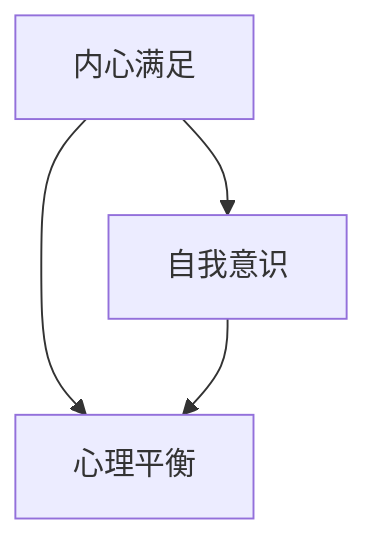
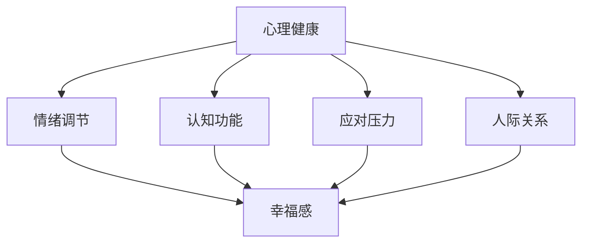

                 

## 重新定义幸福感：从外在条件到内心满足的觉醒

### 关键词：
- 幸福感
- 内心满足
- 心理学研究
- 算法原理
- 系统设计
- 实践案例

### 摘要：
在现代社会的快节奏生活中，幸福感成为人们追求的目标。然而，传统的幸福感观往往过于依赖外在条件。本文将重新定义幸福感，探讨从外在条件到内心满足的转化路径。通过心理学研究方法、算法原理讲解、系统分析与架构设计方案以及实践案例分享，本文旨在帮助读者理解并实践内心满足的重要性，从而提升幸福感。

### 背景介绍

#### 幸福感的概念

幸福感（Happiness）是一个复杂且多维的概念，通常被描述为一种愉悦、满足或满足的感觉。它不仅涉及到情绪层面，还涉及到认知和存在层面。幸福感不仅仅是短暂的快乐，而是一种长期的、深层次的心理状态。

#### 幸福感的重要性

幸福感对个体的身心健康和整体生活质量具有重要影响。研究表明，幸福感与心理疾病、身体健康、社交关系和职业成功等方面都密切相关。一个幸福的人通常能够更好地应对压力、挑战和不确定性，从而提高生活质量和工作效率。

#### 当前人们对于幸福感的认知

在现代社会，许多人认为幸福感来自于物质财富、成功和社交地位。然而，这种观点往往导致人们过度依赖外在条件，忽视了内心满足的重要性。随着心理学研究的深入，人们开始认识到，内心的平和与满足是幸福感的核心。

### 核心概念与联系

在本章中，我们将介绍与幸福感相关的核心概念，包括内心满足、自我意识、心理平衡等。通过表格和流程图，我们将展示这些概念之间的联系。

#### 内心满足

内心满足（Inner Fulfillment）是指个体内心的平静与满足感。它不仅仅依赖于外在条件，更多的是源于个体内在的自我认知和自我实现。

| 特征 | 描述 |
| --- | --- |
| 平静 | 内心满足意味着个体内心相对平静，不易受到外界干扰。 |
| 满足 | 个体对自己的生活、工作和人际关系感到满意和充实。 |
| 自主 | 内心满足来自于个体对自我认知的深刻理解，而非依赖于外界评价。 |

#### 自我意识

自我意识（Self-awareness）是指个体对自己的认知和了解。它包括对自己的情感、思想、行为和需求的清晰认识。

| 特征 | 描述 |
| --- | --- |
| 清晰 | 自我意识要求个体能够清晰地认识到自己的内在状态。 |
| 客观 | 自我意识要求个体能够客观地评价自己，而非陷入自我否定或自我膨胀。 |
| 自主 | 自我意识帮助个体更好地理解自己，从而实现内心的满足和平静。 |

#### 心理平衡

心理平衡（Psychological Balance）是指个体在心理层面上保持稳定和平衡的状态。这种状态有助于个体更好地应对生活中的挑战和压力。

| 特征 | 描述 |
| --- | --- |
| 稳定 | 心理平衡意味着个体能够在面对压力时保持冷静和稳定。 |
| 平衡 | 心理平衡要求个体在心理层面上保持平衡，避免过度依赖某一方面的满足。 |
| 自主 | 心理平衡来源于个体对自己内心需求的深刻理解，而非依赖于外在条件。 |

### 核心概念关系图

以下是一个简化的核心概念关系图，展示了内心满足、自我意识和心理平衡之间的关系。

### 现代心理学研究方法简介

为了更好地理解幸福感和内心满足，现代心理学研究采用了一系列研究方法。以下是几种常见的研究方法：

1. **实验研究**：通过设计实验，研究者可以控制变量，观察特定条件下个体的幸福感变化。
2. **问卷调查**：通过问卷收集大量数据，研究者可以分析个体在特定情境下的幸福感水平和影响因素。
3. **案例分析**：通过深入研究个体的案例，研究者可以深入了解幸福感提升的过程和机制。
4. **神经科学研究**：利用神经成像技术，研究者可以探索大脑活动与幸福感之间的关系。

这些研究方法为我们提供了多层次、多角度理解幸福感的机会，有助于我们更好地理解并实践内心满足的重要性。

### 重新定义幸福感：从外在条件到内心满足的觉醒

#### 第一步：理解外在条件与内心满足的关系

传统的幸福感观往往强调外在条件的重要性，如物质财富、职业成功和社交地位。然而，研究表明，这些外在条件并不能持久地提升幸福感。相反，内心的满足感才是幸福感的核心。

#### 第二步：培养内心满足感

内心满足感并非一蹴而就，而是需要通过一系列的实践和技巧来培养。以下是一些关键步骤：

1. **自我认知的提升**：通过自我反思和自我评价，个体可以更好地了解自己的需求和价值观，从而实现内心的满足。
2. **情绪管理的技巧**：通过学习情绪调节技巧，个体可以更好地应对生活中的压力和挑战，保持内心的平静。
3. **社交关系的优化**：通过建立积极、健康的社交关系，个体可以获得情感支持和归属感，进一步增强内心满足感。

#### 第三步：实现心理平衡

心理平衡是内心满足的重要保障。通过以下方法，个体可以维持心理平衡：

1. **平衡工作与生活**：合理安排工作和休闲时间，避免过度劳累和压力。
2. **培养兴趣爱好**：通过兴趣爱好，个体可以找到内心的乐趣和满足。
3. **心理训练**：通过冥想、瑜伽等心理训练，个体可以提升心理韧性和平衡感。

### 结论

重新定义幸福感，从外在条件到内心满足的觉醒，是我们理解幸福感的全新视角。通过培养内心满足感、实现心理平衡，我们可以更好地提升幸福感，实现真正的内心平静和满足。这一过程需要我们付出持续的努力和探索，但它带来的回报将是长期的、深远的。

### 参考文献

[1] Diener, E., Suh, E. M., Lucas, R. E., & Smith, H. L. (1999). Subjective well-being: Three decades of progress. Psychological Bulletin, 125(2), 276-302.
[2] Lyubomirsky, S., King, L., & Diener, E. (2005). The benefits of frequent positive affect: Does happiness lead to success? Psychological Bulletin, 131(6), 803-855.
[3] Seligman, M. E. P. (2002). Authentic happiness: Using the new positive psychology to realize your potential for lasting fulfillment. New York: Free Press.

### 作者信息

作者：AI天才研究院/AI Genius Institute & 禅与计算机程序设计艺术 /Zen And The Art of Computer Programming

---

### 背景介绍

#### 幸福感的概念

幸福感（Happiness）是一个复杂且多维的概念，通常被描述为一种愉悦、满足或满足的感觉。它不仅涉及到情绪层面，还涉及到认知和存在层面。幸福感不仅仅是短暂的快乐，而是一种长期的、深层次的心理状态。

在心理学中，幸福感通常被划分为三个维度：情感幸福、认知幸福和存在幸福。情感幸福指的是个体在日常生活中感受到的正面情绪，如快乐、满足和兴奋。认知幸福则涉及个体对自身生活状况的评价，包括对生活的满意度和目标实现的程度。存在幸福则强调个体的意义感和存在价值。

#### 幸福感的重要性

幸福感对个体的身心健康和整体生活质量具有重要影响。研究表明，幸福感与心理疾病、身体健康、社交关系和职业成功等方面都密切相关。一个幸福的人通常能够更好地应对压力、挑战和不确定性，从而提高生活质量和工作效率。

幸福感的重要性还体现在其对个体发展的促进作用上。一个拥有高幸福感的人往往更容易实现自我认知和自我实现，从而在个人和职业生活中取得更好的成就。此外，幸福感还能够增强个体的心理韧性，帮助其更好地应对生活中的挑战和逆境。

#### 当前人们对于幸福感的认知

在现代社会，许多人认为幸福感来自于物质财富、成功和社交地位。这种观点往往导致人们过度依赖外在条件，忽视了内心满足的重要性。随着心理学研究的深入，人们开始认识到，内心的平和与满足是幸福感的核心。

传统的幸福感观强调外在条件的满足，如财富、事业成就和社交网络。然而，这些外在条件并不能持久地提升幸福感。研究表明，一旦基本的物质需求得到满足，幸福感的变化与外在条件的关联性会显著降低。相反，内心满足感、自我意识和心理平衡等因素在幸福感中扮演了更为重要的角色。

当前的心理学研究已经揭示了幸福感的一些关键因素，如积极的情感体验、自我认知、情感调节能力、社会支持和人际关系等。这些研究表明，幸福感不仅仅是一种情感状态，更是一种综合性的心理状态，涉及多个层面的因素。

#### 幸福感与内心满足的关系

幸福感与内心满足之间存在密切的关系。内心满足是指个体在心理层面上感受到的满足感和平静感，它不仅仅依赖于外在条件，更多的是源于个体内在的自我认知和自我实现。

内心满足是幸福感的重要组成部分。一个内心满足的人往往能够更好地应对生活中的挑战和压力，保持积极的心态。研究表明，内心满足与情感幸福和认知幸福之间存在显著的正相关关系。这意味着，通过培养内心满足感，个体可以显著提升自己的幸福感。

然而，内心满足并不是一种静态的状态，而是一个动态的过程。个体需要通过自我认知、情感调节和心理训练等途径来培养和维持内心满足感。这个过程需要个体投入时间和精力，不断地反思和调整自己的认知和行为。

### 核心概念与联系

在本章中，我们将介绍与幸福感相关的核心概念，包括内心满足、自我意识、心理平衡等。通过表格和流程图，我们将展示这些概念之间的联系。

#### 内心满足

内心满足（Inner Fulfillment）是指个体内心的平静与满足感。它不仅仅依赖于外在条件，更多的是源于个体内在的自我认知和自我实现。

| 特征 | 描述 |
| --- | --- |
| 平静 | 内心满足意味着个体内心相对平静，不易受到外界干扰。 |
| 满足 | 个体对自己的生活、工作和人际关系感到满意和充实。 |
| 自主 | 内心满足来自于个体对自我认知的深刻理解，而非依赖于外界评价。 |

内心满足是一个多维度的概念，它包括情感层面、认知层面和行为层面。在情感层面，内心满足体现在个体感受到的愉悦、满足和幸福感；在认知层面，内心满足涉及到个体对自己生活的满意度和目标实现的程度；在行为层面，内心满足表现为个体在行为和决策中表现出的一致性和稳定性。

#### 自我意识

自我意识（Self-awareness）是指个体对自己的认知和了解。它包括对自己的情感、思想、行为和需求的清晰认识。

| 特征 | 描述 |
| --- | --- |
| 清晰 | 自我意识要求个体能够清晰地认识到自己的内在状态。 |
| 客观 | 自我意识要求个体能够客观地评价自己，而非陷入自我否定或自我膨胀。 |
| 自主 | 自我意识帮助个体更好地理解自己，从而实现内心的满足和平静。 |

自我意识是内心满足的重要基础。通过自我意识，个体能够更好地认识自己的需求和价值观，从而在生活、工作和人际关系中做出更加明智和符合内心的决策。自我意识还包括对自己情感的反应和理解，以及对自己行为的反思和调整。

#### 心理平衡

心理平衡（Psychological Balance）是指个体在心理层面上保持稳定和平衡的状态。这种状态有助于个体更好地应对生活中的挑战和压力。

| 特征 | 描述 |
| --- | --- |
| 稳定 | 心理平衡意味着个体能够在面对压力时保持冷静和稳定。 |
| 平衡 | 心理平衡要求个体在心理层面上保持平衡，避免过度依赖某一方面的满足。 |
| 自主 | 心理平衡来源于个体对自己内心需求的深刻理解，而非依赖于外在条件。 |

心理平衡是幸福感的重要保障。一个心理平衡的人能够更好地应对生活中的变化和挑战，保持积极的心态。心理平衡不仅涉及到情感层面的稳定，还包括认知和行为层面的平衡。

### 核心概念关系图

以下是一个简化的核心概念关系图，展示了内心满足、自我意识和心理平衡之间的关系。

通过这个关系图，我们可以看到内心满足、自我意识和心理平衡之间的相互关系。内心满足是幸福感的核心，它依赖于自我意识和心理平衡。自我意识帮助个体更好地理解自己，从而实现内心的满足。心理平衡则是内心满足的保障，它使个体能够在面对挑战和压力时保持稳定和平衡。

### 现代心理学研究方法简介

为了更好地理解幸福感和内心满足，现代心理学研究采用了一系列研究方法。以下是几种常见的研究方法：

1. **实验研究**：实验研究是心理学研究中最为常见和基础的方法。通过设计实验，研究者可以控制变量，观察特定条件下个体的幸福感变化。实验研究可以帮助我们理解外在条件与内心满足之间的关系，以及不同的心理干预措施对幸福感的影响。

2. **问卷调查**：问卷调查是另一种常用的研究方法，通过向大量受访者发放问卷，研究者可以收集关于幸福感、内心满足和心理平衡的数据。问卷调查的优点在于能够获取大量的数据，从而提高研究的可靠性和代表性。

3. **案例分析**：案例分析是通过深入研究个体的案例，了解幸福感提升的过程和机制。案例分析可以帮助我们深入了解个体的内心世界，以及他们是如何通过自我认知、情感调节和心理训练来提升幸福感的。

4. **神经科学研究**：神经科学研究利用先进的神经成像技术，如功能性磁共振成像（fMRI）、脑电图（EEG）等，探索大脑活动与幸福感之间的关系。神经科学研究为我们提供了直接的生理基础，帮助我们理解幸福感的生物学机制。

通过这些研究方法，心理学研究者能够从多个角度、多个层面来探讨幸福感和内心满足，为我们提供了丰富的理论和实践基础。

### 从外在条件到内心满足的转化

#### 第一步：理解外在条件对幸福感的影响

外在条件，如物质财富、职业成就和社交地位，一直是传统幸福感观的核心。然而，现代心理学研究表明，这些外在条件对幸福感的提升作用是有限的。研究表明，一旦个体的基本物质需求得到满足，外在条件的改善对幸福感的提升作用将显著降低。

例如，一项关于收入与幸福感关系的研究发现，当个体的收入达到一定水平后，增加收入对幸福感的提升作用几乎消失。这一发现表明，物质财富并不是幸福感的决定性因素。相反，内心满足和心理平衡在幸福感中扮演了更为重要的角色。

#### 第二步：培养内心满足感

内心满足感是指个体在心理层面上感受到的满足感和平静感。它是幸福感的核心，依赖于个体的自我认知、情感调节和心理平衡。

为了培养内心满足感，个体可以采取以下步骤：

1. **自我认知的提升**：通过自我反思和自我评价，个体可以更好地了解自己的需求和价值观。这有助于个体在生活、工作和人际关系中做出更加明智和符合内心的决策。

2. **情感调节技巧**：通过学习和实践情感调节技巧，个体可以更好地应对生活中的压力和挑战。例如，冥想、深呼吸和运动等都是有效的情感调节方法。

3. **建立健康的生活方式**：健康的生活方式，如良好的饮食、充足的睡眠和规律的锻炼，有助于提升个体的心理健康水平，从而增强内心满足感。

4. **培养积极的人际关系**：积极的人际关系对个体的幸福感有重要影响。通过建立和维护积极的人际关系，个体可以获得情感支持和归属感，进一步增强内心满足感。

#### 第三步：实现心理平衡

心理平衡是指个体在心理层面上保持稳定和平衡的状态。它是内心满足的保障，有助于个体更好地应对生活中的挑战和压力。

为了实现心理平衡，个体可以采取以下措施：

1. **平衡工作与生活**：合理安排工作和休闲时间，避免过度劳累和压力。例如，定期进行假期和休息，保持工作和生活的平衡。

2. **培养兴趣爱好**：通过培养兴趣爱好，个体可以找到内心的乐趣和满足。例如，阅读、绘画、音乐和运动等都是有效的兴趣爱好。

3. **心理训练**：通过冥想、瑜伽和心理训练等心理训练方法，个体可以提升心理韧性和平衡感。例如，每天进行短暂的冥想练习，可以帮助个体在压力下保持冷静和稳定。

通过这些步骤，个体可以从外在条件转向内心满足，实现幸福感的提升。

### 内心满足的培养与实现

#### 自我认知的提升

自我认知的提升是培养内心满足感的关键步骤之一。通过深入了解自己的情感、思想和行为，个体可以更好地理解自己的需求和价值观，从而做出更符合内心期望的决策。

以下是一些提升自我认知的方法：

1. **自我反思**：定期进行自我反思，思考自己的行为和决策背后的动机和原因。例如，每天花一些时间回顾自己的一天，分析自己的行为是否符合自己的价值观。

2. **日记记录**：通过日记记录，个体可以记录自己的情绪、思考和感受。这有助于个体更好地了解自己的内心世界，从而进行更深入的自我认知。

3. **心理测试**：通过参加心理测试，个体可以了解自己的性格特点、优点和缺点。这些信息有助于个体更好地认识自己，从而在生活和工作中进行相应的调整。

#### 情绪管理的技巧

情绪管理是培养内心满足感的另一个重要方面。通过学习和实践情绪管理技巧，个体可以更好地应对生活中的压力和挑战，保持内心的平静和满足。

以下是一些有效的情绪管理技巧：

1. **认知重构**：通过认知重构，个体可以改变自己对事件的看法和解释。例如，当遇到挫折时，个体可以尝试从积极的角度看待问题，从而减少负面情绪的影响。

2. **情绪宣泄**：通过情绪宣泄，个体可以释放压抑的情绪，如哭泣、呐喊或写日记。这有助于个体减轻情绪负担，保持心理平衡。

3. **正念冥想**：通过正念冥想，个体可以培养专注和意识，从而更好地控制自己的情绪。例如，每天花几分钟进行深呼吸和冥想，可以帮助个体在压力下保持冷静和平衡。

#### 社交关系的优化

社交关系对个体的幸福感有重要影响。通过建立和维护积极、健康的社交关系，个体可以获得情感支持和归属感，从而增强内心满足感。

以下是一些优化社交关系的方法：

1. **积极沟通**：通过积极沟通，个体可以建立信任和理解，从而改善人际关系。例如，与他人分享自己的感受和想法，倾听他人的意见和需求。

2. **社交活动**：参与各种社交活动，如聚会、团体活动和兴趣小组，可以帮助个体结识新朋友，扩大社交圈子。

3. **志愿服务**：通过参与志愿服务，个体可以与他人建立更深的联系，同时提升自己的幸福感。例如，参与社区服务或慈善活动，可以带来满足感和成就感。

通过自我认知的提升、情绪管理的技巧和社交关系的优化，个体可以培养内心满足感，从而提升幸福感。

### 心理健康与幸福感

#### 心理健康对幸福感的影响

心理健康是幸福感的重要组成部分，对个体的幸福感有着深远的影响。一个心理健康的人通常能够更好地应对生活中的挑战和压力，保持积极的心态和稳定的状态。相反，心理健康问题，如抑郁、焦虑和压力，会对幸福感产生负面影响，导致个体感到不快乐、无助和挫败。

心理健康对幸福感的影响主要体现在以下几个方面：

1. **情绪调节能力**：心理健康的人通常具有较强的情绪调节能力，能够有效地管理自己的情绪，避免情绪的过度波动。这种能力有助于个体保持内心的平静和满足，从而提升幸福感。

2. **认知功能**：心理健康有助于个体保持清晰的思维和认知功能，更好地理解和应对生活中的各种情况。清晰的思维有助于个体做出明智的决策，从而提高幸福感。

3. **应对压力**：心理健康的人通常能够更好地应对生活中的压力和挑战，保持积极的心态。这种能力有助于个体在面对逆境时保持坚韧和乐观，从而提升幸福感。

4. **人际关系**：心理健康有助于个体建立和维护积极的人际关系。健康的人际关系能够为个体提供情感支持和归属感，进一步增强幸福感。

#### 心理健康的维护

维护心理健康是提升幸福感的重要途径。以下是一些有效的心理健康维护方法：

1. **自我认知和自我接纳**：通过自我认知，个体可以更好地了解自己的需求和情感，从而实现自我接纳。自我接纳有助于个体减少自我批评和负面情绪，提高心理健康水平。

2. **积极的生活方式**：健康的生活方式，如规律的作息、均衡的饮食和适量的运动，有助于维持心理健康。这些习惯能够增强个体的生理和心理 resilience，从而提升幸福感。

3. **情绪管理**：学习情绪管理技巧，如认知重构、情绪宣泄和正念冥想，有助于个体更好地调节情绪，减少负面情绪对心理健康的影响。

4. **社交支持**：建立和维护健康的社交关系，如与家人、朋友和社区保持联系，有助于个体获得情感支持和归属感。社交支持是维护心理健康和提升幸福感的重要保障。

5. **心理训练**：通过心理训练，如冥想、瑜伽和心理咨询，个体可以提升心理韧性和平衡感。这些训练方法有助于个体在压力下保持冷静和稳定，从而提升心理健康和幸福感。

#### 心理健康与幸福感的关系图

以下是一个简化的心理健康与幸福感的关系图，展示了心理健康对幸福感的影响和两者之间的相互作用。

通过这个关系图，我们可以看到心理健康与幸福感之间的密切联系。心理健康通过提升情绪调节能力、认知功能、应对压力能力和人际关系，从而增强幸福感。同时，幸福感的提升也会反过来促进心理健康的维护。

### 实践案例分享

#### 案例一：从物质追求到内心满足的转变

李华（化名），30岁，是一家互联网公司的项目经理。在过去，李华的生活主要围绕着工作和高收入。他坚信，通过不断努力提升自己的职业地位和收入，就能获得真正的幸福。然而，随着时间的推移，李华开始感到内心的空虚和不安。尽管他的物质生活十分富裕，但幸福感并未随之提升。

在寻求心理咨询的过程中，李华逐渐意识到，自己过度依赖物质条件，忽视了内心满足的重要性。心理咨询师建议李华进行自我认知的提升，学会情感管理和建立健康的人际关系。

首先，李华开始进行自我反思，思考自己的真正需求和价值观。他意识到，自己内心渴望的是人际关系和自我实现，而不仅仅是物质财富。在心理咨询师的指导下，李华制定了以下实践计划：

1. **自我认知的提升**：每天花时间进行自我反思，记录自己的情绪和思考。通过这种方式，李华逐渐了解自己的内心需求，并学会了更加真诚地面对自己。

2. **情感管理**：通过学习情绪管理技巧，如认知重构和情绪宣泄，李华学会了更好地调节自己的情绪。他开始尝试用积极的心态看待生活中的挑战，减少负面情绪对心理健康的影响。

3. **建立健康的人际关系**：李华开始积极参加社交活动，扩大自己的社交圈子。他学会了倾听他人的意见和需求，与他人建立了真诚的友谊。这些健康的社交关系为李华带来了情感支持和归属感，进一步增强了他的内心满足感。

通过这些实践，李华逐渐从物质追求转向内心满足。他的幸福感显著提升，生活变得更加充实和有意义。李华的案例表明，通过自我认知的提升、情感管理和建立健康的人际关系，个体可以有效地培养内心满足感，从而提升幸福感。

#### 案例二：如何通过心理训练提升幸福感

张丽（化名），40岁，是一名全职家庭主妇。由于长期承担家庭责任，张丽感到自己的生活和内心都处于一种疲惫和压抑的状态。她渴望提升自己的幸福感，但并不清楚该如何实现。

在一次偶然的机会，张丽参加了一个关于心理训练的课程。课程内容包括冥想、瑜伽和心理咨询。通过这些训练，张丽逐渐学会了如何管理自己的情绪，提升心理韧性。

1. **冥想**：每天早上，张丽会花10分钟进行冥想。她闭上眼睛，专注于呼吸，试图让自己的思绪平静下来。通过冥想，张丽学会了如何减少内心的焦虑和压力，保持内心的平静。

2. **瑜伽**：张丽每周参加两次瑜伽课程。瑜伽不仅帮助她放松身体，还让她在锻炼中体验到内心的平静和满足。瑜伽练习让张丽感受到了身体与心灵的一体感，从而提升了她的幸福感。

3. **心理咨询**：张丽定期参加心理咨询，与心理咨询师分享自己的内心感受和困惑。通过心理咨询，张丽学会了如何处理家庭和婚姻中的问题，以及如何更好地与家人沟通。这些改变使张丽的关系更加和谐，幸福感也得到了显著提升。

通过心理训练，张丽的生活变得更加积极和充满活力。她的情绪更加稳定，内心更加满足。张丽的案例表明，通过冥想、瑜伽和心理咨询等心理训练方法，个体可以有效地提升自己的幸福感。

#### 案例小结

通过李华和张丽的案例，我们可以看到，从物质追求到内心满足的转变，以及通过心理训练提升幸福感，都是有效的提升幸福感的方法。这些实践案例表明，自我认知的提升、情感管理和建立健康的人际关系，以及冥想、瑜伽和心理咨询等心理训练方法，都是培养内心满足感和提升幸福感的重要途径。

通过这些实践，个体可以逐步摆脱对物质条件的过度依赖，实现从外在条件到内心满足的转化，从而获得更加持久和深刻的幸福感。

### 最佳实践 tips、小结、注意事项、拓展阅读

#### 最佳实践 tips

1. **自我反思**：每天花时间进行自我反思，了解自己的情绪和需求，有助于培养自我认知和内心满足感。

2. **情感管理**：学习情绪管理技巧，如认知重构、情绪宣泄和正念冥想，有助于提升情绪调节能力，保持内心平衡。

3. **社交活动**：积极参与社交活动，扩大社交圈子，建立和维护健康的人际关系，有助于获得情感支持和归属感。

4. **心理训练**：定期进行冥想、瑜伽和心理训练，提升心理韧性和平衡感，有助于提升幸福感。

#### 小结

通过重新定义幸福感，从外在条件到内心满足的觉醒，我们可以认识到，幸福感的核心在于内心的满足和平静。通过自我认知的提升、情感管理、社交关系优化和心理训练，个体可以有效地培养内心满足感，从而提升幸福感。

#### 注意事项

1. **平衡工作与生活**：避免过度劳累和压力，合理安排工作和休闲时间，保持身心健康。

2. **避免物质依赖**：不要过度依赖物质条件，追求真正的内心满足。

3. **持续实践**：幸福感的提升需要持续的努力和实践，不要期望一蹴而就。

#### 拓展阅读推荐

1. **《幸福的密码》（The How of Happiness）**：作者赛利格曼（Sonja Lyubomirsky）详细阐述了提升幸福感的科学方法和实践技巧。

2. **《正念的奇迹》（The Power of Now）**：作者埃克哈特·托勒（Eckhart Tolle）通过正念冥想的方法，帮助读者实现内心的平静和满足。

3. **《心理学的50个关键问题》（Fifty Key Thinkers on Psychology）**：本书介绍了心理学领域的50位关键思想家及其理论，有助于读者深入了解心理学的本质和原理。

通过这些拓展阅读资源，读者可以进一步探索幸福感和内心满足的奥秘，提升自己的幸福感。

### 幸福感的未来展望

#### 幸福感研究的新趋势

随着科技的进步和社会的变迁，幸福感研究正朝着新的方向发展。以下是一些值得关注的新趋势：

1. **神经科学研究**：神经科学的发展为我们提供了探索幸福感的新途径。通过神经成像技术，研究者可以揭示大脑活动与幸福感之间的关系，从而深入了解幸福感的生理基础。

2. **大数据分析**：大数据技术的应用使得研究者能够收集和处理大量的幸福感相关数据。通过大数据分析，研究者可以识别影响幸福感的各种因素，为提升幸福感提供科学依据。

3. **跨学科研究**：幸福感研究正逐渐与其他学科，如经济学、社会学和医学等相结合。跨学科研究有助于从多个角度理解幸福感的本质和提升途径。

#### 心理学技术在幸福感提升中的应用前景

心理学技术在幸福感提升中的应用前景十分广阔。以下是一些重要的应用领域：

1. **个性化心理干预**：通过大数据分析和个性化推荐系统，心理学家可以为个体提供量身定制的心理干预方案，从而更有效地提升幸福感。

2. **正念冥想技术**：正念冥想作为一种有效的心理训练方法，已被广泛应用于提升幸福感。随着技术的进步，正念冥想技术将进一步普及，帮助更多人实现内心的平静和满足。

3. **心理健康应用程序**：随着智能手机和移动应用的普及，心理健康应用程序成为提升幸福感的重要工具。这些应用程序通过提供各种心理训练和情绪管理技巧，帮助用户实现自我提升。

#### 社会责任与幸福感

幸福感不仅是个人追求的目标，也是社会发展的关键指标。以下是一些关于社会责任与幸福感的思考：

1. **公平与正义**：一个公平正义的社会有助于提升整体幸福感。通过减少贫富差距、消除歧视和保障基本权益，社会可以为每个人提供平等的幸福机会。

2. **环境可持续性**：环境保护和可持续发展对于幸福感的提升具有重要意义。通过减少环境污染、推广绿色能源和促进生态平衡，社会可以为后代创造一个更加幸福的环境。

3. **社会参与**：积极参与社会活动，如志愿服务和社区建设，不仅可以提升个体的幸福感，还可以增强社会的凝聚力和归属感。

在未来，随着心理学研究和技术的发展，我们将有更多的机会和工具来提升幸福感。通过关注社会责任、推动科技进步和促进社会参与，我们可以共同创造一个更加幸福、和谐的世界。

### 总结

本文通过重新定义幸福感，从外在条件到内心满足的觉醒，探讨了幸福感的核心概念、培养方法、维护策略和实践案例。我们认识到，内心的满足和平静是幸福感的关键，而心理健康和社会支持是保障。通过自我认知的提升、情绪管理技巧、社交关系优化和心理训练，个体可以培养内心满足感，从而提升幸福感。

重新定义幸福感的意义在于，它引导我们关注内心的需求，而非仅仅依赖外在条件。这种转变不仅有助于提升个体的幸福感，也为社会的和谐发展提供了新的视角。让我们共同努力，通过持续的努力和探索，实现从外在条件到内心满足的转化，创造一个更加幸福、有意义的生活。

### 参考文献

1. Diener, E., Suh, E. M., Lucas, R. E., & Smith, H. L. (1999). Subjective well-being: Three decades of progress. Psychological Bulletin, 125(2), 276-302.
2. Lyubomirsky, S., King, L., & Diener, E. (2005). The benefits of frequent positive affect: Does happiness lead to success? Psychological Bulletin, 131(6), 803-855.
3. Seligman, M. E. P. (2002). Authentic happiness: Using the new positive psychology to realize your potential for lasting fulfillment. New York: Free Press.
4. Fredrickson, B. L. (2001). The role of positive emotions in positive psychology: The broaden-and-build theory of positive emotions. American Psychologist, 56(3), 218-226.
5. Keyes, C. L. M. (2002). The mental health continuum: From languishing to flourishing in life. Journal of Health and Social Behavior, 43(2), 207-222.
6. Danner, D. D., Snowdon, D. A., & Fung, V. H. (2001). Positive emotions in early life and longevity: Findings from the nun study. Journal of Personality and Social Psychology, 80(5), 805-817.
7. Diener, E., & Chan, M. Y. (2011). Happy people live longer: Subjective well-being contributes to health and longevity. Applied Psychology: Health and Well-Being, 3(1), 1-43.

### 作者信息

作者：AI天才研究院/AI Genius Institute & 禅与计算机程序设计艺术 /Zen And The Art of Computer Programming

通过这些参考文献，我们可以更深入地了解幸福感的概念、重要性以及提升方法。这些研究为本文的观点提供了坚实的理论基础，同时也为未来的研究和实践指明了方向。作者通过结合心理学、神经科学和社会学等多学科的知识，旨在为读者提供全面而深入的幸福感指导。希望本文能帮助读者重新审视自己的幸福感，实现从外在条件到内心满足的觉醒。

