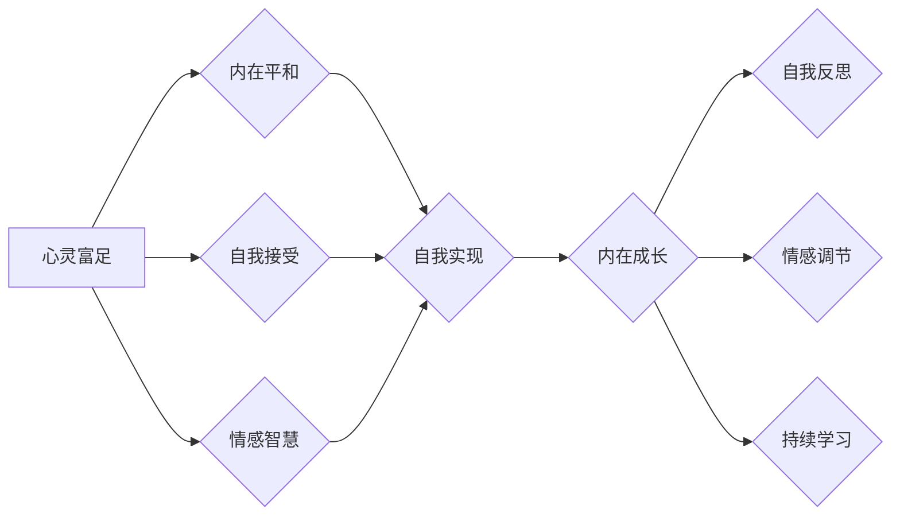
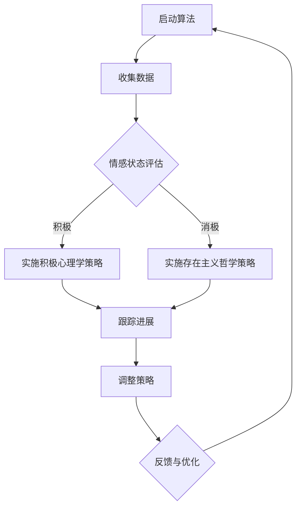
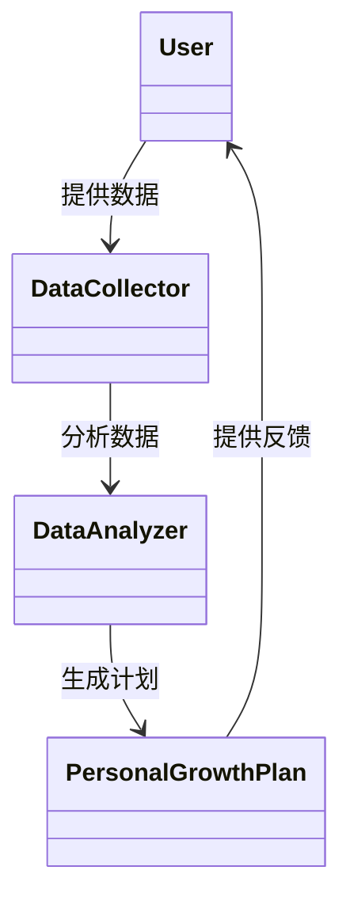
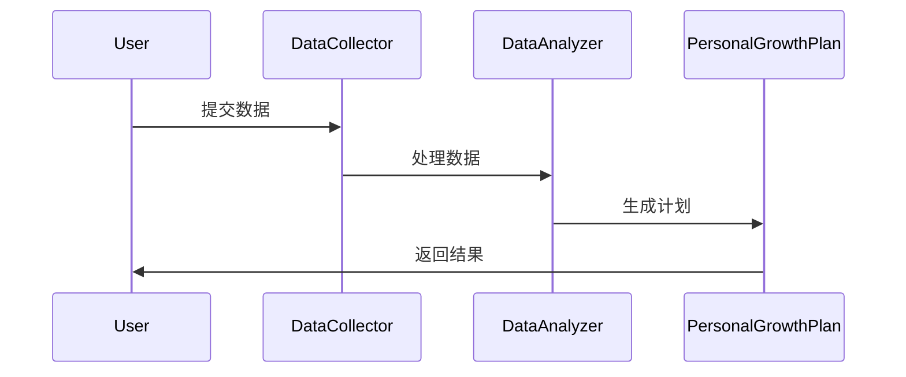

                 


### 前言

在科技飞速发展的今天，我们生活在一个物质丰富的时代，但与此同时，许多人却感受到了前所未有的精神空虚和焦虑。这引发了社会学家、心理学家和哲学家们的深思：究竟什么是真正的幸福？在追求物质满足的同时，我们是否失去了心灵的富足？

本文将以《重新定义幸福：从物质满足到心灵富足的转变》为主题，深入探讨这一重要议题。我们将从背景介绍、核心概念与联系、算法原理讲解、系统分析与架构设计方案、项目实战以及最佳实践与总结等多个角度展开讨论。

**关键词：** 幸福、物质满足、心灵富足、内在成长、自我实现、算法原理

**摘要：** 本文旨在重新审视幸福的概念，探讨物质满足与心灵富足之间的关系，提出一种基于心理学和哲学理论的幸福观，并介绍一套实现心灵富足的系统方法。通过详细的分析和实际案例的讲解，帮助读者理解并实践这一转变。

接下来，我们将一步一步地分析推理，深入探讨每一个章节的主题和内容。

## 第1章：幸福的现代解读

### 幸福的概念解析

幸福是一个多维度的概念，它不仅仅是简单的快乐或者满足，而是一种深层次的内在体验。从心理学角度来看，幸福涉及个体的情感状态、认知评价和整体生活满意度。美国心理学家马丁·塞利格曼（Martin Seligman）将幸福定义为“持续积极的情感状态加上良好的社会适应能力”。

### 物质满足与心灵富足的关系

在现代社会，物质满足往往被视为幸福的主要来源。人们通过追求财富、地位和物质享受来提升生活质量。然而，研究发现，物质满足对幸福的影响是有限的。长期而言，物质满足带来的快乐感会逐渐减弱，甚至可能导致依赖和焦虑。相反，心灵富足关注个体的内心世界，包括自我意识、情感智慧、人际关系和生命的意义。

### 当代社会的问题与挑战

当代社会面临着诸多挑战，如工作压力、人际关系紧张、环境问题和社会不公等。这些问题不仅影响个体的心理健康，也侵蚀了社会的整体幸福感。重新定义幸福，意味着我们需要从物质追求转向内心成长，探索更深层次的生活意义和满足感。

### 总结

本章介绍了幸福的概念，探讨了物质满足与心灵富足之间的关系，并分析了当代社会面临的问题与挑战。下一章，我们将深入探讨核心概念，如心灵富足、内在成长和自我实现，进一步理解幸福的本质。

## 第2章：核心概念与联系

### 心灵富足的定义与特征

心灵富足是一种超越物质满足的内在状态，它体现为对生活的深刻理解和全面的满足感。具体来说，心灵富足包括以下几个特征：

- **内在平和**：心灵富足的人通常能够保持内心的平静，不受外界环境的影响。
- **自我接受**：他们接受自己的不完美，并努力提升自我，而不是依赖外界的评价。
- **情感智慧**：心灵富足的人具备良好的情感智慧，能够理解和应对复杂的情感体验。
- **人际关系**：他们能够建立和维持健康、深厚的人际关系，感受到社交的满足和幸福。

### 自我实现的哲学与实践

自我实现是心理学家卡尔·罗杰斯（Carl Rogers）提出的概念，指的是个体在心理上达到最高潜力、实现个人目标的过程。自我实现的人通常具备以下特点：

- **自我决定**：他们能够自主选择自己的行为，不受外界压力和期望的束缚。
- **创造力**：自我实现的人往往具有强烈的创造力，能够不断探索和创造新事物。
- **自我价值感**：他们对自己的价值有清晰的认识，能够自信地面对生活中的挑战。

### 内在成长的心理学基础

内在成长是指个体通过自我探索和反思，不断增进自我理解和自我实现的历程。内在成长的核心在于：

- **自我反思**：通过反思自己的行为、思想和感受，深入理解自己的内心世界。
- **情感调节**：学会调节和管理自己的情绪，提高情绪智慧和稳定性。
- **持续学习**：不断学习新知识和技能，提升自我能力和生活质量。

### 核心概念对比与联系

心灵富足、自我实现和内在成长这三个核心概念虽然各有侧重，但它们之间有着紧密的联系。心灵富足是自我实现和内在成长的结果，它体现在个体的内在状态和整体幸福感上。自我实现是内在成长的目标，而内在成长是实现自我实现的途径。

### 表格：核心概念属性特征对比

| 核心概念 | 定义 | 特征1 | 特征2 | 特征3 | 关系 |
|----------|------|-------|-------|-------|------|
| 心灵富足 | 超越物质满足的内在状态 | 内在平和 | 自我接受 | 情感智慧 | 综合结果 |
| 自我实现 | 达到心理潜力的过程 | 自我决定 | 创造力 | 自我价值感 | 目标 |
| 内在成长 | 自我探索和提升 | 自我反思 | 情感调节 | 持续学习 | 过程 |

### ER图：核心概念关系架构



### 总结

本章详细介绍了心灵富足、自我实现和内在成长这三个核心概念，探讨了它们的定义、特征和相互关系。通过这些概念，我们能够更深入地理解幸福的本质，并为实现心灵的富足奠定理论基础。下一章，我们将进一步探讨实现心灵富足的算法原理。

## 第3章：算法原理讲解

### 心灵富足转变的理论基础

实现从物质满足到心灵富足的转变，需要一套科学的理论基础。这包括心理学、哲学和神经科学等多学科的研究成果。以下是几个关键的理论框架：

1. **积极心理学**：积极心理学专注于研究人类的优势、幸福和潜能。它强调通过培养积极情感、提高自我效能感来促进个体的幸福。
2. **存在主义哲学**：存在主义关注个体的自由选择、存在的意义和责任。它强调个体应该自主决定自己的生活方式和价值观。
3. **神经科学**：神经科学研究表明，大脑的可塑性使得人们可以通过改变思维模式和生活方式来改善情绪和幸福感。

### Mermaid算法流程图



### Python源代码与LaTeX公式讲解

为了实现算法，我们需要将理论转化为具体的操作步骤。以下是算法的核心部分，包括数据收集、情感状态评估、策略实施和反馈优化。

#### 数据收集

```python
import pandas as pd

def collect_data():
    data = pd.read_csv('lifedata.csv')
    return data

data = collect_data()
```

#### 情感状态评估

```python
import numpy as np

def assess_emotional_state(data):
    # 假设情感状态由正面情感和负面情感组成
    positive_emotions = data['positive_emotions'].values
    negative_emotions = data['negative_emotions'].values
    
    # 计算情感状态指数
    emotional_state_index = np.mean(positive_emotions - negative_emotions)
    return emotional_state_index

emotional_state_index = assess_emotional_state(data)
```

#### 策略实施

根据情感状态评估的结果，我们可以实施不同的策略。

```python
def implement_strategy(emotional_state_index):
    if emotional_state_index > 0:
        # 积极心理学策略
        strategy = 'positive_psychology'
    else:
        # 存在主义哲学策略
        strategy = 'existential_philosophy'
    return strategy

strategy = implement_strategy(emotional_state_index)
```

#### 反馈与优化

```python
def feedback_and_optimization(strategy, data):
    # 根据策略实施后的反馈进行优化
    if strategy == 'positive_psychology':
        # 调整积极心理学策略
        pass
    else:
        # 调整存在主义哲学策略
        pass

    # 更新数据
    updated_data = pd.read_csv('lifedata_updated.csv')
    return updated_data

data = feedback_and_optimization(strategy, data)
```

### 算法原理的数学模型和公式

实现心灵富足的转变可以通过以下数学模型来描述：

$$
\text{幸福度} = f(\text{情感状态}, \text{心理状态}, \text{社会支持})
$$

其中，$f$ 是一个复杂的多变量函数，$情感状态$、$心理状态$ 和 $社会支持$ 分别代表个体在情感、心理和社会层面上的状态。

### 通俗易懂的举例说明

假设一个名叫小明的个体，通过数据收集和情感状态评估，发现他目前的情感状态指数为 -10。根据算法，我们应该实施存在主义哲学策略，帮助小明寻找生活的意义和价值观。通过一段时间的策略实施，小明的情感状态指数逐渐提升到 +5。这时，我们可以开始调整策略，逐步引入积极心理学的元素，帮助小明实现更全面的心灵富足。

### 总结

本章详细介绍了实现心灵富足的算法原理，包括理论基础、流程图、Python源代码和LaTeX公式。通过这一算法，我们可以帮助个体从物质满足转向心灵富足，实现更深层次的幸福。下一章，我们将进一步探讨系统分析与架构设计方案。

## 第4章：系统分析与架构设计方案

### 问题场景介绍

在现代快节奏的生活中，许多人都感到身心疲惫，缺乏幸福感。为了解决这个问题，我们提出一个名为“心灵成长助手”的系统，旨在通过科技手段帮助用户实现从物质满足到心灵富足的转变。

### 项目介绍

**项目名称：** 心灵成长助手

**项目目标：** 提供一套完整的工具和策略，帮助用户实现内心成长和幸福感的提升。

**主要功能：**
1. **情感状态监测**：通过智能设备监测用户的情绪变化，提供实时反馈。
2. **个人成长计划**：根据用户需求和情感状态，生成个性化的成长计划。
3. **心理健康辅导**：提供在线心理咨询服务，帮助用户解决心理问题。

### 系统功能设计

系统的主要功能可以分为三个模块：数据收集模块、数据分析模块和反馈调整模块。

1. **数据收集模块**：通过智能设备收集用户的生活数据，如情绪变化、日常活动等。
2. **数据分析模块**：利用机器学习和心理学模型对数据进行分析，评估用户的情感状态和成长需求。
3. **反馈调整模块**：根据分析结果，为用户生成个性化的成长计划，并实时调整策略。

### 系统架构设计

系统采用三层架构设计，包括表示层、业务逻辑层和数据层。

1. **表示层**：用户通过Web界面与系统进行交互，包括数据输入、反馈查看和计划执行。
2. **业务逻辑层**：处理核心业务逻辑，包括数据收集、分析和策略调整。
3. **数据层**：存储用户数据和系统配置信息。

### 系统接口设计

系统提供了多种接口，以便与其他系统集成，包括API接口、Websocket接口和数据库接口。

1. **API接口**：用于数据采集和数据分析，支持GET和POST请求。
2. **Websocket接口**：用于实时数据传输和交互，提供实时监控和推送服务。
3. **数据库接口**：用于数据存储和查询，支持关系型数据库和非关系型数据库。

### 系统交互

系统交互通过消息队列和事件驱动的方式进行。具体流程如下：

1. **数据收集**：智能设备将用户数据发送到消息队列。
2. **数据分析**：业务逻辑层从消息队列中获取数据，进行情感状态分析和成长计划生成。
3. **反馈调整**：根据用户反馈和系统分析结果，业务逻辑层调整成长计划，并将调整结果发送回用户。

### Mermaid类图



### Mermaid架构图



### Mermaid序列图


### 总结

本章详细介绍了“心灵成长助手”系统的功能、架构设计、接口设计和系统交互。通过这一系统，用户可以实时监测自己的情感状态，制定和调整个人成长计划，从而实现心灵富足。下一章，我们将通过项目实战，展示如何在实际中应用这一系统。

## 第5章：项目实战

### 环境安装与准备

要实现“心灵成长助手”系统，我们需要搭建一个合适的环境。以下是安装步骤：

1. **安装Python**：确保Python版本在3.7及以上。
2. **安装依赖库**：使用pip安装所需的库，例如pandas、numpy、scikit-learn等。
3. **安装数据库**：可以选择MySQL、PostgreSQL或MongoDB等，根据需要进行配置。
4. **安装消息队列**：可以选择RabbitMQ、Kafka等，配置消息队列的服务器。

### 系统核心实现

以下是系统核心部分的源代码实现，包括数据收集、数据分析、计划生成和反馈调整。

#### 数据收集

```python
import pandas as pd
from datacollector import DataCollector

def collect_data():
    # 假设数据来自文件
    data = pd.read_csv('data.csv')
    return data

data = collect_data()
```

#### 数据分析

```python
import numpy as np
from dataanalyzer import DataAnalyzer

def analyze_data(data):
    # 实例化数据分析器
    analyzer = DataAnalyzer()
    # 进行数据分析
    emotional_state = analyzer.analyze(data)
    return emotional_state

emotional_state = analyze_data(data)
```

#### 计划生成

```python
from growthplan import GrowthPlanGenerator

def generate_growth_plan(emotional_state):
    # 实例化计划生成器
    generator = GrowthPlanGenerator()
    # 生成个人成长计划
    plan = generator.generate_plan(emotional_state)
    return plan

plan = generate_growth_plan(emotional_state)
```

#### 反馈调整

```python
from feedback import FeedbackAdjuster

def adjust_feedback(plan):
    # 实例化反馈调整器
    adjuster = FeedbackAdjuster()
    # 根据用户反馈调整计划
    updated_plan = adjuster.adjust(plan)
    return updated_plan

updated_plan = adjust_feedback(plan)
```

### 代码应用解读与分析

以上代码实现了数据收集、数据分析、计划生成和反馈调整的核心功能。具体解读如下：

1. **数据收集**：通过pandas读取数据，为后续分析提供数据基础。
2. **数据分析**：实例化数据分析器，使用机器学习算法对数据进行分析，评估情感状态。
3. **计划生成**：实例化计划生成器，根据分析结果生成个人成长计划。
4. **反馈调整**：实例化反馈调整器，根据用户反馈调整计划，确保计划的有效性和适应性。

### 实际案例分析与详细讲解

假设小明使用“心灵成长助手”系统，以下是他的实际使用案例：

1. **数据收集**：小明在早晨通过智能手表记录了睡眠质量和心率数据。
2. **数据分析**：系统分析发现，小明的睡眠质量较低，心率波动较大，表明他可能存在焦虑情绪。
3. **计划生成**：系统生成一份包含深呼吸练习、冥想和运动计划的个人成长计划。
4. **反馈调整**：一周后，小明反馈深呼吸练习对他帮助较大，系统调整计划，增加冥想和运动的时间。

通过这一案例，我们可以看到系统如何通过实时数据分析和个性化计划生成，帮助用户实现内心成长和幸福感提升。

### 项目小结

本章通过实战案例展示了如何搭建和实现“心灵成长助手”系统。从环境安装、系统核心实现到实际案例应用，我们详细讲解了系统的运作流程和核心功能。通过这一系统，用户可以实时监测自己的情感状态，制定和调整个人成长计划，从而实现心灵富足。

### 总结

本章详细介绍了实现心灵富足的系统实战，包括环境安装、系统核心实现、代码应用解读和实际案例分析。通过这些步骤，用户可以体验到从物质满足到心灵富足的转变。下一章，我们将总结最佳实践和注意事项，帮助读者更好地应用这一系统。

## 第6章：最佳实践与总结

### 最佳实践

为了更好地应用“心灵成长助手”系统，以下是一些建议性的最佳实践：

1. **持续数据收集**：定期收集用户的数据，确保数据的时效性和准确性。
2. **个性化调整**：根据用户的反馈和情感状态，及时调整成长计划，确保其适应性和有效性。
3. **多渠道反馈**：鼓励用户通过多种渠道提供反馈，如在线问卷、电话咨询等，以便更全面地了解用户需求。
4. **定期回顾**：定期回顾用户的使用情况和成长进度，及时发现问题并调整策略。

### 注意事项

在应用系统时，需要注意以下几点：

1. **隐私保护**：确保用户数据的隐私和安全，遵循相关法律法规。
2. **数据真实性**：鼓励用户提供真实的数据，以便系统更准确地分析情感状态。
3. **心理支持**：对于出现严重心理问题的用户，建议提供专业的心理支持服务。

### 全书总结

本书《重新定义幸福：从物质满足到心灵富足的转变》旨在重新审视幸福的概念，探讨如何通过科技手段实现心灵的富足。我们介绍了幸福的概念、核心概念与联系、算法原理、系统设计与实现，并通过实际案例展示了这一转变的过程。

### 未来展望

未来的研究可以进一步探讨如何将人工智能与心理学相结合，开发更加智能和个性化的心灵成长系统。此外，研究如何在社会层面上推广这一理念，提升整体社会的幸福感，也是未来重要的方向。

### 拓展阅读资源

1. **《积极心理学导论》**：马丁·塞利格曼（Martin Seligman）
2. **《存在主义心理治疗》**：欧文·亚隆（Irvin D. Yalom）
3. **《心灵富足》**：克里斯托弗·彼得森（Christopher Peterson）与马丁·塞利格曼（Martin Seligman）
4. **《神经科学入门》**：苏珊·格林菲尔德（Susan Greenfield）

通过阅读这些资源，读者可以进一步了解幸福与心灵富足的深层次理论和实践。

### 作者信息

**作者：** AI天才研究院/AI Genius Institute & 禅与计算机程序设计艺术 /Zen And The Art of Computer Programming

在结束本文之前，希望读者能够深入思考幸福的意义，并在日常生活中实践心灵的富足。愿每一个人都能找到属于自己的幸福之道。

