                 

### 引言与背景

在现代社会的快节奏中，幸福成为了每个人追求的目标。然而，随着经济、科技、文化等多方面的变化，传统的幸福观念正在经受挑战和重新定义。本篇文章将探讨现代生活方式对幸福的影响，以及如何重新定义幸福，为现代人的生活目标提供指导。

首先，我们来看一下现代生活与幸福的变迁。在过去，人们更多地依赖于物质财富和社会地位来衡量幸福。然而，随着社会的发展，越来越多的人开始意识到，幸福并不仅仅是物质上的满足，还包括心理、社会、精神和情感等多方面的平衡。

**1.1 现代生活与幸福的变迁**

现代生活的变化带来了新的挑战。工作压力、社交媒体的泛滥以及个人价值观的多元化，都在影响着人们的幸福感。例如，工作压力可能导致焦虑和抑郁，社交媒体则可能造成人际关系的不真实感，而个人价值观的冲突可能引发内心的矛盾。

**1.2 重新定义幸福的必要性**

在这样的背景下，重新定义幸福显得尤为重要。我们需要重新审视幸福的内涵和维度，寻找适应现代生活的幸福路径。这不仅是为了个体的心理健康，更是为了社会的和谐与进步。

**1.3 本书的目的与结构**

本书旨在探讨如何重新定义幸福，并提供实际的操作指南。我们将从多个维度来分析幸福，包括个人成长、社会关系、工作、经济独立等。文章将分为以下几个部分：

- **第二部分：重定义幸福的路径**，我们将探讨个人成长与幸福、社会关系与幸福、工作与幸福、经济独立与幸福等路径。
- **第三部分：幸福的多维度实现**，我们将进一步探讨如何在日常生活中实现多维度的幸福。
- **第四部分：幸福实现的实践指导**，我们将提供具体的实践方法，帮助读者实现幸福。

通过这样的结构设计，我们希望能够为广大读者提供一个全面、系统、实用的幸福指南。

### 幸福的概念与维度

**2.1 幸福的定义与内涵**

幸福是一个复杂而多维度的概念，不同的人对幸福有不同的理解和追求。一般来说，幸福可以被定义为一种长期的、积极的情感状态，它涉及个人在心理、社会、精神和情感等方面的满足和愉悦。

**2.2 幸福的主要维度**

为了更全面地理解幸福，我们可以将其划分为以下几个主要维度：

- **心理健康维度**：包括情绪稳定、心理平衡、压力管理等。心理健康是幸福的基础，一个心理健康的人更容易感受到幸福。
- **社会关系维度**：包括家庭关系、朋友关系、社会支持等。社会关系对幸福有着重要的影响，一个拥有良好人际关系的人往往更加幸福。
- **精神维度**：包括自我实现、人生意义、价值观等。精神维度关注的是个人内心的满足感，它对幸福的影响同样重要。
- **情感维度**：包括情感丰富、情感满足、情感表达等。情感维度关注的是个人情感体验的深度和质量，对幸福有直接影响。
- **物质维度**：包括经济独立、物质财富等。物质维度虽然不是幸福的核心，但它在一定程度上影响着其他维度的幸福。

**2.3 幸福的多维度关联**

这些维度并不是孤立存在的，它们之间存在紧密的关联和相互影响。例如，心理健康可能影响社会关系，而社会关系又会反过来影响心理健康。同样，精神维度和情感维度也可能通过相互支持来提升幸福感。

为了更直观地理解这些维度之间的关系，我们可以使用一个ER实体关系图来表示：

```mermaid
erDiagram
  心理健康 ||--|{ 社会关系 }
  社会关系 ||--|{ 心理健康 }
  精神维度 ||--|{ 情感维度 }
  情感维度 ||--|{ 精神维度 }
  物质维度 ||--|{ 心理健康 }
  物质维度 ||--|{ 社会关系 }
```

通过这个ER图，我们可以看到，各个维度之间存在相互联系和依赖。一个平衡的多维度幸福状态，需要我们在各个方面都进行综合考虑和努力。

### 现代生活方式对幸福的影响

**3.1 工作压力与幸福的关系**

在现代生活中，工作压力是影响幸福感的一个重要因素。工作压力可能导致焦虑、抑郁等心理问题，进而影响整体幸福感。根据世界卫生组织（WHO）的数据，工作压力是全球第二大职业健康问题。

**3.2 社交网络与幸福的关系**

社交网络在现代社会中扮演着重要的角色，但它也可能对幸福产生负面影响。一方面，社交网络为人们提供了更多的社交机会和资源；另一方面，过度依赖社交网络可能导致真实人际关系淡化，甚至引发社交焦虑和孤独感。

**3.3 个人价值观与幸福的关系**

个人价值观是影响幸福感的关键因素之一。一个有明确价值观的人更容易找到生活的方向和意义，从而提高幸福感。然而，个人价值观的多样性和冲突也可能导致内心的矛盾和焦虑。

为了更深入地理解这些关系，我们可以使用一个Mermaid流程图来表示：

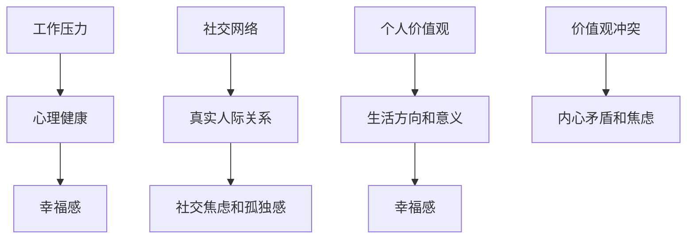

通过这个流程图，我们可以看到工作压力、社交网络和个人价值观与幸福感之间的复杂关系。理解这些关系有助于我们更好地应对现代生活中的挑战，提高幸福感。

### 个人成长与幸福

**4.1 自我认知与幸福**

自我认知是个人成长与幸福的重要基础。自我认知是指个体对自己内心世界的了解和认识，包括自己的情感、思想、价值观和行为。一个有良好自我认知的人，能够更好地理解自己的需求和期望，从而提高幸福感。

**4.1.1 自我认知的重要性**

自我认知的重要性在于，它帮助个体找到自己的优势和弱点，从而进行有效的自我提升。例如，通过自我认知，一个人可以更好地了解自己的兴趣和激情，找到适合自己的职业和发展方向。

**4.1.2 如何提升自我认知**

提升自我认知的方法包括：

1. **反思**：定期进行自我反思，思考自己的行为、情绪和想法，了解自己的内心世界。
2. **学习**：通过学习新的知识和技能，不断拓展自己的视野和认知范围。
3. **倾诉**：与朋友、家人或专业人士交流，倾听他人的意见和建议。

为了更好地理解自我认知的重要性，我们可以使用一个Mermaid流程图来表示：

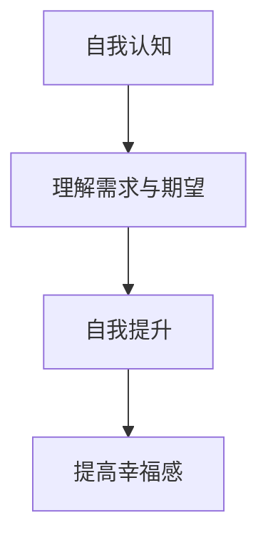

通过这个流程图，我们可以看到自我认知对个人成长和幸福的重要影响。

### 情绪管理对幸福的影响

**4.2 情绪管理对幸福的影响**

情绪管理是提升幸福感的重要手段。情绪管理是指个体对自己情绪的认知、理解、调节和控制能力。一个擅长情绪管理的人，能够更好地应对生活中的挑战，保持心理平衡，从而提高幸福感。

**4.2.1 情绪管理的基本原则**

情绪管理的基本原则包括：

1. **接受情绪**：认识到情绪是正常的生理和心理反应，接受自己的情绪，而不是试图压抑或逃避。
2. **理性分析**：在情绪激动时，尝试用理性的思维方式分析情绪的原因和影响，避免情绪失控。
3. **积极应对**：采取积极的应对策略，如深呼吸、运动、冥想等，缓解情绪压力。

**4.2.2 情绪管理的实用技巧**

情绪管理的实用技巧包括：

1. **正念冥想**：通过冥想练习，培养对当前情绪的觉察和接受能力，减少情绪波动。
2. **表达情感**：找到合适的途径表达自己的情感，如写日记、绘画、与朋友倾诉等。
3. **时间管理**：合理安排时间，避免过度劳累和情绪压力。

为了更好地理解情绪管理对幸福的影响，我们可以使用一个Mermaid流程图来表示：

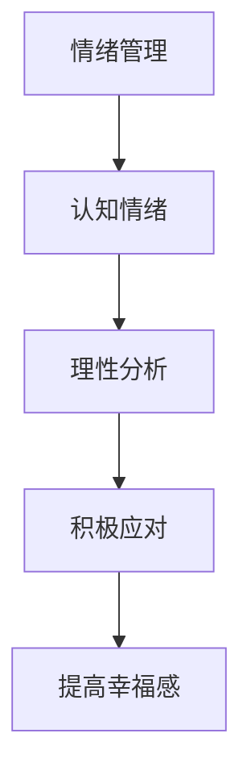

通过这个流程图，我们可以看到情绪管理在提升幸福感中的关键作用。

### 健康生活方式与幸福

**4.3 健康生活方式与幸福**

健康生活方式是提升幸福感的基石。健康生活方式包括合理的饮食、适量的运动、充足的休息等。这些因素不仅影响身体健康，还直接影响心理健康和幸福感。

**4.3.1 健康饮食的重要性**

健康饮食对幸福有重要影响。合理的饮食可以提供身体所需的营养，增强免疫力，减少患病风险。此外，饮食的多样性和均衡性还有助于维持心理平衡，提高幸福感。

**4.3.2 运动对幸福的积极影响**

运动是提升幸福感的重要途径。适量的运动可以释放压力，提高情绪，增强自信心。此外，运动还有助于改善睡眠质量，提高生活质量。

为了更直观地理解健康生活方式对幸福的影响，我们可以使用一个Mermaid流程图来表示：

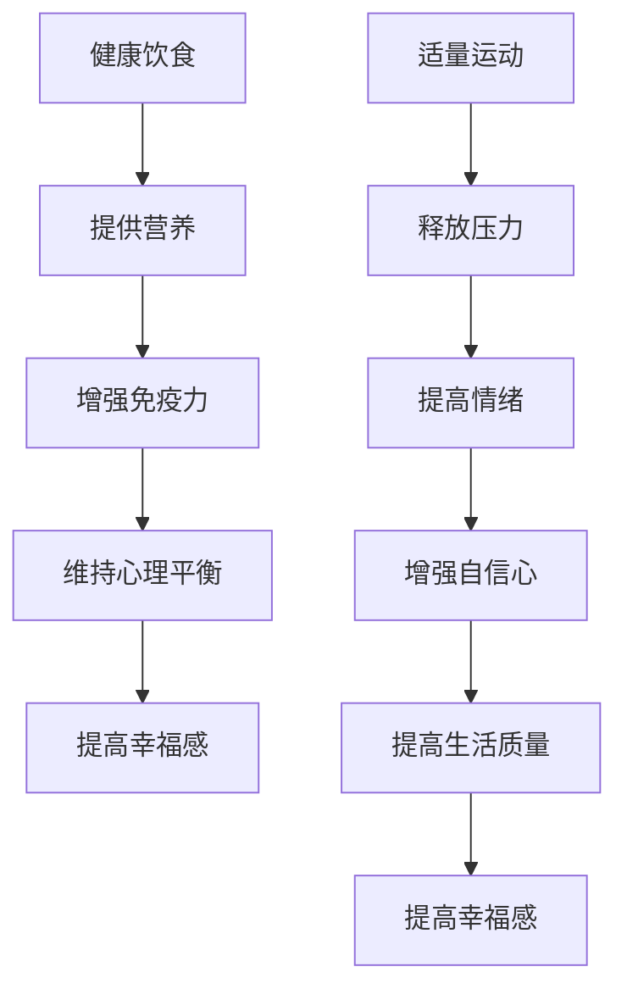

通过这个流程图，我们可以看到健康生活方式在提升幸福感中的重要作用。

### 社会关系与幸福

**5.1 人际关系对幸福的影响**

人际关系是幸福感的重要来源之一。良好的人际关系能够提供情感支持、增加社交互动、提升自尊和自我价值感。相反，不良的人际关系可能导致孤独、焦虑和抑郁，降低幸福感。

**5.1.1 人际关系的重要性**

人际关系的重要性体现在以下几个方面：

1. **情感支持**：在困难时期，亲朋好友的支持和鼓励能够帮助我们度过难关，提高幸福感。
2. **社交互动**：与他人互动可以增加快乐感和满足感，提升整体幸福感。
3. **自尊和自我价值感**：良好的人际关系能够增强个人的自尊和自我价值感，从而提高幸福感。

为了更好地理解人际关系对幸福的影响，我们可以使用一个Mermaid流程图来表示：

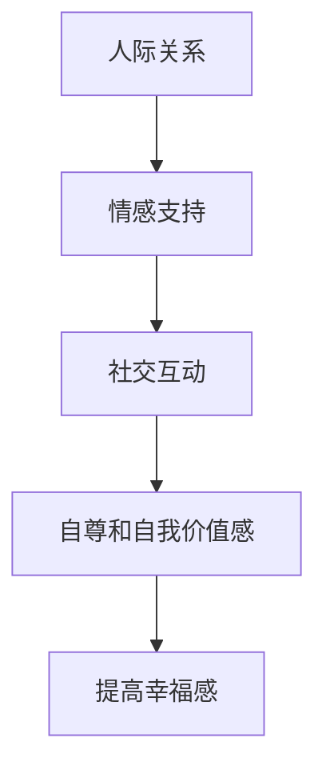

通过这个流程图，我们可以看到人际关系在提升幸福感中的关键作用。

### 社区参与与幸福

**5.2 社区参与与幸福**

社区参与是提升幸福感的重要途径之一。社区参与不仅有助于建立和维护人际关系，还能提供社会支持和成就感，从而提高幸福感。

**5.2.1 社区参与的形式与意义**

社区参与的形式多种多样，包括志愿服务、社区活动、邻里交流等。社区参与的意义主要体现在以下几个方面：

1. **建立和维护人际关系**：通过社区活动，人们可以结识新朋友，扩大社交圈，从而增强人际关系。
2. **提供社会支持**：社区参与可以让我们感受到他人的关心和支持，增强社会归属感。
3. **成就感**：参与社区活动能够带来成就感和满足感，提升幸福感。

为了更直观地理解社区参与与幸福的关系，我们可以使用一个Mermaid流程图来表示：

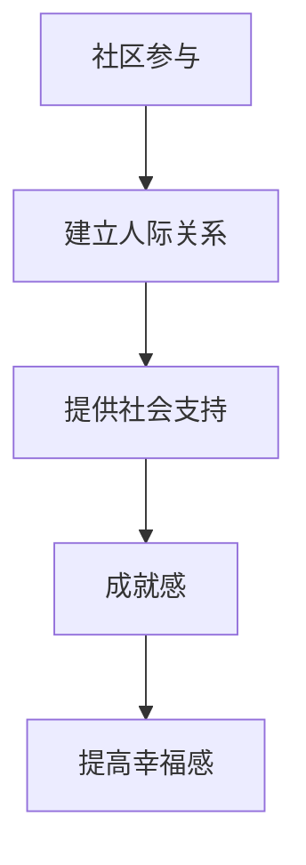

通过这个流程图，我们可以看到社区参与在提升幸福感中的重要作用。

### 工作与幸福

**6.1 工作意义与幸福**

工作不仅是谋生的手段，更是实现自我价值、获得成就感的重要途径。工作的意义对幸福感有着深远的影响。

**6.1.1 工作意义的探索**

探索工作意义的方法包括：

1. **自我反思**：思考工作对个人成长、职业发展、生活目标的实现等方面的意义。
2. **与同事交流**：与同事讨论工作的意义，倾听他们的观点和经验。
3. **职业规划**：通过职业规划，明确个人职业目标和发展方向，从而找到工作意义。

**6.1.2 工作与个人价值观的匹配**

工作与个人价值观的匹配对幸福感至关重要。一个与个人价值观相符的工作，能够带来更多的成就感和满足感。例如，一个注重创新和自由的工作环境，可能更适合那些追求自由和创造力的个人。

为了更好地理解工作意义与幸福的关系，我们可以使用一个Mermaid流程图来表示：

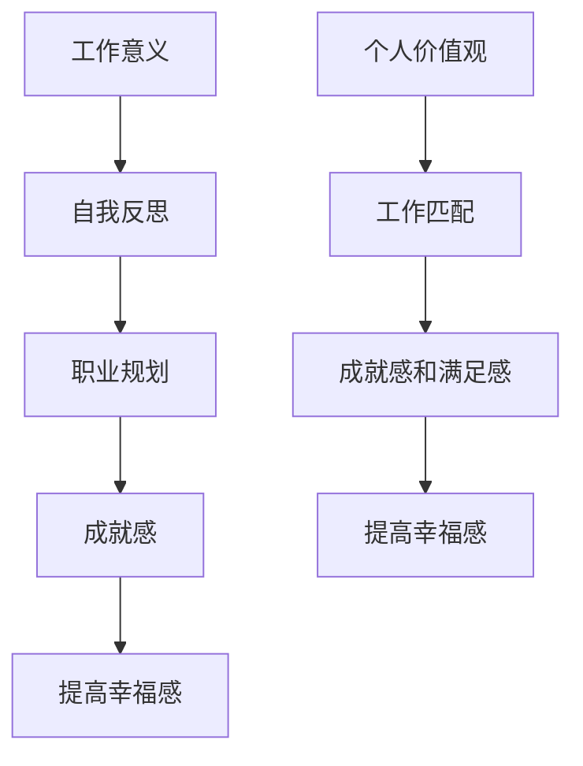

通过这个流程图，我们可以看到工作意义和个人价值观在提升幸福感中的重要作用。

### 职业发展与幸福

**6.2 职业发展与幸福**

职业发展是提升幸福感的重要方面。一个良好的职业发展路径，不仅能够带来经济上的收益，还能提升个人成就感和社会地位，从而提高幸福感。

**6.2.1 职业发展的路径与策略**

职业发展的路径和策略包括：

1. **技能提升**：通过不断学习和培训，提升专业技能和综合素质。
2. **职业规划**：制定明确的职业发展目标，并制定相应的行动计划。
3. **人际网络**：建立和维护良好的人际关系，拓展职业发展机会。

**6.2.2 职业发展中的幸福因素**

职业发展中的幸福因素包括：

1. **成就感**：通过完成工作任务和实现职业目标，获得成就感和满足感。
2. **自我实现**：在工作中实现个人价值和梦想，提升自我价值感。
3. **工作与生活的平衡**：合理规划工作时间和生活，确保工作与生活的平衡，从而提高幸福感。

为了更好地理解职业发展与幸福的关系，我们可以使用一个Mermaid流程图来表示：

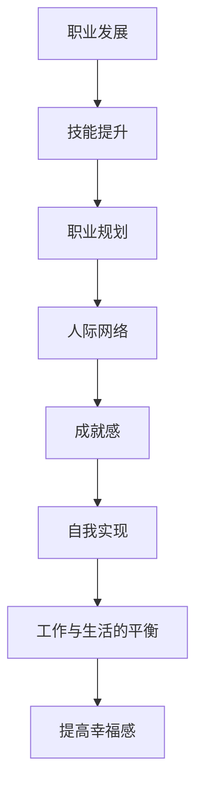

通过这个流程图，我们可以看到职业发展在提升幸福感中的重要作用。

### 经济独立与幸福

**7.1 经济独立的重要性**

经济独立是幸福感的重要保障。经济独立不仅意味着个人有能力自主决定生活方式，还意味着在面临各种挑战和困境时，个人拥有足够的资源和能力去应对。

**7.1.1 经济独立的基本概念**

经济独立的基本概念包括：

1. **财务自由**：拥有足够的财富，无需依赖工资收入即可维持生活。
2. **财务规划**：通过合理规划和投资，实现财务目标，提高经济独立性。

**7.1.2 经济独立的实现途径**

实现经济独立的途径包括：

1. **增加收入**：通过提升个人技能和职业发展，提高收入水平。
2. **节约开支**：通过合理消费和储蓄，减少不必要的开支。
3. **投资理财**：通过投资和理财，实现财富增值，提高经济独立性。

为了更好地理解经济独立的重要性，我们可以使用一个Mermaid流程图来表示：

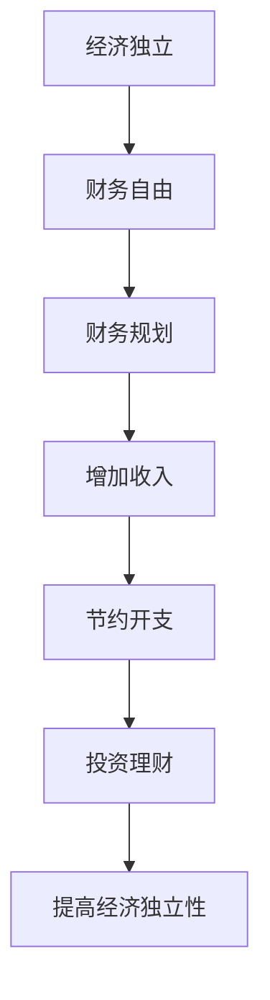

通过这个流程图，我们可以看到经济独立在提升幸福感中的关键作用。

### 财务规划与幸福

**7.2 财务规划与幸福**

财务规划是提高幸福感的重要手段。一个良好的财务规划，不仅可以确保经济独立，还能为未来的生活提供保障，提高幸福感。

**7.2.1 财务规划的重要性**

财务规划的重要性体现在以下几个方面：

1. **确保经济独立**：通过合理规划，确保个人在经济上能够自主，减少依赖性。
2. **降低生活压力**：通过财务规划，提前预防和应对可能出现的经济问题，降低生活压力。
3. **实现长期目标**：通过财务规划，为实现个人和家庭的长期目标提供财务支持。

**7.2.2 财务规划的步骤与方法**

财务规划的步骤与方法包括：

1. **评估当前财务状况**：了解个人和家庭的收入、支出和储蓄状况，为制定财务规划提供基础。
2. **设定财务目标**：根据个人和家庭的实际情况，设定短期和长期财务目标。
3. **制定财务计划**：根据财务目标和现状，制定具体的财务计划，包括增加收入、节约开支、投资理财等。
4. **实施和监控**：按照制定的财务计划执行，并定期检查和调整，确保财务目标的实现。

为了更好地理解财务规划与幸福的关系，我们可以使用一个Mermaid流程图来表示：

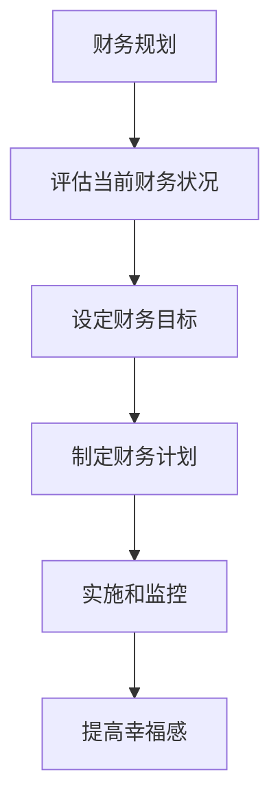

通过这个流程图，我们可以看到财务规划在提升幸福感中的重要作用。

### 幸福的实现与持续

**8.1 幸福的实现过程**

实现幸福是一个持续的过程，需要我们在生活的各个方面进行努力。以下是实现幸福的一些关键步骤：

1. **自我认知**：了解自己的需求和期望，找到自己的优势和弱点，进行自我提升。
2. **情绪管理**：学会管理自己的情绪，保持心理平衡，减少负面情绪的影响。
3. **健康生活方式**：保持良好的饮食习惯、适量的运动和充足的休息，提升身体健康和幸福感。
4. **人际关系**：建立和维护良好的人际关系，提供情感支持，增加社交互动。
5. **社区参与**：积极参与社区活动，提供社会支持，增强社会归属感。
6. **职业发展**：通过职业规划和发展，实现自我价值，提升成就感。
7. **经济独立**：通过财务规划和投资，确保经济独立，减少生活压力。

为了更好地理解幸福实现的步骤，我们可以使用一个Mermaid流程图来表示：

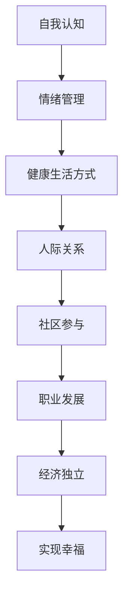

通过这个流程图，我们可以看到实现幸福的关键步骤及其相互关系。

### 幸福的持续与平衡

**8.2 幸福的持续与平衡**

幸福是一个动态的过程，需要我们在不同的生活阶段进行调整和平衡。以下是维持幸福的一些关键策略：

1. **阶段性目标**：根据不同阶段的生活需求和目标，设定具体的幸福目标，并进行阶段性调整。
2. **路径选择**：根据个人的实际情况和偏好，选择适合自己的幸福路径，不断调整和优化。
3. **平衡与调整**：在追求幸福的过程中，注意保持生活与工作的平衡，避免过度追求某一方面的幸福，导致其他方面的失衡。

为了更好地理解幸福的持续与平衡，我们可以使用一个Mermaid流程图来表示：

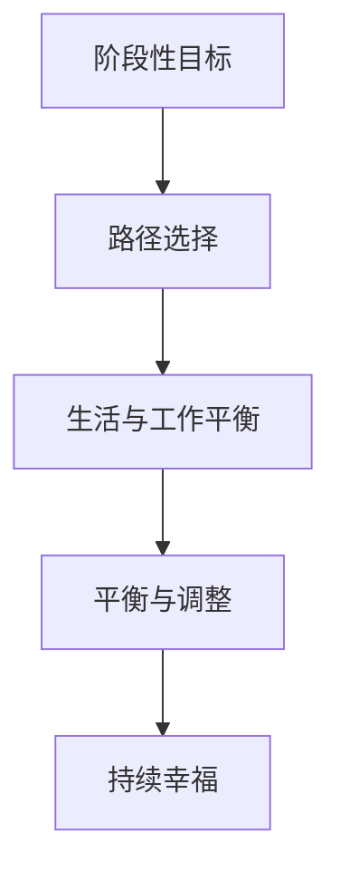

通过这个流程图，我们可以看到维持幸福的关键策略及其相互关系。

### 结论与未来展望

**9.1 重新定义幸福的总结**

通过本文的探讨，我们重新定义了幸福，认识到幸福不仅仅是物质上的满足，更是心理、社会、精神和情感等多方面的平衡。我们需要从自我认知、情绪管理、健康生活方式、人际关系、社区参与、职业发展和经济独立等多个维度来追求幸福。

**9.2 幸福社会的构建**

构建幸福社会需要我们共同努力。政府、企业和社会组织应提供更多的支持和资源，帮助人们实现幸福。同时，每个人都应该积极行动，关注自己的幸福感，为社会的和谐与进步贡献力量。

**9.3 幸福未来的展望**

在未来的发展中，我们期待看到一个更加幸福的社会，每个人都能在追求幸福的过程中找到自己的价值和意义。通过不断学习和实践，我们将能够更好地实现幸福，享受生活的美好。

**作者：AI天才研究院/AI Genius Institute & 禅与计算机程序设计艺术 /Zen And The Art of Computer Programming**

通过本文的深入分析和详细讲解，我们希望能够为广大读者提供关于幸福的全面理解和实践指南，帮助大家在现代生活中找到真正的幸福。希望这篇文章能够激发您对幸福的思考，引领您走向更加美好的未来。

