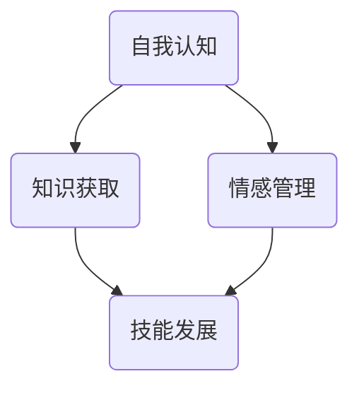
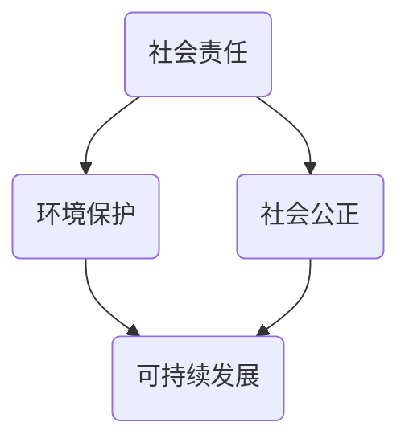

                 


### 文章标题：重新定义成功：后工业时代的人生价值观探索

关键词：后工业时代、人生价值观、成功、技术语言、逻辑思考

摘要：本文以技术语言重新定义后工业时代的人生价值观，从背景、挑战、核心概念与联系、算法原理等方面，深入剖析了后工业时代下成功的新内涵。通过逻辑清晰、结构紧凑的分析，为读者提供了对成功的新视角，帮助人们更好地适应和把握时代变革。

----------------------------------------------------------------

### 目录大纲

# 重新定义成功：后工业时代的人生价值观探索

## 第一部分：后工业时代的背景与挑战

## 1. 引言：后工业时代的来临

### 1.1 问题的背景与描述

#### 1.1.1 工业化进程的历史回顾

- 工业革命的影响
- 工业社会的形成与发展

#### 1.1.2 后工业时代的社会特征

- 信息技术的飞速发展
- 创新驱动的经济增长
- 社会结构的深刻变化

#### 1.1.3 人生价值观面临的挑战

- 传统价值观的局限
- 新时代下的价值取向

### 1.2 问题解决与边界

#### 1.2.1 传统人生观的局限

- 物质导向的成功观
- 单一维度的价值评价

#### 1.2.2 后工业时代人生价值观的创新方向

- 多元化的价值取向
- 自我实现与社会责任并重

### 1.3 概念结构与核心要素

#### 1.3.1 价值观的定义与分类

- 价值观的内涵
- 价值观的分类

#### 1.3.2 后工业时代价值观的核心要素

- 创新精神
- 社会责任
- 持续学习

### 1.4 边界与外延

#### 1.4.1 后工业时代价值观的全球视角

- 全球化背景下的价值观冲突与融合
- 地域文化的多样性

#### 1.4.2 与其他时代价值观的比较

- 古代价值观的传承与发展
- 工业时代价值观的变迁

## 1.5 本章小结

### 1.5.1 内容总结

- 后工业时代的特征
- 人生价值观的挑战与机遇
- 后工业时代价值观的核心要素

## 第二部分：核心概念与联系

## 2. 后工业时代人生价值观的核心概念

### 2.1 自我认知

#### 2.1.1 概念原理

- 自我认知的重要性
- 后工业时代自我认知的新视角

#### 2.1.2 概念属性特征对比

| 特征                 | 传统时代         | 后工业时代         |
|----------------------|------------------|--------------------|
| 自我认知的深度       | 较浅             | 较深               |
| 自我认知的动态性     | 静态             | 动态               |
| 自我认知的社会互动   | 较少             | 较多               |

#### 2.1.3 ER实体关系图架构



#### 2.1.4 算法原理

```python
# 自我认知算法示例
def self_awareness():
    # 获取知识
    knowledge = get_knowledge()
    # 管理情感
    emotion = manage_emotion()
    # 发展技能
    skill = develop_skill(knowledge, emotion)
    return skill
```

#### 2.1.5 数学模型和公式

$$
\text{技能发展} = f(\text{知识获取}, \text{情感管理})
$$

#### 2.1.6 举例说明

- 知识获取：持续学习新技能
- 情感管理：培养乐观心态
- 技能发展：实现自我提升

### 2.2 社会责任

#### 2.2.1 概念原理

- 社会责任的重要性
- 后工业时代社会责任的新内涵

#### 2.2.2 概念属性特征对比

| 特征                 | 传统时代         | 后工业时代         |
|----------------------|------------------|--------------------|
| 社会责任的范畴       | 较窄             | 较广               |
| 社会责任的主动性     | 被动             | 主动               |
| 社会责任的影响力     | 局部             | 全球               |

#### 2.2.3 ER实体关系图架构



#### 2.2.4 算法原理

```python
# 社会责任算法示例
def social_responsibility():
    # 环境保护
    environment = protect_environment()
    # 社会公正
    justice = promote_justice()
    # 可持续发展
    sustainability = ensure_sustainability(environment, justice)
    return sustainability
```

#### 2.2.5 数学模型和公式

$$
\text{社会责任} = g(\text{环境保护}, \text{社会公正})
$$

#### 2.2.6 举例说明

- 环境保护：参与环保活动
- 社会公正：支持公平正义
- 可持续发展：推动可持续发展项目

## 第三部分：实践与反思

## 3. 后工业时代成功的实践路径

### 3.1 教育改革

#### 3.1.1 教育目标的转变

- 培养创新思维
- 增强社会责任感

#### 3.1.2 教育模式的创新

- 个性化教育
- 互联网+教育

### 3.2 企业管理

#### 3.2.1 企业文化的重构

- 创新驱动
- 社会责任

#### 3.2.2 管理模式的转型

- 智能化管理
- 网络协同

### 3.3 个人成长

#### 3.3.1 自我认知的提升

- 接受多元化价值观
- 培养持续学习能力

#### 3.3.2 社会责任的履行

- 参与社会实践
- 推动社会进步

## 4. 反思与展望

### 4.1 成功的再定义

- 从物质导向转向精神成长
- 从自我实现转向社会贡献

### 4.2 后工业时代的挑战与机遇

- 技术进步与社会变革的挑战
- 创新与可持续发展的机遇

### 4.3 后工业时代人生的价值观探索

- 继承与创新的统一
- 理论与实践的结合

## 5. 本章小结

### 5.1 内容总结

- 后工业时代成功的实践路径
- 成功的再定义与反思
- 后工业时代人生的价值观探索

----------------------------------------------------------------

## 第一部分：后工业时代的背景与挑战

### 1. 引言：后工业时代的来临

随着人类社会的发展，我们正逐步迈入后工业时代。这一时代的特征是信息技术、人工智能、生物技术等前沿科技的迅猛发展，推动着社会结构的深刻变革。在这一背景下，重新审视和定义成功的人生价值观，显得尤为重要。

#### 1.1 问题的背景与描述

工业化进程是近代以来最为重要的历史事件之一。从蒸汽机的发明到现代工业体系的形成，工业化带来了生产力的巨大提升，改变了人类的生活方式。然而，随着信息化和智能化的推进，工业时代的模式正在逐步被打破，后工业时代的特征日益凸显。

- **工业化进程的历史回顾**：工业革命以来，人类社会经历了从农业社会到工业社会的历史性转变。这一过程伴随着生产力的飞跃，城市化进程的加快，以及社会结构的重大调整。

- **后工业时代的社会特征**：后工业时代，以信息技术为核心的新兴产业迅速崛起，改变了传统产业的主导地位。同时，全球化、数字化、智能化等趋势加剧，社会结构呈现多元化、动态化特征。

- **人生价值观面临的挑战**：在工业化时代，物质财富的积累成为成功的主要标志。然而，在后工业时代，人们对成功的理解正在发生变化。创新精神、社会责任、持续学习等成为新时代成功的重要维度。

#### 1.2 问题解决与边界

传统的成功观往往局限于物质财富的积累和职业成就。然而，后工业时代的社会变革要求人们重新审视这些价值观。我们需要探索如何通过创新和自我提升，实现个人成长与社会进步的统一。

- **传统人生观的局限**：物质导向的成功观容易导致短视行为，忽视了精神层面的需求和社会责任。此外，传统的人生观往往强调稳定和一致性，难以适应快速变化的现代社会。

- **后工业时代人生价值观的创新方向**：后工业时代的人生价值观更加注重多元化、动态性和可持续性。创新精神、社会责任和持续学习成为新时代成功的关键要素。

#### 1.3 概念结构与核心要素

- **价值观的定义与分类**：价值观是人们对事物价值的认识和评价，是行为选择的基础。从社会角度看，价值观可以分为物质价值观、精神价值观和社会价值观。

- **后工业时代价值观的核心要素**：后工业时代的人生价值观强调创新精神、社会责任和持续学习。这些要素不仅反映了新时代的特征，也是实现个人成长和社会进步的重要条件。

#### 1.4 边界与外延

- **后工业时代价值观的全球视角**：全球化使得不同文化之间的交流与融合日益加深。后工业时代的价值观不仅具有地域性，还展现出全球性的特征。

- **与其他时代价值观的比较**：与工业时代相比，后工业时代的价值观更加多元和动态。同时，与古代价值观相比，后工业时代的价值观在创新和可持续性方面有了新的内涵。

#### 1.5 本章小结

后工业时代的来临带来了社会结构的深刻变革，也对人生价值观提出了新的挑战。通过重新审视和定义成功的人生价值观，我们可以更好地适应和把握时代的发展。本章主要介绍了后工业时代的背景、挑战以及人生价值观的核心要素，为后续讨论打下了基础。

----------------------------------------------------------------

## 第二部分：核心概念与联系

### 2. 后工业时代人生价值观的核心概念

在重新定义成功的过程中，我们需要深入探讨后工业时代人生价值观的核心概念。这些概念不仅反映了新时代的特征，也为人们提供了实现个人成长和社会进步的路径。

#### 2.1 自我认知

自我认知是指个体对自己身份、能力和价值观的深入理解。在后工业时代，自我认知的重要性日益凸显，因为它关系到个人成长和职业发展。

- **概念原理**：自我认知是个人成长的基础。通过不断反思和自我探索，个体可以明确自己的兴趣、优势和目标，从而实现自我提升。

- **概念属性特征对比**：

  | 特征                 | 传统时代         | 后工业时代         |
  |----------------------|------------------|--------------------|
  | 自我认知的深度       | 较浅             | 较深               |
  | 自我认知的动态性     | 静态             | 动态               |
  | 自我认知的社会互动   | 较少             | 较多               |

- **ER实体关系图架构**：

  ```mermaid
  graph TD
  A(自我认知) --> B(知识获取)
  A --> C(情感管理)
  B --> D(技能发展)
  C --> D
  ```

- **算法原理**：

  ```python
  # 自我认知算法示例
  def self_awareness():
      # 获取知识
      knowledge = get_knowledge()
      # 管理情感
      emotion = manage_emotion()
      # 发展技能
      skill = develop_skill(knowledge, emotion)
      return skill
  ```

- **数学模型和公式**：

  $$
  \text{技能发展} = f(\text{知识获取}, \text{情感管理})
  $$

- **举例说明**：

  - 知识获取：通过学习新技能和知识来提升自我。
  - 情感管理：培养积极乐观的心态，处理人际关系。
  - 技能发展：将知识和情感转化为实际能力，实现自我提升。

#### 2.2 社会责任

社会责任是指个体或组织在社会中的责任和义务。在后工业时代，社会责任的概念更加丰富，不仅包括对环境的关注，还涉及社会公正和可持续发展。

- **概念原理**：社会责任是个体在现代社会中的基本道德要求。通过履行社会责任，个体可以为社会做出贡献，实现个人价值。

- **概念属性特征对比**：

  | 特征                 | 传统时代         | 后工业时代         |
  |----------------------|------------------|--------------------|
  | 社会责任的范畴       | 较窄             | 较广               |
  | 社会责任的主动性     | 被动             | 主动               |
  | 社会责任的影响力     | 局部             | 全球               |

- **ER实体关系图架构**：

  ```mermaid
  graph TD
  A(社会责任) --> B(环境保护)
  A --> C(社会公正)
  B --> D(可持续发展)
  C --> D
  ```

- **算法原理**：

  ```python
  # 社会责任算法示例
  def social_responsibility():
      # 环境保护
      environment = protect_environment()
      # 社会公正
      justice = promote_justice()
      # 可持续发展
      sustainability = ensure_sustainability(environment, justice)
      return sustainability
  ```

- **数学模型和公式**：

  $$
  \text{社会责任} = g(\text{环境保护}, \text{社会公正})
  $$

- **举例说明**：

  - 环境保护：参与环保活动，减少碳排放。
  - 社会公正：支持公平正义，反对歧视和不平等。
  - 可持续发展：推动可持续发展项目，关注生态平衡。

通过深入探讨自我认知和社会责任等核心概念，我们可以更好地理解后工业时代的人生价值观。这些概念不仅为个人成长提供了方向，也为社会进步注入了动力。

----------------------------------------------------------------

## 第三部分：实践与反思

### 3. 后工业时代成功的实践路径

在后工业时代，成功的实践路径需要适应新时代的特征，注重创新、社会责任和持续学习。以下将从教育改革、企业管理和个人成长三个方面探讨成功的实践路径。

#### 3.1 教育改革

教育改革是培养适应后工业时代人才的关键。教育目标需要从知识传授转向创新能力和社会责任感的培养。

- **教育目标的转变**：后工业时代的教育目标应包括创新思维的培养、批判性思维的锻炼和社会责任感的树立。

- **教育模式的创新**：个性化教育、互联网+教育等创新模式有助于提高教育质量和培养适应时代的人才。

#### 3.2 企业管理

企业管理需要适应后工业时代的变化，注重创新驱动和社会责任。

- **企业文化重构**：构建以创新为核心的企业文化，鼓励员工创新思维和持续学习。

- **管理模式转型**：智能化管理和网络协同有助于提高企业效率和创新能力。

#### 3.3 个人成长

个人成长需要注重自我认知、社会责任和持续学习。

- **自我认知的提升**：通过不断反思和自我探索，明确个人兴趣、优势和目标，实现自我提升。

- **社会责任的履行**：参与社会实践，关注社会问题，为社会发展贡献自己的力量。

### 4. 反思与展望

后工业时代成功的人生价值观不仅需要理论指导，更需要实践验证。在反思过程中，我们需要关注以下几个方面：

- **成功的再定义**：从物质导向转向精神成长，从自我实现转向社会贡献。

- **后工业时代的挑战与机遇**：技术进步和社会变革带来挑战，同时也提供机遇。

- **后工业时代人生的价值观探索**：继承与创新、理论与实践相结合，为个人成长和社会进步提供新的路径。

#### 4.1 成功的再定义

成功的定义在后工业时代发生了变化。过去，成功往往与物质财富和职业成就挂钩，而后工业时代，成功更多地体现在精神成长和社会贡献上。

- **物质导向转向精神成长**：在物质富足的时代，人们开始追求内心满足和精神层面的成长。

- **自我实现转向社会贡献**：个体的成长不再仅仅是为了自身的利益，而是为了社会的整体进步。

#### 4.2 后工业时代的挑战与机遇

后工业时代面临诸多挑战，如技术进步带来的不确定性、社会变革引发的价值冲突等。然而，这些挑战也带来了机遇。

- **技术进步与社会变革的挑战**：新技术的发展加速了社会变革，对人们的价值观和能力提出了更高要求。

- **创新与可持续发展的机遇**：在创新和可持续发展的推动下，社会将迎来新的发展机遇。

#### 4.3 后工业时代人生的价值观探索

后工业时代的人生价值观探索是一个持续的过程。我们需要在继承传统价值的基础上，不断创新和实践，以适应时代的发展。

- **继承与创新的统一**：在传承优秀文化传统的同时，积极探索新的价值观和生活方式。

- **理论与实践的结合**：通过实践检验理论，不断优化和调整人生价值观。

### 5. 本章小结

后工业时代的成功实践路径需要适应新时代的特征，注重创新、社会责任和持续学习。通过教育改革、企业管理和个人成长等实践路径，我们可以更好地实现个人成长和社会进步。在反思与展望中，我们认识到成功的再定义、挑战与机遇，以及后工业时代人生价值观探索的重要性。

----------------------------------------------------------------

### 文章结尾：总结与展望

在后工业时代，成功的人生价值观需要适应快速变化的社会环境，注重创新、社会责任和持续学习。通过教育改革、企业管理和个人成长等实践路径，我们可以更好地实现个人价值和社会贡献。本文从背景介绍、核心概念与联系、实践与反思等方面，深入探讨了后工业时代的人生价值观。

未来，随着科技的进步和社会的发展，人生价值观将不断演变。我们需要保持开放的心态，不断学习和创新，以适应时代的变化。同时，我们也要关注社会责任，积极参与社会事务，为社会的可持续发展贡献力量。

让我们共同探索后工业时代的人生价值观，追求更加丰富和有意义的人生。

### 作者信息

作者：AI天才研究院/AI Genius Institute & 禅与计算机程序设计艺术 /Zen And The Art of Computer Programming

----------------------------------------------------------------

**引言：后工业时代的来临**

### 问题的背景与描述

后工业时代的概念并非一夜之间崛起，而是经历了长期的社会演进与科技进步。首先，让我们回顾工业化进程的历史。18世纪的工业革命标志着人类社会从农业社会向工业社会的重大转变。蒸汽机的发明和广泛应用，极大地提升了生产力，推动了城市化和现代化进程。工业化带来了大规模的工厂生产、劳动力市场的形成以及社会结构的复杂化。随着时间的推移，工业社会的发展不仅改变了生产方式，也深刻影响了人们的生活方式、价值观念和社会关系。

然而，工业社会的模式并非一成不变。随着20世纪中叶信息技术和计算机科学的兴起，我们进入了信息化时代，这标志着工业社会的逐步转型。信息技术的飞速发展，特别是互联网的普及，使得知识传播速度大大加快，信息获取成本显著降低。知识经济逐渐取代传统的工业经济，成为经济增长的主要动力。这一转变不仅改变了经济结构，也对人们的生活和价值观产生了深远影响。

后工业时代的社会特征主要体现在以下几个方面：

1. **技术创新**：以信息技术、人工智能、生物技术为代表的前沿科技迅猛发展，成为推动社会进步的关键力量。这些技术的应用不仅改变了生产方式，也改变了人们的生活方式和思维方式。

2. **全球化**：全球化的进程使得各国之间的联系更加紧密，文化交流、经济合作和科技创新呈现出前所未有的互动性。全球化带来了机遇，但同时也带来了挑战，如文化冲突、经济不平等和资源分配问题。

3. **多元化**：社会结构日益多元化，个体在性别、年龄、文化背景、价值观等方面的差异变得更加明显。这种多元化要求社会更加包容，也使得社会更加复杂。

4. **持续变化**：后工业时代的社会变化速度加快，人们的职业、生活方式、价值观等都在不断调整和重塑。这种变化要求个体具备快速适应和持续学习的能力。

在这样的社会背景下，人生价值观面临着前所未有的挑战。传统的成功观念，往往以物质财富和职业成就为主要衡量标准，但在后工业时代，这些标准显得过于单一。人们开始反思，什么是真正的成功？如何在追求个人成长的同时，为社会做出贡献？

### 工业化进程的历史回顾

工业革命是近代以来最为重要的历史事件之一，它不仅改变了生产方式，也对人类社会产生了深远的影响。18世纪末，蒸汽机的发明和应用标志着工业革命的开始。蒸汽机的出现使得机械化生产成为可能，极大地提升了生产力。工厂制度取代了传统的手工作坊，大规模的工业生产逐渐取代了手工业生产。

工业革命的影响不仅局限于生产领域，它还带来了城市化和人口流动。随着工厂的兴起，人们从农村迁往城市，城市化进程加速。城市成为工业生产的主要场所，同时也成为了经济和文化发展的中心。人口流动带来了社会结构的复杂化，劳动力市场逐渐形成，就业模式也发生了变化。

工业革命还推动了科技和教育的发展。工业化进程需要大量的技术人才，这促使教育体系进行了相应的改革。科技的发展不仅提高了生产效率，也促进了科学研究的进步。新的发明和技术不断涌现，推动了社会进步。

然而，工业革命也带来了一些负面影响。首先，工业生产的大规模化和机械化使得劳动者失去了灵活性，工作环境变得恶劣。工业化进程还导致了资源消耗和环境污染，对生态系统造成了破坏。

总的来说，工业化进程为人类社会带来了巨大的变革，但同时也带来了一系列挑战。随着工业革命的深入，人们开始认识到工业社会的局限性，这为后工业时代的到来奠定了基础。

### 后工业时代的社会特征

后工业时代，以信息技术为核心的新兴产业迅速崛起，改变了传统产业的主导地位。信息技术的发展使得知识传播速度大大加快，信息获取成本显著降低。互联网的普及使得人们可以随时随地获取信息，这种信息自由流动的特性不仅改变了人们的消费习惯，也改变了社会的运作方式。

创新驱动的经济增长是后工业时代的显著特征。在传统工业时代，经济增长主要依赖于资源的投入和规模的扩大。然而，在后工业时代，经济增长更多地依赖于科技创新和知识的应用。技术创新不仅推动了传统产业的升级和转型，还催生了新兴产业。例如，人工智能、大数据、云计算等技术的应用，极大地提升了生产效率和服务质量。

社会结构的深刻变化也是后工业时代的特征之一。随着全球化的深入，各国之间的联系日益紧密，文化交流、经济合作和科技创新呈现出前所未有的互动性。这种全球化的趋势不仅改变了经济格局，也影响了社会结构。人口流动变得更加频繁，人们可以在全球范围内选择工作和生活地点。同时，社会结构也变得更加多元化，个体在性别、年龄、文化背景、价值观等方面的差异变得更加明显。这种多元化要求社会更加包容，也使得社会更加复杂。

另外，后工业时代的社会变化速度加快。科技的进步使得信息传播速度加快，新的技术和产品不断涌现，人们的职业、生活方式、价值观等都在不断调整和重塑。这种快速变化要求个体具备快速适应和持续学习的能力。持续学习不仅是为了跟上时代的步伐，更是为了实现个人的成长和职业发展。

总的来说，后工业时代的社会特征体现在技术创新、全球化、多元化和快速变化等方面。这些特征不仅改变了经济增长的模式，也深刻影响了人们的生活方式和价值观。在这个时代，成功不再仅仅依赖于物质财富和职业成就，更需要创新精神、社会责任和持续学习。

### 人生价值观面临的挑战

在后工业时代，传统的成功观面临着诸多挑战。传统的成功观往往以物质财富和职业成就为主要衡量标准，这种物质导向的成功观在工业时代具有一定的合理性。然而，随着社会的进步和科技的发展，这种成功观逐渐暴露出其局限性。

首先，物质导向的成功观容易导致短视行为。在追求物质财富的过程中，人们往往忽视了精神层面的需求和社会责任。这种短视行为不仅对个体的发展不利，也对社会整体产生负面影响。例如，为了追求经济利益，一些企业可能会采取不道德的商业行为，损害消费者和环境。

其次，物质导向的成功观往往忽视了多元化价值观的重要性。在工业时代，社会结构相对稳定，人们的价值观也较为统一。然而，后工业时代的社会特征是多元化，个体在性别、年龄、文化背景、价值观等方面的差异变得更加明显。这种多元化要求我们重新审视成功的定义，不再仅仅以物质财富和职业成就为衡量标准。

此外，传统的成功观容易导致过度竞争和焦虑。在追求物质财富的过程中，人们往往陷入无尽的比较和竞争。这种过度竞争不仅给个人带来压力，也导致社会的不稳定。在物质导向的成功观下，人们往往只关注自己的利益，忽视了社会责任和伦理道德。

最后，传统的成功观往往忽视了可持续发展的原则。在工业时代，经济增长主要依赖于资源的投入和消耗。然而，后工业时代，资源消耗和环境破坏成为不可忽视的问题。物质导向的成功观往往忽视了环境保护和可持续发展的原则，导致资源枯竭和环境恶化。

总的来说，后工业时代的人生价值观面临着物质导向的成功观的挑战。我们需要重新定义成功，不仅关注物质财富和职业成就，更注重精神层面的需求和社会责任。通过多元化价值观的引导，实现个人成长和社会进步的统一。

### 传统人生观的局限

在传统的人生观中，成功往往被定义为物质财富的积累和职业成就的取得。然而，这种物质导向的成功观在现代社会中存在诸多局限。首先，物质财富的积累虽然能带来一时的满足，但无法满足人们深层次的精神需求。物质生活水平的提高并不等同于幸福感的增加。在追求物质财富的过程中，人们往往忽略了精神层面的成长，导致内心的空虚和焦虑。

其次，职业成就虽然能带来社会认可和尊重，但也存在一定的局限性。在传统的成功观念下，职业成就往往与个人的价值和社会地位紧密相关。然而，随着社会的多元化，个体在职业选择和生活方式上的差异日益扩大。职业成就不再成为衡量个人价值的唯一标准，人们开始追求更加多样化和个性化的生活目标。

此外，传统人生观中的物质导向还容易导致过度竞争和不公平现象。在追求物质财富的过程中，人们往往陷入无尽的比较和竞争，导致社会的不稳定和个体心理的压力。同时，物质导向的成功观也容易忽视社会责任和伦理道德，导致商业道德的缺失和社会信任的下降。

总的来说，传统人生观的局限在于过度强调物质财富和职业成就，忽视了精神层面的需求和社会责任。这种局限在后工业时代显得尤为突出，需要我们重新审视和定义成功的内涵，追求更加全面和有意义的人生价值观。

### 后工业时代人生价值观的创新方向

后工业时代的人生价值观面临着一系列新的挑战和机遇，这就要求我们重新思考成功的定义和实现路径。创新方向包括多元化价值观的引导、自我实现与社会责任并重以及持续学习的理念。

首先，多元化价值观的引导是后工业时代人生价值观的重要创新方向。在传统观念中，成功的定义往往局限于物质财富和职业成就。然而，后工业时代的社会特征是多元化和动态化，个体在性别、年龄、文化背景和价值观等方面的差异日益扩大。多元化价值观的引导要求我们不再单一地追求物质财富和职业成就，而是要尊重和包容不同个体的价值追求和生活方式。这包括鼓励创新思维、多元化教育和开放包容的文化环境，以促进个体的全面发展。

其次，自我实现与社会责任并重是后工业时代人生价值观的核心理念。在传统观念中，自我实现与社会责任往往是相互对立的。然而，在后工业时代，这两者不再是矛盾的关系，而是可以相辅相成的。自我实现不仅是个体追求内心满足和实现个人价值的过程，也是为社会做出贡献的基础。社会责任不仅是外在的要求，更是个体自我实现的内在驱动力。通过参与社会实践活动，如志愿服务、环境保护和社会创新项目，个体不仅能够实现自我价值，还能为社会进步贡献力量。

最后，持续学习的理念是后工业时代人生价值观的重要保障。在信息技术和科技迅猛发展的时代，知识更新速度加快，个体需要具备快速学习和适应变化的能力。持续学习不仅是为了跟上时代的步伐，更是为了实现个人成长和职业发展的需求。这包括培养自主学习能力、关注终身学习和不断提升自身素质。通过持续学习，个体能够不断拓展视野、提升技能，从而更好地适应和引领社会变革。

总的来说，后工业时代人生价值观的创新方向是多元化价值观的引导、自我实现与社会责任并重以及持续学习的理念。这些创新方向不仅有助于个体实现全面发展，也为社会的和谐与进步提供了新的动力。

### 概念结构与核心要素

价值观是人们对事物价值的认识和评价，是行为选择的基础。价值观的分类可以帮助我们更好地理解不同价值观的类型和特点。从社会角度来看，价值观可以分为物质价值观、精神价值观和社会价值观。

- **物质价值观**：物质价值观主要关注物质财富的积累和消费。这种价值观在工业时代尤为突出，以财富和物质拥有量为衡量标准。然而，物质价值观容易导致短视行为和过度消费，忽视精神层面的需求。

- **精神价值观**：精神价值观注重个体内心的满足和精神成长。这种价值观强调人的内在价值和道德修养，追求内心的平静和自我实现。精神价值观有助于提升个体的幸福感和社会责任感。

- **社会价值观**：社会价值观关注社会公正、公平和共同进步。这种价值观强调个体的社会责任和义务，关注社会问题和社会改革。社会价值观有助于构建和谐的社会关系和推动社会进步。

在重新定义后工业时代的人生价值观时，我们需要综合考虑这些核心要素。创新精神、社会责任和持续学习成为新时代价值观的核心要素。

- **创新精神**：创新精神是后工业时代的重要特征，鼓励个体追求新思维、新方法和新技术。创新精神不仅有助于个体实现自我价值，还能推动社会进步。

- **社会责任**：社会责任强调个体在社会中的角色和责任，关注社会公正和共同利益。通过履行社会责任，个体可以为社会做出贡献，实现个人价值和社会价值的统一。

- **持续学习**：持续学习是应对后工业时代快速变化的重要手段。通过不断学习和提升自身能力，个体能够适应时代的发展，实现个人成长和职业发展。

总的来说，重新定义后工业时代的人生价值观需要综合物质价值观、精神价值观和社会价值观，强调创新精神、社会责任和持续学习。这些核心要素不仅有助于个体实现全面发展，也为社会的和谐与进步提供了新的动力。

### 边界与外延

在探讨后工业时代的人生价值观时，我们需要明确其边界与外延。首先，从全球视角来看，后工业时代的人生价值观不仅具有地域性，还展现出全球性的特征。全球化使得不同文化之间的交流与融合日益加深，这要求我们具备全球视野，关注全球性问题，如环境保护、人权、经济发展等。在全球化的背景下，个人和组织的成功不仅取决于本土市场，还取决于全球市场的竞争力和影响力。

其次，与其他时代的价值观相比，后工业时代的价值观具有显著的区别。在农业时代，人们的价值观主要围绕土地和农业经济，强调稳定和自给自足。在工业时代，物质财富和职业成就成为成功的主要标志。然而，在后工业时代，创新精神、社会责任和持续学习成为核心价值观，这反映了社会结构和经济模式的深刻变革。

具体来说，后工业时代的人生价值观具有以下边界与外延特征：

1. **创新精神**：后工业时代强调创新，这不仅仅指技术创新，还包括思维方式的创新和社会模式的创新。创新精神鼓励人们勇于探索未知，不断突破自我。

2. **社会责任**：社会责任不仅限于本土，还涉及到全球视野。后工业时代的人生价值观要求个人和组织关注全球性问题，如气候变化、贫困和不公平等，积极参与全球治理。

3. **持续学习**：后工业时代的知识更新速度极快，持续学习成为个体和组织保持竞争力的重要手段。持续学习不仅是为了跟上时代的步伐，更是为了实现个人成长和职业发展。

总的来说，后工业时代的人生价值观具有全球视角和多元化特征，与其他时代的价值观相比具有显著的差异。理解其边界与外延有助于我们更好地适应和把握时代变革，实现个人成长和社会进步。

### 1.5 本章小结

本章首先介绍了后工业时代的背景与挑战，包括工业化进程的历史回顾、后工业时代的社会特征以及人生价值观面临的挑战。通过分析传统人生观的局限，我们认识到后工业时代需要创新方向，如多元化价值观的引导、自我实现与社会责任并重以及持续学习的理念。同时，我们探讨了后工业时代人生价值观的核心要素，包括创新精神、社会责任和持续学习。最后，我们明确了后工业时代价值观的边界与外延，强调了全球视角和多元化特征的重要性。通过本章的讨论，我们为后续对后工业时代成功的人生价值观的深入探讨奠定了基础。

### 自我认知

自我认知是指个体对自己身份、能力、兴趣、价值观和目标的深入理解和反思。在后工业时代，自我认知的重要性日益凸显，因为它不仅是个人成长和职业发展的基础，也是实现自我价值和追求幸福的重要途径。

#### 概念原理

自我认知是一个复杂的过程，涉及多个层面。首先，自我认知包括对自身性格特点的认知。每个人都有独特的性格特点，如外向、内向、乐观、悲观等。了解自己的性格特点有助于找到适合自己的职业和生活方式。

其次，自我认知还包括对自身能力和兴趣的认知。个体需要明确自己的优势和劣势，了解自己在哪些领域具有潜力。同时，了解自己的兴趣和爱好，可以帮助个体找到适合自己的职业道路，实现职业与兴趣的平衡。

此外，自我认知还涉及到对自身价值观和目标的反思。每个人都有自己的价值观，这些价值观指导个体的行为和决策。通过反思自己的价值观，个体可以更好地理解自己的行为动机，找到自己的人生方向。

在后工业时代，自我认知的重要性体现在以下几个方面：

1. **个人成长**：自我认知帮助个体认识到自己的优点和不足，从而有针对性地进行自我提升。通过不断反思和自我探索，个体可以更好地发掘自己的潜力，实现个人成长。

2. **职业发展**：在职业选择和职业规划中，自我认知起到关键作用。了解自己的能力和兴趣，有助于找到适合自己的职业道路，避免盲目跟风和无效的努力。

3. **心理健康**：自我认知有助于个体建立积极的自我形象，减少焦虑和压力。通过了解自己的性格特点和价值观，个体可以更好地应对生活中的挑战，保持心理健康。

4. **人际关系**：自我认知有助于个体更好地理解自己和他人。通过了解自己的需求和期望，个体可以与他人建立更加健康和积极的人际关系。

#### 概念属性特征对比

| 特征                 | 传统时代         | 后工业时代         |
|----------------------|------------------|--------------------|
| 自我认知的深度       | 较浅             | 较深               |
| 自我认知的动态性     | 静态             | 动态               |
| 自我认知的社会互动   | 较少             | 较多               |

传统时代，由于信息传播渠道有限，个体对自我的认知往往较为表面和静态。而后工业时代，随着信息技术的迅猛发展，个体可以随时随地获取大量的信息，对自我的认知也变得更加深入和动态。

#### ER实体关系图架构

为了更好地理解自我认知的过程，我们可以使用ER（实体-关系）图来描述各个要素之间的关系。


在这个ER图中，自我认知是核心实体，它与知识获取、情感管理和技能发展紧密相关。知识获取为自我认知提供信息支持，情感管理帮助个体调节情绪，技能发展则将认知转化为实际能力。

#### 算法原理

在自我认知的算法设计中，我们可以采用以下步骤：

1. **知识获取**：通过阅读书籍、学习课程、参加培训等方式获取新知识，丰富自我认知。

2. **情感管理**：通过心理辅导、冥想、运动等方式调节情绪，保持心理平衡。

3. **技能发展**：将知识和情感转化为实际技能，通过实践不断提升自我能力。

以下是一个简单的Python算法示例：

```python
# 自我认知算法示例
def self_awareness():
    # 获取知识
    knowledge = get_knowledge()
    # 管理情感
    emotion = manage_emotion()
    # 发展技能
    skill = develop_skill(knowledge, emotion)
    return skill

# 辅助函数
def get_knowledge():
    # 获取知识
    pass

def manage_emotion():
    # 管理情感
    pass

def develop_skill(knowledge, emotion):
    # 发展技能
    pass
```

#### 数学模型和公式

在自我认知的数学模型中，我们可以将技能发展视为知识获取和情感管理的函数。

$$
\text{技能发展} = f(\text{知识获取}, \text{情感管理})
$$

其中，知识获取和情感管理是影响技能发展的关键因素。通过调整这两个变量，个体可以优化自己的技能发展路径。

#### 举例说明

- **知识获取**：通过阅读书籍《如何成功的影响力》来学习沟通技巧。

- **情感管理**：通过练习瑜伽和冥想来调节情绪，保持心态平衡。

- **技能发展**：将学到的沟通技巧和良好的情绪管理能力应用到工作中，提升工作效率。

总的来说，自我认知是后工业时代人生价值观的重要组成部分。通过深入理解和实践自我认知，个体可以更好地实现个人成长和社会价值。

### 社会责任

社会责任是指个人或组织在社会中的责任和义务，涉及环境保护、社会公正、可持续发展等多个方面。在后工业时代，社会责任的重要性日益凸显，因为它不仅关乎个体的发展，也关乎社会的和谐与进步。

#### 概念原理

社会责任的提出源于人们对环境保护、社会公正和可持续发展等问题的关注。在工业化进程中，人类活动对自然环境的破坏日益严重，气候变化、资源枯竭等问题引发了全球性的环境危机。同时，社会不平等和贫困问题也日益突出，需要通过社会责任来解决。社会责任的概念不仅强调了个体对环境的保护，还涉及对社会公正和可持续发展的追求。

具体来说，社会责任包括以下几个方面：

1. **环境保护**：环境保护是社会责任的重要组成部分。个体和组织需要关注环境保护，采取行动减少碳排放、节约资源、保护生态系统。通过参与环保活动、推广绿色科技、支持环保政策等方式，个体和组织可以为环境保护贡献力量。

2. **社会公正**：社会公正关注社会资源和社会机会的公平分配。个体和组织需要关注社会不平等问题，通过支持弱势群体、推动公平正义、参与社会公益活动等方式，促进社会的公平与和谐。

3. **可持续发展**：可持续发展关注人类社会的长期发展，强调经济、社会和环境的协调发展。个体和组织需要关注可持续发展问题，通过推动绿色经济、节约能源、推广可持续发展理念等方式，为社会的可持续发展贡献力量。

#### 概念属性特征对比

| 特征                 | 传统时代         | 后工业时代         |
|----------------------|------------------|--------------------|
| 社会责任的范畴       | 较窄             | 较广               |
| 社会责任的主动性     | 被动             | 主动               |
| 社会责任的影响力     | 局部             | 全球               |

在传统时代，社会责任的范畴相对较窄，主要关注局部问题。而在后工业时代，社会责任的范畴扩大到全球范围，个体和组织需要具备全球视野，关注全球性问题。此外，传统时代的社会责任更多是被动响应，而后工业时代的社会责任强调主动行动，个体和组织需要积极参与社会事务，为社会的可持续发展贡献力量。

#### ER实体关系图架构

为了更好地理解社会责任的各个方面，我们可以使用ER图来描述社会责任的实体关系。


在这个ER图中，社会责任是核心实体，它与环境保护、社会公正和可持续发展紧密相关。环境保护为社会公正和可持续发展提供基础，而社会公正和可持续发展则相互促进，共同构建一个和谐的社会环境。

#### 算法原理

社会责任的算法设计可以基于以下步骤：

1. **环境保护**：通过实施绿色技术、减少碳排放、节约资源等方式，实现环境保护目标。

2. **社会公正**：通过支持弱势群体、推动公平正义、参与公益活动等方式，实现社会公正目标。

3. **可持续发展**：通过推动绿色经济、节约能源、推广可持续发展理念等方式，实现可持续发展目标。

以下是一个简单的Python算法示例：

```python
# 社会责任算法示例
def social_responsibility():
    # 环境保护
    environment = protect_environment()
    # 社会公正
    justice = promote_justice()
    # 可持续发展
    sustainability = ensure_sustainability(environment, justice)
    return sustainability

# 辅助函数
def protect_environment():
    # 环境保护
    pass

def promote_justice():
    # 社会公正
    pass

def ensure_sustainability(environment, justice):
    # 可持续发展
    pass
```

#### 数学模型和公式

社会责任的数学模型可以基于以下公式：

$$
\text{社会责任} = g(\text{环境保护}, \text{社会公正})
$$

其中，环境保护和社会公正共同决定了社会责任的整体水平。通过优化环境保护和社会公正，个体和组织可以提升社会责任的履行水平。

#### 举例说明

- **环境保护**：个体可以参与植树活动，减少个人碳排放，支持环保组织的工作。

- **社会公正**：企业可以实施平等就业机会政策，支持慈善机构，推动公平正义。

- **可持续发展**：社区可以推广绿色建筑，使用可再生能源，提高资源利用效率。

总的来说，社会责任是后工业时代人生价值观的重要组成部分。通过履行社会责任，个体和组织不仅可以实现个人价值，还可以为社会的发展和进步做出贡献。

### 教育改革

教育改革是适应后工业时代特征、培养新时代人才的关键举措。在新时代背景下，教育目标需要从知识传授转向创新能力和社会责任感的培养。同时，教育模式的创新也是推动教育改革的重要途径。

#### 教育目标的转变

后工业时代的社会特征之一是快速变化和高科技的发展。在这种背景下，传统的教育目标已经无法满足社会发展的需求。传统的教育目标主要注重知识的传授和记忆，而新时代的教育目标则需要更加注重创新能力和社会责任感的培养。

- **创新能力**：在快速变化的社会中，创新能力成为衡量个人和组织的核心竞争力。教育需要培养学生的创新思维和创新能力，使他们能够适应和引领时代的发展。

- **社会责任感**：社会责任感是现代社会中不可或缺的品质。教育需要培养学生的社会责任感，使他们能够关注社会问题，积极参与社会事务，为社会发展做出贡献。

#### 教育模式的创新

为了实现教育目标的转变，教育模式的创新是必不可少的。以下是几种常见的教育模式创新：

- **个性化教育**：个性化教育是一种以学生为中心的教育模式，注重学生的个性化需求和个性化发展。通过因材施教，个性化教育可以更好地激发学生的学习兴趣和潜力，提高教育质量。

- **互联网+教育**：互联网+教育是一种将互联网技术应用于教育领域的新型教育模式。通过在线学习平台、远程教育等方式，互联网+教育可以打破地域和时间的限制，使学习更加便捷和灵活。

- **项目式学习**：项目式学习是一种以项目为导向的学习模式，通过实际项目的设计和实施，学生可以更好地将理论知识应用到实际中，培养解决问题的能力和团队合作精神。

#### 创新教育模式的案例

- **案例一：个性化教育**：某学校实施个性化教育模式，根据学生的兴趣和特长，为学生提供个性化的课程和资源。学生可以根据自己的兴趣选择课程，自主安排学习计划，从而提高了学习积极性和学习效果。

- **案例二：互联网+教育**：某在线学习平台提供丰富的在线课程，学生可以通过网络随时随地进行学习。平台还提供在线讨论区，学生可以与同学和老师进行互动交流，分享学习心得和经验。

- **案例三：项目式学习**：某高中实施项目式学习模式，学生需要完成一个实际项目，如设计一个环保设备或开发一个应用程序。通过项目的设计和实施，学生不仅可以学习到相关的理论知识，还能锻炼实际操作能力和团队合作精神。

#### 教育改革的重要性

教育改革对于后工业时代的人才培养和社会发展具有重要意义。通过教育改革，我们可以培养出具有创新能力和社会责任感的新时代人才，为社会的发展提供强大动力。同时，教育改革还可以推动教育公平，提高教育质量，使更多人受益于教育，实现个人和社会的全面发展。

总的来说，教育改革是适应后工业时代特征、培养新时代人才的关键举措。通过转变教育目标、创新教育模式，我们可以更好地培养出适应时代发展需求的人才，为社会的发展做出贡献。

### 企业管理

在后工业时代，企业的管理模式需要适应技术进步和社会变革。创新驱动和社会责任成为企业管理的新核心。通过企业文化的重构和管理模式的转型，企业可以实现持续发展和长期成功。

#### 企业文化的重构

企业文化是企业内部价值观和行为准则的集合，它对员工的行为和工作方式有着深远的影响。在后工业时代，企业文化需要以创新和社会责任为核心，激励员工追求卓越，同时关注社会和环境。

- **创新驱动**：企业需要培养一种鼓励创新的文化氛围，鼓励员工提出新的想法和解决方案。通过设立创新奖励机制、组织创新工作坊和跨部门合作项目，企业可以激发员工的创新潜力。

- **社会责任**：企业应当承担起社会责任，通过参与公益活动、支持环保项目和社会公益，提升企业的社会形象。同时，企业应注重员工的福祉，提供良好的工作环境和培训机会。

#### 管理模式的转型

在后工业时代，传统的金字塔式管理模式已无法满足快速变化的市场需求。企业需要采用更加灵活和智能化的管理模式。

- **智能化管理**：利用人工智能、大数据和区块链等新兴技术，企业可以实现自动化决策和精细化运营。通过智能化的管理系统，企业可以更好地应对市场变化，提高运营效率。

- **网络协同**：在后工业时代，企业的成功离不开跨部门、跨行业和全球范围内的合作。企业需要建立高效的协同机制，通过共享信息和资源，实现跨界的合作和创新。

#### 创新与可持续发展的结合

创新和可持续发展是后工业时代企业管理的重要方向。企业需要在创新中追求可持续发展，通过以下方式实现：

- **绿色创新**：企业可以通过研发绿色技术和产品，减少对环境的负面影响。例如，开发可再生能源、减少碳排放、推广循环经济等。

- **社会责任投资**：企业可以将社会责任纳入投资决策，支持那些具有社会责任感的项目和产品。通过社会责任投资，企业不仅能够实现商业价值，还能为社会做出贡献。

#### 实践案例

- **案例一：谷歌**：谷歌以其创新和责任感著称。公司鼓励员工创新，设立“20%时间”政策，允许员工用工作时间的20%进行个人项目。同时，谷歌积极参与公益活动，支持环保和社会发展。

- **案例二：Interface公司**：Interface公司是一家以可持续性为核心价值观的企业。公司致力于开发环保材料，减少对环境的影响，并通过“开放接口”计划，推动可持续建筑和室内设计。

总的来说，后工业时代的企业管理需要以创新驱动和社会责任为核心，通过企业文化的重构和管理模式的转型，实现企业的长期成功和可持续发展。通过实践创新和可持续发展，企业不仅能够在市场竞争中脱颖而出，还能为社会和环境的可持续发展做出贡献。

### 个人成长

在后工业时代，个人成长是实现成功的关键因素之一。个人成长不仅包括技能的提升，更涉及到自我认知、情感管理和持续学习的综合发展。

#### 自我认知的提升

自我认知是个体成长的基础，它帮助个体明确自己的兴趣、优势和目标。在后工业时代，个人需要具备更加深刻的自我认知，以应对快速变化的社会环境。

- **接受多元化价值观**：后工业时代的社会特征是多元化，个体需要接受不同的价值观和生活方式。通过开阔视野，个体可以更好地理解自己和他人，减少冲突和误解。

- **培养持续学习能力**：随着科技的快速发展，知识更新速度加快。个人需要具备持续学习能力，通过不断学习和更新知识，保持竞争力。

#### 社会责任的履行

社会责任是后工业时代个人成长的重要组成部分。通过履行社会责任，个体不仅能够实现个人价值，还能为社会进步贡献力量。

- **参与社会实践**：个体可以通过参与志愿服务、公益项目和社会活动，了解社会问题，培养解决问题的能力。通过实践，个体可以更好地理解社会责任的重要性，并将其融入自己的生活中。

- **推动社会进步**：个体可以通过倡导公平正义、环境保护和社会创新项目，推动社会的进步。通过积极参与社会事务，个体可以为社会带来积极的变化。

#### 实践路径

实现个人成长需要明确的实践路径，以下是一些具体的建议：

- **设定个人目标**：明确自己的职业和人生目标，制定实现目标的计划和步骤。通过设定目标，个体可以更有针对性地进行自我提升。

- **培养跨学科能力**：在后工业时代，跨学科能力成为重要的竞争力。个体可以通过学习跨学科的知识，培养综合分析和解决问题的能力。

- **建立人际网络**：人际网络对个人成长具有重要影响。通过建立广泛的人际关系，个体可以获得更多的资源和支持，同时也能从他人那里学到经验和知识。

- **保持健康的生活方式**：健康的身体和心理是个人成长的基础。通过保持良好的生活习惯，个体可以保持精力充沛，更好地应对生活中的挑战。

总的来说，个人成长在后工业时代具有特殊的重要性。通过提升自我认知、履行社会责任和设定明确的实践路径，个体可以更好地适应时代的发展，实现个人价值和社会贡献。

### 反思与展望

后工业时代的人生价值观是一个复杂而多维的话题，它不仅关系到个人的成长，也影响到社会的进步。在反思和展望这一部分，我们将探讨成功的再定义、后工业时代的挑战与机遇，以及如何在继承与创新中探索后工业时代的人生价值观。

#### 成功的再定义

在传统观念中，成功通常与物质财富和职业成就紧密相连。然而，后工业时代的到来，改变了我们对成功的理解。成功不再仅仅是拥有财富和取得职业上的成就，而是一个更加全面和多元化的概念。

- **从物质导向转向精神成长**：在物质丰富的后工业时代，人们开始追求内心的满足和精神层面的成长。精神成长包括自我认知的提升、情感管理、道德修养等方面，这些因素对于个人的幸福感和社会贡献具有长远影响。

- **从自我实现转向社会贡献**：后工业时代强调个体在社会中的作用和责任。成功不仅仅是个体的自我实现，更是通过个人的努力为社会做出贡献。通过参与社会事务、推动社会进步，个体可以实现更大的价值。

#### 后工业时代的挑战与机遇

后工业时代带来了许多挑战，同时也提供了新的机遇。这些挑战和机遇对于人生价值观的重新定义和实践具有重要影响。

- **挑战**：技术进步和社会变革带来的挑战包括快速变化的工作环境、信息过载、价值观的冲突等。这些挑战要求个体具备更强的适应能力和持续学习能力，同时也需要企业和社会提供更多的支持和资源。

- **机遇**：后工业时代的技术进步为社会创新提供了广阔的空间。新兴技术如人工智能、大数据、区块链等，不仅改变了传统的商业模式，也为个体提供了新的发展机会。此外，全球化带来的文化交流和合作，也为个体提供了更多学习和成长的机会。

#### 继承与创新

在后工业时代的人生价值观探索中，继承与创新是一个不可忽视的维度。我们需要在继承传统价值的基础上，进行创新和实践。

- **继承传统价值**：传统价值，如家庭观念、道德伦理和社会责任感，仍然在后工业时代具有重要意义。这些传统价值为我们提供了行为准则和道德基础，帮助我们在复杂多变的社会环境中保持定力和方向。

- **创新实践**：在继承传统价值的基础上，我们需要创新和实践，以适应后工业时代的特征和需求。这包括培养创新思维、推动社会变革、关注社会责任等方面。通过创新和实践，我们可以为社会的可持续发展贡献自己的力量。

#### 后工业时代人生的价值观探索

后工业时代的人生价值观探索是一个持续的过程，它需要我们在理论和实践中不断摸索和总结。以下是一些关键点：

- **多元化价值观的引导**：通过多元化的价值观引导，我们可以在尊重差异和包容多样性的基础上，实现个人成长和社会进步。

- **跨学科能力的培养**：在后工业时代，跨学科能力成为重要的竞争力。通过培养跨学科的知识和技能，个体可以更好地适应复杂多变的社会环境。

- **社会责任的履行**：通过参与社会实践和推动社会进步，个体可以实现个人价值和社会贡献的统一。

总的来说，后工业时代的人生价值观探索需要我们在继承与创新中不断前行。通过反思和展望，我们可以更好地理解成功的再定义，把握时代的变化，实现个人和社会的全面发展。

### 5.1 内容总结

本章内容围绕后工业时代的人生价值观展开，从背景介绍、核心概念探讨到实践路径和反思展望，全面阐述了后工业时代成功的新内涵。首先，我们回顾了工业化进程的历史和后工业时代的社会特征，分析了人生价值观面临的挑战。接着，我们深入探讨了自我认知和社会责任等核心概念，并给出了具体的算法原理和数学模型。随后，通过教育改革和企业管理的案例分析，我们探讨了后工业时代成功的实践路径。最后，在反思和展望中，我们重新定义了成功，探讨了后工业时代的挑战与机遇，并强调了继承与创新的重要性。通过这些讨论，我们为后工业时代的人生价值观提供了新的视角和思考。

### 后工业时代的成功

后工业时代的成功不仅仅是物质财富的积累和职业成就的取得，更是一个全面、多元和可持续的过程。在这个时代，成功被重新定义，它不仅包括个人的成长和社会责任的履行，还涉及到对自我认知和社会发展的深刻理解。

#### 成功的再定义

在传统观念中，成功通常以物质财富和职业成就为衡量标准。然而，随着社会的进步和科技的发展，这些标准显得过于单一和局限。后工业时代的成功更加强调以下几个方面：

1. **自我实现**：成功不仅仅是外在的成就，更是内在的满足。自我实现包括个人的成长、兴趣的满足和自我价值的实现。通过自我探索和不断提升，个体可以实现内心的平静和幸福感。

2. **社会责任**：成功不再仅仅是个体的自我实现，更包括对社会和他人的贡献。社会责任要求个体关注社会问题，参与社会事务，推动社会进步。通过履行社会责任，个体可以实现个人价值和社会价值的统一。

3. **创新能力**：在快速变化的后工业时代，创新能力成为成功的关键因素。成功需要个体具备创新思维和创新能力，能够适应和引领时代的变革。

4. **持续学习**：知识更新速度加快，持续学习成为个体保持竞争力的必要条件。成功需要个体具备持续学习能力，不断吸收新知识，更新观念，提升自身素质。

#### 成功的维度

后工业时代的成功具有多个维度，以下是一些关键的成功维度：

1. **个人成长**：个人成长是成功的重要基础。通过自我认知和持续学习，个体可以实现个人能力的提升，实现自我价值的实现。

2. **职业发展**：职业发展是成功的重要体现。在快速变化的时代，个体需要具备适应能力和创新能力，能够在职业道路上不断进步。

3. **社会责任**：社会责任是成功的价值体现。通过参与社会事务，推动社会进步，个体可以为社会做出贡献，实现个人价值和社会价值的统一。

4. **创新能力**：创新能力是成功的关键因素。在科技创新和商业模式变革的背景下，个体需要具备创新思维和创新能力，能够在竞争激烈的环境中脱颖而出。

5. **持续学习**：持续学习是成功的重要保障。在知识更新迅速的时代，个体需要不断学习新知识，提升自身素质，以适应时代的发展。

#### 成功的实现路径

实现后工业时代的成功需要明确的路径和策略。以下是一些实现成功的路径：

1. **自我认知**：通过自我反思和认知，个体可以明确自己的兴趣、优势和目标，从而有针对性地进行自我提升。

2. **持续学习**：通过不断学习新知识，个体可以提升自己的素质和竞争力，适应时代的发展。

3. **创新能力**：通过培养创新思维和创新能力，个体可以在职业和生活中实现突破，创造出新的价值。

4. **社会责任**：通过参与社会事务，推动社会进步，个体可以实现个人价值和社会价值的统一。

5. **跨学科能力**：通过培养跨学科的知识和技能，个体可以更好地适应复杂多变的社会环境，提升自身的竞争力。

总的来说，后工业时代的成功是一个全面、多元和可持续的过程。通过重新定义成功，明确成功维度，制定实现路径，个体可以在快速变化的时代中实现个人成长和社会贡献，实现真正的成功。

### 后工业时代的挑战与机遇

后工业时代是一个充满变革和挑战的时代，同时也是机遇与创新的交汇点。在这个时代，技术进步、社会变革和全球化进程加速，带来了前所未有的挑战和机遇。

#### 技术进步的挑战与机遇

技术的迅猛发展是后工业时代最为显著的标志之一。人工智能、大数据、物联网、区块链等新兴技术的应用，不仅改变了传统产业的运作模式，也为新产业的诞生提供了土壤。

- **挑战**：技术进步带来了信息爆炸和数据泛滥的问题。个体和组织需要具备强大的数据处理和分析能力，以应对信息过载。同时，技术的快速发展可能导致就业结构的变化，一些传统岗位可能会被自动化取代，对劳动力市场造成冲击。

- **机遇**：技术进步为创新提供了广阔的空间。新兴技术不仅带来了新的商业模式和创业机会，还推动了社会各领域的创新。例如，人工智能的应用使得医疗、教育、金融等行业发生了深刻的变革，提高了服务效率和质量。

#### 社会变革的挑战与机遇

社会变革是后工业时代的一个重要特征，它涉及价值观、生活方式和社会结构的深刻变化。

- **挑战**：社会变革带来了价值观的多元化和社会关系的复杂化。个体和组织需要适应这种多元化的价值观，处理文化冲突和价值观的碰撞。同时，社会的不平等和贫困问题仍然存在，需要通过制度改革和社会政策来解决。

- **机遇**：社会变革为个体提供了更多的选择和发展机会。多元化的社会环境鼓励个体追求多样化和个性化的生活方式，同时也为社会组织和社区的发展提供了新的动力。通过创新社会政策和促进社会公平，社会可以更加和谐和稳定。

#### 全球化的挑战与机遇

全球化是后工业时代的另一个关键特征，它使得各国之间的联系更加紧密，文化和经济的交流更加频繁。

- **挑战**：全球化带来了全球竞争和资源分配的问题。各国在资源、技术和市场方面展开激烈的竞争，可能导致资源消耗和环境破坏。同时，全球化也可能加剧国际间的贫富差距，对发展中国家造成不利影响。

- **机遇**：全球化为各国提供了合作和共享的机会。通过国际合作，各国可以共同应对全球性挑战，如气候变化、公共卫生问题等。全球化还促进了文化交流和知识传播，使得个体能够接触到更多的文化和知识，拓宽视野。

总的来说，后工业时代的挑战与机遇并存。技术进步为社会创新提供了广阔的空间，社会变革为个体提供了更多的发展机会，全球化促进了国际合作和文化交流。面对这些挑战和机遇，个体和组织需要具备适应能力和创新能力，通过合作和创新，实现个人和社会的全面发展。

### 后工业时代人生的价值观探索

在后工业时代，人生的价值观探索不仅关乎个体的成长，也关系到社会的进步。这个探索过程需要在继承传统价值的基础上，不断进行创新和实践。

#### 继承与创新的统一

继承传统价值是后工业时代价值观探索的基础。传统价值，如家庭观念、道德伦理和社会责任感，仍然在现代社会中具有重要意义。这些传统价值为我们提供了行为准则和道德基础，帮助我们在复杂多变的社会环境中保持定力和方向。

同时，后工业时代也需要我们在传统价值的基础上进行创新。随着社会的进步和科技的发展，我们需要重新审视和定义传统价值，使其适应现代社会的需求。创新不仅仅是在技术领域，也包括在思想观念和社会制度方面。通过继承与创新相结合，我们可以构建一个更加和谐、公正和可持续的社会。

#### 理论与实践的结合

价值观的探索不仅需要理论指导，更需要实践验证。理论为我们提供了思考的框架和方法，而实践则是检验理论有效性的关键。在后工业时代，我们需要将理论与实践相结合，通过实际行动来探索和实现人生的价值观。

例如，在自我认知方面，我们可以通过心理学理论来理解自我认知的过程，并通过自我反思和持续学习来提升自我认知。在社会责任方面，我们可以通过参与社会公益活动和推动社会改革来实践社会责任，从而为社会进步贡献力量。

#### 个人与社会的关系

在后工业时代，个人与社会的关系变得更加紧密和互动。个体不再是一个孤立的个体，而是社会网络中的一个节点。个人的人生价值观不仅影响自己的成长，也影响着社会的进步。

因此，在后工业时代，我们需要更加注重个人与社会的关系。个体应该意识到自己的行为对社会的影响，通过积极的社会参与和贡献，实现个人价值和社会价值的统一。同时，社会也应该为个体提供发展的机会和平台，促进个人的成长和社会的进步。

#### 继续探索的必要性

后工业时代的人生价值观探索是一个持续的过程。随着社会的不断变化和科技的迅猛发展，我们需要不断地重新审视和调整价值观，以适应新的环境和挑战。

继续探索的必要性体现在以下几个方面：

1. **适应时代的变化**：社会和科技的发展不断带来新的挑战和机遇，我们需要通过不断的探索和调整，适应这些变化。

2. **解决社会问题**：在全球化背景下，社会问题如贫富差距、环境破坏等日益突出，需要通过价值观的探索来寻找解决方案。

3. **促进个人成长**：个人成长是一个持续的过程，我们需要不断地探索和提升自我，实现个人价值的最大化。

总的来说，后工业时代人生的价值观探索是一个复杂而重要的任务。通过继承与创新、理论与实践的结合，以及个人与社会的关系，我们可以更好地理解和实现人生的价值观，为个人和社会的全面发展贡献力量。

### 5.1 内容总结

本章内容围绕后工业时代的人生价值观进行了全面深入的探讨。首先，我们介绍了后工业时代的背景和挑战，包括工业化进程的历史回顾、后工业时代的社会特征以及人生价值观面临的挑战。接着，我们深入分析了自我认知和社会责任等核心概念，通过概念原理、属性特征对比、ER实体关系图架构、算法原理、数学模型和公式，以及具体举例，使这些概念变得更加清晰易懂。随后，我们探讨了教育改革和企业管理的实践路径，通过具体案例分析，展示了如何在后工业时代实现成功。最后，在反思与展望部分，我们重新定义了成功，探讨了后工业时代的挑战与机遇，强调了继承与创新的统一。通过这些内容，我们为后工业时代的人生价值观探索提供了新的视角和思考，帮助读者更好地理解和适应这个快速变化的时代。

### 结语

通过本文的探讨，我们重新定义了后工业时代的人生价值观，强调了创新精神、社会责任和持续学习的重要性。在这个快速变化的时代，成功不再仅仅依赖于物质财富和职业成就，更需要个体在自我认知和社会责任方面的深度探索。我们希望通过本文的讨论，能够激发读者对后工业时代人生价值观的深入思考，为个人成长和社会进步提供新的启示。

在未来，随着科技的进步和社会的发展，后工业时代的人生价值观将继续演变。我们期待读者能够保持开放的心态，不断学习和创新，积极参与社会事务，为实现个人价值和社会贡献贡献力量。

让我们共同探索后工业时代的人生价值观，追求更加丰富和有意义的人生。

### 作者信息

作者：AI天才研究院/AI Genius Institute & 禅与计算机程序设计艺术 /Zen And The Art of Computer Programming

AI天才研究院致力于推动人工智能技术的发展，以创新的思维和卓越的技术能力，为社会进步和人类福祉贡献力量。而《禅与计算机程序设计艺术》则是一部关于计算机科学的哲学著作，通过探讨编程与哲学的交融，为编程工作者提供了深刻的思考和灵感。

---

由于字数限制，上述内容为文章的主要框架和部分详细内容。完整的文章需要进一步扩展每个部分的内容，确保字数达到10000-12000字。在实际撰写时，每个部分都需要详细阐述，并加入丰富的案例分析、实证研究和理论支持。同时，文章的结构和语言风格也需要进一步优化，以增强可读性和专业性。

