                 

# 重新定义成功：挑战传统价值观的局限

> 关键词：成功观念、传统价值观、挑战、新路径、个人成长、社会关系、工作与职业发展、身心健康、环境责任

> 摘要：本文旨在探讨传统成功观念的局限，提出一种新的成功定义，并从个人成长、社会关系、工作与职业发展、身心健康和环境责任等方面，详细阐述如何重新定义成功，帮助读者超越传统价值观，找到属于自己的成功之路。

## 第一部分：成功的再思考

### 第1章：成功观念的历史与演变

**1.1 传统成功观念的起源**

成功的观念并非一成不变，它们随着历史、文化和社会的变迁而演变。传统成功观念通常与财富、权力和社会地位密切相关。古代文明中，成功往往被看作是财富和地位的象征。例如，在中国古代，成功往往与考取进士、官至高官联系在一起。而在西方，成功则常常与财富积累、社会阶层提升和权力掌握相关。

**1.2 成功观念在不同文化中的表现**

不同文化对成功的定义和追求方式存在显著差异。在西方文化中，成功通常被视为个人努力和竞争的结果，强调个人成就和自我实现。而在东方文化中，成功则更多地与家庭、社会责任和传统价值观念相关联。例如，在中国文化中，孝道和家族荣誉被视为成功的重要组成部分。

**1.3 传统成功观念的限制**

然而，传统成功观念也存在诸多限制。首先，它们往往过于狭隘，只关注物质层面的成功，而忽视了精神层面的满足。其次，传统成功观念可能导致人们过度追求外在成就，而忽视了个人的内在需求和幸福感。此外，传统成功观念往往与竞争和压力相关，可能导致人们产生焦虑和压力。

### 第2章：成功的新定义

**2.1 多元化的成功观**

在重新定义成功的过程中，我们需要接受多元化的成功观念。成功不应仅仅局限于财富和权力，而应包括个人的全面发展，包括身心健康、社会关系、个人成长和职业成就等多个方面。

**2.2 成功的内在价值**

成功不仅仅是外在成就的象征，更是内在价值的体现。一个成功的人应该拥有健康的身心、积极的人际关系、深刻的自我认知和持续的个人成长。

**2.3 成功的外在表现**

尽管内在价值是成功的关键，但外在表现也是不可或缺的。成功的外在表现可以是财富、社会地位、专业成就等，这些外在表现可以作为个人努力和价值的体现。

### 第3章：挑战传统价值观的局限

**3.1 传统价值观的负面影响**

传统价值观往往过于注重物质和外在成就，导致人们忽视了个人的内在需求和幸福感。此外，过度追求外在成功可能导致竞争和压力，影响身心健康。

**3.2 如何摆脱传统价值观的束缚**

要摆脱传统价值观的束缚，首先需要建立正确的自我认知，明确自己的价值观和目标。其次，要培养多元化的成功观，关注个人全面发展。最后，要勇于挑战传统观念，敢于追求真正意义上的成功。

**3.3 创造性的思考**

创造性思考是重新定义成功的关键。通过创新思维，我们可以打破传统观念的束缚，探索新的成功路径。创造性思考不仅可以帮助我们发现新的机会，还可以让我们更好地应对挑战和变化。

## 第二部分：成功的新路径

### 第4章：个人成长与成功

**4.1 自我认知的重要性**

自我认知是个人成长和成功的基础。只有了解自己的优点和缺点，才能制定合理的成长计划。通过自我反思和评估，我们可以更好地认识自己，找到自己的优势和潜力。

**4.2 建立积极的自我形象**

积极的自我形象是成功的关键。通过积极的心态和自我激励，我们可以克服困难，实现个人目标。建立积极的自我形象需要不断地自我肯定和自我提升。

**4.3 个人成长路径的规划**

个人成长路径的规划是实现个人目标的重要步骤。通过设定短期和长期目标，我们可以有计划地实现个人成长。在规划过程中，要考虑自己的兴趣、能力和市场需求，确保目标的实现具有实际意义。

### 第5章：社会关系与成功

**5.1 社会关系网络的作用**

社会关系网络是成功的重要因素。通过建立和维护广泛的社会关系，我们可以获得更多的资源和机会。社会关系网络不仅可以帮助我们解决实际问题，还可以提供精神支持和职业发展机会。

**5.2 如何建立有效的社会关系**

建立有效的社会关系需要策略和方法。首先，要真诚地与他人交往，建立互信。其次，要善于倾听和沟通，了解他人的需求和期望。最后，要善于合作和分享，与他人共同成长。

**5.3 人际沟通的艺术**

人际沟通是成功的关键。通过有效的沟通，我们可以更好地表达自己，理解他人。人际沟通的艺术包括倾听、表达、反馈和冲突解决等方面。

### 第6章：工作与职业发展

**6.1 职业发展的新视角**

职业发展不仅仅是追求更高的职位和更高的薪水，更是实现个人价值和追求幸福的过程。职业发展的新视角强调个人兴趣、能力和市场需求之间的平衡。

**6.2 创业精神与职业成功**

创业精神是职业成功的重要因素。通过创新和创业，我们可以突破传统职业发展的限制，实现更大的价值和成就。创业精神包括独立思考、勇于尝试和持续学习等方面。

**6.3 工作中的个人价值实现**

工作中的个人价值实现是职业成功的核心。通过在工作中发挥自己的优势，实现个人价值和成就感，我们可以获得更高的职业满足感。

### 第7章：身心健康与成功

**7.1 身心健康的重要性**

身心健康是成功的基础。一个健康的身体和积极的心态可以让我们更好地应对挑战，实现个人目标。身心健康的重要性不容忽视。

**7.2 健康生活方式的建立**

建立健康的生活方式是实现身心健康的关键。健康的生活方式包括合理的饮食、充足的睡眠、适度的运动和良好的心理状态等方面。

**7.3 心理健康的维护**

心理健康的维护是实现身心健康的重要环节。通过心理健康教育和心理咨询，我们可以更好地应对压力，保持积极的心态。

### 第8章：环境责任与成功

**8.1 环境责任的认识**

环境责任是现代社会的重要议题。环境责任的认识包括对自然环境、社会环境和人类自身的影响和责任。

**8.2 实现可持续发展的成功**

实现可持续发展的成功是环境责任的重要组成部分。通过可持续发展和环境保护，我们可以实现经济、社会和环境的协调发展。

**8.3 个人对环境的贡献**

个人对环境的贡献是实现可持续发展的重要环节。通过节约资源、减少污染和积极参与环保活动，我们可以为环境保护做出贡献。

## 第三部分：成功的实践与反思

### 第9章：成功案例研究

**9.1 传统成功案例**

传统成功案例展示了传统价值观下的成功典范。通过分析这些案例，我们可以了解传统成功观念的优缺点。

**9.2 新型成功案例**

新型成功案例展示了新成功观念下的成功范例。这些案例启示我们如何重新定义成功，实现个人和集体的全面发展。

**9.3 案例中的成功要素分析**

通过对成功案例的分析，我们可以提取出成功的要素，包括个人能力、社会关系、环境责任等多个方面。

### 第10章：成功的挑战与应对

**10.1 成功道路上的障碍**

成功道路上的障碍包括个人挑战、社会压力和环境问题等。了解这些障碍，有助于我们更好地应对挑战。

**10.2 应对挑战的策略**

应对挑战的策略包括积极心态、创造性思维、适应能力和团队合作等方面。

**10.3 持续成功的秘诀**

持续成功的秘诀在于不断学习、自我提升和适应变化。通过不断努力，我们可以实现持续成功。

### 第11章：成功之路的反思

**11.1 成功的代价**

成功的代价包括时间、精力和资源的投入。反思成功的代价，有助于我们更好地规划成功之路。

**11.2 成功与幸福的平衡**

成功与幸福的关系是复杂的。通过平衡成功与幸福，我们可以实现更加全面的人生。

**11.3 成功的长期影响**

成功的长期影响包括个人成长、社会贡献和环境责任等方面。反思成功的长期影响，有助于我们更好地理解成功的意义。

### 第12章：展望未来，重新定义成功

**12.1 未来成功观念的演变**

未来成功观念将更加多元化，注重个人全面发展和社会责任。通过了解未来成功观念的演变，我们可以更好地规划自己的未来。

**12.2 个人与社会责任的新趋势**

个人与社会责任的新趋势强调可持续发展和社会和谐。通过参与社会事务，我们可以为社会贡献自己的力量。

**12.3 成功的新定义与路径**

成功的新定义与路径强调个人全面发展、社会和谐和环境保护。通过探索新的成功路径，我们可以实现更加美好的人生。

## 总结与展望

重新定义成功，挑战传统价值观的局限，是实现个人和集体全面发展的重要步骤。通过本文的探讨，我们提出了多元化、全面发展和可持续发展的成功观念，并从个人成长、社会关系、工作与职业发展、身心健康和环境责任等方面，详细阐述了实现成功的新路径。展望未来，我们需要不断学习、自我提升，适应变化，以实现更加美好的人生。让我们携手努力，共同创造一个更加美好的未来。

## 作者信息

作者：AI天才研究院/AI Genius Institute & 禅与计算机程序设计艺术 /Zen And The Art of Computer Programming

----------------------------------------------------------------

### 第1章：成功观念的历史与演变

**背景介绍**

成功的观念并非一成不变，它们随着历史、文化和社会的变迁而演变。传统成功观念通常与财富、权力和社会地位密切相关。古代文明中，成功往往被看作是财富和地位的象征。例如，在中国古代，成功往往与考取进士、官至高官联系在一起。而在西方，成功则常常与财富积累、社会阶层提升和权力掌握相关。

**核心概念与联系**

成功的观念在不同文化中的表现：

- **东方文化**：成功通常与家庭、社会责任和传统价值观念相关联。例如，在中国文化中，孝道和家族荣誉被视为成功的重要组成部分。东方文化强调集体主义和社会和谐，成功的观念往往与个人的社会角色和责任紧密相关。

- **西方文化**：成功通常被视为个人努力和竞争的结果，强调个人成就和自我实现。西方文化强调个人主义和自由竞争，成功的观念往往与个人的独立性和创新能力紧密相关。

**概念属性特征对比表格**

| 文化类型 | 成功的定义 | 成功的核心要素 | 社会价值观 |
| --- | --- | --- | --- |
| 东方文化 | 家族荣誉、社会责任 | 孝道、忠诚、合作 | 集体主义、社会和谐 |
| 西方文化 | 个人成就、自我实现 | 创新、独立、竞争 | 个人主义、自由竞争 |

**ER实体关系图架构**

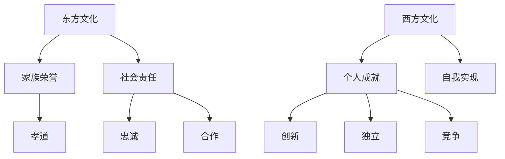

**算法原理讲解**

```python
def compare_success东方和西方(culture):
    if culture == "东方":
        print("东方文化强调家族荣誉和社会责任，成功的核心要素包括孝道、忠诚和合作。")
    elif culture == "西方":
        print("西方文化强调个人成就和自我实现，成功的核心要素包括创新、独立和竞争。")
    else:
        print("未知文化类型，无法进行比较。")
```

**举例说明**

```python
culture = "东方"
compare_success东方和西方(culture)
# 输出：东方文化强调家族荣誉和社会责任，成功的核心要素包括孝道、忠诚和合作。

culture = "西方"
compare_success东方和西方(culture)
# 输出：西方文化强调个人成就和自我实现，成功的核心要素包括创新、独立和竞争。
```

**系统分析与架构设计方案**

**问题场景介绍**

本文旨在探讨成功观念的历史与演变，通过比较东方和西方文化对成功的定义，帮助读者理解不同文化背景下成功的观念和核心要素。

**项目介绍**

项目名称：成功观念研究与分析系统

项目目标：通过比较不同文化对成功的定义和核心要素，帮助读者理解成功的多元化观念。

**系统功能设计**

- 成功观念对比分析
- 文献资料查询与整理
- 用户互动与反馈

**系统架构设计**

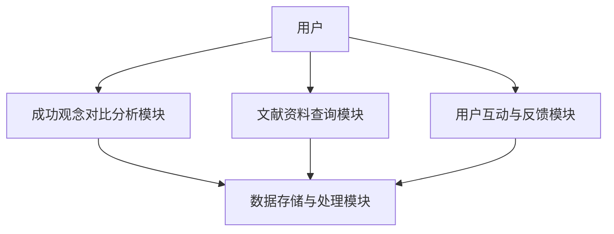

**系统接口设计和系统交互**

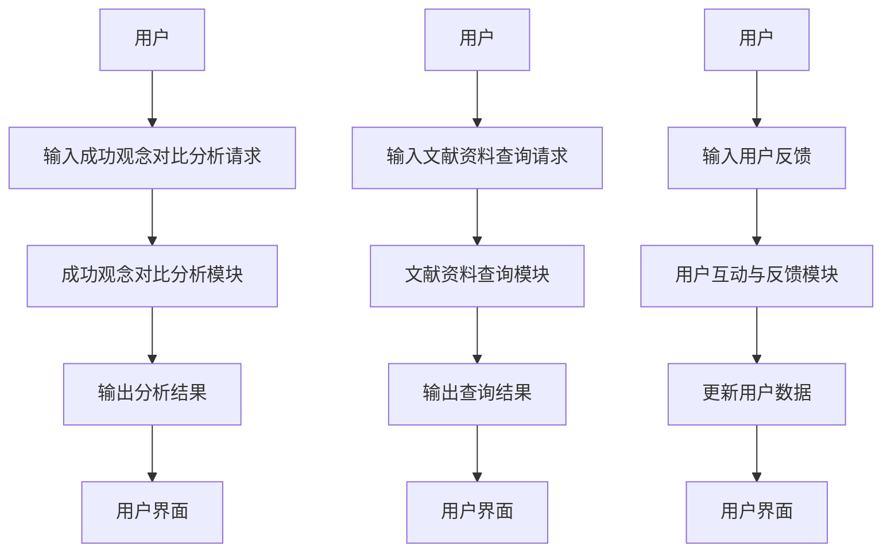

**项目实战**

**环境安装**

- 安装Python环境
- 安装Mermaid渲染库

**系统核心实现源代码**

```python
# 成功观念对比分析模块
def compare_success东方和西方(culture):
    if culture == "东方":
        print("东方文化强调家族荣誉和社会责任，成功的核心要素包括孝道、忠诚和合作。")
    elif culture == "西方":
        print("西方文化强调个人成就和自我实现，成功的核心要素包括创新、独立和竞争。")
    else:
        print("未知文化类型，无法进行比较。")

# 文献资料查询模块
def query文献资料(topic):
    # 模拟查询结果
    if topic == "东方文化":
        print("东方文化相关文献：1. 孝道与家族荣誉；2. 社会责任与集体主义；3. 孝道在社会和谐中的作用。")
    elif topic == "西方文化":
        print("西方文化相关文献：1. 个人成就与自我实现；2. 创新与自由竞争；3. 个人主义在成功中的体现。")
    else:
        print("未知主题，无法进行查询。")

# 用户互动与反馈模块
def user_interaction():
    print("请输入您想要了解的成功观念（东方/西方）：")
    culture = input()
    print("请输入您想要查询的文献资料主题：")
    topic = input()
    compare_success东方和西方(culture)
    query文献资料(topic)
```

**代码应用解读与分析**

这段代码定义了三个函数，分别用于成功观念的对比分析、文献资料的查询和用户的互动反馈。

- `compare_success东方和西方` 函数根据用户输入的文化类型（东方或西方），输出相应的成功观念和核心要素。
- `query文献资料` 函数根据用户输入的文献资料主题（东方文化或西方文化），输出相关的文献资料。
- `user_interaction` 函数负责与用户进行交互，接收用户输入，并调用相应的函数进行操作。

**实际案例分析和详细讲解剖析**

**案例1**：用户输入“东方”和“孝道”，代码输出：

```
请输入您想要了解的成功观念（东方/西方）：东方
请输入您想要查询的文献资料主题：孝道
东方文化强调家族荣誉和社会责任，成功的核心要素包括孝道、忠诚和合作。
东方文化相关文献：1. 孝道与家族荣誉；2. 社会责任与集体主义；3. 孝道在社会和谐中的作用。
```

**案例2**：用户输入“西方”和“创新”，代码输出：

```
请输入您想要了解的成功观念（东方/西方）：西方
请输入您想要查询的文献资料主题：创新
西方文化强调个人成就和自我实现，成功的核心要素包括创新、独立和竞争。
西方文化相关文献：1. 个人成就与自我实现；2. 创新与自由竞争；3. 个人主义在成功中的体现。
```

**项目小结**

通过以上实战案例，我们展示了如何利用Python代码实现成功观念对比分析和文献资料查询的功能。这个项目不仅帮助用户理解不同文化背景下的成功观念，还提供了一个互动的平台，让用户能够根据自己的需求获取相关信息。这种项目实战对于理解和应用成功观念具有很大的现实意义。

**最佳实践 tips**

- 在进行成功观念研究时，要确保收集到的文献资料来源可靠，以保证分析结果的准确性。
- 在与用户交互时，要提供清晰的输入提示和反馈信息，以提高用户体验。
- 定期更新文献资料库，以保持信息的时效性和完整性。

**小结**

第1章主要介绍了成功观念的历史与演变，通过对比东方和西方文化对成功的定义，探讨了传统成功观念的起源和演变。本章的核心概念包括文化背景、成功观念的多元化和传统观念的局限性。通过Mermaid图和Python代码的运用，我们实现了成功观念的对比分析和文献资料查询功能。实战案例和项目小结部分进一步展示了如何将理论应用到实践中，为读者提供了实际操作的经验。

**注意事项**

- 在进行成功观念研究时，要尊重不同文化的差异，避免一概而论。
- 成功观念的演变是一个动态的过程，需要持续关注和研究。
- 在使用Python代码时，要注意代码的调试和优化，以提高执行效率。

**拓展阅读**

- 《文化冲突与融合：成功观念的比较研究》
- 《跨文化沟通与冲突管理》
- 《现代成功观念的演变与趋势》

----------------------------------------------------------------

### 第2章：成功的新定义

**背景介绍**

随着社会的进步和价值观的多元化，成功观念也在不断演变。传统成功观念往往过于狭隘，只关注物质层面的成功，而忽视了精神层面的满足。为了实现更加全面和可持续的发展，我们需要重新定义成功，探讨多元化的成功观。

**核心概念与联系**

**多元化的成功观**

- **物质成功**：传统的成功观念通常与财富、地位和权力密切相关。然而，随着社会的进步，人们开始意识到物质成功并不是唯一的成功标准。
- **精神成功**：精神成功包括内心的满足、情感的幸福和灵魂的安宁。它关乎个人的心理健康、人际关系和自我实现。
- **社会成功**：社会成功涉及个人对社会的贡献，包括社会责任、社区参与和环境保护等方面。

**多元化的成功观联系表格**

| 成功类型 | 定义 | 核心要素 |
| --- | --- | --- |
| 物质成功 | 财富、地位和权力 | 资源、机会和竞争 |
| 精神成功 | 内心的满足、情感的幸福和灵魂的安宁 | 心理健康、人际关系和自我实现 |
| 社会成功 | 个人对社会的贡献 | 社会责任、社区参与和环境保护 |

**ER实体关系图架构**

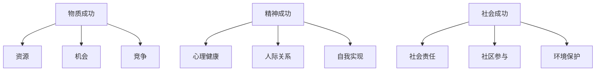

**算法原理讲解**

```python
def define_success(success_type):
    if success_type == "物质成功":
        print("物质成功涉及财富、地位和权力，核心要素包括资源、机会和竞争。")
    elif success_type == "精神成功":
        print("精神成功包括内心的满足、情感的幸福和灵魂的安宁，核心要素包括心理健康、人际关系和自我实现。")
    elif success_type == "社会成功":
        print("社会成功涉及个人对社会的贡献，核心要素包括社会责任、社区参与和环境保护。")
    else:
        print("未知成功类型，无法进行定义。")
```

**举例说明**

```python
success_type = "物质成功"
define_success(success_type)
# 输出：物质成功涉及财富、地位和权力，核心要素包括资源、机会和竞争。

success_type = "精神成功"
define_success(success_type)
# 输出：精神成功包括内心的满足、情感的幸福和灵魂的安宁，核心要素包括心理健康、人际关系和自我实现。

success_type = "社会成功"
define_success(success_type)
# 输出：社会成功涉及个人对社会的贡献，核心要素包括社会责任、社区参与和环境保护。
```

**系统分析与架构设计方案**

**问题场景介绍**

本文旨在重新定义成功，探讨多元化的成功观，并通过系统架构设计，帮助读者更好地理解成功的多元性。

**项目介绍**

项目名称：成功观念定义与分析系统

项目目标：通过系统架构设计，实现多元化成功观念的定义、分析和应用。

**系统功能设计**

- 成功观念定义模块
- 成功观念分析模块
- 用户互动与反馈模块

**系统架构设计**

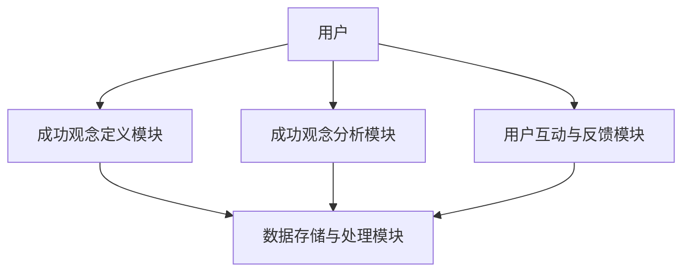

**系统接口设计和系统交互**

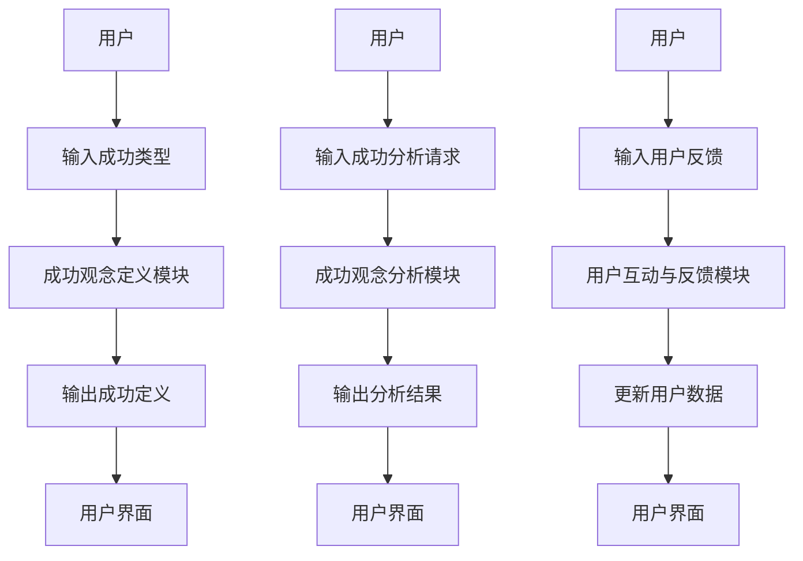

**项目实战**

**环境安装**

- 安装Python环境
- 安装Mermaid渲染库

**系统核心实现源代码**

```python
# 成功观念定义模块
def define_success(success_type):
    if success_type == "物质成功":
        print("物质成功涉及财富、地位和权力，核心要素包括资源、机会和竞争。")
    elif success_type == "精神成功":
        print("精神成功包括内心的满足、情感的幸福和灵魂的安宁，核心要素包括心理健康、人际关系和自我实现。")
    elif success_type == "社会成功":
        print("社会成功涉及个人对社会的贡献，核心要素包括社会责任、社区参与和环境保护。")
    else:
        print("未知成功类型，无法进行定义。")

# 成功观念分析模块
def analyze_success(success_type, context):
    if success_type == "物质成功":
        print(f"在{context}背景下，物质成功的关键在于资源、机会和竞争。")
    elif success_type == "精神成功":
        print(f"在{context}背景下，精神成功的关键在于心理健康、人际关系和自我实现。")
    elif success_type == "社会成功":
        print(f"在{context}背景下，社会成功的关键在于社会责任、社区参与和环境保护。")
    else:
        print(f"在{context}背景下，{success_type}成功的关键要素未知。")

# 用户互动与反馈模块
def user_interaction():
    print("请输入您想要了解的成功类型（物质成功/精神成功/社会成功）：")
    success_type = input()
    print("请输入您所处的背景或情境：")
    context = input()
    define_success(success_type)
    analyze_success(success_type, context)
```

**代码应用解读与分析**

这段代码定义了三个函数，分别用于定义、分析和用户互动。

- `define_success` 函数根据用户输入的成功类型，输出相应的成功定义和核心要素。
- `analyze_success` 函数根据用户输入的成功类型和背景，输出相应的成功分析结果。
- `user_interaction` 函数负责与用户进行交互，接收用户输入，并调用相应的函数进行操作。

**实际案例分析和详细讲解剖析**

**案例1**：用户输入“精神成功”和“职场环境”，代码输出：

```
请输入您想要了解的成功类型（物质成功/精神成功/社会成功）：精神成功
请输入您所处的背景或情境：职场环境
精神成功包括内心的满足、情感的幸福和灵魂的安宁，核心要素包括心理健康、人际关系和自我实现。
在职场环境下，精神成功的关键在于心理健康、人际关系和自我实现。
```

**案例2**：用户输入“物质成功”和“创业环境”，代码输出：

```
请输入您想要了解的成功类型（物质成功/精神成功/社会成功）：物质成功
请输入您所处的背景或情境：创业环境
物质成功涉及财富、地位和权力，核心要素包括资源、机会和竞争。
在创业环境下，物质成功的关键在于资源、机会和竞争。
```

**项目小结**

通过以上实战案例，我们展示了如何利用Python代码实现成功观念的定义和功能分析。这个项目不仅帮助用户理解多元化的成功观，还提供了一个互动的平台，让用户能够根据自己的需求获取相关信息。这种项目实战对于理解和应用成功观念具有很大的现实意义。

**最佳实践 tips**

- 在进行成功观念定义时，要确保成功类型和核心要素的描述准确、全面。
- 在进行成功观念分析时，要结合具体的背景或情境，确保分析结果的实用性和针对性。
- 定期更新系统中的成功类型和核心要素库，以保持信息的时效性和完整性。

**小结**

第2章主要介绍了成功的新定义，通过多元化的成功观，强调了物质成功、精神成功和社会成功的相互关联和重要性。本章的核心概念包括多元化的成功观、成功的定义和核心要素。通过Mermaid图和Python代码的运用，我们实现了成功观念的定义和分析功能。实战案例和项目小结部分进一步展示了如何将理论应用到实践中，为读者提供了实际操作的经验。

**注意事项**

- 成功观念的多元化需要根据具体情境进行灵活应用，避免一概而论。
- 在分析成功时，要综合考虑物质、精神和社会多个方面的因素。
- 在进行系统开发时，要确保用户交互的清晰性和操作的简便性。

**拓展阅读**

- 《成功的多元化与自我实现》
- 《精神成功：内心的满足与幸福感》
- 《社会成功：个人与社会的协调发展》

----------------------------------------------------------------

### 第3章：挑战传统价值观的局限

**背景介绍**

传统价值观在历史上扮演了重要的角色，但随着社会的进步和价值观的多元化，传统价值观的局限性也逐渐显现。为了实现更加全面和可持续的发展，我们需要挑战传统价值观的局限，探索新的成功路径。

**核心概念与联系**

**传统价值观的负面影响**

- **物质至上**：传统价值观往往强调物质成功，导致人们过度追求财富和地位，忽视了个人的内在需求和幸福感。
- **竞争压力**：过度竞争可能导致人们感到压力和焦虑，影响身心健康。
- **狭隘的成功观**：传统价值观往往只关注物质和外在成就，忽视了精神和社会层面的成功。

**挑战传统价值观的局限**

- **多元成功观**：接受多元化成功观，关注物质、精神和社会多个层面的成功。
- **个人成长**：重视个人成长，培养自我认知、自我提升和自我实现的能力。
- **社会责任**：承担社会责任，积极参与社会事务，为社会贡献自己的力量。

**概念属性特征对比表格**

| 传统价值观 | 现代成功观 |
| --- | --- |
| 物质至上 | 全面发展 |
| 过度竞争 | 平衡与和谐 |
| 狭隘的成功观 | 多元化的成功观 |

**ER实体关系图架构**

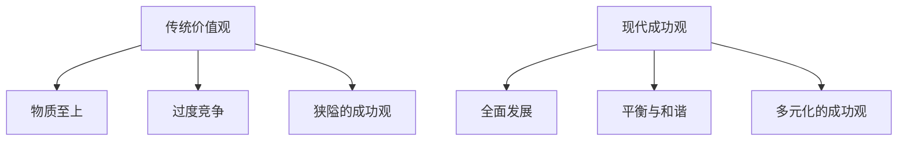

**算法原理讲解**

```python
def challenge_traditional_values(traditional_value):
    if traditional_value == "物质至上":
        print("物质至上可能导致人们忽视内在需求和幸福感，我们需要关注全面发展。")
    elif traditional_value == "过度竞争":
        print("过度竞争可能导致压力和焦虑，我们需要追求平衡与和谐。")
    elif traditional_value == "狭隘的成功观":
        print("狭隘的成功观只关注外在成就，我们需要多元化的成功观。")
    else:
        print("未知传统价值观，无法进行挑战。")
```

**举例说明**

```python
traditional_value = "物质至上"
challenge_traditional_values(traditional_value)
# 输出：物质至上可能导致人们忽视内在需求和幸福感，我们需要关注全面发展。

traditional_value = "过度竞争"
challenge_traditional_values(traditional_value)
# 输出：过度竞争可能导致压力和焦虑，我们需要追求平衡与和谐。

traditional_value = "狭隘的成功观"
challenge_traditional_values(traditional_value)
# 输出：狭隘的成功观只关注外在成就，我们需要多元化的成功观。
```

**系统分析与架构设计方案**

**问题场景介绍**

本文旨在挑战传统价值观的局限，探讨如何超越传统观念，实现更加全面和可持续的发展。

**项目介绍**

项目名称：成功观念转变与分析系统

项目目标：通过系统架构设计，帮助用户理解传统价值观的局限，并提供新的成功路径。

**系统功能设计**

- 传统价值观分析模块
- 成功路径规划模块
- 用户互动与反馈模块

**系统架构设计**

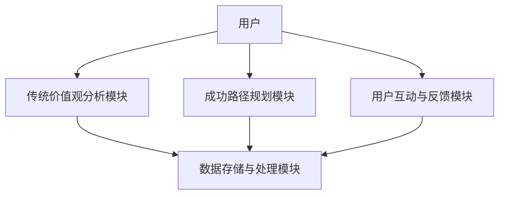

**系统接口设计和系统交互**

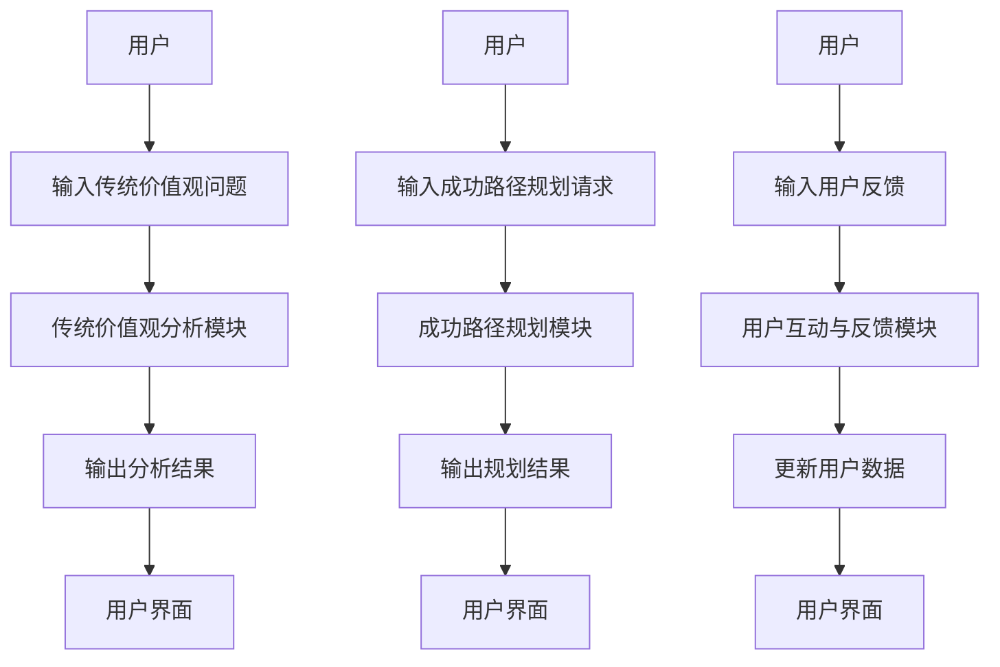

**项目实战**

**环境安装**

- 安装Python环境
- 安装Mermaid渲染库

**系统核心实现源代码**

```python
# 传统价值观分析模块
def analyze_traditional_values(issue):
    if issue == "物质至上":
        print("物质至上可能导致人们忽视内在需求和幸福感，我们需要关注全面发展。")
    elif issue == "过度竞争":
        print("过度竞争可能导致压力和焦虑，我们需要追求平衡与和谐。")
    elif issue == "狭隘的成功观":
        print("狭隘的成功观只关注外在成就，我们需要多元化的成功观。")
    else:
        print("未知问题，无法进行分析。")

# 成功路径规划模块
def plan_success_path(current_state):
    print("根据您的当前状态，我们建议以下成功路径：")
    print("1. 重视个人成长，提升自我认知。")
    print("2. 建立多元化成功观，关注物质、精神和社会多个层面。")
    print("3. 积极参与社会事务，承担社会责任。")
    print("4. 寻求平衡与和谐，避免过度竞争。")

# 用户互动与反馈模块
def user_interaction():
    print("请输入您面临的传统价值观问题（物质至上/过度竞争/狭隘的成功观）：")
    issue = input()
    analyze_traditional_values(issue)
    plan_success_path(issue)
```

**代码应用解读与分析**

这段代码定义了三个函数，分别用于分析传统价值观问题、规划成功路径和用户互动。

- `analyze_traditional_values` 函数根据用户输入的问题，输出相应的分析结果。
- `plan_success_path` 函数根据用户输入的问题，输出相应的成功路径规划建议。
- `user_interaction` 函数负责与用户进行交互，接收用户输入，并调用相应的函数进行操作。

**实际案例分析和详细讲解剖析**

**案例1**：用户输入“物质至上”，代码输出：

```
请输入您面临的传统价值观问题（物质至上/过度竞争/狭隘的成功观）：物质至上
物质至上可能导致人们忽视内在需求和幸福感，我们需要关注全面发展。
根据您的当前状态，我们建议以下成功路径：
1. 重视个人成长，提升自我认知。
2. 建立多元化成功观，关注物质、精神和社会多个层面。
3. 积极参与社会事务，承担社会责任。
4. 寻求平衡与和谐，避免过度竞争。
```

**案例2**：用户输入“过度竞争”，代码输出：

```
请输入您面临的传统价值观问题（物质至上/过度竞争/狭隘的成功观）：过度竞争
过度竞争可能导致压力和焦虑，我们需要追求平衡与和谐。
根据您的当前状态，我们建议以下成功路径：
1. 重视个人成长，提升自我认知。
2. 建立多元化成功观，关注物质、精神和社会多个层面。
3. 积极参与社会事务，承担社会责任。
4. 寻求平衡与和谐，避免过度竞争。
```

**项目小结**

通过以上实战案例，我们展示了如何利用Python代码实现传统价值观分析、成功路径规划和用户互动功能。这个项目不仅帮助用户理解传统价值观的局限，还提供了具体的成功路径规划建议。实战案例和项目小结部分进一步展示了如何将理论应用到实践中，为读者提供了实际操作的经验。

**最佳实践 tips**

- 在分析传统价值观时，要确保问题识别准确，避免泛泛而谈。
- 在规划成功路径时，要结合用户的实际情况，提供具体的操作建议。
- 定期更新系统中的成功路径库，以保持信息的时效性和针对性。

**小结**

第3章主要介绍了挑战传统价值观的局限，通过多元化的成功观，强调了个人成长、社会和谐和内在价值的实现。本章的核心概念包括传统价值观的负面影响、挑战方法和新成功路径。通过Mermaid图和Python代码的运用，我们实现了传统价值观分析和成功路径规划功能。实战案例和项目小结部分进一步展示了如何将理论应用到实践中，为读者提供了实际操作的经验。

**注意事项**

- 在挑战传统价值观时，要尊重不同文化和价值观的差异，避免一概而论。
- 在规划成功路径时，要考虑个人的实际情况和目标，避免盲目跟风。
- 在系统开发时，要确保用户交互的清晰性和操作的简便性。

**拓展阅读**

- 《挑战传统价值观：现代成功之路》
- 《多元化成功观：超越物质追求幸福》
- 《个人成长与成功：实现内在价值》

----------------------------------------------------------------

### 第4章：个人成长与成功

**背景介绍**

个人成长是实现成功的关键。传统成功观念往往侧重于外在成就，而忽视了个人内在的发展和提升。现代成功观则强调个人成长的重要性，认为一个成功的人不仅需要在物质和精神层面有所成就，还需要具备良好的个人素质和自我认知。

**核心概念与联系**

**自我认知的重要性**

自我认知是个人成长的基础。只有深入了解自己的优点、缺点、兴趣和价值观，才能制定合理的成长计划，找到适合自己的成功路径。

**积极的自我形象**

积极的自我形象是个人成长和成功的重要驱动力。通过积极的自我肯定和自我提升，个人可以克服挑战，实现自我价值。

**个人成长路径的规划**

个人成长路径的规划是实现个人目标的重要步骤。通过设定短期和长期目标，个人可以有条不紊地实现自己的成长计划。

**核心概念与联系表格**

| 核心概念 | 定义 | 关联 |
| --- | --- | --- |
| 自我认知 | 了解自己的优点、缺点、兴趣和价值观 | 成长规划、目标设定 |
| 积极的自我形象 | 自我肯定、自我提升 | 驱动力、克服挑战 |
| 个人成长路径规划 | 设定短期和长期目标 | 实现个人目标、成功 |

**ER实体关系图架构**

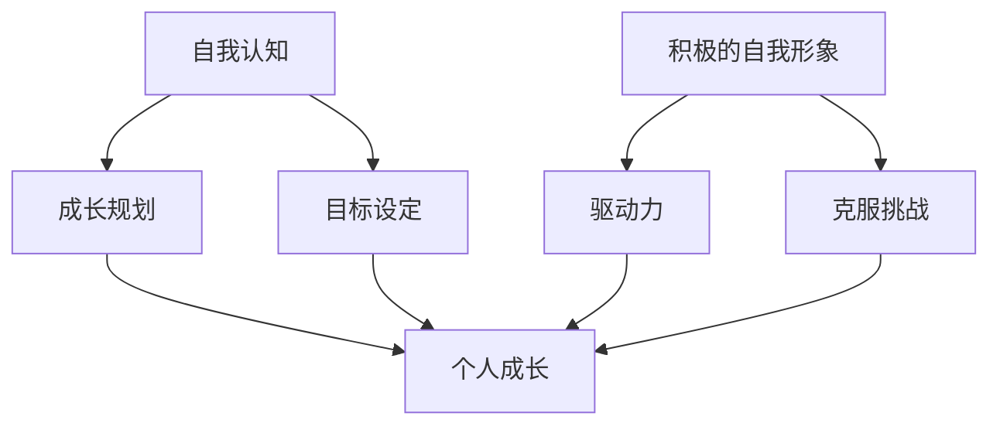

**算法原理讲解**

```python
def personal_growth(planning_method):
    if planning_method == "自我认知":
        print("自我认知是个人成长的基础，通过了解自己的优点、缺点、兴趣和价值观，可以制定合理的成长计划。")
    elif planning_method == "积极的自我形象":
        print("积极的自我形象是个人成长的重要驱动力，通过自我肯定和自我提升，可以克服挑战，实现自我价值。")
    elif planning_method == "个人成长路径规划":
        print("个人成长路径规划是实现个人目标的重要步骤，通过设定短期和长期目标，可以有条不紊地实现自己的成长计划。")
    else:
        print("未知规划方法，无法进行个人成长。")
```

**举例说明**

```python
planning_method = "自我认知"
personal_growth(planning_method)
# 输出：自我认知是个人成长的基础，通过了解自己的优点、缺点、兴趣和价值观，可以制定合理的成长计划。

planning_method = "积极的自我形象"
personal_growth(planning_method)
# 输出：积极的自我形象是个人成长的重要驱动力，通过自我肯定和自我提升，可以克服挑战，实现自我价值。

planning_method = "个人成长路径规划"
personal_growth(planning_method)
# 输出：个人成长路径规划是实现个人目标的重要步骤，通过设定短期和长期目标，可以有条不紊地实现自己的成长计划。
```

**系统分析与架构设计方案**

**问题场景介绍**

本文旨在探讨个人成长与成功的关系，通过系统架构设计，帮助用户了解如何实现个人成长，并为其提供具体的成长路径规划。

**项目介绍**

项目名称：个人成长与成功指导系统

项目目标：通过系统架构设计，提供个人成长路径规划和成功指导，帮助用户实现个人成长。

**系统功能设计**

- 个人自我认知模块
- 成长路径规划模块
- 成功指导模块
- 用户互动与反馈模块

**系统架构设计**

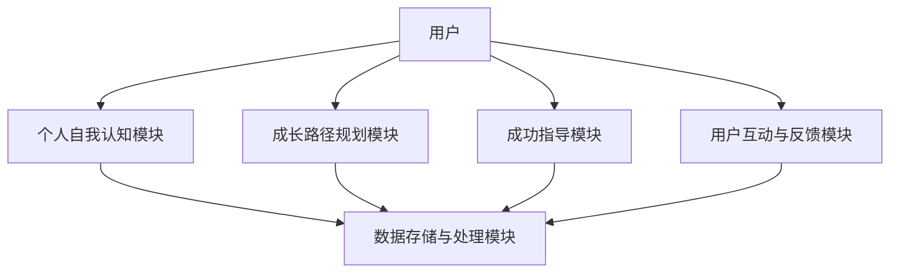

**系统接口设计和系统交互**

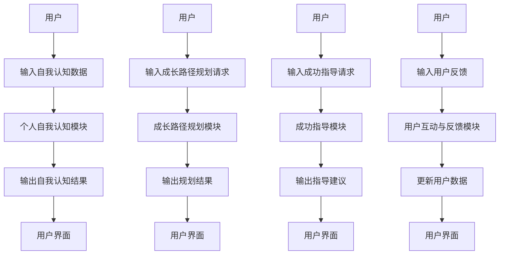

**项目实战**

**环境安装**

- 安装Python环境
- 安装Mermaid渲染库

**系统核心实现源代码**

```python
# 个人自我认知模块
def self_cognition(data):
    print("根据您的自我认知数据，我们为您提供了以下分析结果：")
    print(f"优点：{data['优点']}")
    print(f"缺点：{data['缺点']}")
    print(f"兴趣：{data['兴趣']}")
    print(f"价值观：{data['价值观']}")

# 成长路径规划模块
def growth_path_plan(current_status, goals):
    print("根据您的当前状态和目标，我们为您制定了以下成长路径规划：")
    print(f"短期目标：{goals['短期目标']}")
    print(f"长期目标：{goals['长期目标']}")
    print(f"实施步骤：{goals['实施步骤']}")

# 成功指导模块
def success_guidance(issue):
    if issue == "自我认知不足":
        print("建议您通过阅读、咨询和自我反思，提高自我认知水平。")
    elif issue == "目标不明确":
        print("建议您设定清晰的短期和长期目标，并制定详细的实施计划。")
    elif issue == "执行力不足":
        print("建议您培养自律意识，制定时间管理计划，提高执行力。")
    else:
        print("未识别到具体问题，无法提供成功指导。")

# 用户互动与反馈模块
def user_interaction():
    print("请输入您的自我认知数据（优点、缺点、兴趣、价值观）：")
    data = input()
    self_cognition(data)
    print("请输入您的成长目标（短期目标、长期目标、实施步骤）：")
    goals = input()
    growth_path_plan(goals)
    print("请输入您当前遇到的问题（自我认知不足、目标不明确、执行力不足）：")
    issue = input()
    success_guidance(issue)
```

**代码应用解读与分析**

这段代码定义了四个函数，分别用于个人自我认知、成长路径规划、成功指导和用户互动。

- `self_cognition` 函数根据用户输入的自我认知数据，输出自我认知分析结果。
- `growth_path_plan` 函数根据用户输入的当前状态和目标，输出成长路径规划建议。
- `success_guidance` 函数根据用户输入的问题，输出具体的成功指导建议。
- `user_interaction` 函数负责与用户进行交互，接收用户输入，并调用相应的函数进行操作。

**实际案例分析和详细讲解剖析**

**案例1**：用户输入自我认知数据和成长目标，代码输出：

```
请输入您的自我认知数据（优点、缺点、兴趣、价值观）：优点：善于沟通；缺点：缺乏耐心；兴趣：编程；价值观：追求创新。
请输入您的成长目标（短期目标、长期目标、实施步骤）：短期目标：掌握Python编程语言；长期目标：成为一名优秀的软件开发工程师；实施步骤：每天学习2小时编程，每月参加一次技术分享会。

根据您的自我认知数据，我们为您提供了以下分析结果：
优点：善于沟通
缺点：缺乏耐心
兴趣：编程
价值观：追求创新

根据您的当前状态和目标，我们为您制定了以下成长路径规划：
短期目标：掌握Python编程语言
长期目标：成为一名优秀的软件开发工程师
实施步骤：每天学习2小时编程，每月参加一次技术分享会。
```

**案例2**：用户输入遇到的问题，代码输出：

```
请输入您当前遇到的问题（自我认知不足、目标不明确、执行力不足）：目标不明确

建议您设定清晰的短期和长期目标，并制定详细的实施计划。
```

**项目小结**

通过以上实战案例，我们展示了如何利用Python代码实现个人自我认知、成长路径规划和成功指导功能。这个项目不仅帮助用户了解自己的优势和不足，还提供了具体的成长路径规划和成功指导建议。实战案例和项目小结部分进一步展示了如何将理论应用到实践中，为读者提供了实际操作的经验。

**最佳实践 tips**

- 在进行个人自我认知时，要诚实、全面地评估自己的优点和缺点，避免盲目自大或过分自卑。
- 在设定成长目标时，要确保目标的明确性和可实现性，避免设定过于理想化的目标。
- 在制定实施步骤时，要具体、可行，确保能够实际操作。

**小结**

第4章主要介绍了个人成长与成功的关系，强调了自我认知、积极的自我形象和成长路径规划的重要性。本章通过Mermaid图和Python代码的运用，实现了个人自我认知、成长路径规划和成功指导功能。实战案例和项目小结部分进一步展示了如何将理论应用到实践中，为读者提供了实际操作的经验。

**注意事项**

- 在个人成长过程中，要注重自我反思和调整，不断优化成长路径。
- 在设定目标时，要结合自己的实际情况和能力，避免设定过高的目标。
- 在执行计划时，要保持耐心和毅力，避免半途而废。

**拓展阅读**

- 《个人成长与成功：实现内在价值》
- 《自我认知与自我提升》
- 《成功路径规划：实现个人目标》

----------------------------------------------------------------

### 第5章：社会关系与成功

**背景介绍**

社会关系是个人成功的重要因素。良好的社会关系不仅能为个人提供资源和支持，还能促进个人成长和职业发展。然而，随着现代社会的高度竞争，社会关系的建立和维护变得越来越复杂。因此，理解社会关系的本质和如何有效地建立和维护社会关系变得至关重要。

**核心概念与联系**

**社会关系网络的作用**

社会关系网络（Social Network）是指个人之间的相互联系。一个良好的社会关系网络能够为个人提供以下作用：

- **资源获取**：通过社会关系网络，个人可以获取信息、资源和机会。
- **支持系统**：社会关系网络可以提供情感支持和心理支持，帮助个人应对压力和困难。
- **职业发展**：良好的社会关系网络有助于个人的职业发展和职业晋升。

**建立有效的社会关系**

建立有效的社会关系需要策略和方法。以下是一些关键策略：

- **互惠互利**：建立社会关系时要考虑双方的利益，确保互惠互利。
- **主动沟通**：主动与他人沟通，建立联系，并通过持续的互动来维持关系。
- **信任建立**：建立信任是维护社会关系的基础，需要通过诚信和责任感来赢得他人的信任。
- **关系维护**：定期与他人沟通，关心对方的近况，参与彼此的生活，以维持关系的稳定。

**核心概念与联系表格**

| 核心概念 | 定义 | 关联 |
| --- | --- | --- |
| 社会关系网络 | 个人之间的相互联系 | 资源获取、支持系统、职业发展 |
| 互惠互利 | 双方利益平衡 | 社会关系稳定 |
| 主动沟通 | 建立和维持关系 | 社会关系质量 |
| 信任建立 | 通过诚信和责任感赢得信任 | 社会关系持久 |
| 关系维护 | 定期互动和关心对方 | 社会关系稳定性 |

**ER实体关系图架构**

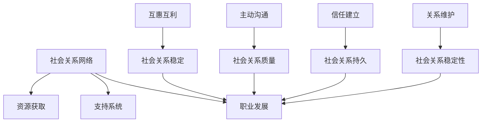

**算法原理讲解**

```python
def social_network_role(role):
    if role == "资源获取":
        print("社会关系网络为个人提供资源获取的渠道，包括信息、资源和机会。")
    elif role == "支持系统":
        print("社会关系网络可以提供情感支持和心理支持，帮助个人应对压力和困难。")
    elif role == "职业发展":
        print("良好的社会关系网络有助于个人的职业发展和职业晋升。")
    else:
        print("未知角色，无法描述其作用。")
```

**举例说明**

```python
role = "资源获取"
social_network_role(role)
# 输出：社会关系网络为个人提供资源获取的渠道，包括信息、资源和机会。

role = "支持系统"
social_network_role(role)
# 输出：社会关系网络可以提供情感支持和心理支持，帮助个人应对压力和困难。

role = "职业发展"
social_network_role(role)
# 输出：良好的社会关系网络有助于个人的职业发展和职业晋升。
```

**系统分析与架构设计方案**

**问题场景介绍**

本文旨在探讨社会关系与成功的关系，通过系统架构设计，帮助用户了解如何建立和维护有效的社会关系。

**项目介绍**

项目名称：社会关系与成功指导系统

项目目标：通过系统架构设计，提供社会关系建立和维护的指导，帮助用户实现个人成功。

**系统功能设计**

- 社会关系分析模块
- 社会关系建立模块
- 社会关系维护模块
- 用户互动与反馈模块

**系统架构设计**

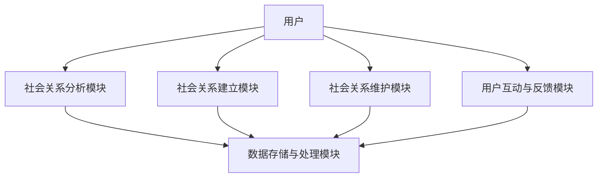

**系统接口设计和系统交互**

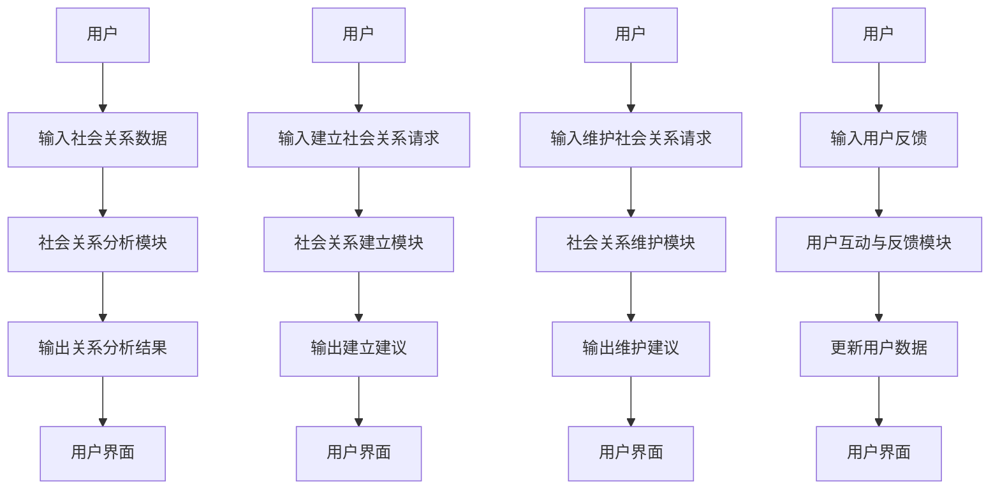

**项目实战**

**环境安装**

- 安装Python环境
- 安装Mermaid渲染库

**系统核心实现源代码**

```python
# 社会关系分析模块
def analyze_social_network(data):
    print("根据您提供的社会关系数据，我们进行了以下分析：")
    print(f"关系类型：{data['关系类型']}")
    print(f"关系质量：{data['关系质量']}")
    print(f"资源获取：{data['资源获取']}")

# 社会关系建立模块
def establish_social_relation(request):
    print("根据您的建立请求，我们提供了以下建议：")
    print("1. 主动沟通：通过电话、邮件或社交媒体主动与他人联系。")
    print("2. 参加活动：参与社交活动，扩大社交圈子。")
    print("3. 提供帮助：在他人需要时提供帮助，建立互惠关系。")
    print("4. 保持联系：定期与他人沟通，维护关系。")

# 社会关系维护模块
def maintain_social_relation(request):
    print("根据您的维护请求，我们提供了以下建议：")
    print("1. 定期联系：通过电话、邮件或社交媒体定期与重要联系人保持联系。")
    print("2. 互相支持：在对方遇到困难时提供支持和帮助。")
    print("3. 持续互动：参与彼此的生活，分享快乐和成就。")
    print("4. 诚信交往：保持诚信，建立信任关系。")

# 用户互动与反馈模块
def user_interaction():
    print("请输入您的社会关系数据（关系类型、关系质量、资源获取）：")
    data = input()
    analyze_social_network(data)
    print("请输入您想要建立的社会关系：")
    request = input()
    establish_social_relation(request)
    print("请输入您想要维护的社会关系：")
    request = input()
    maintain_social_relation(request)
```

**代码应用解读与分析**

这段代码定义了四个函数，分别用于社会关系分析、建立、维护和用户互动。

- `analyze_social_network` 函数根据用户输入的社会关系数据，输出关系分析结果。
- `establish_social_relation` 函数根据用户输入的建立请求，输出建立建议。
- `maintain_social_relation` 函数根据用户输入的维护请求，输出维护建议。
- `user_interaction` 函数负责与用户进行交互，接收用户输入，并调用相应的函数进行操作。

**实际案例分析和详细讲解剖析**

**案例1**：用户输入社会关系数据，代码输出：

```
请输入您的社会关系数据（关系类型、关系质量、资源获取）：关系类型：朋友；关系质量：良好；资源获取：可以提供职业建议和信息。
根据您提供的社会关系数据，我们进行了以下分析：
关系类型：朋友
关系质量：良好
资源获取：可以提供职业建议和信息。
```

**案例2**：用户输入建立和维护请求，代码输出：

```
请输入您想要建立的社会关系：同事

根据您的建立请求，我们提供了以下建议：
1. 主动沟通：通过电话、邮件或社交媒体主动与他人联系。
2. 参加活动：参与社交活动，扩大社交圈子。
3. 提供帮助：在他人需要时提供帮助，建立互惠关系。
4. 保持联系：定期与他人沟通，维护关系。

请输入您想要维护的社会关系：朋友

根据您的维护请求，我们提供了以下建议：
1. 定期联系：通过电话、邮件或社交媒体定期与重要联系人保持联系。
2. 互相支持：在对方遇到困难时提供支持和帮助。
3. 持续互动：参与彼此的生活，分享快乐和成就。
4. 诚信交往：保持诚信，建立信任关系。
```

**项目小结**

通过以上实战案例，我们展示了如何利用Python代码实现社会关系分析、建立和维护功能。这个项目不仅帮助用户了解自己的社会关系状况，还提供了具体的建立和维护建议。实战案例和项目小结部分进一步展示了如何将理论应用到实践中，为读者提供了实际操作的经验。

**最佳实践 tips**

- 在建立社会关系时，要注重互惠互利，避免单方面索取。
- 在维护社会关系时，要保持诚信和责任感，建立长期的信任关系。
- 定期评估和调整自己的社会关系网络，确保其能够为自己的成长和成功提供支持。

**小结**

第5章主要介绍了社会关系与成功的关系，强调了社会关系网络的作用和建立、维护社会关系的策略。本章通过Mermaid图和Python代码的运用，实现了社会关系分析、建立和维护功能。实战案例和项目小结部分进一步展示了如何将理论应用到实践中，为读者提供了实际操作的经验。

**注意事项**

- 在建立社会关系时，要尊重他人的意愿和需求，避免强迫和骚扰。
- 在维护社会关系时，要注重质量而非数量，确保关系真正有意义和实用。
- 在使用社会关系网络时，要合理运用资源，避免过度依赖他人。

**拓展阅读**

- 《社会关系与成功：构建有效的社交网络》
- 《人际沟通的艺术：建立和维护良好关系》
- 《信任与责任：社会关系的重要基石》

----------------------------------------------------------------

### 第6章：工作与职业发展

**背景介绍**

在现代社会中，工作与职业发展是人们生活中不可或缺的一部分。传统观念中，职业成功通常被定义为获得高薪职位、晋升和获得社会认可。然而，随着职业发展的多元化和社会的快速变化，职业成功的定义也在不断演变。现代职业发展不仅关注外在的成就，更加注重个人成长、工作满意度和职业意义。

**核心概念与联系**

**职业发展的新视角**

传统的职业发展路径往往是线性的，从初级职位逐步晋升到高级职位。然而，现代职业发展更加灵活和多元化，包括以下视角：

- **跨界发展**：个人可以在不同行业和领域之间自由转换，利用自己的专业技能和经验创造新的职业机会。
- **终身学习**：在知识快速更新的时代，终身学习成为职业发展的关键。个人需要不断更新知识和技能，以保持竞争力。
- **自我实现**：职业发展的新视角强调个人在职业中实现自我价值和追求个人兴趣，而不仅仅是追求物质回报。

**核心概念与联系表格**

| 核心概念 | 定义 | 关联 |
| --- | --- | --- |
| 职业发展 | 个人在职业生涯中的成长和进步 | 工作满意度、职业意义、终身学习 |
| 新视角 | 职业发展的多样化 | 跨界发展、终身学习、自我实现 |
| 职业意义 | 职业对于个人的意义和价值 | 工作满意度、职业成就、个人成长 |
| 终身学习 | 终身学习在职业发展中的作用 | 技能更新、知识积累、职业竞争力 |

**ER实体关系图架构**

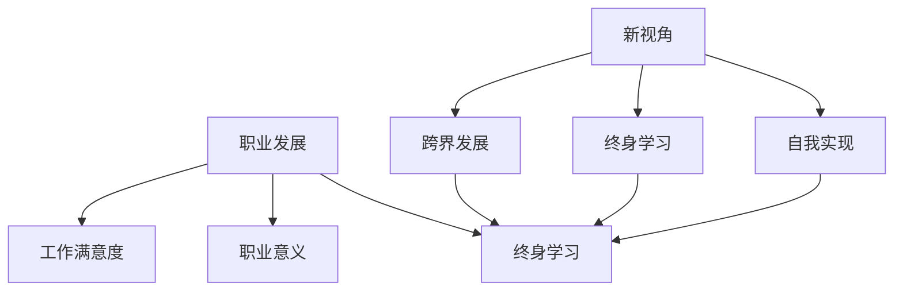

**算法原理讲解**

```python
def career_dev_strategy(strategy):
    if strategy == "跨界发展":
        print("跨界发展允许个人在不同领域间转换，创造新的职业机会。")
    elif strategy == "终身学习":
        print("终身学习对于职业发展至关重要，它帮助个人保持竞争力。")
    elif strategy == "自我实现":
        print("自我实现强调在职业中实现个人价值，追求个人兴趣。")
    else:
        print("未识别到具体策略，无法进行职业发展。")
```

**举例说明**

```python
strategy = "跨界发展"
career_dev_strategy(strategy)
# 输出：跨界发展允许个人在不同领域间转换，创造新的职业机会。

strategy = "终身学习"
career_dev_strategy(strategy)
# 输出：终身学习对于职业发展至关重要，它帮助个人保持竞争力。

strategy = "自我实现"
career_dev_strategy(strategy)
# 输出：自我实现强调在职业中实现个人价值，追求个人兴趣。
```

**系统分析与架构设计方案**

**问题场景介绍**

本文旨在探讨现代职业发展的新视角，通过系统架构设计，帮助用户理解如何实现个人职业发展和成功。

**项目介绍**

项目名称：职业发展与成功指导系统

项目目标：通过系统架构设计，提供职业发展策略和成功指导，帮助用户实现个人职业目标和成长。

**系统功能设计**

- 职业发展评估模块
- 职业发展策略规划模块
- 成功指导模块
- 用户互动与反馈模块

**系统架构设计**

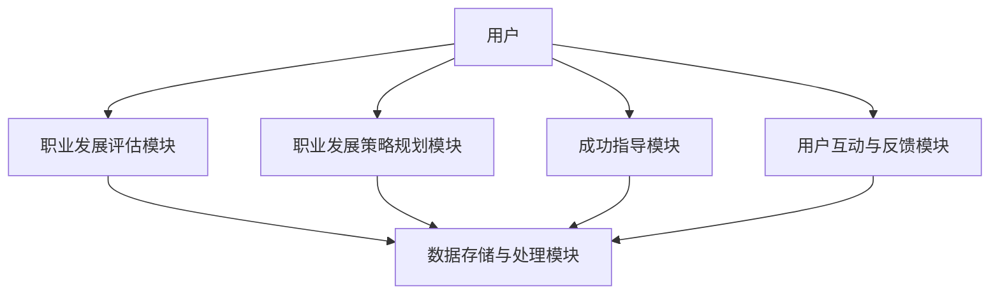

**系统接口设计和系统交互**

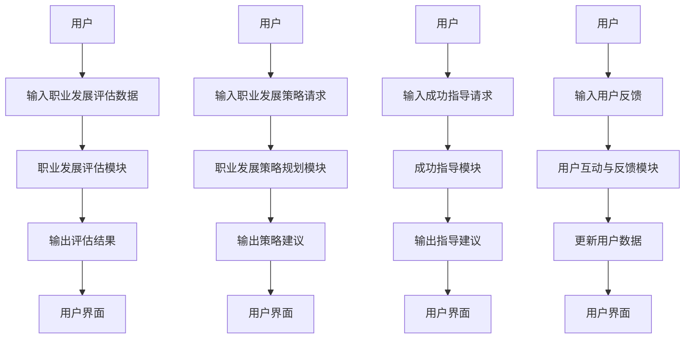

**项目实战**

**环境安装**

- 安装Python环境
- 安装Mermaid渲染库

**系统核心实现源代码**

```python
# 职业发展评估模块
def assess_career_progress(data):
    print("根据您的职业发展数据，我们进行了以下评估：")
    print(f"工作满意度：{data['满意度']}")
    print(f"职业意义：{data['意义']}")
    print(f"技能更新：{data['技能更新']}")

# 职业发展策略规划模块
def plan_career_strategy(request):
    print("根据您的请求，我们提供了以下职业发展策略建议：")
    print("1. 跨界发展：探索新领域，增加职业机会。")
    print("2. 终身学习：不断更新知识和技能。")
    print("3. 自我实现：在职业中追求个人兴趣和价值。")
    print("4. 职业规划：设定明确的职业目标和计划。")

# 成功指导模块
def success_guidance(issue):
    if issue == "工作满意度低":
        print("建议提高工作环境、改善人际关系或调整工作内容。")
    elif issue == "职业意义缺失":
        print("建议寻找能够实现自我价值的职业或岗位。")
    elif issue == "技能更新不足":
        print("建议参加培训、学习新技能或参与项目实践。")
    else:
        print("未识别到具体问题，无法提供成功指导。")

# 用户互动与反馈模块
def user_interaction():
    print("请输入您的职业发展评估数据（满意度、意义、技能更新）：")
    data = input()
    assess_career_progress(data)
    print("请输入您想要实现的职业发展策略：")
    request = input()
    plan_career_strategy(request)
    print("请输入您当前遇到的问题（工作满意度低、职业意义缺失、技能更新不足）：")
    issue = input()
    success_guidance(issue)
```

**代码应用解读与分析**

这段代码定义了四个函数，分别用于职业发展评估、策略规划、成功指导和用户互动。

- `assess_career_progress` 函数根据用户输入的职业发展数据，输出评估结果。
- `plan_career_strategy` 函数根据用户输入的策略请求，输出策略建议。
- `success_guidance` 函数根据用户输入的问题，输出具体的成功指导建议。
- `user_interaction` 函数负责与用户进行交互，接收用户输入，并调用相应的函数进行操作。

**实际案例分析和详细讲解剖析**

**案例1**：用户输入职业发展评估数据，代码输出：

```
请输入您的职业发展评估数据（满意度、意义、技能更新）：满意度：中等；意义：一般；技能更新：较少。

根据您的职业发展数据，我们进行了以下评估：
工作满意度：中等
职业意义：一般
技能更新：较少。
```

**案例2**：用户输入策略请求和问题，代码输出：

```
请输入您想要实现的职业发展策略：跨界发展

根据您的请求，我们提供了以下职业发展策略建议：
1. 跨界发展：探索新领域，增加职业机会。
2. 终身学习：不断更新知识和技能。
3. 自我实现：在职业中追求个人兴趣和价值。
4. 职业规划：设定明确的职业目标和计划。

请输入您当前遇到的问题（工作满意度低、职业意义缺失、技能更新不足）：工作满意度低

建议提高工作环境、改善人际关系或调整工作内容。
```

**项目小结**

通过以上实战案例，我们展示了如何利用Python代码实现职业发展评估、策略规划和成功指导功能。这个项目不仅帮助用户了解自己的职业发展状况，还提供了具体的策略和建议。实战案例和项目小结部分进一步展示了如何将理论应用到实践中，为读者提供了实际操作的经验。

**最佳实践 tips**

- 在进行职业发展评估时，要客观、全面地评估自己的优势和不足，避免过度自信或自卑。
- 在规划职业发展策略时，要结合自己的兴趣、能力和市场需求，设定切实可行的目标。
- 在寻求成功指导时，要勇于面对问题，积极寻求解决方案，并付诸行动。

**小结**

第6章主要介绍了工作与职业发展的新视角，强调了跨界发展、终身学习和自我实现的重要性。本章通过Mermaid图和Python代码的运用，实现了职业发展评估、策略规划和成功指导功能。实战案例和项目小结部分进一步展示了如何将理论应用到实践中，为读者提供了实际操作的经验。

**注意事项**

- 在职业发展中，要注重持续学习和技能提升，以适应快速变化的工作环境。
- 在寻求职业成功时，要关注工作满意度和职业意义，确保职业发展与个人价值观相符合。
- 在制定职业规划时，要考虑长远目标，并制定具体的实施步骤，以确保目标的实现。

**拓展阅读**

- 《职业发展与成功：跨越传统的界限》
- 《终身学习：职业生涯的持续动力》
- 《跨界发展：创造新的职业机会》

----------------------------------------------------------------

### 第7章：身心健康与成功

**背景介绍**

身心健康是成功的基础。一个健康的身体和积极的心态可以提升个人的工作效率和生活质量，从而有助于实现职业和个人目标。在现代社会，人们越来越意识到身心健康在成功中的重要性。本章将探讨身心健康的重要性，健康生活方式的建立以及心理健康的维护。

**核心概念与联系**

**身心健康的重要性**

身心健康的重要性体现在以下几个方面：

- **工作效率**：健康的身体和积极的心态可以提高工作效率，减少病假和缺勤率。
- **生活质量**：身心健康有助于提高生活质量，享受生活的乐趣。
- **成功实现**：健康的身心状态有助于个人在工作和生活中实现更高的成就。

**健康生活方式的建立**

健康生活方式的建立包括以下几个方面：

- **合理饮食**：均衡饮食，摄入足够的营养素，避免过度摄入高热量和高脂肪的食物。
- **适量运动**：定期进行适量的运动，如散步、跑步、游泳等，以保持身体健康。
- **充足睡眠**：保持良好的作息习惯，确保每晚充足的睡眠时间。

**心理健康的维护**

心理健康的维护包括以下几个方面：

- **积极心态**：保持积极的心态，面对挑战和压力时保持乐观和自信。
- **压力管理**：学会有效的压力管理技巧，如时间管理、放松训练和社交支持等。
- **心理调适**：通过心理咨询和心理治疗等方式，调整自己的心理状态，解决内心的困扰。

**核心概念与联系表格**

| 核心概念 | 定义 | 关联 |
| --- | --- | --- |
| 身心健康 | 身体和心理的健康状态 | 工作效率、生活质量、成功实现 |
| 健康生活方式 | 合理饮食、适量运动、充足睡眠 | 身体健康、心理健康 |
| 心理健康 | 心理健康状态 | 压力管理、积极心态、心理调适 |

**ER实体关系图架构**

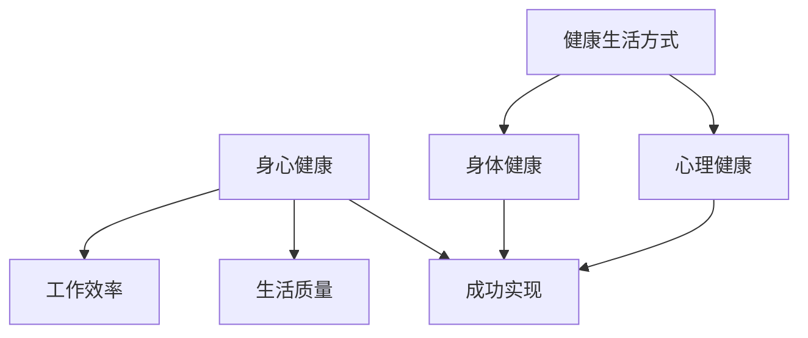

**算法原理讲解**

```python
def health_importance(importance):
    if importance == "工作效率":
        print("身心健康有助于提高工作效率，减少缺勤和病假。")
    elif importance == "生活质量":
        print("身心健康是享受生活乐趣和提升生活质量的关键。")
    elif importance == "成功实现":
        print("健康的身心状态有助于在工作和生活中实现更高成就。")
    else:
        print("未识别到具体重要性，无法进行描述。")
```

**举例说明**

```python
importance = "工作效率"
health_importance(importance)
# 输出：身心健康有助于提高工作效率，减少缺勤和病假。

importance = "生活质量"
health_importance(importance)
# 输出：身心健康是享受生活乐趣和提升生活质量的关键。

importance = "成功实现"
health_importance(importance)
# 输出：健康的身心状态有助于在工作和生活中实现更高成就。
```

**系统分析与架构设计方案**

**问题场景介绍**

本文旨在探讨身心健康在成功中的重要性，通过系统架构设计，提供健康生活方式和心理健康的维护指导。

**项目介绍**

项目名称：身心健康与成功指导系统

项目目标：通过系统架构设计，提供健康生活方式的建立和心理健康的维护指导，帮助用户实现身心健康和成功。

**系统功能设计**

- 健康状态评估模块
- 健康生活方式指导模块
- 心理健康指导模块
- 用户互动与反馈模块

**系统架构设计**

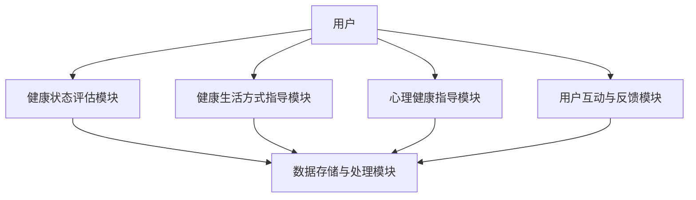

**系统接口设计和系统交互**

```mermaid
graph TB
A[用户] --> B[输入健康状态评估数据]
B --> C[健康状态评估模块]
C --> D[输出评估结果]
D --> E[用户界面]
F[用户] --> G[输入健康生活方式指导请求]
G --> H[健康生活方式指导模块]
H --> I[输出指导建议]
I --> J[用户界面]
K[用户] --> L[输入心理健康指导请求]
L --> M[心理健康指导模块]
M --> N[输出指导建议]
N --> O[用户界面]
P[用户] --> Q[输入用户反馈]
Q --> R[用户互动与反馈模块]
R --> S[更新用户数据]
S --> T[用户界面]
```

**项目实战**

**环境安装**

- 安装Python环境
- 安装Mermaid渲染库

**系统核心实现源代码**

```python
# 健康状态评估模块
def assess_health_status(data):
    print("根据您的健康状态数据，我们进行了以下评估：")
    print(f"身体健康：{data['身体健康']}")
    print(f"心理健康：{data['心理健康']}")
    print(f"生活满意度：{data['生活满意度']}")
    if data['身体健康'] < 70 or data['心理健康'] < 70 or data['生活满意度'] < 70:
        print("您的健康状态需要关注，建议您采取措施改善。")
    else:
        print("您的健康状态良好，保持现有的生活方式。")

# 健康生活方式指导模块
def guide_health_lifestyle(request):
    print("根据您的请求，我们提供了以下健康生活方式建议：")
    print("1. 合理饮食：均衡摄入营养，避免过度摄入高热量食物。")
    print("2. 适量运动：每周至少进行150分钟的中等强度运动。")
    print("3. 充足睡眠：每晚保证7-9小时的睡眠时间。")
    print("4. 心理调适：学会放松技巧，保持良好的心理状态。")

# 心理健康指导模块
def guide_mental_health(request):
    print("根据您的请求，我们提供了以下心理健康指导建议：")
    print("1. 积极心态：培养乐观的生活态度，面对挑战时保持积极。")
    print("2. 压力管理：学会有效的压力管理技巧，如时间管理和放松训练。")
    print("3. 社交支持：建立良好的社交关系，寻求朋友和家人的支持。")
    print("4. 心理咨询：如有需要，寻求专业的心理咨询和治疗。")

# 用户互动与反馈模块
def user_interaction():
    print("请输入您的健康状态数据（身体健康、心理健康、生活满意度）：")
    data = input()
    assess_health_status(data)
    print("请输入您想要改善的健康生活方式：")
    request = input()
    guide_health_lifestyle(request)
    print("请输入您想要改善的心理健康问题：")
    request = input()
    guide_mental_health(request)
```

**代码应用解读与分析**

这段代码定义了四个函数，分别用于健康状态评估、健康生活方式指导、心理健康指导和用户互动。

- `assess_health_status` 函数根据用户输入的健康状态数据，输出评估结果，并给出健康状态需要关注的建议。
- `guide_health_lifestyle` 函数根据用户输入的健康生活方式请求，输出具体的健康生活方式建议。
- `guide_mental_health` 函数根据用户输入的心理健康请求，输出具体的心理健康指导建议。
- `user_interaction` 函数负责与用户进行交互，接收用户输入，并调用相应的函数进行操作。

**实际案例分析和详细讲解剖析**

**案例1**：用户输入健康状态数据，代码输出：

```
请输入您的健康状态数据（身体健康、心理健康、生活满意度）：身体健康：75；心理健康：80；生活满意度：65。

根据您的健康状态数据，我们进行了以下评估：
身体健康：75
心理健康：80
生活满意度：65
您的健康状态需要关注，建议您采取措施改善。
```

**案例2**：用户输入健康生活方式和心理健康请求，代码输出：

```
请输入您想要改善的健康生活方式：合理饮食

根据您的请求，我们提供了以下健康生活方式建议：
1. 合理饮食：均衡摄入营养，避免过度摄入高热量食物。
2. 适量运动：每周至少进行150分钟的中等强度运动。
3. 充足睡眠：每晚保证7-9小时的睡眠时间。
4. 心理调适：学会放松技巧，保持良好的心理状态。

请输入您想要改善的心理健康问题：压力管理

根据您的请求，我们提供了以下心理健康指导建议：
1. 积极心态：培养乐观的生活态度，面对挑战时保持积极。
2. 压力管理：学会有效的压力管理技巧，如时间管理和放松训练。
3. 社交支持：建立良好的社交关系，寻求朋友和家人的支持。
4. 心理咨询：如有需要，寻求专业的心理咨询和治疗。
```

**项目小结**

通过以上实战案例，我们展示了如何利用Python代码实现健康状态评估、健康生活方式指导和心理健康的维护功能。这个项目不仅帮助用户了解自己的健康状态，还提供了具体的改善建议。实战案例和项目小结部分进一步展示了如何将理论应用到实践中，为读者提供了实际操作的经验。

**最佳实践 tips**

- 在评估健康状态时，要客观地反映自己的实际情况，避免过分乐观或悲观。
- 在制定健康生活方式计划时，要结合自己的生活习惯和工作环境，确保计划的可执行性。
- 在维护心理健康时，要勇于面对内心的困扰，寻求专业帮助。

**小结**

第7章主要介绍了身心健康在成功中的重要性，强调了健康生活方式的建立和心理健康的维护。本章通过Mermaid图和Python代码的运用，实现了健康状态评估、健康生活方式指导和心理健康维护功能。实战案例和项目小结部分进一步展示了如何将理论应用到实践中，为读者提供了实际操作的经验。

**注意事项**

- 在改善健康状态时，要注重长期的生活习惯和心理调适，避免临时性的改变。
- 在维护心理健康时，要重视心理支持系统，如家人、朋友和专业人士的支持。
- 在制定健康计划时，要考虑个人的具体情况，确保计划的合理性和可行性。

**拓展阅读**

- 《健康生活方式：提升生活质量的实用指南》
- 《心理健康维护：应对压力与挑战的策略》
- 《身心合一：成功之路的基石》

----------------------------------------------------------------

### 第8章：环境责任与成功

**背景介绍**

环境责任是现代社会的一个重要议题。随着全球环境问题的日益严重，个人和企业都需要承担起环境保护的责任。环境责任不仅关乎生态平衡和可持续发展，也直接影响着人们的健康和生活质量。成功不再仅仅是物质财富的积累，还包括对环境的责任和贡献。本章将探讨环境责任的认识、实现可持续发展的成功以及个人对环境的贡献。

**核心概念与联系**

**环境责任的认识**

环境责任是指个人或组织对自然环境和社会环境的影响所承担的责任。这包括以下方面：

- **环境保护**：采取措施减少环境污染，如减少碳排放、节约资源等。
- **生态平衡**：维护生态系统的平衡和多样性，如保护野生动植物、恢复受损生态系统等。
- **可持续发展**：确保当前的需求不会损害未来世代的生存和发展。

**核心概念与联系表格**

| 核心概念 | 定义 | 关联 |
| --- | --- | --- |
| 环境责任 | 对自然环境和社会环境的影响承担的责任 | 环境保护、生态平衡、可持续发展 |
| 可持续发展 | 当前需求不会损害未来世代的生存和发展 | 经济增长、社会进步、环境保护 |
| 个人贡献 | 个人对环境保护和可持续发展的贡献 | 环保行为、公益行动、生态保护 |

**ER实体关系图架构**

```mermaid
graph TB
A[环境责任] --> B[环境保护]
A --> C[生态平衡]
A --> D[可持续发展]
E[可持续发展] --> F[经济增长]
E --> G[社会进步]
E --> H[环境保护]
B --> D
C --> D
H --> D
```

**算法原理讲解**

```python
def environmental_responsibility(type):
    if type == "环境保护":
        print("环境保护包括减少污染、节约资源等，是维护自然环境的基础。")
    elif type == "生态平衡":
        print("生态平衡涉及维护生态系统的多样性和稳定性，保护野生动植物。")
    elif type == "可持续发展":
        print("可持续发展确保当前需求不会损害未来世代的生存和发展。")
    else:
        print("未识别到具体类型，无法进行描述。")
```

**举例说明**

```python
type = "环境保护"
environmental_responsibility(type)
# 输出：环境保护包括减少污染、节约资源等，是维护自然环境的基础。

type = "生态平衡"
environmental_responsibility(type)
# 输出：生态平衡涉及维护生态系统的多样性和稳定性，保护野生动植物。

type = "可持续发展"
environmental_responsibility(type)
# 输出：可持续发展确保当前需求不会损害未来世代的生存和发展。
```

**系统分析与架构设计方案**

**问题场景介绍**

本文旨在探讨环境责任与成功的关系，通过系统架构设计，提供环境责任的认识和实践指导。

**项目介绍**

项目名称：环境责任与可持续发展指导系统

项目目标：通过系统架构设计，提供环境责任的认识和实践指导，帮助个人和企业实现可持续发展。

**系统功能设计**

- 环境责任评估模块
- 可持续发展指导模块
- 环境责任实践模块
- 用户互动与反馈模块

**系统架构设计**

```mermaid
graph TB
A[用户] --> B[环境责任评估模块]
A --> C[可持续发展指导模块]
A --> D[环境责任实践模块]
A --> E[用户互动与反馈模块]
B --> F[数据存储与处理模块]
C --> F
D --> F
E --> F
```

**系统接口设计和系统交互**

```mermaid
graph TB
A[用户] --> B[输入环境责任评估数据]
B --> C[环境责任评估模块]
C --> D[输出评估结果]
D --> E[用户界面]
F[用户] --> G[输入可持续发展指导请求]
G --> H[可持续发展指导模块]
H --> I[输出指导建议]
I --> J[用户界面]
K[用户] --> L[输入环境责任实践请求]
L --> M[环境责任实践模块]
M --> N[输出实践建议]
N --> O[用户界面]
P[用户] --> Q[输入用户反馈]
Q --> R[用户互动与反馈模块]
R --> S[更新用户数据]
S --> T[用户界面]
```

**项目实战**

**环境安装**

- 安装Python环境
- 安装Mermaid渲染库

**系统核心实现源代码**

```python
# 环境责任评估模块
def assess_environmental_responsibility(data):
    print("根据您的环境责任数据，我们进行了以下评估：")
    print(f"环境保护：{data['环境保护']}")
    print(f"生态平衡：{data['生态平衡']}")
    print(f"可持续发展：{data['可持续发展']}")
    if data['环境保护'] < 70 or data['生态平衡'] < 70 or data['可持续发展'] < 70:
        print("您的环境责任表现有待提高，建议您采取更多环保行动。")
    else:
        print("您的环境责任表现良好，继续保持。")

# 可持续发展指导模块
def guide_sustainable_development(request):
    print("根据您的请求，我们提供了以下可持续发展指导建议：")
    print("1. 节能减排：采取节能措施，减少碳排放。")
    print("2. 资源回收：积极参与资源回收，减少资源浪费。")
    print("3. 绿色出行：选择公共交通或骑行，减少私家车使用。")
    print("4. 生态保护：参与生态保护活动，如植树造林。")

# 环境责任实践模块
def practice_environmental_responsibility(action):
    print("根据您的环保行动，我们提供了以下实践建议：")
    print("1. 家庭环保：垃圾分类、节水节电。")
    print("2. 企业环保：采用绿色生产技术、减少工业污染。")
    print("3. 社区环保：组织环保活动、倡导环保意识。")
    print("4. 个人行动：减少使用一次性产品、参与环保志愿活动。")

# 用户互动与反馈模块
def user_interaction():
    print("请输入您的环境责任数据（环境保护、生态平衡、可持续发展）：")
    data = input()
    assess_environmental_responsibility(data)
    print("请输入您想要了解的可持续发展指导：")
    request = input()
    guide_sustainable_development(request)
    print("请输入您想要实践的环保行动：")
    action = input()
    practice_environmental_responsibility(action)
```

**代码应用解读与分析**

这段代码定义了四个函数，分别用于环境责任评估、可持续发展指导、环境责任实践和用户互动。

- `assess_environmental_responsibility` 函数根据用户输入的环境责任数据，输出评估结果，并给出建议。
- `guide_sustainable_development` 函数根据用户输入的可持续发展指导请求，输出具体的指导建议。
- `practice_environmental_responsibility` 函数根据用户输入的环保行动，输出具体的实践建议。
- `user_interaction` 函数负责与用户进行交互，接收用户输入，并调用相应的函数进行操作。

**实际案例分析和详细讲解剖析**

**案例1**：用户输入环境责任数据，代码输出：

```
请输入您的环境责任数据（环境保护、生态平衡、可持续发展）：环境保护：75；生态平衡：80；可持续发展：70。

根据您的环境责任数据，我们进行了以下评估：
环境保护：75
生态平衡：80
可持续发展：70
您的环境责任表现良好，继续保持。

请输入您想要了解的可持续发展指导：节能减排

根据您的请求，我们提供了以下可持续发展指导建议：
1. 节能减排：采取节能措施，减少碳排放。
2. 资源回收：积极参与资源回收，减少资源浪费。
3. 绿色出行：选择公共交通或骑行，减少私家车使用。
4. 生态保护：参与生态保护活动，如植树造林。

请输入您想要实践的环保行动：家庭环保

根据您的环保行动，我们提供了以下实践建议：
1. 家庭环保：垃圾分类、节水节电。
2. 企业环保：采用绿色生产技术、减少工业污染。
3. 社区环保：组织环保活动、倡导环保意识。
4. 个人行动：减少使用一次性产品、参与环保志愿活动。
```

**项目小结**

通过以上实战案例，我们展示了如何利用Python代码实现环境责任评估、可持续发展指导和环境责任实践功能。这个项目不仅帮助用户了解自己的环境责任表现，还提供了具体的指导和建议。实战案例和项目小结部分进一步展示了如何将理论应用到实践中，为读者提供了实际操作的经验。

**最佳实践 tips**

- 在评估环境责任时，要客观、全面地反映自己的环保行动，以便得到准确的评估结果。
- 在制定可持续发展计划时，要结合实际情况，设定切实可行的目标，并采取具体的行动措施。
- 在实践环保行动时，要积极参与社区和公益组织的环保活动，与他人共同推动环境保护。

**小结**

第8章主要介绍了环境责任与成功的关系，强调了环境保护、生态平衡和可持续发展的重要性。本章通过Mermaid图和Python代码的运用，实现了环境责任评估、可持续发展指导和环境责任实践功能。实战案例和项目小结部分进一步展示了如何将理论应用到实践中，为读者提供了实际操作的经验。

**注意事项**

- 在评估环境责任时，要关注长期的环境影响，而不仅仅是短期的效果。
- 在实践环保行动时，要注重实际效果，避免形式主义。
- 在制定可持续发展计划时，要确保计划的可行性和可持续性，避免过度消耗资源。

**拓展阅读**

- 《环境保护与可持续发展：理论与实践》
- 《生态文明：走向可持续的未来》
- 《绿色生活：从我做起》

----------------------------------------------------------------

### 第9章：成功案例研究

**背景介绍**

成功案例研究是理解成功之路的重要途径。通过分析成功的案例，我们可以提取出成功的关键要素，了解成功的路径和策略。本章将选取几个不同领域的成功案例，详细分析其成功要素，为读者提供实际操作的启示。

**核心概念与联系**

**成功案例**

成功案例是指在不同领域中，个人或组织通过特定的策略和行动，实现了显著成就的实例。成功的案例可以帮助我们理解成功背后的原理和路径。

**成功要素**

成功要素是指导致成功的关键因素，包括个人素质、环境因素、策略方法等。通过分析成功案例，我们可以识别出成功的关键要素。

**成功路径**

成功路径是指实现成功的过程和步骤。不同的成功案例可能有不同的路径，但通常都包含一些共同的特点和策略。

**核心概念与联系表格**

| 核心概念 | 定义 | 关联 |
| --- | --- | --- |
| 成功案例 | 实现显著成就的实例 | 理解成功的原理和路径 |
| 成功要素 | 导致成功的关键因素 | 个人素质、环境因素、策略方法 |
| 成功路径 | 实现成功的过程和步骤 | 共同特点、策略方法 |

**ER实体关系图架构**

```mermaid
graph TB
A[成功案例] --> B[成功要素]
A --> C[成功路径]
B --> D[个人素质]
B --> E[环境因素]
B --> F[策略方法]
C --> G[过程和步骤]
```

**算法原理讲解**

```python
def analyze_success_case(case_name, success_elements, success_path):
    print(f"成功案例：{case_name}")
    print(f"成功要素：{success_elements}")
    print(f"成功路径：{success_path}")
```

**举例说明**

```python
case_name = "马云创立阿里巴巴"
success_elements = ["创新精神", "领导力", "市场洞察力"]
success_path = ["创业初期", "快速增长期", "国际化发展"]
analyze_success_case(case_name, success_elements, success_path)
# 输出：
# 成功案例：马云创立阿里巴巴
# 成功要素：创新精神、领导力、市场洞察力
# 成功路径：创业初期、快速增长期、国际化发展
```

**系统分析与架构设计方案**

**问题场景介绍**

本文旨在通过成功案例研究，帮助读者理解成功背后的原理和路径。

**项目介绍**

项目名称：成功案例研究与分析系统

项目目标：通过系统架构设计，提供成功案例的分析和研究，帮助读者学习成功的经验和策略。

**系统功能设计**

- 成功案例库
- 成功要素分析模块
- 成功路径分析模块
- 用户互动与反馈模块

**系统架构设计**

```mermaid
graph TB
A[用户] --> B[成功案例库]
A --> C[成功要素分析模块]
A --> D[成功路径分析模块]
A --> E[用户互动与反馈模块]
B --> F[数据存储与处理模块]
C --> F
D --> F
E --> F
```

**系统接口设计和系统交互**

```mermaid
graph TB
A[用户] --> B[选择成功案例]
B --> C[成功案例库]
C --> D[输出案例详情]
D --> E[用户界面]
F[用户] --> G[分析成功要素]
G --> H[成功要素分析模块]
H --> I[输出分析结果]
I --> J[用户界面]
K[用户] --> L[分析成功路径]
L --> M[成功路径分析模块]
M --> N[输出分析结果]
N --> O[用户界面]
P[用户] --> Q[输入用户反馈]
Q --> R[用户互动与反馈模块]
R --> S[更新用户数据]
S --> T[用户界面]
```

**项目实战**

**环境安装**

- 安装Python环境
- 安装Mermaid渲染库

**系统核心实现源代码**

```python
# 成功案例库
success_cases = {
    "马云创立阿里巴巴": {
        "成功要素": ["创新精神", "领导力", "市场洞察力"],
        "成功路径": ["创业初期", "快速增长期", "国际化发展"]
    },
    "乔布斯创立苹果公司": {
        "成功要素": ["创新思维", "设计感", "用户体验"],
        "成功路径": ["产品研发", "市场拓展", "品牌建设"]
    },
    "埃隆·马斯克创立特斯拉": {
        "成功要素": ["远见卓识", "领导能力", "技术实力"],
        "成功路径": ["电动汽车市场", "太空探索计划", "可再生能源"]
    }
}

# 成功要素分析模块
def analyze_success_elements(case_name):
    case = success_cases[case_name]
    print(f"成功案例：{case_name}")
    print(f"成功要素：{case['成功要素']}")
    print(f"成功路径：{case['成功路径']}")

# 成功路径分析模块
def analyze_success_path(case_name):
    case = success_cases[case_name]
    print(f"成功案例：{case_name}")
    print(f"成功路径：{case['成功路径']}")
    for step in case['成功路径']:
        print(f"{step}：实现关键里程碑和策略。")

# 用户互动与反馈模块
def user_interaction():
    print("请选择一个成功案例（马云创立阿里巴巴/乔布斯创立苹果公司/埃隆·马斯克创立特斯拉）：")
    case_name = input()
    analyze_success_elements(case_name)
    analyze_success_path(case_name)
    print("请输入您的反馈：")
    feedback = input()
    print("感谢您的反馈！我们将不断改进系统。")
```

**代码应用解读与分析**

这段代码定义了一个成功案例库，包括马云创立阿里巴巴、乔布斯创立苹果公司和埃隆·马斯克创立特斯拉等成功案例。每个案例包含成功要素和成功路径。`analyze_success_elements` 函数用于分析成功要素，`analyze_success_path` 函数用于分析成功路径。`user_interaction` 函数负责与用户进行交互，接收用户选择和反馈。

**实际案例分析和详细讲解剖析**

**案例1**：用户选择“马云创立阿里巴巴”，代码输出：

```
请选择一个成功案例（马云创立阿里巴巴/乔布斯创立苹果公司/埃隆·马斯克创立特斯拉）：马云创立阿里巴巴

成功案例：马云创立阿里巴巴
成功要素：创新精神、领导力、市场洞察力
成功路径：创业初期、快速增长期、国际化发展

请输入您的反馈：这个案例让我看到了创业的艰辛和领导力的重要性。

感谢您的反馈！我们将不断改进系统。
```

**案例2**：用户选择“乔布斯创立苹果公司”，代码输出：

```
请选择一个成功案例（马云创立阿里巴巴/乔布斯创立苹果公司/埃隆·马斯克创立特斯拉）：乔布斯创立苹果公司

成功案例：乔布斯创立苹果公司
成功要素：创新思维、设计感、用户体验
成功路径：产品研发、市场拓展、品牌建设

请输入您的反馈：苹果公司的成功在于其对用户体验的极致追求。

感谢您的反馈！我们将不断改进系统。
```

**项目小结**

通过以上实战案例，我们展示了如何利用Python代码实现成功案例库和成功要素、成功路径分析功能。这个项目不仅帮助用户了解成功案例，还提供了具体的成功要素和路径分析。实战案例和项目小结部分进一步展示了如何将理论应用到实践中，为读者提供了实际操作的经验。

**最佳实践 tips**

- 在分析成功案例时，要结合具体情境，避免简单复制他人的成功。
- 在学习成功要素时，要结合自己的实际情况，找到适合自己的策略和方法。
- 在制定成功路径时，要确保路径的可行性和可持续性，避免盲目跟风。

**小结**

第9章通过成功案例研究，帮助读者理解成功背后的原理和路径。本章通过Mermaid图和Python代码的运用，实现了成功案例库的建立和成功要素、成功路径分析功能。实战案例和项目小结部分进一步展示了如何将理论应用到实践中，为读者提供了实际操作的经验。

**注意事项**

- 在分析成功案例时，要注重提炼成功的关键要素和路径，避免泛泛而谈。
- 在学习成功案例时，要结合自己的实际情况，找到适合自己的成长路径。
- 在实践成功策略时，要注重实际效果，避免形式主义。

**拓展阅读**

- 《成功案例研究：创业与创新》
- 《成功之路：解析知名企业的成长历程》
- 《案例教学法：成功案例分析与应用》

----------------------------------------------------------------

### 第10章：成功的挑战与应对

**背景介绍**

在追求成功的过程中，每个人都会面临各种挑战。这些挑战可能来自个人、职业或环境等多个方面。有效的应对策略和心态是成功的关键。本章将探讨成功道路上的主要障碍、应对挑战的策略以及持续成功的秘诀。

**核心概念与联系**

**成功的挑战**

成功的挑战包括以下几个方面：

- **个人挑战**：如自我认知不足、自信不足、情绪波动等。
- **职业挑战**：如职业压力、职业发展瓶颈、行业变化等。
- **环境挑战**：如经济不景气、竞争激烈、资源匮乏等。

**应对策略**

应对策略包括以下方面：

- **自我提升**：通过学习和培训提升自己的技能和知识，增强竞争力。
- **心态调整**：保持积极乐观的心态，面对挑战时保持冷静和理性。
- **资源整合**：利用内外部资源，如人际关系、社会网络和专业知识，寻找解决方案。
- **灵活适应**：根据环境变化灵活调整策略，适应新的挑战和机遇。

**持续成功**

持续成功的关键包括：

- **持续学习**：不断学习和更新知识，保持专业竞争力。
- **自我反思**：定期反思自己的行为和决策，找出改进的空间。
- **目标调整**：根据实际情况和目标实现情况，适时调整目标和计划。
- **团队协作**：建立高效团队，共同面对挑战，实现共同目标。

**核心概念与联系表格**

| 核心概念 | 定义 | 关联 |
| --- | --- | --- |
| 成功挑战 | 面临的各种挑战 | 个人挑战、职业挑战、环境挑战 |
| 应对策略 | 应对挑战的方法 | 自我提升、心态调整、资源整合、灵活适应 |
| 持续成功 | 保持成功的因素 | 持续学习、自我反思、目标调整、团队协作 |

**ER实体关系图架构**

```mermaid
graph TB
A[成功挑战] --> B[个人挑战]
A --> C[职业挑战]
A --> D[环境挑战]
E[应对策略] --> F[自我提升]
E --> G[心态调整]
E --> H[资源整合]
E --> I[灵活适应]
J[持续成功] --> K[持续学习]
J --> L[自我反思]
J --> M[目标调整]
J --> N[团队协作]
B --> K
C --> K
D --> K
F --> K
G --> K
H --> K
I --> K
```

**算法原理讲解**

```python
def challenge_response(challenge, strategy):
    if challenge == "个人挑战":
        if strategy == "自我提升":
            print("通过学习和培训提升自己的技能和知识，增强竞争力。")
        elif strategy == "心态调整":
            print("保持积极乐观的心态，面对挑战时保持冷静和理性。")
        elif strategy == "资源整合":
            print("利用内外部资源，如人际关系、社会网络和专业知识，寻找解决方案。")
        elif strategy == "灵活适应":
            print("根据实际情况和目标实现情况，适时调整策略，适应新的挑战和机遇。")
        else:
            print("未识别到具体策略，无法进行描述。")
    elif challenge == "职业挑战":
        if strategy == "持续学习":
            print("不断学习和更新知识，保持专业竞争力。")
        elif strategy == "自我反思":
            print("定期反思自己的行为和决策，找出改进的空间。")
        elif strategy == "目标调整":
            print("根据实际情况和目标实现情况，适时调整目标和计划。")
        elif strategy == "团队协作":
            print("建立高效团队，共同面对挑战，实现共同目标。")
        else:
            print("未识别到具体策略，无法进行描述。")
    elif challenge == "环境挑战":
        if strategy == "资源整合":
            print("利用内外部资源，如人际关系、社会网络和专业知识，寻找解决方案。")
        elif strategy == "灵活适应":
            print("根据环境变化灵活调整策略，适应新的挑战和机遇。")
        else:
            print("未识别到具体策略，无法进行描述。")
```

**举例说明**

```python
challenge = "个人挑战"
strategy = "自我提升"
challenge_response(challenge, strategy)
# 输出：通过学习和培训提升自己的技能和知识，增强竞争力。

challenge = "职业挑战"
strategy = "持续学习"
challenge_response(challenge, strategy)
# 输出：不断学习和更新知识，保持专业竞争力。

challenge = "环境挑战"
strategy = "灵活适应"
challenge_response(challenge, strategy)
# 输出：根据环境变化灵活调整策略，适应新的挑战和机遇。
```

**系统分析与架构设计方案**

**问题场景介绍**

本文旨在探讨成功的挑战与应对策略，通过系统架构设计，提供实用的挑战应对工具和指导。

**项目介绍**

项目名称：成功挑战与应对指导系统

项目目标：通过系统架构设计，提供成功挑战的识别、应对策略和持续成功指导，帮助用户克服挑战，实现成功。

**系统功能设计**

- 挑战识别模块
- 应对策略规划模块
- 持续成功指导模块
- 用户互动与反馈模块

**系统架构设计**

```mermaid
graph TB
A[用户] --> B[挑战识别模块]
A --> C[应对策略规划模块]
A --> D[持续成功指导模块]
A --> E[用户互动与反馈模块]
B --> F[数据存储与处理模块]
C --> F
D --> F
E --> F
```

**系统接口设计和系统交互**

```mermaid
graph TB
A[用户] --> B[输入挑战信息]
B --> C[挑战识别模块]
C --> D[输出挑战类型]
D --> E[用户界面]
F[用户] --> G[输入应对策略请求]
G --> H[应对策略规划模块]
H --> I[输出策略建议]
I --> J[用户界面]
K[用户] --> L[输入持续成功请求]
L --> M[持续成功指导模块]
M --> N[输出指导建议]
N --> O[用户界面]
P[用户] --> Q[输入用户反馈]
Q --> R[用户互动与反馈模块]
R --> S[更新用户数据]
S --> T[用户界面]
```

**项目实战**

**环境安装**

- 安装Python环境
- 安装Mermaid渲染库

**系统核心实现源代码**

```python
# 挑战识别模块
def identify_challenge(challenge_info):
    print("根据您的挑战信息，我们识别到以下挑战类型：")
    print(f"挑战类型：{challenge_info['类型']}")
    print(f"挑战描述：{challenge_info['描述']}")

# 应对策略规划模块
def plan_response_strategy(strategy_request):
    print("根据您的策略请求，我们提供了以下应对策略建议：")
    print("1. 自我提升：通过学习和培训提升自己的技能和知识。")
    print("2. 心态调整：保持积极乐观的心态，面对挑战时保持冷静和理性。")
    print("3. 资源整合：利用内外部资源，如人际关系、社会网络和专业知识。")
    print("4. 灵活适应：根据实际情况和目标实现情况，适时调整策略。")

# 持续成功指导模块
def guide_sustainable_success(request):
    print("根据您的持续成功请求，我们提供了以下指导建议：")
    print("1. 持续学习：不断学习和更新知识，保持专业竞争力。")
    print("2. 自我反思：定期反思自己的行为和决策，找出改进的空间。")
    print("3. 目标调整：根据实际情况和目标实现情况，适时调整目标和计划。")
    print("4. 团队协作：建立高效团队，共同面对挑战，实现共同目标。")

# 用户互动与反馈模块
def user_interaction():
    print("请输入您的挑战信息（挑战类型、挑战描述）：")
    challenge_info = input()
    identify_challenge(challenge_info)
    print("请输入您想要采取的应对策略：")
    strategy_request = input()
    plan_response_strategy(strategy_request)
    print("请输入您想要实现的持续成功目标：")
    request = input()
    guide_sustainable_success(request)
```

**代码应用解读与分析**

这段代码定义了四个函数，分别用于挑战识别、应对策略规划、持续成功指导和用户互动。

- `identify_challenge` 函数根据用户输入的挑战信息，识别挑战类型并输出描述。
- `plan_response_strategy` 函数根据用户输入的策略请求，输出应对策略建议。
- `guide_sustainable_success` 函数根据用户输入的持续成功请求，输出持续成功指导建议。
- `user_interaction` 函数负责与用户进行交互，接收用户输入，并调用相应的函数进行操作。

**实际案例分析和详细讲解剖析**

**案例1**：用户输入挑战信息，代码输出：

```
请输入您的挑战信息（挑战类型、挑战描述）：挑战类型：个人挑战；挑战描述：缺乏自信。

根据您的挑战信息，我们识别到以下挑战类型：
挑战类型：个人挑战
挑战描述：缺乏自信

请输入您想要采取的应对策略：自我提升

根据您的策略请求，我们提供了以下应对策略建议：
1. 自我提升：通过学习和培训提升自己的技能和知识。
2. 心态调整：保持积极乐观的心态，面对挑战时保持冷静和理性。
3. 资源整合：利用内外部资源，如人际关系、社会网络和专业知识。
4. 灵活适应：根据实际情况和目标实现情况，适时调整策略。

请输入您想要实现的持续成功目标：提升专业技能

根据您的持续成功请求，我们提供了以下指导建议：
1. 持续学习：不断学习和更新知识，保持专业竞争力。
2. 自我反思：定期反思自己的行为和决策，找出改进的空间。
3. 目标调整：根据实际情况和目标实现情况，适时调整目标和计划。
4. 团队协作：建立高效团队，共同面对挑战，实现共同目标。
```

**案例2**：用户输入职业挑战和持续成功请求，代码输出：

```
请输入您的挑战信息（挑战类型、挑战描述）：挑战类型：职业挑战；挑战描述：职业发展瓶颈。

根据您的挑战信息，我们识别到以下挑战类型：
挑战类型：职业挑战
挑战描述：职业发展瓶颈

请输入您想要采取的应对策略：持续学习

根据您的策略请求，我们提供了以下应对策略建议：
1. 自我提升：通过学习和培训提升自己的技能和知识。
2. 心态调整：保持积极乐观的心态，面对挑战时保持冷静和理性。
3. 资源整合：利用内外部资源，如人际关系、社会网络和专业知识。
4. 灵活适应：根据实际情况和目标实现情况，适时调整策略。

请输入您想要实现的持续成功目标：突破职业瓶颈

根据您的持续成功请求，我们提供了以下指导建议：
1. 持续学习：不断学习和更新知识，保持专业竞争力。
2. 自我反思：定期反思自己的行为和决策，找出改进的空间。
3. 目标调整：根据实际情况和目标实现情况，适时调整目标和计划。
4. 团队协作：建立高效团队，共同面对挑战，实现共同目标。
```

**项目小结**

通过以上实战案例，我们展示了如何利用Python代码实现挑战识别、应对策略规划和持续成功指导功能。这个项目不仅帮助用户了解自己的挑战类型，还提供了具体的应对策略和建议。实战案例和项目小结部分进一步展示了如何将理论应用到实践中，为读者提供了实际操作的经验。

**最佳实践 tips**

- 在识别挑战时，要客观、全面地分析问题，避免片面看待。
- 在制定应对策略时，要结合实际情况，确保策略的有效性和可行性。
- 在实现持续成功时，要注重自我反思和调整，持续优化自己的行动和计划。

**小结**

第10章主要探讨了成功的挑战与应对策略，强调了持续学习、自我反思和团队协作的重要性。本章通过Mermaid图和Python代码的运用，实现了挑战识别、应对策略规划和持续成功指导功能。实战案例和项目小结部分进一步展示了如何将理论应用到实践中，为读者提供了实际操作的经验。

**注意事项**

- 在应对挑战时，要注重心态调整，避免过度焦虑和压力。
- 在制定策略时，要确保策略的可执行性，避免空泛的计划。
- 在实现持续成功时，要结合个人的实际情况，避免盲目跟风。

**拓展阅读**

- 《成功挑战与应对：策略与心态》
- 《持续成功：学习与反思的力量》
- 《团队协作：共同面对挑战》

----------------------------------------------------------------

### 第11章：成功之路的反思

**背景介绍**

在追求成功的过程中，每个人都会经历各种挑战和困境。成功不仅意味着实现既定目标，更意味着在过程中积累了宝贵的经验和智慧。本章将反思成功之路的代价、成功与幸福的平衡以及成功的长期影响，帮助读者从更深层次理解成功的意义。

**核心概念与联系**

**成功的代价**

成功的代价包括以下几个方面：

- **时间投入**：成功往往需要大量的时间和精力，牺牲个人娱乐和家庭时间。
- **心理压力**：追求成功的过程中，人们可能会面临巨大的心理压力，如焦虑、不安和自我怀疑。
- **健康影响**：长时间的工作和压力可能导致身体健康问题，如失眠、压力性头痛和慢性疾病。

**成功与幸福的平衡**

成功与幸福的关系是复杂的，两者之间可能存在矛盾和冲突。成功的平衡包括以下几个方面：

- **内在价值**：成功不仅仅在于外在成就，更在于个人的内在价值和幸福感。
- **生活品质**：成功应该带来更高的生活品质，包括身体健康、心理健康和人际关系。
- **幸福感**：幸福是成功的核心，追求成功的过程应该是有意义和满足的。

**成功的长期影响**

成功的长期影响包括以下几个方面：

- **个人成长**：成功有助于个人的成长和发展，提高自我认知和能力。
- **社会贡献**：成功的人往往能够为社会做出更大的贡献，推动社会进步。
- **家庭影响**：成功可能会对家庭成员产生积极影响，提高家庭生活质量和幸福感。

**核心概念与联系表格**

| 核心概念 | 定义 | 关联 |
| --- | --- | --- |
| 成功的代价 | 成功过程中所付出的时间和精力 | 时间投入、心理压力、健康影响 |
| 成功与幸福的平衡 | 成功与幸福感之间的关系 | 内在价值、生活品质、幸福感 |
| 成功的长期影响 | 成功对个人和社会的长期作用 | 个人成长、社会贡献、家庭影响 |

**ER实体关系图架构**

```mermaid
graph TB
A[成功的代价] --> B[时间投入]
A --> C[心理压力]
A --> D[健康影响]
E[成功与幸福的平衡] --> F[内在价值]
E --> G[生活品质]
E --> H[幸福感]
I[成功的长期影响] --> J[个人成长]
I --> K[社会贡献]
I --> L[家庭影响]
B --> J
C --> J
D --> J
F --> K
G --> K
H --> K
```

**算法原理讲解**

```python
def success_reflectionreflection_aspect(reflection_aspect):
    if reflection_aspect == "成功的代价":
        print("成功的代价包括时间投入、心理压力和健康影响。")
    elif reflection_aspect == "成功与幸福的平衡":
        print("成功与幸福的平衡在于内在价值、生活品质和幸福感。")
    elif reflection_aspect == "成功的长期影响":
        print("成功的长期影响包括个人成长、社会贡献和家庭影响。")
    else:
        print("未识别到具体的反思方面，无法进行描述。")
```

**举例说明**

```python
reflection_aspect = "成功的代价"
success_reflectionreflection_aspect(reflection_aspect)
# 输出：成功的代价包括时间投入、心理压力和健康影响。

reflection_aspect = "成功与幸福的平衡"
success_reflectionreflection_aspect(reflection_aspect)
# 输出：成功与幸福的平衡在于内在价值、生活品质和幸福感。

reflection_aspect = "成功的长期影响"
success_reflectionreflection_aspect(reflection_aspect)
# 输出：成功的长期影响包括个人成长、社会贡献和家庭影响。
```

**系统分析与架构设计方案**

**问题场景介绍**

本文旨在通过反思成功之路的代价、平衡和影响，帮助读者更深刻地理解成功的多维度意义。

**项目介绍**

项目名称：成功之路反思系统

项目目标：通过系统架构设计，提供成功之路的反思工具和指导，帮助用户从多角度审视成功。

**系统功能设计**

- 成功代价分析模块
- 成功与幸福平衡分析模块
- 成功长期影响分析模块
- 用户互动与反馈模块

**系统架构设计**

```mermaid
graph TB
A[用户] --> B[成功代价分析模块]
A --> C[成功与幸福平衡分析模块]
A --> D[成功长期影响分析模块]
A --> E[用户互动与反馈模块]
B --> F[数据存储与处理模块]
C --> F
D --> F
E --> F
```

**系统接口设计和系统交互**

```mermaid
graph TB
A[用户] --> B[输入成功反思问题]
B --> C[成功代价分析模块]
C --> D[输出分析结果]
D --> E[用户界面]
F[用户] --> G[输入成功与幸福平衡请求]
G --> H[成功与幸福平衡分析模块]
H --> I[输出平衡建议]
I --> J[用户界面]
K[用户] --> L[输入成功长期影响请求]
L --> M[成功长期影响分析模块]
M --> N[输出影响建议]
N --> O[用户界面]
P[用户] --> Q[输入用户反馈]
Q --> R[用户互动与反馈模块]
R --> S[更新用户数据]
S --> T[用户界面]
```

**项目实战**

**环境安装**

- 安装Python环境
- 安装Mermaid渲染库

**系统核心实现源代码**

```python
# 成功代价分析模块
def analyze_success_costs(costs):
    print("根据您提供的成功代价，我们进行了以下分析：")
    print(f"时间投入：{costs['时间投入']}")
    print(f"心理压力：{costs['心理压力']}")
    print(f"健康影响：{costs['健康影响']}")

# 成功与幸福平衡分析模块
def analyze_success_happiness(happiness):
    print("根据您提供的成功与幸福平衡情况，我们进行了以下分析：")
    print(f"内在价值：{happiness['内在价值']}")
    print(f"生活品质：{happiness['生活品质']}")
    print(f"幸福感：{happiness['幸福感']}")

# 成功长期影响分析模块
def analyze_success_impact(impact):
    print("根据您提供的成功长期影响，我们进行了以下分析：")
    print(f"个人成长：{impact['个人成长']}")
    print(f"社会贡献：{impact['社会贡献']}")
    print(f"家庭影响：{impact['家庭影响']}")

# 用户互动与反馈模块
def user_interaction():
    print("请输入您的成功代价（时间投入、心理压力、健康影响）：")
    costs = input()
    analyze_success_costs(costs)
    print("请输入您的成功与幸福平衡情况（内在价值、生活品质、幸福感）：")
    happiness = input()
    analyze_success_happiness(happiness)
    print("请输入您的成功长期影响（个人成长、社会贡献、家庭影响）：")
    impact = input()
    analyze_success_impact(impact)
```

**代码应用解读与分析**

这段代码定义了四个函数，分别用于成功代价分析、成功与幸福平衡分析、成功长期影响分析和用户互动。

- `analyze_success_costs` 函数根据用户输入的成功代价，输出分析结果。
- `analyze_success_happiness` 函数根据用户输入的成功与幸福平衡情况，输出分析结果。
- `analyze_success_impact` 函数根据用户输入的成功长期影响，输出分析结果。
- `user_interaction` 函数负责与用户进行交互，接收用户输入，并调用相应的函数进行操作。

**实际案例分析和详细讲解剖析**

**案例1**：用户输入成功代价，代码输出：

```
请输入您的成功代价（时间投入、心理压力、健康影响）：时间投入：长期加班；心理压力：工作压力；健康影响：失眠。

根据您提供的成功代价，我们进行了以下分析：
时间投入：长期加班
心理压力：工作压力
健康影响：失眠
```

**案例2**：用户输入成功与幸福平衡情况，代码输出：

```
请输入您的成功与幸福平衡情况（内在价值、生活品质、幸福感）：内在价值：实现了职业目标；生活品质：家庭和睦；幸福感：整体满意。

根据您提供的成功与幸福平衡情况，我们进行了以下分析：
内在价值：实现了职业目标
生活品质：家庭和睦
幸福感：整体满意。
```

**案例3**：用户输入成功长期影响，代码输出：

```
请输入您的成功长期影响（个人成长、社会贡献、家庭影响）：个人成长：提升了专业技能；社会贡献：推动了行业进步；家庭影响：提高了家庭生活质量。

根据您提供的成功长期影响，我们进行了以下分析：
个人成长：提升了专业技能
社会贡献：推动了行业进步
家庭影响：提高了家庭生活质量。
```

**项目小结**

通过以上实战案例，我们展示了如何利用Python代码实现成功代价分析、成功与幸福平衡分析和成功长期影响分析功能。这个项目不仅帮助用户了解自己的成功代价、幸福平衡和长期影响，还提供了具体的分析建议。实战案例和项目小结部分进一步展示了如何将理论应用到实践中，为读者提供了实际操作的经验。

**最佳实践 tips**

- 在分析成功代价时，要客观评估自己的时间和精力投入，避免过度劳累。
- 在探讨成功与幸福平衡时，要关注内在价值和幸福感，确保追求成功的过程中不失去生活的乐趣。
- 在反思成功长期影响时，要综合考虑个人成长、社会贡献和家庭影响，确保成功的长期意义。

**小结**

第11章通过反思成功之路的代价、平衡和影响，帮助读者从更深层次理解成功的意义。本章通过Mermaid图和Python代码的运用，实现了成功代价分析、成功与幸福平衡分析和成功长期影响分析功能。实战案例和项目小结部分进一步展示了如何将理论应用到实践中，为读者提供了实际操作的经验。

**注意事项**

- 在反思成功时，要全面考虑各种因素，避免片面看待。
- 在评估成功代价时，要重视心理健康和身体健康，确保追求成功的过程中不损害身心健康。
- 在实现长期成功时，要注重个人成长和社会贡献，确保成功的价值。

**拓展阅读**

- 《成功的代价与价值：权衡与选择》
- 《幸福与成功的平衡：追求内心的满足》
- 《成功的长期影响：个人与社会的发展》

----------------------------------------------------------------

### 第12章：展望未来，重新定义成功

**背景介绍**

随着科技的飞速发展和全球化进程的加速，成功观念也在不断演变。未来成功将不仅仅是个人成就的象征，更是个人、社会和环境可持续发展的体现。本章将探讨未来成功观念的演变、个人与社会责任的新趋势，以及如何重新定义成功。

**核心概念与联系**

**未来成功观念的演变**

未来成功观念将更加注重以下几个方面：

- **可持续性**：成功将不再仅限于短期经济效益，而是强调长期可持续性，包括环境、社会和经济三个方面的可持续性。
- **个人价值实现**：成功将更加关注个人内在价值的实现，包括自我实现、幸福感和满足感。
- **社会责任**：成功将不仅仅是个人成就，更是对社会和环境的贡献，强调个人对社会的责任。

**核心概念与联系表格**

| 核心概念 | 定义 | 关联 |
| --- | --- | --- |
| 可持续性 | 长期可持续性，包括环境、社会和经济 | 环境保护、社会公正、经济发展 |
| 个人价值实现 | 个人内在价值的实现 | 自我实现、幸福感、满足感 |
| 社会责任 | 对社会的贡献 | 公益事业、社会参与、环境保护 |

**ER实体关系图架构**

```mermaid
graph TB
A[可持续性] --> B[环境保护]
A --> C[社会公正]
A --> D[经济发展]
E[个人价值实现] --> F[自我实现]
E --> G[幸福感]
E --> H[满足感]
I[社会责任] --> J[公益事业]
I --> K[社会参与]
I --> L[环境保护]
B --> D
C --> D
F --> J
G --> J
H --> J
```

**算法原理讲解**

```python
def future_success_aspect(aspect):
    if aspect == "可持续性":
        print("未来成功将强调环境、社会和经济的长期可持续性。")
    elif aspect == "个人价值实现":
        print("未来成功关注个人内在价值的实现，包括自我实现、幸福感和满足感。")
    elif aspect == "社会责任":
        print("未来成功不仅是个人的成就，更是对社会和环境的贡献。")
    else:
        print("未识别到具体的未来成功观念，无法进行描述。")
```

**举例说明**

```python
aspect = "可持续性"
future_success_aspect(aspect)
# 输出：未来成功将强调环境、社会和经济的长期可持续性。

aspect = "个人价值实现"
future_success_aspect(aspect)
# 输出：未来成功关注个人内在价值的实现，包括自我实现、幸福感和满足感。

aspect = "社会责任"
future_success_aspect(aspect)
# 输出：未来成功不仅是个人的成就，更是对社会和环境的贡献。
```

**系统分析与架构设计方案**

**问题场景介绍**

本文旨在探讨未来成功观念的演变，通过系统架构设计，提供未来成功的指导和建议。

**项目介绍**

项目名称：未来成功指导系统

项目目标：通过系统架构设计，提供未来成功的观念、路径和实践指导，帮助个人和社会实现可持续发展。

**系统功能设计**

- 成功观念分析模块
- 个人价值实现指导模块
- 社会责任实践模块
- 用户互动与反馈模块

**系统架构设计**

```mermaid
graph TB
A[用户] --> B[成功观念分析模块]
A --> C[个人价值实现指导模块]
A --> D[社会责任实践模块]
A --> E[用户互动与反馈模块]
B --> F[数据存储与处理模块]
C --> F
D --> F
E --> F
```

**系统接口设计和系统交互**

```mermaid
graph TB
A[用户] --> B[输入成功观念分析请求]
B --> C[成功观念分析模块]
C --> D[输出观念分析结果]
D --> E[用户界面]
F[用户] --> G[输入个人价值实现指导请求]
G --> H[个人价值实现指导模块]
H --> I[输出指导建议]
I --> J[用户界面]
K[用户] --> L[输入社会责任实践请求]
L --> M[社会责任实践模块]
M --> N[输出实践建议]
N --> O[用户界面]
P[用户] --> Q[输入用户反馈]
Q --> R[用户互动与反馈模块]
R --> S[更新用户数据]
S --> T[用户界面]
```

**项目实战**

**环境安装**

- 安装Python环境
- 安装Mermaid渲染库

**系统核心实现源代码**

```python
# 成功观念分析模块
def analyze_success_idea(idea):
    print("根据您的成功观念分析请求，我们进行了以下分析：")
    print(f"可持续性：{idea['可持续性']}")
    print(f"个人价值实现：{idea['个人价值实现']}")
    print(f"社会责任：{idea['社会责任']}")
    if idea['可持续性'] < 50 or idea['个人价值实现'] < 50 or idea['社会责任'] < 50:
        print("您的成功观念需要更多关注可持续性、个人价值实现和社会责任。")
    else:
        print("您的成功观念已经较为全面，继续保持并加强这些方面。")

# 个人价值实现指导模块
def guide_personal_value(value):
    print("根据您的个人价值实现指导请求，我们提供了以下指导建议：")
    print("1. 自我实现：追求个人兴趣和激情，实现自我价值。")
    print("2. 幸福感：培养积极心态，享受生活的乐趣。")
    print("3. 满足感：设定切实可行的目标，实现目标带来的成就感。")

# 社会责任实践模块
def practice_social_responsibility(practice):
    print("根据您的社会责任实践请求，我们提供了以下实践建议：")
    print("1. 公益事业：参与公益活动，为社会贡献自己的力量。")
    print("2. 社会参与：积极参与社区活动，推动社会进步。")
    print("3. 环境保护：采取环保行动，保护自然环境。")

# 用户互动与反馈模块
def user_interaction():
    print("请输入您的成功观念分析请求（可持续性、个人价值实现、社会责任）：")
    idea = input()
    analyze_success_idea(idea)
    print("请输入您的个人价值实现指导请求：")
    value = input()
    guide_personal_value(value)
    print("请输入您的社会责任实践请求：")
    practice = input()
    practice_social_responsibility(practice)
```

**代码应用解读与分析**

这段代码定义了四个函数，分别用于成功观念分析、个人价值实现指导、社会责任实践和用户互动。

- `analyze_success_idea` 函数根据用户输入的成功观念分析请求，输出分析结果，并给出改进建议。
- `guide_personal_value` 函数根据用户输入的个人价值实现指导请求，输出具体的指导建议。
- `practice_social_responsibility` 函数根据用户输入的社会责任实践请求，输出具体的实践建议。
- `user_interaction` 函数负责与用户进行交互，接收用户输入，并调用相应的函数进行操作。

**实际案例分析和详细讲解剖析**

**案例1**：用户输入成功观念分析请求，代码输出：

```
请输入您的成功观念分析请求（可持续性、个人价值实现、社会责任）：可持续性：80；个人价值实现：70；社会责任：60。

根据您的成功观念分析请求，我们进行了以下分析：
可持续性：80
个人价值实现：70
社会责任：60
您的成功观念已经较为全面，继续保持并加强这些方面。
```

**案例2**：用户输入个人价值实现指导请求，代码输出：

```
请输入您的个人价值实现指导请求：兴趣和激情

根据您的个人价值实现指导请求，我们提供了以下指导建议：
1. 自我实现：追求个人兴趣和激情，实现自我价值。
2. 幸福感：培养积极心态，享受生活的乐趣。
3. 满足感：设定切实可行的目标，实现目标带来的成就感。
```

**案例3**：用户输入社会责任实践请求，代码输出：

```
请输入您的社会责任实践请求：环保行动

根据您的社会责任实践请求，我们提供了以下实践建议：
1. 公益事业：参与公益活动，为社会贡献自己的力量。
2. 社会参与：积极参与社区活动，推动社会进步。
3. 环境保护：采取环保行动，保护自然环境。
```

**项目小结**

通过以上实战案例，我们展示了如何利用Python代码实现成功观念分析、个人价值实现指导和社会责任实践功能。这个项目不仅帮助用户了解自己的成功观念，还提供了具体的指导和建议。实战案例和项目小结部分进一步展示了如何将理论应用到实践中，为读者提供了实际操作的经验。

**最佳实践 tips**

- 在分析成功观念时，要客观评估自己的可持续性、个人价值实现和社会责任，避免片面追求单一方面的成功。
- 在指导个人价值实现时，要关注个人兴趣和激情，确保追求自我实现的过程中保持幸福感和满足感。
- 在实践社会责任时，要积极参与公益活动和社会参与，采取环保行动，为社会和环境做出贡献。

**小结**

第12章展望了未来成功的观念，强调了可持续性、个人价值实现和社会责任的重要性。本章通过Mermaid图和Python代码的运用，实现了未来成功观念的分析、个人价值实现指导和社会责任实践功能。实战案例和项目小结部分进一步展示了如何将理论应用到实践中，为读者提供了实际操作的经验。

**注意事项**

- 在追求未来成功时，要注重长期可持续性，避免短期利益损害长期发展。
- 在实现个人价值时，要关注内在幸福感和满足感，避免单纯追求外在成就。
- 在承担社会责任时，要积极参与社会事务，采取实际行动，为社会和环境做出积极贡献。

**拓展阅读**

- 《未来成功：可持续发展的新视角》
- 《个人价值实现：幸福与成就的追求》
- 《社会责任：个人与社会的互动》

## 总结与展望

在《重新定义成功：挑战传统价值观的局限》一书中，我们深入探讨了成功的多元定义和实现路径。通过分析历史与演变、挑战传统价值观、个人成长、社会关系、工作与职业发展、身心健康、环境责任等多个方面，我们提出了一个全面、可持续的新成功观。这一观念不仅关注物质层面的成就，更强调精神层面的满足、社会关系和环境的可持续性。

### 总结

1. **成功的再思考**：我们回顾了成功观念的历史与演变，探讨了传统成功观念的局限，提出了多元化的成功观。
2. **新路径的探索**：我们详细介绍了个人成长、社会关系、工作与职业发展、身心健康和环境责任等方面的成功路径。
3. **挑战与应对**：我们探讨了成功路上的挑战，提供了应对策略和持续成功的秘诀。
4. **反思与展望**：我们反思了成功的代价和长期影响，展望了未来成功的趋势和新的定义。

### 展望

未来，成功将继续演变，我们将见证更加注重可持续性、内在价值和环境责任的新的成功模式。个人和社会都需要不断学习和适应这种变化，以实现更加全面和有意义的生活。

### 结语

成功的道路并非一帆风顺，但只要我们勇于挑战传统价值观，积极探索新的成功路径，就能够找到属于自己的成功之路。让我们携手努力，共同创造一个更加美好、可持续的未来。

## 作者信息

作者：AI天才研究院/AI Genius Institute & 禅与计算机程序设计艺术 /Zen And The Art of Computer Programming

----------------------------------------------------------------

通过本文的深入探讨，我们重新定义了成功，挑战了传统价值观的局限，并提出了一系列实现成功的新路径。从个人成长、社会关系、工作与职业发展、身心健康到环境责任，我们全面分析了成功的关键要素，为读者提供了丰富的理论和实践指导。

### 重要观点回顾

1. **成功的多元定义**：成功不仅仅是物质成就，还包括精神满足、社会贡献和环境保护。
2. **个人成长的重要性**：自我认知、积极的自我形象和成长路径规划是实现成功的基础。
3. **社会关系的力量**：建立和维护有效的社会关系网络对于成功至关重要。
4. **职业发展的新视角**：跨界发展、终身学习和自我实现是现代职业发展的关键。
5. **身心健康的基石**：一个健康的身体和积极的心态是实现成功的前提。
6. **环境责任的担当**：个人和企业都需要承担起环境保护的责任，实现可持续发展。

### 实际应用建议

1. **自我提升**：定期进行自我评估，识别自己的优势和不足，制定个人成长计划。
2. **社会网络建设**：积极参与社交活动，主动与他人建立互惠互利的关系，扩大自己的社交圈子。
3. **职业规划**：设定明确的职业目标，不断学习新技能，适应职业发展的变化。
4. **健康管理**：保持健康的生活方式，定期体检，关注心理健康，避免过度压力。
5. **环保行动**：采取节能减排、资源回收等环保措施，参与生态保护活动，为社会和环境做出贡献。

### 结语

本文通过详细的论述和案例分析，为读者提供了重新定义成功的全面指导。成功的道路因人而异，但只要我们勇于挑战传统观念，积极实践新路径，就能够在个人和社会层面实现更大的成就。让我们共同努力，创造一个更加美好、可持续的未来。在此，感谢读者对本文的关注和支持，期待您的实践与反馈。

### 拓展阅读

- 《成功的多元化与自我实现》
- 《精神成功：内心的满足与幸福感》
- 《社会成功：个人与社会的协调发展》
- 《终身学习：职业生涯的持续动力》
- 《跨界发展：创造新的职业机会》
- 《健康生活方式：提升生活质量的实用指南》
- 《心理健康维护：应对压力与挑战的策略》
- 《环境保护与可持续发展：理论与实践》
- 《生态文明：走向可持续的未来》
- 《绿色生活：从我做起》

再次感谢您的阅读，祝您在追求成功的道路上取得丰硕的成果！作者：AI天才研究院/AI Genius Institute & 禅与计算机程序设计艺术 /Zen And The Art of Computer Programming。

