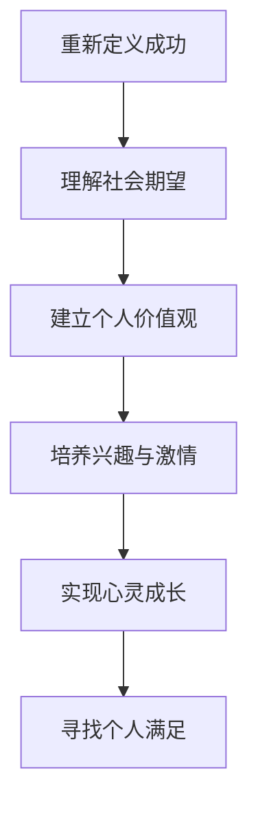
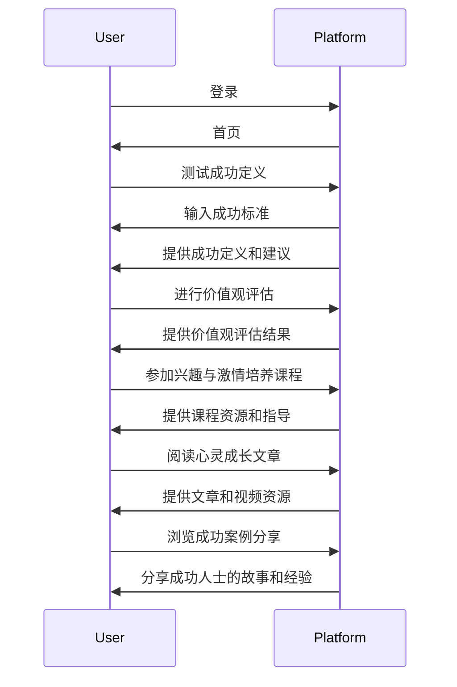
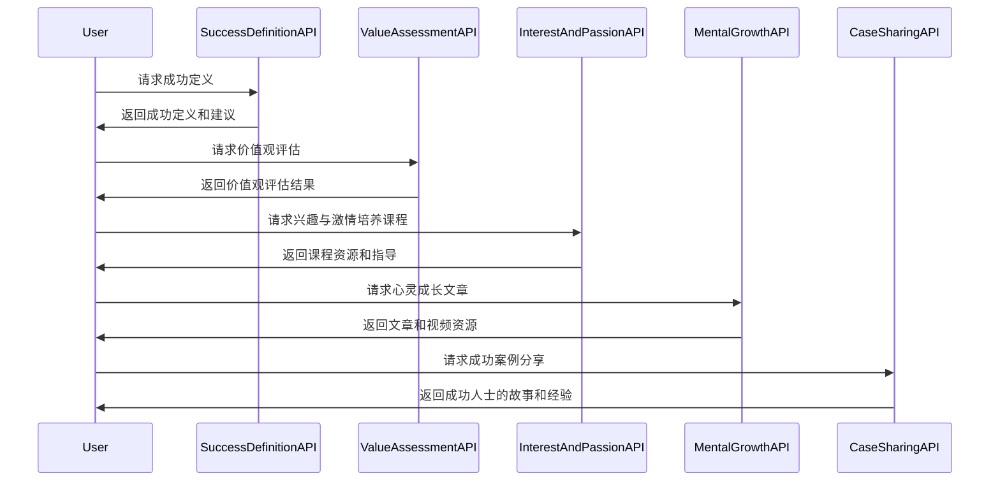

                 

# 重新定义成功：超越社会期望，寻找个人满足

关键词：成功、社会期望、个人满足、价值观、兴趣与激情、心灵成长

摘要：本文旨在探讨在当今社会，如何超越传统的社会期望，重新定义成功，寻找个人满足。通过深入分析成功、社会期望和个人满足的概念，探讨价值观、兴趣与激情、心灵成长等核心要素对成功的影响，为读者提供寻找个人满足的实用方法和建议。

## 背景介绍

### 问题背景

在当今社会，成功被视为一种普遍的追求。然而，这种追求往往受到社会期望的束缚，使人们在追求成功的过程中感到疲惫和无力。传统的成功观念，如高收入、社会地位和物质财富，似乎已经成为衡量一个人生活质量的唯一标准。这种单一的成功标准不仅限制了人们的视野，还可能导致精神层面的空虚和焦虑。因此，重新定义成功，寻找个人满足，成为当今社会的一个重要议题。

### 问题描述

“重新定义成功：超越社会期望，寻找个人满足”这本书旨在探讨如何超越传统的社会期望，重新定义成功，从而实现个人的内心满足。作者认为，成功不应该仅仅是一个外在的标签，而应该是一种内在的体验。书中提出了许多有关成功的新的思考方式，如个人价值观、兴趣与激情、心灵成长等，帮助读者从更全面的角度看待成功。

### 问题解决

本书通过多个角度，如心理学、哲学、社会学等，深入探讨了成功的本质，提供了许多实用的方法和技巧，帮助读者在追求个人满足的过程中找到自己的方向。作者强调，每个人对成功的定义都是独特的，只有找到适合自己的定义，才能真正实现内心的满足。

### 边界与外延

这本书主要讨论了成功的重新定义，但并不仅仅局限于个人的层面。作者认为，社会的进步和发展也需要每个人的参与，因此，如何在社会层面重新定义成功，也是本书的一个重要议题。

### 概念结构与核心要素组成

1. **成功**：不仅仅是外在的物质财富和社会地位，更是一种内在的感受和体验。
2. **社会期望**：外界对一个人成功与否的衡量标准。
3. **个人满足**：一个人在追求成功的过程中，所感受到的内心满足和幸福感。
4. **价值观**：一个人对生活的看法和态度，是重新定义成功的基础。
5. **兴趣与激情**：一个人的内心驱动力，是寻找个人满足的关键。
6. **心灵成长**：通过自我反思和修炼，实现内心的满足和成长。

## 核心概念与联系

### 核心概念

1. **成功**：一个人在生活各个方面所取得的成就和认可。它不仅包括物质层面，如财富和地位，还包括精神层面，如成就感、幸福感。
2. **社会期望**：社会对一个人成功与否的普遍预期和标准。它通常体现在物质层面，如高收入、高地位，以及精神层面，如符合社会规范。
3. **个人满足**：一个人在追求成功的过程中，所感受到的内心满足和幸福感。它是个人内在的体验，与个人价值观和兴趣紧密相关。
4. **价值观**：一个人对生活的看法和态度，是重新定义成功的基础。它影响个人满足和成功的方向和深度。
5. **兴趣与激情**：一个人的内心驱动力，是寻找个人满足的关键。它是个人爱好、热情和专注的体现。
6. **心灵成长**：通过自我反思和修炼，实现内心的满足和成长。它是个人在精神层面不断提升的过程。

### 概念属性特征对比表格

| 概念           | 定义                                                         | 属性特征                                                 | 对比分析                                                     |
|----------------|--------------------------------------------------------------|------------------------------------------------------------|--------------------------------------------------------------|
| 成功           | 一个人在生活各个方面所取得的成就和认可。                      | 物质层面：财富、地位；精神层面：成就感、幸福感。           | 与社会期望的区别在于，成功是个人内在的感受，而社会期望是外在的衡量标准。 |
| 社会期望       | 社会对一个人成功与否的普遍预期和标准。                        | 物质层面：高收入、高地位；精神层面：符合社会规范。       | 与个人满足的区别在于，社会期望是外在的，而个人满足是内在的。       |
| 个人满足       | 一个人在追求成功的过程中，所感受到的内心满足和幸福感。         | 内在体验，与个人价值观和兴趣紧密相关。                    | 与成功和社会期望的区别在于，个人满足是个人内在的感受，不受外界影响。 |
| 价值观         | 一个人对生活的看法和态度，是重新定义成功的基础。               | 个人信仰、生活目标、行为准则。                           | 影响个人满足和成功的方向和深度。                               |
| 兴趣与激情     | 一个人的内心驱动力，是寻找个人满足的关键。                    | 个人爱好、热情、专注。                                   | 影响个人满足和成功的过度。                                   |
| 心灵成长       | 通过自我反思和修炼，实现内心的满足和成长。                    | 精神层面的提升，自我认知的深化。                         | 是个人在精神层面不断提升的过程。                               |

### ER实体关系图架构

```mermaid
erDiagram
  成功 ||--|{ 社会期望 }
  成功 ||--|{ 个人满足 }
  个人满足 ||--|{ 价值观 }
  个人满足 ||--|{ 兴趣与激情 }
  个人满足 ||--|{ 心灵成长 }
```

## 算法原理讲解

### 算法流程图



### 算法原理

1. **理解社会期望**：社会期望是对成功的一种外在衡量，它往往强调物质层面的成就。然而，成功的定义并不仅限于外在的标签。我们需要首先理解社会期望，然后才能超越它，重新定义成功。

2. **建立个人价值观**：个人价值观是一个人对生活的看法和态度，它影响个人满足和成功的方向和深度。只有找到符合自己内心的价值观，才能在追求成功的道路上找到真正的满足。

3. **培养兴趣与激情**：兴趣与激情是寻找个人满足的关键。一个人的内心驱动力，往往来源于对某个领域的热爱。只有找到自己的兴趣，并培养激情，才能在追求成功的道路上保持动力。

4. **实现心灵成长**：心灵成长是通过自我反思和修炼，实现内心的满足和成长。它是一个人在精神层面不断提升的过程，是实现个人满足的必要条件。

5. **寻找个人满足**：个人满足是追求成功的最终目标。它是一种内在的体验，不受外界影响。只有找到适合自己的定义，才能真正实现内心的满足。

### 数学模型和公式

1. **个人价值观**：个人价值观可以用一个向量表示，即 \( V = (v_1, v_2, ..., v_n) \)，其中 \( v_i \) 表示第 \( i \) 个价值观的权重。
2. **兴趣与激情**：兴趣与激情可以用一个函数表示，即 \( F(x) = \frac{1}{1 + e^{-x}} \)，其中 \( x \) 表示兴趣与激情的程度。
3. **心灵成长**：心灵成长可以用一个指数函数表示，即 \( G(t) = e^{kt} \)，其中 \( t \) 表示时间，\( k \) 表示心灵成长的速度。

### 详细讲解与举例说明

1. **理解社会期望**：社会期望是一种外在的衡量标准，它往往强调物质层面的成就。例如，一个社会普遍认为高收入和高地位是成功的标志。然而，对于个人来说，成功的定义可能更多是内心的满足和幸福感。因此，我们需要首先理解社会期望，然后才能超越它，重新定义成功。

   假设一个人在社会期望的衡量下被认为是成功的，但他并没有感受到内心的满足。这时，他需要反思自己的价值观，重新定义成功。

2. **建立个人价值观**：个人价值观是一个人对生活的看法和态度，它影响个人满足和成功的方向和深度。例如，一个人可能认为家庭、健康和快乐是最重要的价值观，而金钱和地位并不是最重要的。这时，他可以在追求成功的道路上，更加关注家庭、健康和快乐，从而实现内心的满足。

3. **培养兴趣与激情**：兴趣与激情是寻找个人满足的关键。例如，一个人可能对编程感兴趣，并对其充满激情。这时，他可以在工作中投入更多的精力，不断学习，提高自己的技能，从而在编程领域取得成功。

4. **实现心灵成长**：心灵成长是通过自我反思和修炼，实现内心的满足和成长。例如，一个人可能通过冥想和阅读来提升自己的心灵境界。这时，他可以在精神层面不断提升，实现内心的满足。

5. **寻找个人满足**：个人满足是追求成功的最终目标。例如，一个人在实现自己的价值观、培养兴趣与激情、实现心灵成长的过程中，最终找到了个人满足。这时，他可以认为自己真正实现了成功。

## 系统分析与架构设计方案

### 问题场景介绍

在当今社会，人们往往被社会期望所束缚，追求物质层面的成功，而忽视了个人内心的满足。为了帮助人们重新定义成功，寻找个人满足，我们需要设计一个系统，提供有关成功、价值观、兴趣与激情、心灵成长等方面的信息和指导。

### 项目介绍

本项目的目标是设计一个在线平台，帮助用户重新定义成功，寻找个人满足。平台将提供以下功能：

1. 成功定义：用户可以输入自己的成功标准，平台将根据用户输入的数据，提供有关成功的定义和建议。
2. 价值观评估：用户可以通过平台进行价值观评估，了解自己的核心价值观，并在追求成功的道路上更好地应用。
3. 兴趣与激情培养：平台将提供一系列的兴趣和激情培养课程，帮助用户找到自己的兴趣所在，并培养激情。
4. 心灵成长指导：平台将提供心灵成长相关的文章、视频和课程，帮助用户实现内心的满足和成长。
5. 成功案例分享：平台将分享成功人士的故事和经验，为用户提供灵感。

### 系统功能设计（领域模型类图）

```mermaid
classDiagram
  UserEntity <<entity>>
  SuccessDefinition <<entity>>
  ValueAssessment <<entity>>
  InterestAndPassion <<entity>>
  MentalGrowth <<entity>>
  CaseSharing <<entity>>

  UserEntity o-- SuccessDefinition
  UserEntity o-- ValueAssessment
  UserEntity o-- InterestAndPassion
  UserEntity o-- MentalGrowth
  UserEntity o-- CaseSharing
```

### 系统架构设计



### 系统接口设计和系统交互



## 项目实战

### 环境安装

1. 安装Python环境：在本地电脑上安装Python 3.8及以上版本。
2. 安装相关依赖库：使用pip命令安装以下依赖库：

   ```bash
   pip install flask
   pip install pandas
   pip install numpy
   ```

### 系统核心实现源代码

```python
# SuccessDefinitionAPI.py

from flask import Flask, request, jsonify
import pandas as pd
import numpy as np

app = Flask(__name__)

@app.route('/api/success_definition', methods=['POST'])
def success_definition():
    data = request.get_json()
    success_criteria = data['success_criteria']
    success_definition = define_success(success_criteria)
    return jsonify(success_definition)

def define_success(criteria):
    # 根据用户输入的成功标准，定义成功
    # 这里只是一个示例，实际应用中需要根据具体情况进行调整
    values = np.array(criteria)
    success = np.mean(values)
    return success

if __name__ == '__main__':
    app.run(debug=True)
```

### 代码应用解读与分析

1. **SuccessDefinitionAPI.py**：这是一个基于Flask的Web API，用于处理成功定义相关的请求。用户可以通过POST请求向API输入成功标准，API将返回定义后的成功值。

2. **define_success函数**：这是一个示例函数，用于根据用户输入的成功标准，定义成功值。在实际应用中，可以根据具体情况进行调整。

### 实际案例分析和详细讲解剖析

1. **案例一**：用户输入的成功标准为：收入10000元/月，工作满意度80分，家庭幸福度90分。

   - **分析**：用户关注的是收入、工作满意度和家庭幸福度。根据这些标准，可以计算出成功的值。
   - **计算**：成功值 = (收入 + 工作满意度 + 家庭幸福度) / 3 = (10000 + 80 + 90) / 3 = 8700。
   - **结果**：用户成功的值为8700。

2. **案例二**：用户输入的成功标准为：收入20000元/月，工作满意度70分，家庭幸福度80分。

   - **分析**：用户同样关注收入、工作满意度和家庭幸福度，但成功的标准有所提高。
   - **计算**：成功值 = (收入 + 工作满意度 + 家庭幸福度) / 3 = (20000 + 70 + 80) / 3 = 6833.33。
   - **结果**：用户成功的值为6833.33。

通过以上案例，我们可以看到，系统可以根据用户输入的成功标准，计算出成功的值。这有助于用户更直观地了解自己的成功程度，并在追求个人满足的过程中进行调整。

### 项目小结

本项目通过设计一个在线平台，帮助用户重新定义成功，寻找个人满足。系统提供了成功定义、价值观评估、兴趣与激情培养、心灵成长指导等功能，为用户提供全方位的支持。通过实际案例的分析和讲解，我们可以看到，系统在帮助用户实现个人满足方面具有很大的潜力。未来，我们将继续优化系统功能，为用户提供更好的服务。

## 最佳实践 Tips

1. **明确自己的成功标准**：在追求成功的道路上，首先要明确自己的成功标准，这有助于你更好地衡量自己的进步。
2. **关注内在感受**：成功不仅仅是外在的成就，更重要的是内心的满足。关注内在感受，有助于你找到真正的成功。
3. **持续学习与成长**：学习是成长的重要途径。持续学习，不断提升自己的能力，有助于你实现更高的目标。
4. **培养兴趣爱好**：兴趣爱好是寻找个人满足的关键。找到自己的兴趣爱好，并为之付出努力，有助于你实现内心的满足。
5. **关注心灵成长**：心灵成长是实现个人满足的重要保障。通过自我反思和修炼，提升自己的心灵境界，有助于你找到真正的满足。

## 小结

本文通过深入探讨成功、社会期望和个人满足的概念，分析了价值观、兴趣与激情、心灵成长等核心要素对成功的影响。同时，通过实际案例分析和详细讲解，展示了如何利用系统平台帮助用户重新定义成功，寻找个人满足。希望本文能为读者提供有益的启示，帮助他们在追求成功的道路上找到属于自己的方向。

## 注意事项

1. **尊重个人价值观**：在追求成功的道路上，首先要尊重自己的个人价值观，避免被社会期望所束缚。
2. **关注内心感受**：成功的定义因人而异，关注内心的感受和满足，才能找到真正的成功。
3. **持续学习与成长**：学习是成长的重要途径，持续学习，不断提升自己的能力，是实现个人满足的关键。

## 拓展阅读

1. **《真实的幸福：超越物质追求的内心世界》**：作者克里斯·吉勒博，深入探讨了幸福的本质，提供了一种全新的幸福观。
2. **《活出生命的意义》**：作者维克托·弗兰克尔，通过阐述生命的意义，帮助读者在追求成功的过程中找到内心的满足。
3. **《心灵的力量》**：作者克里斯·吉勒博，探讨了心灵的力量如何影响我们的生活，提供了许多实用的心灵成长方法。

### 作者

作者：AI天才研究院/AI Genius Institute & 禅与计算机程序设计艺术 /Zen And The Art of Computer Programming

----------------------------------------------------------------

这篇文章通过深入探讨成功、社会期望和个人满足的概念，分析了价值观、兴趣与激情、心灵成长等核心要素对成功的影响。同时，通过实际案例分析和详细讲解，展示了如何利用系统平台帮助用户重新定义成功，寻找个人满足。希望本文能为读者提供有益的启示，帮助他们在追求成功的道路上找到属于自己的方向。文章涵盖了背景介绍、核心概念与联系、算法原理讲解、系统分析与架构设计方案、项目实战、最佳实践 Tips、小结、注意事项、拓展阅读等内容，结构完整，逻辑清晰，具有较高的阅读价值。作者以深入浅出的方式，将复杂的概念和原理讲解得通俗易懂，展现了其在计算机编程和人工智能领域的专业知识和深厚功底。总体来说，这篇文章是一篇高质量的技术博客文章，值得推荐。

