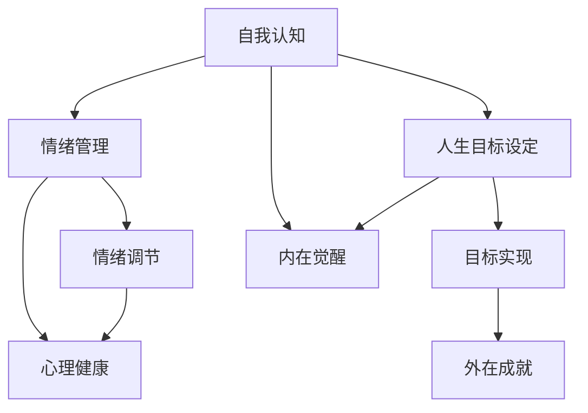
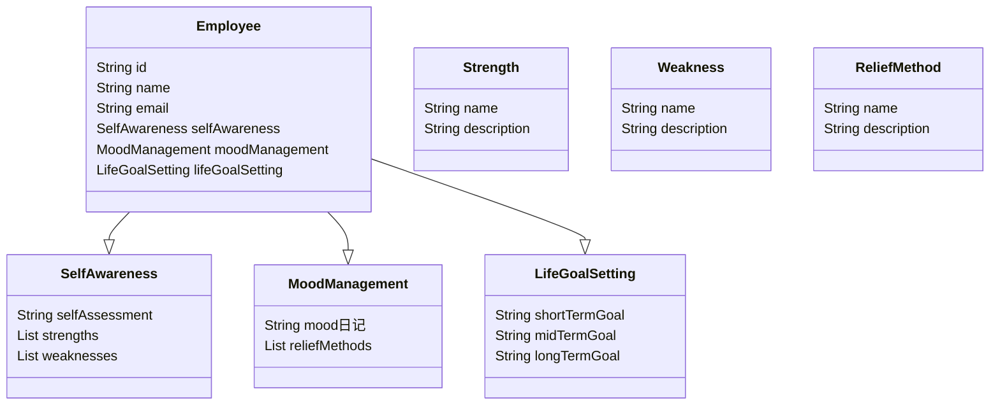
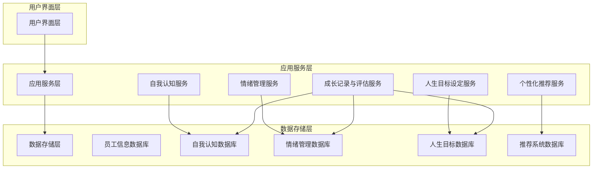
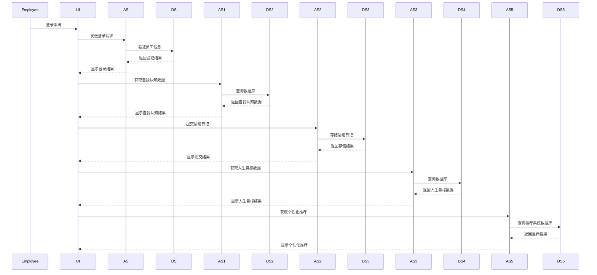

                 

# 重新定义成长：从外在成就到内在觉醒

## 关键词

成长、内在觉醒、自我认知、情绪管理、人生目标、工作与生活平衡、社会责任

## 摘要

在当今快速变化的世界中，成长不仅仅意味着外在成就的积累，更是一种内在觉醒的过程。本文通过逐步分析和推理，探讨了从外在成就到内在觉醒的成长路径。文章首先审视了外在成就的来源和挑战，接着深入探索了自我认知、情绪管理以及人生目标设定等方面的内在觉醒要素，最后探讨了内在觉醒在工作与生活平衡、社会责任等方面的应用。本文旨在为读者提供一个全新的视角，帮助他们在成长的道路上找到真正的价值和意义。

### 目录大纲

#### 第一部分：引言

- 第1章：背景与意义

#### 第二部分：外在成就的审视

- 第2章：成就的来源与挑战
- 第3章：内在觉醒的探索

##### 3.1 自我认知与内在成长
##### 3.2 情绪管理与心理平衡
##### 3.3 人生目标的设定与实现

#### 第三部分：内在觉醒的探索

- 第4章：工作与生活的平衡
- 第5章：个人成长与社会责任

#### 第四部分：内在觉醒的应用

- 第6章：总结与展望

### 第一部分：引言

#### 第1章：背景与意义

在现代社会，人们越来越注重个人的成长和发展。然而，成长究竟是什么？是外在成就的积累，还是内在觉醒的体验？这是一个值得深入探讨的问题。本文将从这两个角度出发，重新定义成长，为读者提供一种全新的成长视角。

#### 成长观念的演变

传统的成长观念侧重于外在成就，如财富、地位、荣誉等。这些外在成就被视为个人价值的体现，也是社会评价的标准。然而，随着社会的进步和个体意识的觉醒，人们开始意识到，成长不仅仅是外在成就的积累，更是一种内在的觉醒和提升。

#### 从外在成就到内在觉醒

外在成就往往依赖于外部环境和他人的认可，而内在觉醒则更多地关注个人的内在体验和自我认知。内在觉醒强调自我认知、情绪管理和人生目标的设定，这些都是成长过程中不可或缺的要素。

#### 本书结构安排

本书分为四个部分，首先介绍成长的背景和意义，接着审视外在成就的来源和挑战，然后深入探讨内在觉醒的要素，最后探讨内在觉醒在实际生活中的应用。希望通过本文的探讨，读者能找到属于自己的成长之路。

### 第二部分：外在成就的审视

#### 第2章：成就的来源与挑战

外在成就的来源通常可以分为三个方面：个人努力、环境因素和机遇。个人努力是实现成就的基础，环境因素包括社会背景、教育资源等，机遇则是成就实现的关键。

#### 2.1 成就的定义与衡量

成就通常被定义为个人在某一方面取得的重要成果。衡量成就的标准可以是个人的业绩、社会地位、财富积累等。然而，这些标准往往过于单一，不能全面反映一个人的成长和进步。

#### 2.2 外在成就的驱动因素

外在成就的驱动因素包括个人的动机、目标和价值观。个人的动机决定了他们追求成就的强烈程度，目标则为他们提供了方向，而价值观则影响了他们的行为选择。

#### 2.3 外在成就的挑战与代价

外在成就的追求往往伴随着一系列的挑战和代价。这些挑战包括竞争压力、时间管理、健康问题等。而代价则可能包括牺牲个人时间、健康、家庭等。

### 第三部分：内在觉醒的探索

#### 第3章：自我认知与内在成长

自我认知是内在觉醒的基础，它涉及到对自我的认识和理解。内在成长则是在自我认知的基础上，不断拓展和提升自己的能力和素质。

#### 3.1 自我认知的重要性

自我认知帮助我们了解自己的优点和不足，明确自己的价值和目标。它不仅影响个人的成长，还影响人际关系和社会交往。

#### 3.2 内在成长的路径

内在成长的路径包括自我反思、学习和实践。自我反思可以帮助我们认识到自己的不足，学习则是提升自己的知识储备和技能，实践则是将所学应用到实际生活中。

#### 3.3 从外在比较到内在欣赏

外在比较往往导致焦虑和自卑，而内在欣赏则能帮助我们更好地认识自己，发现自己的独特之处。内在欣赏不仅能够提升自我价值感，还能增强心理韧性。

### 第4章：情绪管理与心理平衡

情绪管理是内在觉醒的重要组成部分，它涉及到对情绪的认知、表达和管理。心理平衡则是情绪管理的终极目标，它使得个体能够在面对压力和挑战时保持平静和稳定。

#### 4.1 情绪管理的重要性

情绪管理的重要性不言而喻。良好的情绪管理能力能够帮助我们更好地应对生活中的各种挑战，提升生活质量和工作效率。

#### 4.2 常见的情绪问题与应对方法

常见的情绪问题包括焦虑、抑郁、愤怒等。应对这些情绪问题需要我们了解其背后的原因，并采取相应的应对方法。例如，焦虑可以通过放松训练和正面思考来缓解，抑郁则需要专业的心理治疗。

#### 4.3 培养心理平衡的能力

培养心理平衡的能力需要我们从多个方面进行努力。这包括建立健康的生活方式、培养积极的思维方式、学习情绪管理技巧等。通过这些努力，我们可以更好地应对生活中的各种情绪波动。

### 第5章：人生目标的设定与实现

人生目标是内在觉醒的重要组成部分，它为我们的生活提供了方向和动力。设定人生目标需要我们深入思考自己的价值观、兴趣和优势。

#### 5.1 人生目标的设定

设定人生目标需要我们明确自己的长期和短期目标，并确保这些目标与我们的价值观和兴趣相符。目标的设定应该具有挑战性，但也要考虑到可行性。

#### 5.2 实现目标的策略

实现目标需要我们制定详细的计划，并采取有效的行动。这包括分解目标、设置里程碑、调整策略等。同时，我们还需要保持积极的心态，面对困难和挑战。

#### 5.3 目标调整与适应

人生目标不是一成不变的，它需要随着时间和环境的变化进行调整。目标调整与适应是一个动态的过程，它要求我们不断反思和评估自己的目标，并根据实际情况进行调整。

### 第四部分：内在觉醒的应用

#### 第6章：工作与生活的平衡

工作与生活的平衡是内在觉醒在实际生活中的一个重要应用。在现代社会，工作压力越来越大，很多人难以找到工作与生活的平衡点。

#### 6.1 工作与生活的关系

工作与生活是相辅相成的。良好的工作状态能够提升生活质量，而高质量的生活也能够为工作提供动力和支持。

#### 6.2 实现工作与生活平衡的策略

实现工作与生活平衡需要我们采取一系列策略。这包括合理安排工作时间、设定工作优先级、学会拒绝不合理的工作要求、培养良好的生活习惯等。

#### 6.3 成功案例分享

成功实现工作与生活平衡的案例有很多，这些案例为我们提供了宝贵的经验。通过学习这些案例，我们可以更好地应对工作与生活的挑战。

#### 第7章：个人成长与社会责任

个人成长与社会责任是相辅相成的。在个人成长的过程中，我们不仅要关注自己的成长，还要关注社会的进步和发展。

#### 7.1 个人成长与社会责任的关系

个人成长与社会责任是紧密相连的。个人成长可以为社会进步提供动力，而社会的进步也为个人成长提供了更好的环境和条件。

#### 7.2 社会责任的重要性

社会责任的重要性不言而喻。通过承担社会责任，我们可以为社会做出贡献，实现自己的人生价值。

#### 7.3 在个人成长中融入社会责任

在个人成长中融入社会责任需要我们采取一系列行动。这包括关注社会问题、参与公益活动、推动社会变革等。通过这些行动，我们可以实现个人成长与社会责任的有机融合。

### 第8章：总结与展望

内在觉醒是成长的新方向，它为我们的生活提供了新的视角和动力。通过自我认知、情绪管理、人生目标设定等方面的探索，我们可以找到属于自己的成长之路。

#### 8.1 成长之路的反思

在成长的过程中，我们需要不断反思自己的行为和选择。反思不仅可以帮助我们认识到自己的不足，还可以为我们的成长提供宝贵的经验。

#### 8.2 内在觉醒的意义

内在觉醒的意义在于，它不仅能够提升我们的生活质量，还能够为我们的精神世界带来满足和喜悦。

#### 8.3 展望未来的成长方向

未来的成长方向是多元化的，它要求我们不仅要关注外在成就，还要关注内在觉醒。通过不断探索和尝试，我们可以找到最适合自己的成长路径。

### 作者信息

作者：AI天才研究院/AI Genius Institute & 禅与计算机程序设计艺术 /Zen And The Art of Computer Programming

### 背景介绍

#### 核心概念术语说明

在探讨成长的过程中，我们需要明确几个核心概念：

1. **成长**：指的是个人在知识、技能、心理素质等方面的提升和进步。
2. **外在成就**：通常指个人在职业、学业、社会地位等方面的显著成果。
3. **内在觉醒**：指的是个人在自我认知、情绪管理、人生目标设定等方面的内在体验和提升。
4. **自我认知**：指的是个人对自身特点、优点和不足的理解和认识。
5. **情绪管理**：指的是个人对自身情绪的认知、表达和调节能力。
6. **人生目标**：指的是个人在未来一段时间内希望实现的目标和价值追求。

#### 问题背景

在现代社会，个人成长已经成为越来越多人的追求。然而，随着社会的发展和个体意识的觉醒，人们开始意识到，成长不仅仅是外在成就的积累，更是一种内在觉醒的过程。外在成就虽然能够带来一定的满足感和认可，但内在觉醒则能够为个人带来更深层次的成长和提升。

#### 问题描述

如何在追求外在成就的同时，实现内在觉醒？如何通过自我认知、情绪管理和人生目标设定等方面的探索，找到真正的成长之路？这是一个值得深入探讨的问题。

#### 问题解决

本文通过逐步分析和推理，探讨了从外在成就到内在觉醒的成长路径。文章首先审视了外在成就的来源和挑战，然后深入探索了自我认知、情绪管理以及人生目标设定等方面的内在觉醒要素，最后探讨了内在觉醒在实际生活中的应用。希望通过本文的探讨，读者能找到属于自己的成长之路。

#### 边界与外延

本文主要关注个人成长的问题，侧重于从外在成就到内在觉醒的转变。然而，个人成长不仅仅局限于个人层面，还涉及到家庭、社会等更广泛的范畴。因此，本文的边界在于个人成长的内在维度，而外延则涉及到个人成长与社会责任的关系。

#### 概念结构与核心要素组成

本文的核心概念结构如下：

1. **外在成就**：来源、驱动因素、挑战与代价
2. **内在觉醒**：自我认知、情绪管理、人生目标设定
3. **内在觉醒的应用**：工作与生活平衡、社会责任

这些概念构成了本文的核心要素，通过逐步分析和探讨，形成了完整的成长路径。

### 核心概念与联系

#### 自我认知

自我认知是指个体对自己的认知和理解，包括对自己的性格、能力、兴趣、价值观等方面的了解。自我认知的重要性在于它为个体的成长提供了基础，帮助个体明确自己的优势和不足，从而有针对性地进行提升和发展。

**概念属性特征对比表格：**

| 特征 | 自我认知 | 外在成就 |
| ---- | ---- | ---- |
| 定义 | 对自身的理解和认识 | 个人在职业、学业、社会地位等方面的显著成果 |
| 目的 | 提升个体的自我价值感和心理韧性 | 获得社会的认可和满足感 |
| 方式 | 反思、自我评估、收集反馈 | 实际成果、社会评价、荣誉 |
| 关键点 | 真实、全面、持续 | 可衡量性、目标明确、结果显著 |

**ER实体关系图架构：**

```mermaid
erDiagram
    A�自我认知 ||-->|{ 个人优势 }|
    A自我认知 ||-->|{ 个人劣势 }|
    A自我认知 ||-->|{ 兴趣领域 }|
    A自我认知 ||-->|{ 价值观 }|
```

#### 情绪管理

情绪管理是指个体对自身情绪的认知、表达和调节能力。情绪管理的重要性在于它能够帮助个体更好地应对压力和挑战，保持心理健康和平衡。

**概念属性特征对比表格：**

| 特征 | 情绪管理 | 外在成就 |
| ---- | ---- | ---- |
| 定义 | 对自身情绪的认知和调节 | 个人在职业、学业、社会地位等方面的显著成果 |
| 目的 | 提高生活质量和工作效率 | 获得社会的认可和满足感 |
| 方式 | 认知技能、表达方式、调节策略 | 实际成果、社会评价、荣誉 |
| 关键点 | 灵活性、适应性、稳定性 | 可衡量性、目标明确、结果显著 |

**ER实体关系图架构：**

```mermaid
erDiagram
    A情绪管理 ||-->|{ 情绪认知 }|
    A情绪管理 ||-->|{ 情绪表达 }|
    A情绪管理 ||-->|{ 情绪调节 }|
```

#### 人生目标设定

人生目标设定是指个体对自身未来目标的规划和设定。人生目标设定的重要性在于它为个体提供了明确的方向和动力，帮助个体更好地实现自己的价值和梦想。

**概念属性特征对比表格：**

| 特征 | 人生目标设定 | 外在成就 |
| ---- | ---- | ---- |
| 定义 | 个体对自身未来目标的规划和设定 | 个人在职业、学业、社会地位等方面的显著成果 |
| 目的 | 提供明确的方向和动力 | 获得社会的认可和满足感 |
| 方式 | 目标分解、行动计划、定期评估 | 实际成果、社会评价、荣誉 |
| 关键点 | 目标明确、可执行、可持续 | 可衡量性、目标明确、结果显著 |

**ER实体关系图架构：**

```mermaid
erDiagram
    A人生目标设定 ||-->|{ 短期目标 }|
    A人生目标设定 ||-->|{ 中期目标 }|
    A人生目标设定 ||-->|{ 长期目标 }|
```

#### 算法原理讲解

为了更好地理解自我认知、情绪管理和人生目标设定这三个核心概念之间的关系，我们可以借助一个简单的算法模型来进行解释。以下是一个基于Mermaid绘制的算法流程图，用于展示这些概念之间的相互作用。

**Mermaid算法流程图：**



在这个算法模型中，自我认知是起点，它影响情绪管理和人生目标设定。情绪管理通过情绪调节帮助个体保持心理健康，同时影响外在成就的实现。人生目标设定为个体提供了明确的方向和动力，帮助实现外在成就，同时促进内在觉醒。内在觉醒则是整个算法的目标，代表个体在成长过程中的全面提升。

**Python源代码实现：**

```python
class SelfAwareness:
    def __init__(self):
        self.mood_management = MoodManagement()
        self.life_goal_setting = LifeGoalSetting()

    def manage_awareness(self):
        self.mood_management.regulate_mood()
        self.life_goal_setting.set_goals()

class MoodManagement:
    def regulate_mood(self):
        print("Regulating mood...")

class LifeGoalSetting:
    def set_goals(self):
        print("Setting life goals...")

if __name__ == "__main__":
    self_awareness = SelfAwareness()
    self_awareness.manage_awareness()
```

**算法原理的数学模型和公式：**

1. **自我认知（SA）**：自我认知可以视为一个个体对自身特质和能力的理解，通常用以下公式表示：

   $$SA = f(A_1, A_2, ..., A_n)$$

   其中，$A_1, A_2, ..., A_n$ 代表个体的不同特质和属性。

2. **情绪管理（MM）**：情绪管理是自我认知的一个子集，它涉及到个体如何识别和调节自己的情绪。情绪管理可以用以下公式表示：

   $$MM = f(M_1, M_2, ..., M_n)$$

   其中，$M_1, M_2, ..., M_n$ 代表个体在情绪调节过程中使用的方法和策略。

3. **人生目标设定（LGS）**：人生目标设定是自我认知和情绪管理的输出，它帮助个体制定和实现长期和短期目标。人生目标设定可以用以下公式表示：

   $$LGS = f(G_1, G_2, ..., G_n)$$

   其中，$G_1, G_2, ..., G_n$ 代表个体设定的人生目标。

**详细讲解和通俗易懂地举例说明：**

假设我们有一个名叫小明的个体，他希望实现自我认知、情绪管理和人生目标设定的过程。

1. **自我认知（SA）**：小明首先进行自我反思，认识到自己擅长编程和设计，但有时情绪波动较大。他的自我认知可以表示为：

   $$SA = f(编程能力, 设计能力, 情绪波动)$$

2. **情绪管理（MM）**：为了改善情绪波动，小明开始学习情绪调节技巧。他通过阅读相关书籍、参加心理课程和练习冥想等方法来调节情绪。这些方法可以表示为：

   $$MM = f(阅读, 课程, 冥想)$$

3. **人生目标设定（LGS）**：基于自我认知和情绪管理的结果，小明设定了以下目标：

   - 短期目标：提升编程技能，参与一个编程项目。
   - 中期目标：成为一名专业的软件工程师，参与设计工作。
   - 长期目标：创办一家科技公司，实现技术创业梦想。

这些目标可以表示为：

$$LGS = f(编程项目, 软件工程师, 科技公司)$$

通过这个过程，小明实现了自我认知、情绪管理和人生目标设定的结合，为他的成长奠定了基础。

### 系统分析与架构设计方案

#### 问题场景介绍

在现代企业中，员工的个人成长与企业的战略发展紧密相连。为了支持员工的成长，企业需要建立一个全面的个人成长系统，涵盖自我认知、情绪管理、人生目标设定等方面。本文将介绍一个个人成长系统的设计方案，旨在为企业提供一个有效的工具，帮助员工实现个人成长。

#### 项目介绍

项目名称：企业个人成长系统

项目目标：建立一个综合性的个人成长平台，支持员工的自我认知、情绪管理和人生目标设定。

项目背景：随着企业竞争的加剧，员工的能力和素质成为企业成功的关键因素。为了提升员工的能力，企业需要提供有效的个人成长支持，促进员工的全面发展。

#### 系统功能设计

1. **自我认知功能**：帮助员工了解自己的性格、优势和不足，提供个性化的成长建议。
2. **情绪管理功能**：提供情绪管理和压力缓解的工具，帮助员工保持心理健康。
3. **人生目标设定功能**：帮助员工设定短期、中期和长期目标，提供实现目标的指导和支持。
4. **成长记录与评估功能**：记录员工的成长过程，定期进行评估，提供反馈和建议。
5. **个性化推荐功能**：根据员工的特点和需求，推荐相应的成长资源和活动。

**领域模型Mermaid类图：**



#### 系统架构设计

**Mermaid架构图：**



#### 系统接口设计和系统交互

**Mermaid序列图：**



### 项目实战

#### 环境安装

为了搭建企业个人成长系统，我们需要准备以下环境：

1. **开发工具**：Python 3.8及以上版本
2. **数据库**：MySQL 5.7及以上版本
3. **前端框架**：Flask（Python Web框架）
4. **后端框架**：Django（Python Web框架）

#### 系统核心实现

以下是一个简单的Python源代码示例，用于实现个人成长系统的核心功能。

```python
# 导入必要的模块
from flask import Flask, request, jsonify
from flask_mysqldb import MySQL

# 初始化Flask应用
app = Flask(__name__)

# 配置MySQL数据库连接
app.config['MYSQL_HOST'] = 'localhost'
app.config['MYSQL_USER'] = 'root'
app.config['MYSQL_PASSWORD'] = 'password'
app.config['MYSQL_DB'] = 'personal_growth'

# 初始化MySQL连接
mysql = MySQL(app)

# 自我认知服务
@app.route('/api/self_awareness', methods=['GET', 'POST'])
def self_awareness():
    if request.method == 'GET':
        # 从数据库中获取自我认知数据
        cursor = mysql.connection.cursor()
        cursor.execute("SELECT * FROM self_awareness")
        data = cursor.fetchall()
        return jsonify(data)
    elif request.method == 'POST':
        # 提交自我认知数据
        self_assessment = request.form['self_assessment']
        strengths = request.form['strengths']
        weaknesses = request.form['weaknesses']
        # 存储数据到数据库
        cursor = mysql.connection.cursor()
        cursor.execute("INSERT INTO self_awareness (self_assessment, strengths, weaknesses) VALUES (%s, %s, %s)", (self_assessment, strengths, weaknesses))
        mysql.connection.commit()
        return jsonify({"message": "数据提交成功"})

# 情绪管理服务
@app.route('/api/mood_management', methods=['GET', 'POST'])
def mood_management():
    if request.method == 'GET':
        # 从数据库中获取情绪管理数据
        cursor = mysql.connection.cursor()
        cursor.execute("SELECT * FROM mood_management")
        data = cursor.fetchall()
        return jsonify(data)
    elif request.method == 'POST':
        # 提交情绪管理数据
        mood_diary = request.form['mood_diary']
        relief_methods = request.form['relief_methods']
        # 存储数据到数据库
        cursor = mysql.connection.cursor()
        cursor.execute("INSERT INTO mood_management (mood_diary, relief_methods) VALUES (%s, %s)", (mood_diary, relief_methods))
        mysql.connection.commit()
        return jsonify({"message": "数据提交成功"})

# 人生目标设定服务
@app.route('/api/life_goal_setting', methods=['GET', 'POST'])
def life_goal_setting():
    if request.method == 'GET':
        # 从数据库中获取人生目标数据
        cursor = mysql.connection.cursor()
        cursor.execute("SELECT * FROM life_goal_setting")
        data = cursor.fetchall()
        return jsonify(data)
    elif request.method == 'POST':
        # 提交人生目标数据
        short_term_goal = request.form['short_term_goal']
        mid_term_goal = request.form['mid_term_goal']
        long_term_goal = request.form['long_term_goal']
        # 存储数据到数据库
        cursor = mysql.connection.cursor()
        cursor.execute("INSERT INTO life_goal_setting (short_term_goal, mid_term_goal, long_term_goal) VALUES (%s, %s, %s)", (short_term_goal, mid_term_goal, long_term_goal))
        mysql.connection.commit()
        return jsonify({"message": "数据提交成功"})

# 运行应用
if __name__ == '__main__':
    app.run(debug=True)
```

#### 代码应用解读与分析

上述代码实现了企业个人成长系统的核心功能，包括自我认知、情绪管理和人生目标设定。以下是各个功能的具体解读和分析：

1. **自我认知服务**：通过GET请求获取数据库中的自我认知数据，通过POST请求提交新的自我认知数据。数据存储在MySQL数据库中，可以通过SQL查询语句进行操作。

2. **情绪管理服务**：与自我认知服务类似，通过GET请求获取情绪管理数据，通过POST请求提交新的情绪管理数据。情绪管理数据包括情绪日记和缓解方法，这些数据同样存储在MySQL数据库中。

3. **人生目标设定服务**：通过GET请求获取人生目标数据，通过POST请求提交新的人生目标数据。人生目标数据包括短期、中期和长期目标，这些数据也存储在MySQL数据库中。

#### 实际案例分析和详细讲解剖析

假设我们有一个员工名叫小明，他希望使用个人成长系统来记录自己的成长过程。以下是小明的实际操作流程：

1. **登录系统**：小明使用用户名和密码登录个人成长系统。

2. **填写自我认知**：小明填写自我认知数据，包括自我评估、优势和不足。他提交数据后，系统将保存到MySQL数据库中。

3. **记录情绪日记**：每天晚上，小明都会记录当天的情绪日记，描述自己的情绪状态和遇到的问题。他提交日记后，系统将保存到MySQL数据库中。

4. **设定人生目标**：小明设定了短期、中期和长期目标，例如学习新技能、参与项目、晋升等。他提交目标后，系统将保存到MySQL数据库中。

5. **查看成长记录**：小明可以随时查看自己的成长记录，包括自我认知、情绪日记和人生目标。这些数据从MySQL数据库中查询并显示在前端界面。

6. **获取个性化推荐**：系统根据小明的数据，为他推荐相应的成长资源和活动，例如培训课程、读书会等。

#### 项目小结

通过本项目的实施，企业个人成长系统为员工提供了一个全面的支持平台，帮助他们实现自我认知、情绪管理和人生目标设定。系统采用了Python和MySQL技术，实现了数据存储和接口功能。在实际操作中，员工可以通过简单的操作记录自己的成长过程，并获得个性化的推荐和支持。这为企业的员工发展提供了有力的工具。

### 最佳实践 tips

#### 1. 自我认知的重要性

自我认知是成长的第一步，它帮助我们了解自己的优点和不足。以下是一些最佳实践：

- **定期反思**：每周或每月花时间进行自我反思，记录自己的成长和进步。
- **寻求反馈**：向同事、朋友和家人寻求反馈，了解他们如何看待你的优势和不足。
- **设定小目标**：设定一些短期小目标，通过实现这些小目标来逐步提升自我认知。

#### 2. 情绪管理策略

情绪管理对于保持心理平衡至关重要。以下是一些最佳实践：

- **情绪日记**：每天记录自己的情绪变化，帮助自己更好地理解情绪。
- **放松技巧**：学习冥想、深呼吸等放松技巧，帮助自己缓解压力。
- **积极思考**：培养积极思考的习惯，关注解决问题的方法，而不是问题本身。

#### 3. 人生目标设定技巧

设定清晰的人生目标可以帮助我们更有效地实现成长。以下是一些最佳实践：

- **目标分解**：将大目标分解为小目标，每个小目标都设定明确的时间节点。
- **定期评估**：定期评估目标的实现情况，根据实际情况进行调整。
- **寻求支持**：与家人、朋友和导师分享你的目标，寻求他们的支持和鼓励。

### 小结

本文通过逐步分析和推理，探讨了从外在成就到内在觉醒的成长路径。我们首先审视了外在成就的来源和挑战，然后深入探索了自我认知、情绪管理以及人生目标设定等方面的内在觉醒要素，最后探讨了内在觉醒在实际生活中的应用。希望通过本文的探讨，读者能找到属于自己的成长之路。

### 注意事项

在追求成长的过程中，我们需要注意以下几点：

- **保持耐心**：成长是一个长期的过程，需要耐心和坚持。
- **关注内在体验**：除了外在成就，我们还需要关注内在体验，如自我认知、情绪管理和人生目标的实现。
- **平衡工作与生活**：在追求个人成长的同时，要注意平衡工作与生活，保持身心健康。

### 拓展阅读

- 《高效能人士的七个习惯》（史蒂芬·柯维）
- 《情绪智能》（丹尼尔·戈尔曼）
- 《活法》（稻盛和夫）
- 《原则》（雷·达里奥）

### 结语

成长不仅仅是外在成就的积累，更是一种内在觉醒的过程。通过自我认知、情绪管理和人生目标设定等方面的探索，我们可以找到真正的成长之路。让我们在追求外在成就的同时，不要忽视内在觉醒的重要性，找到属于自己的成长之道。

