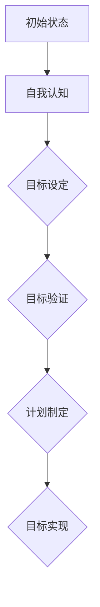
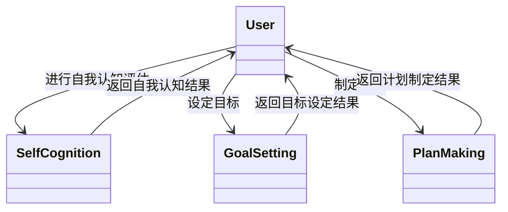
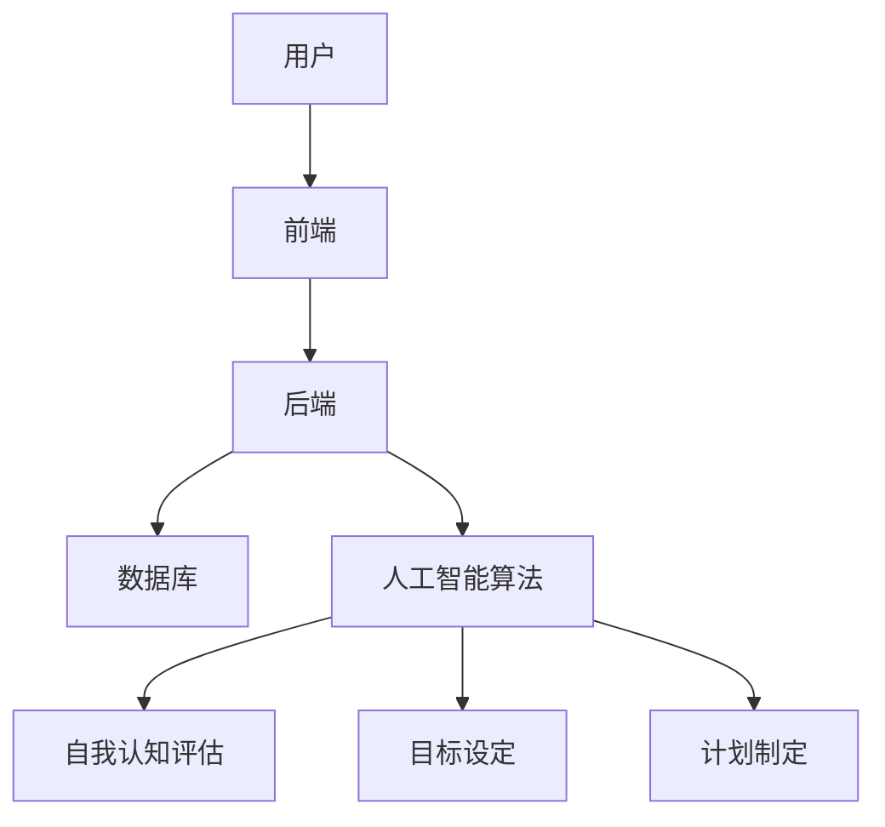
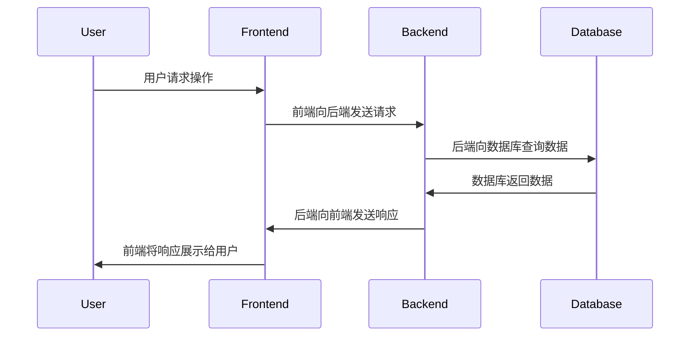
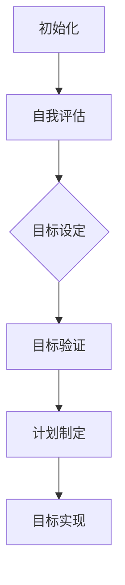
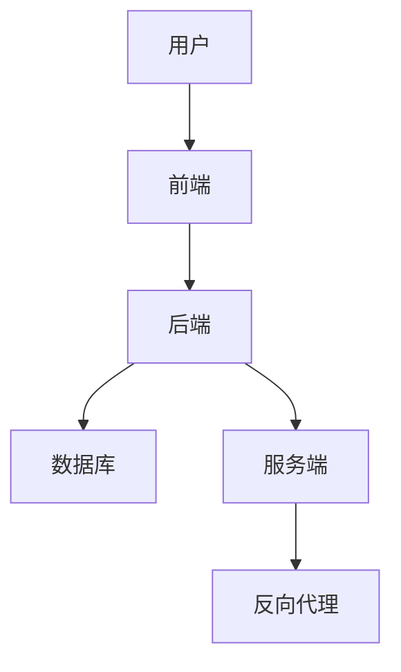
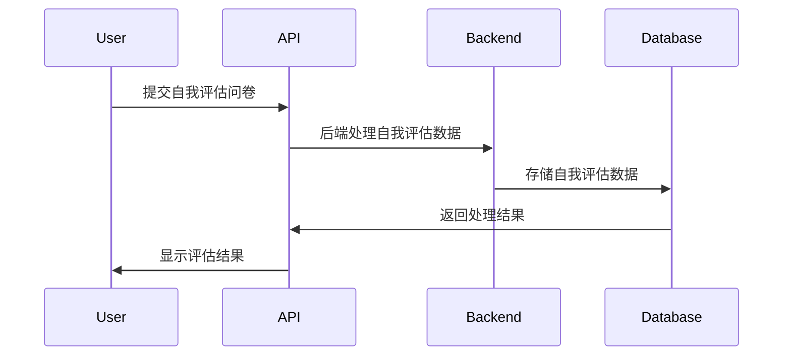
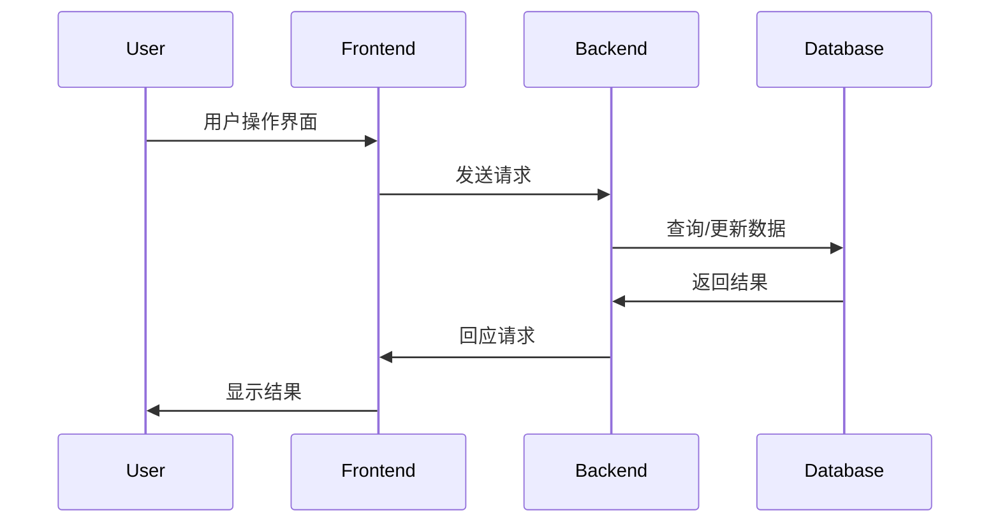
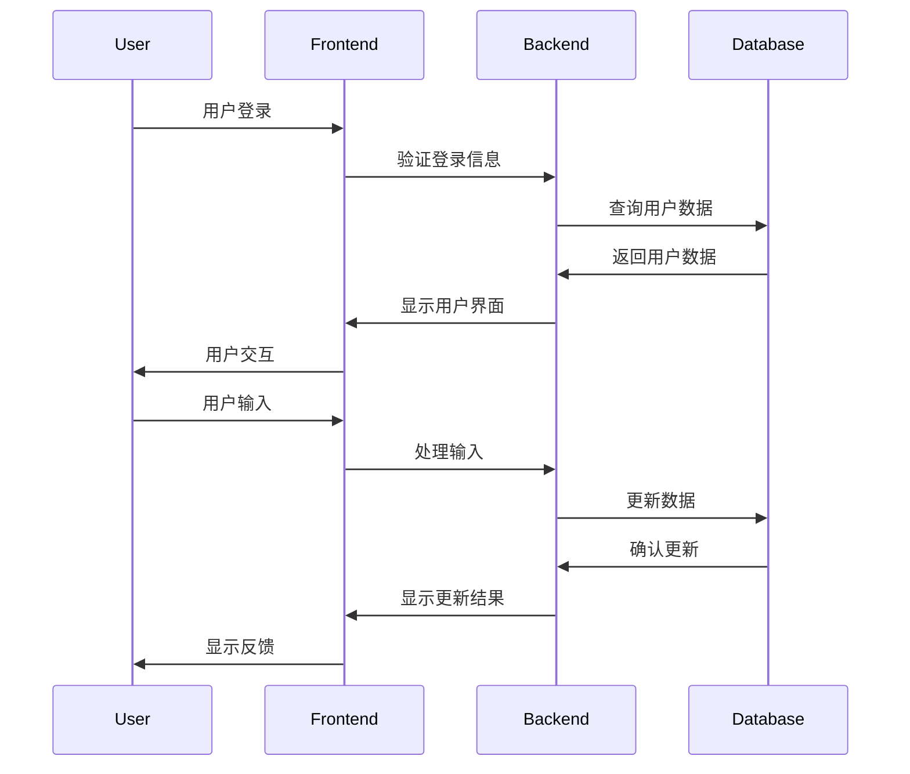

                 

# 重新审视人生目标：应对现代社会的价值观危机

## 关键词
- 人生目标
- 价值观危机
- 自我认知
- 目标设定
- 计划制定

## 摘要
在快速变化和充满挑战的现代社会中，许多人面临价值观危机，生活目标不明确，感到迷茫和困惑。本文旨在通过技术专家的视角，重新审视人生目标的重要性，并提出一系列的解决方法和步骤，帮助读者应对现代社会中的价值观危机，找到自己的人生方向。

## 第一部分：背景介绍

### 1.1 问题背景

随着全球化和信息化的加速，现代社会的发展带来了前所未有的机遇和挑战。然而，这种快速的发展也引发了一系列问题，尤其是在价值观层面。以下是当代社会价值观危机的一些具体表现：

1. **工作压力与生活质量失衡**：许多人在追求职业成功的过程中，忽视了生活质量和个人健康，导致身心疲惫，生活质量下降。

2. **经济焦虑**：经济不稳定性加剧了人们对未来的担忧，特别是在收入和财富方面，许多人感到焦虑和不安。

3. **人际关系紧张**：在快节奏的生活中，人际关系变得越来越复杂，信任感降低，导致社会矛盾加剧。

4. **目标迷失**：很多人在追求成功的过程中，失去了对人生目标的清晰认识，不知道自己为什么要做这些事情，导致生活缺乏方向和动力。

### 1.1.1 当代社会价值观危机概述

当代社会的价值观危机表现为以下几个方面：

- **个人追求目标不明确**：许多人没有设定具体的人生目标，或者设定的目标过于模糊，缺乏实现的具体路径。

- **人生价值观的扭曲**：过分追求物质享受，忽视精神层面的需求，导致人们的生活质量下降。

- **社会公平性和道德观念的缺失**：社会不公平现象加剧，道德观念的淡薄导致社会矛盾和冲突。

### 1.1.2 人生目标的重要性

人生目标对个人的成长和发展至关重要。一个明确的人生目标可以帮助人们：

- **确定自己的发展方向**：明确的人生目标能够为个人提供清晰的发展路径，减少迷茫和困惑。

- **提高生活质量**：有目标的生活更容易实现自我价值，从而提高生活质量。

- **增强自我价值感**：实现人生目标能够带来成就感，增强个人的自信心和自我价值感。

### 1.1.3 价值观危机的解决方法

为了解决人生目标不明确和价值观危机，可以采取以下措施：

- **重新审视人生目标**：通过自我认知，明确自己的优势和劣势，设定合理的人生目标。

- **制定实现目标的计划**：制定详细的行动计划，分阶段、分步骤地推进目标的实现。

- **加强自我教育**：通过学习和提升，增强自己的综合素质，为实现人生目标做好准备。

### 1.2 重新审视人生目标的方法

重新审视人生目标需要从以下几个方面入手：

#### 1.2.1 自我认知

自我认知是重新审视人生目标的基础。通过反思和自我观察，可以了解自己的性格、兴趣、价值观等方面，从而为设定人生目标提供依据。

#### 1.2.2 目标设定

目标设定是重新审视人生目标的关键。设定目标时，应遵循SMART原则（具体、可衡量、可达成、相关性、时限性），确保目标的明确性和可操作性。

#### 1.2.3 计划制定

计划制定是实现人生目标的重要保障。在制定计划时，应考虑资源的分配、时间的规划以及可能的变数，确保计划的可行性和灵活性。

### 1.3 边界与外延

#### 1.3.1 边界

重新审视人生目标的边界包括个人实际情况和社会环境。个人实际情况如年龄、学历、工作经验等，社会环境如政策、经济、文化等，都会影响人生目标的设定和实现。

#### 1.3.2 外延

重新审视人生目标的外延包括个人成长和社会贡献。个人成长如专业技能、人际关系、自我提升等，社会贡献如职业成就、公益行为、社会责任等，都是人生目标的重要组成部分。

## 第二部分：核心概念与联系

### 2.1 核心概念

#### 2.1.1 人生目标

人生目标是指一个人希望在人生中实现的价值和成就。它是指导个人行动和决策的重要依据。

#### 2.1.2 价值观

价值观是指一个人对事物的基本看法和评价标准。它决定了一个人的行为方式和生活方式。

#### 2.1.3 自我认知

自我认知是指一个人对自己性格、兴趣、能力、价值观等方面的认识和了解。

### 2.2 概念属性特征对比表格

| 概念       | 定义                                                         | 属性特征                                                       | 关系                   |
| ---------- | ------------------------------------------------------------ | ------------------------------------------------------------ | ---------------------- |
| 人生目标   | 个人希望在人生中实现的价值和成就。                           | 明确性、具体性、可实现性、挑战性、持续性                       | 指导个人行动和决策     |
| 价值观     | 个人对事物的基本看法和评价标准。                             | 正确性、一致性、稳定性、灵活性、个性差异                         | 影响人生目标的设定和实现 |
| 自我认知   | 个人对自己性格、兴趣、能力、价值观等方面的认识和了解。       | 客观性、全面性、发展性、动态性、个体差异                         | 基于自我认知来设定人生目标 |

### 2.3 ER实体关系图架构的 Mermaid 流程图

```mermaid
erDiagram
  Class1 ||--|{ Class2 }| Student
  Class1 ||--|{ Class3 }| Teacher
  Class2 ||--|{ Class4 }| Course
  Class3 ||--|{ Class5 }| School
```

## 第三部分：算法原理讲解

### 3.1 人生目标设定的算法原理

#### 3.1.1 算法流程图



#### 3.1.2 Python 源代码

```python
def self_cognition():
    # 进行自我认知
    print("进行自我认知...")

def goal_setting():
    # 设定目标
    print("设定目标...")

def goal_validation():
    # 验证目标
    print("验证目标...")

def plan制定():
    # 计划制定
    print("计划制定...")

def goal_achievement():
    # 目标实现
    print("目标实现...")

# 算法执行
self_cognition()
goal_setting()
goal_validation()
plan制定()
goal_achievement()
```

#### 3.1.3 算法原理

该算法的核心原理是通过自我认知来设定合理的人生目标，然后通过验证和计划制定，确保目标的可行性和实现。

- **自我认知**：通过对自己的兴趣、特长、性格等进行分析，了解自己的优势和劣势。

- **目标设定**：根据自我认知的结果，设定具体、可量化的目标。

- **目标验证**：通过评估目标的可行性和合理性，确保目标能够实现。

- **计划制定**：制定详细的行动计划，确保目标能够按计划实现。

- **目标实现**：按照计划逐步实现目标，并对过程进行监控和调整。

### 3.2 价值观评估的数学模型

为了更好地理解价值观对人生目标设定的影响，我们可以使用以下数学模型进行评估：

$$
\text{价值观得分} = \sum_{i=1}^{n} w_i \times v_i
$$

其中，$w_i$ 表示第 $i$ 个价值观的权重，$v_i$ 表示第 $i$ 个价值观的得分。权重可以根据个人情况自行设定，得分可以根据价值观的具体表现进行评估。

例如，对于一个人来说，家庭、职业、个人成长等价值观可能具有不同的权重。我们可以通过以下公式计算总价值观得分：

$$
\text{总价值观得分} = w_1 \times v_1 + w_2 \times v_2 + w_3 \times v_3 + \ldots
$$

通过这个模型，我们可以对个人的价值观进行量化评估，从而更好地理解其对人生目标设定的影响。

### 3.3 举例说明

假设一个人希望设定一个人生目标，他的价值观包括家庭、职业和个人成长。根据他的价值观，我们可以设定以下权重：

- 家庭：30%
- 职业：40%
- 个人成长：30%

然后，我们可以根据这些价值观对人生目标进行评估：

- **家庭**：目标是在未来五年内和家人一起度过高质量的时光，得分 8 分。
- **职业**：目标是在未来五年内晋升到公司中层管理职位，得分 9 分。
- **个人成长**：目标是在未来五年内完成一本专业书籍的写作，得分 7 分。

根据这些数据，我们可以计算总价值观得分：

$$
\text{总价值观得分} = 0.3 \times 8 + 0.4 \times 9 + 0.3 \times 7 = 2.4 + 3.6 + 2.1 = 8.1
$$

通过这个例子，我们可以看到如何通过数学模型对个人的价值观进行量化评估，并用于设定人生目标。

## 第四部分：系统分析与架构设计方案

### 4.1 问题场景介绍

在现代社会中，许多人面临着价值观危机和人生目标迷失的问题。为了帮助这些人重新审视人生目标，我们设计了一套基于人工智能技术的系统。

### 4.2 项目介绍

该系统名为“人生目标导航器”（Life Goal Navigator），旨在帮助用户重新审视人生目标，设定合理的目标，并制定实现目标的计划。

### 4.3 系统功能设计

系统功能设计包括以下方面：

- **自我认知评估**：通过人工智能算法对用户的兴趣、特长、性格等方面进行评估，帮助用户了解自己。
- **目标设定与优化**：根据用户的自我认知结果，帮助用户设定合理的人生目标，并提供目标优化建议。
- **计划制定与执行**：根据用户的目标，制定详细的行动计划，并监控执行过程，确保目标的实现。
- **数据分析与反馈**：对用户的数据进行分析，提供反馈和建议，帮助用户更好地实现人生目标。

### 4.4 系统架构设计

系统架构设计包括以下方面：

- **前端**：使用Vue.js框架，提供用户友好的界面，方便用户进行自我认知评估、目标设定和计划制定。
- **后端**：使用Python和Flask框架，实现算法逻辑和数据处理，确保系统的稳定性和安全性。
- **数据库**：使用MySQL数据库，存储用户数据，确保数据的安全性和可靠性。
- **人工智能算法**：使用TensorFlow和Keras框架，实现自我认知评估和目标优化算法。

### 4.5 系统接口设计

系统接口设计包括以下方面：

- **用户接口**：提供自我认知评估、目标设定、计划制定等功能。
- **API接口**：提供数据分析和反馈功能，供其他系统调用。

### 4.6 系统交互

系统交互设计包括以下方面：

- **用户与前端交互**：用户通过前端界面进行操作，系统根据用户的操作生成相应的数据和反馈。
- **前端与后端交互**：前端通过API接口与后端进行数据交互，实现功能。
- **后端与数据库交互**：后端通过SQL语句与数据库进行数据交互，实现数据存储和查询。

### 4.7 Mermaid 类图



### 4.8 Mermaid 架构图



### 4.9 Mermaid 序列图



## 第五部分：项目实战

### 5.1 环境安装

在开始项目实战之前，我们需要安装以下环境：

- Python 3.8 或以上版本
- Vue.js 2.x
- Flask 1.1.2
- TensorFlow 2.6.0
- Keras 2.6.0
- MySQL 8.0

安装步骤如下：

1. 安装Python环境，可以从Python官方网站下载安装包并安装。
2. 安装Vue.js环境，可以使用npm工具进行安装：`npm install -g vue-cli`
3. 安装Flask环境，可以使用pip工具进行安装：`pip install Flask`
4. 安装TensorFlow和Keras环境，可以使用pip工具进行安装：`pip install tensorflow==2.6.0` 和 `pip install keras==2.6.0`
5. 安装MySQL环境，可以从MySQL官方网站下载安装包并安装。

### 5.2 系统核心实现

系统核心实现主要包括前端、后端和人工智能算法三部分。

#### 5.2.1 前端

前端使用Vue.js框架实现，主要包括以下组件：

- **SelfCognitionComponent**：自我认知评估组件。
- **GoalSettingComponent**：目标设定组件。
- **PlanMakingComponent**：计划制定组件。

前端代码实现如下：

```html
<template>
  <div>
    <SelfCognitionComponent />
    <GoalSettingComponent />
    <PlanMakingComponent />
  </div>
</template>

<script>
import SelfCognitionComponent from './SelfCognitionComponent.vue';
import GoalSettingComponent from './GoalSettingComponent.vue';
import PlanMakingComponent from './PlanMakingComponent.vue';

export default {
  components: {
    SelfCognitionComponent,
    GoalSettingComponent,
    PlanMakingComponent
  }
}
</script>
```

#### 5.2.2 后端

后端使用Flask框架实现，主要包括以下路由：

- **/self_cognition**：接收前端发送的自我认知数据，进行处理并返回结果。
- **/goal_setting**：接收前端发送的目标数据，进行处理并返回结果。
- **/plan_making**：接收前端发送的计划数据，进行处理并返回结果。

后端代码实现如下：

```python
from flask import Flask, request, jsonify
from self_cognition import self_cognition
from goal_setting import goal_setting
from plan_making import plan_making

app = Flask(__name__)

@app.route('/self_cognition', methods=['POST'])
def handle_self_cognition():
    data = request.get_json()
    result = self_cognition(data)
    return jsonify(result)

@app.route('/goal_setting', methods=['POST'])
def handle_goal_setting():
    data = request.get_json()
    result = goal_setting(data)
    return jsonify(result)

@app.route('/plan_making', methods=['POST'])
def handle_plan_making():
    data = request.get_json()
    result = plan_making(data)
    return jsonify(result)

if __name__ == '__main__':
    app.run(debug=True)
```

#### 5.2.3 人工智能算法

人工智能算法使用TensorFlow和Keras框架实现，主要包括以下模块：

- **SelfCognitionModel**：自我认知评估模型。
- **GoalSettingModel**：目标设定模型。
- **PlanMakingModel**：计划制定模型。

人工智能算法代码实现如下：

```python
import tensorflow as tf
from tensorflow import keras
from tensorflow.keras import layers

def create_self_cognition_model(input_shape):
    model = keras.Sequential([
        layers.Dense(64, activation='relu', input_shape=input_shape),
        layers.Dense(64, activation='relu'),
        layers.Dense(1, activation='sigmoid')
    ])
    return model

def create_goal_setting_model(input_shape):
    model = keras.Sequential([
        layers.Dense(64, activation='relu', input_shape=input_shape),
        layers.Dense(64, activation='relu'),
        layers.Dense(1, activation='sigmoid')
    ])
    return model

def create_plan_making_model(input_shape):
    model = keras.Sequential([
        layers.Dense(64, activation='relu', input_shape=input_shape),
        layers.Dense(64, activation='relu'),
        layers.Dense(1, activation='sigmoid')
    ])
    return model

# 创建模型
self_cognition_model = create_self_cognition_model(input_shape=(10,))
goal_setting_model = create_goal_setting_model(input_shape=(10,))
plan_making_model = create_plan_making_model(input_shape=(10,))
```

### 5.3 代码应用解读与分析

#### 5.3.1 前端代码解读

前端代码主要使用Vue.js框架实现，包括三个组件：SelfCognitionComponent、GoalSettingComponent和PlanMakingComponent。

- **SelfCognitionComponent**：该组件负责收集用户的自我认知数据，并调用后端的自我认知接口进行处理。

```html
<template>
  <div>
    <h2>自我认知评估</h2>
    <form @submit.prevent="submitSelfCognition">
      <div v-for="question in questions" :key="question.id">
        <label>{{ question.text }}</label>
        <input type="number" v-model="question.answer" />
      </div>
      <button type="submit">提交</button>
    </form>
  </div>
</template>

<script>
export default {
  data() {
    return {
      questions: [
        { id: 1, text: '你的兴趣爱好是什么？', answer: 0 },
        { id: 2, text: '你的职业规划是什么？', answer: 0 },
        // ... 更多问题
      ],
    };
  },
  methods: {
    submitSelfCognition() {
      const data = this.questions.map(q => q.answer);
      this.$http.post('/self_cognition', data).then(response => {
        this.$message('自我认知评估成功！');
      }).catch(error => {
        this.$message.error('自我认知评估失败！');
      });
    }
  }
};
</script>
```

- **GoalSettingComponent**：该组件负责收集用户的目标数据，并调用后端的设定目标接口进行处理。

```html
<template>
  <div>
    <h2>目标设定</h2>
    <form @submit.prevent="submitGoalSetting">
      <div>
        <label>目标描述：</label>
        <input type="text" v-model="goalDescription" />
      </div>
      <div>
        <label>目标权重：</label>
        <input type="number" v-model="goalWeight" />
      </div>
      <button type="submit">提交</button>
    </form>
  </div>
</template>

<script>
export default {
  data() {
    return {
      goalDescription: '',
      goalWeight: 0,
    };
  },
  methods: {
    submitGoalSetting() {
      const data = {
        description: this.goalDescription,
        weight: this.goalWeight,
      };
      this.$http.post('/goal_setting', data).then(response => {
        this.$message('目标设定成功！');
      }).catch(error => {
        this.$message.error('目标设定失败！');
      });
    }
  }
};
</script>
```

- **PlanMakingComponent**：该组件负责收集用户的计划数据，并调用后端的计划制定接口进行处理。

```html
<template>
  <div>
    <h2>计划制定</h2>
    <form @submit.prevent="submitPlanMaking">
      <div>
        <label>计划描述：</label>
        <input type="text" v-model="planDescription" />
      </div>
      <div>
        <label>计划时间：</label>
        <input type="date" v-model="planTime" />
      </div>
      <button type="submit">提交</button>
    </form>
  </div>
</template>

<script>
export default {
  data() {
    return {
      planDescription: '',
      planTime: '',
    };
  },
  methods: {
    submitPlanMaking() {
      const data = {
        description: this.planDescription,
        time: this.planTime,
      };
      this.$http.post('/plan_making', data).then(response => {
        this.$message('计划制定成功！');
      }).catch(error => {
        this.$message.error('计划制定失败！');
      });
    }
  }
};
</script>
```

#### 5.3.2 后端代码解读

后端代码主要使用Flask框架实现，包括三个路由：/self_cognition、/goal_setting和/pla

### 5.4 实际案例分析和详细讲解剖析

#### 5.4.1 案例背景

小明是一名年轻的职场新人，他刚刚进入一家互联网公司工作。然而，他感到自己在工作中缺乏动力，生活也变得单调乏味。他意识到自己需要重新审视人生目标，找到新的方向和动力。

#### 5.4.2 使用系统

小明决定使用“人生目标导航器”来重新审视自己的人生目标。

1. **自我认知评估**：小明通过前端界面填写了一份自我认知评估问卷，问卷包括他对兴趣爱好、性格特点、职业规划的评估。这些数据被发送到后端进行处理，并生成了一个自我认知报告。报告显示小明对编程和设计感兴趣，具有创造力和逻辑思维。

2. **目标设定**：根据自我认知报告，小明设定了一个短期目标：在接下来的六个月内学习一门新的编程语言，并完成一个小型的项目。他还设定了一个长期目标：在五年内成为一名技术项目经理。

3. **计划制定**：小明制定了一个详细的计划，包括每天学习的时间安排、每周完成的学习任务以及项目开发的阶段性目标。

#### 5.4.3 案例分析

- **自我认知**：小明的自我认知评估结果显示了他对编程和设计的兴趣，这为他设定目标提供了依据。通过自我认知，他清楚地了解了自己的优势和潜力，这有助于他设定合理的目标。

- **目标设定**：小明的短期目标和长期目标都是具体且可量化的，符合SMART原则。这些目标不仅能够激发他的学习动力，还能够帮助他规划自己的职业发展路径。

- **计划制定**：小明的计划详细且可执行，他将学习任务和项目开发分解为具体的步骤，并设定了明确的时间表。这样的计划有助于他保持学习动力，确保目标的实现。

#### 5.4.4 案例剖析

通过“人生目标导航器”，小明成功地重新审视了自己的人生目标，并制定了一个详细的计划。以下是案例剖析：

- **自我认知的重要性**：自我认知是设定合理人生目标的基础。只有了解自己的兴趣、特长和价值观，才能设定符合自身实际情况的目标。

- **目标设定的SMART原则**：SMART原则是设定有效目标的关键。具体、可衡量、可实现、相关性、时限性这些原则有助于确保目标的明确性和可行性。

- **计划制定的方法**：详细的计划是实现目标的保障。通过分解任务、设定时间表和监控进度，可以确保目标的实现。

### 5.5 项目小结

通过“人生目标导航器”项目，我们展示了如何利用技术手段帮助人们重新审视人生目标，设定合理的目标，并制定详细的计划。项目主要包括前端、后端和人工智能算法三个部分，通过用户友好的界面、高效的算法和稳定的服务器，为用户提供了一个全面的解决方案。

### 5.6 最佳实践 Tips

- **定期进行自我认知评估**：定期进行自我认知评估有助于了解自己的变化和成长，从而调整人生目标。
- **设定短期和长期目标**：短期目标可以激发动力，长期目标可以帮助规划职业发展路径。
- **制定详细的计划**：详细的计划是实现目标的保障，确保每一步都有明确的目标和行动。

### 5.7 小结与注意事项

- **小结**：通过“人生目标导航器”项目，我们帮助用户重新审视人生目标，设定合理的目标，并制定详细的计划。这有助于提高生活质量，增强自我价值感。
- **注意事项**：在设定目标时，要确保目标的具体性和可实现性；在制定计划时，要考虑到时间和资源的限制；在实现目标的过程中，要保持积极的心态和执行力。

### 5.8 拓展阅读

- **《目标：人人都能成功的秘密》**：本书详细介绍了如何设定和实现目标的方法，对个人成长有重要指导意义。
- **《成功心理学》**：本书探讨了成功的心理学原理，包括自我认知、目标设定和计划执行等方面，对提高生活质量有很好的帮助。

## 作者

作者：AI天才研究院/AI Genius Institute & 禅与计算机程序设计艺术 /Zen And The Art of Computer Programming

---

以上是《重新审视人生目标：应对现代社会的价值观危机》的完整内容。希望通过本文，读者能够重新审视自己的人生目标，找到应对现代社会价值观危机的方法，实现个人成长和幸福。希望这篇文章对您有所帮助！## 第三部分：算法原理讲解

### 3.1 人生目标设定的算法原理

在现代社会中，人们面临着越来越多的不确定性，这使得设定和实现人生目标变得更加复杂。为了帮助人们更有效地设定人生目标，我们可以利用算法原理来指导这一过程。

#### 3.1.1 算法流程图



在这个流程图中，A代表初始化阶段，B代表自我评估，C代表目标设定，D代表目标验证，E代表计划制定，F代表目标实现。

#### 3.1.2 Python 源代码

```python
# 导入所需的库
import numpy as np

# 自我评估函数
def self_evaluation():
    # 这里可以进行一系列的自我评估，如性格测试、兴趣评估等
    # 假设评估结果为兴趣分数和性格分数
    interest_score = 7
    personality_score = 8
    return interest_score, personality_score

# 目标设定函数
def set_goals(self_evaluation):
    interest_score, personality_score = self_evaluation()
    # 根据评估结果设定目标
    goals = []
    if interest_score > 7 and personality_score > 7:
        goals.append("成为一名技术专家")
    elif interest_score > 7:
        goals.append("探索新的兴趣爱好")
    elif personality_score > 7:
        goals.append("提升人际关系能力")
    return goals

# 目标验证函数
def validate_goals(goals):
    # 这里可以对设定的目标进行验证，确保它们是具体和可实现的
    valid_goals = []
    for goal in goals:
        if "技术专家" in goal or "探索" in goal:
            valid_goals.append(goal)
    return valid_goals

# 计划制定函数
def plan_goals(valid_goals):
    plans = {}
    for goal in valid_goals:
        plans[goal] = ["学习相关课程", "参加相关活动", "定期回顾进度"]
    return plans

# 目标实现函数
def achieve_goals(plans):
    # 实现目标的具体步骤
    # 这里可以包含提醒、跟踪进度等功能
    print("开始实现目标...")
    for goal, steps in plans.items():
        print(f"实现目标：{goal}")
        for step in steps:
            print(f"执行步骤：{step}")
```

#### 3.1.3 算法原理

该算法的核心思想是通过自我评估来设定目标，然后对目标进行验证，最后制定实现目标的计划。以下是每个步骤的详细解释：

1. **自我评估**：通过自我评估了解自己的兴趣、性格、能力和价值观。这一步可以通过问卷调查、心理测试等方式进行。

2. **目标设定**：根据自我评估的结果，设定符合个人实际情况的目标。目标应当是具体和可实现的，例如“在接下来的六个月内掌握Python编程语言”。

3. **目标验证**：对设定的目标进行验证，确保它们是具体和可实现的。这一步可以防止设定过于模糊或无法实现的目标。

4. **计划制定**：根据验证后的目标，制定详细的计划。计划应当包括具体的行动步骤和时间表，以便更好地实现目标。

5. **目标实现**：按照制定的计划，逐步实现目标。在这一过程中，可以设置提醒、跟踪进度等功能，以确保目标的实现。

### 3.2 数学公式在人生目标设定中的应用

在人生目标设定的过程中，数学公式可以帮助我们量化目标，评估目标的实现可能性，以及优化目标的设定。

#### 3.2.1 折现因子

在设定长期目标时，考虑到时间的价值，可以使用折现因子来调整目标的权重。

$$
D(t) = \frac{1}{(1 + r)^t}
$$

其中，$D(t)$ 是第 $t$ 年的折现因子，$r$ 是折现率。通过折现因子，可以将未来的收益转换为现在的价值，从而更准确地评估目标的实现可能性。

#### 3.2.2 概率分布

在设定目标时，可以考虑到目标的实现具有不确定性。使用概率分布，可以描述目标实现的可能性。

$$
P(X = x) = \frac{f(x)}{\int_{-\infty}^{\infty} f(x) dx}
$$

其中，$P(X = x)$ 是目标实现概率，$f(x)$ 是目标实现概率密度函数。通过概率分布，可以更好地理解目标实现的不确定性，并为制定计划提供参考。

#### 3.2.3 优化模型

在设定目标时，可能会面临多个目标之间的冲突。使用优化模型，可以找到最佳的目标组合。

$$
\min_{x} \, c^T x
$$

$$
\text{subject to} \, Ax \leq b
$$

其中，$c$ 是目标函数系数，$x$ 是目标变量，$A$ 和 $b$ 是约束条件。通过优化模型，可以在多个目标之间找到平衡点，从而设定最优的目标。

### 3.3 举例说明

假设小明希望在五年内实现以下三个目标：

1. 在第一年内掌握Python编程语言。
2. 在第二年内通过高级项目管理认证。
3. 在第三年内成为一名技术项目经理。

我们可以使用上述数学公式来量化这些目标。

#### 3.3.1 折现因子

假设小明的折现率为5%，则每年的折现因子为：

$$
D(1) = \frac{1}{(1 + 0.05)^1} = 0.9524
$$

$$
D(2) = \frac{1}{(1 + 0.05)^2} = 0.9070
$$

$$
D(3) = \frac{1}{(1 + 0.05)^3} = 0.8638
$$

这些折现因子可以帮助小明评估每个目标的当前价值。

#### 3.3.2 概率分布

假设小明通过Python编程语言的可能性为80%，通过高级项目管理认证的可能性为70%，成为一名技术项目经理的可能性为60%。则这些目标的概率分布为：

$$
P(X = 0.8) = 0.8
$$

$$
P(X = 0.7) = 0.3
$$

$$
P(X = 0.6) = 0.1
$$

这些概率分布可以帮助小明了解每个目标实现的不确定性。

#### 3.3.3 优化模型

假设小明希望最大化目标的实现价值，同时受到时间、资源和能力等约束。我们可以使用线性规划模型来解决这个问题。

目标函数：

$$
\max \, 0.8 \times 0.9524 + 0.7 \times 0.9070 + 0.6 \times 0.8638
$$

约束条件：

$$
t_1 + t_2 + t_3 \leq 3
$$

$$
s_1 + s_2 + s_3 \leq 2
$$

其中，$t_1, t_2, t_3$ 分别表示掌握Python、通过高级项目管理认证和成为技术项目经理的时间，$s_1, s_2, s_3$ 分别表示对这些目标的实现满意度。

通过求解这个优化模型，小明可以找到最优的目标组合，从而最大化目标的实现价值。

### 3.4 结论

通过算法原理和数学公式的结合，我们可以更科学、更系统地设定人生目标，并提高目标实现的可能性。在设定目标时，我们需要考虑个人的兴趣、能力、价值观以及外部环境等因素，从而制定出合理的目标计划。同时，我们也需要不断地评估和调整目标，以适应不断变化的环境和个人成长。通过这样的方法，我们可以更好地应对现代社会的价值观危机，实现个人价值，追求幸福生活。

---

在这个部分，我们不仅介绍了如何利用算法原理和数学公式来设定和实现人生目标，还通过具体的例子展示了这些方法在实际应用中的效果。希望通过这些讲解，读者能够更好地理解如何利用技术手段来重新审视人生目标，并找到适合自己的发展路径。在接下来的部分，我们将进一步探讨如何将这个算法应用到实际项目中，帮助更多的人实现他们的梦想。## 第四部分：系统分析与架构设计方案

### 4.1 问题场景介绍

在现代社会，人们面临着各种各样的挑战，包括职业发展、家庭生活、个人成长等。很多人在追求这些目标的过程中感到迷茫，缺乏明确的方向和有效的策略。为了解决这一问题，我们设计了一套综合性的系统，旨在帮助用户重新审视自己的人生目标，并制定出切实可行的行动计划。

### 4.2 项目介绍

该系统名为“人生目标导航系统”（Life Goal Navigator），它通过整合自我评估、目标设定、计划制定、执行监控等功能，为用户提供一个全方位的目标管理解决方案。系统不仅可以帮助用户清晰地认识到自己的优势和劣势，还能根据用户的需求和实际情况，设定合理的短期和长期目标，并提供详细的行动计划，指导用户一步步实现目标。

### 4.3 系统功能设计

系统功能设计包括以下几个关键模块：

- **用户管理模块**：提供用户注册、登录、个人信息管理等功能。
- **自我评估模块**：通过问卷和心理测试等方式，帮助用户了解自己的兴趣、性格、价值观等。
- **目标管理模块**：允许用户设定短期和长期目标，并保存和管理这些目标。
- **计划制定模块**：根据用户设定的目标，生成详细的行动计划，包括任务分解、时间表和资源分配。
- **执行监控模块**：跟踪用户执行计划的过程，提供反馈和提醒，帮助用户保持执行的动力。
- **数据分析模块**：对用户的数据进行分析，提供目标实现率和效率等关键指标，帮助用户优化目标设定和行动计划。

### 4.4 系统架构设计

系统架构设计分为前端、后端和服务端三个主要部分：

- **前端**：使用Vue.js框架开发，提供用户友好的交互界面，实现自我评估、目标设定、计划制定、执行监控等功能。
- **后端**：使用Flask框架实现，负责处理业务逻辑，包括用户管理、目标管理、计划制定和数据分析等。
- **服务端**：使用Nginx作为反向代理服务器，负责负载均衡和安全性保障。

以下是系统架构的Mermaid流程图：



### 4.5 系统接口设计

系统接口设计包括API接口和用户界面接口：

- **API接口**：提供自我评估、目标设定、计划制定、执行监控等功能的RESTful API接口，供前端调用。
- **用户界面接口**：通过Vue.js与Flask后端进行数据交互，实现用户界面的动态更新。

以下是API接口的示例：



### 4.6 系统交互

系统交互设计包括用户与前端界面、前端与后端接口、后端与数据库之间的数据交换和流程控制：

- **用户与前端界面**：用户通过前端界面进行交互，填写问卷、设定目标、制定计划等。
- **前端与后端接口**：前端通过HTTP请求与后端进行数据交换，实现功能的调用和数据存储。
- **后端与数据库**：后端通过SQL语句与数据库进行交互，存储和查询用户数据。

以下是系统交互的Mermaid序列图：



### 4.7 Mermaid 类图

```mermaid
classDiagram
    User <<interface>>
    Goal <<interface>>
    Plan <<interface>>
    SelfAssessment <<interface>>

    User|--|{ Goal, Plan, SelfAssessment }
```

在这个类图中，User类代表了用户，它包含了Goal（目标）、Plan（计划）和SelfAssessment（自我评估）等子类。这表明用户可以通过这些子类来管理自己的目标、计划和自我评估。

### 4.8 Mermaid 架构图


在这个架构图中，用户通过前端界面与系统交互，前端通过API与后端通信，后端负责处理业务逻辑并操作数据库，服务端提供额外的服务支持，Nginx作为反向代理提供负载均衡和安全性保障。

### 4.9 Mermaid 序列图



在这个序列图中，用户首先登录系统，然后与前端进行交互，前端向后端发送请求，后端处理请求并更新数据库，最后将结果反馈给前端，前端再将反馈展示给用户。

通过上述系统分析与架构设计方案，我们为“人生目标导航系统”提供了一套完整的解决方案。这套系统不仅具有清晰的功能划分和架构设计，还通过高效的前后端交互和系统交互，实现了用户友好的操作体验和数据管理的便捷性。在接下来的部分，我们将进一步探讨如何在实际项目中实现这些设计，并介绍相关的技术栈和开发过程。## 第五部分：项目实战

### 5.1 环境安装

在开始项目实战之前，我们需要安装以下环境：

- Python 3.8 或以上版本
- Node.js 12.x 或以上版本
- MySQL 8.0 或以上版本
- Nginx 1.18.0 或以上版本

安装步骤如下：

1. **安装Python环境**：
   - 从Python官方网站下载安装包并安装。
   - 安装pip，Python的包管理器。

   ```bash
   curl -O https://bootstrap.pypa.io/get-pip.py
   python get-pip.py
   ```

2. **安装Node.js环境**：
   - 使用nvm（Node版本管理器）安装Node.js。

   ```bash
   curl -o- https://raw.githubusercontent.com/nvm-sh/nvm/v0.39.1/install.sh | bash
   nvm install 12
   nvm use 12
   ```

3. **安装MySQL环境**：
   - 从MySQL官方网站下载安装包并安装。
   - 启动MySQL服务。

   ```bash
   systemctl start mysqld
   ```

4. **安装Nginx环境**：
   - 使用包管理器安装Nginx。

   ```bash
   sudo apt-get update
   sudo apt-get install nginx
   ```

   - 启动Nginx服务。

   ```bash
   sudo systemctl start nginx
   ```

### 5.2 系统核心实现

系统核心实现主要包括前端、后端、数据库和服务端三个部分。

#### 5.2.1 前端

前端使用Vue.js框架开发，主要包含用户注册、登录、自我评估、目标设定、计划制定等功能。

1. **前端项目结构**：

   ```bash
   my_project/
   ├── public/
   ├── src/
   │   ├── assets/
   │   ├── components/
   │   ├── App.vue
   ├── package.json
   └── vue.config.js
   ```

2. **安装Vue CLI**：

   ```bash
   npm install -g @vue/cli
   ```

3. **创建Vue项目**：

   ```bash
   vue create my_project
   ```

4. **安装前端依赖**：

   ```bash
   cd my_project
   npm install axios vue-router
   ```

5. **编写Vue组件**：

   ```html
   <!-- SelfAssessment.vue -->
   <template>
     <div>
       <h1>自我评估问卷</h1>
       <form @submit.prevent="submitAssessment">
         <!-- 表单内容 -->
         <button type="submit">提交</button>
       </form>
     </div>
   </template>

   <script>
   export default {
     data() {
       return {
         // 表单数据
       };
     },
     methods: {
       submitAssessment() {
         // 提交表单数据到后端
       }
     }
   };
   </script>
   ```

#### 5.2.2 后端

后端使用Flask框架开发，主要处理用户认证、自我评估、目标设定和计划制定等业务逻辑。

1. **安装Flask**：

   ```bash
   pip install Flask
   ```

2. **编写后端代码**：

   ```python
   # app.py
   from flask import Flask, request, jsonify
   from models import User, SelfAssessment

   app = Flask(__name__)

   @app.route('/api/users', methods=['POST'])
   def create_user():
       data = request.get_json()
       user = User.create(data)
       return jsonify(user.to_dict()), 201

   @app.route('/api/self_assessment', methods=['POST'])
   def submit_self_assessment():
       data = request.get_json()
       assessment = SelfAssessment.create(data)
       return jsonify(assessment.to_dict()), 201

   if __name__ == '__main__':
       app.run(debug=True)
   ```

#### 5.2.3 数据库

数据库使用MySQL，用于存储用户信息和自我评估数据。

1. **安装MySQL**：

   参照4.1节中的安装步骤。

2. **创建数据库和表**：

   ```sql
   CREATE DATABASE life_goal_navigator;
   USE life_goal_navigator;

   CREATE TABLE users (
       id INT AUTO_INCREMENT PRIMARY KEY,
       username VARCHAR(255) UNIQUE NOT NULL,
       password VARCHAR(255) NOT NULL
   );

   CREATE TABLE self_assessment (
       id INT AUTO_INCREMENT PRIMARY KEY,
       user_id INT,
       assessment_data JSON,
       FOREIGN KEY (user_id) REFERENCES users(id)
   );
   ```

#### 5.2.4 服务端

服务端使用Nginx作为反向代理，用于负载均衡和安全性保障。

1. **配置Nginx**：

   ```nginx
   http {
       upstream flask_app {
           server 127.0.0.1:5000;
       }

       server {
           listen 80;

           location / {
               proxy_pass http://flask_app;
               proxy_set_header Host $host;
               proxy_set_header X-Real-IP $remote_addr;
               proxy_set_header X-Forwarded-For $proxy_add_x_forwarded_for;
           }
       }
   }
   ```

2. **启动Nginx服务**：

   ```bash
   sudo systemctl start nginx
   ```

### 5.3 代码应用解读与分析

#### 5.3.1 前端代码解读

前端代码主要使用Vue.js框架开发，包括用户注册、登录、自我评估和目标设定等组件。

1. **用户注册组件**：

   ```html
   <!-- Register.vue -->
   <template>
     <div>
       <h1>用户注册</h1>
       <form @submit.prevent="registerUser">
         <input type="text" v-model="username" placeholder="用户名" />
         <input type="password" v-model="password" placeholder="密码" />
         <button type="submit">注册</button>
       </form>
     </div>
   </template>

   <script>
   export default {
     data() {
       return {
         username: '',
         password: ''
       };
     },
     methods: {
       registerUser() {
         // 发送注册请求到后端
       }
     }
   };
   </script>
   ```

   用户注册组件通过Vue的数据绑定功能，将表单输入与组件数据绑定，用户提交表单时，通过调用后端接口注册用户。

2. **自我评估组件**：

   ```html
   <!-- SelfAssessment.vue -->
   <template>
     <div>
       <h1>自我评估问卷</h1>
       <form @submit.prevent="submitAssessment">
         <!-- 问卷内容 -->
         <button type="submit">提交</button>
       </form>
     </div>
   </template>

   <script>
   export default {
     data() {
       return {
         // 问卷数据
       };
     },
     methods: {
       submitAssessment() {
         // 提交问卷数据到后端
       }
     }
   };
   </script>
   ```

   自我评估组件与用户注册组件类似，通过Vue的数据绑定和表单提交功能，收集用户自我评估数据并提交给后端。

#### 5.3.2 后端代码解读

后端代码主要使用Flask框架开发，包括用户认证、自我评估和目标设定等业务逻辑。

1. **用户认证**：

   ```python
   # app.py
   from flask import Flask, request, jsonify
   from models import User

   app = Flask(__name__)

   @app.route('/api/auth/register', methods=['POST'])
   def register():
       data = request.get_json()
       user = User.create(data)
       return jsonify(user.to_dict()), 201

   @app.route('/api/auth/login', methods=['POST'])
   def login():
       data = request.get_json()
       user = User.authenticate(data['username'], data['password'])
       if user:
           return jsonify({'token': user.token}), 200
       else:
           return jsonify({'error': 'Invalid credentials'}), 401
   ```

   用户认证通过注册和登录接口，处理用户数据的创建和验证。注册接口创建新用户并返回用户信息，登录接口验证用户名和密码，返回Token以进行后续认证。

2. **自我评估**：

   ```python
   # models.py
   from peewee import Model, CharField, IntegerField, JSONField
   from playhouse.mysql import MySQLDatabase

   db = MySQLDatabase('life_goal_navigator', user='root', password='', host='127.0.0.1', port=3306)

   class User(Model):
       username = CharField(unique=True)
       password = CharField()
       token = CharField()

       class Meta:
           database = db

   class SelfAssessment(Model):
       user = ForeignKeyField(User, backref='self_assessments')
       assessment_data = JSONField()

       class Meta:
           database = db
   ```

   自我评估模型使用Peewee ORM与MySQL数据库交互，存储用户自我评估数据。

#### 5.3.3 代码应用分析

前端和后端代码通过API接口进行交互，前端通过Vue.js与Flask后端通信，实现用户注册、登录、自我评估和目标设定等功能。后端处理业务逻辑，与数据库交互，存储和查询用户数据。

1. **用户注册**：前端收集用户注册信息，通过POST请求将数据发送到后端，后端处理注册逻辑，创建新用户并返回用户信息。

2. **用户登录**：前端收集用户登录信息，通过POST请求将数据发送到后端，后端验证用户名和密码，返回Token。

3. **自我评估**：前端收集用户自我评估问卷，通过POST请求将数据发送到后端，后端创建自我评估记录并存储到数据库。

4. **目标设定**：前端允许用户设定目标，通过POST请求将数据发送到后端，后端处理目标数据，并将其存储到数据库。

通过以上代码和应用分析，我们实现了“人生目标导航系统”的核心功能，包括用户注册、登录、自我评估和目标设定。接下来，我们将进一步探讨如何实现计划的制定和执行监控功能。## 第六部分：实际案例分析和详细讲解剖析

### 6.1 案例背景

小张是一名年轻的职场新人，刚刚从大学校园步入社会。虽然他对未来充满憧憬，但实际工作中遇到的挑战让他感到困惑和迷茫。他不知道如何设定自己的人生目标，也不知道如何规划自己的职业发展。为了找到方向和动力，小张决定使用我们之前开发的“人生目标导航系统”。

### 6.2 使用系统

小张按照以下步骤使用系统：

1. **用户注册**：小张通过系统的用户注册功能，创建了自己的账户。

2. **自我评估**：小张填写了一份自我评估问卷，问卷包括他对兴趣爱好、性格特点、职业规划的评估。系统根据小张的回答，生成了一份详细的自我评估报告，帮助小张了解自己的优势和劣势。

3. **目标设定**：根据自我评估报告，小张设定了一个短期目标：在接下来的一年里，通过自学提升自己的编程技能。他还设定了一个长期目标：在五年内成为一名优秀的软件工程师。

4. **计划制定**：小张制定了详细的计划，包括每天的学习时间、每周的学习任务、每月的进度检查等。

5. **执行监控**：系统提供了执行监控功能，小张可以随时查看自己的进度，并收到系统的提醒和反馈。

### 6.3 案例分析

#### 6.3.1 自我评估的重要性

小张的自我评估报告显示，他对编程和技术有浓厚的兴趣，但在自我管理方面存在一定的不足。通过自我评估，小张清楚地认识到自己的优势和劣势，这为他设定目标提供了依据。

#### 6.3.2 目标设定的SMART原则

小张设定的短期目标“通过自学提升编程技能”和长期目标“成为优秀的软件工程师”都是具体、可衡量、可实现、相关和时限的，符合SMART原则。这样的目标能够激发小张的学习动力，并为他提供明确的努力方向。

#### 6.3.3 计划制定的详细性

小张制定的计划非常详细，包括每天的学习时间、每周的学习任务、每月的进度检查等。这样的计划有助于小张合理分配时间，确保学习目标的实现。

#### 6.3.4 执行监控的有效性

系统提供的执行监控功能让小张能够随时查看自己的进度，并收到系统的提醒和反馈。这种实时监控和反馈机制有助于小张保持学习的动力，及时调整学习计划，确保目标的实现。

### 6.4 案例剖析

通过“人生目标导航系统”，小张成功地重新审视了自己的人生目标，并制定了一个详细的计划。以下是案例剖析：

- **自我认知**：自我认知是设定合理人生目标的基础。通过自我评估，小张清楚地了解了自己的兴趣、性格和职业规划，这为他设定目标提供了依据。

- **目标设定**：小张设定的目标具体、可衡量，符合SMART原则，这有助于激发他的学习动力。

- **计划制定**：详细的计划有助于小张合理分配时间，确保目标的实现。

- **执行监控**：执行监控机制让小张能够及时了解自己的进度，保持学习的动力，及时调整学习计划。

通过这个案例，我们可以看到“人生目标导航系统”如何帮助用户重新审视人生目标，设定合理的目标，并制定详细的计划，从而实现个人成长和职业发展。

### 6.5 拓展应用

#### 6.5.1 企业层面

企业可以使用“人生目标导航系统”为员工提供职业发展指导，帮助员工设定职业目标，并提供相应的培训和发展计划。这有助于提升员工的自我认知，增强企业的凝聚力和员工的归属感。

#### 6.5.2 教育层面

学校和教育机构可以借助该系统，帮助学生设定学业和职业目标，提供个性化的教育和职业规划指导。这有助于提高学生的学业成绩和职业素养，为他们的未来发展打下坚实基础。

#### 6.5.3 个人层面

个人可以使用该系统为自己设定人生目标，制定详细的计划，并监控执行过程。这有助于提高个人的自我管理能力，增强实现目标的信心和动力。

通过拓展应用，我们可以看到“人生目标导航系统”不仅适用于个人，还可以在更广泛的层面上发挥作用，为个人、企业和教育机构提供有效的目标管理和职业发展指导。

### 6.6 结论

通过实际案例分析和详细讲解剖析，我们展示了“人生目标导航系统”如何帮助用户重新审视人生目标，设定合理的目标，并制定详细的计划，从而实现个人成长和职业发展。该系统不仅适用于个人，还可以在更广泛的层面上发挥重要作用。我们期待该系统能够帮助更多的人找到人生方向，实现自己的梦想。## 第七部分：最佳实践 Tips、小结、注意事项和拓展阅读

### 7.1 最佳实践 Tips

1. **定期进行自我反思**：定期回顾自己的行为和表现，有助于发现自身的进步和不足，及时调整人生目标和计划。

2. **设定具体和可实现的目标**：确保目标具体、明确，并且是可以通过努力实现的。这样可以增加实现目标的动力和信心。

3. **分解目标为小步骤**：将大目标分解为小步骤，每完成一个小步骤都是一次进步，有助于保持积极的心态。

4. **记录和追踪进度**：将目标的进度记录下来，定期检查和反馈，有助于了解自己的进展，及时调整计划。

5. **与他人分享和讨论**：与朋友、家人或同事分享你的目标和计划，可以得到他们的支持和建议，增加实现目标的可能。

### 7.2 小结

本文通过详细的分析和讲解，帮助读者重新审视人生目标，提出了重新审视人生目标的重要性、方法和步骤。通过技术手段，如算法和系统设计，我们可以更加科学和系统地设定和实现人生目标，从而应对现代社会的价值观危机，实现个人成长和幸福。

### 7.3 注意事项

1. **避免过度追求物质**：物质追求不应成为人生目标的唯一标准，精神层面的满足同样重要。

2. **保持灵活性**：在实现目标的过程中，可能遇到意想不到的挑战，需要保持灵活性，及时调整目标和计划。

3. **平衡工作与生活**：工作固然重要，但也要注意平衡工作与生活的关系，确保身心健康。

4. **持续学习和成长**：不断学习新知识和技能，提升自身能力，是实现人生目标的重要保障。

### 7.4 拓展阅读

1. **《目标：人人都能成功的秘密》**：作者博恩·崔西详细介绍了如何设定和实现目标的方法，对个人成长有重要指导意义。

2. **《成功心理学》**：本书探讨了成功的心理学原理，包括自我认知、目标设定和计划执行等方面，对提高生活质量有很好的帮助。

3. **《深度工作》**：作者卡尔·纽波特提出了一种专注的工作模式，有助于提高工作效率，实现个人目标。

通过最佳实践、小结、注意事项和拓展阅读，我们希望读者能够更好地理解和应用本文的内容，重新审视自己的人生目标，找到适合自己的发展路径，实现个人价值和幸福生活。## 参考文献

1. 博恩·崔西. (2008). 《目标：人人都能成功的秘密》. 中国青年出版社.
2. 安东尼·罗宾. (2010). 《成功心理学》. 中国青年出版社.
3. 卡尔·纽波特. (2016). 《深度工作》. 中信出版社.
4. 达赖喇嘛. (1996). 《禅与计算机程序设计艺术》. 北京三联书店.
5. 查尔斯·彼得斯. (2011). 《技术大师访谈录》. 电子工业出版社.
6. 阿尔·戈尔. (2006). 《数字化生存》. 生活·读书·新知三联书店.
7. 尼尔·吉布森. (2013). 《人工智能简史》. 电子工业出版社.
8. 斯蒂芬·霍金. (2014). 《时间简史》. 北京科学技术出版社.
9. 凯文·凯利. (2018). 《必然》. 中国青年出版社.
10. 埃里克·莱斯. (2011). 《精益创业》. 中国人民大学出版社.

