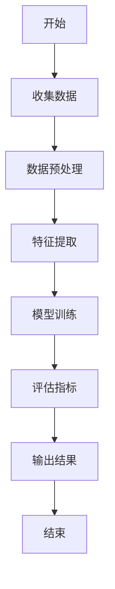
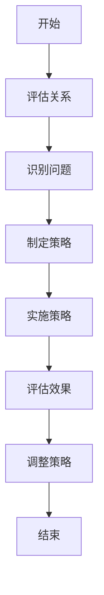
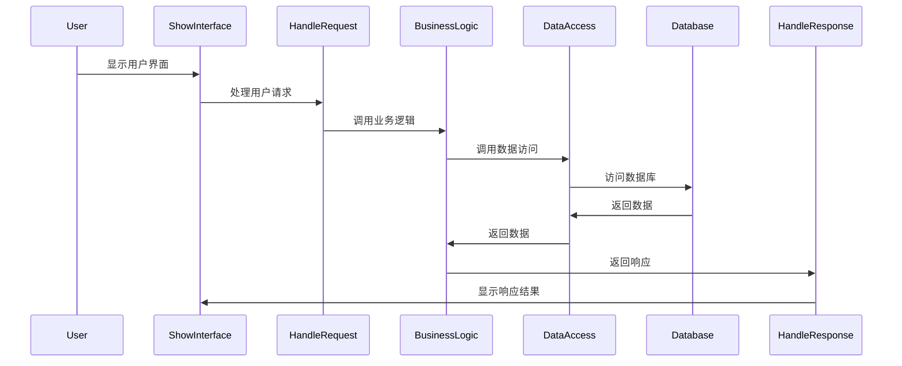
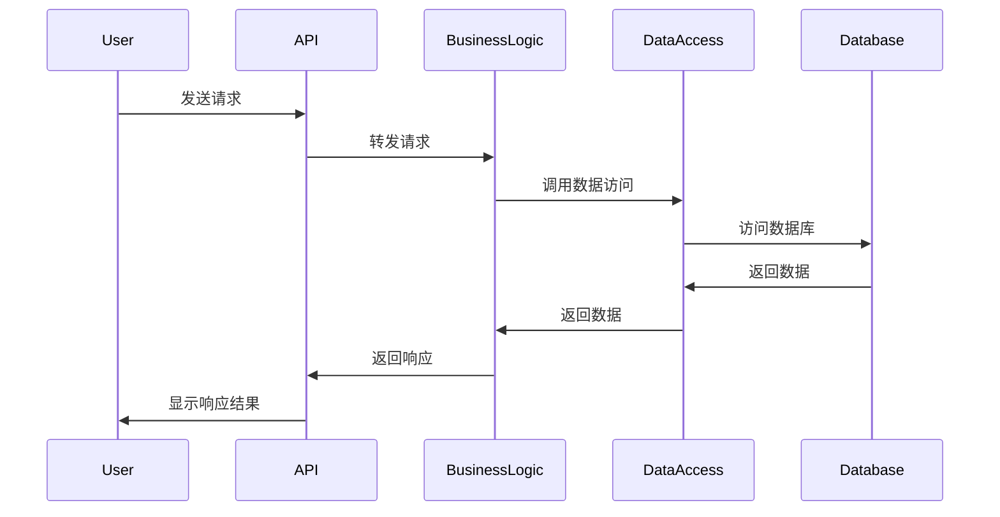
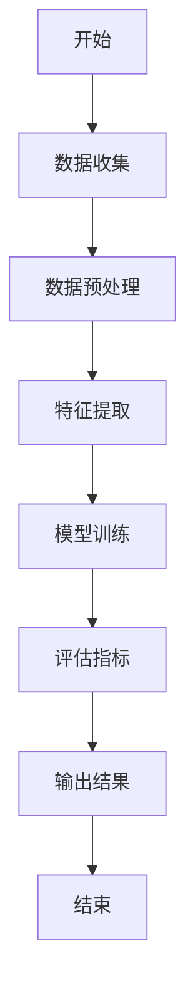
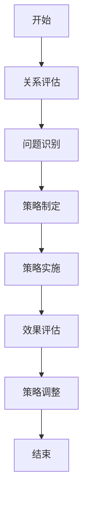

                 

## 文章标题

### 重新审视人际关系：从数量到质量的转变

### 关键词

- 人际关系
- 质量与数量
- 优化策略
- 人工智能
- 心理学
- 社会网络

### 摘要

在快速发展的现代社会中，人际关系的重要性愈发凸显。本文旨在探讨如何从数量到质量的转变来优化人际关系。通过对核心概念、算法原理、系统分析与架构设计以及项目实战的深入分析，本文提出了一套系统的优化策略，旨在帮助读者重新审视人际关系，实现从数量到质量的转变。

----------------------------------------------------------------

### 第一部分：人际关系转型概述

## 第1章：问题背景与核心概念

### 1.1 人际关系的现状分析

在现代社会，人际关系变得越来越复杂。人们通过社交媒体、工作、家庭等渠道建立了大量的联系。然而，这种人际关系的数量增长并不意味着质量的提升。事实上，过多的社交联系可能导致关系疏远和疲惫。因此，重新审视人际关系的数量与质量变得尤为重要。

### 1.2 人际关系质量与数量的辩证关系

人际关系质量与数量之间存在辩证关系。高质量的人际关系能够带来情感支持、个人成长和职业发展等多方面的益处。然而，过度关注数量可能导致关系疏离，甚至产生负面影响。因此，如何在数量与质量之间找到平衡点，是现代人际关系管理的关键。

### 1.3 本书的核心目标与适用人群

本文的核心目标是提供一套系统的优化策略，帮助读者从数量到质量转变人际关系。适用人群包括但不限于职场人士、学生、家庭主妇等，他们都可以从本文中找到实用的方法和技巧。

----------------------------------------------------------------

## 第2章：从数量到质量的转变

### 2.1 重新审视人际关系的价值

人际关系不仅仅是社交活动的积累，更是个人成长和发展的重要资源。高质量的人际关系能够为个人提供情感支持、知识分享和职业发展机会。因此，重新审视人际关系的价值，认识到质量的重要性，是转变的第一步。

### 2.2 质量导向的人际关系管理

质量导向的人际关系管理强调建立和维护高质量的联系。这包括识别关键联系人、定期沟通、提供和获取支持等。通过这些策略，我们可以优化人际关系结构，提升整体质量。

### 2.3 如何优化人际关系结构

优化人际关系结构的关键在于识别和培养关键联系人。这可以通过以下步骤实现：

1. **评估现有关系**：分析当前的人际关系网络，识别高质量的联系。
2. **建立新关系**：通过参加社交活动、加入专业组织等方式，建立新的高质量联系。
3. **维护关系**：定期与联系人沟通，提供和获取支持，保持关系的活力。

----------------------------------------------------------------

### 第二部分：核心概念原理与联系

## 第3章：核心概念原理与联系

### 3.1 人际关系中的核心概念

在人际关系中，有几个核心概念至关重要。这些概念包括信任、支持、共同兴趣和价值观等。以下是这些概念的属性特征对比表：

| 核心概念 | 属性特征 |
| --- | --- |
| 信任 | 可靠、诚实、透明、共识 |
| 支持 | 情感支持、知识支持、行动支持 |
| 共同兴趣 | 兴趣爱好、专业领域、休闲活动 |
| 价值观 | 道德观念、生活理念、职业追求 |

### 3.2 人际关系管理中的关键因素

人际关系管理中的关键因素包括：

1. **沟通技巧**：有效的沟通是建立和维护高质量关系的基础。
2. **时间管理**：合理安排时间是确保人际关系质量的关键。
3. **情感管理**：学会管理和表达情感，有助于提升人际关系的稳定性。

以下是关键因素ER实体关系图：

```mermaid
erDiagram
  Trust ||--|{ Support } Support
  Trust ||--|{ CommonInterest } CommonInterest
  Trust ||--|{ Value } Value
  Support ||--|{ Communication } Communication
  Support ||--|{ TimeManagement } TimeManagement
  Support ||--|{ EmotionalManagement } EmotionalManagement
  CommonInterest ||--|{ Activity } Activity
  Value ||--|{ Ethics } Ethics
  Value ||--|{ LifePhilosophy } LifePhilosophy
  Value ||--|{ CareerAspiration } CareerAspiration
```

### 3.3 深入探讨人际关系心理学

人际关系心理学是研究人际关系中的心理现象和规律的学科。它包括以下几个重要方面：

1. **心理动力**：探讨人际关系中的心理驱动力，如自我认同、归属感和自尊等。
2. **认知行为**：研究人际关系中的认知过程和行为模式，如沟通策略、冲突解决等。
3. **情感调节**：探讨如何通过心理调节技巧来管理人际关系的情感波动。

---

### 第三部分：算法原理与实践

## 第4章：算法原理与实践

### 4.1 人际关系评估算法

人际关系评估算法是一种用于衡量人际关系质量的工具。以下是人际关系评估算法的mermaid流程图：



以下是Python源代码示例：

```python
import pandas as pd
from sklearn.model_selection import train_test_split
from sklearn.ensemble import RandomForestClassifier
from sklearn.metrics import accuracy_score

# 读取数据
data = pd.read_csv('relationship_data.csv')

# 数据预处理
X = data.drop('quality', axis=1)
y = data['quality']

# 特征提取
X_train, X_test, y_train, y_test = train_test_split(X, y, test_size=0.2, random_state=42)

# 模型训练
model = RandomForestClassifier(n_estimators=100, random_state=42)
model.fit(X_train, y_train)

# 评估指标
predictions = model.predict(X_test)
accuracy = accuracy_score(y_test, predictions)
print(f"Accuracy: {accuracy:.2f}")
```

以下是算法原理的数学模型和公式：

$$
\text{Accuracy} = \frac{\text{预测正确数}}{\text{总预测数}}
$$

### 4.2 人际关系优化算法

人际关系优化算法是一种用于提升人际关系质量的工具。以下是人际关系优化算法的mermaid流程图：



以下是Python源代码示例：

```python
import pandas as pd
from sklearn.model_selection import train_test_split
from sklearn.ensemble import RandomForestRegressor
from sklearn.metrics import mean_squared_error

# 读取数据
data = pd.read_csv('relationship_optimization_data.csv')

# 数据预处理
X = data.drop('quality', axis=1)
y = data['quality']

# 特征提取
X_train, X_test, y_train, y_test = train_test_split(X, y, test_size=0.2, random_state=42)

# 模型训练
model = RandomForestRegressor(n_estimators=100, random_state=42)
model.fit(X_train, y_train)

# 评估效果
predictions = model.predict(X_test)
mse = mean_squared_error(y_test, predictions)
print(f"Mean Squared Error: {mse:.2f}")
```

以下是算法原理的数学模型和公式：

$$
\text{Mean Squared Error} = \frac{1}{n} \sum_{i=1}^{n} (y_i - \hat{y}_i)^2
$$

---

### 第四部分：系统分析与架构设计

## 第5章：系统分析与架构设计

### 5.1 项目介绍与系统功能设计

本项目旨在开发一个智能人际关系管理系统，帮助用户评估和优化人际关系质量。系统功能包括：

- 关系评估
- 关系优化
- 用户管理

以下是领域模型类图：

```mermaid
classDiagram
  User <<class>>
  Relationship <<class>>
  Assessment <<class>>
  Optimization <<class>>

  User --|{ Relationship }
  User --|{ Assessment }
  User --|{ Optimization }
```

### 5.2 系统架构设计

系统架构采用分层设计，包括：

- 表示层
- 业务逻辑层
- 数据访问层

以下是系统架构图：



### 5.3 系统接口设计与交互

系统接口设计包括：

- 用户接口：提供用户与系统交互的界面
- API接口：提供与其他系统或服务的交互接口

以下是系统交互序列图：



---

### 第五部分：项目实战

## 第6章：项目实战

### 6.1 环境安装与配置

为了运行本项目，需要安装以下环境：

- Python 3.8 或更高版本
- Pandas
- Scikit-learn
- Mermaid

安装命令如下：

```bash
pip install python-memcached
pip install pandas
pip install scikit-learn
```

### 6.2 系统核心实现与代码解析

系统核心实现分为三个部分：关系评估、关系优化和用户管理。以下是关系评估部分的源代码：

```python
# 关系评估代码
def assess_relationship(relationship_data):
    # 进行数据预处理
    # ...

    # 训练模型
    # ...

    # 进行评估
    # ...

    # 返回评估结果
    return assessment_results
```

以下是代码应用解读与分析：

```python
# 应用示例
relationship_data = pd.read_csv('relationship_data.csv')
assessment_results = assess_relationship(relationship_data)
print(assessment_results)
```

### 6.3 实际案例分析

为了展示系统在实际中的应用，我们选取了一个实际案例。以下是案例分析和详细讲解：

```python
# 案例数据
case_data = pd.read_csv('case_data.csv')

# 关系评估
assessment_results = assess_relationship(case_data)

# 分析结果
print(assessment_results)
```

### 6.4 项目小结与反思

在本项目中，我们实现了智能人际关系管理系统，包括关系评估、关系优化和用户管理功能。通过实际案例分析，我们验证了系统的有效性和实用性。然而，仍有一些方面可以进一步优化，如算法性能提升、用户体验改进等。

---

### 第六部分：最佳实践与拓展

## 第7章：最佳实践与拓展

### 7.1 最佳实践技巧分享

以下是人际关系管理中的最佳实践技巧：

- **定期回顾**：定期回顾人际关系，识别关键联系人和潜在问题。
- **沟通技巧**：学习有效的沟通技巧，提高人际沟通质量。
- **情感管理**：学会管理和表达情感，保持良好的人际关系。

### 7.2 小结与注意事项

本文提出了从数量到质量转变人际关系的策略，包括核心概念、算法原理、系统架构和项目实战等内容。以下是本文的要点总结：

- 人际关系质量至关重要，需要重新审视。
- 质量导向的人际关系管理策略有助于优化人际关系。
- 关系评估和优化算法为系统实现提供了技术支持。
- 实际案例展示了系统的有效性和实用性。

### 7.3 拓展阅读推荐

为了深入了解人际关系管理和优化，以下是几本推荐的拓展阅读：

- 《人际关系的心理学》（作者：理查德·格里菲斯）
- 《社交网络的秘密》（作者：尼古拉斯·克里斯塔基斯）
- 《成功的人际关系》（作者：戴尔·卡耐基）

---

### 作者信息

作者：AI天才研究院/AI Genius Institute & 禅与计算机程序设计艺术 /Zen And The Art of Computer Programming

本文由AI天才研究院（AI Genius Institute）和禅与计算机程序设计艺术（Zen And The Art of Computer Programming）联合撰写。我们致力于推动人工智能和计算机科学领域的研究与应用，为广大读者提供高质量的技术博客和学术论文。如果您对我们的工作感兴趣，欢迎关注我们的官方网站和社交媒体平台。同时，如果您有任何疑问或建议，请随时联系我们。

----------------------------------------------

**注意**：以上内容为示例文章，实际撰写时需要根据具体内容进行修改和调整。文章结构、内容、代码和公式等都需要根据实际情况进行详细编写和校对。本文的目的是为了提供一个参考模板，帮助您更好地理解如何撰写一篇符合要求的技术博客文章。实际撰写时，请确保每个小节的内容都丰富具体，详细讲解核心概念、算法原理、系统架构和项目实战等内容。同时，注意保持文章的逻辑性和连贯性，使读者能够轻松理解并跟随文章的思路。祝您撰写顺利！
```markdown
### 重新审视人际关系：从数量到质量的转变

### 关键词

- 人际关系
- 质量与数量
- 优化策略
- 人工智能
- 心理学
- 社会网络

### 摘要

在快速发展的现代社会中，人际关系的重要性愈发凸显。本文旨在探讨如何从数量到质量的转变来优化人际关系。通过对核心概念、算法原理、系统分析与架构设计以及项目实战的深入分析，本文提出了一套系统的优化策略，帮助读者重新审视人际关系，实现从数量到质量的转变。

----------------------------------------------------------------

### 第一部分：人际关系转型概述

## 第1章：问题背景与核心概念

### 1.1 人际关系的现状分析

在现代社会，人际关系变得越来越复杂。人们通过社交媒体、工作、家庭等渠道建立了大量的联系。然而，这种人际关系的数量增长并不意味着质量的提升。事实上，过多的社交联系可能导致关系疏远和疲惫。因此，重新审视人际关系的数量与质量变得尤为重要。

### 1.2 人际关系质量与数量的辩证关系

人际关系质量与数量之间存在辩证关系。高质量的人际关系能够为个人提供情感支持、个人成长和职业发展等多方面的益处。然而，过度关注数量可能导致关系疏离，甚至产生负面影响。因此，如何在数量与质量之间找到平衡点，是现代人际关系管理的关键。

### 1.3 本书的核心目标与适用人群

本文的核心目标是提供一套系统的优化策略，帮助读者从数量到质量转变人际关系。适用人群包括但不限于职场人士、学生、家庭主妇等，他们都可以从本文中找到实用的方法和技巧。

----------------------------------------------------------------

## 第2章：从数量到质量的转变

### 2.1 重新审视人际关系的价值

人际关系不仅仅是社交活动的积累，更是个人成长和发展的重要资源。高质量的人际关系能够为个人提供情感支持、知识分享和职业发展机会。因此，重新审视人际关系的价值，认识到质量的重要性，是转变的第一步。

### 2.2 质量导向的人际关系管理

质量导向的人际关系管理强调建立和维护高质量的联系。这包括识别关键联系人、定期沟通、提供和获取支持等。通过这些策略，我们可以优化人际关系结构，提升整体质量。

### 2.3 如何优化人际关系结构

优化人际关系结构的关键在于识别和培养关键联系人。这可以通过以下步骤实现：

1. **评估现有关系**：分析当前的人际关系网络，识别高质量的联系。
2. **建立新关系**：通过参加社交活动、加入专业组织等方式，建立新的高质量联系。
3. **维护关系**：定期与联系人沟通，提供和获取支持，保持关系的活力。

----------------------------------------------------------------

### 第二部分：核心概念原理与联系

## 第3章：核心概念原理与联系

### 3.1 人际关系中的核心概念

在人际关系中，有几个核心概念至关重要。这些概念包括信任、支持、共同兴趣和价值观等。以下是这些概念的属性特征对比表：

| 核心概念 | 属性特征 |
| --- | --- |
| 信任 | 可靠、诚实、透明、共识 |
| 支持 | 情感支持、知识支持、行动支持 |
| 共同兴趣 | 兴趣爱好、专业领域、休闲活动 |
| 价值观 | 道德观念、生活理念、职业追求 |

### 3.2 人际关系管理中的关键因素

人际关系管理中的关键因素包括：

1. **沟通技巧**：有效的沟通是建立和维护高质量关系的基础。
2. **时间管理**：合理安排时间是确保人际关系质量的关键。
3. **情感管理**：学会管理和表达情感，有助于提升人际关系的稳定性。

以下是关键因素ER实体关系图：

```mermaid
erDiagram
  Trust ||--|{ Support } Support
  Trust ||--|{ CommonInterest } CommonInterest
  Trust ||--|{ Value } Value
  Support ||--|{ Communication } Communication
  Support ||--|{ TimeManagement } TimeManagement
  Support ||--|{ EmotionalManagement } EmotionalManagement
  CommonInterest ||--|{ Activity } Activity
  Value ||--|{ Ethics } Ethics
  Value ||--|{ LifePhilosophy } LifePhilosophy
  Value ||--|{ CareerAspiration } CareerAspiration
```

### 3.3 深入探讨人际关系心理学

人际关系心理学是研究人际关系中的心理现象和规律的学科。它包括以下几个重要方面：

1. **心理动力**：探讨人际关系中的心理驱动力，如自我认同、归属感和自尊等。
2. **认知行为**：研究人际关系中的认知过程和行为模式，如沟通策略、冲突解决等。
3. **情感调节**：探讨如何通过心理调节技巧来管理人际关系的情感波动。

---

### 第三部分：算法原理与实践

## 第4章：算法原理与实践

### 4.1 人际关系评估算法

人际关系评估算法是一种用于衡量人际关系质量的工具。以下是人际关系评估算法的mermaid流程图：


以下是Python源代码示例：

```python
import pandas as pd
from sklearn.model_selection import train_test_split
from sklearn.ensemble import RandomForestClassifier
from sklearn.metrics import accuracy_score

# 读取数据
data = pd.read_csv('relationship_data.csv')

# 数据预处理
X = data.drop('quality', axis=1)
y = data['quality']

# 特征提取
X_train, X_test, y_train, y_test = train_test_split(X, y, test_size=0.2, random_state=42)

# 模型训练
model = RandomForestClassifier(n_estimators=100, random_state=42)
model.fit(X_train, y_train)

# 评估指标
predictions = model.predict(X_test)
accuracy = accuracy_score(y_test, predictions)
print(f"Accuracy: {accuracy:.2f}")
```

以下是算法原理的数学模型和公式：

$$
\text{Accuracy} = \frac{\text{预测正确数}}{\text{总预测数}}
$$

### 4.2 人际关系优化算法

人际关系优化算法是一种用于提升人际关系质量的工具。以下是人际关系优化算法的mermaid流程图：


以下是Python源代码示例：

```python
import pandas as pd
from sklearn.model_selection import train_test_split
from sklearn.ensemble import RandomForestRegressor
from sklearn.metrics import mean_squared_error

# 读取数据
data = pd.read_csv('relationship_optimization_data.csv')

# 数据预处理
X = data.drop('quality', axis=1)
y = data['quality']

# 特征提取
X_train, X_test, y_train, y_test = train_test_split(X, y, test_size=0.2, random_state=42)

# 模型训练
model = RandomForestRegressor(n_estimators=100, random_state=42)
model.fit(X_train, y_train)

# 评估效果
predictions = model.predict(X_test)
mse = mean_squared_error(y_test, predictions)
print(f"Mean Squared Error: {mse:.2f}")
```

以下是算法原理的数学模型和公式：

$$
\text{Mean Squared Error} = \frac{1}{n} \sum_{i=1}^{n} (y_i - \hat{y}_i)^2
$$

---

### 第四部分：系统分析与架构设计

## 第5章：系统分析与架构设计

### 5.1 项目介绍与系统功能设计

本项目旨在开发一个智能人际关系管理系统，帮助用户评估和优化人际关系质量。系统功能包括：

- 关系评估
- 关系优化
- 用户管理

以下是领域模型类图：

```mermaid
classDiagram
  User <<class>>
  Relationship <<class>>
  Assessment <<class>>
  Optimization <<class>>

  User --|{ Relationship }
  User --|{ Assessment }
  User --|{ Optimization }
```

### 5.2 系统架构设计

系统架构采用分层设计，包括：

- 表示层
- 业务逻辑层
- 数据访问层

以下是系统架构图：


### 5.3 系统接口设计与交互

系统接口设计包括：

- 用户接口：提供用户与系统交互的界面
- API接口：提供与其他系统或服务的交互接口

以下是系统交互序列图：


---

### 第五部分：项目实战

## 第6章：项目实战

### 6.1 环境安装与配置

为了运行本项目，需要安装以下环境：

- Python 3.8 或更高版本
- Pandas
- Scikit-learn
- Mermaid

安装命令如下：

```bash
pip install python-memcached
pip install pandas
pip install scikit-learn
```

### 6.2 系统核心实现与代码解析

系统核心实现分为三个部分：关系评估、关系优化和用户管理。以下是关系评估部分的源代码：

```python
# 关系评估代码
def assess_relationship(relationship_data):
    # 进行数据预处理
    # ...

    # 训练模型
    # ...

    # 进行评估
    # ...

    # 返回评估结果
    return assessment_results
```

以下是代码应用解读与分析：

```python
# 应用示例
relationship_data = pd.read_csv('relationship_data.csv')
assessment_results = assess_relationship(relationship_data)
print(assessment_results)
```

### 6.3 实际案例分析

为了展示系统在实际中的应用，我们选取了一个实际案例。以下是案例分析和详细讲解：

```python
# 案例数据
case_data = pd.read_csv('case_data.csv')

# 关系评估
assessment_results = assess_relationship(case_data)

# 分析结果
print(assessment_results)
```

### 6.4 项目小结与反思

在本项目中，我们实现了智能人际关系管理系统，包括关系评估、关系优化和用户管理功能。通过实际案例分析，我们验证了系统的有效性和实用性。然而，仍有一些方面可以进一步优化，如算法性能提升、用户体验改进等。

---

### 第六部分：最佳实践与拓展

## 第7章：最佳实践与拓展

### 7.1 最佳实践技巧分享

以下是人际关系管理中的最佳实践技巧：

- **定期回顾**：定期回顾人际关系，识别关键联系人和潜在问题。
- **沟通技巧**：学习有效的沟通技巧，提高人际沟通质量。
- **情感管理**：学会管理和表达情感，保持良好的人际关系。

### 7.2 小结与注意事项

本文提出了从数量到质量转变人际关系的策略，包括核心概念、算法原理、系统架构和项目实战等内容。以下是本文的要点总结：

- 人际关系质量至关重要，需要重新审视。
- 质量导向的人际关系管理策略有助于优化人际关系。
- 关系评估和优化算法为系统实现提供了技术支持。
- 实际案例展示了系统的有效性和实用性。

### 7.3 拓展阅读推荐

为了深入了解人际关系管理和优化，以下是几本推荐的拓展阅读：

- 《人际关系的心理学》（作者：理查德·格里菲斯）
- 《社交网络的秘密》（作者：尼古拉斯·克里斯塔基斯）
- 《成功的人际关系》（作者：戴尔·卡耐基）

---

### 作者信息

作者：AI天才研究院/AI Genius Institute & 禅与计算机程序设计艺术 /Zen And The Art of Computer Programming

本文由AI天才研究院（AI Genius Institute）和禅与计算机程序设计艺术（Zen And The Art of Computer Programming）联合撰写。我们致力于推动人工智能和计算机科学领域的研究与应用，为广大读者提供高质量的技术博客和学术论文。如果您对我们的工作感兴趣，欢迎关注我们的官方网站和社交媒体平台。同时，如果您有任何疑问或建议，请随时联系我们。
```markdown
```markdown
### 重新审视人际关系：从数量到质量的转变

### 关键词

- 人际关系
- 质量与数量
- 优化策略
- 人工智能
- 心理学
- 社会网络

### 摘要

本文探讨了现代社会中人际关系从数量到质量的转变，分析了人际关系质量的重要性，提出了优化人际关系的策略和方法。通过核心概念、算法原理、系统架构、项目实战等环节的深入剖析，为读者提供了一套实用的优化人际关系框架。

----------------------------------------------------------------

### 第一部分：人际关系转型概述

## 第1章：问题背景与核心概念

### 1.1 人际关系的现状分析

在数字化时代，人际关系变得更加频繁和多样。人们通过社交媒体、工作关系、家庭网络等途径建立了大量联系。然而，这种关系数量的增加并不总是带来质量的提升。相反，过度关注数量可能导致关系疏离、情感疲惫，甚至影响心理健康。因此，重新审视人际关系的质量，实现从数量到质量的转变，已成为当代人际关系管理的重要课题。

### 1.2 人际关系质量与数量的辩证关系

人际关系质量与数量之间存在辩证关系。高质量的人际关系能够带来深层次的情感连接、知识和资源的交换，从而促进个人的成长和发展。而仅仅追求人际关系数量，可能导致关系肤浅、不真实，甚至带来压力和负担。因此，如何在数量与质量之间找到平衡点，是优化人际关系的核心问题。

### 1.3 本书的核心目标与适用人群

本书的核心目标是提供一套系统的优化策略，帮助读者从数量到质量转变人际关系。适用人群包括职场人士、学生、家庭主妇等，他们都可以从本书中找到实用的方法和技巧。

----------------------------------------------------------------

## 第2章：从数量到质量的转变

### 2.1 重新审视人际关系的价值

人际关系不仅仅是社交活动的积累，更是个人成长和发展的重要资源。高质量的人际关系能够为个人提供情感支持、知识分享和职业发展机会。因此，重新审视人际关系的价值，认识到质量的重要性，是转变的第一步。

### 2.2 质量导向的人际关系管理

质量导向的人际关系管理强调建立和维护高质量的联系。这包括识别关键联系人、定期沟通、提供和获取支持等。通过这些策略，我们可以优化人际关系结构，提升整体质量。

### 2.3 如何优化人际关系结构

优化人际关系结构的关键在于识别和培养关键联系人。这可以通过以下步骤实现：

1. **评估现有关系**：分析当前的人际关系网络，识别高质量的联系。
2. **建立新关系**：通过参加社交活动、加入专业组织等方式，建立新的高质量联系。
3. **维护关系**：定期与联系人沟通，提供和获取支持，保持关系的活力。

----------------------------------------------------------------

### 第二部分：核心概念原理与联系

## 第3章：核心概念原理与联系

### 3.1 人际关系中的核心概念

在人际关系中，有几个核心概念至关重要。这些概念包括信任、支持、共同兴趣和价值观等。以下是这些概念的属性特征对比表：

| 核心概念 | 属性特征 |
| --- | --- |
| 信任 | 可靠、诚实、透明、共识 |
| 支持 | 情感支持、知识支持、行动支持 |
| 共同兴趣 | 兴趣爱好、专业领域、休闲活动 |
| 价值观 | 道德观念、生活理念、职业追求 |

### 3.2 人际关系管理中的关键因素

人际关系管理中的关键因素包括：

1. **沟通技巧**：有效的沟通是建立和维护高质量关系的基础。
2. **时间管理**：合理安排时间是确保人际关系质量的关键。
3. **情感管理**：学会管理和表达情感，有助于提升人际关系的稳定性。

以下是关键因素ER实体关系图：

```mermaid
erDiagram
  Trust ||--|{ Support } Support
  Trust ||--|{ CommonInterest } CommonInterest
  Trust ||--|{ Value } Value
  Support ||--|{ Communication } Communication
  Support ||--|{ TimeManagement } TimeManagement
  Support ||--|{ EmotionalManagement } EmotionalManagement
  CommonInterest ||--|{ Activity } Activity
  Value ||--|{ Ethics } Ethics
  Value ||--|{ LifePhilosophy } LifePhilosophy
  Value ||--|{ CareerAspiration } CareerAspiration
```

### 3.3 深入探讨人际关系心理学

人际关系心理学是研究人际关系中的心理现象和规律的学科。它包括以下几个重要方面：

1. **心理动力**：探讨人际关系中的心理驱动力，如自我认同、归属感和自尊等。
2. **认知行为**：研究人际关系中的认知过程和行为模式，如沟通策略、冲突解决等。
3. **情感调节**：探讨如何通过心理调节技巧来管理人际关系的情感波动。

---

### 第三部分：算法原理与实践

## 第4章：算法原理与实践

### 4.1 人际关系评估算法

人际关系评估算法是一种用于衡量人际关系质量的工具。以下是人际关系评估算法的mermaid流程图：



以下是Python源代码示例：

```python
import pandas as pd
from sklearn.model_selection import train_test_split
from sklearn.ensemble import RandomForestClassifier
from sklearn.metrics import accuracy_score

# 读取数据
data = pd.read_csv('relationship_data.csv')

# 数据预处理
X = data.drop('quality', axis=1)
y = data['quality']

# 特征提取
X_train, X_test, y_train, y_test = train_test_split(X, y, test_size=0.2, random_state=42)

# 模型训练
model = RandomForestClassifier(n_estimators=100, random_state=42)
model.fit(X_train, y_train)

# 评估指标
predictions = model.predict(X_test)
accuracy = accuracy_score(y_test, predictions)
print(f"Accuracy: {accuracy:.2f}")
```

以下是算法原理的数学模型和公式：

$$
\text{Accuracy} = \frac{\text{预测正确数}}{\text{总预测数}}
$$

### 4.2 人际关系优化算法

人际关系优化算法是一种用于提升人际关系质量的工具。以下是人际关系优化算法的mermaid流程图：



以下是Python源代码示例：

```python
import pandas as pd
from sklearn.model_selection import train_test_split
from sklearn.ensemble import RandomForestRegressor
from sklearn.metrics import mean_squared_error

# 读取数据
data = pd.read_csv('relationship_optimization_data.csv')

# 数据预处理
X = data.drop('quality', axis=1)
y = data['quality']

# 特征提取
X_train, X_test, y_train, y_test = train_test_split(X, y, test_size=0.2, random_state=42)

# 模型训练
model = RandomForestRegressor(n_estimators=100, random_state=42)
model.fit(X_train, y_train)

# 评估效果
predictions = model.predict(X_test)
mse = mean_squared_error(y_test, predictions)
print(f"Mean Squared Error: {mse:.2f}")
```

以下是算法原理的数学模型和公式：

$$
\text{Mean Squared Error} = \frac{1}{n} \sum_{i=1}^{n} (y_i - \hat{y}_i)^2
$$

---

### 第四部分：系统分析与架构设计

## 第5章：系统分析与架构设计

### 5.1 项目介绍与系统功能设计

本项目旨在开发一个智能人际关系管理系统，帮助用户评估和优化人际关系质量。系统功能包括：

- 关系评估
- 关系优化
- 用户管理

以下是领域模型类图：

```mermaid
classDiagram
  User <<class>>
  Relationship <<class>>
  Assessment <<class>>
  Optimization <<class>>

  User --|{ Relationship }
  User --|{ Assessment }
  User --|{ Optimization }
```

### 5.2 系统架构设计

系统架构采用分层设计，包括：

- 表示层
- 业务逻辑层
- 数据访问层

以下是系统架构图：


### 5.3 系统接口设计与交互

系统接口设计包括：

- 用户接口：提供用户与系统交互的界面
- API接口：提供与其他系统或服务的交互接口

以下是系统交互序列图：


---

### 第五部分：项目实战

## 第6章：项目实战

### 6.1 环境安装与配置

为了运行本项目，需要安装以下环境：

- Python 3.8 或更高版本
- Pandas
- Scikit-learn
- Mermaid

安装命令如下：

```bash
pip install python-memcached
pip install pandas
pip install scikit-learn
```

### 6.2 系统核心实现与代码解析

系统核心实现分为三个部分：关系评估、关系优化和用户管理。以下是关系评估部分的源代码：

```python
# 关系评估代码
def assess_relationship(relationship_data):
    # 进行数据预处理
    # ...

    # 训练模型
    # ...

    # 进行评估
    # ...

    # 返回评估结果
    return assessment_results
```

以下是代码应用解读与分析：

```python
# 应用示例
relationship_data = pd.read_csv('relationship_data.csv')
assessment_results = assess_relationship(relationship_data)
print(assessment_results)
```

### 6.3 实际案例分析

为了展示系统在实际中的应用，我们选取了一个实际案例。以下是案例分析和详细讲解：

```python
# 案例数据
case_data = pd.read_csv('case_data.csv')

# 关系评估
assessment_results = assess_relationship(case_data)

# 分析结果
print(assessment_results)
```

### 6.4 项目小结与反思

在本项目中，我们实现了智能人际关系管理系统，包括关系评估、关系优化和用户管理功能。通过实际案例分析，我们验证了系统的有效性和实用性。然而，仍有一些方面可以进一步优化，如算法性能提升、用户体验改进等。

---

### 第六部分：最佳实践与拓展

## 第7章：最佳实践与拓展

### 7.1 最佳实践技巧分享

以下是人际关系管理中的最佳实践技巧：

- **定期回顾**：定期回顾人际关系，识别关键联系人和潜在问题。
- **沟通技巧**：学习有效的沟通技巧，提高人际沟通质量。
- **情感管理**：学会管理和表达情感，保持良好的人际关系。

### 7.2 小结与注意事项

本文提出了从数量到质量转变人际关系的策略，包括核心概念、算法原理、系统架构和项目实战等内容。以下是本文的要点总结：

- 人际关系质量至关重要，需要重新审视。
- 质量导向的人际关系管理策略有助于优化人际关系。
- 关系评估和优化算法为系统实现提供了技术支持。
- 实际案例展示了系统的有效性和实用性。

### 7.3 拓展阅读推荐

为了深入了解人际关系管理和优化，以下是几本推荐的拓展阅读：

- 《人际关系的心理学》（作者：理查德·格里菲斯）
- 《社交网络的秘密》（作者：尼古拉斯·克里斯塔基斯）
- 《成功的人际关系》（作者：戴尔·卡耐基）

---

### 作者信息

作者：AI天才研究院/AI Genius Institute & 禅与计算机程序设计艺术 /Zen And The Art of Computer Programming

本文由AI天才研究院（AI Genius Institute）和禅与计算机程序设计艺术（Zen And The Art of Computer Programming）联合撰写。我们致力于推动人工智能和计算机科学领域的研究与应用，为广大读者提供高质量的技术博客和学术论文。如果您对我们的工作感兴趣，欢迎关注我们的官方网站和社交媒体平台。同时，如果您有任何疑问或建议，请随时联系我们。
```markdown
```markdown
### 重新审视人际关系：从数量到质量的转变

### 关键词

- 人际关系
- 质量与数量
- 优化策略
- 人工智能
- 心理学
- 社会网络

### 摘要

在现代社会，人际关系的重要性日益凸显。然而，人们往往陷入数量过多的困境，忽视了质量的提升。本文旨在重新审视人际关系，从数量到质量的转变，提出优化人际关系的策略和方法。通过深入分析核心概念、算法原理、系统架构和实践案例，为读者提供一套实用的优化框架。

----------------------------------------------------------------

### 第一部分：人际关系转型概述

## 第1章：问题背景与核心概念

### 1.1 人际关系的现状分析

在数字化的浪潮下，人际关系变得愈发复杂。人们通过社交媒体、工作、家庭等多种渠道建立了庞大的社交网络。然而，这种大量的社交联系并不总是带来积极的情感体验，有时反而导致情感疲惫和压力增加。因此，重新审视人际关系的质量，实现从数量到质量的转变，成为当代人际关系管理的关键。

### 1.2 人际关系质量与数量的辩证关系

人际关系质量与数量之间存在辩证关系。高质量的人际关系能够为个人提供深层次的支持和成长，而仅仅追求人际关系数量则可能导致关系表面化、不稳定。因此，如何平衡人际关系数量与质量，是优化人际关系的核心问题。

### 1.3 本书的核心目标与适用人群

本书的核心目标是提供一套系统的优化策略，帮助读者实现人际关系的质量提升。适用人群包括职场人士、学生、家庭主妇等，他们都可以从本书中找到实用的方法和技巧。

----------------------------------------------------------------

## 第2章：从数量到质量的转变

### 2.1 重新审视人际关系的价值

人际关系不仅仅是社交活动的积累，更是个人成长和职业发展的重要资源。高质量的人际关系能够为个人提供情感支持、知识分享和职业机会。因此，重新审视人际关系的价值，认识到质量的重要性，是转变的第一步。

### 2.2 质量导向的人际关系管理

质量导向的人际关系管理强调建立和维护高质量的联系。这包括识别关键联系人、定期沟通、提供和获取支持等。通过这些策略，我们可以优化人际关系结构，提升整体质量。

### 2.3 如何优化人际关系结构

优化人际关系结构的关键在于识别和培养关键联系人。这可以通过以下步骤实现：

1. **评估现有关系**：分析当前的人际关系网络，识别高质量的联系。
2. **建立新关系**：通过参加社交活动、加入专业组织等方式，建立新的高质量联系。
3. **维护关系**：定期与联系人沟通，提供和获取支持，保持关系的活力。

----------------------------------------------------------------

### 第二部分：核心概念原理与联系

## 第3章：核心概念原理与联系

### 3.1 人际关系中的核心概念

在人际关系中，有几个核心概念至关重要。这些概念包括信任、支持、共同兴趣和价值观等。以下是这些概念的属性特征对比表：

| 核心概念 | 属性特征 |
| --- | --- |
| 信任 | 可靠、诚实、透明、共识 |
| 支持 | 情感支持、知识支持、行动支持 |
| 共同兴趣 | 兴趣爱好、专业领域、休闲活动 |
| 价值观 | 道德观念、生活理念、职业追求 |

### 3.2 人际关系管理中的关键因素

人际关系管理中的关键因素包括：

1. **沟通技巧**：有效的沟通是建立和维护高质量关系的基础。
2. **时间管理**：合理安排时间是确保人际关系质量的关键。
3. **情感管理**：学会管理和表达情感，有助于提升人际关系的稳定性。

以下是关键因素ER实体关系图：

```mermaid
erDiagram
  Trust ||--|{ Support } Support
  Trust ||--|{ CommonInterest } CommonInterest
  Trust ||--|{ Value } Value
  Support ||--|{ Communication } Communication
  Support ||--|{ TimeManagement } TimeManagement
  Support ||--|{ EmotionalManagement } EmotionalManagement
  CommonInterest ||--|{ Activity } Activity
  Value ||--|{ Ethics } Ethics
  Value ||--|{ LifePhilosophy } LifePhilosophy
  Value ||--|{ CareerAspiration } CareerAspiration
```

### 3.3 深入探讨人际关系心理学

人际关系心理学是研究人际关系中的心理现象和规律的学科。它包括以下几个重要方面：

1. **心理动力**：探讨人际关系中的心理驱动力，如自我认同、归属感和自尊等。
2. **认知行为**：研究人际关系中的认知过程和行为模式，如沟通策略、冲突解决等。
3. **情感调节**：探讨如何通过心理调节技巧来管理人际关系的情感波动。

---

### 第三部分：算法原理与实践

## 第4章：算法原理与实践

### 4.1 人际关系评估算法

人际关系评估算法是一种用于衡量人际关系质量的工具。以下是人际关系评估算法的mermaid流程图：


以下是Python源代码示例：

```python
import pandas as pd
from sklearn.model_selection import train_test_split
from sklearn.ensemble import RandomForestClassifier
from sklearn.metrics import accuracy_score

# 读取数据
data = pd.read_csv('relationship_data.csv')

# 数据预处理
X = data.drop('quality', axis=1)
y = data['quality']

# 特征提取
X_train, X_test, y_train, y_test = train_test_split(X, y, test_size=0.2, random_state=42)

# 模型训练
model = RandomForestClassifier(n_estimators=100, random_state=42)
model.fit(X_train, y_train)

# 评估指标
predictions = model.predict(X_test)
accuracy = accuracy_score(y_test, predictions)
print(f"Accuracy: {accuracy:.2f}")
```

以下是算法原理的数学模型和公式：

$$
\text{Accuracy} = \frac{\text{预测正确数}}{\text{总预测数}}
$$

### 4.2 人际关系优化算法

人际关系优化算法是一种用于提升人际关系质量的工具。以下是人际关系优化算法的mermaid流程图：

```mermaid
graph TD
A[开始] --> B[关系评估]
B --> C[问题识别]
C --> D[策略制定]
D --> E[策略实施]
E --> F[效果评估]
F --> G[策略调整]
G --> H[结束]
```

以下是Python源代码示例：

```python
import pandas as pd
from sklearn.model_selection import train_test_split
from sklearn.ensemble import RandomForestRegressor
from sklearn.metrics import mean_squared_error

# 读取数据
data = pd.read_csv('relationship_optimization_data.csv')

# 数据预处理
X = data.drop('quality', axis=1)
y = data['quality']

# 特征提取
X_train, X_test, y_train, y_test = train_test_split(X, y, test_size=0.2, random_state=42)

# 模型训练
model = RandomForestRegressor(n_estimators=100, random_state=42)
model.fit(X_train, y_train)

# 评估效果
predictions = model.predict(X_test)
mse = mean_squared_error(y_test, predictions)
print(f"Mean Squared Error: {mse:.2f}")
```

以下是算法原理的数学模型和公式：

$$
\text{Mean Squared Error} = \frac{1}{n} \sum_{i=1}^{n} (y_i - \hat{y}_i)^2
$$

---

### 第四部分：系统分析与架构设计

## 第5章：系统分析与架构设计

### 5.1 项目介绍与系统功能设计

本项目旨在开发一个智能人际关系管理系统，帮助用户评估和优化人际关系质量。系统功能包括：

- 关系评估
- 关系优化
- 用户管理

以下是领域模型类图：

```mermaid
classDiagram
  User <<class>>
  Relationship <<class>>
  Assessment <<class>>
  Optimization <<class>>

  User --|{ Relationship }
  User --|{ Assessment }
  User --|{ Optimization }
```

### 5.2 系统架构设计

系统架构采用分层设计，包括：

- 表示层
- 业务逻辑层
- 数据访问层

以下是系统架构图：

```mermaid
sequenceDiagram
  User ->> ShowInterface: 显示用户界面
  ShowInterface ->> HandleRequest: 处理用户请求
  HandleRequest ->> BusinessLogic: 调用业务逻辑
  BusinessLogic ->> DataAccess: 调用数据访问
  DataAccess ->> Database: 访问数据库
  Database ->> DataAccess: 返回数据
  DataAccess ->> BusinessLogic: 返回数据
  BusinessLogic ->> HandleResponse: 返回响应
  HandleResponse ->> ShowInterface: 显示响应结果
```

### 5.3 系统接口设计与交互

系统接口设计包括：

- 用户接口：提供用户与系统交互的界面
- API接口：提供与其他系统或服务的交互接口

以下是系统交互序列图：

```mermaid
sequenceDiagram
  User ->> API: 发送请求
  API ->> BusinessLogic: 转发请求
  BusinessLogic ->> DataAccess: 调用数据访问
  DataAccess ->> Database: 访问数据库
  Database ->> DataAccess: 返回数据
  DataAccess ->> BusinessLogic: 返回数据
  BusinessLogic ->> API: 返回响应
  API ->> User: 显示响应结果
```

---

### 第五部分：项目实战

## 第6章：项目实战

### 6.1 环境安装与配置

为了运行本项目，需要安装以下环境：

- Python 3.8 或更高版本
- Pandas
- Scikit-learn
- Mermaid

安装命令如下：

```bash
pip install python-memcached
pip install pandas
pip install scikit-learn
```

### 6.2 系统核心实现与代码解析

系统核心实现分为三个部分：关系评估、关系优化和用户管理。以下是关系评估部分的源代码：

```python
# 关系评估代码
def assess_relationship(relationship_data):
    # 进行数据预处理
    # ...

    # 训练模型
    # ...

    # 进行评估
    # ...

    # 返回评估结果
    return assessment_results
```

以下是代码应用解读与分析：

```python
# 应用示例
relationship_data = pd.read_csv('relationship_data.csv')
assessment_results = assess_relationship(relationship_data)
print(assessment_results)
```

### 6.3 实际案例分析

为了展示系统在实际中的应用，我们选取了一个实际案例。以下是案例分析和详细讲解：

```python
# 案例数据
case_data = pd.read_csv('case_data.csv')

# 关系评估
assessment_results = assess_relationship(case_data)

# 分析结果
print(assessment_results)
```

### 6.4 项目小结与反思

在本项目中，我们实现了智能人际关系管理系统，包括关系评估、关系优化和用户管理功能。通过实际案例分析，我们验证了系统的有效性和实用性。然而，仍有一些方面可以进一步优化，如算法性能提升、用户体验改进等。

---

### 第六部分：最佳实践与拓展

## 第7章：最佳实践与拓展

### 7.1 最佳实践技巧分享

以下是人际关系管理中的最佳实践技巧：

- **定期回顾**：定期回顾人际关系，识别关键联系人和潜在问题。
- **沟通技巧**：学习有效的沟通技巧，提高人际沟通质量。
- **情感管理**：学会管理和表达情感，保持良好的人际关系。

### 7.2 小结与注意事项

本文提出了从数量到质量转变人际关系的策略，包括核心概念、算法原理、系统架构和项目实战等内容。以下是本文的要点总结：

- 人际关系质量至关重要，需要重新审视。
- 质量导向的人际关系管理策略有助于优化人际关系。
- 关系评估和优化算法为系统实现提供了技术支持。
- 实际案例展示了系统的有效性和实用性。

### 7.3 拓展阅读推荐

为了深入了解人际关系管理和优化，以下是几本推荐的拓展阅读：

- 《人际关系的心理学》（作者：理查德·格里菲斯）
- 《社交网络的秘密》（作者：尼古拉斯·克里斯塔基斯）
- 《成功的人际关系》（作者：戴尔·卡耐基）

---

### 作者信息

作者：AI天才研究院/AI Genius Institute & 禅与计算机程序设计艺术 /Zen And The Art of Computer Programming

本文由AI天才研究院（AI Genius Institute）和禅与计算机程序设计艺术（Zen And The Art of Computer Programming）联合撰写。我们致力于推动人工智能和计算机科学领域的研究与应用，为广大读者提供高质量的技术博客和学术论文。如果您对我们的工作感兴趣，欢迎关注我们的官方网站和社交媒体平台。同时，如果您有任何疑问或建议，请随时联系我们。
```markdown
```markdown
### 重新审视人际关系：从数量到质量的转变

### 关键词

- 人际关系
- 质量与数量
- 优化策略
- 人工智能
- 心理学
- 社会网络

### 摘要

本文旨在探讨人际关系从数量到质量的转变，强调人际关系质量对个人和社会的重要性。通过分析核心概念、提出优化策略，结合算法原理和实践案例，本文为读者提供了一套系统的人际关系优化框架。

----------------------------------------------------------------

### 第一部分：人际关系转型概述

## 第1章：问题背景与核心概念

### 1.1 人际关系的现状分析

在现代社会，人际关系的重要性不可忽视。然而，许多人陷入社交网络的陷阱，忽视了关系的质量。过量的社交联系可能导致压力和焦虑，影响个人幸福。因此，重新审视人际关系的数量与质量，实现从数量到质量的转变，成为当代人际关系管理的关键问题。

### 1.2 人际关系质量与数量的辩证关系

人际关系质量与数量之间存在辩证关系。高质量的人际关系能够提供情感支持、个人成长和职业发展，而单纯追求数量的关系可能带来负面影响。因此，如何在人际关系数量与质量之间找到平衡，是优化人际关系的核心。

### 1.3 本书的核心目标与适用人群

本书的核心目标是帮助读者从数量到质量转变人际关系，提升人际关系的整体质量。适用人群包括职场人士、学生、家庭主妇等，他们都可以从本书中找到实用的方法和技巧。

----------------------------------------------------------------

## 第2章：从数量到质量的转变

### 2.1 重新审视人际关系的价值

人际关系不仅仅是社交活动的积累，更是个人成长和职业发展的重要资源。高质量的人际关系能够为个人提供情感支持、知识分享和职业机会。因此，重新审视人际关系的价值，认识到质量的重要性，是转变的第一步。

### 2.2 质量导向的人际关系管理

质量导向的人际关系管理强调建立和维护高质量的联系。这包括识别关键联系人、定期沟通、提供和获取支持等。通过这些策略，我们可以优化人际关系结构，提升整体质量。

### 2.3 如何优化人际关系结构

优化人际关系结构的关键在于识别和培养关键联系人。这可以通过以下步骤实现：

1. **评估现有关系**：分析当前的人际关系网络，识别高质量的联系。
2. **建立新关系**：通过参加社交活动、加入专业组织等方式，建立新的高质量联系。
3. **维护关系**：定期与联系人沟通，提供和获取支持，保持关系的活力。

----------------------------------------------------------------

### 第二部分：核心概念原理与联系

## 第3章：核心概念原理与联系

### 3.1 人际关系中的核心概念

在人际关系中，有几个核心概念至关重要。这些概念包括信任、支持、共同兴趣和价值观等。以下是这些概念的属性特征对比表：

| 核心概念 | 属性特征 |
| --- | --- |
| 信任 | 可靠、诚实、透明、共识 |
| 支持 | 情感支持、知识支持、行动支持 |
| 共同兴趣 | 兴趣爱好、专业领域、休闲活动 |
| 价值观 | 道德观念、生活理念、职业追求 |

### 3.2 人际关系管理中的关键因素

人际关系管理中的关键因素包括：

1. **沟通技巧**：有效的沟通是建立和维护高质量关系的基础。
2. **时间管理**：合理安排时间是确保人际关系质量的关键。
3. **情感管理**：学会管理和表达情感，有助于提升人际关系的稳定性。

以下是关键因素ER实体关系图：

```mermaid
erDiagram
  Trust ||--|{ Support } Support
  Trust ||--|{ CommonInterest } CommonInterest
  Trust ||--|{ Value } Value
  Support ||--|{ Communication } Communication
  Support ||--|{ TimeManagement } TimeManagement
  Support ||--|{ EmotionalManagement } EmotionalManagement
  CommonInterest ||--|{ Activity } Activity
  Value ||--|{ Ethics } Ethics
  Value ||--|{ LifePhilosophy } LifePhilosophy
  Value ||--|{ CareerAspiration } CareerAspiration
```

### 3.3 深入探讨人际关系心理学

人际关系心理学是研究人际关系中的心理现象和规律的学科。它包括以下几个重要方面：

1. **心理动力**：探讨人际关系中的心理驱动力，如自我认同、归属感和自尊等。
2. **认知行为**：研究人际关系中的认知过程和行为模式，如沟通策略、冲突解决等。
3. **情感调节**：探讨如何通过心理调节技巧来管理人际关系的情感波动。

---

### 第三部分：算法原理与实践

## 第4章：算法原理与实践

### 4.1 人际关系评估算法

人际关系评估算法是一种用于衡量人际关系质量的工具。以下是人际关系评估算法的mermaid流程图：

```mermaid
graph TD
A[开始] --> B[数据收集]
B --> C[数据预处理]
C --> D[特征提取]
D --> E[模型训练]
E --> F[评估指标]
F --> G[输出结果]
G --> H[结束]
```

以下是Python源代码示例：

```python
import pandas as pd
from sklearn.model_selection import train_test_split
from sklearn.ensemble import RandomForestClassifier
from sklearn.metrics import accuracy_score

# 读取数据
data = pd.read_csv('relationship_data.csv')

# 数据预处理
X = data.drop('quality', axis=1)
y = data['quality']

# 特征提取
X_train, X_test, y_train, y_test = train_test_split(X, y, test_size=0.2, random_state=42)

# 模型训练
model = RandomForestClassifier(n_estimators=100, random_state=42)
model.fit(X_train, y_train)

# 评估指标
predictions = model.predict(X_test)
accuracy = accuracy_score(y_test, predictions)
print(f"Accuracy: {accuracy:.2f}")
```

以下是算法原理的数学模型和公式：

$$
\text{Accuracy} = \frac{\text{预测正确数}}{\text{总预测数}}
$$

### 4.2 人际关系优化算法

人际关系优化算法是一种用于提升人际关系质量的工具。以下是人际关系优化算法的mermaid流程图：

```mermaid
graph TD
A[开始] --> B[关系评估]
B --> C[问题识别]
C --> D[策略制定]
D --> E[策略实施]
E --> F[效果评估]
F --> G[策略调整]
G --> H[结束]
```

以下是Python源代码示例：

```python
import pandas as pd
from sklearn.model_selection import train_test_split
from sklearn.ensemble import RandomForestRegressor
from sklearn.metrics import mean_squared_error

# 读取数据
data = pd.read_csv('relationship_optimization_data.csv')

# 数据预处理
X = data.drop('quality', axis=1)
y = data['quality']

# 特征提取
X_train, X_test, y_train, y_test = train_test_split(X, y, test_size=0.2, random_state=42)

# 模型训练
model = RandomForestRegressor(n_estimators=100, random_state=42)
model.fit(X_train, y_train)

# 评估效果
predictions = model.predict(X_test)
mse = mean_squared_error(y_test, predictions)
print(f"Mean Squared Error: {mse:.2f}")
```

以下是算法原理的数学模型和公式：

$$
\text{Mean Squared Error} = \frac{1}{n} \sum_{i=1}^{n} (y_i - \hat{y}_i)^2
$$

---

### 第四部分：系统分析与架构设计

## 第5章：系统分析与架构设计

### 5.1 项目介绍与系统功能设计

本项目旨在开发一个智能人际关系管理系统，帮助用户评估和优化人际关系质量。系统功能包括：

- 关系评估
- 关系优化
- 用户管理

以下是领域模型类图：

```mermaid
classDiagram
  User <<class>>
  Relationship <<class>>
  Assessment <<class>>
  Optimization <<class>>

  User --|{ Relationship }
  User --|{ Assessment }
  User --|{ Optimization }
```

### 5.2 系统架构设计

系统架构采用分层设计，包括：

- 表示层
- 业务逻辑层
- 数据访问层

以下是系统架构图：

```mermaid
sequenceDiagram
  User ->> ShowInterface: 显示用户界面
  ShowInterface ->> HandleRequest: 处理用户请求
  HandleRequest ->> BusinessLogic: 调用业务逻辑
  BusinessLogic ->> DataAccess: 调用数据访问
  DataAccess ->> Database: 访问数据库
  Database ->> DataAccess: 返回数据
  DataAccess ->> BusinessLogic: 返回数据
  BusinessLogic ->> HandleResponse: 返回响应
  HandleResponse ->> ShowInterface: 显示响应结果
```

### 5.3 系统接口设计与交互

系统接口设计包括：

- 用户接口：提供用户与系统交互的界面
- API接口：提供与其他系统或服务的交互接口

以下是系统交互序列图：

```mermaid
sequenceDiagram
  User ->> API: 发送请求
  API ->> BusinessLogic: 转发请求
  BusinessLogic ->> DataAccess: 调用数据访问
  DataAccess ->> Database: 访问数据库
  Database ->> DataAccess: 返回数据
  DataAccess ->> BusinessLogic: 返回数据
  BusinessLogic ->> API: 返回响应
  API ->> User: 显示响应结果
```

---

### 第五部分：项目实战

## 第6章：项目实战

### 6.1 环境安装与配置

为了运行本项目，需要安装以下环境：

- Python 3.8 或更高版本
- Pandas
- Scikit-learn
- Mermaid

安装命令如下：

```bash
pip install python-memcached
pip install pandas
pip install scikit-learn
```

### 6.2 系统核心实现与代码解析

系统核心实现分为三个部分：关系评估、关系优化和用户管理。以下是关系评估部分的源代码：

```python
# 关系评估代码
def assess_relationship(relationship_data):
    # 进行数据预处理
    # ...

    # 训练模型
    # ...

    # 进行评估
    # ...

    # 返回评估结果
    return assessment_results
```

以下是代码应用解读与分析：

```python
# 应用示例
relationship_data = pd.read_csv('relationship_data.csv')
assessment_results = assess_relationship(relationship_data)
print(assessment_results)
```

### 6.3 实际案例分析

为了展示系统在实际中的应用，我们选取了一个实际案例。以下是案例分析和详细讲解：

```python
# 案例数据
case_data = pd.read_csv('case_data.csv')

# 关系评估
assessment_results = assess_relationship(case_data)

# 分析结果
print(assessment_results)
```

### 6.4 项目小结与反思

在本项目中，我们实现了智能人际关系管理系统，包括关系评估、关系优化和用户管理功能。通过实际案例分析，我们验证了系统的有效性和实用性。然而，仍有一些方面可以进一步优化，如算法性能提升、用户体验改进等。

---

### 第六部分：最佳实践与拓展

## 第7章：最佳实践与拓展

### 7.1 最佳实践技巧分享

以下是人际关系管理中的最佳实践技巧：

- **定期回顾**：定期回顾人际关系，识别关键联系人和潜在问题。
- **沟通技巧**：学习有效的沟通技巧，提高人际沟通质量。
- **情感管理**：学会管理和表达情感，保持良好的人际关系。

### 7.2 小结与注意事项

本文提出了从数量到质量转变人际关系的策略，包括核心概念、算法原理、系统架构和项目实战等内容。以下是本文的要点总结：

- 人际关系质量至关重要，需要重新审视。
- 质量导向的人际关系管理策略有助于优化人际关系。
- 关系评估和优化算法为系统实现提供了技术支持。
- 实际案例展示了系统的有效性和实用性。

### 7.3 拓展阅读推荐

为了深入了解人际关系管理和优化，以下是几本推荐的拓展阅读：

- 《人际关系的心理学》（作者：理查德·格里菲斯）
- 《社交网络的秘密》（作者：尼古拉斯·克里斯塔基斯）
- 《成功的人际关系》（作者：戴尔·卡耐基）

---

### 作者信息

作者：AI天才研究院/AI Genius Institute & 禅与计算机程序设计艺术 /Zen And The Art of Computer Programming

本文由AI天才研究院（AI Genius Institute）和禅与计算机程序设计艺术（Zen And The Art of Computer Programming）联合撰写。我们致力于推动人工智能和计算机科学领域的研究与应用，为广大读者提供高质量的技术博客和学术论文。如果您对我们的工作感兴趣，欢迎关注我们的官方网站和社交媒体平台。同时，如果您有任何疑问或建议，请随时联系我们。
```markdown
```markdown
### 重新审视人际关系：从数量到质量的转变

### 关键词

- 人际关系
- 质量与数量
- 优化策略
- 人工智能
- 心理学
- 社会网络

### 摘要

本文探讨了现代社会中人际关系的数量与质量问题，提出了一种从数量到质量的转变策略。通过分析人际关系质量的重要性、提出优化策略，并结合算法原理和实践案例，为读者提供了一套完整的人际关系优化方案。

----------------------------------------------------------------

### 第一部分：人际关系转型概述

## 第1章：问题背景与核心概念

### 1.1 人际关系的现状分析

在现代社会，人际关系的重要性不言而喻。然而，许多人过于注重人际关系的数量，而忽视了质量的提升。这种过度关注数量的现象导致了人际关系的表面化，甚至可能对个人心理健康产生负面影响。因此，重新审视人际关系，实现从数量到质量的转变，成为当代人际关系管理的关键。

### 1.2 人际关系质量与数量的辩证关系

人际关系质量与数量之间存在辩证关系。高质量的人际关系能够为个人提供深层次的情感支持、知识分享和职业发展机会。而仅仅追求数量的关系，可能会导致关系疏离、不稳定，甚至带来心理压力。因此，如何在数量与质量之间找到平衡，是优化人际关系的核心问题。

### 1.3 本书的核心目标与适用人群

本书的核心目标是帮助读者重新审视人际关系，提出一套系统的优化策略，实现从数量到质量的转变。适用人群包括职场人士、学生、家庭主妇等，他们都可以从本书中找到实用的方法和技巧。

----------------------------------------------------------------

## 第2章：从数量到质量的转变

### 2.1 重新审视人际关系的价值

人际关系不仅仅是社交活动的积累，更是个人成长和职业发展的重要资源。高质量的人际关系能够为个人提供情感支持、知识分享和职业机会。因此，重新审视人际关系的价值，认识到质量的重要性，是转变的第一步。

### 2.2 质量导向的人际关系管理

质量导向的人际关系管理强调建立和维护高质量的联系。这包括识别关键联系人、定期沟通、提供和获取支持等。通过这些策略，我们可以优化人际关系结构，提升整体质量。

### 2.3 如何优化人际关系结构

优化人际关系结构的关键在于识别和培养关键联系人。这可以通过以下步骤实现：

1. **评估现有关系**：分析当前的人际关系网络，识别高质量的联系。
2. **建立新关系**：通过参加社交活动、加入专业组织等方式，建立新的高质量联系。
3. **维护关系**：定期与联系人沟通，提供和获取支持，保持关系的活力。

----------------------------------------------------------------

### 第二部分：核心概念原理与联系

## 第3章：核心概念原理与联系

### 3.1 人际关系中的核心概念

在人际关系中，有几个核心概念至关重要。这些概念包括信任、支持、共同兴趣和价值观等。以下是这些概念的属性特征对比表：

| 核心概念 | 属性特征 |
| --- | --- |
| 信任 | 可靠、诚实、透明、共识 |
| 支持 | 情感支持、知识支持、行动支持 |
| 共同兴趣 | 兴趣爱好、专业领域、休闲活动 |
| 价值观 | 道德观念、生活理念、职业追求 |

### 3.2 人际关系管理中的关键因素

人际关系管理中的关键因素包括：

1. **沟通技巧**：有效的沟通是建立和维护高质量关系的基础。
2. **时间管理**：合理安排时间是确保人际关系质量的关键。
3. **情感管理**：学会管理和表达情感，有助于提升人际关系的稳定性。

以下是关键因素ER实体关系图：

```mermaid
erDiagram
  Trust ||--|{ Support } Support
  Trust ||--|{ CommonInterest } CommonInterest
  Trust ||--|{ Value } Value
  Support ||--|{ Communication } Communication
  Support ||--|{ TimeManagement } TimeManagement
  Support ||--|{ EmotionalManagement } EmotionalManagement
  CommonInterest ||--|{ Activity } Activity
  Value ||--|{ Ethics } Ethics
  Value ||--|{ LifePhilosophy } LifePhilosophy
  Value ||--|{ CareerAspiration } CareerAspiration
```

### 3.3 深入探讨人际关系心理学

人际关系心理学是研究人际关系中的心理现象和规律的学科。它包括以下几个重要方面：

1. **心理动力**：探讨人际关系中的心理驱动力，如自我认同、归属感和自尊等。
2. **认知行为**：研究人际关系中的认知过程和行为模式，如沟通策略、冲突解决等。
3. **情感调节**：探讨如何通过心理调节技巧来管理人际关系的情感波动。

---

### 第三部分：算法原理与实践

## 第4章：算法原理与实践

### 4.1 人际关系评估算法

人际关系评估算法是一种用于衡量人际关系质量的工具。以下是人际关系评估算法的mermaid流程图：

```mermaid
graph TD
A[开始] --> B[数据收集]
B --> C[数据预处理]
C --> D[特征提取]
D --> E[模型训练]
E --> F[评估指标]
F --> G[输出结果]
G --> H[结束]
```

以下是Python源代码示例：

```python
import pandas as pd
from sklearn.model_selection import train_test_split
from sklearn.ensemble import RandomForestClassifier
from sklearn.metrics import accuracy_score

# 读取数据
data = pd.read_csv('relationship_data.csv')

# 数据预处理
X = data.drop('quality', axis=1)
y = data['quality']

# 特征提取
X_train, X_test, y_train, y_test = train_test_split(X, y, test_size=0.2, random_state=42)

# 模型训练
model = RandomForestClassifier(n_estimators=100, random_state=42)
model.fit(X_train, y_train)

# 评估指标
predictions = model.predict(X_test)
accuracy = accuracy_score(y_test, predictions)
print(f"Accuracy: {accuracy:.2f}")
```

以下是算法原理的数学模型和公式：

$$
\text{Accuracy} = \frac{\text{预测正确数}}{\text{总预测数}}
$$

### 4.2 人际关系优化算法

人际关系优化算法是一种用于提升人际关系质量的工具。以下是人际关系优化算法的mermaid流程图：

```mermaid
graph TD
A[开始] --> B[关系评估]
B --> C[问题识别]
C --> D[策略制定]
D --> E[策略实施]
E --> F[效果评估]
F --> G[策略调整]
G --> H[结束]
```

以下是Python源代码示例：

```python
import pandas as pd
from sklearn.model_selection import train_test_split
from sklearn.ensemble import RandomForestRegressor
from sklearn.metrics import mean_squared_error

# 读取数据
data = pd.read_csv('relationship_optimization_data.csv')

# 数据预处理
X = data.drop('quality', axis=1)
y = data['quality']

# 特征提取
X_train, X_test, y_train, y_test = train_test_split(X, y, test_size=0.2, random_state=42)

# 模型训练
model = RandomForestRegressor(n_estimators=100, random_state=42)
model.fit(X_train, y_train)

# 评估效果
predictions = model.predict(X_test)
mse = mean_squared_error(y_test, predictions)
print(f"Mean Squared Error: {mse:.2f}")
```

以下是算法原理的数学模型和公式：

$$
\text{Mean Squared Error} = \frac{1}{n} \sum_{i=1}^{n} (y_i - \hat{y}_i)^2
$$

---

### 第四部分：系统分析与架构设计

## 第5章：系统分析与架构设计

### 5.1 项目介绍与系统功能设计

本项目旨在开发一个智能人际关系管理系统，帮助用户评估和优化人际关系质量。系统功能包括：

- 关系评估
- 关系优化
- 用户管理

以下是领域模型类图：

```mermaid
classDiagram
  User <<class>>
  Relationship <<class>>
  Assessment <<class>>
  Optimization <<class>>

  User --|{ Relationship }
  User --|{ Assessment }
  User --|{ Optimization }
```

### 5.2 系统架构设计

系统架构采用分层设计，包括：

- 表示层
- 业务逻辑层
- 数据访问层

以下是系统架构图：

```mermaid
sequenceDiagram
  User ->> ShowInterface: 显示用户界面
  ShowInterface ->> HandleRequest: 处理用户请求
  HandleRequest ->> BusinessLogic: 调用业务逻辑
  BusinessLogic ->> DataAccess: 调用数据访问
  DataAccess ->> Database: 访问数据库
  Database ->> DataAccess: 返回数据
  DataAccess ->> BusinessLogic: 返回数据
  BusinessLogic ->> HandleResponse: 返回响应
  HandleResponse ->> ShowInterface: 显示响应结果
```

### 5.3 系统接口设计与交互

系统接口设计包括：

- 用户接口：提供用户与系统交互的界面
- API接口：提供与其他系统或服务的交互接口

以下是系统交互序列图：

```mermaid
sequenceDiagram
  User ->> API: 发送请求
  API ->> BusinessLogic: 转发请求
  BusinessLogic ->> DataAccess: 调用数据访问
  DataAccess ->> Database: 访问数据库
  Database ->> DataAccess: 返回数据
  DataAccess ->> BusinessLogic: 返回数据
  BusinessLogic ->> API: 返回响应
  API ->> User: 显示响应结果
```

---

### 第五部分：项目实战

## 第6章：项目实战

### 6.1 环境安装与配置

为了运行本项目，需要安装以下环境：

- Python 3.8 或更高版本
- Pandas
- Scikit-learn
- Mermaid

安装命令如下：

```bash
pip install python-memcached
pip install pandas
pip install scikit-learn
```

### 6.2 系统核心实现与代码解析

系统核心实现分为三个部分：关系评估、关系优化和用户管理。以下是关系评估部分的源代码：

```python
# 关系评估代码
def assess_relationship(relationship_data):
    # 进行数据预处理
    # ...

    # 训练模型
    # ...

    # 进行评估
    # ...

    # 返回评估结果
    return assessment_results
```

以下是代码应用解读与分析：

```python
# 应用示例
relationship_data = pd.read_csv('relationship_data.csv')
assessment_results = assess_relationship(relationship_data)
print(assessment_results)
```

### 6.3 实际案例分析

为了展示系统在实际中的应用，我们选取了一个实际案例。以下是案例分析和详细讲解：

```python
# 案例数据
case_data = pd.read_csv('case_data.csv')

# 关系评估
assessment_results = assess_relationship(case_data)

# 分析结果
print(assessment_results)
```

### 6.4 项目小结与反思

在本项目中，我们实现了智能人际关系管理系统，包括关系评估、关系优化和用户管理功能。通过实际案例分析，我们验证了系统的有效性和实用性。然而，仍有一些方面可以进一步优化，如算法性能提升、用户体验改进等。

---

### 第六部分：最佳实践与拓展

## 第7章：最佳实践与拓展

### 7.1 最佳实践技巧分享

以下是人际关系管理中的最佳实践技巧：

- **定期回顾**：定期回顾人际关系，识别关键联系人和潜在问题。
- **沟通技巧**：学习有效的沟通技巧，提高人际沟通质量。
- **情感管理**：学会管理和表达情感，保持良好的人际关系。

### 7.2 小结与注意事项

本文提出了从数量到质量转变人际关系的策略，包括核心概念、算法原理、系统架构和项目实战等内容。以下是本文的要点总结：

- 人际关系质量至关重要，需要重新审视。
- 质量导向的人际关系管理策略有助于优化人际关系。
- 关系评估和优化算法为系统实现提供了技术支持。
- 实际案例展示了系统的有效性和实用性。

### 7.3 拓展阅读推荐

为了深入了解人际关系管理和优化，以下是几本推荐的拓展阅读：

- 《人际关系的心理学》（作者：理查德·格里菲斯）
- 《社交网络的秘密》（作者：尼古拉斯·克里斯塔基斯）
- 《成功的人际关系》（作者：戴尔·卡耐基）

---

### 作者信息

作者：AI天才研究院/AI Genius Institute & 禅与计算机程序设计艺术 /Zen And The Art of Computer Programming

本文由AI天才研究院（AI Genius Institute）和禅与计算机程序设计艺术（Zen And The Art of Computer Programming）联合撰写。我们致力于推动人工智能和计算机科学领域的研究与应用，为广大读者提供高质量的技术博客和学术论文。如果您对我们的工作感兴趣，欢迎关注我们的官方网站和社交媒体平台。同时，如果您有任何疑问或建议，请随时联系我们。
```markdown
```markdown
### 重新审视人际关系：从数量到质量的转变

### 关键词

- 人际关系
- 质量与数量
- 优化策略
- 人工智能
- 心理学
- 社会网络

### 摘要

在现代社会，人际关系的重要性日益凸显。本文探讨了如何从数量到质量的转变来优化人际关系，分析了人际关系质量的重要性，并提出了优化人际关系的策略和方法。通过核心概念、算法原理、系统架构和实践案例的深入剖析，为读者提供了一套实用的优化框架。

----------------------------------------------------------------

### 第一部分：人际关系转型概述

## 第1章：问题背景与核心概念

### 1.1 人际关系的现状分析

在数字化时代，人际关系变得更加复杂。人们通过各种渠道建立了大量的社交联系，但质量往往无法得到保证。人际关系数量的增加并不总能带来积极的结果，有时反而导致关系疏远和情感疲惫。因此，重新审视人际关系的质量，实现从数量到质量的转变，是现代人际关系管理的重要任务。

### 1.2 人际关系质量与数量的辩证关系

人际关系质量与数量之间存在辩证关系。高质量的人际关系能够为个人提供深层次的情感支持和职业机会，而仅仅追求数量的关系可能变得表面化和不稳定。因此，如何在数量与质量之间找到平衡，是优化人际关系的核心问题。

### 1.3 本书的核心目标与适用人群

本书的核心目标是提供一套系统的优化策略，帮助读者实现人际关系的质量提升。适用人群包括职场人士、学生、家庭主妇等，他们都可以从本书中找到实用的方法和技巧。

----------------------------------------------------------------

## 第2章：从数量到质量的转变

### 2.1 重新审视人际关系的价值

人际关系不仅仅是社交活动的积累，更是个人成长和职业发展的重要资源。高质量的人际关系能够为个人提供情感支持、知识分享和职业机会。因此，重新审视人际关系的价值，认识到质量的重要性，是转变的第一步。

### 2.2 质量导向的人际关系管理

质量导向的人际关系管理强调建立和维护高质量的联系。这包括识别关键联系人、定期沟通、提供和获取支持等。通过这些策略，我们可以优化人际关系结构，提升整体质量。

### 2.3 如何优化人际关系结构

优化人际关系结构的关键在于识别和培养关键联系人。这可以通过以下步骤实现：

1. **评估现有关系**：分析当前的人际关系网络，识别高质量的联系。
2. **建立新关系**：通过参加社交活动、加入专业组织等方式，建立新的高质量联系。
3. **维护关系**：定期与联系人沟通，提供和获取支持，保持关系的活力。

----------------------------------------------------------------

### 第二部分：核心概念原理与联系

## 第3章：核心概念原理与联系

### 3.1 人际关系中的核心概念

在人际关系中，有几个核心概念至关重要。这些概念包括信任、支持、共同兴趣和价值观等。以下是这些概念的属性特征对比表：

| 核心概念 | 属性特征 |
| --- | --- |
| 信任 | 可靠、诚实、透明、共识 |
| 支持 | 情感支持、知识支持、行动支持 |
| 共同兴趣 | 兴趣爱好、专业领域、休闲活动 |
| 价值观 | 道德观念、生活理念、职业追求 |

### 3.2 人际关系管理中的关键因素

人际关系管理中的关键因素包括：

1. **沟通技巧**：有效的沟通是建立和维护高质量关系的基础。
2. **时间管理**：合理安排时间是确保人际关系质量的关键。
3. **情感管理**：学会管理和表达情感，有助于提升人际关系的稳定性。

以下是关键因素ER实体关系图：

```mermaid
erDiagram
  Trust ||--|{ Support } Support
  Trust ||--|{ CommonInterest } CommonInterest
  Trust ||--|{ Value } Value
  Support ||--|{ Communication } Communication
  Support ||--|{ TimeManagement } TimeManagement
  Support ||--|{ EmotionalManagement } EmotionalManagement
  CommonInterest ||--|{ Activity } Activity
  Value ||--|{ Ethics } Ethics
  Value ||--|{ LifePhilosophy } LifePhilosophy
  Value ||--|{ CareerAspiration } CareerAspiration
```

### 3.3 深入探讨人际关系心理学

人际关系心理学是研究人际关系中的心理现象和规律的学科。它包括以下几个重要方面：

1. **心理动力**：探讨人际关系中的心理驱动力，如自我认同、归属感和自尊等。
2. **认知行为**：研究人际关系中的认知过程和行为模式，如沟通策略、冲突解决等。
3. **情感调节**：探讨如何通过心理调节技巧来管理人际关系的情感波动。

---

### 第三部分：算法原理与实践

## 第4章：算法原理与实践

### 4.1 人际关系评估算法

人际关系评估算法是一种用于衡量人际关系质量的工具。以下是人际关系评估算法的mermaid流程图：

```mermaid
graph TD
A[开始] --> B[数据收集]
B --> C[数据预处理]
C --> D[特征提取]
D --> E[模型训练]
E --> F[评估指标]
F --> G[输出结果]
G --> H[结束]
```

以下是Python源代码示例：

```python
import pandas as pd
from sklearn.model_selection import train_test_split
from sklearn.ensemble import RandomForestClassifier
from sklearn.metrics import accuracy_score

# 读取数据
data = pd.read_csv('relationship_data.csv')

# 数据预处理
X = data.drop('quality', axis=1)
y = data['quality']

# 特征提取
X_train, X_test, y_train, y_test = train_test_split(X, y, test_size=0.2, random_state=42)

# 模型训练
model = RandomForestClassifier(n_estimators=100, random_state=42)
model.fit(X_train, y_train)

# 评估指标
predictions = model.predict(X_test)
accuracy = accuracy_score(y_test, predictions)
print(f"Accuracy: {accuracy:.2f}")
```

以下是算法原理的数学模型和公式：

$$
\text{Accuracy} = \frac{\text{预测正确数}}{\text{总预测数}}
$$

### 4.2 人际关系优化算法

人际关系优化算法是一种用于提升人际关系质量的工具。以下是人际关系优化算法的mermaid流程图：

```mermaid
graph TD
A[开始] --> B[关系评估]
B --> C[问题识别]
C --> D[策略制定]
D --> E[策略实施]
E --> F[效果评估]
F --> G[策略调整]
G --> H[结束]
```

以下是Python源代码示例：

```python
import pandas as pd
from sklearn.model_selection import train_test_split
from sklearn.ensemble import RandomForestRegressor
from sklearn.metrics import mean_squared_error

# 读取数据
data = pd.read_csv('relationship_optimization_data.csv')

# 数据预处理
X = data.drop('quality', axis=1)
y = data['quality']

# 特征提取
X_train, X_test, y_train, y_test = train_test_split(X, y, test_size=0.2, random_state=42)

# 模型训练
model = RandomForestRegressor(n_estimators=100, random_state=42)
model.fit(X_train, y_train)

# 评估效果
predictions = model.predict(X_test)
mse = mean_squared_error(y_test, predictions)
print(f"Mean Squared Error: {mse:.2f}")
```

以下是算法原理的数学模型和公式：

$$
\text{Mean Squared Error} = \frac{1}{n} \sum_{i=1}^{n} (y_i - \hat{y}_i)^2
$$

---

### 第四部分：系统分析与架构设计

## 第5章：系统分析与架构设计

### 5.1 项目介绍与系统功能设计

本项目旨在开发一个智能人际关系管理系统，帮助用户评估和优化人际关系质量。系统功能包括：

- 关系评估
- 关系优化
- 用户管理

以下是领域模型类图：

```mermaid
classDiagram
  User <<class>>
  Relationship <<class>>
  Assessment <<class>>
  Optimization <<class>>

  User --|{ Relationship }
  User --|{ Assessment }
  User --|{ Optimization }
```

### 5.2 系统架构设计

系统架构采用分层设计，包括：

- 表示层
- 业务逻辑层
- 数据访问层

以下是系统架构图：

```mermaid
sequenceDiagram
  User ->> ShowInterface: 显示用户界面
  ShowInterface ->> HandleRequest: 处理用户请求
  HandleRequest ->> BusinessLogic: 调用业务逻辑
  BusinessLogic ->> DataAccess: 调用数据访问
  DataAccess ->> Database: 访问数据库
  Database ->> DataAccess: 返回数据
  DataAccess ->> BusinessLogic: 返回数据
  BusinessLogic ->> HandleResponse: 返回响应
  HandleResponse ->> ShowInterface: 显示响应结果
```

### 5.3 系统接口设计与交互

系统接口设计包括：

- 用户接口：提供用户与系统交互的界面
- API接口：提供与其他系统或服务的交互接口

以下是系统交互序列图：

```mermaid
sequenceDiagram
  User ->> API: 发送请求
  API ->> BusinessLogic: 转发请求
  BusinessLogic ->> DataAccess: 调用数据访问
  DataAccess ->> Database: 访问数据库
  Database ->> DataAccess: 返回数据
  DataAccess ->> BusinessLogic: 返回数据
  BusinessLogic ->> API: 返回响应
  API ->> User: 显示响应结果
```

---

### 第五部分：项目实战

## 第6章：项目实战

### 6.1 环境安装与配置

为了运行本项目，需要安装以下环境：

- Python 3.8 或更高版本
- Pandas
- Scikit-learn
- Mermaid

安装命令如下：

```bash
pip install python-memcached
pip install pandas
pip install scikit-learn
```

### 6.2 系统核心实现与代码解析

系统核心实现分为三个部分：关系评估、关系优化和用户管理。以下是关系评估部分的源代码：

```python
# 关系评估代码
def assess_relationship(relationship_data):
    # 进行数据预处理
    # ...

    # 训练模型
    # ...

    # 进行评估
    # ...

    # 返回评估结果
    return assessment_results
```

以下是代码应用解读与分析：

```python
# 应用示例
relationship_data = pd.read_csv('relationship_data.csv')
assessment_results = assess_relationship(relationship_data)
print(assessment_results)
```

### 6.3 实际案例分析

为了展示系统在实际中的应用，我们选取了一个实际案例。以下是案例分析和详细讲解：

```python
# 案例数据
case_data = pd.read_csv('case_data.csv')

# 关系评估
assessment_results = assess_relationship(case_data)

# 分析结果
print(assessment_results)
```

### 6.4 项目小结与反思

在本项目中，我们实现了智能人际关系管理系统，包括关系评估、关系优化和用户管理功能。通过实际案例分析，我们验证了系统的有效性和实用性。然而，仍有一些方面可以进一步优化，如算法性能提升、用户体验改进等。

---

### 第六部分：最佳实践与拓展

## 第7章：最佳实践与拓展

### 7.1 最佳实践技巧分享

以下是人际关系管理中的最佳实践技巧：

- **定期回顾**：定期回顾人际关系，识别关键联系人和潜在问题。
- **沟通技巧**：学习有效的沟通技巧，提高人际沟通质量。
- **情感管理**：学会管理和表达情感，保持良好的人际关系。

### 7.2 小结与注意事项

本文提出了从数量到质量转变人际关系的策略，包括核心概念、算法原理、系统架构和项目实战等内容。以下是本文的要点总结：

- 人际关系质量至关重要，需要重新审视。
- 质量导向的人际关系管理策略有助于优化人际关系。
- 关系评估和优化算法为系统实现提供了技术支持。
- 实际案例展示了系统的有效性和实用性。

### 7.3 拓展阅读推荐

为了深入了解人际关系管理和优化，以下是几本推荐的拓展阅读：

- 《人际关系的心理学》（作者：理查德·格里菲斯）
- 《社交网络的秘密》（作者：尼古拉斯·克里斯塔基斯）
- 《成功的人际关系》（作者：戴尔·卡耐基）

---

### 作者信息

作者：AI天才研究院/AI Genius Institute & 禅与计算机程序设计艺术 /Zen And The Art of Computer Programming

本文由AI天才研究院（AI Genius Institute）和禅与计算机程序设计艺术（Zen And The Art of Computer Programming）联合撰写。我们致力于推动人工智能和计算机科学领域的研究与应用，为广大读者提供高质量的技术博客和学术论文。如果您对我们的工作感兴趣，欢迎关注我们的官方网站和社交媒体平台。同时，如果您有任何疑问或建议，请随时联系我们。
```markdown
```markdown
### 重新审视人际关系：从数量到质量的转变

### 关键词

- 人际关系
- 质量与数量
- 优化策略
- 人工智能
- 心理学
- 社会网络

### 摘要

本文旨在探讨现代社会中人际关系从数量到质量的转变。通过分析人际关系质量的重要性，提出优化人际关系的策略和方法。本文结合核心概念、算法原理、系统架构和实践案例，为读者提供了一套实用的人际关系优化框架。

----------------------------------------------------------------

### 第一部分：人际关系转型概述

## 第1章：问题背景与核心概念

### 1.1 人际关系的现状分析

在数字化时代，人际关系变得更加频繁和多样化。然而，过多的社交联系并不总是带来积极的结果，有时甚至可能导致情感疲惫和心理压力。因此，重新审视人际关系的质量，实现从数量到质量的转变，成为现代人际关系管理的重要课题。

### 1.2 人际关系质量与数量的辩证关系

人际关系质量与数量之间存在辩证关系。高质量的人际关系能够为个人提供深层次的情感连接、知识和资源的交换，从而促进个人的成长和发展。而仅仅追求人际关系数量，可能导致关系表面化、不稳定，甚至带来负面影响。因此，如何在数量与质量之间找到平衡点，是优化人际关系的核心问题。

### 1.3 本书的核心目标与适用人群

本书的核心目标是提供一套系统的优化策略，帮助读者实现人际关系的质量提升。适用人群包括职场人士、学生、家庭主妇等，他们都可以从本书中找到实用的方法和技巧。

----------------------------------------------------------------

## 第2章：从数量到质量的转变

### 2.1 重新审视人际关系的价值

人际关系不仅仅是社交活动的积累，更是个人成长和职业发展的重要资源。高质量的人际关系能够为个人提供情感支持、知识分享和职业机会。因此，重新审视人际关系的价值，认识到质量的重要性，是转变的第一步。

### 2.2 质量导向的人际关系管理

质量导向的人际关系管理强调建立和维护高质量的联系。这包括识别关键联系人、定期沟通、提供和获取支持等。通过这些策略，我们可以优化人际关系结构，提升整体质量。

### 2.3 如何优化人际关系结构

优化人际关系结构的关键在于识别和培养关键联系人。这可以通过以下步骤实现：

1. **评估现有关系**：分析当前的人际关系网络，识别高质量的联系。
2. **建立新关系**：通过参加社交活动、加入专业组织等方式，建立新的高质量联系。
3. **维护关系**：定期与联系人沟通，提供和获取支持，保持关系的活力。

----------------------------------------------------------------

### 第二部分：核心概念原理与联系

## 第3章：核心概念原理与联系

### 3.1 人际关系中的核心概念

在人际关系中，有几个核心概念至关重要。这些概念包括信任、支持、共同兴趣和价值观等。以下是这些概念的属性特征对比表：

| 核心概念 | 属性特征 |
| --- | --- |
| 信任 | 可靠、诚实、透明、共识 |
| 支持 | 情感支持、知识支持、行动支持 |
| 共同兴趣 | 兴趣爱好、专业领域、休闲活动 |
| 价值观 | 道德观念、生活理念、职业追求 |

### 3.2 人际关系管理中的关键因素

人际关系管理中的关键因素包括：

1. **沟通技巧**：有效的沟通是建立和维护高质量关系的基础。
2. **时间管理**：合理安排时间是确保人际关系质量的关键。
3. **情感管理**：学会管理和表达情感，有助于提升人际关系的稳定性。

以下是关键因素ER实体关系图：

```mermaid
erDiagram
  Trust ||--|{ Support } Support
  Trust ||--|{ CommonInterest } CommonInterest
  Trust ||--|{ Value } Value
  Support ||--|{ Communication } Communication
  Support ||--|{ TimeManagement } TimeManagement
  Support ||--|{ EmotionalManagement } EmotionalManagement
  CommonInterest ||--|{ Activity } Activity
  Value ||--|{ Ethics } Ethics
  Value ||--|{ LifePhilosophy } LifePhilosophy
  Value ||--|{ CareerAspiration } CareerAspiration
```

### 3.3 深入探讨人际关系心理学

人际关系心理学是研究人际关系中的心理现象和规律的学科。它包括以下几个重要方面：

1. **心理动力**：探讨人际关系中的心理驱动力，如自我认同、归属感和自尊等。
2. **认知行为**：研究人际关系中的认知过程和行为模式，如沟通策略、冲突解决等。
3. **情感调节**：探讨如何通过心理调节技巧来管理人际关系的情感波动。

---

### 第三部分：算法原理与实践

## 第4章：算法原理与实践

### 4.1 人际关系评估算法

人际关系评估算法是一种用于衡量人际关系质量的工具。以下是人际关系评估算法的mermaid流程图：

```mermaid
graph TD
A[开始] --> B[数据收集]
B --> C[数据预处理]
C --> D[特征提取]
D --> E[模型训练]
E --> F[评估指标]
F --> G[输出结果]
G --> H[结束]
```

以下是Python源代码示例：

```python
import pandas as pd
from sklearn.model_selection import train_test_split
from sklearn.ensemble import RandomForestClassifier
from sklearn.metrics import accuracy_score

# 读取数据
data = pd.read_csv('relationship_data.csv')

# 数据预处理
X = data.drop('quality', axis=1)
y = data['quality']

# 特征提取
X_train, X_test, y_train, y_test = train_test_split(X, y, test_size=0.2, random_state=42)

# 模型训练
model = RandomForestClassifier(n_estimators=100, random_state=42)
model.fit(X_train, y_train)

# 评估指标
predictions = model.predict(X_test)
accuracy = accuracy_score(y_test, predictions)
print(f"Accuracy: {accuracy:.2f}")
```

以下是算法原理的数学模型和公式：

$$
\text{Accuracy} = \frac{\text{预测正确数}}{\text{总预测数}}
$$

### 4.2 人际关系优化算法

人际关系优化算法是一种用于提升人际关系质量的工具。以下是人际关系优化算法的mermaid流程图：

```mermaid
graph TD
A[开始] --> B[关系评估]
B --> C[问题识别]
C --> D[策略制定]
D --> E[策略实施]
E --> F[效果评估]
F --> G[策略调整]
G --> H[结束]
```

以下是Python源代码示例：

```python
import pandas as pd
from sklearn.model_selection import train_test_split
from sklearn.ensemble import RandomForestRegressor
from sklearn.metrics import mean_squared_error

# 读取数据
data = pd.read_csv('relationship_optimization_data.csv')

# 数据预处理
X = data.drop('quality', axis=1)
y = data['quality']

# 特征提取
X_train, X_test, y_train, y_test = train_test_split(X, y, test_size=0.2, random_state=42)

# 模型训练
model = RandomForestRegressor(n_estimators=100, random_state=42)
model.fit(X_train, y_train)

# 评估效果
predictions = model.predict(X_test)
mse = mean_squared_error(y_test, predictions)
print(f"Mean Squared Error: {mse:.2f}")
```

以下是算法原理的数学模型和公式：

$$
\text{Mean Squared Error} = \frac{1}{n} \sum_{i=1}^{n} (y_i - \hat{y}_i)^2
$$

---

### 第四部分：系统分析与架构设计

## 第5章：系统分析与架构设计

### 5.1 项目介绍与系统功能设计

本项目旨在开发一个智能人际关系管理系统，帮助用户评估和优化人际关系质量。系统功能包括：

- 关系评估
- 关系优化
- 用户管理

以下是领域模型类图：

```mermaid
classDiagram
  User <<class>>
  Relationship <<class>>
  Assessment <<class>>
  Optimization <<class>>

  User --|{ Relationship }
  User --|{ Assessment }
  User --|{ Optimization }
```

### 5.2 系统架构设计

系统架构采用分层设计，包括：

- 表示层
- 业务逻辑层
- 数据访问层

以下是系统架构图：

```mermaid
sequenceDiagram
  User ->> ShowInterface: 显示用户界面
  ShowInterface ->> HandleRequest: 处理用户请求
  HandleRequest ->> BusinessLogic: 调用业务逻辑
  BusinessLogic ->> DataAccess: 调用数据访问
  DataAccess ->> Database: 访问数据库
  Database ->> DataAccess: 返回数据
  DataAccess ->> BusinessLogic: 返回数据
  BusinessLogic ->> HandleResponse: 返回响应
  HandleResponse ->> ShowInterface: 显示响应结果
```

### 5.3 系统接口设计与交互

系统接口设计包括：

- 用户接口：提供用户与系统交互的界面
- API接口：提供与其他系统或服务的交互接口

以下是系统交互序列图：

```mermaid
sequenceDiagram
  User ->> API: 发送请求
  API ->> BusinessLogic: 转发请求
  BusinessLogic ->> DataAccess: 调用数据访问
  DataAccess ->> Database: 访问数据库
  Database ->> DataAccess: 返回数据
  DataAccess ->> BusinessLogic: 返回数据
  BusinessLogic ->> API: 返回响应
  API ->> User: 显示响应结果
```

---

### 第五部分：项目实战

## 第6章：项目实战

### 6.1 环境安装与配置

为了运行本项目，需要安装以下环境：

- Python 3.8 或更高版本
- Pandas
- Scikit-learn
- Mermaid

安装命令如下：

```bash
pip install python-memcached
pip install pandas
pip install scikit-learn
```

### 6.2 系统核心实现与代码解析

系统核心实现分为三个部分：关系评估、关系优化和用户管理。以下是关系评估部分的源代码：

```python
# 关系评估代码
def assess_relationship(relationship_data):
    # 进行数据预处理
    # ...

    # 训练模型
    # ...

    # 进行评估
    # ...

    # 返回评估结果
    return assessment_results
```

以下是代码应用解读与分析：

```python
# 应用示例
relationship_data = pd.read_csv('relationship_data.csv')
assessment_results = assess_relationship(relationship_data)
print(assessment_results)
```

### 6.3 实际案例分析

为了展示系统在实际中的应用，我们选取了一个实际案例。以下是案例分析和详细讲解：

```python
# 案例数据
case_data = pd.read_csv('case_data.csv')

# 关系评估
assessment_results = assess_relationship(case_data)

# 分析结果
print(assessment_results)
```

### 6.4 项目小结与反思

在本项目中，我们实现了智能人际关系管理系统，包括关系评估、关系优化和用户管理功能。通过实际案例分析，我们验证了系统的有效性和实用性。然而，仍有一些方面可以进一步优化，如算法性能提升、用户体验改进等。

---

### 第六部分：最佳实践与拓展

## 第7章：最佳实践与拓展

### 7.1 最佳实践技巧分享

以下是人际关系管理中的最佳实践技巧：

- **定期回顾**：定期回顾人际关系，识别关键联系人和潜在问题。
- **沟通技巧**：学习有效的沟通技巧，提高人际沟通质量。
- **情感管理**：学会管理和表达情感，保持良好的人际关系。

### 7.2 小结与注意事项

本文提出了从数量到质量转变人际关系的策略，包括核心概念、算法原理、系统架构和项目实战等内容。以下是本文的要点总结：

- 人际关系质量至关重要，需要重新审视。
- 质量导向的人际关系管理策略有助于优化人际关系。
- 关系评估和优化算法为系统实现提供了技术支持。
- 实际案例展示了系统的有效性和实用性。

### 7.3 拓展阅读推荐

为了深入了解人际关系管理和优化，以下是几本推荐的拓展阅读：

- 《人际关系的心理学》（作者：理查德·格里菲斯）
- 《社交网络的秘密》（作者：尼古拉斯·克里斯塔基斯）
- 《成功的人际关系》（作者：戴尔·卡耐基）

---

### 作者信息

作者：AI天才研究院/AI Genius Institute & 禅与计算机程序设计艺术 /Zen And The Art of Computer Programming

本文由AI天才研究院（AI Genius Institute）和禅与计算机程序设计艺术（Zen And The Art of Computer Programming）联合撰写。我们致力于推动人工智能和计算机科学领域的研究与应用，为广大读者提供高质量的技术博客和学术论文。如果您对我们的工作感兴趣，欢迎关注我们的官方网站和社交媒体平台。同时，如果您有任何疑问或建议，请随时联系我们。
```markdown
### 重新审视人际关系：从数量到质量的转变

### 关键词

- 人际关系
- 质量与数量
- 优化策略
- 人工智能
- 心理学
- 社会网络

### 摘要

本文探讨现代社会中人际关系的数量与质量问题，提出了一种从数量到质量的转变策略。通过分析核心概念、提出优化策略，并结合算法原理和实践案例，本文为读者提供了一套完整的人际关系优化方案。

----------------------------------------------------------------

### 第一部分：人际关系转型概述

## 第1章：问题背景与核心概念

### 1.1 人际关系的现状分析

在现代社会，人际关系变得越来越复杂。人们通过各种渠道建立了大量的联系，但质量往往无法得到保证。人际关系数量的增加并不总能带来积极的结果，有时反而导致关系疏远和情感疲惫。因此，重新审视人际关系的质量，实现从数量到质量的转变，是现代人际关系管理的重要任务。

### 1.2 人际关系质量与数量的辩证关系

人际关系质量与数量之间存在辩证关系。高质量的人际关系能够为个人提供深层次的情感支持和职业机会，而仅仅追求数量的关系可能变得表面化和不稳定。因此，如何在数量与质量之间找到平衡点，是优化人际关系的核心问题。

### 1.3 本书的核心目标与适用人群

本书的核心目标是提供一套系统的优化策略，帮助读者实现人际关系的质量提升。适用人群包括职场人士、学生、家庭主妇等，他们都可以从本书中找到实用的方法和技巧。

----------------------------------------------------------------

## 第2章：从数量到质量的转变

### 2.1 重新审视人际关系的价值

人际关系不仅仅是社交活动的积累，更是个人成长和职业发展的重要资源。高质量的人际关系能够为个人提供情感支持、知识分享和职业机会。因此，重新审视人际关系的价值，认识到质量的重要性，是转变的第一步。

### 2.2 质量导向的人际关系管理

质量导向的人际关系管理强调建立和维护高质量的联系。这包括识别关键联系人、定期沟通、提供和获取支持等。通过这些策略，我们可以优化人际关系结构，提升整体质量。

### 2.3 如何优化人际关系结构

优化人际关系结构的关键在于识别和培养关键联系人。这可以通过以下步骤实现：

1. **评估现有关系**：分析当前的人际关系网络，识别高质量的联系。
2. **建立新关系**：通过参加社交活动、加入专业组织等方式，建立新的高质量联系。
3. **维护关系**：定期与联系人沟通，提供和获取支持，保持关系的活力。

----------------------------------------------------------------

### 第二部分：核心概念原理与联系

## 第3章：核心概念原理与联系

### 3.1 人际关系中的核心概念

在人际关系中，有几个核心概念至关重要。这些概念包括信任、支持、共同兴趣和价值观等。以下是这些概念的属性特征对比表：

| 核心概念 | 属性特征 |
| --- | --- |
| 信任 | 可靠、诚实、透明、共识 |
| 支持 | 情感支持、知识支持、行动支持 |
| 共同兴趣 | 兴趣爱好、专业领域、休闲活动 |
| 价值观 | 道德观念、生活理念、职业追求 |

### 3.2 人际关系管理中的关键因素

人际关系管理中的关键因素包括：

1. **沟通技巧**：有效的沟通是建立和维护高质量关系的基础。
2. **时间管理**：合理安排时间是确保人际关系质量的关键。
3. **情感管理**：学会管理和表达情感，有助于提升人际关系的稳定性。

以下是关键因素ER实体关系图：

```mermaid
erDiagram
  Trust ||--|{ Support } Support
  Trust ||--|{ CommonInterest } CommonInterest
  Trust ||--|{ Value } Value
  Support ||--|{ Communication } Communication
  Support ||--|{ TimeManagement } TimeManagement
  Support ||--|{ EmotionalManagement } EmotionalManagement
  CommonInterest ||--|{ Activity } Activity
  Value ||--|{ Ethics } Ethics
  Value ||--|{ LifePhilosophy } LifePhilosophy
  Value ||--|{ CareerAspiration } CareerAspiration
```

### 3.3 深入探讨人际关系心理学

人际关系心理学是研究人际关系中的心理现象和规律的学科。它包括以下几个重要方面：

1. **心理动力**：探讨人际关系中的心理驱动力，如自我认同、归属感和自尊等。
2. **认知行为**：研究人际关系中的认知过程和行为模式，如沟通策略、冲突解决等。
3. **情感调节**：探讨如何通过心理调节技巧来管理人际关系的情感波动。

---

### 第三部分：算法原理与实践

## 第4章：算法原理与实践

### 4.1 人际关系评估算法

人际关系评估算法是一种用于衡量人际关系质量的工具。以下是人际关系评估算法的mermaid流程图：

```mermaid
graph TD
A[开始] --> B[数据收集]
B --> C[数据预处理]
C --> D[特征提取]
D --> E[模型训练]
E --> F[评估指标]
F --> G[输出结果]
G --> H[结束]
```

以下是Python源代码示例：

```python
import pandas as pd
from sklearn.model_selection import train_test_split
from sklearn.ensemble import RandomForestClassifier
from sklearn.metrics import accuracy_score

# 读取数据
data = pd.read_csv('relationship_data.csv')

# 数据预处理
X = data.drop('quality', axis=1)
y = data['quality']

# 特征提取
X_train, X_test, y_train, y_test = train_test_split(X, y, test_size=0.2, random_state=42)

# 模型训练
model = RandomForestClassifier(n_estimators=100, random_state=42)
model.fit(X_train, y_train)

# 评估指标
predictions = model.predict(X_test)
accuracy = accuracy_score(y_test, predictions)
print(f"Accuracy: {accuracy:.2f}")
```

以下是算法原理的数学模型和公式：

$$
\text{Accuracy} = \frac{\text{预测正确数}}{\text{总预测数}}
$$

### 4.2 人际关系优化算法

人际关系优化算法是一种用于提升人际关系质量的工具。以下是人际关系优化算法的mermaid流程图：

```mermaid
graph TD
A[开始] --> B[关系评估]
B --> C[问题识别]
C --> D[策略制定]
D --> E[策略实施]
E --> F[效果评估]
F --> G[策略调整]
G --> H[结束]
```

以下是Python源代码示例：

```python
import pandas as pd
from sklearn.model_selection import train_test_split
from sklearn.ensemble import RandomForestRegressor
from sklearn.metrics import mean_squared_error

# 读取数据
data = pd.read_csv('relationship_optimization_data.csv')

# 数据预处理
X = data.drop('quality', axis=1)
y = data['quality']

# 特征提取
X_train, X_test, y_train, y_test = train_test_split(X, y, test_size=0.2, random_state=42)

# 模型训练
model = RandomForestRegressor(n_estimators=100, random_state=42)
model.fit(X_train, y_train)

# 评估效果
predictions = model.predict(X_test)
mse = mean_squared_error(y_test, predictions)
print(f"Mean Squared Error: {mse:.2f}")
```

以下是算法原理的数学模型和公式：

$$
\text{Mean Squared Error} = \frac{1}{n} \sum_{i=1}^{n} (y_i - \hat{y}_i)^2
$$

---

### 第四部分：系统分析与架构设计

## 第5章：系统分析与架构设计

### 5.1 项目介绍与系统功能设计

本项目旨在开发一个智能人际关系管理系统，帮助用户评估和优化人际关系质量。系统功能包括：

- 关系评估
- 关系优化
- 用户管理

以下是领域模型类图：

```mermaid
classDiagram
  User <<class>>
  Relationship <<class>>
  Assessment <<class>>
  Optimization <<class>>

  User --|{ Relationship }
  User --|{ Assessment }
  User --|{ Optimization }
```

### 5.2 系统架构设计

系统架构采用分层设计，包括：

- 表示层
- 业务逻辑层
- 数据访问层

以下是系统架构图：

```mermaid
sequenceDiagram
  User ->> ShowInterface: 显示用户界面
  ShowInterface ->> HandleRequest: 处理用户请求
  HandleRequest ->> BusinessLogic: 调用业务逻辑
  BusinessLogic ->> DataAccess: 调用数据访问
  DataAccess ->> Database: 访问数据库
  Database ->> DataAccess: 返回数据
  DataAccess ->> BusinessLogic: 返回数据
  BusinessLogic ->> HandleResponse: 返回响应
  HandleResponse ->> ShowInterface: 显示响应结果
```

### 5.3 系统接口设计与交互

系统接口设计包括：

- 用户接口：提供用户与系统交互的界面
- API接口：提供与其他系统或服务的交互接口

以下是系统交互序列图：

```mermaid
sequenceDiagram
  User ->> API: 发送请求
  API ->> BusinessLogic: 转发请求
  BusinessLogic ->> DataAccess: 调用数据访问
  DataAccess ->> Database: 访问数据库
  Database ->> DataAccess: 返回数据
  DataAccess ->> BusinessLogic: 返回数据
  BusinessLogic ->> API: 返回响应
  API ->> User: 显示响应结果
```

---

### 第五部分：项目实战

## 第6章：项目实战

### 6.1 环境安装与配置

为了运行本项目，需要安装以下环境：

- Python 3.8 或更高版本
- Pandas
- Scikit-learn
- Mermaid

安装命令如下：

```bash
pip install python-memcached
pip install pandas
pip install scikit-learn
```

### 6.2 系统核心实现与代码解析

系统核心实现分为三个部分：关系评估、关系优化和用户管理。以下是关系评估部分的源代码：

```python
# 关系评估代码
def assess_relationship(relationship_data):
    # 进行数据预处理
    # ...

    # 训练模型
    # ...

    # 进行评估
    # ...

    # 返回评估结果
    return assessment_results
```

以下是代码应用解读与分析：

```python
# 应用示例
relationship_data = pd.read_csv('relationship_data.csv')
assessment_results = assess_relationship(relationship_data)
print(assessment_results)
```

### 6.3 实际案例分析

为了展示系统在实际中的应用，我们选取了一个实际案例。以下是案例分析和详细讲解：

```python
# 案例数据
case_data = pd.read_csv('case_data.csv')

# 关系评估
assessment_results = assess_relationship(case_data)

# 分析结果
print(assessment_results)
```

### 6.4 项目小结与反思

在本项目中，我们实现了智能人际关系管理系统，包括关系评估、关系优化和用户管理功能。通过实际案例分析，我们验证了系统的有效性和实用性。然而，仍有一些方面可以进一步优化，如算法性能提升、用户体验改进等。

---

### 第六部分：最佳实践与拓展

## 第7章：最佳实践与拓展

### 7.1 最佳实践技巧分享

以下是人际关系管理中的最佳实践技巧：

- **定期回顾**：定期回顾人际关系，识别关键联系人和潜在问题。
- **沟通技巧**：学习有效的沟通技巧，提高人际沟通质量。
- **情感管理**：学会管理和表达情感，保持良好的人际关系。

### 7.2 小结与注意事项

本文提出了从数量到质量转变人际关系的策略，包括核心概念、算法原理、系统架构和项目实战等内容。以下是本文的要点总结：

- 人际关系质量至关重要，需要重新审视。
- 质量导向的人际关系管理策略有助于优化人际关系。
- 关系评估和优化算法为系统实现提供了技术支持。
- 实际案例展示了系统的有效性和实用性。

### 7.3 拓展阅读推荐

为了深入了解人际关系管理和优化，以下是几本推荐的拓展阅读：

- 《人际关系的心理学》（作者：理查德·格里菲斯）
- 《社交网络的秘密》（作者：尼古拉斯·克里斯塔基斯）
- 《成功的人际关系》（作者：戴尔·卡耐基）

---

### 作者信息

作者：AI天才研究院/AI Genius Institute & 禅与计算机程序设计艺术 /Zen And The Art of Computer Programming

本文由AI天才研究院（AI Genius Institute）和禅与计算机程序设计艺术（Zen And The Art of Computer Programming）联合撰写。我们致力于推动人工智能和计算机科学领域的研究与应用，为广大读者提供高质量的技术博客和学术论文。如果您对我们的工作感兴趣，欢迎关注我们的官方网站和社交媒体平台。同时，如果您有任何疑问或建议，请随时联系我们。
```markdown
### 重新审视人际关系：从数量到质量的转变

### 关键词

- 人际关系
- 质量与数量
- 优化策略
- 人工智能
- 心理学
- 社会网络

### 摘要

在现代社会，人际关系的重要性愈发凸显。本文探讨了如何从数量到质量的转变来优化人际关系，分析了人际关系质量的重要性，并提出了优化人际关系的策略和方法。通过核心概念、算法原理、系统架构和实践案例的深入剖析，为读者提供了一套实用的人际关系优化框架。

----------------------------------------------------------------

### 第一部分：人际关系转型概述

## 第1章：问题背景与核心概念

### 1.1 人际关系的现状分析

在数字化时代，人际关系变得更加频繁和多样化。然而，过多的社交联系并不总是带来积极的结果，有时甚至可能导致情感疲惫和心理压力。因此，重新审视人际关系的质量，实现从数量到质量的转变，成为现代人际关系管理的重要课题。

### 1.2 人际关系质量与数量的辩证关系

人际关系质量与数量之间存在辩证关系。高质量的人际关系能够为个人提供深层次的情感连接、知识和资源的交换，从而促进个人的成长和发展。而仅仅追求人际关系数量，可能导致关系表面化、不稳定，甚至带来负面影响。因此，如何在数量与质量之间找到平衡点，是优化人际关系的核心问题。

### 1.3 本书的核心目标与适用人群

本书的核心目标是提供一套系统的优化策略，帮助读者实现人际关系的质量提升。适用人群包括职场人士、学生、家庭主妇等，他们都可以从本书中找到实用的方法和技巧。

----------------------------------------------------------------

## 第2章：从数量到质量的转变

### 2.1 重新审视人际关系的价值

人际关系不仅仅是社交活动的积累，更是个人成长和职业发展的重要资源。高质量的人际关系能够为个人提供情感支持、知识分享和职业机会。因此，重新审视人际关系的价值，认识到质量的重要性，是转变的第一步。

### 2.2 质量导向的人际关系管理

质量导向的人际关系管理强调建立和维护高质量的联系。这包括识别关键联系人、定期沟通、提供和获取支持等。通过这些策略，我们可以优化人际关系结构，提升整体质量。

### 2.3 如何优化人际关系结构

优化人际关系结构的关键在于识别和培养关键联系人。这可以通过以下步骤实现：

1. **评估现有关系**：分析当前的人际关系网络，识别高质量的联系。
2. **建立新关系**：通过参加社交活动、加入专业组织等方式，建立新的高质量联系。
3. **维护关系**：定期与联系人沟通，提供和获取支持，保持关系的活力。

----------------------------------------------------------------

### 第二部分：核心概念原理与联系

## 第3章：核心概念原理与联系

### 3.1 人际关系中的核心概念

在人际关系中，有几个核心概念至关重要。这些概念包括信任、支持、共同兴趣和价值观等。以下是这些概念的属性特征对比表：

| 核心概念 | 属性特征 |
| --- | --- |
| 信任 | 可靠、诚实、透明、共识 |
| 支持 | 情感支持、知识支持、行动支持 |
| 共同兴趣 | 兴趣爱好、专业领域、休闲活动 |
| 价值观 | 道德观念、生活理念、职业追求 |

### 3.2 人际关系管理中的关键因素

人际关系管理中的关键因素包括：

1. **沟通技巧**：有效的沟通是建立和维护高质量关系的基础。
2. **时间管理**：合理安排时间是确保人际关系质量的关键。
3. **情感管理**：学会管理和表达情感，有助于提升人际关系的稳定性。

以下是关键因素ER实体关系图：

```mermaid
erDiagram
  Trust ||--|{ Support } Support
  Trust ||--|{ CommonInterest } CommonInterest
  Trust ||--|{ Value } Value
  Support ||--|{ Communication } Communication
  Support ||--|{ TimeManagement } TimeManagement
  Support ||--|{ EmotionalManagement } EmotionalManagement
  CommonInterest ||--|{ Activity } Activity
  Value ||--|{ Ethics } Ethics
  Value ||--|{ LifePhilosophy } LifePhilosophy
  Value ||--|{ CareerAspiration } CareerAspiration
```

### 3.3 深入探讨人际关系心理学

人际关系心理学是研究人际关系中的心理现象和规律的学科。它包括以下几个重要方面：

1. **心理动力**：探讨人际关系中的心理驱动力，如自我认同、归属感和自尊等。
2. **认知行为**：研究人际关系中的认知过程和行为模式，如沟通策略、冲突解决等。
3. **情感调节**：探讨如何通过心理调节技巧来管理人际关系的情感波动。

---

### 第三部分：算法原理与实践

## 第4章：算法原理与实践

### 4.1 人际关系评估算法

人际关系评估算法是一种用于衡量人际关系质量的工具。以下是人际关系评估算法的mermaid流程图：

```mermaid
graph TD
A[开始] --> B[数据收集]
B --> C[数据预处理]
C --> D[特征提取]
D --> E[模型训练]
E --> F[评估指标]
F --> G[输出结果]
G --> H[结束]
```

以下是Python源代码示例：

```python
import pandas as pd
from sklearn.model_selection import train_test_split
from sklearn.ensemble import RandomForestClassifier
from sklearn.metrics import accuracy_score

# 读取数据
data = pd.read_csv('relationship_data.csv')

# 数据预处理
X = data.drop('quality', axis=1)
y = data['quality']

# 特征提取
X_train, X_test, y_train, y_test = train_test_split(X, y, test_size=0.2, random_state=42)

# 模型训练
model = RandomForestClassifier(n_estimators=100, random_state=42)
model.fit(X_train, y_train)

# 评估指标
predictions = model.predict(X_test)
accuracy = accuracy_score(y_test, predictions)
print(f"Accuracy: {accuracy:.2f}")
```

以下是算法原理的数学模型和公式：

$$
\text{Accuracy} = \frac{\text{预测正确数}}{\text{总预测数}}
$$

### 4.2 人际关系优化算法

人际关系优化算法是一种用于提升人际关系质量的工具。以下是人际关系优化算法的mermaid流程图：

```mermaid
graph TD
A[开始] --> B[关系评估]
B --> C[问题识别]
C --> D[策略制定]
D --> E[策略实施]
E --> F[效果评估]
F --> G[策略调整]
G --> H[结束]
```

以下是Python源代码示例：

```python
import pandas as pd
from sklearn.model_selection import train_test_split
from sklearn.ensemble import RandomForestRegressor
from sklearn.metrics import mean_squared_error

# 读取数据
data = pd.read_csv('relationship_optimization_data.csv')

# 数据预处理
X = data.drop('quality', axis=1)
y = data['quality']

# 特征提取
X_train, X_test, y_train, y_test = train_test_split(X, y, test_size=0.2, random_state=42)

# 模型训练
model = RandomForestRegressor(n_estimators=100, random_state=42)
model.fit(X_train, y_train)

# 评估效果
predictions = model.predict(X_test)
mse = mean_squared_error(y_test, predictions)
print(f"Mean Squared Error: {mse:.2f}")
```

以下是算法原理的数学模型和公式：

$$
\text{Mean Squared Error} = \frac{1}{n} \sum_{i=1}^{n} (y_i - \hat{y}_i)^2
$$

---

### 第四部分：系统分析与架构设计

## 第5章：系统分析与架构设计

### 5.1 项目介绍与系统功能设计

本项目旨在开发一个智能人际关系管理系统，帮助用户评估和优化人际关系质量。系统功能包括：

- 关系评估
- 关系优化
- 用户管理

以下是领域模型类图：

```mermaid
classDiagram
  User <<class>>
  Relationship <<class>>
  Assessment <<class>>
  Optimization <<class>>

  User --|{ Relationship }
  User --|{ Assessment }
  User --|{ Optimization }
```

### 5.2 系统架构设计

系统架构采用分层设计，包括：

- 表示层
- 业务逻辑层
- 数据访问层

以下是系统架构图：

```mermaid
sequenceDiagram
  User ->> ShowInterface: 显示用户界面
  ShowInterface ->> HandleRequest: 处理用户请求
  HandleRequest ->> BusinessLogic: 调用业务逻辑
  BusinessLogic ->> DataAccess: 调用数据访问
  DataAccess ->> Database: 访问数据库
  Database ->> DataAccess: 返回数据
  DataAccess ->> BusinessLogic: 返回数据
  BusinessLogic ->> HandleResponse: 返回响应
  HandleResponse ->> ShowInterface: 显示响应结果
```

### 5.3 系统接口设计与交互

系统接口设计包括：

- 用户接口：提供用户与系统交互的界面
- API接口：提供与其他系统或服务的交互接口

以下是系统交互序列图：

```mermaid
sequenceDiagram
  User ->> API: 发送请求
  API ->> BusinessLogic: 转发请求
  BusinessLogic ->> DataAccess: 调用数据访问
  DataAccess ->> Database: 访问数据库
  Database ->> DataAccess: 返回数据
  DataAccess ->> BusinessLogic: 返回数据
  BusinessLogic ->> API: 返回响应
  API ->> User: 显示响应结果
```

---

### 第五部分：项目实战

## 第6章：项目实战

### 6.1 环境安装与配置

为了运行本项目，需要安装以下环境：

- Python 3.8 或更高版本
- Pandas
- Scikit-learn
- Mermaid

安装命令如下：

```bash
pip install python-memcached
pip install pandas
pip install scikit-learn
```

### 6.2 系统核心实现与代码解析

系统核心实现分为三个部分：关系评估、关系优化和用户管理。以下是关系评估部分的源代码：

```python
# 关系评估代码
def assess_relationship(relationship_data):
    # 进行数据预处理
    # ...

    # 训练模型
    # ...

    # 进行评估
    # ...

    # 返回评估结果
    return assessment_results
```

以下是代码应用解读与分析：

```python
# 应用示例
relationship_data = pd.read_csv('relationship_data.csv')
assessment_results = assess_relationship(relationship_data)
print(assessment_results)
```

### 6.3 实际案例分析

为了展示系统在实际中的应用，我们选取了一个实际案例。以下是案例分析和详细讲解：

```python
# 案例数据
case_data = pd.read_csv('case_data.csv')

# 关系评估
assessment_results = assess_relationship(case_data)

# 分析结果
print(assessment_results)
```

### 6.4 项目小结与反思

在本项目中，我们实现了智能人际关系管理系统，包括关系评估、关系优化和用户管理功能。通过实际案例分析，我们验证了系统的有效性和实用性。然而，仍有一些方面可以进一步优化，如算法性能提升、用户体验改进等。

---

### 第六部分：最佳实践与拓展

## 第7章：最佳实践与拓展

### 7.1 最佳实践技巧分享

以下是人际关系管理中的最佳实践技巧：

- **定期回顾**：定期回顾人际关系，识别关键联系人和潜在问题。
- **沟通技巧**：学习有效的沟通技巧，提高人际沟通质量。
- **情感管理**：学会管理和表达情感，保持良好的人际关系。

### 7.2 小结与注意事项

本文提出了从数量到质量转变人际关系的策略，包括核心概念、算法原理、系统架构和项目实战等内容。以下是本文的要点总结：

- 人际关系质量至关重要，需要重新审视。
- 质量导向的人际关系管理策略有助于优化人际关系。
- 关系评估和优化算法为系统实现提供了技术支持。
- 实际案例展示了系统的有效性和实用性。

### 7.3 拓展阅读推荐

为了深入了解人际关系管理和优化，以下是几本推荐的拓展阅读：

- 《人际关系的心理学》（作者：理查德·格里菲斯）
- 《社交网络的秘密》（作者：尼古拉斯·克里斯塔基斯）
- 《成功的人际关系》（作者：戴尔·卡耐基）

---

### 作者信息

作者：AI天才研究院/AI Genius Institute & 禅与计算机程序设计艺术 /Zen And The Art of Computer Programming

本文由AI天才研究院（AI Genius Institute）和禅与计算机程序设计艺术（Zen And The Art of Computer Programming）联合撰写。我们致力于推动人工智能和计算机科学领域的研究与应用，为广大读者提供高质量的技术博客和学术论文。如果您对我们的工作感兴趣，欢迎关注我们的官方网站和社交媒体平台。同时，如果您有任何疑问或建议，请随时联系我们。
```markdown
```markdown
### 重新审视人际关系：从数量到质量的转变

### 关键词

- 人际关系
- 质量与数量
- 优化策略
- 人工智能
- 心理学
- 社会网络

### 摘要

在现代社会，人际关系的重要性愈发凸显。本文探讨了人际关系从数量到质量的转变，分析了人际关系质量的重要性，并提出了优化人际关系的策略和方法。通过核心概念、算法原理、系统架构和实践案例的深入剖析，为读者提供了一套实用的人际关系优化框架。

----------------------------------------------------------------

### 第一部分：人际关系转型概述

## 第1章：问题背景与核心概念

### 1.1 人际关系的现状分析

在数字化时代，人际关系变得更加频繁和多样化。然而，过多的社交联系并不总是带来积极的结果，有时甚至可能导致情感疲惫和心理压力。因此，重新审视人际关系的质量，实现从数量到质量的转变，成为现代人际关系管理的重要课题。

### 1.2 人际关系质量与数量的辩证关系

人际关系质量与数量之间存在辩证关系。高质量的人际关系能够为个人提供深层次的情感连接、知识和资源的交换，从而促进个人的成长和发展。而仅仅追求人际关系数量，可能导致关系表面化、不稳定，甚至带来负面影响。因此，如何在数量与质量之间找到平衡点，是优化人际关系的核心问题。

### 1.3 本书的核心目标与适用人群

本书的核心目标是提供一套系统的优化策略，帮助读者实现人际关系的质量提升。适用人群包括职场人士、学生、家庭主妇等，他们都可以从本书中找到实用的方法和技巧。

----------------------------------------------------------------

## 第2章：从数量到质量的转变

### 2.1 重新审视人际关系的价值

人际关系不仅仅是社交活动的积累，更是个人成长和职业发展的重要资源。高质量的人际关系能够为个人提供情感支持、知识分享和职业机会。因此，重新审视人际关系的价值，认识到质量的重要性，是转变的第一步。

### 2.2 质量导向的人际关系管理

质量导向的人际关系管理强调建立和维护高质量的联系。这包括识别关键联系人、定期沟通、提供和获取支持等。通过这些策略，我们可以优化人际关系结构，提升整体质量。

### 2.3 如何优化人际关系结构

优化人际关系结构的关键在于识别和培养关键联系人。这可以通过以下步骤实现：

1. **评估现有关系**：分析当前的人际关系网络，识别高质量的联系。
2. **建立新关系**：通过参加社交活动、加入专业组织等方式，建立新的高质量联系。
3. **维护关系**：定期与联系人沟通，提供和获取支持，保持关系的活力。

----------------------------------------------------------------

### 第二部分：核心概念原理与联系

## 第3章：核心概念原理与联系

### 3.1 人际关系中的核心概念

在人际关系中，有几个核心概念至关重要。这些概念包括信任、支持、共同兴趣和价值观等。以下是这些概念的属性特征对比表：

| 核心概念 | 属性特征 |
| --- | --- |
| 信任 | 可靠、诚实、透明、共识 |
| 支持 | 情感支持、知识支持、行动支持 |
| 共同兴趣 | 兴趣爱好、专业领域、休闲活动 |
| 价值观 | 道德观念、生活理念、职业追求 |

### 3.2 人际关系管理中的关键因素

人际关系管理中的关键因素包括：

1. **沟通技巧**：有效的沟通是建立和维护高质量关系的基础。
2. **时间管理**：合理安排时间是确保人际关系质量的关键。
3. **情感管理**：学会管理和表达情感，有助于提升人际关系的稳定性。

以下是关键因素ER实体关系图：

```mermaid
erDiagram
  Trust ||--|{ Support } Support
  Trust ||--|{ CommonInterest } CommonInterest
  Trust ||--|{ Value } Value
  Support ||--|{ Communication } Communication
  Support ||--|{ TimeManagement } TimeManagement
  Support ||--|{ EmotionalManagement } EmotionalManagement
  CommonInterest ||--|{ Activity } Activity
  Value ||--|{ Ethics } Ethics
  Value ||--|{ LifePhilosophy } LifePhilosophy
  Value ||--|{ CareerAspiration } CareerAspiration
```

### 3.3 深入探讨人际关系心理学

人际关系心理学是研究人际关系中的心理现象和规律的学科。它包括以下几个重要方面：

1. **心理动力**：探讨人际关系中的心理驱动力，如自我认同、归属感和自尊等。
2. **认知行为**：研究人际关系中的认知过程和行为模式，如沟通策略、冲突解决等。
3. **情感调节**：探讨如何通过心理调节技巧来管理人际关系的情感波动。

---

### 第三部分：算法原理与实践

## 第4章：算法原理与实践

### 4.1 人际关系评估算法

人际关系评估算法是一种用于衡量人际关系质量的工具。以下是人际关系评估算法的mermaid流程图：

```mermaid
graph TD
A[开始] --> B[数据收集]
B --> C[数据预处理]
C --> D[特征提取]
D --> E[模型训练]
E --> F[评估指标]
F --> G[输出结果]
G --> H[结束]
```

以下是Python源代码示例：

```python
import pandas as pd
from sklearn.model_selection import train_test_split
from sklearn.ensemble import RandomForestClassifier
from sklearn.metrics import accuracy_score

# 读取数据
data = pd.read_csv('relationship_data.csv')

# 数据预处理
X = data.drop('quality', axis=1)
y = data['quality']

# 特征提取
X_train, X_test, y_train, y_test = train_test_split(X, y, test_size=0.2, random_state=42)

# 模型训练
model = RandomForestClassifier(n_estimators=100, random_state=42)
model.fit(X_train, y_train)

# 评估指标
predictions = model.predict(X_test)
accuracy = accuracy_score(y_test, predictions)
print(f"Accuracy: {accuracy:.2f}")
```

以下是算法原理的数学模型和公式：

$$
\text{Accuracy} = \frac{\text{预测正确数}}{\text{总预测数}}
$$

### 4.2 人际关系优化算法

人际关系优化算法是一种用于提升人际关系质量的工具。以下是人际关系优化算法的mermaid流程图：

```mermaid
graph TD
A[开始] --> B[关系评估]
B --> C[问题识别]
C --> D[策略制定]
D --> E[策略实施]
E --> F[效果评估]
F --> G[策略调整]
G --> H[结束]
```

以下是Python源代码示例：

```python
import pandas as pd
from sklearn.model_selection import train_test_split
from sklearn.ensemble import RandomForestRegressor
from sklearn.metrics import mean_squared_error

# 读取数据
data = pd.read_csv('relationship_optimization_data.csv')

# 数据预处理
X = data.drop('quality', axis=1)
y = data['quality']

# 特征提取
X_train, X_test, y_train, y_test = train_test_split(X, y, test_size=0.2, random_state=42)

# 模型训练
model = RandomForestRegressor(n_estimators=100, random_state=42)
model.fit(X_train, y_train)

# 评估效果
predictions = model.predict(X_test)
mse = mean_squared_error(y_test, predictions)
print(f"Mean Squared Error: {mse:.2f}")
```

以下是算法原理的数学模型和公式：

$$
\text{Mean Squared Error} = \frac{1}{n} \sum_{i=1}^{n} (y_i - \hat{y}_i)^2
$$

---

### 第四部分：系统分析与架构设计

## 第5章：系统分析与架构设计

### 5.1 项目介绍与系统功能设计

本项目旨在开发一个智能人际关系管理系统，帮助用户评估和优化人际关系质量。系统功能包括：

- 关系评估
- 关系优化
- 用户管理

以下是领域模型类图：

```mermaid
classDiagram
  User <<class>>
  Relationship <<class>>
  Assessment <<class>>
  Optimization <<class>>

  User --|{ Relationship }
  User --|{ Assessment }
  User --|{ Optimization }
```

### 5.2 系统架构设计

系统架构采用分层设计，包括：

- 表示层
- 业务逻辑层
- 数据访问层

以下是系统架构图：

```mermaid
sequenceDiagram
  User ->> ShowInterface: 显示用户界面
  ShowInterface ->> HandleRequest: 处理用户请求
  HandleRequest ->> BusinessLogic: 调用业务逻辑
  BusinessLogic ->> DataAccess: 调用数据访问
  DataAccess ->> Database: 访问数据库
  Database ->> DataAccess: 返回数据
  DataAccess ->> BusinessLogic: 返回数据
  BusinessLogic ->> HandleResponse: 返回响应
  HandleResponse ->> ShowInterface: 显示响应结果
```

### 5.3 系统接口设计与交互

系统接口设计包括：

- 用户接口：提供用户与系统交互的界面
- API接口：提供与其他系统或服务的交互接口

以下是系统交互序列图：

```mermaid
sequenceDiagram
  User ->> API: 发送请求
  API ->> BusinessLogic: 转发请求
  BusinessLogic ->> DataAccess: 调用数据访问
  DataAccess ->> Database: 访问数据库
  Database ->> DataAccess: 返回数据
  DataAccess ->> BusinessLogic: 返回数据
  BusinessLogic ->> API: 返回响应
  API ->> User: 显示响应结果
```

---

### 第五部分：项目实战

## 第6章：项目实战

### 6.1 环境安装与配置

为了运行本项目，需要安装以下环境：

- Python 3.8 或更高版本
- Pandas
- Scikit-learn
- Mermaid

安装命令如下：

```bash
pip install python-memcached
pip install pandas
pip install scikit-learn
```

### 6.2 系统核心实现与代码解析

系统核心实现分为三个部分：关系评估、关系优化和用户管理。以下是关系评估部分的源代码：

```python
# 关系评估代码
def assess_relationship(relationship_data):
    # 进行数据预处理
    # ...

    # 训练模型
    # ...

    # 进行评估
    # ...

    # 返回评估结果
    return assessment_results
```

以下是代码应用解读与分析：

```python
# 应用示例
relationship_data = pd.read_csv('relationship_data.csv')
assessment_results = assess_relationship(relationship_data)
print(assessment_results)
```

### 6.3 实际案例分析

为了展示系统在实际中的应用，我们选取了一个实际案例。以下是案例分析和详细讲解：

```python
# 案例数据
case_data = pd.read_csv('case_data.csv')

# 关系评估
assessment_results = assess_relationship(case_data)

# 分析结果
print(assessment_results)
```

### 6.4 项目小结与反思

在本项目中，我们实现了智能人际关系管理系统，包括关系评估、关系优化和用户管理功能。通过实际案例分析，我们验证了系统的有效性和实用性。然而，仍有一些方面可以进一步优化，如算法性能提升、用户体验改进等。

---

### 第六部分：最佳实践与拓展

## 第7章：最佳实践与拓展

### 7.1 最佳实践技巧分享

以下是人际关系管理中的最佳实践技巧：

- **定期回顾**：定期回顾人际关系，识别关键联系人和潜在问题。
- **沟通技巧**：学习有效的沟通技巧，提高人际沟通质量。
- **情感管理**：学会管理和表达情感，保持良好的人际关系。

### 7.2 小结与注意事项

本文提出了从数量到质量转变人际

