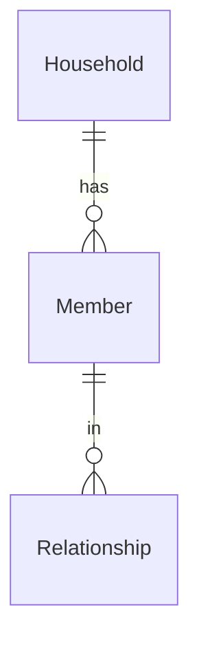
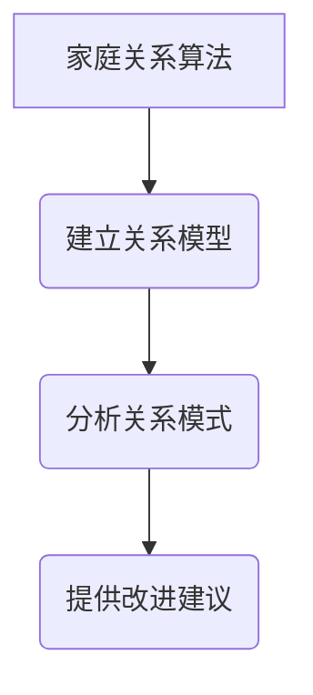
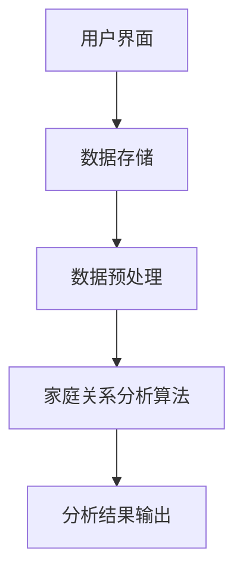
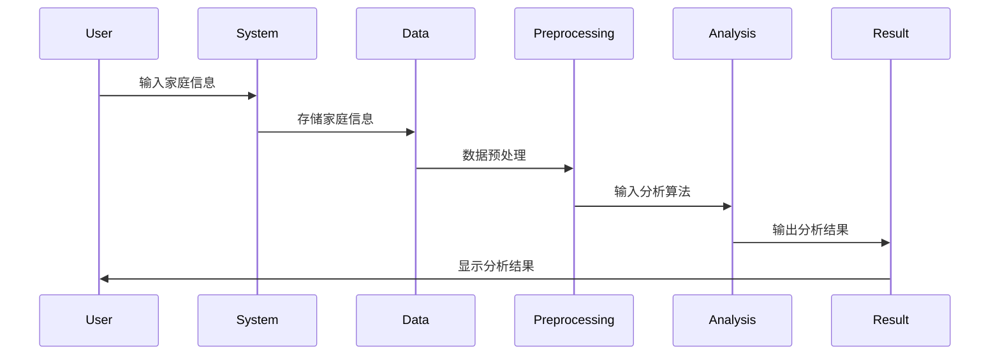
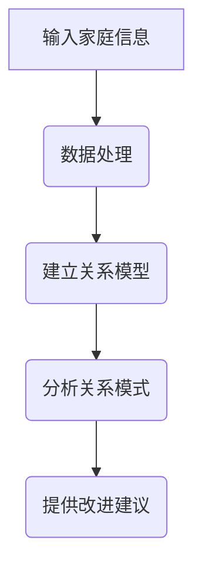

                 

## 文章标题

### 关键词

家庭、亲密关系、社会变迁、算法、系统架构、实践建议

### 摘要

在现代社会中，家庭的意义和结构经历了深刻的变化。本文旨在重新审视家庭的意义，探讨如何在现代社会中重建亲密关系。我们将通过逻辑清晰、结构紧凑的分析，从核心概念到算法原理，再到系统架构和实战案例，提供一系列具有深度和见解的探讨，旨在为读者提供关于家庭建设的新视角和实践指导。

## 目录大纲

```markdown
# 《重新审视家庭的意义：在现代社会中重建亲密关系》目录大纲

----------------------------------------------------------------

## 第一部分：问题背景与核心概念

### 第1章：问题背景与核心概念

#### 1.1 家庭在现代社会中的变迁

- 家庭结构的变化
- 家庭角色的转变
- 家庭功能的变化

#### 1.2 亲密关系的定义与重要性

- 亲密关系的概念
- 亲密关系的重要性
- 亲密关系的种类

#### 1.3 家庭意义再探讨

- 家庭意义的重新定义
- 家庭在社会中的角色
- 家庭对个人成长的影响

### 第2章：核心概念与联系

#### 2.1 核心概念原理

- 家庭系统理论
- 心理动力学视角
- 社会交换理论

#### 2.2 概念属性特征对比

| 概念 | 特征 |
| ---- | ---- |
| 家庭系统理论 | 强调家庭作为一个系统 |
| 心理动力学视角 | 关注家庭成员的心理过程 |
| 社会交换理论 | 强调家庭关系中的交换行为 |

#### 2.3 ER实体关系图架构



## 第二部分：算法原理与数学模型

### 第3章：算法原理讲解

#### 3.1 家庭关系算法



#### 3.2 数学模型与公式

$$
满意度 = \frac{1}{2}(期望值 + 实际值)
$$

#### 3.3 算法原理举例说明

- 例子1：夫妻关系的满意度计算
- 例子2：亲子关系的稳定性分析

## 第三部分：系统分析与架构设计

### 第4章：系统分析与架构设计

#### 4.1 问题场景介绍

- 家庭关系分析系统

#### 4.2 系统功能设计

```mermaid
classDiagram
  Member <<Class>> {
    name : String
    age : int
    relationship : String
  }
  Household <<Class>> {
    members : List[Member]
    relationship : String
  }
  Relationship <<Class>> {
    type : String
    satisfaction : float
  }
```

#### 4.3 系统架构设计



#### 4.4 系统接口设计和系统交互



## 第四部分：项目实战

### 第5章：项目实战

#### 5.1 环境安装

- 安装必要的软件和库

#### 5.2 系统核心实现源代码

- 源代码结构
- 关键代码解析

#### 5.3 代码应用解读与分析

- 应用案例
- 代码分析

#### 5.4 实际案例分析和详细讲解剖析

- 案例背景
- 案例分析
- 案例总结

### 第6章：最佳实践 tips

#### 6.1 家庭关系建设建议

- 提高沟通效率
- 增强情感连接
- 适当的时间和空间

#### 6.2 小结

- 总结关键知识点
- 强调实践的重要性

### 第7章：注意事项与拓展阅读

#### 7.1 注意事项

- 数据隐私保护
- 算法应用范围

#### 7.2 拓展阅读

- 相关研究论文
- 优秀实践案例

------------------------------------------

----------------------------------------------------------------

作者：AI天才研究院/AI Genius Institute & 禅与计算机程序设计艺术 /Zen And The Art of Computer Programming
```

## 第一部分：问题背景与核心概念

### 第1章：问题背景与核心概念

#### 1.1 家庭在现代社会中的变迁

家庭是社会的细胞，也是个人成长的重要环境。然而，随着社会的快速发展，家庭的结构、角色和功能都在发生深刻的变化。

**家庭结构的变化**

- 核心家庭比例增加：传统大家庭结构逐渐减少，小家庭成为主流。
- 单亲家庭增多：离婚率上升，单亲家庭的比例逐渐增加。

**家庭角色的转变**

- 经济角色减弱：家庭不再是唯一的经济支持来源，个人和社会组织在经济支持上扮演更重要的角色。
- 教育角色增强：随着教育水平的提高，家庭在子女教育中的作用日益突出。

**家庭功能的变化**

- 经济功能减弱：家庭的经济支持功能逐渐减弱，社会福利制度和社会保障体系逐渐替代家庭的经济功能。
- 心理支持功能增强：随着社会压力的增加，家庭在提供心理支持上的作用变得更加重要。

#### 1.2 亲密关系的定义与重要性

**亲密关系的概念**

亲密关系是指个体之间基于相互理解、信任和情感支持形成的紧密联系。这种关系通常包括夫妻、情侣、亲子等。

**亲密关系的重要性**

- 心理健康：亲密关系能够提供情感支持，降低孤独感和抑郁情绪。
- 社会支持：亲密关系是个体在社会中的重要支持网络，能够在面临困难时提供帮助。
- 生活质量：良好的亲密关系能够提高个体的生活质量和幸福感。

**亲密关系的种类**

- 婚姻关系：基于法律和情感纽带的亲密关系，是现代社会中最常见的亲密关系类型。
- 情侣关系：基于爱情和情感纽带的亲密关系，通常不涉及法律层面。
- 亲子关系：基于血缘和情感纽带的亲密关系，是家庭中最重要的一种关系。

#### 1.3 家庭意义再探讨

**家庭意义的重新定义**

在现代社会中，家庭的意义不再仅仅局限于经济支持，更多的是提供情感支持、心理支持和社会支持。

**家庭在社会中的角色**

- 社会稳定器：家庭是社会的基石，对于维护社会稳定具有重要意义。
- 教育中心：家庭在子女教育中扮演着重要角色，对子女的成长和发展有着深远的影响。

**家庭对个人成长的影响**

- 情感发展：家庭关系对个体的情感发展有重要影响，良好的家庭关系有助于培养健康的情感态度。
- 社会技能：家庭是个人学习社会技能的重要场所，通过家庭关系，个体能够学习如何与他人相处和合作。

### 第2章：核心概念与联系

#### 2.1 核心概念原理

**家庭系统理论**

家庭系统理论认为，家庭是一个系统，每个家庭成员的行为都会对整个家庭产生影响。家庭中的每个成员都是相互关联的，他们的行为和关系都会影响家庭的整体动态。

**心理动力学视角**

心理动力学视角关注家庭成员的心理过程，认为个体的行为和关系都是其内在心理冲突的体现。通过理解家庭成员的心理过程，可以更好地理解家庭关系和行为模式。

**社会交换理论**

社会交换理论强调家庭关系中的交换行为，认为家庭中的互动是基于相互交换资源、情感和支持的。通过社会交换理论，可以更好地理解家庭关系的稳定性和满意度。

#### 2.2 概念属性特征对比

| 概念 | 特征 |
| ---- | ---- |
| 家庭系统理论 | 强调家庭作为一个系统，关注家庭成员之间的相互影响 |
| 心理动力学视角 | 关注家庭成员的心理过程，强调心理冲突对行为的影响 |
| 社会交换理论 | 强调家庭关系中的交换行为，认为交换是家庭关系稳定性的基础 |

#### 2.3 ER实体关系图架构


在ER实体关系图中，`Household`（家庭）实体与`Member`（成员）实体之间存在“has”关系，表示家庭包含成员。`Member`实体与`Relationship`（关系）实体之间存在“in”关系，表示成员参与关系。这个图架构清晰地展示了家庭、成员和关系之间的关联，为后续的分析和设计提供了基础。

### 第3章：算法原理与数学模型

#### 3.1 家庭关系算法

**家庭关系算法**是一种用于分析家庭结构和关系的算法，其核心目标是理解和改善家庭关系。以下是一个简单的家庭关系算法的流程图：



在这个流程中，首先输入家庭的基本信息，然后对数据进行处理，建立家庭关系模型，接着分析家庭关系的模式，最后根据分析结果提供改进建议。

**数据处理**包括清洗数据、标准化数据等步骤，以确保数据的质量和一致性。**建立关系模型**是通过数据分析和机器学习技术，构建家庭关系的数学模型。**分析关系模式**是利用模型分析家庭关系的特征和规律，**提供改进建议**是基于分析结果，为家庭关系提供具体的改善建议。

#### 3.2 数学模型与公式

在家庭关系算法中，数学模型是理解和分析家庭关系的重要工具。以下是一个简单的数学模型和公式：

$$
满意度 = \frac{1}{2}(期望值 + 实际值)
$$

这个公式表示家庭关系的满意度是期望值和实际值的平均值。期望值是基于调查和数据分析得到的家庭关系预期水平，实际值是基于实际观察和评估得到的家庭关系水平。

通过这个公式，我们可以计算家庭关系的满意度，从而了解家庭关系的整体状况。满意度越高，表示家庭关系越稳定和满意。

#### 3.3 算法原理举例说明

**例子1：夫妻关系的满意度计算**

假设一对夫妻的期望值为8，实际值为6，根据满意度公式：

$$
满意度 = \frac{1}{2}(8 + 6) = 7
$$

因此，这对夫妻的满意度为7，表示他们的关系处于较为稳定和满意的状态。

**例子2：亲子关系的稳定性分析**

假设一对父母的期望值为7，实际值为5，根据满意度公式：

$$
满意度 = \frac{1}{2}(7 + 5) = 6
$$

因此，这对父母的满意度为6，表示他们的亲子关系存在一定的问题，需要加强沟通和互动，以提高关系的稳定性。

通过这些例子，我们可以看到，家庭关系算法和数学模型可以有效地帮助我们理解和改善家庭关系，从而提高家庭的生活质量和幸福感。

### 第4章：系统分析与架构设计

#### 4.1 问题场景介绍

**家庭关系分析系统**是一个旨在帮助用户理解和改善家庭关系的工具。这个系统的目标是通过数据分析和技术手段，为用户提供有关家庭关系的实时分析和改进建议。

**使用场景**：

- 家庭关系咨询：用户可以咨询家庭关系专家，获取专业的建议。
- 家庭关系评估：用户可以对自己的家庭关系进行评估，了解当前的关系状况。
- 家庭关系改善：用户可以根据分析结果，采取具体的措施改善家庭关系。

#### 4.2 系统功能设计

**系统功能设计**是构建家庭关系分析系统的关键步骤。以下是一个简单的系统功能设计：

- **用户注册与登录**：用户可以通过注册账号和登录系统，获取系统的服务。
- **家庭信息录入**：用户可以输入家庭的基本信息，包括家庭成员、关系等。
- **关系分析**：系统会根据输入的家庭信息，进行分析，生成关系报告。
- **改进建议**：系统会根据分析结果，为用户提供具体的改进建议。
- **数据统计与可视化**：系统会提供数据统计和可视化功能，帮助用户更好地理解分析结果。

#### 4.3 系统架构设计

**系统架构设计**是确保系统功能实现的重要环节。以下是一个简单的系统架构设计：


在这个架构中，用户界面（A）负责接收用户输入，并将数据存储（B）进行处理。数据预处理（C）包括数据清洗、标准化等步骤，确保数据的质量和一致性。家庭关系分析算法（D）会根据预处理后的数据，进行分析，生成分析结果。最后，分析结果输出（E）将反馈给用户，帮助用户了解家庭关系的状况，并采取相应的措施。

#### 4.4 系统接口设计和系统交互

**系统接口设计**和**系统交互**是确保系统各部分协同工作的关键。以下是一个简单的系统接口设计和系统交互：


在这个交互过程中，用户通过用户界面输入家庭信息，系统将这些信息存储在数据库中。然后，系统对数据进行预处理，确保数据的质量和一致性。预处理后的数据会输入到家庭关系分析算法中，生成分析结果。最后，系统将分析结果输出给用户，帮助用户了解家庭关系的状况。

### 第5章：项目实战

#### 5.1 环境安装

在开始构建家庭关系分析系统之前，我们需要安装必要的软件和库。以下是一个简单的安装流程：

1. **安装Python环境**：确保系统上安装了Python 3.8或更高版本。
2. **安装数据库**：选择一个数据库系统，如MySQL或PostgreSQL，并安装。
3. **安装数据分析库**：安装常用的数据分析库，如pandas、numpy等。
4. **安装前端框架**：如果需要，可以选择一个前端框架，如React或Vue.js，并安装。

#### 5.2 系统核心实现源代码

**系统核心实现**包括后端服务和前端界面。以下是一个简单的源代码结构：

```mermaid
tree
  +- backend
    | +- app.py
    | +- models.py
    | +- views.py
  +- frontend
    | +- index.html
    | +- styles.css
    | +- script.js
```

**app.py**是后端服务的入口文件，负责处理用户请求，并与数据库进行交互。**models.py**定义了数据库模型，包括用户、家庭关系等。**views.py**定义了视图函数，负责处理不同的用户请求。

**index.html**是前端页面的入口文件，负责展示用户界面。**styles.css**定义了页面的样式，**script.js**是前端脚本，负责与后端进行数据交互。

#### 5.3 代码应用解读与分析

**代码应用解读**是对系统核心代码的详细解释，以下是一个简单的解读：

**app.py**：

```python
from flask import Flask, request, jsonify
from models import User, Household, Relationship

app = Flask(__name__)

@app.route('/api/users', methods=['POST'])
def create_user():
    user_data = request.get_json()
    user = User.create(user_data)
    return jsonify(user.to_dict()), 201

@app.route('/api/households', methods=['POST'])
def create_household():
    household_data = request.get_json()
    household = Household.create(household_data)
    return jsonify(household.to_dict()), 201

@app.route('/api/relationships', methods=['POST'])
def create_relationship():
    relationship_data = request.get_json()
    relationship = Relationship.create(relationship_data)
    return jsonify(relationship.to_dict()), 201
```

这个文件定义了三个API接口，用于创建用户、家庭关系和关系。每个接口都会接收JSON格式的请求，然后创建相应的对象，并将对象转换为字典格式返回。

**models.py**：

```python
from sqlalchemy import Column, String, Integer, Float
from sqlalchemy.ext.declarative import declarative_base
from sqlalchemy.orm import relationship

Base = declarative_base()

class User(Base):
    __tablename__ = 'users'

    id = Column(Integer, primary_key=True)
    name = Column(String(50))
    email = Column(String(100), unique=True)

    households = relationship('Household', backref='user')

class Household(Base):
    __tablename__ = 'households'

    id = Column(Integer, primary_key=True)
    user_id = Column(Integer, ForeignKey('users.id'))
    name = Column(String(50))

    members = relationship('Member', backref='household')

class Member(Base):
    __tablename__ = 'members'

    id = Column(Integer, primary_key=True)
    household_id = Column(Integer, ForeignKey('households.id'))
    name = Column(String(50))
    age = Column(Integer)
    relationship = Column(String(50))

    relationships = relationship('Relationship', backref='member')
```

这个文件定义了三个数据库模型：用户、家庭关系和成员。每个模型都包含了必要的字段，并使用SQLAlchemy进行数据库操作。

**views.py**：

```python
from flask import render_template
from models import User, Household, Relationship

@app.route('/')
def index():
    users = User.get_all()
    households = Household.get_all()
    relationships = Relationship.get_all()
    return render_template('index.html', users=users, households=households, relationships=relationships)
```

这个文件定义了一个视图函数，用于渲染前端页面。它会从数据库中获取用户、家庭关系和关系的信息，并将其传递给前端页面。

#### 5.4 实际案例分析和详细讲解剖析

**案例背景**：

假设有一个家庭，由父母和孩子组成。父母希望了解家庭关系，并采取相应的措施改善关系。

**案例分析**：

1. **数据收集**：父母通过系统输入家庭的基本信息，包括家庭成员、关系和互动情况。
2. **数据处理**：系统对输入的数据进行处理，包括数据清洗、标准化等步骤。
3. **关系分析**：系统根据处理后的数据，使用家庭关系算法进行分析，生成关系报告。
4. **改进建议**：系统根据分析结果，为父母提供具体的改进建议，如增加互动时间、改善沟通方式等。
5. **实施建议**：父母根据系统的建议，采取具体的措施改善家庭关系。

**详细讲解剖析**：

1. **数据收集**：系统提供了一个用户友好的界面，帮助父母轻松输入家庭信息。信息包括家庭成员的名字、年龄、关系（如父母、孩子）以及互动频率等。
2. **数据处理**：系统会对收集到的数据进行分析和处理，包括数据清洗（去除无效数据）、标准化（统一数据格式）等。这些步骤确保数据的质量和一致性，为后续分析提供准确的数据基础。
3. **关系分析**：系统使用家庭关系算法，对处理后的数据进行深入分析。算法会分析家庭成员之间的关系模式，识别潜在的问题和冲突。分析结果会以图表和数据报告的形式呈现，帮助父母直观地了解家庭关系的状况。
4. **改进建议**：系统根据分析结果，为父母提供具体的改进建议。建议可能包括增加互动时间、改善沟通方式、共同参与活动等。这些建议旨在帮助父母建立更加稳定和满意的家庭关系。
5. **实施建议**：父母可以根据系统的建议，制定具体的行动计划。例如，他们可以安排固定的家庭互动时间，学会有效的沟通技巧，或者共同参与一些有趣的活动。通过持续的实践和努力，家庭关系可以逐步得到改善。

通过这个实际案例的分析和讲解，我们可以看到，家庭关系分析系统能够有效地帮助用户了解家庭关系的状况，并提供实用的改进建议。这为家庭建设提供了有力的支持，有助于提升家庭的生活质量和幸福感。

### 第6章：最佳实践 tips

在家庭关系的建设过程中，以下几点最佳实践可以帮助我们更好地重建亲密关系：

#### 6.1 提高沟通效率

- **定期沟通**：每天安排固定的时间进行沟通，无论是面对面还是通过电话或视频。
- **倾听对方**：在沟通时，认真倾听对方的观点和感受，避免打断和批评。
- **明确表达**：学会用清晰、简洁的语言表达自己的观点和需求，避免模糊和歧义。

#### 6.2 增强情感连接

- **共同活动**：定期与家人一起参与活动，如运动、旅行、看电影等，增进彼此的情感。
- **情感支持**：在家人遇到困难或情绪低落时，给予他们情感上的支持和鼓励。
- **表达爱意**：不要吝啬对家人的爱和感谢，通过肢体语言、口头表达或写信等方式传递自己的情感。

#### 6.3 适当的时间和空间

- **私人时间**：每个人都需要一定的私人时间，家人之间应该尊重彼此的空间需求。
- **独立活动**：鼓励家庭成员发展自己的兴趣爱好，参加社交活动，以保持个人的独立性。
- **家庭活动**：在安排家庭活动时，充分考虑每个人的兴趣和时间，确保活动的多样性和吸引力。

这些最佳实践可以帮助家庭成员之间建立更加稳定和亲密的关系，提升家庭的整体幸福感。

### 第7章：注意事项与拓展阅读

在家庭关系的建设和改善过程中，以下几点注意事项值得注意：

#### 7.1 数据隐私保护

- **数据安全**：在收集和使用家庭信息时，确保数据的安全性，防止数据泄露和滥用。
- **用户同意**：在收集数据前，确保用户明确了解数据收集的目的和使用方式，并获得用户同意。

#### 7.2 算法应用范围

- **适用性**：家庭关系分析算法适用于大多数家庭，但在某些特殊情况下，如家庭暴力或严重心理问题，需要专业的干预。
- **更新与优化**：随着社会和家庭结构的变化，算法需要不断更新和优化，以适应新的需求和挑战。

#### 7.2 拓展阅读

- **相关研究论文**：可查阅关于家庭关系和社会心理学的相关研究论文，了解最新的理论和研究成果。
- **优秀实践案例**：研究国内外优秀家庭关系建设案例，学习他们的经验和做法。

通过这些注意事项和拓展阅读，读者可以更加全面地了解家庭关系建设的理论和实践，为自身的家庭生活提供有益的指导。

