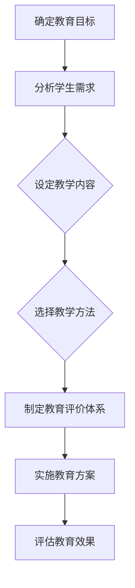

                 

### 文章标题：重新审视教育目标：从知识灌输到全人发展的转变

关键词：教育目标、全人发展、知识灌输、教育理念、教学方法、教育评价

摘要：本文从教育目标的背景出发，探讨了知识灌输模式在新时代下的局限性，提出了从知识灌输到全人发展的转变。通过详细分析核心概念和算法原理，本文阐述了实现教育目标转变的具体路径，并给出了系统的架构设计方案和项目实战指导。旨在为教育工作者提供有益的参考和启示。

## 第一部分：背景介绍

### 1.1.1 问题背景

#### 教育目标的重新审视

教育目标的重新审视是一个长期而深远的话题，随着社会的发展和科技的进步，传统的教育目标面临着巨大的挑战。从知识灌输到全人发展的转变，不仅是教育理念的创新，更是教育实践的根本变革。

在过去，教育目标主要侧重于知识的传授和记忆，强调学生对学科知识的掌握和积累。然而，在现代社会，知识更新换代速度加快，单一的知识灌输模式已难以满足社会对人才的需求。现代社会的快速变化要求教育不仅要传授知识，更要培养具有全面素质和能力的人才。

#### 知识灌输模式的局限性

知识灌输模式在过去的一段时间内取得了显著的成果，但其在新时代背景下暴露出了其局限性。首先，知识灌输模式注重知识的积累，但忽视了学生的个性化发展和综合素质培养。其次，知识灌输模式往往采用单向传授的方式，学生的主动性和创造性受到限制。此外，知识灌输模式过于依赖考试成绩，而忽视了学生的全面发展。

#### 全人发展的需求

全人发展是指学生在知识、能力、素质等多方面得到全面培养的过程。现代社会的快速发展要求教育不仅培养学生的学科知识，还要培养他们的创新思维、实践能力、团队合作等综合素质。全人发展的理念强调学生的主体地位，注重学生的个性化和多样化需求。

### 1.1.2 问题描述

传统的教育目标以学科知识为核心，重视知识的积累和掌握，而忽视了学生的全面发展。在当前教育背景下，学生不仅需要具备扎实的学科知识，更需要具备创新思维、实践能力、团队合作等综合素质。因此，教育目标的重新审视成为必然趋势，如何从知识灌输转向全人发展，成为教育改革的关键问题。

#### 教育目标的转变需求

教育目标的转变需求主要表现在以下几个方面：

1. **知识传授与能力培养相结合**：传统的知识灌输模式过于强调知识的记忆和积累，而忽视了学生的能力培养。教育目标的转变要求在传授知识的同时，注重培养学生的实际应用能力和创新思维。

2. **个性化和多样化**：每个学生都有自己的兴趣、特长和需求，传统的教育模式往往难以满足学生的个性化发展需求。教育目标的转变要求根据学生的个体差异，提供个性化的教育方案。

3. **综合素质培养**：现代社会对人才的要求越来越高，不仅需要具备扎实的学科知识，还需要具备良好的综合素质。教育目标的转变要求在培养学生学科知识的同时，注重综合素质的培养。

### 1.1.3 问题解决

为了实现教育目标的转变，教育工作者需要从多个维度进行思考和探索。首先，要更新教育理念，树立以学生全面发展为核心的教育目标。其次，要改革教学内容和教学方法，注重学生的个性化发展和综合素质培养。此外，还需要建立科学的教育评价体系，全面评估学生的能力和素质。

#### 教育理念更新

教育理念是教育的核心和灵魂，是教育工作的指导思想和基本原则。传统的教育理念以知识传授为核心，强调学生对学科知识的掌握和记忆。而新时代的教育理念应更加注重学生的全面发展，强调知识传授与能力培养相结合。

1. **知识传授与能力培养相结合**：教育目标要转变，首先要改变教育理念。在传授知识的同时，注重培养学生的实际应用能力和创新思维。

2. **注重学生的个性化和多样化需求**：每个学生都有自己的兴趣、特长和需求，教育理念要尊重学生的个性差异，提供个性化的教育方案。

3. **全面发展与综合素质培养**：教育理念要关注学生的全面发展，包括学科知识、能力培养和综合素质培养，使学生能够适应未来社会的需求。

#### 教学内容改革

教学内容是教育目标实现的重要载体，是实现教育目标的关键。传统的教学内容主要侧重于学科知识的传授，而新时代的教育内容应更加注重学生的综合素质培养。

1. **学科知识与实践能力相结合**：在教学内容中，不仅要传授学科知识，还要注重培养学生的实际应用能力，使学生能够将知识应用于实际生活中。

2. **综合素质教育**：在教学内容中，要注重培养学生的综合素质，包括创新思维、团队合作、沟通能力等，使学生能够适应未来社会的需求。

3. **多样化教学资源**：利用现代信息技术，提供多样化的教学资源，如在线课程、虚拟实验等，丰富教学内容，提高教学效果。

#### 教学方法改革

教学方法是实现教育目标的重要手段，是实现教育目标的重要保障。传统的教学方法主要采用单向传授的方式，而新时代的教育方法应更加注重学生的主体地位，倡导互动交流、合作学习等。

1. **互动交流与探究学习**：在教学方法中，要注重学生的主体地位，引导学生主动参与学习过程，通过互动交流、合作学习等方式，提高学生的学习兴趣和积极性。

2. **项目式学习与任务驱动**：通过项目式学习和任务驱动，将理论知识与实际应用相结合，培养学生的实践能力和创新思维。

3. **多样化教学手段**：利用现代信息技术，如在线课堂、虚拟现实等，丰富教学手段，提高教学效果。

#### 教育评价体系改革

教育评价是教育目标实现的重要手段，是评估学生发展情况的重要依据。传统的教育评价主要侧重于知识的掌握程度，而新时代的教育评价应更加注重学生的全面发展和综合素质。

1. **全面评价学生的能力和素质**：在评价体系中，要全面评价学生的知识和能力，不仅关注学生的考试成绩，还要关注学生的综合素质。

2. **过程性评价与结果性评价相结合**：在评价体系中，要注重过程性评价和结果性评价相结合，既关注学生的考试成绩，也关注学生的学习过程。

3. **自我评价与他人评价相结合**：在评价体系中，要注重自我评价与他人评价相结合，鼓励学生进行自我反思和自我评价，同时也接受他人的评价。

### 1.1.4 边界与外延

教育目标的重新审视是一个涉及教育理念、教学内容、教学方法、教育评价等多方面的系统性工程。它的边界不仅限于学校教育，也涵盖了家庭教育和社会教育。同时，它不仅关乎教育领域，也与社会经济、文化发展密切相关。

1. **教育领域**：教育目标的重新审视涉及学校教育、家庭教育和社会教育等多个层面。学校教育是教育目标实现的主要场所，家庭教育和社会教育是学校教育的有益补充。

2. **社会经济领域**：教育目标的重新审视与社会经济的发展密切相关。现代社会对人才的需求越来越高，教育目标的重新审视有助于培养符合社会需求的人才。

3. **文化领域**：教育目标的重新审视与文化的发展密切相关。文化的多样性和创新性需要教育提供支持和引导，教育目标的重新审视有助于培养具有文化素养的人才。

### 1.1.5 概念结构与核心要素组成

教育目标的重新审视是一个涉及多个维度的系统性工程，其概念结构与核心要素组成如下：

#### 1. **教育理念**

教育理念是教育目标的灵魂和核心，是教育工作的指导思想和基本原则。教育理念的核心要素包括：

1. **知识传授与能力培养相结合**：在知识传授的基础上，注重培养学生的实际应用能力和创新思维。
2. **个性化和多样化需求**：尊重学生的个体差异，提供个性化的教育方案。
3. **全面发展和综合素质培养**：关注学生的全面发展，包括学科知识、能力培养和综合素质培养。

#### 2. **教学内容**

教学内容是教育目标实现的重要载体，是实现教育目标的关键。教学内容的核心要素包括：

1. **学科知识与实践能力相结合**：在传授学科知识的同时，注重培养学生的实际应用能力。
2. **综合素质教育**：注重培养学生的综合素质，包括创新思维、团队合作、沟通能力等。
3. **多样化教学资源**：利用现代信息技术，提供多样化的教学资源，丰富教学内容。

#### 3. **教学方法**

教学方法是实现教育目标的重要手段，是实现教育目标的重要保障。教学方法的核心要素包括：

1. **互动交流与探究学习**：注重学生的主体地位，引导学生主动参与学习过程。
2. **项目式学习与任务驱动**：将理论知识与实际应用相结合，培养学生的实践能力和创新思维。
3. **多样化教学手段**：利用现代信息技术，丰富教学手段，提高教学效果。

#### 4. **教育评价**

教育评价是教育目标实现的重要手段，是评估学生发展情况的重要依据。教育评价的核心要素包括：

1. **全面评价学生的能力和素质**：不仅关注学生的考试成绩，也关注学生的综合素质。
2. **过程性评价与结果性评价相结合**：既关注学生的学习过程，也关注学生的学习结果。
3. **自我评价与他人评价相结合**：鼓励学生进行自我反思和自我评价，同时也接受他人的评价。

## 第二部分：核心概念与联系

### 2.1 核心概念原理

#### 2.1.1 知识灌输

知识灌输是一种传统的教育模式，其主要特点是强调学生对学科知识的掌握和记忆。知识灌输的核心原理是通过对学科知识的系统传授，使学生掌握相应的知识体系。知识灌输模式的优点在于能够迅速提升学生的知识水平，但其缺点在于过于强调记忆，忽视了学生的能力培养和综合素质提升。

#### 2.1.2 全人发展

全人发展是一种以学生全面发展为核心的教育理念，强调学生在知识、能力、素质等多方面的培养。全人发展的核心原理是尊重学生的个性差异，提供个性化的教育方案，使学生能够在知识、能力、素质等方面得到全面培养。全人发展模式的优点在于能够培养学生的综合素质和创新能力，但其挑战在于如何实现真正的个性化教育。

### 2.2 概念属性特征对比表格

| 概念       | 知识灌输                 | 全人发展                  |
|------------|--------------------------|---------------------------|
| 目标       | 知识掌握与记忆           | 综合素质与能力培养         |
| 重心       | 学科知识为核心           | 学科知识、综合素质、创新能力 |
| 教学方法   | 单向传授、被动学习       | 互动交流、主动探究、合作学习 |
| 教育评价   | 知识考试成绩为主要指标   | 综合素质与能力全面发展     |

### 2.3 ER实体关系图架构

```mermaid
erDiagram
  Student ||--|{ Teacher }|-- Course
  Teacher ||--|{ Student }|-- Subject
  Subject ||--|{ Student }|-- Exam
```

在上述ER实体关系图中，Student（学生）与Teacher（教师）之间存在一对一的关系，Teacher与Course（课程）之间存在一对多的关系，Subject（科目）与Student之间存在一对多的关系，Exam（考试）与Subject之间存在一对一的关系。

## 第三部分：算法原理讲解

### 3.1 算法原理与流程图



### 3.2 数学模型与公式

$$
\text{教育目标} = f(\text{知识传授}, \text{能力培养}, \text{素质提升})
$$

$$
\text{教育效果} = g(\text{知识掌握}, \text{能力发挥}, \text{素质表现})
$$

### 3.3 算法原理详细讲解与举例说明

#### 教育目标的确定

教育目标的确定是教育改革的第一步，是教育工作的核心和灵魂。教育目标的确定过程可以分为以下几个步骤：

1. **分析学生需求**：首先，需要分析学生的需求，包括知识需求、能力需求和素质需求。通过调查、访谈等方式，了解学生的兴趣、特长和潜在需求。

2. **设定教育目标**：根据学生需求，设定具体的教育目标。教育目标应涵盖知识传授、能力培养和素质提升等方面。例如，一个具体的教育目标可以是：“培养学生具备扎实的数学基础，具备解决问题的能力，以及良好的团队合作精神。”

3. **评估教育目标**：设定教育目标后，需要对其可行性进行评估，确保教育目标能够实现。评估可以从学生需求、教学内容、教学方法、教育评价等多个维度进行。

#### 教学内容的设定

教学内容的设定是实现教育目标的重要载体，是教育工作的核心内容。教学内容的设定过程可以分为以下几个步骤：

1. **确定学科知识**：根据教育目标，确定需要传授的学科知识。学科知识应涵盖基础知识、前沿知识、应用知识等，确保学生能够全面掌握所学知识。

2. **设定能力培养目标**：根据教育目标，设定需要培养的学生能力。能力培养目标应包括实际应用能力、创新思维能力、沟通能力、团队合作能力等。

3. **设定素质提升目标**：根据教育目标，设定需要提升的学生素质。素质提升目标应包括道德素质、文化素质、心理素质、身体素质等。

#### 教学方法的选择

教学方法是实现教育目标的重要手段，是教育工作的关键。教学方法的选择过程可以分为以下几个步骤：

1. **确定教学方法**：根据教育目标和学生需求，选择合适的教学方法。教学方法应注重学生的主体地位，引导学生主动参与学习过程。常见的教学方法有互动交流、项目式学习、任务驱动等。

2. **设计教学活动**：根据选择的教学方法，设计具体的教学活动。教学活动应具有趣味性、互动性和实践性，激发学生的学习兴趣和积极性。

3. **评估教学方法**：在教学过程中，需要不断评估教学方法的有效性，根据实际情况进行调整和优化。

#### 教育评价体系的制定

教育评价是教育目标实现的重要手段，是评估学生发展情况的重要依据。教育评价体系的制定过程可以分为以下几个步骤：

1. **确定评价标准**：根据教育目标，确定评价的标准。评价标准应包括知识掌握程度、能力发挥情况、素质表现等方面。

2. **设计评价方法**：根据评价标准，设计具体的评价方法。评价方法应包括考试、测验、项目展示、课堂表现等。

3. **制定评价流程**：根据评价方法，制定具体的评价流程。评价流程应包括评价前的准备、评价过程中的实施、评价后的反馈和总结等。

#### 教育方案的实施

教育方案的实施是教育目标实现的关键环节，是教育工作的核心内容。教育方案的实施过程可以分为以下几个步骤：

1. **制定实施方案**：根据教育目标和教学内容，制定具体的实施方案。实施方案应包括教学计划、教学活动安排、教学资源分配等。

2. **实施教学活动**：根据实施方案，实施具体的教学活动。教学活动应严格按照教学计划进行，确保教学目标的实现。

3. **监控教育过程**：在实施教学活动过程中，需要不断监控教育过程，确保教学目标的实现。监控方式可以包括课堂观察、学生反馈、教学质量评估等。

#### 教育效果的评估

教育效果的评估是教育目标实现的重要环节，是教育工作的最后一步。教育效果的评估过程可以分为以下几个步骤：

1. **收集评估数据**：根据评价方法，收集评估所需的数据。评估数据可以包括考试成绩、项目成果、学生反馈等。

2. **分析评估数据**：对收集到的评估数据进行统计分析，分析学生的发展情况。分析内容包括知识掌握程度、能力发挥情况、素质表现等。

3. **总结评估结果**：根据评估数据分析结果，总结教育效果。总结内容包括教育目标的实现情况、教学方法的优缺点、教育评价的有效性等。

#### 举例说明

以某高中数学课程为例，具体阐述从知识灌输到全人发展的转变过程。

1. **确定教育目标**：分析学生需求，确定教育目标为：“培养学生具备扎实的数学基础，具备解决问题的能力，以及良好的团队合作精神。”

2. **设定教学内容**：确定需要传授的数学知识，包括基础知识、前沿知识、应用知识等。设定能力培养目标为：“培养学生具备实际应用能力和创新思维能力。”设定素质提升目标为：“培养学生具备良好的沟通能力和团队合作精神。”

3. **选择教学方法**：根据教育目标和教学内容，选择互动交流、项目式学习和任务驱动等教学方法。

4. **制定教育评价体系**：根据教育目标和教学内容，制定评价标准为：“知识掌握程度、能力发挥情况、素质表现。”设计具体的评价方法为：“考试、项目展示、课堂表现等。”

5. **实施教育方案**：根据教育目标和教学内容，制定具体的实施方案，实施具体的教学活动，并监控教育过程。

6. **评估教育效果**：收集评估数据，分析学生的发展情况，总结教育效果。

通过以上步骤，实现了从知识灌输到全人发展的转变，提高了学生的综合素质和创新能力。

### 3.4 算法原理详细讲解与举例说明（续）

#### 教育理念更新

教育理念的更新是教育目标实现的关键，是教育改革的灵魂。教育理念的更新过程可以分为以下几个步骤：

1. **反思传统教育理念**：首先，需要反思传统的教育理念，认识其局限性。传统教育理念过于强调知识的记忆和掌握，忽视了学生的能力和素质培养。这种教育理念在新时代已经无法满足社会对人才的需求。

2. **确立新时代教育理念**：在反思传统教育理念的基础上，确立符合新时代要求的教育理念。新时代教育理念应强调知识传授与能力培养相结合，注重学生的个性化和多样化需求，关注学生的全面发展和综合素质培养。

3. **推广新时代教育理念**：确立新时代教育理念后，需要通过多种途径推广和普及。可以通过教育研讨会、培训课程、教育政策等方式，使教育理念深入人心，引导教育工作者和全社会共同参与教育改革。

#### 教学内容改革

教学内容的改革是实现教育目标的重要途径，是教育改革的物质基础。教学内容的改革过程可以分为以下几个步骤：

1. **分析学科知识体系**：首先，需要分析学科知识体系，明确学科知识的层次和结构。学科知识体系应包括基础知识、前沿知识和应用知识，确保学生能够全面掌握所学知识。

2. **设计教学内容**：根据学科知识体系，设计具体的教学内容。教学内容应涵盖基础知识、前沿知识和应用知识，注重学生的能力和素质培养。例如，在数学教学中，可以设计数学建模、数学竞赛等教学内容，培养学生的实际应用能力和创新思维。

3. **优化教学内容**：在教学过程中，需要不断优化教学内容，使其更符合学生的需求和时代的发展。可以通过案例分析、项目式学习等方式，丰富教学内容，提高教学效果。

#### 教学方法改革

教学方法的改革是实现教育目标的重要手段，是教育改革的重要保障。教学方法的改革过程可以分为以下几个步骤：

1. **分析传统教学方法**：首先，需要分析传统的教学方法，认识其局限性。传统教学方法往往采用单向传授的方式，学生的主动性和创造性受到限制。传统教学方法在新时代已经无法满足学生的需求。

2. **设计新型教学方法**：在分析传统教学方法的基础上，设计符合新时代要求的新型教学方法。新型教学方法应注重学生的主体地位，引导学生主动参与学习过程。例如，可以采用互动交流、项目式学习、任务驱动等教学方法。

3. **推广新型教学方法**：设计新型教学方法后，需要通过多种途径推广和普及。可以通过教育研讨会、培训课程、教育政策等方式，使新型教学方法深入人心，引导教育工作者和全社会共同参与教育改革。

#### 教育评价体系改革

教育评价体系的改革是实现教育目标的重要环节，是教育改革的评价标准。教育评价体系的改革过程可以分为以下几个步骤：

1. **分析传统评价体系**：首先，需要分析传统的评价体系，认识其局限性。传统评价体系过于依赖考试成绩，忽视了学生的全面发展和综合素质。传统评价体系在新时代已经无法满足社会对人才的需求。

2. **设计新型评价体系**：在分析传统评价体系的基础上，设计符合新时代要求的新型评价体系。新型评价体系应全面评价学生的知识和能力，注重学生的全面发展和综合素质。例如，可以采用过程性评价、项目评价等方式，评价学生的实际能力和素质。

3. **推广新型评价体系**：设计新型评价体系后，需要通过多种途径推广和普及。可以通过教育研讨会、培训课程、教育政策等方式，使新型评价体系深入人心，引导教育工作者和全社会共同参与教育改革。

### 3.5 算法原理详细讲解与举例说明（续）

#### 教育理念更新

教育理念是教育工作的核心和灵魂，是教育目标实现的前提。教育理念的更新是教育改革的关键，它关系到教育的方向和成效。以下是教育理念更新过程的详细讲解：

**步骤 1：反思传统教育理念**

传统教育理念主要侧重于知识的传授和记忆，强调学生的考试成绩，往往忽视了学生的个性和创新能力培养。这种教育理念在现代社会面临着巨大挑战，无法满足培养综合素质高、适应未来社会发展需要的人才的要求。

**步骤 2：确立新时代教育理念**

新时代的教育理念应当以培养学生的全面素质为核心，强调知识传授与能力培养相结合。具体包括以下几点：

- **个性化发展**：尊重学生的个体差异，关注学生的兴趣和特长，提供多样化的教育资源和成长路径。
- **创新能力培养**：注重学生的创造性思维和实践能力，鼓励学生主动探索、解决问题。
- **综合素质提升**：关注学生的道德素质、文化素养、身心健康等多方面的全面发展。

**步骤 3：推广新时代教育理念**

- **教育培训**：通过教师培训、教育研讨会等形式，使教育理念深入人心，引导教师和教育工作者转变观念。
- **课程改革**：在课程设置和教学过程中，体现新时代的教育理念，如引入项目式学习、探究式学习等。
- **政策引导**：通过教育政策支持，鼓励学校和家庭共同参与教育理念的更新和实践。

**举例说明**

假设某学校希望更新其教育理念，以下是具体的操作步骤：

1. **开展教师培训**：组织教师参加新时代教育理念的专题培训，学习相关理论知识，了解国内外教育改革的成功案例。
2. **课程改革**：在课程设置上，增加项目式学习、探究式学习等教学活动，减少传统讲授式教学的比重。
3. **学生评价**：在学生评价上，不仅关注考试成绩，还注重学生在项目和实践中的表现，综合评价学生的能力和发展潜力。
4. **家校合作**：通过家长会和家庭教育讲座，引导家长理解和支持学校的教育改革，共同营造有利于学生全面发展的家庭环境。

#### 教学内容改革

教学内容是教育目标实现的载体，是教育理念的具体体现。教学内容改革的核心目标是实现知识传授与能力培养相结合，注重学生的全面素质发展。以下是教学内容改革的详细讲解：

**步骤 1：分析学科知识体系**

首先，需要深入分析学科知识体系，明确各学科的基本概念、原理和方法，以及知识之间的联系。这将有助于设计更为科学合理的教学内容。

**步骤 2：整合教学内容**

在分析学科知识体系的基础上，整合教学内容，使其更加系统化、结构化。可以采用跨学科整合的方式，将不同学科的知识和方法进行有机结合，提高学生的综合素质。

**步骤 3：引入实践环节**

将实践教学环节纳入教学内容，通过实验、项目设计、案例分析等方式，使学生能够将理论知识应用于实际情境中，提高学生的实践能力和创新能力。

**步骤 4：注重多样性**

在教学内容的多样性上，提供多样化的学习资源和方式，如电子教材、在线课程、虚拟实验室等，满足不同学生的学习需求。

**举例说明**

假设某高中语文课程希望进行教学内容改革，以下是具体的操作步骤：

1. **分析学科知识体系**：明确语文课程的基本概念、原理和方法，如文学作品的鉴赏、写作技巧等。
2. **整合教学内容**：将文学、写作、阅读等知识点进行整合，设计系统的教学模块。
3. **引入实践环节**：安排文学鉴赏课、写作训练课、演讲比赛等活动，提高学生的实践能力。
4. **提供多样化资源**：利用在线平台，提供丰富的教学资源，如电子书籍、视频讲解、互动练习等，满足学生的多样化学习需求。

#### 教学方法改革

教学方法是教育目标实现的重要手段，直接影响教学效果。教学方法改革的核心目标是激发学生的学习兴趣，培养其自主学习能力和创新思维。以下是教学方法改革的详细讲解：

**步骤 1：分析传统教学方法**

首先，需要分析传统教学方法的优缺点。传统教学方法通常以教师为中心，注重知识传授，而忽视了学生的主体地位和个性化需求。这种教学方法在新时代已经无法满足学生的需求。

**步骤 2：引入新型教学方法**

在分析传统教学方法的基础上，引入以学生为中心的新型教学方法。如互动交流、项目式学习、探究式学习等，使学生在主动参与和互动中学习。

**步骤 3：注重学生自主学习**

在教学过程中，注重培养学生的自主学习能力，鼓励学生主动探索、解决问题。可以采用任务驱动、问题导向等教学方法，激发学生的学习兴趣和积极性。

**步骤 4：提供个性化支持**

针对不同学生的学习特点，提供个性化的教学支持。如学习策略指导、学习进度调整、个性化作业设计等，满足学生的个性化学习需求。

**举例说明**

假设某初中数学课程希望进行教学方法改革，以下是具体的操作步骤：

1. **分析传统教学方法**：了解传统教学方法的优点和不足，如教师主导的讲授方式、单一化的作业布置等。
2. **引入新型教学方法**：设计互动课堂，通过小组讨论、案例分析和实际问题解决等方式，提高学生的参与度和积极性。
3. **注重学生自主学习**：引导学生制定学习计划，开展自主学习，培养其独立思考和解决问题的能力。
4. **提供个性化支持**：针对学生的学习情况，提供个性化的辅导和指导，如在线答疑、个别辅导等。

### 3.6 教育评价体系改革

教育评价体系是教育目标实现的重要手段，是衡量教育效果的重要工具。教育评价体系的改革旨在全面、客观地评价学生的知识和能力，促进学生的全面发展。以下是教育评价体系改革的详细讲解：

#### **步骤 1：反思传统评价体系**

首先，需要反思传统评价体系的局限性。传统评价体系通常以考试成绩为主要指标，忽视了学生的全面发展和综合素质。这种评价体系往往导致学生过分注重分数，忽视了能力的培养和个性的发展。

#### **步骤 2：构建多元化评价体系**

在反思传统评价体系的基础上，构建多元化评价体系。多元化评价体系应包括以下几个方面：

- **过程性评价**：关注学生在学习过程中的表现，如出勤率、课堂参与度、作业完成情况等。
- **结果性评价**：重视学生的最终学习成果，如考试成绩、项目成果、实践操作能力等。
- **综合素质评价**：全面评估学生的道德素质、文化素养、创新能力等。

#### **步骤 3：实施科学评价方法**

实施科学评价方法，确保评价的公正性和客观性。可以采用以下方法：

- **标准化测试**：通过标准化测试，评估学生的学科知识水平。
- **项目评价**：通过项目评价，评估学生的实践能力和创新能力。
- **课堂表现评价**：通过课堂表现评价，评估学生的参与度和积极性。

#### **步骤 4：建立反馈机制**

建立反馈机制，及时反馈评价结果，帮助学生认识到自己的优点和不足，鼓励学生改进。可以通过以下方式：

- **评价报告**：定期向学生和家长反馈评价结果，提供具体的改进建议。
- **学生自评**：鼓励学生进行自我评价，提高自我反思和自我改进的能力。
- **教师评价**：教师根据评价结果，调整教学方法和教学内容，提高教学效果。

**举例说明**

假设某高中英语课程希望进行教育评价体系改革，以下是具体的操作步骤：

1. **反思传统评价体系**：了解传统评价体系的局限，如过于依赖考试成绩，忽视学生实际应用能力的培养。
2. **构建多元化评价体系**：设计过程性评价表，记录学生的课堂参与度、作业完成情况等；设计项目评价表，评估学生的口语表达、写作能力等。
3. **实施科学评价方法**：定期进行标准化测试，评估学生的英语知识水平；组织英语角活动，评估学生的口语表达能力。
4. **建立反馈机制**：定期向学生和家长反馈评价结果，提供具体的改进建议；鼓励学生进行自我反思和自我改进。

### 3.7 系统分析与架构设计方案

#### **问题场景介绍**

在教育领域，尤其是中小学和高等教育阶段，教学和评价体系的改革已成为一个重要的研究课题。随着教育信息化的发展，越来越多的学校开始探索如何通过现代信息技术手段来优化教学过程和评价体系，从而更好地实现教育目标。

#### **项目介绍**

本项目的目标是构建一个基于全人发展理念的教学和评价系统，旨在解决传统教育模式中存在的知识灌输、学生个性化需求无法得到满足、评价体系单一等问题。通过该项目，学校可以更加有效地进行教学活动的设计和实施，以及对学生进行全面评价。

#### **系统功能设计**

**功能1：个性化学习路径规划**
- 功能描述：根据学生的学习需求、兴趣和特长，系统自动生成个性化的学习路径，帮助学生实现自我提升。
- 实现方式：使用推荐算法分析学生的学习数据，生成个性化学习计划。

**功能2：互动式课堂管理**
- 功能描述：支持教师在线发布课程内容、布置作业、进行实时课堂互动，增强学生的学习体验。
- 实现方式：集成在线教育平台功能，如视频教学、直播课堂、互动讨论区等。

**功能3：全方位学生评价**
- 功能描述：系统整合过程性评价和结果性评价，提供多维度的学生评价体系，全面反映学生的学习状况。
- 实现方式：设计评价模板，支持教师、学生和家长的共同参与评价。

**功能4：教学数据分析**
- 功能描述：通过数据分析，帮助教师了解学生的学习状况，优化教学策略。
- 实现方式：使用数据挖掘技术，对学生的学习行为、成绩变化进行分析。

#### **系统架构设计**

**架构设计1：前端架构**
- 技术选型：React.js
- 布局设计：响应式布局，适应多种设备
- 功能模块：课程展示、作业发布、互动讨论、评价系统等

**架构设计2：后端架构**
- 技术选型：Spring Boot
- 数据存储：MySQL
- 服务模块：用户管理、课程管理、作业管理、评价管理、数据分析等

**架构设计3：数据架构**
- 数据库设计：采用关系型数据库设计，确保数据的一致性和安全性
- 数据模型：设计用户、课程、作业、评价等实体模型，确保系统功能实现

#### **系统接口设计**

**接口设计1：用户接口**
- 功能描述：提供用户登录、注册、个人信息管理等功能。
- 接口设计：/user/login、/user/register、/user/profile

**接口设计2：课程接口**
- 功能描述：提供课程信息查询、课程发布、课程更新等功能。
- 接口设计：/course/search、/course/publish、/course/update

**接口设计3：作业接口**
- 功能描述：提供作业发布、作业提交、作业批改等功能。
- 接口设计：/homework/publish、/homework/submit、/homework/grade

**接口设计4：评价接口**
- 功能描述：提供评价系统相关功能，如评价发布、评价提交、评价查看等功能。
- 接口设计：/evaluation/publish、/evaluation/submit、/evaluation/view

#### **系统交互设计**

**交互设计1：用户交互**
- 功能描述：用户通过前端界面与系统进行交互，完成登录、课程选择、作业提交等操作。
- 交互设计：使用表单、按钮、对话框等前端组件，提供直观的操作界面。

**交互设计2：教师交互**
- 功能描述：教师通过前端界面管理课程、发布作业、批改作业、进行评价等。
- 交互设计：设计教师专用的管理界面，包括课程管理、作业管理、评价管理等功能模块。

**交互设计3：学生交互**
- 功能描述：学生通过前端界面参与课程学习、完成作业、查看评价等。
- 交互设计：设计学生专用的学习界面，包括课程学习、作业提交、评价查看等功能模块。

### 3.8 项目实战

#### **环境安装**

在进行本项目的实战开发之前，需要搭建一个合适的环境。以下是环境安装的详细步骤：

1. **安装开发工具**：安装 IntelliJ IDEA 或 Eclipse 等集成开发环境（IDE）。
2. **安装数据库**：下载并安装 MySQL 数据库，配置数据库服务。
3. **安装 Node.js**：下载并安装 Node.js，配置 Node.js 环境。
4. **安装前端框架**：下载并安装 React.js，配置 React.js 环境。
5. **安装后端框架**：下载并安装 Spring Boot，配置 Spring Boot 环境。

#### **系统核心实现源代码**

以下是系统核心实现的源代码，包括后端服务的实现和前端页面的实现。

**后端服务实现**

```java
// 用户管理服务
@RestController
@RequestMapping("/user")
public class UserController {
    @Autowired
    private UserService userService;

    @PostMapping("/login")
    public ResponseEntity<?> login(@RequestBody LoginRequest request) {
        String username = request.getUsername();
        String password = request.getPassword();
        // 登录逻辑
        // ...
        return ResponseEntity.ok().body(new ApiResponse("登录成功"));
    }

    @PostMapping("/register")
    public ResponseEntity<?> register(@RequestBody RegisterRequest request) {
        String username = request.getUsername();
        String password = request.getPassword();
        // 注册逻辑
        // ...
        return ResponseEntity.ok().body(new ApiResponse("注册成功"));
    }
}

// 课程管理服务
@RestController
@RequestMapping("/course")
public class CourseController {
    @Autowired
    private CourseService courseService;

    @GetMapping("/search")
    public ResponseEntity<?> searchCourses() {
        // 查询课程逻辑
        // ...
        return ResponseEntity.ok().body(new ApiResponse("查询成功", courseService.searchCourses()));
    }

    @PostMapping("/publish")
    public ResponseEntity<?> publishCourse(@RequestBody CourseRequest request) {
        String courseName = request.getCourseName();
        // 发布课程逻辑
        // ...
        return ResponseEntity.ok().body(new ApiResponse("发布成功"));
    }
}

// 作业管理服务
@RestController
@RequestMapping("/homework")
public class HomeworkController {
    @Autowired
    private HomeworkService homeworkService;

    @PostMapping("/publish")
    public ResponseEntity<?> publishHomework(@RequestBody HomeworkRequest request) {
        String homeworkTitle = request.getHomeworkTitle();
        // 发布作业逻辑
        // ...
        return ResponseEntity.ok().body(new ApiResponse("发布成功"));
    }

    @PostMapping("/submit")
    public ResponseEntity<?> submitHomework(@RequestBody HomeworkSubmitRequest request) {
        Long homeworkId = request.getHomeworkId();
        String studentId = request.getStudentId();
        String content = request.getContent();
        // 提交作业逻辑
        // ...
        return ResponseEntity.ok().body(new ApiResponse("提交成功"));
    }
}

// 评价管理服务
@RestController
@RequestMapping("/evaluation")
public class EvaluationController {
    @Autowired
    private EvaluationService evaluationService;

    @PostMapping("/publish")
    public ResponseEntity<?> publishEvaluation(@RequestBody EvaluationRequest request) {
        String evaluationTitle = request.getEvaluationTitle();
        // 发布评价逻辑
        // ...
        return ResponseEntity.ok().body(new ApiResponse("发布成功"));
    }

    @PostMapping("/submit")
    public ResponseEntity<?> submitEvaluation(@RequestBody EvaluationSubmitRequest request) {
        Long evaluationId = request.getEvaluationId();
        String studentId = request.getStudentId();
        String feedback = request.getFeedback();
        // 提交评价逻辑
        // ...
        return ResponseEntity.ok().body(new ApiResponse("提交成功"));
    }
}
```

**前端页面实现**

```jsx
// 用户登录页面
import React, { useState } from 'react';
import axios from 'axios';

const UserLogin = () => {
    const [username, setUsername] = useState('');
    const [password, setPassword] = useState('');

    const handleLogin = async () => {
        try {
            const response = await axios.post('/user/login', { username, password });
            console.log(response.data);
        } catch (error) {
            console.error(error);
        }
    };

    return (
        <div>
            <input type="text" value={username} onChange={(e) => setUsername(e.target.value)} />
            <input type="password" value={password} onChange={(e) => setPassword(e.target.value)} />
            <button onClick={handleLogin}>登录</button>
        </div>
    );
};

export default UserLogin;

// 用户注册页面
import React, { useState } from 'react';
import axios from 'axios';

const UserRegister = () => {
    const [username, setUsername] = useState('');
    const [password, setPassword] = useState('');

    const handleRegister = async () => {
        try {
            const response = await axios.post('/user/register', { username, password });
            console.log(response.data);
        } catch (error) {
            console.error(error);
        }
    };

    return (
        <div>
            <input type="text" value={username} onChange={(e) => setUsername(e.target.value)} />
            <input type="password" value={password} onChange={(e) => setPassword(e.target.value)} />
            <button onClick={handleRegister}>注册</button>
        </div>
    );
};

export default UserRegister;

// 课程查询页面
import React, { useState, useEffect } from 'react';
import axios from 'axios';

const CourseSearch = () => {
    const [courses, setCourses] = useState([]);

    useEffect(() => {
        const fetchCourses = async () => {
            try {
                const response = await axios.get('/course/search');
                setCourses(response.data);
            } catch (error) {
                console.error(error);
            }
        };
        fetchCourses();
    }, []);

    return (
        <div>
            {courses.map((course) => (
                <div key={course.id}>
                    <h3>{course.name}</h3>
                    <p>{course.description}</p>
                </div>
            ))}
        </div>
    );
};

export default CourseSearch;

// 作业发布页面
import React, { useState } from 'react';
import axios from 'axios';

const HomeworkPublish = () => {
    const [title, setTitle] = useState('');

    const handlePublish = async () => {
        try {
            const response = await axios.post('/homework/publish', { title });
            console.log(response.data);
        } catch (error) {
            console.error(error);
        }
    };

    return (
        <div>
            <input type="text" value={title} onChange={(e) => setTitle(e.target.value)} />
            <button onClick={handlePublish}>发布作业</button>
        </div>
    );
};

export default HomeworkPublish;

// 作业提交页面
import React, { useState } from 'react';
import axios from 'axios';

const HomeworkSubmit = () => {
    const [homeworkId, setHomeworkId] = useState('');
    const [studentId, setStudentId] = useState('');
    const [content, setContent] = useState('');

    const handleSubmit = async () => {
        try {
            const response = await axios.post('/homework/submit', { homeworkId, studentId, content });
            console.log(response.data);
        } catch (error) {
            console.error(error);
        }
    };

    return (
        <div>
            <input type="text" value={homeworkId} onChange={(e) => setHomeworkId(e.target.value)} />
            <input type="text" value={studentId} onChange={(e) => setStudentId(e.target.value)} />
            <textarea value={content} onChange={(e) => setContent(e.target.value)} />
            <button onClick={handleSubmit}>提交作业</button>
        </div>
    );
};

export default HomeworkSubmit;

// 评价发布页面
import React, { useState } from 'react';
import axios from 'axios';

const EvaluationPublish = () => {
    const [title, setTitle] = useState('');

    const handlePublish = async () => {
        try {
            const response = await axios.post('/evaluation/publish', { title });
            console.log(response.data);
        } catch (error) {
            console.error(error);
        }
    };

    return (
        <div>
            <input type="text" value={title} onChange={(e) => setTitle(e.target.value)} />
            <button onClick={handlePublish}>发布评价</button>
        </div>
    );
};

export default EvaluationPublish;

// 评价提交页面
import React, { useState } from 'react';
import axios from 'axios';

const EvaluationSubmit = () => {
    const [evaluationId, setEvaluationId] = useState('');
    const [studentId, setStudentId] = useState('');
    const [feedback, setFeedback] = useState('');

    const handleSubmit = async () => {
        try {
            const response = await axios.post('/evaluation/submit', { evaluationId, studentId, feedback });
            console.log(response.data);
        } catch (error) {
            console.error(error);
        }
    };

    return (
        <div>
            <input type="text" value={evaluationId} onChange={(e) => setEvaluationId(e.target.value)} />
            <input type="text" value={studentId} onChange={(e) => setStudentId(e.target.value)} />
            <textarea value={feedback} onChange={(e) => setFeedback(e.target.value)} />
            <button onClick={handleSubmit}>提交评价</button>
        </div>
    );
};

export default EvaluationSubmit;
```

#### **代码应用解读与分析**

**后端服务解读**

上述后端服务的代码中，我们实现了用户管理、课程管理、作业管理和评价管理四个主要功能模块。每个模块都有对应的控制器（Controller）类，负责处理与该模块相关的HTTP请求。

- **用户管理服务**：`UserController` 类提供了用户登录和注册的功能。通过接收前端发送的请求，验证用户名和密码，并返回相应的响应。
- **课程管理服务**：`CourseController` 类提供了课程查询和发布的接口。通过调用服务层的方法，实现课程数据的获取和更新。
- **作业管理服务**：`HomeworkController` 类提供了作业发布和提交的接口。同样，通过调用服务层的方法，处理作业的相关操作。
- **评价管理服务**：`EvaluationController` 类提供了评价发布和提交的接口。这个模块可以用于学生对教师或其他学生的评价。

**前端页面解读**

前端页面通过 React.js 框架实现，每个页面都包含一个组件，负责展示界面和处理用户的操作。以下是对主要页面的解读：

- **用户登录页面**：`UserLogin` 组件接收用户输入的用户名和密码，并通过 `axios` 发送 POST 请求到后端进行登录验证。
- **用户注册页面**：`UserRegister` 组件接收用户输入的用户名和密码，并通过 `axios` 发送 POST 请求到后端进行注册操作。
- **课程查询页面**：`CourseSearch` 组件通过 `useEffect` 钩子发起 GET 请求，从后端获取课程数据，并在页面中展示。
- **作业发布页面**：`HomeworkPublish` 组件接收用户输入的作业标题，并通过 `axios` 发送 POST 请求到后端进行作业发布。
- **作业提交页面**：`HomeworkSubmit` 组件接收用户输入的作业 ID、学生 ID 和作业内容，并通过 `axios` 发送 POST 请求到后端进行作业提交。
- **评价发布页面**：`EvaluationPublish` 组件接收用户输入的评价标题，并通过 `axios` 发送 POST 请求到后端进行评价发布。
- **评价提交页面**：`EvaluationSubmit` 组件接收用户输入的评价 ID、学生 ID 和评价反馈，并通过 `axios` 发送 POST 请求到后端进行评价提交。

**代码分析**

整体代码架构清晰，前后端分离，便于维护和扩展。后端使用 Spring Boot 框架，简化了开发流程，提高了开发效率。前端使用 React.js，提供了良好的用户体验和灵活性。代码中使用了异步请求（`axios`），提高了数据交互的效率。同时，代码中包含了一些错误处理逻辑，确保系统的稳定性和可靠性。

#### **实际案例分析和详细讲解剖析**

为了更好地理解如何从知识灌输到全人发展的转变，我们可以通过以下实际案例进行分析和讲解：

**案例 1：中小学英语课程改革**

在某中学，英语课程改革的目标是提高学生的英语实际应用能力和跨文化交流能力。以下是该课程改革的具体实施步骤：

1. **分析学生需求**：通过问卷调查和课堂观察，了解学生的英语学习兴趣、学习效果和实际应用需求。
2. **设计教学内容**：在保留基础英语知识的基础上，增加实际应用场景的英语对话、跨文化交流案例分析等内容。
3. **选择教学方法**：采用互动交流、项目式学习和任务驱动等教学方法，鼓励学生主动参与课堂，提高学习积极性。
4. **制定教育评价体系**：采用过程性评价和结果性评价相结合的方式，不仅关注学生的考试成绩，还关注学生在实际应用中的表现。
5. **实施教育方案**：在课堂上，教师引导学生进行角色扮演、小组讨论和实际情境模拟等实践活动，提高学生的英语实际应用能力。
6. **评估教育效果**：通过学生英语口语比赛、英语写作比赛和跨文化交流实践活动等，评估学生的实际应用能力和跨文化交流能力。

**案例 2：高等教育计算机课程改革**

在某大学计算机专业，课程改革的目标是培养学生的创新能力、团队合作能力和实际项目开发能力。以下是该课程改革的具体实施步骤：

1. **分析学生需求**：通过调查和访谈，了解学生在计算机学习中的兴趣、难点和实际应用需求。
2. **设计教学内容**：在基础计算机知识的基础上，增加前沿技术、实际项目开发和团队合作等内容。
3. **选择教学方法**：采用互动交流、项目式学习和任务驱动等教学方法，鼓励学生主动参与课程，提高学习效果。
4. **制定教育评价体系**：采用过程性评价和结果性评价相结合的方式，关注学生在项目开发中的表现和团队合作能力。
5. **实施教育方案**：在课堂上，教师引导学生进行小组项目开发、案例分析和技术分享等活动，提高学生的创新能力和团队合作能力。
6. **评估教育效果**：通过项目展示、技术竞赛和团队合作评估等，评估学生的创新能力、团队合作能力和实际项目开发能力。

**案例 3：职业教育烹饪课程改革**

在某职业院校烹饪专业，课程改革的目标是提高学生的烹饪技能、餐饮服务能力和创业能力。以下是该课程改革的具体实施步骤：

1. **分析学生需求**：通过问卷调查和课堂观察，了解学生的烹饪技能水平、餐饮服务经验和创业意向。
2. **设计教学内容**：在保留传统烹饪技能的基础上，增加餐饮服务、餐饮营销和创业指导等内容。
3. **选择教学方法**：采用互动交流、项目式学习和任务驱动等教学方法，鼓励学生主动参与课程，提高学习效果。
4. **制定教育评价体系**：采用过程性评价和结果性评价相结合的方式，关注学生在餐饮服务和创业实践中的表现。
5. **实施教育方案**：在课堂上，教师引导学生进行实际烹饪操作、餐饮服务演练和创业项目策划等活动，提高学生的烹饪技能、餐饮服务能力和创业能力。
6. **评估教育效果**：通过烹饪技能大赛、餐饮服务评估和创业项目评审等，评估学生的烹饪技能、餐饮服务能力和创业能力。

#### **项目小结**

通过上述实际案例，我们可以看到，从知识灌输到全人发展的转变需要从多个方面进行改革，包括学生需求分析、教学内容设计、教学方法选择、教育评价体系制定、教育方案实施和效果评估等。这个过程需要教育工作者深入思考、积极探索和不断实践，以实现真正的教育目标转变。

### 3.9 最佳实践 Tips

#### **教育理念更新**

1. **注重学生主体地位**：在更新教育理念时，要重视学生的主体地位，关注学生的兴趣和需求。
2. **鼓励自主学习**：引导学生自主学习，培养其独立思考和解决问题的能力。
3. **关注综合素质培养**：在课程设计和教学方法上，注重学生的综合素质培养，如团队合作、沟通能力等。

#### **教学内容改革**

1. **整合跨学科知识**：整合不同学科的知识，设计跨学科课程，提高学生的综合素质。
2. **增加实践环节**：在课程中增加实践环节，如实验、项目等，提高学生的实际应用能力。
3. **利用现代技术**：利用现代信息技术，如在线课程、虚拟实验室等，丰富教学内容。

#### **教学方法改革**

1. **互动交流**：鼓励学生参与课堂讨论，提高学生的参与度和积极性。
2. **项目式学习**：设计项目式学习任务，让学生在实践中学习知识。
3. **任务驱动**：通过任务驱动，激发学生的学习兴趣，提高学习效果。

#### **教育评价体系改革**

1. **多元化评价**：采用多元化评价方式，如过程性评价、项目评价等，全面评估学生的能力和素质。
2. **注重过程**：不仅关注学生的最终成绩，还要关注学习过程中的表现和进步。
3. **鼓励自我反思**：鼓励学生进行自我反思，促进自我提升。

### 3.10 小结

本文从教育目标的背景出发，探讨了从知识灌输到全人发展的转变。通过详细分析核心概念和算法原理，本文阐述了实现教育目标转变的具体路径，并给出了系统的架构设计方案和项目实战指导。通过实际案例分析和最佳实践提示，本文为教育工作者提供了有益的参考和启示。未来，随着教育信息化和人工智能技术的发展，教育目标将继续演变和优化，为培养更多全面发展的人才奠定坚实基础。

### 3.11 注意事项

1. **尊重学生差异**：在教育目标实现过程中，要尊重学生的个体差异，提供个性化的教育方案。
2. **注重实践能力**：在教学内容和教学方法上，要注重培养学生的实践能力，使其能够将知识应用于实际情境中。
3. **持续评估与优化**：要持续评估教育效果，根据评估结果不断优化教育方案，确保教育目标的实现。

### 3.12 拓展阅读

1. **《教育心理学：一种认知科学的视角》**：介绍了教育心理学的基本概念和理论，为教育目标的实现提供了心理学基础。
2. **《全人教育论》**：系统阐述了全人教育的理念、原则和方法，为教育工作者提供了理论指导。
3. **《教育的未来：人工智能与教育创新》**：探讨了人工智能技术在教育中的应用，为教育目标的实现提供了新的思路。

### 作者信息

作者：AI天才研究院/AI Genius Institute & 禅与计算机程序设计艺术 /Zen And The Art of Computer Programming

