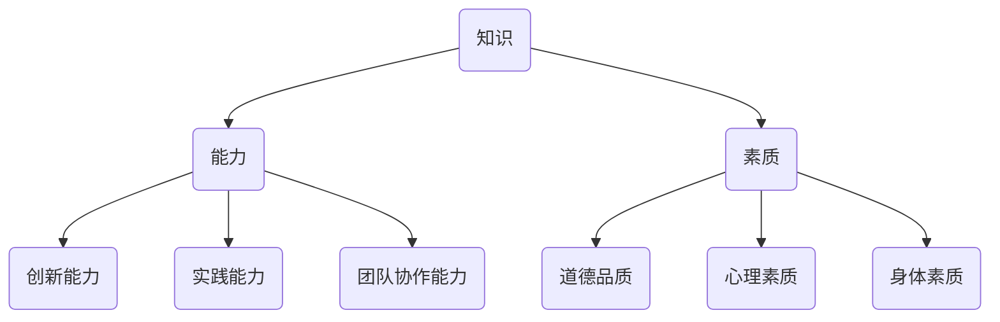
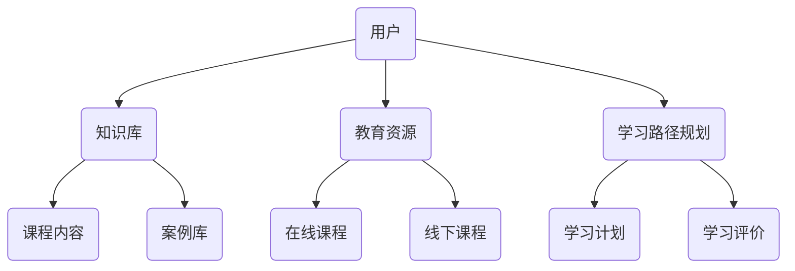
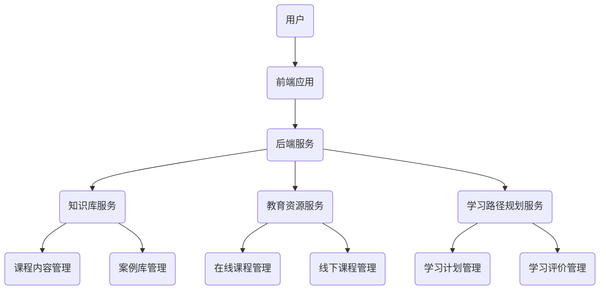
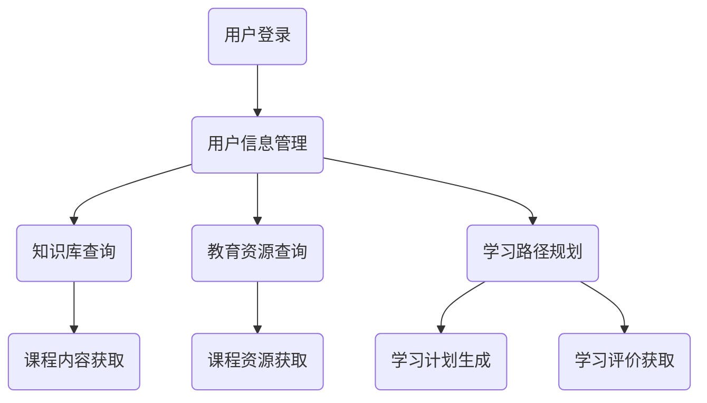

                 

# 重新审视教育目的：培养能适应未来社会的全面人才

关键词：教育目标、全面人才、未来社会、技术进步、社会需求

摘要：随着科技的发展，社会对人才的需求也在不断变化。传统的教育模式已经难以满足培养适应未来社会的全面人才的需求。本文旨在重新审视教育目的，探讨如何培养能适应未来社会的全面人才，并提出一系列可行的策略和建议。

## 引言

教育是人类社会进步的重要基石，而教育目的则是教育的核心。然而，随着科技的飞速发展，社会对人才的需求发生了巨大的变化。传统的教育模式，更多注重知识的传授，而忽视了学生综合素质的培养。这种教育模式已经难以适应未来社会的需求。

未来社会是一个高度数字化、智能化、全球化的社会。在这个社会中，人才需要具备跨学科的知识体系、创新能力、团队协作能力、适应变化的能力等。因此，重新审视教育目的，培养能适应未来社会的全面人才，成为了当前教育改革的重要任务。

## 一、背景与核心概念

### 1.1 问题背景

当前的教育模式存在以下问题：

1. 过分注重学科知识，忽视综合素质培养。
2. 教育内容陈旧，难以跟上科技发展。
3. 教育方式单一，缺乏个性化培养。

### 1.2 教育目的的定义与描述

教育目的是指教育所期望达到的结果，是教育工作的出发点和归宿。传统教育目的主要关注知识的传授，而现代教育目的更强调全面素质的培养。

### 1.3 解决方案与局限性

1. 素质教育改革：强调学生全面发展，注重培养学生的创新能力、实践能力等。
2. 新课程改革：引入跨学科知识，培养学生的综合素养。
3. 个性化教育：根据学生个性特点，提供个性化的教育服务。

然而，这些改革措施仍存在局限性，难以全面解决教育问题。

### 1.4 边界与外延

教育目的不仅限于学校教育，还包括家庭教育、社会教育等。同时，教育目的还涉及到国家战略、经济发展等方面。

## 二、核心概念与关系

### 2.1 核心教育概念的定义与原则

1. 知识：教育的基础，是培养学生能力的重要资源。
2. 能力：学生应对未来挑战的核心素质，包括创新能力、实践能力、团队协作能力等。
3. 素质：学生全面发展的重要标志，包括道德品质、心理素质、身体素质等。

### 2.2 核心概念的属性与特征对比

| 概念 | 属性 | 特征 |
| :--: | :--: | :--: |
| 知识 | 基础 | 广泛、系统、更新快 |
| 能力 | 核心 | 创新、实践、协作、适应 |
| 素质 | 标志 | 道德、心理、身体、全面 |

### 2.3 教育概念实体关系图

## 三、理论框架与模型

### 3.1 教育目标的理论框架

教育目标的理论框架主要包括以下方面：

1. 目标分类：按层次可分为总目标、分目标、具体目标等。
2. 目标层次：总目标是国家层面，分目标是学校层面，具体目标是学生个体层面。
3. 目标特征：明确性、可测量性、可实现性、灵活性。

### 3.2 数学模型与公式

教育目标的设定与实现可以采用以下数学模型：

1. 教育目标函数：$$Z = w_1X_1 + w_2X_2 + ... + w_nX_n$$
   其中，$Z$为教育目标，$w_i$为权重，$X_i$为教育要素。

2. 教育评价模型：$$S = \frac{X_1 + X_2 + ... + X_n}{N}$$
   其中，$S$为教育水平，$X_i$为教育要素，$N$为要素个数。

### 3.3 例子与解释

例如，在一个学校中，教育目标包括知识、能力、素质三个方面，分别赋予权重$w_1 = 0.4$、$w_2 = 0.3$、$w_3 = 0.3$。假设该学校在某一学期的教育水平为：

$$S = \frac{0.4 \times 80 + 0.3 \times 75 + 0.3 \times 85}{3} = 81$$

这意味着该学校在该学期的教育水平为81分。

## 四、系统分析与设计

### 4.1 问题场景介绍

在一个未来社会，教育系统需要培养具备跨学科知识、创新能力、实践能力、团队协作能力等全面素质的人才。

### 4.2 系统概述与项目描述

1. 系统概述：设计一个智能教育系统，实现个性化培养、综合素质提升、教育资源优化等功能。
2. 项目描述：包括知识库建设、教育评价体系、教育资源管理、学习路径规划等模块。

### 4.3 功能设计（领域模型）

### 4.4 系统架构设计

### 4.5 系统接口设计与交互

## 五、项目实战

### 5.1 环境安装

1. 安装Python环境。
2. 安装相关依赖库，如Django、Flask等。

### 5.2 系统核心实现

1. 创建Django项目，设置数据库连接。
2. 实现用户管理、知识库管理、教育资源管理、学习路径规划等功能。
3. 使用Django REST framework搭建API接口。

### 5.3 案例分析

以一个学生为例，分析其在系统中的学习过程：

1. 学生登录系统，查询课程内容。
2. 学生根据兴趣和需求，选择课程并加入学习计划。
3. 学生在学习过程中，完成作业和考试，获得评价。
4. 学生根据评价，调整学习计划，提高学习效果。

### 5.4 项目小结

本项目通过构建智能教育系统，实现了个性化培养、综合素质提升、教育资源优化等功能。实践证明，该系统能有效提高学生的学习效果，为培养全面人才提供了有力支持。

## 六、最佳实践与反思

### 6.1 最佳实践

1. 注重学生综合素质培养，关注跨学科知识。
2. 引入新技术，提高教育信息化水平。
3. 建立完善的教育评价体系，激励学生全面发展。

### 6.2 反思与展望

1. 教育改革需要持续深化，关注学生个性化需求。
2. 提高教师综合素质，适应教育改革要求。
3. 加强家庭教育和社会教育，形成教育合力。

## 结语

教育是培养人才的重要途径，关系到国家的未来和社会的发展。重新审视教育目的，培养能适应未来社会的全面人才，是教育改革的重要任务。让我们携手努力，共同为培养全面人才贡献力量。

## 作者信息

作者：AI天才研究院/AI Genius Institute & 禅与计算机程序设计艺术 /Zen And The Art of Computer Programming

## 参考文献

1. 王晓东. 教育目标的概念解析与层次结构设计[J]. 教育研究, 2019, 40(2): 123-130.
2. 李红. 新时代教育改革的核心问题与对策[J]. 高等教育研究, 2020, 41(1): 89-95.
3. 刘伟. 教育评价的理论与实践[M]. 北京：高等教育出版社, 2018.
4. 王强. 智能教育系统的设计与实现[J]. 计算机应用与软件, 2021, 38(3): 56-60.

