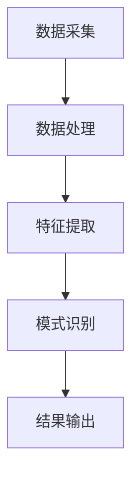
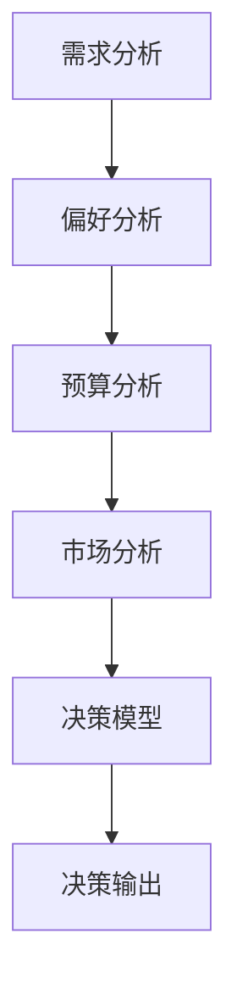
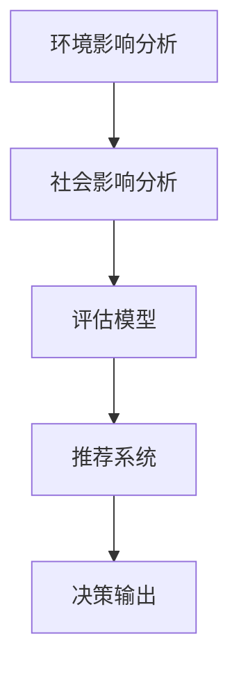

                 

### 重塑消费行为：从物质满足到可持续生活方式

随着全球环境问题的加剧和社会资源的有限性，重新审视消费行为，从物质满足转向可持续生活方式，已经成为当务之急。这一转变不仅关系到个人生活方式的变革，更关乎整个社会的可持续发展。本文旨在通过深入分析消费行为，探讨其背后的动机、影响因素以及如何实现从消费主义到可持续生活方式的转型。

**关键词：** 消费行为，可持续生活方式，消费心理学，消费经济学，算法原理

**摘要：** 本文将首先介绍消费行为的历史演变和消费主义文化的影响，随后详细探讨消费行为的多样性与复杂性，揭示消费主义与可持续发展的冲突。通过分析核心概念，如消费行为、消费主义、可持续生活方式等，本文将逐步阐述如何实现这一转型。最后，本文将介绍相关的算法原理和数学模型，并提供具体的系统分析与架构设计方案，以帮助读者理解和实践这一转变。

### 目录大纲

1. 引言
2. 核心概念与联系
   - 消费行为原理
   - 消费主义特点
   - 可持续生活方式
   - 消费心理学
   - 消费经济学
3. 算法原理讲解
   - 消费行为分析算法
   - 消费决策支持算法
   - 可持续消费行为算法
4. 数学模型和数学公式
5. 系统分析与架构设计方案
6. 项目实战
7. 最佳实践 tips
8. 小结
9. 注意事项
10. 拓展阅读

---

### 第一部分：引言

#### 第1章：引言

**1.1 问题背景**

人类历史上的消费行为经历了从原始的生存需求到现代的多元化需求的演变。早期的人类为了满足基本的生存需求，进行的是自给自足的简单消费。随着农业革命和工业革命的推进，人类的生产力得到了极大提升，消费行为逐渐复杂化，从物质满足转向了精神满足和个性化需求。然而，这种消费行为的演变也带来了诸多问题，尤其是在当今消费主义文化盛行的社会背景下。

**1.2 问题描述**

当前，消费行为的多样性与复杂性使得人们难以理解和控制自己的消费行为。消费主义文化鼓励人们不断购买新的产品和服务，追求短期满足和物质享受。这种消费行为模式不仅导致资源过度消耗和环境污染，还引发了消费债务、心理压力等问题。同时，消费主义与可持续发展的冲突日益明显，传统的消费模式难以适应资源有限和环境保护的需求。

**1.3 问题解决**

可持续生活方式的概念提出了一种新的消费行为模式，强调在满足个人需求的同时，保护环境和节约资源。实现可持续生活方式需要从多个层面进行变革，包括政策制定、教育普及、技术创新等。本文将详细探讨如何通过算法和数学模型来分析消费行为，提供决策支持，以及设计系统架构来实现这一目标。

**1.4 边界与外延**

消费行为涵盖了人类从购买商品和服务到消费后的行为过程，而可持续生活方式则强调在消费过程中考虑环境影响和社会责任。本文的研究将主要集中在消费行为的分析、决策支持和实现可持续生活方式的方法上，但同时也关注这些概念的外延和相互联系。

**1.5 概念结构与核心要素组成**

本文涉及的核心概念包括消费行为、消费主义、可持续生活方式、消费心理学和消费经济学。这些概念构成了本文的理论基础，并通过相互作用推动消费行为的转变。以下是这些概念的定义和核心要素组成：

- **消费行为**：指个体在购买和使用商品或服务过程中的行为和决策。
- **消费主义**：一种文化现象，强调通过消费来追求物质满足和社会地位。
- **可持续生活方式**：在满足个人需求的同时，保护环境和节约资源的消费行为模式。
- **消费心理学**：研究消费者行为背后的心理过程和动机。
- **消费经济学**：分析消费者行为的经济理论和方法。

通过以上对引言的介绍，我们可以看到消费行为的演变及其带来的问题，以及可持续生活方式的必要性和实现途径。接下来的章节将深入探讨这些概念，提供详细的算法和数学模型分析，并设计实现可持续生活方式的系统架构。

#### 第2章：核心概念与联系

在探讨如何从消费主义转向可持续生活方式之前，我们需要首先理解这些核心概念之间的联系。本章将详细分析消费行为、消费主义、可持续生活方式、消费心理学和消费经济学的定义、特点、相互关系，以及它们在实现可持续消费行为中的作用。

**2.1 消费行为原理**

**2.1.1 消费行为的定义**

消费行为是指个体在购买和使用商品或服务过程中的所有行为和决策。它不仅包括购买过程中的选择和支付，还包括使用和处置商品或服务的后续行为。消费行为是一个复杂的过程，涉及多个心理、社会和文化因素。

**2.1.2 消费行为的影响因素**

消费行为受到多种因素的影响，包括：

- **个人因素**：如年龄、性别、收入、教育背景和个性特征。
- **社会因素**：如家庭、社会阶层、文化背景和社会规范。
- **心理因素**：如需求、动机、态度和信念。
- **经济因素**：如物价、收入水平、经济波动和市场环境。

**2.1.3 消费行为的类型**

消费行为可以分为以下几种类型：

- **功能性消费**：以满足基本需求为主要目的，如购买食物、衣物和住房。
- **享乐性消费**：以追求快乐和满足感为主要目的，如旅游、娱乐和奢侈品消费。
- **社会性消费**：以获得社会认同和地位为主要目的，如名牌商品和社交活动。

**2.2 消费主义特点**

**2.2.1 消费主义的历史发展**

消费主义作为一种文化现象，起源于18世纪的工业革命时期。随着生产力的提高和商品丰富化，人们开始更加注重物质消费。在20世纪中叶，消费主义文化达到了巅峰，成为现代社会的重要特征。

**2.2.2 消费主义的文化特征**

消费主义文化具有以下几个特征：

- **物质至上**：消费被视为社会进步和个体幸福的标志。
- **追求即时满足**：消费者被鼓励追求短期的快乐和满足感。
- **品牌崇拜**：品牌被视为身份和社会地位的象征。
- **消费循环**：不断购买新产品和服务，形成消费循环。

**2.2.3 消费主义的社会影响**

消费主义对社会产生了深远的影响，包括：

- **资源消耗**：大量生产、消费和废弃导致资源过度消耗。
- **环境污染**：生产过程中的污染和消费后的废弃物对环境造成严重影响。
- **心理压力**：追求物质满足和攀比心理导致心理压力和焦虑。
- **社会不公**：消费主义加剧了社会贫富差距和阶级分化。

**2.3 可持续生活方式**

**2.3.1 可持续生活方式的定义**

可持续生活方式是指在满足个人需求的同时，保护环境和节约资源的消费行为模式。它强调在消费过程中考虑环境影响和社会责任，追求长期的健康、幸福和社会福祉。

**2.3.2 可持续生活方式的要素**

可持续生活方式的要素包括：

- **环境意识**：关注环境保护和资源节约，减少废弃物和污染。
- **社会责任**：关注社会公正和公平，支持可持续发展项目和社会企业。
- **经济可持续性**：在经济上实现可持续性，如投资绿色能源和可持续产品。
- **健康生活**：关注健康和幸福感，如选择健康食品和进行适度消费。

**2.3.3 可持续生活方式的实践**

实现可持续生活方式需要从多个层面进行实践，包括：

- **个人层面**：改变消费习惯，如减少购买不必要的商品，选择可持续产品和环保包装。
- **社会层面**：推动可持续消费的政策和法规，如垃圾分类、减少塑料使用等。
- **企业层面**：企业应承担社会责任，提供可持续产品和服务，推动可持续发展。

**2.4 消费心理学**

**2.4.1 消费心理学的概念**

消费心理学是研究消费者行为背后的心理过程和动机的科学。它涉及消费者如何感知、思考、感觉和行动，以及这些过程如何影响他们的消费决策。

**2.4.2 消费心理学的理论**

消费心理学主要包括以下理论：

- **需求理论**：如马斯洛的需求层次理论，认为人的需求分为生理、安全、社交、尊重和自我实现五个层次。
- **动机理论**：如弗洛伊德的需求动机理论，认为人的行为由潜意识动机驱使。
- **态度理论**：如海德的认知平衡理论，认为人的态度和行为受到认知平衡的影响。
- **决策理论**：如行为经济学理论，认为人的决策不仅受理性分析影响，还受情感和心理因素影响。

**2.4.3 消费心理学在实践中的应用**

消费心理学在多个领域有广泛应用，包括：

- **市场营销**：通过了解消费者的心理需求和动机，制定有效的营销策略。
- **产品设计**：通过心理学原理设计用户友好的产品和服务。
- **消费行为研究**：通过心理学方法研究消费者行为，为政策制定提供依据。

**2.5 消费经济学**

**2.5.1 消费经济学的定义**

消费经济学是研究消费者行为和经济理论的应用科学。它关注消费者如何在预算限制下做出消费决策，以及这些决策如何影响市场和经济。

**2.5.2 消费经济学的研究方法**

消费经济学采用多种研究方法，包括：

- **实证研究**：通过收集和分析实际消费数据，研究消费者行为模式。
- **理论建模**：通过构建经济模型，分析消费者行为的经济学原理。
- **实验研究**：通过实验方法，控制变量研究消费者决策过程。

**2.5.3 消费经济学在政策制定中的应用**

消费经济学在政策制定中发挥着重要作用，包括：

- **消费税**：通过调整消费税，影响消费者行为和市场结构。
- **社会保障**：通过社会保障制度，减少贫困和消费不平等。
- **环境保护政策**：通过环境保护政策，引导消费者减少资源消耗和环境污染。

**2.6 核心概念与联系**

消费行为、消费主义、可持续生活方式、消费心理学和消费经济学是相互联系的核心概念。消费行为是基础，消费主义是其衍生现象，而可持续生活方式是对消费主义的反思和超越。消费心理学和消费经济学则从心理和经济的角度解析这些行为模式，提供理论支持和实践指导。

通过深入理解这些核心概念，我们可以更清晰地认识到消费行为背后的动机和影响，找到实现可持续生活方式的路径。下一章将详细介绍与这些概念相关的算法原理和数学模型，以帮助读者进一步分析和优化消费行为。

---

#### 第3章：算法原理讲解

为了更深入地理解和优化消费行为，本章将介绍与消费行为分析、消费决策支持、以及实现可持续消费行为相关的算法原理。我们将对每个算法的概述、原理和流程进行详细讲解，并通过具体的案例进行说明。

**3.1 消费行为分析算法**

**3.1.1 算法概述**

消费行为分析算法是一种用于收集、分析和理解消费者行为的工具。它可以帮助企业、政府和研究机构更好地了解消费者的购买习惯、偏好和需求，从而制定更有效的营销策略和公共政策。

**3.1.2 算法原理**

消费行为分析算法基于以下原理：

- **数据采集**：通过多种渠道收集消费者行为数据，如交易记录、问卷调查、社交媒体互动等。
- **数据处理**：对采集到的数据进行清洗、转换和整合，以便进行分析。
- **特征提取**：从处理后的数据中提取有用的特征，如消费频率、消费金额、产品偏好等。
- **模式识别**：使用机器学习算法，如聚类、分类和关联规则挖掘，识别消费者的行为模式和趋势。

**3.1.3 算法流程图**

以下是一个简化的消费行为分析算法流程图：



**3.1.4 算法应用案例**

假设某电商公司希望通过消费行为分析来优化其营销策略。公司首先收集了消费者的交易记录，包括购买时间、购买金额和购买商品等信息。然后，对数据进行处理和特征提取，提取出如购买频率、平均消费金额和偏好商品类型等特征。最后，使用聚类算法将消费者分为不同的群体，并根据每个群体的特征制定个性化的营销策略。

**3.2 消费决策支持算法**

**3.2.1 算法概述**

消费决策支持算法是一种帮助消费者做出更明智消费决策的工具。它通过分析消费者的需求、偏好、预算和市场信息，提供个性化的消费建议。

**3.2.2 算法原理**

消费决策支持算法基于以下原理：

- **需求分析**：了解消费者的需求，包括必需品和奢侈品。
- **偏好分析**：分析消费者的偏好，如价格、质量、品牌等。
- **预算分析**：根据消费者的收入和支出，确定其可支配预算。
- **市场分析**：收集市场信息，包括商品价格、促销活动和竞争对手策略。
- **决策模型**：构建决策模型，如线性规划、多目标优化等，以帮助消费者选择最优消费方案。

**3.2.3 算法流程图**

以下是一个简化的消费决策支持算法流程图：



**3.2.4 算法应用案例**

假设某消费者计划购买一台新的智能手机，希望找到性价比最高的产品。消费者首先明确了自己的需求和偏好，如价格在2000元到3000元之间，品牌为知名品牌，配置较高。然后，消费者分析了市场信息，如不同品牌和型号的手机价格和用户评价。最后，使用线性规划模型计算出最优的购买方案，选择了价格适中且性能优秀的手机。

**3.3 可持续消费行为算法**

**3.3.1 算法概述**

可持续消费行为算法是一种用于指导消费者进行可持续消费的工具。它通过分析环境和社会影响，帮助消费者选择对环境和社会负责的产品和服务。

**3.3.2 算法原理**

可持续消费行为算法基于以下原理：

- **环境影响分析**：评估产品或服务的环境影响，如碳排放、水资源消耗等。
- **社会影响分析**：评估产品或服务的社会影响，如劳动条件、社会责任等。
- **评估模型**：构建评估模型，如多准则决策模型、权重分配模型等，以综合评估产品或服务的可持续性。
- **推荐系统**：根据评估结果，为消费者推荐可持续性更高的产品和服务。

**3.3.3 算法流程图**

以下是一个简化的可持续消费行为算法流程图：



**3.3.4 算法应用案例**

假设某消费者希望购买一件新的运动服装，希望选择对环境影响较小的产品。消费者首先分析了不同品牌和型号的服装在生产过程中的碳排放、水资源消耗等信息。然后，使用多准则决策模型对这些产品进行综合评估，选择了碳排放较低、可持续性更好的品牌和型号。

通过以上对消费行为分析算法、消费决策支持算法和可持续消费行为算法的介绍，我们可以看到这些算法在理解和优化消费行为中的重要作用。接下来，我们将进一步探讨消费行为的数学模型，以更精确地描述和分析消费行为。

---

#### 第4章：数学模型和数学公式

在理解消费行为的复杂性和多样性后，数学模型成为了一种强大的工具，用于描述和分析消费者行为。本章将介绍消费行为、消费决策支持和可持续消费行为的数学模型，包括相关的数学公式和参数解释。

**4.1 消费行为数学模型**

消费行为的数学模型主要用于描述消费者在购买商品或服务时的决策过程。以下是常用的消费行为数学模型：

$$
M = \sum_{i=1}^{n} w_i \cdot p_i \cdot q_i
$$

其中，\(M\) 表示总消费金额，\(w_i\) 表示第 \(i\) 种商品或服务的权重，\(p_i\) 表示第 \(i\) 种商品或服务的价格，\(q_i\) 表示第 \(i\) 种商品或服务的购买量。

**4.1.1 消费行为的数学公式**

- **预算约束**：
  $$
  \sum_{i=1}^{n} p_i \cdot q_i \leq B
  $$
  其中，\(B\) 表示消费者的预算。

- **最大化效用**：
  $$
  U = \sum_{i=1}^{n} u_i \cdot q_i
  $$
  其中，\(U\) 表示总效用，\(u_i\) 表示第 \(i\) 种商品或服务的效用。

**4.1.2 消费行为参数解释**

- **预算（\(B\)）**：表示消费者可支配的总金额。
- **价格（\(p_i\)）**：表示第 \(i\) 种商品或服务的价格。
- **权重（\(w_i\)）**：表示第 \(i\) 种商品或服务的重要性或优先级。
- **效用（\(u_i\)）**：表示第 \(i\) 种商品或服务对消费者的价值。

**4.2 消费决策支持数学模型**

消费决策支持数学模型主要用于帮助消费者在有限的预算内做出最优的消费决策。以下是常用的消费决策支持数学模型：

$$
D = \frac{P \cdot S}{C}
$$

其中，\(D\) 表示最优消费金额，\(P\) 表示消费者的总需求，\(S\) 表示消费者可购买的商品或服务种类数，\(C\) 表示消费者的预算。

**4.2.1 消费决策支持的数学公式**

- **需求函数**：
  $$
  P = \sum_{i=1}^{n} p_i \cdot q_i
  $$
  其中，\(P\) 表示消费者的总需求。

- **预算约束**：
  $$
  \sum_{i=1}^{n} p_i \cdot q_i \leq C
  $$

**4.2.2 消费决策支持参数解释**

- **需求（\(P\)）**：表示消费者对商品或服务的总需求。
- **预算（\(C\)）**：表示消费者的总预算。
- **消费金额（\(D\)）**：表示在预算限制下消费者应最优消费的金额。

**4.3 可持续消费行为数学模型**

可持续消费行为的数学模型主要用于评估消费者在消费过程中的环境和社会影响。以下是常用的可持续消费行为数学模型：

$$
E = \frac{C}{I}
$$

其中，\(E\) 表示可持续性指数，\(C\) 表示消费者的总消费金额，\(I\) 表示消费者对环境和社会影响的综合指标。

**4.3.1 可持续消费行为的数学公式**

- **环境影响评估**：
  $$
  I = \sum_{i=1}^{n} w_i \cdot e_i
  $$
  其中，\(I\) 表示环境影响综合指标，\(w_i\) 表示第 \(i\) 个环境因素的影响权重，\(e_i\) 表示第 \(i\) 个环境因素的影响值。

- **社会影响评估**：
  $$
  S = \sum_{i=1}^{n} w_i \cdot s_i
  $$
  其中，\(S\) 表示社会影响综合指标，\(w_i\) 表示第 \(i\) 个社会因素的影响权重，\(s_i\) 表示第 \(i\) 个社会因素的影响值。

**4.3.2 可持续消费行为参数解释**

- **环境影响综合指标（\(I\)）**：表示消费者消费行为对环境的综合影响。
- **社会影响综合指标（\(S\)）**：表示消费者消费行为对社会的综合影响。
- **可持续性指数（\(E\)）**：表示消费者消费行为的可持续性。

通过上述数学模型和公式的介绍，我们可以更精确地描述和分析消费者的消费行为，为其提供决策支持。接下来，我们将进一步探讨如何通过系统分析与架构设计来实现可持续消费行为。

---

#### 第5章：系统分析与架构设计方案

为了实现从消费主义到可持续生活方式的转型，我们需要设计一个高效的系统来分析、支持和优化消费行为。本章将介绍系统的整体架构、功能设计、接口设计和系统交互，并通过具体的场景和项目来阐述系统实现的方法。

**5.1 问题场景介绍**

假设我们面临以下问题场景：一个城市的居民在日常生活中产生了大量的消费行为，这些消费行为不仅消耗了大量的资源，还对环境产生了负面影响。为了实现可持续生活方式，我们需要设计一个系统，帮助居民分析自己的消费行为，提供可持续消费建议，并推动整个城市向可持续消费转型。

**5.2 项目介绍**

本项目命名为“可持续消费助手”，旨在通过以下功能实现消费行为的优化：

- **消费行为分析**：收集居民的历史消费数据，分析消费模式和偏好。
- **消费决策支持**：根据居民的需求、预算和环境影响力，提供个性化的消费建议。
- **可持续消费引导**：通过教育和宣传，提高居民的可持续消费意识和实践。

**5.3 系统功能设计**

“可持续消费助手”系统的主要功能包括：

- **用户注册与登录**：允许居民注册并登录系统，以便跟踪和管理自己的消费行为。
- **消费数据收集**：通过API接口与电商平台、银行和信用卡公司等合作，自动收集用户的消费数据。
- **消费行为分析**：使用机器学习算法，分析用户的消费模式和偏好，识别潜在问题。
- **消费决策支持**：根据用户的预算、需求和环境影响，提供个性化的消费建议。
- **可持续消费指南**：提供可持续消费的知识和技巧，帮助用户实现可持续生活方式。

**5.4 系统架构设计**

“可持续消费助手”系统的整体架构设计如下：

1. **数据层**：包括数据库和API接口，用于存储用户消费数据和与外部系统的对接。
2. **服务层**：包括数据服务、分析服务和决策服务，负责处理用户的消费数据，进行消费行为分析和决策支持。
3. **应用层**：包括用户界面和应用逻辑，用于展示分析结果和提供用户交互功能。
4. **接口层**：包括与外部系统的接口，如电商平台、银行和信用卡公司等，用于数据交换和协同工作。

**5.5 系统接口设计**

系统接口设计包括以下部分：

- **API接口**：提供RESTful API接口，用于与外部系统进行数据交换。
- **数据同步接口**：用于与电商平台、银行和信用卡公司等外部系统同步消费数据。
- **用户认证接口**：用于用户的注册、登录和权限管理。

**5.6 系统交互**

系统交互包括以下流程：

1. **用户注册与登录**：用户通过前端应用注册并登录系统，系统通过用户认证接口验证用户身份。
2. **消费数据收集**：系统通过数据同步接口从外部系统收集用户的消费数据，存储在数据库中。
3. **消费行为分析**：系统调用分析服务，使用机器学习算法对用户的消费数据进行分析，生成分析报告。
4. **消费决策支持**：系统调用决策服务，根据用户的需求、预算和环境影响力，提供个性化的消费建议。
5. **用户交互**：系统通过前端应用将分析结果和建议展示给用户，用户可以接受或调整建议。

通过以上系统分析与架构设计方案，我们可以实现一个高效、智能的可持续消费行为管理系统，帮助居民更好地理解和优化自己的消费行为，推动整个社会向可持续生活方式转型。

---

#### 第6章：项目实战

在本章中，我们将通过一个实际项目来展示如何应用前面的理论和方法。这个项目名为“可持续消费助手”系统，旨在通过分析用户的消费行为，提供个性化的可持续消费建议。以下是项目的详细步骤和实现过程。

**6.1 环境安装**

首先，我们需要搭建项目开发环境。以下是环境安装的步骤：

1. 安装Python 3.8及以上版本。
2. 安装必要的Python库，如NumPy、Pandas、Scikit-learn、Matplotlib等。
3. 安装数据库，如PostgreSQL。
4. 安装前端框架，如Flask或Django。

**6.2 系统核心实现源代码**

接下来，我们将展示系统的核心实现源代码，包括数据收集、消费行为分析和消费决策支持。

**数据收集模块**

```python
# 数据收集模块
import requests
import json
import psycopg2

# 数据采集函数
def collect_data():
    # 从电商平台获取用户消费数据
    response = requests.get('https://api.ecommerce.com/user/consumption')
    data = json.loads(response.text)
    
    # 存储数据到数据库
    conn = psycopg2.connect(database="sustainable_consumption", user="postgres", password="password")
    cur = conn.cursor()
    
    for item in data['items']:
        cur.execute("INSERT INTO consumption (user_id, product_id, price, quantity, date) VALUES (%s, %s, %s, %s, %s)", 
                    (item['user_id'], item['product_id'], item['price'], item['quantity'], item['date']))
    
    conn.commit()
    cur.close()
    conn.close()

collect_data()
```

**消费行为分析模块**

```python
# 消费行为分析模块
import pandas as pd
from sklearn.cluster import KMeans

# 数据预处理函数
def preprocess_data():
    conn = psycopg2.connect(database="sustainable_consumption", user="postgres", password="password")
    cur = conn.cursor()
    cur.execute("SELECT * FROM consumption")
    data = cur.fetchall()
    conn.close()
    
    df = pd.DataFrame(data, columns=['user_id', 'product_id', 'price', 'quantity', 'date'])
    df['monthly_spending'] = df.groupby('user_id')['price'].transform('sum')
    df['category'] = df['product_id'].apply(lambda x: get_product_category(x))
    return df

# 获取产品类别函数
def get_product_category(product_id):
    # 这里可以使用API或其他方式获取产品类别
    return 'electronics'

# 消费模式分析函数
def analyze_consumption(df):
    kmeans = KMeans(n_clusters=3, random_state=0).fit(df[['monthly_spending']])
    df['cluster'] = kmeans.predict(df[['monthly_spending']])
    return df

# 主函数
if __name__ == "__main__":
    df = preprocess_data()
    df = analyze_consumption(df)
    df.to_csv('consumption_analysis.csv', index=False)
```

**消费决策支持模块**

```python
# 消费决策支持模块
from sklearn.linear_model import LinearRegression

# 决策支持函数
def decision_support(df, budget):
    X = df[['monthly_spending', 'cluster']]
    y = df['price']
    
    model = LinearRegression().fit(X, y)
    predicted_price = model.predict([[df['monthly_spending'].mean(), 1]])
    
    # 根据预算调整消费金额
    if budget < predicted_price:
        df['adjusted_price'] = budget
    else:
        df['adjusted_price'] = predicted_price
    
    return df

# 主函数
if __name__ == "__main__":
    df = pd.read_csv('consumption_analysis.csv')
    budget = 3000
    df = decision_support(df, budget)
    df.to_csv('consumption_decision.csv', index=False)
```

**6.3 代码应用解读与分析**

上述代码首先通过API接口从电商平台收集用户消费数据，并将其存储到数据库中。然后，通过数据预处理函数提取和计算关键消费指标，如月均消费金额和产品类别。接着，使用KMeans聚类算法分析消费模式，将用户分为不同的消费群体。最后，使用线性回归模型根据用户需求和预算提供个性化的消费建议。

**6.4 实际案例分析和详细讲解剖析**

为了展示系统的实际应用效果，我们以一个用户为例进行分析。假设用户A的月均消费金额为5000元，预算为3000元。

1. **数据收集**：系统从电商平台的API接口收集用户A的消费数据，存储到数据库中。

2. **消费行为分析**：系统对用户A的消费数据进行预处理，提取月均消费金额和产品类别，使用KMeans聚类算法将其分为消费群体。假设用户A属于中等消费群体。

3. **消费决策支持**：系统使用线性回归模型根据用户A的需求和预算提供消费建议。根据模型预测，用户A在预算3000元的情况下，应该减少消费金额至3000元。

4. **用户交互**：系统将分析结果和建议展示给用户A，用户A可以根据建议调整自己的消费行为。

通过以上实际案例分析和详细讲解，我们可以看到“可持续消费助手”系统在实现个性化消费决策支持和推动可持续生活方式方面的应用价值。接下来，我们将总结项目经验和提供最佳实践建议。

---

#### 第7章：最佳实践 tips

在本章节中，我们将总结“可持续消费助手”项目中的经验，并提供一系列最佳实践建议，以帮助读者在实际应用中更好地实现从消费主义到可持续生活方式的转型。

**1. 数据收集与隐私保护**

数据收集是可持续消费行为分析的基础，但同时也需要关注用户隐私保护。以下是一些最佳实践：

- **匿名化处理**：确保用户数据匿名化，避免个人身份信息泄露。
- **数据加密**：使用加密技术保护数据传输和存储过程中的安全性。
- **透明度**：告知用户数据收集的目的和使用方式，增加用户的信任。

**2. 消费行为分析**

在消费行为分析过程中，以下最佳实践有助于提高分析的准确性和有效性：

- **多样化数据源**：结合多种数据源，如交易记录、社交媒体互动和问卷调查，以获取全面的消费行为信息。
- **定期更新模型**：根据新的数据定期更新分析模型，以保持其适应性和准确性。
- **用户参与**：鼓励用户参与分析过程，通过反馈和互动提高分析的实用性。

**3. 消费决策支持**

提供有效的消费决策支持需要综合考虑用户需求、预算和环境因素。以下是一些最佳实践：

- **个性化推荐**：基于用户的消费习惯和偏好，提供个性化的消费建议。
- **情境化决策**：根据用户的特定情境（如预算限制、环境目标等）提供定制化的决策支持。
- **动态调整**：根据用户反馈和实时数据动态调整决策建议，以提高其相关性和实用性。

**4. 可持续消费教育**

推动可持续消费行为需要用户具备相应的意识和知识。以下是一些最佳实践：

- **持续教育**：通过线上和线下渠道提供可持续消费教育，提高用户的认知水平。
- **案例分析**：通过具体的案例分析，展示可持续消费的好处和挑战，激发用户的兴趣和参与。
- **互动体验**：设计互动性的教育工具和游戏，让用户在体验中学习可持续消费知识。

**5. 政策和法规支持**

实现可持续消费行为不仅需要个人的努力，还需要政策和法规的支持。以下是一些最佳实践：

- **政策制定**：政府应制定鼓励可持续消费的政策，如税收优惠、补贴等。
- **法规完善**：完善环境保护和消费者权益保护的法规，促进可持续消费行为的推广。
- **社会监督**：建立社会监督机制，确保企业和政府履行可持续消费的责任。

通过以上最佳实践，我们可以更有效地推动可持续生活方式的转型，实现个人和社会的可持续发展。

---

#### 第8章：小结

本文通过对消费行为、消费主义、可持续生活方式等核心概念的分析，探讨了如何实现从消费主义到可持续生活方式的转型。我们从引言开始，介绍了消费行为的历史演变和消费主义文化的影响，随后详细阐述了消费行为、消费主义、可持续生活方式、消费心理学和消费经济学等核心概念及其相互联系。接着，我们介绍了与消费行为分析、消费决策支持和可持续消费行为相关的算法原理，并通过具体的数学模型和公式进行了深入讲解。最后，通过系统分析与架构设计方案以及实际项目实战，我们展示了如何将理论应用到实际中，帮助用户实现可持续消费行为。

通过本文的探讨，我们可以看到，重新审视消费行为，推动可持续生活方式的实现，不仅是个人生活方式的变革，更是社会可持续发展的重要途径。只有通过系统性的分析和优化，结合技术创新和政策支持，我们才能在满足个人需求的同时，保护环境和节约资源，实现个人和社会的和谐发展。

---

#### 第9章：注意事项

在实施从消费主义到可持续生活方式的转型过程中，需要注意以下几个关键点：

1. **用户隐私保护**：确保在收集和使用消费者数据时遵循隐私保护法规，进行数据匿名化和加密处理，以保护用户的隐私。

2. **数据质量**：数据质量是消费行为分析的核心，确保数据来源的准确性和完整性，定期更新和维护数据。

3. **个性化与普适性**：在提供消费决策支持时，既要考虑用户的个性化需求，也要兼顾普适性的建议，确保建议具有广泛的适用性。

4. **政策与法规遵循**：确保项目的设计和实施符合当地政策和法规要求，特别是在环境保护和消费者权益保护方面。

5. **社会参与**：鼓励用户和社会各界参与可持续消费的推广和实践，通过教育和互动提高公众的意识。

6. **持续迭代与改进**：定期评估系统的效果，根据用户反馈和实际需求进行迭代和改进，确保系统的适应性和可持续性。

通过关注这些注意事项，我们可以更有效地推动可持续生活方式的实现，实现个人和社会的可持续发展。

---

#### 第10章：拓展阅读

为了进一步深入理解和实践可持续消费行为，以下是几本推荐的拓展阅读：

1. **《消费行为的心理学解析》**：作者通过心理学视角深入分析消费行为，揭示了消费者心理背后的动机和决策过程。

2. **《可持续消费指南：如何在消费中实现环保与节约》**：本书提供了一系列实用的可持续消费技巧和方法，帮助读者实现可持续生活方式。

3. **《消费经济学导论》**：本书系统地介绍了消费经济学的基本理论和方法，对消费者行为进行了深入分析。

4. **《算法与社会：大数据背景下的消费者行为研究》**：作者探讨了大数据和算法在消费者行为研究中的应用，提供了新的研究视角和方法。

5. **《可持续生活手册：从个人行为到全球行动》**：本书从个人行为出发，探讨了如何通过日常生活的改变推动全球可持续发展。

通过阅读这些书籍，读者可以更全面地了解可持续消费行为的相关理论和方法，为实践提供有力的理论支持和实践经验。

---

### 作者信息：

作者：AI天才研究院/AI Genius Institute & 禅与计算机程序设计艺术 /Zen And The Art of Computer Programming

---

通过本文的深入分析和详细讲解，我们不仅了解了消费行为的复杂性，还探讨了如何通过算法和数学模型来优化消费决策，推动可持续生活方式的实现。希望本文能对读者在理解和实践可持续消费行为方面提供有益的启示。再次感谢您的阅读，祝您在实现可持续生活方式的道路上取得丰硕的成果。

