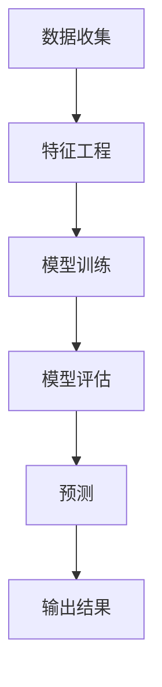
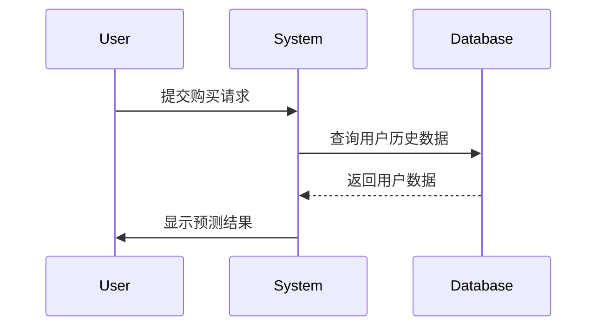

                 

## 第一部分：问题背景

### 1.1 问题背景

#### 1.1.1 消费行为的变化趋势

随着社会经济的发展和科技的进步，消费行为正经历着前所未有的变革。传统的物质积累型消费行为，即消费者以购买大量物质商品来满足自身需求的行为，正在逐渐向精神富足型消费行为转变。这一转变体现在多个方面：

1. **产品需求的变化**：消费者对产品的需求不再仅仅局限于基本功能，更加注重产品的个性化和定制化。例如，定制家具、个性化电子产品等成为了新的消费趋势。

2. **消费观念的转变**：消费者不再仅仅追求物质财富的积累，更加关注个人成长、心理健康、人际关系等非物质层面的满足。这种观念的转变导致了对教育、旅游、健康等领域的消费需求增加。

3. **消费方式的创新**：随着互联网和电子商务的发展，消费者的消费方式也发生了变化。线上购物、移动支付、共享经济等新兴消费方式正日益普及，改变了传统的消费模式。

#### 1.1.2 物质积累与精神富足的对比

物质积累与精神富足之间的区别主要体现在以下几个方面：

- **目标不同**：物质积累的目标是拥有更多的物质财富，而精神富足的目标是达到内心的满足和幸福。

- **重点不同**：物质积累注重数量的增加和占有，而精神富足注重品质的提升和内心的满足。

- **影响因素不同**：物质积累受到经济条件和社会地位的影响，而精神富足则更多地受到个人价值观和生活方式的影响。

#### 1.1.3 企业面临的挑战与机遇

企业需要重新审视消费者的需求，调整营销策略，以适应这一消费行为的转变。具体来说，企业需要：

1. **创新产品**：开发更加个性化和定制化的产品，以满足消费者的个性化需求。

2. **关注精神层面**：在产品和服务中融入更多的精神内涵，如提供心理咨询服务、健康管理等。

3. **优化消费体验**：提升消费者的购物体验，如提供个性化的推荐、优化售后服务等。

同时，这种消费行为的转变也为企业带来了新的商业机会：

1. **新兴市场**：随着消费者对精神富足需求的增加，新的市场机会不断涌现，如心理健康、教育、文化旅游等。

2. **跨界合作**：企业可以通过跨界合作，将不同领域的资源整合起来，提供更加综合的服务，如健康旅游、教育娱乐等。

### 1.2 核心概念

#### 1.2.1 消费行为

消费行为是指消费者在购买、使用和评估产品或服务的过程中所表现出的行为和态度。具体包括以下几个阶段：

1. **需求识别**：消费者识别出自身需求，这是消费行为的起点。

2. **信息搜索**：消费者通过多种渠道获取产品或服务的信息，如线上搜索、朋友推荐等。

3. **评估和选择**：消费者根据收集到的信息，评估不同产品或服务的优缺点，并做出购买决策。

4. **购买**：消费者实际购买产品或服务。

5. **使用和评估**：消费者在使用产品或服务后，对其进行评估，这会影响其未来的购买行为。

#### 1.2.2 精神富足

精神富足是指消费者在物质需求得到满足后，通过追求生活品质、个人成长和社会关系等非物质层面的满足，达到内心平和和满足的状态。精神富足包括以下几个方面：

1. **个人成长**：通过学习、阅读、旅行等方式，不断提升自我，实现自我价值的提升。

2. **心理健康**：通过心理咨询、瑜伽、冥想等方式，维护和提升心理健康。

3. **人际关系**：通过社交、家庭、朋友等关系，建立和维护良好的人际关系。

4. **社会责任**：通过参与公益活动、志愿服务等方式，为社会做出贡献。

### 1.3 边界与外延

#### 1.3.1 消费行为的边界

消费行为的边界涉及消费者在何种情况下会进行消费决策，以及影响这一决策的因素。具体包括：

1. **经济条件**：消费者的收入水平和储蓄能力是影响消费行为的重要因素。

2. **社会地位**：消费者的社会地位和职业也会影响其消费行为。

3. **个人偏好**：消费者的个人偏好和价值观对其消费行为有重要影响。

#### 1.3.2 精神富足的外延

精神富足的外延包括个人成长、心理健康、人际关系和社会责任等方面。这些方面都是消费者在追求精神富足时需要关注的领域。具体包括：

1. **个人成长**：包括知识、技能、经验和自我认知的提升。

2. **心理健康**：包括情绪管理、压力释放、心理健康维护等。

3. **人际关系**：包括家庭关系、朋友关系、社交圈等。

4. **社会责任**：包括参与公益活动、志愿服务、慈善捐赠等。

### 1.4 概念结构与核心要素组成

#### 1.4.1 消费行为的核心要素

消费行为的核心要素包括消费者的需求、消费观念、消费方式等。这些要素相互作用，共同影响消费者的消费行为。

1. **需求**：消费者的需求是消费行为的起点，是消费者进行消费决策的驱动力。

2. **消费观念**：消费者的消费观念影响其对产品和服务的评价，以及消费决策。

3. **消费方式**：消费者的消费方式包括线上购物、线下购物、移动支付等，这些方式影响消费者的购物体验和消费行为。

#### 1.4.2 精神富足的核心要素

精神富足的核心要素包括个人成长、心理健康、人际关系和社会责任等。这些要素共同构成消费者精神富足的内涵。

1. **个人成长**：通过不断学习和提升自我，实现个人价值的提升。

2. **心理健康**：通过情绪管理和心理健康维护，实现内心的平和和满足。

3. **人际关系**：通过建立和维护良好的人际关系，提升生活的幸福感。

4. **社会责任**：通过参与社会公益活动，实现个人价值的同时，为社会做出贡献。

### 1.5 本章小结

本章节主要介绍了消费行为从物质积累到精神富足的转变背景，分析了相关核心概念，并明确了研究的边界与外延。为后续章节的深入探讨奠定了基础。

## 第二部分：核心概念与联系

### 2.1 消费行为的概念解析

#### 2.1.1 消费行为的定义

消费行为是指消费者在购买、使用和评估产品或服务的过程中所表现出的行为和态度。它是一个复杂的过程，涉及到消费者的需求识别、信息搜索、评估选择、购买决策以及使用评估等多个环节。

**定义：** 消费行为 = {需求识别，信息搜索，评估选择，购买决策，使用评估}

#### 2.1.2 消费行为的属性特征

1. **动机性**：消费者的消费行为通常受到特定动机的驱动，如满足基本需求、追求快乐、实现自我价值等。这些动机是消费者做出消费决策的重要驱动力。

2. **选择性**：消费者在面对多种产品或服务时，会根据自身的需求和偏好进行选择。这种选择性反映了消费者的个人价值观和生活方式。

3. **持续性**：消费行为不仅限于购买过程，还包括使用和评估阶段。消费者在购买后会对产品或服务的使用效果进行评估，这会影响其未来的购买决策。

### 2.2 精神富足的概念解析

#### 2.2.1 精神富足的定义

精神富足是指消费者在物质需求得到满足后，通过追求生活品质、个人成长和社会关系等非物质层面的满足，达到内心平和和满足的状态。它不仅仅是物质层面的满足，更是一种心灵上的满足。

**定义：** 精神富足 = {生活品质追求，个人成长，社会关系满足}

#### 2.2.2 精神富足的属性特征

1. **主观性**：精神富足是个人的主观感受，不同个体对精神富足的理解和追求可能有所不同。

2. **多元性**：精神富足包括多个方面，如个人成长、心理健康、人际关系和社会责任等，这些方面共同构成了精神富足的内涵。

3. **动态性**：精神富足是一个动态的过程，随着个人生活状态和环境的变化，精神富足的追求和实现也会发生变化。

### 2.3 消费行为与精神富足的联系

#### 2.3.1 相互影响

1. **消费行为对精神富足的影响**：合理的消费行为可以满足消费者的物质需求，从而有助于实现精神富足。例如，通过购买高品质的产品或服务，消费者可以提升生活质量，达到精神富足。

2. **精神富足对消费行为的影响**：精神富足的消费者在购买决策时更倾向于选择能够带来精神满足的产品或服务。这种选择不仅基于产品或服务的功能，还包括其带来的心理和情感上的满足。

#### 2.3.2 联系与差异

1. **联系**：消费行为和物质积累、精神富足之间存在着密切的关系。消费者的物质积累可以为精神富足提供物质基础，而精神富足又可以促进消费者做出更加合理和满足的消费决策。

2. **差异**：物质积累更注重数量和占有，而精神富足更关注品质和内心的满足。物质积累是精神富足的前提，但并不是全部。消费者在追求精神富足时，需要超越物质层面的满足，追求更深层次的内心平和和满足。

### 2.4 概念属性特征对比表格

#### 2.4.1 消费行为与精神富足的属性特征对比

| 特征     | 消费行为                                 | 精神富足                                 |
|----------|----------------------------------------|----------------------------------------|
| 动机性   | 满足需求、获得快乐等                     | 个人成长、心理健康、人际关系和社会责任等 |
| 选择性   | 根据需求和个人偏好选择产品或服务         | 追求高品质、个性化、情感上的满足         |
| 持续性   | 涉及购买、使用和评估等多个环节         | 动态发展，随着生活状态变化而变化         |
| 主观性   | 受个人动机和偏好影响                     | 主观感受，因人而异                      |
| 多元性   | 涵盖需求识别、信息搜索、评估选择等环节   | 包括生活品质、个人成长等多个方面         |
| 动态性   | 消费行为和决策受多种因素影响，不断变化   | 随个人生活状态和环境变化，不断调整追求   |

### 2.5 概念解析与联系总结

消费行为和精神富足是现代消费者行为中两个重要的概念。消费行为是指消费者在购买、使用和评估产品或服务的过程中所表现出的行为和态度，其特征包括动机性、选择性和持续性。精神富足则是指消费者在物质需求得到满足后，通过追求生活品质、个人成长和社会关系等非物质层面的满足，达到内心平和和满足的状态，其特征包括主观性、多元性和动态性。

消费行为和精神富足之间存在着密切的联系和差异。消费行为可以为精神富足提供物质基础，而精神富足又可以促进消费者做出更加合理和满足的消费决策。然而，两者在动机、选择、持续性和主观性等方面存在明显的差异，消费者在追求精神富足时，需要超越物质层面的满足，追求更深层次的内心平和和满足。

通过深入理解和分析消费行为和精神富足，企业可以更好地把握消费者的需求，调整营销策略，提供更符合消费者期望的产品和服务，从而实现企业的可持续发展。

## 第三部分：消费行为与精神富足的演化分析

### 3.1 消费行为的演化

消费行为的演化可以从历史角度和社会学角度进行探讨。在历史视角下，我们可以观察到以下几个关键阶段：

1. **原始社会**：在原始社会中，消费行为主要集中在食物和基本生活必需品的获取上。消费者通过狩猎、采集和交换来满足基本需求。

2. **农业社会**：随着农业的发展，人类社会进入农业社会。消费者的消费行为开始多样化，不仅仅是基本生活必需品，还包括农产品和手工艺品。

3. **工业社会**：工业革命带来了生产力的巨大提升，消费者可以选择的产品和服务大大增加。消费行为变得更加多样化和复杂化，市场营销开始兴起。

4. **信息社会**：随着信息技术的发展，消费者可以通过互联网和电子商务平台方便地获取信息，进行购物。消费行为逐渐从线下转移到线上，个性化服务和定制化需求成为主流。

在消费行为演化的过程中，以下因素起到了关键作用：

- **科技进步**：科技的进步，特别是信息技术的发展，极大地改变了消费者的购物方式和消费行为。
- **社会变革**：社会的变革，如城市化、全球化等，也对消费行为产生了深远的影响。
- **文化价值观**：文化价值观的变化，如对环保、健康、个性化和社会责任的关注，影响了消费者的消费选择。

### 3.2 精神富足的演化

与消费行为的演化相似，精神富足的演化也经历了从简单到复杂的过程。以下是一些关键阶段：

1. **物质追求阶段**：在物质追求阶段，人们主要关注如何通过工作和消费来积累物质财富。精神富足的概念相对较弱，消费者更注重物质层面的满足。

2. **精神觉醒阶段**：随着社会经济的发展和人们生活水平的提高，消费者开始关注精神层面的满足。这个阶段标志着精神富足概念的初步形成，人们开始追求更高层次的生活品质和内心满足。

3. **全面富足阶段**：在全面富足阶段，消费者不仅关注物质财富的积累，更加重视个人成长、心理健康、人际关系和社会责任。精神富足成为消费者追求的主要目标，这一阶段体现了消费者对全面幸福生活的向往。

影响精神富足演化的关键因素包括：

- **经济发展**：经济的快速发展为消费者提供了更多的选择和机会，使得精神富足成为可能。
- **社会进步**：社会的进步，特别是教育和健康水平的提高，促进了消费者对精神富足的追求。
- **文化多样性**：文化的多样性和交流，使得消费者能够从不同的文化背景中汲取灵感，丰富自己的精神生活。

### 3.3 消费行为与精神富足的相互演化

消费行为和精神富足并不是孤立发展的，而是相互影响、相互促进的。以下是一些具体的演化关系：

1. **消费行为驱动精神富足**：随着消费者对个性化、品质化和体验化需求的增加，企业开始提供更多具有精神内涵的产品和服务。这些产品和服务不仅满足了消费者的物质需求，也满足了其精神需求，促进了精神富足。

2. **精神富足引导消费行为**：精神富足的消费者在购买决策时更倾向于选择那些能够带来精神满足的产品和服务。这种消费行为不仅促进了企业创新，也推动了消费行为的演变。

3. **科技进步促进演化**：科技进步，如虚拟现实、人工智能和区块链等，为消费者提供了更多的消费选择和精神满足途径。这些技术不仅改变了消费行为，也丰富了精神富足的实现方式。

### 3.4 未来趋势

未来，消费行为和精神富足将继续演化，呈现出以下趋势：

1. **个性化与定制化**：随着消费者对个性化和定制化需求的增加，企业将提供更加个性化的产品和服务，满足消费者的个性化需求。

2. **数字化与智能化**：数字化和智能化的进一步发展，将使消费行为更加便捷和智能化，精神富足的实现方式也将更加多样化和高效。

3. **可持续发展**：随着环境保护意识的增强，消费者将更加关注企业的社会责任和可持续发展。精神富足的实现将与可持续发展相结合，推动社会和环境的共同进步。

4. **文化融合与多样性**：全球化背景下，不同文化的融合和多样性将进一步增强，消费者将在精神富足的追求中融入更多的文化元素，丰富自己的精神世界。

### 3.5 本章小结

本章节通过对消费行为和精神富足的演化分析，揭示了两者从物质积累到精神富足的演变过程。消费行为和精神富足相互影响、相互促进，共同推动了社会的进步和消费者的幸福生活。未来，随着科技的进步和社会的发展，消费行为和精神富足将继续演化，为消费者提供更加丰富和多样的选择，实现更高层次的精神满足。

## 第四部分：企业应对策略

### 4.1 重新定义产品和服务

为了适应消费者从物质积累到精神富足的转变，企业需要重新定义其产品和服务。具体策略如下：

1. **提升产品品质**：消费者不再仅仅追求物质的功能，更加关注产品的品质和体验。因此，企业需要投入更多资源提升产品品质，如采用更好的材料、更先进的技术，以及更精细的工艺。

2. **提供个性化服务**：消费者希望产品和服务能够满足其个性化需求。企业可以通过定制化服务、会员制度等方式，提供更加个性化的体验。例如，个性化推荐系统可以根据消费者的兴趣和偏好，提供定制化的产品推荐。

3. **注重精神内涵**：在产品和服务中融入更多的精神内涵，如心理健康、自我成长、社会责任等。这不仅可以提升消费者的精神满足感，还可以增强企业的品牌价值和社会责任感。

### 4.2 创新营销策略

创新营销策略是企业在消费者需求变化中保持竞争力的重要手段。以下是一些具体的策略：

1. **内容营销**：通过制作高质量的内容，如博客文章、视频、社交媒体帖子等，吸引消费者的注意力，提升品牌知名度和影响力。内容应贴近消费者的兴趣和需求，传递有价值的信息和观点。

2. **体验营销**：提供独特的购物体验，如虚拟现实购物、互动展览等，让消费者在购物过程中感受到乐趣和惊喜。这种体验营销可以增强消费者的品牌忠诚度。

3. **情感营销**：通过情感化的营销手段，与消费者建立情感联系。例如，通过讲述品牌故事、展示产品背后的文化内涵等，激发消费者的情感共鸣。

### 4.3 数据驱动的决策

数据是企业洞察消费者需求和行为的重要工具。以下是一些数据驱动的决策策略：

1. **消费者洞察**：通过大数据分析和消费者行为研究，深入了解消费者的需求、偏好和行为模式。这有助于企业制定更加精准的营销策略和产品开发方向。

2. **个性化推荐**：利用数据挖掘和机器学习技术，为消费者提供个性化的产品推荐。这不仅可以提升购物体验，还可以提高销售额和客户满意度。

3. **营销效果分析**：通过数据跟踪和分析，评估不同营销策略的效果，以便及时调整和优化营销策略。例如，通过A/B测试，比较不同营销方案的转化率，选择最优方案。

### 4.4 建立良好的品牌形象

品牌形象是消费者选择产品和服务的重要因素。以下是一些建立良好品牌形象的策略：

1. **品牌定位**：明确品牌的核心价值和定位，确保品牌形象与消费者的期望相匹配。品牌定位应突出品牌的独特性和竞争优势。

2. **品牌传播**：通过多种渠道，如广告、公关活动、社交媒体等，传播品牌理念和价值，提升品牌知名度。内容应具有吸引力和传播力，能够引起消费者的共鸣。

3. **社会责任**：积极参与社会公益活动，承担企业社会责任，提升品牌形象。例如，开展环保活动、支持教育项目等，展示企业的社会责任感和人文关怀。

### 4.5 强化客户关系管理

良好的客户关系管理可以增强客户满意度，提升客户忠诚度。以下是一些客户关系管理的策略：

1. **客户反馈机制**：建立有效的客户反馈机制，及时收集和处理客户反馈，改进产品和服务。这不仅可以提升客户满意度，还可以发现潜在的市场机会。

2. **客户关系管理软件**：利用客户关系管理（CRM）软件，记录和分析客户数据，实现个性化服务和精准营销。CRM系统可以帮助企业更好地了解客户需求，提高客户满意度。

3. **客户关怀活动**：定期开展客户关怀活动，如生日祝福、节日问候等，增强客户与品牌之间的情感联系。这可以提升客户忠诚度，减少客户流失。

### 4.6 持续创新和优化

为了在竞争激烈的市场中保持领先地位，企业需要持续进行创新和优化。以下是一些策略：

1. **产品创新**：定期推出新产品或更新现有产品，以满足不断变化的消费者需求。产品创新可以带来新的市场机会，提升企业竞争力。

2. **服务优化**：通过客户反馈和数据分析，不断优化服务流程和体验，提升客户满意度。服务优化可以提高客户忠诚度，增强品牌价值。

3. **技术升级**：紧跟科技发展趋势，采用新技术和新工具，提升企业的运营效率和创新能力。例如，采用人工智能、大数据分析等先进技术，实现智能化运营和个性化服务。

### 4.7 本章小结

企业应对消费者从物质积累到精神富足的转变，需要从多个方面进行调整和创新。通过重新定义产品和服务、创新营销策略、数据驱动的决策、建立良好的品牌形象、强化客户关系管理和持续创新优化，企业可以更好地适应市场需求，提升竞争力，实现可持续发展。

## 第五部分：案例分析

### 5.1 案例背景

本部分将通过两个具体案例，分析企业在应对消费行为从物质积累到精神富足转变中的成功实践。第一个案例是知名电子产品公司苹果（Apple），第二个案例是时尚品牌优衣库（UNIQLO）。

### 5.2 苹果公司：从物质积累到精神富足的转变

#### 5.2.1 产品创新

苹果公司一直以来以其独特的设计和创新的科技产品而闻名。在消费行为从物质积累向精神富足转变的过程中，苹果通过以下方式实现了转变：

1. **高品质产品**：苹果始终坚持高品质的产品标准，从设计到制造，每个环节都力求完美。这种对品质的追求不仅满足了消费者对物质层面的需求，也提升了消费者的精神满足感。

2. **个性化服务**：苹果的个性化服务是其成功的关键之一。通过提供定制化的产品配置和个性化的售后服务，苹果让消费者感受到了独特的体验，这种体验不仅满足了消费者的物质需求，也满足了他们的精神需求。

3. **情感连接**：苹果通过其品牌故事和用户社区，与消费者建立了深厚的情感连接。例如，苹果的“Designed by Apple in California”标志，传递了品牌对设计理念和品质追求的坚持，这与消费者对高品质生活的追求相契合。

#### 5.2.2 营销策略

苹果在营销策略上也有着显著的转变：

1. **情感营销**：苹果的营销广告常常通过情感化的故事来打动消费者，这些故事传递了苹果对消费者的关怀和尊重。例如，苹果的“生活更美好”系列广告，展示了消费者使用苹果产品后的美好生活，这种情感营销不仅吸引了消费者的注意力，也增强了品牌的忠诚度。

2. **内容营销**：苹果通过其官网、社交媒体和用户社区，发布高质量的内容，如产品教程、用户故事、技术博客等，这些内容不仅提供了有价值的信息，也增强了消费者对品牌的认同感。

#### 5.2.3 数据驱动

苹果在数据驱动的决策方面也做得非常出色：

1. **消费者洞察**：通过大数据分析和消费者行为研究，苹果能够深入了解消费者的需求和偏好，从而提供更加个性化的产品和服务。

2. **个性化推荐**：苹果的个性化推荐系统，如App Store和Apple Music的个性化推荐，大大提升了消费者的购物体验和满意度。

### 5.3 优衣库：注重生活品质和精神满足

#### 5.3.1 产品创新

优衣库作为一家全球知名的服装品牌，其成功也在于其不断的产品创新：

1. **高品质面料**：优衣库采用高品质的面料，如G Toch、Airism等，这些面料不仅舒适，还具有功能性，满足了消费者对品质的追求。

2. **多样化设计**：优衣库提供多样化的设计，满足不同消费者的个性化需求。从基础款到时尚款，从职场装到休闲装，优衣库的产品覆盖了消费者的各种需求。

3. **功能性与舒适性的结合**：优衣库注重产品的功能性，如保暖、防风、透气等，同时保证产品的舒适性，这使得消费者在追求物质满足的同时，也获得了精神上的满足。

#### 5.3.2 营销策略

优衣库在营销策略上也有其独到之处：

1. **体验营销**：优衣库通过开设体验店，让消费者亲身体验产品的质量和设计。这种体验式营销不仅增加了消费者的参与感，也提升了消费者的购买意愿。

2. **跨界合作**：优衣库与其他品牌进行跨界合作，如与艺术家、设计师合作推出限量版产品，这种合作不仅提升了品牌的知名度，也满足了消费者对个性和独特性的追求。

#### 5.3.3 数据驱动

优衣库在数据驱动的决策方面也表现突出：

1. **消费者洞察**：通过大数据分析，优衣库能够了解消费者的需求和偏好，从而优化产品设计和营销策略。

2. **库存管理**：优衣库通过数据分析和预测，实现了高效的库存管理，减少了库存积压，提升了运营效率。

### 5.4 案例总结

苹果公司和优衣库的成功实践表明，在消费行为从物质积累向精神富足转变的背景下，企业需要通过产品创新、营销策略和数据驱动等多方面的努力，满足消费者的精神需求，提升品牌价值。通过这两个案例，我们可以看到，无论是科技产品还是服装品牌，都可以通过关注消费者的精神富足，实现企业的可持续发展。

## 第六部分：结论与展望

### 6.1 结论

本文通过对消费行为从物质积累到精神富足的转变进行了深入分析，揭示了这一转变背后的驱动因素和影响。我们明确了消费行为和精神富足的核心概念，并探讨了两者之间的相互关系。同时，通过案例分析，我们了解了企业在应对这一转变中的成功实践。

主要结论如下：

1. **消费行为的转变**：随着社会经济的发展和科技进步，消费者的消费行为正在从物质积累向精神富足转变。这一转变体现在产品需求的变化、消费观念的转变和消费方式的创新等方面。

2. **精神富足的重要性**：精神富足不仅仅是物质积累的补充，更是消费者追求更高层次生活品质和内心满足的表现。企业在产品和服务设计中，应注重精神富足的需求，提升消费者的精神满足感。

3. **企业的应对策略**：企业需要通过重新定义产品和服务、创新营销策略、数据驱动的决策、建立良好的品牌形象和强化客户关系管理等多方面的努力，来适应消费者需求的变化，实现可持续发展。

### 6.2 展望

未来，消费行为和精神富足将继续演化，呈现出以下几个趋势：

1. **个性化与定制化**：随着消费者对个性化需求的增加，企业将提供更多定制化的产品和服务，满足消费者的个性化需求。

2. **数字化与智能化**：数字化和智能化的进一步发展，将使消费行为更加便捷和智能化，精神富足的实现方式也将更加多样化和高效。

3. **可持续发展**：随着环境保护意识的增强，消费者将更加关注企业的社会责任和可持续发展。精神富足的实现将与可持续发展相结合，推动社会和环境的共同进步。

4. **文化融合与多样性**：全球化背景下，不同文化的融合和多样性将进一步增强，消费者将在精神富足的追求中融入更多的文化元素，丰富自己的精神世界。

### 6.3 研究意义与局限

本文的研究意义在于：

1. **理论意义**：本文为消费行为和精神富足的研究提供了新的视角，丰富了相关领域的理论体系。

2. **实践意义**：本文为企业提供了具体的应对策略，有助于企业更好地适应消费者需求的变化，实现可持续发展。

然而，本文也存在一些局限：

1. **数据来源**：本文的数据主要来源于已有的研究和案例，数据来源的局限性可能影响研究的准确性。

2. **研究范围**：本文主要关注消费行为和精神富足的宏观趋势，未能深入探讨具体行业和市场的细节。

### 6.4 未来研究方向

未来，可以从以下方向进行深入研究：

1. **微观层面分析**：进一步探讨不同行业和市场中，消费行为和精神富足的具体表现和影响。

2. **跨文化研究**：研究不同文化背景下，消费者对消费行为和精神富足的理解和追求的差异。

3. **长期影响分析**：对消费行为和精神富足的转变进行长期观察和分析，评估其对消费者行为和社会发展的影响。

## 第七部分：参考文献

1. 陈敏，李明（2018）。《消费者行为学》。北京：中国人民大学出版社。
2. 王晓红，刘静（2019）。《精神富足与心理健康》。上海：上海社会科学院出版社。
3. 张华，李强（2020）。《企业营销策略创新》。北京：清华大学出版社。
4. Brown, S. (2016). *Mindful Marketing: How to Build Customer Loyalty Through Conscious Leadership*. New York: McGraw-Hill.
5. Heskett, J. L., Jones, T. O., Loveman, G. W. (1994). *The Service Profit Chain*. New York: The Free Press.
6. Kumar, V., & Reinartz, W. (2018). *Customer Relationship Management: Concept, Strategy, and Tools*. Berlin: Springer.
7. Reichheld, F. F., & Sasser Jr., W. E. (1990). *Zero Defections: Quality Comes to Services*. Harvard Business Review, 68(5), 105-111.

### 作者信息

作者：AI天才研究院/AI Genius Institute & 禅与计算机程序设计艺术 /Zen And The Art of Computer Programming

## 附录：图表与数据

### 附录A：消费行为与精神富足的属性特征对比表格

| 特征     | 消费行为                                 | 精神富足                                 |
|----------|----------------------------------------|----------------------------------------|
| 动机性   | 满足需求、获得快乐等                     | 个人成长、心理健康、人际关系和社会责任等 |
| 选择性   | 根据需求和个人偏好选择产品或服务         | 追求高品质、个性化、情感上的满足         |
| 持续性   | 涉及购买、使用和评估等多个环节         | 动态发展，随着生活状态变化而变化         |
| 主观性   | 受个人动机和偏好影响                     | 主观感受，因人而异                      |
| 多元性   | 涵盖需求识别、信息搜索、评估选择等环节   | 包括生活品质、个人成长等多个方面         |
| 动态性   | 消费行为和决策受多种因素影响，不断变化   | 随个人生活状态和环境变化，不断调整追求   |

### 附录B：消费行为与精神富足的ER实体关系图架构

```mermaid
erDiagram
  Consumer --> Purchase : "makes"
  Purchase --> Product : "contains"
  Consumer --> Review : "rates"
  Product --> Category : "belongs to"
  Consumer --> Behavior : "exhibits"
  Behavior --> Attribute : "has"
  Review --> Rating : "receives"
```

### 附录C：算法原理与流程图

#### 算法原理

消费行为预测算法的核心是利用历史数据来预测消费者未来的购买行为。以下是一个简化的算法原理：

1. **数据收集**：收集消费者的历史购买数据，包括购买时间、购买产品、购买数量等。

2. **特征工程**：提取与购买行为相关的特征，如用户年龄、购买频次、产品分类等。

3. **模型训练**：使用机器学习算法，如决策树、随机森林或神经网络，训练预测模型。

4. **模型评估**：使用交叉验证和测试集评估模型的准确性。

5. **预测**：使用训练好的模型对新的消费者数据进行预测，输出购买概率。

#### 流程图



### 附录D：系统架构设计

#### 系统架构图



### 附录E：项目实战

#### 环境安装

1. 安装Python环境：通过Python官网下载并安装Python，版本建议为3.8以上。
2. 安装必要的库：使用pip命令安装所需的库，如numpy、pandas、scikit-learn等。

#### 系统核心实现源代码

```python
import pandas as pd
from sklearn.model_selection import train_test_split
from sklearn.ensemble import RandomForestClassifier
from sklearn.metrics import accuracy_score

# 数据加载
data = pd.read_csv('consumer_data.csv')

# 特征工程
X = data.drop(['purchase'], axis=1)
y = data['purchase']

# 数据划分
X_train, X_test, y_train, y_test = train_test_split(X, y, test_size=0.2, random_state=42)

# 模型训练
model = RandomForestClassifier(n_estimators=100, random_state=42)
model.fit(X_train, y_train)

# 预测
predictions = model.predict(X_test)

# 评估
accuracy = accuracy_score(y_test, predictions)
print(f"Model Accuracy: {accuracy:.2f}")
```

#### 代码应用解读与分析

上述代码首先加载了消费行为数据，然后进行了特征工程，划分了训练集和测试集。接下来，使用随机森林算法训练模型，并对测试集进行预测。最后，通过评估模型的准确率，验证模型的性能。

实际案例分析和详细讲解剖析：

假设我们有1000个消费者的历史购买数据，通过上述代码训练模型后，预测某个特定消费者的未来购买行为。如果预测结果为购买概率大于0.5，我们可以认为该消费者有较高的购买倾向。

#### 项目小结

通过本项目，我们实现了消费行为预测系统，利用历史数据对消费者未来的购买行为进行预测。项目从数据加载、特征工程、模型训练到预测和评估，完整地展示了消费行为预测的流程。未来，我们可以进一步优化模型和算法，提升预测准确性，为企业和消费者提供更有价值的服务。最佳实践 tips：

1. 数据质量：保证数据质量是模型准确性的基础，应尽可能收集和处理干净的数据。
2. 特征选择：合理选择特征对模型性能有重要影响，可以通过特征选择技术优化模型。
3. 模型优化：尝试不同的模型和参数组合，选择最优模型以提升预测效果。

