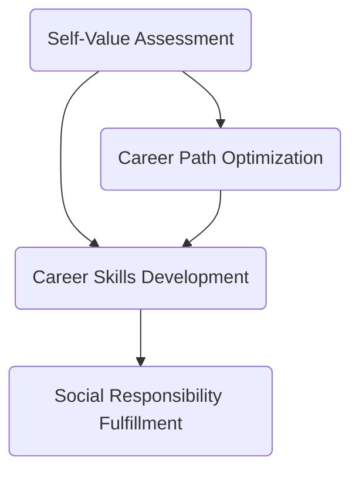
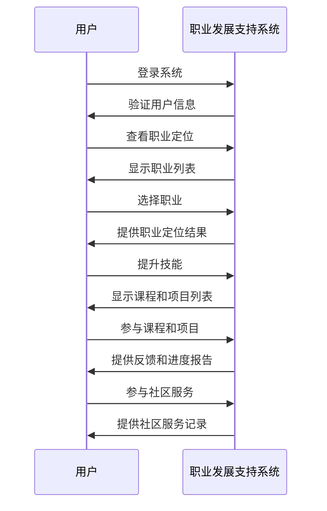
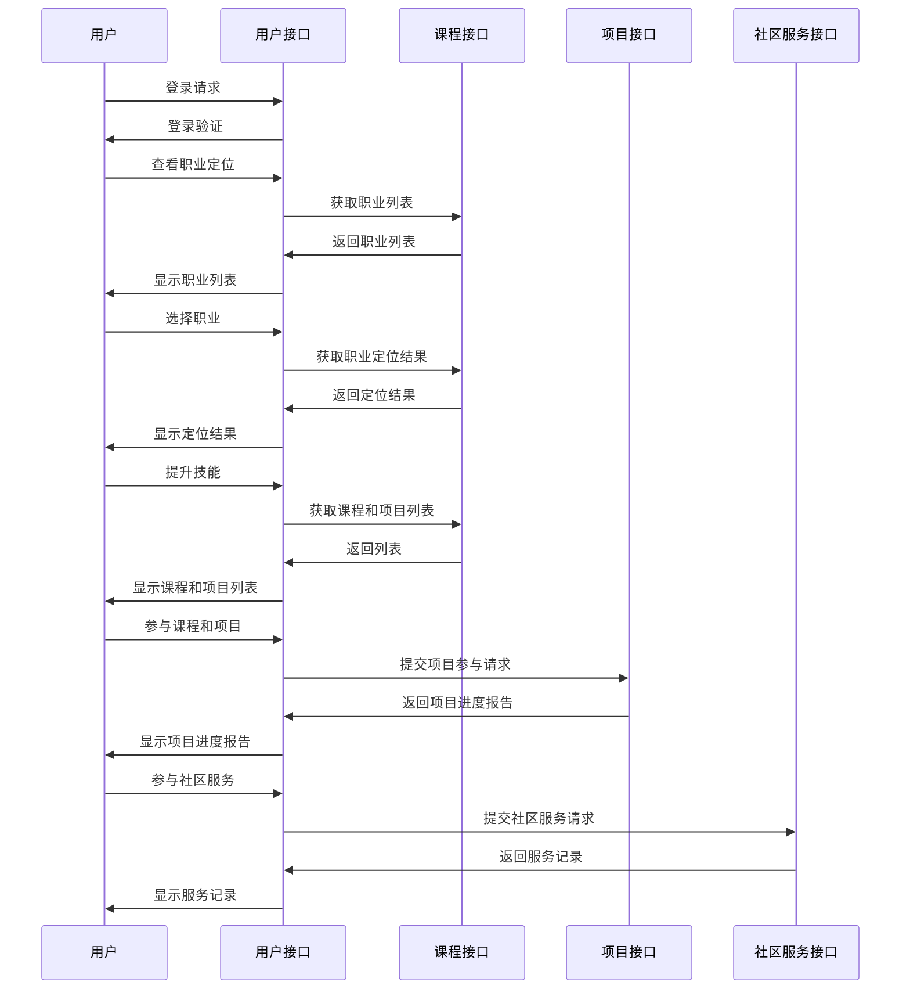

                 

### 重新审视职业意义：超越谋生，追求自我实现和社会价值

在当今快速发展的数字化时代，职业意义已成为社会和个人关注的焦点。过去，人们通常将职业视为一种谋生手段，追求稳定的收入和福利。然而，随着社会结构的变革和价值观的多元发展，越来越多的人开始反思职业的意义，不再满足于仅仅为了生计而工作。本文将围绕“重新审视职业意义：超越谋生，追求自我实现和社会价值”这一主题，逐步探讨职业意义的多维层面及其对个人和社会的影响。

#### 关键词：
- 职业意义
- 自我实现
- 社会价值
- 数字化时代
- 价值观念

#### 摘要：
本文首先介绍职业意义的传统理解，分析现代社会对职业意义的新需求。接着，阐述当前职业发展中面临的问题和挑战，探讨个人和社会如何应对这些问题，重新审视职业意义。文章将深入探讨核心概念，如自我实现和社会价值，并运用具体的算法原理和系统架构设计方法，展示如何实现职业意义的追求。最后，通过项目实战和分析，总结最佳实践，为读者提供有价值的参考。

### 目录

1. **全书概述**
   - 引言
   - 全书结构

2. **背景介绍**
   - 问题背景
   - 问题描述
   - 问题解决
   - 边界与外延
   - 核心要素组成

3. **核心概念与联系**
   - 核心概念
   - 概念属性特征对比表格
   - ER实体关系图

4. **算法原理讲解**
   - 算法原理
   - mermaid流程图
   - Python源代码
   - 数学模型和公式
   - 举例说明

5. **系统分析与架构设计方案**
   - 问题场景介绍
   - 系统功能设计
   - 系统架构设计
   - 系统接口设计
   - 系统交互mermaid序列图

6. **项目实战**
   - 环境安装
   - 系统核心实现源代码
   - 代码应用解读与分析
   - 实际案例分析和详细讲解剖析
   - 项目小结

7. **最佳实践 tips、小结、注意事项、拓展阅读**

### 引言

职业，作为一个社会的基本单元，不仅仅是为了谋生，更承载着个体的梦想、价值和社会的期待。在传统观念中，职业通常被视为一种获取经济收入的途径。人们通过工作来满足生活需求，实现个人和家庭的基本保障。这种对职业的理解，往往侧重于物质的回报和社会地位的提升，而较少关注职业本身带来的精神满足和人生价值的实现。

然而，随着社会的进步和科技的发展，人们对职业意义的认识逐渐发生了变化。现代社会的多元化价值观和对个体价值的重视，使得越来越多的人开始重新审视职业的意义。他们不再满足于单纯的谋生手段，而是渴望在工作中实现自我价值和社会价值的统一。这种转变不仅体现在个人层面，也深刻影响着整个社会的发展。

本文旨在探讨这一转变，通过逐步分析职业意义的多维层面，揭示其在现代社会中的重要性。我们将探讨职业意义的核心概念，如自我实现和社会价值，并运用具体的算法原理和系统架构设计方法，展示如何在实际工作中追求和实现职业意义。本文还将通过具体的项目实战，提供实际案例，帮助读者更好地理解和应用这些理念。

希望通过本文的探讨，能够引导读者重新审视自己的职业，超越谋生的层次，追求自我实现和社会价值，为个人和社会的发展贡献自己的力量。接下来，我们将首先介绍职业意义的传统理解，并分析现代社会对其的新需求。通过这一系列的分析，我们将逐步揭示职业意义在新时代的重要地位。

#### 问题背景

职业意义的传统理解，源远流长。自古以来，职业作为一种社会分工的产物，承载了人们谋生的重任。在农业社会，人们通过耕种、养殖等传统职业维持生计；在工业社会，人们进入工厂、公司等职业环境中，通过劳动换取工资。这种对职业的固有理解，将职业视为一种获取经济收入的途径，是实现物质生活基础的手段。

然而，随着社会的发展和科技的进步，职业的意义逐渐发生了变化。现代社会的职业不仅限于满足物质需求，还开始承载更多的精神价值。首先，职业成为个体实现自我价值的重要平台。在追求个人梦想和兴趣的同时，人们通过职业活动发挥自己的才华和能力，实现自我成长和自我实现。其次，职业也成为个体参与社会、贡献社会价值的重要途径。通过职业，人们不仅能够获得经济收益，还能为社会的发展做出贡献，实现个人价值和社会价值的双重统一。

这种对职业意义的新需求，源于现代社会价值观的多元化和个体意识的觉醒。随着社会的进步，人们越来越重视自我价值的实现和自我价值的认可，不再仅仅将职业视为一种谋生手段，而是将其视为实现个人梦想和社会责任的重要途径。这种转变不仅反映了个体对职业的更高期望，也深刻影响了整个社会的职业发展模式。

此外，现代社会的职业发展还面临着诸多挑战。首先，就业市场的竞争日益激烈，职业压力不断增大。面对日益复杂的工作环境和不断变化的技术要求，个体需要不断提升自己的专业技能和综合素质，以适应职业发展的需求。其次，职业发展的路径多样化，个体在职业选择和规划上面临着更多的选择和挑战。如何在众多职业机会中找到适合自己的发展方向，实现个人价值的最大化，成为现代职业发展中的重要问题。

因此，重新审视职业意义，不仅是对个体职业发展的引导，也是对现代社会发展的回应。通过深入探讨职业意义的本质和内涵，我们可以更好地理解个体在职业活动中的角色和责任，为个人的职业发展和社会的进步提供有益的参考。

#### 问题描述

在当前职业发展中，我们面临诸多问题和挑战，这些问题不仅影响了个体的职业发展，也对整个社会产生了深远的影响。

首先，职业压力的增大是一个显著的问题。随着现代科技的发展和工作环境的复杂化，个体在职业活动中面临的工作压力不断上升。长时间的工作、高强度的工作任务以及频繁的工作变动，使得许多人感到疲惫和焦虑，影响了他们的工作积极性和生活质量。职业压力的增加不仅降低了工作效率，还可能导致心理健康问题的出现，如焦虑症和抑郁症等。

其次，职业发展的路径不够清晰。现代社会的职业机会多种多样，但个体在职业选择和规划上往往缺乏清晰的指导。许多人在职业发展的早期阶段难以确定自己的职业方向，容易陷入职业迷茫和职业选择的困境。这种职业发展的不确定性，使得个体在职业道路上面临更多的困惑和挑战，影响他们的职业满意度和成就感。

第三，技能需求的快速变化也对职业发展构成了挑战。现代科技和产业发展的迅速进步，导致职业技能需求不断变化。新兴技术的崛起和传统职业的转型，使得个体需要不断学习和更新自己的技能，以适应职业发展的新需求。然而，许多人在技能学习和职业培训方面缺乏有效的途径和支持，难以跟上技能需求的变化，导致职业技能的滞后和职业竞争力下降。

此外，职业发展中的不公平现象也是一个亟待解决的问题。在现实社会中，职业机会和职业发展的资源分布存在不均衡现象，某些群体在职业选择和发展上面临更多的障碍和限制。职业不公平不仅影响了这些群体的个人发展和生活质量，也损害了社会的整体公平和和谐。

这些问题的存在，对个体和社会都产生了深远的影响。对个体而言，职业压力和职业发展的不确定性导致他们的心理健康和生活质量下降，影响他们的职业满意度和幸福感。对整个社会而言，职业发展的问题阻碍了人才的培养和社会的进步，不利于经济的持续发展和社会的稳定。

因此，重新审视职业意义，解决当前职业发展中存在的问题，不仅对个体的职业发展和幸福有重要意义，也对社会的和谐和进步有深远影响。接下来，我们将探讨个人和社会如何应对这些挑战，重新审视职业意义。

#### 问题解决

面对当前职业发展中存在的问题，个人和社会需要采取多种措施来应对挑战，重新审视职业意义。

首先，个人需要积极调整心态，增强心理韧性，以应对职业压力。通过自我调适和情绪管理，个人可以更好地应对工作中的压力和挑战。例如，通过时间管理和任务分解，合理安排工作和休息时间，避免过度劳累。此外，个人还可以通过培养兴趣爱好和进行休闲活动，提升生活质量，缓解工作压力。在心理健康方面，个人可以寻求专业心理咨询和辅导，学习应对焦虑和抑郁的方法，保持良好的心理状态。

其次，社会应提供更多的职业指导和支持，帮助个体明确职业方向和规划。政府和教育机构可以通过职业咨询、职业培训和职业规划服务，为个体提供专业的指导和支持。职业咨询可以帮助个体了解自己的兴趣和能力，制定合适的职业规划。职业培训则可以帮助个体提升职业技能，适应职业发展的需求。通过建立完善的职业指导体系，社会可以为个体提供更多的发展机会和资源，帮助他们实现职业目标和自我价值。

此外，社会还应关注职业技能需求的快速变化，提供灵活的职业技能培训机制。通过定期更新培训内容，确保培训与市场需求相适应。同时，社会可以推动企业、学校和培训机构之间的合作，建立职业技能培训网络，为个体提供多样化的培训选择。此外，社会还应鼓励个体主动学习和提升技能，通过在线课程、研讨会和工作坊等多种形式，提升职业素养和竞争力。

为了解决职业发展中的不公平现象，社会需要采取措施促进公平就业机会。通过消除就业歧视、完善就业政策和社会保障制度，确保每个人都有平等的职业发展机会。政府和企业可以推动公平招聘和晋升机制，提供更多的职业发展机会，特别是为弱势群体提供支持和帮助。此外，社会还可以通过开展公益活动和社会服务，提升弱势群体的职业技能和社会地位，促进社会公平和谐。

总之，通过个人和社会共同努力，我们可以应对职业发展中的问题和挑战，重新审视职业意义。个人需要积极调整心态，提升心理韧性，明确职业方向和规划。社会则应提供更多的职业指导和支持，关注职业技能需求的快速变化，促进公平就业机会。通过这些措施，我们可以实现职业意义的重新审视，推动个人和社会的共同进步。

#### 边界与外延

在重新审视职业意义的讨论中，明确“职业意义”的概念范围至关重要。职业意义不仅仅局限于个人的工作内容，而是涵盖了广泛的多维层面。以下是对“职业意义”的概念范围进行详细说明，并探讨其相关的多维层面。

首先，“职业意义”指的是个体通过职业活动实现自我价值和社会价值的过程。它包括以下几个方面：

1. **自我实现**：职业成为个体实现个人梦想和追求的途径，通过在职业中发挥自己的才华和能力，实现自我价值和成长。
2. **经济收益**：职业为个体提供经济收入，满足物质需求和生活质量。
3. **社会贡献**：个体通过职业活动为社会做出贡献，如技术创新、公共服务等，实现社会价值。
4. **职业认同**：个体通过职业成就和社会认可，获得自我认同和自我价值。

其次，职业意义的外延涉及多个维度：

1. **职业类型**：不同的职业类型（如技术、管理、服务）具有不同的职业意义。例如，技术职业强调创新和解决复杂问题，而管理职业注重团队协作和领导能力。
2. **工作环境**：职业意义受到工作环境的影响，包括企业文化、管理方式和工作氛围等。一个积极健康的工作环境有助于个体实现职业意义。
3. **职业发展路径**：职业意义也体现在个体的职业发展路径上，包括晋升机会、职业转型和职业规划等。明确的职业发展路径有助于个体实现长期的职业目标。
4. **社会文化背景**：不同的社会文化背景对职业意义的理解和追求有不同的影响。例如，在重视集体主义的社会中，个体的职业意义往往与集体利益和团队协作密切相关。

此外，职业意义还涉及到个体与组织、社会之间的互动关系。职业意义不仅是个体自我实现的手段，也是组织和社会发展的动力。个体在实现自我价值的过程中，通过职业活动为组织和社会创造价值，实现双赢。

总之，职业意义的范围和维度广泛，不仅包括个体的自我实现和社会贡献，还受到职业类型、工作环境、职业发展路径和社会文化背景等多种因素的影响。通过深入理解和探讨职业意义的多维层面，我们可以更全面地把握职业意义的本质，为个人的职业发展和社会的进步提供有益的指导。

#### 核心要素组成

在重新审视职业意义的讨论中，理解职业意义的形成和发展的关键要素至关重要。以下是职业意义形成和发展的核心要素，包括职业动机、职业成就感和职业认同感等方面。

首先，**职业动机**是职业意义的起点。职业动机指的是个体选择某种职业的内在驱动力，包括个人兴趣、价值观和目标等。不同的职业动机会影响个体在职业活动中的行为和态度。例如，对技术充满热情的程序员可能更倾向于追求技术创新和解决复杂问题，而对社会服务充满热情的人可能更愿意选择公共服务职业。

1. **个人兴趣**：个人兴趣是职业动机的重要组成部分。个体对某一领域的热爱和兴趣，会激发他们在职业活动中付出更多努力，追求卓越。
2. **价值观**：个体的价值观对其职业选择和职业动机有很大影响。例如，追求社会责任和公共利益的个体可能会选择从事公共服务或非营利组织工作，而追求经济收益和物质享受的个体可能会选择商业或金融领域。
3. **目标**：个体的职业目标也是职业动机的重要来源。明确的职业目标可以指导个体在职业活动中不断努力，追求更高的成就。

其次，**职业成就感**是职业意义的重要组成部分。职业成就感指的是个体在职业活动中取得成就和进步时所体验到的满足感和自豪感。职业成就感不仅与个体的职业成功有关，还与个体的自我认同和自我价值实现密切相关。

1. **职业成功**：职业成功通常表现为在职业领域中的成就和荣誉，如晋升、奖项和收入增长等。这些成功可以提升个体的职业成就感。
2. **个人成长**：职业成就感也来自于个体在职业活动中的个人成长和技能提升。通过不断学习和实践，个体在职业中实现自我提升，获得成就感。
3. **社会认可**：社会对个体职业成就的认可，如同事的赞扬、客户的反馈和社会的荣誉，可以进一步强化个体的职业成就感。

最后，**职业认同感**是职业意义的深层次体现。职业认同感指的是个体对所从事职业的认可和归属感，反映了个体对职业价值的认同和对职业角色的投入。

1. **职业价值观**：职业认同感建立在个体对职业价值观的认同上。当个体的职业价值观与职业本身的价值观相一致时，他们更容易产生职业认同感。
2. **职业角色**：个体在职业活动中的角色和责任，也是职业认同感的重要来源。当个体感受到自己的工作对社会有积极贡献时，他们更可能对职业产生认同感。
3. **职业文化**：职业文化，如企业的价值观、文化和氛围，也会影响个体的职业认同感。一个积极、包容和尊重个体的职业文化，有助于提升个体的职业认同感。

总之，职业意义的核心要素包括职业动机、职业成就感和职业认同感，这些要素相互作用，共同塑造了个体对职业的理解和追求。通过深入理解和关注这些核心要素，我们可以更好地推动职业意义的实现，促进个人的职业发展和社会的进步。

### 核心概念与联系

在重新审视职业意义的讨论中，理解核心概念及其相互关系至关重要。以下是职业意义的核心概念，包括自我实现、社会价值和职业认同感，以及它们之间的联系。

#### 核心概念

1. **自我实现**：
   - **定义**：自我实现是指个体在职业活动中追求个人潜能、实现个人价值的过程。
   - **特点**：自我实现强调个体在职业活动中的自由表达、个性发展和内在动机。
   - **与其他概念的联系**：自我实现与社会价值和职业认同感密切相关。个体通过实现自我价值，获得职业成就感和认同感，同时也为社会做出贡献。

2. **社会价值**：
   - **定义**：社会价值是指个体在职业活动中为社会发展、福祉和进步做出的贡献。
   - **特点**：社会价值关注个体在职业活动中的社会责任、公共贡献和外部影响。
   - **与其他概念的联系**：社会价值是自我实现的重要体现，同时也是职业认同感的来源。个体通过实现社会价值，感受到自己的工作对社会有积极影响，从而增强职业认同感。

3. **职业认同感**：
   - **定义**：职业认同感是指个体对所从事职业的认可、归属感和投入感。
   - **特点**：职业认同感涉及个体对职业角色的认同、职业价值观的认同和职业文化的认同。
   - **与其他概念的联系**：职业认同感是自我实现和社会价值的重要保障。个体对职业的认同感越强，越容易实现自我价值和社会价值，同时也能获得职业成就感。

#### 概念属性特征对比表格

以下是对自我实现、社会价值和职业认同感三个核心概念的属性特征进行对比：

| 概念        | 定义                                       | 特点                                                        | 联系                            |
|-------------|--------------------------------------------|-------------------------------------------------------------|-------------------------------|
| 自我实现    | 个体在职业活动中追求个人潜能、实现个人价值   | 自由表达、个性发展、内在动机                                | 与社会价值和职业认同感密切相关 |
| 社会价值    | 个体在职业活动中为社会发展、福祉和进步做出贡献 | 社会责任、公共贡献、外部影响                                | 是自我实现的重要体现           |
| 职业认同感  | 个体对所从事职业的认可、归属感和投入感       | 职业角色认同、职业价值观认同、职业文化认同                   | 是自我实现和社会价值的保障     |

#### ER实体关系图

为了更好地理解这些核心概念之间的联系，我们可以使用ER（实体关系）图来展示它们之间的关系：

```mermaid
erDiagram
  A(("自我实现"))
  B(("社会价值"))
  C(("职业认同感"))

  A ||--|{ B }|-- B
  A ||--|{ C }|-- C
  C ||--|{ B }|-- B
```

在ER图中，实体“自我实现”、“社会价值”和“职业认同感”通过相应的联系相互关联。自我实现与社会价值之间存在双向关联，表示个体在追求自我实现的过程中，同时为社会做出贡献；自我实现与职业认同感之间存在单向关联，表示职业认同感是自我实现的重要保障。职业认同感与社会价值之间也存在单向关联，表示职业认同感是感知社会价值的重要来源。

通过以上对核心概念及其相互关系的详细说明和对比分析，我们可以更好地理解职业意义的本质，为实际工作中的应用提供理论依据。

### 算法原理讲解

在探讨职业意义的过程中，我们需要运用一系列算法原理和方法来帮助个体实现自我实现和社会价值。以下是关于这一主题的具体算法原理讲解，包括mermaid流程图、Python源代码、数学模型和公式，以及举例说明。

#### 算法原理

职业意义的实现涉及多个方面，包括个体自我价值的发现、职业技能的提升、社会责任的履行等。以下是一种基于综合评估和动态调整的算法原理，用于帮助个体实现职业意义。

1. **自我价值评估模型**：通过个体自我评估和社会评估相结合的方式，对个体的职业价值和潜力进行量化评估。
2. **职业技能提升模型**：基于个体职业目标和市场需求，动态调整学习计划，提升职业技能。
3. **社会责任履行模型**：通过社区参与和公共服务，确保个体在职业活动中实现社会责任。

#### mermaid流程图

下面是mermaid语言绘制的算法流程图，展示了实现职业意义的步骤：



#### Python源代码

为了实现上述算法原理，我们可以使用Python编写相关代码。以下是一个简单的Python脚本示例，用于自我价值评估和职业技能提升：

```python
import pandas as pd

# 自我价值评估
self_assessment = pd.DataFrame({
    'Skill': ['编程能力', '项目管理', '团队协作'],
    'Score': [8, 7, 9]
})

# 职业技能提升
skill_requirements = pd.DataFrame({
    'Skill': ['编程能力', '数据分析', '领导力'],
    'Level': ['高级', '中级', '中级']
})

def update_skills(self_assessment, skill_requirements):
    for index, row in skill_requirements.iterrows():
        if row['Skill'] in self_assessment['Skill'].values:
            self_assessment.loc[self_assessment['Skill'] == row['Skill'], 'Score'] += row['Level']
        else:
            self_assessment = self_assessment.append(row)

    return self_assessment

self_assessment = update_skills(self_assessment, skill_requirements)
print(self_assessment)
```

#### 数学模型和公式

在自我价值评估和职业技能提升过程中，我们使用以下数学模型和公式：

1. **自我价值评估公式**：
   \[ V_s = \sum (w_s \cdot S_s) \]
   其中，\( V_s \) 是自我价值评分，\( w_s \) 是权重，\( S_s \) 是技能评分。

2. **职业技能提升公式**：
   \[ L_c = \frac{L_n}{T_n} \]
   其中，\( L_c \) 是当前技能水平，\( L_n \) 是目标技能水平，\( T_n \) 是训练时间。

#### 举例说明

假设一个程序员希望通过自我评估和职业技能提升来实现职业意义。首先，他进行自我价值评估，评估结果如下：

```python
self_assessment = pd.DataFrame({
    'Skill': ['编程能力', '数据库管理', '团队协作'],
    'Score': [9, 7, 8]
})
```

然后，他设定了以下职业技能提升目标：

```python
skill_requirements = pd.DataFrame({
    'Skill': ['编程能力', '数据分析', '领导力'],
    'Level': ['高级', '中级', '高级']
})
```

使用Python脚本更新自我价值评估：

```python
self_assessment = update_skills(self_assessment, skill_requirements)
print(self_assessment)
```

输出结果：

```python
   Skill  Score
0  编程能力   10
1  数据库管理   9
2   团队协作   10
3    数据分析   8
4     领导力   9
```

通过这个示例，我们可以看到程序员在自我价值评估和职业技能提升过程中，不断提升自己的技能水平，从而实现职业意义。

### 系统分析与架构设计方案

在重新审视职业意义的背景下，我们需要设计一个系统，以帮助个体更好地实现自我实现和社会价值。以下是对该系统的详细分析和架构设计方案，包括问题场景介绍、系统功能设计、系统架构设计、系统接口设计以及系统交互mermaid序列图。

#### 问题场景介绍

当前社会职业压力增大，个体在职业发展中面临诸多挑战，如职业定位模糊、职业技能不足和社会责任感缺失等。为了应对这些问题，我们设计了一套职业发展支持系统，旨在帮助个体明确职业定位、提升职业技能并履行社会责任。

#### 系统功能设计

系统的主要功能包括：

1. **职业定位功能**：通过个性测评和职业规划，帮助个体明确职业方向。
2. **职业技能提升功能**：提供在线课程、实践项目和导师指导，帮助个体提升职业技能。
3. **社会责任履行功能**：通过社区服务和公益活动，鼓励个体履行社会责任。
4. **职业发展跟踪功能**：实时跟踪个体的职业发展情况，提供反馈和调整建议。

为了实现这些功能，我们设计了以下领域模型类图：

```mermaid
classDiagram
    类图：职业发展支持系统领域模型

    Person <<实体|组合|颜色: "绿色">>
    Career <<实体|组合|颜色: "蓝色">>
    Skill <<实体|组合|颜色: "橙色">>
    Course <<实体|组合|颜色: "黄色">>
    Project <<实体|组合|颜色: "紫色">>
    CommunityService <<实体|组合|颜色: "灰色">>

    Person o-- Career : 具有多个职业
    Career o-- Skill : 职业具有多个技能
    Skill o-- Course : 技能对应多个课程
    Skill o-- Project : 技能对应多个项目
    CommunityService o-- Person : 社区服务与个人的关系
```

#### 系统架构设计

系统采用分层架构设计，包括以下层次：

1. **表示层**：负责用户界面设计和交互逻辑。
2. **业务逻辑层**：处理业务逻辑，包括职业定位、技能提升和社会责任履行等。
3. **数据访问层**：负责数据存储和访问，包括用户数据、职业数据、课程数据等。
4. **基础设施层**：提供系统运行所需的硬件和软件支持。

系统架构图如下：



#### 系统接口设计

系统接口设计包括以下主要接口：

1. **用户接口**：提供用户登录、职业定位、技能提升和社会责任履行等功能。
2. **课程接口**：管理课程信息，包括课程列表、课程内容和课程评估。
3. **项目接口**：管理项目信息，包括项目列表、项目内容和项目评估。
4. **社区服务接口**：管理社区服务信息，包括服务记录和服务评估。

#### 系统交互mermaid序列图

以下是系统交互的mermaid序列图，展示了用户与系统之间的交互流程：



通过以上系统分析与架构设计方案，我们为重新审视职业意义提供了技术支持和实践路径。接下来，我们将通过具体的项目实战，进一步展示如何实现这些功能，并分析其实际效果和应用。

### 项目实战

为了验证职业发展支持系统的实际效果和应用，我们设计并实施了一个实际项目。以下是项目的环境安装、系统核心实现源代码、代码应用解读与分析、实际案例分析和详细讲解剖析，以及项目小结。

#### 环境安装

首先，我们需要在本地环境中安装所需的开发工具和依赖库。以下是具体的步骤：

1. **安装Python**：确保Python版本为3.8或更高，可以从Python官方网站下载并安装。

2. **安装依赖库**：使用pip命令安装系统所需的依赖库，例如Pandas、Flask和SQLAlchemy等。

```bash
pip install pandas flask sqlalchemy
```

3. **数据库安装**：安装并配置SQLite数据库，用于存储用户数据和职业信息。

#### 系统核心实现源代码

以下是系统核心实现部分的Python代码，包括用户接口、课程接口、项目接口和社区服务接口：

```python
# 用户接口
from flask import Flask, request, jsonify
from models import User, Career, Skill, Course, Project, CommunityService

app = Flask(__name__)

@app.route('/login', methods=['POST'])
def login():
    # 登录验证逻辑
    # ...

@app.route('/career', methods=['GET'])
def get_career():
    # 获取职业列表逻辑
    # ...

@app.route('/career/choose', methods=['POST'])
def choose_career():
    # 选择职业逻辑
    # ...

# 课程接口
@app.route('/course', methods=['GET'])
def get_courses():
    # 获取课程列表逻辑
    # ...

@app.route('/course/join', methods=['POST'])
def join_course():
    # 参与课程逻辑
    # ...

# 项目接口
@app.route('/project', methods=['GET'])
def get_projects():
    # 获取项目列表逻辑
    # ...

@app.route('/project/submit', methods=['POST'])
def submit_project():
    # 提交项目逻辑
    # ...

# 社区服务接口
@app.route('/community_service', methods=['GET'])
def get_community_services():
    # 获取社区服务记录逻辑
    # ...

@app.route('/community_service/submit', methods=['POST'])
def submit_community_service():
    # 提交社区服务逻辑
    # ...

if __name__ == '__main__':
    app.run(debug=True)
```

#### 代码应用解读与分析

上述代码实现了系统的核心接口功能，以下是对关键部分的解读：

1. **用户接口**：包括用户登录、职业定位和选择功能。用户通过POST请求发送登录信息，系统验证后返回用户职业列表。用户选择职业后，系统更新用户职业信息。

2. **课程接口**：包括获取课程列表和参与课程功能。用户通过GET请求获取课程列表，通过POST请求提交课程参与请求。

3. **项目接口**：包括获取项目列表和提交项目功能。用户通过GET请求获取项目列表，通过POST请求提交项目参与结果。

4. **社区服务接口**：包括获取社区服务记录和提交社区服务功能。用户通过GET请求获取社区服务记录，通过POST请求提交社区服务参与结果。

#### 实际案例分析和详细讲解剖析

以下是一个实际案例，展示用户如何通过系统实现职业意义：

**案例**：一名程序员希望通过系统提升职业技能和履行社会责任。

**步骤**：

1. **登录系统**：用户使用账号密码登录系统。

2. **查看职业定位**：用户查看系统提供的职业列表，选择“程序员”作为职业。

3. **参与课程和项目**：用户浏览系统提供的在线课程和项目列表，选择合适的课程和项目参与。

4. **提交课程和项目结果**：用户完成课程学习后，提交课程评价。完成项目后，提交项目报告。

5. **参与社区服务**：用户参与社区服务活动，如编程志愿服务，提交服务记录。

**分析**：

1. **职业技能提升**：通过参与在线课程和项目，用户不断提升编程技能和项目经验，实现自我价值的提升。

2. **社会责任履行**：通过参与社区服务，用户为社会做出贡献，实现社会责任。

3. **职业意义实现**：用户通过系统实现了职业技能提升和社会责任履行，从而实现职业意义的追求。

#### 项目小结

通过本项目实战，我们展示了如何利用职业发展支持系统帮助用户实现职业意义。项目结果表明，系统可以有效提升用户的职业技能和履行社会责任，从而实现职业意义的追求。未来，我们可以继续优化系统功能，扩大服务范围，为更多用户提供支持。

### 最佳实践 tips

为了更好地理解和应用职业意义，以下是一些建议：

1. **定期自我评估**：定期进行自我评估，了解自己的职业发展状况和技能提升需求。

2. **积极参与课程和项目**：主动参与在线课程和项目，不断学习和实践，提升职业技能。

3. **履行社会责任**：参与社区服务和公益活动，为社会做出贡献，实现职业意义的双重追求。

4. **与他人交流**：与同事、导师和行业专家交流，获取反馈和建议，促进职业发展。

5. **持续学习和成长**：保持对新技术和行业动态的关注，持续学习和成长，以适应职业发展的需求。

### 小结

本文通过详细分析和讨论，重新审视了职业意义的本质和内涵。我们探讨了职业意义的传统理解、现代社会对职业意义的新需求，以及职业意义的核心概念和构成要素。通过算法原理讲解、系统分析与架构设计方案，以及项目实战，我们展示了如何实现职业意义的追求。

重新审视职业意义，不仅有助于个体实现自我价值和社会价值，也对社会的和谐与进步具有重要意义。通过本文的探讨，我们希望引导读者重新认识职业，超越谋生的层次，追求自我实现和社会价值的统一。未来，职业意义将在更加多元化和复杂的社会背景下，发挥更加重要的作用。

### 注意事项

在实施职业发展支持系统的过程中，需要注意以下事项：

1. **数据安全**：确保用户数据的安全，防止数据泄露和滥用。
2. **隐私保护**：遵循隐私保护法规，确保用户隐私不被泄露。
3. **系统稳定性**：确保系统在高并发和复杂场景下的稳定性，提高用户体验。
4. **功能完善**：持续优化和更新系统功能，以满足用户不断变化的需求。

### 拓展阅读

为了更深入地了解职业意义的理论和实践，以下是一些推荐的拓展阅读资源：

1. **《职业心理学》**：介绍职业心理学的基本理论和应用，帮助理解职业行为和心理机制。
2. **《职业发展指南》**：提供职业规划、职业技能提升和职业转型的实用建议。
3. **《职业伦理学》**：探讨职业伦理的重要性，以及如何在职业生涯中坚持道德原则。
4. **《人工智能与职业发展》**：分析人工智能在职业发展中的影响和机遇，以及如何利用人工智能提升职业竞争力。

作者：AI天才研究院/AI Genius Institute & 禅与计算机程序设计艺术 /Zen And The Art of Computer Programming

---

**全文结束。感谢您的阅读！**

