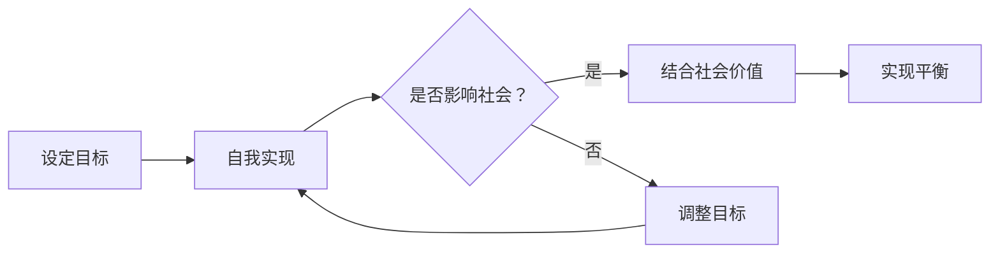

                 

# 重新审视职业意义：超越谋生，追求自我实现和社会价值

> 关键词：职业意义、自我实现、社会价值、职业发展、心理健康

> 摘要：本文从技术从业者的角度出发，探讨职业意义的多重维度，分析现代职业发展的挑战与机遇，重构职业意义，设定职业规划与成长路径，强调职业伦理与社会责任的重要性，关注职业幸福与心理健康，通过案例分析提供最佳实践，对未来职业发展进行展望，旨在引导读者超越谋生，追求自我实现和社会价值。

## 引言

### 职业意义的多重维度

职业意义不仅仅是谋生的手段，更是个人价值的体现和实现平台。在当今社会，职业意义的多样性使得我们不得不重新审视它。首先，从经济角度来看，职业是我们获取收入、维持生计的重要途径。然而，职业的意义远不止于此。它还包括以下维度：

1. **自我实现**：职业是个人才能和兴趣的展现舞台，通过工作实现自我价值。
2. **社会价值**：职业使个体能够为社会做出贡献，实现个人与社会的双赢。
3. **心理健康**：职业环境对个体的心理健康有着直接的影响，一个有意义的工作能够带来满足感和成就感。

### 超越谋生的思考

随着技术的发展和就业市场的变化，越来越多的从业者开始意识到，仅仅为了谋生而工作是不够的。我们需要思考如何在工作过程中实现自我价值和社会价值，如何在职业发展的道路上找到真正的满足感。这要求我们：

1. **明确个人价值观**：个人的价值观决定了他们在职业选择和发展过程中的方向。
2. **不断学习和成长**：只有通过不断学习新技能和知识，我们才能在职业市场上保持竞争力，实现自我价值。
3. **关注社会需求**：通过解决社会问题，我们能够更好地实现个人和社会价值。

### 自我实现与社会价值的平衡

在追求职业发展的过程中，如何平衡自我实现和社会价值是一个重要的课题。自我实现需要我们在工作中找到乐趣和成就感，而社会价值则需要我们关注社会的需求和变化。以下是一些策略：

1. **找到热爱的事业**：从事自己热爱的事业能够带来更高的工作满足感和成就感。
2. **关注社会需求**：通过解决社会问题，我们能够实现更大的社会价值。
3. **持续学习和创新**：只有不断学习和创新，我们才能在快速变化的社会中保持竞争力。

## 现代职业发展的挑战与机遇

### 工作满意度与职业倦怠

随着工作压力的增加和职业倦怠的普遍存在，工作满意度成为影响职业发展的重要因素。现代职业发展面临的挑战包括：

1. **工作压力**：高工作压力可能导致职业倦怠和心理健康问题。
2. **职业倦怠**：长期的职业倦怠可能导致工作满意度的下降。
3. **技术变革**：技术变革带来了新的职业机会，但同时也增加了职业转型的压力。

### 技术变革对职业的影响

技术变革正在重塑职业面貌，为从业者提供了新的机遇和挑战。以下是一些影响：

1. **自动化与人工智能**：自动化和人工智能的应用正在改变许多传统职业的形态。
2. **远程工作**：远程工作模式的普及改变了工作地点和方式，提供了更多的灵活性和自由度。
3. **持续学习**：技术变革要求从业者持续学习新技能和知识，以适应不断变化的工作环境。

### 职业发展的趋势与前景

未来职业发展的趋势和前景包括：

1. **数字化**：数字化将在所有行业中扮演越来越重要的角色，对职业发展产生深远影响。
2. **可持续发展**：可持续发展将成为未来职业发展的关键驱动力，绿色技术和环保产业将得到更多关注。
3. **全球化**：全球化将继续推动跨国职业机会的增加，国际视野将变得更加重要。

## 职业意义的重构

### 个人价值观的探索

个人价值观是职业选择和发展的基础。以下是一些建议，帮助从业者探索个人价值观：

1. **自我反思**：定期进行自我反思，了解自己的价值观和兴趣。
2. **寻求反馈**：向同事、朋友和导师寻求反馈，了解自己在工作中的表现和价值观。
3. **职业咨询**：考虑咨询职业顾问，以获取更全面的职业发展建议。

### 自我实现的路径

自我实现是职业发展的核心目标。以下是一些实现自我实现的路径：

1. **设定职业目标**：明确短期和长期的职业目标，制定实现目标的计划。
2. **不断学习**：通过学习新技能和知识，提升自己的专业能力。
3. **参与项目**：积极参与有挑战性的项目，提升自己的实践能力和解决问题的能力。

### 社会价值的重要性

实现社会价值是职业意义的重要组成部分。以下是一些实现社会价值的策略：

1. **关注社会问题**：了解社会问题和需求，找到能够解决问题的方法。
2. **参与公益活动**：通过参与公益活动，为社会做出实际贡献。
3. **技术创新**：通过技术创新，推动社会进步和可持续发展。

## 职业规划与成长

### 职业目标设定

职业目标设定是职业规划的关键步骤。以下是一些建议：

1. **明确目标**：明确自己的职业目标，包括短期和长期的职业目标。
2. **制定计划**：制定实现目标的详细计划，包括学习计划、工作计划等。
3. **跟踪进度**：定期跟踪自己的进度，确保目标的实现。

### 技能与知识更新

随着技术的发展，技能和知识的更新变得至关重要。以下是一些建议：

1. **持续学习**：通过在线课程、专业书籍、研讨会等方式，不断学习新技能和知识。
2. **实践应用**：将新技能和知识应用到实际工作中，提升自己的能力。
3. **获取认证**：通过获取相关证书，证明自己的专业能力和知识水平。

### 职业路径选择

职业路径选择是职业规划的重要部分。以下是一些建议：

1. **了解行业趋势**：了解所在行业的趋势和发展方向，选择有前景的职业路径。
2. **平衡工作与生活**：在职业选择时，要考虑工作与生活的平衡，确保身心健康。
3. **寻求指导**：寻求导师或职业顾问的指导，以获取更专业的建议。

## 职业伦理与社会责任

### 职业道德的重要性

职业道德是职业发展的基石。以下是一些建议：

1. **遵守法律法规**：遵守相关法律法规，确保自己的行为合法合规。
2. **诚实守信**：在工作中保持诚实和诚信，树立良好的职业形象。
3. **尊重他人**：尊重同事、客户和合作伙伴，建立良好的人际关系。

### 社会责任与企业伦理

社会责任和企业伦理是企业成功的关键。以下是一些建议：

1. **环境保护**：关注环境保护，采取绿色生产方式，减少对环境的负面影响。
2. **公平竞争**：遵守公平竞争规则，不参与不正当竞争行为。
3. **回馈社会**：通过公益活动和社会责任项目，回馈社会，树立企业形象。

### 职业行为规范

职业行为规范是职业发展的重要保障。以下是一些建议：

1. **职业操守**：遵守职业道德和行为规范，树立良好的职业形象。
2. **信息保密**：保护公司和客户的机密信息，确保信息安全。
3. **团队合作**：积极参与团队合作，共同完成任务，提高工作效率。

## 职业幸福与心理健康

### 职业幸福感

职业幸福感是职业发展的重要目标。以下是一些建议：

1. **工作满意度**：提高工作满意度，通过设定合理的期望和目标，提升工作幸福感。
2. **职业成就感**：通过实现职业目标和取得职业成就，提升职业幸福感。
3. **心理平衡**：保持心理平衡，通过良好的生活习惯和心理健康管理，提升职业幸福感。

### 压力管理

压力管理是职业幸福感的重要组成部分。以下是一些建议：

1. **时间管理**：合理规划时间，避免过度工作和疲劳。
2. **情绪调节**：学会情绪调节技巧，如冥想、深呼吸等，缓解工作压力。
3. **健康生活**：保持健康的生活习惯，如适量运动、合理饮食等，提升身体健康和心理素质。

### 心理健康与工作平衡

心理健康与工作平衡是职业发展的重要保障。以下是一些建议：

1. **心理健康意识**：增强心理健康意识，关注自己的心理状态，及时寻求专业帮助。
2. **工作与生活的平衡**：合理安排工作和生活时间，确保工作和生活的平衡。
3. **心理支持**：寻求家庭、朋友和同事的支持，建立良好的心理支持网络。

## 案例分析与最佳实践

### 成功案例分享

通过分析成功案例，可以了解职业发展的最佳实践。以下是一些成功案例：

1. **职业转型**：一位软件工程师通过学习新技能，成功转型为数据科学家，实现了自我价值和社会价值的双重提升。
2. **创业实践**：一位创业者通过解决社会问题，创立了一家环保科技公司，实现了个人和社会价值的双赢。
3. **国际视野**：一位国际业务经理通过拓展国际视野，为公司开拓了新的市场，提升了公司的国际竞争力。

### 职业转型与创业实践

职业转型和创业实践是职业发展的两种重要途径。以下是一些建议：

1. **职业转型**：明确职业转型的目标和路径，通过学习新技能和知识，实现职业转型。
2. **创业实践**：了解创业的基本知识和实践方法，通过创业实现个人和社会价值的双重提升。

### 国际视野下的职业发展

国际视野对于职业发展至关重要。以下是一些建议：

1. **学习外语**：掌握一门或几门外语，提升自己的国际竞争力。
2. **国际交流**：积极参与国际交流，了解不同国家和地区的职业发展动态。
3. **跨文化能力**：培养跨文化能力，适应不同文化背景的工作环境。

## 未来展望与持续学习

### 职业发展的未来趋势

未来职业发展的趋势将包括：

1. **数字化**：数字化将继续改变职业发展的方式和方向。
2. **可持续发展**：可持续发展将成为未来职业发展的关键驱动力。
3. **远程工作**：远程工作模式将得到更广泛的应用。

### 持续学习的策略

持续学习是职业发展的关键。以下是一些建议：

1. **自我驱动**：培养自我驱动能力，主动学习新技能和知识。
2. **在线学习**：利用在线学习平台，灵活安排学习时间。
3. **实践应用**：通过实际工作，将新技能和知识应用到实践中，提升自己的能力。

### 职业意义的长远思考

在追求职业发展的过程中，我们应该：

1. **明确职业目标**：设定明确的职业目标，为实现目标而努力。
2. **持续成长**：通过不断学习和成长，提升自己的专业能力和竞争力。
3. **关注社会需求**：通过解决社会问题，实现个人和社会价值的双重提升。

## 结论

职业意义不仅仅是谋生的手段，更是个人价值的体现和实现平台。通过重新审视职业意义，我们可以超越谋生，追求自我实现和社会价值。在这个过程中，我们应该：

1. **明确个人价值观**：明确自己的价值观，为职业选择和发展提供指导。
2. **不断学习和成长**：通过不断学习和成长，提升自己的专业能力和竞争力。
3. **关注社会需求**：通过解决社会问题，实现个人和社会价值的双赢。

让我们共同努力，追求有意义的职业生活，实现自我价值和社会价值。

## 作者信息

作者：AI天才研究院/AI Genius Institute & 禅与计算机程序设计艺术 /Zen And The Art of Computer Programming

以上是本文的详细内容和目录大纲，希望对您有所帮助。在撰写文章时，请注意遵循markdown格式，确保文章的可读性和结构清晰。在撰写过程中，如有任何问题，请随时提问。让我们一步步深入思考，共同探讨职业意义的重构和实现。期待您的精彩文章！## 1. 引言

### 职业意义的多重维度

职业意义是现代社会中一个重要的概念，它不仅仅关系到个人的生计，更涉及到个人的成长、价值实现和社会贡献。在技术从业者的背景下，重新审视职业意义尤为重要。以下将从多个维度探讨职业意义的内涵和重要性。

#### 问题背景

在当前快速变化的技术环境中，技术从业者的职业意义受到了前所未有的挑战。一方面，技术的快速发展使得从业者的技能和知识不断被淘汰和更新；另一方面，市场的竞争加剧，从业者的职业选择和职业发展路径变得更加复杂。在这样的背景下，如何重新审视职业意义，找到个人的价值实现点，成为每个从业者都必须面对的问题。

#### 问题描述

职业意义的多重维度主要体现在以下几个方面：

1. **经济维度**：职业首先是一个经济活动，从业者通过工作获得收入，维持生活。
2. **自我实现维度**：职业是个人才能和兴趣的展现平台，从业者通过职业实现自我价值。
3. **社会价值维度**：职业是个人对社会贡献的途径，从业者通过工作解决社会问题，实现社会价值。
4. **心理健康维度**：职业环境对从业者的心理健康有直接影响，一个有意义的工作能够带来满足感和成就感。

#### 问题解决

为了解决上述问题，我们需要：

1. **明确职业目标**：从业者应明确自己的职业目标，确保职业发展与个人价值观相一致。
2. **持续学习和成长**：通过不断学习新技能和知识，提升个人竞争力，实现职业成长。
3. **关注社会需求**：通过解决社会问题，实现个人和社会价值的双赢。
4. **维护心理健康**：通过良好的工作环境和管理，保障从业者的心理健康。

#### 边界与外延

职业意义的边界在于其是否能够满足从业者的基本生活需求，以及是否能够带来个人成长和社会贡献。职业意义的外延包括经济、社会、心理等多个方面，从业者需要综合考虑，找到适合自己的职业发展路径。

### 超越谋生的思考

谋生是职业的基本功能，但仅仅为了谋生而工作并不能带来长期的满足感和成就感。以下将从以下几个方面探讨如何超越谋生，实现职业的自我实现和社会价值。

#### 核心概念原理

1. **谋生**：谋生是职业的首要功能，通过工作获得收入，维持生活。
2. **自我实现**：自我实现是职业的更高层次功能，通过工作实现个人才能和兴趣，实现自我价值。
3. **社会价值**：社会价值是职业的终极目标，通过工作解决社会问题，实现个人和社会价值的双赢。

#### 概念属性特征对比表格

| 概念 | 属性特征 |
| --- | --- |
| 谋生 | 主要目的是获得收入，维持生活 |
| 自我实现 | 主要目的是实现个人价值，满足兴趣和才能 |
| 社会价值 | 主要目的是解决社会问题，实现社会贡献 |

#### ER实体关系图架构

为了更好地理解谋生、自我实现和社会价值之间的关系，我们可以使用Mermaid绘制一个ER（实体关系）图。以下是ER图的基本结构：

```mermaid
entityRelationship
  [
    "人" -- "谋生" : "通过工作获得收入"
    "人" -- "自我实现" : "实现个人价值和兴趣"
    "人" -- "社会价值" : "解决社会问题，实现社会贡献"
  ]
```

### 自我实现与社会价值的平衡

在追求职业发展的过程中，如何平衡自我实现和社会价值是一个重要的课题。以下提供一些策略，帮助从业者找到自我实现和社会价值的平衡点。

#### 算法原理讲解

我们可以使用Mermaid绘制一个流程图，展示如何平衡自我实现和社会价值的步骤：



#### 数学模型和公式

为了定量分析自我实现和社会价值的平衡，我们可以使用以下数学模型：

```latex
$$
幸福感 = f(\text{自我实现程度}, \text{社会价值贡献})
$$
```

在这个模型中，幸福感是自我实现程度和社会价值贡献的函数。通过调整这两个参数，可以找到最佳的平衡点。

#### 详细讲解与举例说明

为了更好地理解上述数学模型，我们可以通过一个简单的例子来说明。

假设一个软件工程师，他的自我实现程度为70%，社会价值贡献为30%。根据幸福感公式，他的幸福感为：

```latex
$$
幸福感 = f(0.7, 0.3) = 0.7 \times 0.3 + 0.3 \times 0.7 = 0.42
$$

```

这意味着他的幸福感为42%。为了提升幸福感，他可以尝试增加自我实现程度（例如，通过学习新技能和参与有挑战性的项目）或提高社会价值贡献（例如，参与开源项目或社区服务）。

通过以上步骤，我们不仅探讨了职业意义的多重维度，还提供了具体的策略和模型，帮助从业者重新审视职业意义，超越谋生，追求自我实现和社会价值。在接下来的章节中，我们将继续深入探讨职业发展的各个方面，为读者提供更多的指导和建议。

