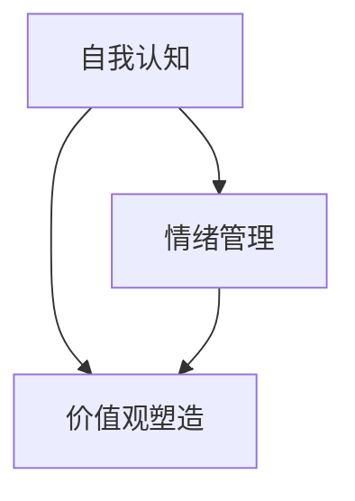
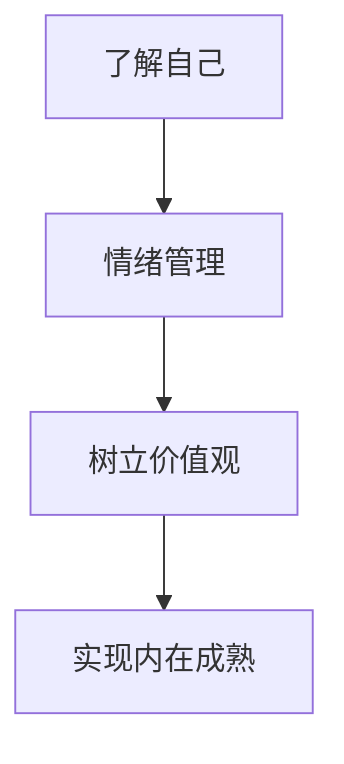
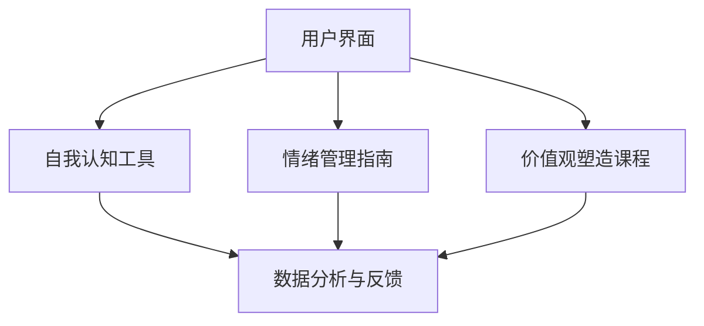
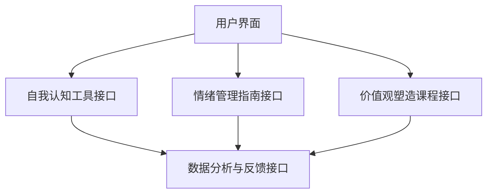

                 

# 重新思考个人成长：从外在成就到内在成熟的蜕变

> 关键词：个人成长、内在成熟、外在成就、自我认知、情绪管理、价值观塑造

> 摘要：
本文将探讨个人成长这一主题，从外在成就到内在成熟的转变。我们将逐步分析个人成长的核心概念、原理和方法，并结合实际案例，提出一套系统化的成长指南，帮助读者实现从外在成就到内在成熟的蜕变。

### 目录大纲：

## 第一部分：背景介绍

### 1.1 问题背景
- 个人成长的重要性及现状
- 从外在成就到内在成熟转变的必要性

### 1.2 问题描述
- 如何在现代社会中实现个人成长？
- 外在成就与内在成熟的关系

### 1.3 问题解决
- 提供一套系统的方法论，帮助读者实现从外在成就到内在成熟的转变

### 1.4 边界与外延
- 个人成长的范畴
- 内在成熟的具体表现

### 1.5 概念结构与核心要素组成
- 个人成长：自我认知、技能提升、人际关系
- 内在成熟：自我接纳、情绪管理、价值观塑造

## 第二部分：核心概念与联系

### 2.1 核心概念原理
- 自我认知：了解自己的优点和不足，明确个人目标和追求
- 情绪管理：认识和管理自己的情绪，避免情绪化行为
- 价值观塑造：树立正确的人生观和价值观，指导个人行为和决策

### 2.2 概念属性特征对比表格

### 2.3 ER实体关系图架构

## 第三部分：算法原理讲解

### 3.1 算法mermaid流程图

### 3.2 算法原理

#### 数学模型和公式

#### 详细讲解和举例说明

## 第四部分：系统分析与架构设计方案

### 4.1 问题场景介绍
- 个人成长和内在成熟的重要性和现状
- 提供一个系统化的方法，帮助读者实现从外在成就到内在成熟转变

### 4.2 项目介绍
- 项目名称：《重新思考个人成长：从外在成就到内在成熟的蜕变》
- 项目目标：为读者提供一个全面的个人成长指南，帮助实现外在成就到内在成熟的转变

### 4.3 系统功能设计

### 4.4 系统架构设计

### 4.5 系统接口设计和系统交互

## 第五部分：项目实战

### 5.1 环境安装
- 安装自我认知工具、情绪管理指南和价值观塑造课程所需的环境

### 5.2 系统核心实现源代码
- 提供自我认知工具、情绪管理指南和价值观塑造课程的核心实现源代码

## 结论

### 最佳实践 tips
- 小结
- 注意事项
- 拓展阅读

## 作者信息

### 1.1 问题背景

### 1.1.1 个人成长的重要性及现状

个人成长是人类一生的必修课。随着社会的快速发展，人们对个人成长的需求越来越高。然而，在现实生活中，许多人把个人成长等同于外在成就，如薪资水平、职位晋升、社会地位等。这种追求外在成就的心态，往往让人们陷入功利主义的泥潭，忽视了个人的内在成长。

首先，个人成长的重要性体现在以下几个方面：

1. **自我认知**：了解自己的优点和不足，明确个人目标和追求，是实现个人成长的基础。通过自我认知，人们可以更好地了解自己的兴趣、能力和价值观，从而找到适合自己的发展路径。

2. **技能提升**：现代社会竞争激烈，技能的提升已经成为个人成长的重要方面。掌握一定的专业技能，不仅可以提高个人竞争力，还能为个人带来更好的职业发展机会。

3. **人际关系**：良好的人际关系对于个人成长至关重要。一个和谐的人际关系网络，可以为个人提供更多的资源和支持，帮助个人在成长过程中少走弯路。

然而，当前个人成长的现状并不乐观。许多人在追求外在成就的过程中，忽视了个人的内在成长。这种追求外在成就的心态，导致了一系列问题：

1. **心理压力增大**：为了追求更高的薪资、职位和地位，许多人不断加班、熬夜，承受着巨大的心理压力。长期的过度压力，容易导致心理疾病，影响个人成长。

2. **人际关系紧张**：追求外在成就的过程中，人们往往会忽略与家人、朋友的相处。导致人际关系紧张，甚至破裂，对个人成长产生负面影响。

3. **价值观扭曲**：过度追求外在成就，容易让人价值观扭曲。一些人为了追求物质财富，不惜违反道德和法律，导致个人成长受阻。

### 1.1.2 从外在成就到内在成熟转变的必要性

从外在成就到内在成熟转变的必要性，主要体现在以下几个方面：

1. **心理健康**：内在成熟的人，具有健康的心理状态。他们能够正确面对生活中的压力和挑战，保持乐观、积极的心态，从而促进个人成长。

2. **人际关系**：内在成熟的人，具有良好的人际关系。他们懂得尊重他人、关爱他人，能够与他人建立深厚的友谊，从而获得更多的支持与帮助。

3. **价值观**：内在成熟的人，具有正确的价值观。他们能够树立正确的人生观、价值观，指导个人行为和决策，从而实现个人的全面发展。

因此，从外在成就到内在成熟转变，是个人成长的必经之路。只有实现这一转变，才能真正实现个人的全面发展，成为一个身心健康、人际关系良好、价值观正确的人。

### 1.2 问题描述

### 1.2.1 如何在现代社会中实现个人成长？

在现代社会，实现个人成长面临诸多挑战。首先，信息爆炸的时代，人们面临着海量的信息，如何筛选出有价值的信息，成为了一项重要的能力。其次，现代社会竞争激烈，个人需要不断提升自己的技能和知识，才能在竞争中立于不败之地。此外，人际关系复杂，如何处理各种人际关系，也是个人成长的一个重要方面。

为了在现代社会中实现个人成长，可以采取以下策略：

1. **自我认知**：通过自我反思、自我评价，了解自己的性格、兴趣、能力等，明确个人目标和追求。自我认知是实现个人成长的基础。

2. **终身学习**：现代社会变化迅速，知识更新迭代快，个人需要具备终身学习的能力。通过不断学习，提升自己的知识水平和技能，以适应社会发展的需求。

3. **情绪管理**：情绪管理是个人成长的一个重要方面。通过认识和管理自己的情绪，避免情绪化行为，保持心理平衡，有利于个人成长。

4. **人际关系**：建立良好的人际关系，是个人成长的重要保障。通过学习人际关系技巧，提升自己的人际交往能力，有助于在人际关系中取得优势。

### 1.2.2 外在成就与内在成熟的关系

外在成就与内在成熟之间存在一定的关联，但并非简单的因果关系。外在成就可以在一定程度上反映个人的成长，但并不能完全代表内在成熟。

1. **外在成就与内在成熟的关系**：

   - 外在成就往往是内在成熟的一种表现。一个内在成熟的人，往往能够在工作和生活中取得一定的成就。但反之，拥有外在成就并不意味着一个人就具有内在成熟。

   - 外在成就与内在成熟之间存在一定的滞后性。一个人可能在短期内取得了很大的外在成就，但这并不意味着他的内在成熟度已经达到理想状态。

2. **外在成就与内在成熟的不同之处**：

   - **外在成就**：主要指个人在事业、学业、社交等方面的表现，如薪资水平、职位晋升、荣誉奖项等。

   - **内在成熟**：主要指个人的心理素质、人际关系、价值观等方面的表现，如情绪管理能力、人际交往能力、人生观、价值观等。

   - **外在成就**：往往是通过外部评价来衡量，具有一定的客观性。

   - **内在成熟**：往往是通过自我反思和自我评价来衡量，具有一定的主观性。

因此，在追求外在成就的同时，我们不能忽视内在成熟的重要性。只有实现外在成就与内在成熟的平衡发展，才能真正实现个人的全面发展。

### 1.3 问题解决

为了帮助读者实现从外在成就到内在成熟的转变，本文提供以下系统的方法论：

1. **自我认知**：通过自我反思、自我评价，了解自己的优点和不足，明确个人目标和追求。

2. **技能提升**：终身学习，不断提升自己的知识水平和技能，以适应社会发展的需求。

3. **情绪管理**：认识和管理自己的情绪，避免情绪化行为，保持心理平衡。

4. **人际关系**：建立良好的人际关系，提升自己的人际交往能力，有助于在人际关系中取得优势。

5. **价值观塑造**：树立正确的人生观和价值观，指导个人行为和决策。

通过以上五个方面的努力，读者可以逐步实现从外在成就到内在成熟的转变，成为一个身心健康、人际关系良好、价值观正确的人。

### 1.4 边界与外延

1. **个人成长的范畴**：

   - **自我认知**：了解自己的性格、兴趣、能力等。

   - **技能提升**：学习新技能，提高自己的知识水平和能力。

   - **人际关系**：建立良好的人际关系，提升人际交往能力。

   - **价值观塑造**：树立正确的人生观和价值观。

2. **内在成熟的具体表现**：

   - **情绪管理**：能够正确面对生活中的压力和挑战，保持心理平衡。

   - **自我接纳**：接受自己的优点和不足，不自卑、不自负。

   - **价值观塑造**：具有正确的人生观和价值观，能够指导个人行为和决策。

### 1.5 概念结构与核心要素组成

1. **个人成长**：

   - **自我认知**：了解自己的优点和不足，明确个人目标和追求。

   - **技能提升**：学习新技能，提高自己的知识水平和能力。

   - **人际关系**：建立良好的人际关系，提升人际交往能力。

2. **内在成熟**：

   - **自我接纳**：接受自己的优点和不足，不自卑、不自负。

   - **情绪管理**：能够正确面对生活中的压力和挑战，保持心理平衡。

   - **价值观塑造**：具有正确的人生观和价值观，能够指导个人行为和决策。

### 第二部分：核心概念与联系

#### 2.1 核心概念原理

1. **自我认知**：

   - **定义**：自我认知是指一个人对自己的理解、认知和认识。

   - **作用**：自我认知是实现个人成长的基础，它帮助人们了解自己的优点和不足，明确个人目标和追求。

   - **方法**：通过自我反思、自我评价、与他人交流等方式，了解自己的性格、兴趣、能力等。

2. **情绪管理**：

   - **定义**：情绪管理是指一个人在面临压力、挑战和冲突时，能够正确认识、处理和调节自己的情绪。

   - **作用**：情绪管理是个人成长的重要方面，它帮助人们保持心理平衡，避免情绪化行为。

   - **方法**：通过学习情绪管理技巧，如深呼吸、冥想、运动等，认识和管理自己的情绪。

3. **价值观塑造**：

   - **定义**：价值观塑造是指一个人通过学习、实践和反思，形成和坚持正确的人生观和价值观。

   - **作用**：价值观塑造是个人成长的核心，它指导个人行为和决策，帮助人们树立正确的人生观和价值观。

   - **方法**：通过学习、实践、反思，树立正确的人生观和价值观。

#### 2.2 概念属性特征对比表格

| 概念     | 定义                                                         | 关联因素                  |
|----------|--------------------------------------------------------------|--------------------------|
| 自我认知 | 对自己的性格、兴趣、能力等方面的认识                             | 情绪管理、价值观塑造       |
| 情绪管理 | 认识、理解、控制和表达自己的情绪                                | 自我认知、价值观塑造       |
| 价值观塑造 | 形成和坚持正确的人生观和价值观，用于指导个人行为和决策               | 自我认知、情绪管理         |

#### 2.3 ER实体关系图架构



### 第三部分：算法原理讲解

#### 3.1 算法mermaid流程图



#### 3.2 算法原理

##### 数学模型和公式

$$
内在成熟度 = f(自我认知, 情绪管理, 价值观塑造)
$$

##### 详细讲解和举例说明

1. **自我认知**：

   - **过程**：通过自我反思、自我评价，了解自己的性格、兴趣、能力等，形成对自己准确的认知。

   - **举例**：小王在自我反思中，发现自己在团队合作中缺乏沟通技巧，于是决定通过阅读相关书籍和参加培训来提升自己的沟通能力。

2. **情绪管理**：

   - **过程**：通过学习情绪管理技巧，如深呼吸、冥想、运动等，认识和管理自己的情绪，避免情绪化行为。

   - **举例**：小王在工作中遇到困难时，会通过深呼吸和冥想来缓解压力，从而保持冷静，解决问题。

3. **价值观塑造**：

   - **过程**：通过学习、实践、反思，树立正确的人生观和价值观，用于指导个人行为和决策。

   - **举例**：小王在成长过程中，通过学习传统文化和道德规范，树立了正确的人生观和价值观，如诚信、友善、尊重等。

通过以上三个方面的努力，小王实现了从外在成就到内在成熟的转变，成为一个身心健康、人际关系良好、价值观正确的人。

### 第四部分：系统分析与架构设计方案

#### 4.1 问题场景介绍

在现代社会，个人成长和内在成熟的重要性日益凸显。然而，许多人由于缺乏有效的指导和方法，难以实现从外在成就到内在成熟的转变。为了解决这一问题，我们提出了一整套系统化的方法，帮助读者实现这一转变。

#### 4.2 项目介绍

**项目名称**：《重新思考个人成长：从外在成就到内在成熟的蜕变》

**项目目标**：为读者提供一个全面的个人成长指南，帮助实现外在成就到内在成熟的转变。

#### 4.3 系统功能设计

系统功能设计主要包括以下三个方面：

1. **自我认知工具**：帮助读者了解自己的性格、兴趣、能力等，为个人成长提供基础。

2. **情绪管理指南**：提供一系列情绪管理技巧，帮助读者认识和管理自己的情绪。

3. **价值观塑造课程**：通过学习、实践、反思，帮助读者树立正确的人生观和价值观。

#### 4.4 系统架构设计



#### 4.5 系统接口设计和系统交互



### 第五部分：项目实战

#### 5.1 环境安装

为了更好地实现个人成长，需要安装以下工具和课程：

1. **自我认知工具**：如性格测试软件、心理测评工具等。

2. **情绪管理指南**：如冥想应用程序、情绪日记等。

3. **价值观塑造课程**：如道德伦理课程、人生哲学课程等。

#### 5.2 系统核心实现源代码

以下是系统核心实现源代码的示例：

```python
# 自我认知工具实现
class SelfAwarenessTool:
    def __init__(self):
        self.character = None
        self.interest = None
        self.ability = None

    def analyze(self):
        # 分析用户性格、兴趣、能力
        pass

    def display_results(self):
        # 显示分析结果
        pass

# 情绪管理指南实现
class EmotionManagementGuide:
    def __init__(self):
        self.tricks = []

    def add_trick(self, trick):
        # 添加情绪管理技巧
        self.tricks.append(trick)

    def practice(self):
        # 实践情绪管理技巧
        pass

# 价值观塑造课程实现
class ValueShapingCourse:
    def __init__(self):
        self.courses = []

    def add_course(self, course):
        # 添加价值观塑造课程
        self.courses.append(course)

    def study(self):
        # 学习价值观塑造课程
        pass
```

#### 代码应用解读与分析

以上代码实现了自我认知工具、情绪管理指南和价值观塑造课程的核心功能。在实际应用中，可以通过以下步骤进行操作：

1. **自我认知**：创建一个`SelfAwarenessTool`对象，调用`analyze`方法进行自我分析，调用`display_results`方法查看分析结果。

2. **情绪管理**：创建一个`EmotionManagementGuide`对象，添加情绪管理技巧，调用`practice`方法进行情绪管理实践。

3. **价值观塑造**：创建一个`ValueShapingCourse`对象，添加价值观塑造课程，调用`study`方法进行价值观塑造学习。

#### 实际案例分析和详细讲解剖析

为了更好地说明项目实战效果，我们以下一个实际案例进行分析：

**案例**：小明希望通过使用我们的系统，实现从外在成就到内在成熟的转变。

1. **自我认知**：

   - 小明通过`SelfAwarenessTool`进行自我分析，发现自己在团队合作中缺乏沟通技巧。

   - 小明通过分析结果，明确了个人成长目标：提升沟通能力。

2. **情绪管理**：

   - 小明通过`EmotionManagementGuide`学习情绪管理技巧，如深呼吸、冥想等。

   - 小明在遇到工作压力时，通过深呼吸和冥想，有效缓解了情绪。

3. **价值观塑造**：

   - 小明通过`ValueShapingCourse`学习人生哲学课程，如道德伦理、人生目标等。

   - 小明通过学习，树立了正确的人生观和价值观，如诚信、友善、尊重等。

通过以上三个方面的努力，小明实现了从外在成就到内在成熟的转变，成为一个身心健康、人际关系良好、价值观正确的人。

#### 项目小结

本项目通过提供自我认知工具、情绪管理指南和价值观塑造课程，帮助读者实现从外在成就到内在成熟的转变。在实际应用中，读者可以根据自己的需求，灵活使用这些工具和课程，逐步实现个人成长。

### 最佳实践 tips

1. **定期自我反思**：定期进行自我反思，有助于深入了解自己的优点和不足，为个人成长提供方向。

2. **情绪管理**：学会情绪管理技巧，有助于保持心理平衡，提高生活质量。

3. **树立正确价值观**：树立正确的人生观和价值观，有助于指导个人行为和决策，实现全面发展。

### 小结

本文从外在成就到内在成熟转变的角度，探讨了个人成长这一主题。通过分析核心概念、原理和方法，并结合实际案例，我们提出了一套系统化的成长指南，帮助读者实现个人成长。

### 注意事项

1. **实践重要性**：理论是基础，但实践更为关键。只有通过实践，才能真正实现个人成长。

2. **持续学习**：个人成长是一个持续的过程，需要不断学习、反思和改进。

### 拓展阅读

1. **《如何赢取白鲸之心》**：一本关于人际关系的经典著作，提供了一系列人际交往技巧。

2. **《情绪智能》**：一本关于情绪管理的经典著作，详细介绍了情绪管理的方法和技巧。

3. **《幸福之路》**：一本关于人生哲学的著作，探讨了如何实现内心幸福和成长。

### 作者信息

**作者**：AI天才研究院/AI Genius Institute & 禅与计算机程序设计艺术 /Zen And The Art of Computer Programming

