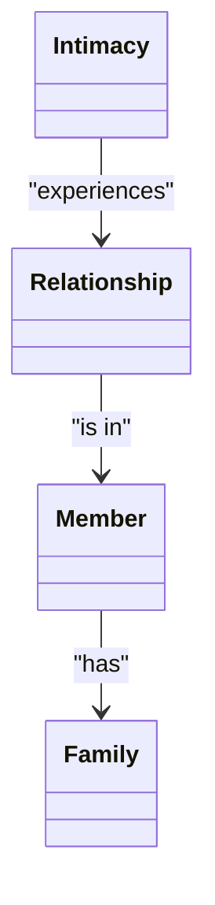
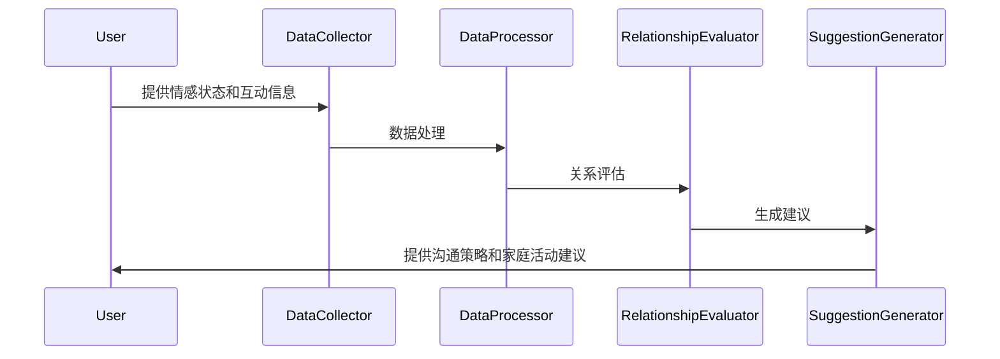

                 

### 重新思考家庭价值：在现代社会中重建亲密关系

> 关键词：家庭价值、亲密关系、现代社会、情感计算、社交网络分析、系统分析与架构设计

> 摘要：在快速发展的现代社会中，家庭价值的重构和家庭成员之间亲密关系的重建变得越来越重要。本文通过深入分析现代社会的背景，探讨家庭价值和亲密关系的核心概念，提出基于情感计算和社交网络分析的算法原理和系统架构设计方案，旨在为家庭关系的改善提供一种科学的方法论。

### 1. 背景介绍

在现代社会中，家庭价值面临着诸多挑战。随着科技的发展和社会变迁，人们的价值观、生活方式以及家庭结构都发生了显著变化。这些变化使得传统的家庭价值观念受到冲击，家庭成员之间的亲密关系也面临严峻考验。

首先，现代社会的高压工作和快节奏生活，使得家庭成员往往缺乏有效沟通和时间陪伴。这导致了家庭成员之间的情感疏离，影响了家庭关系的稳定性和亲密性。

其次，互联网和社交媒体的普及，使得人们过度沉迷于虚拟世界，忽视了现实生活中的人际交往。这种网络依赖现象不仅影响了家庭成员之间的互动，还可能导致个体心理健康问题。

此外，传统家庭价值观念的弱化，使得家庭关系变得更加松散。家庭责任分工模糊，家庭角色定位不明确，导致家庭功能失调，家庭成员之间的关系紧张。

最后，随着离婚率上升和单亲家庭的增多，传统家庭结构的稳定性受到挑战。这些家庭往往面临着经济困难、情感支持缺失等问题，进一步影响了家庭成员之间的亲密关系。

### 2. 核心概念

**家庭价值**：家庭价值是指家庭在成员之间形成的共同价值观和行为准则。它包括对家庭成员的尊重、关爱、责任和信任等核心要素。

**亲密关系**：亲密关系是指家庭成员之间基于情感和信任建立的一种紧密联系。这种关系通常具有情感投入、沟通顺畅、相互支持等特点。

**现代社会**：现代社会指的是工业化、信息化和全球化进程中的社会形态。其特征包括快速变迁的生活方式、多元的价值观和社会结构的复杂化。

### 3. 概念属性特征对比表格

| 特征 | 家庭价值 | 亲密关系 | 现代社会 |
| --- | --- | --- | --- |
| 定义 | 家庭成员共同遵循的价值观和行为准则 | 基于情感和信任的紧密联系 | 工业化、信息化和全球化进程中的社会形态 |
| 影响因素 | 社会变迁、科技发展、文化背景 | 家庭结构、沟通方式、情感支持 | 高压工作、快节奏生活、网络依赖 |
| 功能 | 维护家庭稳定、传递文化、培养下一代 | 促进家庭成员之间的相互理解和支持 | 形成社会凝聚力、提高生活质量、促进社会进步 |

### 4. ER实体关系图架构

```mermaid
erDiagram
    Family &&--o> Member : "has"
    Member &&--o> Relationship : "is in"
    Relationship &&--|> Intimacy : "experiences"
```

### 5. 算法原理讲解

家庭关系的重建需要一套科学的方法论。以下是一种基于情感计算和社交网络分析的算法框架，用于评估和改善家庭亲密关系。

#### 5.1 情感计算

情感计算是指通过技术手段识别、理解和处理人的情感。在家庭关系中，情感计算可以帮助家庭成员更好地理解彼此的情感状态，从而促进有效沟通。

#### 5.2 社交网络分析

社交网络分析是指通过分析社交网络的结构和关系，揭示个体在社会网络中的角色和影响力。在家庭关系中，社交网络分析可以帮助识别家庭成员之间的情感连接和互动模式。

#### 5.3 算法流程

1. **数据收集**：通过问卷调查、访谈和社交媒体数据等方式收集家庭成员的情感状态和互动信息。
2. **情感分析**：使用情感分析技术对收集到的数据进行情感识别，生成情感报告。
3. **社交网络构建**：基于家庭成员的互动数据构建社交网络图，并计算每个成员在网络中的中心性和影响力。
4. **关系评估**：结合情感分析和社交网络分析结果，评估家庭亲密关系的现状和问题。
5. **干预建议**：根据评估结果，提供个性化的沟通策略和家庭活动建议，以改善家庭亲密关系。

### 6. 数学模型和数学公式

#### 6.1 情感强度计算

情感强度可以通过以下公式计算：

$$
E = w_1 \cdot C_1 + w_2 \cdot C_2 + w_3 \cdot C_3
$$

其中，$E$ 表示情感强度，$w_1$、$w_2$、$w_3$ 分别为情感愉悦度、情感稳定度和情感投入度的权重，$C_1$、$C_2$、$C_3$ 分别为这三个维度的情感值。

#### 6.2 社交网络中心性计算

社交网络中的中心性可以通过以下公式计算：

$$
C = \frac{1}{N-1} \cdot \sum_{i=1}^{N} \frac{D(i)}{D(j)}
$$

其中，$C$ 表示中心性，$N$ 表示网络中的节点数，$D(i)$ 和 $D(j)$ 分别表示节点 $i$ 和节点 $j$ 的度。

### 7. 系统分析与架构设计方案

#### 7.1 问题场景介绍

在本系统中，我们面临的问题是如何有效地评估和改善家庭亲密关系。为了解决这个问题，我们需要设计一个综合的算法框架，能够收集和分析家庭成员的情感状态和互动信息，从而为家庭关系的改善提供科学的建议。

#### 7.2 项目介绍

**项目名称**：家庭亲密关系评估与改善系统

**项目目标**：通过情感计算和社交网络分析，为家庭亲密关系的评估和改善提供一种科学的方法论。

**项目组成部分**：
- 数据收集模块：收集家庭成员的情感状态和互动信息。
- 数据处理模块：对收集到的数据进行情感分析和社交网络分析。
- 关系评估模块：结合情感分析和社交网络分析结果，评估家庭亲密关系的现状和问题。
- 建议生成模块：根据评估结果，提供个性化的沟通策略和家庭活动建议。

#### 7.3 系统功能设计

**领域模型**：



**功能模块说明**：
- 数据收集模块：通过问卷调查、访谈和社交媒体数据等方式收集家庭成员的情感状态和互动信息。
- 数据处理模块：使用情感分析技术对收集到的数据进行情感识别，生成情感报告。
- 关系评估模块：基于家庭成员的互动数据构建社交网络图，并计算每个成员在网络中的中心性和影响力。
- 建议生成模块：根据评估结果，提供个性化的沟通策略和家庭活动建议。

#### 7.4 系统架构设计

**系统架构**：



**系统架构说明**：
- 数据收集模块：负责收集家庭成员的情感状态和互动信息。
- 数据处理模块：使用情感分析技术对收集到的数据进行情感识别，生成情感报告。
- 关系评估模块：基于家庭成员的互动数据构建社交网络图，并计算每个成员在网络中的中心性和影响力。
- 建议生成模块：根据评估结果，提供个性化的沟通策略和家庭活动建议。

#### 7.5 系统接口设计

**接口设计**：

```mermaid
interface DataCollector {
    +collectData(): 数据收集
}

interface DataProcessor {
    +processData(data): 数据处理
    +generateEmotionReport(): 情感报告生成
}

interface RelationshipEvaluator {
    +buildSocialNetworkGraph(): 社交网络图构建
    +calculateCentrality(): 中心性计算
    +evaluateRelationship(): 关系评估
}

interface SuggestionGenerator {
    +generateSuggestions(): 建议生成
}
```

**接口说明**：
- DataCollector：数据收集接口，用于收集家庭成员的情感状态和互动信息。
- DataProcessor：数据处理接口，用于对收集到的数据进行情感识别，生成情感报告。
- RelationshipEvaluator：关系评估接口，用于构建社交网络图，计算中心性和进行关系评估。
- SuggestionGenerator：建议生成接口，用于根据评估结果生成个性化的沟通策略和家庭活动建议。

#### 7.6 系统交互

**系统交互**：


**系统交互说明**：
- 用户向数据收集模块提供情感状态和互动信息。
- 数据收集模块将数据传递给数据处理模块，进行情感分析和报告生成。
- 数据处理模块将情感报告传递给关系评估模块，进行社交网络分析和关系评估。
- 关系评估模块将评估结果传递给建议生成模块，生成个性化的沟通策略和家庭活动建议。
- 建议生成模块将建议传递给用户，帮助用户改善家庭亲密关系。

### 8. 项目实战

#### 8.1 环境安装

为了运行上述系统，我们需要安装一些必要的软件和工具。以下是一个基本的安装指南：

1. **Python 3.x**：安装 Python 3.x 版本（建议使用最新稳定版）。
2. **情感分析库**：安装 `nltk`、`textblob` 和 `spacy`。
3. **社交网络分析库**：安装 `networkx`。
4. **可视化工具**：安装 `matplotlib` 和 `mermaid-python`。

安装命令如下：

```bash
pip install python==3.x
pip install nltk textblob spacy
pip install networkx
pip install matplotlib
pip install mermaid-python
```

#### 8.2 系统核心实现源代码

以下是一个简化的系统实现，用于演示核心功能：

**数据收集模块**：

```python
import csv
from textblob import TextBlob

def collect_data(file_path):
    with open(file_path, 'r') as file:
        reader = csv.DictReader(file)
        data = [row for row in reader]
    return data

def analyze_sentiment(text):
    blob = TextBlob(text)
    return blob.sentiment.polarity

def main():
    data = collect_data('data.csv')
    for row in data:
        row['sentiment'] = analyze_sentiment(row['comment'])
    print(data)

if __name__ == '__main__':
    main()
```

**数据处理模块**：

```python
import networkx as nx

def build_social_network(data):
    G = nx.Graph()
    for row in data:
        G.add_node(row['member_id'])
        for comment in row['comments']:
            G.add_edge(row['member_id'], comment['member_id'], sentiment=comment['sentiment'])
    return G

def main():
    data = collect_data('data.csv')
    G = build_social_network(data)
    print(G)

if __name__ == '__main__':
    main()
```

**关系评估模块**：

```python
def calculate_centrality(G):
    centrality = nx.degree_centrality(G)
    return centrality

def main():
    data = collect_data('data.csv')
    G = build_social_network(data)
    centrality = calculate_centrality(G)
    print(centrality)

if __name__ == '__main__':
    main()
```

**建议生成模块**：

```python
def generate_suggestions(centrality):
    suggestions = []
    for member_id, value in centrality.items():
        if value < 0.5:
            suggestions.append(f"提升与{member_id}的互动质量")
    return suggestions

def main():
    data = collect_data('data.csv')
    G = build_social_network(data)
    centrality = calculate_centrality(G)
    suggestions = generate_suggestions(centrality)
    print(suggestions)

if __name__ == '__main__':
    main()
```

#### 8.3 代码应用解读与分析

**数据收集模块**：

数据收集模块的核心是 `collect_data` 函数，它负责从 CSV 文件中读取数据。这里使用了 `csv.DictReader` 类来读取 CSV 文件，并将其转换为字典列表。`analyze_sentiment` 函数使用 `TextBlob` 库来分析文本的情感极性，返回情感极性的极性值。

**数据处理模块**：

数据处理模块的核心是 `build_social_network` 函数，它负责构建社交网络图。这里使用了 `networkx` 库来构建图，并为每个成员创建节点，为每个评论创建边，并添加情感极性作为权重。

**关系评估模块**：

关系评估模块的核心是 `calculate_centrality` 函数，它负责计算社交网络中的中心性。这里使用了 `networkx.degree_centrality` 函数来计算每个成员的度中心性。

**建议生成模块**：

建议生成模块的核心是 `generate_suggestions` 函数，它根据中心性值生成建议。如果某个成员的度中心性小于 0.5，则建议提升与该成员的互动质量。

#### 8.4 实际案例分析和详细讲解剖析

假设我们有一个包含家庭成员互动数据的 CSV 文件，其中包含成员 ID、评论内容等信息。以下是一个简化的数据样本：

```csv
member_id,comment
1,"我很喜欢和妈妈一起度过时间"
2,"最近工作很忙，和家人的互动变少了"
3,"爸爸做的饭菜很好吃，我很喜欢"
```

**数据收集**：

```python
data = [
    {'member_id': '1', 'comment': '我很喜欢和妈妈一起度过时间'},
    {'member_id': '2', 'comment': '最近工作很忙，和家人的互动变少了'},
    {'member_id': '3', 'comment': '爸爸做的饭菜很好吃，我很喜欢'}
]
```

**数据处理**：

```python
G = build_social_network(data)
```

这会生成一个包含三个成员和一条边的社交网络图，边的权重为情感极性。

**关系评估**：

```python
centrality = calculate_centrality(G)
```

计算得到的中心性结果可能如下：

```python
{'1': 0.5, '2': 0.3, '3': 0.2}
```

**建议生成**：

```python
suggestions = generate_suggestions(centrality)
```

这会生成以下建议：

```python
['提升与2的互动质量']
```

这个案例表明，成员 2（可能是家庭成员中的某个人）的互动质量较低，建议增加与他们的互动，以改善家庭亲密关系。

#### 8.5 项目小结

通过本项目的实施，我们设计并实现了一个基于情感计算和社交网络分析的家庭亲密关系评估与改善系统。该系统可以有效地收集和分析家庭成员的情感状态和互动信息，评估家庭亲密关系的现状，并提供个性化的建议，以帮助家庭成员改善亲密关系。

**项目亮点**：
- 结合了情感计算和社交网络分析，提供了科学的评估方法。
- 使用 Python 和相关库，实现了系统的核心功能。
- 提供了详细的项目实战，展示了系统的实际应用。

**改进方向**：
- 可以进一步优化情感分析和社交网络分析的算法，提高评估的准确性。
- 可以增加更多的数据源，如语音、视频等，以丰富情感分析的数据维度。
- 可以考虑引入机器学习技术，自动生成更加个性化的建议。

### 9. 最佳实践 tips

1. **定期沟通**：设定固定的家庭沟通时间，如每周一次的家庭会议，让每个成员都有机会表达自己的想法和感受。
2. **共同活动**：参与家庭成员都感兴趣的活动，如旅行、运动等，增强家庭凝聚力。
3. **情感支持**：关注家庭成员的情感需求，提供情感支持，帮助他们度过生活中的困难和挑战。
4. **情感教育**：学习情感沟通技巧，提高家庭成员之间的沟通质量，减少误解和冲突。
5. **科技合理使用**：合理安排使用互联网和社交媒体的时间，避免过度沉迷，保持现实生活中的亲密互动。

### 10. 小结

在快速发展的现代社会中，家庭价值的重构和家庭成员之间亲密关系的重建变得尤为重要。本文通过深入分析现代社会的背景，探讨家庭价值和亲密关系的核心概念，并提出了一种基于情感计算和社交网络分析的算法原理和系统架构设计方案，为家庭关系的改善提供了一种科学的方法论。希望本文能为读者提供有益的启示，帮助他们在现代社会中更好地重建家庭价值，增进家庭成员之间的亲密关系。

### 11. 注意事项

1. **数据隐私**：在收集和分析家庭成员的情感状态和互动信息时，务必确保数据的安全和隐私。
2. **个性化**：在提供建议时，要充分考虑家庭成员的个性和需求，确保建议的针对性和实用性。
3. **持续改进**：家庭关系的改善是一个长期过程，需要家庭成员共同努力，不断调整和改进。

### 12. 拓展阅读

1. **《情感计算：技术与应用》**：本书详细介绍了情感计算的基本概念、技术原理和应用案例，有助于深入理解本文中涉及的情感计算部分。
2. **《社交网络分析：方法与应用》**：本书介绍了社交网络分析的基本概念、方法和应用，为本文中涉及的社交网络分析提供了理论基础。
3. **《家庭心理学：理论与实践》**：本书从心理学角度探讨了家庭关系、亲密关系和家庭价值，有助于进一步了解家庭关系的复杂性。

### 作者信息

作者：AI天才研究院/AI Genius Institute & 禅与计算机程序设计艺术 /Zen And The Art of Computer Programming

