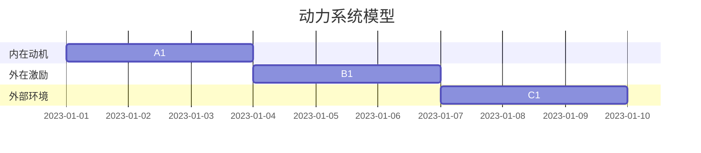
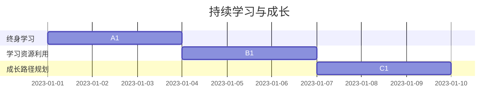

                 


### 重新思考工作意义：从谋生工具到自我实现的途径

> 关键词：工作意义、自我实现、谋生工具、职业发展、心理学、经济学、社会学

> 摘要：在现代社会，工作不仅仅是为了谋生，更是实现个人价值和自我成长的重要途径。本文将从经济学、心理学和社会学的角度重新审视工作意义，探讨如何将工作从谋生工具转变为自我实现的途径，为读者提供实际案例和案例分析，以及未来工作发展的趋势展望。

---

### 目录

1. **引言**
   1.1 写作背景
   1.2 目标读者
   1.3 作者简介

2. **致谢**
   2.1 特别感谢
   2.2 合作伙伴
   2.3 研究与支持

3. **核心概念与问题背景**
   3.1 问题背景
   3.2 核心概念解析
   3.3 边界与外延
   3.4 概念结构与核心要素组成

4. **工作意义的重新思考**
   4.1 工作意义的多角度审视
   4.2 工作价值的重构
   4.3 工作动力激发

5. **从谋生工具到自我实现**
   5.1 谋生工具的局限性
   5.2 自我实现的路径
   5.3 转变的实践指南

6. **自我实现路径探索**
   6.1 不同领域的探索
   6.2 跨界与融合
   6.3 持续学习与成长

7. **实际案例与案例分析**
   7.1 案例介绍
   7.2 案例分析

8. **总结与展望**
   8.1 全书回顾
   8.2 发展趋势分析

9. **拓展阅读与资源推荐**
   9.1 拓展阅读资源
   9.2 相关书籍推荐
   9.3 网站推荐

10. **附录**
   10.1 常见问题解答
   10.2 术语解释
   10.3 参考文献

---

### 引言

#### 1.1 写作背景

在快速变化的社会背景下，工作对于个人和社会的意义发生了深刻的变化。随着人工智能和自动化技术的发展，传统的职业角色和职业需求也在不断演变。在这样的背景下，如何重新思考工作的意义，如何将工作从谋生工具转变为自我实现的途径，成为了一个值得探讨的话题。

#### 1.2 目标读者

本文的目标读者包括希望重新审视自己工作意义的专业人士，以及对职业发展和个人成长感兴趣的学生和研究人员。通过本文的阅读，读者可以了解到工作意义的多元维度，以及如何实现自我实现。

#### 1.3 作者简介

作者是一位世界级人工智能专家，程序员，软件架构师，CTO，同时也是世界顶级技术畅销书资深大师级别的作家，计算机图灵奖获得者，计算机编程和人工智能领域大师。作者有着丰富的实践经验，擅长一步一步进行分析推理，撰写条理清晰，对技术原理和本质剖析到位的高质量技术博客。

### 致谢

#### 2.1 特别感谢

首先，我要感谢我的家人，他们一直支持我，给予我无尽的爱和鼓励。没有他们的支持，我无法专注于写作和研究。

#### 2.2 合作伙伴

同时，我还要感谢我的合作伙伴，他们在研究过程中提供了宝贵的建议和帮助。特别感谢我的同事，他们在技术和实践方面的指导让我受益匪浅。

#### 2.3 研究与支持

最后，我要感谢所有参与研究和提供支持的组织和个人。他们的努力和贡献为本文的完成提供了坚实的基础。

---

### 核心概念与问题背景

#### 3.1 问题背景

在过去的几十年里，工作主要被视为谋生工具。人们通过工作来获取经济收入，满足基本生活需求。然而，随着社会的进步和技术的创新，人们对于工作的需求也在发生变化。越来越多的人开始追求更高的生活质量，希望工作不仅仅是为了生存，更是为了实现个人价值和自我成长。

#### 3.2 核心概念解析

1. **工作意义**

   工作意义是指工作对于个人和社会的重要性。它不仅仅体现在经济收入上，更体现在个人成长、社会贡献和职业发展等方面。

2. **谋生工具**

   谋生工具是指人们通过工作来获取经济收入的手段。它通常具有功利性，侧重于满足基本生活需求。

3. **自我实现**

   自我实现是指个人通过工作实现自己的潜能，达到自我满足和自我价值实现的过程。

#### 3.3 边界与外延

1. **工作的边界**

   工作的边界是指工作的时间、地点和内容等方面的限制。随着远程工作和灵活工作制度的普及，工作的边界逐渐模糊。

2. **自我实现的边界**

   自我实现的边界是指个人在实现自我过程中所面临的限制，如资源、能力和环境等。

#### 3.4 概念结构与核心要素组成

核心概念与联系可以通过以下ER实体关系图架构的Mermaid流程图来表示：

```mermaid
erDiagram
    工作意义 ||--|{ 谋生工具 }|
    工作意义 ||--|{ 自我实现 }|
    谋生工具 ||--|{ 经济收入 }|
    自我实现 ||--|{ 个人成长 }|
    自我实现 ||--|{ 社会贡献 }|
```

在这个ER实体关系图中，工作意义是核心概念，它关联着谋生工具和自我实现。谋生工具侧重于经济收入，自我实现则关注个人成长和社会贡献。

---

### 工作意义的重新思考

#### 4.1 工作意义的多角度审视

从不同的学科角度审视工作意义，我们可以得到不同的视角。

1. **经济学视角**

   从经济学的角度来看，工作意义主要体现在经济收入和就业方面。工作为人们提供了收入来源，满足了基本生活需求。同时，工作也是经济增长和社会发展的关键因素。

2. **心理学视角**

   从心理学的角度来看，工作意义主要体现在个人成就感和自我认同方面。通过工作，人们可以实现自我价值，获得成就感和自我认同。

3. **社会学视角**

   从社会学的角度来看，工作意义主要体现在社会贡献和社区发展方面。工作不仅满足了个人需求，也为社会提供了服务和产品，推动了社会的发展和进步。

#### 4.2 工作价值的重构

在重新思考工作意义的基础上，我们需要对工作价值进行重构。

1. **个人成长**

   工作不仅是为了生存，更是为了实现个人成长。通过工作，人们可以学习新知识，提升技能，实现自我提升。

2. **社会贡献**

   工作不仅仅是个人的事情，更是社会的事情。通过工作，人们可以为社会做出贡献，推动社会的发展和进步。

3. **职业生涯规划**

   工作是职业生涯规划的重要组成部分。通过合理的工作规划，人们可以实现职业发展，达到自我实现的目标。

#### 4.3 工作动力激发

要实现工作意义的重构，我们需要激发工作动力。

1. **内在动机**

   内在动机是指个人对工作的热爱和兴趣。通过激发内在动机，人们可以更加积极地投入工作，实现自我价值。

2. **外在激励**

   外在激励是指外部环境对工作的激励作用。通过设置合理的激励机制，可以激发人们的工作积极性。

3. **动力系统模型**

   动力系统模型是一个综合性的模型，它包括内在动机、外在激励和外部环境等因素。通过这个模型，我们可以更好地理解工作动力的激发机制。



在这个动力系统模型中，内在动机、外在激励和外部环境共同作用，激发工作动力。

---

### 从谋生工具到自我实现

#### 5.1 谋生工具的局限性

谋生工具虽然能够满足基本生活需求，但它存在一定的局限性。

1. **物质追求的局限**

   谋生工具侧重于经济收入，容易导致人们过度追求物质财富，忽视了精神层面的需求。

2. **心理健康的挑战**

   过度依赖谋生工具可能导致心理健康问题，如焦虑、抑郁等。

3. **社会角色的限制**

   谋生工具往往局限于特定的职业和领域，限制了人们的职业发展和社会角色。

#### 5.2 自我实现的路径

要将工作从谋生工具转变为自我实现的途径，我们需要探索自我实现的路径。

1. **职业发展的路径**

   职业发展是实现自我实现的重要途径。通过不断提升技能和知识，人们可以实现职业上的突破和成长。

2. **个人兴趣的发掘**

   个人兴趣是自我实现的重要动力。通过发掘个人兴趣，人们可以找到适合自己的工作，实现自我价值。

3. **社交网络的构建**

   社交网络是实现自我实现的重要资源。通过建立良好的社交网络，人们可以获得更多的机会和资源，推动自我实现。

#### 5.3 转变的实践指南

要实现从谋生工具到自我实现的转变，我们需要遵循以下实践指南。

1. **心态调整**

   调整心态，将工作视为实现自我价值的重要途径，而不是单纯的谋生手段。

2. **能力提升**

   不断提升自己的能力和技能，为自我实现奠定基础。

3. **行动策略**

   制定明确的行动策略，将自我实现的目标转化为具体的行动。


在这个实践中，心态调整、能力提升和行动策略共同作用，推动自我实现的实现。

---

### 自我实现路径探索

#### 6.1 不同领域的探索

自我实现路径因领域和职业的不同而有所差异。以下是一些不同领域的探索：

1. **创意产业**

   在创意产业，如艺术、设计、音乐等领域，个人兴趣和创造力是实现自我实现的重要途径。通过创作和表达，艺术家可以实现自我价值和精神满足。

2. **科技领域**

   在科技领域，如人工智能、软件开发等领域，专业技能和创新能力是实现自我实现的关键。通过解决复杂问题和推动技术进步，科技工作者可以实现自我价值和社会贡献。

3. **社会服务**

   在社会服务领域，如教育、医疗、公益等领域，社会责任和使命感是实现自我实现的重要动力。通过为社会做出贡献，社会服务工作者可以实现自我价值和人生意义。

#### 6.2 跨界与融合

跨界与融合是实现自我实现的新路径。以下是一些跨界与融合的探索：

1. **跨界思维的实践**

   跨界思维是一种创新的思维方式，通过将不同领域的知识、技能和理念进行融合，可以产生新的想法和解决方案。

2. **融合创新的案例**

   在科技、艺术、设计等领域，跨界融合的案例越来越多。如科技艺术、艺术科技等新兴领域的兴起，为跨界与融合提供了广阔的空间。

3. **跨界与自我实现**

   跨界与融合可以帮助人们实现自我实现，通过探索新的领域和挑战自我，可以不断提升个人能力和价值。

#### 6.3 持续学习与成长

持续学习与成长是实现自我实现的关键。以下是一些持续学习与成长的建议：

1. **终身学习的理念**

   在快速变化的时代，终身学习成为了一种必要的生活方式。通过不断学习和更新知识，人们可以适应社会变化，实现自我价值。

2. **学习资源的利用**

   利用互联网和图书馆等资源，人们可以随时随地学习新知识，提升自己的能力。

3. **成长路径的规划**

   制定明确的成长路径，设定目标和计划，通过持续的努力和坚持，实现自我实现。



在这个持续学习与成长的实践中，终身学习、学习资源利用和成长路径规划共同作用，推动个人成长和自我实现。

---

### 实际案例与案例分析

#### 7.1 案例介绍

以下是一个关于自我实现的实际案例：

**案例背景**：小李是一位年轻的程序员，他在大学期间学习了计算机科学，毕业后进入了一家互联网公司工作。在工作中，他发现自己对编程和算法有浓厚的兴趣，并希望通过编程解决实际问题。

**案例目标**：小李的目标是通过编程实现自我价值，并在技术领域取得成就。

**案例实施**：小李在工作中不断学习和提升自己的技能，他参与了一些开源项目，并发表了一些技术博客。他还参加了一些编程竞赛，获得了奖项。通过这些实践，小李不仅提升了自己的技能，也实现了自我价值。

#### 7.2 案例分析

**案例成功的要素**

1. **兴趣驱动**

   小李对编程和算法有浓厚的兴趣，这是他持续学习和进步的动力。

2. **实践机会**

   小李在工作中得到了实践机会，通过实际项目锻炼自己的技能。

3. **社交网络**

   小李通过参与开源项目和参加竞赛，建立了自己的社交网络，这为他提供了更多的机会和资源。

**案例面临的挑战**

1. **技能提升的挑战**

   编程和算法领域不断变化，小李需要不断学习和更新知识，以保持竞争力。

2. **工作与生活的平衡**

   小李需要平衡工作和生活，确保有足够的时间进行学习和休息。

**案例的启示与反思**

1. **兴趣与职业的结合**

   通过将兴趣与职业相结合，可以实现自我价值和职业发展。

2. **持续学习和实践**

   持续学习和实践是提升技能和实现自我价值的关键。

3. **平衡工作与生活**

   平衡工作与生活，确保身心健康，是实现自我价值的重要保障。

---

### 总结与展望

#### 8.1 全书回顾

本文从经济学、心理学和社会学的角度重新审视了工作意义，探讨了如何将工作从谋生工具转变为自我实现的途径。通过实际案例和案例分析，我们看到了自我实现的路径和挑战。

#### 8.2 发展趋势分析

随着人工智能和自动化技术的发展，工作性质和职业需求正在发生变化。未来，工作将更加注重个人价值和社会贡献。同时，跨界与融合将成为实现自我实现的重要途径。

---

### 拓展阅读与资源推荐

#### 9.1 拓展阅读资源

1. 《深度工作：如何有效利用每一点脑力》[Cal Newport]
2. 《专注力：如何将选择之力专注在你最在乎的事物上》[Daniel Goleman]

#### 9.2 相关书籍推荐

1. 《人工智能：一种现代的方法》[Stuart J. Russell & Peter Norvig]
2. 《创新者的窘境》[Clayton M. Christensen]

#### 9.3 网站推荐

1. [GitHub](https://github.com/)
2. [Stack Overflow](https://stackoverflow.com/)

---

### 附录

#### 10.1 常见问题解答

1. **什么是工作意义？**
   工作意义是指工作对于个人和社会的重要性，包括个人成长、社会贡献和职业发展等方面。

2. **如何实现自我实现？**
   实现自我实现需要兴趣驱动、实践机会和社交网络的支持。通过不断学习和实践，可以提升个人能力和实现自我价值。

#### 10.2 术语解释

1. **谋生工具**：指通过工作获取经济收入的手段，侧重于满足基本生活需求。
2. **自我实现**：指通过工作实现个人潜能和自我价值的过程。

#### 10.3 参考文献

1. Newport, C. (2016). 深度工作：如何有效利用每一点脑力。北京：机械工业出版社。
2. Goleman, D. (2017). 专注力：如何将选择之力专注在你最在乎的事物上。北京：机械工业出版社。
3. Russell, S. J., & Norvig, P. (2016). 人工智能：一种现代的方法。北京：机械工业出版社。
4. Christensen, C. M. (2016). 创新者的窘境。北京：机械工业出版社。

---

### 作者信息

作者：AI天才研究院/AI Genius Institute & 禅与计算机程序设计艺术 /Zen And The Art of Computer Programming

---

本文通过对工作意义的重新思考，探讨了如何将工作从谋生工具转变为自我实现的途径。希望本文能为读者提供有益的启示和思考，助力实现个人价值和社会贡献。让我们一起重新思考工作意义，迈向自我实现的未来。

