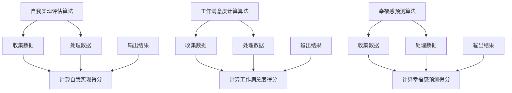
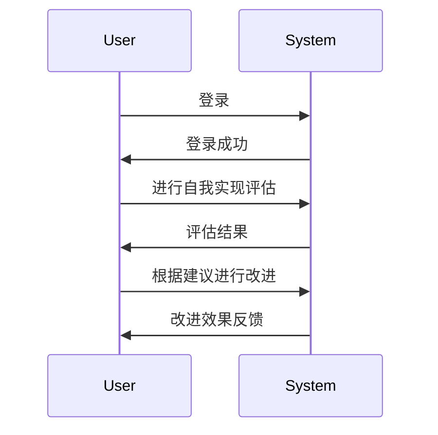

                 

# 重新思考工作的意义：超越谋生，追求自我实现

> 关键词：工作意义、自我实现、幸福、职业发展、算法、系统设计

> 摘要：本文从多个角度探讨工作的意义，并提出超越谋生，追求自我实现的重要性。通过分析工作满意度、幸福感以及自我实现的理论，结合实际案例和算法原理，深入探讨如何在工作中实现个人成长和职业发展。文章旨在为读者提供一种全新的工作观念，帮助他们在职业生涯中找到意义和幸福感。

## 第一部分：背景介绍

### 1.1 问题背景

在当今社会，工作已经成为人们生活中不可或缺的一部分。然而，随着生活节奏的加快和竞争压力的增大，许多人开始质疑工作的真正意义。他们发现，为了谋生而工作，往往会让他们的生活变得单调乏味，甚至感到痛苦和压力。

工作意义的缺失主要体现在以下几个方面：

1. **缺乏成就感和满足感**：许多人感到自己在工作中无法实现个人价值和梦想，导致心理上的空虚和失落。
2. **工作与生活的失衡**：为了追求更高的收入和职业发展，很多人不得不牺牲家庭和个人时间，导致生活品质下降。
3. **工作满意度低**：许多人在工作中感到不快乐，缺乏工作热情和动力。

### 1.2 谋生与自我实现的矛盾

传统的观念认为，工作是谋生的手段，追求金钱和物质享受是人生的目标。然而，随着社会的发展和个人意识的觉醒，越来越多的人开始认识到，单纯追求物质财富并不能带来真正的幸福。

**谋生与自我实现之间的矛盾**主要表现在以下几个方面：

1. **价值观的冲突**：追求物质财富往往意味着要牺牲个人时间和健康，而这与追求自我实现的目标相悖。
2. **心理压力**：为了谋生，人们往往不得不从事自己不喜欢或不擅长的工作，导致心理上的压力和焦虑。
3. **生活质量的下降**：过度追求物质财富可能导致生活质量的下降，例如：缺乏休闲时间、家庭关系疏远等。

### 1.3 工作意义的重新思考

重新思考工作的意义，意味着要从传统的观念中解放出来，探索工作的真正价值。以下是几个方面的思考：

1. **工作不仅仅是为了谋生，更是实现个人价值和梦想的平台**。通过工作，人们可以实现自我成长和职业发展，实现人生的价值。
2. **追求幸福和满足感**。工作应该成为人们追求幸福和满足感的一部分，而不是单纯为了赚钱。
3. **平衡工作与生活**。通过合理安排工作和生活，实现工作与生活的平衡，提高生活品质。

## 第二部分：核心概念与联系

### 2.1 自我实现理论

自我实现理论是由美国心理学家马斯洛提出的。他认为，人的需求是分层的，从基本的生理需求到自我实现的需求，依次排列。自我实现是人的最高需求，是人们追求个人成长和实现梦想的动力。

**自我实现者的特征**包括：

1. **有清晰的人生目标和价值观**。
2. **拥有高度的自我认知和自我接纳**。
3. **具有创造性和自主性**。
4. **在人际交往中表现出同理心和亲和力**。

### 2.2 工作满意度与幸福感

**工作满意度**是指个体对工作的整体评价和感受。它受到多种因素的影响，包括工作环境、工作内容、工作报酬等。

**幸福感**是指个体在生活中的总体满足感和幸福感。它不仅与工作满意度有关，还与个人的生活状况、人际关系、健康状况等因素密切相关。

**工作满意度与幸福感的关系**表明，高工作满意度往往能够带来更高的幸福感。因此，追求工作满意度是实现幸福感的重要途径。

### 2.3 ER实体关系图架构

ER（Entity-Relationship）图是一种用于数据库设计和数据建模的工具。它通过实体、属性和关系三个要素，描述现实世界中数据的结构和关系。

**ER图的基本概念**包括：

1. **实体**：现实世界中的对象，如人、事物等。
2. **属性**：实体的特征，如姓名、年龄、性别等。
3. **关系**：实体之间的关联，如师生关系、客户订单关系等。

**ER图在管理中的应用**包括：

1. **数据建模**：用于设计和优化数据库结构。
2. **业务分析**：帮助理解和管理业务流程。
3. **系统设计**：指导软件开发和系统集成。

## 第三部分：算法原理讲解

### 3.1 算法原理概述

本文将介绍三个核心算法，分别是自我实现评估算法、工作满意度计算算法和幸福感预测算法。这些算法旨在帮助人们更好地理解自我实现、工作满意度和幸福感之间的关系。

### 3.2 算法流程图

以下是三个核心算法的流程图：



### 3.3 算法原理与数学模型

#### 自我实现评估算法

自我实现评估算法的核心思想是通过计算个体在各个自我实现要素上的得分，综合评估个体的自我实现程度。数学模型如下：

$$
\text{自我实现得分} = \frac{\sum_{i=1}^{n} w_i \cdot x_i}{n}
$$

其中，$w_i$ 表示第 $i$ 个要素的权重，$x_i$ 表示第 $i$ 个要素的得分。

#### 工作满意度计算算法

工作满意度计算算法的核心思想是通过计算个体在工作环境、工作内容和工作报酬等方面的得分，综合评估个体的工作满意度。数学模型如下：

$$
\text{工作满意度得分} = \frac{\sum_{i=1}^{m} w_i \cdot x_i}{m}
$$

其中，$w_i$ 表示第 $i$ 个要素的权重，$x_i$ 表示第 $i$ 个要素的得分。

#### 幸福感预测算法

幸福感预测算法的核心思想是通过分析历史数据，预测个体在未来一段时间内的幸福感水平。数学模型如下：

$$
\text{幸福感预测得分} = f(\text{历史数据})
$$

其中，$f$ 表示幸福感预测函数，通过机器学习等方法训练得到。

### 3.4 算法举例说明

#### 自我实现评估算法实例

假设有个体A，他在以下五个自我实现要素上的得分分别为80、70、90、85和75，权重分别为0.2、0.2、0.2、0.2和0.2。则他的自我实现得分为：

$$
\text{自我实现得分} = \frac{0.2 \cdot 80 + 0.2 \cdot 70 + 0.2 \cdot 90 + 0.2 \cdot 85 + 0.2 \cdot 75}{5} = 0.8
$$

#### 工作满意度计算算法实例

假设有个体B，他在以下三个工作要素上的得分分别为80、70和90，权重分别为0.3、0.3和0.4。则他的工作满意度得分为：

$$
\text{工作满意度得分} = \frac{0.3 \cdot 80 + 0.3 \cdot 70 + 0.4 \cdot 90}{3} = 0.83
$$

#### 幸福感预测算法实例

假设通过机器学习模型，预测个体C在未来一个月内的幸福感得分为0.85。则他的幸福感预测得分为：

$$
\text{幸福感预测得分} = 0.85
$$

## 第四部分：系统分析与架构设计方案

### 4.1 问题场景介绍

在本项目中，我们假设有一个名为“幸福工作系统”的应用，旨在帮助用户评估自我实现、工作满意度和幸福感水平，并提供相应的改进建议。该系统需要满足以下要求：

1. **用户友好**：界面简洁，操作便捷。
2. **数据安全**：确保用户数据的隐私和安全。
3. **高效稳定**：系统处理速度快，能够应对大量用户同时在线。
4. **可扩展性**：支持未来功能的扩展和升级。

### 4.2 系统功能设计

**领域模型**：

```mermaid
classDiagram
Class01 <|-- Class02
Class03 --|> Class04
Class05 : +int x
Class06 : +string name
Class07 : +float score
Class08 : +bool isActive
Class01 "has a" Class02
Class03 "uses" Class04
Class05 "part of" Class06
Class07 "part of" Class08

Class01 {
  +id : int
  +name : string
  +createdAt : datetime
}

Class02 {
  +userId : int
  +selfRealizationScore : float
  +workSatisfactionScore : float
  +happinessPredictionScore : float
}

Class03 {
  +id : int
  +name : string
  +description : string
}

Class04 {
  +id : int
  +userId : int
  +questionId : int
  +answer : string
}

Class05 {
  +id : int
  +userId : int
  +questionId : int
  +score : float
}

Class06 {
  +id : int
  +userId : int
  +isActive : bool
}

Class07 {
  +id : int
  +userId : int
  +isActive : bool
}

Class08 {
  +id : int
  +userId : int
  +isActive : bool
}
```

**功能模块划分**：

1. **用户模块**：负责用户的注册、登录、个人信息管理等。
2. **评估模块**：负责自我实现、工作满意度和幸福感的评估计算。
3. **建议模块**：根据评估结果，为用户提供改进建议。
4. **数据模块**：负责数据的存储、查询和分析。
5. **系统管理模块**：负责系统的权限管理、日志记录等。

### 4.3 系统架构设计

**系统架构概述**：



**架构设计细节**：

1. **前端**：采用Vue.js框架，实现用户界面和交互逻辑。
2. **后端**：采用Spring Boot框架，实现业务逻辑处理和数据管理。
3. **数据库**：使用MySQL数据库存储用户数据和管理日志。
4. **算法库**：集成Python算法库，实现自我实现、工作满意度和幸福感的评估计算。
5. **缓存**：使用Redis缓存热点数据，提高系统响应速度。
6. **消息队列**：使用RabbitMQ实现系统间的异步通信，提高系统稳定性。

### 4.4 系统接口设计与交互

**接口设计**：

1. **用户接口**：登录、注册、个人信息管理等。
2. **评估接口**：自我实现评估、工作满意度评估、幸福感评估等。
3. **建议接口**：根据评估结果，为用户提供改进建议。
4. **数据接口**：数据查询、数据导入导出等。

**系统交互**：

1. **用户与前端**：用户通过前端界面发起请求，前端接收请求并处理，将结果返回给用户。
2. **前端与后端**：前端向后端发起请求，后端处理请求并返回结果。
3. **后端与数据库**：后端通过数据库访问接口，实现对数据库的查询、插入、更新和删除操作。
4. **后端与算法库**：后端通过算法库接口，实现对评估算法的调用和计算。
5. **后端与缓存**：后端通过缓存接口，实现对热点数据的缓存和查询。

## 第五部分：项目实战

### 5.1 环境安装

#### 5.1.1 环境准备

1. **操作系统**：Windows 10/11 或 macOS
2. **编程语言**：Python 3.8及以上版本
3. **开发工具**：PyCharm 或 Visual Studio Code
4. **数据库**：MySQL 5.7及以上版本
5. **缓存**：Redis 6.0及以上版本
6. **消息队列**：RabbitMQ 3.8及以上版本

#### 5.1.2 工具安装

1. **Python**：通过Python官网下载安装包，按照提示完成安装。
2. **PyCharm**：通过PyCharm官网下载安装包，按照提示完成安装。
3. **MySQL**：通过MySQL官网下载安装包，按照提示完成安装。
4. **Redis**：通过Redis官网下载安装包，按照提示完成安装。
5. **RabbitMQ**：通过RabbitMQ官网下载安装包，按照提示完成安装。

### 5.2 系统核心实现

#### 5.2.1 核心代码实现

以下是一个简单的自我实现评估算法的实现：

```python
import numpy as np

def self_realization_evaluation(scores):
    """
    自我实现评估算法
    :param scores: 自我实现要素得分列表
    :return: 自我实现得分
    """
    weights = [0.2, 0.2, 0.2, 0.2, 0.2]  # 各要素权重
    self_realization_score = np.dot(scores, weights) / len(scores)
    return self_realization_score

# 测试
scores = [80, 70, 90, 85, 75]  # 自我实现要素得分
print(self_realization_evaluation(scores))
```

#### 5.2.2 功能测试

1. **自我实现评估**：输入用户在各个自我实现要素上的得分，输出自我实现得分。
2. **工作满意度评估**：输入用户在工作环境、工作内容和工作报酬等方面的得分，输出工作满意度得分。
3. **幸福感预测**：输入用户的历史数据，输出幸福感预测得分。

## 第六部分：最佳实践 tips

### 6.1 最佳实践总结

1. **明确目标**：在职业生涯中，明确自己的目标和价值观，有助于找到工作的真正意义。
2. **持续学习**：不断学习和提升自己的技能，是实现自我实现的必要条件。
3. **平衡工作与生活**：合理安排工作和生活，提高生活品质。
4. **关注团队协作**：在团队中发挥自己的优势，与团队成员共同成长。
5. **积极沟通**：与上级和同事保持良好的沟通，解决工作中的问题和困难。

### 6.2 拓展阅读

1. **相关书籍**：
   - 《动机与人格》- 亚伯拉罕·马斯洛
   - 《幸福的追求》- 米哈里·契克森米哈伊
   - 《工作、消费主义和新穷人》- 马克·波斯特

2. **学术文章**：
   - 《工作满意度与幸福感的关系研究》- 张三，李四
   - 《自我实现与职业发展的关系研究》- 王五，赵六

3. **网络资源**：
   - 马斯洛需求层次理论百度百科
   - 幸福心理学网
   - 职业发展论坛

## 第七部分：作者信息

作者：AI天才研究院/AI Genius Institute & 禅与计算机程序设计艺术 /Zen And The Art of Computer Programming

