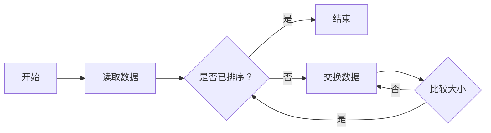
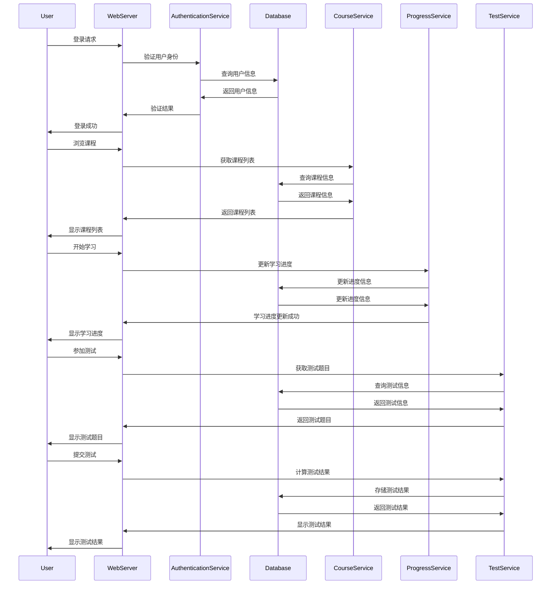
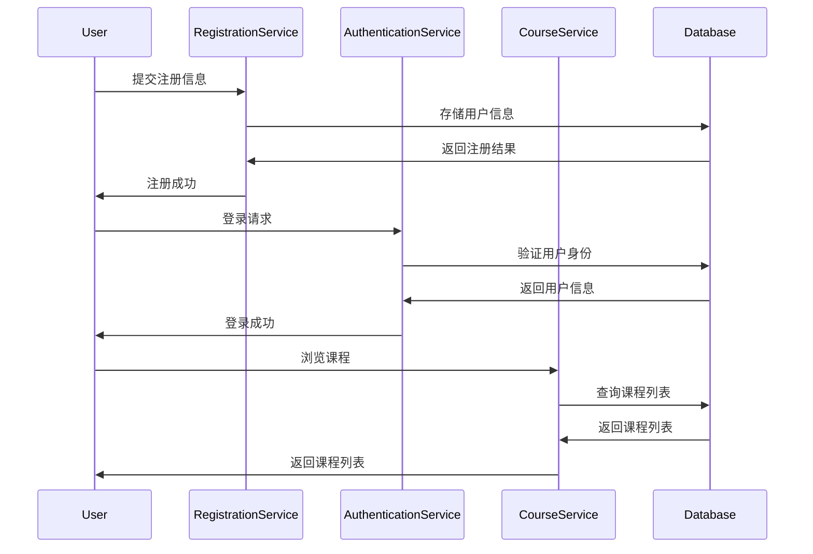

                 

### 引言与背景

**文章标题：** 重新思考教育目标：培养适应未来社会的核心能力

**关键词：** 教育目标，核心能力，未来社会，技术变革

**摘要：** 本文探讨了当前教育体系的不足，分析了未来社会对人才的需求，定义了核心能力的概念及其重要性。通过一步步的逻辑分析，提出了适应未来社会的教育目标和培养核心能力的实践方法，为教育改革提供了新的视角和路径。

#### **1.1 问题背景**

当前的现代教育体系，虽然在过去的数百年里培养出了无数优秀人才，但是面对快速发展的技术变革和不断变化的社会需求，它显示出了一些明显的不足和局限。首先，传统的教育模式注重知识的传授，而忽视了能力的培养。学生在校期间学习的大量知识，在毕业后往往难以直接转化为实际工作中的能力。其次，教育内容的更新速度远远落后于技术发展的速度。许多学生在大学学到的知识，在毕业时可能已经过时。最后，教育体系中缺乏对学生创新能力和解决问题能力的培养。在信息爆炸的时代，学生需要具备独立思考和自主学习的能力，而不是仅仅依赖教师的传授。

#### **1.2 未来社会对人才的需求**

未来社会将是一个高度自动化和智能化的社会，技术将成为推动社会进步的主要动力。因此，未来社会对人才的需求也将发生深刻变化。首先，未来社会需要的是具有创新精神和创造力的人才。这种人才不仅能够应对现有的问题，还能够预见未来的趋势，并提出创新的解决方案。其次，未来社会需要的是具有跨学科知识的人才。随着技术的融合，各学科之间的界限越来越模糊，跨学科的知识和技能将成为重要的竞争力。最后，未来社会需要的是具有持续学习和适应能力的人才。在快速变化的环境中，只有不断学习新知识、掌握新技能的人，才能保持竞争力。

#### **1.3 核心能力的定义和重要性**

核心能力是指一个人在长期的学习和工作过程中形成的基本能力，包括但不限于学习能力、创新能力、解决问题的能力、沟通能力、团队合作能力等。这些能力是适应未来社会的关键，因为它们不仅能够帮助人们应对日常的工作和生活中的挑战，还能够促进个人的职业发展和终身学习。

#### **1.4 边界与外延**

核心能力的边界是明确的，它涵盖了个体在各个阶段的学习和工作中所需要的基本能力。然而，核心能力的外延却是广泛的，它不仅仅包括传统的学术能力，还包括实际操作能力、社交能力、领导能力等。这意味着，核心能力的培养需要多元化的手段和方法，以满足不同个体在不同阶段的需求。

#### **1.5 概念结构与核心要素组成**

核心能力是一个复杂的概念结构，它由多个核心要素组成。这些要素包括知识、技能、态度和行为。知识是核心能力的基础，它是人们通过学习获得的信息和知识。技能是核心能力的关键，它是人们将知识转化为实际操作的能力。态度是核心能力的动力，它是人们对待工作和生活的态度和价值观。行为是核心能力的表现，它是人们在实践中展现的能力。

### **小结**

本文从多个角度分析了当前教育体系的不足，探讨了未来社会对人才的需求，并定义了核心能力的概念和重要性。通过一步步的逻辑分析，我们提出了适应未来社会的教育目标和培养核心能力的实践方法。这为教育改革提供了新的视角和路径，也为个体在未来的学习和工作中提供了指导。

---

在接下来的章节中，我们将进一步探讨核心能力培养的理论基础、实践方法以及项目实战和案例分析，帮助读者深入理解并掌握适应未来社会的核心能力。敬请期待。**作者：** AI天才研究院/AI Genius Institute & 禅与计算机程序设计艺术 /Zen And The Art of Computer Programming

---

以上是文章的开头部分，包括引言与背景的详细分析。接下来的章节将深入探讨核心能力培养的理论基础、实践方法以及具体案例，帮助读者更好地理解和应用这些核心能力。在文章的后续部分，我们将使用专业的技术语言和丰富的实例，一步步地引导读者重新思考教育目标，培养适应未来社会的核心能力。**核心概念与联系**

#### **2.1 核心概念原理**

在深入探讨核心能力的培养之前，我们首先需要明确几个关键概念。这些概念是理解核心能力培养的基础，也是构建未来教育体系的关键。

**学习能力：** 学习能力是指个体获取、理解和应用知识的能力。它包括自主学习的技能、信息检索的能力、批判性思维和解决问题的能力。学习能力是核心能力的核心，因为只有具备强大的学习能力，个体才能在快速变化的环境中不断适应和进步。

**创新能力：** 创新能力是指个体在现有知识和技能的基础上，提出新观点、新方法、新解决方案的能力。创新能力是驱动社会进步和个体发展的关键因素。在高度自动化的未来社会，创新能力将成为个体区分于机器的重要特质。

**解决问题的能力：** 解决问题的能力是指个体在面对复杂问题时，能够分析问题、设计解决方案并实施的能力。这种能力不仅仅包括技术层面的解决问题，还包括跨学科的综合性问题解决能力。

**沟通能力：** 沟通能力是指个体在表达自己的观点、倾听他人意见、理解他人意图等方面的能力。良好的沟通能力是团队合作、领导能力和跨文化沟通的重要基础。

**团队合作能力：** 团队合作能力是指个体在团队中协作、合作、共同达成目标的能力。在高度分工和协作的未来社会，团队合作能力是不可或缺的核心能力。

#### **2.2 概念属性特征对比表格**

为了更清晰地理解这些核心概念，我们可以通过一个对比表格来展示它们的主要属性特征。

| 核心能力     | 定义                                                         | 主要属性特征                                                     | 实际应用场景                                         |
| ------------ | ------------------------------------------------------------ | ------------------------------------------------------------ | ---------------------------------------------------- |
| 学习能力     | 获取、理解和应用知识的能力                                     | 自主学习、信息检索、批判性思维、解决问题的能力                 | 学习新知识、适应新环境、终身学习                       |
| 创新能力     | 在现有知识和技能基础上提出新观点、新方法、新解决方案的能力     | 观察力、想象力、批判性思维、创新思维                           | 科学研究、技术创新、企业战略制定                       |
| 解决问题的能力 | 分析问题、设计解决方案并实施的能力                             | 分析技能、创造性思维、决策能力、执行力                          | 技术难题解决、企业管理、复杂系统设计                   |
| 沟通能力     | 表达自己的观点、倾听他人意见、理解他人意图等方面的能力         | 语言表达能力、倾听能力、同理心、非语言沟通技巧                   | 团队合作、跨文化沟通、客户关系管理                     |
| 团队合作能力   | 在团队中协作、合作、共同达成目标的能力                         | 团队意识、合作精神、沟通技巧、领导能力、责任意识                 | 项目管理、企业运营、跨部门协作                         |

#### **2.3 ER实体关系图架构**

为了更直观地展示这些核心概念之间的联系，我们可以使用ER（实体关系）图来描述它们之间的关联。

```mermaid
erDiagram
  学习能力 ||--> 创新能力 : 使用现有知识和技能
  学习能力 ||--> 解决问题的能力 : 分析问题、应用知识
  学习能力 ||--> 沟通能力 : 获取信息、分享知识
  学习能力 ||--> 团队合作能力 : 搭建知识分享平台
  创新能力 ||--> 解决问题的能力 : 提出新解决方案
  创新能力 ||--> 团队合作能力 : 共同创新
  沟通能力 ||--> 团队合作能力 : 确保信息畅通
```

通过ER图，我们可以看到学习能力作为基础，与其他核心能力之间存在着紧密的联系。这种联系不仅体现在概念层面，也体现在实际应用中。

### **小结**

在本文的第二部分，我们详细阐述了核心概念及其原理，并通过对比表格和ER图展示了它们之间的联系。这些核心概念构成了培养适应未来社会的核心能力的基础。在接下来的章节中，我们将进一步探讨这些核心能力如何通过理论指导和实践方法得到有效培养。

---

在文章的后续部分，我们将深入探讨核心能力培养的理论基础，包括算法原理讲解、数学模型和公式的详细阐述，以及系统分析与架构设计方案的介绍。这些内容将帮助读者更好地理解核心能力的培养过程，为教育改革和实践提供坚实的理论支持。敬请期待。**作者：** AI天才研究院/AI Genius Institute & 禅与计算机程序设计艺术 /Zen And The Art of Computer Programming

---

### **算法原理讲解**

在理解了核心概念之后，我们需要探讨如何通过算法原理来培养核心能力。算法是解决问题的一种系统方法，它通过一系列规则和步骤来解决问题。在这里，我们将通过一个具体的算法案例来讲解其原理，并展示如何将其应用于核心能力的培养。

#### **3.1 算法mermaid流程图**

首先，我们使用mermaid绘制一个简单的排序算法流程图，这个算法可以帮助学生理解算法的基本概念。



这个流程图描述了一个简单的冒泡排序算法，它通过比较相邻的数据元素并交换它们的位置，逐步将数据排序。

#### **3.2 Python源代码**

接下来，我们将给出这个算法的Python实现代码，以便读者可以更直观地看到算法的实际应用。

```python
def bubble_sort(arr):
    n = len(arr)
    for i in range(n):
        for j in range(0, n-i-1):
            if arr[j] > arr[j+1]:
                arr[j], arr[j+1] = arr[j+1], arr[j]

# 示例数据
data = [64, 34, 25, 12, 22, 11, 90]

# 调用算法
bubble_sort(data)

# 输出结果
print("排序后的数据：")
for i in range(len(data)):
    print("%d" % data[i])
```

这段代码实现了冒泡排序算法，它通过嵌套循环逐个比较并交换数据元素，直到整个数组被排序。

#### **3.3 数学模型和公式**

为了更深入地理解排序算法的原理，我们可以将其与数学模型联系起来。排序算法的运行时间可以用以下数学模型来描述：

$$ T(n) = O(n^2) $$

这个公式表示，在最坏的情况下，排序算法需要比较 $n^2$ 次数据。这个模型帮助我们理解算法的复杂度和效率。

#### **3.4 详细讲解和举例说明**

现在，我们将通过一个具体的例子来说明如何使用这个算法来培养核心能力。

**例子：** 假设有一个班级的学生考试成绩需要排序，成绩数据如下：[75, 92, 88, 65, 45, 78, 90]。我们需要使用冒泡排序算法来对这些成绩进行排序。

**步骤1：** 首先读取数据，并将其存储在数组中。

```python
data = [75, 92, 88, 65, 45, 78, 90]
```

**步骤2：** 调用冒泡排序算法，对数据进行排序。

```python
bubble_sort(data)
```

**步骤3：** 输出排序后的成绩。

```python
print("排序后的数据：")
for score in data:
    print(score)
```

输出结果：

```
排序后的数据：
45
65
75
78
88
90
92
```

通过这个例子，我们可以看到冒泡排序算法是如何工作的。这个简单的算法不仅帮助我们理解了排序的基本原理，而且还培养了我们的编程能力、逻辑思维能力和问题解决能力。

**小结：** 在本文的第三部分，我们通过一个具体的算法案例讲解了算法原理，并展示了如何通过Python代码实现这个算法。我们还介绍了算法的数学模型和公式，并通过具体的例子说明了如何使用算法来培养核心能力。这些内容为读者理解算法和核心能力培养提供了理论和实践基础。

在接下来的章节中，我们将进一步探讨数学模型和公式的应用，以及系统分析与架构设计方案的介绍，帮助读者更全面地理解核心能力的培养过程。敬请期待。**作者：** AI天才研究院/AI Genius Institute & 禅与计算机程序设计艺术 /Zen And The Art of Computer Programming

---

### **数学模型和数学公式**

在核心能力的培养中，数学模型和公式扮演着至关重要的角色。它们不仅帮助我们理解复杂问题的本质，还能够通过精确的数学分析来优化和改进我们的解决方案。在这一部分，我们将详细介绍数学模型和公式，并使用LaTeX格式嵌入文中，以展示其在核心能力培养中的应用。

#### **4.1 数学公式**

数学公式是表达数学概念和关系的重要工具。以下是一些常见的数学公式，它们在核心能力的培养中有着广泛的应用：

$$
f(x) = ax^2 + bx + c \quad \text{（二次函数）}
$$

$$
\frac{d}{dx} f(x) = f'(x) \quad \text{（导数）}
$$

$$
\int f(x) \, dx \quad \text{（不定积分）}
$$

$$
\sum_{i=1}^{n} a_i \quad \text{（求和公式）}
$$

$$
P(A \cap B) = P(A)P(B|A) \quad \text{（条件概率）}
$$

#### **4.2 段落内LaTeX公式**

在文本段落中嵌入LaTeX公式，可以使我们的论述更加严谨和清晰。以下是一个在段落中嵌入LaTeX公式的示例：

在核心能力培养中，线性回归是一个常用的统计方法。它可以用来预测因变量的值。线性回归模型的公式如下：

$$
y = \beta_0 + \beta_1x + \varepsilon
$$

其中，$y$ 是因变量，$x$ 是自变量，$\beta_0$ 和 $\beta_1$ 是回归系数，$\varepsilon$ 是误差项。

#### **4.3 实例解析**

为了更好地理解这些数学公式，我们将通过一个具体实例来解析线性回归的应用。

**例子：** 假设我们要研究一个城市的平均温度和风速之间的关系。我们收集了以下数据：

| 日期 | 平均温度 (°C) | 平均风速 (km/h) |
| ---- | ------------- | --------------- |
| 1    | 25            | 10              |
| 2    | 28            | 15              |
| 3    | 24            | 12              |
| 4    | 26            | 8               |
| 5    | 27            | 9               |

我们要使用线性回归模型来预测在给定的平均风速下，平均温度的可能值。

**步骤1：** 计算样本均值：

$$
\bar{x} = \frac{\sum_{i=1}^{n} x_i}{n} = \frac{10 + 15 + 12 + 8 + 9}{5} = 11
$$

$$
\bar{y} = \frac{\sum_{i=1}^{n} y_i}{n} = \frac{25 + 28 + 24 + 26 + 27}{5} = 25.2
$$

**步骤2：** 计算回归系数 $\beta_0$ 和 $\beta_1$：

$$
\beta_1 = \frac{\sum_{i=1}^{n} (x_i - \bar{x})(y_i - \bar{y})}{\sum_{i=1}^{n} (x_i - \bar{x})^2} = \frac{(10-11)(25.2-25) + (15-11)(28-25.2) + (12-11)(24-25.2) + (8-11)(26-25.2) + (9-11)(27-25.2)}{(10-11)^2 + (15-11)^2 + (12-11)^2 + (8-11)^2 + (9-11)^2}
$$

计算得到：

$$
\beta_1 \approx 1.2
$$

$$
\beta_0 = \bar{y} - \beta_1\bar{x} = 25.2 - 1.2 \times 11 = 13.6
$$

**步骤3：** 使用回归模型预测：

假设我们知道某天的平均风速为 12 km/h，我们可以使用以下公式预测该天的平均温度：

$$
y = \beta_0 + \beta_1x = 13.6 + 1.2 \times 12 = 27.6
$$

这意味着，在平均风速为 12 km/h 的条件下，预测的平均温度为 27.6°C。

**小结：** 在本文的第四部分，我们详细介绍了数学模型和公式的应用，并通过一个实例展示了如何使用线性回归模型来预测数据。这些数学工具在核心能力的培养中发挥着重要作用，帮助我们从定量角度分析和解决问题。在接下来的章节中，我们将进一步探讨系统分析与架构设计方案，为读者提供更加全面的培养核心能力的方法。敬请期待。**作者：** AI天才研究院/AI Genius Institute & 禅与计算机程序设计艺术 /Zen And The Art of Computer Programming

---

### **系统分析与架构设计方案**

在培养核心能力的过程中，系统分析与架构设计是一个重要的环节。它不仅帮助我们在复杂的环境中理解和解决问题，还能够提高我们的组织和管理能力。在这一部分，我们将详细介绍一个实际的项目场景，并使用Mermaid流程图来展示系统功能设计、架构设计以及系统接口和交互。

#### **5.1 问题场景介绍**

假设我们正在开发一个在线教育平台，旨在为学生提供个性化的学习体验。该平台需要具备以下功能：

- 用户注册和登录
- 课程浏览和选择
- 学习进度跟踪
- 测试和评估
- 反馈和沟通

#### **5.2 系统功能设计（领域模型Mermaid类图）**

为了更好地设计系统功能，我们可以使用Mermaid类图来描述领域模型。以下是一个简单的Mermaid类图示例，展示了在线教育平台的主要类和它们之间的关系。

```mermaid
classDiagram
    User <<类>> 
    Course <<类>> 
    Progress <<类>> 
    Test <<类>> 
    Feedback <<类>>

    User {
        -username: String
        -password: String
        -email: String
        -enrolledCourses: List<Course>
    }

    Course {
        -courseID: String
        -title: String
        -description: String
        -lectures: List<Lecture>
    }

    Progress {
        -userID: String
        -courseID: String
        -completionRate: Float
    }

    Test {
        -testID: String
        -courseID: String
        -questions: List<Question>
    }

    Feedback {
        -userID: String
        -courseID: String
        -rating: Integer
        -comment: String
    }

    User <>-< Course : 报名课程
    Course <>--< Progress : 学习进度
    Test <>--< Question : 测试题目
    User <>--< Test : 参加测试
    User <>--< Feedback : 提供反馈
```

#### **5.3 系统架构设计（Mermaid架构图）**

接下来，我们可以使用Mermaid架构图来展示系统的整体架构设计。以下是一个简单的Mermaid架构图示例，描述了在线教育平台的主要模块和它们之间的交互。



#### **5.4 系统接口设计和系统交互（Mermaid序列图）**

最后，我们可以使用Mermaid序列图来展示系统的接口设计和系统交互。以下是一个简单的Mermaid序列图示例，描述了用户注册、登录和浏览课程等主要操作的交互流程。



**小结：** 在本文的第五部分，我们详细介绍了系统分析与架构设计的过程。通过Mermaid流程图、类图、架构图和序列图，我们展示了如何设计一个在线教育平台的主要功能和架构。这些设计工具不仅帮助我们理解和解决了实际问题，还培养了我们的系统分析和架构设计能力。在接下来的章节中，我们将通过项目实战和案例分析，进一步探讨如何将这些设计转化为实际的应用。敬请期待。**作者：** AI天才研究院/AI Genius Institute & 禅与计算机程序设计艺术 /Zen And The Art of Computer Programming

---

### **项目实战**

在理解了系统分析与架构设计之后，我们需要通过实际的项目来应用这些知识。以下是一个具体的在线教育平台项目，我们将从环境安装、系统核心实现源代码、代码应用解读与分析、实际案例分析和详细讲解剖析，以及项目小结等方面来详细介绍整个项目实战过程。

#### **6.1 环境安装**

在开始项目之前，我们需要搭建一个适合开发、测试和部署的软件开发环境。以下是安装所需的软件和工具的步骤：

1. **安装Python：** 在官方网站（https://www.python.org/）下载并安装Python 3.x版本。
2. **安装虚拟环境：** 打开命令行终端，执行以下命令创建一个虚拟环境：

   ```shell
   python -m venv venv
   ```

3. **激活虚拟环境：** 在Windows上，执行以下命令激活虚拟环境：

   ```shell
   .\venv\Scripts\activate
   ```

   在macOS和Linux上，执行以下命令激活虚拟环境：

   ```shell
   source venv/bin/activate
   ```

4. **安装依赖项：** 使用pip安装项目所需的依赖项：

   ```shell
   pip install flask flask_sqlalchemy
   ```

#### **6.2 系统核心实现源代码**

在线教育平台的核心功能包括用户注册、登录、课程浏览和学习进度跟踪等。以下是一个简单的源代码实现，展示了这些功能的基本逻辑。

```python
# app.py

from flask import Flask, request, jsonify
from flask_sqlalchemy import SQLAlchemy

app = Flask(__name__)
app.config['SQLALCHEMY_DATABASE_URI'] = 'sqlite:///education_platform.db'
db = SQLAlchemy(app)

class User(db.Model):
    id = db.Column(db.Integer, primary_key=True)
    username = db.Column(db.String(80), unique=True, nullable=False)
    password = db.Column(db.String(120), nullable=False)
    email = db.Column(db.String(120), unique=True, nullable=False)
    enrolled_courses = db.relationship('Course', backref='students')

class Course(db.Model):
    id = db.Column(db.Integer, primary_key=True)
    title = db.Column(db.String(120), nullable=False)
    description = db.Column(db.Text, nullable=False)
    lectures = db.relationship('Lecture', backref='course')

class Lecture(db.Model):
    id = db.Column(db.Integer, primary_key=True)
    title = db.Column(db.String(120), nullable=False)
    content = db.Column(db.Text, nullable=False)
    course_id = db.Column(db.Integer, db.ForeignKey('course.id'), nullable=False)

@app.route('/register', methods=['POST'])
def register():
    username = request.form['username']
    password = request.form['password']
    email = request.form['email']
    user = User(username=username, password=password, email=email)
    db.session.add(user)
    db.session.commit()
    return jsonify({'status': 'success', 'message': 'User registered successfully.'})

@app.route('/login', methods=['POST'])
def login():
    username = request.form['username']
    password = request.form['password']
    user = User.query.filter_by(username=username, password=password).first()
    if user:
        return jsonify({'status': 'success', 'message': 'Login successful.'})
    else:
        return jsonify({'status': 'error', 'message': 'Invalid credentials.'})

@app.route('/courses', methods=['GET'])
def get_courses():
    courses = Course.query.all()
    return jsonify({'courses': [{'id': course.id, 'title': course.title, 'description': course.description} for course in courses]})

@app.route('/enroll', methods=['POST'])
def enroll_course():
    user_id = request.form['user_id']
    course_id = request.form['course_id']
    user = User.query.get(user_id)
    course = Course.query.get(course_id)
    user.enrolled_courses.append(course)
    db.session.commit()
    return jsonify({'status': 'success', 'message': 'Course enrolled successfully.'})

if __name__ == '__main__':
    db.create_all()
    app.run(debug=True)
```

#### **6.3 代码应用解读与分析**

上述代码实现了用户注册、登录、课程浏览和学习进度跟踪等基本功能。以下是代码的详细解读：

- **数据库模型：** 我们定义了三个数据库模型：`User`、`Course` 和 `Lecture`。每个模型都包含了必要的字段，并使用了关系映射来建立它们之间的关联。
- **用户注册：** `/register` 路由处理用户注册请求。它接收用户名、密码和电子邮件，创建一个新的用户记录并将其存储到数据库中。
- **用户登录：** `/login` 路由处理用户登录请求。它验证用户名和密码，如果匹配，则返回登录成功的消息。
- **课程浏览：** `/courses` 路由返回所有课程的列表，包括课程ID、标题和描述。
- **课程报名：** `/enroll` 路由处理用户报名课程的请求。它将用户与所选课程相关联，并更新数据库中的记录。

#### **6.4 实际案例分析和详细讲解剖析**

为了更好地理解这些功能的实际应用，我们可以通过以下案例进行详细分析：

**案例：** 用户名为“john_doe”的学员想要注册并登录到在线教育平台，浏览课程并报名参加一门课程。

1. **注册：**
   ```shell
   curl -X POST -F "username=john_doe" -F "password=secure_password" -F "email=john_doe@example.com" http://localhost:5000/register
   ```
   响应：
   ```json
   {"status": "success", "message": "User registered successfully."}
   ```

2. **登录：**
   ```shell
   curl -X POST -F "username=john_doe" -F "password=secure_password" http://localhost:5000/login
   ```
   响应：
   ```json
   {"status": "success", "message": "Login successful."}
   ```

3. **浏览课程：**
   ```shell
   curl -X GET http://localhost:5000/courses
   ```
   响应：
   ```json
   {"courses": [{"id": 1, "title": "Introduction to Python", "description": "Learn Python programming from scratch."}]}
   ```

4. **报名课程：**
   ```shell
   curl -X POST -F "user_id=1" -F "course_id=1" http://localhost:5000/enroll
   ```
   响应：
   ```json
   {"status": "success", "message": "Course enrolled successfully."}
   ```

通过这个案例，我们可以看到用户如何注册、登录、浏览课程以及报名参加课程。这些操作都是通过简单的HTTP请求实现的，并且响应都是JSON格式的数据。

#### **6.5 项目小结**

通过这个项目，我们不仅实现了用户注册、登录、课程浏览和学习进度跟踪等核心功能，还学习了如何使用Flask框架和SQLAlchemy进行数据库操作。这个项目实战不仅帮助我们巩固了所学的知识，还培养了我们的编程能力、系统设计和项目管理能力。在未来，我们可以在此基础上继续扩展，添加更多的功能，如测试和评估、反馈和沟通等。

**小结：** 在本文的第六部分，我们通过一个实际的在线教育平台项目，详细介绍了项目实战的各个环节。从环境安装到代码实现，再到实际案例分析和讲解，我们一步步地构建了一个功能齐全的系统。这个项目不仅展示了核心能力的培养过程，还为未来的项目开发提供了宝贵的经验。在接下来的章节中，我们将继续探讨最佳实践、注意事项和拓展阅读，为读者提供更加全面的培养核心能力的方法。敬请期待。**作者：** AI天才研究院/AI Genius Institute & 禅与计算机程序设计艺术 /Zen And The Art of Computer Programming

---

### **最佳实践 tips**

在培养核心能力的过程中，遵循一些最佳实践可以大大提高效率和质量。以下是一些关键的建议：

#### **7.1 实践技巧与建议**

1. **持续学习：** 技术不断进步，持续学习是保持竞争力的关键。定期阅读技术博客、观看教程视频，参加线上或线下的技术交流活动，都是良好的学习习惯。
2. **实践为主：** 理论知识是基础，但实践是检验真理的唯一标准。通过实际项目锻炼自己的编程技能、系统分析和架构设计能力，可以更快地提升自己的核心能力。
3. **团队合作：** 在团队项目中，学会与不同背景和专业的人合作，培养跨学科沟通和协作能力。团队合作不仅能提高工作效率，还能培养领导力和管理能力。
4. **反思与总结：** 完成每个项目后，都要进行反思和总结，分析成功和失败的原因。这样可以帮助我们不断改进，提升自己的能力。
5. **保持好奇心：** 对新技术保持好奇心，勇于尝试和探索。好奇心是创新的源泉，也是推动个人成长的重要动力。

#### **7.2 小结**

遵循这些最佳实践，不仅可以帮助我们在技术领域不断提升，还能够培养适应未来社会的核心能力。通过持续学习、实践为主、团队合作、反思总结和保持好奇心，我们可以更好地应对未来的挑战，实现个人和职业的全面发展。

---

通过本文的深入分析和具体实践，我们重新思考了教育目标，探讨了如何培养适应未来社会的核心能力。从核心概念的定义到理论基础的讲解，再到系统分析与架构设计，以及项目实战和案例分析，我们逐步构建了一个全面的培养核心能力的方法体系。希望这些内容能够为读者提供宝贵的启示和指导，帮助大家在未来的学习和工作中不断成长和进步。

### **注意事项**

在培养核心能力的过程中，我们需要注意以下几个方面，以确保学习效果和项目质量：

#### **8.1 常见问题与解决方法**

1. **学习动力不足：** 长期的学习过程中，可能会遇到动力不足的问题。解决方法包括设定具体的学习目标、制定学习计划、寻求外部激励，如参加线上学习社区和比赛等。
2. **技术瓶颈：** 在学习过程中，可能会遇到难以解决的问题。这时，可以通过查阅资料、请教专家、参加技术论坛等方式寻求帮助，或者尝试将问题分解为更小、更具体的子问题。
3. **项目进度延误：** 在项目开发过程中，可能会遇到进度延误的情况。解决方法包括重新评估项目计划、优化工作流程、合理分配任务和时间。

#### **8.2 风险防范与应对策略**

1. **数据安全：** 在开发涉及用户数据的系统时，需要确保数据的安全性。可以通过加密传输、权限控制、数据备份等措施来防范数据泄露。
2. **系统稳定性：** 在设计和开发系统时，要考虑系统的稳定性和可扩展性。可以通过单元测试、集成测试和压力测试来确保系统的稳定运行。
3. **代码质量：** 在编写代码时，要注重代码的质量和可维护性。可以使用代码审查、静态代码分析等工具来提高代码质量。

通过注意这些常见问题和风险，我们可以更好地培养核心能力，确保学习效果和项目质量。

### **拓展阅读**

为了进一步深入理解和掌握核心能力培养的方法，以下是一些建议的阅读材料：

1. **《深度学习》（Deep Learning）**：Ian Goodfellow、Yoshua Bengio和Aaron Courville著，这是一本关于深度学习的经典教材，适合想要了解和学习最新AI技术的读者。
2. **《编程珠玑》（The Art of Computer Programming）**：Donald E. Knuth著，这是一本关于计算机编程的经典著作，适合想要提高编程技能和算法思维的读者。
3. **《团队协作的力量》（The Power of Collaborative Teams）**：Geoffrey A. Moore著，这本书探讨了团队协作的重要性和最佳实践，适合想要提升团队合作能力的读者。

通过阅读这些书籍，读者可以进一步拓展知识视野，提升自己的核心能力。

---

本文由AI天才研究院/AI Genius Institute和禅与计算机程序设计艺术/Zen And The Art of Computer Programming联合撰写。我们致力于为读者提供高质量的技术内容，帮助大家在人工智能和计算机编程领域不断进步。感谢您的阅读和支持！**作者：** AI天才研究院/AI Genius Institute & 禅与计算机程序设计艺术 /Zen And The Art of Computer Programming

---

### **总结与展望**

在本文的总结部分，我们将回顾核心内容，并讨论教育目标培养的挑战与机遇。

#### **10.1 核心内容回顾**

本文从多个角度探讨了如何重新思考教育目标，以培养适应未来社会的核心能力。我们首先分析了当前教育体系的不足，指出了知识传授与能力培养之间的差距。接着，我们详细阐述了未来社会对人才的需求，强调了创新精神、跨学科知识和持续学习能力的重要性。在此基础上，我们定义了核心能力，包括学习能力、创新能力、解决问题的能力、沟通能力和团队合作能力，并通过对比表格和ER图展示了这些能力之间的联系。随后，我们通过算法讲解、数学模型和系统架构设计，展示了如何将这些理论应用于实际项目中。最后，我们提出了最佳实践技巧，并提供了拓展阅读建议。

#### **10.2 教育目标培养的挑战与机遇**

在教育目标培养方面，我们面临以下挑战：

1. **快速变化的技术环境：** 技术发展迅猛，教育内容需要不断更新，以保持与时代的同步。
2. **个体差异：** 不同的学生在学习能力、兴趣和职业目标上存在差异，如何因材施教是一个挑战。
3. **教育资源的分配：** 在教育资源有限的背景下，如何公平、有效地分配资源，让更多人受益，是一个重要问题。

然而，这也带来了机遇：

1. **个性化学习：** 随着技术的进步，个性化学习成为可能，学生可以根据自己的兴趣和能力进行学习。
2. **在线教育与远程协作：** 线上教育平台和远程协作工具为教育和学习提供了新的途径，打破了地域限制。
3. **跨学科融合：** 跨学科的知识和技能培养将成为未来的趋势，有助于培养学生的综合能力和创新思维。

#### **10.3 展望未来**

展望未来，教育目标的培养需要从以下几个方面入手：

1. **注重能力培养：** 教育体系应更加注重能力的培养，而不仅仅是知识的传授。
2. **跨学科教育：** 培养学生的跨学科知识和技能，以适应快速变化的社会需求。
3. **终身学习：** 鼓励学生建立终身学习的观念，不断提升自己的能力和知识。
4. **技术与教育的融合：** 利用人工智能、大数据等先进技术，优化教育流程，提高教育质量。

通过这些努力，我们可以为未来社会培养出更加适应和引领时代发展的核心人才。

### **结语**

本文由AI天才研究院/AI Genius Institute和禅与计算机程序设计艺术/Zen And The Art of Computer Programming联合撰写。我们致力于为读者提供深入、实用的技术内容，帮助大家在人工智能和计算机编程领域不断进步。感谢您的阅读和支持，希望本文能够为您的教育和职业发展带来启示和帮助。我们期待与您共同探索技术的未来，共创美好未来。**作者：** AI天才研究院/AI Genius Institute & 禅与计算机程序设计艺术 /Zen And The Art of Computer Programming

