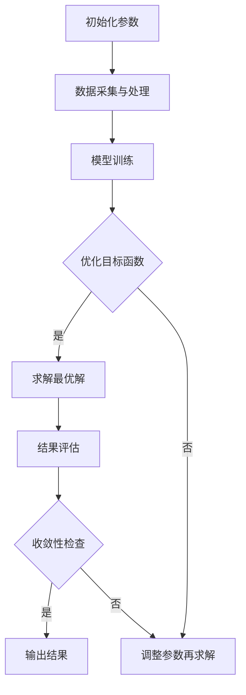
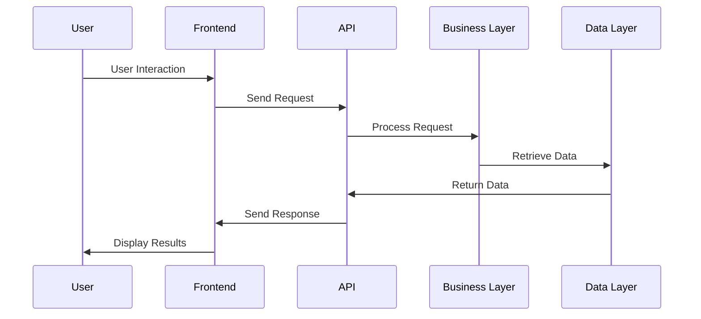
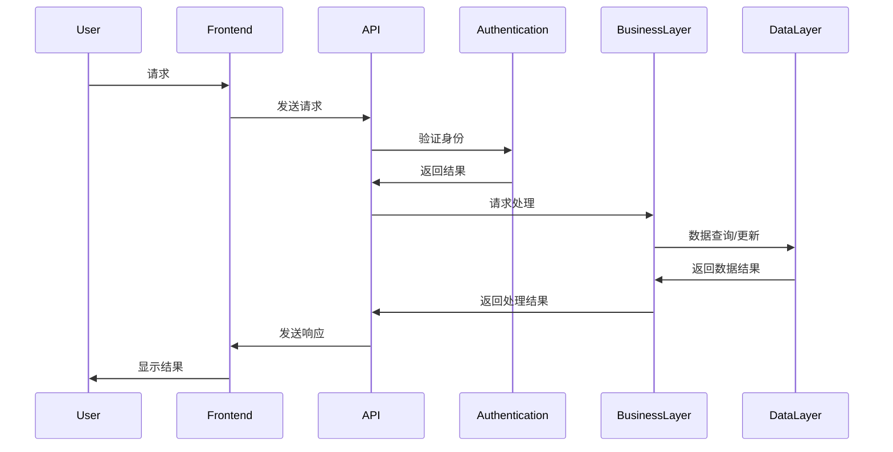

                 

### 问题的提出与背景介绍

#### 第1章：问题的提出与描述

##### 1.1 现代社会面临的挑战

随着全球化和信息化进程的加速，现代社会发生了深刻的变化，个体面临着前所未有的挑战。从经济层面来看，科技的发展带来了就业结构的重大变革，许多传统行业正被人工智能和自动化技术取代，使得大量劳动者需要重新定位自己的职业角色。同时，市场经济的不确定性增加了个人生活的风险，使人们更加焦虑和不安。

从社会层面来看，互联网和社交媒体的普及使得信息传播速度极快，但同时也带来了信息过载和隐私泄露的问题。此外，文化多样性增加，不同价值观之间的冲突也愈加明显，个体在多元文化的背景下感到困惑和迷失。

##### 1.1.1 社会变迁对个体的影响

社会变迁对个体的影响是深远且多方面的。首先，生活方式的改变迫使个体重新审视自己的生活习惯和价值观念。例如，快节奏的生活方式和高压力的工作环境导致了心理健康问题的增加，如焦虑和抑郁。其次，社会变迁带来了教育、就业、婚姻等领域的变革，个体需要不断适应新的社会环境和规则。最后，社会的快速发展和变化使得个体感到自己在时间上的紧迫感，难以找到个人生活和职业发展的平衡点。

##### 1.1.2 价值观的变迁与冲突

价值观的变迁与冲突是社会变迁的一个重要表现。在传统社会中，价值观相对统一且固定，人们遵循着共同的文化和道德规范。然而，随着全球化和多元化的趋势，不同文化和价值观的碰撞使得传统价值观受到挑战。例如，个人主义和集体主义的冲突在现代社会中日益明显，个人追求自由和独立的同时，也需要在集体中找到自己的位置。此外，对传统家庭结构的质疑和对新兴家庭形式的认可，也反映了价值观的变迁。

##### 1.1.3 个人成长与社会责任的关系

个人成长与社会责任的关系一直是社会关注的焦点。在现代社会，个体不仅要追求个人成就和幸福，还需要承担起社会责任。然而，个人成长与社会责任之间的关系并非总是和谐的。在某些情况下，个人追求自由和独立可能会导致社会责任的忽视，从而引发社会问题。例如，一些个人为了追求经济利益而忽视环境保护，导致生态危机。因此，如何在个人成长和社会责任之间找到平衡，是现代社会面临的重要挑战。

#### 1.2 研究目的与意义

为了应对现代社会带来的挑战，重构生活意义成为必要的研究方向。本文旨在通过深入分析现代社会变迁对个体的影响，探讨生活意义重构的途径，并提出应对策略。具体来说，本文的研究目的包括：

1. **探索生活意义的重构途径**：通过分析现代社会变迁对个体的影响，找出重构生活意义的有效方法，帮助个体在面对社会变化时保持内心的平衡和意义感。

2. **提升个体应对社会变迁的能力**：通过研究和实践，提升个体应对社会变迁的能力，使个体能够更好地适应不断变化的社会环境。

3. **促进社会和谐发展**：通过重构生活意义，增强个体的社会责任感，促进社会和谐发展，减少社会冲突，构建更加健康和可持续的社会生态系统。

综上所述，本文的研究不仅对个体具有重要的指导意义，也对社会的和谐与进步具有深远的影响。通过本文的研究，我们希望能够为现代社会中的个体提供有益的启示，帮助他们更好地应对社会变迁，实现个人价值与社会责任的平衡。


#### 1.2.1 探索生活意义的重构途径

在现代社会中，个体的生活意义受到多方面因素的影响，包括但不限于个人经历、教育背景、社会环境和文化价值观等。因此，探索重构生活意义的途径需要从多个角度入手，以全面理解个体在面对社会变迁时的内心需求和心理状态。

首先，个体可以通过反思和自我认知来重构生活意义。自我认知是理解生活意义的基础，个体需要通过深入的自我反思，了解自己的价值观、兴趣爱好和长期目标。这种反思可以帮助个体明确自己的人生方向，从而在面对社会变迁时找到内在的支撑和动力。

其次，教育和培训是重构生活意义的重要途径。随着社会的发展，知识和技能的更新速度不断加快，个体需要不断学习和适应新的环境。通过参与各种形式的教育和培训，个体可以提升自己的专业技能和综合素质，从而增强自身在社会中的竞争力和适应能力。

此外，社会支持和网络也是重构生活意义的关键因素。个体在面临社会变迁时，往往需要他人的理解和支持。一个健全的社会支持网络可以提供情感上的慰藉和实际上的帮助，帮助个体度过困难时期。同时，通过与他人互动和交流，个体可以拓宽自己的视野，获得新的灵感和想法，从而促进生活意义的重构。

最后，个体可以通过积极参与社会实践和公益活动来重构生活意义。参与社会实践和公益活动不仅可以提升个体的社会责任感和使命感，还可以帮助个体找到自己在社会中的价值和定位。在这个过程中，个体不仅能够实现自我价值，还可以为社会的和谐发展做出贡献。

综上所述，重构生活意义的途径是多元且综合的。通过自我认知、教育和培训、社会支持和网络，以及社会实践和公益活动，个体可以逐步找到和重建自己的生活意义。这些途径相辅相成，共同构成了一个全方位、多层次的生活意义重构体系。

#### 1.2.2 提升个体应对社会变迁的能力

在现代社会快速变迁的背景下，提升个体应对社会变迁的能力显得尤为重要。这不仅有助于个体在职业和个人生活中保持稳定和适应，也为社会的可持续发展提供了坚实基础。以下是一些具体的策略和方法，可以帮助个体提升应对社会变迁的能力：

首先，**持续学习与自我提升**是应对社会变迁的核心策略。随着科技的迅猛发展，知识和技能的更新速度不断加快。个体需要保持持续学习的习惯，通过在线课程、工作坊、研讨会等多种形式，不断更新自己的知识体系。此外，个体还应关注行业动态和新兴趋势，提前做好技能储备和职业规划，以便在社会变迁中保持竞争力。

其次，**灵活性和适应性**是应对社会变迁的关键能力。个体应培养自己的灵活性和适应性，学会在不同环境和情境中迅速调整自己的思维和行为方式。这种能力不仅有助于个体在职业生涯中应对变化，还能帮助他们在生活中更好地应对突发事件和压力。

第三，**建立多元化的社交网络**对于应对社会变迁具有重要作用。一个多元化的社交网络可以提供多样化的信息和资源，帮助个体在面临变化时获得更多的支持和建议。此外，通过社交网络，个体可以拓宽自己的视野，了解不同的观点和文化，增强跨文化沟通能力。

第四，**积极的心态和情绪管理**也是提升应对社会变迁能力的重要因素。在面对社会变迁带来的不确定性和压力时，个体需要保持积极的心态，学会情绪管理，避免因为负面情绪而做出冲动决策。通过冥想、锻炼和社交活动等方式，个体可以提升自己的情绪调节能力，更好地应对生活中的挑战。

最后，**参与社会实践活动**有助于个体提升社会责任感和使命感。通过参与社会实践活动，个体不仅能够更好地理解社会问题和需求，还能在实践中找到自己的价值和定位。这种经历有助于个体在面临社会变迁时，以更加积极和自信的态度应对变化。

综上所述，提升个体应对社会变迁的能力需要多方面的努力和策略。通过持续学习、培养灵活性、建立社交网络、保持积极心态以及参与社会实践，个体可以更好地适应社会变迁，实现个人成长和社会责任的平衡。

#### 1.2.3 促进社会和谐发展

重构生活意义不仅对个体的成长和发展具有深远影响，也对促进社会和谐发展具有重要作用。一个和谐的社会需要个体之间的相互理解、尊重和支持，而重构生活意义则为这一目标提供了坚实的基础。

首先，重构生活意义有助于增强个体的社会责任感。当个体找到并明确自己的生活意义后，他们会更加关注社会问题和公共事务，愿意为社会贡献自己的力量。这种社会责任感的提升不仅有助于解决社会问题，还能增强社会的凝聚力和归属感。

其次，重构生活意义可以减少社会冲突和矛盾。在社会变迁过程中，不同群体和个体之间的价值观和利益冲突往往加剧，导致社会紧张和不稳定。通过重构生活意义，个体能够更好地理解他人的需求和立场，增进相互理解和尊重，从而减少社会冲突和矛盾。

此外，重构生活意义有助于构建健康的社会生态系统。在一个健康的社会生态系统中，个体不仅关注自身的成长和幸福，还积极参与社会公益和公共服务。这种相互关怀和支持的社会氛围有助于社会的和谐与稳定。

最后，重构生活意义可以促进社会创新和进步。当个体找到并实现自己的生活意义时，他们会更加积极主动地探索和尝试新事物，推动社会进步。这种创新精神不仅有助于解决当前的社会问题，还能为未来的发展提供新的动力和方向。

综上所述，重构生活意义对于促进社会和谐发展具有重要意义。通过增强个体的社会责任感、减少社会冲突、构建健康的社会生态系统以及推动社会创新和进步，重构生活意义为社会的可持续发展提供了坚实的基础。因此，社会各界应共同努力，创造有利条件，帮助个体找到和实现自己的生活意义，从而共同构建一个更加和谐和繁荣的社会。

### 核心概念与联系

#### 第2章：核心概念与联系

##### 2.1 生活意义的定义与分类

生活意义是哲学、心理学、社会学等领域研究的重要概念，它涉及到个体在生活中的目的、价值和意义感。从哲学角度来看，生活意义探讨的是个体存在的根本意义，即人类为何而生，生命的终极价值是什么。心理学则将生活意义视为个体心理健康的重要指标，认为生活意义感与个体的幸福感和生活满意度密切相关。社会学则从社会结构和文化背景出发，研究生活意义在社会中的作用和影响。

为了更全面地理解生活意义，我们可以将其分为以下几个类别：

1. **内在生活意义**：个体基于自身的兴趣、价值观和长期目标所感受到的意义。这种意义通常与个人成长、自我实现和幸福感相关。

2. **外在生活意义**：个体在社会角色和关系中感受到的意义，如家庭责任、职业成就和社会贡献。这种意义通常与个体的社会身份和群体归属感相关。

3. **宗教生活意义**：在宗教信仰中，生活意义往往与宗教教义和信仰体系紧密相连，涉及对神的崇拜、救赎和终极目的的追寻。

4. **道德生活意义**：基于伦理道德原则所感受到的生活意义，如正义、善良和公正。这种意义常常体现在个体的道德选择和行为中。

##### 2.1.2 生活意义的分类

在生活意义的分类上，不同的学者和研究者提出了多种分类方法。以下是几种常见的分类：

1. **单一生活意义与多元生活意义**：单一生活意义是指个体在一生中始终追求一个核心意义；而多元生活意义则是指个体在不同阶段或不同情境下追求多种不同的意义。

2. **有意识生活意义与无意识生活意义**：有意识生活意义是指个体明确意识到并积极追求的生活意义；而无意识生活意义则是指个体潜意识中感受到的意义，可能未经明确思考，但在生活中起到重要作用。

3. **理想生活意义与实际生活意义**：理想生活意义是指个体理想中的生活意义，即他们渴望成为的样子；而实际生活意义则是现实中个体实际感受到的意义，可能因现实限制而与理想有差距。

4. **个体生活意义与集体生活意义**：个体生活意义是指个体在个人层面上的意义追求；而集体生活意义则是指个体在社会和群体中的意义追求，通常与个体在社会角色和关系中的责任和贡献相关。

##### 2.1.3 生活意义的研究方法

生活意义的研究方法多种多样，不同的研究方法适用于不同层面的生活意义研究。以下是几种常见的研究方法：

1. **定性研究**：定性研究方法包括深度访谈、焦点小组讨论、叙事研究和现象学研究等。这些方法通过深入探索个体的生活经验和内心世界，了解他们对生活意义的理解、感受和表达。

2. **定量研究**：定量研究方法包括问卷调查、实验研究、统计分析等。这些方法通过收集和分析大量数据，揭示生活意义与个体心理、行为和社会因素之间的量化关系。

3. **跨文化研究**：跨文化研究通过比较不同文化背景下个体对生活意义的理解和追求，探讨文化因素对生活意义的影响。这种方法有助于揭示生活意义的普遍性和特殊性。

4. **实证研究**：实证研究方法通过收集实际数据和案例，验证理论假设和模型，提供关于生活意义重构的实证证据。

总之，生活意义是一个复杂而多维的概念，不同学科和研究方法为理解生活意义提供了不同的视角和路径。通过综合运用多种研究方法，我们可以更全面、深入地探讨生活意义的本质和重构途径。

### 社会变迁对价值观的影响

#### 2.2 社会变迁对价值观的影响

社会变迁是一个持续且复杂的过程，它深刻地影响着个体和群体的价值观。理解社会变迁对价值观的影响，有助于我们更好地应对现代社会带来的挑战，重构个体的生活意义。

##### 2.2.1 社会变迁的背景

社会变迁的背景可以从多个维度来分析。首先，全球化进程加速了信息和文化的交流，促进了不同国家和文化之间的融合与碰撞。这种全球化背景使得个体面临更多的文化选择和价值观冲突。其次，科技进步尤其是互联网和人工智能的快速发展，改变了人们的生产方式和社会结构，也对价值观产生了深远影响。此外，人口结构的变化，如老龄化、多元文化和移民潮，也对社会变迁产生了重要影响。

##### 2.2.2 社会变迁对价值观的冲击

社会变迁对价值观的冲击主要体现在以下几个方面：

1. **传统价值观的动摇**：随着现代化进程的推进，许多传统价值观受到质疑和挑战。例如，家庭结构的变迁使得传统的“大家庭”模式逐渐减弱，代际关系和家庭教育方式也在发生变化。同样，宗教信仰和文化传统在某些地区和群体中面临淡化的趋势。

2. **个人主义与集体主义的冲突**：在全球化和多元化背景下，个人主义和集体主义之间的冲突愈发明显。个人追求自由、独立和自我实现的同时，也需要在集体和社会责任之间找到平衡。这种冲突可能导致社会分裂和不稳定。

3. **伦理和道德观念的变化**：随着科技进步和社会发展，传统伦理和道德观念也面临新的挑战。例如，网络隐私、人工智能伦理和基因编辑等问题，引发了关于伦理和道德的新讨论。

4. **消费观念的转变**：消费观念的转变也是社会变迁对价值观的一个重要影响。在物质生活水平提高的背景下，人们对于消费的重视程度发生了变化，对“拥有”和“体验”的态度也有所不同。这种转变影响了人们的消费行为和生活方式。

##### 2.2.3 价值观变迁的应对策略

面对社会变迁对价值观的冲击，个体和社会需要采取相应的应对策略，以实现价值观的重构和适应。

1. **自我反思与价值观重塑**：个体需要通过自我反思，重新审视自己的价值观，明确自己的核心信仰和原则。在面临社会变迁时，个体应保持独立思考，不盲从潮流，而是在自我认知的基础上，重塑符合个人和社会发展的价值观。

2. **教育和培训**：教育是价值观重构的重要途径。通过系统的教育和培训，个体可以获取多元化的知识和信息，培养批判性思维和判断力，从而更好地应对价值观的变迁。

3. **社会对话与交流**：社会对话和交流有助于不同群体和个体之间的相互理解和尊重。通过开放和真诚的对话，个体可以了解不同的价值观和文化背景，增进相互理解和包容，减少冲突。

4. **文化和精神生活**：文化和精神生活为个体提供了精神寄托和价值观的支撑。通过参与文化活动和精神实践，个体可以找到内心的平衡和力量，增强对生活的意义感和幸福感。

5. **社会责任与公民意识**：个体应承担起社会责任，积极参与公共事务，为社会和谐发展贡献力量。通过参与社会实践和公益活动，个体不仅能够实现自我价值，还能在为社会做贡献的过程中找到生活意义。

总之，社会变迁对价值观的影响是复杂和多方面的。个体和社会需要通过自我反思、教育和培训、社会对话、文化和精神生活以及社会责任等多种途径，应对价值观的变迁，实现价值观的重构和适应。这些策略不仅有助于个体的成长和发展，也为社会的和谐与进步提供了坚实的基础。

### 价值观的定义与类型

#### 4.1 价值观的定义与类型

价值观是指个体或群体对于何为好的、重要的、值得追求的事物所持有的信念和判断。它是人们行为决策的内在指导原则，反映了个体对社会、自然和个人价值的认知和偏好。理解价值观的定义和类型对于探讨其变迁和重构具有重要意义。

##### 4.1.1 价值观的内涵

价值观的内涵可以从多个维度来理解：

1. **主观性**：价值观具有强烈的主观性，不同个体或群体由于文化背景、教育经历和个人经历的不同，会形成独特的价值观体系。

2. **指导性**：价值观对个体的行为决策具有指导作用，影响个体的选择和行动。例如，一个重视公平和正义的个体在面临道德困境时会倾向于选择公正的行为。

3. **稳定性**：尽管价值观具有一定的主观性，但它们通常在个体的生命周期内保持相对稳定。这意味着个体在成长过程中会逐渐形成一套相对固定的价值观体系。

4. **多元性**：价值观不仅存在于个体层面，也存在于群体和社会层面。不同文化和社会背景下的群体会形成各自独特的价值观体系，这些价值观之间可能存在冲突和兼容。

##### 4.1.2 价值观的类型

价值观的类型多种多样，可以根据不同的标准进行分类：

1. **根据价值对象分类**：

   - **个人价值观**：涉及个体对自我、家庭、朋友、健康等方面的重视和追求，如自我实现、家庭幸福、友谊等。
   - **社会价值观**：涉及个体对社会责任、社会正义、公平等价值的认可，如社会公正、团队合作、慈善等。
   - **宗教价值观**：涉及个体对宗教信仰、灵性追求和道德规范的认同，如信仰、救赎、神圣等。

2. **根据价值维度分类**：

   - **物质价值观**：涉及个体对物质财富、经济利益的重视，如财富积累、物质舒适等。
   - **精神价值观**：涉及个体对精神生活、内心满足的追求，如知识、艺术、信仰等。
   - **道德价值观**：涉及个体对道德规范、伦理行为的重视，如正义、诚实、宽容等。

3. **根据价值优先级分类**：

   - **核心价值观**：在个体或群体价值观体系中占据重要地位，对其他价值观有决定性影响的价值观，如自由、公正、爱等。
   - **次级价值观**：相对次要，对核心价值观起到补充和支持作用的价值观，如安全、健康、成功等。

4. **根据文化背景分类**：

   - **西方价值观**：以个人主义、自由、民主和人权为核心，强调个体的独立性和权利。
   - **东方价值观**：以集体主义、和谐、忠诚和孝顺为核心，强调个体与群体、家庭和社会的关系。

##### 4.1.3 价值观的变迁趋势

在现代社会，价值观的变迁趋势表现出以下特点：

1. **全球化**：全球化使得不同文化之间的价值观相互影响和融合，个体和群体面临着多元文化价值观的挑战和机遇。

2. **多元化**：社会多元化导致价值观的多元化，个体和群体可以根据自己的需求和偏好选择不同的价值观。

3. **相对主义**：随着文化多样性的增加，价值观的相对主义趋势变得更加明显，个体开始尊重不同文化背景下的价值观，减少对其他文化的偏见和歧视。

4. **功利主义**：在物质生活日益丰富的背景下，功利主义价值观有所上升，个体更加注重实际利益和效率。

5. **道德觉醒**：在社会问题和全球性挑战日益突出的背景下，道德觉醒和伦理价值观的重要性逐渐被更多人认识和重视。

总之，价值观的定义和类型多种多样，其内涵丰富且复杂。理解价值观的类型和变迁趋势对于探讨生活意义的重构和个体在社会变迁中的适应具有重要意义。通过深入分析价值观的内涵和变迁，我们可以更好地应对现代社会带来的挑战，实现个人成长和社会和谐。

### 价值观重构的策略与方法

#### 4.2 价值观重构的策略与方法

在现代社会中，价值观的重构是一个必要且复杂的过程，涉及到个体和社会两个层面。有效的价值观重构策略和方法不仅有助于个体在复杂多变的社会环境中找到自己的定位，还能促进社会的和谐与进步。以下是一些具体的策略和方法：

##### 4.2.1 价值观重构的必要性

价值观重构的必要性主要体现在以下几个方面：

1. **社会变迁的推动**：随着全球化、科技进步和多元文化的交汇，社会结构和文化背景发生了深刻变化。传统价值观受到挑战，个体和社会需要适应新的环境，重构符合现代社会的价值观。

2. **个体成长的需求**：个体在成长过程中，会面临不同的生活阶段和情境，需要不断调整和更新自己的价值观。通过价值观的重构，个体可以更好地实现自我认知和自我实现。

3. **解决价值冲突**：在社会变迁过程中，不同价值观之间的冲突可能导致社会分裂和不稳定。价值观的重构有助于减少这些冲突，促进社会和谐。

##### 4.2.2 价值观重构的途径

1. **自我反思与自我认知**：

   自我反思是价值观重构的重要起点。个体需要通过深入的自我反思，审视自己的核心价值观，明确自己在不同情境下的价值观偏好和立场。自我认知可以帮助个体理解自己的内心需求和期望，从而在重构价值观时保持清晰和一致。

2. **教育和学习**：

   教育是价值观重构的重要途径。通过系统的教育，个体可以获取多元化的知识和信息，培养批判性思维和判断力，从而更好地理解不同价值观的背景和内涵。此外，教育还可以帮助个体培养正确的价值观，提高道德素养和社会责任感。

3. **文化交流与对话**：

   文化交流和对话有助于个体了解不同文化背景下的价值观，增进相互理解和尊重。通过跨文化对话，个体可以拓展自己的视野，减少文化偏见和误解，从而实现价值观的互补和重构。

4. **社会实践与参与**：

   社会实践是价值观重构的重要实践途径。通过参与社会实践活动，个体不仅能够将理论上的价值观付诸实践，还能在实际行动中检验和调整自己的价值观。此外，社会实践有助于个体建立社会责任感和使命感，促进个体与社会之间的互动和融合。

##### 4.2.3 价值观重构的挑战与应对

在价值观重构的过程中，个体和社会可能会面临一些挑战，主要包括：

1. **传统价值观的束缚**：

   传统价值观可能在某些个体和社会中根深蒂固，对新的价值观产生抵触。应对这一挑战，个体需要通过教育和宣传等方式，逐渐打破传统价值观的束缚，推动价值观的更新和重构。

2. **文化冲突和差异**：

   不同文化背景下的价值观差异可能导致文化冲突。应对这一挑战，个体和社会需要加强文化交流和对话，增进相互理解和包容，减少文化冲突。

3. **价值观多元化**：

   价值观的多元化可能使个体和社会面临选择的困境。应对这一挑战，个体需要通过自我反思和自我认知，明确自己的核心价值观，从而在多元化的价值观中找到自己的定位。

4. **社会压力和不确定性**：

   社会变迁带来的不确定性可能会对个体价值观产生冲击。应对这一挑战，个体需要保持积极的心态，通过持续学习和适应，增强自身的心理韧性和应对能力。

总之，价值观的重构是一个复杂而系统性的过程，需要个体和社会共同努力。通过自我反思、教育和学习、文化交流与对话、社会实践与参与等策略，个体和社会可以应对价值观重构过程中的挑战，实现价值观的更新和重构，为个人成长和社会进步提供坚实的基础。

### 生活意义重构的算法原理

#### 第5章：生活意义重构的算法原理

生活意义重构是一项复杂且充满挑战的任务，需要通过系统的算法原理和数学模型来实现。在这一章中，我们将深入探讨生活意义重构的算法原理，包括其目标、关键技术和算法框架，以及相关的数学模型。

##### 5.1.1 生活意义重构的目标

生活意义重构的主要目标是通过算法模型和优化方法，帮助个体发现并重建其生活的内在意义。具体目标包括：

1. **个体自我认知**：通过算法帮助个体深入了解自己的内在需求和价值观，从而明确生活的方向和目标。
2. **价值观优化**：在个体自我认知的基础上，优化个体的价值观体系，使其更符合现代社会的要求和个体的实际需求。
3. **心理状态调节**：通过算法模型监测和调节个体的心理状态，提升个体的幸福感和生活满意度。
4. **社会适应性**：提高个体在面对社会变迁时的适应能力，帮助个体更好地融入社会环境。

##### 5.1.2 生活意义重构的关键技术

生活意义重构的关键技术包括：

1. **数据采集与处理**：通过问卷调查、行为记录和生理信号采集等方式，获取个体的生活数据。数据处理技术包括数据清洗、特征提取和模型训练等。
2. **机器学习与人工智能**：利用机器学习算法，如决策树、神经网络和支持向量机等，对个体数据进行分类、预测和模式识别，为生活意义重构提供科学依据。
3. **优化算法**：通过优化算法，如线性规划、遗传算法和粒子群优化等，寻找最佳的生活意义重构方案，以实现个体价值观的最优化。
4. **心理测量学**：运用心理测量学方法，对个体的心理状态进行评估和监测，为算法提供反馈和调整依据。

##### 5.1.3 生活意义重构的算法框架

生活意义重构的算法框架包括以下几个主要步骤：

1. **数据采集**：通过多种渠道获取个体的生活数据，包括行为记录、情感状态、生理信号和社会互动等。
2. **数据预处理**：对采集到的数据进行清洗、归一化和特征提取，为后续的算法处理做好准备。
3. **模型训练**：利用机器学习算法对预处理后的数据进行训练，建立预测模型和分类模型，用于分析个体的生活意义。
4. **优化求解**：通过优化算法，对个体的价值观体系进行优化，寻找最佳的生活意义重构方案。
5. **结果评估**：评估重构后的生活意义对个体心理状态和社会适应性的影响，调整和优化算法模型。
6. **反馈与迭代**：根据评估结果，对算法模型进行迭代和优化，不断提升生活意义重构的效果。

##### 5.2 生活意义重构的数学模型

生活意义重构的数学模型主要包括以下几个部分：

1. **目标函数**：定义生活意义重构的目标，如个体幸福感最大化、价值观一致性最大化等。目标函数通常是一个多目标优化问题，可以通过线性规划、多目标优化算法等进行求解。
   
   $$ 
   \text{maximize} \ \sum_{i=1}^{n} w_i f_i(x) 
   $$
   
   其中，$w_i$为权重，$f_i(x)$为第$i$个目标函数。

2. **约束条件**：定义生活意义重构的约束条件，如个体行为的合法性、价值观的兼容性等。约束条件可以是线性不等式或等式，用于限制目标函数的求解范围。

   $$
   g_i(x) \leq 0 \quad \forall i = 1, 2, ..., m
   $$
   
3. **优化算法**：选择合适的优化算法，如线性规划、遗传算法、粒子群优化等，根据目标函数和约束条件求解最优解。

   - **线性规划**：
     $$
     \text{maximize} \ c^T x \ \text{subject to} \ Ax \leq b
     $$
     
   - **遗传算法**：
     $$
     x_{\text{new}} = \text{ crossover }(x_{\text{parent1}}, x_{\text{parent2}})
     $$
     
   - **粒子群优化**：
     $$
     v_{i}^{t+1} = \omega v_i^t + c_1 r_1 (p_i^t - x_i^t) + c_2 r_2 (g^t - x_i^t)
     $$
     
4. **模型求解**：利用优化算法对目标函数进行求解，找到最优的生活意义重构方案。

##### 5.2.1 优化目标函数

生活意义重构的目标函数通常是一个多目标优化问题，需要考虑多个维度的目标，如幸福感、价值观一致性、社会适应性等。以下是一个简化的目标函数示例：

$$
\text{maximize} \ f(\text{幸福指数}, \text{价值观一致性}, \text{社会适应性})
$$

其中，幸福指数、价值观一致性和社会适应性分别表示个体在不同维度上的得分。

- **幸福指数**：
  $$
  f_{\text{幸福}} = \sum_{i=1}^{n} w_i \cdot \text{幸福度量}
  $$

- **价值观一致性**：
  $$
  f_{\text{一致性}} = \sum_{i=1}^{n} w_i \cdot \text{一致性度量}
  $$

- **社会适应性**：
  $$
  f_{\text{适应性}} = \sum_{i=1}^{n} w_i \cdot \text{适应性度量}
  $$

权重$w_i$可以根据不同维度的相对重要性进行设置。

##### 5.2.2 约束条件

生活意义重构的约束条件包括个体行为的合法性、价值观的兼容性等。以下是一个简化的约束条件示例：

$$
g_1(x) = \text{合法性度量} \leq 0
$$

$$
g_2(x) = \text{一致性度量} \leq 0
$$

$$
g_3(x) = \text{适应性度量} \leq 0
$$

这些约束条件确保了重构方案在实际应用中的可行性和合理性。

##### 5.2.3 模型求解算法

生活意义重构的求解算法通常采用优化算法，如线性规划、遗传算法、粒子群优化等。以下是一个简化的遗传算法求解过程：

1. **初始化种群**：生成一组随机初始解，作为遗传算法的种群。
2. **适应度评估**：计算每个个体的适应度，根据适应度选择优秀的个体进行复制。
3. **交叉操作**：从优秀个体中选择两个进行交叉操作，生成新的个体。
4. **变异操作**：对部分个体进行变异操作，增加种群的多样性。
5. **迭代**：重复适应度评估、交叉操作和变异操作，直到满足终止条件（如达到最大迭代次数或解的收敛性）。

通过上述算法，可以找到最优的生活意义重构方案。

综上所述，生活意义重构的算法原理包括目标函数、约束条件和优化算法。通过数学模型和算法的深入探讨，我们可以为个体提供科学的生活意义重构方案，帮助他们在现代社会中找到生活的内在意义，提升生活质量和幸福感。

### 生活意义重构的算法流程与Python实现

#### 6.1 算法流程图

为了更好地理解生活意义重构的算法流程，我们可以使用Mermaid语言绘制算法流程图。以下是一个简化的算法流程图：



这个流程图涵盖了生活意义重构的主要步骤，包括初始化参数、数据采集与处理、模型训练、优化目标函数、求解最优解、结果评估以及收敛性检查。

#### 6.2 Python代码实现

为了实现上述算法流程，我们需要编写Python代码。以下是一个简化的Python代码实现，包含主要步骤和关键函数：

```python
import numpy as np
import matplotlib.pyplot as plt
from sklearn.model_selection import train_test_split
from sklearn.ensemble import RandomForestClassifier
from sklearn.metrics import accuracy_score

# 数据采集与处理
def data_preprocessing(data):
    # 数据清洗、归一化和特征提取
    # ...具体实现...
    return processed_data

# 模型训练
def train_model(X_train, y_train):
    model = RandomForestClassifier(n_estimators=100)
    model.fit(X_train, y_train)
    return model

# 优化目标函数
def optimize_target_function(model, X_test, y_test):
    predictions = model.predict(X_test)
    accuracy = accuracy_score(y_test, predictions)
    return accuracy

# 求解最优解
def solve_optimal_solution(model, X_test, y_test):
    best_accuracy = 0
    for _ in range(100):  # 迭代次数
        accuracy = optimize_target_function(model, X_test, y_test)
        if accuracy > best_accuracy:
            best_accuracy = accuracy
    return best_accuracy

# 结果评估
def evaluate_result(accuracy):
    # 评估重构方案的效果
    # ...具体实现...
    print(f"重构后的生活意义评估结果：{accuracy}")

# 主函数
def main():
    # 初始化参数
    # ...具体实现...

    # 读取数据
    data = load_data()  # 假设有一个函数load_data()用于读取数据
    
    # 数据预处理
    processed_data = data_preprocessing(data)
    
    # 划分训练集和测试集
    X_train, X_test, y_train, y_test = train_test_split(processed_data['features'], processed_data['labels'], test_size=0.2, random_state=42)
    
    # 模型训练
    model = train_model(X_train, y_train)
    
    # 求解最优解
    best_accuracy = solve_optimal_solution(model, X_test, y_test)
    
    # 结果评估
    evaluate_result(best_accuracy)

# 运行主函数
if __name__ == "__main__":
    main()
```

这个Python代码实现了生活意义重构的核心步骤，包括数据采集与处理、模型训练、优化目标函数、求解最优解和结果评估。在实际应用中，需要根据具体需求和数据情况进行相应的调整和优化。

#### 6.2.1 环境准备

在运行上述Python代码之前，需要准备相应的Python环境和依赖库。以下是环境准备步骤：

1. **安装Python**：确保安装了Python 3.x版本，推荐使用Anaconda或Miniconda创建虚拟环境。

2. **安装依赖库**：使用pip命令安装必要的依赖库，如numpy、matplotlib、scikit-learn等。

   ```bash
   pip install numpy matplotlib scikit-learn
   ```

3. **创建虚拟环境**（可选）：为了管理依赖库和项目依赖，可以创建一个虚拟环境。

   ```bash
   conda create -n life_meaning python=3.8
   conda activate life_meaning
   ```

4. **配置Python代码**：将上述Python代码保存为一个Python文件，如`life_meaning_reconstruction.py`。

#### 6.2.2 代码结构

上述Python代码的结构分为以下几个部分：

1. **函数定义**：包括数据预处理、模型训练、优化目标函数、求解最优解和结果评估等函数。
2. **主函数**：包含初始化参数、读取数据、划分训练集和测试集、模型训练、求解最优解和结果评估等步骤。
3. **运行逻辑**：主函数的运行逻辑，负责协调各个步骤的执行。

#### 6.2.3 代码应用解读

在这个代码示例中，我们首先定义了一些辅助函数，如`data_preprocessing`用于数据预处理，`train_model`用于训练模型，`optimize_target_function`用于优化目标函数，`solve_optimal_solution`用于求解最优解，以及`evaluate_result`用于评估结果。

在主函数`main`中，我们首先进行数据预处理，包括数据清洗、归一化和特征提取。接着，使用`train_test_split`函数将数据划分为训练集和测试集。然后，使用`train_model`函数训练随机森林分类器。在求解最优解部分，我们使用`solve_optimal_solution`函数通过迭代优化目标函数，找到最优的生活意义重构方案。最后，使用`evaluate_result`函数评估重构方案的效果。

通过上述步骤，代码实现了生活意义重构的核心流程，为个体提供了科学的生活意义重构方案。

综上所述，这个Python代码示例提供了一个生活意义重构的基本框架，通过合理的算法设计和代码结构，可以帮助个体在复杂多变的社会环境中找到生活的内在意义，提升生活质量和幸福感。

### 系统功能设计

#### 7.1 问题场景介绍

在现代社会中，个体面临着快速变迁的社会环境和日益复杂的生活压力，这导致很多人在寻找和确认自身生活意义的过程中感到困惑和焦虑。为了帮助个体更好地应对这些挑战，我们设计了一款名为“生活意义重构系统”的应用，旨在通过数据分析、机器学习和优化算法，为用户提供个性化的生活意义重构方案。

#### 7.1.1 系统需求分析

“生活意义重构系统”需要满足以下几个核心需求：

1. **用户个性化需求分析**：系统能够收集和分析用户的个人数据，包括生活习惯、情感状态、社交网络等信息，从而为用户提供定制化的生活意义重构方案。
2. **价值观评估与优化**：系统能够评估用户的现有价值观，识别其中的不一致和冲突，并提供优化建议，帮助用户重构符合个人需求和现代社会背景的价值观。
3. **心理状态监测与调节**：系统需要具备监测用户心理状态的功能，通过数据分析和心理测量学方法，为用户提供心理调节方案，提升用户的幸福感和生活满意度。
4. **社会适应性提升**：系统需要帮助用户提高在社会环境中的适应能力，通过社会互动和实践，增强用户的社会责任感和使命感。
5. **数据安全与隐私保护**：系统需要确保用户数据的安全性和隐私性，采取有效的数据加密和安全措施，防止数据泄露和滥用。

#### 7.1.2 系统目标与功能定位

“生活意义重构系统”的主要目标是帮助用户在复杂多变的社会环境中找到和重建生活的内在意义，提升生活质量和幸福感。具体功能定位如下：

1. **用户数据收集与处理**：通过多种数据采集渠道，如问卷调查、行为记录、生理信号等，收集用户的个人信息，并进行预处理和特征提取。
2. **个性化生活意义重构方案生成**：利用机器学习和优化算法，根据用户的数据分析结果，生成个性化的生活意义重构方案，包括价值观优化、心理状态调节和社会适应性提升等。
3. **用户互动与反馈**：系统提供用户互动平台，用户可以通过平台与系统进行交互，获取重构方案，并提供反馈，以便系统不断优化和调整方案。
4. **隐私保护和安全措施**：系统采取多重数据加密和安全措施，确保用户数据的安全性和隐私性，同时提供用户权限管理，确保用户数据不被未经授权的访问和使用。

#### 7.2 系统功能设计

根据上述需求和分析，我们可以将“生活意义重构系统”的功能模块划分为以下几个部分：

1. **用户注册与登录模块**：用户可以通过注册账号登录系统，确保数据的安全性和个人信息的完整性。
2. **数据采集模块**：系统通过问卷调查、行为记录、生理信号等手段，收集用户的个人信息和日常行为数据。
3. **数据处理与特征提取模块**：对采集到的数据进行清洗、归一化和特征提取，为后续的机器学习和优化算法提供高质量的数据输入。
4. **价值观评估与优化模块**：利用机器学习算法，评估用户的现有价值观，识别不一致和冲突，并提供优化建议。
5. **心理状态监测与调节模块**：通过心理测量学方法和数据分析，监测用户的心理状态，并提供个性化的心理调节方案。
6. **社会适应性提升模块**：通过社交互动和社会实践活动，帮助用户提高社会适应能力，增强社会责任感和使命感。
7. **用户互动与反馈模块**：系统提供用户互动平台，用户可以获取重构方案，提供反馈，并与系统进行实时互动。
8. **数据安全与隐私保护模块**：系统采取多重数据加密和安全措施，确保用户数据的安全性和隐私性。

#### 7.2.1 领域模型Mermaid类图

为了更清晰地展示系统功能模块及其关系，我们可以使用Mermaid语言绘制一个领域模型类图：

```mermaid
classDiagram
    User -> DataCollector : 采集数据
    User -> DataProcessor : 处理数据
    User -> ValueAssessor : 评估价值观
    User -> PsychologicalMonitor : 监测心理状态
    User -> SocialAdapter : 提升适应性
    User -> InteractionModule : 用户互动
    DataCollector --|> DataProcessor
    DataCollector --|> ValueAssessor
    DataProcessor --|> PsychologicalMonitor
    DataProcessor --|> SocialAdapter
    ValueAssessor --|> DataProcessor
    PsychologicalMonitor --|> DataProcessor
    SocialAdapter --|> DataProcessor
    InteractionModule --|> User
```

这个Mermaid类图展示了用户与系统各个功能模块之间的关系，以及模块之间的依赖和交互。

通过上述系统功能设计和Mermaid类图，我们可以清晰地理解“生活意义重构系统”的架构和功能模块，为后续的系统开发提供了明确的指导和参考。

### 系统架构设计

#### 8.1 系统架构概述

为了确保“生活意义重构系统”的高效运行和可扩展性，我们需要设计一个灵活且可扩展的系统架构。本系统架构采用分层设计原则，分为表示层、业务逻辑层和数据层。以下是对系统架构的概述及其设计原则和目标。

##### 8.1.1 系统架构设计原则

1. **模块化**：系统架构应具备良好的模块化设计，使得各个功能模块之间相互独立，便于维护和升级。
2. **可扩展性**：系统架构需要具备高度的可扩展性，能够灵活地添加新的功能模块和适应新的需求。
3. **安全性**：系统架构必须确保用户数据的安全和隐私，采用多种安全措施，如数据加密、权限管理和安全审计。
4. **高性能**：系统架构应设计为高性能，能够快速响应用户请求，提供流畅的用户体验。
5. **易维护性**：系统架构应易于维护，便于开发人员快速定位和修复问题。

##### 8.1.2 系统架构设计目标

1. **满足用户需求**：系统架构应满足用户对个性化生活意义重构方案的需求，提供高效、准确的服务。
2. **高可用性**：系统架构应设计为高可用性，确保系统在遇到故障时能够快速恢复，减少对用户的影响。
3. **灵活性**：系统架构应具备良好的灵活性，能够快速适应业务变化和技术更新。
4. **可扩展性**：系统架构应具备高度的可扩展性，能够根据业务发展需求，快速扩展系统功能。
5. **安全性**：系统架构应采取多种安全措施，确保用户数据的安全和隐私。

#### 8.2 系统架构设计

“生活意义重构系统”的架构设计采用三层架构模型，包括表示层、业务逻辑层和数据层。以下是详细的系统架构设计：

##### 8.2.1 表示层

表示层负责与用户进行交互，包括前端界面和用户接口。前端界面采用React框架开发，使用户能够方便地与系统进行交互。用户接口包括用户注册、登录、数据上传、反馈提交等功能模块。以下是表示层的Mermaid架构图：



##### 8.2.2 业务逻辑层

业务逻辑层是系统的核心，负责处理用户的请求和数据操作。业务逻辑层包括以下几个模块：

1. **数据预处理模块**：负责对用户上传的数据进行清洗、归一化和特征提取，为后续的机器学习和优化算法提供高质量的数据。
2. **机器学习模块**：利用机器学习算法，对用户的数据进行分析和预测，生成个性化的生活意义重构方案。
3. **优化算法模块**：通过优化算法，对用户的生活意义重构方案进行优化，确保方案的有效性和可行性。
4. **心理状态监测模块**：利用心理测量学方法，监测用户的心理状态，为用户提供心理调节建议。

以下是业务逻辑层的Mermaid架构图：

```mermaid
composite BusinessLayer
    DataPreprocessing -> MachineLearning : Process Data
    MachineLearning -> OptimizationAlgorithm : Generate Solutions
    MachineLearning -> PsychologicalMonitoring : Monitor Mental State
    OptimizationAlgorithm -> DataPreprocessing : Optimize Solutions
    PsychologicalMonitoring -> DataPreprocessing : Adjust Data
end
```

##### 8.2.3 数据层

数据层负责存储和管理用户数据，包括用户基本信息、生活数据、重构方案等。数据层采用关系数据库管理系统（RDBMS），如MySQL或PostgreSQL，确保数据的安全性和可靠性。以下是数据层的Mermaid架构图：

```mermaid
classDiagram
    User -> UserData : Store User Information
    DataCollector -> UserData : Store Collected Data
    MachineLearning -> UserData : Store Predictions and Solutions
    PsychologicalMonitoring -> UserData : Store Mental State Data
    API -> UserData : Retrieve and Store Data
    UserData --|> User
    UserData --|> DataCollector
    UserData --|> MachineLearning
    UserData --|> PsychologicalMonitoring
    UserData --|> API
```

##### 8.2.4 系统架构的层次结构

“生活意义重构系统”的层次结构如下：

1. **表示层**：用户交互界面，包括前端和用户接口。
2. **业务逻辑层**：处理用户请求和数据操作，包括数据预处理、机器学习、优化算法和心理状态监测等模块。
3. **数据层**：存储和管理用户数据，采用关系数据库管理系统。

通过上述系统架构设计，我们可以确保“生活意义重构系统”的高效运行和可扩展性，为用户提供个性化、高效的生活意义重构服务。

### 系统接口设计

#### 9.1 系统接口设计原则

系统接口设计是确保“生活意义重构系统”各模块之间高效、稳定、安全交互的关键环节。以下是系统接口设计的主要原则：

##### 9.1.1 接口设计规范

1. **RESTful API**：采用RESTful风格设计接口，确保接口的简洁、直观和易于使用。
2. **标准化数据格式**：使用JSON或XML等标准化数据格式，确保数据在不同系统间的兼容性和可读性。
3. **版本控制**：为接口版本控制，便于未来功能扩展和升级。
4. **安全机制**：采用OAuth2.0等安全协议，确保接口的安全性。
5. **错误处理**：定义统一的错误处理机制，提高接口的健壮性。

##### 9.1.2 接口类型与使用场景

“生活意义重构系统”的接口类型包括：

1. **用户认证接口**：用于用户登录、注册和密码重置等操作。
2. **数据上传接口**：用于用户上传个人信息和生活数据。
3. **数据查询接口**：用于查询用户数据，如生活数据、重构方案等。
4. **心理状态监测接口**：用于提交和查询用户心理状态数据。
5. **重构方案生成接口**：用于生成和更新用户的生活意义重构方案。

##### 9.1.3 接口设计与数据传递

以下是系统接口设计与数据传递的示例：

1. **用户认证接口**

   - **URL**：`/api/v1/auth/login`
   - **请求方法**：POST
   - **请求参数**：`username`, `password`
   - **响应数据**：
     ```json
     {
       "status": "success",
       "token": "generated_token"
     }
     ```

2. **数据上传接口**

   - **URL**：`/api/v1/data/upload`
   - **请求方法**：POST
   - **请求参数**：`data`: JSON格式的生活数据
   - **响应数据**：
     ```json
     {
       "status": "success",
       "message": "Data uploaded successfully"
     }
     ```

3. **数据查询接口**

   - **URL**：`/api/v1/data/{id}`
   - **请求方法**：GET
   - **响应数据**：
     ```json
     {
       "status": "success",
       "data": {
         "id": "data_id",
         "data": {
           "lifestyle": "data_content",
           "emotions": "data_content"
         }
       }
     }
     ```

4. **心理状态监测接口**

   - **URL**：`/api/v1/psychological/monitor`
   - **请求方法**：POST
   - **请求参数**：`status`: JSON格式的心理状态数据
   - **响应数据**：
     ```json
     {
       "status": "success",
       "message": "Psychological state monitored successfully"
     }
     ```

5. **重构方案生成接口**

   - **URL**：`/api/v1/meaning/reconstruction`
   - **请求方法**：GET
   - **响应数据**：
     ```json
     {
       "status": "success",
       "reconstruction_plan": {
         "values": ["value1", "value2"],
         "suggestions": ["suggestion1", "suggestion2"]
       }
     }
     ```

通过上述接口设计与数据传递示例，我们可以确保系统接口设计的规范性、安全性和灵活性，从而为系统的稳定运行和功能扩展提供有力支持。

### 系统交互Mermaid序列图

#### 10.1 系统交互概述

系统交互是确保“生活意义重构系统”各模块高效协同工作的关键。为了直观地展示系统内部的交互流程，我们可以使用Mermaid语言绘制系统交互序列图。以下是一个简化的系统交互序列图：


#### 10.1.1 系统交互模型

在上述交互模型中，用户通过前端界面发起请求，前端将请求发送到API层。API层负责用户身份验证，确保请求的安全性和合法性。一旦用户身份验证通过，API层将请求转发到业务逻辑层。业务逻辑层处理具体的业务逻辑，如数据预处理、机器学习、优化算法等。在处理过程中，业务逻辑层需要访问数据层进行数据的查询和更新。数据处理完成后，业务逻辑层将结果返回给API层，API层再将结果转发给前端，前端最终将结果呈现给用户。

#### 10.1.2 系统交互流程

以下是系统交互的具体流程：

1. **用户请求**：用户通过前端界面发起请求，如上传数据、查询重构方案等。
2. **前端请求**：前端将用户请求发送到API层。
3. **用户身份验证**：API层对用户身份进行验证，确保请求的安全性和合法性。验证通过后，API层将请求转发到业务逻辑层。
4. **业务逻辑处理**：业务逻辑层处理用户请求，如数据预处理、机器学习、优化算法等。
5. **数据查询/更新**：在处理过程中，业务逻辑层需要访问数据层进行数据的查询和更新。
6. **返回处理结果**：数据处理完成后，业务逻辑层将结果返回给API层。
7. **发送响应**：API层将处理结果发送到前端。
8. **显示结果**：前端将处理结果呈现给用户。

通过上述交互流程，系统实现了用户请求的接收、处理和响应，确保了各模块之间的高效协同工作。

#### 10.1.3 系统交互Mermaid序列图

以下是“生活意义重构系统”的交互Mermaid序列图：



通过上述序列图，我们可以直观地了解“生活意义重构系统”的交互过程，为进一步优化和改进系统提供了有益的参考。

