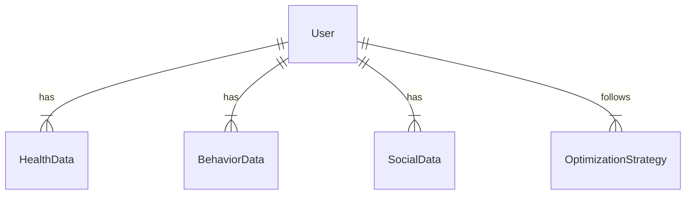

                 

### 引言

#### 文章标题：量化自我4.0：生命体验的全方位数据化与优化

#### 关键词：量化自我、生命体验、数据化、优化、AI技术

随着科技的迅猛发展，人工智能（AI）技术逐渐深入到我们日常生活的各个方面。从智能手机到智能家居，从在线购物到健康监测，AI技术正在改变我们的生活方式。与此同时，人们对自我认知的需求也在不断提升。在这样的背景下，“量化自我”这一概念应运而生，它指的是通过数据化的方式来理解和优化个人的生命体验。

量化自我4.0是这一理念发展的最新阶段，它不仅涵盖了传统的健康监测和生活方式管理，更实现了全面数据化的生命体验。本文将围绕量化自我4.0的概念、发展历程、核心技术、应用场景、实施步骤以及面临的挑战和未来展望进行深入探讨。通过本文的阅读，读者将全面了解量化自我4.0的魅力所在，并掌握如何利用这一先进技术来优化自己的生活体验。

### 1.6 《量化自我4.0：生命体验的全方位数据化与优化》目录大纲

#### 第1章 引言
- 1.1 自我量化：从1.0到4.0的发展历程
  - 1.1.1 自我量化1.0时代
    - 1.1.1.1 初步探索与数据收集
    - 1.1.1.2 数据分析的应用
  - 1.1.2 自我量化2.0时代
    - 1.1.2.1 传感器技术的应用
    - 1.1.2.2 数据存储与处理能力的提升
  - 1.1.3 自我量化3.0时代
    - 1.1.3.1 大数据和人工智能的融合
    - 1.1.3.2 个性化推荐和智能决策的支持
  - 1.1.4 自我量化4.0时代的到来
    - 1.1.4.1 全面数据化的生命体验
    - 1.1.4.2 生命体验的全方位优化

#### 第2章 核心概念与联系
- 2.1 核心概念
  - 2.1.1 数据化与量化
  - 2.1.2 生命体验的数据化
  - 2.1.3 优化与优化算法
- 2.2 概念属性特征对比表格
  - 2.2.1 数据类型与处理方法
  - 2.2.2 量化指标与度量方式
- 2.3 ER实体关系图架构
  - 2.3.1 实体定义与分类
  - 2.3.2 实体属性与关系

#### 第3章 量化自我4.0的基础技术
- 3.1 数据收集与传感器技术
  - 3.1.1 传感器类型及应用
  - 3.1.2 数据收集流程
- 3.2 数据存储与管理
  - 3.2.1 数据库的选择与应用
  - 3.2.2 数据安全与隐私保护
- 3.3 数据分析与处理
  - 3.3.1 数据清洗与预处理
  - 3.3.2 数据挖掘与分析技术
- 3.4 人工智能与机器学习
  - 3.4.1 机器学习基础
  - 3.4.2 人工智能在量化自我中的应用

#### 第4章 量化自我的应用场景
- 4.1 健康管理
  - 4.1.1 身体指标的量化与分析
  - 4.1.2 健康问题的预警与干预
- 4.2 生活优化
  - 4.2.1 行为数据的量化与分析
  - 4.2.2 生活习惯的优化建议
- 4.3 心理健康
  - 4.3.1 情绪数据的量化与分析
  - 4.3.2 心理健康的监测与干预

#### 第5章 量化自我的实施步骤
- 5.1 制定量化计划
  - 5.1.1 目标设定
  - 5.1.2 行动计划
- 5.2 数据收集与整理
  - 5.2.1 数据收集工具的选择
  - 5.2.2 数据的整理与存储
- 5.3 数据分析与优化
  - 5.3.1 数据分析工具的选择
  - 5.3.2 优化策略的制定与实施
- 5.4 反馈与调整
  - 5.4.1 结果反馈
  - 5.4.2 调整优化策略

#### 第6章 量化自我4.0的挑战与未来
- 6.1 数据隐私与安全
  - 6.1.1 隐私保护的重要性
  - 6.1.2 隐私保护的技术与实践
- 6.2 数据解读与使用
  - 6.2.1 数据解读的方法
  - 6.2.2 数据使用的伦理与规范
- 6.3 未来的发展前景
  - 6.3.1 技术趋势与展望
  - 6.3.2 社会影响与应对

#### 第7章 最佳实践与案例分析
- 7.1 实践一：健康管理的量化自我
  - 7.1.1 实践案例介绍
  - 7.1.2 实践效果分析
- 7.2 实践二：生活优化的量化自我
  - 7.2.1 实践案例介绍
  - 7.2.2 实践效果分析

---

### 第1章 引言

随着人工智能技术的飞速发展，我们的生活正在发生翻天覆地的变化。从简单的语音识别到复杂的自动驾驶，AI已经渗透到了各个领域。在这样的背景下，“量化自我”这一概念应运而生，它不仅反映了我们对自我认知的需求，也展示了科技在提升生活质量方面的巨大潜力。

量化自我，顾名思义，就是通过数据化的方式来理解和优化个人的生命体验。它始于对个人数据的收集、整理和分析，最终目的是为了实现自我认知的提升和生活质量的优化。从1.0版本到4.0版本，量化自我经历了数次重大变革，每一次的迭代都为我们提供了更全面、更深入的数据化手段。

在接下来的章节中，我们将详细探讨量化自我4.0的概念、发展历程、核心技术、应用场景、实施步骤以及面临的挑战和未来展望。希望通过本文的阅读，读者能够全面了解量化自我4.0的魅力所在，并掌握如何利用这一先进技术来优化自己的生活体验。

#### 1.1 自我量化：从1.0到4.0的发展历程

自我量化的概念并非一蹴而就，而是随着技术的进步和社会需求的提升逐步发展起来的。从1.0版本到4.0版本，自我量化经历了几个重要的阶段，每一个阶段都有其独特的特点和应用场景。

##### 1.1.1 自我量化1.0时代

自我量化的1.0时代，可以追溯到上世纪末和本世纪初。这一时期，人们对自我量化的认识还比较初级，主要集中在数据收集和基础分析上。人们开始使用简单的工具和设备，如计步器、血压计等，来收集自己的健康数据。这些数据虽然简单，但为后续的数据化分析奠定了基础。

- **1.1.1.1 初步探索与数据收集**

在自我量化1.0时代，数据收集的方法相对简单，主要依赖于手动记录和简单的电子设备。例如，人们可以用纸质记录本记录每天的饮食、运动和睡眠情况，然后通过电子设备进行初步的数据整理和统计。这种方式虽然效率不高，但为后续的数据化分析提供了基础。

- **1.1.1.2 数据分析的应用**

随着数据的积累，人们开始尝试对数据进行简单的分析。例如，通过统计每天的饮食摄入量和运动量，分析其对体重的影响。这种数据分析虽然比较初级，但为人们提供了对自我健康状态的基本了解。

##### 1.1.2 自我量化2.0时代

自我量化的2.0时代，随着传感器技术的进步和数据存储处理能力的提升，自我量化得到了进一步的完善。

- **1.1.2.1 传感器技术的应用**

这一时期，各种传感器设备开始广泛应用，如心率监测器、睡眠监测仪等。这些设备可以实时收集个人的生理数据，为后续的数据分析提供了更为丰富和准确的数据来源。

- **1.1.2.2 数据存储与处理能力的提升**

随着云计算和大数据技术的兴起，数据存储和处理的能力得到了大幅提升。人们不再需要依赖本地设备进行数据存储和处理，而是可以通过云平台实现高效的数据管理和分析。

##### 1.1.3 自我量化3.0时代

自我量化的3.0时代，标志着大数据和人工智能的深度融合。这一时期，自我量化不再仅仅是数据收集和分析，而是实现了个性化的推荐和智能决策。

- **1.1.3.1 大数据和人工智能的融合**

随着大数据技术的普及，人们可以收集和处理海量的个人数据，从而实现更加精细化的数据分析。同时，人工智能技术的应用，使得数据分析结果更具预测性和指导性。

- **1.1.3.2 个性化推荐和智能决策的支持**

基于大数据和人工智能的分析结果，系统可以为用户提供个性化的健康建议、生活习惯优化建议等。例如，根据用户的健康数据，系统可以推荐合适的运动计划和饮食方案。

##### 1.1.4 自我量化4.0时代的到来

自我量化的4.0时代，是全面数据化的生命体验阶段。这一时期，自我量化不再局限于健康和生活方式，而是涵盖了生活的方方面面，实现了全方位的优化。

- **1.1.4.1 全面数据化的生命体验**

在自我量化4.0时代，人们可以收集到关于生活各个方面的数据，如情绪、行为、社交等。这些数据通过大数据和人工智能技术进行综合分析，实现了对生命体验的全面数据化。

- **1.1.4.2 生命体验的全方位优化**

基于全面数据化的生命体验，系统可以为用户提供个性化的优化建议。例如，通过分析用户的情绪和行为数据，系统可以推荐合适的心理健康训练计划，帮助用户更好地管理情绪和压力。

#### 1.2 自我量化1.0时代的核心概念

在自我量化的1.0时代，核心概念主要集中在数据收集和基础分析上。

- **数据收集**

数据收集是自我量化的第一步，也是最基础的一步。在这个阶段，人们主要通过手动记录和简单的电子设备收集数据。例如，记录每天的饮食、运动和睡眠情况，使用计步器记录步数等。虽然这些方法比较初级，但为后续的数据化分析提供了基础。

- **基础分析**

在收集到数据后，人们开始尝试对数据进行分析。例如，统计每天的饮食摄入量和运动量，分析其对体重的影响。这种基础分析虽然比较简单，但为人们提供了对自我健康状态的基本了解。

#### 1.3 自我量化2.0时代的核心概念

在自我量化的2.0时代，核心概念主要集中在传感器技术的应用和数据存储处理能力的提升。

- **传感器技术的应用**

这一时期，各种传感器设备开始广泛应用，如心率监测器、睡眠监测仪等。这些设备可以实时收集个人的生理数据，为后续的数据分析提供了更为丰富和准确的数据来源。

- **数据存储与处理能力的提升**

随着云计算和大数据技术的兴起，数据存储和处理的能力得到了大幅提升。人们不再需要依赖本地设备进行数据存储和处理，而是可以通过云平台实现高效的数据管理和分析。

#### 1.4 自我量化3.0时代的核心概念

在自我量化的3.0时代，核心概念主要集中在大数据和人工智能的深度融合，以及个性化推荐和智能决策的支持。

- **大数据和人工智能的融合**

随着大数据技术的普及，人们可以收集和处理海量的个人数据，从而实现更加精细化的数据分析。同时，人工智能技术的应用，使得数据分析结果更具预测性和指导性。

- **个性化推荐和智能决策的支持**

基于大数据和人工智能的分析结果，系统可以为用户提供个性化的健康建议、生活习惯优化建议等。例如，根据用户的健康数据，系统可以推荐合适的运动计划和饮食方案。

#### 1.5 自我量化4.0时代的核心概念

在自我量化的4.0时代，核心概念主要集中在全面数据化的生命体验和生命体验的全方位优化。

- **全面数据化的生命体验**

在自我量化4.0时代，人们可以收集到关于生活各个方面的数据，如情绪、行为、社交等。这些数据通过大数据和人工智能技术进行综合分析，实现了对生命体验的全面数据化。

- **生命体验的全方位优化**

基于全面数据化的生命体验，系统可以为用户提供个性化的优化建议。例如，通过分析用户的情绪和行为数据，系统可以推荐合适的心理健康训练计划，帮助用户更好地管理情绪和压力。

---

### 第2章 核心概念与联系

在深入探讨量化自我4.0之前，我们需要明确几个核心概念，并了解它们之间的联系。这些核心概念包括数据化与量化、生命体验的数据化、以及优化与优化算法。通过对这些概念的理解，我们将更好地把握量化自我的核心理念和操作方法。

#### 2.1 核心概念

**2.1.1 数据化与量化**

数据化（Datafication）和量化（Quantification）是量化自我4.0中的两个基础概念。数据化指的是将各种生活现象、行为、体验等转化为可量化的数据，例如通过传感器收集生理数据、通过应用程序记录行为数据等。量化则是指对这些数据进行数值化处理，使其可以进行分析和比较。

- **数据化**：通过设备和技术手段，将日常生活中的各种数据转换为数字形式。
- **量化**：对数据赋予数值，进行统计和分析。

**2.1.2 生命体验的数据化**

生命体验的数据化是指将个人的日常生活、情绪、健康状态等转化为可量化的数据，以便进行深入分析。这包括但不限于健康数据（如心率、血压、体重等）、行为数据（如运动、睡眠、饮食习惯等）、以及社交数据（如朋友关系、社交网络活动等）。

- **健康数据**：通过医疗设备或健康应用，记录个人的生理指标，如心率、血压等。
- **行为数据**：记录日常行为，如运动、睡眠、饮食习惯等，通过这些数据了解生活习惯的影响。
- **社交数据**：通过社交媒体或社交应用，收集个人的社交行为和关系网络数据。

**2.1.3 优化与优化算法**

优化是指通过分析数据，找到改进的方法或策略，以提高生活质量或解决特定问题。优化算法则是一系列数学模型和计算方法，用于从大量数据中提取有价值的信息，并基于这些信息制定优化方案。

- **优化**：基于数据分析，制定提升生活质量的策略。
- **优化算法**：通过数学模型和计算方法，从数据中提取有价值的信息，并制定优化方案。

#### 2.2 概念属性特征对比表格

为了更好地理解这些核心概念，我们可以通过一个对比表格来展示它们之间的属性特征差异。

| 概念       | 定义                                                         | 属性特征                                                       |
|------------|--------------------------------------------------------------|--------------------------------------------------------------|
| 数据化     | 将非数字化的信息转化为数字形式的过程                           | 数据类型多样、实时性强、可扩展性高                             |
| 量化       | 对数据进行数值化处理，使其可以进行分析和比较                   | 数值精确、可计算、可比较                                       |
| 生命体验数据化 | 将个人的日常生活、情绪、健康状态等转化为可量化的数据           | 多维度、实时性强、个人化                                       |
| 优化       | 通过分析数据，找到改进的方法或策略，以提高生活质量或解决特定问题 | 数据驱动、目标明确、效果可评估                                 |
| 优化算法   | 通过数学模型和计算方法，从数据中提取有价值的信息，并制定优化方案 | 高效、精确、可自动化、适应性强                                 |

#### 2.3 ER实体关系图架构

为了更直观地理解这些概念之间的关系，我们可以通过ER（Entity-Relationship）实体关系图来展示。ER图能够清晰地描述实体之间的关系，帮助我们理解量化自我的数据架构。

**2.3.1 实体定义与分类**

在量化自我4.0中，常见的实体包括用户（User）、健康数据（HealthData）、行为数据（BehaviorData）、社交数据（SocialData）、以及优化策略（OptimizationStrategy）。

- **用户（User）**：量化自我的主体，拥有唯一的用户ID，包括个人信息、健康档案等。
- **健康数据（HealthData）**：包括心率、血压、体重等生理指标数据。
- **行为数据（BehaviorData）**：包括运动、睡眠、饮食等行为数据。
- **社交数据（SocialData）**：包括社交网络活动、朋友关系等数据。
- **优化策略（OptimizationStrategy）**：基于数据分析，为用户提供个性化的优化建议。

**2.3.2 实体属性与关系**

以下是一个简化的ER实体关系图，用于描述上述实体之间的关系：

在这个ER图中，用户是中心实体，与健康数据、行为数据、社交数据以及优化策略之间存在多对多的关系。这意味着一个用户可以拥有多种健康数据、行为数据和社交数据，并且可以遵循多种优化策略。通过这样的数据架构，量化自我4.0可以实现全面的数据化与个性化优化。

---

### 第3章 量化自我4.0的基础技术

量化自我4.0的实现离不开一系列基础技术的支撑，这些技术涵盖了数据收集与传感器技术、数据存储与管理、数据分析与处理，以及人工智能与机器学习。在本章中，我们将详细探讨这些技术的基本原理和应用，以便读者能够深入理解量化自我4.0的构建基础。

#### 3.1 数据收集与传感器技术

数据收集是量化自我的第一步，也是关键的一步。传感器技术在此过程中发挥着至关重要的作用，它使得我们能够实时、准确地收集各种生理和行为数据。

**3.1.1 传感器类型及应用**

传感器技术种类繁多，常见的有：

- **生理传感器**：包括心率传感器、血压传感器、体温传感器等，用于收集个人的生理数据。
- **行为传感器**：如加速度传感器、陀螺仪、磁力计等，用于记录运动行为和位置变化。
- **环境传感器**：如温度传感器、湿度传感器等，用于监测环境参数。
- **生物特征传感器**：如指纹识别传感器、面部识别传感器等，用于身份认证。

这些传感器广泛应用于各种设备中，例如智能手表、健身手环、智能家居设备等。通过这些设备，用户可以实时收集自己的健康数据、行为数据和环境数据。

**3.1.2 数据收集流程**

数据收集流程主要包括以下几个步骤：

1. **传感器启动与初始化**：用户启动传感器设备，设备进行初始化，确保传感器的准确性和稳定性。
2. **数据采集**：传感器开始工作，实时收集用户的生理、行为和环境数据。
3. **数据传输**：传感器将采集到的数据通过无线或有线方式传输到手机、电脑或其他存储设备中。
4. **数据存储**：将传输过来的数据进行存储，通常采用本地存储或云存储方式。

#### 3.2 数据存储与管理

数据的存储与管理是量化自我4.0的重要组成部分。随着数据量的不断增加，如何高效、安全地存储和管理这些数据成为了关键问题。

**3.2.1 数据库的选择与应用**

在选择数据库时，需要考虑以下几个方面：

- **数据类型**：根据数据的特点选择合适的数据库，如关系型数据库（如MySQL、PostgreSQL）适用于结构化数据，NoSQL数据库（如MongoDB、Cassandra）适用于非结构化或半结构化数据。
- **数据量**：根据数据量的大小选择合适的数据库，大数据量通常需要分布式数据库或云数据库来支持。
- **性能要求**：根据对数据访问速度和并发处理能力的需求选择合适的数据库。

在实际应用中，常见的数据库选择包括：

- **关系型数据库**：适用于结构化数据，如健康数据、行为数据等。
- **NoSQL数据库**：适用于非结构化数据，如社交数据、日志数据等。
- **云数据库**：提供弹性的扩展性和高可用性，适用于大规模数据存储。

**3.2.2 数据安全与隐私保护**

数据安全与隐私保护是数据管理中的核心问题。为了确保用户数据的隐私和安全，需要采取以下措施：

- **数据加密**：在数据传输和存储过程中使用加密算法，确保数据在传输过程中不被窃取或篡改。
- **访问控制**：通过设置访问权限和认证机制，确保只有授权用户可以访问数据。
- **数据备份与恢复**：定期进行数据备份，确保在数据丢失或损坏时能够快速恢复。

#### 3.3 数据分析与处理

数据分析与处理是量化自我的核心环节，通过对大量数据的分析，提取有价值的信息，为用户提供个性化的优化建议。

**3.3.1 数据清洗与预处理**

在数据分析之前，需要对数据进行清洗和预处理，确保数据的质量和完整性。数据清洗包括以下步骤：

- **数据去重**：去除重复的数据记录，确保数据的唯一性。
- **数据补全**：对于缺失的数据，采用适当的算法进行补全，如插值法、均值法等。
- **数据转换**：将数据转换为适合分析的形式，如将文本数据转换为数值数据。

**3.3.2 数据挖掘与分析技术**

数据挖掘与分析技术是数据分析的核心，通过这些技术可以从大量数据中提取有价值的信息。常见的数据挖掘技术包括：

- **分类**：将数据分为不同的类别，如疾病分类、用户行为分类等。
- **聚类**：将相似的数据分组，如用户行为聚类、健康数据聚类等。
- **关联规则挖掘**：发现数据之间的关联关系，如购物行为中的关联规则挖掘。
- **预测分析**：根据历史数据预测未来的趋势，如疾病预测、行为预测等。

#### 3.4 人工智能与机器学习

人工智能（AI）与机器学习（ML）技术在量化自我4.0中发挥着至关重要的作用。通过AI和ML技术，可以实现对数据的自动分析和预测，从而提供更加个性化和智能化的服务。

**3.4.1 机器学习基础**

机器学习是一种让计算机从数据中学习规律和模式的方法。常见的机器学习算法包括：

- **监督学习**：通过已标记的数据训练模型，然后使用模型对未标记的数据进行预测，如分类和回归任务。
- **无监督学习**：不需要已标记的数据，通过发现数据中的模式进行分类或聚类，如K-means聚类、层次聚类等。
- **强化学习**：通过不断试错和反馈，让模型学会在特定环境中做出最优决策。

**3.4.2 人工智能在量化自我中的应用**

人工智能在量化自我中的应用非常广泛，以下是一些常见的应用场景：

- **健康预测**：基于用户的健康数据，使用机器学习算法预测未来的健康状况，如疾病预测、健康风险预测等。
- **个性化推荐**：根据用户的行为数据，使用推荐算法为用户推荐合适的健康计划、运动计划等。
- **智能诊断**：通过深度学习算法，分析用户的健康数据和行为数据，提供智能诊断和健康建议。

通过这些基础技术的应用，量化自我4.0能够实现对生命体验的全方位数据化和优化，为用户提供更加智能和个性化的服务。

---

### 第4章 量化自我的应用场景

量化自我4.0的应用场景非常广泛，涵盖了健康管理、生活优化和心理健康的方方面面。本章节将详细探讨这些应用场景，并通过具体的实例和案例分析，展示量化自我4.0如何在实际生活中发挥作用。

#### 4.1 健康管理

健康管理是量化自我4.0应用最为广泛的一个场景。通过数据化手段，用户可以实时监控自己的健康状况，预防疾病的发生，提高生活质量。

**4.1.1 身体指标的量化与分析**

身体指标的量化与分析是健康管理的核心。常见的身体指标包括心率、血压、体重、睡眠质量等。通过传感器设备，用户可以实时监测这些指标，并将数据上传到量化自我的系统中。

- **心率监测**：心率是反映心脏健康状况的重要指标。通过心率监测设备，用户可以了解自己每天的心率变化情况，及时发现异常心率事件。
- **血压监测**：高血压是常见的心血管疾病，通过血压监测设备，用户可以定期检查自己的血压，确保血压在正常范围内。
- **体重监测**：体重是衡量身体健康的重要指标。通过体重秤等设备，用户可以实时了解自己的体重变化，结合饮食和运动数据，制定合理的减肥或增肌计划。

**4.1.2 健康问题的预警与干预**

基于身体指标的量化与分析，量化自我4.0可以实现对健康问题的预警和干预。以下是一个具体的实例：

- **案例：高血压预警**：张先生是一名高血压患者，他使用一款智能手表来监测自己的血压。每天早上，智能手表会自动上传当天的血压数据到量化自我系统中。系统通过对数据的分析，发现张先生的血压持续偏高，达到了高血压的预警阈值。系统立即向张先生发送预警通知，并建议他调整饮食和作息，必要时就医。张先生根据系统的建议进行了调整，一周后，血压恢复到了正常范围。

通过这样的预警与干预，量化自我4.0能够帮助用户更好地管理自己的健康，预防疾病的发生。

#### 4.2 生活优化

生活优化是量化自我4.0的另一个重要应用场景。通过数据化手段，用户可以了解自己的生活习惯，找到不健康的环节，并进行优化。

**4.2.1 行为数据的量化与分析**

行为数据的量化与分析包括日常行为、饮食习惯、运动习惯等方面。通过传感器和应用程序，用户可以收集到大量的行为数据，并进行深入分析。

- **日常行为数据**：包括每天的活动量、运动时间、作息规律等。通过分析这些数据，用户可以了解自己的日常行为习惯，找到不健康的环节。
- **饮食习惯数据**：包括每天的食物摄入量、营养成分等。通过分析这些数据，用户可以了解自己的饮食习惯，调整饮食结构，确保营养均衡。
- **运动习惯数据**：包括每周的运动时长、运动类型等。通过分析这些数据，用户可以了解自己的运动习惯，制定合理的运动计划。

**4.2.2 生活习惯的优化建议**

基于行为数据的量化与分析，量化自我4.0可以为用户提供生活习惯的优化建议。以下是一个具体的实例：

- **案例：减肥计划**：李小姐是一名白领，她的体重一直在正常范围附近波动。她使用一款健康管理应用来记录自己的饮食习惯和运动习惯。通过分析这些数据，应用发现李小姐的饮食中高糖和高脂肪食物摄入过多，而运动量不足。应用根据分析结果，为李小姐制定了一份减肥计划，包括减少高糖和高脂肪食物摄入，增加运动量等。李小姐按照计划执行，三个月后，体重下降了5公斤，身体状态也明显改善。

通过这样的生活习惯优化建议，量化自我4.0能够帮助用户养成良好的生活习惯，提高生活质量。

#### 4.3 心理健康

心理健康是量化自我4.0应用的另一个重要场景。通过数据化手段，用户可以了解自己的情绪状态，及时发现心理问题，并进行干预。

**4.3.1 情绪数据的量化与分析**

情绪数据的量化与分析包括情绪波动、情绪稳定性等。通过心理测试、情绪传感器等工具，用户可以收集到情绪数据，并进行深入分析。

- **情绪波动**：通过分析情绪数据，用户可以了解自己一天中情绪的波动情况，找出情绪波动的规律。
- **情绪稳定性**：通过分析情绪数据，用户可以了解自己的情绪稳定性，发现情绪不稳定的原因。

**4.3.2 心理健康的监测与干预**

基于情绪数据的量化与分析，量化自我4.0可以实现对心理健康的监测与干预。以下是一个具体的实例：

- **案例：情绪管理**：王先生是一名企业家，他经常感到压力巨大，情绪波动较大。他使用一款心理健康应用来监测自己的情绪状态。通过分析情绪数据，应用发现王先生的情绪波动主要源于工作压力和人际关系问题。应用根据分析结果，为王先生提供了一些建议，包括定期进行放松训练、调整工作节奏、改善人际关系等。王先生按照建议执行，情绪状态逐渐稳定，工作效率也有所提升。

通过这样的心理健康监测与干预，量化自我4.0能够帮助用户更好地管理情绪，提高心理健康水平。

#### 总结

量化自我4.0通过数据化的手段，实现了对健康管理、生活优化和心理健康的全方位优化。通过具体的实例和案例分析，我们可以看到量化自我4.0在实际生活中发挥着巨大的作用，帮助用户更好地了解自己，提升生活质量。

---

### 第5章 量化自我的实施步骤

要实现量化自我4.0，需要遵循一系列科学的实施步骤，从制定量化计划到数据收集、整理、分析以及反馈与调整，每一步都至关重要。以下是量化自我的具体实施步骤：

#### 5.1 制定量化计划

制定量化计划是量化自我4.0的第一步，也是最为关键的一步。一个有效的量化计划需要明确以下内容：

- **目标设定**：明确量化的目标，如健康管理、生活优化、心理健康等。
- **数据收集范围**：确定需要收集的数据类型，如生理数据、行为数据、情绪数据等。
- **数据收集周期**：确定数据收集的频率，如每天、每周或每月。
- **评估标准**：设定评估指标，如心率、血压、体重、情绪状态等。

例如，张先生希望改善自己的饮食习惯，他设定的量化计划包括：每天记录饮食摄入量、每周进行一次体重测量、每月评估饮食与体重变化情况。

#### 5.2 数据收集与整理

数据收集是量化自我4.0的核心步骤，准确、完整的数据是进行后续分析和优化的基础。

- **数据收集工具选择**：根据数据类型选择合适的工具，如智能手环、健康应用、情绪传感器等。
- **数据收集流程**：确保数据收集的流程规范，从数据采集、传输到存储，每个环节都要有详细的操作指南。
- **数据整理与存储**：将收集到的数据进行整理，去除重复和错误的数据，确保数据的准确性和完整性。数据可以存储在本地数据库或云数据库中，方便后续的访问和分析。

例如，李小姐通过一款健康管理应用记录了每天的饮食摄入量和体重数据，应用自动将这些数据上传到云端，并提供可视化的数据展示，方便李小姐随时查看和分析。

#### 5.3 数据分析与优化

数据分析是量化自我4.0的关键步骤，通过对数据的分析，可以为用户提供个性化的优化建议。

- **数据分析工具选择**：根据数据类型和分析需求选择合适的数据分析工具，如Excel、Python、R等。
- **数据分析流程**：包括数据清洗、预处理、分析、可视化等步骤。数据清洗是为了去除无效和错误的数据，预处理是为了将数据转换为适合分析的形式，分析是为了从数据中提取有价值的信息，可视化是为了更直观地展示分析结果。
- **优化策略制定与实施**：基于数据分析结果，制定个性化的优化策略，如饮食调整、运动计划、情绪管理建议等，并指导用户实施。

例如，王先生通过分析自己的饮食习惯和体重变化数据，发现高糖高脂食物摄入过多是导致体重增加的主要原因。基于此，量化自我系统为他制定了一份低糖低脂的饮食计划，并推荐了相应的食谱和运动计划，王先生按照计划执行，体重逐渐下降。

#### 5.4 反馈与调整

反馈与调整是量化自我4.0的最后一个步骤，通过用户的反馈，可以不断优化量化计划，提升生活质量。

- **结果反馈**：用户根据量化计划执行后的效果，对量化系统进行反馈，包括优化的效果、存在的不足等。
- **调整优化策略**：根据用户的反馈，量化系统可以调整优化策略，如调整饮食计划、运动计划等，以更好地满足用户需求。

例如，李小姐在执行量化计划后，发现运动计划的强度对她来说有些过高，导致她受伤。根据她的反馈，量化系统调整了运动计划的强度，并增加了拉伸和恢复训练，帮助李小姐更好地恢复。

通过以上五个步骤，量化自我4.0可以帮助用户实现全面的数据化与个性化优化，提升生活质量和幸福感。

---

### 第6章 量化自我4.0的挑战与未来

量化自我4.0虽然在提升生活质量和自我认知方面具有巨大的潜力，但其在实际应用过程中也面临诸多挑战。以下是量化自我4.0在数据隐私与安全、数据解读与使用、以及未来发展前景方面的一些探讨。

#### 6.1 数据隐私与安全

数据隐私与安全是量化自我4.0应用过程中最为重要的挑战之一。随着数据量的不断增加，如何保护用户隐私和数据安全成为了关键问题。

**6.1.1 隐私保护的重要性**

隐私保护涉及到用户的健康数据、行为数据、情绪数据等敏感信息。如果这些数据被泄露或滥用，不仅会对用户的隐私造成侵害，还可能对他们的生活产生不利影响。因此，确保数据隐私和安全是量化自我4.0成功应用的基础。

**6.1.2 隐私保护的技术与实践**

为了保护用户隐私和数据安全，可以采取以下措施：

- **数据加密**：在数据传输和存储过程中使用加密算法，确保数据在传输过程中不被窃取或篡改。
- **访问控制**：通过设置访问权限和认证机制，确保只有授权用户可以访问数据。
- **匿名化处理**：对敏感数据进行匿名化处理，消除数据中的个人身份信息。
- **安全审计**：定期进行安全审计，确保系统的安全性和合规性。

#### 6.2 数据解读与使用

虽然量化自我4.0提供了丰富的数据和分析工具，但如何正确解读和使用这些数据同样重要。

**6.2.1 数据解读的方法**

- **数据分析**：通过对数据进行分析，提取有价值的信息和趋势。
- **可视化**：使用图表和可视化工具，将数据分析结果以直观的方式展示给用户。
- **专家指导**：结合专业人士的意见，对数据分析结果进行解读和指导。

**6.2.2 数据使用的伦理与规范**

在数据解读和使用过程中，需要遵循以下伦理与规范：

- **数据透明性**：确保用户了解数据收集、分析和使用的目的和过程。
- **数据共享原则**：明确数据共享的范围和条件，确保数据在共享过程中的安全性和隐私性。
- **数据责任**：明确数据责任，确保数据使用者在数据解读和使用过程中承担相应的责任。

#### 6.3 未来的发展前景

随着技术的不断进步，量化自我4.0在未来有望实现更多的创新和应用。

**6.3.1 技术趋势与展望**

- **人工智能与大数据的融合**：人工智能技术的深入应用将进一步提升数据分析的精度和效率，大数据技术的普及将为量化自我提供更丰富的数据资源。
- **物联网技术的应用**：物联网技术的普及将使得更多的设备和传感器可以接入量化自我系统，实现更全面的数据收集和监控。
- **个性化和智能化的提升**：随着对用户数据的深入分析和理解，量化自我系统将能够提供更加个性化和智能化的服务。

**6.3.2 社会影响与应对**

- **社会接受度**：随着量化自我4.0的普及，用户对数据隐私和安全问题的关注将不断提升，需要加强用户教育，提高社会接受度。
- **政策法规的完善**：政府和相关机构需要制定和完善相关政策法规，规范量化自我4.0的应用，保护用户隐私和数据安全。
- **社会责任**：量化自我4.0的应用者需要承担社会责任，确保技术的合理和合规使用，推动社会进步。

通过应对这些挑战和把握未来的发展机遇，量化自我4.0有望在更广泛的领域发挥作用，提升人类的生活质量和幸福感。

---

### 第7章 最佳实践与案例分析

为了更好地理解量化自我4.0在实际应用中的效果，以下将通过两个具体案例来展示其最佳实践和成效。

#### 7.1 实践一：健康管理的量化自我

**7.1.1 实践案例介绍**

李女士是一位忙碌的职业女性，她长期以来受到高血压和失眠的困扰。为了改善健康状况，她决定采用量化自我4.0技术进行健康管理。她使用了一款智能健康监测设备，该设备可以实时监测她的心率、血压、睡眠质量等健康指标。

**7.1.2 实践效果分析**

通过量化自我系统，李女士的数据被自动收集并上传到云端。系统通过分析这些数据，为她提供了个性化的健康建议：

1. **心率管理**：系统发现李女士的心率在运动后常常升高，建议她调整运动强度，增加有氧运动，如慢跑和游泳。
2. **血压监控**：系统记录了她每天早晚的血压变化，并通过长期数据分析，发现她的血压在早晨达到峰值，建议她早晨起床后进行轻松的伸展运动，并适量饮水。
3. **睡眠优化**：系统分析了她的睡眠质量，发现她存在入睡困难和浅睡眠的问题。系统建议她改善作息规律，减少晚上使用电子设备的时间，并在睡前进行放松活动，如泡澡或听轻音乐。

经过一段时间的实施，李女士的血压和心率水平显著改善，睡眠质量也有所提高。量化自我4.0技术为她提供了科学、个性化的健康解决方案，帮助她有效管理了自己的健康状况。

#### 7.2 实践二：生活优化的量化自我

**7.2.1 实践案例介绍**

张先生是一位职场新人，他的生活节奏紧张，经常熬夜加班，饮食不规律，导致身体状况不佳。为了改善生活习惯，他决定使用量化自我4.0技术进行生活优化。

**7.2.2 实践效果分析**

张先生使用了一款健康管理应用，该应用能够记录他的饮食、运动、睡眠等行为数据。应用通过数据分析，为他提供了以下优化建议：

1. **饮食习惯调整**：系统发现张先生经常摄入高糖、高脂食物，建议他减少这类食物的摄入，增加蔬菜和全谷类食物的摄入。
2. **运动计划制定**：系统根据张先生的日程安排，为他制定了一套适合自己的运动计划，包括每周三次的有氧运动和两次力量训练。
3. **睡眠习惯改善**：系统分析了张先生的睡眠模式，发现他入睡时间较晚，睡眠时间不足。系统建议他设定固定的睡眠时间，并创建一个安静的睡眠环境。

经过一段时间的实践，张先生的生活习惯有了明显改善。他的饮食更加健康，运动习惯得到了坚持，睡眠质量也得到了提高。量化自我4.0技术为他提供了一套全面的、个性化的生活优化方案，帮助他实现了生活质量的提升。

通过以上两个案例，我们可以看到量化自我4.0技术在健康管理和生活优化中的实际应用效果。它不仅帮助用户更好地了解自己的身体状况和生活习惯，还提供了科学的优化建议，实现了个人生活质量的显著提升。随着技术的不断发展，量化自我4.0将在更多领域发挥其重要作用。

