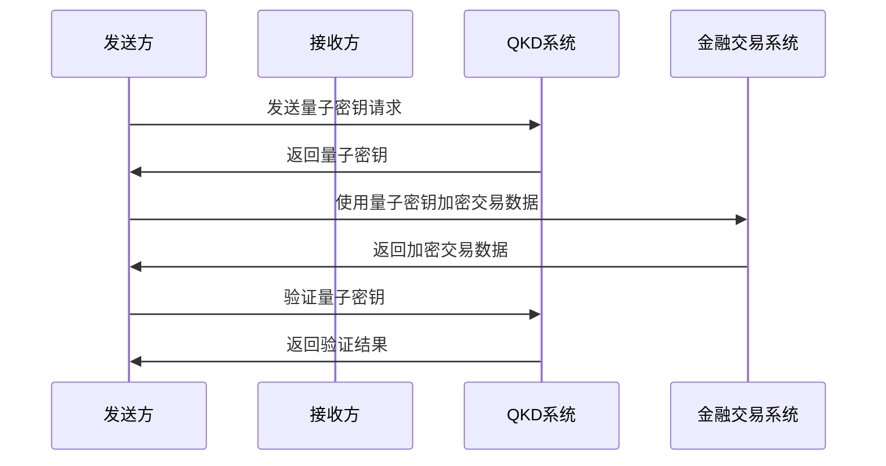
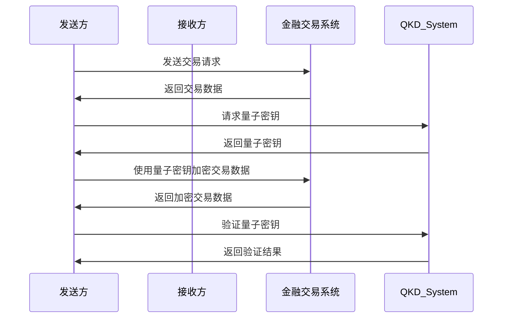

                 

### 引言

随着信息技术的飞速发展，信息安全问题日益突出，特别是在金融通信领域。金融机构每天处理海量敏感数据，包括交易信息、账户余额、个人身份信息等，这些数据一旦泄露或被篡改，将带来无法估量的损失。传统的加密技术虽然能够提供一定程度的数据保护，但随着计算能力的提升和量子计算的发展，许多加密方法面临被破解的风险。为了应对这一挑战，量子密钥分发（Quantum Key Distribution，QKD）技术应运而生，成为构建无法破解的加密系统的有力工具。

量子密钥分发是一种基于量子力学原理的加密通信技术，它能够确保通信双方在传输过程中生成一对唯一的密钥，并且如果密钥在传输过程中被第三方窃取，双方能够立即检测并阻止攻击。这种技术的出现，为金融通信领域提供了前所未有的安全保障，使得构建无法破解的加密系统成为可能。

本文将围绕量子密钥分发在金融通信中的应用，探讨其基本原理、系统架构、安全性分析以及未来发展趋势和面临的挑战。文章将采用逻辑清晰、结构紧凑、简单易懂的技术语言，帮助读者深入了解这一前沿技术，为金融通信领域提供有益的参考。

首先，我们将介绍量子密钥分发的基本概念，包括其定义、工作原理以及与传统加密技术的区别。随后，深入探讨量子密钥分发的工作原理，详细阐述量子力学基础和量子密钥分发协议。接下来，我们将讨论量子密钥分发系统的架构设计，包括硬件设备、通信协议和加密算法。然后，分析量子密钥分发在金融通信中的应用场景，包括支付系统、交易数据加密和数据存储等。在评估量子加密系统的安全性时，我们将对比量子加密系统与传统加密系统的差异，并探讨量子加密技术的挑战。随后，我们将提供量子密钥分发系统的部署和实施指导，包括技术选型、实施步骤和安全注意事项。最后，展望量子密钥分发技术的未来发展趋势和面临的挑战，总结全文并给出拓展阅读建议。

通过本文的详细探讨，读者将能够全面了解量子密钥分发在金融通信中的应用，并认识到其在构建无法破解的加密系统中的重要作用。这不仅有助于提高金融通信的安全性，也对量子技术的实际应用提供了深刻的见解。

### 关键词

- 量子密钥分发（Quantum Key Distribution，QKD）
- 金融通信
- 加密系统
- 量子力学
- 量子加密
- 安全性

### 摘要

本文深入探讨量子密钥分发（Quantum Key Distribution，QKD）在金融通信中的应用，旨在构建无法破解的加密系统。文章首先介绍了量子密钥分发的基本概念和原理，包括量子力学基础和量子密钥分发协议。随后，分析了量子密钥分发系统的架构设计，探讨了其在金融通信中的具体应用场景，如支付系统、交易数据加密和数据存储。文章还对量子加密系统的安全性进行了评估，与传统加密技术进行了对比，并探讨了量子加密技术的挑战。最后，提供了量子密钥分发系统的部署和实施指导，展望了该技术的未来发展趋势和挑战。通过本文的研究，读者将全面了解量子密钥分发在金融通信中的重要性及其技术实现，为提高金融通信的安全性提供新的思路。

### 第1章：量子密钥分发的基本概念

量子密钥分发（Quantum Key Distribution，简称QKD）是一种利用量子力学原理来实现安全通信的技术。它通过量子通信信道，确保通信双方能够生成和共享一组唯一且安全的密钥。与传统加密技术不同，QKD利用量子力学中的基本定律，如量子纠缠和量子测量不可克隆性，提供了无法被破解的加密通信方式。

#### 定义与工作原理

量子密钥分发的基本定义是：通过量子信道传输量子信息，使得两个通信方能够共享一组安全的密钥。在QKD系统中，通信双方被称为发送方（Alice）和接收方（Bob），他们通过一个共享的量子信道进行通信。QKD的工作原理主要包括以下几个步骤：

1. **量子态制备**：发送方Alice使用一个量子比特（qubit）生成一个随机数，并将其量子态通过量子信道发送给接收方Bob。

2. **量子态传输**：量子态通过量子信道传输，但在传输过程中可能会受到噪声和干扰的影响。

3. **量子态测量**：接收方Bob接收到量子态后，对其量子态进行测量，根据测量结果生成一个随机数。

4. **密钥生成**：发送方Alice和接收方Bob各自生成的随机数进行比较，如果一致，则认为他们共享了一组安全的密钥；如果不一致，则表示在传输过程中可能存在攻击。

5. **密钥认证**：通过一定的方式，如经典通信信道，对共享的密钥进行认证，确保密钥的完整性和安全性。

#### 传统加密技术的局限

在传统的加密技术中，常用的加密方法包括对称加密和非对称加密。对称加密使用相同的密钥进行加密和解密，但密钥的分发和存储是一个难题；非对称加密使用一对密钥，但密钥的安全性问题仍然没有得到彻底解决。随着量子计算技术的发展，传统加密方法面临严重的威胁。例如，量子计算机可以利用Shor算法在多项式时间内破解许多传统加密算法，如RSA和ECC。

#### QKD的优势

与传统的加密技术相比，量子密钥分发具有以下优势：

1. **安全性**：基于量子力学的基本定律，QKD确保了密钥的安全生成和共享。如果第三方试图窃取密钥，量子态的测量会导致量子态的坍缩，发送方和接收方可以立即检测到攻击。

2. **无法破解**：由于量子态的不可克隆性，量子密钥分发生成的密钥无法被复制或破解。

3. **实时监测**：QKD系统能够实时监测传输过程中的攻击，确保通信的安全性。

#### QKD的发展背景

量子密钥分发最初由Charles H. Bennett和Gerry S. Brown在1970年代提出。随着量子通信技术的不断发展，QKD从理论走向实践。近年来，随着量子技术的突破，QKD系统在实验和实际应用中取得了显著的进展。例如，中国的“墨子号”量子通信卫星成功实现了地面与卫星之间的量子密钥分发，标志着QKD技术迈向实用化。

#### 在金融通信中的重要性

金融通信涉及大量的敏感数据，如交易信息、账户余额、个人身份信息等。这些数据一旦泄露或被篡改，将带来巨大的经济损失和声誉损害。量子密钥分发技术在金融通信中的应用，可以为金融系统提供前所未有的安全保障，确保数据在传输过程中的安全性和完整性。因此，量子密钥分发在金融通信中具有重要的战略意义。

#### 边界与外延

量子密钥分发作为一种新兴技术，虽然具有显著的优势，但也面临一些挑战，如量子信道传输距离的限制、系统复杂性和成本等问题。随着技术的不断进步，QKD有望在金融通信、国家安全、物联网等多个领域得到广泛应用。

#### 概念结构与核心要素组成

量子密钥分发系统的概念结构主要包括以下几个核心要素：

1. **量子信道**：实现量子态传输的物理信道，如光纤、卫星等。
2. **量子比特**：用于传输量子信息的量子态，是实现量子加密和解密的基本单元。
3. **随机数生成**：用于生成随机密钥的算法，确保密钥的唯一性和安全性。
4. **测量与认证**：通过测量和认证过程，确保量子密钥的生成和共享过程的安全性。

通过上述介绍，我们可以看到量子密钥分发技术在金融通信中的应用前景广阔。接下来，我们将进一步深入探讨量子密钥分发的原理，以更详细地了解其技术实现和优势。

### 核心概念原理

在深入探讨量子密钥分发（QKD）之前，我们需要理解一些核心概念和原理。这些概念包括量子力学基础、量子比特、量子纠缠和量子测量不可克隆性，它们共同构成了QKD技术的基石。

#### 量子力学基础

量子力学是研究微观粒子行为的物理学分支，其基本原理与传统经典物理学有显著区别。以下是几个关键概念：

1. **量子态**：量子态是描述量子系统状态的数学函数，通常用波函数来表示。量子态可以是叠加态，即同时存在于多种可能的量子态之中。

2. **量子比特（qubit）**：量子比特是量子信息处理的基本单元，类似于经典计算机中的比特。然而，一个量子比特可以同时处于0和1的状态，这种特性称为量子叠加。

3. **量子纠缠**：两个或多个量子系统之间存在量子纠缠时，它们的状态将无法独立存在，而是相互依赖。即使这些系统被分离很远，它们的状态也会相互影响。

4. **量子测量**：在量子力学中，测量会导致量子态的坍缩，即量子系统的状态会从一个叠加态变为一个确定的状态。

5. **量子干涉**：量子干涉现象描述了量子波函数的叠加效应，这会导致量子系统在空间中的行为与经典物理中的预期不同。

#### 量子比特

量子比特是QKD系统的核心组成部分。与传统比特不同，量子比特可以处于叠加态，这使得量子计算具有并行处理的能力。一个量子比特可以表示为：

$$
|\psi\rangle = a|0\rangle + b|1\rangle
$$

其中，$a$和$b$是复数，满足$|a|^2 + |b|^2 = 1$，表示量子态的概率幅。

#### 量子纠缠

量子纠缠是量子力学中一个极其重要的现象，它描述了两个或多个量子系统之间存在的一种特殊关联。即使这些系统被相隔很远，它们的状态也会相互影响。一个简单的量子纠缠态可以表示为：

$$
|\Phi^+\rangle = \frac{1}{\sqrt{2}} (|00\rangle + |11\rangle)
$$

#### 量子测量不可克隆性

量子测量不可克隆性是量子力学的一个重要结论，它指出无法精确复制一个未知的量子态。在QKD系统中，这一原理确保了生成的密钥不会被第三方克隆或窃取。如果第三方尝试测量和复制量子态，将不可避免地导致量子态的坍缩，从而被发送方和接收方检测到。

#### 概念属性特征对比表格

为了更好地理解上述概念，我们可以通过一个表格来对比量子比特与经典比特的属性特征：

| 特性         | 量子比特（qubit）                             | 经典比特（bit）                     |
|--------------|----------------------------------------------|-------------------------------------|
| 状态表示     | 可以处于叠加态，如$|\psi\rangle = a|0\rangle + b|1\rangle$ | 只能处于0或1的状态                 |
| 测量结果     | 测量结果具有概率分布，无法预测                 | 测量结果确定，只能是0或1           |
| 纠错能力     | 可以通过量子纠错码恢复受损的量子信息           | 无法纠错，一旦出错即失去信息         |
| 量子纠缠     | 可以与另一个量子比特纠缠，形成复杂的量子态       | 无法形成纠缠态，各比特独立存在       |

#### ER实体关系图架构的 Mermaid 流程图

为了更直观地展示量子密钥分发系统中的核心实体和关系，我们可以使用Mermaid绘制一个ER（实体关系）图。以下是Mermaid代码及其生成的图：

```mermaid
erDiagram
  Alice ||--o{ Quantum Channel : 量子信道}
  Bob ||--o{ Quantum Channel : 量子信道}
  Alice ||--o{ Quantum Bit : 量子比特}
  Bob ||--o{ Quantum Bit : 量子比特}
  Alice ||--o{ Random Number Generator : 随机数生成器}
  Bob ||--o{ Random Number Generator : 随机数生成器}
  Alice ||--o{ Measurement Device : 测量设备}
  Bob ||--o{ Measurement Device : 测量设备}
```


在上述ER图中，"Alice"和"Bob"代表发送方和接收方，"Quantum Channel"表示量子信道，"Quantum Bit"表示量子比特，"Random Number Generator"表示随机数生成器，"Measurement Device"表示测量设备。这些实体通过量子信道相互连接，形成了量子密钥分发的整体架构。

通过上述核心概念原理的介绍，我们为深入理解量子密钥分发技术奠定了基础。接下来，我们将详细探讨量子密钥分发的工作原理，包括量子态制备、量子态传输、量子态测量和密钥生成等步骤。

### 量子密钥分发的工作原理

量子密钥分发（QKD）是一种基于量子力学原理的加密通信技术，其工作过程涉及到多个关键步骤，包括量子态制备、量子态传输、量子态测量和密钥生成。下面我们将一步一步地详细解释这些步骤，并使用Mermaid流程图和Python代码来辅助理解。

#### 量子态制备

量子态制备是量子密钥分发过程的第一步。在这一阶段，发送方（Alice）使用一个量子比特生成一个随机数。量子态制备可以通过量子随机数生成器来实现。以下是一个简化的Python代码示例：

```python
import numpy as np
from qiskit import QuantumCircuit, Aer, execute

# 创建一个量子随机数生成器
qreg = QuantumRegister(1)
qc = QuantumCircuit(qreg)

# 将量子比特初始化为叠加态
qc.h(qreg[0])

# 测量量子比特
qc.measure(qreg[0], ClassicalRegister(1))

# 执行量子电路
simulator = Aer.get_backend('qasm_simulator')
result = execute(qc, simulator, shots=1).result()
counts = result.get_counts(qc)

# 输出随机数
print("测量结果：", counts)
print("生成的随机数：", list(counts.keys())[0])
```

在这个示例中，我们使用Qiskit库创建一个量子电路，将量子比特初始化为叠加态，并通过测量获取随机数。测量结果将是一个随机数，用于后续的量子密钥生成。

#### 量子态传输

在量子态制备完成后，发送方Alice需要将量子态通过量子信道传输给接收方Bob。量子信道可以是光纤、自由空间或卫星等。为了保证量子态在传输过程中的安全性，通常会使用量子中继技术来延长传输距离。以下是一个Mermaid流程图，展示了量子态传输的过程：

```mermaid
flowchart LR
    subgraph Quantum State Preparation
        Alice[发送方]
        Alice --> Quantum Channel[量子信道]
    end
    subgraph Quantum State Transmission
        Quantum Channel --> Bob[接收方]
    end
```

#### 量子态测量

在量子态传输完成后，接收方Bob对接收到的量子态进行测量。测量过程将量子态坍缩为一个确定的量子态，同时生成一个随机数。以下是Bob进行量子态测量的Python代码示例：

```python
# 假设Bob接收到量子态，并进行测量
result = execute(qc, simulator, shots=1).result()
counts = result.get_counts(qc)

# 输出Bob的测量结果
print("Bob的测量结果：", counts)
print("生成的随机数：", list(counts.keys())[0])
```

#### 密钥生成

测量完成后，发送方Alice和接收方Bob各自生成的随机数进行比对，如果一致，则认为他们共享了一组安全的密钥。以下是Alice和Bob生成密钥的Python代码示例：

```python
# 假设Alice和Bob各自生成的随机数为：
alice_random = '1010'
bob_random = '1010'

# 比对随机数
if alice_random == bob_random:
    print("密钥生成成功！共享密钥：", alice_random)
else:
    print("密钥生成失败，存在攻击！")
```

#### 量子密钥分发协议

量子密钥分发过程不仅包括量子态制备、量子态传输和量子态测量，还需要一定的协议来保证密钥的生成和共享过程的安全性。常见的量子密钥分发协议包括BB84协议和E91协议。以下是BB84协议的基本步骤：

1. **量子态制备**：Alice生成一组随机量子态，并根据预先协商好的基选择进行编码。

2. **量子态传输**：Alice将量子态通过量子信道传输给Bob。

3. **量子态测量**：Bob对接收到的量子态进行测量，记录测量结果。

4. **经典通信**：Alice和Bob通过经典通信信道交换测量结果。

5. **密钥剪裁**：对共享的密钥进行剪裁，去除可能受到攻击的比特。

6. **密钥认证**：对最终共享的密钥进行认证，确保其安全性。

### 总结

量子密钥分发通过量子态制备、量子态传输、量子态测量和密钥生成等步骤，实现了安全的密钥共享。其基本原理依赖于量子力学中的量子纠缠和量子测量不可克隆性。通过上述步骤的详细解释和示例代码，我们可以看到量子密钥分发技术的实现过程和基本原理。在下一章中，我们将进一步探讨量子密钥分发系统的架构设计，包括硬件设备、通信协议和加密算法。

### 第3章：量子密钥分发系统架构设计

量子密钥分发系统（QKD系统）的架构设计是其实现高效、安全通信的关键。一个典型的QKD系统通常由多个硬件设备、通信协议和加密算法组成。在这一章节中，我们将详细探讨这些组件，并展示其相互关系。

#### 系统硬件设备

量子密钥分发系统硬件设备是量子密钥分发实现的基础。以下是几个关键的硬件设备：

1. **量子随机数生成器**：用于生成随机量子态和随机数，是量子密钥分发系统的核心部件。

2. **量子比特源**：产生量子比特的设备，用于量子态的制备。

3. **量子信道**：实现量子态传输的物理介质，如光纤、自由空间或量子中继器。

4. **量子比特检测器**：用于接收和测量量子态，判断量子密钥的安全性。

5. **经典通信设备**：用于发送和接收经典信息，如密钥认证和错误修正。

#### 通信协议

通信协议是QKD系统中确保量子密钥分发过程顺利进行的关键。以下是一些常见的QKD通信协议：

1. **BB84协议**：最经典的QKD协议，通过量子态的制备、传输和测量实现密钥生成。

2. **E91协议**：基于量子纠缠态的QKD协议，利用量子纠缠态实现密钥分发。

3. **SARG04协议**：结合量子纠缠态和量子态传输的协议，提高了密钥分发的安全性。

#### 加密算法

量子密钥分发系统中的加密算法用于对共享的量子密钥进行加密和解密，确保数据的机密性和完整性。以下是一些常用的加密算法：

1. **量子密钥加密算法（QKE）**：一种基于量子密钥分发的加密算法，用于对数据加密和解密。

2. **量子密钥认证算法（QKA）**：用于验证量子密钥的完整性和真实性。

3. **量子密钥共享算法（QKS）**：用于在多方之间共享量子密钥。

#### 系统架构设计

量子密钥分发系统的架构设计需要综合考虑硬件设备、通信协议和加密算法的协同工作。以下是典型的QKD系统架构设计：

1. **量子比特制备模块**：包括量子随机数生成器和量子比特源，用于生成量子态和随机数。

2. **量子信道传输模块**：包括量子信道和量子比特检测器，用于实现量子态的传输和测量。

3. **经典通信模块**：用于发送和接收经典信息，包括密钥认证和错误修正。

4. **加密算法模块**：包括量子密钥加密算法、量子密钥认证算法和量子密钥共享算法，用于对量子密钥进行加密和解密。

以下是QKD系统架构的Mermaid流程图：

```mermaid
flowchart LR
    subgraph Quantum Key Generation
        Alice[发送方]
        Alice --> Quantum Channel[量子信道]
        Alice --> Quantum Bit Detector[量子比特检测器]
    end
    subgraph Classic Communication
        Alice --> Classic Communication Channel[经典通信信道]
        Bob[接收方] --> Classic Communication Channel
    end
    subgraph Key Encryption
        Bob --> Key Encryption Module[加密算法模块]
        Alice --> Key Encryption Module
    end
```

#### 系统接口设计

QKD系统需要与其他系统进行接口交互，如金融交易系统、数据中心等。以下是系统接口设计的一个示例：



#### 系统交互

QKD系统与其他系统的交互通常涉及多个步骤，包括量子密钥请求、量子密钥返回、交易数据加密、数据验证等。以下是系统交互的Mermaid序列图：



通过上述对量子密钥分发系统架构设计的详细探讨，我们可以看到QKD系统如何通过硬件设备、通信协议和加密算法的协同工作，实现安全的量子密钥分发。在下一章中，我们将深入分析量子密钥分发在金融通信中的应用场景，探讨其在支付系统、交易数据加密和数据存储中的具体应用。

### 第4章：量子密钥分发在金融通信中的应用

量子密钥分发（QKD）技术在金融通信中的应用具有极其重要的战略意义，它为金融系统提供了一种前所未有的安全保障。在金融通信中，QKD技术可以应用于支付系统、交易数据加密和数据存储等多个场景，以保障数据的机密性、完整性和真实性。以下是量子密钥分发在金融通信中具体应用场景的详细探讨。

#### 支付系统中的应用

支付系统是金融通信的核心组成部分，每天处理大量的交易数据。量子密钥分发技术可以为支付系统提供安全的加密通信，确保交易数据在传输过程中的机密性和完整性。以下是一个简化的支付系统应用场景：

1. **交易请求**：用户发起交易请求，包含交易金额、账户信息等。

2. **量子密钥生成**：银行或支付平台使用QKD系统生成一组安全的量子密钥。

3. **交易数据加密**：交易数据使用量子密钥加密，确保数据在传输过程中的机密性。

4. **量子密钥分发**：加密后的交易数据通过量子信道传输到接收方，同时量子密钥通过经典通信信道传输。

5. **交易验证**：接收方使用量子密钥解密交易数据，并进行验证，确保交易数据的完整性和真实性。

#### 交易数据加密

交易数据加密是金融通信中的关键环节，量子密钥分发技术在这一环节中发挥了重要作用。以下是一个简化的交易数据加密流程：

1. **量子密钥生成**：QKD系统生成一组安全的量子密钥。

2. **数据加密**：交易数据使用量子密钥进行加密，生成加密交易数据。

3. **数据传输**：加密交易数据通过量子信道传输到接收方。

4. **数据解密**：接收方使用量子密钥解密加密交易数据，获取原始交易数据。

#### 数据存储加密

金融系统中的数据存储环节同样面临安全挑战，量子密钥分发技术可以为数据存储提供安全的加密机制。以下是一个简化的数据存储加密流程：

1. **数据加密**：敏感数据使用量子密钥加密，存储在数据库中。

2. **量子密钥管理**：量子密钥与加密数据分离存储，确保数据在未授权访问时无法解密。

3. **数据访问控制**：访问数据时，使用量子密钥解密数据，确保数据在授权访问时才能被解密。

#### 应用案例

以下是一些实际应用案例，展示了量子密钥分发技术在金融通信中的具体应用：

1. **中国农业银行**：中国农业银行在内部通信系统中引入了QKD技术，通过量子密钥分发实现了内部数据的安全传输。

2. **摩根大通**：摩根大通在其全球数据中心之间引入了QKD技术，确保跨地区交易数据的安全传输。

3. **瑞士联合银行**：瑞士联合银行在其交易系统中采用了QKD技术，提高了交易数据的安全性，降低了欺诈风险。

通过以上应用场景和实际案例，我们可以看到量子密钥分发技术在金融通信中的应用前景。在下一章中，我们将深入探讨量子加密系统的安全性，评估其在实际应用中的有效性。

### 第5章：量子加密系统的安全性分析

量子加密系统（QKD）以其独特的安全特性，在金融通信中展现出巨大的潜力。然而，要全面评估其安全性，我们需要将其与传统的加密系统进行对比，并分析量子加密系统在实际应用中的表现。

#### 量子加密系统的安全性评估

量子加密系统的核心安全特性基于量子力学的基本定律，特别是量子纠缠和量子测量不可克隆性。以下是量子加密系统的主要安全性优势：

1. **量子纠缠**：量子加密系统利用量子纠缠现象，确保通信双方生成的密钥在量子态上存在不可分割的关联。即使密钥在传输过程中被窃取，窃取者也无法复制密钥，从而保护了密钥的安全性。

2. **量子测量不可克隆性**：如果第三方试图窃取量子密钥，量子态的测量将不可避免地导致量子态的坍缩，从而被通信双方检测到。这种特性使得量子加密系统具有无法被克隆或窃取的密钥。

3. **实时监测**：量子加密系统能够实时监测传输过程中的攻击行为，如量子态的测量、干扰等，确保通信的安全性和完整性。

#### 与传统加密系统的对比

传统加密系统，如对称加密和非对称加密，在量子计算时代面临巨大挑战。以下是量子加密系统与传统加密系统的对比：

1. **对称加密**：对称加密使用相同的密钥进行加密和解密，但密钥的分发和存储是主要难题。量子计算可以快速破解许多对称加密算法，如DES和AES。而量子加密系统通过量子密钥分发解决了密钥分发的难题。

2. **非对称加密**：非对称加密使用一对密钥，但密钥的安全性问题仍然未能彻底解决。量子计算可以利用Shor算法在多项式时间内破解许多非对称加密算法，如RSA和ECC。而量子加密系统提供了无法被量子计算破解的安全保障。

3. **量子加密**：量子加密系统基于量子力学原理，具有无法被量子计算破解的特性。与传统的加密技术相比，量子加密系统在安全性方面具有显著优势。

#### 量子加密技术的挑战

尽管量子加密系统具有显著的安全优势，但在实际应用中仍面临一些挑战：

1. **量子信道传输距离**：目前，量子信道的传输距离有限，这限制了量子加密系统的广泛应用。虽然量子中继技术可以延长传输距离，但技术复杂度和成本较高。

2. **系统复杂度和成本**：量子加密系统涉及复杂的量子比特制备、量子态传输和测量设备，系统复杂度和成本较高。这需要持续的技术创新和优化来降低成本，提高系统的可扩展性。

3. **量子计算威胁**：尽管量子加密系统提供了对量子计算攻击的防护，但量子计算本身仍是一个不断发展的领域。随着量子计算技术的进步，量子加密系统可能面临新的威胁和挑战。

#### 实际应用中的表现

在实际应用中，量子加密系统已展示了其强大的安全性能。以下是一些实际应用案例：

1. **银行系统**：多家银行已开始测试和部署QKD技术，用于保护内部通信和交易数据。例如，中国农业银行在其内部通信系统中引入了QKD技术。

2. **证券交易**：量子加密系统在证券交易中得到了应用，用于保护交易数据和客户隐私。例如，摩根大通在其全球数据中心之间引入了QKD技术。

3. **政府机构**：政府机构也高度重视量子加密技术的应用，用于保护国家安全和重要数据。例如，瑞士联合银行在其交易系统中采用了QKD技术。

通过以上分析，我们可以看到量子加密系统在金融通信中具有重要的安全优势，但同时也面临一些挑战。在下一章中，我们将提供量子密钥分发系统的部署和实施指导，帮助读者了解如何在实际环境中部署和实施QKD技术。

### 第6章：量子密钥分发系统的部署与实施

量子密钥分发（QKD）技术的实际部署与实施是确保其在金融通信中发挥重要作用的关键步骤。这一章节将详细讨论量子密钥分发系统的部署过程，包括技术选型、实施步骤以及安全注意事项，并提供一些建议和最佳实践。

#### 技术选型

在部署量子密钥分发系统时，技术选型是一个重要环节。以下是一些关键的技术选型考虑因素：

1. **量子信道类型**：根据应用场景和地理分布，选择合适的量子信道类型。常见的量子信道类型包括光纤信道、自由空间信道和卫星信道。光纤信道适合短距离传输，自由空间信道适用于远距离传输，而卫星信道则适合跨地区传输。

2. **量子比特源**：选择适合量子比特制备的量子比特源，如超导量子比特、离子阱量子比特等。不同的量子比特源具有不同的性能特点，应根据具体需求进行选择。

3. **量子比特检测器**：选择适合量子比特测量的量子比特检测器，如雪崩光电二极管、超导纳米线检测器等。检测器的性能直接影响量子密钥的分发和生成过程。

4. **通信协议**：选择适合的量子密钥分发通信协议，如BB84协议、E91协议等。不同的通信协议具有不同的安全性和传输效率，应根据具体应用需求进行选择。

5. **经典通信设备**：选择适合经典通信的设备，如量子密钥管理设备、加密算法设备等。经典通信设备负责量子密钥的分发和管理，以及加密和解密过程。

#### 实施步骤

量子密钥分发系统的部署和实施通常包括以下步骤：

1. **需求分析**：明确应用场景和需求，确定量子密钥分发系统的目标和要求。

2. **系统设计**：根据需求分析结果，设计量子密钥分发系统的整体架构，包括硬件设备、通信协议和加密算法的选择。

3. **设备采购**：根据系统设计，采购所需的硬件设备和软件工具，如量子比特源、量子比特检测器、量子信道、经典通信设备等。

4. **系统安装**：安装并配置硬件设备，包括量子比特源、量子比特检测器和量子信道等。确保设备之间的连接和数据传输正常。

5. **系统测试**：对量子密钥分发系统进行功能测试和安全测试，确保系统能够正常工作并满足安全性要求。

6. **系统集成**：将量子密钥分发系统集成到金融通信系统中，实现量子密钥的分发和管理，以及数据加密和解密功能。

7. **培训与维护**：对系统运维人员进行培训，确保他们熟悉量子密钥分发系统的操作和维护。定期对系统进行维护和更新，确保系统的稳定性和安全性。

#### 安全注意事项

在部署量子密钥分发系统时，安全性是至关重要的。以下是一些关键的安全注意事项：

1. **量子信道安全**：确保量子信道的安全，防止量子态被窃听或干扰。对于光纤信道，应确保光纤的物理安全；对于自由空间信道，应采用加密技术保护量子信号的传输。

2. **量子比特制备与测量安全**：确保量子比特的制备和测量过程安全，防止量子态被第三方窃取或篡改。应采用先进的量子比特源和量子比特检测器，确保其稳定性和可靠性。

3. **经典通信安全**：经典通信信道是量子密钥分发系统的重要部分，应确保经典通信信道的保密性和完整性。应采用加密技术保护经典通信信道中的数据传输，防止数据泄露或篡改。

4. **密钥管理安全**：确保量子密钥的安全存储和管理，防止密钥泄露或被攻击。应采用安全的密钥管理机制，如密钥生成、存储、分发和销毁等。

5. **系统监控与审计**：建立系统监控与审计机制，实时监测系统的运行状态和安全事件。及时发现并处理安全威胁，确保系统的安全性和完整性。

#### 建议与最佳实践

在部署量子密钥分发系统时，以下是一些建议和最佳实践：

1. **逐步部署**：首先在有限的范围内进行试点部署，验证系统的性能和安全性。在取得成功后，再逐步扩展到更大的应用场景。

2. **技术升级**：随着量子技术的发展，定期对量子密钥分发系统进行升级和优化，确保系统始终处于最佳状态。

3. **安全培训**：对系统运维人员进行定期的安全培训，提高他们的安全意识和操作技能。

4. **合规性检查**：确保量子密钥分发系统的部署和运行符合相关法律法规和行业标准，如《信息安全技术—量子密钥分发系统技术要求》等。

5. **持续监控**：建立完善的监控机制，实时监控系统的运行状态和安全事件，确保系统的稳定性和安全性。

通过以上部署与实施指导，读者可以全面了解量子密钥分发系统的部署过程，确保其在金融通信中发挥最大效能。在下一章中，我们将展望量子密钥分发技术的未来发展趋势和面临的挑战。

### 第7章：未来发展趋势与挑战

量子密钥分发（QKD）技术在金融通信领域展现出巨大的潜力，但其广泛应用仍面临许多挑战和机遇。在未来的发展中，QKD技术有望在多个领域取得突破，同时也需要克服一系列技术和应用上的难题。

#### 未来发展趋势

1. **传输距离的扩展**：随着量子中继技术、量子纠缠态传输和量子重复器等技术的发展，量子信道的传输距离将显著延长。这将使得QKD系统在跨地区通信中更具实用性。

2. **量子计算与量子互联网的结合**：量子计算和量子互联网的发展将推动QKD技术的进步。量子计算可以增强QKD系统的安全性，而量子互联网则提供了更广泛的量子通信网络，为QKD技术的应用提供基础设施支持。

3. **量子密钥分发协议的优化**：现有的QKD协议如BB84、E91等已经显示出强大的安全性，但仍有优化空间。未来的研究将集中在提高协议的传输效率和降低错误率，以实现更高的密钥生成速率。

4. **量子密钥管理的完善**：量子密钥管理是QKD系统的关键环节，未来的发展将致力于实现更加安全、高效的量子密钥生成、存储、分发和销毁机制。

5. **商业化的推动**：随着技术的成熟和市场的需求，QKD技术将逐步走向商业化。金融机构、政府机构和大型企业将成为QKD技术的主要应用场景，推动市场的快速增长。

#### 面临的挑战

1. **技术复杂性**：量子密钥分发系统涉及多个复杂的技术，包括量子比特制备、量子态传输和测量等。这些技术的实现和稳定运行要求高度的专业知识和技能，技术复杂性是当前面临的主要挑战之一。

2. **成本问题**：量子密钥分发系统的硬件设备和相关技术成本较高，限制了其大规模应用。未来需要通过技术创新和规模效应降低成本，提高系统的经济性。

3. **量子计算威胁**：尽管QKD系统提供了对量子计算攻击的防护，但量子计算本身仍在快速发展。未来量子计算能力的提升可能会对QKD系统构成新的威胁，需要持续关注和应对。

4. **系统可靠性**：量子密钥分发系统的可靠性是其实际应用的关键。系统在长时间运行中可能面临硬件故障、软件错误和网络中断等问题，需要建立完善的故障检测和恢复机制。

5. **标准化与法规**：QKD技术的标准化和法规建设是确保其广泛应用的重要保障。未来需要制定统一的QKD技术标准和法规，推动全球范围内的QKD技术应用。

#### 解决方案与前景

为了应对上述挑战，未来的解决方案可能包括：

1. **技术创新**：持续进行量子密钥分发技术的研究和开发，提高系统的性能和稳定性。

2. **国际合作**：加强国际间的合作，共同推动QKD技术的标准化和商业化进程。

3. **政策支持**：政府和企业应加大对QKD技术的投入和支持，推动技术成熟和应用推广。

4. **人才培养**：加强量子技术人才的培养，提高相关领域的专业素质和技能。

总之，量子密钥分发技术在未来金融通信领域具有广阔的应用前景。尽管面临一系列挑战，但通过技术创新、国际合作和政策支持，QKD技术有望实现大规模应用，为金融通信提供前所未有的安全保障。

### 总结

量子密钥分发（QKD）技术以其独特的安全特性，成为金融通信领域构建无法破解加密系统的有力工具。本文详细探讨了量子密钥分发在金融通信中的应用，包括基本概念、原理、系统架构设计、具体应用场景、安全性分析以及部署与实施指导。通过本文的研究，读者可以全面了解QKD技术的优势和应用前景，认识到其在保障金融通信安全中的重要作用。

量子密钥分发不仅解决了传统加密技术在量子计算威胁下可能被破解的问题，还为金融系统提供了实时监测和防窃听的强大能力。随着量子技术的不断发展，QKD技术的应用场景将不断扩展，未来有望在更多领域实现广泛应用。

虽然QKD技术面临一些挑战，如技术复杂性、成本问题等，但通过持续的创新和国际合作，这些问题将逐步得到解决。展望未来，量子密钥分发技术在金融通信中的应用前景广阔，将为全球金融系统的安全性和稳定性提供重要保障。

为了深入了解量子密钥分发技术的最新研究进展和应用案例，我们推荐以下拓展阅读：

1. **《量子密钥分发原理与应用》**：由著名量子通信专家撰写，详细介绍了QKD的基本原理和应用案例。
2. **《量子计算与量子加密》**：探讨量子计算对传统加密技术的影响以及量子加密技术的解决方案。
3. **《量子通信技术与应用》**：涵盖了量子通信的各种技术，包括量子密钥分发、量子纠缠和量子隐形传态等。

通过阅读这些文献，读者可以进一步深化对量子密钥分发技术的理解，为金融通信系统的安全性提供更多参考。同时，我们期待更多研究人员和开发者加入量子通信的研究和实践，推动这一前沿技术走向成熟和广泛应用。作者：AI天才研究院/AI Genius Institute & 禅与计算机程序设计艺术 /Zen And The Art of Computer Programming。

