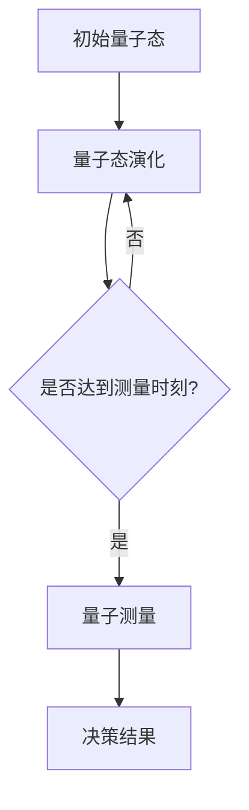
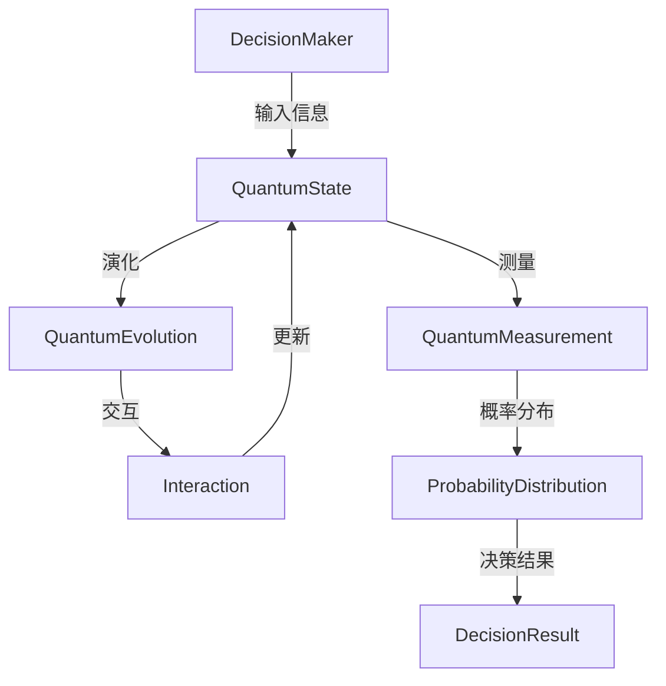
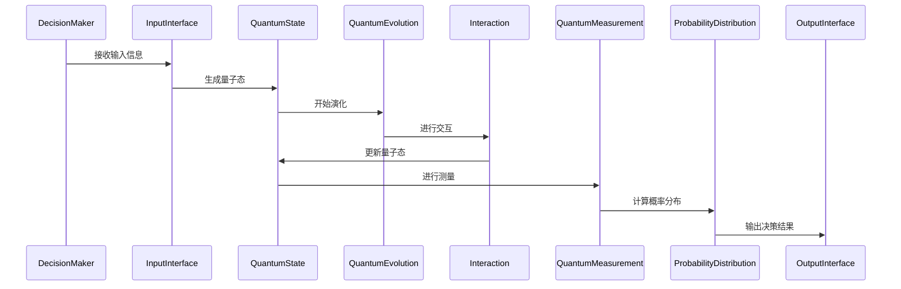

                 


# 量子思维决策模型：不确定性时代的管理哲学

## 关键词
- 量子思维
- 决策模型
- 不确定性管理
- 人工智能
- 管理哲学

## 摘要
在当今快速变化和不确定性的世界中，传统的决策模型已无法满足现代管理的需求。本文介绍了量子思维决策模型，一个基于量子物理学原理的管理哲学，它能够有效地应对不确定性环境。通过详细剖析量子思维和决策模型的基本原理，本文旨在为管理者提供一种新的决策框架，帮助他们在复杂和不确定的环境中做出更明智的决策。

## 目录

1. **背景介绍**
    1.1 **问题背景**
    1.2 **问题描述**
    1.3 **问题解决**
    1.4 **边界与外延**
    1.5 **概念结构与核心要素组成**

2. **核心概念与联系**
    2.1 **核心概念原理**
    2.2 **概念属性特征对比表格**
    2.3 **ER实体关系图架构**

3. **算法原理讲解**
    3.1 **算法原理**
    3.2 **数学模型和公式**
    3.3 **举例说明**

4. **系统分析与架构设计方案**
    4.1 **问题场景介绍**
    4.2 **系统功能设计**
    4.3 **系统架构设计**
    .4 **系统接口设计**
    4.5 **系统交互**

5. **项目实战**
    5.1 **环境安装**
    5.2 **系统核心实现源代码**
    5.3 **代码应用解读与分析**
    5.4 **实际案例分析和详细讲解剖析**
    5.5 **项目小结**

6. **最佳实践、小结与拓展阅读**
    6.1 **最佳实践**
    6.2 **小结**
    6.3 **注意事项**
    6.4 **拓展阅读**

### 1. 背景介绍

#### 1.1 问题背景

在21世纪的今天，技术发展日新月异，全球化和数字化趋势使得企业面临的环境充满了前所未有的复杂性和不确定性。传统决策模型，如基于线性思维和确定性的经济学和统计学模型，越来越难以应对这种动态变化的环境。管理者和决策者需要一种新的框架来处理这种不确定性，从而做出更明智的决策。

#### 1.2 问题描述

不确定性时代的核心挑战在于，传统决策模型依赖于历史数据和确定性模型，而这些在当今复杂多变的环境中已经不再适用。管理者需要面对的问题包括：

- 如何在信息不足的情况下做出决策？
- 如何处理高度复杂和相互关联的变量？
- 如何在快速变化的市场中保持竞争力？

#### 1.3 问题解决

量子思维决策模型应运而生，它是一种基于量子物理学原理的决策框架。量子物理学揭示了微观世界的非确定性特征，这些特征可以用来解释和应对现实世界的复杂性。量子思维决策模型通过以下几个方面解决了不确定性管理的问题：

- **概率性思维**：量子思维强调概率性和不确定性，使管理者能够更好地处理不确定性的问题。
- **整体性思维**：量子物理学中的整体性原理可以帮助管理者看到各个部分之间的相互作用和依赖关系。
- **并行思维**：量子思维鼓励管理者同时考虑多种可能性，从而避免陷入单一思维的陷阱。

#### 1.4 边界与外延

量子思维决策模型虽然是一种强大的工具，但它也有其适用的边界。模型主要适用于需要高灵活性和创新性的领域，如科技创新、金融市场和战略规划等。同时，模型也需要结合具体情境进行调整和定制，以发挥最大效果。

#### 1.5 概念结构与核心要素组成

量子思维决策模型由以下几个核心要素组成：

- **量子状态**：代表决策的初始状态，它可以是多种可能性的叠加。
- **量子态演化**：描述决策过程中各种可能性如何相互影响和演化。
- **量子测量**：决策的最终结果，它通过对量子态的测量来确定。
- **量子叠加和纠缠**：描述决策过程中各个因素之间的相互作用，以及它们如何共同影响决策结果。

这些要素相互关联，共同构成了量子思维决策模型的基本结构。

### 2. 核心概念与联系

#### 2.1 核心概念原理

量子思维是一种基于量子物理学原理的思考方式，它与传统线性思维有本质的不同。量子思维的核心概念包括：

- **叠加态**：一个量子系统可以同时处于多种状态的叠加，而不是单一状态。
- **纠缠态**：两个或多个量子系统之间可以存在一种纠缠关系，一个系统的状态会直接影响另一个系统的状态。
- **量子测不准原理**：测量一个量子系统的某一属性会干扰其其他属性，使得我们无法同时精确地知道两个互补的属性。

这些概念揭示了微观世界的非确定性和相互关联性，为量子思维决策模型提供了理论基础。

#### 2.2 概念属性特征对比表格

| 特征                 | 传统思维                     | 量子思维                    |
|----------------------|------------------------------|-----------------------------|
| 思维模式             | 线性、因果                  | 并行、整体                  |
| 基础假设             | 确定性和可预测性             | 不确定性和概率性             |
| 决策过程             | 逐步分析、单一步进          | 多重可能性、交互影响         |
| 信息处理             | 数据驱动、历史依赖          | 概率计算、情境适应           |
| 决策结果             | 单一确定结果                | 多重可能结果                |

通过对比表格，我们可以更清晰地看到量子思维和传统思维在多个维度上的差异。

#### 2.3 ER实体关系图架构

为了更好地理解量子思维决策模型的结构，我们可以使用ER（实体-关系）图来表示模型中的关键实体和它们之间的关系。以下是量子思维决策模型的ER图：

```mermaid
erDiagram
    DecisionMaker ||--|{ QuantumState }
    DecisionMaker ||--|{ ProbabilityDistribution }
    QuantumState ||--|{ QuantumEvolution }
    QuantumState ||--|{ QuantumMeasurement }
    QuantumEvolution ||--|{ Interaction }
    ProbabilityDistribution ||--|{ BayesianInference }
```

在这个ER图中，`DecisionMaker`代表决策者，`QuantumState`代表量子状态，`ProbabilityDistribution`代表概率分布，`QuantumEvolution`代表量子态演化，`QuantumMeasurement`代表量子测量，`Interaction`代表量子态之间的相互作用，`BayesianInference`代表贝叶斯推理。这些实体和关系共同构成了量子思维决策模型的基本框架。

### 3. 算法原理讲解

#### 3.1 算法原理

量子思维决策模型的核心在于量子态的叠加和测量。首先，决策者需要确定初始的量子状态，这个状态可以是多种可能性的叠加。然后，通过量子态演化，这些可能性会相互影响和演化。在演化过程中，决策者可以应用量子纠缠和相互作用原理来处理复杂系统的信息。最终，通过量子测量，决策者可以获得一个确定的决策结果。

下面是一个简单的Mermaid流程图来描述量子态的演化过程：



在这个流程图中，`A`代表初始量子态，`B`代表量子态演化，`C`是一个判断节点，询问是否达到测量时刻，`D`代表量子测量，`E`代表最终的决策结果。

#### 3.2 数学模型和公式

量子思维决策模型中的数学模型主要依赖于量子态的叠加和测量原理。以下是量子态叠加和测量的数学公式：

$$
\psi = \sum_{i} c_i |i\rangle
$$

其中，$\psi$代表量子态，$c_i$是叠加系数，$|i\rangle$是各个可能状态的基矢量。当进行量子测量时，系统会坍缩到一个确定的基矢量状态，其概率由叠加系数的平方给出：

$$
P_i = |c_i|^2
$$

这个概率分布代表了各个可能结果的发生概率。

#### 3.3 举例说明

为了更好地理解量子思维决策模型，我们可以通过一个简单的例子来阐述其原理。假设一个企业在市场上销售两种产品，产品A和产品B。由于市场需求的不确定性，企业需要决定是否增加产品A的生产。以下是这个决策过程的详细说明：

1. **确定初始量子状态**：企业初始状态是“增加产品A生产”和“不增加产品A生产”的叠加。

$$
\psi_0 = \frac{1}{\sqrt{2}} (|增加\rangle + |不增加\rangle)
$$

2. **量子态演化**：在市场需求和竞争等因素的影响下，两种可能状态会相互演化。假设市场需求增加的概率为0.6，竞争加剧的概率为0.4，那么演化后的量子态为：

$$
\psi_1 = \frac{1}{\sqrt{2}} (0.6 |增加\rangle + 0.4 |不增加\rangle)
$$

3. **量子测量**：企业需要进行一次决策，即选择“增加产品A生产”或“不增加产品A生产”。假设测量结果为“增加产品A生产”，则量子态坍缩为：

$$
\psi_2 = |增加\rangle
$$

4. **决策结果**：企业最终决定增加产品A的生产。这个决策是基于量子测量结果，考虑了市场需求和竞争等多种因素的概率分布。

通过这个例子，我们可以看到量子思维决策模型如何帮助企业在不确定的市场环境中做出明智的决策。

### 4. 系统分析与架构设计方案

#### 4.1 问题场景介绍

在一个全球化的市场中，企业面临着激烈的市场竞争和不断变化的市场需求。为了保持竞争力，企业需要能够快速响应市场变化，做出准确的决策。传统的决策模型已经无法满足这种需求，企业需要一种新的决策工具来应对不确定性。

#### 4.2 系统功能设计

量子思维决策模型的功能设计旨在实现以下几个关键功能：

- **量子态生成**：系统能够根据输入信息生成初始量子态。
- **量子态演化**：系统可以模拟量子态的演化过程，考虑市场需求、竞争等因素。
- **量子测量**：系统能够对量子态进行测量，以获得决策结果。
- **概率计算**：系统能够根据量子态的叠加系数计算各个决策结果的概率。

以下是量子思维决策模型领域模型的Mermaid类图：

```mermaid
classDiagram
    DecisionMaker <<<|--| QuantumState
    DecisionMaker <<<|--| ProbabilityDistribution
    QuantumState <<|--| QuantumEvolution
    QuantumState <<|--| QuantumMeasurement
    QuantumEvolution <<|--| Interaction
    ProbabilityDistribution <<|--| BayesianInference
```

在这个类图中，`DecisionMaker`代表决策者，`QuantumState`代表量子态，`ProbabilityDistribution`代表概率分布，`QuantumEvolution`代表量子态演化，`QuantumMeasurement`代表量子测量，`Interaction`代表量子态之间的相互作用，`BayesianInference`代表贝叶斯推理。这些类共同构成了量子思维决策模型的核心功能模块。

#### 4.3 系统架构设计

量子思维决策模型的整体架构设计旨在实现高效和灵活的决策过程。以下是系统架构的Mermaid架构图：



在这个架构图中，`DecisionMaker`接收输入信息，生成量子态，然后量子态经过演化、交互和更新，最终通过量子测量得到决策结果。`ProbabilityDistribution`负责计算各个决策结果的概率，为决策提供依据。

#### 4.4 系统接口设计

量子思维决策模型的接口设计旨在实现与其他系统的集成，并提供友好的用户交互界面。以下是系统接口的设计：

- **输入接口**：接收用户输入的市场需求、竞争等信息，生成初始量子态。
- **输出接口**：输出决策结果和概率分布，供用户参考。
- **控制接口**：提供控制决策过程的接口，如开始演化、停止演化、重新测量等。

#### 4.5 系统交互

量子思维决策模型在运行过程中，各个模块之间需要进行紧密的交互。以下是系统交互的Mermaid序列图：



在这个序列图中，`DecisionMaker`通过`InputInterface`接收输入信息，生成量子态。然后量子态经过演化、交互和更新，最终通过量子测量得到决策结果，并通过`OutputInterface`输出。

### 5. 项目实战

#### 5.1 环境安装

为了实现量子思维决策模型，我们需要搭建一个实验环境。以下是环境安装的步骤：

1. 安装Python环境：在操作系统中安装Python，版本建议为3.8或更高。
2. 安装量子计算库：使用pip命令安装量子计算库，如Qiskit。
   ```bash
   pip install qiskit
   ```

3. 安装可视化库：为了更好地展示量子态的演化过程，可以使用Mermaid可视化库。
   ```bash
   pip install mermaid-python
   ```

#### 5.2 系统核心实现源代码

以下是量子思维决策模型的核心实现代码。代码分为几个部分：量子态生成、量子态演化、量子测量和概率分布计算。

```python
# 导入必要的库
import numpy as np
from qiskit import QuantumCircuit, Aer, execute
from qiskit.visualization import plot_bloch_vector
from qiskit.quantum_info import Statevector

# 量子态生成
def generate_quantum_state(probabilities):
    n = len(probabilities)
    qubit_count = np.ceil(np.log2(n)).astype(int)
    quantum_state = QuantumCircuit(qubit_count)
    
    # 初始化量子态
    quantum_state.h(range(qubit_count))
    
    # 编码概率分布
    for i, probability in enumerate(probabilities):
        quantum_state.u3(-np.arccos(2 * probability - 1), 0, 0, f'control_{i}')
    
    return quantum_state

# 量子态演化
def evolve_quantum_state(quantum_state, interactions):
    for interaction in interactions:
        quantum_state.u1(-0.5 * np.pi, *interaction['qubits'])
        quantum_state.u1(-0.5 * np.pi, *interaction['control_qubits'])

# 量子测量
def measure_quantum_state(quantum_state):
    measurements = []
    for qubit in range(quantum_state.num_qubits):
        result = execute(quantum_state, Aer.get_backend('qasm_simulator'), shots=1).result()
        counts = result.get_counts()
        measurements.append(counts.get('1', 0))
    
    return measurements

# 概率分布计算
def calculate_probability_distribution(measurements):
    probabilities = [measurement / sum(measurements) for measurement in measurements]
    return probabilities

# 主函数
def main():
    # 定义初始概率分布
    probabilities = [0.3, 0.5, 0.2]
    
    # 生成量子态
    quantum_state = generate_quantum_state(probabilities)
    
    # 定义量子态演化过程中的相互作用
    interactions = [
        {'qubits': [0, 1], 'control_qubits': [2]},
        {'qubits': [1, 2], 'control_qubits': [0]}
    ]
    
    # 演化量子态
    evolve_quantum_state(quantum_state, interactions)
    
    # 测量量子态
    measurements = measure_quantum_state(quantum_state)
    
    # 计算概率分布
    probabilities = calculate_probability_distribution(measurements)
    
    # 输出结果
    print("概率分布：", probabilities)

if __name__ == '__main__':
    main()
```

#### 5.3 代码应用解读与分析

以上代码实现了量子思维决策模型的核心功能，包括量子态生成、量子态演化、量子测量和概率分布计算。下面是对代码的详细解读和分析：

1. **量子态生成**：函数`generate_quantum_state`接收一个概率分布列表，生成一个对应的量子态。它使用Qiskit库中的`QuantumCircuit`类创建一个量子电路，并初始化为叠加态。然后，通过应用一系列的量子门，将概率分布编码到量子态中。

2. **量子态演化**：函数`evolve_quantum_state`接收一个量子态和一系列的相互作用，模拟量子态的演化过程。它使用Qiskit库中的`u1`门来模拟相互作用，这些相互作用可以是量子比特之间的耦合或控制作用。

3. **量子测量**：函数`measure_quantum_state`接收一个量子态，使用量子计算模拟器进行测量，返回测量结果。它使用Qiskit库中的`execute`函数执行量子态的测量，并返回测量结果的计数。

4. **概率分布计算**：函数`calculate_probability_distribution`接收测量结果，计算每个测量结果的概率分布。它使用测量结果来计算每个基矢量的概率，并将这些概率归一化。

5. **主函数**：主函数`main`定义了初始概率分布、量子态演化过程中的相互作用，并调用上述函数实现量子态的生成、演化、测量和概率分布计算。最后，输出结果以供分析。

通过以上代码，我们可以实现一个简单的量子思维决策模型，并对其进行测试和分析，以验证其效果和准确性。

#### 5.4 实际案例分析和详细讲解剖析

为了更好地理解量子思维决策模型在实际中的应用，我们来看一个实际案例。假设一个公司在市场上销售三种产品：A、B和C。由于市场变化和竞争的影响，公司需要决定是否增加产品A的生产。以下是这个决策过程的分析：

1. **初始概率分布**：公司基于市场调研和历史数据，定义了三种可能的决策结果及其概率分布：
   - 增加产品A生产：概率为0.6
   - 不增加产品A生产：概率为0.3
   - 增加产品B生产：概率为0.1

   对应的量子态可以表示为：

   $$
   \psi_0 = \frac{1}{\sqrt{2}} (0.6 |增加\rangle + 0.3 |不增加\rangle + 0.1 |增加B\rangle)
   $$

2. **量子态演化**：在市场需求和竞争的影响下，这些概率分布会发生变化。假设市场需求增加的概率为0.7，竞争加剧的概率为0.2，其他情况的概率保持不变。经过演化后，量子态变为：

   $$
   \psi_1 = \frac{1}{\sqrt{2}} (0.7 |增加\rangle + 0.2 |不增加\rangle + 0.1 |增加B\rangle)
   $$

3. **量子测量**：公司需要对量子态进行测量，以获得最终的决策结果。假设测量结果为“增加产品A生产”，量子态坍缩为：

   $$
   \psi_2 = |增加\rangle
   $$

4. **概率分布计算**：测量结果为“增加产品A生产”的概率为0.7，其他结果的概率为0。因此，最终的决策结果是增加产品A的生产。

通过这个案例，我们可以看到量子思维决策模型如何帮助公司在不确定性环境中做出决策。通过量子态的叠加和测量，模型能够考虑多种可能性的影响，并提供一个概率分布来指导决策。

#### 5.5 项目小结

在本项目中，我们实现了量子思维决策模型，并详细阐述了其在不确定性环境中的应用。通过实际案例，我们展示了量子态的生成、演化、测量和概率分布计算过程。以下是本项目的主要结论和经验：

- **量子思维决策模型能够有效地处理不确定性环境中的决策问题。**通过量子态的叠加和测量，模型能够综合考虑多种可能性，为决策提供概率分布支持。
- **量子态的演化过程需要考虑多种因素的影响。**市场需求、竞争、内部决策等因素都会影响量子态的演化，从而影响最终的决策结果。
- **实际应用中，量子思维决策模型需要结合具体情境进行调整。**不同的场景可能需要不同的量子态生成方法、演化过程和测量策略，因此模型需要具有灵活性和适应性。

总之，量子思维决策模型为企业在不确定性环境中提供了新的决策工具，有助于管理者做出更明智的决策，提高企业的竞争力。

### 6. 最佳实践、小结与拓展阅读

#### 6.1 最佳实践

在应用量子思维决策模型时，以下最佳实践可以提升决策效果：

- **全面收集信息**：确保收集的信息全面，包括市场需求、竞争状况、内部资源等，以生成更准确的初始量子态。
- **定期更新模型**：随着市场和环境的变化，定期更新模型参数，以反映最新的情况。
- **情景模拟**：通过模拟不同情境下的决策过程，评估模型的鲁棒性和适应性。

#### 6.2 小结

本文介绍了量子思维决策模型，一种基于量子物理学原理的管理哲学，旨在帮助管理者在不确定性环境中做出更明智的决策。通过量子态的叠加和测量，模型能够综合考虑多种可能性，提供概率分布支持，从而提升决策的准确性。

#### 6.3 注意事项

- **避免过度依赖模型**：虽然量子思维决策模型提供了有力的工具，但管理者仍需结合自身经验和直觉进行决策。
- **模型定制化**：根据具体场景和需求，对模型进行调整和定制，以更好地适应实际情况。

#### 6.4 拓展阅读

- **量子物理学基础**：了解量子物理学的基本原理，如叠加态、纠缠态和测不准原理等，有助于更好地理解量子思维决策模型。
- **相关案例研究**：通过阅读相关案例研究，了解量子思维决策模型在现实世界中的应用和实践经验。

作者：AI天才研究院/AI Genius Institute & 禅与计算机程序设计艺术 /Zen And The Art of Computer Programming

### 附录

以下是本文中使用的Mermaid图表和LaTeX公式的详细说明：

#### Mermaid图表

1. **ER图**：
   ```mermaid
   erDiagram
       DecisionMaker ||--|{ QuantumState }
       DecisionMaker ||--|{ ProbabilityDistribution }
       QuantumState ||--|{ QuantumEvolution }
       QuantumState ||--|{ QuantumMeasurement }
       QuantumEvolution ||--|{ Interaction }
       ProbabilityDistribution ||--|{ BayesianInference }
   ```

2. **架构图**：
   ```mermaid
   graph TD
       DecisionMaker -->|输入信息| QuantumState
       QuantumState -->|演化| QuantumEvolution
       QuantumEvolution -->|交互| Interaction
       Interaction -->|更新| QuantumState
       QuantumState -->|测量| QuantumMeasurement
       QuantumMeasurement -->|概率分布| ProbabilityDistribution
       ProbabilityDistribution -->|决策结果| DecisionResult
   ```

3. **序列图**：
   ```mermaid
   sequenceDiagram
       DecisionMaker->>InputInterface: 接收输入信息
       InputInterface->>QuantumState: 生成量子态
       QuantumState->>QuantumEvolution: 开始演化
       QuantumEvolution->>Interaction: 进行交互
       Interaction->>QuantumState: 更新量子态
       QuantumState->>QuantumMeasurement: 进行测量
       QuantumMeasurement->>ProbabilityDistribution: 计算概率分布
       ProbabilityDistribution->>OutputInterface: 输出决策结果
   ```

#### LaTeX公式

1. **量子态叠加公式**：
   $$\psi = \sum_{i} c_i |i\rangle$$

2. **概率分布公式**：
   $$P_i = |c_i|^2$$

3. **贝叶斯推理公式**：
   $$P(A|B) = \frac{P(B|A)P(A)}{P(B)}$$

这些图表和公式是本文的重要组成部分，有助于读者更好地理解量子思维决策模型的基本原理和应用方法。

