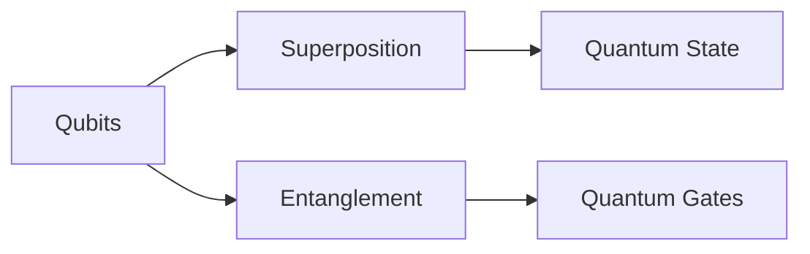

                 

Sure, let's break down the task into more detailed steps to create a high-quality technical blog post on "Quantum Computing in Complex Systems Simulation."

## Step 1: Title and Keywords
**Title**: Quantum Computing in Complex Systems Simulation: Unlocking Potential and Overcoming Challenges

**Keywords**: Quantum computing, complex systems simulation, quantum algorithms, mathematical models, quantum architecture, future directions

## Step 2: Introduction
**Abstract**: Quantum computing is poised to revolutionize complex systems simulation by leveraging its unique capabilities to solve problems that are intractable for classical computers. This article will delve into the fundamental concepts of quantum computing, explore the potential applications, and discuss the challenges and future prospects in this exciting field.

## Chapter 1: Introduction to Quantum Computing in Complex Systems Simulation
### 1.1 Background
- **Problem Description**: Complex systems simulation faces limitations due to the exponential growth of computational requirements.
- **Current Solutions**: Traditional computing paradigms struggle to keep up with the demands of complex simulations.
- **Potential of Quantum Computing**: Quantum computing offers a promising alternative to address these challenges.

### 1.2 Problem Description
- **Scope**: The focus on how quantum computing can be applied to simulate complex systems.
- **Objective**: To understand the potential and limitations of quantum computing in this domain.

### 1.3 Solution Approaches
- **Quantum Algorithms**: Highlight key quantum algorithms suitable for complex systems simulation.
- **Mathematical Models**: Introduce the mathematical models and formulations used in quantum computing.

### 1.4 Potential Applications
- **Biology**: Simulating protein structures and drug interactions.
- **Chemistry**: Modeling molecular interactions and reaction pathways.
- **Materials Science**: Designing new materials with specific properties.

### 1.5 Boundary and Extensions
- **Current Status**: Overview of the current state of quantum computing in complex systems simulation.
- **Future Trends**: Discussion on potential future developments and advancements.

## Chapter 2: Fundamental Concepts of Quantum Computing
### 2.1 Quantum Bits (Qubits)
- **Definition**: Introduction to qubits and their properties.
- **Comparison with Classical Bits**: Table comparing qubits with classical bits.

### 2.2 Quantum Gates and Quantum Circuits
- **Quantum Gates**: Overview of basic quantum gates and their operations.
- **Quantum Circuits**: Explanation of quantum circuits and their role in computation.

### 2.3 Quantum Algorithms
- **Introduction**: Overview of quantum algorithms and their significance.
- **Examples**: Brief description of important quantum algorithms like Shor's and Grover's.

### 2.4 Quantum Entanglement
- **Definition**: Explanation of quantum entanglement and its implications.
- **Applications**: Discuss practical applications of entanglement in complex systems simulation.

## Chapter 3: Quantum Algorithms for Complex Systems Simulation
### 3.1 Overview of Quantum Algorithms
- **Suitability for Complex Systems**: Discussion on why certain quantum algorithms are well-suited for complex systems simulation.

### 3.2 Shor's Algorithm
- **Explanation**: Detailed explanation of Shor's algorithm.
- **Example**: Application of Shor's algorithm to a specific complex system problem.

### 3.3 Grover's Algorithm
- **Explanation**: Detailed explanation of Grover's algorithm.
- **Example**: Application of Grover's algorithm to improve search efficiency in complex systems.

## Chapter 4: Mathematical Models and Formulations in Quantum Computing
### 4.1 Quantum Gates and Operations
- **Mathematical Models**: Introduction to the mathematical models used to describe quantum gates and operations.

### 4.2 Quantum Error Correction
- **Concepts**: Overview of quantum error correction techniques.
- **Importance**: Importance of error correction in reliable quantum computing.

### 4.3 Quantum Operations and Entanglement
- **Mathematical Formulation**: Detailed discussion on the mathematical formulation of quantum operations and entanglement.

## Chapter 5: Quantum Computing Architectures and Systems
### 5.1 Quantum Computing Architectures
- **Types of Architectures**: Overview of different quantum computing architectures.

### 5.2 Current State of Quantum Computing Hardware
- **Hardware Developments**: Discussion on the latest advancements in quantum computing hardware.

### 5.3 Software Tools and Frameworks
- **Tools and Frameworks**: Overview of software tools and frameworks available for quantum computing.

## Chapter 6: Applications of Quantum Computing in Complex Systems Simulation
### 6.1 Biology
- **Protein Structure Simulation**: Overview of using quantum computing for protein structure simulation.

### 6.2 Chemistry
- **Molecular Dynamics Simulation**: Discussion on using quantum computing for molecular dynamics simulations.

### 6.3 Materials Science
- **Material Property Prediction**: Overview of predicting material properties using quantum computing.

### 6.4 Other Fields
- **Future Directions**: Exploration of potential applications in other fields.

## Chapter 7: Challenges and Future Directions
### 7.1 Technical Challenges
- **Quantum Error Correction**: Challenges in implementing effective quantum error correction.

### 7.2 Algorithm Development
- **Algorithmic Challenges**: Discussion on the development of new quantum algorithms.

### 7.3 Integration with Classical Computing
- **Hybrid Systems**: Challenges and opportunities in integrating quantum and classical computing.

### 7.4 Future Research Directions
- **Next-Generation Quantum Technologies**: Discussion on future research directions in quantum computing.

## Conclusion
- **Summary**: Recap of the key points discussed in the article.
- **Future Prospects**: Brief outlook on the future of quantum computing in complex systems simulation.

## Step 3: Article Writing
- Write the introduction, each chapter, and the conclusion based on the outline provided above.
- Ensure each chapter is well-structured, with clear headings, subheadings, and paragraphs.
- Include diagrams, tables, and examples where appropriate.
- Use LaTeX for mathematical formulas and Python for algorithmic explanations.
- Follow the format and structure specified in the task.

## Step 4: Review and Refinement
- Review the entire article for coherence, clarity, and technical accuracy.
- Ensure the article meets the specified word count requirement (10,000-12,000 words).
- Make any necessary revisions based on feedback and refinements.

## Step 5: Final Formatting and Submission
- Format the article using Markdown.
- Include the author information at the end of the article.
- Ensure the article is complete and contains all the required elements (tips, summary, etc.).
- Submit the article for publication.

By following these steps, we can create a comprehensive and informative technical blog post on quantum computing in complex systems simulation.

