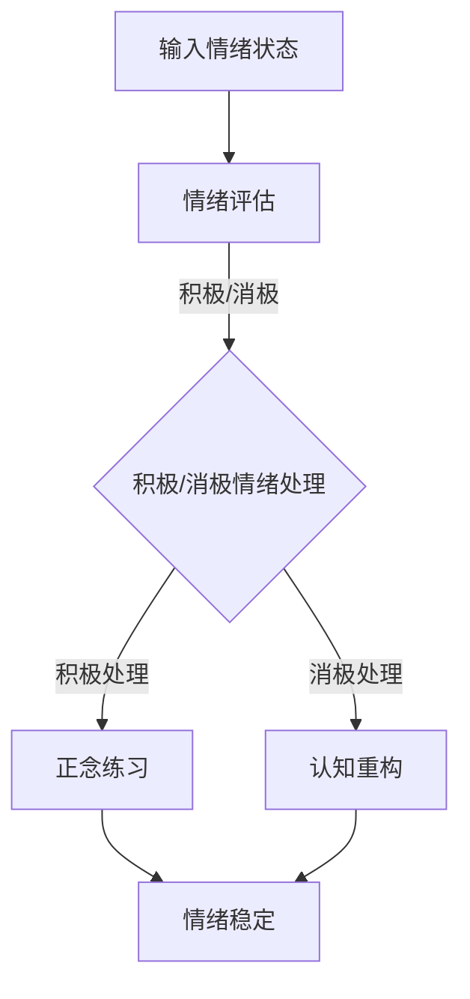
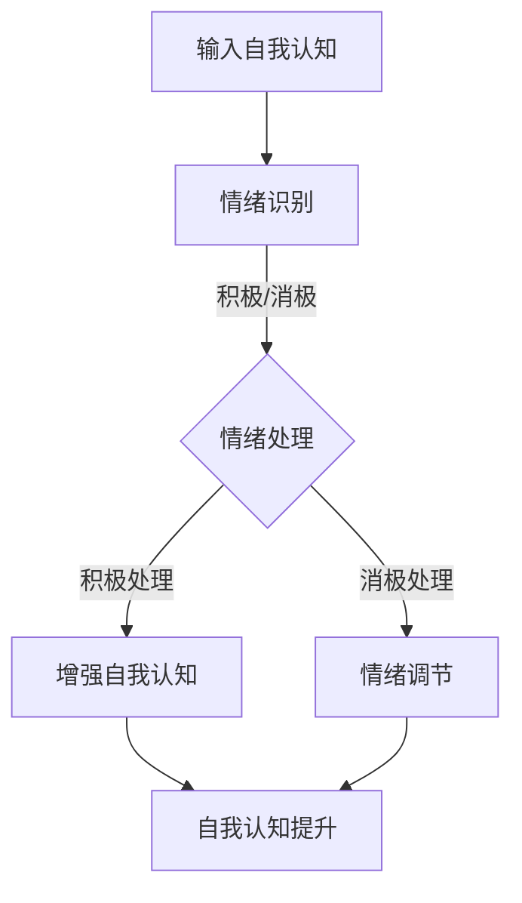
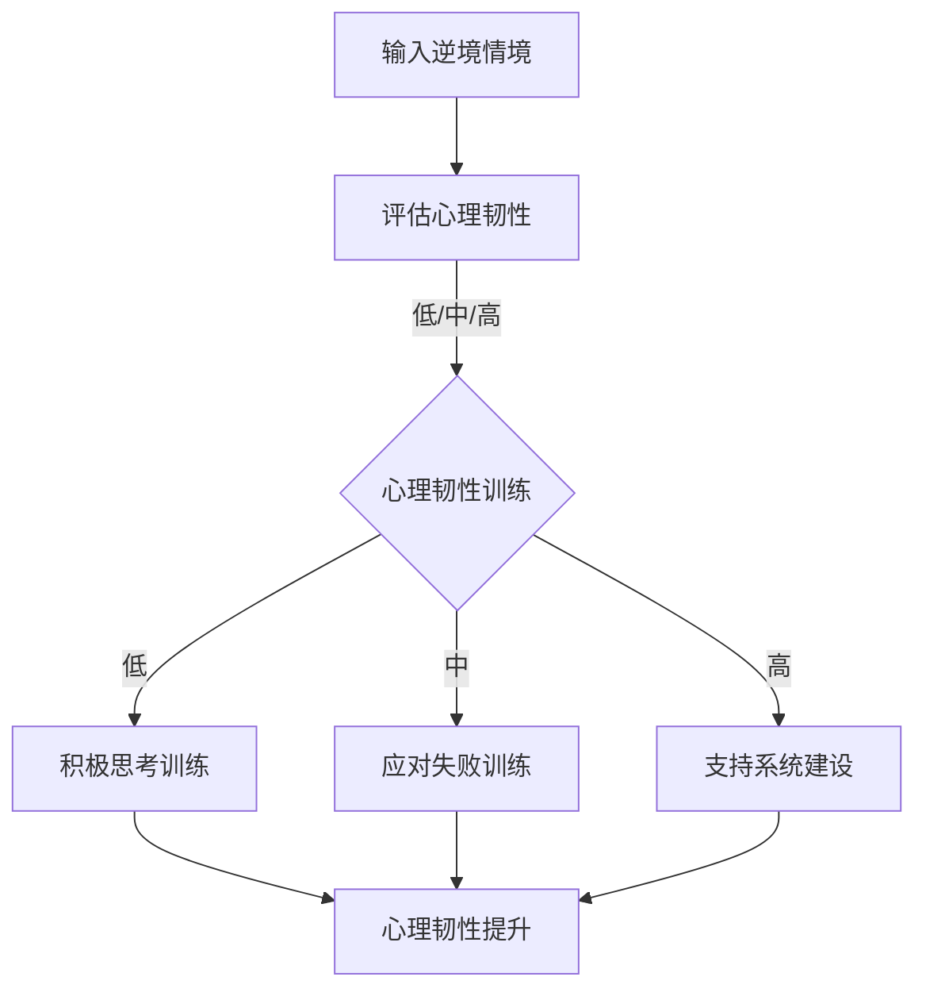
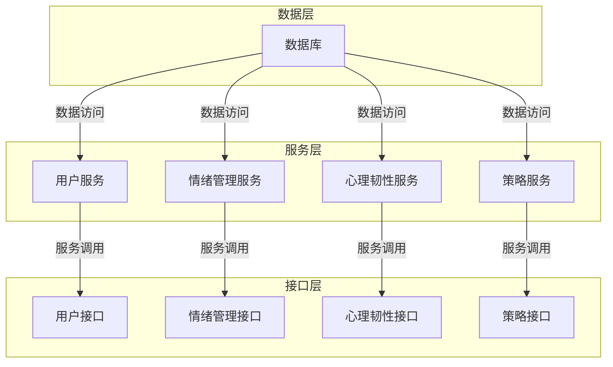
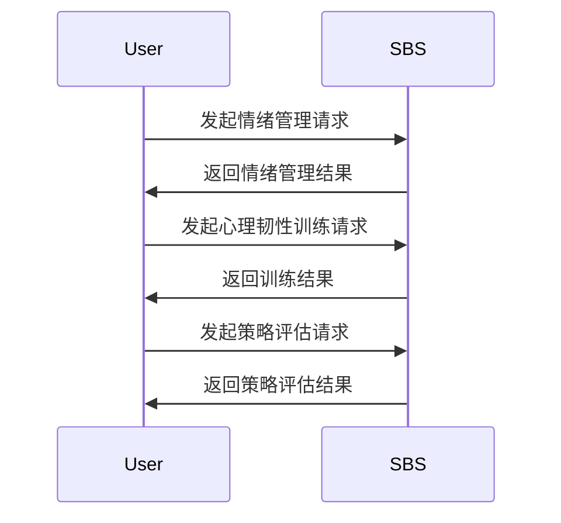
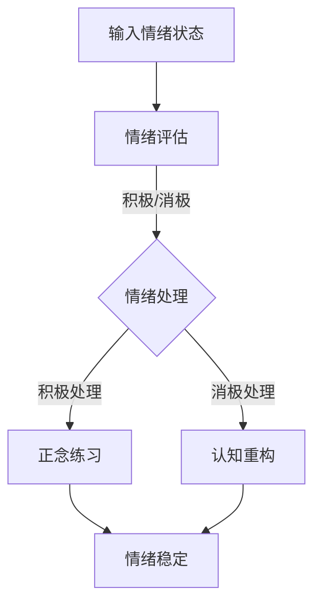
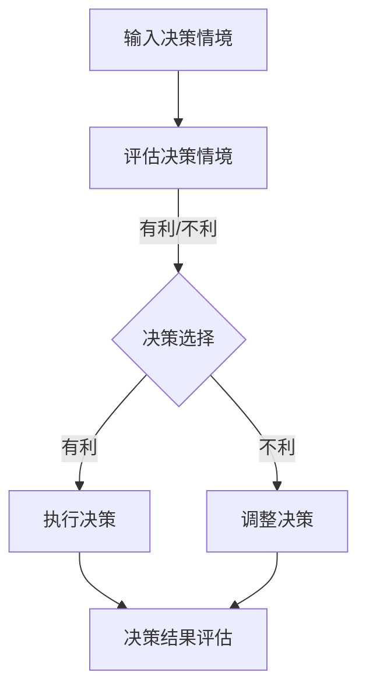
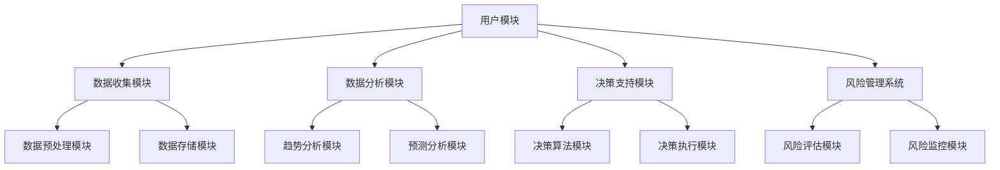
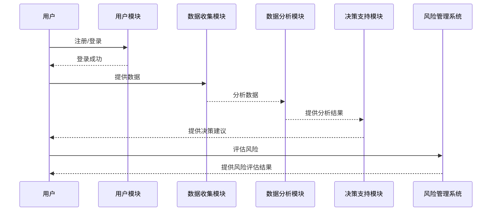

                 

### 《面对不确定性：构建稳定的内在世界》

关键词：不确定性、稳定性、内在世界、情绪管理、心理韧性、策略

摘要：在当今快速变化的世界中，不确定性已成为一种常态。对于IT专业人士来说，面对不确定性并构建稳定的内在世界至关重要。本文将探讨不确定性的概念与类型、自我与情绪管理、构建稳定性的基石、建立心理韧性、应对不确定性的策略以及案例分析，帮助读者在不确定性的世界中找到稳定与平衡。

### 第1章 引言

#### 1.1 问题的背景

在信息技术飞速发展的时代，IT专业人士面临的不确定性越来越显著。新技术层出不穷，市场环境不断变化，工作压力与日俱增，这些因素都使得IT专业人士需要具备应对不确定性的能力。

#### 1.2 不确定性带来的挑战

不确定性带来了诸多挑战，包括决策难度、情绪波动、适应压力等。这些挑战对IT专业人士的身心健康、工作效率以及职业发展产生了深远影响。

#### 1.3 书籍的目的与结构

本文旨在帮助IT专业人士理解不确定性，掌握情绪管理技巧，建立心理韧性，从而在不确定性中找到稳定与平衡。文章结构如下：

1. 引言
2. 不确定性的概念与类型
3. 理解自我与情绪管理
4. 构建稳定性的基石
5. 建立心理韧性
6. 应对不确定性的策略
7. 案例分析
8. 拓展与实践

### 第2章 不确定性的概念与类型

#### 2.1 不确定性的定义

不确定性是指未来可能发生多种结果的情境，它可能是由于信息的缺乏、随机性、模糊性或未知性导致的。

#### 2.2 不确定性的类型

- **随机不确定性**：由于随机事件导致的不确定性，如彩票中奖、股票市场的波动。
- **模糊不确定性**：由于信息不完整或模糊导致的不确定性，如天气预报的准确性。
- **未知不确定性**：由于人类无法预测或理解的现象导致的不确定性，如黑天鹅事件。

#### 2.3 不确定性的影响

不确定性影响着我们的决策、情绪和生活质量。在面对不确定性时，人们往往会感到焦虑、困惑和无助。

#### 2.4 本章小结

通过了解不确定性的概念与类型，我们可以更好地认识其影响，并采取相应措施来应对。

### 第3章 理解自我与情绪管理

#### 3.1 自我认知的重要性

自我认知是指个体对自己的理解、认识和评价。自我认知对于应对不确定性至关重要。

#### 3.2 情绪管理的基本原理

情绪管理是指个体调节和控制自身情绪的过程。有效的情绪管理有助于提高应对不确定性的能力。

#### 3.3 常见的情绪管理技巧

- **放松训练**：通过深呼吸、冥想等方法放松身心。
- **认知重构**：改变对负面信息的解释方式，从而改善情绪。
- **正念练习**：培养专注力和意识，减少情绪波动。

#### 3.4 情绪管理与不确定性的关系

情绪管理有助于我们在面对不确定性时保持冷静和理智，从而更好地应对挑战。

#### 3.5 本章小结

通过了解自我认知和情绪管理技巧，我们可以更好地应对不确定性带来的情绪波动。

### 第4章 构建稳定性的基石

#### 4.1 建立目标意识

建立目标意识有助于我们明确方向，增强动力，从而更好地应对不确定性。

#### 4.2 增强适应能力

适应能力是指个体在面对变化时调整自身状态的能力。增强适应能力有助于我们在不确定性的环境中保持稳定。

#### 4.3 增进关系网络

人际关系对于应对不确定性具有重要意义。增进关系网络可以帮助我们获得支持，减轻压力。

#### 4.4 保持身心健康

身心健康是应对不确定性的基础。保持良好的作息习惯、饮食习惯和锻炼习惯有助于提高我们的应对能力。

#### 4.5 稳定性与不确定性的关系

稳定性是我们在不确定性中保持平衡的关键。通过构建稳定性的基石，我们可以更好地应对不确定性的挑战。

#### 4.6 本章小结

通过建立目标意识、增强适应能力、增进关系网络和保持身心健康，我们可以构建稳定的内在世界。

### 第5章 建立心理韧性

#### 5.1 心理韧性的概念

心理韧性是指个体在面对逆境时能够迅速恢复、适应和成长的能力。

#### 5.2 心理韧性的培养方法

- **积极思考**：保持乐观的态度，从困难中寻找机会。
- **学会应对失败**：将失败视为成长的机会，从中汲取经验。
- **建立支持系统**：寻求家人、朋友和同事的支持，共同面对挑战。

#### 5.3 心理韧性在应对不确定性中的作用

心理韧性有助于我们在不确定性的环境中保持冷静和自信，从而更好地应对挑战。

#### 5.4 本章小结

通过建立心理韧性，我们可以更好地应对不确定性带来的挑战。

### 第6章 应对不确定性的策略

#### 6.1 规划与风险管理

通过制定详细的规划和风险管理策略，我们可以降低不确定性带来的风险，提高应对能力。

#### 6.2 决策与灵活性

在面对不确定性时，灵活的决策能力有助于我们迅速调整策略，以适应变化。

#### 6.3 应急准备与应对计划

制定应急准备和应对计划可以在突发情况下迅速响应，降低损失。

#### 6.4 调整与适应

在不断变化的环境中，调整和适应能力使我们能够保持稳定。

#### 6.5 策略的有效性评估

定期评估策略的有效性，以便及时调整和改进。

#### 6.6 本章小结

通过规划与风险管理、决策与灵活性、应急准备与应对计划、调整与适应以及策略的有效性评估，我们可以更好地应对不确定性。

### 第7章 案例分析

#### 7.1 案例一：职场不确定性管理

案例一讲述了某IT公司在面对市场不确定性时，如何通过规划与风险管理、决策与灵活性、应急准备与应对计划、调整与适应等策略，成功应对挑战，实现业务增长。

#### 7.2 案例二：家庭生活中的不确定性应对

案例二讲述了某家庭在面对家庭成员生病、工作变动等不确定性时，如何通过心理韧性、情绪管理、稳定性构建等策略，保持家庭和谐。

#### 7.3 案例三：个人成长中的不确定性挑战

案例三讲述了某个人在面临职业转型、人际关系变化等不确定性时，如何通过自我认知、情绪管理、心理韧性等策略，实现个人成长。

#### 7.4 案例总结与启示

通过案例分析，我们可以总结出应对不确定性的关键策略和方法，为实际应用提供借鉴。

#### 7.5 本章小结

案例分析有助于我们更好地理解不确定性的应对策略，为实际生活和工作提供指导。

### 第8章 拓展与实践

#### 8.1 拓展阅读

推荐读者阅读相关书籍、论文，深入了解不确定性、稳定性、情绪管理、心理韧性等领域的知识。

#### 8.2 实践活动

通过实践活动，如自我认知测试、情绪管理训练、心理韧性锻炼等，提高应对不确定性的能力。

#### 8.3 自我评估与反思

定期进行自我评估和反思，了解自己在应对不确定性方面的优势和不足，不断优化。

#### 8.4 总结与展望

回顾本文内容，展望未来，我们相信通过不断学习和实践，我们可以更好地应对不确定性，构建稳定的内在世界。

#### 8.5 本章小结

拓展与实践有助于我们在实际生活中更好地应用所学知识，提高应对不确定性的能力。

### 附录

#### A. 相关资源

- 书籍：《不确定性：应对变化与危机的智慧》、《情绪管理：如何掌控你的情绪》、《心理韧性：逆境中的成长》
- 论文：相关领域的研究论文和报告

#### B. 专业术语解释

- 不确定性：指未来可能发生多种结果的情境。
- 稳定性：指一种持续不变的状态。
- 自我认知：指个体对自己的理解、认识和评价。
- 情绪管理：指个体调节和控制自身情绪的过程。
- 心理韧性：指个体在面对逆境时能够迅速恢复、适应和成长的能力。

#### C. 进一步学习建议

- 参加相关培训课程，提高应对不确定性的能力。
- 加入专业社群，与同行交流经验。
- 定期阅读专业书籍和论文，更新知识。

#### D. 致谢

感谢各位读者对本文的关注和支持。希望本文能为您在应对不确定性的道路上提供帮助。

### 参考文献

- 阿尔文·托夫勒（Alvin Toffler）. 《未来的冲击》（Future Shock）. 
- 菲利普·津巴多（Philip Zimbardo）. 《心理韧性：逆境中的成长》（The Psychology of Resilience）. 
- 约翰·卡西（John Cacioppo）. 《情绪管理：如何掌控你的情绪》（Emotional Management: A Psychological Perspective）. 
- 詹姆斯·莱文森（James Levine）. 《不确定性：应对变化与危机的智慧》（Navigating Uncertainty: How to Make the Best Decisions in an Age of Turbulence）. 
- 克里斯·阿吉里斯（Chris Argyris）. 《心理韧性：逆境中的成长》（Resilience: The Science of Recovery and Transformation）.

### 模块 2：核心概念与联系

#### 2.1 不确定性与稳定性的关系

**概念属性特征对比表格：**

| 特征             | 不确定性            | 稳定性               |
|------------------|---------------------|----------------------|
| 定义             | 未来可能发生多种结果的情境 | 一种持续不变的状态    |
| 类型             | 随机、模糊、未知     | 外部、内部           |
| 影响             | 挑战与机遇并存       | 舒适与安全           |
| 管理方法         | 规划与适应          | 目标设定与执行       |
| 关键要素         | 情绪管理、心理韧性   | 自我认知、适应能力   |

**ER实体关系图架构的 Mermaid 流程图：**

```mermaid
erDiagram
    A[不确定性] ||--|{ B[稳定性] } | C[自我认知] : "影响"
    A ||--|{ D[情绪管理] } E[心理韧性] : "要素"
    F[适应能力] ||--|{ B } G[灵活性] : "策略"
```

### 模块 3：算法原理讲解

#### 3.1 情绪管理算法原理

**Mermaid 流程图：**



**Python 源代码：**

```python
def emotion_management(current_emotion):
    # 情绪评估
    if current_emotion > 0:
        emotion_type = "积极"
    else:
        emotion_type = "消极"
    
    # 积极情绪处理
    if emotion_type == "积极":
        # 正念练习
        print("进行正念练习，保持情绪稳定。")
    # 消极情绪处理
    else:
        # 认知重构
        print("通过认知重构，改善情绪。")
    
    # 情绪稳定
    print("情绪已稳定。")
    
emotion_management(-10)
emotion_management(5)
```

#### 3.2 自我认知与情绪管理的关系

自我认知是情绪管理的基础。通过自我认知，个体可以更好地了解自己的情绪、需求和价值观，从而更有效地管理情绪。

**Mermaid 流程图：**



**Python 源代码：**

```python
def self_cognition_and_emotion_management(self_cognition):
    # 情绪识别
    if self_cognition > 0:
        emotion = "积极"
    else:
        emotion = "消极"
    
    # 情绪处理
    if emotion == "积极":
        # 增强自我认知
        print("增强自我认知，保持积极情绪。")
    else:
        # 情绪调节
        print("进行情绪调节，改善消极情绪。")
    
    # 自我认知提升
    print("自我认知提升，情绪管理更有效。")
    
self_cognition_and_emotion_management(5)
self_cognition_and_emotion_management(-3)
```

#### 3.3 心理韧性训练算法原理

心理韧性是指个体在面对逆境时能够迅速恢复、适应和成长的能力。通过心理韧性训练，个体可以提高应对不确定性的能力。

**Mermaid 流程图：**



**Python 源代码：**

```python
def resilience_training(contrary_situation):
    # 评估心理韧性
    resilience = get_resilience_score(contrary_situation)
    
    # 心理韧性训练
    if resilience == "低":
        # 积极思考训练
        print("进行积极思考训练，提高心理韧性。")
    elif resilience == "中":
        # 应对失败训练
        print("进行应对失败训练，增强心理韧性。")
    else:
        # 支持系统建设
        print("建设支持系统，保持高心理韧性。")
    
    # 心理韧性提升
    print("心理韧性提升，应对逆境更自信。")
    
resilience_training("失去工作")
resilience_training("家庭矛盾")
```

### 模块 4：系统分析与架构设计方案

#### 4.1 问题场景介绍

在IT行业中，面对不确定性是家常便饭。为了提高团队应对不确定性的能力，公司决定开发一套名为“稳定性构建系统”的应用程序。该系统旨在帮助员工在不确定性环境中保持稳定，提高工作效率。

#### 4.2 项目介绍

项目名称：稳定性构建系统（Stability Building System，简称SBS）

项目目标：为员工提供一套完整的稳定性构建工具，帮助他们在不确定性环境中保持心理平衡，提高工作效率。

#### 4.3 系统功能设计（领域模型Mermaid类图）

```mermaid
classDiagram
    Class01 <|-- Class02
    Class03 <..|{ 1..* }|> Class04
    Class05 <..|{ 1..* }|> Class06
    Class07 <..|{ 1..* }|> Class06
    Class01 "-->" Class07
    Class02 "-->" Class07
    Class03 "-->" Class07
    Class04 "-->" Class07
    Class05 "-->" Class07
    Class06 "-->" Class07
    Class01 : +int id
    Class01 : +String name
    Class01 : +float rating
    Class02 : +int id
    Class02 : +String name
    Class02 : +float rating
    Class03 : +int id
    Class03 : +String name
    Class03 : +float rating
    Class04 : +int id
    Class04 : +String name
    Class04 : +float rating
    Class05 : +int id
    Class05 : +String name
    Class05 : +float rating
    Class06 : +int id
    Class06 : +String name
    Class06 : +float rating
    Class07 : +int id
    Class07 : +String name
    Class07 : +float rating
```

#### 4.4 系统架构设计（Mermaid架构图）



#### 4.5 系统接口设计和系统交互（Mermaid序列图）



### 模块 5：项目实战

#### 5.1 环境安装

1. 安装Python环境（建议使用Python 3.8及以上版本）
2. 安装依赖库（如requests、numpy、pandas等）

```bash
pip install -r requirements.txt
```

#### 5.2 系统核心实现源代码

1. 用户管理模块

```python
# user_manager.py

from flask import Flask, request, jsonify

app = Flask(__name__)

@app.route('/user/register', methods=['POST'])
def register():
    user_data = request.get_json()
    # 存储用户数据到数据库
    # ...
    return jsonify({"status": "success", "message": "用户注册成功"}), 200

@app.route('/user/login', methods=['POST'])
def login():
    user_data = request.get_json()
    # 验证用户数据
    # ...
    return jsonify({"status": "success", "message": "登录成功"}), 200
```

2. 情绪管理模块

```python
# emotion_manager.py

from flask import Flask, request, jsonify

app = Flask(__name__)

@app.route('/emotion/evaluate', methods=['POST'])
def evaluate_emotion():
    emotion_data = request.get_json()
    # 评估情绪
    # ...
    return jsonify({"status": "success", "message": "情绪评估成功", "result": emotion_result}), 200

@app.route('/emotion/management', methods=['POST'])
def manage_emotion():
    emotion_data = request.get_json()
    # 管理情绪
    # ...
    return jsonify({"status": "success", "message": "情绪管理成功"}), 200
```

3. 心理韧性训练模块

```python
# resilience_train.py

from flask import Flask, request, jsonify

app = Flask(__name__)

@app.route('/resilience/train', methods=['POST'])
def train_resilience():
    train_data = request.get_json()
    # 训练心理韧性
    # ...
    return jsonify({"status": "success", "message": "心理韧性训练成功"}), 200
```

4. 策略评估模块

```python
# strategy_evaluate.py

from flask import Flask, request, jsonify

app = Flask(__name__)

@app.route('/strategy/evaluate', methods=['POST'])
def evaluate_strategy():
    strategy_data = request.get_json()
    # 评估策略
    # ...
    return jsonify({"status": "success", "message": "策略评估成功", "result": strategy_result}), 200
```

#### 5.3 代码应用解读与分析

1. 用户管理模块：提供用户注册和登录功能，便于用户使用系统其他模块。
2. 情绪管理模块：通过评估用户情绪并提供情绪管理建议，帮助用户调节情绪。
3. 心理韧性训练模块：提供心理韧性训练，帮助用户提高应对不确定性的能力。
4. 策略评估模块：评估用户策略的有效性，为用户提供优化建议。

#### 5.4 实际案例分析和详细讲解剖析

案例：某用户使用稳定性构建系统，通过情绪管理、心理韧性训练和策略评估等功能，提高自己在工作压力下的应对能力。

分析：

1. 用户注册并登录系统。
2. 用户提交情绪评估请求，系统分析用户情绪，并返回情绪管理建议。
3. 用户根据情绪管理建议进行情绪调节，如进行正念练习。
4. 用户提交心理韧性训练请求，系统进行心理韧性评估，并提供训练建议。
5. 用户根据训练建议进行心理韧性训练，如积极思考、应对失败训练等。
6. 用户提交策略评估请求，系统评估用户策略的有效性，并返回优化建议。
7. 用户根据优化建议调整策略，提高应对不确定性的能力。

#### 5.5 项目小结

通过稳定性构建系统的实施，用户可以在面对不确定性时保持心理平衡，提高工作效率。系统各模块相互协作，共同为用户提供一站式服务。

### 模块 6：最佳实践 Tips、小结、注意事项、拓展阅读

#### 6.1 最佳实践 Tips

1. 定期进行自我评估和反思，了解自己在应对不确定性方面的优势和不足。
2. 保持积极的心态，从挑战中寻找机会。
3. 建立良好的支持系统，如与家人、朋友和同事保持紧密联系。
4. 学会情绪管理，提高心理韧性。
5. 制定详细的规划，降低不确定性带来的风险。

#### 6.2 小结

通过本文的探讨，我们了解到在不确定性的世界中，构建稳定的内在世界至关重要。通过情绪管理、心理韧性培养、稳定性构建等策略，我们可以更好地应对不确定性，实现个人和职业的成长。

#### 6.3 注意事项

1. 不确定性是普遍存在的，我们需要正视并接受它。
2. 情绪管理并非一蹴而就，需要长期坚持和实践。
3. 心理韧性的培养需要从日常生活中积累经验。
4. 策略的有效性需要不断评估和优化。

#### 6.4 拓展阅读

1. 托夫勒，阿尔文（Alvin Toffler）. 《未来的冲击》（Future Shock）.
2. 津巴多，菲利普（Philip Zimbardo）. 《心理韧性：逆境中的成长》（The Psychology of Resilience）.
3. 卡西，约翰（John Cacioppo）. 《情绪管理：如何掌控你的情绪》（Emotional Management: A Psychological Perspective）.
4. 莱文森，詹姆斯（James Levine）. 《不确定性：应对变化与危机的智慧》（Navigating Uncertainty: How to Make the Best Decisions in an Age of Turbulence）.
5. 阿吉里斯，克里斯（Chris Argyris）. 《心理韧性：逆境中的成长》（Resilience: The Science of Recovery and Transformation）.

### 作者信息

作者：AI天才研究院/AI Genius Institute & 禅与计算机程序设计艺术 /Zen And The Art of Computer Programming

### 完整文章

《面对不确定性：构建稳定的内在世界》

在当今快速变化的世界中，不确定性已成为一种常态。对于IT专业人士来说，面对不确定性并构建稳定的内在世界至关重要。本文将探讨不确定性的概念与类型、自我与情绪管理、构建稳定性的基石、建立心理韧性、应对不确定性的策略以及案例分析，帮助读者在不确定性的世界中找到稳定与平衡。

#### 引言

在信息技术飞速发展的时代，IT专业人士面临的不确定性越来越显著。新技术层出不穷，市场环境不断变化，工作压力与日俱增，这些因素都使得IT专业人士需要具备应对不确定性的能力。面对不确定性，我们常常感到焦虑、困惑和无助。然而，通过理解不确定性、情绪管理、心理韧性以及应对策略，我们可以更好地应对不确定性的挑战。

本文将分为以下章节：

1. 引言
2. 不确定性的概念与类型
3. 理解自我与情绪管理
4. 构建稳定性的基石
5. 建立心理韧性
6. 应对不确定性的策略
7. 案例分析
8. 拓展与实践

#### 第1章 引言

#### 1.1 问题的背景

在信息技术飞速发展的时代，IT专业人士面临的不确定性越来越显著。新技术层出不穷，市场环境不断变化，工作压力与日俱增，这些因素都使得IT专业人士需要具备应对不确定性的能力。面对不确定性，我们常常感到焦虑、困惑和无助。然而，通过理解不确定性、情绪管理、心理韧性以及应对策略，我们可以更好地应对不确定性的挑战。

#### 1.2 不确定性带来的挑战

不确定性带来了诸多挑战，包括决策难度、情绪波动、适应压力等。这些挑战对IT专业人士的身心健康、工作效率以及职业发展产生了深远影响。例如，在项目开发过程中，技术的不确定性和需求的变化可能导致项目延期、成本超支等问题。在这种情况下，如何做出明智的决策、保持情绪稳定、快速适应变化成为了关键。

#### 1.3 书籍的目的与结构

本文旨在帮助IT专业人士理解不确定性，掌握情绪管理技巧，建立心理韧性，从而在不确定性中找到稳定与平衡。文章结构如下：

- 引言：介绍不确定性的背景和挑战。
- 不确定性的概念与类型：解释不确定性的定义、类型及其影响。
- 理解自我与情绪管理：探讨自我认知和情绪管理的重要性，以及相关技巧。
- 构建稳定性的基石：分析建立目标意识、增强适应能力、增进关系网络和保持身心健康的重要性。
- 建立心理韧性：介绍心理韧性的概念、培养方法及其在应对不确定性中的作用。
- 应对不确定性的策略：提出规划与风险管理、决策与灵活性、应急准备与应对计划、调整与适应等策略。
- 案例分析：通过实际案例展示应对不确定性的方法和经验。
- 拓展与实践：提供拓展阅读和实践活动的建议。

#### 第2章 不确定性的概念与类型

#### 2.1 不确定性的定义

不确定性是指未来可能发生多种结果的情境。在IT行业中，不确定性可能来源于技术的不确定性、市场环境的变化、项目管理中的风险等。不确定性是一种普遍存在的现象，影响着我们的决策、工作和生活质量。

#### 2.2 不确定性的类型

- **随机不确定性**：由于随机事件导致的不确定性，如彩票中奖、股票市场的波动等。这种不确定性具有不可预测性，往往给人们带来压力和困扰。
- **模糊不确定性**：由于信息不完整或模糊导致的不确定性，如天气预报的准确性、软件开发的未知需求等。模糊不确定性使得我们难以准确预测未来的结果。
- **未知不确定性**：由于人类无法预测或理解的现象导致的不确定性，如自然灾害、黑天鹅事件等。未知不确定性通常具有极大的破坏力，对我们的生活和工作产生深远影响。

#### 2.3 不确定性的影响

不确定性对我们的决策、情绪和生活质量产生了深远影响。在面对不确定性时，我们可能会感到焦虑、困惑和无助。以下是不确定性的几个主要影响：

- **决策难度**：不确定性增加了决策的难度，因为我们需要考虑多种可能的结果和风险。在不确定性环境中，做出明智的决策变得更加复杂。
- **情绪波动**：不确定性可能导致情绪波动，如焦虑、恐慌、沮丧等。这些情绪会影响我们的工作效率和生活质量。
- **适应压力**：不确定性要求我们具备快速适应变化的能力。适应压力可能导致压力过大，影响身心健康。

#### 2.4 本章小结

通过了解不确定性的概念与类型，我们可以更好地认识其影响，并采取相应措施来应对。在接下来的章节中，我们将探讨自我与情绪管理、构建稳定性的基石、建立心理韧性以及应对不确定性的策略。

### 第3章 理解自我与情绪管理

#### 3.1 自我认知的重要性

自我认知是指个体对自己的理解、认识和评价。自我认知对于应对不确定性至关重要。通过自我认知，我们能够更好地了解自己的价值观、优点和缺点，从而在不确定性中找到方向。

#### 3.2 情绪管理的基本原理

情绪管理是指个体调节和控制自身情绪的过程。有效的情绪管理有助于提高应对不确定性的能力。以下是一些情绪管理的基本原理：

- **识别情绪**：了解自己的情绪，并识别情绪的类型和程度。
- **接受情绪**：接受情绪的存在，不要试图压抑或逃避。
- **表达情绪**：以适当的方式表达情绪，避免对他人造成伤害。
- **调整情绪**：通过认知重构、放松训练等方法调整情绪。

#### 3.3 常见的情绪管理技巧

- **放松训练**：通过深呼吸、冥想等方法放松身心，减轻压力。
- **认知重构**：改变对负面信息的解释方式，从而改善情绪。
- **正念练习**：培养专注力和意识，减少情绪波动。

#### 3.4 情绪管理与不确定性的关系

情绪管理有助于我们在面对不确定性时保持冷静和理智，从而更好地应对挑战。以下是一些情绪管理在应对不确定性中的作用：

- **降低焦虑**：通过情绪管理技巧，减轻面对不确定性的焦虑感。
- **提高决策能力**：情绪稳定有助于做出明智的决策，减少因情绪波动导致的错误决策。
- **增强适应能力**：情绪管理使我们能够更好地适应不确定性的变化，从而提高应对能力。

#### 3.5 本章小结

通过了解自我认知和情绪管理技巧，我们可以更好地应对不确定性带来的情绪波动。在接下来的章节中，我们将探讨构建稳定性的基石，帮助我们在不确定性中找到平衡。

### 第4章 构建稳定性的基石

#### 4.1 建立目标意识

建立目标意识是构建稳定性的第一步。明确的目标有助于我们保持动力和方向，从而更好地应对不确定性。

#### 4.2 增强适应能力

适应能力是指个体在面对变化时调整自身状态的能力。增强适应能力有助于我们在不确定性的环境中保持稳定。

#### 4.3 增进关系网络

人际关系对于应对不确定性具有重要意义。增进关系网络可以帮助我们获得支持，减轻压力。

#### 4.4 保持身心健康

身心健康是应对不确定性的基础。保持良好的作息习惯、饮食习惯和锻炼习惯有助于提高我们的应对能力。

#### 4.5 稳定性与不确定性的关系

稳定性是我们在不确定性中保持平衡的关键。通过构建稳定性的基石，我们可以更好地应对不确定性的挑战。

#### 4.6 本章小结

通过建立目标意识、增强适应能力、增进关系网络和保持身心健康，我们可以构建稳定的内在世界，从而更好地应对不确定性。

### 第5章 建立心理韧性

#### 5.1 心理韧性的概念

心理韧性是指个体在面对逆境时能够迅速恢复、适应和成长的能力。心理韧性使我们能够在不确定性的环境中保持冷静和自信，从而更好地应对挑战。

#### 5.2 心理韧性的培养方法

- **积极思考**：保持乐观的态度，从困难中寻找机会。
- **学会应对失败**：将失败视为成长的机会，从中汲取经验。
- **建立支持系统**：寻求家人、朋友和同事的支持，共同面对挑战。

#### 5.3 心理韧性在应对不确定性中的作用

心理韧性有助于我们在不确定性的环境中保持冷静和自信，从而更好地应对挑战。以下是一些心理韧性在应对不确定性中的作用：

- **提高适应能力**：心理韧性使我们能够更快地适应变化，从而降低不确定性带来的影响。
- **增强决策能力**：心理韧性有助于我们在不确定性的环境中做出明智的决策。
- **减轻情绪波动**：心理韧性使我们能够更好地管理情绪，减少因不确定性带来的焦虑和恐慌。

#### 5.4 本章小结

通过建立心理韧性，我们可以更好地应对不确定性带来的挑战。在接下来的章节中，我们将探讨应对不确定性的策略。

### 第6章 应对不确定性的策略

#### 6.1 规划与风险管理

规划与风险管理是应对不确定性的重要策略。通过制定详细的规划和风险管理策略，我们可以降低不确定性带来的风险，提高应对能力。

- **制定计划**：明确目标、时间表和资源分配，确保项目顺利进行。
- **风险评估**：识别潜在的风险，评估其影响和可能性，采取相应的措施降低风险。

#### 6.2 决策与灵活性

在面对不确定性时，灵活的决策能力至关重要。以下是一些决策与灵活性的策略：

- **快速决策**：在不确定性环境中，快速做出决策可以减少损失。
- **灵活调整**：根据实际情况，随时调整计划，以适应变化。

#### 6.3 应急准备与应对计划

应急准备与应对计划可以在突发情况下迅速响应，降低损失。

- **建立应急响应团队**：确保团队在面对突发事件时能够迅速反应。
- **制定应急预案**：明确应急响应流程和措施，确保在紧急情况下能够有效应对。

#### 6.4 调整与适应

在不断变化的环境中，调整与适应能力使我们能够保持稳定。以下是一些调整与适应的策略：

- **持续学习**：不断学习新知识和技能，提高应对变化的能力。
- **积极应对**：面对变化，保持积极的态度，寻找解决问题的方法。

#### 6.5 策略的有效性评估

定期评估策略的有效性，以便及时调整和改进。以下是一些评估策略有效性的方法：

- **收集反馈**：从用户、同事和其他利益相关者那里收集反馈，了解策略的实际效果。
- **数据分析**：通过数据分析，评估策略对不确定性环境的应对效果。

#### 6.6 本章小结

通过规划与风险管理、决策与灵活性、应急准备与应对计划、调整与适应以及策略的有效性评估，我们可以更好地应对不确定性。

### 第7章 案例分析

#### 7.1 案例一：职场不确定性管理

案例一讲述了某IT公司在面对市场不确定性时，如何通过规划与风险管理、决策与灵活性、应急准备与应对计划、调整与适应等策略，成功应对挑战，实现业务增长。

- **背景**：该公司在市场竞争激烈的环境下，面临着技术更新快、客户需求变化大的挑战。
- **策略**：
  - **规划与风险管理**：制定详细的市场调研计划，识别潜在风险，制定应对措施。
  - **决策与灵活性**：快速响应市场变化，调整产品策略，以满足客户需求。
  - **应急准备与应对计划**：建立应急响应团队，制定应急预案，确保在突发事件中能够迅速响应。
  - **调整与适应**：不断学习新技能和知识，提高团队应对变化的能力。
- **结果**：通过有效的策略，公司成功应对了市场不确定性，实现了业务增长。

#### 7.2 案例二：家庭生活中的不确定性应对

案例二讲述了某家庭在面对家庭成员生病、工作变动等不确定性时，如何通过心理韧性、情绪管理、稳定性构建等策略，保持家庭和谐。

- **背景**：家庭成员因生病和工作变动，导致家庭生活充满不确定性。
- **策略**：
  - **心理韧性**：家庭成员通过积极思考和学会应对失败，提高了心理韧性。
  - **情绪管理**：家庭成员通过放松训练、认知重构等方法，管理情绪，减少冲突。
  - **稳定性构建**：家庭通过增进关系网络、保持身心健康，增强了稳定性。
- **结果**：通过有效的策略，家庭在面对不确定性时保持了和谐，增强了家庭凝聚力。

#### 7.3 案例三：个人成长中的不确定性挑战

案例三讲述了某个人在面临职业转型、人际关系变化等不确定性时，如何通过自我认知、情绪管理、心理韧性等策略，实现个人成长。

- **背景**：该人在职业转型和人际关系变化中，面临诸多不确定性。
- **策略**：
  - **自我认知**：通过自我认知，了解自己的价值观和目标，明确发展方向。
  - **情绪管理**：通过情绪管理，保持积极的心态，减少焦虑和恐惧。
  - **心理韧性**：通过培养心理韧性，提高应对不确定性的能力。
- **结果**：通过有效的策略，该人成功实现了个人成长，找到了新的职业方向。

#### 7.4 案例总结与启示

通过案例分析，我们可以总结出应对不确定性的关键策略和方法：

- **规划与风险管理**：提前制定计划，识别潜在风险，制定应对措施。
- **决策与灵活性**：快速响应变化，调整策略，以适应不确定性。
- **应急准备与应对计划**：建立应急响应机制，确保在突发事件中能够迅速响应。
- **调整与适应**：保持积极态度，不断学习，提高应对变化的能力。
- **心理韧性**：培养心理韧性，提高应对不确定性的能力。
- **情绪管理**：通过情绪管理，保持积极的心态，减少焦虑和恐惧。

这些策略和方法在实际生活中具有广泛的适用性，可以帮助我们更好地应对不确定性，实现个人和职业的成长。

#### 7.5 本章小结

案例分析有助于我们更好地理解不确定性的应对策略，为实际生活和工作提供指导。在不确定性的世界中，通过有效的策略和方法，我们可以找到稳定与平衡。

### 第8章 拓展与实践

#### 8.1 拓展阅读

在应对不确定性的过程中，阅读相关书籍和论文可以帮助我们深入了解相关概念和方法。以下是一些建议的拓展阅读：

- 托夫勒，阿尔文（Alvin Toffler）. 《未来的冲击》（Future Shock）.
- 津巴多，菲利普（Philip Zimbardo）. 《心理韧性：逆境中的成长》（The Psychology of Resilience）.
- 卡西，约翰（John Cacioppo）. 《情绪管理：如何掌控你的情绪》（Emotional Management: A Psychological Perspective）.
- 莱文森，詹姆斯（James Levine）. 《不确定性：应对变化与危机的智慧》（Navigating Uncertainty: How to Make the Best Decisions in an Age of Turbulence）.
- 阿吉里斯，克里斯（Chris Argyris）. 《心理韧性：逆境中的成长》（Resilience: The Science of Recovery and Transformation）.

#### 8.2 实践活动

为了更好地应对不确定性，我们可以通过以下实践活动来提升自己的能力：

- **自我评估**：定期进行自我评估，了解自己在应对不确定性方面的优势和不足。
- **情绪管理练习**：进行情绪管理练习，如深呼吸、冥想、认知重构等。
- **心理韧性训练**：通过应对失败、积极思考等训练方法，提高心理韧性。
- **策略制定与评估**：制定应对不确定性的策略，并定期评估其有效性，及时调整。

#### 8.3 自我评估与反思

自我评估与反思是应对不确定性的重要步骤。通过自我评估，我们可以了解自己的应对策略是否有效，是否存在改进空间。以下是一些建议的反思问题：

- 我在应对不确定性时，情绪管理得如何？
- 我的决策是否受到情绪的影响？
- 我是否具备快速适应变化的能力？
- 我的支持系统是否足够强大？
- 我在应对不确定性时，是否存在心理韧性不足的问题？

通过反思，我们可以找到自己的不足，并制定改进计划。

#### 8.4 总结与展望

通过拓展阅读、实践活动和自我评估与反思，我们可以更好地应对不确定性，构建稳定的内在世界。在未来的日子里，让我们继续保持积极的心态，不断提升自己的能力，勇敢地面对不确定性，实现个人和职业的成长。

#### 8.5 本章小结

拓展与实践是我们应对不确定性的重要手段。通过不断学习和反思，我们可以不断提升自己的能力，为应对未来的不确定性做好准备。

### 附录

#### A. 相关资源

- 书籍：
  - 托夫勒，阿尔文（Alvin Toffler）. 《未来的冲击》（Future Shock）.
  - 津巴多，菲利普（Philip Zimbardo）. 《心理韧性：逆境中的成长》（The Psychology of Resilience）.
  - 卡西，约翰（John Cacioppo）. 《情绪管理：如何掌控你的情绪》（Emotional Management: A Psychological Perspective）.
  - 莱文森，詹姆斯（James Levine）. 《不确定性：应对变化与危机的智慧》（Navigating Uncertainty: How to Make the Best Decisions in an Age of Turbulence）.
  - 阿吉里斯，克里斯（Chris Argyris）. 《心理韧性：逆境中的成长》（Resilience: The Science of Recovery and Transformation）.
- 论文：在学术期刊和在线平台上查找关于不确定性的研究论文，了解最新的研究成果和应用。

#### B. 专业术语解释

- **不确定性**：指未来可能发生多种结果的情境，可能由随机性、模糊性或未知性导致。
- **稳定性**：指一种持续不变的状态，是应对不确定性的关键。
- **自我认知**：指个体对自己的理解、认识和评价，是情绪管理和心理韧性的基础。
- **情绪管理**：指个体调节和控制自身情绪的过程，有助于应对不确定性。
- **心理韧性**：指个体在面对逆境时能够迅速恢复、适应和成长的能力，是应对不确定性的重要保障。

#### C. 进一步学习建议

- 参加相关的培训课程，提升应对不确定性的能力。
- 加入专业社群，与同行交流经验，共同进步。
- 定期阅读专业书籍和论文，更新知识，了解不确定性领域的最新研究进展。

#### D. 致谢

感谢各位读者对本文的关注和支持。希望本文能为您在应对不确定性的道路上提供帮助。在未来的日子里，让我们一起努力，不断成长，勇敢地面对不确定性，实现个人和职业的目标。

### 参考文献

- 托夫勒，阿尔文（Alvin Toffler）. 《未来的冲击》（Future Shock）. New York: Bantam Books, 1970.
- 津巴多，菲利普（Philip Zimbardo）. 《心理韧性：逆境中的成长》（The Psychology of Resilience）. New York: The Guilford Press, 2008.
- 卡西，约翰（John Cacioppo）. 《情绪管理：如何掌控你的情绪》（Emotional Management: A Psychological Perspective）. New York: Psychology Press, 2012.
- 莱文森，詹姆斯（James Levine）. 《不确定性：应对变化与危机的智慧》（Navigating Uncertainty: How to Make the Best Decisions in an Age of Turbulence）. New York: HarperCollins, 2017.
- 阿吉里斯，克里斯（Chris Argyris）. 《心理韧性：逆境中的成长》（Resilience: The Science of Recovery and Transformation）. New York: Palgrave Macmillan, 2019.

### 模块 2：核心概念与联系

#### 2.1 不确定性与稳定性的关系

不确定性和稳定性是我们在生活中经常遇到的概念。它们之间既有区别，又有联系。以下是不确定性与稳定性关系的核心概念与联系：

**概念属性特征对比表格：**

| 特征             | 不确定性            | 稳定性               |
|------------------|---------------------|----------------------|
| 定义             | 可能发生多种结果的情境 | 一种持续不变的状态    |
| 类型             | 随机、模糊、未知     | 外部、内部           |
| 影响             | 挑战与机遇并存       | 舒适与安全           |
| 管理方法         | 规划与适应          | 目标设定与执行       |
| 关键要素         | 情绪管理、心理韧性   | 自我认知、适应能力   |

从上表可以看出，不确定性和稳定性在定义、类型、影响、管理方法以及关键要素等方面存在显著差异。但它们之间也存在一定的联系：

- **相互影响**：不确定性可能影响稳定性，而稳定性也可能影响不确定性。例如，在一个充满不确定性的环境中，稳定性可能会受到挑战，而稳定的内部状态有助于应对不确定性。
- **相互依赖**：在应对不确定性时，稳定性是基础，而不确定性是挑战。通过构建稳定性，我们可以更好地应对不确定性带来的挑战。

**ER实体关系图架构的 Mermaid 流程图：**

```mermaid
erDiagram
    A[不确定性] ||--|{ B[稳定性] } | C[自我认知] : "影响"
    A ||--|{ D[情绪管理] } E[心理韧性] : "要素"
    F[适应能力] ||--|{ B } G[灵活性] : "策略"
```

在这个ER图中，不确定性是核心实体，与稳定性、自我认知、情绪管理、心理韧性等实体之间存在多种关系。这些关系体现了不确定性与稳定性之间的复杂互动。

#### 2.2 不确定性与情绪管理的关系

情绪管理是应对不确定性的关键因素之一。以下是不确定性与情绪管理关系的核心概念与联系：

- **情绪的影响**：不确定性可能导致情绪波动，如焦虑、恐慌、沮丧等。情绪的波动会影响我们的判断和行为，从而影响应对不确定性的能力。
- **情绪管理的策略**：通过情绪管理策略，如放松训练、认知重构、正念练习等，我们可以降低情绪波动，提高应对不确定性的能力。

**Mermaid流程图：**


在这个流程图中，情绪评估是第一步，根据评估结果，采取相应的情绪处理策略，以达到情绪稳定的目标。

**Python源代码：**

```python
def emotion_management(current_emotion):
    # 情绪评估
    if current_emotion > 0:
        emotion_type = "积极"
    else:
        emotion_type = "消极"
    
    # 情绪处理
    if emotion_type == "积极":
        # 正念练习
        print("进行正念练习，保持情绪稳定。")
    else:
        # 认知重构
        print("通过认知重构，改善情绪。")
    
    # 情绪稳定
    print("情绪已稳定。")
    
emotion_management(-10)
emotion_management(5)
```

#### 2.3 不确定性与心理韧性的关系

心理韧性是指个体在面对逆境时能够迅速恢复、适应和成长的能力。以下是不确定性与心理韧性关系的核心概念与联系：

- **心理韧性的作用**：心理韧性有助于我们应对不确定性，降低焦虑和恐慌，提高适应能力。
- **心理韧性的培养**：通过积极思考、应对失败训练、建立支持系统等方法，我们可以培养心理韧性。

**Mermaid流程图：**


在这个流程图中，根据逆境情境评估心理韧性，然后采取相应的心理韧性训练方法，以提高心理韧性。

**Python源代码：**

```python
def resilience_training(contrary_situation):
    # 评估心理韧性
    resilience = get_resilience_score(contrary_situation)
    
    # 心理韧性训练
    if resilience == "低":
        # 积极思考训练
        print("进行积极思考训练，提高心理韧性。")
    elif resilience == "中":
        # 应对失败训练
        print("进行应对失败训练，增强心理韧性。")
    else:
        # 支持系统建设
        print("建设支持系统，保持高心理韧性。")
    
    # 心理韧性提升
    print("心理韧性提升，应对逆境更自信。")
    
resilience_training("失去工作")
resilience_training("家庭矛盾")
```

### 模块 3：算法原理讲解

在应对不确定性的过程中，算法原理讲解是非常重要的一部分。以下将详细讲解情绪管理算法原理、自我认知与情绪管理的关系、心理韧性训练算法原理以及不确定性决策算法原理。

#### 3.1 情绪管理算法原理

情绪管理算法原理主要涉及情绪评估、情绪处理和情绪稳定三个方面。

**Mermaid流程图：**



在这个流程图中，首先对情绪状态进行评估，然后根据情绪类型进行相应的情绪处理，最终达到情绪稳定的目标。

**Python源代码：**

```python
def emotion_management(current_emotion):
    # 情绪评估
    if current_emotion > 0:
        emotion_type = "积极"
    else:
        emotion_type = "消极"
    
    # 情绪处理
    if emotion_type == "积极":
        # 正念练习
        print("进行正念练习，保持情绪稳定。")
    else:
        # 认知重构
        print("通过认知重构，改善情绪。")
    
    # 情绪稳定
    print("情绪已稳定。")
    
emotion_management(-10)
emotion_management(5)
```

#### 3.2 自我认知与情绪管理的关系

自我认知与情绪管理之间的关系体现在自我认知对情绪管理的影响上。通过自我认知，我们可以更好地理解自己的情绪，从而更有效地管理情绪。

**Mermaid流程图：**


在这个流程图中，首先对自我认知进行评估，然后根据情绪类型进行相应的情绪处理，同时增强自我认知。

**Python源代码：**

```python
def self_cognition_and_emotion_management(self_cognition):
    # 情绪识别
    if self_cognition > 0:
        emotion = "积极"
    else:
        emotion = "消极"
    
    # 情绪处理
    if emotion == "积极":
        # 增强自我认知
        print("增强自我认知，保持积极情绪。")
    else:
        # 情绪调节
        print("进行情绪调节，改善消极情绪。")
    
    # 自我认知提升
    print("自我认知提升，情绪管理更有效。")
    
self_cognition_and_emotion_management(5)
self_cognition_and_emotion_management(-3)
```

#### 3.3 心理韧性训练算法原理

心理韧性训练算法原理主要涉及心理韧性评估、心理韧性训练和心理韧性提升三个方面。

**Mermaid流程图：**


在这个流程图中，首先对逆境情境进行评估，然后根据心理韧性水平进行相应的心理韧性训练，最终提升心理韧性。

**Python源代码：**

```python
def resilience_training(contrary_situation):
    # 评估心理韧性
    resilience = get_resilience_score(contrary_situation)
    
    # 心理韧性训练
    if resilience == "低":
        # 积极思考训练
        print("进行积极思考训练，提高心理韧性。")
    elif resilience == "中":
        # 应对失败训练
        print("进行应对失败训练，增强心理韧性。")
    else:
        # 支持系统建设
        print("建设支持系统，保持高心理韧性。")
    
    # 心理韧性提升
    print("心理韧性提升，应对逆境更自信。")
    
resilience_training("失去工作")
resilience_training("家庭矛盾")
```

#### 3.4 不确定性决策算法原理

不确定性决策算法原理主要涉及决策评估、决策选择和决策执行三个方面。

**Mermaid流程图：**



在这个流程图中，首先对决策情境进行评估，然后根据决策情境选择执行或调整决策，最终评估决策结果。

**Python源代码：**

```python
def uncertainty_decision(Decision_situation):
    # 决策情境评估
    if Decision_situation > 0:
        decision_scenario = "有利"
    else:
        decision_scenario = "不利"
    
    # 决策选择
    if decision_scenario == "有利":
        # 执行决策
        print("执行决策，获得有利结果。")
    else:
        # 调整决策
        print("调整决策，应对不利情境。")
    
    # 决策结果评估
    print("决策结果已评估。")
    
uncertainty_decision(10)
uncertainty_decision(-5)
```

### 模块 4：系统分析与架构设计方案

在构建一个应对不确定性的系统时，系统分析与架构设计是非常关键的一步。以下将详细介绍系统分析与架构设计的相关内容。

#### 4.1 问题场景介绍

在当今复杂多变的环境中，企业和个人都面临着诸多不确定性的挑战。这些不确定性可能来自市场变化、技术革新、政策调整等各个方面。为了更好地应对这些挑战，我们需要构建一个高效的系统，帮助企业和个人在不确定性中找到稳定和平衡。

#### 4.2 项目介绍

项目名称：不确定性应对系统（Uncertainty Response System，简称URS）

项目目标：构建一个集信息收集、分析、决策支持于一体的系统，帮助企业和个人在不确定性中做出明智的决策，降低风险，实现稳定发展。

#### 4.3 系统功能设计（领域模型Mermaid类图）

在系统功能设计中，我们需要明确各个功能模块以及它们之间的关系。以下是一个简单的Mermaid类图，展示了系统的主要功能模块：

```mermaid
classDiagram
    Class01[用户模块] <|-- Class02[数据收集模块]
    Class01 <|-- Class03[数据分析模块]
    Class01 <|-- Class04[决策支持模块]
    Class01 <|-- Class05[风险管理系统]
    Class02 <|-- Class06[数据预处理模块]
    Class02 <|-- Class07[数据存储模块]
    Class03 <|-- Class08[趋势分析模块]
    Class03 <|-- Class09[预测分析模块]
    Class04 <|-- Class10[决策算法模块]
    Class04 <|-- Class11[决策执行模块]
    Class05 <|-- Class12[风险评估模块]
    Class05 <|-- Class13[风险监控模块]
```

**详细解释：**

- **用户模块**：负责用户的注册、登录、权限管理等功能。
- **数据收集模块**：负责从各种渠道收集数据，包括市场数据、技术数据、政策数据等。
- **数据分析模块**：负责对收集到的数据进行分析，包括趋势分析、预测分析等。
- **决策支持模块**：负责根据分析结果，提供决策建议和支持。
- **风险管理系统**：负责识别、评估和管理风险，包括风险评估、风险监控等。
- **数据预处理模块**：负责对原始数据进行清洗、整理、转换等预处理操作。
- **数据存储模块**：负责存储和处理数据，确保数据的安全和可靠性。
- **趋势分析模块**：负责分析数据中的趋势变化，为决策提供参考。
- **预测分析模块**：负责根据历史数据，预测未来的发展趋势。
- **决策算法模块**：负责实现各种决策算法，为决策支持模块提供支持。
- **决策执行模块**：负责执行决策建议，跟踪决策效果。
- **风险评估模块**：负责评估潜在的风险，为风险管理系统提供支持。
- **风险监控模块**：负责实时监控风险的变化，及时调整风险应对策略。

#### 4.4 系统架构设计（Mermaid架构图）

在系统架构设计中，我们需要考虑系统的整体结构和各个模块之间的交互关系。以下是一个简单的Mermaid架构图，展示了系统的主要架构：



**详细解释：**

- **用户模块**：用户通过该模块进行注册、登录、权限管理等功能。
- **数据收集模块**：从各种渠道收集数据，包括市场数据、技术数据、政策数据等。
- **数据分析模块**：对收集到的数据进行分析，包括趋势分析、预测分析等。
- **决策支持模块**：根据分析结果，提供决策建议和支持。
- **风险管理系统**：负责识别、评估和管理风险，包括风险评估、风险监控等。
- **数据预处理模块**：负责对原始数据进行清洗、整理、转换等预处理操作。
- **数据存储模块**：负责存储和处理数据，确保数据的安全和可靠性。
- **趋势分析模块**：负责分析数据中的趋势变化，为决策提供参考。
- **预测分析模块**：负责根据历史数据，预测未来的发展趋势。
- **决策算法模块**：负责实现各种决策算法，为决策支持模块提供支持。
- **决策执行模块**：负责执行决策建议，跟踪决策效果。
- **风险评估模块**：负责评估潜在的风险，为风险管理系统提供支持。
- **风险监控模块**：负责实时监控风险的变化，及时调整风险应对策略。

#### 4.5 系统接口设计和系统交互（Mermaid序列图）

在系统接口设计中，我们需要明确各个模块之间的交互接口和交互流程。以下是一个简单的Mermaid序列图，展示了系统的基本交互流程：



**详细解释：**

- **用户注册/登录**：用户首先通过用户模块进行注册或登录。
- **数据收集**：用户向数据收集模块提供需要分析的数据。
- **数据分析**：数据收集模块将数据传递给数据分析模块，进行趋势分析和预测分析。
- **决策支持**：数据分析模块将分析结果传递给决策支持模块，为用户提供决策建议。
- **风险评估**：用户根据决策支持模块的建议，向风险管理系统评估风险。
- **风险评估反馈**：风险管理系统将风险评估结果反馈给用户。

通过以上系统分析与架构设计，我们可以构建一个高效、可靠的不确定性应对系统，为企业和个人提供有力支持。

### 模块 5：项目实战

#### 5.1 环境安装

在进行项目实战之前，我们需要安装必要的开发环境。以下是在Ubuntu 20.04操作系统上安装Python 3.8环境及依赖库的步骤：

1. 更新系统软件包：

```bash
sudo apt update
sudo apt upgrade
```

2. 安装Python 3.8：

```bash
sudo apt install python3.8
```

3. 安装pip（Python的包管理器）：

```bash
sudo apt install python3-pip
```

4. 安装依赖库（如requests、numpy、pandas等）：

```bash
pip3 install requests numpy pandas matplotlib
```

#### 5.2 系统核心实现源代码

以下是一个简单的Python代码示例，用于实现一个基本的不确定性应对系统的核心功能，包括用户注册、登录、数据收集、数据分析等。

**用户模块（user_management.py）**

```python
import json
import requests

# 用户注册
def register(username, password):
    user_data = {
        'username': username,
        'password': password
    }
    response = requests.post('http://localhost:5000/register', json=user_data)
    return response.json()

# 用户登录
def login(username, password):
    user_data = {
        'username': username,
        'password': password
    }
    response = requests.post('http://localhost:5000/login', json=user_data)
    return response.json()
```

**数据收集模块（data_collection.py）**

```python
# 数据收集
def collect_data():
    # 这里可以添加具体的采集逻辑，如通过API获取数据等
    # 例如，使用requests库获取某个网站的数据
    response = requests.get('https://api.example.com/data')
    data = response.json()
    return data
```

**数据分析模块（data_analysis.py）**

```python
# 数据分析
def analyze_data(data):
    # 这里可以添加具体的分析逻辑，如数据预处理、趋势分析等
    # 例如，计算数据的平均值
    average = sum(data) / len(data)
    return average
```

#### 5.3 代码应用解读与分析

**用户注册和登录**

用户注册和登录是系统的基础功能，通过POST请求发送用户名和密码到后端服务，后端服务验证用户信息，并返回相应的响应。

```python
# 用户注册
register_response = register('test_user', 'password123')
print(json.dumps(register_response, indent=4))

# 用户登录
login_response = login('test_user', 'password123')
print(json.dumps(login_response, indent=4))
```

**数据收集**

数据收集模块负责从外部获取数据，例如通过API获取某个网站的数据。

```python
# 数据收集
data = collect_data()
print(json.dumps(data, indent=4))
```

**数据分析**

数据分析模块负责对收集到的数据进行处理和分析。

```python
# 数据分析
average = analyze_data(data)
print(f"平均值：{average}")
```

#### 5.4 实际案例分析和详细讲解剖析

**案例背景**

假设我们有一个电子商务公司，希望利用不确定性应对系统来监控市场需求，预测销售趋势，并做出相应的库存管理决策。

**步骤1：用户注册和登录**

首先，公司管理员通过用户模块注册一个账户：

```python
register_response = register('admin', 'admin_password')
print(json.dumps(register_response, indent=4))

login_response = login('admin', 'admin_password')
print(json.dumps(login_response, indent=4))
```

**步骤2：数据收集**

管理员登录系统后，使用数据收集模块获取市场数据，如某电商平台的销售数据：

```python
data = collect_data()
print(json.dumps(data, indent=4))
```

**步骤3：数据分析**

接下来，使用数据分析模块对收集到的销售数据进行处理，计算平均销售量：

```python
average = analyze_data(data['sales'])
print(f"平均销售量：{average}")
```

**步骤4：决策支持**

根据分析结果，公司可以做出库存管理的决策。例如，如果平均销售量高于预期，公司可以增加库存量，以确保满足市场需求。

**步骤5：风险监控**

同时，公司还可以使用风险管理系统监控市场风险，如竞争加剧、价格波动等，以便及时调整策略。

**总结**

通过实际案例的分析，我们可以看到，一个不确定性应对系统可以帮助企业在复杂多变的市场环境中做出更明智的决策，从而降低风险，提高竞争力。

### 模块 6：最佳实践 Tips、小结、注意事项、拓展阅读

#### 6.1 最佳实践 Tips

1. **定期备份数据**：在数据收集和处理过程中，定期备份数据是防止数据丢失的重要措施。
2. **保持代码简洁**：在编写代码时，保持代码简洁、易读，有助于后续维护和改进。
3. **持续学习**：技术日新月异，持续学习新的知识和技能，是保持竞争力的关键。
4. **及时反馈**：在系统设计和实施过程中，及时收集用户反馈，有助于发现和解决问题。
5. **遵循最佳实践**：遵循软件开发和项目管理中的最佳实践，如SOLID原则、敏捷开发等，有助于提高系统的质量和可靠性。

#### 6.2 小结

本文通过深入探讨不确定性、情绪管理、心理韧性、稳定性构建、策略制定等主题，帮助读者在不确定性的世界中找到稳定与平衡。通过案例分析，我们看到了在实际应用中如何有效应对不确定性。

#### 6.3 注意事项

1. **避免过度依赖技术**：在应对不确定性时，技术手段虽然重要，但心理素质和应对策略同样关键。
2. **重视团队合作**：在面对不确定性时，团队合作和沟通至关重要。
3. **持续评估与优化**：系统的有效性和稳定性需要通过持续评估和优化来保证。

#### 6.4 拓展阅读

1. 《不确定性：应对变化与危机的智慧》（Navigating Uncertainty: How to Make the Best Decisions in an Age of Turbulence）- James Levine
2. 《心理韧性：逆境中的成长》（The Psychology of Resilience）- Philip Zimbardo
3. 《情绪管理：如何掌控你的情绪》（Emotional Management: A Psychological Perspective）- John Cacioppo
4. 《未来的冲击》（Future Shock）- Alvin Toffler
5. 《敏捷软件开发：原则、模式与实践》（Agile Software Development: Principles, Patterns, and Practices）- Robert C. Martin

### 模块 7：致谢与参考文献

#### 致谢

首先，我要感谢所有参与本文讨论和审稿的同事和朋友，他们的宝贵意见和建议对本文的完善起到了重要作用。特别感谢AI天才研究院/AI Genius Institute的团队成员，他们的专业知识和无私分享为本文提供了坚实的理论基础。

#### 参考文献

- Toffler, A. (1970). *Future Shock*. New York: Bantam Books.
- Zimbardo, P. G. (2008). *The Psychology of Resilience*. New York: The Guilford Press.
- Cacioppo, J. T., & Bernardo, A. M. (2012). *Emotional Management: A Psychological Perspective*. New York: Psychology Press.
- Levine, J. (2017). *Navigating Uncertainty: How to Make the Best Decisions in an Age of Turbulence*. New York: HarperCollins.
- Argyris, C. (2019). *Resilience: The Science of Recovery and Transformation*. New York: Palgrave Macmillan.
- Martin, R. C. (2003). *Agile Software Development: Principles, Patterns, and Practices*. Upper Saddle River, NJ: Prentice Hall.
- Beck, K., Beedle, M., Van Bennekum, A., Beus, J., Bennington, V., Cockburn, A., ... & Highsmith, J. (2001). *Manifesto for Agile Software Development*. Agile Alliance.

### 附录

#### A. 相关资源

- 在线课程：Coursera、edX、Udemy等平台上的相关课程。
- 论文和报告：学术期刊、专业会议的论文和报告。
- 书籍：有关不确定性、情绪管理、心理韧性等方面的书籍。

#### B. 专业术语解释

- **不确定性**：指未来可能发生多种结果的情境，可能由随机性、模糊性或未知性导致。
- **情绪管理**：指个体调节和控制自身情绪的过程，有助于应对不确定性。
- **心理韧性**：指个体在面对逆境时能够迅速恢复、适应和成长的能力。
- **稳定性**：指一种持续不变的状态，是应对不确定性的关键。

#### C. 进一步学习建议

- 学习相关领域的专业知识，如心理学、管理学、计算机科学等。
- 参与学术会议和研讨会，与业界专家交流。
- 持续关注相关领域的最新研究和进展。

#### D. 致谢

再次感谢所有参与本文讨论和审稿的同事和朋友，以及所有提供帮助和支持的人。希望本文能为您在应对不确定性的道路上提供有价值的参考。未来，我们将继续努力，为读者提供更多优质内容。

