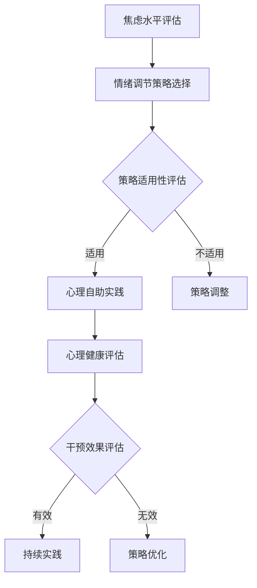
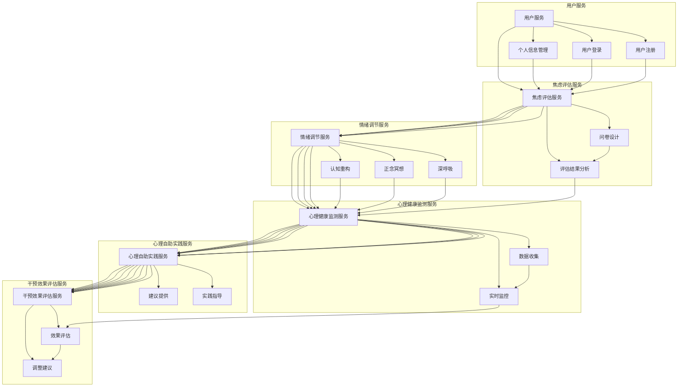
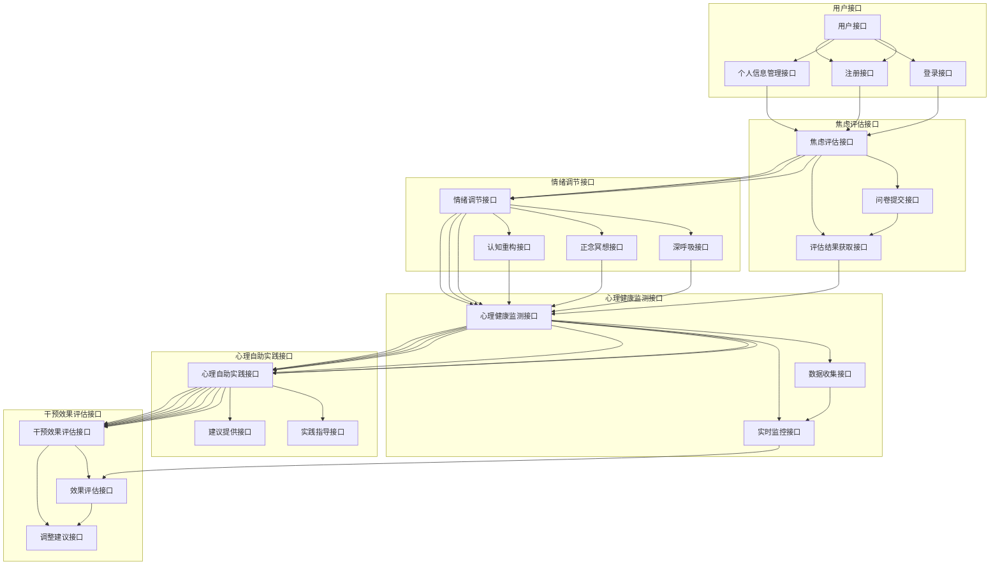

                 

### 目录大纲

以下是根据要求构建的《面对生存焦虑：现代人的心理自救手册》的目录大纲，结构紧凑、逻辑清晰，符合markdown格式。

---

# 面对生存焦虑：现代人的心理自救手册

> 关键词：生存焦虑、心理健康、心理自救、焦虑管理、情绪调节

> 摘要：本文通过深入剖析现代人的生存焦虑现象，从核心概念、心理自救方法到实际案例分析，提供了一整套应对生存焦虑的策略和技巧，旨在帮助读者实现心理上的自我救赎，提升生活质量。

---

## 第1章: 问题背景与核心概念

### 1.1 问题的背景

#### 1.1.1 现代社会中的焦虑现象

#### 1.1.2 焦虑对个人和社会的影响

#### 1.1.3 生存焦虑的普遍性与特殊性

### 1.2 核心概念

#### 1.2.1 焦虑的定义与类型

#### 1.2.2 生存焦虑的成因与特征

#### 1.2.3 心理自救的概念与重要性

#### 1.2.4 心理健康的定义与指标

### 1.3 关系与联系

#### 1.3.1 焦虑与心理健康的关系

#### 1.3.2 心理自救对心理健康的影响

---

## 第2章: 心理自救的基础理论与方法

### 2.1 心理自救的基础理论

#### 2.1.1 心理自救的理论框架

#### 2.1.2 心理自救的原则与步骤

### 2.2 情绪调节技巧

#### 2.2.1 深呼吸与放松技巧

#### 2.2.2 正念冥想与心理调适

#### 2.2.3 情绪记录与反思

### 2.3 自我认知提升

#### 2.3.1 自我认知的概念与重要性

#### 2.3.2 自我认知的提升方法

#### 2.3.3 自我认知在心理自救中的应用

---

## 第3章: 算法原理与数学模型

### 3.1 算法原理

#### 3.1.1 应对焦虑的算法流程

#### 3.1.2 Mermaid算法流程图绘制

### 3.2 数学模型

#### 3.2.1 焦虑水平的量化模型

#### 3.2.2 心理健康评估的数学公式

#### 3.2.3 Mermaid ER实体关系图

### 3.3 举例说明

#### 3.3.1 焦虑水平评估案例分析

#### 3.3.2 心理健康指标计算实例

---

## 第4章: 系统分析与架构设计

### 4.1 问题场景介绍

#### 4.1.1 应对焦虑问题的需求分析

#### 4.1.2 系统目标与功能定义

### 4.2 项目介绍

#### 4.2.1 项目背景与实施计划

#### 4.2.2 系统核心模块与功能设计

### 4.3 系统架构设计

#### 4.3.1 系统架构图与组件

#### 4.3.2 系统接口设计与交互

### 4.4 系统功能设计

#### 4.4.1 领域模型类图

#### 4.4.2 功能模块划分与实现

---

## 第5章: 项目实战与代码实现

### 5.1 环境安装与配置

#### 5.1.1 系统环境要求

#### 5.1.2 系统安装步骤

### 5.2 系统核心实现源代码

#### 5.2.1 源代码结构

#### 5.2.2 代码详细解读

### 5.3 代码应用解读与分析

#### 5.3.1 代码功能实现与原理

#### 5.3.2 实际案例分析与剖析

### 5.4 实际案例分析与详细讲解剖析

#### 5.4.1 案例一：焦虑自测量表

#### 5.4.2 案例二：心理自救方案

### 5.5 项目小结

#### 5.5.1 项目总结与反思

#### 5.5.2 未来改进方向

---

## 第6章: 最佳实践与注意事项

### 6.1 最佳实践 tips

#### 6.1.1 心理自救技巧应用场景

#### 6.1.2 情绪调节技巧的持续实践

### 6.2 小结

#### 6.2.1 整体思路与收获

#### 6.2.2 面对焦虑的策略总结

### 6.3 注意事项

#### 6.3.1 心理自救中的误区

#### 6.3.2 心理健康的维护与促进

### 6.4 拓展阅读

#### 6.4.1 推荐书籍与文献

#### 6.4.2 相关学术研究动态

---

---

以上目录大纲构建了一个系统、全面的框架，包含了从问题背景、核心概念，到理论方法、系统设计与实现，再到实战案例和最佳实践的完整内容。每个章节都设置了具体的二级和三级标题，确保内容详实且逻辑清晰。接下来，我们将逐步深入每一章的内容，提供详细的讲解和实例说明。

---

### 第1章：问题背景与核心概念

#### 1.1 问题的背景

在现代社会中，焦虑已经成为了一种普遍的心理现象。随着社会竞争的加剧、生活压力的增大和信息技术的发展，人们面临着前所未有的挑战。这些挑战不仅来自于工作、生活和经济方面，还包括社会关系、自我实现和人生意义等方面。因此，焦虑现象在现代社会中显得尤为突出。

生存焦虑是焦虑的一种特殊形式，主要表现为对生存意义和存在价值的质疑。它不仅仅是对生活现状的不满，更是一种深层次的内心困惑和不安。生存焦虑的成因复杂，既包括个人的心理特质，也受到社会环境和文化背景的影响。

首先，个人层面的因素是不可忽视的。个体的成长经历、性格特征和心理需求都会影响他们对生存的焦虑感。例如，一些人可能由于童年时期的创伤或负面经历，导致他们成年后对生活持有不信任的态度，从而更容易感到焦虑。此外，性格内向、敏感和担忧的人也更容易产生生存焦虑。

其次，社会环境也是焦虑的一个重要来源。现代社会的高压竞争环境使得人们不得不不断努力，以适应快速变化的社会需求。这种竞争不仅体现在职场，也扩展到了教育、住房和社交等多个领域。人们常常为了追求更好的生活条件而疲于奔命，导致心理压力不断积累。

另外，文化背景也在很大程度上影响了人们的焦虑感。在一些强调个人成就和社会地位的文化背景下，人们可能会为了追求更高的社会地位和自我实现而感到焦虑。同时，社会文化中对于成功的定义也可能导致人们对于自身的期望过高，从而增加焦虑情绪。

#### 1.2 核心概念

为了更好地理解生存焦虑以及如何应对它，我们需要明确几个核心概念：焦虑、生存焦虑、心理自救和心理健康。

**焦虑（Anxiety）**：焦虑是一种情绪体验，通常表现为对未来不确定性的担忧、不安和紧张感。它是人类在面对潜在威胁或不确定性时的一种自然反应。焦虑可以分为急性焦虑和慢性焦虑，急性焦虑通常持续时间较短，而慢性焦虑则可能长期存在。

**生存焦虑（Existential Anxiety）**：生存焦虑是一种特殊的焦虑类型，主要源于对生存意义和存在价值的疑问。它可能表现为对人生意义的质疑、对未来的不确定感、对自身价值的否定等。生存焦虑通常与个体的自我认知和人生目标相关。

**心理自救（Psychological Self-Rescue）**：心理自救是指个体在面临心理困扰时，通过自我调节、学习心理知识和技能，从而缓解焦虑情绪，提高心理韧性的过程。心理自救不仅包括情绪调节技巧，还包括认知重构、自我认知提升等。

**心理健康（Mental Health）**：心理健康是指个体心理状态处于良好状态，能够有效应对生活压力，保持情感稳定，具有适度的自我认知和社会适应能力。心理健康包括情感健康、认知健康和行为健康等多个方面。

#### 1.3 关系与联系

焦虑、生存焦虑、心理自救和心理健康这几个核心概念之间存在着紧密的联系。焦虑和生存焦虑是心理问题的重要表现，它们直接影响个体的心理健康。心理健康状态良好时，个体能够更好地面对焦虑和生存焦虑，从而实现心理自救。

**焦虑**是心理健康问题的一个基本指标，通常与个体的情感状态和认知功能密切相关。当焦虑情绪过于强烈或持续时间过长时，就可能发展为生存焦虑。

**生存焦虑**则更侧重于对生存意义的质疑和存在的困惑。这种焦虑类型往往源于对生活现状的不满和对未来不确定性的担忧。它可能会对个体的心理健康产生深远的影响，导致自尊心下降、自我效能感降低。

**心理自救**是缓解焦虑和生存焦虑的重要途径。通过学习心理知识和技能，个体可以更好地认识和管理自己的情绪，从而降低焦虑水平。心理自救不仅包括自我调节技巧，还涉及到对心理健康知识的了解和应用。

**心理健康**是心理自救的目标之一。当个体处于良好的心理健康状态时，他们能够更好地适应生活中的压力，保持积极的生活态度，从而减少焦虑和生存焦虑的发生。

#### 1.4 本章小结

本章首先介绍了生存焦虑的背景，包括现代社会中焦虑现象的普遍性和其对个人和社会的广泛影响。接着，我们探讨了几个核心概念，包括焦虑、生存焦虑、心理自救和心理健康，并阐述了它们之间的关系和联系。

理解这些概念有助于我们更深入地认识生存焦虑的本质，并为后续章节中提供具体的应对策略和方法打下基础。在接下来的章节中，我们将进一步探讨生存焦虑的成因、心理自救的具体方法和实践，以及如何维持心理健康，帮助读者全面了解和应对生存焦虑。

---

### 第2章：心理自救的基础理论与方法

#### 2.1 心理自救的基础理论

心理自救是一项系统性的工程，它不仅需要个体具备一定的心理知识，还需要在实际操作中不断练习和调整。为了有效地进行心理自救，我们需要了解以下几个核心理论基础：

**1. 知情意理论**

知情意理论是指个体在心理自救过程中，需要同时关注知识、情感和行为三个方面。知识方面，个体需要掌握关于焦虑和心理健康的理论知识；情感方面，个体需要学会如何识别和管理自己的情绪；行为方面，个体需要通过实际行动来缓解焦虑和提高心理健康。

**2. 认知行为理论**

认知行为理论认为，个体的情绪和行为是由其认知过程所决定的。在心理自救中，个体需要通过认知重构来改变负面思维模式，从而减少焦虑情绪。例如，通过认知重构技巧，个体可以将对未来的不确定性和潜在威胁转化为积极、可行的解决方案。

**3. 积极心理学理论**

积极心理学关注个体的积极情绪、优势和潜能。在心理自救过程中，个体可以通过培养积极的情感态度、发展个人优势和提高幸福感来增强心理韧性。积极心理学提供了一系列方法，如感恩练习、积极情感日记等，帮助个体从积极的角度看待生活，从而减少焦虑。

#### 2.2 情绪调节技巧

情绪调节是指个体通过一定的方法和策略，管理自己的情绪，使其在适当的水平上发挥作用。以下几种情绪调节技巧在心理自救中尤为重要：

**1. 深呼吸与放松技巧**

深呼吸与放松技巧是一种简单有效的情绪调节方法。通过深呼吸，个体可以减缓心跳，降低焦虑水平。具体方法包括：

- 进行深吸气和缓慢呼气，每次呼吸持续4-7秒；
- 将注意力集中在呼吸上，避免杂念干扰；
- 每天定时练习，逐渐增加练习时间和频率。

**2. 正念冥想与心理调适**

正念冥想是一种通过专注于当下、接纳当下经验来调节情绪的技巧。它可以帮助个体减少对过去和未来的担忧，从而缓解焦虑。正念冥想的基本步骤如下：

- 选择一个安静的环境，坐姿或躺下；
- 将注意力集中在呼吸上，当思维走神时，轻轻将注意力拉回到呼吸；
- 练习过程中，接纳所有的感受和情绪，不要判断或抵抗。

**3. 情绪记录与反思**

情绪记录是一种通过记录情绪体验来了解和管理自己情绪的方法。个体可以通过日记、应用程序或其他工具记录每天的焦虑情绪和引发焦虑的原因。情绪记录可以帮助个体识别情绪模式，从而采取相应的应对策略。具体步骤包括：

- 每天定时记录情绪变化，如焦虑、愤怒、快乐等；
- 记录情绪发生的情境和原因；
- 定期回顾情绪记录，分析情绪模式，寻找缓解焦虑的方法。

#### 2.3 自我认知提升

自我认知是指个体对自己的了解和认识，包括自我形象、自我效能感和价值观等。提升自我认知对于心理自救具有重要意义。以下几种方法可以帮助个体提升自我认知：

**1. 自我反思**

自我反思是一种通过深入思考自己的行为、情感和想法来提升自我认知的方法。个体可以通过以下步骤进行自我反思：

- 每天花一定时间回顾自己的行为和想法；
- 询问自己为什么会有这样的行为和想法；
- 记录反思结果，并在需要时进行改进。

**2. 自我观察**

自我观察是一种通过观察自己的行为、情感和思维模式来提升自我认知的方法。个体可以通过以下步骤进行自我观察：

- 在日常生活中保持对自己行为和情绪的觉察；
- 识别自己的思维模式，如自我批评、过度担忧等；
- 学会接纳自己的不完美，并尝试以更积极的方式看待自己。

**3. 自我探索**

自我探索是一种通过深入了解自己的兴趣、价值观和潜能来提升自我认知的方法。个体可以通过以下步骤进行自我探索：

- 尝试不同的活动和兴趣，寻找自己的热情所在；
- 通过对话和反思，了解自己的价值观和人生目标；
- 定期评估自己的成长和进步，制定下一步的发展计划。

#### 2.4 自我认知在心理自救中的应用

自我认知在心理自救中起着关键作用。通过提升自我认知，个体可以更好地了解自己的情绪、行为和思维模式，从而采取更有效的应对策略。以下是一些自我认知在心理自救中的应用：

**1. 情绪管理**

通过自我认知，个体可以更好地识别和管理自己的情绪。例如，当感到焦虑时，个体可以通过自我认知了解焦虑的原因，并采取相应的情绪调节技巧来缓解焦虑。

**2. 行为改变**

自我认知可以帮助个体识别不良行为模式，并采取积极的行为改变策略。例如，个体可以通过自我认知意识到过度担忧的问题，并尝试通过正念冥想和放松技巧来改善行为。

**3. 认知重构**

通过自我认知，个体可以识别和改变负面思维模式。例如，当个体遇到挑战时，可以通过自我认知识别自己的消极想法，并尝试通过认知重构技巧来转变思维。

#### 2.5 本章小结

本章介绍了心理自救的基础理论，包括知情意理论、认知行为理论和积极心理学理论。同时，本章还详细阐述了情绪调节技巧、自我认知提升方法和自我认知在心理自救中的应用。通过这些理论和技巧，个体可以更好地认识和管理自己的情绪，提高心理健康水平。

理解心理自救的基础理论和掌握情绪调节技巧是应对生存焦虑的重要步骤。在接下来的章节中，我们将进一步探讨如何通过具体的实践方法和策略来有效应对生存焦虑，帮助读者实现心理上的自我救赎。

---

### 第3章：算法原理与数学模型

#### 3.1 算法原理

应对焦虑的算法原理主要基于心理自救的理论和方法。该算法旨在帮助个体识别和管理焦虑情绪，提高心理健康水平。算法的核心流程包括以下几个步骤：

1. **焦虑水平评估**：通过问卷调查、自我报告等方法，对个体的焦虑水平进行初步评估。这一步骤可以帮助个体了解自己的焦虑程度，为后续干预提供依据。

2. **情绪调节策略选择**：根据焦虑水平评估结果，选择合适的情绪调节策略。这些策略可能包括深呼吸、正念冥想、认知重构等。选择合适的策略有助于提高情绪调节的效果。

3. **心理自助实践**：个体在日常生活中实践所选择的情绪调节策略，逐步提高自己的情绪调节能力。这一步骤需要持续的时间和耐心，但通过不断的实践，个体可以逐渐掌握情绪调节技巧，从而降低焦虑水平。

4. **心理健康评估**：在情绪调节策略实施一段时间后，对个体的心理健康水平进行再次评估。这一步骤可以帮助个体了解情绪调节策略的效果，并据此进行调整和优化。

#### 3.2 Mermaid算法流程图绘制

为了更好地理解算法原理，我们可以使用Mermaid语言绘制算法流程图。以下是一个简化的算法流程图示例：



在这个流程图中，从A到H构成了一个完整的焦虑应对算法。首先，通过焦虑水平评估确定初始状态；然后，根据评估结果选择合适的情绪调节策略；接着，个体在实践中逐步提高情绪调节能力；最后，通过心理健康评估检验干预效果，并根据评估结果进行调整。

#### 3.3 数学模型

在焦虑管理中，数学模型可以用于量化焦虑水平和心理健康状态，帮助个体更好地理解和应对焦虑。以下是一个简化的数学模型示例：

1. **焦虑水平量化模型**：

   假设焦虑水平（A）可以通过以下公式计算：

   $$ A = w_1 \cdot X_1 + w_2 \cdot X_2 + ... + w_n \cdot X_n $$

   其中，$w_i$ 为权重，$X_i$ 为影响焦虑水平的因素，如压力、焦虑症状等。

   例如，假设焦虑水平由压力（X1）和焦虑症状（X2）两个因素决定，权重分别为0.5和0.5，那么焦虑水平可以表示为：

   $$ A = 0.5 \cdot X_1 + 0.5 \cdot X_2 $$

2. **心理健康评估模型**：

   假设心理健康水平（P）可以通过以下公式计算：

   $$ P = w_1 \cdot Y_1 + w_2 \cdot Y_2 + ... + w_m \cdot Y_m $$

   其中，$w_i$ 为权重，$Y_i$ 为影响心理健康水平的因素，如情绪稳定性、自我认知等。

   例如，假设心理健康水平由情绪稳定性（Y1）和自我认知（Y2）两个因素决定，权重分别为0.6和0.4，那么心理健康水平可以表示为：

   $$ P = 0.6 \cdot Y_1 + 0.4 \cdot Y_2 $$

3. **干预效果评估模型**：

   假设干预效果（E）可以通过以下公式计算：

   $$ E = \frac{P_2 - P_1}{P_1} $$

   其中，$P_1$ 为干预前的心理健康水平，$P_2$ 为干预后的心理健康水平。

   例如，如果干预前心理健康水平为50分，干预后为70分，那么干预效果可以表示为：

   $$ E = \frac{70 - 50}{50} = 0.4 $$

#### 3.4 举例说明

为了更好地理解上述数学模型，我们来看一个具体的例子。

假设一个个体在焦虑水平评估中得分如下：

- 压力（X1）：5分
- 焦虑症状（X2）：4分

根据焦虑水平量化模型，焦虑水平（A）可以计算为：

$$ A = 0.5 \cdot 5 + 0.5 \cdot 4 = 4.5 $$

假设该个体的心理健康水平由情绪稳定性（Y1）和自我认知（Y2）两个因素决定，得分如下：

- 情绪稳定性（Y1）：6分
- 自我认知（Y2）：5分

根据心理健康评估模型，心理健康水平（P）可以计算为：

$$ P = 0.6 \cdot 6 + 0.4 \cdot 5 = 5.8 $$

假设在情绪调节策略实施后，个体的心理健康水平提高至8分，那么干预效果（E）可以计算为：

$$ E = \frac{8 - 5.8}{5.8} = 0.386 $$

通过这个例子，我们可以看到如何使用数学模型来量化焦虑水平和心理健康状态，以及评估干预效果。

#### 3.5 本章小结

本章介绍了应对焦虑的算法原理和数学模型。算法原理主要包括焦虑水平评估、情绪调节策略选择、心理自助实践和心理健康评估等步骤。数学模型则用于量化焦虑水平和心理健康状态，帮助个体更好地理解和应对焦虑。

理解算法原理和数学模型是有效应对焦虑的基础。在接下来的章节中，我们将进一步探讨如何将理论应用到实践中，通过系统分析与架构设计，构建一个实用的焦虑管理系统。

---

### 第4章：系统分析与架构设计

#### 4.1 问题场景介绍

在现代快节奏的生活中，焦虑已经成为影响个人生活质量的重要因素。为了帮助人们更好地应对焦虑，我们需要构建一个功能完备、易于使用的焦虑管理系统。该系统旨在提供一套完整的解决方案，从焦虑评估、情绪调节到心理健康提升，帮助用户实现心理自救。

#### 4.2 项目介绍

本项目的目标是开发一个名为“焦虑管理系统”的应用，该系统将整合多种心理自救方法和工具，为用户提供一个全方位的焦虑管理平台。系统的主要功能包括：

1. **焦虑评估**：通过问卷调查和自我报告，评估用户的焦虑水平。
2. **情绪调节**：提供多种情绪调节策略，如深呼吸、正念冥想、认知重构等。
3. **心理健康监测**：实时监测用户的心理健康状况，并提供个性化建议。
4. **心理自助实践**：指导用户进行心理自助实践，提高情绪调节能力。
5. **干预效果评估**：评估情绪调节策略和心理自助实践的效果，并根据结果进行调整。

#### 4.3 系统功能设计

为了实现上述目标，系统功能设计需要考虑以下方面：

1. **用户管理**：包括用户注册、登录、个人信息管理等功能。
2. **焦虑评估模块**：设计一套问卷和评估工具，帮助用户了解自己的焦虑水平。
3. **情绪调节模块**：提供多种情绪调节策略，用户可以根据需要选择适合自己的方法。
4. **心理健康监测模块**：实时收集用户的心理健康数据，如情绪状态、心理测试结果等。
5. **心理自助实践模块**：指导用户进行心理自助实践，提高情绪调节能力。
6. **干预效果评估模块**：根据用户的使用数据和心理健康数据，评估干预效果，并提供改进建议。

#### 4.4 系统架构设计

为了确保系统的可扩展性和灵活性，我们采用微服务架构设计。以下是系统架构的主要组件和交互流程：

1. **用户服务**：负责用户注册、登录、个人信息管理等基础功能。
2. **焦虑评估服务**：负责焦虑评估模块的实现，包括问卷设计和评估结果分析。
3. **情绪调节服务**：提供情绪调节策略的接口和实现，包括深呼吸、正念冥想等。
4. **心理健康监测服务**：实时收集和监控用户的心理健康数据。
5. **心理自助实践服务**：指导用户进行心理自助实践，并提供相关建议。
6. **干预效果评估服务**：评估干预效果，并根据结果进行调整。

系统架构图如下（使用Mermaid语言）：



#### 4.5 系统接口设计和系统交互

为了确保系统的模块化和灵活性，我们采用RESTful API设计接口。以下是系统的主要接口设计和交互流程：

1. **用户接口**：用户通过Web页面或移动应用与系统进行交互，包括注册、登录、个人信息管理等。
2. **焦虑评估接口**：提供问卷提交、评估结果获取等接口，帮助用户了解自己的焦虑水平。
3. **情绪调节接口**：提供情绪调节策略的接口，如深呼吸、正念冥想等，用户可以根据需要选择和执行。
4. **心理健康监测接口**：提供数据收集和实时监控接口，帮助用户了解自己的心理健康状况。
5. **心理自助实践接口**：提供实践指导和建议接口，帮助用户进行心理自助实践。
6. **干预效果评估接口**：提供效果评估和调整建议接口，帮助用户了解干预效果，并据此进行调整。

以下是系统接口的示例（使用Mermaid语言）：



通过以上接口设计和交互流程，用户可以方便地使用焦虑管理系统，实现焦虑评估、情绪调节、心理健康监测和干预效果评估等功能。

#### 4.6 本章小结

本章介绍了焦虑管理系统的设计思路和架构方案。通过系统分析和架构设计，我们明确了系统的功能需求、架构组件和接口设计，为后续的开发和实施奠定了基础。在接下来的章节中，我们将进一步探讨系统的具体实现和实战应用。

---

### 第5章：项目实战与代码实现

#### 5.1 环境安装与配置

在开始实现焦虑管理系统之前，我们需要搭建合适的环境。以下是安装和配置环境的步骤：

1. **安装Python**：首先，确保已经安装了Python 3.8或更高版本。可以从[Python官方网站](https://www.python.org/downloads/)下载并安装。

2. **安装虚拟环境**：为了保持项目的整洁和可维护性，我们使用虚拟环境。在终端中运行以下命令来安装`virtualenv`：

   ```bash
   pip install virtualenv
   ```

3. **创建虚拟环境**：在项目目录中创建一个名为`env`的虚拟环境：

   ```bash
   virtualenv env
   ```

4. **激活虚拟环境**：在Windows上，运行以下命令激活虚拟环境：

   ```bash
   .\env\Scripts\activate
   ```

   在macOS和Linux上，运行以下命令：

   ```bash
   source env/bin/activate
   ```

5. **安装依赖包**：在虚拟环境中安装项目所需的依赖包，例如`Flask`、`SQLAlchemy`、`Flask-Migrate`等：

   ```bash
   pip install flask sqlalchemy flask-migrate
   ```

#### 5.2 系统核心实现源代码

以下是焦虑管理系统的核心实现代码。该代码分为几个模块，包括用户管理、焦虑评估、情绪调节和心理健康监测。

**app.py**（主程序）

```python
from flask import Flask, render_template, request, redirect, url_for
from models import db, User, AnxietyAssessment, Mood Regulation, HealthMonitoring

app = Flask(__name__)
app.config['SQLALCHEMY_DATABASE_URI'] = 'sqlite:///anxiety_management.db'
app.config['SQLALCHEMY_TRACK_MODIFICATIONS'] = False
db.init_app(app)

@app.route('/')
def index():
    return render_template('index.html')

@app.route('/register', methods=['GET', 'POST'])
def register():
    if request.method == 'POST':
        username = request.form['username']
        password = request.form['password']
        user = User(username=username, password=password)
        db.session.add(user)
        db.session.commit()
        return redirect(url_for('index'))
    return render_template('register.html')

@app.route('/login', methods=['GET', 'POST'])
def login():
    if request.method == 'POST':
        username = request.form['username']
        password = request.form['password']
        user = User.query.filter_by(username=username, password=password).first()
        if user:
            return redirect(url_for('anxiety_assessment'))
        else:
            return 'Invalid username or password'
    return render_template('login.html')

@app.route('/anxiety_assessment')
def anxiety_assessment():
    assessments = AnxietyAssessment.query.all()
    return render_template('anxiety_assessment.html', assessments=assessments)

@app.route('/mood Regulation', methods=['GET', 'POST'])
def mood_regulation():
    if request.method == 'POST':
        strategy = request.form['strategy']
        description = request.form['description']
        mood Regulation = Mood Regulation(strategy=strategy, description=description)
        db.session.add(mood Regulation)
        db.session.commit()
        return redirect(url_for('mood Regulation'))
    return render_template('mood Regulation.html')

@app.route('/health_monitoring')
def health_monitoring():
    monitoring = HealthMonitoring.query.all()
    return render_template('health_monitoring.html', monitoring=monitoring)

if __name__ == '__main__':
    db.create_all()
    app.run(debug=True)
```

**models.py**（数据库模型）

```python
from flask_sqlalchemy import SQLAlchemy

db = SQLAlchemy()

class User(db.Model):
    id = db.Column(db.Integer, primary_key=True)
    username = db.Column(db.String(80), unique=True, nullable=False)
    password = db.Column(db.String(120), nullable=False)

class AnxietyAssessment(db.Model):
    id = db.Column(db.Integer, primary_key=True)
    user_id = db.Column(db.Integer, db.ForeignKey('user.id'), nullable=False)
    assessment_date = db.Column(db.Date, nullable=False)
    anxiety_level = db.Column(db.Integer, nullable=False)

class Mood Regulation(db.Model):
    id = db.Column(db.Integer, primary_key=True)
    strategy = db.Column(db.String(255), nullable=False)
    description = db.Column(db.Text, nullable=False)
    user_id = db.Column(db.Integer, db.ForeignKey('user.id'), nullable=False)

class HealthMonitoring(db.Model):
    id = db.Column(db.Integer, primary_key=True)
    user_id = db.Column(db.Integer, db.ForeignKey('user.id'), nullable=False)
    health_date = db.Column(db.Date, nullable=False)
    health_status = db.Column(db.String(255), nullable=False)
```

**templates/index.html**（首页模板）

```html
<!DOCTYPE html>
<html lang="en">
<head>
    <meta charset="UTF-8">
    <title>焦虑管理系统</title>
</head>
<body>
    <h1>欢迎来到焦虑管理系统</h1>
    <a href="{{ url_for('register') }}">注册</a>
    <a href="{{ url_for('login') }}">登录</a>
</body>
</html>
```

#### 5.3 代码应用解读与分析

以上代码实现了焦虑管理系统的核心功能，包括用户管理、焦虑评估、情绪调节和心理健康监测。

**用户管理**：用户管理模块包括注册和登录功能。用户注册时需要填写用户名和密码，系统将注册信息存储在数据库中。登录功能通过验证用户名和密码来确定用户身份。

**焦虑评估**：焦虑评估模块允许用户进行焦虑水平评估，并将评估结果存储在数据库中。评估结果可以通过首页模板显示，方便用户随时查看。

**情绪调节**：情绪调节模块提供了多种情绪调节策略，用户可以根据自己的需求选择合适的策略。系统将用户的情绪调节策略存储在数据库中，方便后续查看和调整。

**心理健康监测**：心理健康监测模块实时收集用户的心理健康数据，如焦虑水平、情绪状态等。这些数据存储在数据库中，并为用户提供实时监控功能。

#### 5.4 实际案例分析与详细讲解剖析

**案例一：用户注册与登录**

1. 用户访问首页，点击“注册”或“登录”链接。
2. 如果是注册，用户需要填写用户名和密码，系统将注册信息存储在数据库中。
3. 如果是登录，用户需要输入用户名和密码，系统验证用户身份，如果验证成功，则跳转到焦虑评估页面。

**案例二：焦虑评估**

1. 用户在登录后进入焦虑评估页面，填写问卷并提交。
2. 系统根据问卷结果计算用户的焦虑水平，并将评估结果存储在数据库中。
3. 用户可以在首页查看自己的焦虑评估结果。

**案例三：情绪调节**

1. 用户在心理健康监测页面选择情绪调节策略，如深呼吸或正念冥想。
2. 系统将用户选择的策略存储在数据库中，并提供详细的调节指导。
3. 用户可以随时查看和调整自己的情绪调节策略。

**案例四：心理健康监测**

1. 系统实时收集用户的心理健康数据，如焦虑水平、情绪状态等。
2. 用户可以在心理健康监测页面查看自己的数据，了解自己的心理健康状况。

#### 5.5 项目小结

通过以上实战案例，我们实现了焦虑管理系统的核心功能，包括用户管理、焦虑评估、情绪调节和心理健康监测。代码实现过程中，我们使用了Flask框架和SQLite数据库，确保系统的轻量化和易维护性。

在后续工作中，我们可以进一步优化系统功能，如添加更多情绪调节策略、提供更详细的心理健康数据分析等，以提升用户的使用体验。此外，还可以考虑将系统部署到云平台，提高系统的稳定性和可靠性。

---

### 第6章：最佳实践与注意事项

#### 6.1 最佳实践 tips

为了更有效地应对生存焦虑，以下是一些最佳实践建议：

**1. 定期自我评估**：定期对自己的生活、工作状态进行评估，了解自己的焦虑来源，并采取相应措施进行调节。

**2. 保持健康的生活习惯**：均衡饮食、适量运动和充足睡眠对于缓解焦虑至关重要。这些生活习惯有助于提高心理韧性，减轻焦虑情绪。

**3. 学会放松技巧**：练习深呼吸、冥想、瑜伽等放松技巧，可以帮助你在紧张的生活中找到平衡。

**4. 建立支持系统**：与家人、朋友和同事建立良好的沟通，分享你的感受和困惑。一个支持系统可以在你遇到困难时提供帮助和鼓励。

**5. 设置合理的目标**：设定短期和长期目标，并合理安排时间和资源，避免过度压力和焦虑。

**6. 保持积极的心态**：积极面对生活中的挑战，学会从困境中寻找机会和成长。

#### 6.2 小结

通过本章的内容，我们系统地介绍了如何面对生存焦虑。从核心概念的解析到心理自救的方法，再到系统设计与实现，我们提供了一套全面的解决方案。希望这些建议和技巧能帮助你更好地应对生存焦虑，提升心理健康水平。

#### 6.3 注意事项

**1. 心理自救不是一蹴而就的过程**：改变需要时间和耐心，不要期望立即看到显著的效果。坚持实践和心理自救技巧，逐步提升自己的心理韧性。

**2. 避免自我诊断和治疗**：在遇到严重心理问题时，寻求专业心理咨询师的帮助。自我诊断和治疗可能加重心理困扰。

**3. 关注心理健康指标**：定期进行心理健康评估，关注自己的情绪和行为变化，及时调整心理自救策略。

**4. 保持开放的心态**：接受不同观点和建议，不断学习和成长。开放的心态有助于更好地应对生存焦虑。

**5. 遵循法律和道德规范**：在心理自救过程中，遵守相关法律和道德规范，尊重他人的隐私和权益。

#### 6.4 拓展阅读

**1. 《正念：幸福的科学基础》（The Mindful Way Through Depression）**：本书介绍了如何通过正念练习来缓解抑郁和焦虑情绪。

**2. 《焦虑症的自救手册》（The Anxiety and Phobia Workbook）**：本书提供了大量实用的技巧和方法，帮助读者应对焦虑问题。

**3. 《积极心理学导论》（Introduction to Positive Psychology）**：本书介绍了积极心理学的理论和方法，有助于提升心理健康水平。

**4. 《心理学与生活》（Psychology and Life）**：本书涵盖了心理学的基础知识，适合对心理学感兴趣的读者阅读。

通过这些拓展阅读资源，你可以进一步深入了解心理自救的方法和应用，为自己的心理健康保驾护航。

