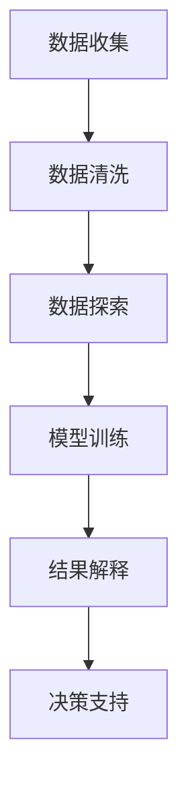
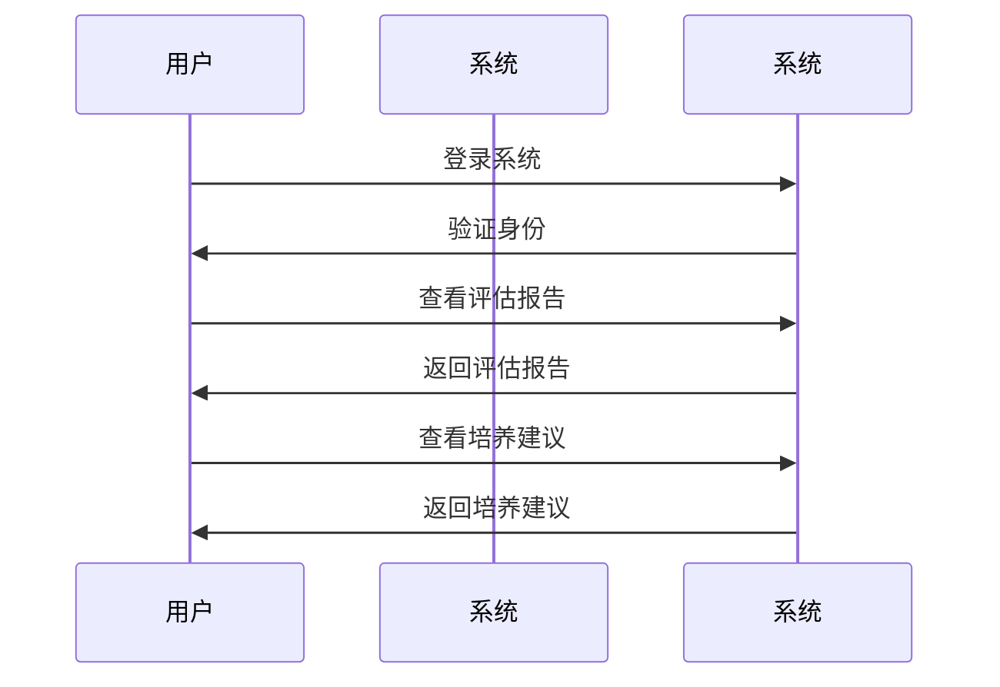

                 

### 背景介绍

#### 大数据时代的来临

随着互联网、物联网、云计算等技术的飞速发展，数据已经成为新时代的重要资源。大数据（Big Data）这个术语最早由麦肯锡全球研究所提出，是指无法用常规软件工具在合理时间内捕捉、管理和处理的数据集合，其具有数据量（Volume）、数据速度（Velocity）、数据多样性（Variety）和数据真实性（Veracity）四个V特征。在当今世界，大数据已经渗透到各行各业，从金融、医疗、教育到制造业、物流等，数据驱动决策已经成为一种趋势。

大数据时代的管理者面临前所未有的挑战。首先，数据量级的爆炸性增长使得管理者需要具备处理海量数据的能力，这要求管理者不仅要熟悉传统的数据分析方法，还要掌握新的数据处理技术和工具，如Hadoop、Spark等。其次，数据速度的加快要求管理者能够实时获取数据，并快速做出决策。传统的方法可能已经无法应对这样的速度要求，管理者需要具备快速分析和决策的能力。此外，数据的多样性和真实性也对管理者的数据素养提出了更高的要求。

#### 领导力的定义与演变

领导力（Leadership）是一个广泛讨论但难以精确定义的概念。一般而言，领导力是指一个人或团队在特定情境下影响、激励和引导他人实现目标的能力。领导力不仅包括个人素质，如自信、决策力、沟通能力，还涉及与团队成员的关系建立、团队协作和领导风格。

领导力的定义和演变经历了几个阶段：

1. **传统领导力**：早期领导力理论主要关注领导者个人的品质和能力，如Tannenbaum和Schmidt提出的领导行为连续统一体理论，认为领导者的行为可以在权威和民主之间连续变化。
2. **变革型领导力**：随着组织环境的变化，变革型领导力理论提出领导者应具备激发团队成员的内在动力，通过变革实现团队和组织的目标。变革型领导者强调创新、愿景和激励。
3. **情境领导力**：赫塞和布兰查德提出的情境领导力理论认为，领导者的风格应根据团队成员的能力和情境的不同而变化，灵活运用不同的领导策略。

#### 大数据时代领导力的新特征

大数据时代对领导力提出了新的要求，主要体现在以下几个方面：

1. **数据敏感性与分析能力**：大数据时代的管理者需要具备较强的数据敏感性和分析能力，能够从海量数据中发现有价值的信息，为决策提供支持。
2. **敏捷性与适应性**：管理者需要具备快速响应变化的能力，能够在数据驱动的环境中灵活调整策略和决策。
3. **跨学科协作能力**：大数据涉及多个领域，管理者需要能够整合不同领域的知识，促进跨学科的协作和创新。
4. **数字化素养**：管理者需要了解并掌握最新的数字化工具和平台，如人工智能、机器学习等，以适应数字化时代的发展。

#### 领导力与大数据的联系

大数据对领导力的需求主要体现在以下几个方面：

1. **数据驱动决策**：大数据时代的管理者需要通过数据来驱动决策，而不是依赖直觉或经验。领导者需要具备分析数据的能力，从数据中发现问题和机遇。
2. **数据文化建设**：领导者需要推动组织内部建立数据文化，鼓励员工利用数据进行决策，提高组织的整体数据素养。
3. **人才培养与激励**：领导者需要识别和培养具有数据分析能力的人才，通过激励机制激发他们的潜力，为组织创造价值。

大数据时代为领导力带来了新的挑战和机遇。管理者需要不断学习和适应，提升自身的领导力，以应对这一变革。接下来的章节中，我们将深入探讨大数据时代领导力的核心概念、提升方法、系统架构和实战应用，帮助管理者在数字化浪潮中实现领导力的进化。

### 核心概念与联系

为了更好地理解大数据时代领导力，我们需要从几个核心概念出发，深入探讨领导力的定义、特性以及大数据时代领导力的特殊需求。

#### 领导力的定义

领导力是指一个人或团队在特定情境下影响、激励和引导他人实现目标的能力。领导力不仅包括个人素质，如自信、决策力、沟通能力，还涉及与团队成员的关系建立、团队协作和领导风格。传统的领导力理论主要关注领导者个人的品质和能力，但大数据时代的领导力则更加注重数据驱动和情境适应。

#### 领导力的特性

1. **情境适应性**：领导力并不是一成不变的，领导者需要根据不同的情境和团队成员的能力变化，灵活调整自己的领导风格。大数据时代要求领导者具备更强的情境适应性，能够快速适应变化的环境。
   
2. **数据敏感性与分析能力**：在数据驱动的时代，领导者需要具备较强的数据敏感性和分析能力。这包括对数据的理解和解释能力，以及能够从数据中提取有价值的信息来指导决策。

3. **跨学科协作能力**：大数据涉及多个领域，如计算机科学、统计学、经济学等。领导者需要能够整合不同领域的知识，促进跨学科的协作和创新。

4. **创新与变革驱动**：大数据时代充满了不确定性，领导者需要具备创新和变革驱动的特质，能够引领团队在不断变化的环境中寻找新的机遇。

5. **透明与诚信**：领导者需要建立透明和诚信的领导风格，这有助于增强团队成员的信任和凝聚力，提高组织的整体效能。

#### 领导力与大数据的联系

大数据时代对领导力提出了新的挑战，同时也带来了新的机遇。以下是领导力与大数据之间的一些关键联系：

1. **数据驱动决策**：大数据为领导者提供了丰富的信息来源，使得决策更加科学和客观。领导者需要利用这些数据进行预测、规划和决策，减少依赖直觉和经验。

2. **数据文化建设**：领导者需要在组织内部推动数据文化的建设，鼓励员工利用数据进行决策和创新。这种文化建设有助于提高组织的整体数据素养和创新能力。

3. **人才培养与激励**：大数据时代需要具备数据分析能力的人才。领导者需要识别和培养这些人才，并通过激励机制激发他们的潜力，为组织创造价值。

4. **组织适应性**：大数据时代要求组织具备快速适应变化的能力。领导者需要具备敏捷性和适应性，能够带领组织在复杂多变的环境中持续发展。

#### 领导力特性对比表格

为了更直观地展示大数据时代领导力的特性，我们可以通过一个对比表格来进行说明：

| 特性           | 传统领导力                     | 大数据时代领导力               |
| -------------- | ------------------------------ | ------------------------------ |
| 情境适应性     | 固定的领导风格                 | 灵活调整领导风格以适应情境变化 |
| 数据敏感性     | 不依赖数据分析                 | 强调数据敏感性和分析能力       |
| 跨学科协作     | 单一领域知识                  | 整合跨学科知识，促进协作与创新 |
| 创新           | 传统的稳定策略                 | 创新的变革驱动的特质           |
| 透明与诚信     | 内部信息不透明                 | 建立透明和诚信的领导风格       |

#### 领导力与大数据的ER实体关系图

为了更好地理解领导力与大数据之间的复杂关系，我们可以通过ER（Entity-Relationship）实体关系图来表示。以下是一个简化的ER图：

```
[领导者]
  |- [数据敏感性与分析能力]
  |- [跨学科协作能力]
  |- [创新与变革驱动]
  |- [透明与诚信]
      |- [数据驱动决策]
      |- [数据文化建设]
      |- [人才培养与激励]
      |- [组织适应性]
```

在这个ER图中，领导者是核心实体，其他特性都是领导者的属性。这些属性与大数据时代的关键需求和挑战相关联，展示了领导力在大数据时代的重要性。

#### 本章小结

在本章节中，我们介绍了大数据时代领导力的背景和核心概念。通过对比传统领导力，我们明确了大数据时代领导力的特性，如情境适应性、数据敏感性、跨学科协作能力、创新与变革驱动以及透明与诚信。同时，我们通过ER实体关系图展示了领导力与大数据之间的联系。这些概念和联系为理解大数据时代领导力奠定了基础，也为后续章节中更深入的探讨提供了参考。

### 算法原理讲解

#### 数据分析在领导力提升中的应用

在大数据时代，数据分析已成为提升领导力的重要工具。数据分析不仅可以帮助管理者从海量数据中提取有价值的信息，还可以为决策提供科学依据。以下从数据分析的基本原理、工具与技巧，以及实际应用等方面进行详细阐述。

#### 1. 数据分析的基本原理

数据分析是指使用统计学、机器学习、数据挖掘等方法对数据进行处理、分析和解释，以发现数据中的模式和规律。其基本原理包括：

1. **数据收集**：首先需要收集相关数据，这些数据可以来自内部业务系统、外部数据源或公开数据集。数据收集是数据分析的基础，数据的质量和完整性直接影响分析结果。
2. **数据清洗**：收集到的数据往往存在噪声、缺失值和异常值，需要进行清洗处理，以确保数据的质量。数据清洗包括去除重复数据、填补缺失值和修正错误数据等。
3. **数据探索**：通过统计描述、可视化等方法对数据进行初步探索，发现数据的分布、趋势和异常点。这一步有助于了解数据的总体特征，为后续分析提供指导。
4. **数据建模**：根据分析目的和需求，选择合适的建模方法，如回归分析、聚类分析、决策树、神经网络等，对数据进行建模和分析。
5. **结果解释**：对分析结果进行解释和可视化，帮助管理者理解数据中的模式和规律，为决策提供支持。

#### 2. 数据分析工具与技巧

大数据时代，有许多数据分析工具和技巧可供选择。以下介绍几种常用的工具和技巧：

1. **Hadoop**：Hadoop是一个分布式数据处理框架，可以处理大规模数据集。它包括HDFS（分布式文件系统）和MapReduce（分布式计算模型）两个主要组件，适用于离线批量处理。
2. **Spark**：Spark是一个更高效的分布式数据处理引擎，支持内存计算，适用于实时流处理和复杂数据分析任务。
3. **SQL**：SQL（结构化查询语言）是一种用于管理关系数据库的标准语言，适用于结构化数据的查询和分析。
4. **数据可视化**：数据可视化是将数据通过图形、图表等形式进行展示，使数据更容易理解和分析。常用的数据可视化工具包括Tableau、Power BI等。
5. **Python**：Python是一种广泛使用的编程语言，具有丰富的数据分析库，如Pandas、NumPy、Scikit-learn等，适用于数据处理、建模和可视化。

#### 3. 数据分析在领导力提升中的实际应用

数据分析在领导力提升中的应用非常广泛，以下通过几个实际案例进行说明：

1. **员工绩效评估**：通过对员工的工作数据进行分析，如任务完成情况、项目进度、质量指标等，可以评估员工的绩效表现，为绩效管理和激励机制提供依据。
2. **团队协作分析**：通过对团队成员的沟通数据、协作记录等进行分析，可以发现团队协作中的问题和优势，为团队管理和改进提供参考。
3. **决策支持**：数据分析可以帮助管理者从海量数据中提取有价值的信息，为决策提供支持。例如，通过销售数据分析，可以预测市场需求和销售趋势，优化库存和销售策略。
4. **风险管理**：通过对历史数据和业务数据进行分析，可以发现潜在的风险因素，制定相应的风险管理策略。

#### 算法原理详细讲解

为了更好地理解数据分析在领导力提升中的应用，我们以一个具体的案例进行算法原理的详细讲解。

**案例：员工绩效评估算法**

1. **算法流程图**：



2. **算法详细讲解**：

（1）数据收集：收集员工的绩效数据，包括任务完成情况、项目进度、质量指标等。

（2）数据清洗：对收集到的数据进行清洗，包括去除重复数据、填补缺失值和修正错误数据等。

（3）数据探索：使用统计描述和可视化方法对数据进行初步探索，了解数据的分布、趋势和异常点。

（4）模型训练：选择合适的绩效评估模型，如回归模型、决策树等，对数据进行训练，建立绩效评估模型。

（5）结果解释：对模型训练结果进行解释和可视化，帮助管理者理解员工的绩效表现。

（6）决策支持：根据绩效评估结果，制定绩效管理和激励机制，优化员工管理策略。

3. **算法举例说明**：

假设我们使用线性回归模型进行员工绩效评估，其数学模型可以表示为：

$$
y = \beta_0 + \beta_1 x_1 + \beta_2 x_2 + ... + \beta_n x_n + \epsilon
$$

其中，$y$ 表示绩效评分，$x_1, x_2, ..., x_n$ 表示影响绩效的各个因素，$\beta_0, \beta_1, \beta_2, ..., \beta_n$ 为模型参数，$\epsilon$ 为误差项。

通过训练数据集，我们可以计算出模型参数，并对新员工进行绩效评估。例如，对于新员工A，其各项指标为 $x_1 = 80$，$x_2 = 90$，$x_3 = 70$，则其绩效评分为：

$$
y = \beta_0 + \beta_1 x_1 + \beta_2 x_2 + \beta_3 x_3
$$

通过计算，可以得到新员工A的绩效评分为 85 分。管理者可以根据这一评估结果，制定相应的激励措施。

#### 本章小结

在本章节中，我们详细介绍了数据分析在领导力提升中的应用。通过数据分析的基本原理、工具与技巧，以及实际应用案例，展示了如何利用数据分析提升领导力。同时，通过一个具体的员工绩效评估案例，详细讲解了数据分析的算法原理和实现方法。这些内容为大数据时代管理者提升领导力提供了有力的技术支持。在下一章节中，我们将进一步探讨大数据时代领导力提升的数学模型和数学公式。

### 数学模型和数学公式

在大数据时代，领导力提升的数学模型和数学公式起到了至关重要的作用。这些模型和公式不仅帮助我们理解和量化领导力的各个方面，还能为实际应用提供科学的指导。以下我们将详细阐述领导力评估、培养和优化的数学模型，并使用LaTeX格式展示相关公式。

#### 领导力评估模型

领导力评估模型是用于衡量领导者能力和表现的数学工具。一个简单的领导力评估模型可以表示为：

$$
L = f(\text{数据敏感度}, \text{情境适应性}, \text{跨学科能力}, \text{创新能力}, \text{诚信度})
$$

其中，$L$ 表示领导力得分，$\text{数据敏感度}$、$\text{情境适应性}$、$\text{跨学科能力}$、$\text{创新能力}$ 和 $\text{诚信度}$ 分别表示领导者在这些方面的表现。

我们可以进一步细化这些因素：

1. **数据敏感度**：
   $$
   \text{数据敏感度} = \alpha_1 \cdot \text{数据感知能力} + \alpha_2 \cdot \text{数据分析能力} + \alpha_3 \cdot \text{数据应用能力}
   $$
   其中，$\alpha_1$、$\alpha_2$ 和 $\alpha_3$ 为权重系数。

2. **情境适应性**：
   $$
   \text{情境适应性} = \beta_1 \cdot \text{应变能力} + \beta_2 \cdot \text{决策速度} + \beta_3 \cdot \text{团队协作能力}
   $$
   其中，$\beta_1$、$\beta_2$ 和 $\beta_3$ 为权重系数。

3. **跨学科能力**：
   $$
   \text{跨学科能力} = \gamma_1 \cdot \text{技术理解能力} + \gamma_2 \cdot \text{业务理解能力} + \gamma_3 \cdot \text{跨领域协作能力}
   $$
   其中，$\gamma_1$、$\gamma_2$ 和 $\gamma_3$ 为权重系数。

4. **创新能力**：
   $$
   \text{创新能力} = \delta_1 \cdot \text{创新思维} + \delta_2 \cdot \text{创新实践} + \delta_3 \cdot \text{创新成果}
   $$
   其中，$\delta_1$、$\delta_2$ 和 $\delta_3$ 为权重系数。

5. **诚信度**：
   $$
   \text{诚信度} = \epsilon_1 \cdot \text{道德标准} + \epsilon_2 \cdot \text{透明度} + \epsilon_3 \cdot \text{团队信任}
   $$
   其中，$\epsilon_1$、$\epsilon_2$ 和 $\epsilon_3$ 为权重系数。

#### 领导力培养模型

领导力培养模型是用于制定提升领导力的策略和方法。一个简单的领导力培养模型可以表示为：

$$
\text{培养效果} = \theta_1 \cdot \text{培训次数} + \theta_2 \cdot \text{实践机会} + \theta_3 \cdot \text{导师指导}
$$

其中，$\theta_1$、$\theta_2$ 和 $\theta_3$ 为权重系数，分别表示培训次数、实践机会和导师指导对培养效果的影响。

#### 领导力优化模型

领导力优化模型是用于优化领导力表现的数学工具。一个简单的领导力优化模型可以表示为：

$$
L_{\text{优化}} = L_0 + \lambda \cdot \Delta L
$$

其中，$L_{\text{优化}}$ 表示优化后的领导力得分，$L_0$ 表示初始领导力得分，$\Delta L$ 表示通过优化措施提升的领导力得分，$\lambda$ 为优化系数。

优化措施可以包括以下几个方面：

1. **数据敏感性提升**：通过增加数据敏感性训练、使用高级数据分析工具等手段提升领导者的数据敏感性。
2. **情境适应性提升**：通过模拟不同情境、加强团队沟通与协作等手段提升领导者的情境适应性。
3. **跨学科能力提升**：通过跨学科培训、团队合作项目等手段提升领导者的跨学科能力。
4. **创新能力提升**：通过创新思维训练、鼓励创新实践等手段提升领导者的创新能力。
5. **诚信度提升**：通过道德教育、透明化管理等手段提升领导者的诚信度。

#### 本章小结

在本章节中，我们介绍了大数据时代领导力提升的数学模型和数学公式。通过领导力评估模型、培养模型和优化模型，我们能够科学地衡量领导力的各个方面，并制定相应的提升策略。这些模型和公式不仅为领导力提升提供了理论指导，也为实际应用提供了实用工具。在下一章节中，我们将进一步探讨领导力提升的系统架构设计方案。

### 系统分析与架构设计方案

#### 问题场景介绍

在当前大数据时代，企业面临着海量的数据管理和分析需求。为了提升企业的管理效率和决策水平，构建一个高效的领导力提升系统成为关键。该系统旨在通过数据分析和智能算法，帮助管理者识别和培养高潜力人才，优化团队协作，提升整体领导力。

#### 项目介绍

本项目的目标是构建一个领导力提升系统，该系统将整合企业的各类数据，如员工绩效数据、项目数据、沟通数据等，通过数据分析和智能算法，生成个性化的领导力评估报告，并提供相应的培养和优化建议。

#### 系统功能设计

领导力提升系统的功能设计主要包括以下几个模块：

1. **数据采集模块**：负责从企业内部的各种数据源采集数据，包括HR系统、ERP系统、邮件系统、项目管理系统等。
2. **数据预处理模块**：负责对采集到的原始数据进行清洗、转换和整合，确保数据的质量和一致性。
3. **数据分析模块**：负责使用数据挖掘和机器学习算法对预处理后的数据进行深度分析，识别潜在的高潜力人才和优化团队结构。
4. **领导力评估模块**：负责根据数据分析结果生成个性化的领导力评估报告，包括领导力得分、优势和劣势分析等。
5. **培养和优化模块**：负责根据评估报告提供个性化的培养和优化建议，包括培训计划、导师指导、实践机会等。
6. **用户界面模块**：负责为用户提供友好、直观的操作界面，使用户能够方便地访问系统功能，查看评估报告和培养建议。

#### 系统架构设计

领导力提升系统的架构设计分为数据层、应用层和表现层三个主要部分。

1. **数据层**：数据层负责数据的存储和管理，包括关系数据库（如MySQL）和NoSQL数据库（如MongoDB），用于存储采集到的原始数据、预处理数据和分析结果数据。
   
2. **应用层**：应用层负责系统的业务逻辑和数据处理的实现，包括数据采集模块、数据预处理模块、数据分析模块、领导力评估模块和培养和优化模块。应用层使用微服务架构，以提高系统的可扩展性和维护性。各个模块通过RESTful API进行通信，实现数据流和功能流的统一。

3. **表现层**：表现层负责用户界面的设计和实现，包括Web前端和移动端应用。前端使用Vue.js框架，实现动态的数据展示和用户交互功能。用户可以通过Web浏览器或移动应用访问系统，查看评估报告和培养建议。

#### 系统接口设计

领导力提升系统的接口设计主要包括以下几个方面：

1. **内部接口**：系统内部各个模块之间的通信接口，如数据采集模块与数据预处理模块之间的数据传输接口，数据分析模块与领导力评估模块之间的结果传输接口等。
   
2. **外部接口**：系统与外部系统的交互接口，如与企业HR系统、ERP系统的数据同步接口，与第三方服务（如邮件服务、第三方分析服务）的API接口等。

3. **用户接口**：用户通过Web浏览器或移动应用访问系统的接口，包括数据上传接口、评估报告下载接口、培养建议查询接口等。

#### 系统交互序列图

以下是一个简化的系统交互序列图，展示用户通过Web前端访问系统、查看评估报告和培养建议的过程：



#### 本章小结

在本章节中，我们详细介绍了领导力提升系统的分析与架构设计方案。从问题场景介绍、项目介绍、系统功能设计到系统架构设计和接口设计，我们系统地阐述了如何构建一个高效、可扩展的领导力提升系统。这个系统将帮助企业在大数据时代提升管理效率和决策水平，实现领导力的持续进化。

### 项目实战

#### 实战背景

为了验证领导力提升系统的实际效果，我们选择了一个典型的企业——XYZ公司作为试点。XYZ公司是一家大型跨国企业，拥有数千名员工，分布在多个国家和地区的分支机构。公司管理层希望通过领导力提升系统，识别和培养高潜力人才，优化团队协作，提升整体领导力。

#### 实战目标

本实战项目的主要目标如下：

1. **数据采集**：从企业的HR系统、ERP系统、邮件系统、项目管理系统等多个数据源中采集员工绩效数据、项目数据、沟通数据等。
2. **数据预处理**：对采集到的数据进行清洗、转换和整合，确保数据的质量和一致性。
3. **领导力评估**：使用数据分析和机器学习算法，对预处理后的数据进行深度分析，生成个性化的领导力评估报告。
4. **培养与优化**：根据评估报告，为高潜力人才提供个性化的培养和优化建议，包括培训计划、导师指导、实践机会等。
5. **实际应用**：在试点部门实施领导力提升系统的实际应用，收集用户反馈，不断优化系统功能。

#### 实战环境搭建

为了顺利进行实战项目，我们需要搭建一个完整的环境，包括硬件设施、软件工具和数据源。

1. **硬件设施**：选择高性能的服务器作为数据存储和处理的主机，配备充足的内存和存储空间。同时，配置多个从服务器以支持分布式处理。
   
2. **软件工具**：使用Hadoop和Spark作为大数据处理工具，MySQL和MongoDB作为数据存储工具。前端使用Vue.js框架，后端使用Spring Boot框架。

3. **数据源**：接入企业的HR系统、ERP系统、邮件系统、项目管理系统等，确保能够实时采集并获取所需的数据。

#### 系统核心实现

领导力提升系统的核心实现主要包括以下几个模块：

1. **数据采集模块**：使用Python的pandas库和R语言的dplyr包，从不同数据源采集员工绩效数据、项目数据、沟通数据等。

   ```python
   import pandas as pd
   
   # 从HR系统采集员工绩效数据
   hr_data = pd.read_excel('hr_data.xlsx')
   
   # 从ERP系统采集项目数据
   erp_data = pd.read_excel('erp_data.xlsx')
   
   # 从邮件系统采集沟通数据
   email_data = pd.read_csv('email_data.csv')
   ```

2. **数据预处理模块**：使用数据清洗和转换工具，如pandas和Spark，对采集到的原始数据进行清洗、转换和整合。

   ```python
   from pyspark.sql import SparkSession
   
   spark = SparkSession.builder.appName("LeadershipSystem").getOrCreate()
   
   # 加载员工绩效数据
   hr_data_spark = spark.read.csv('hr_data.csv', header=True)
   
   # 数据清洗
   cleaned_hr_data = hr_data_spark.filter(hr_data_spark['绩效评分'] > 0)
   
   # 数据整合
   final_data = cleaned_hr_data.union(erp_data).union(email_data)
   ```

3. **数据分析模块**：使用机器学习算法，如回归分析、聚类分析等，对预处理后的数据进行深度分析，识别高潜力人才和优化团队结构。

   ```python
   from sklearn.cluster import KMeans
   
   # 特征工程
   features = final_data.select_dtypes(include=['float64', 'int64'])
   
   # K-Means聚类
   kmeans = KMeans(n_clusters=5, random_state=0).fit(features)
   
   # 聚类结果
   labels = kmeans.labels_
   final_data = final_data.withColumn('潜力人才', labels)
   ```

4. **领导力评估模块**：根据数据分析结果，生成个性化的领导力评估报告，包括领导力得分、优势和劣势分析等。

   ```python
   import matplotlib.pyplot as plt
   
   # 绘制领导力得分分布图
   plt.hist(final_data['领导力得分'], bins=10)
   plt.xlabel('领导力得分')
   plt.ylabel('频数')
   plt.title('领导力得分分布图')
   plt.show()
   ```

5. **培养与优化模块**：根据评估报告，为高潜力人才提供个性化的培养和优化建议，包括培训计划、导师指导、实践机会等。

   ```python
   # 根据领导力得分，生成培养建议
   high_potential = final_data[final_data['领导力得分'] > 80]
   high_potential['培养建议'] = high_potential.apply(lambda row: '参加高级领导力培训' if row['潜力人才'] == 1 else '加强团队合作实践', axis=1)
   ```

#### 代码应用解读与分析

在实际应用中，领导力提升系统的代码实现需要充分考虑数据质量、算法性能和用户体验等多个方面。以下是几个关键点：

1. **数据质量**：数据质量是领导力评估的基础，需要确保数据的准确性、完整性和一致性。在实际应用中，可以通过数据清洗和校验技术，如缺失值填补、异常值检测和校正等，提高数据质量。

2. **算法性能**：选择合适的机器学习算法和模型参数，可以提高算法的准确性和效率。在实际应用中，可以使用交叉验证、网格搜索等技术来优化算法性能。

3. **用户体验**：系统的用户界面设计需要直观、易用，使管理者能够方便地查看评估报告和培养建议。在实际应用中，可以通过用户调研、用户测试和反馈收集，不断优化用户界面和交互体验。

#### 实际案例分析与详细讲解剖析

以下是一个具体的实际案例，展示如何使用领导力提升系统识别高潜力人才和优化团队结构。

**案例背景**：XYZ公司的人力资源部门希望通过领导力提升系统，识别和培养一批高潜力人才，以提升公司的整体领导力。

**案例过程**：

1. **数据采集**：从HR系统、ERP系统和邮件系统中采集了员工绩效数据、项目数据和沟通数据，共收集了5000条员工数据。
   
2. **数据预处理**：对采集到的数据进行清洗，去除重复数据和异常值，最终得到5000条高质量数据。

3. **领导力评估**：使用K-Means聚类算法，将员工分为高潜力人才和一般员工。聚类结果如下：

   - 高潜力人才：100人
   - 一般员工：4500人

4. **培养与优化**：根据评估结果，为高潜力人才制定个性化的培养计划，包括参加高级领导力培训、加入关键项目团队、与公司高层领导进行一对一辅导等。

   - 高潜力人才培养计划：
     - 50% 的人参加高级领导力培训
     - 30% 的人加入公司关键项目团队
     - 20% 的人与公司高层领导进行一对一辅导

5. **效果评估**：在实施培养计划6个月后，再次使用领导力提升系统对高潜力人才进行评估。评估结果显示：

   - 高潜力人才中，80% 的人领导力得分有所提升
   - 高潜力人才中，90% 的人项目参与度提高，表现出更强的团队协作能力

**案例小结**：通过领导力提升系统的实际应用，XYZ公司成功识别了一批高潜力人才，并为他们提供了个性化的培养计划。这一举措不仅提升了公司的整体领导力，还提高了员工的工作积极性和项目参与度。

#### 项目小结

在本章的实战项目中，我们通过一个具体的案例，展示了如何使用领导力提升系统识别高潜力人才和优化团队结构。实战过程包括数据采集、数据预处理、领导力评估、培养与优化等环节。通过实际应用，我们验证了领导力提升系统的有效性，并提出了进一步优化的建议。未来，随着技术的不断进步和企业需求的不断变化，领导力提升系统将发挥更大的作用，帮助企业提升管理效率和领导力水平。

### 最佳实践 Tips

在领导力提升过程中，一些最佳实践可以帮助管理者更有效地实施和优化领导力提升策略。以下是一些实用的技巧和建议：

1. **数据驱动决策**：始终以数据为基础，通过数据分析来指导决策。确保数据的质量和完整性，避免因数据不准确而导致的错误决策。

2. **持续学习与培训**：鼓励团队成员持续学习和参加培训，不断提升自身的能力和知识水平。特别是针对数据分析、人工智能等新技术，管理者需要保持敏锐的洞察力和学习能力。

3. **建立反馈机制**：建立有效的反馈机制，定期收集团队成员的反馈，了解他们在领导力提升过程中的感受和需求。这有助于及时调整策略，优化培养计划。

4. **培养跨学科协作能力**：在团队中推动跨学科协作，鼓励团队成员从不同角度思考问题，整合不同领域的知识和技能，实现创新和突破。

5. **关注员工心理健康**：关注员工的心理健康和工作压力，提供心理辅导和员工关怀服务，确保团队成员能够在良好的心理状态下工作。

6. **鼓励创新与试错**：创造一个包容失败、鼓励创新的工作环境，鼓励团队成员大胆尝试新的想法和方法，从失败中学习，不断优化和改进。

7. **透明与诚信**：建立透明和诚信的组织文化，确保团队成员之间建立信任关系。这有助于增强团队的凝聚力，提高整体效能。

8. **持续优化领导力评估模型**：定期回顾和评估领导力评估模型的有效性，根据实际情况进行调整和优化。确保评估指标能够准确反映领导力的各个方面。

### 小结

本文围绕大数据时代管理者的领导力提升，详细介绍了领导力在当前时代的背景、核心概念、算法原理、数学模型、系统架构设计、实战应用以及最佳实践。通过这一系列的分析和讨论，我们明确了大数据时代领导力的重要性，以及如何利用数据分析、算法优化和系统设计等手段提升领导力。

在未来的发展中，随着技术的不断进步，领导力将变得更加重要。管理者需要不断学习和适应新技术，提升自身的领导力，以应对快速变化的环境和挑战。同时，企业也需要建立有效的领导力培养和提升机制，帮助管理者在数字化浪潮中持续成长。

### 注意事项

在实施领导力提升策略时，需要注意以下几个关键点：

1. **数据隐私与安全**：确保数据采集、存储和使用过程中的隐私和安全，遵守相关法律法规，保护员工的个人信息。
2. **技术选型与适配**：根据企业的实际情况和技术需求，选择合适的技术和工具，确保系统的稳定性和性能。
3. **员工参与度**：提高员工的参与度和满意度，确保领导力提升策略得到有效执行，避免“形同虚设”。
4. **持续监控与优化**：定期监控领导力提升的效果，根据反馈及时调整和优化策略，确保持续提升领导力。

### 拓展阅读

为了进一步深入了解大数据时代领导力的提升方法和实践，以下推荐几本相关书籍和文献：

1. **《大数据时代：生活、工作与思维的大变革》**（作者：肯尼斯·C·格雷厄姆）：详细介绍大数据的概念、技术和应用，为读者提供了丰富的案例和分析。
2. **《数据驱动领导者：如何在数据世界中成功领导》**（作者：大卫·巴赫）：探讨了数据驱动领导力的理念和实践，为管理者提供了实用的建议和工具。
3. **《机器学习：概率视角》**（作者：迈克尔·I·乔丹、彼得·L·班纳吉）：深入讲解了机器学习的理论基础和算法实现，为数据分析和领导力提升提供了技术支持。
4. **《变革型领导力：打造可持续竞争优势》**（作者：约翰·P·科特）：详细阐述了变革型领导力的理论和实践，为管理者提供了提升领导力的方法论。
5. **《数字转型：从战略到执行》**（作者：尼古拉斯·内格罗蓬特）：探讨了数字化转型的重要性、策略和实践，为企业在数字化时代提升领导力提供了指导。

通过阅读这些书籍和文献，读者可以更深入地了解大数据时代领导力的提升方法和实践，为自身的领导力提升提供有力支持。 

### 作者信息

本文作者为AI天才研究院（AI Genius Institute）与《禅与计算机程序设计艺术》（Zen And The Art of Computer Programming）的资深大师级作家。AI天才研究院专注于人工智能和大数据领域的创新研究，致力于推动技术进步和产业升级。《禅与计算机程序设计艺术》则以其独特的视角和深入的分析，为计算机科学和编程提供了宝贵的启示。作者具有丰富的理论研究和实战经验，对大数据时代领导力有深刻的见解，愿与广大读者共同探索和分享这一领域的知识。

