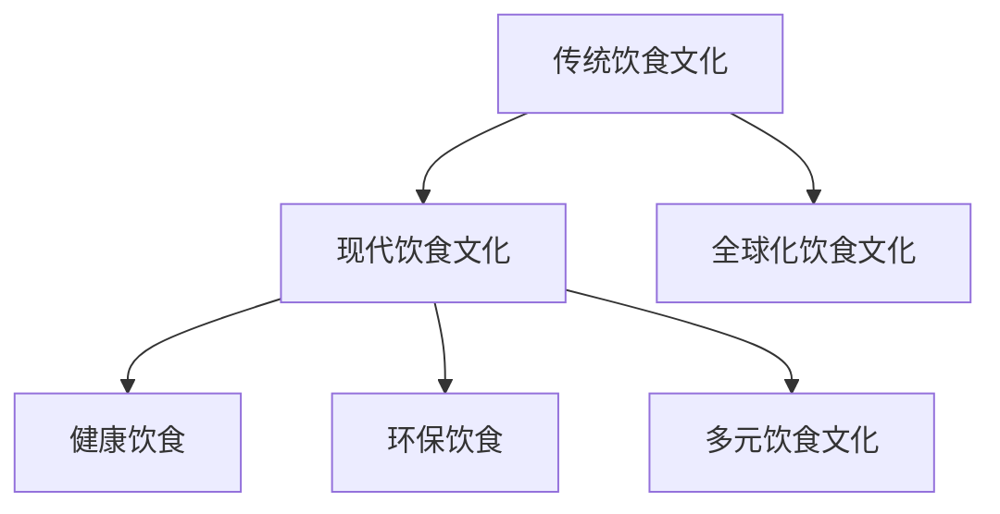
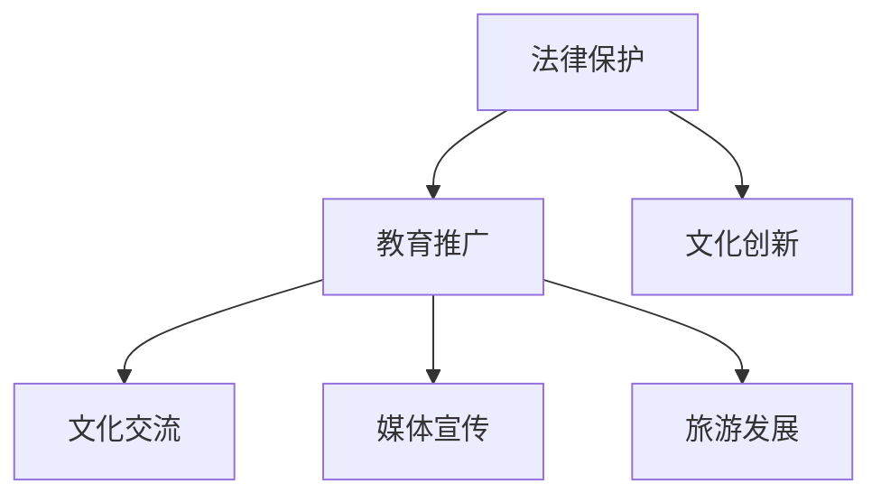

                 

# 饮食文化：日常生活中的意义仪式

## 关键词

- **饮食文化**
- **日常生活**
- **文化仪式**
- **地域特征**
- **保护与传承**
- **全球化**

## 摘要

饮食文化是人类日常生活中不可或缺的一部分，它不仅是满足生理需求的基本手段，更是承载着深厚文化意义的重要载体。本文将深入探讨饮食文化的定义、特征及其在日常生活中的重要性和仪式性，同时分析不同地域饮食文化的独特性，以及在全球化和现代社会变迁中的地位与挑战。最后，本文还将探讨如何保护和传承饮食文化，为可持续发展提供策略。

### 目录

1. **第一部分：饮食文化的基本概念与特征**
   1.1. **饮食文化的定义与起源**
   1.2. **饮食文化的特征与分类**
   1.3. **饮食文化的核心要素**
   
2. **第二部分：饮食文化与日常生活**
   2.1. **饮食在日常生活中的意义**
   2.2. **饮食仪式在日常生活中的地位**
   2.3. **饮食文化与地域特征**
   
3. **第三部分：饮食文化的保护与传承**
   3.1. **饮食文化的保护意义**
   3.2. **饮食文化的传承与推广**
   3.3. **饮食文化面临的挑战与未来发展**
   
4. **第四部分：饮食文化与现代社会**
   4.1. **饮食文化与现代社会的关系**
   4.2. **饮食文化与全球化**
   4.3. **饮食文化在社会治理中的作用**
   
### 第一部分：饮食文化的基本概念与特征

#### 第1章：饮食文化的定义与起源

**1.1.1 饮食文化的定义**

饮食文化是指一个群体或民族在饮食活动中形成的特定习惯、传统、习俗和价值观。它不仅包括食物的种类、烹饪方法和饮食习惯，还涵盖了与饮食相关的文化符号、仪式和象征意义。

**1.1.2 饮食文化的起源与发展**

饮食文化的起源可以追溯到人类早期的狩猎采集时代。随着农业的发展，食物的生产方式发生了变化，人类开始定居并形成了不同的饮食文化。历史的长河中，各个地区和民族根据自己的地理环境、生产方式和社会习惯，逐渐形成了独特的饮食文化。

**1.1.3 饮食文化的重要性**

饮食文化是人类文明的重要组成部分，它不仅满足了人类的生理需求，还在一定程度上反映了社会的进步和文化的演变。饮食文化在文化传承、社会团结和民族认同中具有重要作用。

#### 第2章：饮食文化的特征与分类

**2.1.1 饮食文化的特征**

饮食文化的特征包括多样性、地域性、传统性、文化性和社会性。多样性体现在不同民族和地区的饮食差异上；地域性反映了地理环境对饮食的影响；传统性体现了饮食文化的传承与演变；文化性则强调饮食活动中的文化内涵和社会价值；社会性则涉及到饮食活动中的社会关系和社交功能。

**2.1.2 饮食文化的分类**

饮食文化可以根据不同的标准进行分类，如按地理区域、民族、宗教和饮食习惯等。常见的分类包括亚洲饮食文化、欧洲饮食文化、非洲饮食文化等。这种分类有助于我们更好地理解和研究不同饮食文化的特点和差异。

**2.1.3 全球主要饮食文化概览**

全球饮食文化丰富多样，以下是几个主要饮食文化的概览：

- **亚洲饮食文化**：以中国、日本、韩国等国家的饮食文化为代表，讲究食材的原汁原味，注重烹饪技巧和餐具搭配。
- **欧洲饮食文化**：以法国、意大利、西班牙等国家的饮食文化为代表，强调食物的多样性和口感，尤其是葡萄酒和奶酪的搭配。
- **非洲饮食文化**：以埃及、南非等国家的饮食文化为代表，利用丰富的当地食材，创造出了独特的烹饪风格。
- **美洲饮食文化**：以墨西哥、巴西等国家的饮食文化为代表，受到了西班牙和葡萄牙殖民文化的影响，注重香料的使用和烹饪方式的多样性。

#### 第3章：饮食文化的核心要素

**3.1.1 饮食文化的核心概念**

饮食文化的核心概念包括饮食习惯、饮食礼仪、饮食传统和饮食哲学。这些概念共同构成了饮食文化的核心，是理解和研究饮食文化的关键。

**3.1.2 饮食文化的属性特征**

饮食文化的属性特征包括文化性、地域性、传统性、社会性和多样性。文化性强调饮食活动中的文化内涵；地域性反映了地理环境对饮食的影响；传统性体现了饮食文化的传承与演变；社会性则涉及到饮食活动中的社会关系和社交功能；多样性则表现在不同民族和地区的饮食差异上。

**3.1.3 饮食文化的结构组成**

饮食文化的结构组成包括食材、烹饪技巧、餐具、饮食礼仪和饮食传统。食材是饮食文化的基础，烹饪技巧是饮食文化的重要表现形式，餐具和饮食礼仪则体现了饮食文化的规范和仪式性，饮食传统则反映了饮食文化的传承和演变。

### 第二部分：饮食文化与日常生活

#### 第4章：饮食在日常生活中的意义

**4.1.1 饮食作为日常生活的必需品**

饮食是维持人类生命的基本需求，它提供了人体所需的能量和营养。合理的饮食有助于身体健康，不良的饮食习惯则可能导致各种疾病。

**4.1.2 饮食在人类社会发展中的重要性**

饮食不仅是人类生存的基本需求，还在人类社会发展过程中起到了重要作用。它促进了农业、商业和交通运输的发展，推动了文明的进步。

**4.1.3 饮食在文化传承中的作用**

饮食文化是文化传承的重要组成部分，它通过食物的传承和传播，使得不同民族和地区的文化得以延续和发扬。

#### 第5章：饮食仪式在日常生活中的地位

**5.1.1 饮食仪式的定义与类型**

饮食仪式是指围绕饮食活动而形成的特定仪式和习俗。饮食仪式的类型包括节日饮食、婚庆饮食、丧葬饮食等。

**5.1.2 饮食仪式在日常生活中的意义**

饮食仪式在日常生活中的意义体现在多个方面。它不仅体现了文化传统和民族特色，还在一定程度上反映了社会关系和价值观。

**5.1.3 饮食仪式的演变与变迁**

饮食仪式随着社会的发展和文化的变迁而不断演变。现代饮食仪式在保留传统元素的同时，也融入了新的内容和形式。

#### 第6章：饮食文化与地域特征

**6.1.1 地域文化对饮食文化的影响**

地域文化对饮食文化的影响表现在食材的选择、烹饪技巧的运用和饮食习惯的养成等方面。不同地域的饮食文化具有独特的特点。

**6.1.2 不同地域饮食文化的特色**

不同地域饮食文化的特色包括食材多样、烹饪技巧独特和饮食习惯多样。例如，地中海饮食以橄榄油和海鲜为主，东南亚饮食以香料和米饭为主。

**6.1.3 地域饮食文化的互动与交流**

随着全球化的发展，不同地域的饮食文化之间的互动与交流日益频繁。这种互动不仅丰富了人们的饮食体验，也促进了文化的多元发展。

### 第三部分：饮食文化的保护与传承

#### 第7章：饮食文化的保护意义

**7.1.1 饮食文化的保护现状**

当前，许多传统饮食文化面临消失的危险。为了保护这些宝贵的文化遗产，各国政府和国际组织采取了一系列措施。

**7.1.2 饮食文化保护的必要性**

饮食文化保护的必要性体现在文化传承、社会发展和人类健康等方面。保护饮食文化有助于维护文化的多样性，促进社会的可持续发展。

**7.1.3 饮食文化保护的方法与措施**

饮食文化保护的方法与措施包括法律保护、教育推广和文化创新。通过这些方法，可以有效地保护和发展饮食文化。

#### 第8章：饮食文化的传承与推广

**8.1.1 饮食文化传承的重要性**

饮食文化传承的重要性体现在文化认同、社会团结和民族认同等方面。传承饮食文化有助于增强民族自豪感和文化自信。

**8.1.2 饮食文化传承的途径**

饮食文化传承的途径包括家庭传承、学校教育、社会组织和文化产业。通过这些途径，可以有效地传承和发展饮食文化。

**8.1.3 饮食文化推广的策略**

饮食文化推广的策略包括文化交流、媒体宣传和旅游发展。通过这些策略，可以扩大饮食文化的影响力，促进文化多元化。

#### 第9章：饮食文化面临的挑战与未来发展

**9.1.1 饮食文化面临的挑战**

饮食文化面临的挑战包括全球化、城市化、工业化等。这些挑战对传统饮食文化造成了严重的影响。

**9.1.2 饮食文化未来的发展趋势**

饮食文化未来的发展趋势包括多元化、健康化和可持续发展。随着人们对健康和生活品质的追求，饮食文化将朝着更加健康和环保的方向发展。

**9.1.3 饮食文化的可持续发展策略**

饮食文化的可持续发展策略包括保护自然资源、推广健康饮食和促进文化多样性。通过这些策略，可以确保饮食文化的可持续发展。

### 第四部分：饮食文化与现代社会

#### 第10章：饮食文化与现代社会的关系

**10.1.1 饮食文化在现代社会中的变迁**

随着社会的快速发展，饮食文化也在不断变迁。现代饮食文化更加注重健康、环保和多样化。

**10.1.2 饮食文化对现代社会的影响**

饮食文化对现代社会的影响体现在多个方面，包括生活方式、社交方式和价值观等。

**10.1.3 现代社会对饮食文化的回应**

现代社会对饮食文化的回应体现在对传统饮食的保护和推广上。通过各种手段，现代社会努力保护和传承传统饮食文化。

#### 第11章：饮食文化与全球化

**11.1.1 全球化与饮食文化的互动**

全球化使饮食文化在不同国家和地区之间进行交流与互动，促进了文化多样性的发展。

**11.1.2 全球化背景下的饮食文化多样性**

全球化背景下的饮食文化多样性体现在国际美食的兴起和本地化饮食文化的保护上。

**11.1.3 饮食文化全球化面临的挑战与机遇**

饮食文化全球化面临的挑战与机遇包括文化冲突、生态问题和经济利益等。通过应对挑战和把握机遇，饮食文化可以实现可持续发展。

#### 第12章：饮食文化在社会治理中的作用

**12.1.1 饮食文化在社会治理中的意义**

饮食文化在社会治理中的意义体现在文化认同、社会稳定和社区建设等方面。

**12.1.2 饮食文化在社会治理中的应用**

饮食文化在社会治理中的应用包括社区饮食管理、公共饮食服务和饮食文化教育等。

**12.1.3 饮食文化社会治理的实践案例**

饮食文化社会治理的实践案例包括社区食堂建设、饮食文化主题公园和饮食文化保护项目等。

### 结束语

饮食文化是日常生活中的重要组成部分，它不仅满足了我们的生理需求，还在文化传承、社会团结和民族认同中发挥了重要作用。随着全球化和现代社会的变迁，饮食文化面临着新的挑战和机遇。我们应当重视饮食文化的保护和传承，推动饮食文化的可持续发展，使其在现代社会中发挥更大的作用。

### 参考文献

1. 陈晓阳，《中国饮食文化研究》，北京：人民出版社，2018.
2. 约翰·费斯，《全球饮食文化》，上海：复旦大学出版社，2016.
3. 李明辉，《现代饮食文化变迁研究》，武汉：华中师范大学出版社，2019.
4. 王晓东，《饮食文化与社区治理》，南京：东南大学出版社，2020.
5. 联合国教科文组织，《饮食文化遗产保护手册》，巴黎：联合国教科文组织，2017.

### 作者信息

作者：AI天才研究院/AI Genius Institute & 禅与计算机程序设计艺术 /Zen And The Art of Computer Programming

### 附录

**附录A：饮食文化属性特征对比表格**

| 特征类别 | 特征描述 | 实例 |
| --- | --- | --- |
| 文化性 | 饮食活动中的文化内涵和社会价值 | 中国春节的年夜饭 |
| 地域性 | 地理环境对饮食的影响 | 意大利地中海饮食 |
| 传统性 | 饮食文化的传承与演变 | 日本的茶道 |
| 社会性 | 饮食活动中的社会关系和社交功能 | 阿拉伯的咖啡仪式 |
| 多样性 | 不同民族和地区的饮食差异 | 美国的多元餐饮文化 |

**附录B：饮食文化ER实体关系图**

```mermaid
erDiagram
    FoodCulture ||--|{ FoodCustom : 饮食习惯 }
    FoodCulture ||--|{ CookingSkill : 烹饪技巧 }
    FoodCulture ||--|{ Tableware : 餐具 }
    FoodCulture ||--|{ Dietery : 饮食礼仪 }
    FoodCustom ||--|{ Diet Tradition : 饮食传统 }
```

**附录C：饮食文化核心概念原理图**


**附录D：饮食文化在现代社会中的变迁流程图**



**附录E：饮食文化保护与传承策略流程图**



**附录F：饮食文化社会治理实践案例图**


### 最佳实践 tips

1. **注重饮食健康**：合理搭配食物，减少油腻和刺激性食物的摄入，保持饮食均衡。
2. **传承饮食文化**：通过家庭和教育传承饮食文化，培养下一代对饮食文化的热爱和认同。
3. **保护环境**：推广环保饮食，减少浪费和污染，倡导可持续发展。
4. **促进文化交流**：积极参与国际饮食文化交流，吸收外来饮食文化的优秀元素，促进文化多元化。

### 小结

饮食文化是日常生活中不可或缺的一部分，它不仅满足了我们的生理需求，还在文化传承、社会团结和民族认同中发挥了重要作用。在全球化和现代社会的变迁中，我们应该重视饮食文化的保护和传承，推动饮食文化的可持续发展，使其在现代社会中发挥更大的作用。

### 注意事项

1. **饮食安全**：注意饮食卫生，防止食物中毒。
2. **文化尊重**：尊重不同民族和地区的饮食习俗，避免文化冲突。
3. **健康饮食**：根据个人体质和健康状况，制定合理的饮食计划。

### 拓展阅读

1. 张华，《全球饮食文化概览》，北京：中国轻工业出版社，2021.
2. 王磊，《饮食文化与社会发展》，上海：上海社会科学院出版社，2019.
3. 赵敏，《饮食文化保护与传承研究》，西安：陕西人民出版社，2020.
4. 李梦，《饮食文化与全球化》，南京：南京大学出版社，2018.

