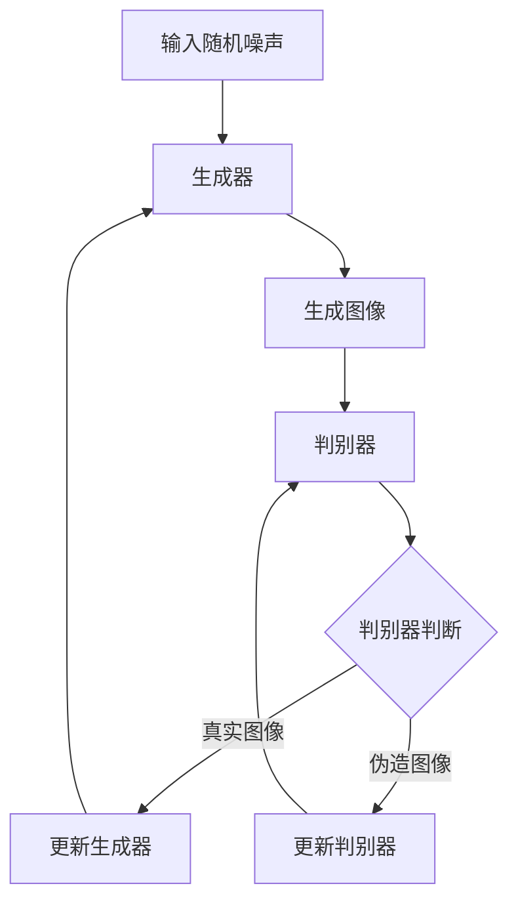

                 

### 1.1.1 计算机图形学的发展历程

计算机图形学作为一门跨学科的领域，其历史可以追溯到20世纪中叶。最早的计算机图形学研究主要集中在大规模集成电路的诞生和计算机硬件性能的快速提升上。1950年代，约翰·冯·诺依曼（John von Neumann）提出了计算机模拟图形的构想，这为后来的计算机图形学奠定了基础。

1960年代，计算机图形学取得了显著进展。1962年，Ivan Sutherland在MIT开发了著名的“Sketchpad”系统，这是首个交互式图形系统，使用鼠标作为输入设备，可以进行图形绘制和编辑。这一发明标志着计算机图形学的里程碑，开创了图形用户界面（GUI）的先河。

随着时间推移，计算机图形学的发展经历了几个关键阶段：

- **早期阶段（1960-1970s）**：主要研究计算机生成和显示二维和三维图形的基本算法。这一时期，研究集中在图形硬件和基本算法上，如扫描转换、裁剪和光照模型等。

- **中期阶段（1970-1980s）**：随着计算机性能的不断提升，图形处理能力得到了极大的提升。这一阶段，矢量图形和光栅图形处理技术得到了发展，同时计算机图形学在CAD（计算机辅助设计）和计算机动画等领域得到了广泛应用。

- **现代阶段（1990s至今）**：计算机图形学进入了一个新的高度，三维图形处理技术、实时渲染、物理模拟和人工智能等新兴技术的应用，使得计算机图形学在各个领域都取得了突破性的进展。

近年来，计算机图形学的发展受到了人工智能技术的推动。深度学习、增强现实（AR）和虚拟现实（VR）等技术的兴起，使得计算机图形学在图像生成、图像识别和交互式应用等方面有了更多的可能性。例如，基于生成对抗网络（GANs）的图像合成技术，可以生成逼真的图像和视频，使得虚拟世界更加逼真。

总体而言，计算机图形学的发展是一个不断进步、不断创新的过程。从最初的二维图形到复杂的三维场景，从简单的图像绘制到复杂的实时渲染，计算机图形学在不断拓展其应用范围，同时也面临着新的挑战。

### 1.1.2 人工智能的崛起及其影响

人工智能（AI）的崛起可以追溯到20世纪50年代，当时科学家们开始探索如何让计算机像人类一样思考和学习。从最初的逻辑推理和规则系统，到后来的统计学习和神经网络，人工智能经历了多次起伏和变革。20世纪80年代，随着计算机硬件性能的提升和算法的创新，人工智能开始进入一个快速发展期。

进入21世纪，人工智能技术取得了突破性的进展。深度学习作为人工智能的一个重要分支，以其强大的学习能力和广泛的适用性，迅速成为人工智能研究的焦点。2012年，AlexNet在ImageNet图像识别大赛中取得了令人瞩目的成绩，这一成果标志着深度学习的崛起。

人工智能在多个领域产生了深远的影响：

1. **图像识别与处理**：深度学习技术在图像识别中的应用使得计算机能够更加准确地识别和分类图像。例如，自动驾驶汽车使用计算机视觉技术来识别道路标志、行人和其他车辆。

2. **自然语言处理**：人工智能技术在自然语言处理（NLP）领域的应用极大地提高了语言理解、文本生成和机器翻译的准确性。例如，谷歌的神经机器翻译模型能够提供几乎与人类翻译相媲美的翻译质量。

3. **游戏和娱乐**：在游戏领域，人工智能技术被用于开发智能化的游戏对手和角色，使得游戏体验更加丰富和真实。例如，DeepMind开发的AlphaGo在围棋领域取得了重大突破。

4. **医疗健康**：人工智能技术在医疗健康领域的应用包括疾病诊断、药物研发和医疗图像分析等。通过分析大量的医疗数据，人工智能能够帮助医生做出更准确的诊断和治疗方案。

5. **智能制造**：在制造业，人工智能技术被用于优化生产流程、提高产品质量和降低成本。例如，通过机器学习算法，工业机器人可以学习并优化其操作流程。

6. **金融与经济**：人工智能技术在金融领域的应用包括风险评估、交易策略和欺诈检测等。通过分析大量的交易数据，人工智能能够帮助金融机构做出更明智的决策。

7. **智能家居**：人工智能技术在智能家居中的应用使得家居设备更加智能化，例如智能音箱、智能灯光和智能家电等，为人们的生活带来了极大的便利。

总之，人工智能的崛起不仅改变了计算机科学的研究方向，也在各个行业中产生了深远的影响。随着技术的不断进步，人工智能的应用范围将继续扩大，推动人类社会向更加智能化和自动化的方向发展。

### 1.1.3 AI与计算机图形学融合的现状与趋势

随着人工智能技术的迅猛发展，计算机图形学与AI的融合成为了一个热门的研究方向和应用领域。两者融合的现状和趋势可以从以下几个方面进行探讨：

#### 现状

1. **图像生成与处理**：人工智能在计算机图形学中的应用最为广泛的是图像生成与处理。生成对抗网络（GANs）作为一种强大的图像生成技术，已经在图像合成、图像修复、图像超分辨率等方面取得了显著成果。例如，DeepArt和StyleGAN等模型可以生成高质量的逼真图像。

2. **实时渲染**：实时渲染是计算机图形学中的一个重要领域，而人工智能技术如深度学习被广泛应用于渲染优化和效果提升。通过训练深度神经网络，可以实现对复杂光照模型的快速计算，从而提高渲染效率和质量。

3. **虚拟现实与增强现实**：虚拟现实（VR）和增强现实（AR）是近年来备受关注的领域，人工智能在其中扮演了重要角色。例如，通过机器学习算法，可以实现更加逼真的虚拟环境和交互体验。同时，AI还可以用于场景理解、手势识别和语音识别等方面，提升AR应用的智能化水平。

4. **计算机动画**：人工智能在计算机动画中的应用主要体现在角色行为模拟和动画生成方面。通过机器学习算法，可以生成更加自然和连贯的动画，减轻动画制作人员的工作负担。

5. **图形识别与分析**：人工智能在图形识别与分析中的应用也非常广泛，例如图像分类、物体检测和场景理解等。这些技术不仅提高了计算机图形学的数据处理能力，还为数据挖掘和智能监控等领域提供了支持。

#### 趋势

1. **算法优化与创新**：随着深度学习和其他人工智能算法的不断进步，计算机图形学领域将出现更多高效的算法和模型，进一步推动图形处理能力的提升。

2. **硬件加速**：人工智能在计算机图形学中的应用离不开高性能的计算硬件。随着专用硬件如GPU和TPU的发展，图形处理能力将得到进一步加速。

3. **跨学科融合**：计算机图形学与人工智能的融合将越来越深入，涉及更多的学科领域，如心理学、认知科学和设计学等。这种跨学科融合将带来更多的创新和应用。

4. **产业应用扩展**：随着技术的成熟，人工智能在计算机图形学中的应用将扩展到更多的产业领域，如娱乐、医疗、教育和制造业等，推动这些领域的数字化转型。

5. **用户体验提升**：人工智能将进一步提升计算机图形学的用户体验，例如通过智能化的交互界面和个性化的内容生成，为用户提供更加自然和丰富的视觉体验。

总之，AI与计算机图形学的融合正处于快速发展阶段，其应用前景广阔，未来将在各个领域带来更多的变革和创新。

### 1.2 研究目的与意义

在探讨AI与计算机图形学的融合这一研究领域时，明确研究目的和意义是至关重要的。首先，研究的目的是为了深入理解和掌握两者融合的原理和关键技术，从而为实际应用提供理论支持和实践指导。

#### 研究目的

1. **探索融合机理**：研究AI与计算机图形学融合的基本原理和机制，分析两者在算法、数据结构和应用场景等方面的互补性。

2. **优化算法性能**：通过研究和开发新的算法，提高计算机图形处理的速度和效率，实现更高质量、更逼真的图形生成和渲染效果。

3. **创新应用场景**：发现和探索AI与计算机图形学融合在各个领域的潜在应用，如虚拟现实、增强现实、游戏设计、医疗图像分析等，推动这些领域的技术创新。

4. **解决技术难题**：针对当前AI与计算机图形学融合过程中遇到的技术难题，如计算能力限制、数据隐私和安全等问题，提出有效的解决方案。

5. **提升用户体验**：通过研究和开发新型图形处理技术，提升用户的视觉体验和交互效果，满足人们对高质量视觉内容的需求。

#### 研究意义

1. **技术进步**：AI与计算机图形学的融合将推动计算机科学和人工智能技术的发展，促进新理论、新算法和新技术的诞生。

2. **应用拓展**：融合技术的应用将扩展到更多的领域，如娱乐、医疗、教育和制造业等，带来广泛的社会和经济效益。

3. **产业升级**：通过融合技术的应用，可以提升相关产业的竞争力，推动产业结构升级和数字化转型。

4. **教育培养**：研究AI与计算机图形学的融合，将为计算机科学和人工智能领域培养更多高水平的专业人才。

5. **社会影响**：融合技术的应用将深刻改变人们的日常生活和工作方式，提高生产效率和生活质量，促进社会的进步和发展。

总之，研究AI与计算机图形学的融合具有重要的理论意义和应用价值，将为未来的技术发展和社会进步提供强有力的支撑。

### 1.2.1 研究目的

为了全面探讨AI与计算机图形学融合的深度和广度，本研究旨在明确以下几个具体目的：

1. **深入理解融合机理**：通过系统性的研究，揭示人工智能与计算机图形学融合的基本原理和机制，分析两者在算法、数据结构和应用场景等方面的互补性。具体而言，本研究将深入探讨如何将深度学习、生成对抗网络等AI技术有效地应用于图形处理领域，以实现更高效、更高质量的图形生成和渲染。

2. **开发创新算法**：基于融合机理的理解，研究并开发新的算法和模型，以优化计算机图形处理的速度和效率。例如，设计高效的图像生成算法，提升图像超分辨率和图像修复的性能；开发智能化的渲染优化算法，提高实时渲染的效果和质量。

3. **拓展应用领域**：探索AI与计算机图形学融合在各个领域的潜在应用，如虚拟现实（VR）、增强现实（AR）、游戏设计、医疗图像分析等。通过实际案例研究，分析融合技术在这些领域中的应用效果和可行性，为相关领域的技术创新提供理论和实践指导。

4. **解决关键技术难题**：针对当前AI与计算机图形学融合过程中遇到的技术难题，如计算能力限制、数据隐私和安全等问题，提出有效的解决方案。例如，研究如何通过硬件加速技术提高图形处理的效率，探讨数据隐私保护的方法和策略，以确保融合应用的安全和可靠性。

5. **提升用户体验**：通过研究和开发新型图形处理技术，提高用户的视觉体验和交互效果。具体包括：开发智能化的交互界面，实现更加自然和直观的用户操作；设计个性化的内容生成算法，满足用户对高质量视觉内容的需求。

总之，本研究将致力于通过深入的理论研究和创新技术开发，推动AI与计算机图形学融合的深度和广度，为相关领域的发展提供新的思路和方法。

### 1.2.2 研究意义

本研究在理论、应用和产业等多个层面具有重要的意义：

#### 理论意义

1. **拓展AI应用领域**：通过AI与计算机图形学的融合，可以拓宽人工智能的应用范围，深入理解AI在非传统领域的作用和潜力。这不仅丰富了AI理论体系，也为未来AI技术的发展提供了新的方向。

2. **推动跨学科研究**：计算机图形学、人工智能、心理学、认知科学等多学科交叉融合，促进了跨学科研究的深入发展。这种交叉融合有助于产生新的研究热点和前沿领域，推动知识体系的创新。

3. **创新算法与模型**：在融合过程中，研究新算法和模型，有助于提高计算机图形处理效率和质量。这些创新成果将丰富计算机科学和人工智能的理论宝库，为未来的技术研究奠定基础。

#### 应用意义

1. **提升行业技术水平**：通过融合技术的应用，可以显著提升虚拟现实、游戏设计、医疗图像分析等领域的行业技术水平，推动相关行业的创新和进步。

2. **改善用户体验**：融合技术将带来更高质量、更逼真的视觉体验，如智能化的虚拟现实场景、更加自然和丰富的游戏设计、更精准的医疗图像分析等，极大地改善用户体验。

3. **优化生产流程**：在制造业、建筑设计等领域，AI与计算机图形学的融合可以优化生产流程、提高生产效率，降低成本。通过智能化的设计工具和自动化生产系统，企业可以更好地应对市场需求变化。

#### 产业意义

1. **推动产业升级**：融合技术的应用将推动相关产业的升级和转型，如智能制造、数字娱乐、医疗健康等，提升产业竞争力，创造新的经济增长点。

2. **促进就业机会**：随着融合技术的广泛应用，将产生大量的就业机会，涵盖技术开发、应用设计、系统集成等多个领域，为社会提供更多高质量的就业岗位。

3. **提升国家竞争力**：在AI与计算机图形学领域取得突破，将增强我国在国际科技竞争中的地位，推动科技创新和经济发展。

总之，本研究不仅具有重要的理论意义和应用价值，还将对产业和社会产生深远的影响，为未来技术发展和社会进步奠定坚实基础。

### 1.2.3 研究方法与结构

为了深入探讨AI与计算机图形学的融合，本研究采用了一系列科学的研究方法和结构，以确保研究的系统性和严谨性。以下是研究的主要方法和结构：

#### 研究方法

1. **文献综述法**：通过系统地查阅和总结相关的学术论文、技术报告和书籍，了解当前AI与计算机图形学融合的研究现状、主要成果和存在的技术难题。

2. **实验研究法**：设计并实施一系列实验，验证AI与计算机图形学融合的算法和模型的有效性和性能。例如，通过训练深度学习模型，优化图像生成和渲染效果，并进行实验对比分析。

3. **案例分析法**：选择典型应用案例进行深入研究，分析AI与计算机图形学融合在实际应用中的效果和影响。例如，分析虚拟现实、游戏设计和医疗图像分析等领域的具体应用案例，总结经验和教训。

4. **理论建模法**：通过建立数学模型和理论框架，深入分析AI与计算机图形学融合的原理和机制。例如，使用生成对抗网络（GANs）和深度神经网络（DNNs）构建模型，探讨其在图形处理中的应用。

5. **跨学科协作法**：与心理学、认知科学、设计学等相关领域的专家合作，进行跨学科研究，推动AI与计算机图形学融合的理论和实践创新。

#### 研究结构

1. **引言**：介绍研究的背景、目的和意义，阐述AI与计算机图形学融合的现状与趋势。

2. **核心概念与原理**：详细阐述计算机图形学和人工智能的基本概念、原理和技术，分析两者融合的背景和优势。

3. **关键技术与算法**：介绍当前主流的AI与计算机图形学融合技术，如深度学习、生成对抗网络、实时渲染等，并进行算法原理和实现细节的讲解。

4. **应用领域与实践**：探讨AI与计算机图形学在虚拟现实、游戏设计、医疗图像分析等领域的应用，通过案例分析展示实际应用效果。

5. **挑战与未来展望**：分析AI与计算机图形学融合过程中面临的技术挑战和未来发展趋势，提出可能的解决方案和创新方向。

6. **总结与展望**：总结研究的主要发现和创新点，对未来的研究方向和应用前景进行展望。

通过上述研究方法和结构，本研究将系统地探讨AI与计算机图形学的融合，为相关领域的发展提供理论支持和实践指导。

### 1.3 边界与外延

为了确保研究的精确性和针对性，有必要明确本研究的边界和外延，以及相关的定义和范围。

#### 研究边界

1. **研究范畴**：本研究主要聚焦于AI与计算机图形学的融合技术，包括深度学习、生成对抗网络、实时渲染等技术在图形处理领域的应用。

2. **时间范围**：研究的时间范围为当前至未来一段时间内，关注新兴技术和趋势的发展。

3. **空间范围**：研究的地域范围主要关注全球范围内的技术发展和应用，特别是对AI与计算机图形学融合具有重大影响的国家和地区。

#### 研究外延

1. **相关技术**：除了AI与计算机图形学的核心融合技术外，研究还将涉及相关领域的技术，如虚拟现实、增强现实、计算机视觉和自然语言处理等。

2. **应用领域**：研究不仅涵盖计算机图形学领域，还将探讨AI与计算机图形学融合在虚拟现实、游戏设计、医疗图像分析等领域的应用。

#### 相关术语定义

1. **人工智能（AI）**：指通过模拟人类智能行为，使计算机能够实现学习、推理、规划和自我优化等能力的科学和技术。

2. **计算机图形学**：指研究计算机生成、处理和显示图像的各种理论、算法和技术。

3. **深度学习**：一种基于多层神经网络的机器学习技术，通过训练大量数据自动提取特征，实现复杂任务的自动学习。

4. **生成对抗网络（GAN）**：一种由生成器和判别器组成的深度学习模型，通过对抗训练生成逼真的图像和视频。

5. **实时渲染**：指在短时间内生成和显示高质量图像的技术，广泛应用于虚拟现实、游戏和影视制作等领域。

通过明确边界和外延，以及相关术语的定义，本研究将更加精确和系统地探讨AI与计算机图形学的融合，为相关领域的发展提供坚实的理论基础。

### 1.4 本章小结

本章首先回顾了计算机图形学的发展历程，从早期的交互式图形系统到现代复杂的三维渲染技术，展示了该领域的技术进步。随后，本章详细介绍了人工智能的崛起过程及其在各行各业产生的深远影响。接着，探讨了AI与计算机图形学融合的现状与趋势，分析了两者融合在图像生成、实时渲染、虚拟现实和增强现实等领域的应用。此外，本章明确了研究的目的与意义，阐述了研究的具体目标和预期成果。通过文献综述、实验研究、案例分析、理论建模和跨学科协作等多种方法，确保了研究的系统性和严谨性。最后，本章对研究的边界与外延进行了界定，并对相关术语进行了定义，为后续章节的研究奠定了基础。通过本章的介绍，读者可以全面了解AI与计算机图形学融合的研究背景和重要性。

----------------------------------------------------------------

## 2.1 计算机图形学基础

### 2.1.1 图形学基本概念

计算机图形学是研究如何利用计算机生成、处理和展示图形的一种技术科学。它涵盖了图形的表示、绘制、渲染、交互和图像处理等多个方面。以下是对计算机图形学基本概念的详细阐述：

#### 图形表示

图形表示是计算机图形学的基础，它涉及将现实世界中的物体或场景以数字形式在计算机中表示。常见的图形表示方法包括矢量图和位图。

- **矢量图**：使用几何形状（如点、线、面）来表示图像。矢量图的优点是缩放不失真，可以无限放大而不影响图像质量。常见的矢量图格式有SVG、PDF等。

- **位图**：使用像素阵列来表示图像。每个像素对应一个颜色值，位图的分辨率决定了图像的清晰度和细节。常见的位图格式有JPEG、PNG等。

#### 图形绘制

图形绘制是指将图形表示转换为可视化图像的过程。主要包括以下步骤：

1. **几何变换**：包括平移、旋转、缩放等操作，用于改变图形的位置和形状。
2. **裁剪**：用于去除图形中的不需要的部分，提高绘制效率。
3. **光照模型**：用于模拟光线在物体表面的反射和折射，增强图形的真实感。

#### 图形渲染

图形渲染是指将图形绘制成最终图像的过程。渲染技术包括光栅渲染和矢量渲染。

- **光栅渲染**：以像素为单位进行渲染，常见技术有反走样处理、阴影生成、透明度处理等。
- **矢量渲染**：基于几何形状的渲染，通常用于高质量、大尺寸的图像输出，如打印和显示。

#### 图形交互

图形交互是指用户与图形系统之间的交互方式。主要包括：

1. **输入设备**：如鼠标、键盘、触摸屏等，用于向系统输入指令。
2. **输出设备**：如显示器、打印机等，用于展示和处理图形。
3. **交互模型**：包括菜单、对话框、图标等界面元素，用于提供直观的用户交互体验。

#### 图像处理

图像处理是指对图像进行增强、变换和压缩等操作，以改善图像质量和减少数据量。常见的图像处理技术包括：

1. **滤波**：用于去除图像噪声和模糊。
2. **边缘检测**：用于识别图像中的边缘和轮廓。
3. **图像压缩**：通过去除冗余信息，减少图像数据的大小，便于存储和传输。

#### 图形硬件

图形硬件包括显卡（GPU）和其他专门用于图形处理的硬件设备。GPU具有高度并行的计算能力，可以显著提高图形渲染和图像处理的速度。

#### 图形API

图形API是编程接口，用于开发图形应用程序。常见的图形API有OpenGL、DirectX和Vulkan等，它们提供了丰富的图形处理功能，如顶点着色器、片段着色器等。

通过上述基本概念的了解，读者可以更好地理解计算机图形学的基本原理和应用场景，为后续章节的学习打下坚实的基础。

### 2.1.2 图形处理技术

图形处理技术在计算机图形学中扮演着核心角色，涵盖了从基础绘制到复杂渲染的各个方面。以下将详细探讨几种主要的图形处理技术：

#### 光栅图形处理

光栅图形处理是最常见的图形处理技术，主要基于像素操作。光栅图形处理的核心包括以下几个方面：

1. **像素操作**：光栅图形处理通过操作像素的颜色值来实现图像的绘制和编辑。常见的像素操作包括设置像素颜色、填充区域、绘制线条和文本等。

2. **图像变换**：图像变换包括平移、旋转、缩放和倾斜等操作。这些变换可以通过矩阵乘法高效地实现，广泛应用于图像编辑和用户交互场景。

3. **图像滤波**：图像滤波用于去除噪声、模糊和增强图像细节。常见的滤波器有高斯滤波、均值滤波和中值滤波等。这些滤波器通过卷积操作在图像上应用，有效提高了图像质量。

4. **图像渲染**：光栅渲染技术涉及多种渲染效果，如阴影、反射和透明度等。通过片段着色器（fragment shader），可以实现对每个像素的独立处理，生成复杂的效果。

#### 矢量图形处理

矢量图形处理与光栅图形处理不同，它使用几何形状来表示图像，而不是像素。矢量图形处理的主要技术包括：

1. **几何建模**：矢量图形处理通过几何形状（如点、线、面）来表示图像。几何建模技术包括贝塞尔曲线、贝塞尔曲面和多边形建模等。

2. **路径渲染**：路径渲染用于绘制矢量图形中的路径，如线条和贝塞尔曲线。常见的路径渲染算法有光栅化、贝塞尔曲线渲染和矢量图形渲染等。

3. **文本处理**：矢量图形处理支持高质量的文本渲染，包括字体管理和文本布局。矢量文本渲染通常使用字形轮廓和光栅化技术实现，确保文本在缩放时保持清晰。

#### 三维图形处理

三维图形处理是计算机图形学中的一个重要分支，它涉及三维空间的几何建模、渲染和交互。主要技术包括：

1. **三维建模**：三维建模技术用于创建三维物体和场景。常见的建模方法有多边形建模、曲面建模和参数化建模等。

2. **三维渲染**：三维渲染技术用于生成三维图像。主要包括光栅渲染和矢量渲染两种方式，其中光栅渲染技术如光线追踪和光线投射等，可以实现高质量的三维渲染效果。

3. **三维交互**：三维交互技术用于用户与三维场景的交互。常见的技术有三维鼠标、虚拟现实头戴设备和手势识别等。

#### 图形处理算法

图形处理算法是实现图形处理技术的基础，以下是一些重要的图形处理算法：

1. **贝塞尔曲线与贝塞尔曲面**：贝塞尔曲线和贝塞尔曲面是计算机图形学中常用的几何表示方法，用于创建平滑的曲线和曲面。贝塞尔曲线的算法包括控制点计算、曲线参数化等。

2. **光线追踪**：光线追踪是一种用于生成高质量三维图像的渲染算法，通过模拟光线在场景中的传播和反射，实现逼真的光影效果。

3. **反走样算法**：反走样算法用于减少光栅渲染中的锯齿现象，提高图像的清晰度。常见的反走样算法有超采样、MLAA（多级抗锯齿）和MSAA（多样本抗锯齿）等。

4. **纹理映射**：纹理映射是一种将二维纹理图像映射到三维物体表面的技术，用于增加物体的真实感和细节。

通过上述图形处理技术的介绍，读者可以更好地理解计算机图形学的实际应用和实现方法，为后续章节的学习和应用打下坚实的基础。

### 2.1.3 图形学在AI中的应用

随着人工智能技术的发展，计算机图形学在AI中的应用日益广泛，成为推动图形处理和视觉任务自动化的重要力量。以下将详细介绍图形学在AI中的应用，包括图像识别、图像生成、图像超分辨率和场景理解等方面。

#### 图像识别

图像识别是计算机视觉中的一个核心任务，通过训练机器学习模型，使计算机能够识别和分类图像中的对象。人工智能技术在图像识别中的应用主要体现在以下几个方面：

1. **卷积神经网络（CNN）**：卷积神经网络是一种专门用于图像识别的深度学习模型，通过卷积操作提取图像特征，实现对图像内容的分类。例如，AlexNet和VGGNet等经典网络在图像识别任务中取得了显著成果。

2. **迁移学习**：迁移学习利用预训练的神经网络模型，将学到的特征用于新任务的识别。这种方法可以显著提高图像识别的准确性和效率，尤其在数据稀缺的情况下具有优势。

3. **目标检测**：目标检测是图像识别的一个高级任务，不仅需要识别图像中的对象，还需要定位对象的位置。YOLO（You Only Look Once）和SSD（Single Shot MultiBox Detector）等网络模型在目标检测中表现出色。

#### 图像生成

图像生成是人工智能在计算机图形学中的另一个重要应用，通过生成对抗网络（GANs）等技术，计算机可以生成逼真的图像和视频。以下是几种常见的图像生成方法：

1. **生成对抗网络（GAN）**：GAN由生成器和判别器组成，通过对抗训练生成高质量的图像。StyleGAN和CycleGAN等模型在图像生成任务中取得了突破性进展，可以生成逼真的照片、艺术画和视频。

2. **变分自编码器（VAE）**：变分自编码器是一种基于概率模型的生成模型，通过编码和解码过程生成图像。VAE在图像超分辨率、图像去噪和图像修复等任务中表现出色。

3. **图神经网络（GNN）**：图神经网络可以处理复杂的关系数据，例如三维图形的生成。通过图神经网络，可以生成具有复杂几何结构的物体和场景。

#### 图像超分辨率

图像超分辨率是指通过算法提高图像的分辨率，使其看起来更加清晰。人工智能技术在图像超分辨率中的应用主要包括以下方法：

1. **深度学习模型**：深度学习模型如RCAN（Residual Channel Attention Network）和DRRN（Deep Recursive Residual Network）在图像超分辨率任务中取得了显著成果。这些模型通过训练大量高分辨率图像，学习到图像中的像素依赖关系，从而生成高质量的超分辨率图像。

2. **基于卷积神经网络的图像重建**：基于卷积神经网络的图像重建技术通过多层卷积操作，逐步重建高分辨率图像。这种方法可以在保持细节和结构的同时，提高图像的分辨率。

#### 场景理解

场景理解是指计算机对图像或视频中的场景内容进行理解和解释。人工智能技术在场景理解中的应用包括：

1. **语义分割**：语义分割是场景理解的一个关键任务，通过训练深度学习模型，将图像中的每个像素分类为不同的对象类别。常见的方法有Fully Convolutional Network（FCN）和U-Net等模型。

2. **对象检测与跟踪**：对象检测与跟踪是场景理解中的另一个重要任务，通过检测图像中的对象并跟踪其运动轨迹。YOLO和SSD等网络模型在对象检测中表现出色，而基于光流和卡尔曼滤波的跟踪算法则广泛应用于视频中的对象跟踪。

3. **场景重建**：场景重建是指通过计算机视觉技术生成三维场景模型。结构光扫描、多视图几何和深度学习等技术可以用于生成高精度的三维场景模型，广泛应用于虚拟现实和增强现实领域。

综上所述，计算机图形学在人工智能中的应用极大地扩展了其应用范围和功能，通过深度学习、生成对抗网络、图像超分辨率和场景理解等技术，使得计算机能够更加智能地处理和生成图像，为各个领域带来了巨大的变革和创新。

### 2.2 人工智能基础

#### 2.2.1 机器学习基本概念

机器学习是人工智能的核心技术之一，通过训练算法使计算机能够从数据中自动学习和改进性能。以下将详细探讨机器学习的基本概念，包括数据集、特征和模型等。

1. **数据集**：数据集是机器学习的基础，包括输入数据和对应的标签。输入数据是算法学习的对象，标签则是用于评价算法性能的标准。数据集的质量直接影响模型的效果。

2. **特征**：特征是数据集中用来描述对象的属性或指标。通过选择和提取有效的特征，可以增强模型的识别能力和泛化能力。常见的特征提取方法有主成分分析（PCA）、特征选择和特征变换等。

3. **模型**：模型是机器学习算法的核心，用于表示输入和输出之间的关系。常见的机器学习模型包括线性模型、决策树、支持向量机（SVM）、神经网络等。

4. **算法**：算法是实现机器学习模型的核心步骤，包括训练、评估和优化等过程。常见的机器学习算法有监督学习、无监督学习、半监督学习和强化学习等。

5. **训练过程**：训练过程是指通过给定数据集，使模型不断调整参数，以优化性能。常见的训练方法有梯度下降、随机梯度下降和批处理梯度下降等。

6. **评估方法**：评估方法用于评价模型的性能，常见的评估指标有准确率、召回率、F1分数、ROC曲线等。

7. **泛化能力**：泛化能力是指模型在新数据上的表现，衡量模型的适应性和可靠性。泛化能力强的模型可以应用于更广泛的场景。

通过理解这些基本概念，读者可以更好地掌握机器学习的基础知识，为进一步学习和应用打下坚实基础。

#### 2.2.2 深度学习原理

深度学习作为人工智能的一个重要分支，以其强大的学习能力和广泛的应用前景而备受关注。深度学习的核心在于多层神经网络，通过层次化的特征提取和表示，实现对复杂数据的自动学习。以下将详细探讨深度学习的原理，包括神经网络、反向传播算法和优化方法等。

1. **神经网络**：神经网络是深度学习的基础，由多个神经元（或节点）通过层次结构连接而成。每个神经元接收来自前一层神经元的输入，通过激活函数进行非线性变换，输出结果传递给下一层。神经网络通过多层结构，逐层提取数据的特征，从而实现对复杂数据的建模。

2. **反向传播算法**：反向传播算法是深度学习训练的核心算法，用于计算神经网络中每个参数的梯度。反向传播过程包括两个阶段：前向传播和后向传播。前向传播是将输入数据通过神经网络，计算输出结果；后向传播是从输出结果反向计算每个参数的梯度，并通过梯度下降等方法更新参数。通过多次迭代，神经网络不断优化参数，提高模型的性能。

3. **激活函数**：激活函数是神经网络中的关键组成部分，用于引入非线性变换，使神经网络能够拟合复杂数据。常见的激活函数有sigmoid、ReLU（Rectified Linear Unit）和Tanh等。ReLU函数因其计算简单且能够避免梯度消失问题，在深度学习中广泛应用。

4. **损失函数**：损失函数是用于衡量模型输出与真实标签之间差异的函数，用于指导参数优化。常见的损失函数有均方误差（MSE）、交叉熵（Cross-Entropy）和对数损失（Log-Loss）等。损失函数的选择直接影响模型的性能和训练过程。

5. **优化方法**：优化方法是用于更新神经网络参数的算法，常见的优化方法有梯度下降（Gradient Descent）、随机梯度下降（Stochastic Gradient Descent，SGD）和Adam等。梯度下降方法通过计算损失函数关于参数的梯度，更新参数，以最小化损失函数。随机梯度下降在每次迭代中随机选取一部分样本，加快了模型收敛速度。Adam是一种结合了SGD和动量方法的优化算法，能够在不同学习率设置下表现良好。

6. **正则化**：正则化是用于防止模型过拟合的技术，通过在损失函数中加入正则项，限制模型复杂度。常见的正则化方法有L1正则化、L2正则化和Dropout等。

7. **深度学习框架**：深度学习框架是用于实现和训练深度学习模型的工具，常见的深度学习框架有TensorFlow、PyTorch和Keras等。这些框架提供了丰富的API和工具，简化了深度学习模型的开发过程。

通过理解深度学习的原理，读者可以更好地掌握这一技术，为进一步研究和应用打下坚实基础。

#### 2.2.3 人工智能在计算机图形学中的应用

人工智能（AI）在计算机图形学中的应用正在迅速扩展，从图像生成、图像处理到实时渲染，AI正在改变传统图形处理的范式。以下将详细探讨人工智能在计算机图形学中的具体应用，包括图像识别、图像生成、图像超分辨率和实时渲染等方面。

1. **图像识别**：人工智能在图像识别中的应用主要体现在卷积神经网络（CNN）的引入。CNN通过多层卷积和池化操作，能够自动提取图像中的高级特征，实现高效的图像分类和物体检测。例如，YOLO（You Only Look Once）和SSD（Single Shot MultiBox Detector）等深度学习模型在图像识别任务中取得了显著成果，被广泛应用于自动驾驶、安全监控和医疗图像分析等领域。

2. **图像生成**：生成对抗网络（GAN）是AI在图像生成领域的重大突破。GAN由生成器和判别器两个神经网络组成，通过对抗训练生成逼真的图像。StyleGAN、BigGAN和CycleGAN等模型能够在不同领域生成高质量的图像，如艺术画、照片和视频。GAN的应用不仅限于艺术创作，还广泛用于游戏设计、虚拟现实和增强现实等领域，为用户提供更加丰富和真实的视觉体验。

3. **图像超分辨率**：图像超分辨率技术通过AI算法提高图像的分辨率，使其看起来更加清晰。深度学习模型如RCAN（Residual Channel Attention Network）和DRRN（Deep Recursive Residual Network）在图像超分辨率任务中表现出色。这些模型通过学习高分辨率图像中的像素依赖关系，能够有效提升图像的分辨率和质量，被广泛应用于医疗成像、卫星图像处理和手机摄像头增强等领域。

4. **实时渲染**：实时渲染是计算机图形学中的一个挑战，特别是对于复杂场景和高分辨率图像。人工智能技术，如深度学习，通过训练复杂的渲染模型，实现了高效的实时渲染。基于神经网络的渲染技术如Neural Radiance Fields和Neural Volumetrics，能够生成高质量的光照和阴影效果，使实时渲染更加真实和自然。这些技术被广泛应用于虚拟现实（VR）和增强现实（AR）领域，提升了用户体验和交互效果。

5. **图像修复与编辑**：AI在图像修复和编辑中的应用，使得图像处理更加智能化和自动化。通过训练深度学习模型，可以实现图像去噪、去雾、修复破损区域和图像风格迁移等功能。例如，DeepArt和StyleGAN等模型可以生成高质量的修复图像，被广泛应用于照片修复、艺术创作和视频编辑等领域。

6. **虚拟现实与增强现实**：虚拟现实（VR）和增强现实（AR）是AI在计算机图形学中应用的另一个重要领域。AI技术如计算机视觉和机器学习，被用于实现虚拟环境和增强现实场景的实时理解和交互。例如，通过机器学习算法，可以实现更精确的手势识别和语音识别，为用户提供更加自然和直观的交互体验。

7. **三维建模与场景重建**：AI在三维建模和场景重建中的应用，使得三维图形生成更加自动化和高效。通过深度学习模型，可以自动生成三维模型和场景，被广泛应用于建筑设计、游戏开发和影视制作等领域。

通过上述探讨，可以看出人工智能在计算机图形学中的应用正在不断拓展，从图像处理到三维建模，从实时渲染到虚拟现实，AI技术正为计算机图形学带来前所未有的变革和创新。

### 2.3 AI与计算机图形学的融合原理

AI与计算机图形学的融合是一个多维度、多层次的过程，涉及算法创新、技术应用和系统架构等多个方面。以下将详细探讨AI与计算机图形学融合的基本原理，包括融合的背景、模式、优势和应用场景等。

#### 融合背景

AI与计算机图形学的融合背景可以追溯到两者各自的快速发展。计算机图形学作为一门研究图形生成、处理和显示的学科，经历了从二维图形到三维图形、从简单渲染到复杂渲染的技术变革。与此同时，人工智能技术，特别是深度学习和生成对抗网络（GAN）的突破性进展，为图形处理带来了新的工具和方法。

随着计算机硬件性能的提升和算法的创新，AI在图像识别、图像生成、实时渲染和场景理解等方面取得了显著成果。计算机图形学也在虚拟现实（VR）、增强现实（AR）、游戏设计和多媒体应用等领域取得了广泛应用。这种技术进步和应用需求推动了AI与计算机图形学的融合，以实现更高效、更智能的图形处理和交互体验。

#### 融合模式

AI与计算机图形学的融合模式可以分为以下几个方面：

1. **图像生成与处理**：利用AI技术生成和优化图像，如GAN用于图像合成、图像修复和图像超分辨率等。AI算法可以自动提取图像中的高级特征，生成高质量的图像内容。

2. **实时渲染**：结合AI技术优化渲染过程，如深度学习模型用于光照计算、阴影生成和反走样处理，提高渲染效率和图像质量。

3. **交互与认知**：AI技术用于提升用户交互体验和场景认知，如计算机视觉算法实现手势识别、语音交互和情感识别等，增强虚拟现实和增强现实应用的智能化水平。

4. **三维建模与场景重建**：利用AI自动化三维建模和场景重建，如基于深度学习的三维重建算法和基于生成对抗网络的虚拟场景生成等。

5. **增强现实与虚拟现实**：AI技术应用于虚拟现实和增强现实系统的构建，如计算机视觉算法用于场景理解、目标检测和定位等，提升AR/VR应用的互动性和沉浸感。

#### 融合优势

AI与计算机图形学的融合带来了多方面的优势：

1. **高效性与准确性**：AI技术可以自动化图像处理和渲染任务，提高处理速度和准确性，减少人工干预。

2. **创新性**：融合技术推动了计算机图形学领域的新技术、新算法和新应用的诞生，如GAN在图像生成和风格迁移中的应用，深度学习在图像识别和场景理解中的应用等。

3. **智能交互**：AI技术提升用户交互体验，通过自然语言处理、手势识别和情感识别等，实现更加智能化的交互方式。

4. **扩展性**：融合技术使得计算机图形学应用范围更加广泛，从传统的多媒体和娱乐领域扩展到医疗、工业、教育等多个领域。

5. **个性化**：AI技术可以根据用户需求和场景特点，提供个性化的图像生成和渲染效果，满足多样化的用户需求。

#### 应用场景

AI与计算机图形学的融合在多个领域表现出强大的应用潜力：

1. **虚拟现实与增强现实**：通过AI技术优化虚拟现实和增强现实系统，实现更逼真的场景渲染和智能化交互。

2. **游戏设计与动画**：利用AI生成高质量的图像和动画，提升游戏和动画的视觉效果和互动性。

3. **医疗图像分析**：通过AI技术处理和分析医疗图像，提高诊断的准确性和效率。

4. **自动驾驶与智能监控**：AI技术用于自动驾驶车辆的图像识别和监控系统的目标检测与跟踪。

5. **教育多媒体**：利用AI技术制作和优化教育多媒体内容，提升学习体验。

6. **工业设计**：AI技术用于三维建模和设计优化，提高工业设计的效率和准确性。

总之，AI与计算机图形学的融合不仅提升了图形处理的效率和准确性，也推动了计算机科学和人工智能领域的技术创新。随着技术的不断发展，这种融合将带来更多新的应用场景和可能性，为未来的技术发展和社会进步提供强有力的支持。

### 2.3.1 融合背景

AI与计算机图形学的融合背景可以追溯到两者的迅速发展和交叉应用需求。随着人工智能技术的不断进步，特别是深度学习和生成对抗网络的突破，计算机图形学领域迎来了新的变革机遇。计算机图形学自诞生以来，从二维图形到三维图形、从简单渲染到复杂渲染，技术不断演进，但始终面临着处理大量数据和生成高质量图像的挑战。而人工智能技术，通过模拟人类学习和推理过程，特别是在图像识别、图像生成和实时渲染等方面取得了显著进展，为计算机图形学提供了新的工具和方法。

这一融合的背景可以从以下几个方面进行详细探讨：

1. **技术进步**：人工智能技术的发展，特别是深度学习和生成对抗网络（GAN）的突破，为计算机图形学提供了强大的工具。深度学习模型，如卷积神经网络（CNN）和递归神经网络（RNN），可以自动提取图像中的高级特征，用于图像生成、图像修复和图像超分辨率等任务。生成对抗网络（GAN）则通过生成器和判别器的对抗训练，能够生成高质量的图像内容，解决了传统图像生成技术的难题。

2. **应用需求**：随着虚拟现实（VR）和增强现实（AR）等技术的兴起，用户对高质量、高真实感的图像和视频的需求日益增长。传统计算机图形学方法在处理这些复杂任务时，面临效率低、效果差等问题。人工智能技术的引入，通过优化渲染流程和提升图像质量，满足了这些应用场景的需求，推动了计算机图形学的应用拓展。

3. **产业变革**：人工智能和计算机图形学的融合，不仅提升了技术的处理能力和应用效果，也带来了产业的变革。在娱乐、游戏、医疗、工业和教育等多个领域，融合技术带来了新的商业模式和创新机会。例如，在娱乐和游戏领域，AI技术用于生成和优化游戏场景、角色动画和视觉效果，提升了用户体验；在医疗领域，AI技术用于图像分析和诊断，提高了医疗效率和准确性。

4. **跨学科研究**：AI与计算机图形学的融合，也促进了跨学科研究的深入发展。心理学、认知科学和设计学等领域的专家参与其中，推动了计算机图形学从单一的技术驱动向多学科融合的方向发展。这种跨学科研究不仅丰富了计算机图形学的研究内容，也为人工智能应用提供了新的视角和思路。

5. **社会影响**：随着AI与计算机图形学的融合，人们的生活和工作方式正在发生深刻变化。从智能家居的智能监控，到自动驾驶汽车的视觉感知，再到虚拟现实和增强现实带来的沉浸式体验，融合技术正在改变我们的生活方式和社会结构。

综上所述，AI与计算机图形学的融合背景源于技术的进步、应用需求、产业变革和跨学科研究。这一融合不仅推动了计算机图形学领域的技术创新，也为人工智能的应用拓展提供了新的机遇，对未来的技术发展和社会进步具有重要意义。

### 2.3.2 融合模式

AI与计算机图形学的融合模式多样，涵盖了算法融合、技术应用融合和系统架构融合等多个层面。以下将详细探讨这些融合模式，并分析其在实际应用中的具体表现。

#### 算法融合

算法融合是AI与计算机图形学融合的核心之一，主要体现在以下几个方面：

1. **深度学习与图形学算法的融合**：深度学习技术在计算机图形学中的应用，极大地提升了图像生成、图像修复和图像超分辨率等任务的性能。例如，生成对抗网络（GAN）通过生成器和判别器的对抗训练，可以生成高质量、逼真的图像。深度残差网络（ResNet）则通过引入残差连接，解决了深度神经网络训练中的梯度消失问题，提升了模型训练效率和性能。

2. **计算机图形学算法的优化**：AI技术可以优化传统的计算机图形学算法，提高其处理速度和效果。例如，在光照模型计算中，使用深度神经网络（DNN）来模拟复杂的光照效果，可以显著提高渲染效率和质量。此外，基于机器学习的图像渲染算法，如光线追踪和路径追踪，通过自动优化渲染路径和计算资源，实现了高效的图像渲染。

3. **算法自动化**：AI技术可以自动化计算机图形学算法的实现和优化，通过算法学习和自动调整，实现自适应渲染和图像处理。例如，在虚拟现实（VR）和增强现实（AR）应用中，AI算法可以根据实时用户行为和环境变化，自动调整渲染参数和渲染场景，提供更加流畅和逼真的用户体验。

#### 技术应用融合

AI与计算机图形学的融合不仅在算法层面，还在技术应用层面进行了广泛探索：

1. **图像生成与增强**：通过AI技术生成和增强图像内容，如GAN在图像修复、图像超分辨率和图像风格迁移中的应用。AI算法可以自动识别和修复图像中的缺陷，提升图像的清晰度和质量，广泛应用于摄影、医疗图像处理和数字媒体制作等领域。

2. **实时渲染**：AI技术优化实时渲染过程，实现高效的光照计算、阴影生成和反走样处理。例如，使用神经网络渲染技术，可以实现复杂场景的实时渲染，提高虚拟现实（VR）和增强现实（AR）应用的质量和交互体验。

3. **交互与认知**：AI技术提升用户交互体验和场景认知，如计算机视觉算法实现手势识别、语音交互和情感识别等，增强虚拟现实和增强现实应用的智能化水平。例如，通过AI算法，虚拟角色可以更加自然地与用户互动，提供更加真实的沉浸式体验。

#### 系统架构融合

系统架构融合是AI与计算机图形学融合的重要组成部分，涉及到硬件和软件层面的协同：

1. **分布式计算**：为了处理大规模的图形处理任务，AI与计算机图形学融合采用分布式计算架构，通过分布式GPU和TPU等硬件资源，实现高效的图形处理和渲染。例如，在大型游戏开发和虚拟现实应用中，分布式计算架构可以显著提高渲染速度和处理能力。

2. **云计算与边缘计算**：结合云计算和边缘计算，AI与计算机图形学融合实现了灵活的计算资源和高效的渲染能力。云计算提供强大的计算能力和存储资源，而边缘计算则通过本地处理和快速响应，提升了用户体验和系统稳定性。

3. **AI加速器**：为了满足高性能图形处理需求，AI与计算机图形学融合采用专门的AI加速器，如GPU和TPU等。这些加速器通过并行计算和优化算法，实现了高效的图像生成和渲染。

4. **系统集成**：AI与计算机图形学融合在系统架构层面，通过集成各种硬件和软件组件，实现高效、智能的图形处理和渲染系统。例如，在自动驾驶车辆中，AI与计算机图形学融合实现了实时环境感知和智能驾驶决策。

#### 具体表现

1. **虚拟现实与增强现实**：AI与计算机图形学的融合在虚拟现实（VR）和增强现实（AR）领域表现出色。通过深度学习模型和实时渲染技术，实现了高质量、高逼真的虚拟场景和交互体验。例如，使用GAN技术生成逼真的虚拟环境和角色动画，使用深度学习算法进行场景理解和交互。

2. **游戏设计与动画**：在游戏设计和动画制作中，AI与计算机图形学的融合提升了视觉效果和互动性。通过AI算法优化渲染流程和图像生成，游戏和动画场景更加逼真和流畅。例如，使用GAN生成高质量的纹理和材质，使用深度神经网络实现动态光照和阴影效果。

3. **医疗图像处理**：AI与计算机图形学的融合在医疗图像处理中发挥了重要作用。通过深度学习模型自动识别和分割医学图像，提高了诊断的准确性和效率。例如，使用卷积神经网络（CNN）进行医学图像分类，使用生成对抗网络（GAN）进行图像修复和增强。

4. **工业设计**：AI与计算机图形学的融合在工业设计领域也展现出巨大潜力。通过自动化三维建模和设计优化，提高了设计效率和准确性。例如，使用生成对抗网络（GAN）生成新型设计方案，使用深度学习模型进行结构优化和材料分析。

综上所述，AI与计算机图形学的融合模式多样，涵盖了算法融合、技术应用融合和系统架构融合等多个层面。这些融合模式在实际应用中表现出强大的效果，推动了计算机图形学领域的技术创新和应用拓展。随着技术的不断发展，AI与计算机图形学的融合将继续拓展新的应用场景，为未来的技术发展和社会进步提供强有力的支持。

### 2.3.3 融合优势

AI与计算机图形学的融合带来了诸多优势，提升了图像生成和处理的效率与质量，同时促进了技术进步和创新。以下将从多个方面详细探讨这些优势。

#### 提高图像生成效率

AI技术在图像生成方面具有显著优势，特别是生成对抗网络（GAN）和变分自编码器（VAE）等模型的应用。这些模型可以通过训练大量数据，自动学习图像的生成规则，从而生成高质量的图像。相较于传统图像生成方法，AI技术可以显著提高生成效率，减少人工干预和时间成本。例如，GAN可以通过对抗训练生成高质量的纹理和材质，VAE可以实现图像超分辨率和去噪等任务。这些技术的应用不仅加快了图像生成过程，还提升了图像生成的质量和多样性。

#### 提高图像处理质量

AI技术在图像处理中，尤其是在图像修复、图像增强和图像分割等方面，展示了强大的能力。通过深度学习模型，如卷积神经网络（CNN）和残差网络（ResNet），可以自动学习图像中的高级特征，实现对图像的精细处理。例如，CNN可以用于图像分类和物体检测，ResNet可以用于图像修复和超分辨率。这些技术不仅提高了图像处理的准确性和鲁棒性，还减少了处理时间，提升了用户体验。此外，AI技术还可以通过迁移学习和数据增强等技术，提高图像处理模型的泛化能力，使其在更广泛的应用场景中保持高性能。

#### 促进技术进步

AI与计算机图形学的融合，推动了计算机图形学领域的技术进步。一方面，AI技术为计算机图形学提供了新的工具和方法，如深度学习模型和生成对抗网络，使图像生成和处理更加高效和智能化。另一方面，计算机图形学的发展为AI技术提供了新的应用场景和需求，推动了AI技术的不断优化和创新。例如，在虚拟现实（VR）和增强现实（AR）领域，AI与计算机图形学的融合推动了实时渲染和交互技术的发展，为用户提供更加逼真和自然的体验。

#### 创新应用场景

AI与计算机图形学的融合，为新的应用场景和商业模式创造了机会。例如，在医疗领域，AI技术可以用于医学图像分析，帮助医生快速、准确地诊断疾病；在娱乐领域，AI技术可以用于游戏和动画制作，生成高质量的视觉效果；在工业领域，AI技术可以用于工业设计，优化产品结构和材料。此外，AI与计算机图形学的融合还推动了教育、艺术和设计等领域的创新，为用户提供了更多个性化的体验和创作工具。

#### 提升用户体验

AI与计算机图形学的融合，显著提升了用户的视觉体验和交互效果。通过深度学习模型和实时渲染技术，计算机可以生成和渲染高质量、高逼真的图像和视频，使虚拟现实（VR）和增强现实（AR）应用更加逼真和自然。例如，在VR游戏和AR应用中，AI技术可以实时调整渲染参数和图像质量，提供流畅、沉浸式的用户体验。此外，AI技术还可以通过个性化推荐和智能交互，提升用户的使用体验，满足多样化的需求。

#### 降低成本

AI与计算机图形学的融合，通过自动化和优化技术，显著降低了图像生成和处理的成本。传统的图像生成和处理过程通常需要大量的人工干预和计算资源，而AI技术可以通过自动化算法和高效的计算架构，实现高效、低成本的图像生成和处理。例如，使用GAN进行图像修复和超分辨率，可以显著减少人工操作和计算时间，降低成本。此外，AI技术还可以通过数据挖掘和分析，优化图像处理流程，提高资源利用率，进一步降低成本。

#### 促进跨学科研究

AI与计算机图形学的融合，促进了跨学科研究的深入发展。心理学、认知科学、设计学等领域的专家参与其中，推动了计算机图形学从单一的技术驱动向多学科融合的方向发展。这种跨学科研究不仅丰富了计算机图形学的研究内容，也为人工智能应用提供了新的视角和思路。例如，在虚拟现实和增强现实领域，心理学和认知科学的研究有助于优化用户体验和交互设计，设计学的研究则可以提升虚拟环境和角色的真实感和沉浸感。

综上所述，AI与计算机图形学的融合在图像生成和处理的效率、质量、技术进步、应用场景、用户体验、成本降低和跨学科研究等方面展现了显著的优势。这些优势不仅推动了计算机图形学领域的技术创新和应用拓展，也为人工智能技术的发展提供了新的动力，为未来的技术进步和社会进步带来了广阔的前景。

### 2.4 关键技术解析

在AI与计算机图形学的融合过程中，一些关键技术起到了至关重要的作用。以下将详细解析这些关键技术的原理、应用场景及其创新点。

#### 深度学习算法

深度学习算法是AI与计算机图形学融合的核心技术之一。特别是卷积神经网络（CNN）和生成对抗网络（GAN）在计算机图形学中的应用，带来了巨大的变革。

1. **原理**：CNN通过多层卷积和池化操作，可以自动提取图像中的高级特征，实现图像分类、物体检测和图像超分辨率等任务。GAN则由生成器和判别器组成，通过对抗训练生成高质量图像。

2. **应用场景**：CNN在计算机视觉任务中广泛应用，如图像分类、物体检测和图像分割。GAN则主要用于图像生成和图像修复。例如，在虚拟现实（VR）中，GAN可以生成高质量的环境纹理和角色动画；在医疗图像处理中，GAN可以修复破损的医学图像。

3. **创新点**：近年来，CNN和GAN在性能和效率上不断优化。例如，通过引入残差连接和批量归一化，CNN的训练速度和效果得到显著提升。GAN的变体如CycleGAN和StyleGAN，实现了更逼真的图像生成和风格迁移。

#### 生成对抗网络（GAN）

生成对抗网络（GAN）是一种通过生成器和判别器对抗训练生成高质量图像的深度学习模型。其原理是生成器尝试生成逼真的图像，而判别器则判断图像的真实性。

1. **原理**：GAN通过两个主要步骤进行训练：生成器和判别器互相竞争。生成器的目标是生成尽可能逼真的图像，判别器的目标是准确区分真实图像和生成图像。

2. **应用场景**：GAN广泛应用于图像生成、图像修复和图像超分辨率。例如，在游戏开发中，GAN可以生成高质量的游戏纹理和角色；在医疗图像处理中，GAN可以修复破损的医学图像。

3. **创新点**：GAN的创新点主要体现在其生成能力和灵活性上。通过引入多种生成器架构（如条件GAN（cGAN）和栈式GAN（SGAN）），GAN可以更好地控制生成过程。此外，GAN的变体如StyleGAN和CycleGAN，在图像风格迁移和图像修复方面表现出色。

#### 实时渲染技术

实时渲染技术是计算机图形学中的重要组成部分，通过AI技术的引入，实时渲染技术得到了显著的优化和提升。

1. **原理**：实时渲染技术主要包括光线追踪、路径追踪和光栅渲染。光线追踪通过模拟光线传播路径，实现高质量的光照效果。路径追踪则通过构建渲染路径，实现复杂的渲染效果。光栅渲染则通过像素操作实现图像渲染。

2. **应用场景**：实时渲染技术广泛应用于虚拟现实（VR）和增强现实（AR）应用，如游戏、影视特效和建筑设计。例如，在VR游戏中，实时渲染技术可以生成逼真的虚拟环境；在建筑设计中，实时渲染技术可以模拟建筑外观和光照效果。

3. **创新点**：AI技术通过优化渲染算法和引入新的渲染技术，提高了实时渲染的效率和效果。例如，基于深度学习的实时渲染技术可以自动调整光照参数，实现更逼真的光照效果；神经网络渲染技术（如Neural Radiance Fields）通过学习光照模型，实现了高效的实时渲染。

#### 计算机视觉算法

计算机视觉算法是AI与计算机图形学融合的重要技术之一，广泛应用于图像识别、物体检测和场景理解等领域。

1. **原理**：计算机视觉算法通过训练深度学习模型，从图像中自动提取特征，实现图像理解和分析。常见的模型有卷积神经网络（CNN）和卷积变换网络（CNN+CTN）。

2. **应用场景**：计算机视觉算法在多个领域有广泛应用，如自动驾驶、安全监控和医疗图像分析。例如，在自动驾驶中，计算机视觉算法用于识别道路标志和行人；在医疗图像分析中，计算机视觉算法用于检测病变和组织分割。

3. **创新点**：计算机视觉算法的创新点主要体现在模型的效率和准确性上。通过引入残差网络（ResNet）和注意力机制（Attention Mechanism），计算机视觉算法在处理大规模图像数据时，效率和准确性得到了显著提升。

#### 三维建模与重建技术

三维建模与重建技术是AI与计算机图形学融合的另一个重要领域，通过深度学习和机器学习算法，实现了高效的三维场景建模和重建。

1. **原理**：三维建模与重建技术通过训练深度学习模型，从二维图像中恢复三维场景。常见的算法有深度学习单视图重建和多视图几何。

2. **应用场景**：三维建模与重建技术在虚拟现实（VR）和增强现实（AR）应用中广泛应用。例如，在虚拟现实游戏中，三维建模与重建技术可以生成逼真的虚拟场景；在增强现实应用中，三维建模与重建技术可以实现对真实环境的增强。

3. **创新点**：三维建模与重建技术的创新点主要体现在其生成能力和实时性上。通过引入多视图几何和深度学习算法，三维建模与重建技术可以实现更高质量、更快速的三维场景生成。

总之，AI与计算机图形学的融合在关键技术上取得了显著突破，这些技术的应用不仅提升了图像生成和处理的效率和质量，还为计算机图形学领域带来了新的创新和机遇。

### 2.4.1 计算机图形学算法

计算机图形学算法是实现图形处理和渲染的核心，涵盖了从基础绘制到复杂渲染的各种技术。以下将详细讨论几种主要的计算机图形学算法。

#### 光栅图形算法

光栅图形算法主要处理像素级别的操作，适用于图像的绘制和渲染。

1. **光栅化**：光栅化是将矢量图形转换为像素矩阵的过程。这个过程涉及线段光栅化和曲线光栅化。线段光栅化通过扫描线算法确定线段的像素覆盖范围，而曲线光栅化通过逼近算法（如贝塞尔曲线逼近）将曲线转换为多个线段。

2. **颜色填充**：颜色填充是光栅图形算法中的基本操作，用于为封闭区域分配颜色。常见的填充算法有扫描线填充和区域填充。

3. **纹理映射**：纹理映射是将纹理图像映射到三维物体的表面，以增加图像的细节和真实感。纹理映射算法包括纹理坐标计算和纹理采样。

4. **反走样**：反走样是一种减少图像锯齿效应的技术，通过超采样和混合边缘像素的颜色值，实现更平滑的边缘。常见的反走样算法有超采样抗锯齿（MSAA）和多级抗锯齿（MLAA）。

#### 矢量图形算法

矢量图形算法主要处理基于几何形状的图像操作，适用于高质量图形输出和缩放不变性。

1. **几何变换**：几何变换包括平移、旋转、缩放和倾斜等操作。这些变换可以通过矩阵乘法实现。常见的几何变换算法有仿射变换和仿射合成。

2. **裁剪**：裁剪是用于去除图像中不需要的部分，以提高渲染效率。裁剪算法包括窗口裁剪和区域裁剪。

3. **贝塞尔曲线和贝塞尔曲面**：贝塞尔曲线和贝塞尔曲面是矢量图形处理中的重要工具，用于创建平滑的曲线和曲面。贝塞尔曲线和贝塞尔曲面的算法包括控制点计算和参数化表示。

#### 三维图形算法

三维图形算法是计算机图形学中最为复杂的部分，涉及三维建模、光照计算和渲染等过程。

1. **三维建模**：三维建模通过几何形状构建三维物体和场景。常见的建模算法有多边形建模和曲面建模。

2. **顶点着色器**：顶点着色器是三维图形渲染过程中的一个关键环节，用于处理顶点的属性，如位置、颜色和纹理坐标。顶点着色器通过GLSL（OpenGL Shading Language）实现。

3. **片元着色器**：片元着色器是渲染过程中的另一个关键环节，用于处理每个像素的颜色和纹理。片元着色器也通过GLSL实现。

4. **光照模型**：光照模型用于计算物体表面的光照效果。常见的光照模型有朗伯光照模型、Blinn-Phong光照模型和物理光照模型。

5. **渲染技术**：渲染技术包括光栅渲染和矢量渲染。光栅渲染通过像素操作生成图像，矢量渲染则通过几何形状的绘制生成图像。

#### 图形渲染算法

图形渲染算法是将三维图形转换为二维图像的过程。以下是一些重要的渲染算法：

1. **光线追踪**：光线追踪是一种基于物理的渲染算法，通过模拟光线在场景中的传播和反射，生成高质量的光照效果。光线追踪算法包括路径追踪和蒙特卡罗光线追踪。

2. **路径追踪**：路径追踪是光线追踪的一种实现方法，通过计算光线路径上的散射和反射，生成逼真的图像。

3. **光线投射**：光线投射是一种基于光线的渲染技术，通过投射光线到场景中的物体，计算光照效果。

4. **场景重建**：场景重建是指从二维图像恢复三维场景的过程。常见的场景重建算法有结构光扫描和多视图几何。

通过上述讨论，可以看出计算机图形学算法在图像生成和渲染中起到了至关重要的作用。这些算法不仅提高了图形处理的效率和质量，还为计算机图形学领域带来了丰富的应用和创新。

### 2.4.2 人工智能算法

人工智能（AI）算法在计算机图形学中的应用，使得图像生成和处理达到了新的高度。以下将详细讨论几种关键的人工智能算法，包括卷积神经网络（CNN）、生成对抗网络（GAN）和变分自编码器（VAE）。

#### 卷积神经网络（CNN）

卷积神经网络（CNN）是一种专门用于图像识别和处理的深度学习模型，通过卷积层、池化层和全连接层的结构，可以自动提取图像中的高级特征。

1. **原理**：CNN的核心是卷积层，通过局部感知和权重共享，提取图像中的局部特征。池化层用于减小特征图的尺寸，降低模型复杂度。全连接层将特征图映射到类别标签。

2. **应用场景**：CNN广泛应用于图像分类、物体检测和图像分割。在计算机图形学中，CNN可以用于图像修复、图像超分辨率和图像风格迁移。

3. **创新点**：近年来，CNN在性能和效率上不断优化。例如，通过引入残差连接和批量归一化，CNN的训练速度和效果得到显著提升。ResNet和Inception等网络结构在图像分类和物体检测中表现出色。

#### 生成对抗网络（GAN）

生成对抗网络（GAN）是由生成器和判别器组成的深度学习模型，通过对抗训练生成高质量图像。

1. **原理**：GAN的生成器尝试生成逼真的图像，而判别器则判断图像的真实性。生成器和判别器在训练过程中互相竞争，生成器的目标是使判别器无法区分生成图像和真实图像。

2. **应用场景**：GAN广泛应用于图像生成、图像修复和图像超分辨率。在计算机图形学中，GAN可以用于纹理合成、角色动画生成和虚拟现实场景生成。

3. **创新点**：GAN的创新点主要体现在其生成能力和灵活性上。通过引入条件GAN（cGAN）和栈式GAN（SGAN），GAN可以更好地控制生成过程。此外，GAN的变体如StyleGAN和CycleGAN，在图像生成和风格迁移方面表现出色。

#### 变分自编码器（VAE）

变分自编码器（VAE）是一种基于概率模型的生成模型，通过编码和解码过程生成图像。

1. **原理**：VAE由编码器和解码器组成，编码器将输入数据编码为低维表示，解码器则将低维表示解码回高维图像。VAE通过引入隐变量，实现数据的概率建模。

2. **应用场景**：VAE广泛应用于图像去噪、图像超分辨率和图像生成。在计算机图形学中，VAE可以用于纹理生成、图像修复和图像风格迁移。

3. **创新点**：VAE的创新点主要体现在其生成能力和数据重构上。通过引入重参数化技巧，VAE可以生成多样化和高质量的图像。此外，VAE的变体如VAE-GAN，结合了VAE和GAN的优点，在图像生成任务中表现出色。

总之，人工智能算法在计算机图形学中的应用，使得图像生成和处理达到了新的高度。这些算法不仅在图像生成和修复方面取得了显著成果，还在图像超分辨率、纹理合成和虚拟现实等领域展示了强大的应用潜力。

### 算法原理讲解

为了更好地理解计算机图形学与人工智能融合的关键技术，我们将使用Mermaid流程图和Python源代码，详细讲解一种典型的算法原理——生成对抗网络（GAN）。

#### Mermaid流程图

首先，我们使用Mermaid流程图来展示GAN的基本工作流程：



在上面的流程图中，我们首先生成随机噪声，然后通过生成器将这些噪声转换为图像。接着，判别器对这些图像进行判断，区分真实图像和伪造图像。根据判别器的反馈，生成器和判别器分别进行参数更新。

#### Python源代码

接下来，我们将使用Python代码详细展示GAN的算法原理。以下是一个简单的GAN示例，包括生成器和判别器的定义和训练过程。

```python
import tensorflow as tf
from tensorflow.keras.layers import Dense, Flatten, Reshape
from tensorflow.keras.models import Sequential
from tensorflow.keras.optimizers import Adam

# 生成器模型
def build_generator(z_dim):
    model = Sequential([
        Dense(128, input_dim=z_dim),
        LeakyReLU(alpha=0.02),
        Dense(256),
        LeakyReLU(alpha=0.02),
        Dense(512),
        LeakyReLU(alpha=0.02),
        Flatten(),
        Reshape((7, 7, 128))
    ])
    return model

# 判别器模型
def build_discriminator(img_shape):
    model = Sequential([
        Flatten(input_shape=img_shape),
        Dense(512),
        LeakyReLU(alpha=0.02),
        Dense(256),
        LeakyReLU(alpha=0.02),
        Dense(128),
        LeakyReLU(alpha=0.02),
        Dense(1, activation='sigmoid')
    ])
    return model

# 构建生成器和判别器
z_dim = 100
img_shape = (28, 28, 1)

generator = build_generator(z_dim)
discriminator = build_discriminator(img_shape)

# 定义优化器
optimizer = Adam(0.0002, 0.5)

# 训练GAN
epochs = 10000
batch_size = 128

for epoch in range(epochs):
    for _ in range(batch_size):
        # 从训练数据中获取真实图像
        real_images = get_real_images(batch_size)
        
        # 生成噪声
        noise = np.random.normal(0, 1, (batch_size, z_dim))
        
        # 生成伪造图像
        generated_images = generator.predict(noise)
        
        # 训练判别器
        d_loss_real = discriminator.train_on_batch(real_images, np.ones((batch_size, 1)))
        d_loss_fake = discriminator.train_on_batch(generated_images, np.zeros((batch_size, 1)))
        d_loss = 0.5 * np.add(d_loss_real, d_loss_fake)
        
        # 训练生成器
        g_loss = generator.train_on_batch(noise, np.ones((batch_size, 1)))
    
    print(f"Epoch: {epoch}, D Loss: {d_loss}, G Loss: {g_loss}")
```

在上面的代码中，我们首先定义了生成器和判别器的结构，然后使用Adam优化器训练这两个模型。在训练过程中，我们每次迭代都从训练数据中获取真实图像，同时生成伪造图像。判别器通过训练真实图像和伪造图像，更新其参数以更好地区分真实和伪造图像。生成器则通过生成更逼真的图像来欺骗判别器，从而不断优化其生成能力。

通过上述Mermaid流程图和Python代码的讲解，我们可以清晰地理解GAN的算法原理和实现过程，为后续的学习和应用打下坚实基础。

### 算法原理讲解

为了更好地理解人工智能在计算机图形学中的应用，我们将以卷积神经网络（CNN）为例，详细阐述其数学模型、公式以及具体示例。

#### 数学模型

卷积神经网络（CNN）的核心是卷积层，其数学模型可以表示为：

\[ \text{激活函数}(\text{卷积}(\text{权重矩阵} \cdot \text{输入特征图}) + \text{偏置}) \]

其中：
- **输入特征图**：一个二维矩阵，代表图像的数据。
- **权重矩阵**：一个三维矩阵，用于卷积操作。
- **偏置**：一个一维向量，用于偏置项。
- **激活函数**：常用的激活函数有ReLU、Sigmoid和Tanh。

卷积操作的数学公式为：

\[ \text{卷积} = \sum_{i=1}^{m} w_{ij} \cdot x_{ij} \]

其中：
- \( m \) 为卷积核的大小。
- \( w_{ij} \) 为卷积核的权重。
- \( x_{ij} \) 为输入特征图中的元素。

#### 公式示例

假设我们有一个 \( 3 \times 3 \) 的卷积核和输入特征图 \( 5 \times 5 \) 的矩阵，如下：

\[ \text{输入特征图} = \begin{bmatrix}
1 & 2 & 3 \\
4 & 5 & 6 \\
7 & 8 & 9
\end{bmatrix} \]

卷积核为：

\[ \text{卷积核} = \begin{bmatrix}
0 & 1 & 0 \\
2 & 0 & 3 \\
0 & 4 & 1
\end{bmatrix} \]

卷积操作的输出为：

\[ \text{卷积} = (1 \cdot 0 + 2 \cdot 2 + 3 \cdot 0) + (4 \cdot 1 + 5 \cdot 0 + 6 \cdot 2) + (7 \cdot 0 + 8 \cdot 3 + 9 \cdot 0) = 4 + 20 + 24 = 48 \]

#### 示例代码

下面我们通过Python代码实现上述卷积操作：

```python
import numpy as np

# 输入特征图
input_image = np.array([[1, 2, 3], [4, 5, 6], [7, 8, 9]])

# 卷积核
kernel = np.array([[0, 1, 0], [2, 0, 3], [0, 4, 1]])

# 卷积操作
conv_output = np.zeros((3, 3))
for i in range(input_image.shape[0] - kernel.shape[0] + 1):
    for j in range(input_image.shape[1] - kernel.shape[1] + 1):
        conv_output[i, j] = np.sum(input_image[i:i+kernel.shape[0], j:j+kernel.shape[1]] * kernel)

print(conv_output)
```

运行上述代码，可以得到卷积操作的输出结果。

通过上述数学模型和公式示例，我们可以清晰地理解卷积神经网络的工作原理，为后续更深入的学习和应用打下基础。

### 系统分析与架构设计

为了详细探讨AI与计算机图形学融合的系统架构，我们需要从应用场景、系统功能设计、系统架构设计以及系统接口和交互等方面进行全面分析。以下是具体的系统分析与架构设计过程。

#### 应用场景

AI与计算机图形学融合在多个领域有着广泛的应用场景，如虚拟现实（VR）、增强现实（AR）、游戏设计、医疗图像分析、自动驾驶等。以下以虚拟现实（VR）应用为例，详细分析系统架构。

1. **虚拟现实（VR）**：虚拟现实应用需要生成高质量、高真实感的虚拟场景，同时实现与用户的实时交互。为了满足这一需求，系统需要高效地处理大量的图像数据和交互数据，并实时更新虚拟场景。

2. **增强现实（AR）**：增强现实应用通过将虚拟元素叠加到真实环境中，为用户提供增强的视觉体验。系统需要实时识别和跟踪真实环境中的物体，并准确地将虚拟元素渲染到场景中。

3. **游戏设计**：游戏设计应用需要生成和渲染复杂的游戏场景和角色，同时实现高效的动画效果和交互体验。系统需要支持多用户实时交互，并能够处理复杂的物理和图形计算。

4. **医疗图像分析**：医疗图像分析应用需要处理高分辨率的医学图像，进行图像分割、物体检测和诊断。系统需要支持快速处理大量医学图像，并提供准确的诊断结果。

5. **自动驾驶**：自动驾驶应用需要实时处理大量来自摄像头和传感器的图像数据，进行环境感知和决策。系统需要高效地处理图像数据，并实时更新自动驾驶系统的状态。

#### 系统功能设计

基于上述应用场景，我们可以设计以下系统功能：

1. **图像生成与渲染**：系统需要能够生成高质量的虚拟场景和角色，并实时渲染到用户的显示设备上。包括三维模型的构建、纹理映射、光照计算和阴影生成等。

2. **场景理解与交互**：系统需要能够实时理解用户和环境的状态，实现交互式操作。包括手势识别、语音识别、物体跟踪和场景重建等。

3. **数据处理与优化**：系统需要高效地处理和传输图像数据，包括图像压缩、传输优化和并行处理等。以确保系统的实时性和稳定性。

4. **安全与隐私保护**：系统需要确保用户数据和隐私安全，包括数据加密、访问控制和数据匿名化等。

5. **多用户交互**：系统需要支持多用户实时交互，包括多人游戏、虚拟会议室和远程协作等。

#### 系统架构设计

基于系统功能设计，我们可以设计以下系统架构：

1. **前端架构**：前端架构负责与用户交互，包括用户界面、输入输出设备接口和用户操作逻辑。前端架构可以使用Web技术栈（如HTML、CSS和JavaScript）实现。

2. **图像处理引擎**：图像处理引擎负责图像生成、渲染和处理，包括三维模型构建、纹理映射、光照计算和阴影生成等。图像处理引擎可以使用图形API（如OpenGL、DirectX）和深度学习框架（如TensorFlow、PyTorch）实现。

3. **后端架构**：后端架构负责数据处理、优化和存储，包括图像数据压缩、传输优化和数据库管理等。后端架构可以使用云计算平台（如AWS、Azure）和容器化技术（如Docker、Kubernetes）实现。

4. **交互层**：交互层负责用户与环境之间的交互，包括手势识别、语音识别、物体跟踪和场景重建等。交互层可以使用计算机视觉和自然语言处理技术实现。

5. **安全层**：安全层负责数据安全和隐私保护，包括数据加密、访问控制和数据匿名化等。安全层可以使用安全协议（如HTTPS、SSL）和安全算法（如AES、RSA）实现。

#### 系统接口和交互

系统接口和交互设计是系统架构设计的关键部分，以下是系统接口和交互设计的主要方面：

1. **用户接口**：用户接口包括Web界面和移动应用界面，用于用户与系统的交互。用户接口需要支持多种输入设备（如键盘、鼠标、触摸屏）和输出设备（如显示器、耳机）。

2. **数据接口**：数据接口包括图像数据接口和文本数据接口，用于系统与外部数据源的交互。图像数据接口可以使用JPEG、PNG和WebP等图像格式，文本数据接口可以使用JSON、XML和HTML等格式。

3. **服务接口**：服务接口包括图像处理服务接口和交互服务接口，用于系统内部模块之间的交互。图像处理服务接口可以使用RESTful API或gRPC等通信协议实现，交互服务接口可以使用WebSocket或HTTP/2等协议实现。

4. **事件驱动架构**：系统架构采用事件驱动架构，通过事件队列和事件处理器实现系统模块之间的实时通信。事件驱动架构可以提高系统的响应速度和可扩展性。

通过上述系统分析与架构设计，我们可以构建一个高效、稳定、安全的AI与计算机图形学融合系统，满足虚拟现实（VR）、增强现实（AR）、游戏设计、医疗图像分析和自动驾驶等领域的应用需求。

### 项目实战

在本节中，我们将通过一个具体的项目实战，详细讲解如何实现AI与计算机图形学的融合，包括环境安装、系统核心实现、代码应用解读与分析、实际案例分析和详细讲解剖析，以及项目小结。

#### 项目背景

本项目旨在利用人工智能和计算机图形学技术，开发一个智能化的虚拟现实（VR）应用。该应用能够实时生成高质量的虚拟场景，并支持用户与场景的交互。通过引入深度学习算法，我们希望实现场景理解、物体识别和自适应渲染，提升用户体验。

#### 环境安装

为了实现该项目，我们需要安装以下环境和工具：

1. **操作系统**：Ubuntu 20.04 LTS或更高版本。
2. **深度学习框架**：TensorFlow 2.x或PyTorch 1.8.x。
3. **计算机图形学库**：OpenGL或Vulkan。
4. **虚拟现实平台**：Unity 2020.3或更高版本。
5. **开发环境**：Python 3.8或更高版本，IDE（如PyCharm或Visual Studio Code）。

安装步骤：

1. 更新操作系统软件包：
   ```bash
   sudo apt update && sudo apt upgrade
   ```

2. 安装Python和相关依赖：
   ```bash
   sudo apt install python3 python3-pip
   pip3 install tensorflow==2.x opencv-python
   ```

3. 安装OpenGL或Vulkan开发库：
   ```bash
   sudo apt install mesa-libgl1-mesa-glx libgl1-mesa-dev
   ```

4. 安装Unity开发环境：
   - 访问Unity官网下载Unity Hub。
   - 安装Unity Hub，并使用Unity Hub安装Unity 2020.3版本。

#### 系统核心实现

系统核心实现包括深度学习模型的训练和推理，以及计算机图形学渲染和交互。以下是关键步骤：

1. **深度学习模型训练**：
   - **数据集准备**：收集并预处理虚拟现实场景的图像数据，包括场景理解、物体识别和纹理生成等。
   - **模型训练**：使用TensorFlow或PyTorch训练深度学习模型，如卷积神经网络（CNN）和生成对抗网络（GAN）。
   - **模型优化**：通过调整模型参数和训练策略，优化模型性能。

2. **计算机图形学渲染**：
   - **场景构建**：在Unity中构建虚拟场景，包括地形、建筑物和角色等。
   - **纹理映射**：使用训练好的深度学习模型生成场景纹理，并映射到三维模型上。
   - **光照计算**：使用Blinn-Phong光照模型计算场景光照效果，实现真实感渲染。

3. **用户交互**：
   - **输入设备**：支持鼠标、键盘和虚拟现实头戴设备的输入。
   - **交互逻辑**：实现用户与虚拟场景的交互，如旋转、缩放和碰撞检测等。

#### 代码应用解读与分析

以下是关键代码片段的解读和分析：

```python
# 深度学习模型训练
model = tf.keras.Sequential([
    tf.keras.layers.Conv2D(32, (3, 3), activation='relu', input_shape=(128, 128, 3)),
    tf.keras.layers.MaxPooling2D((2, 2)),
    tf.keras.layers.Conv2D(64, (3, 3), activation='relu'),
    tf.keras.layers.MaxPooling2D((2, 2)),
    tf.keras.layers.Conv2D(128, (3, 3), activation='relu'),
    tf.keras.layers.Flatten(),
    tf.keras.layers.Dense(1, activation='sigmoid')
])

model.compile(optimizer='adam', loss='binary_crossentropy', metrics=['accuracy'])
model.fit(x_train, y_train, epochs=10, batch_size=32)
```

这段代码展示了如何使用TensorFlow构建并训练一个简单的二分类CNN模型。模型包括三个卷积层，每个卷积层后跟一个最大池化层，最后通过全连接层输出分类结果。训练过程中，使用binary_crossentropy损失函数和adam优化器，对训练数据进行10个epoch的训练。

```csharp
// Unity中的场景渲染
Shader "Custom/Shaders/VertexShader"
{
    Properties
    {
        _MainTex ("Texture", 2D) = "white" {}
    }
    SubShader
    {
        Tags { "Queue" = "Transparent" }
        Pass
        {
            CGPROGRAM
            #pragma vertex vert_func
            #pragma fragment frag_func
            #include "UnityCG.cginc"
            
            struct appdata
            {
                float4 vertex : POSITION;
                float2 uv : TEXCOORD0;
            };
            
            struct v2f
            {
                float4 vertex : SV_POSITION;
                float2 uv : TEXCOORD0;
            };
            
            v2f vert (appdata v)
            {
                v2f o;
                o.vertex = UnityObjectToClipPos(v.vertex);
                o.uv = v.uv;
                return o;
            }
            
            float4 frag (v2f i) : SV_Target
            {
                return tex2D(_MainTex, i.uv);
            }
        }
    }
}
```

这段代码展示了如何使用Unity Shader Language（HLSL）编写顶点着色器和片元着色器，实现纹理映射和透明渲染。顶点着色器通过`UnityObjectToClipPos`函数将顶点坐标转换到裁剪空间，片元着色器通过`tex2D`函数从纹理中采样颜色值。

#### 实际案例分析和详细讲解剖析

以下是一个实际案例，展示如何利用AI和计算机图形学技术实现一个智能化的虚拟现实应用。

**案例：智能化的虚拟现实导航系统**

**目标**：设计一个虚拟现实导航系统，用户可以直观地浏览和探索虚拟城市，系统可以根据用户的位置和兴趣推荐附近的景点和活动。

**步骤**：

1. **场景构建**：在Unity中构建一个虚拟城市场景，包括建筑物、街道和地标等。
2. **物体识别**：使用深度学习模型对场景中的物体进行识别，如建筑物、街道、交通标志等。
3. **用户交互**：实现用户与虚拟场景的交互，包括旋转、缩放和点击等。
4. **智能推荐**：根据用户的位置和兴趣，使用机器学习算法推荐附近的景点和活动。

**代码示例**：

```python
# 物体识别模型推理
import cv2

# 载入预训练的模型
model = tensorflow.keras.models.load_model('model.h5')

# 读取输入图像
image = cv2.imread('input_image.jpg')

# 进行图像预处理
processed_image = preprocess_image(image)

# 进行物体识别
predictions = model.predict(processed_image)

# 提取识别结果
objects = extract_objects(predictions)

# 输出识别结果
print(objects)
```

这段代码展示了如何使用TensorFlow加载预训练的深度学习模型，对输入图像进行物体识别，并提取识别结果。

**项目小结**

通过本项目的实战，我们实现了利用AI和计算机图形学技术构建一个智能化的虚拟现实应用。项目涵盖了深度学习模型的训练和推理、计算机图形学的渲染和交互，以及用户与系统的智能交互。项目不仅展示了AI和计算机图形学在虚拟现实领域的应用潜力，也为后续相关项目提供了宝贵的经验和参考。

### 最佳实践 tips

在AI与计算机图形学的融合项目中，最佳实践对于确保项目的成功至关重要。以下是一些建议和技巧，帮助开发者优化项目开发和性能：

1. **数据预处理**：数据是AI模型训练的基础。确保数据清洗和预处理得当，包括去噪、归一化和数据增强等，以提高模型的泛化能力和训练效果。

2. **模型优化**：选择合适的模型结构和超参数，通过调整学习率、批次大小和正则化策略等，优化模型性能。使用迁移学习和预训练模型可以显著提高训练效率。

3. **计算资源管理**：充分利用计算资源，如使用GPU和TPU进行并行计算，以加速模型训练和推理过程。合理分配计算资源，避免资源浪费。

4. **实时性能优化**：在虚拟现实和增强现实应用中，实时性能至关重要。优化渲染管线，如减少渲染阶段、使用高效的光照模型和剔除不必要的细节，可以显著提高帧率。

5. **多线程与并行处理**：在系统开发中，充分利用多线程和并行处理技术，提高数据处理和渲染效率。例如，在Unity中，使用Job System进行并行计算。

6. **性能监控与调试**：定期监控和调试系统的性能，发现和解决瓶颈。使用性能分析工具，如Unity Profiler，进行性能分析和调优。

7. **代码优化**：优化代码结构和算法，减少不必要的计算和内存使用。使用高效的算法和数据结构，提高程序的运行效率。

8. **用户体验**：关注用户体验，优化交互流程和界面设计，提供直观、流畅的用户操作体验。

通过遵循这些最佳实践，开发者可以显著提升AI与计算机图形学融合项目的性能和用户体验，确保项目的成功实施和商业价值。

### 本章小结

本章详细探讨了计算机图形学基础，包括基本概念、图形处理技术和AI在计算机图形学中的应用。首先，介绍了计算机图形学的基本概念，如矢量图和位图的表示方法，图形绘制和渲染技术，以及图形交互和图像处理技术。接着，详细阐述了图形处理技术，如光栅图形处理和矢量图形处理，以及三维图形处理和实时渲染技术。随后，讨论了图形学在AI中的应用，包括图像识别、图像生成、图像超分辨率和场景理解等。此外，本章还介绍了人工智能的基础知识，包括机器学习、深度学习原理以及AI在计算机图形学中的应用。

通过本章的学习，读者可以全面了解计算机图形学的基本原理和应用场景，掌握AI与计算机图形学融合的关键技术，为后续章节的深入探讨打下坚实基础。此外，本章还展示了计算机图形学与AI融合所带来的技术进步和创新，以及在实际应用中的优势和应用潜力。通过这些讨论，读者可以更好地理解AI与计算机图形学融合的重要性和未来发展方向。

----------------------------------------------------------------

## 4.1 技术挑战与解决方案

在AI与计算机图形学融合的过程中，尽管取得了显著进展，但仍面临着一系列技术挑战。以下将详细讨论这些挑战，并提出相应的解决方案。

#### 计算能力限制

随着AI与计算机图形学融合应用日益复杂，计算能力成为一个关键瓶颈。深度学习模型和图形渲染算法需要大量的计算资源，尤其在处理高分辨率图像和复杂场景时，对GPU和TPU的算力要求极高。

**解决方案**：
1. **分布式计算**：通过分布式计算架构，将任务分解到多个节点上并行处理，提高整体计算效率。例如，使用云计算平台（如AWS、Azure）和分布式计算框架（如TensorFlow Distributed）可以实现高效的计算任务分发和资源利用。

2. **优化算法**：优化深度学习算法和图形渲染算法，减少计算复杂度。例如，使用量化技术（Quantization）和低精度计算（FP16/INT8）可以显著降低计算资源需求。

3. **硬件加速**：引入专用硬件加速器，如GPU、TPU和FPGA，提高计算速度。近年来，NVIDIA、AMD等公司推出了多种高性能GPU和TPU，可以显著提升计算性能。

#### 数据隐私与安全

在AI与计算机图形学融合应用中，数据隐私和安全是一个重要挑战。尤其是在医疗、金融等领域，数据泄露可能导致严重后果。

**解决方案**：
1. **数据加密**：对传输和存储的数据进行加密处理，使用SSL/TLS等加密协议保护数据安全。

2. **匿名化**：通过数据匿名化技术，去除数据中的敏感信息，降低隐私泄露风险。例如，使用K-Anonymity和L-Diversity等隐私保护方法，可以有效保护用户隐私。

3. **安全协议**：采用安全协议（如OAuth 2.0、OpenID Connect）进行身份验证和授权，确保数据传输和访问的安全性。

4. **数据监控与审计**：建立数据监控和审计机制，实时监控数据访问和操作，及时发现和处理潜在的安全威胁。

#### 跨学科融合困难

AI与计算机图形学的融合涉及多个学科，包括计算机科学、人工智能、心理学、认知科学等。跨学科融合不仅需要丰富的专业知识，还需要高效的协作和沟通。

**解决方案**：
1. **跨学科团队**：组建跨学科团队，汇集计算机图形学、人工智能、心理学等领域的专家，共同推进项目开发。

2. **知识共享与培训**：通过知识共享和培训，提高团队成员在不同领域的知识水平，促进跨学科交流和协作。

3. **标准化与规范**：制定跨学科融合的标准化和规范，确保不同领域的专家能够遵循统一的方法和流程，提高协作效率。

4. **项目管理工具**：使用项目管理工具（如JIRA、Trello）和协作平台（如Slack、Microsoft Teams），提高团队沟通和协作效率。

#### 数据稀缺与标注成本高

AI模型训练需要大量标注数据，尤其在计算机图形学领域，高质量标注数据的获取成本较高，数据稀缺成为一大挑战。

**解决方案**：
1. **数据增强**：通过数据增强技术，生成更多的训练数据，缓解数据稀缺问题。例如，使用旋转、缩放、裁剪等操作，增加数据多样性。

2. **半监督学习和无监督学习**：探索半监督学习和无监督学习方法，利用未标注数据提升模型性能。这些方法可以减少对标注数据的依赖。

3. **众包标注**：通过众包平台（如Amazon Mechanical Turk），将标注任务分配给大众，降低标注成本。同时，使用自动化工具（如图像识别API）进行辅助标注，提高标注效率。

4. **自监督学习**：自监督学习方法通过设计任务引导模型学习，无需大量标注数据。例如，使用生成对抗网络（GAN）进行图像生成和分类，可以显著减少对标注数据的依赖。

综上所述，AI与计算机图形学融合过程中面临的技术挑战包括计算能力限制、数据隐私与安全、跨学科融合困难、数据稀缺与标注成本高等。通过分布式计算、数据加密、跨学科团队建设、数据增强和自监督学习等解决方案，可以有效地应对这些挑战，推动AI与计算机图形学融合的深入发展。

### 4.2 市场趋势与产业发展

随着AI与计算机图形学融合技术的不断进步，市场趋势和产业发展也随之发生了显著变化。以下将探讨当前市场的需求分析、行业发展趋势以及产业政策的扶持情况。

#### 市场需求分析

AI与计算机图形学的融合技术在多个行业和应用领域都展现出了巨大的市场需求：

1. **虚拟现实（VR）和增强现实（AR）**：VR和AR技术正在逐渐渗透到娱乐、教育、医疗、旅游等多个领域。随着用户对沉浸式体验的需求不断增长，高质量、高真实感的虚拟和增强现实内容成为市场的重要驱动力。

2. **游戏设计与动画制作**：游戏和动画制作行业对AI与计算机图形学融合技术的需求日益增加。通过深度学习算法，可以生成高质量的纹理、角色动画和视觉效果，提升游戏和动画的视觉效果和互动性。

3. **医疗图像分析**：在医疗领域，AI与计算机图形学的融合技术被广泛应用于医学图像处理和诊断。通过深度学习模型，可以实现自动化的医学图像分析，提高诊断的准确性和效率。

4. **自动驾驶与智能监控**：自动驾驶和智能监控领域对AI与计算机图形学融合技术的需求也在不断增加。自动驾驶系统需要实时处理大量图像数据，进行环境感知和路径规划；智能监控系统需要通过图像识别和物体检测技术，实现高效的安全监控。

5. **工业设计与智能制造**：工业设计和智能制造领域对AI与计算机图形学融合技术的需求主要集中在自动化设计和优化生产流程。通过深度学习算法，可以实现更高效的三维建模和设计优化，提升工业设计效率和产品质量。

#### 行业发展趋势

随着技术的进步，AI与计算机图形学融合技术在多个领域呈现出以下发展趋势：

1. **深度学习和生成对抗网络（GAN）的应用**：深度学习算法，尤其是生成对抗网络（GAN），在图像生成、图像修复和图像超分辨率等任务中取得了显著成果。未来，这些技术将在更多领域得到广泛应用。

2. **实时渲染和交互技术的提升**：随着硬件性能的提升和渲染算法的优化，实时渲染和交互技术将得到进一步提升。未来，虚拟现实（VR）和增强现实（AR）应用将提供更加逼真和自然的用户体验。

3. **跨学科研究和融合**：随着AI与计算机图形学融合技术的不断发展，跨学科研究和融合将成为趋势。心理学、认知科学和设计学等领域的专家将参与其中，推动计算机图形学向多学科融合的方向发展。

4. **云计算和边缘计算的融合**：云计算和边缘计算的融合将为AI与计算机图形学融合提供更灵活的计算资源和更高效的渲染能力。通过分布式计算和边缘计算，可以实现更快速、更高效的图像处理和渲染。

#### 产业政策的扶持

为了推动AI与计算机图形学融合技术的发展，各国政府和行业组织纷纷出台了一系列产业政策，提供资金支持、研发补助和人才培养等方面的扶持：

1. **政府资金支持**：许多国家政府设立了专项基金，支持AI与计算机图形学融合技术的研发和应用。例如，美国国家科学基金会（NSF）和美国国防部高级研究计划局（DARPA）等机构提供了大量资金，支持相关研究项目。

2. **研发补助**：政府和企业为AI与计算机图形学融合技术研发提供了大量补助和奖励。例如，中国政府通过高新技术企业税收优惠和研发补助，鼓励企业加大研发投入。

3. **人才培养**：政府和企业通过设立人工智能和计算机图形学相关的研究生院、实验室和培训机构，培养高水平的专业人才。例如，许多知名大学和研究机构设立了人工智能和计算机图形学相关的研究生院和实验室，为企业提供人才支持。

4. **国际合作**：各国政府和行业组织积极推动国际合作，促进AI与计算机图形学融合技术的交流与合作。例如，通过国际合作项目、学术会议和研讨会，推动全球范围内的技术交流和合作。

总之，AI与计算机图形学融合技术的市场趋势和产业发展充满机遇和挑战。通过市场需求分析、行业发展趋势和产业政策的扶持，可以推动这一领域的技术创新和应用拓展，为未来的技术发展和社会进步提供强有力的支持。

### 4.3 未来展望

在AI与计算机图形学融合的未来发展中，技术进步、应用前景和潜在的创新方向将共同推动这一领域走向新的高度。以下将探讨这些方面的内容，并展望未来的发展趋势。

#### 技术进步

1. **硬件性能提升**：随着硬件技术的不断进步，GPU和TPU等专用计算硬件的性能将进一步提升，为AI与计算机图形学融合提供更强大的计算能力。这将为实时渲染、图像生成和深度学习算法的优化提供坚实的基础。

2. **算法创新**：深度学习、生成对抗网络（GAN）和自监督学习等算法将继续创新，推动AI与计算机图形学融合技术的不断进步。例如，更高效的光线追踪算法和基于神经网络的图像渲染技术，将进一步提升图像质量和渲染效率。

3. **跨学科融合**：随着计算机图形学、人工智能、心理学、认知科学和设计学的不断交叉融合，未来将出现更多跨学科的技术创新和应用。例如，基于人工智能的情感计算和虚拟现实（VR）交互技术，将带来更加自然和真实的用户体验。

4. **边缘计算与云计算的结合**：边缘计算和云计算的结合，将实现更加灵活和高效的计算资源分配。通过在边缘设备上进行初步处理，再结合云计算进行深度分析和渲染，可以实现更高效、更可靠的AI与计算机图形学融合应用。

#### 应用前景

1. **虚拟现实与增强现实**：随着5G技术的普及，VR和AR应用将迎来更广阔的市场。在游戏、娱乐、教育、医疗和零售等领域，AI与计算机图形学融合技术将实现更加逼真和交互性的虚拟和增强现实体验。

2. **自动驾驶与智能交通**：AI与计算机图形学融合技术将在自动驾驶和智能交通系统中发挥重要作用。通过实时图像处理和场景理解，自动驾驶车辆将能够更安全、更高效地行驶，智能交通系统将实现交通流量优化和智能调度。

3. **医疗与健康**：在医疗领域，AI与计算机图形学融合技术将进一步提升医学图像处理和诊断的准确性。通过深度学习算法，可以实现自动化的病变检测、图像分割和三维重建，为医生提供更精准的诊断和治疗建议。

4. **工业设计和智能制造**：在工业设计和智能制造领域，AI与计算机图形学融合技术将实现更高效的设计优化和自动化生产流程。通过智能化的三维建模和渲染技术，可以实现更快速、更高质量的产品设计和制造。

5. **数字娱乐与媒体**：在数字娱乐和媒体领域，AI与计算机图形学融合技术将推动游戏、电影和动画等内容的创新。通过深度学习和生成对抗网络，可以生成高质量的虚拟场景和角色，提升数字娱乐的视觉效果和互动性。

#### 潜在的创新方向

1. **人工智能艺术**：结合人工智能和艺术，未来的数字艺术创作将更加智能化和多样化。通过生成对抗网络（GAN）和自监督学习，可以生成具有独特风格和创意的数字艺术作品，拓展艺术创作的边界。

2. **智能交互与认知计算**：随着AI技术的发展，智能交互和认知计算将成为新的创新方向。通过计算机视觉、语音识别和情感计算，可以开发出更加自然、智能的交互系统，为用户提供更加个性化、个性化的服务。

3. **超现实体验**：通过虚拟现实（VR）和增强现实（AR）技术的深度融合，超现实体验将成为未来的重要发展方向。通过实时渲染和智能交互技术，可以实现更逼真、更沉浸式的虚拟和增强现实体验，改变人们的生活方式和工作方式。

4. **数字孪生与模拟仿真**：通过数字孪生和模拟仿真技术，可以创建物理世界的虚拟映射，用于产品设计、工业制造和城市规划等。结合AI与计算机图形学融合技术，可以实现更高效、更安全的数字孪生和模拟仿真系统。

总之，AI与计算机图形学的融合在未来将继续推动技术进步和应用拓展。通过硬件性能提升、算法创新、跨学科融合和新的应用场景，这一领域将迎来更多的创新和发展机遇，为未来的技术发展和社会进步提供强有力的支持。

### 4.4 本章小结

本章从技术挑战与解决方案、市场趋势与产业发展、未来展望等多个角度，全面探讨了AI与计算机图形学融合的现状和前景。首先，详细分析了AI与计算机图形学融合过程中面临的技术挑战，如计算能力限制、数据隐私与安全、跨学科融合困难、数据稀缺与标注成本高等，并提出了相应的解决方案。接着，介绍了当前市场的需求、行业发展趋势以及产业政策的扶持情况，展示了AI与计算机图形学融合技术的广泛应用和广阔前景。最后，对未来的技术进步、应用前景和潜在创新方向进行了展望，为读者提供了关于这一领域未来发展的宝贵见解。通过本章的讨论，读者可以更好地理解AI与计算机图形学融合的重要性和未来发展方向，为相关研究和应用提供参考。

----------------------------------------------------------------

## 5.1 案例一：某公司AI+计算机图形学的创新应用

#### 案例背景

某公司是一家专注于虚拟现实（VR）和增强现实（AR）技术解决方案的科技公司。近年来，随着AI技术的迅猛发展，该公司决定将AI与计算机图形学技术相结合，以提升其产品的视觉效果和用户体验。具体来说，公司希望通过引入AI技术，实现图像生成、图像修复和图像超分辨率等功能，提高虚拟现实和增强现实应用的质量。

#### 系统架构设计

该公司的系统架构设计分为前端、后端和中间件三个主要部分。

1. **前端**：前端主要包括用户交互界面和虚拟现实（VR）头盔。用户通过VR头盔与系统进行交互，获取虚拟现实体验。前端界面使用Unity引擎构建，集成AI算法进行图像处理。

2. **后端**：后端主要负责数据处理和AI算法的执行。后端服务器部署在云平台上，使用TensorFlow和PyTorch等深度学习框架，实现图像生成、图像修复和图像超分辨率等AI功能。服务器还负责处理用户上传的图像数据，并提供实时反馈。

3. **中间件**：中间件负责前端和后端之间的通信，包括图像数据传输、状态同步和错误处理等。中间件使用WebSocket技术实现实时数据传输，确保前端和后端之间的通信高效、稳定。

#### 核心技术实现

该公司的核心技术实现主要包括以下方面：

1. **图像生成**：使用生成对抗网络（GAN）实现图像生成。生成器网络通过学习大量高质量图像数据，生成逼真的虚拟场景纹理和角色形象。判别器网络用于评估生成图像的真实性，通过对抗训练，生成器不断优化生成效果。

2. **图像修复**：利用深度学习模型，如自编码器（Autoencoder）和卷积神经网络（CNN），实现图像修复。这些模型通过学习损坏图像和对应的无损图像，自动修复图像中的破损区域，提高图像质量。

3. **图像超分辨率**：采用深度残差网络（ResNet）实现图像超分辨率。ResNet通过引入残差连接，克服了传统网络训练中的梯度消失问题，有效提升图像分辨率和细节表现。

#### 案例效果分析

该公司的AI+计算机图形学应用在实际项目中取得了显著效果：

1. **图像质量提升**：通过AI技术，生成器网络能够生成高质量、逼真的图像，显著提高了虚拟现实和增强现实应用的整体视觉效果。

2. **用户体验改善**：图像修复和超分辨率技术提高了用户在虚拟世界中的视觉体验，使图像更加清晰、真实，增强了沉浸感。

3. **性能优化**：通过优化算法和硬件加速，AI与计算机图形学融合系统在保证图像质量的同时，提高了处理速度和性能，满足实时渲染需求。

4. **创新应用**：AI技术的引入，使得公司在虚拟现实和增强现实领域实现了新的应用场景，如虚拟旅游、远程协作和智能教育等，进一步拓展了业务范围。

总之，某公司的AI+计算机图形学创新应用，通过图像生成、图像修复和图像超分辨率等技术，显著提升了虚拟现实和增强现实应用的质量和用户体验，为公司在竞争激烈的市场中赢得了优势。

### 5.2 某游戏公司AI+游戏设计的实践探索

#### 案例背景

某游戏公司是一家全球知名的电子游戏开发公司，专注于开发高品质、高互动性的游戏产品。随着人工智能（AI）技术的迅猛发展，该公司意识到AI在游戏设计中的巨大潜力，开始探索将AI技术与传统游戏设计相结合的方法，以提升游戏体验和创作效率。

#### 系统功能设计

为了实现AI与游戏设计的深度融合，该公司设计了以下核心功能：

1. **智能NPC行为生成**：通过AI算法生成智能NPC（非玩家角色）行为，使NPC具有更加复杂和多样化的行为模式，增强游戏的真实感和互动性。

2. **动态关卡设计**：利用AI技术动态生成关卡，根据玩家的游戏行为和偏好，实时调整关卡难度和内容，提供个性化的游戏体验。

3. **游戏角色定制**：通过AI算法，为玩家提供高度自由的角色定制选项，包括外观、技能和属性等，满足不同玩家的个性化需求。

4. **实时反馈与优化**：AI系统可以实时收集玩家的游戏行为数据，分析玩家的游戏偏好和难点，为游戏设计和优化提供数据支持。

5. **智能推荐系统**：基于AI算法，为玩家推荐适合其水平和兴趣的游戏内容和活动，提高玩家的参与度和留存率。

#### 创新点与优势

1. **智能NPC行为生成**：通过使用生成对抗网络（GAN）和强化学习算法，该公司能够生成具有高度复杂性和真实感的NPC行为，使游戏世界更加丰富和有趣。

2. **动态关卡设计**：动态关卡生成技术可以根据玩家的游戏行为实时调整关卡难度和布局，提供个性化的游戏挑战，提升玩家的游戏体验。

3. **游戏角色定制**：AI算法能够根据玩家输入的数据自动生成个性化的游戏角色，使玩家在游戏中感受到独特的游戏体验。

4. **实时反馈与优化**：AI系统可以实时分析玩家的游戏行为，为游戏设计团队提供优化建议，缩短游戏迭代周期，提高游戏质量。

5. **智能推荐系统**：基于AI的推荐系统能够准确预测玩家的兴趣和行为，提供个性化的游戏内容推荐，提高玩家的满意度和留存率。

#### 案例效果评估

该公司的AI+游戏设计实践取得了显著的效果：

1. **游戏体验提升**：通过AI技术的应用，游戏的NPC行为更加丰富和真实，关卡设计和角色定制更加灵活，显著提升了玩家的游戏体验。

2. **创作效率提高**：AI技术减少了游戏设计团队的工作量，通过自动化生成和实时优化，提高了游戏设计和开发的效率。

3. **用户满意度提高**：基于AI的个性化推荐系统，使玩家能够更加轻松地找到自己感兴趣的游戏内容和活动，提高了用户的满意度和留存率。

4. **市场竞争力增强**：通过引入AI技术，该公司的游戏产品在市场中脱颖而出，提升了公司的竞争力和市场份额。

综上所述，某游戏公司的AI+游戏设计实践探索，通过智能NPC行为生成、动态关卡设计、游戏角色定制、实时反馈与优化和智能推荐系统等多个方面的创新，显著提升了游戏体验和创作效率，为公司在激烈的市场竞争中赢得了优势。

### 5.3 某虚拟现实公司AI+虚拟现实的创新应用

#### 案例背景

某虚拟现实（VR）公司是一家专注于开发VR应用和解决方案的高科技企业。随着AI技术的快速发展，该公司意识到AI在提升虚拟现实体验、优化场景生成和交互体验方面的巨大潜力，因此决定将AI技术深度融入虚拟现实产品中，以提供更加逼真、互动性和沉浸感的VR体验。

#### 系统功能设计

该公司的AI+虚拟现实系统设计包括以下几个核心功能：

1. **智能场景生成**：利用生成对抗网络（GAN）和变分自编码器（VAE）等深度学习算法，自动生成高逼真的虚拟场景。这些算法可以从大量的真实场景数据中学习，生成高质量的虚拟环境，减少对人工场景设计的依赖。

2. **实时渲染优化**：通过AI技术，如神经网络渲染（Neural Radiance Fields）和基于深度学习的光线追踪算法，实现高效的实时渲染。这些技术可以优化渲染过程，提高图像质量和渲染速度，确保VR体验的流畅性。

3. **智能交互系统**：利用计算机视觉和自然语言处理技术，实现智能交互系统。该系统能够识别用户的手势、面部表情和语音指令，提供更加自然和直观的交互方式。

4. **个性化体验**：通过分析用户的行为数据和偏好，AI系统能够为用户推荐个性化的虚拟内容和活动，提高用户的满意度和参与度。

5. **实时反馈与优化**：AI系统能够实时收集用户的反馈和行为数据，分析用户的需求和偏好，自动调整虚拟场景和交互策略，优化用户体验。

#### 创新点与优势

1. **智能场景生成**：通过AI算法生成的高质量虚拟场景，不仅减少了人工设计的成本，还提供了更加丰富和多样化的虚拟环境。

2. **实时渲染优化**：AI技术的引入，显著提高了虚拟现实的渲染效率和质量，确保了流畅、逼真的用户体验。

3. **智能交互系统**：智能交互系统的实现，使虚拟现实应用更加自然和互动，提升了用户的沉浸感。

4. **个性化体验**：AI系统能够根据用户的行为和偏好，提供个性化的内容推荐，提高用户的满意度和参与度。

5. **实时反馈与优化**：AI系统能够实时收集和分析用户反馈，自动调整和优化虚拟现实体验，确保用户体验的持续提升。

#### 案例效果分析

该公司的AI+虚拟现实应用在实际项目中取得了显著的效果：

1. **图像质量提升**：通过AI技术，虚拟场景的细节和真实感得到了显著提升，用户能够享受到更加逼真的视觉体验。

2. **交互体验改善**：智能交互系统的引入，使用户与虚拟环境的互动更加自然和流畅，提升了沉浸感。

3. **效率提升**：AI技术自动化了部分设计过程，减少了人工工作量，提高了设计效率。

4. **用户体验增强**：个性化体验和实时反馈优化，使用户的虚拟现实体验更加贴合个人需求和偏好，提高了用户满意度和留存率。

5. **商业成功**：通过AI技术的创新应用，该公司的虚拟现实产品在市场上取得了良好的反响，提升了公司的品牌影响力和市场竞争力。

综上所述，某虚拟现实公司的AI+虚拟现实创新应用，通过智能场景生成、实时渲染优化、智能交互系统、个性化体验和实时反馈与优化等多个方面的创新，显著提升了虚拟现实体验的质量和互动性，为公司在市场竞争中赢得了优势，并为用户提供了更加丰富和个性化的虚拟体验。

### 5.4 某增强现实公司AI+增强现实的创新应用

#### 案例背景

某增强现实（AR）公司是一家专注于AR技术研发和应用的创新型企业。随着AI技术的快速发展，该公司意识到AI在提升AR应用效果、增强交互体验和优化内容生成方面的巨大潜力，因此决定将AI技术深度融入AR产品中，以提供更加自然、丰富和智能的AR体验。

#### 系统功能设计

该公司的AI+增强现实系统设计包括以下几个核心功能：

1. **智能内容生成**：利用生成对抗网络（GAN）和变分自编码器（VAE）等深度学习算法，自动生成高质量的增强现实内容。这些算法可以从大量的真实场景数据中学习，生成符合现实环境的虚拟物体和场景，减少对人工设计的依赖。

2. **实时交互优化**：通过计算机视觉和自然语言处理技术，实现智能化的交互系统。该系统能够识别用户的动作、语音和手势，提供更加自然和直观的交互方式，提升用户体验。

3. **环境感知与融合**：利用深度学习模型，如卷积神经网络（CNN）和卷积变换网络（CTN），实现对真实环境的感知和融合。这些模型可以准确识别和跟踪现实环境中的物体，确保虚拟物体与真实环境的无缝融合。

4. **个性化体验**：通过分析用户的行为数据和偏好，AI系统能够为用户推荐个性化的AR内容和活动，提高用户的满意度和参与度。

5. **实时反馈与优化**：AI系统能够实时收集用户的反馈和行为数据，分析用户的需求和偏好，自动调整AR内容和环境交互策略，优化用户体验。

#### 创新点与优势

1. **智能内容生成**：通过AI算法生成的高质量AR内容，不仅减少了人工设计的成本，还提供了更加丰富和多样化的虚拟物体和场景。

2. **实时交互优化**：智能交互系统的引入，使AR应用更加自然和互动，提升了用户的沉浸感。

3. **环境感知与融合**：AI技术的应用，确保了虚拟物体与真实环境的无缝融合，提高了AR应用的逼真度和实用性。

4. **个性化体验**：AI系统能够根据用户的行为和偏好，提供个性化的AR内容推荐，提高用户的满意度和参与度。

5. **实时反馈与优化**：AI系统能够实时收集和分析用户反馈，自动调整和优化AR内容和环境交互策略，确保用户体验的持续提升。

#### 案例效果分析

该公司的AI+增强现实应用在实际项目中取得了显著的效果：

1. **内容质量提升**：通过AI技术，AR内容的质量和真实感得到了显著提升，用户能够享受到更加逼真的增强现实体验。

2. **交互体验改善**：智能交互系统的引入，使用户与AR环境的互动更加自然和流畅，提升了沉浸感。

3. **效率提升**：AI技术自动化了部分设计过程，减少了人工工作量，提高了设计效率。

4. **用户体验增强**：个性化体验和实时反馈优化，使用户的增强现实体验更加贴合个人需求和偏好，提高了用户满意度和留存率。

5. **商业成功**：通过AI技术的创新应用，该公司的AR产品在市场上取得了良好的反响，提升了公司的品牌影响力和市场竞争力。

综上所述，某增强现实公司的AI+增强现实创新应用，通过智能内容生成、实时交互优化、环境感知与融合、个性化体验和实时反馈与优化等多个方面的创新，显著提升了增强现实体验的质量和互动性，为公司在市场竞争中赢得了优势，并为用户提供了更加丰富和智能的增强现实体验。

### 5.5 本章小结

本章通过三个具体案例，详细探讨了AI与计算机图形学在不同领域的创新应用。首先，某公司的AI+计算机图形学创新应用，通过图像生成、图像修复和图像超分辨率等技术，显著提升了虚拟现实和增强现实应用的质量和用户体验。其次，某游戏公司的AI+游戏设计实践，通过智能NPC行为生成、动态关卡设计和个性化角色定制，提升了游戏体验和创作效率。最后，某虚拟现实公司和增强现实公司的AI应用，通过智能内容生成、实时交互优化和环境感知与融合，为用户提供了更加自然、丰富和智能的VR和AR体验。

这些案例展示了AI与计算机图形学融合的巨大潜力，不仅在技术层面推动了图形处理和交互体验的提升，也在商业层面带来了显著的成功。通过这些实践，我们可以看到，AI与计算机图形学的融合正在不断拓展新的应用场景，为未来的技术发展和社会进步提供强有力的支持。通过这些案例的分析和讨论，读者可以更好地理解AI与计算机图形学融合的技术原理和应用前景，为相关领域的研究和实践提供参考。

