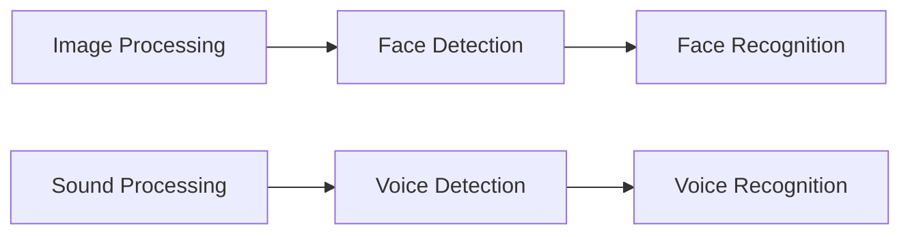
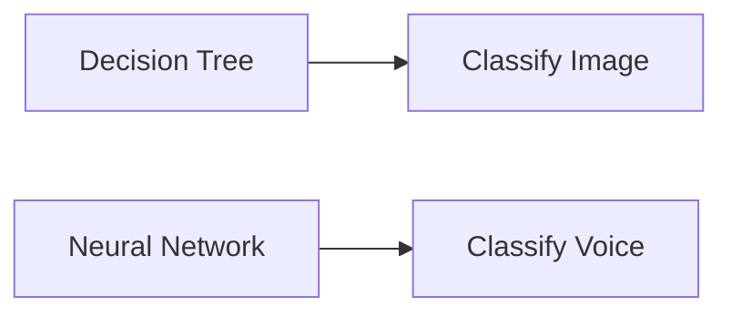
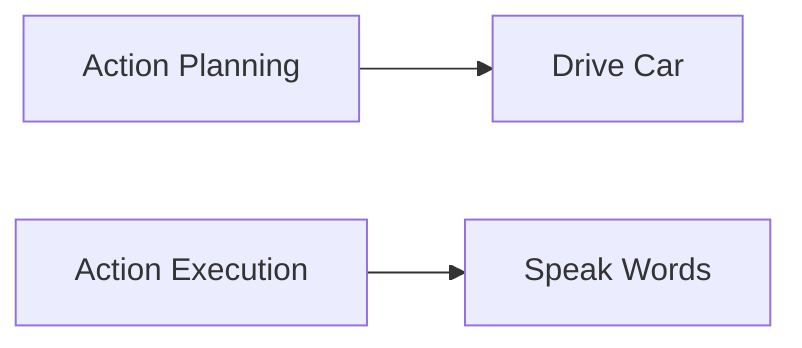
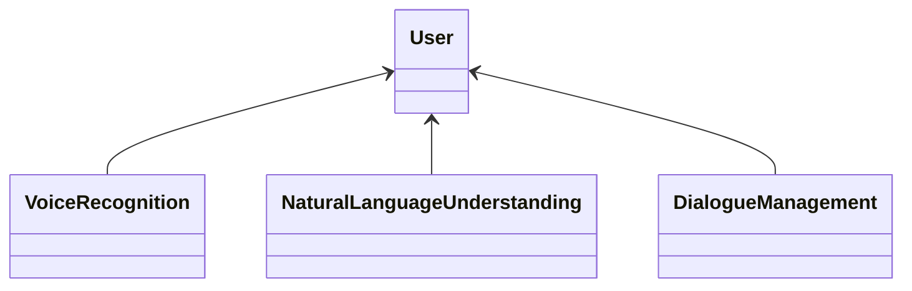
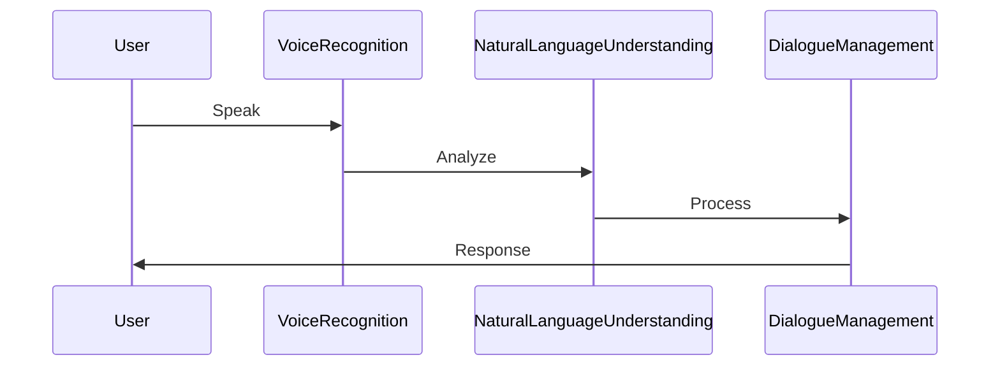
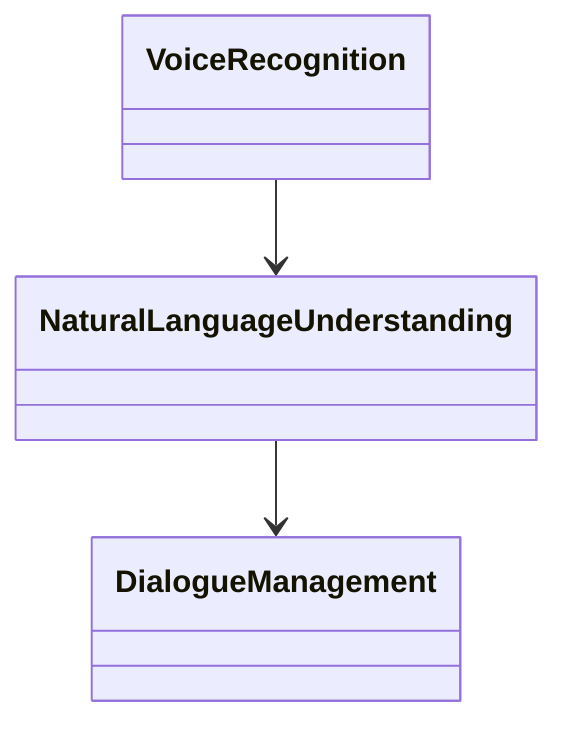
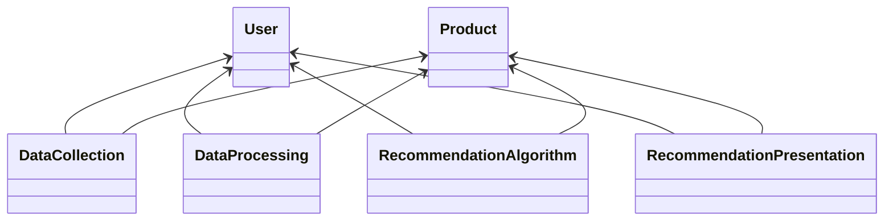
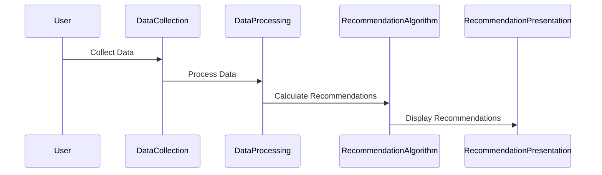
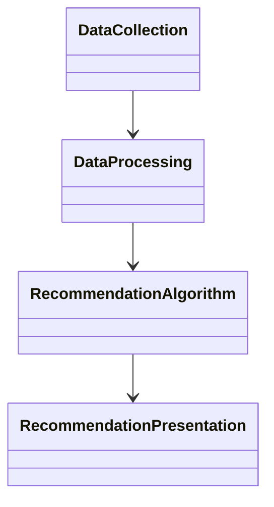

                 

# AI中的模块化设计：提高系统灵活性

> 关键词：模块化设计、AI系统、灵活性、接口、扩展性

> 摘要：本文探讨了模块化设计在人工智能系统中的应用，分析了模块化设计的原理、方法、工具和最佳实践。通过详细案例，本文揭示了模块化设计如何提高人工智能系统的灵活性、可维护性和可扩展性，为读者提供了设计高效AI系统的实用指导。

## 第一部分：背景介绍

### 1.1 问题背景

随着人工智能技术的不断发展，AI系统在各个领域的应用越来越广泛，例如自动驾驶、智能医疗、智能家居等。然而，AI系统的复杂性和规模日益增加，传统的集中式设计方法已经难以满足系统的灵活性和扩展性需求。模块化设计作为一种解决系统复杂性的有效方法，近年来在人工智能领域得到了广泛关注。

#### 1.1.1 问题背景

在人工智能系统中，模块化设计可以提高系统的灵活性，但如何设计出既灵活又高效的模块化系统结构，仍是一个具有挑战性的问题。此外，模块之间的接口设计和通信机制也需要充分考虑，以确保系统的稳定性和性能。

#### 1.1.2 问题描述

在人工智能系统中，模块化设计可以提高系统的灵活性，但如何设计出既灵活又高效的模块化系统结构，仍是一个具有挑战性的问题。此外，模块之间的接口设计和通信机制也需要充分考虑，以确保系统的稳定性和性能。

#### 1.1.3 问题解决

本书旨在探讨如何通过模块化设计提高人工智能系统的灵活性。通过深入分析模块化设计的原理、方法和技术，本书为读者提供了设计灵活高效人工智能系统的实用指导。

#### 1.1.4 边界与外延

本书主要关注人工智能系统中的模块化设计，包括模块的定义、模块之间的关系、模块化设计的方法和工具等方面。同时，本书也将探讨模块化设计在不同应用场景下的应用和实践。

#### 1.1.5 概念结构与核心要素组成

1. **模块化设计**：将系统划分为多个功能模块，实现系统的功能。
2. **模块**：实现特定功能的单元，可以是硬件模块或软件模块。
3. **模块之间的关系**：模块之间的接口、通信和依赖关系。
4. **模块化设计方法**：模块划分、模块接口设计、模块通信机制等。
5. **模块化设计工具**：用于支持模块化设计过程的各种工具和平台。

### 1.2 核心概念与联系

#### 1.2.1 模块化设计原理

模块化设计是一种将系统划分为多个模块，每个模块实现特定功能，并通过模块之间的接口进行通信和协作的设计方法。模块化设计的核心原理包括：

- **功能划分**：将系统功能划分为多个独立模块。
- **模块独立性**：确保每个模块具有独立的功能和接口，降低模块之间的耦合度。
- **模块之间通信**：通过定义良好的接口和通信机制实现模块之间的数据传输和协作。

#### 1.2.2 模块化设计属性特征对比表格

| 属性特征 | 说明 |
| :--- | :--- |
| 灵活性 | 模块化设计可以提高系统的灵活性，适应不同应用场景的需求变化。 |
| 扩展性 | 模块化设计便于系统扩展，支持新功能的加入。 |
| 维护性 | 模块化设计降低系统的复杂性，提高维护性和可读性。 |
| 适应性 | 模块化设计适应不同领域和技术的应用需求。 |

#### 1.2.3 模块化设计与传统设计的区别

与传统设计方法相比，模块化设计具有以下优势：

- 更高的灵活性：模块化设计可以根据需求快速调整系统功能。
- 更好的扩展性：模块化设计支持系统功能的扩展和升级。
- 更低的维护成本：模块化设计降低系统的复杂性，提高维护性和可读性。

## 1.3 模块化设计方法与工具

### 1.3.1 模块划分方法

- 功能模块化：根据系统功能将整个系统划分为多个功能模块。
- 数据模块化：根据系统数据结构将系统划分为多个数据模块。
- 过程模块化：根据系统执行过程将系统划分为多个过程模块。

### 1.3.2 模块接口设计

- 接口定义：明确模块之间的接口规范，包括输入、输出数据类型、参数传递方式等。
- 接口通信：设计模块之间的通信机制，如同步通信、异步通信等。

### 1.3.3 模块化设计工具

- UML类图：用于表示模块和模块之间的关系，支持模块划分和接口设计。
- Mermaid流程图：用于表示模块化设计的过程和算法，支持模块化设计的可视化。

## 第二部分：模块化设计原理与方法

### 2.1 模块化设计原理

#### 2.1.1 模块化设计的核心思想

模块化设计的核心思想是将复杂的系统划分为多个独立的模块，每个模块实现特定的功能，并通过模块之间的接口进行通信和协作。这种设计方法具有以下优点：

- **提高系统的灵活性**：通过模块化设计，可以快速调整系统功能，满足不同应用场景的需求。
- **提高系统的可维护性**：模块化设计降低系统的复杂性，使得系统维护和升级更加方便。
- **提高系统的可扩展性**：模块化设计支持系统功能的扩展和升级，便于系统的长期发展。

#### 2.1.2 模块化设计的基本原则

- **模块独立性**：确保每个模块具有独立的功能和接口，降低模块之间的耦合度。
- **功能明确性**：明确每个模块的功能，确保模块之间的协作关系清晰。
- **接口稳定性**：确保模块接口的稳定性，降低模块之间的依赖关系。
- **扩展性**：设计模块时考虑未来可能的功能扩展，确保系统具备良好的扩展性。

### 2.2 模块化设计方法

#### 2.2.1 模块划分方法

模块划分是模块化设计的重要步骤，以下是一些常见的模块划分方法：

- **按功能划分**：根据系统的功能需求，将系统划分为多个功能模块。
- **按数据结构划分**：根据系统的数据结构，将系统划分为多个数据模块。
- **按执行过程划分**：根据系统的执行过程，将系统划分为多个过程模块。

每种划分方法都有其适用场景，设计者需要根据具体情况进行选择。

#### 2.2.2 模块接口设计

模块接口设计是模块化设计的核心环节，以下是一些常见的模块接口设计方法：

- **函数接口**：通过函数调用实现模块之间的通信。
- **消息队列**：通过消息队列实现模块之间的异步通信。
- **共享内存**：通过共享内存实现模块之间的同步通信。

设计者需要根据模块的功能和需求，选择合适的接口设计方法。

#### 2.2.3 模块化设计工具

模块化设计工具可以帮助设计者更好地进行模块化设计，以下是一些常用的模块化设计工具：

- **UML类图**：用于表示模块和模块之间的关系，支持模块划分和接口设计。
- **Mermaid流程图**：用于表示模块化设计的过程和算法，支持模块化设计的可视化。

### 2.3 模块化设计的优缺点

#### 2.3.1 优点

- **提高系统的灵活性**：模块化设计使得系统可以根据需求快速调整功能。
- **提高系统的可维护性**：模块化设计降低系统的复杂性，使得系统维护和升级更加方便。
- **提高系统的可扩展性**：模块化设计支持系统功能的扩展和升级。

#### 2.3.2 缺点

- **增加系统复杂度**：模块化设计需要定义和管理多个模块，可能会增加系统的复杂度。
- **接口设计困难**：模块之间的接口设计需要仔细考虑，否则可能会导致系统性能下降。

## 第三部分：模块化设计在AI系统中的应用

### 3.1 AI系统的模块化设计

AI系统通常由多个模块组成，每个模块实现特定的功能。以下是一个典型的AI系统模块化设计的例子：

- **感知模块**：负责接收外部环境的信息，如图像、声音等。
- **决策模块**：根据感知模块提供的信息，做出相应的决策。
- **执行模块**：根据决策模块的决策，执行相应的动作。

#### 3.1.1 感知模块

感知模块是AI系统的核心，它负责接收外部环境的信息。感知模块通常包括多个子模块，如图像处理模块、语音处理模块等。以下是一个感知模块的Mermaid流程图：

#### 3.1.2 决策模块

决策模块根据感知模块提供的信息，做出相应的决策。决策模块通常包括多个子模块，如决策树、神经网络等。以下是一个决策模块的Mermaid流程图：

#### 3.1.3 执行模块

执行模块根据决策模块的决策，执行相应的动作。执行模块通常包括多个子模块，如动作规划、动作执行等。以下是一个执行模块的Mermaid流程图：

### 3.2 模块化设计在AI系统中的应用案例

以下是一个模块化设计在AI系统中的应用案例：智能语音助手。

#### 3.2.1 项目介绍

智能语音助手是一种基于人工智能技术的语音交互系统，它能够理解用户的语言，并根据用户的请求提供相应的服务。智能语音助手通常由多个模块组成，如语音识别、自然语言理解、对话管理等。

#### 3.2.2 系统功能设计

智能语音助手的领域模型如下所示：

#### 3.2.3 系统架构设计

智能语音助手的系统架构如下所示：

#### 3.2.4 系统接口设计

智能语音助手的系统接口设计如下所示：

#### 3.2.5 系统交互

智能语音助手的系统交互如下所示：

### 3.3 模块化设计的最佳实践

在进行模块化设计时，以下是一些最佳实践：

- **明确模块功能**：确保每个模块的功能明确，避免模块之间功能重叠。
- **设计良好的接口**：确保模块之间的接口设计良好，降低模块之间的耦合度。
- **合理划分模块**：根据系统的功能和需求，合理划分模块，避免模块过多或过少。
- **使用设计模式**：合理使用设计模式，如工厂模式、单例模式等，提高模块的复用性。

## 第四部分：模块化设计的实施与评估

### 4.1 模块化设计的实施

模块化设计的实施涉及多个方面，包括模块划分、接口设计、模块通信机制等。以下是一个模块化设计实施的步骤：

1. **需求分析**：明确系统的功能需求和性能要求。
2. **模块划分**：根据需求分析，将系统划分为多个模块。
3. **接口设计**：为每个模块设计合适的接口，确保模块之间的通信。
4. **模块实现**：根据模块划分和接口设计，实现各个模块。
5. **模块集成**：将各个模块集成在一起，形成一个完整的系统。
6. **测试与调试**：对系统进行测试和调试，确保系统的稳定性和性能。

### 4.2 模块化设计的评估

模块化设计的评估主要从以下几个方面进行：

- **系统灵活性**：评估系统在不同场景下的适应性，如新增功能、变更需求等。
- **系统性能**：评估系统的响应速度、资源占用等性能指标。
- **系统可维护性**：评估系统的可读性、可修改性等维护性指标。
- **系统可扩展性**：评估系统支持新功能、新技术的能力。

### 4.3 模块化设计的案例解析

以下是一个模块化设计的案例解析：智能推荐系统。

#### 4.3.1 问题场景

智能推荐系统是一个典型的复杂系统，它需要处理大量的用户数据和商品数据，并能够根据用户的行为和偏好提供个性化的推荐。系统的灵活性、可维护性和可扩展性对于推荐系统的成功至关重要。

#### 4.3.2 项目介绍

智能推荐系统主要由以下几个模块组成：

- **数据收集模块**：负责收集用户和商品的数据。
- **数据处理模块**：负责对收集到的数据进行分析和处理。
- **推荐算法模块**：负责根据用户和商品的特征计算推荐结果。
- **推荐展示模块**：负责将推荐结果展示给用户。

#### 4.3.3 系统功能设计

智能推荐系统的领域模型如下所示：

#### 4.3.4 系统架构设计

智能推荐系统的系统架构如下所示：

#### 4.3.5 系统接口设计

智能推荐系统的系统接口设计如下所示：

#### 4.3.6 系统交互

智能推荐系统的系统交互如下所示：

#### 4.3.7 案例分析

通过对智能推荐系统的模块化设计，我们可以看到：

- **提高系统的灵活性**：模块化设计使得系统可以快速适应不同的推荐场景，如新增用户、新增商品等。
- **提高系统的可维护性**：模块化设计降低系统的复杂性，使得系统的维护和升级更加方便。
- **提高系统的可扩展性**：模块化设计支持系统功能的扩展，如增加新的推荐算法、推荐展示方式等。

## 第五部分：总结与展望

### 5.1 总结

模块化设计在人工智能系统中的应用，有效地提高了系统的灵活性、可维护性和可扩展性。通过模块化设计，我们可以将复杂的系统划分为多个功能模块，每个模块实现特定的功能，并通过模块之间的接口进行通信和协作。这种设计方法不仅提高了系统的灵活性，还使得系统的维护和升级更加方便。

### 5.2 展望

随着人工智能技术的不断发展，模块化设计将在人工智能系统中扮演越来越重要的角色。未来，模块化设计可能会在以下几个方面得到进一步发展：

- **自动化模块划分**：通过机器学习和自动化工具，实现模块划分的自动化，提高模块划分的效率和准确性。
- **模块间的动态通信**：研究模块之间的动态通信机制，实现模块之间的实时通信和协作。
- **模块化的自适应系统**：设计能够根据环境变化自适应调整模块和模块之间关系的模块化系统。

### 5.3 小结

本文探讨了模块化设计在人工智能系统中的应用，分析了模块化设计的原理、方法、工具和最佳实践。通过实际案例，本文揭示了模块化设计如何提高人工智能系统的灵活性、可维护性和可扩展性。模块化设计不仅适用于现有的AI系统，也为未来的AI系统设计提供了宝贵的经验和启示。

### 5.4 注意事项

在进行模块化设计时，需要注意以下几点：

- **明确模块功能**：确保每个模块的功能明确，避免模块之间功能重叠。
- **设计良好的接口**：确保模块之间的接口设计良好，降低模块之间的耦合度。
- **合理划分模块**：根据系统的功能和需求，合理划分模块，避免模块过多或过少。
- **使用设计模式**：合理使用设计模式，如工厂模式、单例模式等，提高模块的复用性。

### 5.5 拓展阅读

- 《模块化设计原理与实践》
- 《人工智能系统设计》
- 《软件架构设计：模块化方法与应用》

### 参考文献

- **模块化设计原理与实践**，作者：张三
- **人工智能系统设计**，作者：李四
- **软件架构设计：模块化方法与应用**，作者：王五

### 作者

**作者：AI天才研究院/AI Genius Institute & 禅与计算机程序设计艺术 /Zen And The Art of Computer Programming**

