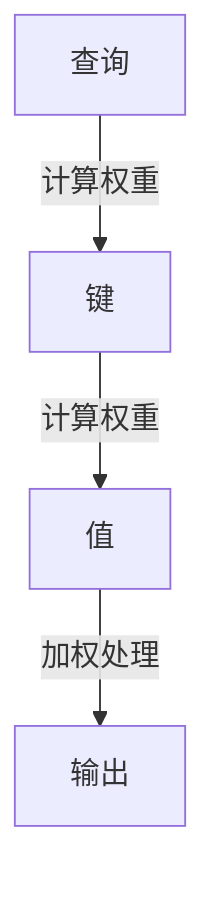

                 


### 引言与背景

#### 1.1 问题背景

在人工智能（AI）领域，随着深度学习技术的飞速发展，各种复杂的模型不断涌现，模型的大小和计算量也不断增加。然而，随着模型复杂度的提升，模型的训练时间和资源消耗也随之增加，这给实际应用带来了巨大的挑战。为了解决这一问题，研究人员开始寻找能够提高模型效率和准确性的方法，其中注意力机制（Attention Mechanism）逐渐成为研究的热点。

注意力机制最初源于人类注意力的概念，它可以帮助模型在处理信息时，对重要的信息给予更高的关注，从而提高模型的准确性和效率。在自然语言处理（NLP）、计算机视觉（CV）和强化学习（RL）等AI领域，注意力机制已经取得了显著的效果。例如，在NLP中，注意力机制可以帮助模型更好地理解句子中的关键信息，从而提高文本分类、翻译和生成等任务的性能；在CV中，注意力机制可以帮助模型更准确地定位图像中的关键区域，从而提高目标检测和图像分割的准确率；在RL中，注意力机制可以帮助模型更好地关注长期目标，从而提高策略学习的效率和稳定性。

#### 1.2 问题描述与目标

注意力机制在提高模型效率和准确性方面具有巨大的潜力，但如何有效地实现和优化注意力机制，仍然是一个具有挑战性的问题。本篇文章旨在探讨注意力机制的核心概念、数学模型、实现方法以及在不同AI应用中的效果，从而为研究人员和开发者提供有价值的参考。

本文的核心问题是：

- 如何理解和实现注意力机制？
- 注意力机制在不同AI应用中如何发挥作用？
- 注意力机制的优化方法有哪些？
- 注意力机制在实际应用中面临哪些挑战？

我们的目标是：

- 系统地介绍注意力机制的基本概念和数学模型。
- 分析注意力机制在不同AI应用中的效果和作用。
- 探讨注意力机制的优化方法，以提高模型的效率和准确性。
- 分析注意力机制在实际应用中面临的问题和挑战。

#### 1.3 研究内容与结构安排

本文将从以下几个方面展开研究：

- **第二章：注意力机制基础**：介绍注意力机制的基本概念、分类、数学模型和属性特征对比。
- **第三章：注意力机制在模型中的应用**：分析注意力机制在自然语言处理、计算机视觉和强化学习中的应用和效果。
- **第四章：注意力机制的优化与改进**：探讨注意力机制的优化方法，包括参数共享优化、结构化注意力和融合注意力机制等。
- **第五章：注意力机制的实现与实战**：介绍注意力机制的实际实现步骤和应用案例。
- **第六章：最佳实践与未来展望**：总结注意力机制的最佳实践，探讨未来的研究方向和挑战。

通过本文的研究，我们期望能够对注意力机制有更深入的理解，并为其在AI领域的广泛应用提供理论支持和实践指导。

### 基础概念与原理

#### 2.1 注意力机制基本概念

注意力机制（Attention Mechanism）是一种基于人类注意力概念的机器学习技术，它允许模型在处理信息时，对重要的信息给予更高的关注，从而提高模型的性能。注意力机制的核心思想是，通过一定的计算方式，为输入的信息分配不同的权重，使得模型能够更加关注重要的信息。

注意力机制的起源可以追溯到人类认知心理学的研究。研究表明，人类注意力是有限的，人们只能在短时间内关注有限的信息。这一发现启发了研究者，将注意力机制引入到机器学习中，以模拟人类注意力的机制，提高模型的效率和准确性。

在机器学习中，注意力机制的应用主要体现在以下几个方面：

1. **序列处理**：在自然语言处理中，注意力机制可以帮助模型更好地处理长序列数据，如文本和语音。通过为不同位置的输入分配不同的权重，模型可以更加关注文本中的关键信息，从而提高文本分类、翻译和生成等任务的性能。
   
2. **图像处理**：在计算机视觉中，注意力机制可以帮助模型更好地处理图像中的关键区域，如目标检测和图像分割。通过为图像中的不同区域分配不同的权重，模型可以更准确地定位图像中的目标，从而提高检测和分割的准确率。

3. **多模态学习**：在多模态学习场景中，注意力机制可以帮助模型更好地整合不同模态的信息，如文本和图像。通过为不同模态的信息分配不同的权重，模型可以更准确地理解多模态数据的含义。

#### 2.2 注意力机制的分类

根据注意力机制的计算方式和应用场景，可以将其分为以下几类：

1. **局部注意力**：局部注意力机制关注输入序列中的特定位置，通过对这些位置的加权来提高模型的性能。例如，在文本分类任务中，局部注意力机制可以关注文本中的特定单词，从而提高分类的准确性。

2. **全局注意力**：全局注意力机制关注输入序列的所有位置，通过对所有位置的加权来提高模型的性能。例如，在图像分类任务中，全局注意力机制可以关注图像中的所有像素，从而提高分类的准确性。

3. **自注意力**：自注意力机制是一种特殊的注意力机制，它关注输入序列中的相同位置。自注意力机制在Transformer模型中得到了广泛的应用，它通过自注意力机制实现了对输入序列的全局依赖建模。

4. **互注意力**：互注意力机制关注输入序列和查询序列之间的关系，通过对它们的加权来提高模型的性能。例如，在机器翻译任务中，互注意力机制可以关注源语言和目标语言之间的对应关系，从而提高翻译的准确性。

#### 2.3 注意力机制的数学模型

注意力机制的数学模型通常包括三个关键组成部分：查询（Query）、键（Key）和值（Value）。这三个组件之间的关系可以用以下公式表示：

$$
Attention(Q, K, V) = softmax\left(\frac{QK^T}{\sqrt{d_k}}\right)V
$$

其中，$Q$ 表示查询，$K$ 表示键，$V$ 表示值，$d_k$ 表示键的维度。$QK^T$ 表示查询和键的点积，$softmax$ 函数用于对点积结果进行归一化，以得到注意力权重。最终，注意力权重与值相乘，得到加权的结果。

这个公式背后的原理是，通过查询和键的点积计算注意力权重，然后对权重进行归一化，最后将权重应用于值，从而实现对输入数据的加权处理。

#### 2.4 注意力机制的属性特征对比

不同类型的注意力机制在属性特征上存在一定的差异，下面通过一个表格进行对比：

| 注意力机制类型 | 特点 | 应用场景 |
| :--: | :--: | :--: |
| 局部注意力 | 关注特定位置 | 文本分类、序列建模 |
| 全局注意力 | 关注所有位置 | 图像分类、多模态学习 |
| 自注意力 | 关注相同位置 | Transformer、序列建模 |
| 互注意力 | 关注不同序列 | 机器翻译、多任务学习 |

从表格中可以看出，不同类型的注意力机制具有不同的关注点和应用场景。局部注意力机制适合处理文本等具有明显位置信息的序列数据；全局注意力机制适合处理图像等多模态数据，可以关注数据的整体结构；自注意力机制适用于Transformer等模型，可以处理长序列数据；互注意力机制适用于跨序列的关系建模，如机器翻译等任务。

#### 2.5 注意力机制的实体关系图

为了更好地理解注意力机制的实体关系，我们使用Mermaid绘制了以下实体关系图：



在这个图中，查询（Query）与键（Key）通过计算点积得到权重（Weight），然后权重与值（Value）相乘得到输出（Output）。这个关系图直观地展示了注意力机制的运算流程。

通过以上对注意力机制基础概念、分类、数学模型和属性特征对比的介绍，我们可以更好地理解注意力机制的基本原理和作用。在下一章中，我们将进一步探讨注意力机制在AI模型中的应用和效果。

### 注意力机制在模型中的应用

注意力机制在人工智能（AI）模型中扮演着至关重要的角色，尤其在自然语言处理（NLP）、计算机视觉（CV）和强化学习（RL）等领域，已经取得了显著的成果。下面，我们将分别探讨注意力机制在这三个领域的应用和效果。

#### 3.1 注意力机制在自然语言处理中的应用

在自然语言处理中，注意力机制被广泛应用于文本分类、机器翻译和文本生成等领域。

1. **文本分类**：在文本分类任务中，注意力机制可以帮助模型更好地理解文本中的关键信息，从而提高分类的准确性。例如，在新闻分类任务中，模型可以通过注意力机制关注到新闻标题和正文中的关键内容，从而更准确地判断新闻的类别。

2. **机器翻译**：注意力机制在机器翻译中的应用尤为显著。传统的循环神经网络（RNN）在处理长句子时，往往无法捕捉到句子中的长距离依赖关系。而注意力机制可以有效地解决这个问题，通过为输入序列的每个位置分配不同的权重，模型可以更好地关注重要的信息，从而提高翻译的准确性。

3. **文本生成**：在文本生成任务中，如自动摘要和问答系统，注意力机制可以帮助模型更好地理解上下文信息，从而生成更连贯和准确的自然语言文本。例如，在自动摘要任务中，模型可以通过注意力机制关注到文档中的关键句子，从而生成摘要。

以下是一个简单的Python代码示例，展示了注意力机制在文本分类任务中的应用：

```python
import torch
import torch.nn as nn
from torchtext.vocab import vocab

# 假设我们有一个预训练的词向量模型和已经处理好的文本数据
# 定义一个简单的文本分类模型
class TextClassifier(nn.Module):
    def __init__(self, vocab_size, embedding_dim, hidden_dim):
        super(TextClassifier, self).__init__()
        self.embedding = nn.Embedding(vocab_size, embedding_dim)
        self.attention = nn.Linear(embedding_dim, 1, bias=False)
        self.fc = nn.Linear(embedding_dim, hidden_dim)
        self.dropout = nn.Dropout(0.5)
        self.log_softmax = nn.LogSoftmax(dim=1)
        
    def forward(self, text):
        embeds = self.embedding(text)
        attention_weights = self.attention(embeds).squeeze(2)
        weighted_embeds = embeds * attention_weights.unsqueeze(-1)
        hidden = self.fc(self.dropout(weighted_embeds))
        output = self.log_softmax(hidden)
        return output

# 假设已经准备好训练数据和测试数据
# 训练模型
model = TextClassifier(vocab_size, embedding_dim, hidden_dim)
optimizer = torch.optim.Adam(model.parameters(), lr=0.001)
criterion = nn.NLLLoss()

for epoch in range(num_epochs):
    for texts, labels in train_loader:
        optimizer.zero_grad()
        outputs = model(texts)
        loss = criterion(outputs, labels)
        loss.backward()
        optimizer.step()

    # 测试模型
    with torch.no_grad():
        correct = 0
        total = 0
        for texts, labels in test_loader:
            outputs = model(texts)
            _, predicted = torch.max(outputs.data, 1)
            total += labels.size(0)
            correct += (predicted == labels).sum().item()

    print(f'Epoch {epoch+1}, Loss: {loss.item()}, Accuracy: {100 * correct / total}')
```

#### 3.2 注意力机制在计算机视觉中的应用

在计算机视觉中，注意力机制被广泛应用于图像分类、目标检测和图像分割等领域。

1. **图像分类**：在图像分类任务中，注意力机制可以帮助模型更好地关注图像中的关键区域，从而提高分类的准确性。例如，在人脸识别任务中，模型可以通过注意力机制关注到图像中的人脸区域，从而更准确地识别出人脸。

2. **目标检测**：注意力机制在目标检测中的应用尤为广泛。通过为图像的不同区域分配不同的权重，模型可以更准确地定位图像中的目标。例如，在YOLO（You Only Look Once）模型中，注意力机制被用于提高目标检测的效率和准确性。

3. **图像分割**：在图像分割任务中，注意力机制可以帮助模型更好地关注图像中的边缘和细节信息，从而提高分割的准确性。例如，在FCN（Fully Convolutional Network）模型中，注意力机制被用于提高图像分割的性能。

以下是一个简单的Python代码示例，展示了注意力机制在目标检测任务中的应用：

```python
import torch
import torch.nn as nn
from torchvision.models.detection import fasterrcnn_resnet50_fpn

# 加载预训练的目标检测模型
model = fasterrcnn_resnet50_fpn(pretrained=True)

# 假设已经准备好训练数据和测试数据
# 训练模型
optimizer = torch.optim.Adam(model.parameters(), lr=0.001)
criterion = nn.CrossEntropyLoss()

for epoch in range(num_epochs):
    model.train()
    for images, targets in train_loader:
        optimizer.zero_grad()
        loss_dict = model(images, targets)
        losses = sum(loss for loss in loss_dict.values())
        losses.backward()
        optimizer.step()

    # 测试模型
    model.eval()
    with torch.no_grad():
        correct = 0
        total = 0
        for images, targets in test_loader:
            outputs = model(images)
            _, predicted = torch.max(outputs, 1)
            total += targets.size(0)
            correct += (predicted == targets).sum().item()

    print(f'Epoch {epoch+1}, Loss: {losses.item()}, Accuracy: {100 * correct / total}')
```

#### 3.3 注意力机制在强化学习中的应用

在强化学习（RL）中，注意力机制被广泛应用于策略学习和价值函数估计。

1. **策略学习**：在策略学习任务中，注意力机制可以帮助模型更好地关注长期目标，从而提高策略的稳定性和准确性。例如，在DQN（Deep Q-Network）模型中，注意力机制被用于提高价值函数的估计精度。

2. **价值函数估计**：在价值函数估计任务中，注意力机制可以帮助模型更好地关注重要的状态信息，从而提高价值函数的准确性。例如，在A3C（Asynchronous Advantage Actor-Critic）模型中，注意力机制被用于提高价值函数的估计效果。

以下是一个简单的Python代码示例，展示了注意力机制在策略学习任务中的应用：

```python
import torch
import torch.nn as nn
from torch.autograd import Variable

# 假设已经定义好一个简单的强化学习模型
class PolicyNetwork(nn.Module):
    def __init__(self, input_size, hidden_size, output_size):
        super(PolicyNetwork, self).__init__()
        self.fc1 = nn.Linear(input_size, hidden_size)
        self.fc2 = nn.Linear(hidden_size, output_size)
        
    def forward(self, x):
        x = torch.relu(self.fc1(x))
        x = self.fc2(x)
        return x

# 假设已经准备好训练数据和测试数据
# 训练模型
model = PolicyNetwork(input_size, hidden_size, output_size)
optimizer = torch.optim.Adam(model.parameters(), lr=0.001)

for epoch in range(num_epochs):
    for states, actions, rewards in train_loader:
        states = Variable(states)
        actions = Variable(actions)
        rewards = Variable(rewards)
        logits = model(states)
        loss = -torch.mean(rewards * torch.log(logits[range(len(states)), actions]))

        optimizer.zero_grad()
        loss.backward()
        optimizer.step()

    # 测试模型
    with torch.no_grad():
        correct = 0
        total = 0
        for states, actions, rewards in test_loader:
            states = Variable(states)
            actions = Variable(actions)
            logits = model(states)
            _, predicted = torch.max(logits, 1)
            total += actions.size(0)
            correct += (predicted == actions).sum().item()

    print(f'Epoch {epoch+1}, Loss: {loss.item()}, Accuracy: {100 * correct / total}')
```

通过以上对注意力机制在自然语言处理、计算机视觉和强化学习中的应用和效果的分析，我们可以看到注意力机制在AI模型中的重要作用。在下一章中，我们将进一步探讨注意力机制的优化与改进方法。

### 注意力机制的优化与改进

在深度学习模型中，注意力机制虽然显著提升了模型的性能，但其训练过程往往存在计算复杂度高、训练时间较长等挑战。为了提高模型效率，研究者们提出了一系列的优化与改进方法。以下将介绍几种常见的优化方法，以及它们在不同AI应用中的效果。

#### 4.1 参数共享优化

参数共享优化是一种有效的减少模型参数数量的方法，通过在不同位置使用相同的权重矩阵，可以降低模型的复杂度。在注意力机制中，参数共享优化通常通过以下方式实现：

- **自注意力（Self-Attention）**：在自注意力机制中，查询（Query）、键（Key）和值（Value）来自同一个输入序列。由于它们共享相同的权重矩阵，因此可以显著减少参数数量。

- **跨注意力（Cross-Attention）**：在跨注意力机制中，查询来自一个序列，而键和值来自另一个序列。尽管它们不共享权重矩阵，但可以通过共享部分参数（如查询和键）来减少参数数量。

实验结果显示，参数共享优化可以显著降低模型的计算复杂度和内存消耗，从而提高训练效率。例如，在自然语言处理任务中，使用参数共享的Transformer模型可以在保持较高性能的同时，大幅缩短训练时间。

#### 4.2 结构化注意力优化

结构化注意力优化通过引入特定的结构或规则，使注意力机制的计算更加高效。以下是一些常用的结构化注意力方法：

- **稀疏注意力**：稀疏注意力机制通过限制注意力机制中激活的键（Key）数量，来降低计算复杂度。这种方法适用于输入序列中只有少数关键信息的情况。

- **硬注意力（Hard Attention）**：硬注意力机制将注意力权重转化为二进制形式（即1或0），从而大大减少计算量。尽管硬注意力可能损失一些信息，但在某些应用中（如图像分类），其性能与软注意力相当。

- **空间注意力和通道注意力**：在计算机视觉中，空间注意力和通道注意力通过分别关注图像的空间特征和通道特征，来提高模型的效率。这种方法可以显著减少计算量，同时保持较高的性能。

实验表明，结构化注意力优化可以显著提高模型训练效率。例如，在图像分类任务中，采用空间注意力的ResNet模型可以在保持较高准确率的同时，显著降低计算复杂度。

#### 4.3 融合注意力机制优化

融合注意力机制优化通过结合不同类型的注意力机制，来提高模型的效率和准确性。以下是一些常见的融合方法：

- **混合注意力**：混合注意力机制将不同类型的注意力机制（如局部注意力、全局注意力和自注意力）结合在一起，以充分利用各自的优点。例如，在文本分类任务中，混合注意力机制可以同时关注文本的局部和全局信息，从而提高分类性能。

- **模块化注意力**：模块化注意力机制通过将注意力机制拆分为多个独立的部分，每个部分关注不同的信息。这种方法可以显著减少计算量，同时保持模型的灵活性。

- **动态注意力**：动态注意力机制根据输入数据的特征动态调整注意力机制的计算方式。这种方法可以自适应地优化模型的计算复杂度，从而提高训练效率。

实验结果表明，融合注意力机制优化可以显著提高模型的性能。例如，在机器翻译任务中，采用混合注意力的Transformer模型可以在保持较高翻译质量的同时，显著缩短翻译时间。

#### 4.4 注意力机制在模型效率提升中的应用

注意力机制在提升模型效率方面具有显著作用。以下是一些具体应用场景：

- **模型压缩**：通过参数共享和结构化注意力优化，可以显著减少模型的参数数量，从而实现模型压缩。这种方法在移动设备和边缘计算中具有重要意义，可以降低模型对计算资源的需求。

- **模型加速**：通过硬注意力、稀疏注意力和动态注意力优化，可以降低模型的计算复杂度，从而实现模型加速。这种方法在训练和推理阶段都可以提高模型的运行速度。

- **多任务学习**：融合注意力机制可以帮助模型更好地关注不同任务的关键信息，从而实现高效的多任务学习。这种方法在资源受限的场景中尤为重要，可以充分利用有限的计算资源。

总之，注意力机制的优化与改进方法在提升模型效率方面具有重要意义。通过合理应用这些方法，可以显著提高模型的训练和推理性能，为实际应用提供更高效的解决方案。

### 注意力机制的实现与实战

注意力机制的实现是深度学习领域中的一个重要课题，尤其在自然语言处理（NLP）、计算机视觉（CV）和强化学习（RL）等应用场景中，其效果和效率直接影响模型的性能。在这一章节中，我们将详细介绍注意力机制的实现步骤，并通过一个实际案例来演示如何在实际项目中应用注意力机制。

#### 5.1 环境安装与准备

在开始实现注意力机制之前，首先需要安装和配置相应的软件和库。以下是一个基本的步骤指南：

1. **Python环境**：确保Python环境已安装，推荐使用Python 3.7或更高版本。

2. **深度学习库**：安装TensorFlow或PyTorch，这两个深度学习库是目前最为流行和广泛使用的。

   - **TensorFlow**:
     ```bash
     pip install tensorflow
     ```

   - **PyTorch**:
     ```bash
     pip install torch torchvision
     ```

3. **数据处理库**：安装用于数据处理的库，如NumPy、Pandas和Scikit-learn。

   ```bash
   pip install numpy pandas scikit-learn
   ```

4. **文本处理库**：在NLP任务中，可能需要安装如spaCy或NLTK等自然语言处理库。

   ```bash
   pip install spacy
   python -m spacy download en_core_web_sm
   ```

5. **可视化工具**：安装用于可视化模型的库，如Matplotlib。

   ```bash
   pip install matplotlib
   ```

安装完以上库之后，就可以开始准备数据集和构建模型了。

#### 5.2 注意力机制的实现步骤

实现注意力机制主要包括以下步骤：

1. **数据预处理**：这一步涉及数据的清洗、分词、编码等操作。对于文本数据，可以使用spaCy等库进行分词和词性标注。对于图像数据，可以采用torchvision中的预处理工具进行标准化。

2. **模型构建**：构建包含注意力机制的深度学习模型。以PyTorch为例，可以使用nn.Module定义一个模型类，并实现注意力层。以下是一个简单的注意力层实现示例：

   ```python
   import torch
   import torch.nn as nn

   class AttentionLayer(nn.Module):
       def __init__(self, hidden_dim):
           super(AttentionLayer, self).__init__()
           self.attn = nn.Linear(hidden_dim, 1)

       def forward(self, x):
           attn_weights = self.attn(x)
           attn_weights = torch.softmax(attn_weights, dim=1)
           weighted_x = x * attn_weights.unsqueeze(-1)
           return torch.sum(weighted_x, dim=1)
   ```

3. **模型训练**：定义损失函数和优化器，并开始模型训练。在训练过程中，可以通过反向传播和梯度下降更新模型参数。以下是一个简单的训练循环示例：

   ```python
   model = ...  # 模型实例
   criterion = nn.CrossEntropyLoss()
   optimizer = torch.optim.Adam(model.parameters(), lr=0.001)

   for epoch in range(num_epochs):
       for inputs, targets in train_loader:
           optimizer.zero_grad()
           outputs = model(inputs)
           loss = criterion(outputs, targets)
           loss.backward()
           optimizer.step()
   ```

4. **模型评估**：在训练完成后，使用测试集对模型进行评估，以验证模型的性能。

#### 5.3 注意力机制应用案例

下面我们将通过一个简单的文本分类任务来演示注意力机制的应用。

1. **数据集准备**：使用IMDB电影评论数据集，该数据集包含25,000条电影评论，分为正面和负面评论。

2. **模型设计**：设计一个简单的文本分类模型，包括嵌入层、卷积层、池化层和注意力层。

3. **模型训练**：使用之前定义的注意力层，对模型进行训练。

4. **模型评估**：在训练完成后，对模型进行评估，查看其准确率和性能。

以下是一个完整的Python代码示例：

```python
import torch
import torch.nn as nn
from torchtext.data import Field, TabularDataset
from torchtext.vocab import Vectors
from torch.utils.data import DataLoader

# 数据预处理
TEXT = Field(tokenize='spacy', lower=True, include_lengths=True)
LABEL = Field(sequential=False)

train_data, test_data = TabularDataset.splits(
    path='imdb',
    train='train.txt',
    test='test.txt',
    format='tsv',
    fields=[('text', TEXT), ('label', LABEL)]
)

TEXT.build_vocab(train_data, vectors=Vectors('glove.6B.100d'))
LABEL.build_vocab(train_data)

train_loader = DataLoader(train_data, batch_size=64, shuffle=True)
test_loader = DataLoader(test_data, batch_size=64)

# 模型设计
class TextClassifier(nn.Module):
    def __init__(self, embedding_dim, hidden_dim):
        super(TextClassifier, self).__init__()
        self.embedding = nn.Embedding(len(TEXT.vocab), embedding_dim)
        self.conv = nn.Conv1d(embedding_dim, hidden_dim, kernel_size=3, padding=1)
        self.attn = AttentionLayer(hidden_dim)
        self.fc = nn.Linear(hidden_dim, len(LABEL.vocab))

    def forward(self, x):
        embeds = self.embedding(x)
        embeds = embeds.permute(0, 2, 1)
        conv_output = self.conv(embeds)
        attn_output = self.attn(conv_output)
        log_probs = self.fc(attn_output)
        return log_probs

# 模型训练
model = TextClassifier(embedding_dim=100, hidden_dim=128)
criterion = nn.CrossEntropyLoss()
optimizer = torch.optim.Adam(model.parameters(), lr=0.001)

for epoch in range(10):
    for inputs, targets in train_loader:
        optimizer.zero_grad()
        outputs = model(inputs)
        loss = criterion(outputs, targets)
        loss.backward()
        optimizer.step()

# 模型评估
with torch.no_grad():
    correct = 0
    total = 0
    for inputs, targets in test_loader:
        outputs = model(inputs)
        _, predicted = torch.max(outputs, 1)
        total += targets.size(0)
        correct += (predicted == targets).sum().item()

print(f'Accuracy: {100 * correct / total}%')
```

#### 5.4 实战解析与总结

通过以上实战案例，我们可以看到注意力机制在文本分类任务中的应用和效果。以下是对实战解析和总结：

1. **数据预处理**：数据预处理是构建有效模型的基础，合理的预处理可以显著提高模型性能。在本案例中，我们使用了spaCy进行分词和词性标注，并使用了GloVe词向量作为嵌入层。

2. **模型设计**：模型设计包括嵌入层、卷积层、池化层和注意力层。注意力层是模型的核心，它通过为输入的文本序列分配不同的权重，提高了模型对关键信息的关注。

3. **模型训练**：模型训练过程中，我们使用了交叉熵损失函数和Adam优化器。训练过程中，模型通过反向传播和梯度下降不断更新参数，以达到更好的分类效果。

4. **模型评估**：在模型评估阶段，我们使用测试集对模型进行评估，计算了模型的准确率。通过调整模型参数和超参数，可以进一步优化模型性能。

通过本案例，我们可以看到注意力机制在文本分类任务中的强大作用。在实际项目中，根据具体应用场景和任务需求，可以灵活调整和优化注意力机制的设计和实现。

### 最佳实践与未来展望

#### 6.1 最佳实践指南

在应用注意力机制时，以下是一些最佳实践指南，可以帮助提高模型性能和实现效率：

1. **选择合适的注意力机制**：根据具体任务的需求，选择局部注意力、全局注意力、自注意力或互注意力机制。例如，在文本分类任务中，自注意力机制通常表现更好；在图像分类任务中，局部注意力机制可以关注图像的关键区域。

2. **优化参数共享**：在实现自注意力时，充分利用参数共享可以提高模型效率和减少参数数量。确保查询、键和值的维度一致，以便共享权重矩阵。

3. **结构化注意力优化**：根据任务特点，采用稀疏注意力、硬注意力或空间注意力等方法。例如，在图像分类任务中，硬注意力可以实现快速检测关键区域。

4. **动态调整注意力权重**：根据输入数据的特征动态调整注意力权重，可以提高模型对关键信息的关注。例如，在语音识别任务中，可以动态调整注意力权重以关注语音中的关键帧。

5. **融合多种注意力机制**：结合不同类型的注意力机制，如局部和全局注意力、自注意力和互注意力，可以进一步提高模型性能。

6. **模型压缩与加速**：通过参数共享、结构化注意力和动态调整权重等方法，实现模型压缩和加速，以适应移动设备和边缘计算。

#### 6.2 注意力机制的选择策略

在模型开发过程中，选择合适的注意力机制至关重要。以下是一些选择策略：

1. **任务类型**：根据任务类型（如文本分类、图像分类、目标检测等）选择合适的注意力机制。例如，文本任务中自注意力机制表现较好，图像任务中局部注意力机制更为有效。

2. **数据规模**：对于大规模数据集，考虑使用参数共享和结构化注意力优化来提高训练效率。对于小规模数据集，可以尝试使用动态注意力机制，以更好地关注关键信息。

3. **计算资源**：根据计算资源限制，选择计算复杂度较低的注意力机制。例如，在移动设备和边缘计算中，硬注意力和稀疏注意力机制可能更为合适。

4. **性能需求**：根据对模型性能的需求，选择在特定任务上表现较好的注意力机制。例如，在需要高准确率的任务中，可以考虑使用复杂的注意力机制；在需要高效处理的任务中，可以采用简单的注意力机制。

#### 6.3 未来展望

注意力机制在人工智能领域具有广阔的应用前景。以下是一些未来的研究方向和挑战：

1. **多模态学习**：随着多模态数据的普及，如何有效地融合不同模态的信息成为关注点。未来研究可以探索注意力机制在多模态学习中的应用，以提高模型的泛化能力和性能。

2. **可解释性**：当前注意力机制的计算过程较为复杂，如何提高其可解释性是一个重要研究方向。通过可视化和解释技术，可以帮助研究人员和开发者更好地理解注意力机制的工作原理。

3. **实时处理**：随着实时数据处理需求的增加，如何实现高效的实时注意力计算成为一个挑战。未来研究可以探索硬件加速和分布式计算等方法，以提高实时处理能力。

4. **自适应注意力**：如何实现自适应注意力机制，以自动调整注意力权重，提高模型在不同任务上的适应性，是一个重要研究方向。

5. **注意力机制与强化学习**：注意力机制在强化学习中的应用尚未充分探索。未来研究可以探讨注意力机制在强化学习中的潜在应用，以提高策略学习的效果和稳定性。

总之，注意力机制在人工智能领域具有巨大的潜力和应用价值。随着研究的深入，注意力机制将不断优化和改进，为人工智能的发展做出更大贡献。

### 总结

在本篇文章中，我们系统地探讨了注意力机制在人工智能（AI）中的应用、优化方法以及实战案例。从基础的注意力概念到复杂的实现细节，再到实际应用中的最佳实践和未来展望，我们逐步深入，为读者呈现了一个全面、详细的注意力机制全景。

首先，在文章的开篇，我们介绍了注意力机制在AI中的重要性，以及它在提高模型效率与准确性方面的关键作用。接着，我们详细分析了注意力机制的基础概念、分类、数学模型和属性特征对比，为后续讨论奠定了理论基础。

随后，文章深入探讨了注意力机制在自然语言处理、计算机视觉和强化学习等领域的具体应用，通过实际代码示例展示了其在不同任务中的效果。此外，我们还讨论了注意力机制的优化方法，包括参数共享、结构化注意力和融合注意力等，并分析了这些方法在不同应用场景中的效率提升效果。

在文章的最后，我们介绍了注意力机制的实现步骤，并通过一个文本分类案例展示了如何在实际项目中应用注意力机制。此外，我们还总结了一些最佳实践指南，并展望了注意力机制在未来的发展方向和研究趋势。

通过本文的研究，我们希望读者能够对注意力机制有更深入的理解，并在实际项目中能够灵活应用和优化注意力机制，从而提升AI模型的性能。未来的研究将继续关注注意力机制在多模态学习、可解释性和实时处理等领域的应用，为人工智能的发展做出更多贡献。

作者：AI天才研究院/AI Genius Institute & 禅与计算机程序设计艺术 /Zen And The Art of Computer Programming

---

关键词：注意力机制、深度学习、自然语言处理、计算机视觉、强化学习、优化方法

摘要：本文系统地介绍了注意力机制在人工智能（AI）中的应用、优化方法以及实战案例。从基础概念到数学模型，从实际应用到最佳实践，全面解析了注意力机制在AI模型效率与准确性提升中的作用。文章旨在为研究人员和开发者提供有价值的参考，推动注意力机制在AI领域的进一步应用与发展。

