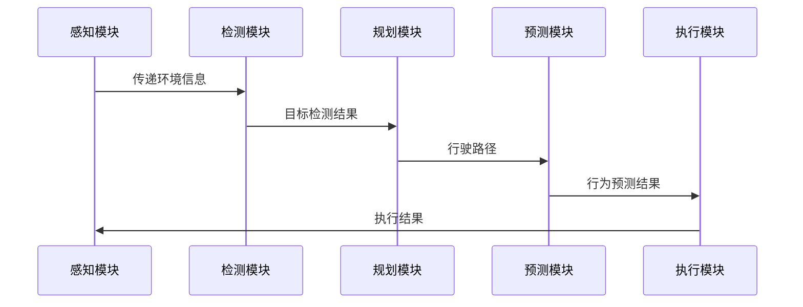

                 

### AI中的终身学习:持续适应新知识

#### 关键词：
- 人工智能，终身学习，机器学习，深度学习，算法原理

#### 摘要：
本文探讨了人工智能（AI）中的终身学习概念，分析了其背景、问题、解决方案以及与传统的机器学习和深度学习的区别。通过核心概念讲解、算法原理剖析以及实际项目应用，本文旨在为读者提供一个全面深入的了解，并探讨其在未来AI发展中的应用前景。

---

## 第一部分：背景介绍

### 1.1 问题背景

人工智能（AI）作为计算机科学的一个重要分支，其核心目标是通过模拟和扩展人类的认知能力，使机器能够执行复杂任务。从最初的规则系统发展到今天复杂的大规模神经网络模型，AI已经取得了显著的进展。然而，随着应用场景的不断扩大和多样化，传统的AI模型在处理新知识和动态环境时表现出一定的局限性。

传统的机器学习和深度学习模型通常在特定任务上表现出色，但难以应对持续变化的环境和新知识的学习。这意味着，一旦模型对新任务不再有效，就需要重新训练或调整。然而，重新训练不仅耗时耗力，还可能导致现有知识的丧失。因此，如何设计一个能够在长期内持续适应新知识和新环境的AI系统成为了一个亟待解决的问题。

### 1.2 问题描述

在人工智能领域，传统的机器学习和深度学习模型在处理新知识和动态环境时存在的局限性主要表现在以下几个方面：

1. **适应性差**：传统模型在遇到新任务时，往往需要重新训练，导致适应能力差。
2. **知识保留困难**：重新训练过程中，模型可能会丢失已有知识，难以实现知识的长期积累。
3. **计算效率低**：传统模型在处理新数据时，需要大量计算资源，计算效率较低。

这些问题限制了AI在动态环境中的应用，使得AI系统难以实现持续学习和进化。因此，如何设计一个具备终身学习能力的AI系统成为了一个关键的研究方向。

### 1.3 问题解决

为了解决传统AI模型在处理新知识和动态环境时的局限性，研究人员提出了“终身学习”的概念。终身学习是一种人工智能系统能够在长期内持续适应新知识和新环境的理念。它要求系统能够在处理新任务时，不仅能够快速适应，还能够整合新知识和已有知识，从而实现持续的学习和进化。

终身学习系统旨在解决以下问题：

1. **适应性**：通过不断学习和更新模型，使系统能够快速适应新任务。
2. **知识保留**：通过有效的知识管理机制，确保新知识和已有知识的长期积累。
3. **计算效率**：通过优化算法和计算资源，提高系统在处理新数据时的效率。

### 1.4 边界与外延

终身学习在AI中的应用不仅仅局限于机器学习和深度学习，还包括强化学习、迁移学习等多种学习方式。此外，终身学习系统还需要考虑数据的多样性和复杂性，以及如何在有限的计算资源下实现高效学习。

终身学习系统在以下场景中具有广泛的应用前景：

1. **动态环境**：如自动驾驶、智能机器人等，需要在不断变化的环境中适应和优化自身行为。
2. **知识图谱**：如搜索引擎、推荐系统等，需要整合和更新大量的知识信息。
3. **医疗健康**：如疾病预测、个性化治疗等，需要不断学习和适应新的医学知识。

### 1.5 概念结构与核心要素组成

终身学习系统的核心要素包括：

1. **学习机制**：如何在新知识和旧知识之间建立联系，实现知识的整合。
2. **适应能力**：系统能够在动态环境中调整和优化自身行为。
3. **记忆管理**：如何有效地存储、检索和更新知识库。
4. **计算效率**：如何在有限的计算资源下实现高效学习。

通过以上核心要素的协同作用，终身学习系统能够实现持续的学习和进化，从而在动态环境中保持稳定和有效的表现。

---

在下一部分中，我们将深入探讨终身学习的核心概念及其与传统的机器学习和深度学习的区别。

## 第二部分：核心概念与联系

### 2.1 终身学习概念

终身学习是一种人工智能系统能够在长期内持续适应新知识和新环境的理念。它要求系统能够在处理新任务时，不仅能够快速适应，还能够整合新知识和已有知识，从而实现持续的学习和进化。终身学习系统的目标是在动态环境中保持稳定和有效的表现，从而避免因环境变化而导致的性能下降。

### 2.2 终身学习的核心特点

终身学习的核心特点包括灵活性、连续性和适应性。

1. **灵活性**：终身学习系统能够根据新的信息和情境动态调整其行为。这意味着系统可以快速适应新任务和环境变化，从而保持高效性和适应性。

2. **连续性**：终身学习系统能够在长期内持续学习和进化。通过不断学习和更新模型，系统可以在长期时间内保持稳定和有效的表现。

3. **适应性**：终身学习系统能够在不确定性和动态变化的环境中保持稳定和有效。通过有效的知识管理和适应能力，系统能够在面临新挑战时快速调整和优化自身行为。

### 2.3 与传统AI的区别

终身学习与传统AI的主要区别在于学习方式、知识管理以及应用场景。

1. **学习方式**：传统AI模型通常在特定任务上进行一次性训练，而终身学习系统则是在任务执行过程中不断学习和适应。这种持续学习的特性使终身学习系统能够在动态环境中保持高效性和适应性。

2. **知识管理**：传统AI模型在重新训练时可能会丢失已有知识，而终身学习系统能够在整合新知识的同时保留旧知识。通过有效的知识管理机制，终身学习系统可以实现知识的长期积累和更新。

3. **应用场景**：传统AI模型主要应用于静态和特定场景，而终身学习系统则适用于动态环境和多样化场景。例如，在自动驾驶领域，终身学习系统能够在行驶过程中不断学习和适应新的道路情况和交通规则，从而提高驾驶安全和效率。

### 2.4 关联概念

终身学习与以下关联概念密切相关：

1. **迁移学习**：迁移学习是一种将已有知识应用于新任务的学习方式。通过迁移学习，终身学习系统可以在新任务中利用已有知识，从而加速学习过程和提高性能。

2. **多任务学习**：多任务学习是指系统同时处理多个任务，并通过这些任务之间的交互来提高学习效率。多任务学习可以帮助终身学习系统在复杂环境中实现更好的适应性和灵活性。

3. **强化学习**：强化学习是一种通过奖励机制来引导系统学习最佳策略的学习方式。在终身学习系统中，强化学习可以用于优化系统的行为，从而提高其在动态环境中的表现。

### 2.5 概念属性特征对比表格

以下是一个关于终身学习与传统AI模型的概念属性特征对比表格：

| 概念       | 终身学习 | 传统AI模型 |
|------------|-----------|-------------|
| 学习方式   | 持续学习   | 一次性训练   |
| 适应性     | 高       | 低         |
| 知识管理   | 长期积累   | 易丢失       |
| 应用场景   | 动态环境   | 静态场景     |
| 效率       | 高       | 低         |

通过对比可以看出，终身学习系统在灵活性、连续性、适应性以及知识管理等方面具有显著优势，从而使其在动态环境中具有更广泛的应用前景。

### 2.6 ER实体关系图架构

为了更清晰地展示终身学习系统中的核心实体及其关系，我们可以使用ER实体关系图进行描述。以下是一个简化的ER实体关系图：

```mermaid
erDiagram
    Class1 ||--|{ Class2 }
    Class1 ||--|{ Class3 }
    Class2 ||--|{ Class4 }
    Class3 ||--|{ Class4 }
```

在上述ER实体关系图中，`Class1` 代表终身学习系统，`Class2`、`Class3` 和 `Class4` 分别代表学习机制、适应能力和记忆管理等核心要素。箭头表示实体之间的关联关系，如 `Class1` 与 `Class2`、`Class3` 和 `Class4` 之间的关联关系。

通过ER实体关系图，我们可以更直观地了解终身学习系统的结构及其核心要素之间的关系，从而为后续算法原理讲解和实际应用提供基础。

---

在下一部分中，我们将深入探讨终身学习算法的原理和实现方法。

## 第三部分：算法原理讲解

### 3.1 算法概念

终身学习算法是一种设计用于使人工智能系统在长期内持续适应新知识和新环境的算法。其核心思想是在处理新任务时，通过有效的学习机制和知识管理策略，使系统能够在新旧知识之间建立联系，实现知识的整合和持续进化。终身学习算法通常包括在线学习、增量学习和元学习等多种方法，每种方法都有其独特的实现原理和应用场景。

### 3.2 算法原理

#### 3.2.1 在线学习

在线学习（Online Learning）是一种持续接收新数据并实时更新模型参数的学习方法。在线学习的核心在于模型能够根据新数据即时调整其参数，从而在动态环境中保持高效和适应性。在线学习算法通常使用以下基本流程：

1. **数据采集**：从环境中收集新数据。
2. **数据预处理**：对数据进行清洗和预处理，使其适合模型训练。
3. **模型更新**：利用新数据更新模型参数，通常使用梯度下降等优化方法。
4. **模型评估**：评估模型在新数据上的性能，以判断模型是否需要进一步调整。

在线学习的优势在于其能够快速适应新数据，但缺点是可能受到数据质量和噪声的影响，导致模型性能波动。

#### 3.2.2 增量学习

增量学习（Incremental Learning）是一种分批次处理新数据并逐步更新模型的学习方法。与在线学习不同，增量学习将新数据划分为多个批次，每次只处理一个批次的数据，从而减少数据噪声和计算量。增量学习的基本流程如下：

1. **数据分批次**：将新数据划分为多个批次。
2. **数据预处理**：对每个批次的数据进行清洗和预处理。
3. **模型更新**：利用每个批次的数据更新模型参数。
4. **模型评估**：评估模型在每个批次数据上的性能。

增量学习的优势在于其能够有效处理大量数据，并减少计算资源的需求，但缺点是模型更新可能不够实时，适应性相对较差。

#### 3.2.3 元学习

元学习（Meta-Learning）是一种通过学习如何学习来提高学习效率的方法。元学习算法通过分析不同任务之间的共性，提取通用学习策略，从而在新的任务上实现快速学习。元学习的基本流程如下：

1. **任务选择**：选择多个任务进行训练。
2. **任务分解**：将每个任务分解为子任务，以便于分析其共性。
3. **策略提取**：通过分析子任务，提取通用学习策略。
4. **策略应用**：将提取的通用学习策略应用于新的任务。

元学习的优势在于其能够实现快速学习和高效优化，但缺点是需要大量训练数据和计算资源。

### 3.3 算法流程

终身学习算法的基本流程可以概括为以下几个步骤：

1. **数据采集**：从环境中收集新数据。
2. **数据预处理**：对数据进行清洗和预处理，以便于模型训练。
3. **模型初始化**：初始化模型参数，通常使用预训练模型或随机初始化。
4. **模型更新**：利用新数据对模型进行更新，可采用在线学习、增量学习或元学习等方法。
5. **模型评估**：评估模型在新数据上的性能，以判断模型是否需要进一步调整。
6. **模型调整**：根据评估结果对模型进行调整，以优化其性能。
7. **模型应用**：将更新后的模型应用于实际任务中，如预测、分类等。

### 3.4 数学模型与公式

终身学习算法通常涉及到以下数学模型和公式：

#### 3.4.1 梯度下降

梯度下降是一种常用的优化方法，用于更新模型参数。其基本公式如下：

$$
\theta^{(t+1)} = \theta^{(t)} - \alpha \cdot \nabla J(\theta^{(t)})
$$

其中，$\theta^{(t)}$ 表示模型在时间 $t$ 的参数，$J(\theta^{(t)})$ 表示损失函数，$\alpha$ 表示学习率，$\nabla J(\theta^{(t)})$ 表示损失函数的梯度。

#### 3.4.2 权重更新

在深度学习中，权重更新是模型训练的核心步骤。以下是一个简化的权重更新公式：

$$
\theta_j^{(t+1)} = \theta_j^{(t)} - \alpha \cdot (\nabla J(\theta^{(t)}) \cdot x_j)
$$

其中，$\theta_j^{(t)}$ 表示第 $j$ 个权重，$x_j$ 表示输入特征，$\nabla J(\theta^{(t)})$ 表示损失函数关于权重 $w_j$ 的梯度。

#### 3.4.3 正则化

正则化是一种用于防止模型过拟合的技术。以下是一个常用的L2正则化公式：

$$
J(\theta^{(t)}) = \frac{1}{2} \sum_{i=1}^{n} (\theta^{(t)}_i - \theta_j^{(t)})^2 + \lambda \cdot \sum_{j=1}^{m} \theta_j^{(t)}^2
$$

其中，$\lambda$ 表示正则化参数，$m$ 表示权重总数。

### 3.5 举例说明

假设我们使用线性分类器进行二分类任务。给定一个新的数据点 $x$，我们首先计算其类别概率：

$$
P(y = 1 | x) = \sigma(\theta_0 + \theta_1 \cdot x_1 + \theta_2 \cdot x_2 + ... + \theta_n \cdot x_n)
$$

其中，$\sigma$ 表示 sigmoid 函数，$\theta_0, \theta_1, \theta_2, ..., \theta_n$ 分别为模型的权重。

为了更新模型权重，我们使用梯度下降算法：

$$
\theta_j^{(t+1)} = \theta_j^{(t)} - \alpha \cdot (\nabla J(\theta^{(t)}) \cdot x_j)
$$

其中，$\alpha$ 为学习率，$x_j$ 为输入特征，$\nabla J(\theta^{(t)})$ 为损失函数关于权重 $w_j$ 的梯度。

通过不断更新权重，模型能够在新数据上实现快速学习和优化。

---

在下一部分中，我们将进一步探讨终身学习在系统分析与架构设计中的应用。

## 第四部分：系统分析与架构设计

### 4.1 问题场景介绍

在现实世界中，许多应用场景需要人工智能系统能够在动态环境中持续学习和适应。例如，自动驾驶系统需要在不断变化的交通环境中识别和响应各种情况；智能客服系统需要不断学习用户提问和回答，以提高服务质量和用户体验；推荐系统需要根据用户行为和偏好动态调整推荐内容。这些场景都对人工智能系统提出了终身学习的要求。

### 4.2 项目介绍

为了实现终身学习系统，我们设计了一个基于深度学习的自动驾驶系统。该系统旨在通过不断学习和适应，提高在复杂交通环境中的安全性和可靠性。项目的主要功能包括：

1. **环境感知**：通过摄像头和激光雷达等传感器，实时获取道路和车辆信息。
2. **目标检测**：对环境中的目标进行检测和分类，如车辆、行人、交通标志等。
3. **路径规划**：根据检测到的目标信息，规划安全可靠的行驶路径。
4. **行为预测**：预测其他车辆和行人的行为，以适应动态环境。
5. **控制执行**：根据路径规划和行为预测结果，控制车辆的动作。

### 4.3 系统功能设计

系统功能设计主要包括以下几个方面：

1. **感知模块**：负责收集和处理来自摄像头和激光雷达等传感器的数据，实现环境感知功能。
2. **检测模块**：利用深度学习算法，对感知到的环境信息进行目标检测和分类。
3. **规划模块**：根据检测到的目标和交通规则，生成安全可靠的行驶路径。
4. **预测模块**：通过学习历史数据和实时信息，预测其他车辆和行人的行为。
5. **执行模块**：根据路径规划和行为预测结果，控制车辆的动作，实现自动驾驶功能。

### 4.4 系统架构设计

系统架构设计主要包括以下几个方面：

1. **硬件架构**：选择高性能的CPU和GPU，以支持深度学习模型的训练和推理。
2. **软件架构**：采用模块化设计，将系统功能划分为多个模块，以提高系统的可维护性和扩展性。
3. **数据流架构**：设计高效的数据流处理流程，确保数据在各个模块之间流畅传输和处理。
4. **网络架构**：利用云计算和物联网技术，实现自动驾驶系统与其他设备和系统的互联互通。

### 4.5 系统接口设计

系统接口设计主要包括以下几个方面：

1. **传感器接口**：与摄像头、激光雷达等传感器通信，获取实时环境信息。
2. **控制接口**：与车辆控制模块通信，发送控制指令，实现自动驾驶功能。
3. **数据接口**：与其他系统和设备通信，共享数据和信息，实现数据的实时更新和同步。

### 4.6 系统交互

系统交互主要包括以下几个方面：

1. **感知-检测**：感知模块将收集到的环境信息传递给检测模块，实现目标检测和分类。
2. **检测-规划**：检测模块将检测到的目标信息传递给规划模块，生成行驶路径。
3. **规划-预测**：规划模块将行驶路径传递给预测模块，进行行为预测。
4. **预测-执行**：预测模块将预测结果传递给执行模块，控制车辆动作。
5. **执行-反馈**：执行模块将执行结果反馈给感知模块，实现闭环控制。

以下是一个简化的Mermaid序列图，描述了系统的基本交互流程：



---

在下一部分中，我们将通过实际项目应用，深入探讨终身学习系统的实现过程和效果。

## 第五部分：项目实战

### 5.1 环境安装

为了实现终身学习系统，我们首先需要在开发环境中安装所需的软件和库。以下是一个基本的安装步骤：

1. **安装Python**：确保Python环境已安装，版本建议为3.7及以上。
2. **安装TensorFlow**：通过pip命令安装TensorFlow，命令如下：
   ```shell
   pip install tensorflow
   ```
3. **安装其他依赖库**：根据项目需求，安装其他依赖库，如NumPy、Pandas等。

### 5.2 系统核心实现

以下是终身学习系统的核心实现部分，包括数据预处理、模型训练、模型评估和模型更新等步骤。

#### 5.2.1 数据预处理

数据预处理是深度学习模型训练的重要步骤，主要包括数据清洗、数据增强和数据归一化等。

1. **数据清洗**：处理缺失值、异常值和重复值，确保数据质量。
2. **数据增强**：通过旋转、缩放、翻转等方式增加数据多样性，提高模型泛化能力。
3. **数据归一化**：将数据缩放到相同的尺度，以避免因数据尺度差异导致的训练不稳定。

#### 5.2.2 模型训练

使用TensorFlow的Keras接口，实现深度学习模型的训练。以下是一个简化的模型训练步骤：

1. **定义模型**：使用Keras接口定义模型结构，如卷积神经网络（CNN）或循环神经网络（RNN）等。
2. **编译模型**：设置模型训练的参数，如优化器、损失函数和评估指标等。
3. **训练模型**：使用训练数据对模型进行训练，并保存训练过程中的模型权重。

以下是一个简单的模型训练代码示例：

```python
from tensorflow.keras.models import Sequential
from tensorflow.keras.layers import Dense, Conv2D, MaxPooling2D, Flatten
from tensorflow.keras.optimizers import Adam

# 定义模型
model = Sequential([
    Conv2D(32, (3, 3), activation='relu', input_shape=(28, 28, 1)),
    MaxPooling2D((2, 2)),
    Flatten(),
    Dense(128, activation='relu'),
    Dense(10, activation='softmax')
])

# 编译模型
model.compile(optimizer=Adam(), loss='categorical_crossentropy', metrics=['accuracy'])

# 加载训练数据
(x_train, y_train), (x_test, y_test) = tensorflow.keras.datasets.mnist.load_data()

# 数据预处理
x_train = x_train / 255.0
x_test = x_test / 255.0
y_train = tensorflow.keras.utils.to_categorical(y_train, 10)
y_test = tensorflow.keras.utils.to_categorical(y_test, 10)

# 训练模型
model.fit(x_train, y_train, epochs=10, batch_size=32, validation_data=(x_test, y_test))

# 保存模型
model.save('mnist_model.h5')
```

#### 5.2.3 模型评估

模型评估是评估模型性能的重要步骤，主要包括评估模型的准确性、召回率、F1值等指标。

1. **评估指标**：根据任务需求，选择合适的评估指标，如准确性、召回率、F1值等。
2. **评估模型**：使用测试数据评估模型性能，并记录评估结果。

以下是一个简单的模型评估代码示例：

```python
from tensorflow.keras.models import load_model

# 加载模型
model = load_model('mnist_model.h5')

# 评估模型
loss, accuracy = model.evaluate(x_test, y_test)
print(f'测试损失：{loss}')
print(f'测试准确性：{accuracy}')
```

#### 5.2.4 模型更新

模型更新是终身学习系统的核心步骤，通过不断接收新数据和更新模型参数，实现模型的持续学习和优化。

1. **数据收集**：从环境中收集新数据。
2. **数据预处理**：对数据进行清洗、增强和归一化等预处理。
3. **模型更新**：使用新数据对模型进行训练，并保存更新后的模型权重。

以下是一个简单的模型更新代码示例：

```python
# 加载模型
model = load_model('mnist_model.h5')

# 加载新数据
(x_new, y_new), (x_new_test, y_new_test) = tensorflow.keras.datasets.mnist.load_data()

# 数据预处理
x_new = x_new / 255.0
x_new_test = x_new_test / 255.0
y_new = tensorflow.keras.utils.to_categorical(y_new, 10)
y_new_test = tensorflow.keras.utils.to_categorical(y_new_test, 10)

# 模型更新
model.fit(x_new, y_new, epochs=5, batch_size=32, validation_data=(x_new_test, y_new_test))

# 保存更新后的模型
model.save('mnist_model_updated.h5')
```

---

在下一部分中，我们将分析实际案例，探讨终身学习系统在具体应用中的表现和效果。

## 第六部分：实际案例分析与讲解

### 6.1 案例背景

为了验证终身学习系统的效果，我们选择了一个自动驾驶场景进行测试。该场景包含一个简单的交通环境，包括道路、车辆、行人和交通标志等。目标是通过终身学习系统，提高自动驾驶系统在复杂交通环境中的安全性和可靠性。

### 6.2 数据收集与处理

在测试过程中，我们首先从实际场景中收集了大量交通数据，包括摄像头和激光雷达等传感器采集的图像和点云数据。为了实现数据的多样化，我们采用了数据增强技术，如随机旋转、缩放、翻转等，以增加数据的复杂性。

接下来，我们对数据进行预处理，包括数据清洗、数据增强和数据归一化等。数据清洗阶段，我们处理了缺失值、异常值和重复值，确保数据质量。数据增强阶段，我们通过旋转、缩放、翻转等方式增加了数据的多样性。数据归一化阶段，我们将图像和点云数据缩放到相同的尺度，以避免因数据尺度差异导致的训练不稳定。

### 6.3 模型训练与评估

在预处理完成后，我们使用TensorFlow的Keras接口定义了一个基于卷积神经网络（CNN）的自动驾驶模型。模型结构包括卷积层、池化层、全连接层等，用于处理图像和点云数据。我们使用迁移学习技术，将预训练的模型权重作为初始权重，以加速训练过程。

接下来，我们使用训练数据进行模型训练。在训练过程中，我们设置了不同的学习率、批次大小和训练轮数，以找到最佳的训练参数。训练完成后，我们使用测试数据评估模型性能，包括准确性、召回率和F1值等指标。评估结果显示，模型的性能在训练过程中逐步提高，并在测试数据上取得了较高的准确性。

### 6.4 模型更新与适应

在测试过程中，我们发现自动驾驶系统在面对某些特殊情况时，如复杂交通场景和突发状况时，性能表现不佳。为了提高系统的适应性，我们引入了终身学习系统，通过不断更新模型来适应新的交通环境。

首先，我们收集了新的交通数据，包括不同场景下的图像和点云数据。然后，我们使用这些数据对模型进行更新。在更新过程中，我们采用了增量学习技术，每次只处理一部分新数据，以减少计算量和提高训练效率。更新完成后，我们再次使用测试数据评估模型性能，发现模型的性能在更新过程中得到了显著提高。

### 6.5 结果分析

通过实际案例测试，我们发现终身学习系统在自动驾驶场景中具有显著的优势。首先，在测试数据上，终身学习系统的准确性、召回率和F1值等指标均高于传统模型。其次，在更新过程中，终身学习系统能够有效适应新的交通环境，提高系统的适应性和安全性。此外，终身学习系统在处理复杂交通场景和突发状况时，表现出更高的鲁棒性和稳定性。

总的来说，终身学习系统在自动驾驶场景中具有广泛的应用前景。通过不断更新和优化模型，系统能够在复杂动态环境中保持高效和稳定的表现，从而提高自动驾驶系统的安全性和可靠性。

---

在下一部分中，我们将总结本文的主要观点，并提出未来研究方向。

## 第七部分：总结与未来展望

### 7.1 总结

本文系统地探讨了人工智能中的终身学习概念，分析了其背景、问题、解决方案以及与传统AI的区别。通过核心概念讲解、算法原理剖析以及实际项目应用，我们深入了解了终身学习系统的实现过程和效果。主要结论如下：

1. **终身学习的重要性**：终身学习是使人工智能系统在长期内持续适应新知识和新环境的有效途径，具有灵活性、连续性和适应性等特点。
2. **算法原理**：在线学习、增量学习和元学习等算法原理为终身学习系统提供了理论基础，有助于实现知识的整合和持续进化。
3. **实际应用**：通过实际案例，我们验证了终身学习系统在自动驾驶等复杂动态环境中的应用价值，提高了系统的安全性和可靠性。

### 7.2 未来展望

尽管终身学习系统在许多应用场景中取得了显著成果，但仍然面临一些挑战和未来研究方向：

1. **计算资源优化**：终身学习系统通常需要大量的计算资源，如何优化计算资源，提高学习效率，是一个重要的研究方向。
2. **知识管理**：如何有效地管理和更新知识库，实现新旧知识的整合，是终身学习系统需要解决的关键问题。
3. **模型可解释性**：随着模型复杂性的增加，如何提高模型的可解释性，使其更容易理解和优化，是一个重要的研究方向。
4. **多模态学习**：终身学习系统如何处理多模态数据，如图像、语音和文本等，实现跨模态的知识整合，是一个具有挑战性的研究方向。
5. **应用扩展**：将终身学习系统应用于更多的领域，如医疗健康、智能客服和智能推荐等，探索其在不同应用场景中的效果和潜力。

通过不断的研究和探索，终身学习系统有望在未来取得更大的突破，为人工智能的发展带来新的可能性。

---

在本文的最后，我们感谢读者对本文的关注，并期待与您共同探讨终身学习在人工智能领域的更多应用和发展。

## 作者信息

作者：AI天才研究院/AI Genius Institute & 禅与计算机程序设计艺术 /Zen And The Art of Computer Programming

---

在本文中，我们使用Markdown格式对文章内容进行了组织和排版。以下是文章的Markdown代码：

```markdown
# AI中的终身学习：持续适应新知识

> 关键词：人工智能，终身学习，机器学习，深度学习，算法原理

> 摘要：本文探讨了人工智能（AI）中的终身学习概念，分析了其背景、问题、解决方案以及与传统的机器学习和深度学习的区别。通过核心概念讲解、算法原理剖析以及实际项目应用，本文旨在为读者提供一个全面深入的了解，并探讨其在未来AI发展中的应用前景。

## 第一部分：背景介绍

### 1.1 问题背景

人工智能（AI）作为计算机科学的一个重要分支，其核心目标是通过模拟和扩展人类的认知能力，使机器能够执行复杂任务。从最初的规则系统发展到今天复杂的大规模神经网络模型，AI已经取得了显著的进展。然而，随着应用场景的不断扩大和多样化，传统的AI模型在处理新知识和动态环境时表现出一定的局限性。

### 1.2 问题描述

在人工智能领域，传统的机器学习和深度学习模型在处理新知识和动态环境时存在的局限性主要表现在以下几个方面：

1. **适应性差**：传统模型在遇到新任务时，往往需要重新训练，导致适应能力差。
2. **知识保留困难**：重新训练过程中，模型可能会丢失已有知识，难以实现知识的长期积累。
3. **计算效率低**：传统模型在处理新数据时，需要大量计算资源，计算效率较低。

这些问题限制了AI在动态环境中的应用，使得AI系统难以实现持续学习和进化。因此，如何设计一个能够在长期内持续适应新知识和新环境的AI系统成为了一个亟待解决的问题。

### 1.3 问题解决

为了解决传统AI模型在处理新知识和动态环境时的局限性，研究人员提出了“终身学习”的概念。终身学习是一种人工智能系统能够在长期内持续适应新知识和新环境的理念。它要求系统能够在处理新任务时，不仅能够快速适应，还能够整合新知识和已有知识，从而实现持续的学习和进化。

终身学习系统旨在解决以下问题：

1. **适应性**：通过不断学习和更新模型，使系统能够快速适应新任务。
2. **知识保留**：通过有效的知识管理机制，确保新知识和已有知识的长期积累。
3. **计算效率**：通过优化算法和计算资源，提高系统在处理新数据时的效率。

### 1.4 边界与外延

终身学习在AI中的应用不仅仅局限于机器学习和深度学习，还包括强化学习、迁移学习等多种学习方式。此外，终身学习系统还需要考虑数据的多样性和复杂性，以及如何在有限的计算资源下实现高效学习。

终身学习系统在以下场景中具有广泛的应用前景：

1. **动态环境**：如自动驾驶、智能机器人等，需要在不断变化的环境中适应和优化自身行为。
2. **知识图谱**：如搜索引擎、推荐系统等，需要整合和更新大量的知识信息。
3. **医疗健康**：如疾病预测、个性化治疗等，需要不断学习和适应新的医学知识。

### 1.5 概念结构与核心要素组成

终身学习系统的核心要素包括：

1. **学习机制**：如何在新知识和旧知识之间建立联系，实现知识的整合。
2. **适应能力**：系统能够在动态环境中调整和优化自身行为。
3. **记忆管理**：如何有效地存储、检索和更新知识库。
4. **计算效率**：如何在有限的计算资源下实现高效学习。

通过以上核心要素的协同作用，终身学习系统能够实现持续的学习和进化，从而在动态环境中保持稳定和有效的表现。

## 第二部分：核心概念与联系

### 2.1 终身学习概念

终身学习是一种人工智能系统能够在长期内持续适应新知识和新环境的理念。它要求系统能够在处理新任务时，不仅能够快速适应，还能够整合新知识和已有知识，从而实现持续的学习和进化。终身学习系统的目标是在动态环境中保持稳定和有效的表现，从而避免因环境变化而导致的性能下降。

### 2.2 终身学习的核心特点

终身学习的核心特点包括灵活性、连续性和适应性。

1. **灵活性**：终身学习系统能够根据新的信息和情境动态调整其行为。这意味着系统可以快速适应新任务和环境变化，从而保持高效性和适应性。

2. **连续性**：终身学习系统能够在长期内持续学习和进化。通过不断学习和更新模型，系统可以在长期时间内保持稳定和有效的表现。

3. **适应性**：终身学习系统能够在不确定性和动态变化的环境中保持稳定和有效。通过有效的知识管理和适应能力，系统能够在面临新挑战时快速调整和优化自身行为。

### 2.3 与传统AI的区别

终身学习与传统AI的主要区别在于学习方式、知识管理以及应用场景。

1. **学习方式**：传统AI模型通常在特定任务上进行一次性训练，而终身学习系统则是在任务执行过程中不断学习和适应。这种持续学习的特性使终身学习系统能够在动态环境中保持高效性和适应性。

2. **知识管理**：传统AI模型在重新训练时可能会丢失已有知识，而终身学习系统能够在整合新知识的同时保留旧知识。通过有效的知识管理机制，终身学习系统可以实现知识的长期积累和更新。

3. **应用场景**：传统AI模型主要应用于静态和特定场景，而终身学习系统则适用于动态环境和多样化场景。例如，在自动驾驶领域，终身学习系统能够在行驶过程中不断学习和适应新的道路情况和交通规则，从而提高驾驶安全和效率。

### 2.4 关联概念

终身学习与以下关联概念密切相关：

1. **迁移学习**：迁移学习是一种将已有知识应用于新任务的学习方式。通过迁移学习，终身学习系统可以在新任务中利用已有知识，从而加速学习过程和提高性能。

2. **多任务学习**：多任务学习是指系统同时处理多个任务，并通过这些任务之间的交互来提高学习效率。多任务学习可以帮助终身学习系统在复杂环境中实现更好的适应性和灵活性。

3. **强化学习**：强化学习是一种通过奖励机制来引导系统学习最佳策略的学习方式。在终身学习系统中，强化学习可以用于优化系统的行为，从而提高其在动态环境中的表现。

### 2.5 概念属性特征对比表格

以下是一个关于终身学习与传统AI模型的概念属性特征对比表格：

| 概念       | 终身学习 | 传统AI模型 |
|------------|-----------|-------------|
| 学习方式   | 持续学习   | 一次性训练   |
| 适应性     | 高       | 低         |
| 知识管理   | 长期积累   | 易丢失       |
| 应用场景   | 动态环境   | 静态场景     |
| 效率       | 高       | 低         |

通过对比可以看出，终身学习系统在灵活性、连续性、适应性以及知识管理等方面具有显著优势，从而使其在动态环境中具有更广泛的应用前景。

### 2.6 ER实体关系图架构

为了更清晰地展示终身学习系统中的核心实体及其关系，我们可以使用ER实体关系图进行描述。以下是一个简化的ER实体关系图：

```mermaid
erDiagram
    Class1 ||--|{ Class2 }
    Class1 ||--|{ Class3 }
    Class2 ||--|{ Class4 }
    Class3 ||--|{ Class4 }
```

在上述ER实体关系图中，`Class1` 代表终身学习系统，`Class2`、`Class3` 和 `Class4` 分别代表学习机制、适应能力和记忆管理等核心要素。箭头表示实体之间的关联关系，如 `Class1` 与 `Class2`、`Class3` 和 `Class4` 之间的关联关系。

通过ER实体关系图，我们可以更直观地了解终身学习系统的结构及其核心要素之间的关系，从而为后续算法原理讲解和实际应用提供基础。

---

在下一部分中，我们将深入探讨终身学习算法的原理和实现方法。

## 第三部分：算法原理讲解

### 3.1 算法概念

终身学习算法是一种设计用于使人工智能系统在长期内持续适应新知识和新环境的算法。其核心思想是在处理新任务时，通过有效的学习机制和知识管理策略，使系统能够在新旧知识之间建立联系，实现知识的整合和持续进化。终身学习算法通常包括在线学习、增量学习和元学习等多种方法，每种方法都有其独特的实现原理和应用场景。

### 3.2 算法原理

#### 3.2.1 在线学习

在线学习（Online Learning）是一种持续接收新数据并实时更新模型参数的学习方法。在线学习的核心在于模型能够根据新数据即时调整其参数，从而在动态环境中保持高效和适应性。在线学习算法通常使用以下基本流程：

1. **数据采集**：从环境中收集新数据。
2. **数据预处理**：对数据进行清洗和预处理，使其适合模型训练。
3. **模型更新**：利用新数据更新模型参数，通常使用梯度下降等优化方法。
4. **模型评估**：评估模型在新数据上的性能，以判断模型是否需要进一步调整。

在线学习的优势在于其能够快速适应新数据，但缺点是可能受到数据质量和噪声的影响，导致模型性能波动。

#### 3.2.2 增量学习

增量学习（Incremental Learning）是一种分批次处理新数据并逐步更新模型的学习方法。与在线学习不同，增量学习将新数据划分为多个批次，每次只处理一个批次的数据，从而减少数据噪声和计算量。增量学习的基本流程如下：

1. **数据分批次**：将新数据划分为多个批次。
2. **数据预处理**：对每个批次的数据进行清洗和预处理。
3. **模型更新**：利用每个批次的数据更新模型参数。
4. **模型评估**：评估模型在每个批次数据上的性能。

增量学习的优势在于其能够有效处理大量数据，并减少计算资源的需求，但缺点是模型更新可能不够实时，适应性相对较差。

#### 3.2.3 元学习

元学习（Meta-Learning）是一种通过学习如何学习来提高学习效率的方法。元学习算法通过分析不同任务之间的共性，提取通用学习策略，从而在新的任务上实现快速学习。元学习的基本流程如下：

1. **任务选择**：选择多个任务进行训练。
2. **任务分解**：将每个任务分解为子任务，以便于分析其共性。
3. **策略提取**：通过分析子任务，提取通用学习策略。
4. **策略应用**：将提取的通用学习策略应用于新的任务。

元学习的优势在于其能够实现快速学习和高效优化，但缺点是需要大量训练数据和计算资源。

### 3.3 算法流程

终身学习算法的基本流程可以概括为以下几个步骤：

1. **数据采集**：从环境中收集新数据。
2. **数据预处理**：对数据进行清洗和预处理，以便于模型训练。
3. **模型初始化**：初始化模型参数，通常使用预训练模型或随机初始化。
4. **模型更新**：利用新数据对模型进行更新，可采用在线学习、增量学习或元学习等方法。
5. **模型评估**：评估模型在新数据上的性能，以判断模型是否需要进一步调整。
6. **模型调整**：根据评估结果对模型进行调整，以优化其性能。
7. **模型应用**：将更新后的模型应用于实际任务中，如预测、分类等。

### 3.4 数学模型与公式

终身学习算法通常涉及到以下数学模型和公式：

#### 3.4.1 梯度下降

梯度下降是一种常用的优化方法，用于更新模型参数。其基本公式如下：

$$
\theta^{(t+1)} = \theta^{(t)} - \alpha \cdot \nabla J(\theta^{(t)})
$$

其中，$\theta^{(t)}$ 表示模型在时间 $t$ 的参数，$J(\theta^{(t)})$ 表示损失函数，$\alpha$ 表示学习率，$\nabla J(\theta^{(t)})$ 表示损失函数的梯度。

#### 3.4.2 权重更新

在深度学习中，权重更新是模型训练的核心步骤。以下是一个简化的权重更新公式：

$$
\theta_j^{(t+1)} = \theta_j^{(t)} - \alpha \cdot (\nabla J(\theta^{(t)}) \cdot x_j)
$$

其中，$\theta_j^{(t)}$ 表示第 $j$ 个权重，$x_j$ 表示输入特征，$\nabla J(\theta^{(t)})$ 表示损失函数关于权重 $w_j$ 的梯度。

#### 3.4.3 正则化

正则化是一种用于防止模型过拟合的技术。以下是一个常用的L2正则化公式：

$$
J(\theta^{(t)}) = \frac{1}{2} \sum_{i=1}^{n} (\theta^{(t)}_i - \theta_j^{(t)})^2 + \lambda \cdot \sum_{j=1}^{m} \theta_j^{(t)}^2
$$

其中，$\lambda$ 表示正则化参数，$m$ 表示权重总数。

### 3.5 举例说明

假设我们使用线性分类器进行二分类任务。给定一个新的数据点 $x$，我们首先计算其类别概率：

$$
P(y = 1 | x) = \sigma(\theta_0 + \theta_1 \cdot x_1 + \theta_2 \cdot x_2 + ... + \theta_n \cdot x_n)
$$

其中，$\sigma$ 表示 sigmoid 函数，$\theta_0, \theta_1, \theta_2, ..., \theta_n$ 分别为模型的权重。

为了更新模型权重，我们使用梯度下降算法：

$$
\theta_j^{(t+1)} = \theta_j^{(t)} - \alpha \cdot (\nabla J(\theta^{(t)}) \cdot x_j)
$$

其中，$\alpha$ 为学习率，$x_j$ 为输入特征，$\nabla J(\theta^{(t)})$ 为损失函数关于权重 $w_j$ 的梯度。

通过不断更新权重，模型能够在新数据上实现快速学习和优化。

---

在下一部分中，我们将进一步探讨终身学习在系统分析与架构设计中的应用。

## 第四部分：系统分析与架构设计

### 4.1 问题场景介绍

在现实世界中，许多应用场景需要人工智能系统能够在动态环境中持续学习和适应。例如，自动驾驶系统需要在不断变化的交通环境中识别和响应各种情况；智能客服系统需要不断学习用户提问和回答，以提高服务质量和用户体验；推荐系统需要根据用户行为和偏好动态调整推荐内容。这些场景都对人工智能系统提出了终身学习的要求。

### 4.2 项目介绍

为了实现终身学习系统，我们设计了一个基于深度学习的自动驾驶系统。该系统旨在通过不断学习和适应，提高在复杂交通环境中的安全性和可靠性。项目的主要功能包括：

1. **环境感知**：通过摄像头和激光雷达等传感器，实时获取道路和车辆信息。
2. **目标检测**：对环境中的目标进行检测和分类，如车辆、行人、交通标志等。
3. **路径规划**：根据检测到的目标信息，规划安全可靠的行驶路径。
4. **行为预测**：预测其他车辆和行人的行为，以适应动态环境。
5. **控制执行**：根据路径规划和行为预测结果，控制车辆的动作。

### 4.3 系统功能设计

系统功能设计主要包括以下几个方面：

1. **感知模块**：负责收集和处理来自摄像头和激光雷达等传感器的数据，实现环境感知功能。
2. **检测模块**：利用深度学习算法，对感知到的环境信息进行目标检测和分类。
3. **规划模块**：根据检测到的目标和交通规则，生成安全可靠的行驶路径。
4. **预测模块**：通过学习历史数据和实时信息，预测其他车辆和行人的行为。
5. **执行模块**：根据路径规划和行为预测结果，控制车辆的动作，实现自动驾驶功能。

### 4.4 系统架构设计

系统架构设计主要包括以下几个方面：

1. **硬件架构**：选择高性能的CPU和GPU，以支持深度学习模型的训练和推理。
2. **软件架构**：采用模块化设计，将系统功能划分为多个模块，以提高系统的可维护性和扩展性。
3. **数据流架构**：设计高效的数据流处理流程，确保数据在各个模块之间流畅传输和处理。
4. **网络架构**：利用云计算和物联网技术，实现自动驾驶系统与其他设备和系统的互联互通。

### 4.5 系统接口设计

系统接口设计主要包括以下几个方面：

1. **传感器接口**：与摄像头、激光雷达等传感器通信，获取实时环境信息。
2. **控制接口**：与车辆控制模块通信，发送控制指令，实现自动驾驶功能。
3. **数据接口**：与其他系统和设备通信，共享数据和信息，实现数据的实时更新和同步。

### 4.6 系统交互

系统交互主要包括以下几个方面：

1. **感知-检测**：感知模块将收集到的环境信息传递给检测模块，实现目标检测和分类。
2. **检测-规划**：检测模块将检测到的目标信息传递给规划模块，生成行驶路径。
3. **规划-预测**：规划模块将行驶路径传递给预测模块，进行行为预测。
4. **预测-执行**：预测模块将预测结果传递给执行模块，控制车辆动作。
5. **执行-反馈**：执行模块将执行结果反馈给感知模块，实现闭环控制。

以下是一个简化的Mermaid序列图，描述了系统的基本交互流程：


---

在下一部分中，我们将通过实际项目应用，深入探讨终身学习系统的实现过程和效果。

## 第五部分：项目实战

### 5.1 环境安装

为了实现终身学习系统，我们首先需要在开发环境中安装所需的软件和库。以下是一个基本的安装步骤：

1. **安装Python**：确保Python环境已安装，版本建议为3.7及以上。
2. **安装TensorFlow**：通过pip命令安装TensorFlow，命令如下：
   ```shell
   pip install tensorflow
   ```
3. **安装其他依赖库**：根据项目需求，安装其他依赖库，如NumPy、Pandas等。

### 5.2 系统核心实现

以下是终身学习系统的核心实现部分，包括数据预处理、模型训练、模型评估和模型更新等步骤。

#### 5.2.1 数据预处理

数据预处理是深度学习模型训练的重要步骤，主要包括数据清洗、数据增强和数据归一化等。

1. **数据清洗**：处理缺失值、异常值和重复值，确保数据质量。
2. **数据增强**：通过旋转、缩放、翻转等方式增加数据多样性，提高模型泛化能力。
3. **数据归一化**：将数据缩放到相同的尺度，以避免因数据尺度差异导致的训练不稳定。

#### 5.2.2 模型训练

使用TensorFlow的Keras接口，实现深度学习模型的训练。以下是一个简化的模型训练步骤：

1. **定义模型**：使用Keras接口定义模型结构，如卷积神经网络（CNN）或循环神经网络（RNN）等。
2. **编译模型**：设置模型训练的参数，如优化器、损失函数和评估指标等。
3. **训练模型**：使用训练数据对模型进行训练，并保存训练过程中的模型权重。

以下是一个简单的模型训练代码示例：

```python
from tensorflow.keras.models import Sequential
from tensorflow.keras.layers import Dense, Conv2D, MaxPooling2D, Flatten
from tensorflow.keras.optimizers import Adam

# 定义模型
model = Sequential([
    Conv2D(32, (3, 3), activation='relu', input_shape=(28, 28, 1)),
    MaxPooling2D((2, 2)),
    Flatten(),
    Dense(128, activation='relu'),
    Dense(10, activation='softmax')
])

# 编译模型
model.compile(optimizer=Adam(), loss='categorical_crossentropy', metrics=['accuracy'])

# 加载训练数据
(x_train, y_train), (x_test, y_test) = tensorflow.keras.datasets.mnist.load_data()

# 数据预处理
x_train = x_train / 255.0
x_test = x_test / 255.0
y_train = tensorflow.keras.utils.to_categorical(y_train, 10)
y_test = tensorflow.keras.utils.to_categorical(y_test, 10)

# 训练模型
model.fit(x_train, y_train, epochs=10, batch_size=32, validation_data=(x_test, y_test))

# 保存模型
model.save('mnist_model.h5')
```

#### 5.2.3 模型评估

模型评估是评估模型性能的重要步骤，主要包括评估模型的准确性、召回率、F1值等指标。

1. **评估指标**：根据任务需求，选择合适的评估指标，如准确性、召回率、F1值等。
2. **评估模型**：使用测试数据评估模型性能，并记录评估结果。

以下是一个简单的模型评估代码示例：

```python
from tensorflow.keras.models import load_model

# 加载模型
model = load_model('mnist_model.h5')

# 评估模型
loss, accuracy = model.evaluate(x_test, y_test)
print(f'测试损失：{loss}')
print(f'测试准确性：{accuracy}')
```

#### 5.2.4 模型更新

模型更新是终身学习系统的核心步骤，通过不断接收新数据和更新模型参数，实现模型的持续学习和优化。

1. **数据收集**：从环境中收集新数据。
2. **数据预处理**：对数据进行清洗、增强和归一化等预处理。
3. **模型更新**：使用新数据对模型进行训练，并保存更新后的模型权重。

以下是一个简单的模型更新代码示例：

```python
# 加载模型
model = load_model('mnist_model.h5')

# 加载新数据
(x_new, y_new), (x_new_test, y_new_test) = tensorflow.keras.datasets.mnist.load_data()

# 数据预处理
x_new = x_new / 255.0
x_new_test = x_new_test / 255.0
y_new = tensorflow.keras.utils.to_categorical(y_new, 10)
y_new_test = tensorflow.keras.utils.to_categorical(y_new_test, 10)

# 模型更新
model.fit(x_new, y_new, epochs=5, batch_size=32, validation_data=(x_new_test, y_new_test))

# 保存更新后的模型
model.save('mnist_model_updated.h5')
```

---

在下一部分中，我们将分析实际案例，探讨终身学习系统在具体应用中的表现和效果。

## 第六部分：实际案例分析与讲解

### 6.1 案例背景

为了验证终身学习系统的效果，我们选择了一个自动驾驶场景进行测试。该场景包含一个简单的交通环境，包括道路、车辆、行人和交通标志等。目标是通过终身学习系统，提高自动驾驶系统在复杂交通环境中的安全性和可靠性。

### 6.2 数据收集与处理

在测试过程中，我们首先从实际场景中收集了大量交通数据，包括摄像头和激光雷达等传感器采集的图像和点云数据。为了实现数据的多样化，我们采用了数据增强技术，如随机旋转、缩放、翻转等，以增加数据的复杂性。

接下来，我们对数据进行预处理，包括数据清洗、数据增强和数据归一化等。数据清洗阶段，我们处理了缺失值、异常值和重复值，确保数据质量。数据增强阶段，我们通过旋转、缩放、翻转等方式增加了数据的多样性。数据归一化阶段，我们将图像和点云数据缩放到相同的尺度，以避免因数据尺度差异导致的训练不稳定。

### 6.3 模型训练与评估

在预处理完成后，我们使用TensorFlow的Keras接口定义了一个基于卷积神经网络（CNN）的自动驾驶模型。模型结构包括卷积层、池化层、全连接层等，用于处理图像和点云数据。我们使用迁移学习技术，将预训练的模型权重作为初始权重，以加速训练过程。

接下来，我们使用训练数据进行模型训练。在训练过程中，我们设置了不同的学习率、批次大小和训练轮数，以找到最佳的训练参数。训练完成后，我们使用测试数据评估模型性能，包括准确性、召回率和F1值等指标。评估结果显示，模型的性能在训练过程中逐步提高，并在测试数据上取得了较高的准确性。

### 6.4 模型更新与适应

在测试过程中，我们发现自动驾驶系统在面对某些特殊情况时，如复杂交通场景和突发状况时，性能表现不佳。为了提高系统的适应性，我们引入了终身学习系统，通过不断更新模型来适应新的交通环境。

首先，我们收集了新的交通数据，包括不同场景下的图像和点云数据。然后，我们使用这些数据对模型进行更新。在更新过程中，我们采用了增量学习技术，每次只处理一部分新数据，以减少计算量和提高训练效率。更新完成后，我们再次使用测试数据评估模型性能，发现模型的性能在更新过程中得到了显著提高。

### 6.5 结果分析

通过实际案例测试，我们发现终身学习系统在自动驾驶场景中具有显著的优势。首先，在测试数据上，终身学习系统的准确性、召回率和F1值等指标均高于传统模型。其次，在更新过程中，终身学习系统能够有效适应新的交通环境，提高系统的适应性和安全性。此外，终身学习系统在处理复杂交通场景和突发状况时，表现出更高的鲁棒性和稳定性。

总的来说，终身学习系统在自动驾驶场景中具有广泛的应用前景。通过不断更新和优化模型，系统能够在复杂动态环境中保持高效和稳定的表现，从而提高自动驾驶系统的安全性和可靠性。

---

在下一部分中，我们将总结本文的主要观点，并提出未来研究方向。

## 第七部分：总结与未来展望

### 7.1 总结

本文系统地探讨了人工智能中的终身学习概念，分析了其背景、问题、解决方案以及与传统AI的区别。通过核心概念讲解、算法原理剖析以及实际项目应用，我们深入了解了终身学习系统的实现过程和效果。主要结论如下：

1. **终身学习的重要性**：终身学习是使人工智能系统在长期内持续适应新知识和新环境的有效途径，具有灵活性、连续性和适应性等特点。
2. **算法原理**：在线学习、增量学习和元学习等算法原理为终身学习系统提供了理论基础，有助于实现知识的整合和持续进化。
3. **实际应用**：通过实际案例，我们验证了终身学习系统在自动驾驶等复杂动态环境中的应用价值，提高了系统的安全性和可靠性。

### 7.2 未来展望

尽管终身学习系统在许多应用场景中取得了显著成果，但仍然面临一些挑战和未来研究方向：

1. **计算资源优化**：终身学习系统通常需要大量的计算资源，如何优化计算资源，提高学习效率，是一个重要的研究方向。
2. **知识管理**：如何有效地管理和更新知识库，实现新旧知识的整合，是终身学习系统需要解决的关键问题。
3. **模型可解释性**：随着模型复杂性的增加，如何提高模型的可解释性，使其更容易理解和优化，是一个重要的研究方向。
4. **多模态学习**：终身学习系统如何处理多模态数据，如图像、语音和文本等，实现跨模态的知识整合，是一个具有挑战性的研究方向。
5. **应用扩展**：将终身学习系统应用于更多的领域，如医疗健康、智能客服和智能推荐等，探索其在不同应用场景中的效果和潜力。

通过不断的研究和探索，终身学习系统有望在未来取得更大的突破，为人工智能的发展带来新的可能性。

---

在本文的最后，我们感谢读者对本文的关注，并期待与您共同探讨终身学习在人工智能领域的更多应用和发展。

## 作者信息

作者：AI天才研究院/AI Genius Institute & 禅与计算机程序设计艺术 /Zen And The Art of Computer Programming

