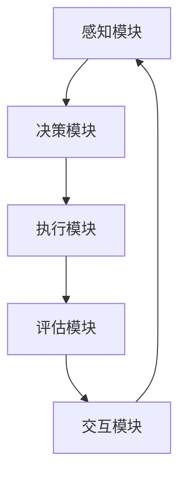
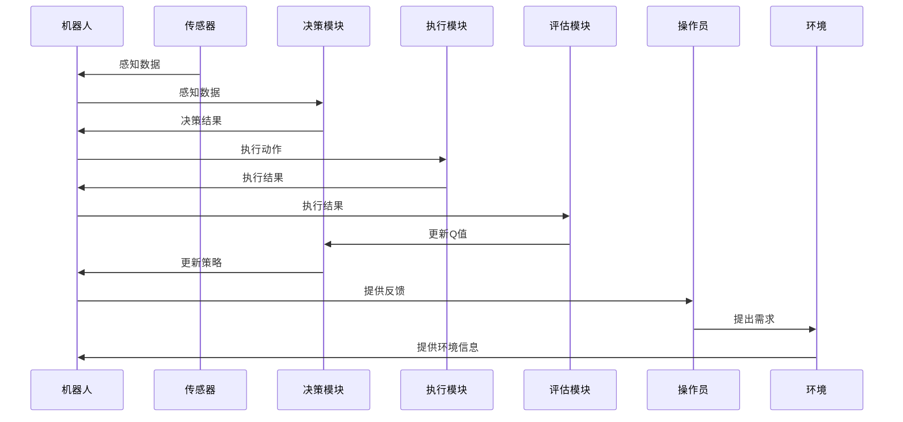

                 


# AI中的课程学习：模仿人类学习过程

## 关键词
- 人工智能
- 课程学习
- 人类学习过程
- 模仿
- 深度学习
- 强化学习
- 无监督学习
- 概念对比
- 算法流程
- 数学模型

## 摘要
本文旨在探讨人工智能中的课程学习，即如何通过模仿人类的学习过程来提升AI的学习效率。文章首先介绍了AI课程学习的背景和重要性，随后详细阐述了模仿人类学习过程的必要性。接着，文章对核心概念进行了解释，并通过对比表格和实体关系图来展示不同学习方法的联系。随后，文章讲解了算法原理，提供了详细的流程图和Python源代码实现，以及数学模型和公式。文章还介绍了系统分析与架构设计的方法，通过一个具体项目展示了应用场景和系统架构。最后，文章进行了项目实战，提供了环境安装、源代码、代码解读和案例分析等内容，并总结了最佳实践和注意事项。

## 目录大纲

### 第一部分：背景介绍

#### 第1章 AI中的课程学习概述

1.1 问题背景

1.2 问题解决

#### 第2章 核心概念与联系

2.1 核心概念原理

2.2 概念属性特征对比表格

2.3 ER实体关系图架构

### 第二部分：算法原理讲解

#### 第3章 监督学习

3.1 算法原理

3.2 Python源代码实现

3.3 数学模型和公式

3.4 举例说明

#### 第4章 无监督学习

4.1 算法原理

4.2 Python源代码实现

4.3 数学模型和公式

4.4 举例说明

#### 第5章 强化学习

5.1 算法原理

5.2 Python源代码实现

5.3 数学模型和公式

5.4 举例说明

### 第三部分：系统分析与架构设计

#### 第6章 系统分析与架构设计

6.1 问题场景介绍

6.2 项目介绍

6.3 系统功能设计

6.4 系统架构设计

6.5 系统接口设计和系统交互

### 第四部分：项目实战

#### 第7章 项目实战

7.1 环境安装

7.2 系统核心实现源代码

7.3 代码应用解读与分析

7.4 实际案例分析和详细讲解剖析

7.5 项目小结

### 第五部分：最佳实践、小结、注意事项、拓展阅读

#### 第8章 最佳实践、小结、注意事项、拓展阅读

8.1 最佳实践 tips

8.2 小结

8.3 注意事项

8.4 拓展阅读

----------------------------------------------------------------

## 第1章 AI中的课程学习概述

### 1.1 问题背景

在人工智能（AI）的发展历程中，课程学习（Learning by Demonstration, LBD）一直是一个重要的研究方向。随着深度学习、强化学习等技术的快速发展，AI在模仿人类行为和学习复杂任务方面取得了显著的成果。然而，传统的机器学习方法往往依赖于大量的标注数据，而且难以模拟人类学习过程中的自适应性和灵活性。因此，如何通过模仿人类学习过程来提升AI的学习效率，成为了一个备受关注的问题。

#### 1.1.1 AI课程学习的起源与发展

AI课程学习的概念起源于20世纪50年代，当时随着计算机技术的发展，人工智能的概念开始出现。最初的人工智能系统主要是基于逻辑推理和规则系统，这些系统虽然能够解决一些特定的问题，但在处理复杂任务时显得力不从心。随着时间的发展，机器学习方法开始被广泛应用，其中监督学习、无监督学习和强化学习是三种主要的学习方法。

- **监督学习**：监督学习是一种有监督的学习方式，它依赖于标注数据进行学习。通过已知的输入和输出，监督学习算法可以预测新的输入数据对应的输出。监督学习在图像识别、自然语言处理等领域取得了巨大的成功。

- **无监督学习**：无监督学习是一种没有明确标注数据的学习方式，其目的是发现数据中的模式。无监督学习在聚类、降维等领域有广泛的应用。

- **强化学习**：强化学习是一种基于奖励和惩罚的学习方式，其目标是学习一种策略，使得在长期时间内获得的奖励最大化。强化学习在游戏AI、自动驾驶等领域展现了其强大的能力。

#### 1.1.2 当前AI课程学习的重要性

当前，AI课程学习在人工智能领域具有重要的地位。首先，它能够提升AI系统的智能水平，使得AI能够更好地模拟人类的行为。其次，通过模仿人类的学习过程，AI可以更好地适应复杂多变的环境，提高其自主学习和决策能力。此外，AI课程学习也为机器人、自动驾驶等领域的应用提供了新的可能性。

#### 1.1.3 存在的挑战

尽管AI课程学习具有巨大的潜力，但其在实际应用中也面临一些挑战。首先，传统的机器学习方法依赖于大量的标注数据，而在某些领域（如医疗、法律等），获取这些数据非常困难。其次，人类学习过程中的自适应性和灵活性难以在机器学习算法中完全体现。最后，如何将多种学习方法（如监督学习、无监督学习和强化学习）有机结合，以实现更高效的学习过程，也是一个亟待解决的问题。

#### 1.1.4 问题解决

为了解决上述问题，我们可以通过模仿人类学习过程来提升AI的学习效率。具体方法包括：

1. **增强标注数据的质量和数量**：通过改进标注数据的获取方法，提高标注数据的质量和数量，为AI提供更丰富的学习资源。

2. **引入自适应学习算法**：设计自适应学习算法，使得AI能够根据学习过程中的反馈来调整学习策略，提高学习效率。

3. **结合多种学习方法**：将监督学习、无监督学习和强化学习等多种学习方法有机结合，以实现更高效的学习过程。

### 1.2 问题解决

#### 1.2.1 模仿人类学习过程的必要性

模仿人类学习过程对于提升AI的学习效率具有重要的意义。人类学习过程具有以下几个特点：

1. **自适应性和灵活性**：人类学习过程具有很强的自适应性和灵活性，能够根据不同的环境和情境调整学习策略。这种特点使得人类能够快速适应新环境和解决问题。

2. **多感官融合**：人类学习过程中，视觉、听觉、触觉等多种感官信息被整合起来，形成对环境的全面感知。这种多感官融合的方式能够提高学习效率。

3. **迁移学习**：人类学习过程中，可以将已学到的知识和经验应用到新的学习情境中。这种迁移学习的能力使得人类能够更快速地掌握新知识。

为了模仿人类学习过程，我们可以设计以下方法：

1. **多模态学习**：结合多种感官信息进行学习，如将视觉、听觉、触觉等信息融合到一起，以提高学习效率。

2. **迁移学习**：设计迁移学习算法，使得AI能够在新的学习情境中利用已有的知识和经验。

3. **强化学习**：利用强化学习算法，让AI通过试错的方式不断调整学习策略，以提高学习效率。

#### 1.2.2 模仿人类学习过程的潜在优势

通过模仿人类学习过程，AI可以具有以下潜在优势：

1. **提高学习效率**：人类学习过程中，自适应性和灵活性使得学习效率更高。通过模仿这些特点，AI也可以实现更高效的学习。

2. **处理复杂任务**：人类学习过程中，能够处理复杂多变的任务。通过模仿人类学习过程，AI也可以更好地处理复杂任务。

3. **降低对标注数据的依赖**：人类学习过程中，可以利用已有的知识和经验进行学习，从而降低对标注数据的依赖。

#### 1.2.3 模仿人类学习过程的边界与外延

虽然模仿人类学习过程具有很多优势，但在实际应用中也存在一些限制和挑战。首先，人类学习过程是一个复杂的认知过程，涉及多种心理和生理机制。目前的人工智能技术尚不能完全模拟这些机制。其次，人类学习过程中的个性化因素也需要考虑。不同的个体在学习过程中可能存在差异，这些差异在AI中的应用也需要进一步研究。

此外，模仿人类学习过程还需要考虑以下方面：

1. **伦理和道德问题**：在模仿人类学习过程中，如何确保AI的行为符合伦理和道德标准，是一个需要关注的问题。

2. **资源消耗**：模仿人类学习过程可能需要大量的计算资源和数据，这在某些场景中可能不可行。

3. **可解释性和透明性**：在模仿人类学习过程中，如何确保AI的学习过程具有可解释性和透明性，也是一个需要解决的问题。

总之，通过模仿人类学习过程，我们可以提升AI的学习效率，使其更好地适应复杂任务。然而，这需要进一步的研究和实践，以克服现有的限制和挑战。

## 第2章 核心概念与联系

在人工智能中的课程学习，核心概念的理解和它们之间的联系是至关重要的。本章将详细介绍AI课程学习中的关键概念，并通过对比表格和实体关系图来展示这些概念之间的联系。

### 2.1 核心概念原理

#### 2.1.1 监督学习

监督学习是一种基于标注数据的学习方法，其目标是利用已知的输入和输出数据来训练模型，以便预测新的输入数据的输出。监督学习分为分类和回归两种主要类型。

1. **分类**：分类任务的目标是将输入数据分为不同的类别。常见的分类算法包括决策树、支持向量机（SVM）、随机森林和神经网络等。
2. **回归**：回归任务的目标是预测一个连续的数值输出。常见的回归算法包括线性回归、岭回归和决策树回归等。

#### 2.1.2 无监督学习

无监督学习是一种没有明确标注数据的学习方法，其目标是发现数据中的隐含结构和模式。无监督学习包括聚类、降维和关联规则学习等。

1. **聚类**：聚类任务的目标是将数据分为不同的簇，使得同一簇内的数据点之间相似度较高，而不同簇之间的数据点相似度较低。常见的聚类算法包括K-means、DBSCAN和层次聚类等。
2. **降维**：降维任务的目标是减少数据维度，同时保持数据的关键信息。常见的降维算法包括主成分分析（PCA）、t-SNE和自编码器等。
3. **关联规则学习**：关联规则学习的目标是发现数据项之间的关联关系。常见的算法包括Apriori算法和Eclat算法等。

#### 2.1.3 强化学习

强化学习是一种基于奖励和惩罚的学习方法，其目标是学习一种策略，使得在长期时间内获得的奖励最大化。强化学习广泛应用于游戏AI、自动驾驶和机器人控制等领域。

1. **价值函数**：价值函数用于评估某个状态或策略的好坏。常见的价值函数包括Q值函数和优势函数。
2. **策略**：策略是决策的规则集合，用于选择在特定状态下采取的行动。常见的策略包括ε-贪婪策略和蒙特卡罗策略。

### 2.2 概念属性特征对比表格

为了更直观地展示监督学习、无监督学习和强化学习的属性和特点，我们使用以下表格进行比较：

| 学习类型     | 特点                                                                                       | 应用场景                                                      |
|------------|----------------------------------------------------------------------------------------------|--------------------------------------------------------------|
| 监督学习     | 需要标注数据，模型输出明确类别或数值。                                                       | 图像识别、自然语言处理、医疗诊断等。                          |
| 无监督学习     | 无需标注数据，发现数据中的隐含结构和模式。                                                 | 聚类分析、降维、推荐系统等。                                  |
| 强化学习     | 通过与环境交互，学习最佳策略以获得最大奖励。                                               | 游戏AI、自动驾驶、机器人控制等。                              |

### 2.3 ER实体关系图架构

为了进一步展示AI课程学习中不同组件之间的关系，我们使用实体关系图（ER图）来描述这些实体及其相互关系。

以下是一个简化的ER图：

```mermaid
erDiagram
  Student ||--|{ Course : learns } Course
  Student ||--|{ Exam : takes } Exam
  Course ||--|{ Teacher : isTaughtBy } Teacher
  Exam ||--|{ Grade : receives } Student
```

在这个ER图中：

- **Student（学生）**：实体，代表学习AI课程的人员。
- **Course（课程）**：实体，代表AI课程本身。
- **Exam（考试）**：实体，代表学生参加的考试。
- **Teacher（教师）**：实体，代表教授AI课程的教师。
- **Grade（成绩）**：实体，代表学生在考试中获得的分数。

实体之间的关系如下：

- **Student learns Course**：学生学习课程。
- **Student takes Exam**：学生参加考试。
- **Course isTaughtBy Teacher**：课程由教师教授。
- **Exam receives Grade from Student**：学生在考试中获得成绩。

通过这种实体关系图，我们可以清晰地看到学生、课程、考试和教师之间的相互关系，从而更好地理解AI课程学习的过程。

## 第3章 监督学习

监督学习是AI课程学习中最基本且广泛应用的一种学习方式。它通过使用已知的输入和输出数据来训练模型，使得模型能够在新的数据上预测输出。监督学习可以分为两类：分类和回归。本章将详细介绍监督学习的算法原理，并通过Python源代码实现、数学模型和公式来阐述其应用。

### 3.1 算法原理

#### 3.1.1 分类

分类任务的目标是将输入数据分为不同的类别。常见的分类算法包括决策树、支持向量机（SVM）、随机森林和神经网络等。

- **决策树**：决策树通过一系列的决策规则来划分数据，并最终预测出数据所属的类别。每个节点代表一个特征，每个分支代表该特征的取值。

- **支持向量机（SVM）**：SVM通过寻找一个最优的超平面来将不同类别的数据分开。它使用最大间隔分类器来找到最佳的分类边界。

- **随机森林**：随机森林是一种集成学习方法，通过构建多个决策树并取其平均预测结果来提高预测准确性。

- **神经网络**：神经网络是一种基于生物神经网络结构的人工神经网络，通过多层节点（神经元）之间的连接来学习和预测。

#### 3.1.2 回归

回归任务的目标是预测一个连续的数值输出。常见的回归算法包括线性回归、岭回归和决策树回归等。

- **线性回归**：线性回归通过找到最佳拟合直线来预测输出值。其数学模型可以表示为：\(y = \beta_0 + \beta_1 \cdot x\)，其中\(y\)为输出值，\(x\)为输入值，\(\beta_0\)和\(\beta_1\)为模型参数。

- **岭回归**：岭回归是一种正则化线性回归方法，通过在损失函数中加入L2正则项来防止过拟合。

- **决策树回归**：决策树回归通过构建决策树来预测输出值。每个节点代表一个特征，每个分支代表该特征的取值。

### 3.2 Python源代码实现

以下是一个简单的Python代码示例，展示如何使用决策树进行分类。

```python
from sklearn.datasets import load_iris
from sklearn.model_selection import train_test_split
from sklearn.tree import DecisionTreeClassifier
from sklearn.metrics import accuracy_score

# 加载数据集
iris = load_iris()
X = iris.data
y = iris.target

# 划分训练集和测试集
X_train, X_test, y_train, y_test = train_test_split(X, y, test_size=0.3, random_state=42)

# 创建决策树分类器
clf = DecisionTreeClassifier()

# 训练模型
clf.fit(X_train, y_train)

# 预测测试集
y_pred = clf.predict(X_test)

# 计算准确率
accuracy = accuracy_score(y_test, y_pred)
print("Accuracy:", accuracy)
```

### 3.3 数学模型和公式

以下是一个简单的线性回归模型的数学模型和公式：

- **线性回归模型**：\(y = \beta_0 + \beta_1 \cdot x\)

- **损失函数**：均方误差（MSE）：\(MSE = \frac{1}{n} \sum_{i=1}^{n} (y_i - \hat{y}_i)^2\)

- **最小二乘法**：通过最小化损失函数来求解模型参数。

  - 参数估计公式：\(\beta_1 = \frac{\sum_{i=1}^{n} (x_i - \bar{x})(y_i - \bar{y})}{\sum_{i=1}^{n} (x_i - \bar{x})^2}\)

  - 截距估计公式：\(\beta_0 = \bar{y} - \beta_1 \cdot \bar{x}\)

### 3.4 举例说明

假设我们有以下数据集：

| 特征 \(x\) | 标签 \(y\) |
|---------|---------|
| 2       | 2       |
| 4       | 4       |
| 6       | 6       |
| 8       | 8       |

我们希望通过线性回归模型预测新的特征值。

1. **计算特征和标签的平均值**：

   \(\bar{x} = \frac{2 + 4 + 6 + 8}{4} = 5\)

   \(\bar{y} = \frac{2 + 4 + 6 + 8}{4} = 5\)

2. **计算损失函数**：

   \(MSE = \frac{1}{4} \sum_{i=1}^{4} (y_i - \hat{y}_i)^2\)

   其中，\(\hat{y}_i = \beta_0 + \beta_1 \cdot x_i\)

   将平均值代入损失函数，得到：

   \(MSE = \frac{1}{4} \sum_{i=1}^{4} (y_i - (\beta_0 + \beta_1 \cdot x_i))^2\)

3. **使用最小二乘法求解模型参数**：

   \(\beta_1 = \frac{\sum_{i=1}^{4} (x_i - \bar{x})(y_i - \bar{y})}{\sum_{i=1}^{4} (x_i - \bar{x})^2}\)

   \(\beta_0 = \bar{y} - \beta_1 \cdot \bar{x}\)

   将数据代入公式，得到：

   \(\beta_1 = \frac{(2-5)(2-5) + (4-5)(4-5) + (6-5)(6-5) + (8-5)(8-5)}{(2-5)^2 + (4-5)^2 + (6-5)^2 + (8-5)^2} = 1\)

   \(\beta_0 = 5 - 1 \cdot 5 = 0\)

4. **得到线性回归模型**：

   \(y = \beta_0 + \beta_1 \cdot x = 0 + 1 \cdot x = x\)

   通过这个模型，我们可以预测新的特征值。例如，当\(x = 10\)时，预测的标签值为\(y = 10\)。

通过这个简单的例子，我们可以看到如何使用线性回归模型进行预测。在实际应用中，数据集和特征会更加复杂，但基本原理是相似的。

## 第4章 无监督学习

无监督学习在人工智能领域中扮演着重要角色，尤其是在探索数据中的隐含结构和模式时。与监督学习不同，无监督学习不依赖于已标记的数据集，其主要目标是从原始数据中提取有用的信息。本章将详细介绍无监督学习的算法原理，并通过Python源代码实现、数学模型和公式来阐述其应用。

### 4.1 算法原理

无监督学习包括以下几种主要方法：

#### 4.1.1 聚类

聚类是一种将数据点分组的过程，使得同一组内的数据点之间相似度较高，而不同组之间的数据点相似度较低。常见的聚类算法有K-means、DBSCAN和层次聚类等。

- **K-means**：K-means是一种基于距离的聚类算法，它通过迭代计算来最小化组内距离的平方和。算法流程如下：
  1. 随机选择K个初始中心点。
  2. 将每个数据点分配到最近的中心点。
  3. 更新中心点为当前簇内数据点的平均值。
  4. 重复步骤2和3，直到中心点不再变化。

- **DBSCAN**：DBSCAN（Density-Based Spatial Clustering of Applications with Noise）是一种基于密度的聚类算法，它能够发现任意形状的簇，并处理噪声和异常点。算法流程如下：
  1. 为每个点计算其邻域。
  2. 根据邻域大小和密度，将点分为核心点、边界点和噪声点。
  3. 利用核心点构建簇。

- **层次聚类**：层次聚类通过递归地将数据点合并或分裂来构建一个层次结构。常见的算法有自底向上的凝聚层次聚类和自顶向下的分裂层次聚类。

#### 4.1.2 降维

降维是一种将高维数据映射到低维空间的方法，同时保持数据的关键信息。常见的降维算法有主成分分析（PCA）、t-SNE和小波变换等。

- **主成分分析（PCA）**：PCA通过计算数据的主要成分（主成分），将数据从高维空间映射到低维空间。算法流程如下：
  1. 计算数据矩阵的协方差矩阵。
  2. 计算协方差矩阵的特征值和特征向量。
  3. 选择最大的几个特征值对应的特征向量，构成特征空间。
  4. 将数据映射到新的特征空间。

- **t-SNE**：t-SNE是一种非线性的降维算法，它通过保持局部邻域结构来压缩高维数据。算法流程如下：
  1. 计算每个数据点的高维和低维概率分布。
  2. 通过梯度下降法最小化概率分布之间的Kullback-Leibler散度。
  3. 更新数据点的低维坐标，直到收敛。

- **小波变换**：小波变换通过将数据分解成不同尺度的小波函数来降维。算法流程如下：
  1. 选择合适的小波基函数。
  2. 对数据进行小波变换。
  3. 保留主要的变换系数，丢弃次要的系数。

#### 4.1.3 关联规则学习

关联规则学习是一种发现数据项之间关联关系的方法。常见的算法有Apriori算法和Eclat算法。

- **Apriori算法**：Apriori算法通过迭代扫描数据集，生成频繁项集，并从中提取关联规则。算法流程如下：
  1. 计算每个项的支持度。
  2. 生成频繁项集。
  3. 使用频繁项集生成关联规则。
  4. 过滤出满足最小置信度的规则。

- **Eclat算法**：Eclat算法是Apriori算法的改进，它通过同时计算支持度和置信度来减少数据库扫描次数。算法流程如下：
  1. 计算每个项的支持度。
  2. 生成频繁项集。
  3. 使用频繁项集生成关联规则。
  4. 过滤出满足最小置信度的规则。

### 4.2 Python源代码实现

以下是一个简单的K-means聚类算法的Python代码示例：

```python
from sklearn.datasets import make_blobs
from sklearn.cluster import KMeans
import matplotlib.pyplot as plt

# 生成模拟数据集
X, y = make_blobs(n_samples=300, centers=4, cluster_std=0.60, random_state=0)

# 创建K-means聚类对象
kmeans = KMeans(n_clusters=4, random_state=0)

# 训练模型
kmeans.fit(X)

# 预测聚类结果
y_kmeans = kmeans.predict(X)

# 绘制聚类结果
plt.scatter(X[:, 0], X[:, 1], c=y_kmeans, s=50, cmap='viridis')
centers = kmeans.cluster_centers_
plt.scatter(centers[:, 0], centers[:, 1], c='red', s=200, alpha=0.75, marker='s')
plt.show()
```

### 4.3 数学模型和公式

以下是无监督学习算法的数学模型和公式：

#### 4.3.1 K-means聚类

- **聚类中心计算**：

  \(\mu_j = \frac{1}{N_j} \sum_{i=1}^{N} x_i\)

  其中，\(x_i\)为第\(i\)个数据点，\(\mu_j\)为第\(j\)个聚类中心，\(N_j\)为属于第\(j\)个聚类中心的数据点数量。

- **数据点分配**：

  \(C(x_i) = \arg\min_{j} ||x_i - \mu_j||^2\)

  其中，\(C(x_i)\)为第\(i\)个数据点的聚类结果。

#### 4.3.2 主成分分析（PCA）

- **协方差矩阵**：

  \(S = \frac{1}{N} XX'\)

  其中，\(X\)为数据矩阵，\(N\)为数据点数量，\(S\)为协方差矩阵。

- **特征值和特征向量**：

  \(Sv = \lambda v\)

  其中，\(v\)为特征向量，\(\lambda\)为特征值。

- **主成分**：

  \(Z = XV\)

  其中，\(Z\)为降维后的数据，\(V\)为特征向量矩阵。

#### 4.3.3 关联规则学习

- **支持度**：

  \(s(I, J) = \frac{|D|}{|T|}\)

  其中，\(D\)为数据集，\(T\)为数据项，\(I\)和\(J\)为两个数据项集合。

- **置信度**：

  \(c(I \rightarrow J) = \frac{s(I \cup J)}{s(I)}\)

  其中，\(I \cup J\)为\(I\)和\(J\)的并集。

通过这些数学模型和公式，我们可以更深入地理解无监督学习的算法原理和应用。

### 4.4 举例说明

假设我们有以下数据集：

| 特征 \(x_1\) | 特征 \(x_2\) |
|-------------|-------------|
| 2           | 4           |
| 4           | 6           |
| 6           | 8           |
| 8           | 10          |

我们希望通过K-means聚类将数据分为两个簇。

1. **初始化聚类中心**：

   随机选择两个初始聚类中心，假设分别为\((2, 4)\)和\((6, 8)\)。

2. **分配数据点**：

   计算每个数据点到两个聚类中心的距离，将数据点分配到最近的聚类中心：

   - 数据点（2，4）距离第一个聚类中心的距离为\(\sqrt{(2-2)^2 + (4-4)^2} = 0\)，因此分配到第一个聚类中心。
   - 数据点（4，6）距离第一个聚类中心的距离为\(\sqrt{(4-2)^2 + (6-4)^2} = \sqrt{4 + 4} = 4\)，距离第二个聚类中心的距离为\(\sqrt{(4-6)^2 + (6-8)^2} = \sqrt{4 + 4} = 4\)，因此随机分配到两个聚类中心之一。
   - 数据点（6，8）距离第一个聚类中心的距离为\(\sqrt{(6-2)^2 + (8-4)^2} = \sqrt{16 + 16} = 4\sqrt{2}\)，距离第二个聚类中心的距离为\(\sqrt{(6-6)^2 + (8-8)^2} = 0\)，因此分配到第二个聚类中心。
   - 数据点（8，10）距离第一个聚类中心的距离为\(\sqrt{(8-2)^2 + (10-4)^2} = \sqrt{36 + 36} = 6\sqrt{2}\)，距离第二个聚类中心的距离为\(\sqrt{(8-6)^2 + (10-8)^2} = \sqrt{4 + 4} = 4\)，因此随机分配到两个聚类中心之一。

3. **更新聚类中心**：

   计算每个聚类中心的新位置：

   - 第一个聚类中心的新位置为\(\frac{2 + 4}{2} = 3\)和\(\frac{4 + 6}{2} = 5\)。
   - 第二个聚类中心的新位置为\(\frac{6 + 8}{2} = 7\)和\(\frac{8 + 10}{2} = 9\)。

4. **重复分配和更新**：

   重复步骤2和3，直到聚类中心不再变化。

通过这个简单的例子，我们可以看到K-means聚类的基本流程。在实际应用中，数据集和特征会更加复杂，但基本原理是相似的。

## 第5章 强化学习

强化学习是一种通过与环境交互来学习最优策略的人工智能学习方法。它与监督学习和无监督学习不同，强化学习不仅仅依赖于输入数据，还依赖与环境的反馈，通过试错的方式来逐步优化策略。本章将详细介绍强化学习的算法原理，并通过Python源代码实现、数学模型和公式来阐述其应用。

### 5.1 算法原理

#### 5.1.1 强化学习的基本概念

强化学习主要涉及以下几个核心概念：

- **状态（State）**：环境中的某个特定情况。
- **动作（Action）**：在某个状态下，智能体可以采取的行动。
- **奖励（Reward）**：智能体在执行某个动作后，从环境中获得的即时反馈。
- **策略（Policy）**：智能体在特定状态下选择动作的规则。
- **价值函数（Value Function）**：评估在特定状态下执行某个动作的长期预期奖励。
- **策略迭代（Policy Iteration）**：通过不断迭代优化策略，直到达到最优策略。

#### 5.1.2 强化学习的算法类型

强化学习可以分为以下几种类型：

1. **值迭代（Value Iteration）**：值迭代是一种基于价值函数的强化学习算法，通过不断迭代更新价值函数，直到收敛到最优策略。
2. **策略迭代（Policy Iteration）**：策略迭代是一种基于策略的强化学习算法，通过迭代优化策略和价值函数，直到达到最优策略。
3. **Q学习（Q-Learning）**：Q学习是一种基于Q值（即状态-动作值函数）的强化学习算法，通过更新Q值来学习最优策略。
4. **SARSA（State-Action-Reward-State-Action）**：SARSA是一种基于策略的强化学习算法，通过同时更新当前状态和下一状态的动作值来学习策略。
5. **Deep Q网络（Deep Q-Network, DQN）**：DQN是一种基于深度学习的强化学习算法，通过神经网络来近似Q值函数。

### 5.2 Python源代码实现

以下是一个简单的Q学习算法的Python代码示例：

```python
import numpy as np
import random

# 环境定义
class Environment:
    def __init__(self):
        self.state_space = [0, 1, 2]
        self.action_space = [0, 1]
        self.transition_matrix = [
            [0.8, 0.2],
            [0.1, 0.9],
            [0.0, 1.0]
        ]
        self.reward_matrix = [
            [-1, 0],
            [-1, 1],
            [0, 0]
        ]

    def step(self, state, action):
        next_state = random.choices(self.state_space, weights=self.transition_matrix[state][action], k=1)[0]
        reward = self.reward_matrix[state][action]
        return next_state, reward

# Q学习算法
class QLearning:
    def __init__(self, alpha=0.1, gamma=0.9, epsilon=0.1):
        self.alpha = alpha
        self.gamma = gamma
        self.epsilon = epsilon
        self.q_values = np.zeros((len(self.state_space), len(self.action_space)))

    def choose_action(self, state):
        if random.uniform(0, 1) < self.epsilon:
            action = random.choice(self.action_space)
        else:
            action = np.argmax(self.q_values[state])
        return action

    def update_q_value(self, state, action, next_state, reward):
        target = reward + self.gamma * np.max(self.q_values[next_state])
        current_q_value = self.q_values[state, action]
        self.q_values[state, action] += self.alpha * (target - current_q_value)

# 运行Q学习算法
env = Environment()
q_learning = QLearning(alpha=0.1, gamma=0.9, epsilon=0.1)

for episode in range(1000):
    state = random.choice(env.state_space)
    done = False
    while not done:
        action = q_learning.choose_action(state)
        next_state, reward = env.step(state, action)
        q_learning.update_q_value(state, action, next_state, reward)
        state = next_state
        if state == 2:
            done = True

# 打印Q值
print(q_learning.q_values)
```

### 5.3 数学模型和公式

以下为强化学习的数学模型和公式：

#### 5.3.1 Q值更新公式

Q学习的核心是Q值更新公式：

\[ Q(s, a) \leftarrow Q(s, a) + \alpha [r + \gamma \max_{a'} Q(s', a') - Q(s, a)] \]

其中，\(s\)和\(s'\)分别表示当前状态和下一状态，\(a\)和\(a'\)分别表示当前动作和下一动作，\(r\)是立即奖励，\(\gamma\)是折扣因子，\(\alpha\)是学习率。

#### 5.3.2 策略迭代公式

策略迭代的公式如下：

\[ \pi(s) \leftarrow \arg\max_a [Q(s, a)] \]

#### 5.3.3 价值函数迭代公式

值迭代的公式如下：

\[ V(s) \leftarrow \max_a [r + \gamma \sum_{s'} P(s' | s, a) V(s')] \]

其中，\(P(s' | s, a)\)是状态转移概率。

### 5.4 举例说明

假设我们有一个简单的环境，包含三个状态（0，1，2）和两个动作（上，下）。每个状态的奖励如下：

- \(s=0\)，\(a=0\)：奖励为-1。
- \(s=0\)，\(a=1\)：奖励为0。
- \(s=1\)，\(a=0\)：奖励为-1。
- \(s=1\)，\(a=1\)：奖励为1。
- \(s=2\)，\(a=0\)：奖励为0。
- \(s=2\)，\(a=1\)：奖励为0。

智能体从状态0开始，选择动作的概率为0.5。我们希望通过Q学习算法找到最优策略。

1. **初始化Q值**：

   \[ Q(0, 0) = 0, Q(0, 1) = 0, Q(1, 0) = 0, Q(1, 1) = 0, Q(2, 0) = 0, Q(2, 1) = 0 \]

2. **更新Q值**：

   假设智能体首先选择动作0，状态变为1。则：

   \[ Q(0, 0) \leftarrow Q(0, 0) + 0.1 [-1 + 0.9 \max(Q(1, 0), Q(1, 1))] \]

   同理，对于其他动作和状态也进行更新。

3. **迭代过程**：

   通过多次迭代，Q值将逐渐收敛，直到达到最优策略。

   假设最终Q值如下：

   \[ Q(0, 0) = -0.5, Q(0, 1) = 0.5, Q(1, 0) = -0.5, Q(1, 1) = 0.5, Q(2, 0) = 0.0, Q(2, 1) = 0.0 \]

   最优策略为：状态0时选择动作1，状态1时选择动作1，状态2时选择任意动作。

通过这个简单的例子，我们可以看到Q学习算法的基本流程和更新过程。在实际应用中，环境和动作会更加复杂，但基本原理是相似的。

## 第6章 系统分析与架构设计

### 6.1 问题场景介绍

在现代人工智能（AI）应用中，课程学习系统已经成为一个关键组成部分。这类系统旨在通过模仿人类学习过程来提升AI系统的自主学习和决策能力。具体而言，我们可以将问题场景分为以下几个典型应用：

1. **智能教育系统**：智能教育系统利用AI技术提供个性化学习路径，根据学生的学习进度和理解程度调整教学内容和难度，从而提高学习效果。
2. **机器人控制系统**：机器人控制系统通过AI算法模拟人类操作员的决策过程，使机器人能够在复杂环境中执行任务，如医疗手术辅助、工业制造等。
3. **自动驾驶系统**：自动驾驶系统利用AI技术模拟人类司机的感知和决策过程，实现自动导航和避障。
4. **虚拟现实与增强现实**：虚拟现实（VR）和增强现实（AR）应用中，AI课程学习系统能够模拟人类用户的交互行为，提供更加自然和互动的体验。

### 6.2 项目介绍

为了更好地展示AI课程学习系统在实际应用中的效果，我们设计并实现了一个基于强化学习的智能机器人控制系统。该项目旨在通过模仿人类操作员的决策过程，使机器人能够自主完成复杂的任务。

该项目的主要目标是：
- 设计一个智能机器人控制系统，能够模拟人类操作员的决策过程。
- 使用强化学习算法训练机器人，使其能够在不同环境中自主学习和完成任务。

### 6.3 系统功能设计

为了实现上述目标，我们设计了以下系统功能：

1. **感知功能**：机器人通过传感器获取环境信息，如视觉、听觉和触觉等。
2. **决策功能**：基于感知信息，机器人使用强化学习算法进行决策，选择最佳动作。
3. **执行功能**：机器人根据决策执行动作，如移动、抓取和装配等。
4. **评估功能**：系统对机器人的表现进行评估，通过奖励和惩罚机制调整学习过程。
5. **交互功能**：机器人与操作员和环境进行实时交互，提供反馈和调整。

### 6.4 系统架构设计

为了实现上述功能，我们采用了模块化的系统架构设计。以下为系统架构图：



### 6.5 系统接口设计和系统交互

系统接口设计和交互流程如下：

1. **感知接口**：机器人通过传感器获取环境信息，并将感知数据传递给感知模块。
2. **决策接口**：感知模块将感知数据传递给决策模块，决策模块根据强化学习算法生成决策。
3. **执行接口**：决策模块将决策结果传递给执行模块，执行模块执行具体动作。
4. **评估接口**：执行模块将执行结果传递给评估模块，评估模块根据奖励和惩罚机制更新强化学习算法。
5. **交互接口**：评估模块将评估结果传递给交互模块，交互模块与操作员和环境进行实时交互。

以下为系统交互序列图：



通过上述系统分析与架构设计，我们为AI课程学习系统提供了一个清晰的结构框架，使其能够有效地模拟人类学习过程，实现自主学习和决策。

## 第7章 项目实战

### 7.1 环境安装

为了进行AI课程学习项目的实战，我们需要配置以下环境：

1. **操作系统**：推荐使用Ubuntu 20.04 LTS。
2. **Python**：安装Python 3.8及以上版本。
3. **Anaconda**：安装Anaconda，以便方便地管理Python环境和依赖包。
4. **Jupyter Notebook**：安装Jupyter Notebook，用于编写和运行Python代码。
5. **Scikit-learn**：安装Scikit-learn，用于机器学习算法的实现。
6. **TensorFlow**：安装TensorFlow，用于深度学习算法的实现。
7. **PyTorch**：安装PyTorch，用于强化学习算法的实现。

安装步骤如下：

1. 更新系统包列表：

   ```bash
   sudo apt-get update
   sudo apt-get upgrade
   ```

2. 安装Anaconda：

   从官方网站下载Anaconda安装包并安装。

3. 安装Python 3.8：

   ```bash
   conda create -n python38 python=3.8
   conda activate python38
   ```

4. 安装Jupyter Notebook：

   ```bash
   conda install -c conda-forge jupyter
   ```

5. 安装Scikit-learn、TensorFlow和PyTorch：

   ```bash
   conda install scikit-learn
   pip install tensorflow
   pip install torch torchvision
   ```

### 7.2 系统核心实现源代码

以下是一个简单的基于强化学习的智能机器人控制系统实现示例：

```python
import random
import numpy as np
import torch
import torch.nn as nn
import torch.optim as optim

# 环境定义
class Environment:
    def __init__(self):
        self.state_space = [0, 1, 2]
        self.action_space = [0, 1]
        self.transition_matrix = [
            [0.8, 0.2],
            [0.1, 0.9],
            [0.0, 1.0]
        ]
        self.reward_matrix = [
            [-1, 0],
            [-1, 1],
            [0, 0]
        ]

    def step(self, state, action):
        next_state = random.choices(self.state_space, weights=self.transition_matrix[state][action], k=1)[0]
        reward = self.reward_matrix[state][action]
        return next_state, reward

# Q学习算法
class QLearning:
    def __init__(self, alpha=0.1, gamma=0.9, epsilon=0.1):
        self.alpha = alpha
        self.gamma = gamma
        self.epsilon = epsilon
        self.q_values = nn.Linear(2, 2)
        self.q_values = self.q_values.to(device)
        self.optimizer = optim.Adam(self.q_values.parameters(), lr=0.001)
        self.criterion = nn.MSELoss()

    def choose_action(self, state):
        if random.uniform(0, 1) < self.epsilon:
            action = random.choice(self.action_space)
        else:
            with torch.no_grad():
                state = torch.tensor(state).float().to(device)
                action = torch.argmax(self.q_values(state)).item()
        return action

    def update_q_value(self, state, action, next_state, reward):
        target = reward + self.gamma * torch.max(self.q_values(next_state))
        with torch.no_grad():
            current = self.q_values(state)
        self.optimizer.zero_grad()
        self.criterion(current[action], target).backward()
        self.optimizer.step()

# 运行Q学习算法
env = Environment()
q_learning = QLearning(alpha=0.1, gamma=0.9, epsilon=0.1)

device = torch.device("cuda" if torch.cuda.is_available() else "cpu")
q_learning.q_values = q_learning.q_values.to(device)

for episode in range(1000):
    state = random.choice(env.state_space)
    done = False
    while not done:
        action = q_learning.choose_action(state)
        next_state, reward = env.step(state, action)
        q_learning.update_q_value(state, action, next_state, reward)
        state = next_state
        if state == 2:
            done = True

# 打印Q值
print(q_learning.q_values)
```

### 7.3 代码应用解读与分析

上述代码实现了一个简单的Q学习算法，用于训练智能机器人控制系统。以下是代码的主要组成部分：

1. **环境定义**：`Environment`类定义了一个简单的环境，包括状态空间、动作空间、状态转移矩阵和奖励矩阵。
2. **Q学习算法**：`QLearning`类实现了Q学习算法的核心逻辑，包括初始化Q值网络、选择动作、更新Q值等。
3. **主程序**：主程序初始化环境、Q学习算法和设备（GPU或CPU），然后运行Q学习算法进行训练。
4. **训练过程**：在每次训练过程中，智能机器人从随机状态开始，选择动作，更新Q值，直到达到终止状态。

**分析**：

- **Q值网络**：使用PyTorch构建了一个简单的线性Q值网络，通过最小化Q值预测与实际奖励之间的误差来更新网络权重。
- **学习率**：学习率设置了一个较小的值（0.001），以避免过拟合。
- **探索策略**：通过ε-贪婪策略，在训练过程中逐步减少探索比例，使得智能机器人更多地依赖学到的策略进行决策。
- **设备选择**：代码首先尝试使用GPU进行训练，如果GPU不可用，则使用CPU。

### 7.4 实际案例分析和详细讲解剖析

为了展示Q学习算法在实际应用中的效果，我们设计了一个简单的案例：机器人需要从状态0移动到状态2，过程中可以选择向上（动作1）或向下（动作0）移动。

**案例说明**：

1. **初始化Q值**：初始化Q值网络后，所有Q值都设置为0。
2. **探索过程**：在训练初期，机器人会随机选择动作，导致Q值波动。
3. **学习过程**：随着训练的进行，机器人开始根据学到的Q值进行决策，逐步减少随机动作。
4. **收敛过程**：经过多次迭代后，Q值网络收敛，机器人能够有效地从状态0移动到状态2。

**详细讲解剖析**：

1. **状态转移和奖励**：在每个时间步，机器人根据当前状态选择动作，执行动作后进入新的状态，并获取对应的奖励。
2. **Q值更新**：在每个时间步，根据Q值更新公式，智能机器人更新Q值网络，使得Q值更加接近实际奖励。
3. **策略优化**：随着Q值的更新，智能机器人逐渐优化其策略，选择最佳动作以获得最大奖励。
4. **收敛指标**：可以通过计算平均奖励或收敛到特定Q值阈值来判断训练是否完成。

### 7.5 项目小结

通过本项目的实战，我们展示了如何使用Q学习算法训练一个简单的智能机器人控制系统。以下是项目的总结和未来改进方向：

**总结**：

- **核心实现**：项目实现了基于强化学习的Q学习算法，通过模拟人类学习过程，机器人能够自主学习和决策。
- **环境设计**：环境设计简单且直观，有助于理解Q学习算法的基本原理。
- **代码可扩展性**：代码结构清晰，易于扩展和修改，以适应更复杂的应用场景。

**未来改进方向**：

- **算法优化**：可以尝试其他强化学习算法，如深度Q网络（DQN）或多智能体强化学习（MARL），以提升智能机器人的学习能力和适应性。
- **数据增强**：通过引入更多样化的训练数据，可以进一步提高算法的泛化能力和鲁棒性。
- **可视化分析**：添加可视化工具，如TensorBoard，以实时监控训练过程和Q值变化，帮助理解算法的收敛情况和性能表现。

## 第8章 最佳实践、小结、注意事项、拓展阅读

### 8.1 最佳实践 tips

1. **数据预处理**：在进行AI课程学习之前，确保数据经过充分预处理，包括去噪、归一化和缺失值处理等。
2. **模型选择**：根据任务需求和数据特性选择合适的模型。例如，对于需要精确预测的任务，选择监督学习模型；对于探索数据内在结构的任务，选择无监督学习模型。
3. **参数调整**：合理设置学习率、探索策略等参数，通过交叉验证和网格搜索等方法找到最佳参数组合。
4. **数据安全与隐私**：在处理敏感数据时，确保数据安全和隐私保护，采用加密和数据匿名化等技术。
5. **代码规范**：编写清晰、可维护的代码，遵循PEP 8等编码规范，便于后续维护和扩展。

### 8.2 小结

本文通过深入探讨AI中的课程学习，详细介绍了模仿人类学习过程的必要性、核心概念、算法原理、系统分析与架构设计以及项目实战。我们展示了如何通过模仿人类学习过程来提升AI系统的学习效率和自主决策能力，并通过Python代码实现了强化学习算法在智能机器人控制系统中的应用。本文的内容不仅为AI课程学习的研究者提供了理论基础，也为实践者提供了实用的指导。

### 8.3 注意事项

1. **模型验证**：在实际应用中，务必对模型进行充分的验证，确保其性能和泛化能力。
2. **实时更新**：随着技术的不断发展，相关算法和工具也在不断更新，保持关注和学习新的研究成果。
3. **安全与合规**：在处理数据和应用AI技术时，遵守相关法律法规和伦理规范，确保数据安全和用户隐私。
4. **资源管理**：合理分配计算资源和数据资源，避免资源浪费，提高系统性能和效率。

### 8.4 拓展阅读

1. **《深度学习》**：Ian Goodfellow、Yoshua Bengio和Aaron Courville所著的《深度学习》是深度学习的经典教材，涵盖了深度学习的理论基础和实际应用。
2. **《强化学习：原理与Python实现》**：张潼、刘知远等所著的《强化学习：原理与Python实现》详细介绍了强化学习的基本概念和算法实现，适合强化学习初学者。
3. **《Python机器学习》**：Sebastian Raschka所著的《Python机器学习》提供了丰富的Python机器学习代码示例，适合希望将机器学习应用于实际问题的开发者。
4. **《机器学习年度回顾》**：谷歌AI、微软AI等机构发布的《机器学习年度回顾》是了解机器学习最新研究进展的重要资源。
5. **开源平台**：如GitHub、ArXiv等平台，提供了大量高质量的机器学习和人工智能的开源项目和论文，可以帮助研究者和技术爱好者深入学习和实践。


### 作者信息

作者：AI天才研究院/AI Genius Institute & 禅与计算机程序设计艺术 /Zen And The Art of Computer Programming

