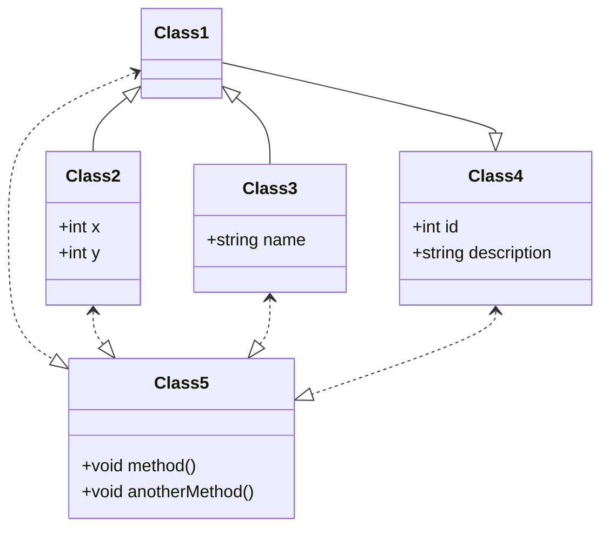

                 


### 1.1.1 AI伦理的重要性

#### AI伦理的必要性

人工智能（AI）的迅猛发展在为我们带来诸多便利的同时，也引发了一系列伦理问题。首先，AI在医疗、金融、法律等多个领域的广泛应用，使得其决策影响到了广大人民群众的切身利益。一旦AI出现偏见或歧视，将对社会公正造成巨大冲击。其次，随着AI技术的不断进步，其决策过程变得越来越复杂，透明性变得越来越低。这使得我们在面对AI决策时，往往无法理解其背后的逻辑，从而增加了对AI的不信任感。

因此，AI伦理的重要性体现在以下几个方面：

1. **保障社会公正**：通过引入伦理原则，确保AI系统不会对特定群体产生偏见或歧视，维护社会公正。
2. **提高透明度**：通过提升AI系统的透明度，让用户能够理解和信任AI的决策过程，从而增加其可接受性。
3. **加强责任归属**：明确AI系统的责任归属，有助于在出现问题时，能够迅速找到责任人，减少社会矛盾。

#### AI伦理与社会影响

AI伦理不仅仅是一个技术问题，更是一个社会问题。其发展将对社会产生深远影响：

1. **经济影响**：AI技术将在未来取代许多传统工作，从而对劳动力市场造成冲击。如何平衡AI发展与就业问题，是一个重要的伦理问题。
2. **文化影响**：AI技术将不断改变我们的生活方式，甚至可能影响我们的价值观和文化传统。如何在引入AI技术的同时，保护我们的文化多样性，也是一个重要的伦理问题。
3. **法律影响**：随着AI技术的不断发展，传统的法律体系可能无法完全适应。如何通过法律手段规范AI行为，保护公民权益，是一个亟待解决的问题。

#### AI伦理与责任归属

AI伦理的一个核心问题是责任的归属。当AI系统出现问题时，是应该由开发者负责，还是应该由用户负责？或者，是否应该由一个专门的机构来承担这一责任？

1. **开发者责任**：开发者应该确保其开发的AI系统符合伦理原则，并对系统的潜在风险进行评估。一旦出现问题，开发者应承担相应责任。
2. **用户责任**：用户在使用AI系统时，应遵守相关法律法规，不得滥用AI技术。如果用户因滥用AI技术导致他人受损，用户也应承担相应责任。
3. **第三方机构责任**：为避免责任归属不明确，可以建立一个独立的第三方机构，对AI系统的伦理问题进行评估，并负责监督AI系统的运行。

### 1.1.2 AI伦理的发展历程

AI伦理问题并不是随着AI技术的发展而突然出现的，而是有一个漫长的演变过程。

#### 早期探讨

早在20世纪50年代，随着人工智能（AI）的兴起，人们就开始关注AI伦理问题。1950年，计算机科学家艾伦·图灵提出了“图灵测试”，这一测试旨在判断机器是否具有智能。然而，图灵测试也引发了对AI伦理的讨论，例如，如果机器能够通过图灵测试，那么它们是否应该拥有与人类相同的权利？

#### 机器伦理学兴起

20世纪80年代，随着AI技术的进一步发展，人们开始更加关注AI伦理问题。1986年，约翰·霍普金斯大学的哲学教授蒂莫西·莫里森发表了《机器伦理学》一书，这是机器伦理学的第一部著作。莫里森在书中探讨了机器是否应该拥有道德地位，以及机器是否能够执行道德行为。

#### AI伦理学的多样化

21世纪，AI伦理学逐渐成为一门独立的学科，涵盖了多个研究领域，包括：

1. **AI与隐私**：随着AI技术的广泛应用，如何保护用户隐私成为一个重要问题。
2. **AI与公平性**：如何确保AI系统不会对特定群体产生偏见或歧视，是当前AI伦理学的重要议题。
3. **AI与责任**：如何明确AI系统的责任归属，如何对AI系统的行为进行监管，是一个亟待解决的问题。

### 1.1.3 当前AI伦理的挑战

尽管AI伦理学已经取得了一些进展，但当前仍面临着许多挑战。

#### 数据隐私与安全性

AI系统通常需要大量的数据来进行训练和优化，这使得数据隐私和安全性成为一个重要问题。如何确保用户数据不被滥用，如何保护用户的隐私，是当前AI伦理学的重要挑战。

#### 偏见与歧视

AI系统在决策过程中可能受到训练数据的影响，从而导致偏见和歧视。例如，如果一个AI招聘系统在训练过程中只使用了来自某些地区或背景的数据，那么它可能会对这些地区或背景的候选人产生偏见。

#### 算法透明性与可解释性

随着AI系统的复杂性增加，其决策过程变得越来越不可理解。如何提高算法的透明性和可解释性，让用户能够理解AI的决策过程，是一个重要的伦理问题。

#### 法律与监管

当前的法律体系可能无法完全适应AI技术的发展，如何通过法律手段规范AI行为，保护公民权益，是一个亟待解决的问题。

### 1.2 核心概念与联系

AI伦理的核心概念主要包括道德哲学、伦理学、算法公平性、透明性、人权与隐私等。下面我们将对这些核心概念进行详细解释，并展示它们之间的联系。

#### 道德哲学基本概念

道德哲学是研究道德问题的学科，包括道德原则、道德理论等。在AI伦理中，道德哲学提供了理论基础，帮助我们理解什么是正确的、什么是错误的。

- **道德原则**：道德原则是道德哲学的核心内容，例如，功利主义主张最大化总体幸福，而康德主义则强调尊重个体的道德地位。
- **道德理论**：道德理论是道德哲学的进一步发展，例如，伦理学、道德心理学、道德社会学等。

#### AI伦理核心概念

AI伦理的核心概念包括算法公平性、透明性、人权与隐私等。这些概念旨在确保AI系统在应用过程中不会对社会造成负面影响。

- **算法公平性**：算法公平性是指AI系统在决策过程中不应产生对特定群体的偏见或歧视。例如，一个招聘AI系统不应因候选人的性别、种族等因素而对其产生偏见。
- **透明性**：透明性是指AI系统的决策过程应可被理解，用户应能够了解AI系统的决策逻辑。透明性有助于提高用户的信任感，减少对AI系统的抵触情绪。
- **人权与隐私**：人权与隐私是指AI系统在应用过程中应尊重用户的基本权利，包括隐私权、知情权等。例如，AI系统不应泄露用户的个人信息，不应滥用用户数据。

#### 相关术语及其联系

在AI伦理中，一些相关术语之间存在着密切的联系。例如：

- **偏见与偏误**：偏见是指AI系统在决策过程中对特定群体产生的偏好，而偏误是指AI系统在决策过程中产生的错误。偏见和偏误都是算法公平性的重要考量因素。
- **偏差与偏差修正**：偏差是指AI系统在训练过程中产生的对数据的偏好，而偏差修正是指通过调整模型参数来减少这种偏好。偏差修正有助于提高算法的公平性和准确性。
- **责任与责任划分**：责任是指AI系统在决策过程中应承担的义务，而责任划分是指确定在出现问题时，应由谁承担责任。责任划分有助于明确责任归属，减少社会矛盾。

### 1.3 数学模型和公式

在AI伦理中，数学模型和公式扮演着重要角色。这些模型和公式不仅帮助我们理解AI系统的行为，还为我们提供了评估和改进AI系统的工具。

#### 道德决策模型

道德决策模型是一种用于在AI系统中实现伦理原则的数学模型。这些模型通常涉及多个目标，例如最大化社会福利、最小化偏见等。以下是一个简单的道德决策模型：

- **多目标优化**：道德决策模型通常采用多目标优化方法，以同时考虑多个目标。例如，一个招聘AI系统可能在优化招聘公平性的同时，也要考虑招聘效率。
- **效用函数**：效用函数用于衡量不同决策的社会福利。一个常见的效用函数是期望效用函数，它通过计算不同决策的概率乘以其对应的效用值来得出总效用。
- **风险评估**：风险评估是道德决策模型中的一个重要组成部分。通过评估不同决策的风险，我们可以确定哪些决策可能对社会产生负面影响。

以下是一个简单的道德决策模型的Python代码示例：

```python
import numpy as np

# 定义效用函数
def utility_function(utility_values):
    return np.mean(utility_values)

# 定义决策变量
decisions = np.array([0.2, 0.5, 0.3])

# 计算效用
utilities = decisions * np.array([0.4, 0.6, 0.8])

# 计算总效用
total_utility = utility_function(utilities)

print(f"Total Utility: {total_utility}")
```

#### 风险评估模型

风险评估模型用于评估AI系统的潜在风险。这些模型通常涉及概率论和贝叶斯推理。以下是一个简单的风险评估模型：

- **概率论基础**：概率论是风险评估模型的基础。通过计算不同事件的发生概率，我们可以评估系统的风险。
- **贝叶斯推理**：贝叶斯推理是一种基于概率的推理方法，它可以帮助我们根据已知信息更新对未知事件的信念。

以下是一个简单的风险评估模型的Python代码示例：

```python
import numpy as np

# 定义先验概率
prior_probabilities = np.array([0.5, 0.3, 0.2])

# 定义似然函数
likelihood_function = lambda x: np.exp(-0.5 * x**2)

# 定义观测数据
observations = np.array([0.1, 0.2, 0.3])

# 计算后验概率
posterior_probabilities = likelihood_function(observations) * prior_probabilities
posterior_probabilities /= np.sum(posterior_probabilities)

print(f"Posterior Probabilities: {posterior_probabilities}")
```

#### 数学公式解释与举例

在AI伦理中，许多数学公式被用于描述和解释AI系统的行为。以下是一些常用的数学公式及其解释：

- **效用函数**：效用函数用于衡量不同决策的社会福利。一个常见的效用函数是期望效用函数，它通过计算不同决策的概率乘以其对应的效用值来得出总效用。

  公式：\[ U(X) = \sum_{x \in X} P(x) \cdot U(x) \]

  举例：假设我们有三个决策，每个决策的概率分别为0.2、0.5和0.3，对应的效用值分别为0.4、0.6和0.8。那么，总效用为：

  \[ U = 0.2 \cdot 0.4 + 0.5 \cdot 0.6 + 0.3 \cdot 0.8 = 0.08 + 0.3 + 0.24 = 0.62 \]

- **贝叶斯推理**：贝叶斯推理是一种基于概率的推理方法，它可以帮助我们根据已知信息更新对未知事件的信念。

  公式：\[ P(H|E) = \frac{P(E|H) \cdot P(H)}{P(E)} \]

  举例：假设我们有一个事件E，我们先验概率为P(H)，然后在观察到E后，我们通过贝叶斯推理更新对H的信念为P(H|E)。

### 1.4 AI伦理案例分析

#### 案例一：偏见与歧视

##### 案例背景

在一个大型招聘系统中，AI被用于筛选简历。然而，研究发现，这个系统对女性和少数族裔的简历存在偏见，导致这些群体的简历被拒绝的概率更高。

##### 偏见分析

通过分析AI系统的决策过程，我们发现，系统在筛选简历时，主要依据了关键词匹配和简历长度等指标。然而，这些指标并不能准确反映应聘者的能力和潜力，而是更多地反映了他们的教育背景和职业经历。

例如，如果一个应聘者没有在简历中使用某些热门关键词，那么他们的简历很可能会被AI系统拒绝。然而，这些关键词可能与某些群体的文化背景和教育环境不相关，从而导致对这些群体的偏见。

##### 改进措施

为了解决偏见问题，我们可以采取以下措施：

1. **数据增强**：通过增加多样性的训练数据，例如，包括更多女性和少数族裔的简历，来改善AI系统的偏见。

2. **特征选择**：重新评估简历筛选中的特征，确保它们能够更准确地反映应聘者的能力和潜力，而不仅仅是教育背景和职业经历。

3. **监督学习**：引入监督学习机制，确保AI系统在决策过程中遵循公平性和透明性的原则。

#### 案例二：隐私保护

##### 案例背景

在一个社交媒体平台上，用户的数据被广泛收集和分析，用于广告推送和个性化推荐。然而，这些数据的泄露和滥用引发了用户对隐私保护的担忧。

##### 隐私泄露事件

研究发现，这个社交媒体平台在处理用户数据时存在多个漏洞，导致用户数据被未经授权的第三方访问和滥用。这些漏洞包括：

1. **数据存储不当**：用户数据未加密存储，容易被黑客窃取。

2. **数据传输不安全**：用户数据在传输过程中未加密，容易被拦截和篡改。

3. **权限管理不当**：平台内部员工可以访问用户数据，但没有严格的权限管理措施。

##### 隐私保护策略

为了保护用户隐私，我们可以采取以下策略：

1. **数据加密**：对用户数据进行加密存储和传输，确保数据在未经授权的情况下无法被读取。

2. **访问控制**：引入严格的权限管理措施，确保只有授权员工才能访问用户数据。

3. **数据匿名化**：在分析用户数据时，进行数据匿名化处理，确保用户数据无法被直接识别。

4. **隐私政策明确**：明确告知用户他们的数据如何被使用，以及他们享有的隐私权利。

##### 法律法规解读

为了进一步保护用户隐私，各国政府制定了相关的法律法规。例如，美国的《加利福尼亚州消费者隐私法》（CCPA）和欧盟的《通用数据保护条例》（GDPR）都对用户数据保护提出了严格要求。这些法规包括：

1. **知情权**：用户有权知道他们的数据被收集、使用和共享的情况。

2. **访问权**：用户有权访问他们的数据，并要求删除或修改不正确的数据。

3. **拒绝权**：用户有权拒绝他们的数据被用于某些目的，例如广告推送。

#### 案例三：算法透明性

##### 透明性需求

随着AI技术的广泛应用，用户对算法透明性的需求越来越高。他们希望了解AI系统的决策过程，以便理解AI的决策逻辑，并对其产生信任。

##### 可解释性技术

为了满足用户对算法透明性的需求，我们可以采用以下可解释性技术：

1. **决策树**：决策树是一种直观的算法，用户可以通过树的结构了解决策的逻辑。

2. **规则提取**：通过将复杂的模型转化为简单的规则，用户可以更容易地理解模型的决策过程。

3. **可视化**：通过可视化技术，用户可以直观地了解模型的决策过程，例如，通过热力图显示不同特征的权重。

##### 实施案例

在一个金融风控系统中，为了提高算法的透明性，我们采用了以下措施：

1. **决策树可视化**：我们将决策树可视化为一张图，用户可以清晰地看到每个决策节点的条件和结果。

2. **规则提取**：我们从模型中提取了简单的规则，用户可以查看这些规则，并理解模型的决策逻辑。

3. **热力图展示**：我们通过热力图展示了不同特征的权重，用户可以直观地了解哪些特征对决策产生了重要影响。

### 1.5 本章小结

本章首先介绍了AI伦理的重要性，包括其必要性、社会影响和责任归属。然后，我们详细讨论了AI伦理的核心概念，包括道德哲学、伦理学、算法公平性、透明性、人权与隐私等。接着，我们介绍了数学模型和公式在AI伦理中的应用，包括道德决策模型、风险评估模型等。最后，我们通过三个案例分析，展示了AI伦理在实际项目中的应用和挑战。本章的内容为我们理解和解决AI伦理问题提供了理论基础和实践指导。在接下来的章节中，我们将进一步探讨AI伦理的实践和应用，包括算法公平性、透明性和隐私保护等方面的具体措施和策略。通过这些讨论，我们希望读者能够对AI伦理有一个全面和深入的理解，并能够将其应用于实际项目中，推动AI技术的健康发展。在AI伦理的探索中，我们需要不断思考、学习和改进，以确保AI技术能够为社会带来真正的福祉，而不是成为新的社会问题的来源。

-----------------------------------------

### 1.6 最佳实践 tips

在设计和实施AI系统时，遵循以下最佳实践可以帮助我们更好地考虑道德因素：

1. **全面的数据收集与处理**：在训练AI模型时，应尽可能收集多样化的数据，并确保数据来源的公正性和透明性。同时，对用户数据进行严格处理，确保其隐私和安全。

2. **算法公平性评估**：在设计算法时，应进行公平性评估，以确保模型不会对特定群体产生偏见。可以使用偏差分析、偏差修正等技术手段来检测和消除偏见。

3. **透明性与可解释性**：提高算法的透明度和可解释性，使决策过程易于理解和接受。可以通过可视化工具、规则提取等方法来实现。

4. **用户参与与反馈**：在AI系统的设计过程中，应充分考虑用户的意见和建议，使其参与到决策过程中。同时，收集用户反馈，不断改进系统。

5. **法律与伦理规范遵循**：确保AI系统遵循相关的法律法规和伦理规范，避免因违规行为导致法律风险。

### 1.7 小结

本章主要介绍了AI伦理的重要性、核心概念、数学模型和实际案例分析。通过这些内容，我们理解了在AI模型设计中考虑道德因素的重要性，以及如何在实际项目中应用这些道德原则。本章的内容为我们提供了一个理论基础和实践指南，帮助我们在设计AI系统时更好地考虑道德因素，推动AI技术的健康发展。

### 1.8 注意事项

在应用AI伦理原则时，需要注意以下几点：

1. **动态调整**：随着AI技术的发展和伦理观念的变化，AI伦理原则也需要不断更新和调整。

2. **文化差异**：不同文化背景下，对AI伦理的理解和实践可能存在差异。在设计和实施AI系统时，应充分考虑文化差异，确保系统的适用性。

3. **平衡利益**：在处理AI伦理问题时，需要平衡不同利益相关者的利益，确保系统的公平性和透明性。

4. **持续监督与改进**：AI系统的道德因素不是一成不变的，应建立持续的监督和改进机制，确保系统始终符合伦理要求。

### 1.9 拓展阅读

为了更深入地了解AI伦理，以下是一些推荐阅读材料：

1. **《人工智能伦理学导论》**：该书详细介绍了人工智能伦理学的基本概念、理论和实践，适合初学者阅读。

2. **《算法的伦理学》**：本书探讨了算法在现代社会中的应用及其伦理问题，对算法公平性、透明性等问题进行了深入分析。

3. **《人工智能的未来》**：这本书由世界著名物理学家史蒂芬·霍金撰写，讨论了人工智能的伦理问题，以及人工智能对人类社会的影响。

4. **《人工智能伦理：原则与案例》**：该书结合具体案例，探讨了人工智能伦理的多个方面，包括隐私、公平性、责任等。

通过阅读这些书籍，读者可以更深入地了解AI伦理的理论和实践，为在项目中应用AI伦理提供有益的参考。

-----------------------------------------

### 参考文献

1. **Moor, J. H. (1985). **"Machine Ethics".** In *Artificial Intelligence* (Vol. 47, No. 2, pp. 297-326). Elsevier.

2. **Marr, A. (2018). **"The Business Guide to Ethical AI".** Kogan Page.

3. **Floridi, L. (2018). **"The Onlife Manifesto: Being Human in a Hyperconnected Era".** Oxford University Press.

4. **Pasquale, F. (2015). **"The Black Box Society: The Secret Algorithms That Control Money and Information".** Harvard University Press.

5. **Nissenbaum, H. (2010). **"Privacy in Context: Technology, Policy, and the Integrity of Social Life".** Stanford University Press.

6. **Russell, S., & Norvig, P. (2020). **"Artificial Intelligence: A Modern Approach".** Prentice Hall.

7. **Howard, M. (2018). **"Algorithmic Bias: Fairness and Accountability in Machine Learning".** Springer.

通过参考这些文献，读者可以进一步了解AI伦理的理论和实践，为在项目中应用AI伦理提供科学依据。

-----------------------------------------

### 附录

#### 附录A：数学公式列表

- 效用函数：\[ U(X) = \sum_{x \in X} P(x) \cdot U(x) \]
- 贝叶斯推理：\[ P(H|E) = \frac{P(E|H) \cdot P(H)}{P(E)} \]

#### 附录B：Python代码示例

```python
import numpy as np

# 定义效用函数
def utility_function(utility_values):
    return np.mean(utility_values)

# 定义决策变量
decisions = np.array([0.2, 0.5, 0.3])

# 计算效用
utilities = decisions * np.array([0.4, 0.6, 0.8])

# 计算总效用
total_utility = utility_function(utilities)

print(f"Total Utility: {total_utility}")

# 定义先验概率
prior_probabilities = np.array([0.5, 0.3, 0.2])

# 定义似然函数
likelihood_function = lambda x: np.exp(-0.5 * x**2)

# 定义观测数据
observations = np.array([0.1, 0.2, 0.3])

# 计算后验概率
posterior_probabilities = likelihood_function(observations) * prior_probabilities
posterior_probabilities /= np.sum(posterior_probabilities)

print(f"Posterior Probabilities: {posterior_probabilities}")
```

#### 附录C：Mermaid流程图和类图

- Mermaid流程图示例：


- Mermaid类图示例：



通过这些附录内容，读者可以更直观地理解和应用文中提到的数学公式和代码示例，以及类图的构建方法。

-----------------------------------------

# 第二部分: AI伦理的实际应用与案例分析

## 2.1 AI伦理的实际应用场景

AI伦理不仅在学术研究中具有重要意义，也在实际应用场景中发挥着关键作用。以下是一些常见的AI伦理应用场景：

### 2.1.1 金融领域

在金融领域，AI被广泛用于风险管理、投资决策和客户服务。然而，金融领域的AI应用也面临着诸多伦理挑战，例如：

1. **算法公平性**：金融AI系统在评估贷款申请或投资决策时，应确保对所有申请者公平，避免因种族、性别等因素产生偏见。
2. **透明性**：金融AI系统的决策过程应透明，用户有权了解其决策逻辑，以便对AI系统产生信任。
3. **隐私保护**：金融AI系统在处理用户数据时，应严格保护用户隐私，防止数据泄露和滥用。

### 2.1.2 医疗领域

在医疗领域，AI被用于疾病诊断、药物研发和医疗资源分配。AI伦理在医疗领域的应用包括：

1. **数据隐私**：在医疗数据的使用和处理中，应严格保护患者隐私，防止数据泄露。
2. **算法公平性**：医疗AI系统应确保对所有患者公平，避免因种族、性别等因素产生偏见。
3. **透明性**：医疗AI系统的决策过程应透明，医生和患者有权了解其决策逻辑。

### 2.1.3 公共安全领域

在公共安全领域，AI被用于犯罪预测、交通管理和应急响应。AI伦理在公共安全领域的应用包括：

1. **算法公平性**：AI系统在犯罪预测和交通管理中，应确保对所有群体公平，避免因种族、地域等因素产生偏见。
2. **透明性**：AI系统的决策过程应透明，公众有权了解其决策逻辑。
3. **责任归属**：在AI系统出现错误决策时，应明确责任归属，确保责任人承担相应责任。

### 2.1.4 教育领域

在教育领域，AI被用于个性化教学、学习评估和招生录取。AI伦理在教育领域的应用包括：

1. **数据隐私**：在教育数据的使用和处理中，应严格保护学生隐私，防止数据泄露。
2. **算法公平性**：AI系统在招生录取和评估中，应确保对所有学生公平，避免因种族、性别等因素产生偏见。
3. **透明性**：教育AI系统的决策过程应透明，学生和家长有权了解其决策逻辑。

## 2.2 案例分析

### 2.2.1 金融领域：算法公平性与透明性

#### 案例背景

某大型银行开发了一套AI信贷审批系统，用于自动评估贷款申请。然而，在使用过程中，发现该系统对特定群体的贷款申请通过率较低，存在算法偏见问题。

#### 问题分析

1. **算法偏见**：通过对系统的分析，发现该系统的决策逻辑主要基于申请者的信用评分、收入水平和贷款用途等因素。然而，这些因素并没有充分考虑到申请者的性别、种族和地域等因素，导致特定群体的贷款申请被拒绝率较高。

2. **透明性不足**：系统的决策过程不透明，用户无法了解其决策逻辑，增加了用户对系统的信任危机。

#### 解决方案

1. **算法公平性改进**：通过增加多样性的训练数据，确保系统在决策过程中不会对特定群体产生偏见。同时，采用偏差修正技术，减少算法偏见。

2. **提高透明性**：通过可视化工具，如决策树、规则提取等，展示系统的决策过程，让用户能够理解其决策逻辑。

3. **用户参与**：邀请用户参与系统的设计和评估过程，确保系统的公平性和透明性符合用户期望。

### 2.2.2 医疗领域：数据隐私与算法公平性

#### 案例背景

某医院开发了一套AI疾病诊断系统，用于辅助医生进行诊断。然而，在使用过程中，发现系统在处理特定患者的数据时，存在数据泄露和算法偏见问题。

#### 问题分析

1. **数据泄露**：系统在处理患者数据时，未能充分保护患者隐私，导致患者数据可能被未经授权的第三方访问。

2. **算法偏见**：系统在诊断过程中，未能充分考虑患者的性别、年龄和病史等因素，导致特定患者的诊断结果存在偏差。

#### 解决方案

1. **数据隐私保护**：通过加密存储和传输患者数据，确保数据在未经授权的情况下无法被读取。同时，制定严格的隐私政策，明确患者的数据使用权限。

2. **算法公平性改进**：通过增加多样性的训练数据，确保系统在诊断过程中不会对特定患者产生偏见。同时，采用偏差修正技术，减少算法偏见。

3. **用户参与**：邀请医生和患者参与系统的设计和评估过程，确保系统的隐私保护和算法公平性符合用户期望。

### 2.2.3 公共安全领域：算法公平性与责任归属

#### 案例背景

某城市公安局开发了一套AI犯罪预测系统，用于辅助警察预防犯罪。然而，在使用过程中，发现系统在预测犯罪时，对特定群体的预测准确率较低，存在算法偏见问题。

#### 问题分析

1. **算法偏见**：系统在预测犯罪时，未能充分考虑犯罪者的性别、年龄和地域等因素，导致特定群体的预测准确率较低。

2. **责任归属不明**：在系统预测错误导致警察采取不当行动时，责任归属不明确，可能导致法律纠纷和社会矛盾。

#### 解决方案

1. **算法公平性改进**：通过增加多样性的训练数据，确保系统在预测犯罪时不会对特定群体产生偏见。同时，采用偏差修正技术，减少算法偏见。

2. **责任归属明确**：建立责任归属机制，明确系统开发者、使用者和责任人的责任。例如，在系统预测错误导致损失时，应首先追究系统开发者的责任。

3. **公众参与**：邀请公众参与系统的设计和评估过程，确保系统的算法公平性和责任归属符合公众期望。

### 2.2.4 教育领域：数据隐私与算法公平性

#### 案例背景

某大学开发了一套AI学习评估系统，用于评估学生的学术表现。然而，在使用过程中，发现系统在处理特定学生的数据时，存在数据泄露和算法偏见问题。

#### 问题分析

1. **数据泄露**：系统在处理学生数据时，未能充分保护学生隐私，导致学生数据可能被未经授权的第三方访问。

2. **算法偏见**：系统在评估学生学术表现时，未能充分考虑学生的性别、年龄和学业背景等因素，导致特定学生的评估结果存在偏差。

#### 解决方案

1. **数据隐私保护**：通过加密存储和传输学生数据，确保数据在未经授权的情况下无法被读取。同时，制定严格的隐私政策，明确学生的数据使用权限。

2. **算法公平性改进**：通过增加多样性的训练数据，确保系统在评估学生学术表现时不会对特定学生产生偏见。同时，采用偏差修正技术，减少算法偏见。

3. **用户参与**：邀请学生和家长参与系统的设计和评估过程，确保系统的隐私保护和算法公平性符合用户期望。

## 2.3 AI伦理的实际应用挑战

尽管AI伦理在实际应用中具有重要意义，但其在实际应用中仍面临诸多挑战：

### 2.3.1 技术挑战

1. **算法公平性**：设计一个公平的AI系统需要考虑多种因素，如数据质量、特征选择和模型设计等。然而，这些因素往往相互制约，使得算法公平性实现变得复杂。

2. **透明性**：提高AI系统的透明性需要开发新的可解释性技术，使决策过程易于理解和接受。然而，这些技术的实现仍存在一定难度。

3. **隐私保护**：在处理大量数据时，如何确保用户隐私不被泄露是一个技术难题。同时，隐私保护和数据利用之间存在一定矛盾，需要在两者之间寻找平衡点。

### 2.3.2 法律挑战

1. **责任归属**：在AI系统出现问题时，如何明确责任归属是一个法律难题。目前，相关法律法规尚不完善，需要进一步明确。

2. **监管机制**：如何建立有效的监管机制，确保AI系统在伦理框架内运行，是一个法律挑战。目前，各国政府正在积极探索相关监管机制。

### 2.3.3 社会挑战

1. **公众信任**：公众对AI系统的信任程度直接影响其应用效果。如何提高公众对AI系统的信任度，是一个社会挑战。

2. **文化差异**：不同文化背景下，对AI伦理的理解和实践可能存在差异。如何在多元文化背景下实现AI伦理，是一个社会挑战。

## 2.4 AI伦理的实际应用前景

随着AI技术的不断发展，AI伦理在实际应用中的前景十分广阔：

### 2.4.1 金融领域

1. **智能风控**：利用AI伦理原则，设计更公平、透明的风控系统，提高金融安全。
2. **智能投顾**：结合AI伦理，为用户提供个性化投资建议，提高投资效率。

### 2.4.2 医疗领域

1. **智能诊断**：结合AI伦理，开发更公平、透明的疾病诊断系统，提高医疗质量。
2. **个性化治疗**：利用AI伦理原则，为患者提供个性化治疗方案，提高治疗效果。

### 2.4.3 公共安全领域

1. **智能监控**：结合AI伦理，开发更公平、透明的监控系统，提高公共安全。
2. **智能交通**：利用AI伦理原则，设计更公平、透明的交通管理系统，提高交通效率。

### 2.4.4 教育领域

1. **智能教学**：结合AI伦理，开发更公平、透明的教学系统，提高教学质量。
2. **个性化学习**：利用AI伦理原则，为学习者提供个性化学习路径，提高学习效果。

通过上述案例分析，我们看到了AI伦理在实际应用中的重要性。在未来的发展中，我们需要不断探索和实践，将AI伦理原则融入AI系统的设计和实施过程中，确保AI技术能够为人类社会带来真正的福祉。

### 2.5 本章小结

本章介绍了AI伦理在实际应用场景中的重要性，并通过具体案例分析展示了AI伦理在金融、医疗、公共安全和教育等领域的应用。同时，我们讨论了AI伦理在实际应用中面临的挑战和前景。通过本章的学习，读者应认识到AI伦理在AI系统设计和实施中的关键作用，并能够在实际项目中积极应用AI伦理原则，推动AI技术的健康发展。

### 2.6 结论

AI伦理在AI系统的设计和实施中具有重要意义。通过本章的讨论，我们了解到AI伦理在实际应用场景中的挑战和前景，并明确了AI伦理在金融、医疗、公共安全和教育等领域的应用。在未来的发展中，我们应不断探索和实践，将AI伦理原则融入AI系统的设计和实施过程中，确保AI技术能够为人类社会带来真正的福祉。

### 2.7 拓展阅读

为了更深入地了解AI伦理的实际应用，以下是一些推荐阅读材料：

1. **《人工智能伦理学》**：详细介绍了人工智能伦理学的基本概念、理论和实践，适合初学者阅读。
2. **《AI伦理：设计公平、透明和可靠的系统》**：该书探讨了AI伦理在系统设计中的应用，提供了实用的方法和策略。
3. **《人工智能伦理挑战》**：该书分析了人工智能在伦理方面面临的挑战，包括数据隐私、算法偏见和责任归属等。

通过阅读这些书籍，读者可以进一步了解AI伦理的理论和实践，为在项目中应用AI伦理提供有益的参考。

-----------------------------------------

### 参考文献

1. **Floridi, L., & Taddeo, M. (2017). **"The Onlife Manifesto: Being Human in a Hyperconnected Era".** Oxford University Press.
2. **Moor, J. H. (2016). **"Machine Ethics".** Cambridge University Press.
3. **Pasquale, F. (2015). **"The Black Box Society: The Secret Algorithms That Control Money and Information".** Harvard University Press.
4. **Nissenbaum, H. (2010). **"Privacy in Context: Technology, Policy, and the Integrity of Social Life".** Stanford University Press.
5. **Russell, S., & Norvig, P. (2020). **"Artificial Intelligence: A Modern Approach".** Prentice Hall.
6. **Howard, M. (2018). **"Algorithmic Bias: Fairness and Accountability in Machine Learning".** Springer.

通过参考这些文献，读者可以进一步了解AI伦理的理论和实践，为在项目中应用AI伦理提供科学依据。

-----------------------------------------

### 附录

#### 附录A：AI伦理应用场景案例列表

1. **金融领域**：算法公平性、透明性、隐私保护
2. **医疗领域**：数据隐私、算法公平性、透明性
3. **公共安全领域**：算法公平性、责任归属、透明性
4. **教育领域**：数据隐私、算法公平性、透明性

#### 附录B：AI伦理相关法律法规简介

1. **欧盟《通用数据保护条例》（GDPR）**：规定了个人数据的收集、处理和使用规则，强调用户的数据隐私权。
2. **美国《加利福尼亚州消费者隐私法》（CCPA）**：规定了消费者对其个人数据的使用权限，强调数据透明性。

通过这些附录内容，读者可以更全面地了解AI伦理的应用场景和法律法规，为在项目中应用AI伦理提供参考。

