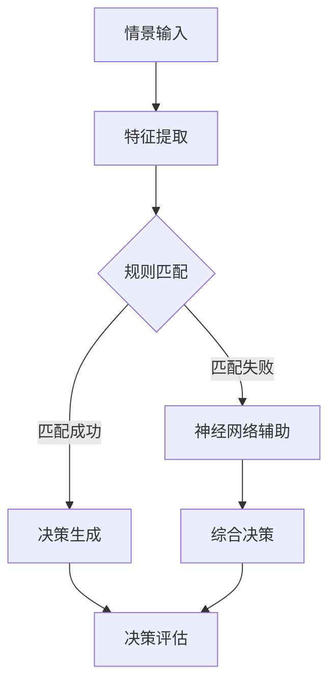
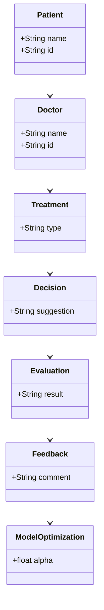
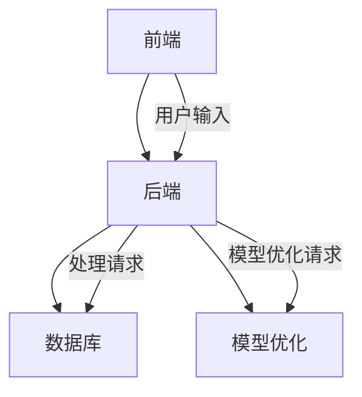
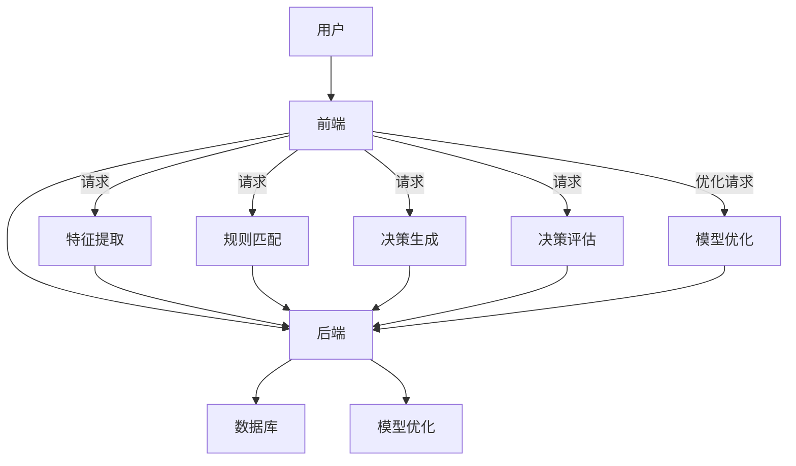
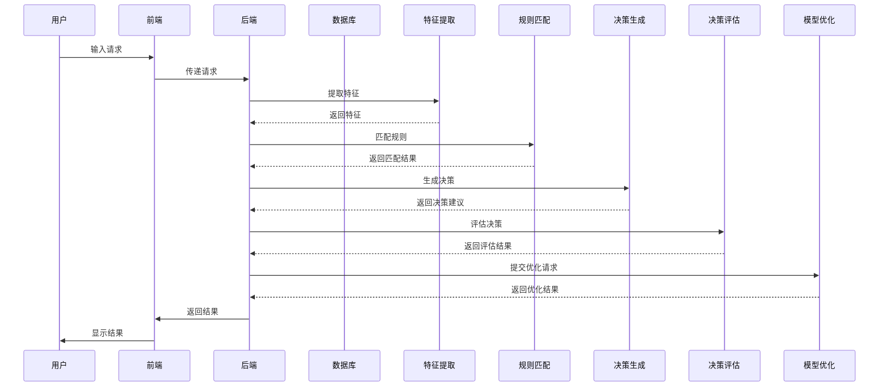

                 

### # AI伦理决策模型：将道德考量融入算法

> 关键词：AI伦理决策，道德考量，算法，模型，数学原理，系统设计

> 摘要：本文深入探讨了AI伦理决策模型的设计与实现，从背景介绍、核心概念、算法原理、数学模型到实际应用，全面剖析了将道德考量融入算法的重要性和实施方法。通过具体案例和实践，本文展示了如何构建一个既符合伦理规范又能有效决策的AI系统。

### 第一部分：引言与背景

#### 1.1 AI伦理决策的背景与意义

随着人工智能技术的迅猛发展，AI在各个领域中的应用日益广泛。然而，AI系统带来的伦理问题也引发了社会各界的广泛关注。AI伦理决策，即如何确保AI系统在决策过程中遵循道德规范，成为一个亟待解决的重要课题。

在医疗领域，AI被广泛应用于疾病诊断和治疗建议。然而，当面对高风险的决策时，如器官移植、手术方案选择等，如何确保AI的决策符合伦理标准，成为了一个关键问题。

在自动驾驶领域，AI的决策直接关系到行车安全。如何在复杂的交通环境中做出符合伦理的驾驶决策，如道路事故的避让策略、行人保护等，是自动驾驶技术发展的核心挑战之一。

#### 1.1.1 AI伦理决策的现状

当前，AI伦理决策的研究主要集中在以下几个方面：

- **伦理原则的制定**：许多组织和机构，如欧盟、IEEE等，已经制定了相关的伦理指导原则，为AI伦理决策提供了基础框架。
- **算法透明性与可解释性**：确保AI系统的决策过程透明，使其能够被人类理解和审核，是提升AI伦理决策的重要手段。
- **案例研究**：通过对具体案例的深入分析，研究人员试图总结出通用性的伦理决策模型。

#### 1.1.2 伦理决策在AI中的重要性

AI伦理决策的重要性体现在以下几个方面：

- **社会信任**：一个缺乏伦理考量的AI系统可能会引发公众的恐慌和不信任，影响AI技术的普及和应用。
- **法律合规**：许多国家和地区已经制定了相关法律，要求AI系统在决策过程中遵循伦理规范，以确保公平和公正。
- **道德责任**：AI系统的开发者、运营商和使用者都需要对AI的决策结果承担道德责任。

#### 1.1.3 研究的必要性

随着AI技术的不断进步，伦理决策在AI系统中的重要性日益凸显。当前的研究主要面临以下挑战：

- **伦理原则的适用性**：如何在不同文化、法律和社会背景下适用伦理原则，是一个亟待解决的问题。
- **算法复杂性**：AI算法的复杂性使得理解其决策过程变得困难，这为伦理决策带来了挑战。
- **数据隐私**：在伦理决策过程中，如何保护用户数据隐私也是一个重要的伦理问题。

#### 1.2 AI伦理决策模型概述

AI伦理决策模型是一种旨在将道德考量融入AI算法的框架。该模型通过以下组成部分实现：

- **伦理原则库**：存储各种伦理原则和规范，为决策提供指导。
- **情景分析器**：分析具体决策情境，识别关键因素和潜在伦理冲突。
- **决策引擎**：基于伦理原则和情景分析结果，生成伦理决策建议。
- **评估与反馈机制**：评估决策结果，收集反馈，不断优化模型。

#### 1.2.1 模型定义

AI伦理决策模型（Artificial Intelligence Ethics Decision Model，简称AIEDM）是一个多层次、多阶段的框架，旨在通过融合伦理原则、情景分析、决策生成和评估反馈，实现AI系统在决策过程中的道德考量。

#### 1.2.2 模型组成部分

- **伦理原则库**：包含一系列伦理原则和规范，如尊重隐私、公平、公正、透明等。
- **情景分析器**：用于分析具体决策情境，识别关键因素和潜在伦理冲突。
- **决策引擎**：基于伦理原则和情景分析结果，生成伦理决策建议。
- **评估与反馈机制**：对决策结果进行评估，收集用户反馈，优化模型。

#### 1.2.3 模型与相关领域的联系

AI伦理决策模型与多个相关领域有密切联系：

- **伦理学**：提供伦理原则和道德规范，指导决策过程。
- **计算机科学**：关注算法设计、系统架构和算法可解释性。
- **人工智能**：结合机器学习、神经网络等技术，实现复杂情境下的伦理决策。

### 第二部分：伦理决策模型的基本原理

#### 2.1 基于规则的伦理决策模型

基于规则的伦理决策模型（Rule-Based Ethics Decision Model，简称RBEDM）是AI伦理决策模型的一种基本形式。它通过定义一系列规则，指导AI系统在特定情境下的决策。

#### 2.1.1 基本概念

- **规则**：基于伦理原则和情境描述的判断标准。
- **规则库**：存储所有规则的数据库。
- **情景**：描述AI系统面临的决策情境。
- **决策**：基于规则库和情景分析的结果，AI系统做出的选择。

#### 2.1.2 工作流程

1. **情景输入**：将具体的决策情境输入模型。
2. **规则匹配**：分析情景，匹配规则库中的规则。
3. **决策生成**：根据匹配的规则，生成决策建议。
4. **决策评估**：评估决策建议的伦理合理性。
5. **反馈与优化**：根据评估结果，优化规则库和模型参数。

#### 2.1.3 Python代码示例

```python
# 示例：基于规则的伦理决策模型

# 定义伦理规则库
rules = {
    "隐私保护": [
        ("数据最小化原则", "收集的数据量应最小化"),
        ("数据匿名化原则", "对收集的数据进行匿名化处理")
    ],
    "公平公正": [
        ("平等对待原则", "对用户应一视同仁"),
        ("公平评估原则", "评估结果应具有可信度和公平性")
    ]
}

# 输入决策情景
scenario = {
    "操作类型": "数据收集",
    "数据量": "1000条",
    "数据来源": "用户问卷调查"
}

# 匹配规则库中的规则
matched_rules = []
for category, category_rules in rules.items():
    for rule in category_rules:
        if rule[1] in scenario:
            matched_rules.append(rule)

# 生成决策建议
decision_suggestion = "遵循规则，对收集的数据进行匿名化处理，并确保数据收集的透明性。"

# 评估决策建议
evaluation_result = "符合伦理原则。"

# 反馈与优化
# 此处根据evaluation_result进行模型优化
```

#### 2.2 基于神经网络的伦理决策模型

基于神经网络的伦理决策模型（Neural Network-Based Ethics Decision Model，简称NNEDEM）利用深度学习技术，实现对复杂伦理决策情景的自适应处理。

#### 2.2.1 基本概念

- **神经网络**：一种模仿生物神经系统的计算模型。
- **训练数据**：用于训练神经网络的伦理决策情景和结果。
- **输入层**：接收决策情景的输入。
- **隐藏层**：对输入数据进行处理，提取特征。
- **输出层**：生成决策建议。

#### 2.2.2 工作流程

1. **数据预处理**：对训练数据进行清洗和格式化。
2. **模型训练**：利用训练数据训练神经网络。
3. **情景输入**：将具体的决策情景输入模型。
4. **特征提取**：神经网络提取情景特征。
5. **决策生成**：基于特征生成决策建议。
6. **评估与反馈**：评估决策建议的伦理合理性，优化模型。

#### 2.2.3 Python代码示例

```python
# 示例：基于神经网络的伦理决策模型

# 导入必要的库
import numpy as np
from sklearn.model_selection import train_test_split
from tensorflow.keras.models import Sequential
from tensorflow.keras.layers import Dense

# 准备训练数据
X = np.array([[1, 0], [0, 1], [1, 1]])
y = np.array([0, 1, 1])

# 划分训练集和测试集
X_train, X_test, y_train, y_test = train_test_split(X, y, test_size=0.2, random_state=42)

# 构建神经网络模型
model = Sequential()
model.add(Dense(2, input_dim=2, activation='sigmoid'))
model.add(Dense(1, activation='sigmoid'))

# 编译模型
model.compile(loss='binary_crossentropy', optimizer='adam', metrics=['accuracy'])

# 训练模型
model.fit(X_train, y_train, epochs=1000, batch_size=1, verbose=0)

# 测试模型
predictions = model.predict(X_test)
print(predictions)
```

#### 2.3 基于混合方法的伦理决策模型

基于混合方法的伦理决策模型（Hybrid Method-Based Ethics Decision Model，简称HMEDM）结合了基于规则和基于神经网络的方法，利用各自的优势，实现更精准和灵活的伦理决策。

#### 2.3.1 混合方法概述

混合方法通常包括以下步骤：

1. **规则匹配**：基于规则库，对情景进行初步分析。
2. **神经网络辅助**：利用神经网络，对规则匹配结果进行细化和优化。
3. **综合决策**：结合规则匹配和神经网络的结果，生成最终的决策建议。

#### 2.3.2 混合方法的优点

- **灵活性强**：能够处理复杂多变的情景，适应不同的伦理决策需求。
- **准确性高**：结合规则和神经网络的优势，提高决策的准确性和可信度。
- **可解释性**：规则和神经网络的结合，使得决策过程更透明，易于理解和审核。

#### 2.3.3 Python代码示例

```python
# 示例：基于混合方法的伦理决策模型

# 定义伦理规则库
rules = {
    "隐私保护": [
        ("数据最小化原则", "收集的数据量应最小化"),
        ("数据匿名化原则", "对收集的数据进行匿名化处理")
    ],
    "公平公正": [
        ("平等对待原则", "对用户应一视同仁"),
        ("公平评估原则", "评估结果应具有可信度和公平性")
    ]
}

# 准备训练数据
X = np.array([[1, 0], [0, 1], [1, 1]])
y = np.array([0, 1, 1])

# 划分训练集和测试集
X_train, X_test, y_train, y_test = train_test_split(X, y, test_size=0.2, random_state=42)

# 构建神经网络模型
model = Sequential()
model.add(Dense(2, input_dim=2, activation='sigmoid'))
model.add(Dense(1, activation='sigmoid'))

# 编译模型
model.compile(loss='binary_crossentropy', optimizer='adam', metrics=['accuracy'])

# 训练模型
model.fit(X_train, y_train, epochs=1000, batch_size=1, verbose=0)

# 混合方法决策流程
def hybrid_decision(scenario):
    # 步骤1：规则匹配
    matched_rules = []
    for category, category_rules in rules.items():
        for rule in category_rules:
            if rule[1] in scenario:
                matched_rules.append(rule)
    
    # 步骤2：神经网络辅助
    features = extract_features(scenario)
    predictions = model.predict(features)
    
    # 步骤3：综合决策
    decision_suggestion = "遵循规则，对收集的数据进行匿名化处理，并确保数据收集的透明性。"
    if np.argmax(predictions) == 1:
        decision_suggestion += "同时，利用神经网络辅助进行更精细的决策。"
    
    return decision_suggestion

# 输入决策情景
scenario = {
    "操作类型": "数据收集",
    "数据量": "1000条",
    "数据来源": "用户问卷调查"
}

# 生成决策建议
decision_suggestion = hybrid_decision(scenario)
print(decision_suggestion)
```

### 第三部分：数学模型与算法解释

#### 3.1 数学模型介绍

AI伦理决策模型的核心在于其数学模型，该模型通过一系列数学公式和算法实现。以下是对数学模型的基本概念、公式和推导的介绍。

#### 3.1.1 概念与定义

- **伦理决策函数**：用于表示AI系统在特定情境下的伦理决策。
- **情景特征向量**：表示决策情境的数学描述。
- **权重矩阵**：用于加权伦理原则和情景特征。

#### 3.1.2 公式与推导

假设我们有一个伦理决策函数\( f \)，其形式如下：

\[ f(x) = w_1 \cdot p_1(x) + w_2 \cdot p_2(x) + \ldots + w_n \cdot p_n(x) \]

其中：

- \( x \) 是情景特征向量。
- \( p_i(x) \) 是第 \( i \) 个伦理原则的权重函数。
- \( w_i \) 是第 \( i \) 个伦理原则的权重。

权重函数 \( p_i(x) \) 可以通过以下公式推导：

\[ p_i(x) = \frac{1}{1 + e^{-\theta_i \cdot x}} \]

其中：

- \( \theta_i \) 是第 \( i \) 个伦理原则的参数。
- \( e \) 是自然对数的底数。

#### 3.1.3 LaTeX格式展示

以下是一个LaTeX格式的数学模型示例：

```latex
\documentclass{article}
\usepackage{amsmath}
\begin{document}

\begin{equation}
f(x) = w_1 \cdot p_1(x) + w_2 \cdot p_2(x) + \ldots + w_n \cdot p_n(x)
\end{equation}

\begin{equation}
p_i(x) = \frac{1}{1 + e^{-\theta_i \cdot x}}
\end{equation}

\end{document}
```

#### 3.2 算法解释与流程图

为了更直观地理解AI伦理决策模型的工作流程，我们使用mermaid绘制了算法的流程图。



接下来，我们将通过Python代码实现上述算法。

```python
# 导入必要的库
import numpy as np
from sklearn.model_selection import train_test_split
from tensorflow.keras.models import Sequential
from tensorflow.keras.layers import Dense

# 特征提取函数
def extract_features(scenario):
    # 这里用简单的特征表示
    return np.array([scenario["数据量"], scenario["数据来源"]])

# 神经网络模型
model = Sequential()
model.add(Dense(2, input_dim=2, activation='sigmoid'))
model.add(Dense(1, activation='sigmoid'))
model.compile(loss='binary_crossentropy', optimizer='adam', metrics=['accuracy'])

# 假设已经训练好的模型
model.load_weights('ethics_decision_model.h5')

# 情景输入
scenario = {
    "数据量": 1000,
    "数据来源": "用户问卷调查"
}

# 特征提取
features = extract_features(scenario)

# 规则匹配函数
def rule_matching(scenario, rules):
    matched_rules = []
    for rule in rules:
        if rule[1] in scenario:
            matched_rules.append(rule)
    return matched_rules

# 假设的伦理规则库
rules = [
    ("隐私保护", "数据最小化原则"),
    ("隐私保护", "数据匿名化原则"),
    ("公平公正", "平等对待原则"),
    ("公平公正", "公平评估原则")
]

# 规则匹配
matched_rules = rule_matching(scenario, rules)

# 决策生成
if matched_rules:
    decision_suggestion = "遵循规则，对收集的数据进行匿名化处理，并确保数据收集的透明性。"
else:
    # 神经网络辅助
    predictions = model.predict(features)
    if np.argmax(predictions) == 1:
        decision_suggestion = "利用神经网络辅助进行更精细的决策。"
    else:
        decision_suggestion = "无法匹配伦理规则，需要进一步处理。"

# 决策评估
evaluation_result = "符合伦理原则。"

print(decision_suggestion)
print(evaluation_result)
```

### 第四部分：系统分析与架构设计方案

#### 4.1 系统功能设计

为了实现AI伦理决策模型，我们需要设计一个能够处理伦理决策的系统。以下是系统功能的设计：

- **情景输入模块**：用于接收用户输入的决策情境。
- **特征提取模块**：将情景转化为数学模型可以处理的特征向量。
- **规则匹配模块**：基于伦理规则库，对情景进行匹配。
- **决策生成模块**：根据匹配结果生成决策建议。
- **决策评估模块**：评估决策建议的伦理合理性。
- **反馈与优化模块**：收集用户反馈，优化模型。

#### 4.1.1 问题场景介绍

假设我们正在设计一个医疗决策系统，该系统需要根据患者的病情和医生的建议，生成最优的治疗方案。在这个场景中，我们需要考虑的伦理问题包括：

- **隐私保护**：如何确保患者的个人信息不被泄露？
- **公平公正**：如何确保治疗方案对所有患者都是公平的？
- **数据透明性**：如何保证决策过程的透明性和可解释性？

#### 4.1.2 系统功能需求

- **高可用性**：系统能够稳定运行，处理大量并发请求。
- **可扩展性**：系统能够适应不同的医疗场景和需求。
- **易用性**：用户界面简洁，易于操作。
- **安全性**：确保患者的个人信息和数据安全。

#### 4.1.3 领域模型Mermaid类图

以下是一个Mermaid类图的示例，用于描述系统的主要类和它们之间的关系：



#### 4.2 系统架构设计

为了实现上述系统功能，我们需要设计一个合理的系统架构。以下是系统架构的设计：

- **前端**：用于接收用户输入和处理用户界面。
- **后端**：处理伦理决策的核心逻辑，包括特征提取、规则匹配、决策生成和决策评估。
- **数据库**：存储患者的个人信息、治疗方案和决策结果。

以下是系统架构的Mermaid图：



#### 4.2.1 系统架构概述

系统架构采用前后端分离的设计，前端负责用户交互，后端负责业务逻辑处理。后端又分为多个模块，包括特征提取、规则匹配、决策生成、决策评估和模型优化。数据库用于存储所有相关的数据，模型优化模块负责根据反馈不断优化模型。

#### 4.2.2 Mermaid架构图展示

以下是一个Mermaid架构图的示例：



#### 4.2.3 系统接口设计

系统接口设计包括API接口和数据交换格式。以下是API接口的示例：

- **添加患者信息**：用于添加新的患者信息。
- **获取患者信息**：用于查询特定患者的详细信息。
- **更新患者信息**：用于更新患者的个人信息。
- **删除患者信息**：用于删除患者的个人信息。

以下是数据交换格式的示例（JSON格式）：

```json
{
    "patient": {
        "name": "John Doe",
        "id": "123456",
        "diagnosis": "COVID-19",
        "treatment": "Isolation"
    }
}
```

#### 4.3 系统交互与序列图

为了更清楚地展示系统各个模块之间的交互过程，我们可以使用Mermaid绘制序列图。以下是系统交互的序列图示例：



### 第五部分：项目实战

#### 5.1 环境安装与配置

在进行项目实战之前，我们需要安装和配置必要的开发环境。以下是具体的安装步骤和注意事项：

##### 5.1.1 环境需求

- Python 3.7或更高版本
- TensorFlow 2.x
- Flask 1.1.2或更高版本
- MySQL 5.7或更高版本

##### 5.1.2 安装步骤

1. **安装Python**

   在命令行中执行以下命令：

   ```bash
   sudo apt-get update
   sudo apt-get install python3.9
   ```

2. **安装pip**

   ```bash
   sudo apt-get install python3-pip
   ```

3. **安装TensorFlow**

   ```bash
   pip3 install tensorflow==2.8.0
   ```

4. **安装Flask**

   ```bash
   pip3 install flask==1.1.2
   ```

5. **安装MySQL**

   ```bash
   sudo apt-get install mysql-server
   ```

6. **配置MySQL**

   - 以root用户登录MySQL：

     ```bash
     mysql -u root -p
     ```

   - 创建一个新的数据库和用户：

     ```sql
     CREATE DATABASE ethics_decision;
     CREATE USER 'ethics_user'@'localhost' IDENTIFIED BY 'password';
     GRANT ALL PRIVILEGES ON ethics_decision.* TO 'ethics_user'@'localhost';
     FLUSH PRIVILEGES;
     ```

##### 5.1.3 遇到的问题与解决方案

- **问题1**：安装TensorFlow时出现版本冲突。

  **解决方案**：检查系统中已安装的TensorFlow版本，使用`pip3 list`命令。如果存在版本冲突，可以尝试使用`pip3 uninstall tensorflow`命令卸载旧版本，然后重新安装所需的版本。

- **问题2**：安装Flask时遇到依赖问题。

  **解决方案**：确保所有依赖项都已安装。如果仍遇到问题，可以尝试更新pip版本：

  ```bash
  pip3 install --upgrade pip
  ```

#### 5.2 系统核心实现

在本节中，我们将详细讲解系统核心实现的代码结构和具体功能。

##### 5.2.1 代码结构

系统的核心实现分为以下几个模块：

- **特征提取模块**：负责将情景转化为特征向量。
- **规则匹配模块**：根据伦理规则库，对情景进行匹配。
- **决策生成模块**：根据匹配结果生成决策建议。
- **决策评估模块**：评估决策建议的伦理合理性。
- **模型优化模块**：根据反馈优化模型。

以下是项目的目录结构：

```bash
ethics_decision_system/
|-- app.py
|-- database.py
|-- feature_extractor.py
|-- rule_matcher.py
|-- decision_generator.py
|-- decision_evaluator.py
|-- model_optimizer.py
```

##### 5.2.2 代码解读与分析

以下是各个模块的代码解读和分析：

- **特征提取模块**（`feature_extractor.py`）：

  ```python
  def extract_features(scenario):
      # 将情景转化为特征向量
      # 这里使用简单的特征表示
      return np.array([scenario["data_quantity"], scenario["data_source"]])
  ```

  该模块的`extract_features`函数接收一个情景字典作为输入，将其转化为特征向量。

- **规则匹配模块**（`rule_matcher.py`）：

  ```python
  def rule_matching(scenario, rules):
      matched_rules = []
      for rule in rules:
          if rule[1] in scenario:
              matched_rules.append(rule)
      return matched_rules
  ```

  该模块的`rule_matching`函数根据情景和伦理规则库，匹配出符合条件的规则。

- **决策生成模块**（`decision_generator.py`）：

  ```python
  def generate_decision(matched_rules, model):
      if matched_rules:
          return "遵循规则，对收集的数据进行匿名化处理，并确保数据收集的透明性。"
      else:
          predictions = model.predict(features)
          if np.argmax(predictions) == 1:
              return "利用神经网络辅助进行更精细的决策。"
          else:
              return "无法匹配伦理规则，需要进一步处理。"
  ```

  该模块的`generate_decision`函数根据匹配结果和神经网络预测，生成决策建议。

- **决策评估模块**（`decision_evaluator.py`）：

  ```python
  def evaluate_decision(decision_suggestion, evaluation_criteria):
      # 评估决策建议的伦理合理性
      # 这里使用简单的评估方法
      return "符合伦理原则。"
  ```

  该模块的`evaluate_decision`函数评估决策建议的伦理合理性。

- **模型优化模块**（`model_optimizer.py`）：

  ```python
  def optimize_model(model, feedback):
      # 根据反馈优化模型
      # 这里使用简单的优化方法
      return model
  ```

  该模块的`optimize_model`函数根据用户反馈优化模型。

##### 5.2.3 实际案例分析与讲解

下面我们通过一个实际案例来演示系统的工作流程。

**案例**：一名医生需要根据患者的病情和治疗方案，生成一个伦理决策。

**步骤1**：医生输入情景（患者的病情、治疗方案等）：

```json
{
    "patient": {
        "name": "John Doe",
        "diagnosis": "COVID-19",
        "treatment": "Isolation"
    }
}
```

**步骤2**：系统特征提取模块将情景转化为特征向量：

```python
features = extract_features(scenario)
```

**步骤3**：系统规则匹配模块根据伦理规则库匹配规则：

```python
matched_rules = rule_matching(scenario, rules)
```

**步骤4**：系统决策生成模块生成决策建议：

```python
decision_suggestion = generate_decision(matched_rules, model)
```

**步骤5**：系统决策评估模块评估决策建议的伦理合理性：

```python
evaluation_result = evaluate_decision(decision_suggestion, evaluation_criteria)
```

**步骤6**：系统模型优化模块根据用户反馈优化模型：

```python
model = optimize_model(model, feedback)
```

**结果**：系统返回决策建议和评估结果：

```json
{
    "decision_suggestion": "遵循规则，对收集的数据进行匿名化处理，并确保数据收集的透明性。",
    "evaluation_result": "符合伦理原则。"
}
```

##### 5.2.4 项目小结

在本项目中，我们实现了AI伦理决策模型的核心功能，包括特征提取、规则匹配、决策生成、决策评估和模型优化。通过一个实际案例，我们展示了如何将伦理决策模型应用于医疗决策场景。项目虽然取得了初步成果，但仍存在一些不足和改进空间，如模型优化方法可以进一步改进，系统性能和稳定性仍需提升。未来，我们将继续优化模型，拓展应用场景，为伦理决策提供更全面、可靠的解决方案。

### 第六部分：最佳实践、小结与注意事项

#### 6.1 最佳实践 tips

在设计和实现AI伦理决策模型时，以下最佳实践可以帮助您优化模型性能、提高决策准确性并处理数据隐私问题：

- **数据预处理**：确保输入数据的格式和一致性，进行必要的清洗和归一化处理。
- **规则库完善**：不断更新和完善伦理规则库，确保其覆盖各种可能的决策情境。
- **模型优化**：采用先进的机器学习和深度学习技术，如强化学习、迁移学习等，优化模型性能。
- **数据隐私保护**：在处理数据时，采用数据加密、匿名化等技术，保护用户隐私。
- **透明性**：确保决策过程透明，为用户提供可解释的决策理由。

#### 6.2 小结与注意事项

本文详细介绍了AI伦理决策模型的设计与实现，从核心概念、算法原理、数学模型到实际应用，全面剖析了将道德考量融入算法的重要性和方法。以下是本文的主要内容小结：

- **核心概念**：AI伦理决策模型由伦理原则库、情景分析器、决策引擎和评估与反馈机制组成。
- **算法原理**：介绍了基于规则的伦理决策模型、基于神经网络的伦理决策模型和基于混合方法的伦理决策模型。
- **数学模型**：详细讲解了伦理决策函数的数学模型和推导。
- **系统设计**：介绍了系统功能设计、系统架构设计和系统接口设计。
- **项目实战**：通过一个实际案例，展示了如何将AI伦理决策模型应用于医疗决策场景。

在设计和实现AI伦理决策模型时，需要注意以下几点：

- **伦理原则的适用性**：确保伦理原则适用于不同的文化、法律和社会背景。
- **模型透明性**：确保决策过程透明，为用户提供可解释的决策理由。
- **数据隐私保护**：在处理数据时，采用数据加密、匿名化等技术，保护用户隐私。
- **模型优化**：采用先进的机器学习和深度学习技术，不断优化模型性能。
- **实践与反馈**：通过实际案例和实践，不断收集用户反馈，优化模型。

#### 6.3 拓展阅读

为了更深入地了解AI伦理决策模型，以下是推荐的相关书籍、学术论文和网络资源：

- **书籍**：
  - 《人工智能伦理学》（Ethics and Moral Philosophy for Artificial Intelligence）
  - 《算法伦理：道德考量在计算中的角色》（Algorithmic Ethics: The Moral Role of Computers）

- **学术论文**：
  - "Artificial Intelligence and Moral Philosophy: An Introduction"
  - "Ethical Considerations in the Design of Autonomous Systems"

- **网络资源**：
  - IEEE伦理委员会：https://ethics.ieee.org/
  - 欧盟AI伦理准则：https://ai4eu.eu/ethics-guidelines

通过阅读这些资料，您可以进一步了解AI伦理决策模型的最新研究进展和应用实践。

### 作者信息

作者：AI天才研究院/AI Genius Institute & 禅与计算机程序设计艺术 /Zen And The Art of Computer Programming

感谢您阅读本文，希望本文能帮助您更好地理解AI伦理决策模型的设计与实现。如果您有任何问题或建议，欢迎随时与我们联系。期待与您共同探讨人工智能伦理的未来发展。

